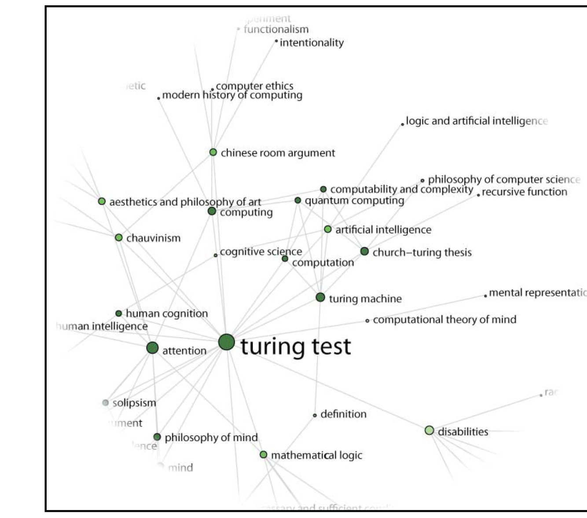

**Colin Allen, Jaimie Murdock, Cameron Buckner, Scott Weingart**
*Indiana University*

For most philosophers the acronym API probably means little. But APIs, or Application Programming Interfaces, are among the most powerful of programming aids, helping to make computers the ubiquitous tools that they have become. APIs allow programmers to focus on the *what* of computing rather than the *how*. So, for instance, it is an API that allows programmers to tell your computer's operating system to respond to a mouse click by opening a "window" on the screen, without those programmers having to worry about the graphics needed to produce a rectangle of a certain size, border, color, etc. Similarly, programmers can exploit a database on another server through an API, without having to know anything about the underlying database model on the remote server. APIs streamline and centralize routine tasks, give power to application programmers by allowing them to stand on the shoulders of others.

The number of digital philosophy applications is growing. The most widely used example is, of course, the Stanford Encyclopedia of Philosophy (SEP). But other digital projects such as PhilPapers have also made significant inroads into the work habits of philosophers. Other projects, including Noesis, the Internet Encyclopedia of Philosophy, the philosophy-related areas of the Wikipedia, and our own Indiana Philosophy Ontology (InPhO) are also offering increased access to philosophical content online. Yet, to date these projects remain relatively isolated, linking only to each other each by their idiosyncratic, home-grown means, as for instance when an SEP article is added to the PhilPapers database, or when InPhO provides links in a web page to a Noesis search or an SEP entry.

Even philosophers who aren't programmers should care about the ad hoc nature of this integration among applications because so much of our time is taken up by the need to manually transfer information collected and organized in one context in order to apply it in another. A bibliographic citation in PhilPapers, for example, doesn't tell you which entries in the SEP refer to it, and the search process requires manually cutting and pasting from one to the other.

At the Indiana Philosophy Ontology project (http://inpho.cogs.indiana.edu/), we are pursuing a vision of seamless integration among all digital philosophy applications, and with the release of our API this month we are taking a big step towards realizing that vision. The InPhO is a dynamically constructed and maintained digital representation of the discipline of philosophy. Our approach starts with the SEP—which, at over 1,200 articles and 13 million words, is beyond any one person's specific capacity to comprehend it all—and it leverages the knowledge of domain experts using machine reasoning. We begin with a small amount of manual ontology construction obtained through collaboration with domain experts. A lexicon is established from SEP article titles, Wikipedia philosophy categories, analysis of the vocabulary within the corpus, and ad hoc additions by the InPhO curators. We then build on this framework using an iterative three-step process of data mining of the SEP, feedback collection from experts (primarily the SEP authors themselves), and machine reasoning about this feedback to populate and enrich our representation of philosophy (see Niepert et al., 2008; Buckner et al. 2010 for details). This resulting representation can then be used to generate tools to assist the authors, editors, and browsers of the SEP, with tools such as a cross-reference generation engine and context-aware semantic search.

**Figure 1.** Part of the related ideas network in the neighborhood of "Turing test."

<!-- page 21 -->

Until recently we had focused our interfaces entirely on HTML for human users. But the InPhO website now provides a simple, lightweight API capable of serving a wide variety of data representations. To implement this in a consistent, easy-to-use interface for both humanities scholars and web developers we adopted the REpresentational State Transfer (REST) paradigm of web services (Fielding et al. 1999). This API utilizes one of the most prevalent technologies—the HTTP protocol—to enable ease of use by scholars, programmers, and scientists through nearly any interface. Each instance in the InPhO knowledge base is exposed as a resource with a unique URI. One advantage of the approach is that it has both a human face and a machine face—the InPhO data can be explored via human-friendly HTML, or in a machine-friendly JSON format, and they can be switched between with the simple expedient of adding either .html or .json to the unique URI of each resource. (Actually, the HTML format is the current default, so it can be omitted.) You are invited to explore the API at http://inpho.cogs.indiana.edu/doc/examples.html.

The power of the approach can be illustrated by example. If interested in philosophical discussion of ideas related to the Turing test a person could look at http://inpho.cogs.indiana.edu/idea/1039/related and follow the links given there. A program (or programmer) can access that same information in a structured way simply by tacking the extension '.json' to the end of the previous URL. Each item in that set of results contains already its list of related ideas, making it relatively easy to build a visual representation of the network of terms involved (e.g., Figure 1).

The original services offered by the InPhO website have now been recoded against our own API which will greatly simplify their maintenance and development in the coming years, as well as enabling us to increase the pace at which new tools can be prototyped and released. These are some tools already in the pipeline:

* An interface that will go beyond the existing "Related Entries" sections of SEP entries, providing an expanded list of suggestions for related topics.
* An interface that will give users access to the bibliographic content of the SEP, to manage collections of bibliographic items, to find these in other philosophical resources online such as PhilPapers, and to export such collections for use in programs such as BibTeX and EndNote, or as preformatted text suitable for import to a paper.
* Access to various alternative ways to visualize the networks of concepts and thinkers represented in the SEP.
* A service that will analyze author-submitted documents and their associated citation lists to suggest other items that the author might want to read.

## References

Buckner, C., Niepert, M., and Allen, C. Forthcoming 2010. From encyclopedia to ontology: toward dynamic representation of the discipline of philosophy. *Synthese*. Online first at http://dx.doi.org/10.1007/s11229-009-9659-9

Niepert, M., Buckner, C. and Allen, C. 2008. Answer set programming on expert feedback to populate and extend dynamic ontologies. In *Proceedings of 21st FLAIRS*. 500-505. AAAI Press.

<!-- page 22 -->
