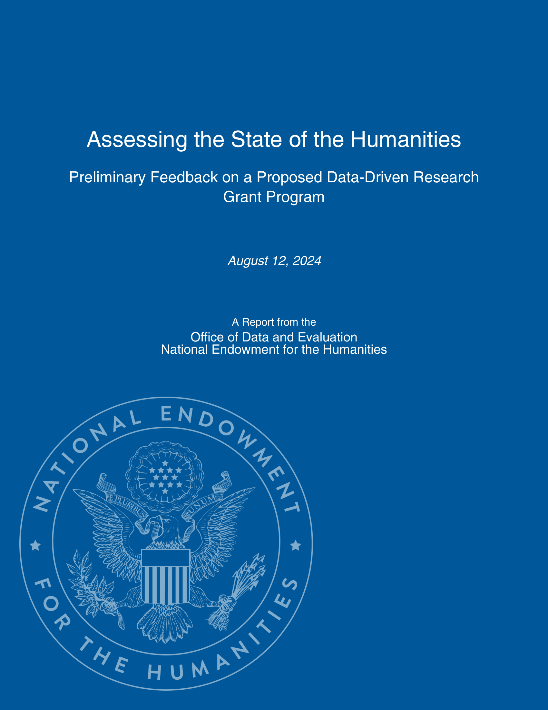

**Preliminary Feedback on a Proposed Data-Driven Research Grant Program**

*August 12, 2024*

A Report from the  
Office of Data and Evaluation  
National Endowment for the Humanities

<!-- page cover -->

**Assessing the State of the Humanities**

**Preliminary Feedback on a Proposed Data-Driven Research Grant Program**

*August 12, 2024*

Office of Data and Evaluation  
National Endowment for the Humanities

<!-- page title -->

*Prepared by:*  
**Hannah Alpert-Abrams**, Senior Program Officer  
**Jessica Unger**, Program Analyst (Office of Challenge Programs)

*With support from:*  
**Scott B. Weingart**, Director  
**George Lazopoulos**, Senior Program Officer (Division of Public Programs)  
**Lutie Rodriguez**, Data Coordination and Enablement Officer  
**Benjamin Skinner**, Humanities Data Scientist

**Please direct all inquiries to:**  
Office of Data and Evaluation  
National Endowment for the Humanities  
400 7th Street, SW  
Washington, DC 20506  
*Email:* ode@neh.gov

<!-- page credits -->

## OVERVIEW

In 2023, NEH Chair Shelly Lowe (Navajo) approved a proposal from the agency’s new Office of Data and Evaluation (ODE) to develop a grant program that would fund data-driven research on the state of the humanities. This new program would support studies investigating the value, impact, and well-being of the humanities in the United States. This type of grant program would produce data for humanities practitioners—as well as funders and policymakers—who aim to identify priorities in the field and make the case for the value of the humanities.

In shaping this program, the ODE team reached out to the humanities community broadly to better understand areas of interest, the needs of the field, and what types of funding models may work best. This report summarizes the feedback provided by a variety of individuals on funding needs, possible program themes and priorities, and potential activities and outputs.

## METHODS

Preliminary research for the program involved three stages: a review of the funding landscape, a public call for comments, and conversations with constituent community members. Each component of this research provided valuable insights into the needs of the field.

ODE staff began their research by identifying related work previously supported by NEH, as well as similar funding opportunities offered by peer federal funders.

After the preliminary review of the funding landscape, ODE posted a public call for comments in November 2023, which received 133 unique responses. To conform with Paperwork Reduction Act regulations, the form allowed for unstructured and voluntary feedback only. ODE staff manually coded the open-ended responses to produce a quantifiable summary of results. Following the public call for comments, ODE then circulated an open-ended questionnaire with NEH staff to gather additional input.

Finally, ODE spoke with nine individuals or teams with an interest in the proposed grant program (either as applicants or those who could benefit from the results of this type of program). ODE sought out constituent communities in the following areas: staff at national organizations that study or support humanistic work; humanities scholars invested in research and higher education; social scientists with experience conducting related research in the arts and sciences; and humanists working in one or more of NEH’s priority areas (climate change, minority-serving institutions, tribal communities and organizations, and the U.S. territories). ODE staff held conversations with selected constituent community members in January and February of 2024, primarily in the form of 45-minute semi-structured video calls.

By reviewing the funding landscape, soliciting feedback from the public through the call for comments, and carrying out constituent community member conversations, the ODE team was able to gain a clearer understanding of how to maximize the impact of the proposed grant program.

## REVIEW OF THE FUNDING LANDSCAPE

Over the past decade, NEH has funded research into the state or impact of the humanities through Chair’s Grants and cooperative agreements that support convenings, research studies, and outreach initiatives. These efforts have typically been focused on a single facet of a larger topic (see Appendix A, Related NEH Awards).

<!-- page 1 -->

Other federal funders have used a variety of funding mechanisms to support research into closely related fields. NEH’s proposed program was inspired by the National Endowment for the Arts’ *Research Grants in the Arts*, which funds individual researchers and teams aiming to investigate “the value and/or impact of the arts.” NEA also supports *Research Labs*, a program that supports transdisciplinary research teams who are exploring one of NEA’s priority research topics; of note, awardees to this program may seek up to four subsequent renewal awards.

The U.S. Department of Education funds education research, development, and evaluation activities primarily (but not exclusively) through its Institute of Education Sciences, which supports programs like Education Research Grants.

The National Science Foundation funds research primarily related to education and diversity in STEM. Through its National Center for Science and Engineering Statistics, NSF also explores statistical data relating to STEM research, education, and the workforce (see Appendix B, Related Grant Programs and Initiatives).

## SUMMARY OF EXTERNAL FEEDBACK

The input provided during the research process shed light on the funding needs of the field, the potential program themes and priorities, and the program activities and outputs.

### Funding Needs

Four funding needs emerged from the call for comments, staff questionnaire, and constituent community discussions: pilot studies or exploratory research, large-scale and longitudinal studies, analysis of existing data, and training and toolkits for capacity building. Each of these needs is discussed below.

#### PILOT STUDIES OR EXPLORATORY RESEARCH

Pilot studies or exploratory research help initiate conversations and introduce new questions or approaches that have the potential to expand into larger projects. This was the preferred outcome for one constituent community member, who saw this grant program as an opportunity to move the conversation forward quickly and build a community of practice. Another constituent community member agreed, adding that humanities organizations don’t typically have capacity for larger scale studies. However, these projects can be higher risk and lower impact than more established projects.

#### LARGE-SCALE AND LONGITUDINAL STUDIES

Large-scale and longitudinal studies have the advantage of providing meaningful data about change over time. For example, a study might examine enrollment trends over a five-year period, or analyze post-grad career outcomes over the same length of time. Several respondents noted that a competitive grant program may not be the most effective way to support these larger projects.

The public call for comments invited respondents who had a project in mind to estimate the required period of performance and cost, with a recommended maximum of five years and $500,000.

<!-- page 2 -->

While those envisioning projects of one to three years had a wide range of budget requests, respondents with large projects of more than three years typically requested amounts near the top of the funding range, highlighting the investment required for studies of this kind.

While large-scale and longitudinal studies were considered a priority by some, several respondents noted that these projects might be better supported through cooperative agreements in collaboration with ODE.

#### ANALYSIS OF EXISTING DATA

Some funders offer programs to support analysis of a specific, preexisting data set. These programs increase the value of high-cost data collection projects and stimulate research in specific areas. Analysis of existing data is a lower-cost approach to supporting large-scale studies. While few of ODE’s respondents or constituent community members expressed specific interest in this approach, it is being used by other funders.

#### TRAINING AND TOOLKITS FOR CAPACITY BUILDING

Several constituent community members expressed a strong preference for funding that would build the capacity of humanities organizations to measure their own impact. This was particularly true for those who work with small and mid-sized organizations, including those from minoritized communities. One constituent community member suggested that perhaps the state humanities councils, with NEH support, could provide local assistance and training for evaluation of humanities programs.

### Program Themes and Priorities

Several priority research areas emerged from the public call for comments, which ODE staff sorted into the following themes, in order of popularity among respondents:

- **Humanities impact:** Research on the impact of the humanities on health, quality of life, democracy and civic life, economy and class mobility, and rural and urban communities. (87 percent of respondents)
- **Humanities education:** Research on the humanities in K–12, higher education, and adult education. (69 percent of respondents)
- **Humanities careers:** Research on humanities professions and career outcomes for humanities students across multiple metrics. (22 percent of respondents)
- **Humanities and other disciplines:** Research on the relationship between the humanities and STEM, medicine, the arts, and other sectors, professions, or research disciplines. (16 percent of respondents)
- **Humanities funding and infrastructure:** Research on public and private funding and infrastructure for humanities organizations, including grant funding, state allocations, and budgets. (10 percent of respondents)
- **Public interest in or perception of the humanities:** Research on how the public understands or interprets the humanities and what the public wants the humanities to be. (7 percent of respondents)

<!-- page 3 -->

- **History:** Research on the history of humanities education and infrastructure. (1 percent of respondents)

Constituent community members named several additional priority areas: climate change, equity, community and grassroots humanities, humanities and innovation, analog and digital humanities, and preservation of humanities materials.

### Program Activities and Outputs

There was general agreement among respondents and constituent community members that activities such as data collection, cleaning, analysis, and dissemination should be supported through a potential grant program. Meetings and convenings, community or partnership building, and capacity building to do impact and assessment work were also mentioned.

Among possible outputs, public data sets and scholarly publications were of primary interest for all respondents. One constituent community member was particularly interested in data on the humanities that could be disaggregated by race, ethnicity, and other markers, for use in their research. Another constituent community member mentioned a particular interest in scholarly studies that could provide a rigorous backdrop for writing and speaking about the humanities.

Several constituent community members, and many members of the public, showed a particular interest in data visualization and reporting that could be easily understood by nonacademic readers, such as humanities practitioners, journalists, policymakers, and the general public. In fact, 15 respondents in the call for comments specifically emphasized the need for outputs that go beyond a narrow research audience.

## KEY TAKEAWAYS

There is enthusiasm for–and urgency around–a funding opportunity that would support investigations into the value and impact of the humanities.

In the short term, a program that offered small or mid-sized awards to support pilot studies or exploratory research would be effective and meet many of the needs of the community. Large-scale and longitudinal studies are also needed, and widespread interest in this research area among funders may introduce opportunities for collaboration in the coming years.

Small and mid-sized humanities organizations need capacity building in the evaluation of humanities programs, however supporting this type of work may require another funding mechanism.

An investment in research may necessitate an investment in infrastructure as well. Constituent community members mentioned three types of infrastructure that could increase the value of the grant program: a data hub that would allow researchers to share and find results; support for communicating research outcomes to the general public; and support for establishing a community of practice.

The process of conducting research for this grant program has proven to be incredibly instructive for ODE staff. Research into the funding landscape helped to provide context for how this type of work has historically been supported. The insights provided by the respondents to the call for the comments and the identified constituent community members have helped to chart a course for a new program that can meet the pressing needs of the field.

<!-- page 4 -->

A new data-driven research program at NEH presents an opportunity to provide the type of information needed by humanities practitioners, and ODE staff are grateful that members of the humanities community were so generous in sharing their thoughts.

<!-- page 5 -->

## APPENDIX A: RELATED NEH AWARDS

| Fiscal Year | Grant Number | Recipient | Project Title |
|---|---|---|---|
| 2011 | [BN-50001-11](https://apps.neh.gov/publicquery/AwardDetail.aspx?gn=BN-50001-11) | American Academy of Arts and Sciences | “American Academy/NEH Partnership for the Humanities Indicators.” |
| 2013 | [BN-50002-13](https://apps.neh.gov/publicquery/AwardDetail.aspx?gn=BN-50002-13) | American Academy of Arts and Sciences | “American Academy/NEH Partnership for the Humanities Indicators.”. |
| 2015 | [BN-230198-15](https://apps.neh.gov/publicquery/AwardDetail.aspx?gn=BN-230198-15) | American Academy of Arts and Sciences | “American Academy/NEH Partnership for the Humanities Indicators.”. |
| 2015 | [SP-234014-15](https://apps.neh.gov/publicquery/AwardDetail.aspx?gn=SP-234014-15) | Federation of State Humanities Councils | “CDP and State Humanities Councils pilot project.” |
| 2016 | [AH-254362-16](https://apps.neh.gov/publicquery/AwardDetail.aspx?gn=AH-254362-16) | Modern Language Association | “2016 Fall Enrollments in Languages other that English in the United States Institutions for Higher Education.” |
| 2016 | [AH-253080-16](https://apps.neh.gov/publicquery/AwardDetail.aspx?gn=AH-253080-16) | National Academy of Sciences | “National Academy of Sciences Study of Humanities, Arts, and STEM Integrated Education.” |
| 2016 | [AH-251607-16](https://apps.neh.gov/publicquery/AwardDetail.aspx?gn=AH-251607-16) | Council of Independent Colleges | “Securing America’s Future: The Power of Liberal Arts Education.” |
| 2016 | [GA-254296-16](https://apps.neh.gov/publicquery/AwardDetail.aspx?gn=GA-254296-16) | St. Louis Art Museum | “St. Louis Humanities Education Collaborative.” |
| 2017 | [BN-255478-17](https://apps.neh.gov/publicquery/AwardDetail.aspx?gn=BN-255478-17) | American Academy of Arts and Sciences | “American Academy/NEH Partnership for the Humanities Indicators.” |
| 2017 | [AH-256392-17](https://apps.neh.gov/publicquery/AwardDetail.aspx?gn=AH-256392-17) | Association of American Medical Colleges | “The Humanities and the Arts for Future Physicians: Phase I.” |
| 2017 | [AH-255573-17](https://apps.neh.gov/publicquery/AwardDetail.aspx?gn=AH-255573-17) | Henry M. Jackson Foundation for the Advancement of Military Medicine | “The Veterans Metrics Initiative: Linking Program Components to Post-Military Well-Being.” |
| 2017 | [HC-256402-17](https://apps.neh.gov/publicquery/AwardDetail.aspx?gn=HC-256402-17) | DePauw University | “The Value of Ethics and Moral Reasoning in Business.” |
| 2017 | [GA-255823-17](https://apps.neh.gov/publicquery/AwardDetail.aspx?gn=GA-255823-17) | Association of Children’s Museums | “The Transformational Power of Children’s Museums: True or False.” |
| 2018 | [SP-264396-18](https://apps.neh.gov/publicquery/AwardDetail.aspx?gn=SP-264396-18) | Federation of State Humanities Councils | “Capacity Building for State Humanities Councils: Planning Grant.” |
| 2019 | [AH-266283-19](https://apps.neh.gov/publicquery/AwardDetail.aspx?gn=AH-266283-19) | National Academy of Sciences | “National Academies of Sciences Study Dissemination Proposal.” |
| 2019 | [AH-268665-19](https://apps.neh.gov/publicquery/AwardDetail.aspx?gn=AH-266283-19) | Association of American Medical Colleges | “The Fundamental Role of the Humanities and Arts in Medical Education.” |
| 2019 | [AH-269621-19](https://apps.neh.gov/publicquery/AwardDetail.aspx?gn=AH-269621-19) | iCivics, Inc. | “Educating for American Democracy: A Roadmap for Excellence in History and Civics Education for All Learners.” |

<!-- page A1 -->

| Fiscal Year | Grant Number | Recipient | Project Title |
|---|---|---|---|
| 2020 | [PB-271362-20](https://apps.neh.gov/publicquery/AwardDetail.aspx?gn=PB-271362-20) | Foundation for Advancement in Conservation | “Held in Trust: A National Convening on Conservation and Preservation.” |
| 2020 | [RJ-272563-20](https://apps.neh.gov/publicquery/AwardDetail.aspx?gn=RJ-272563-20) | Council of Graduate Schools | “Expanding Definitions of Scholarship in the Humanities.” |
| 2021 | [GA-281059-21](https://apps.neh.gov/publicquery/AwardDetail.aspx?gn=GA-281059-21) | Indiana University, Bloomington | “Exploring the Essential Linkage Between the Humanities and Cultural Affairs.” |
| 2023 | [RJ-297241-23](https://apps.neh.gov/publicquery/AwardDetail.aspx?gn=RJ-297241-23) | American Council of Learned Societies | “Collaboration and Coordination in Funding for the Humanities.” |

<!-- page A2 -->

## APPENDIX B: RELATED GRANT PROGRAMS AND INITIATIVES

| Funder | Program Name | Amount | Period of Performance | About |
|---|---|---|---|---|
| National Endowment for the Arts | [National Endowment for the Arts Research Awards](https://www.arts.gov/grants/research-awards) | $20,000 - $100,000, with required 1:1 matching funds | Up to three years | NEA’s Research Grants in the Arts fund “research studies that investigate the value and/or impact of the arts, either as individual components of the U.S. arts ecosystem or as they interact with each other and/or with other domains of American life.” |
| National Endowment for the Arts | [National Endowment for the Arts Research Labs](https://www.arts.gov/initiatives/nea-research-labs) | $100,000 - $150,000 with required 1:1 matching funds, renewable up to four times | Up to three years, renewable | NEA’s Research Labs are “a national program that permits transdisciplinary research teams, grounded in the social and behavioral sciences, to engage with the Arts Endowment’s five-year research agenda.” |
| Department of Education Institute of Education Sciences | [Education and Special Education Research Grants](https://ies.ed.gov/funding/ncer_progs.asp) | Up to $4,000,000 | Up to five years | This grant supports “programs of research that focus on outcomes that differ by education level” across many topics that change each year, including STEM education. |
| National Science Foundation | [NSF Advance: Organizational Change for Gender Equity in STEM Academic Professions](https://new.nsf.gov/funding/opportunities/advance-organizational-change-gender-equity-stem) | Up to $1,000,000 | Up to five years | “The NSF ADVANCE program provides grants to enhance the systemic factors that support equity and inclusion and to mitigate the systemic factors that create inequities in the academic profession and workplaces.” |

<!-- page B1 -->

| Funder | Program Name | Amount | Period of Performance | About |
|---|---|---|---|---|
| National Science Foundation National Center for Science and Engineering Statistics | [NCSES Broad Agency Announcement](https://www.ncses.nsf.gov/about/funding-opportunities) | Up to $500,000 | 24 months | “The Broad Agency Announcement (BAA) provides research opportunities primarily to U.S. institutions of higher education and their collaborators to conduct a variety of research projects that support the strategic objectives of NCSES and partner federal statistical agencies.” |
| National Science Foundation National Center for Science and Engineering Statistics | [NCSES Research on the Science and Technology Enterprise: Indicators, Statistics, and Methods](https://new.nsf.gov/funding/opportunities/research-science-technology-enterprise-indicators) | $1,500,000 total for 5-10 grants, with a maximum of $15,000 for dissertation research | 12 months for dissertation projects | The program supports “research, conferences, and studies to advance the understanding of the S&T enterprise and encourage development of methods that will improve the quality of (NCSES) data.” |

<!-- page B2 -->

<!-- page back-cover -->
