CARNEGIE MELLON UNIVERSITY LIBRARIES

*Whitepaper on successes and failures in computer vision for visual digital collections*

**Julia Corrin¹,², Emily Davis¹,², Matt Lincoln¹,³, & Scott Weingart¹,³**
(*author order alphabetical*)

¹ Carnegie Mellon University Libraries
² Carnegie Mellon University Archives
³ Carnegie Mellon University Library Lab

DOI: 10.1184/R1/12791807

https://github.com/cmu-lib/campi

<!-- page 1 -->

## Table of contents

- 1. Executive Summary — 3
- 2. Background and Motivation — 4
- 3. CMU Archives General Photograph Collection — 5
  - 3.1. Digitization Efforts — 6
  - 3.2. Why this collection? — 6
  - 3.3. Collection Contents — 7
  - 3.3.1. Photographic Prints — 7
  - 3.3.2. 35mm Negatives — 7
  - 3.3.3. Born Digital — 7
- 4. Tasks, Methods, and Results — 8
  - 4.1. Visual Search — 8
  - 4.1.1. Methodology — 8
  - 4.1.2. Results — 13
  - 4.2. Duplicate / Close Match Detection — 13
  - 4.2.1. Methodology — 13
  - 4.2.2. Results — 17
  - 4.3. Similarity-Driven Tagging — 18
  - 4.3.1. Methodology — 18
  - 4.3.2. Results — 23
  - 4.4. Google Computer Vision Labeling — 25
- 5. Discussion — 28
  - 5.1. Implications for Photo Archives Management and Description — 28
  - 5.1.1. Availability of a DAMS — 28
  - 5.1.2. Appraisal and De-Duplication of Born Digital Photography — 28
  - 5.1.3. Computer Vision for Access and Reference — 29
  - 5.1.4. Implications for Tag-Based Description — 30
  - Vocabularies and Tag Selection — 30
  - Non-Specialist Description — 30
  - 5.1.5. Syncing Description — 30
  - 5.2. Implications for User Interface Design — 30
  - 5.3. Implications for Computer Vision Research in Photo Archives: Shortfalls and Future Research Opportunities — 31
- 6. Conclusion — 34
- Appendix 1. High-Level System Architecture — 35
  - A1.1 Core collections information infrastructure — 36
  - A1.2. Computer Vision Pipeline Infrastructure — 36
- Appendix 2. CAMPI Implementation Details — 38

<!-- page 2 -->

## 1. Executive Summary

In the summer of 2020, CAMPI (the Computer-Aided Metadata Generation for Photo archives Initiative) assessed the use of computer vision (CV) in assisting in the arduous task of processing digital photograph collections. The prototype built to find duplicates and tag photos depicting similar scenes in Carnegie Mellon University Archives’ General Photograph Collection was successful, proving such an interface would be both feasible and useful for cultural heritage institutions with large visual collections. We found that computer vision by itself, or even with non-expert human guidance, would actively impede the public use of a photo archive. Mistakes, failures to understand and surface important or salient features of a collection, and a lack of moral judgement would ultimately cause more harm than good. When computer vision is tightly integrated with a digital archival collection management system, however, expert archivists and editors can strategically leverage machine learning models without making the collection beholden to them. The result yields a faster, more extensive, and more integrative approach to photo processing than is commonly available.

Expert-in-the-loop machine learning for back-end cultural heritage collection processing is an underexplored niche, and our prototype offers a unique and impactful next step in this area. With sufficient resources, we believe an interface of this sort could and should be implemented as a standard processing layer in digital asset management systems.

### Key Findings

- Supporting a fully-featured Digital Asset Management System (DAMS) that connects collection-level metadata to individual photographs and allows easy browsing of existing images and metadata is a crucial prerequisite to any computer-vision-related project in this domain.

- While generic automated image description performs poorly in the context of historical photo archives, combining generic visual search with existing collections metadata can greatly speed the item-level description work carried out by archivists and metadata experts.

- There is a field-wide need for specialized computer vision training sets based on historical, non-born-digital photograph collections. Interfaces such as this prototype can play an essential role in developing those human-tagged datasets that will power advances in both machine learning research as well as discovery and access in libraries, archives, and museums.

- User interface design for computer-vision-assisted metadata generation systems is just as important, if not more so, than creating ever-more advanced machine learning algorithms.

<!-- page 3 -->

## 2. Background and Motivation

Archives have long struggled with the need to provide detailed description of large, diverse, multi-format collections. This descriptive work is often resource-intensive and frequently impracticable. The development of the “more product, less process” (MPLP) model for processing collections attempted to address this by focusing on aggregate description of archival materials.[^1] Archives have made similar efforts in regards to digitizing collections at scale. These attempts—including those made by Carnegie Mellon—have focused on providing access to a large amount of digitized material with minimal description, focusing instead on tools like OCR for access to text-heavy items.

Unfortunately, these models for addressing the resource imbalance inherent in archives are poorly suited to image collections. Image collections, by their nature, require item-level description for effective access in an online environment and our existing forms of automation are incapable of extracting descriptive information from digitized photographic archives.[^2]

This problem is growing, commensurate with the size of photographic archives. Older photographic collections, which were typically the focus of early digital archive projects, are limited in size and scope by format. While fewer early photographs survive due to the realities of time, fewer photographs were taken to begin with due to technological limitations. As the cost of photography has lessened over time, particularly with the advent of digital photography, the size of photographic collections is ballooning at a rapid pace. Documentation of an event or performance was once limited to a handful of photographs. If negatives are available, it might run to 36 images. With digital photography, archives now receive hundreds of images from an individual event.

As collections grow, so does the need to develop ways to automate not only the description of photographic archives, but also their appraisal and preservation. The size of yearly photographic transfers from campus marketing departments can now stretch into thousands of images and terabytes of data. This rate of growth is not sustainable for many archives, who do not have the budget to maintain that much data in perpetuity. There is also no need for most archives to maintain photographic collections of this size and scope. These transfers are full of repetitive images and near duplicates. They cover events and activities to an extent not needed for documentary purposes. However, appraisal of these transfers must either be done blindly, with no actual assessment of the quality of the photographs maintained, done manually, which is labor-intensive and likely not sustainable, or not done at all.

Recent efforts in computer vision for content tagging of digitized visual collections have focused on trying to get computer vision systems to automatically tag large collections at the item level. These projects may take one of two paths, each being sides of the same coin. For example, UCLA has experimented with generating and evaluating tags for portions of its historical photo archives assigned by generic computer vision models or services offered by Google, Amazon, Clarifai and the like.[^3] Others have developed customized CV models to automatically classify very large troves of images into a handful of domain-specific categories, such as the Library of Congress’ recent work <!-- page 4 --> with their digitized newspaper collections to segment and classify different types of images in scans of newsprint pages.[^4]

[^1]: Mark Greene and Dennis Meissner, “More Product, Less Process: Revamping Traditional Archival Processing,” The American Archivist, August 24, 2007, https://doi.org/10.17723/aarc.68.2.c741823776k65863.

[^2]: It is possible to extract descriptive metadata from “born-digital” photographs, but it is often incomplete or non-existent.

[^3]: Joshua Gomez et al., “Experimenting with a Machine Generated Annotations Pipeline,” The Code4Lib Journal, no. 48 (May 11, 2020), https://journal.code4lib.org/articles/15209.

As an alternative (or complement) to classifying images into discrete categories with computer vision systems, libraries, museums, and archives have also used computer vision to good effect in sorting images of their collections by visual similarity to aid user discovery. The Barnes Foundation has integrated several types of visual similarity search into their online collection interface, putting computational notions of visual similarity into conversation with Albert Barnes’ idiosyncratic organization of his art collection into visually-connected ensembles.[^5] Likewise, a team of CMU and University of Pittsburgh researchers developed an experimental interface for navigating the collections of the National Gallery of Art based on visual similarity as well, allowing the user to hop from one artwork to its nearest visually-similar neighbors in a way very different from how a visitor would walk through galleries organized into distinct periods and cultures.[^6]

Digitized visual collections, particularly photo archives, present challenges that aren’t fully addressed by either of these approaches. The effort needed to create fully (or near-fully) automated tagging is only feasible and justifiable for large collections where the categories to be tagged appear frequently enough for there to be enough training data (such as differentiating between photographs, maps, and charts in the Library of Congress newspaper collection). However, archival photo collections frequently need layers of domain-specific vocabularies that may not exist in generic, pre-trained computer vision offerings, and important, but highly-specific labels whose occurrence in that collection is so low that it is impractical to try to train a custom model.

Using computer vision to power discovery based on visual similarity offers a compelling interface for users to visually “surf” a collection that lacks rich textual metadata, but this too has drawbacks. Without some effort to add textual metadata to these digitized visual collections, it remains impossible to use a controlled vocabulary term found in a different, non-visual collection and retrieve relevant materials from the untagged photo archive. Relying wholly on visual search would prevent the photo archive from integrating into the larger collections data ecosystem of that repository. And a visual-only approach also presents manifest accessibility issues to users who rely on screen-readers to interpret textual metadata.

But what if we took a hybrid approach, leveraging visual search not solely for public discovery, but as a prosthesis for archivists and metadata editors to more quickly find relevant and related photographs when creating content? What combinations of computer vision technology and user interface could center collection-specific expertise while streamlining the task of encoding that expertise into textual metadata?

## 3. CMU Archives General Photograph Collection

The General Photograph Collection (GPC) is a massive treasure trove of images that document the history of Carnegie Mellon University. Comprising roughly one million images, nearly every aspect of campus life since the founding of the university in 1900 can be found in the collection – from commencements, sporting events, and <!-- page 5 --> faculty portraits, to classroom candids, buggy races, and the fence. The collection also provides rich visual evidence of all the remarkable changes the university has undergone over the past twelve decades.

[^4]: Benjamin Charles Germain Lee et al., “The Newspaper Navigator Dataset: Extracting And Analyzing Visual Content from 16 Million Historic Newspaper Pages in Chronicling America,” ArXiv:2005.01583 [Cs], May 4, 2020, http://arxiv.org/abs/2005.01583.

[^5]: Shelley Bernstein, “Computer Vision so Good.,” Barnes Foundation Medium Blog (blog), August 23, 2017, https://medium.com/barnes-foundation/computer-vision-so-good-3f4162a35d3f.

[^6]: Matthew D. Lincoln et al., “National Neighbors: Distant Viewing the National Gallery of Art’s Collection of Collections,” November 2019, https://nga-neighbors.library.cmu.edu.

The collection consists of photographic prints, negatives, glass plate negatives, digital images on CDs, and 172GB of born-digital files. The vast majority of the photographs were taken by university staff photographers, who continue to take photos of life at CMU to this day.

As the most popular collection in the University Archives, photographs from the GPC are used frequently by faculty and students in their research and publications. Marketing, advancement and the University alumni offices also use images from the collection to promote the university and celebrate the achievements of students, faculty and schools.

Until recently, the bulk of the collection consisted of photographic prints obtained from a variety of sources. Later transfers from Carnegie Mellon’s office of Marketing and Communications have focused on negatives and born-digital photographs. As explained in more detail below, these accessions have maintained the original order developed by campus photographers and arranged chronologically and described at the “job” level, using the job codes and descriptive information collected by the photographers.

### 3.1. Digitization Efforts

To date, a little over 20,000 images have been digitized by the University Archives, equaling roughly 633 GB of TIFF files. Digitization is primarily driven by requests. Without a formal system or DAMS in place to manage the digitized images, there is some duplication.[^7] The organization of the digital files was inherited from the physical media and separated by the format of the original image.

### 3.2. Why this collection?

The GPC was a good collection for this project because:

1. ~20,000 digitized images provided a significant, but not overwhelming amount of material to work with in a prototype project

2. Pre-existing metadata provided at least some hierarchy to the photographs

3. It is the most used collection in the University Archives

4. Managing the digitized images posed several challenges to the archivists

CMU Archives have been unable to provide broad public access to the collection in the past due to limitations of our current DAMS.[^8] When originally acquired, the DAMS was designed primarily for textual documents and did not support JPEGs. Because of this selection, we have not prioritized digitization and description of photographs for ingest into that system. This generated a substantial backlog of photographs that had been digitized in response to <!-- page 6 --> reference requests, exhibitions, and other projects, but never described at the item level or stored anywhere other than a shared network drive.

[^7]: Duplication occurred for several reasons: 1) Both a print and a negative of the same image could have been digitized. 2) For a period of time there were no formal workflows in place for digitization and file naming. 3) Before digitization was a thing, archivists would create copy negatives of images and both the dupes and the original would be digitized.

[^8]: Knowvation by PTFS. http://www.ptfs.com/knowvation

### 3.3. Collection Contents

In general, the photographs and their digitized surrogates are organized by format. For the purposes of this project, we decided to focus on three groupings: photographic prints, 35mm negatives, and born digital images that were being stored on a portion of the University Archives server.

#### 3.3.1. Photographic Prints

There are roughly 35 linear feet (or 35 banker boxes) of photographic prints in the collection. These prints were obtained from a variety of sources and span from 1900 through roughly 2006. Many of these prints came to the archives with no additional metadata, and most have no date information attached. This portion of the collection was processed and arranged by subject terms such as “Athletics”, “Buildings”, “Campus Views”, “People”, “Student Activities”, and “University Offices and Programs”. Larger topical terms such as “Buildings” are organized into further subgroups for specific buildings. New accruals were frequently interfiled over time. Copy prints made from the collection for display or preservation were also interfiled.

As prints were digitized, the digital surrogates were organized into the same topical terms and subgroups on the server. The arrangement and subject terms of the photographic prints informed the project Directories.

#### 3.3.2. 35mm Negatives

One of the largest groupings of the collection is the estimated five-hundred-thousand 35mm negatives. The negatives, which span from 1959 to 2007, are organized chronologically by the date they were taken and inventoried with a job code number that corresponds to a log book that was maintained by the staff photographers. Each entry in the log book contains the date the photograph was taken, a very brief description of the subject, and a job code or unique identifier, for each shoot, which could have between 24-36 images.

As negatives were digitized, scans are organized in chronological order by the year. The job codes and frame numbers became the filename. For the project, images were grouped by the year and then by the job code, which included the brief subject descriptions from the log books.

#### 3.3.3. Born Digital

Beginning in the early 2000s university staff photographers began to shift to a digital workflow. While the vast majority of the born digital images are on CDs, 172GB have been copied to the server. ISO images were created for each CD, and then individual photographs were extracted. The born digital images are organized by year and then by the job code. For the project, we only used TIFF files. All JPG images were excluded. Born digital images were grouped in the directories along with the photographic prints. <!-- page 7 -->

## 4. Tasks, Methods, and Results

After brainstorming many possibilities that included both back-end metadata generation cases as well as potential new discovery interfaces for public users, we scoped our project to examine computer-vision and UI interventions to address three interlinked problems specifically facing our archivists and metadata editors on the back-end during metadata creation and editing:

1. Visual similarity search to aid archivists when fulfilling research requests or trying to locate materials

2. Duplicate or close-match detection to reduce repeated metadata generation and remove noise from the eventual public discovery interface

3. Leveraging similarity search to streamline tagging photos from a controlled vocabulary of concepts, events, and locations customized to the GPC

We tackled these problems in order, as each depended on the one prior: identifying close matches requires an effective way to measure image similarity; and streamlining metadata creation would benefit from having already identified sets of closely-matched photographs that could all inherit the same metadata with one click.[^9]

While we were pursuing these tasks, we also experimented with Google’s Cloud Vision API which offers automated image description, face detection, and object and text recognition within photographs.

### 4.1. Visual Search

How do we find relevant images when we don't know what terms to search for, or if photos may not even have any metadata attached? Visual search, or reverse image search, takes an image as a search query, and returns other images from the collection that share similar visual attributes.

#### 4.1.1. Methodology

While there are many ways to implement reverse image search, any system must do two things:

1. Digest every image in the collection into a set of computationally-tractable “features” (sometimes also referred to as “descriptors”) In practice, this is usually a long list of numbers describing positions in a multidimensional space.

2. Use some metric of similarity to retrieve images whose computed features are close to the features of a selected seed photo in that multidimensional space.

Computer vision projects in cultural heritage have used a variety of methods to create features and then calculate the similarity/dissimilarity of images based on those features. Early methods used customized feature generation algorithms that would generate a dictionary of patches of pixels with similar visual traits (e.g. one common “patch” that might appear in many different pictures in a collection might be a set of pixels showing a curved edge between a dark and a light section of an image). Having generated a dictionary of visual words, systems can then use algorithms for text-based information retrieval to retrieve similar “documents” (images). Researchers have <!-- page 8 --> used patch-based image descriptor systems with great success particularly in images of graphic arts such as woodblock prints.[^10]

[^9]: Screen recordings of each of these interfaces may be viewed at https://doi.org/10.1184/R1/13072652

Rather than continue to try to explicitly define ever-more complex dictionaries of visual words, more recent image search systems have relied on convolutional neural networks to generate their own complex features based on the multilayered interactions between different transformations of an image.[^11] Existing models such as InceptionV3[^12] and ResNet18[^13] are pre-trained on large sets of labeled photographs such as ImageNet.[^14] These models, with or without fine-tuning, are an effective foundation for clustering and searching through cultural heritage image collections, such as clustering images extracted from historical newspapers.[^15] Most relevant to the General Photograph Collection, CMU researchers in partnership with the Carnegie Museum of Art successfully used features from InceptionV3 to effectively cluster and sort images from the Teenie Harris Archive, another photo archive of predominantly black and white 20th-century negatives.[^16]

We used the second-to-last pooled layer of the InceptionV3 trained neural network as the feature source for our system. For each image, this produced an array of 512 numbers, allowing us to treat the entire collection of images as a set of points in 512-dimensional space. (Figure 1) <!-- page 9 -->

[^10]: Giles Bergel et al., “Content-Based Image Recognition on Printed Broadside Ballads: The Bodleian Libraries’ Imagematch Tool,” 2013, http://library.ifla.org/id/eprint/209; Carl G. Stahmer, “Digital Analytical Bibliography: Ballad Sheet Forensics, Preservation, and the Digital Archive,” Huntington Library Quarterly 79, no. 2 (June 28, 2016): 263–78, https://doi.org/10.1353/hlq.2016.0011.

[^11]: A. Harley, “3D Visualization of a Convolutional Neural Network,” accessed November 22, 2019, https://www.cs.ryerson.ca/~aharley/vis/ provides an intuitive demonstration of how this feature generation works.

[^12]: Christian Szegedy et al., “Rethinking the Inception Architecture for Computer Vision,” ArXiv:1512.00567 [Cs], December 11, 2015, http://arxiv.org/abs/1512.00567

[^13]: Kaiming He et al., “Deep Residual Learning for Image Recognition,” ArXiv:1512.03385 [Cs], December 10, 2015, http://arxiv.org/abs/1512.03385.

[^14]: Jia Deng et al., “ImageNet: A Large-Scale Hierarchical Image Database,” IEEE Computer Vision and Pattern Recognition (CVPR), 2009, http://www.image-net.org/papers/imagenet_cvpr09.pdf.

[^15]: Lee et al.

[^16]: Zaria Howard, “Finding Patterns in the Content of Teenie Harris’s Photos (with Convolutional Neural Networks and Agglomerative Clustering),” April 8, 2017, https://zariahoward.github.io/TeenieHarris/ObjectDetection.html; for other machine learning experiments with this collection, see Dominique Luster et al., “Teenie Week of Play,” January 4, 2019, https://github.com/cmoa/teenie-week-of-play.

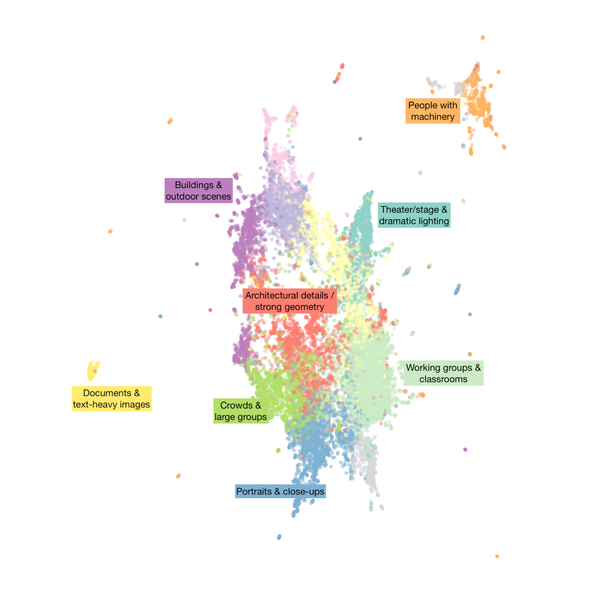

Figure 1: A visualization of the photographs from this collection in the 512-dimesional feature space produced by the InceptionV3 neural network. Points have been projected into two dimensional space using UMAP. Photos are colored based on automated k-means clustering[^17], and we have manually labeled a handful solely to give a general sense of how the feature space corresponds to different visual content & attributes of the photos—these categories and exact clusters are not part of our actual prototype.

[^17]: We arbitrarily split the data into 12 groups here only to give a general impression of how the feature space generated by the InceptionV3 network does effectively cluster similar photos closer together. This is only done for the purposes of illustration; the actual similarity search only relied on distance between points, not on the automated clustering shown in this visualization.

<!-- page 10 -->

Generating the image features from a pre-trained model is computationally-inexpensive compared to having to train / fine-tune the model itself, so we could create the features for all of our collection without needing specialized hardware. Feature generation only needs to be run once per image per model. It took under 1.5 hours to compute all the features for our ~21,000 images using a standard server with 8 conventional CPU cores.

We then used a fast implementation of an approximate nearest neighbor search algorithm to create an index of this feature space that we could efficiently query.[^18] The resulting system takes a seed photo id and the number of neighbors requested (*n*), and returns back *n* photo ids from the index. With a back-end system set up, we programmed a browsing interface faceted by the existing job and directory metadata associated with the photographs. (Figure 2) Editors could then use this browsing interface to select a seed photo for a visual similarity search. (Figure 3)

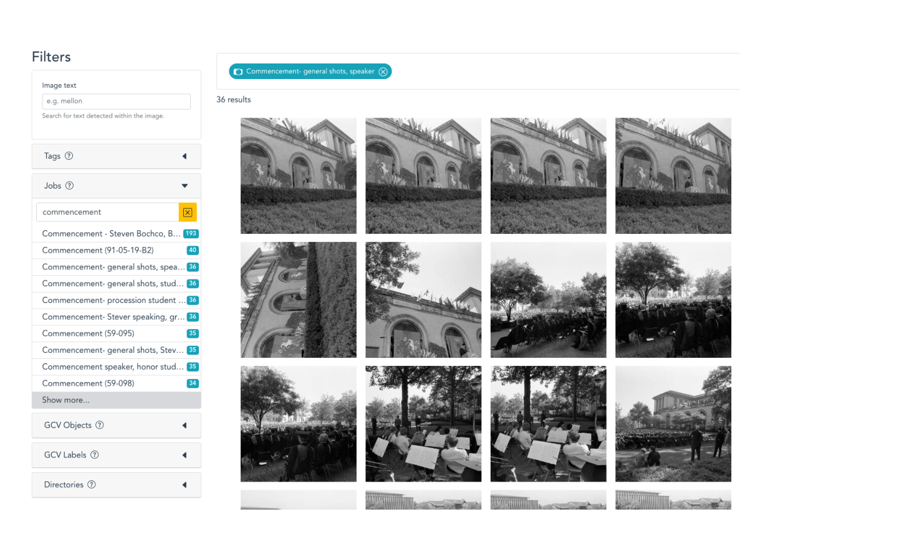

Figure 2. Faceted browsing interface showing photographs from an official CMU photographer job for the 1969 commencement ceremony

[^18]: Erik Bernhardsson, Annoy, C++ (2013; repr., Spotify, 2020), https://github.com/spotify/annoy. Approximate nearest neighbor search is a core data science task: how to accurately and quickly approximate the distance from one item in a very large collection to its closest neighbors when each item is described by a very large number of variables/dimensions, making it prohibitively expensive to pre-calculate every single pairwise distance between items. A key adjustable parameter in the Annoy implementation is the number of “trees” that the index-building algorithm should construct. The greater the number of trees, the more accurate the index is in approximating the actual distance between points, but the more memory-intensive (and slower) the index generation is (TODO ref tagging section where index building time becomes important). In our use case, with 512 dimensions and around 21,000 photographs, we found useful results with as low as 20 trees, and efficient results with as high as 50 trees. We used cosine distance as the metric.

<!-- page 11 -->

Figure 3. Similarity results interface, with the original seed photo followed by its nearest neighbors ranked by cosine distance from the seed photograph

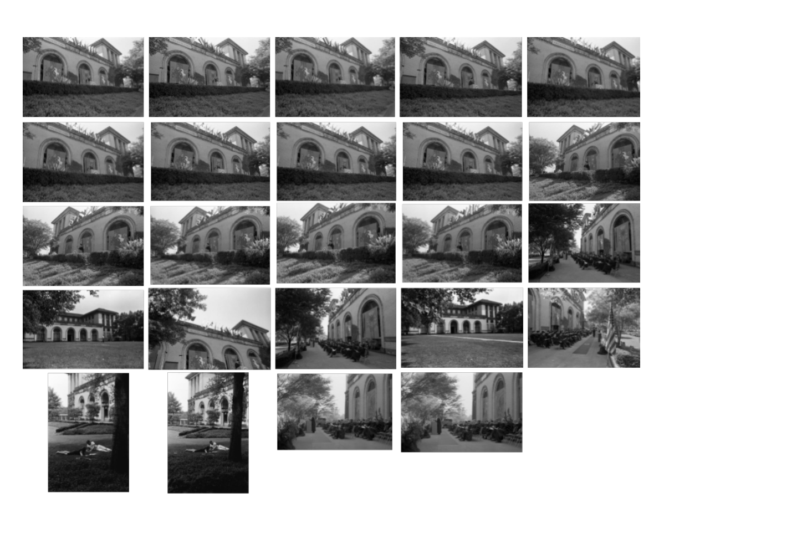

Figure 4. A montage of the resulting photographs from this search. Similarity search proved particularly effective at clustering buildings together—all these shots show different views of the College of Fine Arts, with many of the images coming from different parts of the collection outside the original job.

<!-- page 12 -->

#### 4.1.2. Results

While this initial visual search step was only a precursor to determine how suitable the image embeddings from InceptionV3 would be for the later duplicate detection and tagging tasks, our archivists almost immediately began using the basic search interface to answer real-world requests during the early weeks of the summer. In one case while looking for images of campus computing centers across the history of the institution, they used later images of computing centers that could already be found via textual metadata in order to locate earlier images that had not yet had textual metadata assigned to them, and were thus undiscoverable through the traditional browsing interface. They also used the interface to find relevant images to promote a summer webinar hosted by the School of Computer Science advancement department, and on multiple occasions used the visual search to pull up closely-related photos in order to identify preferred options for publications and reference inquiries.

### 4.2. Duplicate / Close Match Detection

As described above, the General Photograph Collection contains several types of closely-matching sets of photos, from exactly-duplicated files due to copies made on the digitization file server, to different digitization of the same photograph (including copy-negatives), and finally, sets of distinct photos that are virtually visually identical, such as long strings of shots taken in rapid succession by a photographer such as during a portrait session.

An ideal computational solution would cluster photographs based on the visual features extracted as described in the previous section. Rather than providing just one version of clusters for editors to either approve or reject, we needed to produce clusters with fuzzy boundaries that would allow editors to decide whether “borderline” photographs ought to be included in one match set or in another, particularly when the photos to be matched had more visual variation, such as with serial shots from a portrait sitting.

#### 4.2.1. Methodology

To do this, we implemented a multi-step solution based on using the DBSCAN algorithm to find sets of images densely clustered in the visual feature space.[^19]

1. The first pass used a low distance cutoff that produced smaller, more tightly-grouped sets of photos that looked more strictly similar to each other.

[^19]: Martin Ester, Hans-Peter Kriegel, and Xiaowei Xu, “A Density-Based Algorithm for Discovering Clusters in Large Spatial Databases with Noise,” in Proceedings of the 2nd International Conference on Knowledge Discovery and Data Mining (Portland: AAAI Press, 1996), 226–31, https://www.aaai.org/Papers/KDD/1996/KDD96-037.pdf as implemented by the Python package scikit-learn: Fabian Pedregosa et al., “Scikit-Learn: Machine Learning in Python,” Journal of Machine Learning Research 12, no. 85 (2011): 2825–30, http://jmlr.org/papers/v12/pedregosa11a.html.

<!-- page 13 -->

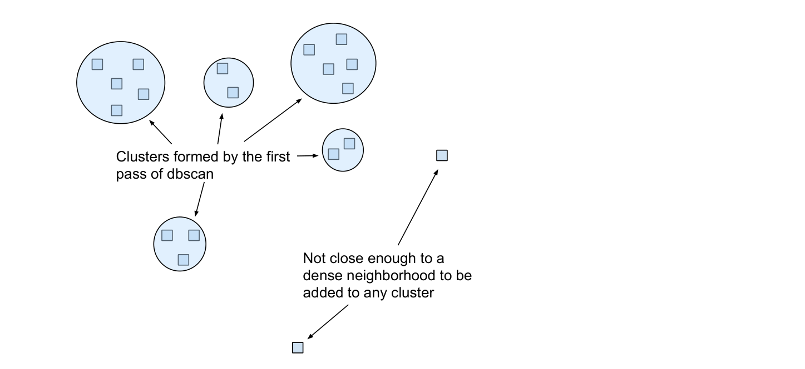

Figure 5.

2. The second pass had a slightly looser cutoff, which created a larger, more generalized set of clusters.

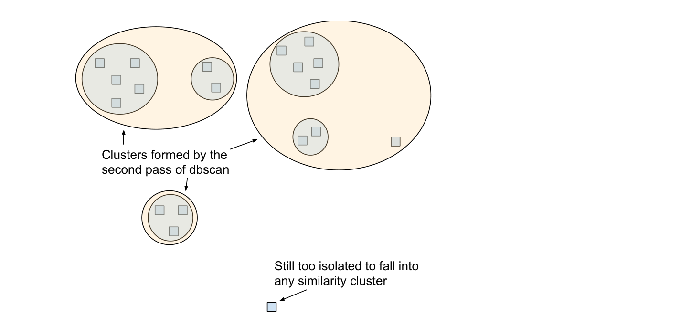

Figure 6.

3. We used the results from the first pass to produce the core photos of each of the candidate match sets that would be presented to the editors. To each of these candidate sets, we then added all of the photos from all the second-pass clusters that any of the core photos belonged to.

<!-- page 14 -->

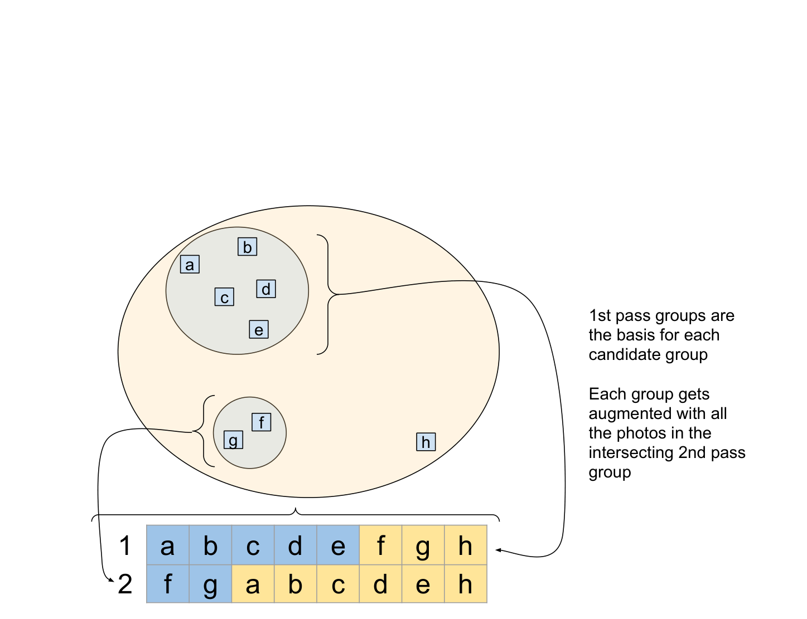

Figure 7.

4. As editors explicitly approve photos in a set, the system removes those photos from any other yet-to-be-reviewed set if they had been added during the second clustering pass, ensuring that each photo only ends up in one close match set, if any.

<!-- page 15 -->

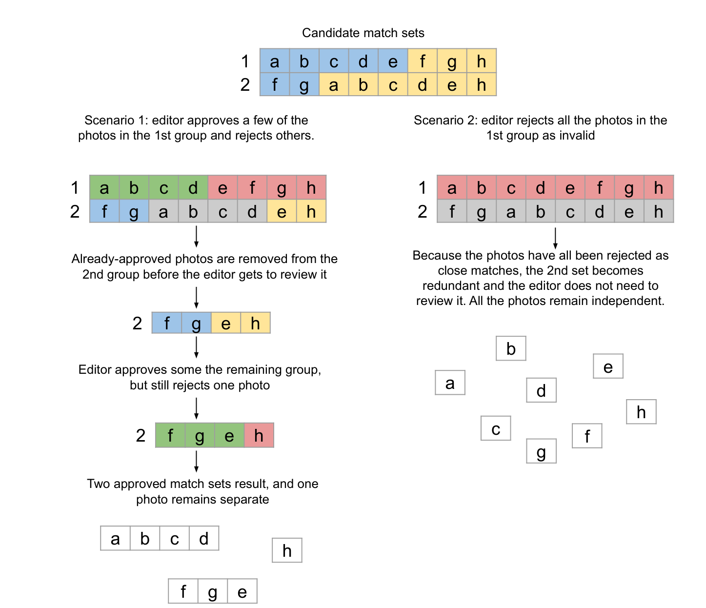

Figure 8.

We had to experiment with the cutoff distance on DBSCAN to ensure that we collected enough potential matches to capture most of the duplicate/near-duplicate photos in the collection, without casting such a wide net that editors would need to wade through approving or rejecting a huge number of candidate sets.[^20] <!-- page 16 -->

[^20]: In our particular collection, we found a comfortable balance running a first pass with the maximum distance between samples set to 0.03, and the second pass at 0.055

#### 4.2.2. Results

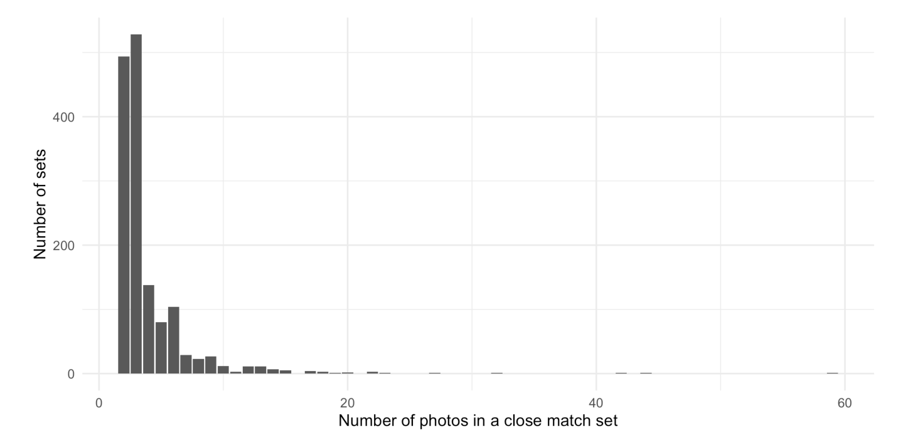

Figure 9.

This process produced 1,757 initial candidate close match sets, of which editors approved 1,491 (with the remainder either explicitly rejected, or made redundant in the process of approving others.) The vast majority of these sets contained between 2-4 photographs, while a much smaller number had a dozen or more images. Editors focused their attention starting with the largest groups first. By the time they got to the sets with only 2-3 photographs (about half of the total number of sets), they felt comfortable automatically accepting the remainder of the sets without needing to manually review them.

These match sets encompassed 5,853 photographs, around 28% of the collection. This would have a huge impact on the tagging task described in the next section, as all the photos in a match set could automatically inherit a tag applied to any of its sibling photos without an editor needing to manually tag each one. Of the more than 43,000 tagging decisions made, a little over 1 in 5 were able to be automatically distributed across a set, saving our editors more than 9,000 decisions.

Our archivists were very pleased at how quickly they could use the system to locate and review potential duplicate images, particularly when it found close matches across different containers in the collection, as happened when negatives were copied or in some cases due to duplicate/near-duplicate files created during the digitization workflow. As with many systems where multiple editors must make decisions on tasks and review work already done, our testers wished for an easier way to navigate between candidate sets and review decisions already made, which would make it easier to go back and fix mistakes. Our alpha interface did not make it intuitive for editors to see that a set contained photos that had been made redundant because they were already accepted into another set. A more complete UI would make these automated data updates more visible and more easily auditable.

On a more fundamental processing consideration, our clustering solution and user interface did not make it possible for an editor to arbitrarily re-assign photos to another group, or to split one of the first-round groups into more granular sets of matches. We erred on the side of creating more granular sets of photos for our editors to review, so this use case did not arise much in practice. However, it is a good example of the kinds of more complex <!-- page 17 --> data manipulation features that have nothing to do with computer vision per se, but which are essential for a fully-formed collection management system.

### 4.3. Similarity-Driven Tagging

The ultimate goal of our prototype was to leverage these new visual similarity capabilities with the existing archival structure and description to rapidly streamline how editors created item-level metadata in the form of content tagging. Editors would select a tag to work on and then identify a starting seed photograph by searching through the existing metadata for a representative picture of, say, “Football players”, then use visual similarity results based on that photograph to identify other photos across the collection that needed the same tag.

#### 4.3.1. Methodology

Our initial prototype interface borrowed from the user interface of ReCAPTCHA. The interface would serve up a continually-refreshing stack of visually-similar photographs, and editors could quickly approve or reject photos for a given tag, their decisions stored to the server on the fly as it returned more and more similar photos to judge. However, it was quickly apparent that this initial interface relied too heavily on computer vision alone, and didn’t offer enough flexibility to move outside of the single prescribed workflow.

A better solution looked to the significant amount of collection-level archival description. Because the majority of the images in the GPC are organized based on the official CMU photographer “job” session in which they were taken, it is quite likely that a photograph of “Football players” will be in a job with many other photographs of football players taken during the same event. It didn’t make sense to tag just one photograph surfaced by visual search and not take the opportunity to assess the other photos in the same job before moving on to the next photograph that might be in a completely different section of the collection. Therefore, we expanded the workflow to use the visual similarity search only as a first step that would help editors prioritize entire jobs or directories to review and tag at once. <!-- page 18 -->

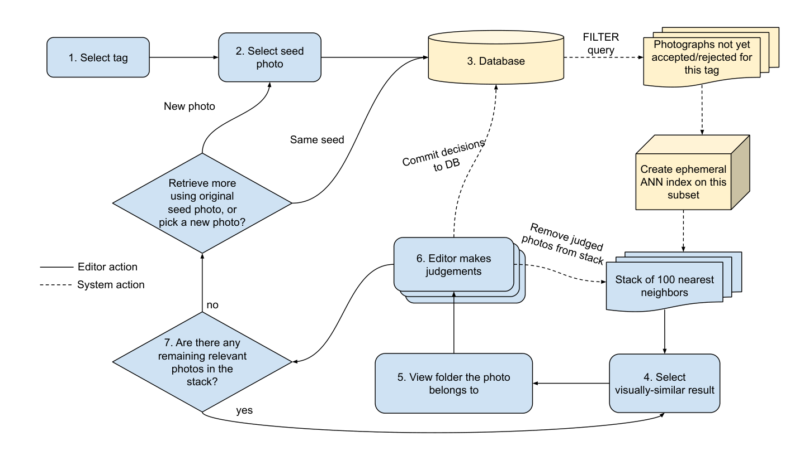

Figure 10. Tagging workflow

1. Editors select a tag to work on

2. Editors use the browse interface to select an initial seed photograph

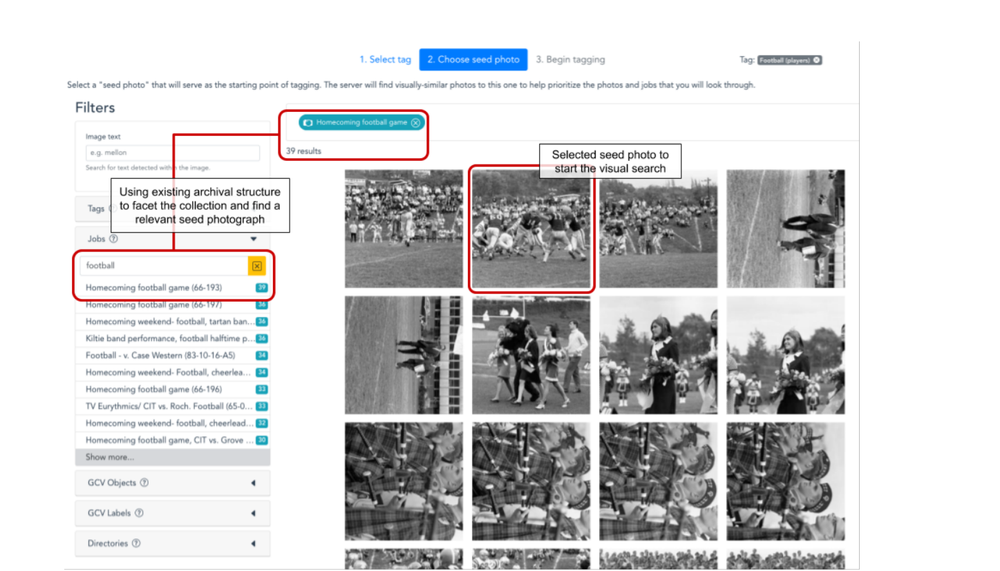

Figure 11.

<!-- page 19 -->

3. The system queries for all photographs that haven’t yet been reviewed for that tag, meaning they have neither been explicitly approved or rejected by an editor. Because the Annoy implementation of approximate-nearest-neighbor indexing doesn’t allow searching arbitrary subsets of a fully-built index, the system must create an ephemeral Annoy index on this subset of photographs.[^21] From this focused index, the system returns data on 100 of the nearest neighbors to the seed photograph.

4. The interface shows a grid with the first 9 images from this stack, and the editor may select one of the visually similar photos to view details on the photo, and see if it has an associated job.

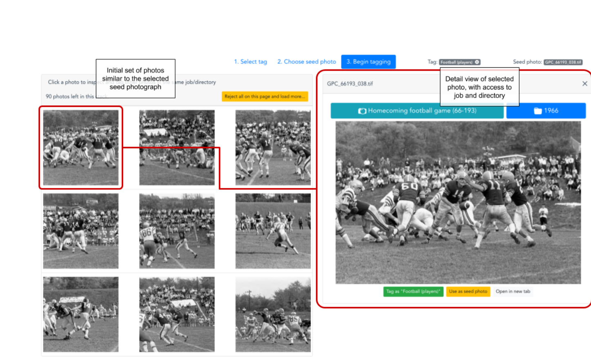

Figure 12.

5. The editor then opens up an overlay showing all the photos in the associated job or directory:

[^21]: This generation took five to six seconds on 21,000 photos with 512 features, and in practice only needed to be called every few minutes. This was acceptable for prototyping, but an ideal system would be able to search arbitrary subsets of a single pre-built ANN index. This is not a feature that the Annoy implementation of ANN will support (https://github.com/spotify/annoy/issues/263) so a future system would need to find or implement a different ANN library that has this functionality. One promising option is using ElasticSearch to power all GET queries on the database, and using the Elastiknn plugin (http://elastiknn.klibisz.com/) to run ANN-ordered queries against any data in the database. We would like to acknowledge David McClure for bringing this approach to our attention.

<!-- page 20 -->

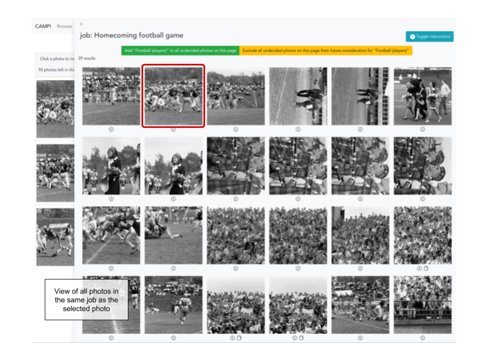

Figure 13.

6. Now the editor may rapidly assess all the photos in that directory, adding or rejecting a tag attribution with a click. As the editor makes decisions, they are logged live on the server, and any photos that get decided on are also removed from the initial stack of 100 nearest neighbors downloaded from the server.

<!-- page 21 -->

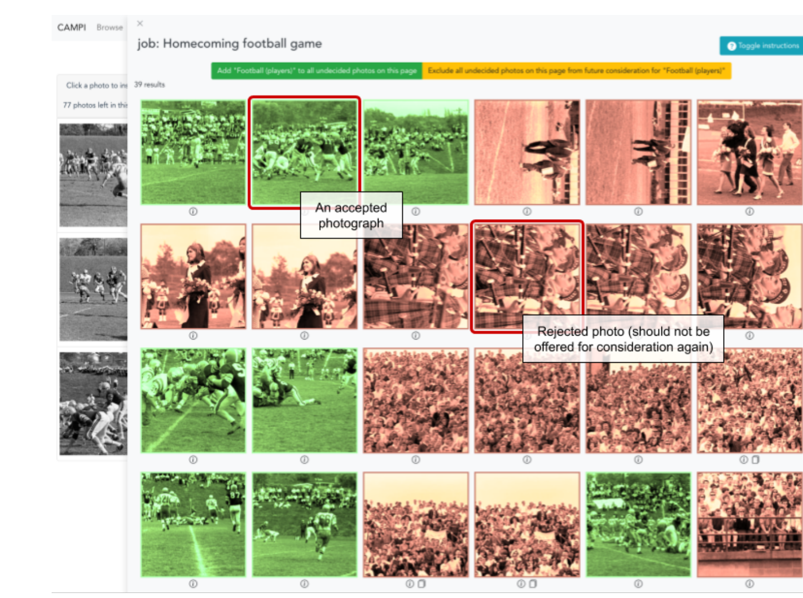

Figure 14.

7. After tagging a job, the editor can then return to the remaining stack of visually-similar photographs to find a new entrypoint into the collection and a new job/directory to tag, repeating the process. If they have exhausted this set of photos, they can either query the server with the same seed photograph to find a new set of unreviewed neighbors, or select a new seed photo to drive the process.

This approach combined the best of both worlds: computed visual similarity could easily make connections across the collection without being constrained by existing archival structure, while that same extant structure and its minimal job-level textual metadata supplied essential non-visual context. This workflow often captured many photographs that were visually different from the original seed, but that still needed the tag. This reduced the total number of different seed photographs the editor would need to cycle through to find most of the photos that need the tag, and also made it faster for them to eliminate groups of photos that were visually similar (e.g. field hockey instead of football) rather than needing to spike them one by one as the visual similarity search offered them up. Therefore, one visually-similar result could guide the editor to rapidly assess several dozen photographs before going back to the pool of visually-similar candidates. <!-- page 22 -->

The computer vision intervention here remained minimal, still relying only on the initial set of precomputed features. One could envision a more “intelligent” CV system that would adapt as it received new feedback on images, tailoring the returned results to incrementally look less like rejected photos and more like accepted photos. However, in practice, we found that when editors needed to switch seed photos, it was because they needed to purposefully shift the search to a very different part of the visual feature space. For example, when looking for pictures of classes in session, editors would at some point need to shift from looking at photos of bright rooms with chalkboards, to instead find photos of dark, dramatically-lt auditoriums. These images have divergent feature vectors, so when we experimented with weighting the visual search towards already-accepted photographs, switching to a new seed photo returned unexpected results that didn’t fulfill editors’ expectations, and so we quickly removed that functionality.[^22]

#### 4.3.2. Results

One simple measure of success for this task is what percentage of photos were matched to a keyword that didn’t already appear in their existing job or directory description? In other words, what discoverability did we gain by tagging that didn’t already exist in the collection-level descriptions?

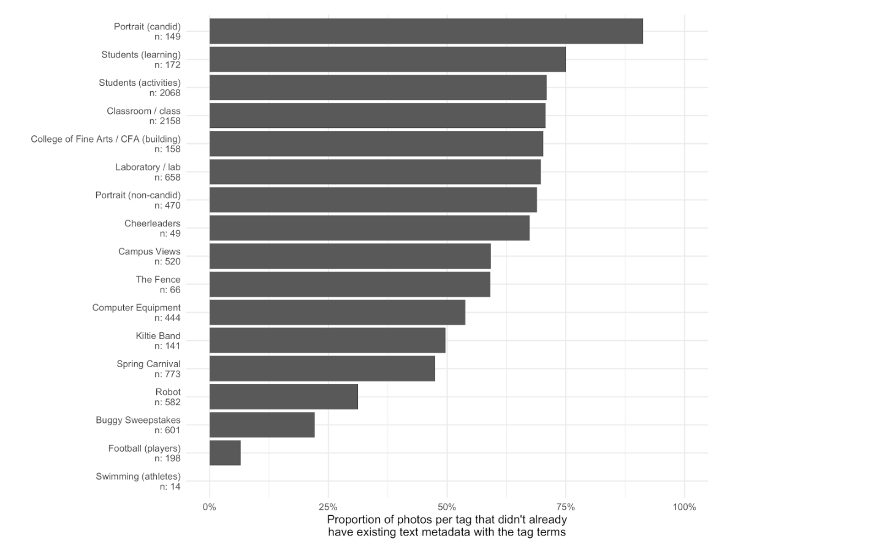

Figure 15.

Editors worked through 17 different tags, ranging from highly generic concepts to CMU-specific events and locations. In total, editors added at least one of these tags to 7,773 photographs. Figure 15 shows the total number <!-- page 23 --> of photos assigned to each tag, and the proportion of photos for each tag that *didn’t already have some part of the tag text in their existing collection-level metadata*. Photos near the top almost never had their tag text in existing data, while photos near the bottom often or always did.

[^22]: A more nuanced system of continual fine-tuning neural networks might address parts of this problem, but it would need to result in significant gains to offset the increased complexity. See for example Benoit Seguin et al., “Visual Link Retrieval in a Database of Paintings,” in Computer Vision – ECCV 2016 Workshops, ed. Gang Hua and Hervé Jégou, vol. 9913 (Cham: Springer International Publishing, 2016), 753–67, https://doi.org/10.1007/978-3-319-46604-0_52.

Highly generalized terms like “Portrait” or “Students” rarely showed up in the job descriptions of the applicable photographs. For example, most faculty portrait jobs were labeled with just the name of the faculty member (e.g. “Zerner, Clarence”), and pictures of students in a classroom frequently referred instead to the particular instructor, department, or college (e.g. “Alan Perlis, department of math/ Speaker in Skibo”) rather than specifically denoting it was a picture of a class.

On the other hand, other tags were already well-represented in their existing archival descriptions. Nearly all the pictures of football players were in jobs that had the term “football”, much like almost all the pictures of the iconic annual CMU buggy race were in jobs with the term “buggy”. However, jobs whose descriptive metadata overlaps with one appropriate tag may not contain other appropriate info. For example, while football players are easily found in jobs labeled “football”, many photographs of the CMU “Kiltie” Band, as well as images of cheerleaders, are also found in these same sets of photographs. But they aren’t represented at all in the job-level description. So even when tagging like this introduces metadata redundancy in some areas, it greatly increases description recall.

Crucially, it also empowered editors to add to a descriptive vocabulary that goes above and beyond the terminology used by the original CMU photographer, an opportunity to make explicitly discoverable content or concepts that were otherwise silenced or omitted by the original descriptions that the official photographers used.

This is a very rough measure, of course, which does not take into account synonymous terms (e.g. “course” instead of “class”) that users might well try when searching through existing metadata. A more complete evaluation of a beta system would also need to compare how effective this CV-assisted tagging interface would be to one in which editors could only use the existing job/directory metadata to browse for and tag images. As our library had yet to implement any management system for these photographs, we had no baseline against which to measure this.

Editors had generally positive feedback for the system. One of our editors likened the responsive, interactive interface to a game, finding it much more enjoyable than paging through image after image to enter information into a spreadsheet. But quite a few improvements would be needed for a production system. Editors desired more ad hoc affordances to add a tag to a group of photos outside of this workflow. For example, when using the faceted browsing interface to select a seed photo, editors reported often finding a job whose photos all needed to be tagged, but the system workflow required them to pick a seed photo, wait for the ANN index to be built, and then click through to the job overlay pane to tag the job. An ideal interface would have a path to allow that tagging action on the browse page itself, without ever needing to enter the CV-enabled portion of the workflow. This workflow also broke down when the only context photographs had was a very large directory with 200+ photographs. There, it was not feasible to go through the entire subset and make tagging decisions. An improved interface might calculate the cosine distance of all the photos in that directory to the selected photo, ordering the large directory by visual similarity to help editors surface the best matches to be tagged. Finally, the UI we arrived at worked best on a full-width desktop/laptop display. While such an expert system would likely not need to be functional on a small phone screen, more responsive styling of the interface would better accommodate screens of different sizes and browser zoom levels.

To gather additional feedback on the system, we recruited two editors from the library to test out the tagging interface and provide us with some observations about their experience. The testers were given an hour long training session and asked to spend roughly 4-5 hours tagging images. They were also asked to keep track of what tags they worked on and to document how many times they had to select a new seed image and what search terms they used to find relevant images. <!-- page 24 -->

The testers' initial overall impressions centered on how great it was to browse the collection. Both of them often work closely with the archives but have never been able to browse the GPC collection so freely. Knowing how large the GPC is, they also thought tagging was a good way to help users narrow down what they were looking for.

Feedback highlighted the need for additional training or documentation that could be referenced as the testers gained more familiarity with the system. Primarily, testers struggled with one key step in the tagging workflow, they were not clicking on the job code to see related images (steps 5 and 6 outlined in section 4.3.1). This meant that they were spending more time finding relevant images, which led to some time constraint concerns on their behalf.

Additionally, the system testers found that some of the tagging terms were too broad. For example they felt the tag “student activities” was too conceptual and could potentially encompass a good deal. In their experience, other broad terms often resulted in lots of images which took more time to parse through. Testers also thought it would be helpful if they could add or alter tags. However, they would not recommend allowing just anyone to add, revise or delete tags. They also wanted to be able to add tags ad hoc, when they came across images of people they could identify.

### 4.4. Google Computer Vision Labeling

Tangent to our three core tasks, we also wanted to evaluate whether any of the services offered by Google’s Cloud Vision API (GCV-API) could help to enhance discovery or metadata generation for the GPC.[^23]

GCV-API is a paid service that runs an image through a proprietary computer vision system and returns a variety of data. Pricing per image is based on which of the services you request. For this project, we requested the following features for each of our photographs:

1. Labels

2. Object localization

3. Text recognition

4. Face recognition

Because GCV-API’s image labeling service is meant to be highly generic, it was not surprising to see that most of their labels were useless for our context. For example, the most frequently-applied tags were: <!-- page 25 -->

[^23]: https://cloud.google.com/vision/ In our case we used the Vision API which uses a pre-trained model. Google Cloud Vision also has a product called AutoML Vision which would allow you to train a custom model on their servers with your own tagging vocabulary by supplying training data.

| | |
|---|---|
| Black-and-white | 16,094 |
| Monochrome | 13,645 |
| Photography | 12,821 |
| Monochrome photography | 9,781 |
| Photograph | 5,978 |
| Black | 5,145 |
| Style | 5,072 |
| Snapshot | 4,939 |
| Room | 4,899 |
| White | 4,698 |

Obviously, none of these is helpful in the context of an historical photo archive! To be fair, less-frequently appearing labels did include some more specific topical terms, including “students”, “teaching”, “theater”, “football”, etc. However both precision and recall on these relevant tags were generally unacceptable. For example, “american football” only captured 48 of the 198 football player pictures identified by our editors using our CV-enabled interface, and mislabeled 2 photographs that were actually of track and field. Based on the performance of many of these tags, we wouldn’t recommend relying on GCV for any kind of automated collection description in an archival context, not even when including some kind of human review of the results.

That said, these labels were not without some use. GCV’s “laboratory” tag missed many laboratory pics and erroneously included many art studio images. However, it did locate photographs of a chemistry lab that had no metadata at all and had been missed by an editor during the first few rounds of seed photographs using our own CV-enabled interface. If there is any utility to these highly-generic labels, it may be only on the back-end of metadata generation systems, where editors can use them as a last resort when searching for photographs to tag with a useful, domain-specific vocabulary.

Face detection was also relatively successful although we did not have a use case for detected faces to evaluate during the span of this prototype project. A future use case would be using facial recognition software to help group together photographs of the same face across the collection, potentially allowing archivists to gather many photos of an unidentified individual and then update all of them when they eventually do make an identification. <!-- page 26 -->

A major drawback of GCV-API’s label, object, and face detection is that it only returns a maximum of 10 of each annotation per photograph. For example, a photograph of a choir with 32 clearly visible faces only returns 10 annotations from GCV-API. For future projects, we would instead recommend open source face detection software such as OpenCV.[^24]

More successful was Google’s text detection, which identified text in 7,561 of the GPC photographs. While imperfect, it performed surprisingly well on some difficult photographs where text has out of focus, rotated, or curved. Notably for university-based institutional archives, it correctly recognized Greek characters off of the sides of fraternity buildings, parade flags, and apparel. <!-- page 27 -->

[^24]: https://opencv.org/

## 5. Discussion

### 5.1. Implications for Photo Archives Management and Description

As archivists, we were largely thrilled with the outcomes of the CAMPI project and can see clear ways to integrate such a tool into our regular work—particularly when conducting regular photo reference. Based on our testing, we also believe that there are broad applications in archival practice for tools that implement similar technologies.

#### 5.1.1. Availability of a DAMS

Even without computer vision, the CAMPI project offered a drastically improved method of interacting with our photograph collections. Prior to CAMPI, these digitized photographs were only available via a standard file server. Visually browsing images within a job or directory was extremely time consuming and slow as we primarily relied on preview images of large TIFFs provided by the file explorer. So even creating the most basic faceted browse interface during the first week of interface development revealed a host of unmet needs:

- The ability to quickly browse photographs without needing to download full-sized TIFF files across a network connection.[^25]

- The ability to filter results based on both the filesystem directory hierarchy as well as the archival collection hierarchy

- The ability to quickly rotate and zoom images within the browser, and save that rotation metadata to the server.

- The ability to add a warning flag to a photograph if it should not be put online due to sensitive or offensive content

- The ability to rotate photographs and save that rotation metadata to the server

The CAMPI interface allowed archivists to quickly view and select images from a large group. Not only was the system much faster and responsive than the file server, it allowed archivists to view images next to one another. When weighing images for use in media, exhibitions, or promotions it is often necessary to closely compare individual images to assess a best fit. Similarly, when providing broader access to photographs, it is helpful to be able to choose the best image out of a set of near duplicates.

#### 5.1.2. Appraisal and De-Duplication of Born Digital Photography

We found CAMPI’s ability to help us identify and weed near-duplicates from born digital photography transfers to be particularly powerful. The size of born-digital photographic archives is a known problem for archives, both in regards to storage infrastructure and description. Multiple archives have chosen to randomly sample born digital <!-- page 28 --> photographic transfers as a method of appraisal.[^26] Random sampling, while a long accepted method of archival appraisal, has obvious drawbacks.[^27] Random sampling of a photographic collection can miss photographs of key individuals and cannot assess the quality of specific images. Depending on how the sampling is scoped, a random sample might also lead to disproportionate inclusions of photos of little use, while discarding high value images.

[^25]: A workflow made even more arduous by the remote work enforced by the onset of the COVID-19 pandemic shortly before this project began.

For example, a high level assessment of recent born digital transfers at the CMU archives demonstrate a high proportion of faculty portraits and event photography of press conferences, speeches, etc. In these cases, we might only need a very small number of these photographs in our permanent collection. On the other hand, we have found comparatively little documentation of campus life and traditions. When these images are present, we are likely to want to maintain all of them as part of the collection.

CAMPI allowed us to undertake appraisal of these items quickly and knowledgeably. We could quickly select one or two representative images from a set of portraits, ensuring we had a usable photo, rather than one with eyes closed, etc. Similar appraisal can be done with a file system, but CAMPI allowed us to immediately target transfers with high rates of duplication while ignoring more diverse sets of images.

#### 5.1.3. Computer Vision for Access and Reference

Although CAMPI’s initial scope of work was strictly limited to behind-the-scenes appraisal and descriptive work, there are clear potential applications for use in access and reference. During the testing period, archivists already utilized CAMPI when answering photo reference questions, and can easily see a similar tool or interface easily being incorporated into reference workflows. Of even greater interest is the idea of letting users have access to a similar tool. Interfaces leveraging similarity searching and computer vision tagging are not foolproof, but they allow users different ways of interacting with a collection.

Carnegie Mellon’s marketing department has shared during interviews that they are often tasked with searching for broad categories of images, such as “happy students laughing” that do not receive helpful tagging or metadata. They are also interested in diversifying the images that are being used in order to increase interest across various marketing pieces.[^28] Both the similarity search—which could allow them to select a known photo as a seed to identify similar images—and the Google Vision tags—which, among other features, attempt to identify mood— could be beneficial for them.

Casual users, who are primarily interested in more serendipitous use of the collection might also enjoy these more novel ways of browsing. Google Vision tags might be of particularly interest here, particularly if more problematic tags can be suppressed. For example, the Google Vision “necktie” tag was largely accurate and can serve as a way to quickly target images with individuals in them, and provide a way of observing changing fashions on campus. <!-- page 29 -->

[^26]: Kristen Yarmey et al., “From 0 to 400 GB: Confronting the Challenges of Born-Digital Campus Photographs,” presented at the Society of American Archivists Annual Meeting (Atlanta, 2016), https://www.slideshare.net/kristenyt/from-0-to-400-gb-confronting-the-challenges-of-borndigital-photographs.

[^27]: Eleanor McKay, “Random Sampling Techniques: A Method of Reducing Large, Homogeneous Series in Congressional Papers,” The American Archivist 41, no. 3 (July 1978): 281–89, https://doi.org/10.17723/aarc.41.3.t756k0723551txg3; Frank Boles, “Sampling in Archives: An Essay Illustrating the Value of Mathematically Based Sampling and the Usage of Techniques Other Than Simple Random Sampling within an Archives; or, Coping with 10,000 Feet of Invoices before Retirement,” The American Archivist 44, no. 2 (April 1981): 125–30, https://doi.org/10.17723/aarc.44.2.a5458p2p62873437

[^28]: Specific marketing use cases were developed in 2019 during stake-holder interviews for the development of a new archival repository system.

#### 5.1.4. Implications for Tag-Based Description

##### Vocabularies and Tag Selection

One of the clearest pain points was one of the areas fully under the control of the archivists: that of defining tags to apply to these photographs. The selection of initial tags was based largely on terms already used within the collection. This led to the use of terms like “student activities” which proved to be overly broad in this context and failed to leverage the opportunities provided by the system. Visual similarity did not help much with broad, conceptual tags as the context of the picture was more important than the composition of the frame.

We found that tags focused on specific actions, activities, and identifiable items were a much better fit for the capabilities of the system. This limitation might mean that archives using CAMPI for metadata work still need to apply additional subject terms prior to ingest into a repository system.

##### Non-Specialist Description

Systems such as CAMPI may also allow archivists to better leverage non-specialist labor. By having students focus on a single tag across the collection, rather than focusing on a single image that needs multiple tags, we can better provide the specific training and context they need to complete their work.

However, testers of CAMPI pointed out that the choice of tags is very important. Broad conceptual tags caused issues and required an understanding of the structure of the collection, the history of the university, and some fundamental understanding of the role of metadata in description and access. One of the testers, who is also a CMU alum, pointed out that having editors that are knowledgeable of Carnegie Mellon University’s history and traditions would be advantageous. For example, images of now demolished buildings, former faculty members, and specific schools or programs that no longer exist, might not be easily identifiable to non-specialists without doing research. If a system like this were to be used by students or interns, training and full description of each assigned tag could be necessary.

#### 5.1.5. Syncing Description

Because of the size of our collection—and the fact that it is still undergoing active digitization—tag based description is an iterative, and ongoing process. We also plan to use a secondary DAMS—Islandora 8—as our system of record for public access to our digital collections. Descriptive and deduplication work done in a production-ready CAMPI-like system would therefore need to be periodically or simultaneously synchronized.

While running these processes on a large initial ingest of photographs is straightforward enough, there would clearly be challenges with ongoing implementation as new photographs are added and additional tags are applied to existing photographs that are already accessible via a secondary system. Full implementation of a CAMPI-like system at scale would require additional workflow development and concerted work to keep data normalized and consistent across systems. See Appendix 1 for a high-level overview of the information architecture that would be needed for such a system.

### 5.2. Implications for User Interface Design

Because our archivists lacked a pre-existing browsing interface, it is difficult to untangle the effects of simply being able to tag photos in a browsable interface from the effects of a computer vision intervention. That said, it is clear that image duplication detection, similarity, and clustering are broadly useful when tightly integrated with an interface that affords their use as a human-driven archival prosthesis. <!-- page 30 -->

Our interface relies on a combination of faceted browsing, text search, model-driven suggestion, and grid displays of photographs. This is a time-tested approach to browsing and editing images, and continued to prove successful in this case. Editors found the interface incredibly useful and largely intuitive, though additional features would have further improved their interactions with the computer vision model, including:

- More feature-complete faceting, such as progressive filters that update the number of images with a given feature as represented in the currently displayed set; scrolling / sorting within each facet; and universal search.

- Easier and more ubiquitous entry points into various features, such as quick navigation between candidate sets and revision decisions for duplicate images; access to the tag-similar-photos feature from any arbitrary photo; the ability to edit the tag list from anywhere; and the ability to tag groups of photos currently visible on the screen without requiring entry into the CV workflow.

- Additional methods to sort arbitrary sets of photos based on visual features, e.g. different distance measures, different clustering methods, etc.

- Ways to split, combine, or re-assign groups of images, such as duplicate photo sets, tag groups, etc.

In addition to ways to improve the faceted grid interface, the CV intervention welcomes additional varieties of interfaces into a photograph collection. For mobile browser editing, for example, one might create a swipe-style interface, where a photo is shown and swiped in one direction or another to convey inclusion in a given set.[^29] To deal with the problem of single tag groups occupying multiple territories in the 512-dimensional feature space, one might design a browser that where editors can view a visualization of the entire feature space (as with the UMAP visualization in Figure 1, above), allowing them to lasso sets of photographs that belong in particular tags.[^30]

### 5.3. Implications for Computer Vision Research in Photo Archives: Shortfalls and Future Research Opportunities

We used only the visual features from an “off-the-shelf” model pre-trained on a generic modern photograph dataset in this prototype. This was a relatively good fit for trying to tag the content of a digitized collection of photographs, however there are crucial disconnects between the content of the GPC and that of ImageNet, the key training data for InceptionV3, as well as a disconnect between the intentions of our editors to tag both depicted objects as well as more amorphous concepts, whereas ImageNet was constructed solely for object identification.

Both collections of images are quite different, and the use of the former to guide exploration or tagging of the latter introduces the potential to reinforce biases built into the original model. Additionally, there is the concern of inheriting issues of dubious consent, legality, and morality when relying on the common image training datasets.[^31] <!-- page 31 --> Addressing these issues is far beyond the scope of this experimental prototype, but until such concerns are resolved, it would behoove archivists adopting these sorts of tools to be keenly aware of biases inherent in the models, and do whatever possible to offset those biases through intentional intervention. Indeed, the benefit of the human-in-the-loop process we recommend is that those points of intervention are possible, when explicitly planned for.

[^29]: “Gamification” of data entry tasks is particularly apt for mobile devices. The New York Public Library’s “Building Inspector” project is a key example of mobile-first design for crowdsourced data entry: http://buildinginspector.nypl.org/about.

[^30]: Related efforts for this kind of interface include Douglas Duhaime and Peter Leonard, “PixPlot,” Yale DHLab, 2017, https://dhlab.yale.edu/projects/pixplot/.

[^31]: Several of these and related issues are discussed in Vinay Uday Prabhu and Abeba Birhane’s “Large image datasets: A pyrrhic win for computer vision?”, 2020, https://arxiv.org/abs/2006.16923.

There are a variety of practical steps that the cultural heritage and computer vision communities could take to produce models tailored for historical photo archives. ImageNet is primarily a dataset of color photographs, and therefore InceptionV3 relies in part on color to produce the features that it does. Black and white photographs— the majority of this historical photo archive—leave the neural network with less information than it was trained to expect, and so may result in less-than-ideal clustering. Models specifically trained not to rely on color for object detection, and/or trained on already-tagged images from similar historical photo archives, would create a very useful starting model for future computer vision tasks using collections of a similar vintage. InceptionV3 also expects born-digital photographs, whereas photo media in the GPC run the gamut from born-digital to digitized gelatin silver prints, chromogenic color prints, 35mm negatives and 120mm film. Other archives may contain examples of even more kinds of photographic processes, from daguerreotypes and albumen prints to early glass negatives—all of which have varied visual properties that diverge from an image produced by a modern digital camera.

Notably, Golan Levin at CMU has reported unexpected improvements in first running black and white photographs through a neural network that attempts to predict the real colors of the subject of a black and white image, and then using InceptionV3 features extracted from those colorized derivatives to support visual search and similarity clustering of their original black and white counterparts.[^32] This can be done without requiring any new model retraining (the most computationally-intensive of neural network tasks) but does not address the underlying biases in the expectations of models like InceptionV3.

A notable proportion of our images did not have their orientation corrected during digitization Adjusting the convolutional neural network to include orientation-invariant layers[^33] would assist in clustering images that were visually-similar despite being rotated. Alternatively, using models to detect proper image orientation could help streamline the tidying of images digitized under inconsistent workflows.[^34] As with overall image clustering, existing solutions to predicting correct orientation on general modern image collections taken from the internet may fall prey to a bias towards color images, relying on encoded assumptions such as bright/blue skies generally appearing at the true “top” sides of images, and dark/gray roads appearing at the true “bottom” sides.[^35] <!-- page 32 --> Several other hypothetical computer-vision tasks that came up during the project included classifying the physical source of a digitized image (e.g. scan from a negative versus scan from a print) when original digitization metadata is missing, as well as attempting to predict the date of the photograph based on visual properties and/or content.

[^32]: Matthew Lincoln, correspondence with Golan Levin, November 2019. On using adversarial networks to colorize images, see Phillip Isola et al., “Image-To-Image Translation With Conditional Adversarial Networks,” 2017, 1125–34, https://openaccess.thecvf.com/content_cvpr_2017/html/Isola_Image-To-Image_Translation_With_CVPR_2017_paper.html.

[^33]: Xin Zhang et al., “Rotation Invariant Local Binary Convolution Neural Networks,” 2017, 1210–19, https://openaccess.thecvf.com/content_ICCV_2017_workshops/w18/html/Zhang_Rotation_Invariant_Local_ICCV_2017_paper.html.

[^34]: Philipp Fischer, Alexey Dosovitskiy, and Thomas Brox, “Image Orientation Estimation with Convolutional Networks,” in Pattern Recognition, ed. Juergen Gall, Peter Gehler, and Bastian Leibe, Lecture Notes in Computer Science (Cham: Springer International Publishing, 2015), 368–78, https://doi.org/10.1007/978-3-319-24947-6_30 present a neural-network based approach.

[^35]: These assumptions are clear in earlier orientation prediction models that used patch-based features relying on summary color and edge detection metrics: Yongmei Michelle Wang and Hongjiang Zhang, “Detecting Image Orientation Based on Low- Level Visual Content,” Computer Vision and Image Understanding 93, no. 3 (March 1, 2004): 328–46, https://doi.org/10.1016/j.cviu.2003.10.006, see especially section 3.3.

However, our experience with this prototype suggests that the most widely-applicable challenges for applying computer vision in photo archives have less to do with basic computer vision research, and more to do with how to design systems where computer vision systems exchange data with traditional collections management systems as ongoing, everyday operations, rather than as a one-way ETL (extract -&gt; transform -&gt; load) process in special projects.[^36] Data for digitized archival collections is rarely, if ever, produced in one synchronous project. Collection accession, description, and item-level digitization happen iteratively, often years (if not decades) apart.

Certain types of bulk, one-off computer vision projects may be useful for large collections where it is feasible and worth the time to train a custom model to carry out classification of a handful of relevant tags in a large collection (discriminating between photographs, maps, and charts in scans of printed publications, for example). However this approach is a poor fit for collections where domain-specific vocabularies mean some important will tags appear rarely, or for relatively small collections that aren’t large enough to provide the data needed independently-trained computer vision model, much less warrant the time and expense involved. Additionally, institutional photo archives like the GPC accrue new photographs on a regular basis, so any pipeline would need to be designed to accommodate the continual addition of new objects.

A system that instead integrates comparatively simple and general-purpose visual similarity ranking with faceting on existing collection metadata could instead provide a powerful utility for archivists and metadata editors to more adroitly organize and describe collections at the item level that would otherwise be prohibitive.[^37] Indeed, more attention in general to improving the responsiveness and flexibility of the back-end interfaces for digitized archival collections management would be a major boon to archivists and metadata editors.[^38] <!-- page 33 -->

[^36]: Ryan Cordell raises this issue briefly in “Machine Learning + Libraries,” LC Labs Reports (Washington, D.C: Library of Congress, July 22, 2020), https://labs.loc.gov/static/labs/work/reports/Cordell-LOC-ML-report.pdf, section 4.5

[^37]: A general-purpose clustering system for digital textual collections is proposed by Benjamin Schmidt, “Stable Random Projection: Lightweight, General-Purpose Dimensionality Reduction for Digitized Libraries,” Journal of Cultural Analytics, 2018, https://doi.org/10.22148/16.025.

[^38]: TODO there’s some code4lib work on this I need to track down and cite

## 6. Conclusion

As archivists reckon with accessioning in the age of digital abundance, they will need sophisticated tools to augment their processing of incoming materials, capable of increasing speed and efficiency without sacrificing care and accuracy. CAMPI, our expert-in-the-loop machine learning prototype, offers clear evidence that computer vision in tandem with user interface design and attentive use of existing archival structure could play this integral role in the next generation of digital asset management systems.

Reaching this goal will require care, intention, and considerable resources. Several inviting dangers will need to be avoided. Tagging and de-duplication would cost less, for example, were it entirely automated, or reliant on student assistants or crowd labor. It would take less effort and technological complexity to keep the CV-augmented processing system entirely separate from sprawling and difficult-to-manage digital asset management systems. Using pre-trained image models would significantly reduce needs for technical capacity and expertise.

But falling into any of these traps would be a mistake. We found that expert guidance is essential for common archival needs, especially given how ill-trained current models are for the context of cultural heritage. Because that guidance must happen continuously as new materials arrive, and often requires revision as understanding of our history changes, such a toolset must be able to integrate with an institution’s existing digital asset management system.

Several aspects of the common pre-trained image models we used proved inappropriate for our collections: they were trained on color images where ours were primarily black & white; they identified objects more relevant to e-commerce than to archival collections, and so forth. One fundamental next step for our community would be to create models explicitly generated from richly tagged historical photo archives. Such model training must be done critically and regularly, in order to keep the system from accidentally nudging experts into reinforcing biases from existing archival collections.

Despite these challenges, we believe computer vision interfaces will play an essential role in collecting materials for the next generation of galleries, libraries, archives, and museums. <!-- page 34 -->

## Appendix 1. High-Level System Architecture

This appendix provides a high-level, implementation-agnostic architecture for a computer vision system similar with capabilities similar to the ones we developed for the CAMPI prototype. Because the GPC photographs were not managed in a DAMS at the time of this project, we recreated a read-only system for storing the item- and collection- level data in one monolithic Django application that also managed the computer vision operations, search APIs, and tagging workflows. This included recreating the archival description hierarchy from a one-time EAD export from the CMU Archives’ ArchivesSpace instance. While this was suitable for an exploratory prototype, a real computer-vision-aided metadata generation pipeline would need to interlink with production systems that manage both item-level and collection-level metadata, rather than become yet another source of truth to rapidly go out of sync as collections grow and metadata is enriched.

This architecture tries to focus on functional requirements, rather than define which requirements are fulfilled by which applications within a realized system. Some products may fulfill multiple requirements—for example, the DAMS Islandroa integrates an IIIF server as well as storing item-level metadata and controlled taxonomies/vocabularies. Many archival description management systems, such as ArchivesSpace, also integrate controlled vocabulary management systems alongside hierarchical collection descriptions. Similarly, certain databases may implement approximate nearest neighbor search in high-dimensional spaces, obviating the need for a separate feature / index storage and similarity estimator at the application layer.

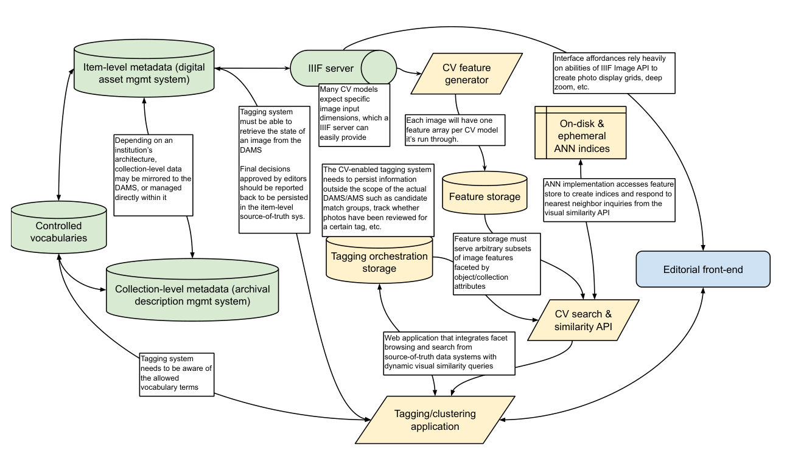

<!-- page 35 -->

### A1.1 Core collections information infrastructure

- IIIF server

    - The IIIF Image API[^39] provides images in the variety of formats needed for this workflow, at different resolutions and geometries (such as square thumbnails), as well as on-the-fly cropping to show regions of photos such as CV-recognized faces or objects.

- Archival collections management system (ACMS) that is the source of truth for collection-level description and other inherited organizational hierarchies

    - Describes the physical / intellectual organization of the originating photo archive, including hierarchies between different collections/series/sub-collections

- Digital asset management system (DAMS) that supports Item-level source of truth

    - Source-of-truth system for individual photographs

    - Must maintain canonical identifiers for images and resolvable links to IIIF server

    - Should store item-level descriptive metadata including tags from a controlled vocabulary

    - Should mirror/harvest/map collection-level information hierarchies from the ACMS so that individual items can inherit the proper collection-level attributes

    - May have ability to create collections of duplicate/near-duplicate photographs, and/or mark images to be hidden from discovery interface

- Controlled Vocabulary Management System

    - Source-of-truth system for vocabularies of people / agents, locations, objects, and conceptual entities that may be depicted by photographs in the collection

### A1.2. Computer Vision Pipeline Infrastructure

- CV feature generation system

    - Must compute, store, and manage features generated for each image in the collection

    - May generate multiple feature sets per photo, using a variety of different CV implementations, e.g. from different types of convolutional neural networks.

    - This system has a high one-time load for batch generating the initial features.

- CV feature store

    - Once features are generated by the CV system that actually runs computer vision models, the CV feature store must be able to serve arbitrary subsets of these precomputed features to the similarity indexing system.

[^39]: https://iiif.io/api/image/

<!-- page 36 -->

- CV similarity indexing store and search system

    - Computes, stores, and manages search indices based on generated features

    - Provides an API to get the nearest visual neighbors of a specific photograph from the entire collection, or from a subset of the collection

- CV-Aided Tagging System and store

    - Mirrors/imports/accesses from the source-of-truth systems:

        - Current image metadata state from the DAMS

        - Collection organizational hierarchy from the DAMS/ACMS (to support faceting based on existing metadata)

        - Allowed vocabularies for use in tagging from the VMS

    - Tracks decisions made by users in order to support workflow tasks such as reviewing and correcting proposed close match decisions or tagging decisions

    - Record e.g. if an editor has affirmatively marked a photo as not needing a particular vocabulary tag, in order to exclude it from future suggestions

    - Posts final approved image metadata state to DAMS / item-level source-of-truth

<!-- page 37 -->

## Appendix 2. CAMPI Implementation Details

The back- and front-end code for our prototype is available at https://github.com/cmu-lib/campi

Prioritizing rapid development over computational performance, we built our prototype as a monolithic [Django REST Framework](#) application using [PostgreSQL](#) as the database backend.

We selected Django because we had extensive experience with the framework, and because by staying within the Python ecosystem it was simple for us to directly build PyTorch, ScikitLearn, and Annoy into the application to power image feature creation from InceptionV3, near-duplicate clustering, and similarity search. We selected PostgreSQL also because of our experience with it, as well as the breadth of features that reduced the amount of outside services we needed to build to support the prototype, including the PGSQL-specific ArrayField for efficiently storing image embeddings, and its simple built-in full-text-search capabilities to ease the search of text detected in images by the GCV-API.

Granular documentation of all the models in our Django application can be found in the code repository, however the basic setup of the modules needed to handle both the functions of our (as yet) non-existent DAMS for tracking item-level metadata and inheriting hierarchical structure from our ArchivesSpace instance described in A1.1, as well as implementing the actual computer vision processes and the functionality for tracking editorial decisions described in A1.2:

1. photograph - Models describing individual photographs as well as annotations on those photographs.

2. collection - Models describing different organizational hierarchies for photographs, such as "jobs" defined in the GPC's original organization, and directories in which original TIFFs were stored during digitization.

3. cv - Models describing computer vision models and methods for calculating image features, approximate-nearest-neighbor search indices and methods for retrieving nearest neighbors, and close match detection algorithms and the match sets of photographs that they create.

4. tagging - Models for a domain-specific-vocabulary and a tagging decision workflow

5. gcv - Models and management commands for making image annotation requests to Google Cloud Vision API, storing the raw responses, and parsing raw responses into structured annotations on photographs.

For the front-end, we built a [Vue](#)-based single-page application that made calls to the API provided by Django. We opted for a single-page-app rather than using Django’s built-in templating system because both the close match review interface as well as the image tagging interface required complex and fluid interactivity between multiple components without forcing an entire page reload.

During the duration of this project, we served the images themselves from a temporary [IIPImage](#) server, as we only required use of the IIFImage API and did not need a fuller solution that also handled IIIF Manifests or annotations. <!-- page 38 -->
