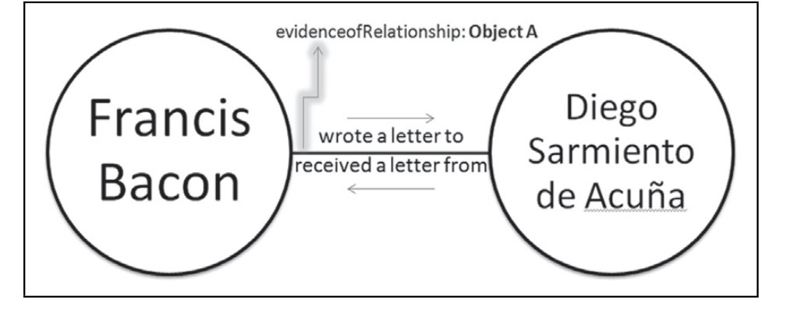

**ALISON LANGMEAD, JESSICA M. OTIS, CHRISTOPHER N. WARREN, SCOTT B. WEINGART AND LISA D. ZILINKSI**[^1]

***Abstract*** *Scholars have long been interested in networks. Networks of scholarly exchange, trade, kinship, and patronage are some of the many such longstanding subjects of study. Recent and ongoing digital humanities projects are now considering networks with fresh approaches and increasingly complex datasets. At the heart of these digital projects are ‘network ontologies’ — functional data models for distilling the complicated, messy connections between historical people, objects, and places. Although scholars creating network ontologies necessarily focus on different types of content, if these networks are to form a coherent body of scholarship in the future, we must work towards the creation interoperable ontological structures, rather than yet another set of competing standards.*

*Here we examine the methodological considerations behind designing such interoperable ontologies, focusing primarily on the example of Early Modern historical networks. We argue that it would be infeasible to adopt a single ontological standard for all possible digital humanities projects; flexibility is essential to accommodate all subjects and objects of humanistic enquiry, from the micro-level to the longue-durée. However, we believe it possible to establish shared practices to structure these network ontologies on an ongoing basis in order to ensure their long-term interoperability.*

**Keywords:** networks; ontologies; data modeling; historical studies; early modern studies

*International Journal of Humanities and Arts Computing* 10.1-2 (2016): 22–35

DOI: 10.3366/ijhac.2016.0157

© Edinburgh University Press 2016

www.euppublishing.com/journal/ijhac

<!-- page 22 -->

Everything is connected, or so the aphorism goes. Therein lies much of the appeal of network studies for digital humanists. Paradoxically, however, everything is connected—except for the networks themselves. Recently, humanists have turned to network data to analyze complex historical processes and artifacts. The analysis of networks, also known as graphs, has proven especially useful for exposing and analyzing complex patterns of connection— patterns that, at the smaller scale long preferred in the humanities, had generally remained imperceptible. As Albert-László Barabási explains, ‘problems become simpler and more treatable if they are represented as a graph’.[^2] And yet the diverse network representations created and studied by humanists share little common ground. This essay offers an exploratory path forward to the problems of interoperability, commensurability, and shared practices for networks in digital humanities. We focus on projects pertaining to a single area of scholarship—early modern studies, encompassing the period from approximately 1450 to 1800—but we anticipate our findings will be generalizable to numerous communities within the humanities.[^3] We suggest that while infrastructural work can easily be disregarded, digital humanists must create and manage network ontologies—formal naming structures of concepts, types, and relationships—that can serve as ‘boundary objects’, core infrastructural components for ‘developing and maintaining coherence across intersecting communities’ and networks.[^4] To realize their full potential, in other words, networks must foster conditions for interoperability.

## MOVING DISPARATE COMMUNITIES FORWARD, TOGETHER

Early modern studies has recently seen a proliferation of digital network projects. Within this relatively small field, innovative projects including *C<!-- -->irculation of Knowledge*, *Cultures of Knowledge*, *Itinera*, *Manner of Belonging*, *Mapping the Republic of Letters*, and *Six Degrees of Francis Bacon* all focus on interactions among historical people, objects, and/or texts.[^5] As these scholarly communities stand today, however, few projects share research and documentation practices that would encourage data interoperability, understood as the ‘ability of two or more datasets to be linked, combined, and processed’.[^6]

Scholars in the information sciences often distinguish among four different levels at which data standardization might be implemented: data structure, data content, data value, and data interchange.[^7] A data structure standard, like the Dublin Core Metadata Element Set or the Text Encoding Initiative (TEI) Guidelines, puts forward a consistent set of fields or categories of analysis to be shared across projects. A data content standard, like *Describing Archives: A Content Standard* or ISO 8601 (date and time formatting), asserts an acceptable format or syntax for the data contained within those fields. A data value standard, like the Getty’s *Art and Architecture Thesaurus* or the <!-- page 23 --> FOAF:knows:relationship vocabulary, introduces a controlled vocabulary that governs the data permissible in a field.[^8] Finally, a data interchange standard is a particular technical implementation of any of these standards within a particular technology, like the Simple Dublin Core XML schema or the TEI RELAX NG schema.

Digital networks projects have yet to reach shared standards at any of these levels, and some of these differences in working practices may be for good reasons. In order for data content and value standards to be shared across communities of practice, scholars would need to agree on shared terminologies and/or a strictly-defined common means to express their data’s syntax and format—a daunting and perhaps undesirable goal for humanists. We contend, therefore, that data structure and interchange standards hold the greatest potential for supporting shared practices that facilitate interoperability and commensurability among projects.[^9] Ultimately, interoperable data structure standards, supported by an intelligent selection of data interchange implementations—in XML or Web Ontology Language (OWL), for example—could effectively allow for the comparison and aggregation of historical data scattered across disparate projects over space and time. In addition, it would make it computationally possible to compare the ways that different scholars have modeled similar data within their projects, creating the exciting possibility of a historiography of scholarly data models. Promoting an open, shared data structure standard for historical networks will effectively lay the groundwork for something resembling a ‘network of networks’.

Interoperability has been an active area of discussion within early modern digital humanities circles for at least a decade, but these conversations have often taken place in meetings, at conferences, through grant proposals, and in the grey literature, leading to considerable repetition of labor. With this essay, we move this important and relatively long-standing conversation forward into the arena of a journal publication in an effort to advance interoperability. Publicizing this conversation has two additional benefits. Newcomers to the digital humanities should know some of the issues that long-standing members of the field have been considering for years. More pointedly, we also challenge the *de facto* subordination of infrastructural labor. By bringing this conversation into the published literature, we are arguing that the digital networks community needs to take infrastructural studies more seriously, and in a more formalized way.[^10] In the following sections, we lay out some of the main challenges regarding ontologies for digital networks and propose some strategies for future interoperability.

## NETWORKS AND ONTOLOGIES

Most basically, a network is a structure that includes elements that are connected and components that connect. The former are generally called nodes and the <!-- page 24 --> latter edges. Examples of networks include the Internet (computers connected by fiber optic cables), online social networks (individuals linked through Facebook) and air transport (airports connected by planes). Less obvious examples might be flavor networks (recipes linked by common ingredients) or networks of violence (victims who share attackers). The very diversity of these examples illustrates a core difficulty that arises as soon as we move beyond the giddy insight that everything is connected: cultures carve up the world in different ways.[^11] Communities of practice have different accounts of what exists in the world and of what matters in it—in short, different ontologies. Everything may be connected, but *how*? Are people connected with one another in the same sets of ways they are connected to animals or to their physical environs? Are kinds of connections historically stable or do they change over time? Is ‘everything connected’ in Texas according to the same standards that ‘everything is connected’ in Athens, Nairobi, Sao Paulo, or Nepal? In short, what relationship ontologies are we using to connect things to one another and can those ontologies answer sufficiently to the rich particularities of time, place, and subject matter?

Since the 1960s, influential humanists including Michel Foucault have emphasized the cultural specificity—often, indeed, the incommensurability—of classificatory schemes. Humanists tend to declare expertise in a time period, a region, or a linguistic tradition, and humanist inquiry often presumes both that there are meaningful gaps between times and places and that those gaps are mostly unbridgeable. For Foucault, the unit of analysis was ‘a culture’, and the fundamental question was how ‘a culture. . . establishes the *tabula* of their relationships’.[^12] With classification schemas and relationship ontologies thus understood as fundamentally contingent and provisional, they have aroused considerable suspicion. The scholarly impulse over the last few decades has largely been to unmask the agendas and suppositions behind contingent ontologies rather than to add to the metaphysical clutter or to harmonize existing schemas.

Recent trends in digital humanities and information science, however, have put pressure on earlier assumptions about classification. Acknowledging the Foucauldian insight that classification can flatten particularities and formalize inequitable power relations, recent scholars have also emphasized countervailing points. There are signs of a new balance being struck. Johanna Drucker, for one, does not return to a naïve view of classificatory ontologies but neither does she treat them as merely objects of analysis. Ontologies in digital humanities have a practical thrust.[^13] ‘When we finally have humanist computer languages, interpretive interfaces, and information systems that can tolerate inconsistency among types of knowledge representation, classification, fluid ontologies, and navigation’, Drucker writes, ‘then the humanist dialogue with digital environments will have at the very least advanced beyond complete submission to the terms set by disciplines whose fundamental beliefs are <!-- page 25 --> antithetical to interpretation’.[^14] For all its perils, thoughtful classification facilitates new questions and knowledge precisely because it groups and aggregates. Ontologies reduce the complexity of the world, but they also help us organize potentially unintelligible amounts of data into structured form. Data thereby become amenable for statistical analysis and visual display. Well-chosen categories help us analyze global attributes of networks and illuminate structures sometimes imperceptible at smaller scale. Classificatory ontologies can play an infrastructural role in linking communities, serving as ‘boundary objects’ that ‘inhabit several communities of practice and satisfy the informational requirements of each of them’.[^15] Aggregation facilitated by such boundary objects offers insights into the attributes of specific nodes and edges. Oftentimes, ontologies help us notice previously undervalued nodes and edges—or force us to acknowledge that we don’t have enough data because we have not studied something deeply enough.

The conceptual structure afforded by a *tabula* of relationships also creates the conditions for scholarly communication and progress. Scientific communities have long emphasized how ‘structure safeguard[s] communicability—among generations of scientists, among cultures, even among species and planets’.[^16] In the context of digital humanities, relationship ontologies offer rich potential for interoperability and comparison among divergent projects and domains. Ontologies as a rule are messy and problematic, yet they are critically important for collaboration, communication, and inquiry at larger scale.

## COMPLEX DATA

Before exploring shared practices which might make humanist ontologies commensurable at the structural level, we must first examine the difficulties inherent to producing the more granular data content and value standards. Specific difficulties relating to early modern dates afford useful perspective in this domain. Early modern temporal data is messy and difficult to record in a commensurable fashion between projects without hegemonically imposing ahistorical standards and losing key information about how data were originally structured. Even if we restrict ourselves to looking at temporal data associated with early modern Christian Europeans—ignoring the Jewish, Islamic, and Chinese calendars, among others—we encounter a variety of often-contradictory systems for encoding dates. The most popular calendars took months and days from the Julian calendar of the Roman Empire and reckoned the year from the birth of Christ, but disagreed on whether that year began on 1 January or 25 March. After 4 October 1582, Catholics adopted the Gregorian calendar reform and skipped ten days of the Julian calendar, leading to religiously-based disagreements on the month and the day of the year. This disjunction led to a variety of early modern responses, such as ignoring alternate calendars, <!-- page 26 --> recording multiple dates via fractional notation, or using abbreviations after each date to indicate adherence to the Julian ‘old style’ or Gregorian ‘new style’ calendar. This is not an exclusively early modern problem; the Julian calendar continued to be used by some nations until in the 1920s.

Many early modern people also used regnal calendars, which reckoned time from the accession of each monarch. Each kingdom had its own regnal year, with its own New Year’s Day, which shifted with every new monarch. Another method of dating events is even more difficult to decipher, as it is generally non-numerical and relates instead to other events, such as ‘Lady Day’, ‘before Michelmas’, or ‘my son’s third birthday’. These last two cases often lead to scholars employing modifiers such as ‘circa’, ‘before’, and ‘after’ to indicate that any numerical date given is, at best, an educated guess. In addition, depending on the granularity of the temporal data being recorded, there are at least three further points of possible concern: canonical versus clock hours; when the day begins; and geographical variations in local time.

Temporal data is not alone in resisting content standardization; geographical data is similarly complex. When creating a database that references locations, one must again determine the desired level of granularity. For example, book historians might wish to stress the importance of specific city streets, while political historians instead work at the city, regional, or national levels. Variations in granularity leads to significant problems in aggregating data; a naïve analysis might particularize less granular data by placing city data at the city’s center, however this leads to misattributions, false certainty and precision, and skewed insights. These issues are exacerbated further by issues of travel. For example, travelers might address letters from a body of water or the name of their ship. Where should a letter written in, for example, the middle of the Atlantic Ocean be coded for location? Even letters addressed from a specific port lead to uncertainty whether the letter was written in port, or only sent from it.

Zooming out might seem an appropriate solution to avoiding false certainty, with all coding at a city or even national level. However, the early modern period suffered from political unrest and ever-shifting borders. A correspondent writing from the early modern city of Mulhouse, depending on the date, may be described as writing from within the Décapole, an alliance of ten self-ruling cities within the Holy Roman Empire, or from the Swiss Confederation, also part of the Early Roman Empire, or after 1798, France. If we know no more than a regional name and an approximate date, it becomes incredibly difficult to infer anything more specific about place or time, especially algorithmically. Ignoring or accounting for the uncertainty is fine when focusing on individual instances, but provides insurmountable barriers to performing comparative analyses across one or more datasets.[^17]

Such complex data choices surrounding time and geography are by no means unique to historical network ontologies, but they are still core areas to address <!-- page 27 --> when creating bridges between network projects. Given the cultural specificity of data choices surrounding even these apparently straightforward categories, it is unlikely that shared data content standards can be created except for the most culturally adjacent of projects. Similarly, shared data value standards for most historical data seem dubiously desirable and likely unattainable. Humanists rightly bridle when imagining a constrained vocabulary for interpreting and describing the lived environment. Data structure standards, therefore, show the most promise; indeed, even for those who might wish for a more ambitious agreement over data content standards, they form a necessary first step before any such shared data content standards can be addressed.

## ENVISIONING A SHARED DATA STRUCTURE STANDARD

To envision a scope for a common data structure standard for digital historical networks, we must begin by considering the varying treatments of nodes and edges: different historical networks projects ask the available textual, pictorial, and material culture to play different roles. In some projects, material objects such as letters are evidence for nodes and edges, while in others such objects function as active historical participants in the networks—as nodes in their own right. As materials slip and slide between serving as ‘source material’ and serving as agents in the network itself, it becomes clear that the work these objects do must be made explicit.[^18] In projects such as *Mapping the Republic of Letters* (*Letters*) or *Six Degrees of Francis Bacon* (*Six Degrees*), historical social networks are generated by means of inferential reconstruction. *Letters* infers a social network from correspondence metadata, rather than a reading of the text itself. A connection is drawn between author and addressee, regardless of whether the addressee ever receives the letter, and agnostic to whether the letter is bureaucratic, familial, scholarly, or antagonistic. By contrast, *Six Degrees*, to which several of us contribute, computationally analyzes text from the *Oxford Dictionary of National Biography* (*ODNB*) to infer social ties between historical actors.[^19] Both projects collapse evidence into inference, constructing social networks which aim to move beyond statements about evidence to statements about the past, albeit contingently. While these projects approach their task of inference through different computational means, they both work with large data sets to reconstruct broader historical networks of interactivity than have heretofore been possible.

Historical objects themselves can also take on the role of an agent in these networks, as is the case for *Itinera*, managed by another contributor. *Itinera* represents modeled data about historical people, objects, and sites, but instead of extracting this information computationally, it is culled from existing sources by hand. This approach is capable of encoding varieties of inter-agent relationships currently opaque to computational methods (i.e. that are not <!-- page 28 --> necessarily contained by the linguistic data of the texts or even the visual data of the images), but the process is painstaking and allows for smaller-scale network analyses. For example, by capturing the material culture historians use as their sources, *Itinera* can assert inter-agent relationships such as ‘painter of/painted by’, a relationship that connects a painter to both the subject of the painted representation as well as the *physical painting itself*. By taking advantage of human interpretive strengths, cultural objects can take their place as nodes in the network in their own right.

**Figure 1.** Basic network dyad demonstrating the role of a text as an attribute of the edge.

That said, texts as material agents are never truly erased from the networks produced by *Six Degrees* and *Letters*, even as the focus of those projects remains the texts’ content rather than their physical agency. These texts persist as attributes of both the nodes and the edges, that is as ‘source information’, or the evidence for asserting the existence of any given node or the shape of any given relationship (see Figure 1). But once allowing for an object of material culture—whether a text, image, or other material object—to serve as an attribute of an edge (such as ‘source’), the edges represented within historical social networks should be then able to bear any number of attributes. For example, the experienced reality that relationships are bidirectional and often time-delimited also demonstrates the need for either repeatable edge attributes (as in *Six Degrees*) or repeatable edges themselves (as in *Itinera*). Objects can be owned by multiple people, but they can also be possessed by the same person/agent multiple times over the course of time. Some relationships are for life (biological parent/child), while others begin during life and end at death (member of a group/has as member). Others have indeterminate edges both in extent and in time (friend of/enemy of), and may vary by the perspective of different historical agents. Both nodes and edges must be allowed develop their own ontologies.

<!-- page 29 -->

**Table 1.** Two different edge attribute structures, *Itinera’s* allowing for multiple edges between two nodes and *Six Degrees’* allowing for repeatable attributes for each edge between nodes.

| *Itinera* | *Six Degrees of Francis Bacon* |
| --- | --- |
| Relationship type (Node A to Node B) | Relationship types (Node A to Node B) |
| Relationship type (Node B to Node A) | Relationship inverses (Node B to Node A) |
| Indexing date (machine-readable) | Relationship dates (one global and one for each relationship type) |
| Display date (human-readable) | Date types (one for each relationship date) |
| Documentation strength | Certainty estimates (one global and one for each relationship type) |
| Source information | Citations (one global and one for each relationship type) |
| General notes | User Annotations |
|  | Other metadata fields related to crowdsourcing |

But what would the structure of such ontologies be for the purposes of these shared practices? In Table 1 we take the example of an edge ontology, and present the categories that *Itinera* and *Six Degrees* use to define their relationships. Both assume the ability to add singular or multiple relationship types, dates, citational attributes, and free-form notes, albeit with currently significant differences. *Six Degrees’* bidirectional relationship types are implemented as dyads—with unidirectional relationships always paired with their inverses, such as *parent of* and *child of*—whereas *Itinera* can support bidirectional and unidirectional relationships. Date structures also vary; *Six Degrees* supports a variety of date fields with predetermined modifiers to support fuzzy data while *Itinera* has both a ‘human-readable’ display date field to provide the cataloguers the opportunity to express the full human-comprehensible complexity of a date range along with a ‘machine-readable’ indexing date field that supports search queries. *Itinera*’s documentation strength value is a human-assigned measure of a cataloguer’s confidence, whereas *Six Degrees* uses a combination of probabilistic statistics and human-assigned measures. The source information fields of both projects allow each asserted relationship to be assigned as many pieces of supporting evidence as are known or extant. Other possible edge characteristics to be considered for the shared practices may include metadata surrounding data collection and/or a relationship directionality designation such as MAN (mutual-asymmetric-null); this latter designation would allow scholars to assert whether the edge between two nodes represents a bidirectional (mutual) relationship, unidirectional (asymmetric) relationship, or even a proactive assertion of no relationship whatsoever (null). While these ontologies are themselves complex and contingent, grounded in <!-- page 30 --> scholarly traditions, their structures are not as impossibly disparate as data content or value standards. Indeed, they are similar enough to indicate that data structure standards are the logical place to begin discussing interoperability.

## TOWARDS INTEROPERABILITY

Given the complexity of the information that could inform the construction of any specific network, the goal of interoperability might appear foreboding. However, at the most basic structural level, moving toward interoperability can begin with the creation of a set of unique resource identifiers (URIs) for three types of data-in-common (in addition to an URI for the overall network project). These three broad types are:

1. named entities/nodes

2. relationships/edges and

3. roject-specific vocabulary terms

With only these three classes of URIs, we thus have (1) a system of named entities which can take attributes defined by individual projects; (2) a series of relationships which can also take attributes based on individual project needs; and (3) a set of controlled vocabulary lists which, themselves, can be interconnected with related terms.

We recognize that these structural URIs are the foundation, but not the complete solution, for the mapping of data from one network ontology to another. Correlating the use of particular data values will remain problematic. Mapping named entities between projects is generally a straightforward—albeit often labor-intensive—exercise in determining which of a project’s named objects exist in the other project, then associating the relevant data via URIs. This is easiest in the case where two projects already share a set of identifiers—such as *Six Degrees*, which maintains a mapping of its own URIs for person-nodes to the *ODNB*’s URIs for biographical subjects, which are in turn also used by Wikipedia to relate its own articles back to the *ODNB*. Once named entities have been mapped between projects, their relationships can easily be mapped.

Difficulties arise, however, in mapping the ontological properties of named entities and relationships between projects that do not share a domain-specific set of identifiers. For example, an early modern relationship ontology cannot easily map onto the popular contemporary FOAF:knows:relationship vocabulary, as the latter does not allow for religiously-defined relationships such as ‘parishioner of’, ‘confessor of’, and ‘godparent of’.[^20] Erring on the side of caution, we the might map such relationships to the broadest possible relationship category—‘has met’—but this does not accurately describe, for example, a long-distance godparent relationship. A great deal of information would be lost in such a reductive mapping; for example, neither sexual partnerships nor the <!-- page 31 --> priest/parishioner relationship are equivalent to the patron/client relationship (see Table 2). Similarly, a project like *Letters* requires greater granularity of correspondence relationships—broken down by correspondence subjects— than a project like *Itinera*, which instead requires a relationship vocabulary that maps between any combination of people and objects. The process of successfully mapping network projects to encourage interoperability thus becomes dependent, in practice, on the ability to map the complex system of data values used by digital historical networks.

**Table 2.** Mapping relationship type value standards constructed for different cultures.

| *Six Degrees of Francis Bacon* (16th–17th c. Britain) | *Manner of Belonging* (18th c. Britain) | *Itinera* (18th–19th c. Europe) | FOAF:knows:relationship (21st c. Anglophone World) |
| --- | --- | --- | --- |
| Friend of | friendOf | – | Friend Of |
| Acquaintance of | acquaintanceOf | acquaintance of | Acquaintance of |
| Acquaintance of | acquaintanceOf | travel companion of | Acquaintance of |
| Spouse of | spouseOf | spouse of | Life Partner Of |
| Sexual Partner of | – | – | Has Met |
| Client of | hasPatron | contracted by/client of | Has Met |
| Parishioner of | – | – | Has Met |
| Apprentice of | apprenticeOf | apprentice to | Apprentice To |
| Mentee/Student of | studentOf | student of | Apprentice To |
| Mentee/Student of | hasMentor | school of | Apprentice To |
| – | – | was created by (object) | – |

Despite the difficulties that arise when attempting to map ontological properties onto one another, projects can take steps to facilitate interoperability. Most importantly, each project should clearly define every part of its data model, from its structure to the vocabulary it has constructed, in terms that are clear to their own community as well as to other scholars who may come to it from other fields. For example, the FOAF:knows:relationship vocabulary’s definition of ‘Apprentice To’ as ‘A property representing a person to whom this person serves as a trusted counselor or teacher’ makes clear that this property includes several different relationship types that are differentiated by *Six Degrees* and *Manner of Belonging* (*MOB*)’s ontologies: student/teacher relationships, mentor/mentee relationships, as well as legal apprenticeship relationships (see Table 2).[^21] Furthermore, making clearly-defined, project-level data dictionaries and vocabularies publicly available would support cross-ontology mappings by putting the infrastructure in place to create crosswalks—tables that show equivalent fields in different vocabularies—between any two projects, as need <!-- page 32 --> and interest arises. The creation and eventual accrual of multiple crosswalks will not only generate greater potential for network interoperability between disparate network projects, it will also support the eventual historiographic study of the data models themselves.

Beyond the individual project level, we believe the wider community of practice needs to construct a peer-reviewed, open, online resource for historical network ontologies. What we propose is the creation of a computational ‘network of networks’ to help scholars consider not only the messy data they deal with every day, but also the messy structures they create to corral that data into pens. The end result would illustrate how a boundary object, such as a community-based data structure standard, can itself institute a relation. In the resulting network of networks, each network project would be its own node and the edges would be ontology crosswalks. Similarities and differences between the networks could then generate new scholarly questions. We would begin this work with examples drawn, as here, from the early modern period, but assume that work would eventually be done to promote diachronic and ‘diaspatial’ studies. And, if it proved to be the case that the shared practices created for early modern Europe are not at all generalizable to other times and places, we would consider this a critical finding.

A peer-reviewed, open, online resource for historical network ontologies would inhabit the same universe as other digital scholarly objects, such as ORBIS or Virtual Paul’s Cross, which exist because there are certain types of scholarship for which traditional academic publications are inadequate containers.[^22] Such a resource would facilitate the creation and connection of ontologies, and it would further challenge the subordination of infrastructural labor by treating such boundary objects as scholarly contributions in their own right. At a minimum, to ensure interoperability it would need to contain:

- A network of digital humanities network projects.

- Example data sets from existing projects.

- Data dictionaries (at the structural level) for the example data sets.

- Detailed vocabulary definitions for the example data sets.

- Example crosswalks between presented data sets.

- Simplest, mutually-agreed-upon Linked Open Data structure standard expressed in a variety of current standard languages.

Desirable further content includes:

- Interpretation of field types, data content standards, etc.

- Comparisons between different projects’ treatments of uncertainty.

- Best practices for sourcing information within ontologies.

Actually performing the work of creating a network of early modern projects that could then be expanded into the larger humanities solar system is beyond the <!-- page 33 --> initial scope of even this larger project. However, we have argued that taking this path is both possible and desirable—even necessary—for the digital humanities to reach its fullest potential. Ontologies lie at the heart of digital network projects and their complexities present a significant—but not insurmountable—challenge to establishing shared practices that facilitate network interoperability.

## END NOTES

[^1]: This article was collaboratively written, building on discussions that took place during the Fall 2015 workshop organized by A. Langmead, C. Warren, and D. Armstrong, ‘Network ontologies in the early modern world’, http://networkontologies.org, last accessed 30 July 2015. Author order is alphabetical.

[^2]: A-L. Barabási, *Network science* (Cambridge, 2016). http://barabasi.com/networksciencebook/content/book_chapter_2.pdf, last accessed 30 July 2015.

[^3]: In addition to being of particular interest to the authors, the early modern period also has a sizable body of work on historical networks. Recent essays and collections include R. Ahnert and S. Ahnert, ‘Protestant letter networks in the reign of Mary I: a quantitative approach’, *ELH* 82, no. 11 (2015), 1–34; P. Arblaster, ‘Posts, newsletters, newspapers: England in a European system of communications’, in J. Raymond, ed., *News networks in seventeenth century Britain and Europe* (London, 2006), 19–34; I.W. Archer, ‘Social networks in Restoration London: the evidence from Samuel Pepys’s diary’, in A. Shepard and P. Withington, eds., *Communities in early modern England: networks, place, rhetoric* (Manchester, 2000), 76–94; J. Daybell. ‘Gender, politics and diplomacy: women, news and intelligence networks in Elizabethan England’, in R. Adams and R. Cox, eds., *Diplomacy and early modern culture* (New York, 2010), 101–19; A. Herbert, *Female alliances: gender, identity, and friendship in early modern Britain* (New Haven, 2014); J.F. Padgett and C.K. Ansell, ‘Robust action and the rise of the Medici, 1400–1434’, *American Journal of Sociology* 98, no. 6 (May 1, 1993), 1259–1319. doi:10.2307/2781822; and A. Shepard and P. Withington, eds. *Communities in early modern England: networks, place, rhetoric* (Manchester, 2000).

[^4]: G. C. Bowker and S. L. Starr, *Sorting things out: classification and its consequences*, (Cambridge, MA, 2000), 297.

[^5]: *Circulation of knowledge*, http://ckcc.huygens.knaw.nl; *Cultures of knowledge*, http://www.culturesofknowledge.org; *Itinera*, https://itinera.pitt.edu; *Manner of belonging*, http://projects.iq.harvard.edu/johnson; *Mapping the republic of letters,* http://republicofletters.stanford.edu; *Six degrees of Francis Bacon,* http://sixdegreesoffrancisbacon.com, last accessed 30 July 2015.

[^6]: M. Janssen, E. Estevez, and T. Janowski, ‘Interoperability in big, open, and linked data–organizational maturity, capabilities, and data portfolios’, *Computer* 47, no. 10 (October 2014), 44–49. Interoperability can further be described as inter-connecting ‘assets by publishing, sharing, and linking data and processes’. L. C. Pouchard et al., ‘A linked science investigation: enhancing climate change data discovery with semantic technologies’, *Earth Science Informatics* 6, no. 3 (September 2013), 175–85. Cited here at 175.

[^7]: For more see A. J. Gilliland, ‘Setting the Stage’, in M. Baca, ed., *Introduction to metadata*, 3rd online ed. [e-book] (Los Angeles, CA, 2008) http://www.getty.edu/research/publications/electronic_publications/intrometadata/setting.html, last accessed 30 July 2015.

[^8]: On the advantages and disadvantages of controlled vocabularies in humanist projects, see D. Shore, ‘On categories of relations in networks: or, most abstract blog post title ever?’ *Six Degrees of Francis Bacon Blog* (21 August 2014), http://sixdegreesoffrancisbacon.com/post/95378633456/on-categories-of-relations-in-networks-or-most, last accessed 30 July 2015.

<!-- page 34 -->

[^9]: For example, see M. C. Pattuelli, ‘Mapping people-centered properties for linked open data’, *Knowledge Organization* 38, no. 4 (1 January 2011), 352–59.

[^10]: This goal is shared by the current COST Action—‘Reassembling the Republic of Letters, 1500–1800’—funded to create pan-European data on the Republic of Letters and support integration of scholarly knowledge more generally. This work is vital and we hope our paper contributes to the scholarly discussion in a formal way that will be accessible beyond individual scholarly communities and to the humanities more broadly. *COST action IS1310*, http://www.cost.eu/COST_Actions/isch/Actions/IS1310; *Reassembling the republic of letters*, http://www.republicofletters.net, last accessed 30 July 2015.

[^11]: E. Zerubavel, *The fine line: making distinctions in everyday life* (New York, 1991).

[^12]: M. Foucault, *The order of things: an archaeology of the human sciences* (New York, 1970), xxiv.

[^13]: M. Pasin and J. Bradley, ‘Factoid-based prosopography and computer ontologies: towards an integrated approach’, *Digital Scholarship in the Humanities* 30, no. 1 (1 April 2015).

[^14]: J. Drucker, *Graphesis: visual forms of knowledge production* (Cambridge, MA, 2014), 178. See further T. Underwood, *Why literary periods mattered: historical contrast and the prestige of English studies* (Stanford, CA, 2013); J. Guldi and D. Armitage, *The History Manifesto* (Cambridge, 2014); B. Nowviskie, ‘Digital Humanities in the Anthropocene’, *Digital Scholarship in the Humanities*, (9 April 2015); M. Posner, ‘What’s next: the radical, unrealized potential of digital humanities’, *Miriam Posner’s Blog* (27 July 2015), http://miriamposner.com/blog/whats-next-the-radical-unrealized-potential-of-digital-humanities/; M. D. Lincoln, ‘A radical, useable data model’, *Matthew Lincoln* (25 July 2015), http://matthewlincoln.net/2015/07/25/a-radical-useable-data-model.html, last accessed 30 July 2015.

[^15]: Bowker and Starr, *Sorting things out*, 297.

[^16]: L. Daston and P. Galison, *Objectivity* (Cambridge, MA, 2007), 295.

[^17]: This is an area of active research in GIS, data science, and digital humanities. See for example, S. Jänicke and D. J. Wrisley, ‘Visualizing uncertainty: how to use the fuzzy data of 550 medieval texts?’ http://dh2013.unl.edu/abstracts/ab-158.html, last accessed 30 July 2015.

[^18]: For a classic statement of the importance of material culture to the construction of human social systems, see J. Law, ‘Notes on the theory of the actor-network: ordering, strategy, and heterogeneity’, *Systems Practice* 5, no. 4 (1992), 379–393. See also, J. Bennett, *Vibrant matter: a political ecology of things* (Durham, NC, 2010).

[^19]: C. Warren et al., ‘Six degrees of Francis Bacon: a statistical method for reconstructing large historical social networks’, (under review).

[^20]: I. Davis and E. Vitiello Jr., *Relationship ontology*, http://vocab.org/relationship/.html, last accessed 30 July 2015. See further M. Graves, A. Constabaris, and D. Brickley, ‘FOAF: connecting people on the semantic web’, *Cataloging & Classification Quarterly* 43, no. 3–4 (2007), 191–202.

[^21]: Davis and Vitiello, *Relationship ontology*, http://purl.org/vocab/relationship/apprenticeTo, last accessed 30 July 2015.

[^22]: *ORBIS: the Stanford geospatial network model of the Roman world*, http://orbis.stanford.edu; *Virtual Paul’s Cross: a digital recreation of John Donne’s Gunpowder Day sermon*, http://vpcp.chass.ncsu.edu/, last accessed 30 July 2015.

<!-- page 35 -->
