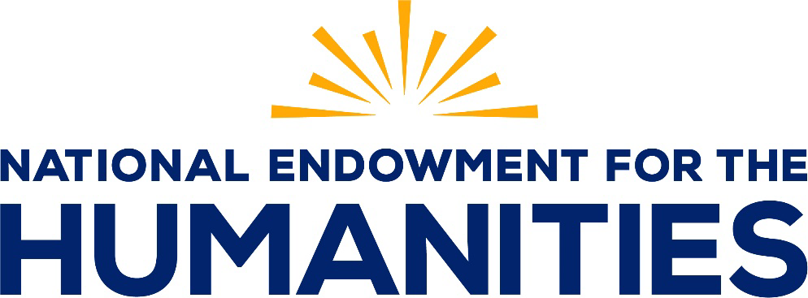

**Notice of Funding Opportunity**

## State and Impact of the Humanities

Funding Opportunity Number: 20250416-XO

Funding Opportunity Type: New

Federal Assistance Listing Number: 45.159

**Application Deadline: April 16, 2025**

Ensure your SAM.gov and Grants.gov registrations and passwords are current.  
It may take several weeks to register with SAM.gov and Grants.gov.  
NEH will not grant deadline extensions for lack of registration.

Office of Data and Evaluation  
Email: [odeprograms@neh.gov](mailto:odeprograms@neh.gov)  
Telecommunications Relay Service: 7-1-1

OMB control number 3136-0134, expiration date October 31, 2027

<!-- page cover -->

## Executive Summary

The National Endowment for the Humanities (NEH) Office of Data and Evaluation is accepting applications for the State and Impact of the Humanities program. This program supports data-grounded research studies that investigate the state, impact, and value of the humanities in the United States. Research designs may be quantitative, qualitative, or mixed, and should involve the active participation of people working in the humanities.

| Funding Opportunity Title | State and Impact of the Humanities |
|---|---|
| Funding Opportunity Number | 20250416-XO |
| Federal Assistance Listing Number | 45.159 |
| Deadlines for Optional Draft | February 14, 2025, 11:59 p.m. Eastern Time |
| Application Deadlines | April 16, 2025, 11:59 p.m. Eastern Time |
| Anticipated Award Announcements | December 2025 |
| Anticipated FY 2026 Funding | Approximately $600,000 |
| Estimated Number and Type of Awards | Approximately 4-8 grants |
| Award Amounts | Level 1: Up to $75,000 Level 2: Up to $150,000 |
| Cost Sharing/Match Required | No |
| Period of Performance | Level 1: Up to 12 months Level 2: Up to 24 months Projects must start between February 1, 2026, and April 1, 2026. |
| Eligible Applicants | - nonprofit organizations recognized as tax-exempt under section 501(c)(3) of the Internal Revenue Code - accredited institutions of higher education (public or nonprofit) - state and local governments and their agencies - federally recognized Native American Tribal governments See [C. Eligibility Information](#c-eligibility-information) for additional information. |
| Program Resource Page | [https://www.neh.gov/program/state-and-impact-humanities](/works/state-and-impact-of-the-humanities-nofo/) |
| Pre-Application Webinar | A prerecorded webinar is available at: [https://www.youtube.com/watch?v=x-V0DvoWnhY](https://gcc02.safelinks.protection.outlook.com/?url=https%3A%2F%2Fwww.youtube.com%2Fwatch%3Fv%3Dx-V0DvoWnhY&data=05%7C02%7Cjingram%40neh.gov%7C6a9d7da26d7a499fb9f008dd364b1a0a%7C93b06459c77d44b6af7fe813cddcdcc3%7C0%7C0%7C638726418361494315%7CUnknown%7CTWFpbGZsb3d8eyJFbXB0eU1hcGkiOnRydWUsIlYiOiIwLjAuMDAwMCIsIlAiOiJXaW4zMiIsIkFOIjoiTWFpbCIsIldUIjoyfQ%3D%3D%7C0%7C%7C%7C&sdata=HR5L24BMv%2FGro%2BoJcdk9Jx1iforVrkCCC9IKDtPESl0%3D&reserved=0) A live Q&A session will be held on February 4, 2025, at 2pm Eastern. [State and Impact of the Humanities Q&A](https://gcc02.safelinks.protection.outlook.com/?url=https%3A%2F%2Fevents.gcc.teams.microsoft.com%2Fevent%2Fa9d141b4-f5da-4e9b-80ff-ef78fdf04257%4093b06459-c77d-44b6-af7f-e813cddcdcc3&data=05%7C02%7Cjingram%40neh.gov%7Cdf226e4031e343c8dd8d08dd36532e6d%7C93b06459c77d44b6af7fe813cddcdcc3%7C0%7C0%7C638726453073707842%7CUnknown%7CTWFpbGZsb3d8eyJFbXB0eU1hcGkiOnRydWUsIlYiOiIwLjAuMDAwMCIsIlAiOiJXaW4zMiIsIkFOIjoiTWFpbCIsIldUIjoyfQ%3D%3D%7C0%7C%7C%7C&sdata=f%2BoNpi2wjU578jhHGqAhs%2F%2F6%2B0AVrdXt8wSva1yy7eA%3D&reserved=0) |
| Published | January 17, 2025 |

<!-- page i -->

## Table of Contents

- [**A. Program Description**](#a-program-description) — 1
  - [1. Purpose](#1-purpose) — 1
  - [2. Background](#2-background) — 4
- [**B. Federal Award Information**](#b-federal-award-information) — 5
  - [1. Type of Application and Award](#1-type-of-application-and-award) — 5
  - [2. Summary of Funding](#2-summary-of-funding) — 6
- [**C. Eligibility Information**](#c-eligibility-information) — 6
  - [1. Eligible Applicants](#1-eligible-applicants) — 6
  - [2. Cost Sharing](#2-cost-sharing) — 7
  - [3. Other Eligibility Information](#3-other-eligibility-information) — 7
- [**D. Application and Submission Information**](#d-application-and-submission-information) — 8
  - [1. Application Package](#1-application-package) — 8
  - [2. Content and Form of Application Submission](#2-content-and-form-of-application-submission) — 8
  - [3. Unique Entity Identifier and System for Award Management](#3-unique-entity-identifier-and-system-for-award-management) — 28
  - [4. Submission Dates and Times](#4-submission-dates-and-times) — 29
  - [5. Intergovernmental Review](#5-intergovernmental-review) — 29
  - [6. Funding Restrictions](#6-funding-restrictions) — 30
- [**E. Application Review Information**](#e-application-review-information) — 30
  - [1. Review Criteria](#1-review-criteria) — 30
  - [2. Review and Selection Process](#2-review-and-selection-process) — 31
  - [3. Assessment of Risk and Other Pre-Award Activities](#3-assessment-of-risk-and-other-pre-award-activities) — 31
  - [4. Anticipated Announcement and Award Dates](#4-anticipated-announcement-and-award-dates) — 32
- [**F. Federal Award Administration Information**](#f-federal-award-administration-information) — 32
  - [1. Federal Award Notices](#1-federal-award-notices) — 32
  - [2. Administrative and National Policy Requirements](#2-administrative-and-national-policy-requirements) — 32
  - [3. Reporting](#3-reporting) — 34
- [**G. Agency Contacts**](#g-agency-contacts) — 35
- [**H. Other Information**](#h-other-information) — 36

<!-- page ii -->

## A. Program Description

### 1. Purpose

This notice solicits applications for the State and Impact of the Humanities program.

State and Impact of the Humanities supports data-grounded research studies that investigate the state, impact, and value of the humanities in the United States. For the purposes of this program, the humanities are broadly defined as activities associated with exploring, interpreting, and preserving the diversity of human cultures, ideas, practices and experiences, past and present. See [Section 2. Background](#2-background) for a more detailed legislative definition of the humanities.

Proposed studies must seek to understand the state, impact, or value of the humanities in one or more of the following research categories. Note that projects should not primarily be conducting work within these categories, but rather *about* them. This program does not fund evaluation of a single humanities program, product, or event, such as an educational initiative, podcast, or exhibition.

1. Humanities Education: Elementary (K-5), middle (6-8), and secondary (9-12) education; post-secondary education (associates, undergraduate, and graduate programs); and educational programming outside of degree-granting learning environments.
2. Humanities Research: Scholarship (for academics, general audiences, or both) conducted within and across humanities disciplines, as well as interdisciplinary research involving humanities questions in the sciences, medicine, law, and other fields.
3. Public Humanities: Humanities work intended to engage with large and diverse public audiences through a broad range of public-facing and publicly accessible formats such as interpretive museum exhibitions, historic site interpretation, public dialogues, public-facing projects led by educational or cultural organizations, and co-creative community collaborations.
4. Preservation and Access: Preserving and providing access to humanities collections, including community and grassroots preservation initiatives.
5. Humanities Infrastructure: Buildings, institutions, and communities and the financial and other resources that support them.

NEH welcomes applications that address topics such as:

- trends in humanities research, teaching, and practice;
- economic, civic, and social impact of the humanities;
- labor and careers in the humanities;
- public perceptions of the humanities;
- humanities infrastructure and funding;
- the humanities and individual or collective well-being;
- broadening participation in the humanities;
- digital technology and the humanities;  and
- the coronavirus pandemic and the humanities.

<!-- page 1 -->

Multinational studies that include the United States are welcome. All projects should inform understanding of some aspect of the humanities in the United States.

#### Project Design and Research Methods

Projects may draw on diverse research fields and should employ at least one empirical study design. Potential approaches may be based on social science paradigms, which include quantitative, qualitative, and mixed-methods research designs.

Examples of quantitative approaches include – but are not limited to – experimental (e.g., randomized control trials), quasi-experimental (e.g., difference-in-differences, regression discontinuity, matching), exploratory, and descriptive designs. In addition to standard (frequentist) econometric methods, NEH welcomes non-standard approaches such as those based in Bayesian and machine learning frameworks.

Examples of qualitative approaches include, but are not limited to, observation, interviews, focus groups, and document analysis. Qualitative work may take any number of theoretical approaches (e.g., case study, ethnography, phenomenology).

Mixed-methods approaches should seek to incorporate all quantitative and qualitative aspects of the project into a unified whole.

Projects that exclusively rely on humanities approaches are unlikely to be competitive, but projects may incorporate humanities research as part of a mixed-methods approach by including methods such as archival research, oral history collection, close reading, critical theory, and critical making. See H. Related Funding Opportunities for NEH programs that fund humanities projects without a significant data component.

NEH especially welcomes impactful research that can help with the development, testing, and standardization of humanities-related programs, practices, models, or tools.

#### Data Sources and Analysis

Projects supported under this program can draw on data acquired during the grant period as well as pre-existing or external data sets, but they must involve data analysis activities that occur during the period of performance. This program does not fund projects that focus exclusively on data acquisition. Projects that involve data collection should follow ethical standards including Institutional Review Board (IRB) oversight as required by the applicant institution and other affiliated institutions.

Data analysis may include quantitative, qualitative, and/or mixed-methods approaches. Data sources may include, but are not limited to surveys, censuses, observations, interviews, focus groups, social media activity, administrative data, and transactional/financial data. Other examples of data sources include archived materials such as written documents, audio/video recordings, or photographs and images.

#### Team and Activities

Project teams may be from a single institution or multiple institutions and may include international and interdisciplinary collaborators. Please note that only one institution may serve as the institution of record for this program.

<!-- page 2 -->

Teams should include people with the expertise necessary to implement the proposed research methods such as social scientists, program evaluators, and statisticians, either as team members or as outside consultants or contractors.

Teams must include at least one person actively working in the humanities (such as a scholar or practitioner, broadly construed). Projects investigating a specific aspect of humanities practice are encouraged to incorporate the active participation of practitioners. If your project involves a specific community such as a religious, racial, ethnic, or regional group, you should include one or more members of that community as part of the project team.

Projects may include an advisory board. The role of the advisory board should be clearly described in [Attachment 4: Biographies](#attachment-4-biographies-required) and in [Attachment 3: Work Plan](#attachment-3-work-plan-required).

Activities supported through this program may include, but are not limited to:

- Planning: meetings, convenings, and community events
- Data collection: archival research, interviews, focus groups, web scraping, and surveys
- Digitization: scanning, metadata, storing, and publication of digital materials
- Data analysis: cleaning, coding, visualization, and statistical analysis
- Communication: writing, publication, social media, podcasts, and conferences
- Dissemination: workshops, seminars, forums, and public lectures

See [D6. Funding Restrictions](#6-funding-restrictions) for unallowable activities. Applications unrelated to the purpose of this program or that include unallowable costs or activities may be judged nonresponsive and returned without review.

See [E1. Review Criteria](#1-review-criteria) for the standards NEH will use to evaluate applications under this notice.

#### Funding categories

##### Level 1

Level 1 awards (up to $75,000 and up to 12 months) are intended to support projects that have clearly defined research questions, data, and scopes, but that are in the planning or testing stages. Level 1 activities might include cataloging and assessing humanities-relevant data sets; preliminary assessment, planning, and relationship building; preliminary analysis of pre-existing data sets; and pilot studies. Outputs might include meeting proceedings, documentation, and release of preliminary data or results.

##### Level 2

Level 2 awards (up to $150,000 and up to 24 months) are intended to support projects that are at the implementation stage. Activities might include data collection, data analysis, and the development of outreach materials. Outputs for Level 2 might include meeting and convening proceedings, publication of data sets and scholarly research, and documentation. A Level 1 award is not a prerequisite for applying for Level 2 funding.

#### Program Outputs and Outcomes

Outputs are the tangible products that result from the award. They are typically produced during the period of performance or draw directly on work completed during that time.

<!-- page 3 -->

Outcomes describe the impact that a project and its outputs will have on individuals, institutions, and the field(s) in which the project aims to intervene. Outcomes may occur after the conclusion of the period of performance.

Examples of outputs and outcomes for this program might include, but are not limited to:

| **Output** | **Outcome** |
|---|---|
| Proceedings from a meeting or convening | New relationships, new collaborations, more robust or inclusive partnerships |
| Public release of open access data sets | Expanded research into previously understudied or inaccessible research areas |
| Publication and presentation of research and results | New pathways of study building on the results of these publications; reference to the research in journalism or policy documents |
| Community engagement and outreach events | Increased awareness of the results of funded research |
| Documentation, tutorials, and toolkits | Use of project resources to implement humanities best practices stemming from funded research |

You will describe your project outputs and outcomes, and how they would support the overall purpose of the State and Impact of the Humanities program, in [Attachment 2: Narrative](#attachment-2-narrative-required). If you receive an award, NEH will assess your performance based on the outputs you identify in the proposal. See F3. Reporting.

### 2. Background

NEH offers this funding opportunity under the authority of [*2*0 U.S.C. § 956](https://uscode.house.gov/view.xhtml?hl=false&edition=prelim&req=granuleid%3AUSC-prelim-title20-section956). Awards are subject to [2 CFR Part 200 Uniform Administrative Requirements, Cost Principles, and Audit Requirements for Federal Awards](https://www.ecfr.gov/cgi-bin/text-idx?SID=236bb02f01d2e050f7a5b60c88a67066&mc=true&node=pt2.1.200&rgn=div5), and the [General Terms and Conditions for Awards to Organizations.](https://www.neh.gov/grants/manage/organizations)

Under [Section 3(a) of the National Foundation on the Arts and the Humanities Act of 1965](https://www.govinfo.gov/content/pkg/USCODE-1998-title20/pdf/USCODE-1998-title20-chap26-subchapI-sec952.pdf), as amended, “The term ‘humanities’ includes, but is not limited to, the study of the following: language, both modern and classical; linguistics; literature; history; jurisprudence; philosophy; archaeology; comparative religion; ethics; the history, criticism and theory of the arts; those aspects of the social sciences which have humanistic content and employ humanistic methods; and the study and application of the humanities to the human environment with particular attention to reflecting our diverse heritage, traditions, and history and to the relevance of the humanities to the current conditions of national life.”

Use the [Funded Projects Query Form](https://securegrants.neh.gov/publicquery/main.aspx) to find examples of NEH-supported projects.

[Learn more about NEH.](https://www.neh.gov/about)

#### NEH Areas of Interest

NEH is especially interested in supporting projects that advance humanities-related work in the following areas. NEH will give all applications equal consideration in accordance with the program’s [review criteria](#1-review-criteria).

<!-- page 4 -->

NEH encourages projects that include Native American and Pacific Islander organizations and communities as applicants and project partners.

#### American Tapestry: Weaving Together Past, Present, and Future

[*American Tapestry: Weaving Together Past, Present, and Future*](https://www.neh.gov/news/american-tapestry-weaving-together-past-present-and-future) s a wide-ranging special initiative at NEH that leverages the humanities to strengthen American democracy, expand opportunity for all, and build resilience for communities and cultural organizations. The initiative encourages humanities projects that elevate the role of civics in schools and public programs, explore America’s expansive history, and build capacity at cultural and educational institutions to benefit all communities.

#### United We Stand: Connecting Through Culture

[*United We Stand: Connecting Through Culture*](https://www.neh.gov/unitedwestand) is an NEH special initiative that supports cross-cultural understanding through the humanities. As a part of this initiative, NEH encourages humanities projects that further our understanding of the nation’s racial, ethnic, gender, and religious diversity; examine the sources of hate and intolerance in the United States; and explore progress towards greater inclusiveness. NEH especially welcomes projects that explore the Muslim American and/or the Jewish American experience, including the history of Islamophobia and/or antisemitism in the United States.

#### NEH’s Support for the Federal Indian Boarding School Initiative

As a part of [NEH’s partnership with the Department of the Interior on the Federal Indian Boarding School Initiative](https://www.neh.gov/bsi), NEH encourages projects that further public understanding and knowledge of the Federal Indian boarding school system. From 1819 through the 1970s the government of the United States operated a system of schools for Native American, Alaska Native, and Native Hawaiian children. NEH encourages projects that document and explore the history of the federal Indian boarding schools as well as projects that contribute to Native and Indigenous cultural and language revitalization.

#### Humanities Perspectives on Artificial Intelligence

Artificial intelligence (AI) is one of the most powerful technologies of our time. Questions about the ethical, legal, and societal challenges and opportunities of AI are fundamentally rooted in the humanities, which include ethics, law, history, philosophy, anthropology, sociology, media studies, and cultural studies. Indeed, NEH’s founding legislation tasks the agency with making the American people “masters of their technology and not its unthinking servants.” NEH’s special initiative *Humanities Perspectives on Artificial Intelligence* supports research projects that seek to understand and address the ethical, legal, and societal implications of AI. NEH is particularly interested in projects that explore the impacts of AI-related technologies on truth, trust, and democracy; safety and security; and privacy, civil rights, and civil liberties. This grant program is one of eight NEH programs that are part of NEH’s *Humanities Perspectives on Artificial Intelligence* initiative. To learn more about the initiative, and to ensure you are applying for the most appropriate program, please see our [page about the AI initiative.](https://www.neh.gov/AI)

## B. Federal Award Information

### 1. Type of Application and Award

NEH seeks new applications in response to this notice.

<!-- page 5 -->

NEH will provide funding in the form of grants.

### 2. Summary of Funding

#### Award amounts

You may request up to $75,000 for Level 1.

You may request between $75,001 to $150,000 for Level 2.

This includes the sum of direct and indirect costs.

NEH anticipates awarding approximately $600,000 among an estimated 4-8 recipients.

NEH will award successful applicants outright funds, which are not contingent on additional funding from other sources.

NEH will not determine the exact amount available for funding until Congress makes official appropriations for FY 2026. NEH will issue awards subject to the availability of appropriated funds. NEH is publishing this notice as a contingency to ensure that NEH can process applications and issue awards in a timely manner, should sufficient funds become available.

#### Period of performance

You may request a period of performance up to 12 months for a Level 1 project and up to 24 months for a Level 2 with a start date between February 1, 2026, and April 1, 2026.

The period of performance is the time during which you may incur expenses to carry out the work under the award. It must start on the first day of the month and end on the last day of the month.

## C. Eligibility Information

### 1. Eligible Applicants

To be eligible to apply, your organization must be established in the United States or its jurisdictions as one of the following:

- a [nonprofit organization recognized as tax-exempt under section 501(c)(3) of the Internal Revenue Code](https://www.irs.gov/charities-non-profits/search-for-tax-exempt-organizations)
- an [accredited institution of higher education](https://ope.ed.gov/dapip/#/home) (public or nonprofit)
- a state or local government or one of their agencies
- a [federally recognized Native American Tribal government](https://www.federalregister.gov/documents/2022/01/28/2022-01789/indian-entities-recognized-by-and-eligible-to-receive-services-from-the-united-states-bureau-of)

Individuals and other organizations, including foreign and for-profit entities, are ineligible.

If your organization is eligible, you may apply on behalf of a consortium of collaborating organizations. If NEH selects your proposal for funding, you will be programmatically, legally, and fiscally responsible for the award.

<!-- page 6 -->

**The recipient may not function solely as a fiscal agent** but should make substantive contributions to the success of the project.

### 2. Cost Sharing

NEH does not require cost sharing in this program.

Cost sharing refers to project costs that are covered with non-NEH funds. You may contribute voluntary cost share if the total project costs exceed the amount awarded by NEH. Voluntary cost share includes:

- cash contributions made to the project by you or a third party
- your unrecovered indirect costs
- in-kind contributions (non-cash contributions, such as property or services, that benefit the project and are contributed without charge) by you or a third party

Do not include voluntary cost share on your Research and Related Budget. The Research and Related Budget should include only funds you are requesting from NEH. You may describe voluntary cost share in your [budget justification.](#l-budget-justification)

Peer reviewers will not consider any voluntary cost share in their evaluation of applications.

Learn about [types of funds NEH offers.](https://www.neh.gov/grants/manage/types-funding)

### 3. Other Eligibility Information

You may submit multiple applications for separate and distinct projects under this notice, but individuals may not serve as a project director or co-director on more than one application to this program per deadline. They may serve as personnel (not in a leadership role) on more than one application to this program per deadline.

Degree candidates may not be project directors or co-directors but may serve in other project roles.

Per [2 CFR § 200.403(f)](https://www.ecfr.gov/current/title-2/subtitle-A/chapter-II/part-200/subpart-E/subject-group-ECFRea20080eff2ea53/section-200.403), NEH does not permit overlapping costs on two or more awards for federal funding and/or approved federal award budgets. If you are submitting proposals to other NEH programs or government agencies, specify when and to whom in the [Supplementary Cover Sheet for NEH Grant Programs](#1-project-director). NEH may disallow overlapping project costs. An individual’s level of effort cannot exceed 100% across multiple active federally funded awards.

NEH does not issue awards to other federal entities. If your project is so closely intertwined with a federal entity that the project takes on characteristics of the federal entity’s own authorized activities, it is ineligible. Proposals for the construction of permanent improvements to lands or facilities that belong to another federal agency are typically ineligible for NEH support. You may use funds from, or sites and materials controlled by, other federal entities in your project, but you may not use them as gifts to release federal matching funds.

NEH does not provide financial assistance to foreign institutions or organizations. If you are an eligible domestic entity, you may apply for collaborative projects involving foreign organizations provided you do not use NEH funds for the purpose of issuing subawards to any foreign organization, as defined in [2 CFR §§ 200.1](https://www.ecfr.gov/cgi-bin/text-idx?SID=35fcd29238edd42c8b1f8b1628e39d47&mc=true&node=pt2.1.200&rgn=div5#se2.1.200_11) and [.331(a)](https://www.ecfr.gov/cgi-bin/text-idx?SID=b76712a585433486e57dafcd521c952e&mc=true&node=pt2.1.200&rgn=div5#se2.1.200_1331). You may obtain the services of foreign individuals and consultants to carry out programmatic activities on a fee-for-service basis, as specified in [2 CFR § 200.459](https://www.ecfr.gov/cgi-bin/text-idx?SID=35fcd29238edd42c8b1f8b1628e39d47&mc=true&node=pt2.1.200&rgn=div5#se2.1.200_1459). You may obtain goods and services from foreign vendors, such as in-country transportation services, in accordance with [2 CFR § 200.331(b)](https://www.ecfr.gov/cgi-bin/text-idx?SID=b76712a585433486e57dafcd521c952e&mc=true&node=pt2.1.200&rgn=div5#se2.1.200_1331). If you plan to submit an application involving international collaboration, contact program staff at [odeprograms@neh.gov.](mailto:odeprograms@neh.gov)

<!-- page 7 -->

**Except for the rare cases covered by its** [**late submission policy**](https://www.neh.gov/grants/policy-on-late-submissions), **NEH will not consider applications submitted after the deadline.**

**NEH will not consider incomplete, nonresponsive, or ineligible applications for funding.**

**NEH will not consider applications that exceed mandatory page limits or deviate from formatting instructions.** See the [Application Components Table.](#2-content-and-form-of-application-submission)

## D. Application and Submission Information

### 1. Application Package

You must apply using Grants.gov Workspace or a Grants.gov system-to-system solution. You can find this funding opportunity in Grants.gov under number 20250416-XO. There is also a link on the [program resource page.](/works/state-and-impact-of-the-humanities-nofo/)

Once you have located the funding opportunity in Grants.gov, you will find the application package under the “Package” tab. It includes a series of required and conditionally required forms. You will upload additional application components using the [Attachments Form.](#research-and-related-budget-grantsgov-form)

You must complete a multistep registration process prior to submitting your application. See D3. [Unique Entity Identifier and System for Award Management.](#3-unique-entity-identifier-and-system-for-award-management)

Contact [odeprograms@neh.gov](mailto:odeprograms@neh.gov) to request a paper copy of this notice.

### 2. Content and Form of Application Submission

Your application will include a narrative, budget, and other [forms](#attachments-form-grantsgov-form) and [attachments](#application-components-attachments). You will complete the forms within Grants.gov Workspace and upload other components into the [Attachments Form](#attachments-form-grantsgov-form). See the [Application Component Table.](#application-component-table)

#### Application formatting

Your application attachments must be PDFs and conform to the following formatting requirements, unless otherwise indicated:

- pages no larger than standard letter (8 ½" x 11”)
- at least one-inch margins on all sides for all pages
- a font no smaller than 11 points

In addition, NEH encourages you to format your attachments consistent with the following:

- single-spacing
- a readable font such as Arial, Georgia, Helvetica, or Times New Roman
- any standard citation style (include citations in page counts)

<!-- page 8 -->

#### Application Component Table

NEH has assigned each application component one of the following designations:

- Required: You must submit this component.
- Conditionally required: You must submit this component if your proposal meets the specified conditions.
- Recommended: NEH encourages, but does not require, you to submit this component.
- Conditionally required for recipients: You are encouraged but not required to submit this component when you apply. You must submit it if you receive an award if your proposal meets the specified conditions.

**NEH will not review applications missing any required documents or relevant conditionally required documents.**

**Do not include attachments other than those listed in the table in this notice. If you do, NEH will reject your application.**

In addition, NEH has established page limits for some application components:

- Mandatory: You must not exceed the page limit.
- Suggested: NEH encourages, but does not require, you to abide by the page limit.

Note page limits and formatting instructions in this notice. **NEH will not review applications that exceed mandatory page limits or deviate from formatting instructions.**

| **Application Component** | **File Name** | **Designation** | **Page limit** |
|---|---|---|---|
| **Attachments** |  |  |  |
| 1: List of personnel | personnel.pdf | Required | 2 (suggested) |
| 2: Narrative | narrative.pdf | Required | 6 (mandatory) |
| 3: Work plan | workplan.pdf | Required | 3 (mandatory) |
| 4: Biographies | biographies.pdf | Required | 1 paragraph per person (suggested) |
| 5: Data management and sustainability | datamanagement.pdf | Required | 2 (mandatory) |
| 6: Letters of commitment | letters.pdf | Recommended | 1 per letter (suggested) |
| 7: Appendices | appendices.pdf | Recommended | 5 (suggested) |
| 8: Subrecipient budget(s) | subrecipient.pdf | Conditionally required |  |
| 9: Federally negotiated indirect cost rate agreement | agreement.pdf | Conditionally required |  |
| 10: Explanation of delinquent federal debt | delinquentdebt.pdf | Conditionally required for recipients |  |

<!-- page 9 -->

| **Application Component** | **File Name** | **Designation** | **Page limit** |
|---|---|---|---|
| **Grants.gov forms** |  |  |  |
| SF-424 Application for Federal Assistance - Short Organizational |  | Required |  |
| Supplementary Cover Sheet for NEH Grant Programs |  | Required |  |
| Project/Performance Site(s) Location Form |  | Required |  |
| Research and Related Budget and Budget Justification |  | Required |  |
| Attachments Form |  | Required |  |
| Certification Regarding Lobbying |  | Conditionally required for recipients |  |
| Standard Form-LLL “Disclosure of Lobbying Activities” |  | Conditionally required for recipients |  |

#### Application Components: Attachments

Each attachment must be a single PDF file. See the [Attachments Form instructions](#attachments-form-grantsgov-form) for further guidance about file requirements. Read those instructions carefully, as Grants.gov will not accept files that do not meet the requirements.

##### Attachment 1: List of Personnel (required)

List all project personnel and advisory board members along with the following information: job title, institutional affiliation, and project role (i.e., J.B. Smith, Assistant Professor of English, Smallville College, Project Co-Director and Humanities Expert; S.V. Perez, Metadata Librarian, Smallville Public Libraries, Research Assistant and Humanities Expert). Clearly identify the project director and any co-directors. Clearly identify the humanities expert(s).

Personnel refers to all members of the project team conducting programmatic activities. The project director is responsible for programmatic aspects of the award and day-to-day management of the proposed project, including federal compliance and documentation. Other project roles vary widely, and may include positions such as team lead, principal investigator, graduate research assistant, consultant, and advisory board member.

The names on this list should match the names mentioned in [Attachment 3: Work plan,](#attachment-3-work-plan-required) Attachment 4: Biographies, and the [Activities section of the narrative](#activities-approximately-1-page). NEH uses this list to ensure that prospective peer reviewers have no conflicts of interest with the proposals they evaluate.

This attachment has a suggested maximum length of two pages. Name the file personnel.pdf.

##### Attachment 2: Narrative (required)

Compose a comprehensive description of your proposed project. Your narrative should be succinct, well organized, and free of technical terms and jargon so that peer reviewers can understand the proposed project.

<!-- page 10 -->

**You must limit the narrative to six single-spaced pages**. Do not include an executive summary, cover page, or table of contents. You may include images, charts, diagrams, footnotes, or endnotes if they fit within the page limit. These materials may alternatively be included in Attachment 7: Appendices.

Organize your narrative using the following headings. Each section aligns with one or more review criteria NEH will use to evaluate your proposal.

Include all required and relevant details within the narrative. You may embed links to external sources, but NEH does not require peer reviewers to visit links.

###### Overview of the Project (approximately 1,000 characters)

State if you are applying for Level 1 or Level 2 funding. Provide a concise overview of your project written for a non-specialist audience. State the main goal of your project, key activities that will take place during the period of performance, intended audiences, and expected outputs and outcomes.

Note that this section can be identical to the “Description of project” field in Section 6 (“Project Information”) of the [SF-424 Application for Federal Assistance - Short Organizational form](#sf-424-application-for-federal-assistance-short-organizational-grantsgov-form). This field has a limit of 1,000 characters, including spaces.

###### Humanities Significance (approximately 2 pages)

State the research question(s) that your project proposes to address and explain why this question fills an important need or gap in the humanities. Connect the project to NEH’s research priorities (listed in A1. Purpose) and to larger topics beyond your specific study’s concerns. Situate your project within the related research. Summarize your project’s anticipated value for the field.

In this section, you must state which of the five research categories described in A 1. Purpose your project addresses. Your project may address more than one.

###### Data and Methods (approximately 1.5 pages)

Describe your project’s research design, including the data, methodology, methods, and theoretical framework, as appropriate. Address any privacy or ethical concerns related to the project data. You may use Attachment 5: Data Management and Sustainability to detail the principles governing your data collection and management.

###### Activities (approximately 1 page)

Summarize the primary activities you will accomplish during the period of performance, and how you will measure success and impact. Include a discussion of how the project will support and benefit all project staff, including students and contingent faculty, through project-based learning, mentoring, immersion in the activities of the institution, or other professional development opportunities.

This section should complement the work plan without being redundant by providing a narrative overview and context.

###### Outputs, Dissemination, and Outcomes (approximately 1 page)

Explain the expected final outputs (tangible products) of the award and detail your plans to disseminate project results. Specify how you plan to ensure that the results of this work will be shared with the broadest possible relevant audience. Detail your plans for making open access and accessible outputs, as appropriate. Discuss anticipated mid- and long-term outcomes of this project.

<!-- page 11 -->

The narrative must not exceed six pages. Name the file narrative.pdf.

##### Attachment 3: Work plan (required)

Your work plan should reflect the major activities you describe in your narrative, the project dates on your SF-424 Application for Federal Assistance - Short Organizational, and your Research and Related Budget.

Describe the specific and measurable project activities that will be completed over the course of the project. Include a detailed schedule of tasks and milestones and indicate the staff member(s) responsible for each component (if applicable, include advisory board member responsibilities). Specify how you will measure the progress of your project at key milestones. You may use a Gantt chart or other schematic.

Briefly discuss any IRB review your project requires and the expected timeline. Identify risks such as staff attrition, data collection delays, and travel restrictions, and note how they might adversely affect the overall schedule. Describe strategies to mitigate these risks to keep the project on budget and on schedule.

The work plan must not exceed three pages. Name the file workplan.pdf.

##### Attachment 4: Biographies (required)

Provide a one-paragraph biography for all members of your project team. Use this biography to illustrate how each individual’s technical competence and/or humanities qualifications will enable them to fulfill their responsibilities on the project. Indicate if a person is a current degree candidate (student). You may indicate humanities expertise in the biography (i.e. “S.V. Perez is a humanities expert and metadata librarian…”). If you plan to hire new staff, provide a one-paragraph job description for any open positions.

If your project has an advisory board, provide a brief explanation of its function as well as a one-paragraph biography for each member.

You must not submit CVs or resumes, or NEH will deem your application nonresponsive and reject it. Name the file biographies.pdf.

##### Attachment 5: Data management and sustainability (required)

Prepare a data management plan (DMP) for your project team to consult during and beyond the project’s period of performance.

For the purposes of the DMP, the data produced by your project may include, in addition to data collected and analyzed, software code, algorithms, digital tools, conference proceedings, reports, articles, research notes, or websites.

In your DMP, identify the types of data that your project will collect or generate, and explain:

- the format of the data
- where the data will be stored

<!-- page 12 -->

- what institution will be responsible for maintaining the data and metadata, and the minimum length of their commitment to data maintenance and storage
- whether the data will be shared publicly, how, and under what conditions

You may include this information as a table.

Explain the project’s policies on public access, privacy, security, and intellectual property. Describe any legal or ethical concerns relating to the data your project will collect and produce, and any risks that might impact your project’s ability to achieve your data maintenance and storage goals. In the specific case that your project aims to create a dataset resulting from applied research, confirm that your preservation and access plan for that data adheres to [FAIR Principles](https://www.go-fair.org/fair-principles/) and the [CARE Principles for Indigenous Data Governance](https://www.gida-global.org/care), as appropriate. See section [F 2. Administrative and National Policy Requirements](#2-administrative-and-national-policy-requirements) for information about NEH’s policies regarding providing access to NEH-funded products, copyright, protecting personal identifiable information, and consent for survey participation.

Finally, if applicable, briefly discuss your long-term plans for sustaining data produced by this project beyond the period of performance.

This attachment must not exceed two pages. Name the file datamanagement.pdf.

##### Attachment 6: Letters of commitment (recommended)

If your project includes people outside the applicant institution, such as project team members, consultants, contractors, or advisory board members, you may include brief letters of commitment confirming their involvement and responsibilities. These letters help peer reviewers see evidence of commitment by named personnel.

Letters of commitment should not include a discussion of the overall value of the project or its potential impact. Do not include letters of support from people or institutions that are not actively involved in the proposed project.

Elected government officials, NEH staff, and current members of the [National Council on the Humanities](https://www.neh.gov/about/national-council-on-the-humanities) may not serve as letter writers.

Each letter should not exceed one page. Letters should be combined into a single file. Name the file letters.pdf.

##### Attachment 7: Appendices (recommended)

Use the appendices, as appropriate, to provide:

- bibliography or endnotes
- lists of archives, collections, databases, datasets, or repositories for primary source research
- draft workshop or meeting agendas
- lists of committed participants and/or selection criteria for participants
- methodological workflow schematics
- sample source material
- results from preliminary research, experimentation, or community workshops
- sample permissions agreements, licenses, or proofs of informed consent
- examples of interview or survey questions

This file should not exceed five pages. Name the file appendices.pdf.

<!-- page 13 -->

##### Attachment 8: Subrecipient budget(s) (conditionally required)

If your project includes subawards, you must provide a separate Research and Related Budget and budget justification for each subrecipient. Download a [fillable PDF of the Research and Related Budget form](https://www.neh.gov/sites/default/files/inline-files/RR_Budget10_3_0-V3.0.pdf) from the NEH website for each subrecipient. You must open and complete this form in Adobe Reader 8.0 or higher rather than in your web browser.

Prepare a budget and budget justification for each subrecipient using the same instructions in this notice, with a few exceptions:

- Enter the subrecipient’s Unique Entity Identifier, organization name, and period of performance start and end date (these fields will not prepopulate).
- For “budget type,” check “Subaward/Consortium.”

If your subrecipients have a federally negotiated indirect cost rate, you must honor it. If they do not have a federally negotiated indirect cost rate, they may negotiate a rate with you consistent with [2 CFR § 200.414](https://www.ecfr.gov/cgi-bin/text-idx?SID=d22b09774a679ad264cf0098635dabb8&mc=true&node=pt2.1.200&rgn=div5#se2.1.200_1414) or use the de minimis rate.

Rather than attaching related documents (budget justification, additional personnel, additional equipment) to the form itself, you will separately convert each document into a PDF and combine all subrecipients’ budget forms and related documents into a single document. Do not attach portfolios containing multiple PDFs.

NEH cannot accept security-enhanced PDFs (e.g., XFA files, PDFs that include password-protection, encryption, digital signatures). Remove these features (or “flatten” these files) before merging them into a single PDF and uploading it to the Attachments Form.

Name the file subrecipient.pdf.

##### Attachment 9: Federally negotiated indirect cost rate agreement (conditionally required)

If your organization is claiming indirect costs and has a current federally negotiated indirect cost rate agreement, provide a copy of the agreement. If applicable, provide the indirect cost rate agreements for subrecipients claiming indirect costs. If you and your subrecipients are requesting the de minimis rate, you do not need to submit this attachment.

Name the file agreement.pdf.

##### Attachment 10: Explanation of delinquent federal debt (conditionally required for recipients)

If your organization is delinquent in the repayment of any federal debt, explain why. Provide evidence that you have entered into a repayment agreement with the Internal Revenue Service, if applicable, and that you are current on all payments due. Examples of relevant debt include delinquent payroll or other taxes, audit disallowances, and benefit overpayments. See [OMB Circular A-129](https://obamawhitehouse.archives.gov/omb/circulars_a129_rev2013).

Name the file delinquentdebt.pdf.

<!-- page 14 -->

#### Application Components: Grants.gov Forms

##### SF-424 Application for Federal Assistance – Short Organizational (Grants.gov form)

This form requests basic information about your institution, the proposed project, and key contacts. Items 1, 2, and 4 will be automatically filled in; leave item 3 blank.

##### 5. Applicant Information

a-d. Provide your organization’s legal name, address, and web address. Select the applicant type that best describes your organization from the drop-down menu.

e-f. Provide your organization’s employer/taxpayer identification number (EIN/TIN), and Unique Entity Identifier assigned by the [System for Award Management](#3-unique-entity-identifier-and-system-for-award-management). If you do not know your identifier, contact your grant administrator or chief financial officer. See [D3. Unique Entity Identifier and System for Award Management.](#3-unique-entity-identifier-and-system-for-award-management)

g. Provide your [congressional district](https://www.house.gov/representatives/find-your-representative) with your two-character state abbreviation followed by your three-character district number. For example, if your institution is located in the 5th congressional district of Alabama, enter “AL-005.” If your institution is in a state or U.S. jurisdiction that does not have districts, enter “000” in place of the district number. If your institution is outside the U.S., enter “00-000.”

###### 6. Project Information

a. Provide your project’s title. It should be brief (no more than 125 characters, including spaces), descriptive of the project, and easily understood by the general public. If NEH funds your project, the agency may retitle your project for clarity in internal and external communications, including the public announcement of awards. Regardless, you may use your preferred title when carrying out the project.

b. Provide a brief description of your project (no more than 1,000 characters, including spaces). You should write the description for a nonspecialist audience, clearly stating the importance of the proposed work and its relation to larger issues in the humanities. This description will appear on the cover sheet of your application and will serve as a project abstract during the review process. If funded, this description will also appear in NEH’s database of funded projects.

c. State your project’s period of performance start and end dates. Your project must start on the first day of the month and end on the last day of the month. See [B2. Summary of Funding](#award-amounts) for allowable periods of performance.

###### 7. Project Director

Provide the project director’s name, title, and contact information. The project director is responsible for the programmatic aspects and day-to-day management of the proposed project.

If the project director is not employed by the applicant organization, you must have a formal written agreement with the project director that specifies an official relationship between the parties even if the relationship does not involve a salary or other form of remuneration.

<!-- page 15 -->

###### 8. Primary Contact/Grant Administrator

Provide the name, title, and contact information for the official responsible for the administration of the award (e.g., negotiating the budget and ensuring compliance with the terms and conditions of the award).

**As a matter of NEH policy, the project director and primary contact/grant administrator must not be the same person.**

The grant administrator (also called the “institutional grant administrator”) functions as the representative of the recipient organization. This individual should have authority to act on the organization’s behalf in matters related to the administration of the award. The institutional grant administrator must sign or countersign financial reports and prior approval requests such as budget revisions, extensions to the period of performance, and changes in key personnel.

NEH will address official correspondence (for example, the offer letter or Notice of Action) to the institutional grant administrator and copy the project director.

###### 9. Authorized Representative

Provide the name, title, and contact information for the authorized organization representative (AOR) who is submitting the application on behalf of the institution. This person, often called an “authorizing official,” is typically someone from the Office of Sponsored Projects, or the institution’s president, vice president, executive director, or board chair. The institution’s Grants.gov E-Business Point of Contact must designate the AOR. The AOR’s signature must match the contact’s name. See the [Grants.gov Online User Guide.](https://apply07.grants.gov/help/html/help/index.htm?callingApp=custom#t=GetStarted%2FGetStarted.htm)

##### Supplementary Cover Sheet for NEH Grant Programs (Grants.gov form)

###### 1. Project Director

Select the project director’s major field of study from the drop-down menu.

###### 2. Institutional Information

Select your institution type from the drop-down menu.

###### 3. Project Funding

Enter the amount requested under “Outright Funds.” Do not enter anything under “Federal Match” or “Cost Sharing.”

###### 4. Application Information

Indicate whether you or others will submit complementary proposals to other NEH programs, government agencies, or private entities. If so, specify when and to whom. NEH will not consider this information when evaluating the merits of your proposal. See [C3. Other Eligibility Information](#3-other-eligibility-information) for restrictions regarding overlapping costs.

For type of application, check “new.”

Select the project’s primary discipline from the drop-down menu. If applicable, select the project’s secondary and tertiary disciplines.

<!-- page 16 -->

##### Project/Performance Site Location(s) Form (Grants.gov form)

Provide the primary location and any other locations where you will conduct project activities during the period of performance.

Enter [congressional districts](https://www.house.gov/representatives/find-your-representative) using the two-letter state abbreviation followed by your three-character district number. For example, if your institution is in the 5th congressional district of Alabama, enter “AL-005.” If your institution is in a state or U.S. jurisdiction that does not have districts, enter “000” in place of the district number. If your institution is outside the U.S., enter “00-000.”

The form has space for 300 sites. If your project includes additional locations, list them in a separate document. Save the document as a PDF named additionallocations.pdf and attach it under “Additional Locations.”

#### Research and Related Budget (Grants.gov form)

You must submit a project budget using the Research and Related Budget form included in the Grants.gov application package and attach a [budget justification](#l-budget-justification). Complete the [SF-424 Application for Federal Assistance - Short Organizational form](#sf-424-application-for-federal-assistance-short-organizational-grantsgov-form) prior to completing your Research and Related Budget.

Complete a separate detailed budget for each 12-month span of the period of performance. The form will generate a cumulative budget.

The form indicates required fields in yellow. Round all costs to the nearest whole dollar. The inclusion of a cost category on the Research and Related Budget form does not automatically indicate that an expense is allowable in this program. See [D6. Funding Restrictions](#6-funding-restrictions) to ensure that proposed costs are allowable.

All costs must be reasonable, necessary to accomplish project objectives, allowable in terms of [2 CFR 200 Subpart E - Cost Principles](https://www.ecfr.gov/current/title-2/subtitle-A/chapter-II/part-200/subpart-E), auditable, and incurred during the period of performance. Costs are subject to audit, record retention, and other requirements set forth in [2 CFR 200 Subpart F - Audit Requirements.](https://www.ecfr.gov/current/title-2/subtitle-A/chapter-II/part-200#subpart-F)

You should include only your own employees under [A. Senior/Key Person](#a-seniorkey-person) and [B. Other Personnel](#b-other-personnel). Include team members in leadership roles in the project under [A. Senior/Key Person](#a-seniorkey-person). Include other team members under [B. Other Personnel](#b-other-personnel). Include costs for non-employees under [F3. Consultant Services](#3-consultant-services) or [F5. Subawards/Consortium/Contractual Costs](#5-subawardsconsortiumcontractual-costs), as appropriate.

If you charge indirect costs to the project, you must not charge the same costs to the project as direct costs. See [H. Indirect Costs.](#h-indirect-costs)

##### Introductory Fields

Your [SF-424 Application for Federal Assistance - Short Organizational](#sf-424-application-for-federal-assistance-short-organizational-grantsgov-form) form should pre-populate introductory fields. If not pre-populated, indicate your organization’s Unique Entity Identifier, name, and the period of performance. This should match the information you provide on your SF-424 Application for Federal Assistance - Short Organizational. Your period of performance must start on the first day of the month and end on the last day of the month. For budget type, check “project.”

<!-- page 17 -->

##### A. Senior/Key Person

Include personnel who are employed by the applicant institution in leadership roles on the project. Do not include collaborators at other institutions or consultants, as you will include them in [F. Other Direct Costs.](#f-other-direct-costs)

Enter the base salary (annual compensation) for each senior/key person and identify the number of months they will devote to the project. If you do not include base salaries, your award may be delayed.

Many non-academic institutions organize their budgets using calendar months. If your organization does not differentiate between academic and summer months, use only the calendar months column.

If your organization follows an academic calendar, you may differentiate levels of effort by using the academic and summer months columns. You may use both columns if your institutional policy requires separate accounting for academic and summer months. If your institution does not use a nine-month academic year and a three-month summer period, include your institution's definition of these terms in your [budget justification.](#l-budget-justification)

Enter the requested salary and fringe benefits for each senior/key person. Per [2 CFR § 200.431](https://www.ecfr.gov/cgi-bin/text-idx?SID=35fcd29238edd42c8b1f8b1628e39d47&mc=true&node=pt2.1.200&rgn=div5#se2.1.200_1431), fringe benefits are allowances and services you provide in addition to salaries and wages. Fringe benefits may include the costs of leave (e.g., vacation, family-related, sick, or military), employee insurance, pensions, and unemployment benefit plans.

Requested salaries and wages must comply with [2 CFR §§ 200.430](https://www.ecfr.gov/cgi-bin/text-idx?SID=35fcd29238edd42c8b1f8b1628e39d47&mc=true&node=pt2.1.200&rgn=div5#se2.1.200_1430) and [.466](https://www.ecfr.gov/cgi-bin/text-idx?SID=35fcd29238edd42c8b1f8b1628e39d47&mc=true&node=pt2.1.200&rgn=div5#se2.1.200_1466) and fringe benefits must comply with [2 CFR § 200.431.](https://www.ecfr.gov/cgi-bin/text-idx?SID=35fcd29238edd42c8b1f8b1628e39d47&mc=true&node=pt2.1.200&rgn=div5#se2.1.200_1431)

The form will calculate the requested salary and fringe benefits for each key person.

The form has space for up to eight people. If you request funds for additional key personnel, list them in a separate document using the same format as the Research and Related Budget. Save the document as a PDF named additionalpersonnel.pdf and attach it under “Additional/Senior Key Persons.” If applicable, enter the total funds requested for additional senior/key persons in the "Total Funds requested for all Senior/Key Persons in the attached file" field.

##### B. Other Personnel

Include personnel employed by the applicant institution who will play a supporting role on the project. For each project role, identify the number of personnel proposed, the total number of months, total salary, and total fringe benefits requested as described in [A. Senior/Key Person.](#a-seniorkey-person-budget-justification) The form will calculate the requested salary and fringe benefits for each group.

###### Post-doctoral associates, graduate students, and undergraduate students

If applicable, include charges for tuition remission and other forms of compensation paid to students as, or in lieu of, salaries and wages. You must report such costs in accordance with [2 CFR § 200.466(b)](https://www.ecfr.gov/current/title-2/subtitle-A/chapter-II/part-200/subpart-E/subject-group-ECFRed1f39f9b3d4e72/section-200.466), and must treat them as direct or indirect costs in accordance with the actual work performed. You may charge tuition remission on an average rate basis.

<!-- page 18 -->

###### Administrative/Clerical

In most circumstances, you should include the salaries of administrative, secretarial, or clerical staff as indirect costs (see [H. Indirect Costs](#h-indirect-costs)). Per [2 CFR § 200.413(c)](https://www.ecfr.gov/cgi-bin/text-idx?SID=b76712a585433486e57dafcd521c952e&mc=true&node=pt2.1.200&rgn=div5#se2.1.200_1413), you may charge salaries for administrative or clerical staff as direct costs only if they meet the following conditions:

- The administrative or clerical services are integral to a project or activity.
- The individuals can be specifically identified with the project or activity.
- You explicitly include these costs in your budget or have prior written approval from NEH.
- You do not recover the costs as indirect costs.

If you include administrative or clerical salaries in your budget as direct costs, describe how direct charging meets all four conditions in your [budget justification](#l-budget-justification). NEH may request additional information to assess if proposed costs are allowable.

###### Additional Other Personnel

List additional project roles, if applicable. The form has space for six named roles. If you have more, combine project roles on the form and explain in your [budget justification.](#l-budget-justification)

Requested salaries and wages must comply with [2 CFR §§ 200.430](https://www.ecfr.gov/cgi-bin/text-idx?SID=35fcd29238edd42c8b1f8b1628e39d47&mc=true&node=pt2.1.200&rgn=div5#se2.1.200_1430) and [.466](https://www.ecfr.gov/cgi-bin/text-idx?SID=35fcd29238edd42c8b1f8b1628e39d47&mc=true&node=pt2.1.200&rgn=div5#se2.1.200_1466) and fringe benefits must comply with [2 CFR § 200.431.](https://www.ecfr.gov/cgi-bin/text-idx?SID=35fcd29238edd42c8b1f8b1628e39d47&mc=true&node=pt2.1.200&rgn=div5#se2.1.200_1431)

Do not list collaborators at other institutions or consultants here, as you will include them in [F. Other Direct Costs.](#f-other-direct-costs)

##### C. Equipment Description

Equipment is nonexpendable personal property costing $10,000 or more per item and having a service life of more than one year (unless your organization has established a lower level). See [2 CFR §§ 200.313](https://www.ecfr.gov/cgi-bin/text-idx?SID=5fbdd231f8b8033a7620f7101a79f2d7&mc=true&node=pt2.1.200&rgn=div5#se2.1.200_1313) and [.439.](https://www.ecfr.gov/cgi-bin/text-idx?SID=5fbdd231f8b8033a7620f7101a79f2d7&mc=true&node=pt2.1.200&rgn=div5#se2.1.200_1439)

You may purchase equipment if analysis demonstrates that it is more economical and practical than leasing. You may charge depreciation in compliance with [2 CFR § 200.436*.*](https://www.ecfr.gov/cgi-bin/text-idx?SID=35fcd29238edd42c8b1f8b1628e39d47&mc=true&node=pt2.1.200&rgn=div5#se2.1.200_1436) If you lease equipment, include equipment rental/user fees in [F. Other Direct Costs.](#f-other-direct-costs)

Per [2 CFR § 200.322](https://www.ecfr.gov/cgi-bin/text-idx?SID=b76712a585433486e57dafcd521c952e&mc=true&node=pt2.1.200&rgn=div5#se2.1.200_1322), you should preference goods, products, and materials produced in the United States purchased or acquired under a federal award. If NEH funds your project, you must include the requirements of this section in all subawards, contracts, and purchase orders for work or products.

List each item of equipment you plan to purchase and its estimated cost, including shipping and maintenance. Include supporting information, such as a price quote, in your [budget justification.](#l-budget-justification)

The form has space for ten items. If you request funds for additional equipment, list them in a separate document. Save the document as a PDF named additionalequipment.pdf and attach it under “Additional Equipment.” Enter the total funds for the additional equipment in the “Total funds requested for all equipment listed in the attached file” field.

As a matter of programmatic policy, the combination of equipment and materials and supplies must not be more than 1/3 of total direct costs.

<!-- page 19 -->

The form will calculate total equipment costs.

##### D. Travel

Enter the total funds you are requesting for both domestic travel (local and long-distance) and foreign travel (including travel to Canada and Mexico). Detail costs for each trip in your [budget justification.](#l-budget-justification) **If you make non-refundable travel arrangements, it is at your own risk. You cannot charge cancelled travel to your award.**

Travel costs must comply with [2 CFR § 200.475](https://www.ecfr.gov/cgi-bin/text-idx?SID=35fcd29238edd42c8b1f8b1628e39d47&mc=true&node=pt2.1.200&rgn=div5#se2.1.200_1475) and the [General Terms and Conditions for Awards to Organizations](https://www.neh.gov/grants/manage/organizations). NEH uses the General Services Administration's [published per diem rates](https://www.gsa.gov/travel/plan-book/per-diem-rates) to assess if proposed travel costs are reasonable.

Include funds for two to three project team members to attend a two-day meeting in Washington, D.C., in November of 2026. If an in-person meeting does not occur, you may rebudget these funds for other allowable activities.

You may not use NEH funds to attend regularly occurring professional meetings unless the purpose of attending is to disseminate project-related findings.

This section is for key and other personnel travel. Include travel costs for participants in [E3,](#3-travel) Participant Support Costs, and travel costs for consultants in [F3](#3-consultant-services), Consultant Services. The form will calculate total travel costs.

##### E. Participant/Trainee Support Costs

Per [2 CFR § 200.1](https://www.ecfr.gov/cgi-bin/text-idx?SID=35fcd29238edd42c8b1f8b1628e39d47&mc=true&node=pt2.1.200&rgn=div5#se2.1.200_11), participant generally means an individual participating in or attending program activities under a Federal award, such as trainings or conferences, but who is not responsible for implementation of the Federal award. Individuals committing effort to the development or delivery of program activities under a federal award (such as consultants, project personnel, or staff members of a recipient or subrecipient) are not participants. Examples of participants may include community members participating in a community outreach program, members of the public whose perspectives or input are sought as part of a program, students, or conference attendees.

[2 CFR § 200.1](https://www.ecfr.gov/cgi-bin/text-idx?SID=35fcd29238edd42c8b1f8b1628e39d47&mc=true&node=pt2.1.200&rgn=div5#se2.1.200_11) defines participant support costs as direct costs for expenses such as stipends, travel allowances, subsistence allowances, and registration fees paid to or on behalf of participants (but not employees) in connection with conferences or training projects.

[2 CFR § 200.432](https://www.ecfr.gov/cgi-bin/text-idx?SID=b76712a585433486e57dafcd521c952e&mc=true&node=pt2.1.200&rgn=div5#se2.1.200_1432) defines a conference as a meeting, retreat, seminar, symposium, workshop, or event, the primary purpose of which is the dissemination of technical information beyond the non-federal entity, and which is necessary and reasonable for successful performance under the federal award.

Include supporting information in your [budget justification.](#l-budget-justification) **If you or your participants make nonrefundable travel arrangements, it is at your own risk. You cannot charge cancelled travel to your award.**

If you claim indirect costs, exclude participant support costs from the MTDC base. The form will calculate total participant support costs.

<!-- page 20 -->

###### 1. Tuition/Fees/Health Insurance

Leave this field blank.

###### 2. Stipends

Enter the requested funds for participant stipends.

###### 3. Travel

Enter the requested funds for participant travel. In your [budget justification](#l-budget-justification), name the travelers (if known) and itemize their travel expenses (e.g., roundtrip airfare, mileage, public transportation fares, parking fees).

###### 4. Subsistence

Enter the requested funds for participant subsistence (e.g., lodging and service charges; meals, including taxes and tips; and incidental expenses).

###### 5. Other

Describe other participant support costs (e.g., local ground transportation to venues, admission fees) and enter the requested funds. Provide additional information in your [budget justification.](#l-budget-justification)

###### Number of Participants/Trainees

Enter the number of participants. This field cannot exceed 999.

##### F. Other Direct Costs

The form will calculate total other direct costs.

###### 1. Materials and Supplies

Enter the requested funds for materials and supplies that cost less than $10,000 per item, regardless of its useful life, unless your organization has established a different capitalization level. See [2 CFR §§ 200.314](https://www.ecfr.gov/cgi-bin/text-idx?SID=69589b313a9c3cdeb5db82386820796f&mc=true&node=se2.1.200_1314&rgn=div8) and [.453.](https://www.ecfr.gov/cgi-bin/text-idx?SID=eefa8a82f165dbb9f6351146c9e5f1e3&mc=true&node=se2.1.200_1453&rgn=div8)

The combination of equipment and materials and supplies costs must not be more than 1/3 of total direct costs.

###### 2. Publication Costs

Enter the requested funds for publication costs, including the costs of documenting, preparing, publishing, or otherwise making available to others the findings and products of the work conducted under the award. Include supporting information in your [budget justification.](#l-budget-justification)

###### 3. Consultant Services

Enter the requested funds for consultant services. If your project includes an external advisory committee, include associated costs here.

Consultant fees must comply with [2 CFR § 200.459.](https://www.ecfr.gov/cgi-bin/text-idx?SID=35fcd29238edd42c8b1f8b1628e39d47&mc=true&node=pt2.1.200&rgn=div5#se2.1.200_1459)

###### 4. Automated Data Processing (ADP)/Computer Services

Enter the requested funds for ADP/computer services, including computer-based retrieval of scientific, technical, and education information. Include personal computers and accessories under [Materials and Supplies](#1-materials-and-supplies). If a third party will provide these services, include them in [Subawards/Consortium/Contractual Costs.](#5-subawardsconsortiumcontractual-costs)

<!-- page 21 -->

###### 5. Subawards/Consortium/Contractual Costs

Enter the total funds you are requesting (both direct and indirect costs) for activities third parties will perform.

Per [2 CFR §§ 200.1](https://www.ecfr.gov/cgi-bin/text-idx?SID=b76712a585433486e57dafcd521c952e&mc=true&node=pt2.1.200&rgn=div5#se2.1.200_11) and [.331(a)](https://www.ecfr.gov/cgi-bin/text-idx?SID=b76712a585433486e57dafcd521c952e&mc=true&node=pt2.1.200&rgn=div5#se2.1.200_1331), a subaward is an award you issue to a subrecipient to carry out part of your federal award. Subawards do not include payments to contractors (as defined in [2 CFR §§ 200.1](https://www.ecfr.gov/cgi-bin/text-idx?SID=b76712a585433486e57dafcd521c952e&mc=true&node=pt2.1.200&rgn=div5#se2.1.200_11) and [.331(b)](https://www.ecfr.gov/cgi-bin/text-idx?SID=b76712a585433486e57dafcd521c952e&mc=true&node=pt2.1.200&rgn=div5#se2.1.200_1331)) or payments to individuals who are beneficiaries of federal programs.

You may provide a subaward through any form of legal agreement, including an agreement you consider a contract. The substance of the relationship between a passthrough entity and a third party is more important than the form of the agreement when determining if the third-party functions as subrecipient or contractor. See [2 CFR § 200.331(c).](https://www.ecfr.gov/cgi-bin/text-idx?SID=b76712a585433486e57dafcd521c952e&mc=true&node=pt2.1.200&rgn=div5#se2.1.200_1331)

NEH may request additional information to assess if proposed costs are reasonable and allowable. See [2 CFR §§ 200.331](https://www.ecfr.gov/cgi-bin/text-idx?SID=35fcd29238edd42c8b1f8b1628e39d47&mc=true&node=pt2.1.200&rgn=div5#se2.1.200_1331) and [.332.](https://www.ecfr.gov/cgi-bin/text-idx?SID=35fcd29238edd42c8b1f8b1628e39d47&mc=true&node=pt2.1.200&rgn=div5#se2.1.200_1332)

If your budget includes subawards, you must submit a separate Research and Related budget and budget justification for each subrecipient. See Attachment 8: Subrecipient Budget(s).If a subrecipient claims indirect costs, include its federally negotiated indirect cost rate agreement in Attachment 9: Federally negotiated indirect cost rate agreement. You do not have to include an agreement for any subrecipient that requests the 15% de minimis rate.

See [F2. Administrative and National Policy Requirements](#subrecipient-monitoring-requirements) for additional information on monitoring subrecipients’ performance. [Learn more about managing subawards.](https://www.neh.gov/general-guidance-pass-through-entities-managing-subawards)

###### 6. Equipment or Facility Rental/User Fees

Enter the requested funds for rental fees for equipment and facilities.

If you will use your own equipment and facilities, you may charge depreciation in compliance with [2 CFR § 200.436*.*](https://www.ecfr.gov/cgi-bin/text-idx?SID=35fcd29238edd42c8b1f8b1628e39d47&mc=true&node=pt2.1.200&rgn=div5#se2.1.200_1436) Alternatively, if you will use equipment you purchased with federal funds under another award, you may charge user fees consistent with [2 CFR § 200.313(c)(2)](https://www.ecfr.gov/cgi-bin/text-idx?SID=35fcd29238edd42c8b1f8b1628e39d47&mc=true&node=pt2.1.200&rgn=div5#se2.1.200_1313). You may not charge both depreciation and user fees.

If you will host a conference, you may rent facilities per [2 CFR § 200.432](https://www.ecfr.gov/cgi-bin/text-idx?SID=35fcd29238edd42c8b1f8b1628e39d47&mc=true&node=pt2.1.200&rgn=div5#se2.1.200_1432). If you rent facilities under a “less-than-arm's-length” lease, you must comply with [2 CFR § 200.465(c).](https://www.ecfr.gov/cgi-bin/text-idx?SID=b76712a585433486e57dafcd521c952e&mc=true&node=pt2.1.200&rgn=div5#se2.1.200_1465)

Federally funded meetings and conferences must take place in properties that comply with the [Hotel and Motel Fire Safety Act of 1990 (Pub. L. 101-391)](https://www.congress.gov/bill/101st-congress/house-bill/94). Consult the U.S. Fire Administration’s [National Master List](https://apps.usfa.fema.gov/hotel/) for fire code compliant hotels.

###### 7. Alterations and Renovations

Leave this line blank. Per [2 CFR § 200.462](https://www.ecfr.gov/cgi-bin/text-idx?SID=b76712a585433486e57dafcd521c952e&mc=true&node=pt2.1.200&rgn=div5#se2.1.200_1462), costs you incur for ordinary and normal rearrangement and alteration of facilities are allowable as indirect costs.

###### 8-10. Other

List items you have not included in other previous categories or in the indirect cost pool. “Other” project-specific costs may include fees for promotion, acquisition, rights, evaluation and assessment, and accessibility accommodations (e.g., audio description, sign-language interpretation, closed or open captioning, large-print brochures/labeling). “Miscellaneous” and “contingency” are not acceptable budget categories.

<!-- page 22 -->

Per [2 CFR § 200.432](https://www.ecfr.gov/cgi-bin/text-idx?SID=35fcd29238edd42c8b1f8b1628e39d47&mc=true&node=pt2.1.200&rgn=div5#se2.1.200_1432), allowable conference costs include speakers’ fees, costs of meals and refreshments, and other incidental items. You must exercise discretion and judgment to ensure that costs are appropriate, necessary, and managed in a manner that minimizes costs to the award.

Food is allowable only when vendors are unavailable during the scheduled program. You may not use federal funds for meals or refreshments at receptions or networking events. If participants receive complimentary meals or refreshments during meetings, conferences, training, or other events while on NEH-supported travel, you must reduce the per diem you charge to the award. Per [2 CFR § 200.423](https://www.ecfr.gov/cgi-bin/text-idx?SID=b76712a585433486e57dafcd521c952e&mc=true&node=pt2.1.200&rgn=div5#se2.1.200_1423), you may not use federal funds for alcoholic beverages. [See Allowability of Food Costs on NEH Awards.](https://www.neh.gov/grants/manage/allowability-of-food-costs)

##### G. Total Direct Costs

The form will calculate total direct costs.

##### H. Indirect Costs

Indirect costs are costs that your institution incurs for common or joint objectives and that you cannot readily identify with a specific project or activity. Indirect costs include such expenses as the depreciation on buildings, equipment, and capital improvements; operations and maintenance expenses; accounting and legal services; and salaries of executive officers.

You do not have to claim indirect costs, but if you do, calculate the amount you may request by multiplying the applicable indirect cost rate by the distribution base, which is typically the project’s modified total direct costs (MTDC).

Per [2 CFR § 200.1](https://www.ecfr.gov/cgi-bin/text-idx?SID=2262ad9c20e9d3a49f2c569c773c8aa1&mc=true&node=pt2.1.200&rgn=div5#se2.1.200_11), MTDC are direct salaries and wages, applicable fringe benefits, materials and supplies, services, travel, and up to the first $50,000 of each subaward (increased from $25,000). MTDC exclude equipment, capital expenditures, rental costs, tuition remission, scholarships and fellowships, participant support costs, and the portion of each subaward over $50,000<!-- -->.

You may use the $50,000 amount **only** if you apply the de minimis rate or if your Negotiated Indirect Cost Agreement (NICRA) identifies the threshold for each subaward as $50,000. If your NICRA does not reflect the updated threshold, NEH may modify indirect costs, pending the availability of funds, if you renegotiate your NICRA within 90 days of the period of performance start date.

Review your institution’s negotiated indirect cost rate(s) to ensure you are using the most appropriate rate for your project. Many institutions of higher education negotiate multiple rates, such as “research,” “instruction,” and “other sponsored activities.” An institution’s “research” rate is not the appropriate rate for inclusion in NEH project budgets, except in rare cases, since it is reserved for projects involving scientific research, not scholarly inquiry of the type most often supported by NEH.

Except as provided in [2 CFR § 200.414(c)(1)](https://www.ecfr.gov/cgi-bin/text-idx?SID=d22b09774a679ad264cf0098635dabb8&mc=true&node=pt2.1.200&rgn=div5#se2.1.200_1414), NEH must use the negotiated rate(s) in effect at the time it issues your award and will not adjust the rate(s) throughout the life of your award. NEH will not adjust your award amount due to changes to your negotiated rates.

<!-- page 23 -->

If your institution does not have a negotiated rate with the federal government when NEH issues an award (because it is a new recipient or the parties cannot reach agreement on a rate), but has a provisional rate, NEH must use the provisional rate until a final cost is negotiated and approved by the cognizant agency, except as provided in [2 CFR § 200.414](https://www.ecfr.gov/cgi-bin/text-idx?SID=d22b09774a679ad264cf0098635dabb8&mc=true&node=pt2.1.200&rgn=div5#se2.1.200_1414). If the recipient fails to negotiate an indirect cost rate applicable to the period of performance within the period of performance, NEH may disallow indirect costs.

If your organization does not have a federally negotiated indirect cost rate, you may:

- submit an indirect cost proposal to your cognizant federal agency to negotiate a rate within three months of your award’s period of performance start date; or
- charge a de minimis rate of 15% applicable to MTDC (see [2 CFR § 200.414(f)](https://www.ecfr.gov/cgi-bin/text-idx?SID=d22b09774a679ad264cf0098635dabb8&mc=true&node=pt2.1.200&rgn=div5#se2.1.200_1414))

If you choose one of these options, indicate this under [Indirect Cost Type](#indirect-cost-type). If you do not choose either of the above options, you may charge only costs that are allocable, allowable, and reasonable to the award. Include a copy of your federally negotiated indirect cost rate agreement, along with subrecipient agreements, as Attachment 9: Federally negotiated indirect cost rate agreement, if applicable.

Reference [NEH’s General Guidance on Calculating Indirect Costs](https://www.neh.gov/grants/manage/indirect-cost-guidance) for more information.

If NEH is your cognizant agency, reference [Guidance for Negotiating an Indirect Cost Rate Agreement with NEH.](https://www.neh.gov/grants/manage/negotiating-indirect-cost-rate)

###### Indirect Cost Type

Enter the type of indirect cost rate (e.g., “other sponsored activities,” “all programs,” “instruction,” “15% de minimis”) and base (e.g., “MTDC,” “salaries,” “salaries & fringe”) and whether the activity and rate are on- or off-site. If your budget includes more than one indirect cost rate or base, list them as separate entries (i.e., if your project includes activities that occur both on and off campus). If you do not have a current indirect rate agreement, but intend to negotiate one, write "None-will negotiate” and provide additional detail in your [budget justification.](#l-budget-justification)

###### Indirect Cost Rate (%)

Enter the most recent indirect cost rate(s) established with your cognizant federal agency (or the 15% de minimis rate) as a number without special characters (i.e., 32.5).

###### Indirect Cost Base ($)

Enter the base for each indirect cost type. Describe any exclusions in your [budget justification](#l-budget-justification). If applicable, refer to your federally negotiated indirect cost rate agreement to determine how to calculate the indirect cost base.

###### Funds Requested ($)

Enter the requested funds for each indirect cost type.

###### Total Indirect Costs

The form will calculate total indirect costs.

<!-- page 24 -->

###### Cognizant Federal Agency

Enter the name of your cognizant federal agency and a point of contact, if applicable.

##### I. Total Direct and Indirect Costs

The form will calculate total project costs. Total project costs should not exceed $150,000.

##### J. Fee

Leave this field blank.

##### K. Total Costs and Fee

The form will calculate this field, which will be the same amount as [I. Total Direct and Indirect Costs.](#i-total-direct-and-indirect-costs)

##### L. Budget Justification

You must provide a budget justification to support your project. Specifically describe how each item supports your proposed objectives, detail how you calculated all costs, and provide supporting documentation. Organize your budget justification using the section headings on the Research and Related Budget.

If you provide voluntary cost share, you may describe it in the budget justification to contextualize the project. Do not include voluntary cost share on the Research and Related Budget form. Confirm that the amounts in your budget and budget justification are the same.

Save the document as a PDF named justification.pdf. Attach only one file to the Research and Related Budget form. Do not use your budget justification to expand your narrative.

###### A. Senior/Key Person: Budget Justification

Detail the salary and wages you will pay to each Senior/Key Person. Provide their names and briefly describe their roles in and suitability to the project. Identify the fringe benefit rate and explain the base for each person. If your organization follows an academic calendar, explain any differences in compensation between academic and summer months.

###### B. Other Personnel: Budget Justification

List names (if known), roles, months, and requested salary and fringe benefits for other personnel, including post-doctoral associates, graduate students, undergraduate students, and administrative/clerical personnel.

If your budget includes administrative/clerical personnel, describe how they meet the [four conditions](#administrativeclerical) for inclusion as a direct cost.

###### C. Equipment Description: Budget Justification

Detail the number and unit cost for each item and explain how you determined these figures. Provide vendor quotes or price lists, if applicable.

###### D. Travel: Budget Justification

For each trip, provide the name of the key personnel or employee(s) (if known), explain the purpose of the trip, and specify the points of origin and destination. Break out the costs of transportation, lodging, per diem, and any other associated expenses. Explain how you determined these figures. You must justify each trip separately, except for recurring local trips, which you may group together.

<!-- page 25 -->

For local travel, include the mileage rate, number of miles, reason for travel, and staff members completing the travel. For long-distance travel, calculate per diem amounts for meals and lodging consistent with written institutional policy. You must use the lowest available commercial fares for coach or equivalent accommodations. **If you make nonrefundable travel arrangements, it is at your own risk. You cannot charge cancelled travel to your award.**

###### E. Participant/Trainee Support Costs: Budget Justification

Describe how you calculated participant stipends, travel, subsistence, and other costs. If possible, detail participant travel costs using the instructions above.

###### F. Other Direct Costs: Budget Justification

1. Materials and Supplies Indicate general categories (e.g., personal computers, digital cameras, archival supplies). Provide a total for each category. Itemize categories totaling $1,000 or more and provide vendor quotes or price lists, if applicable.

2. Publication Costs Indicate print runs and justify costs, including vendor quotes, if applicable.

3. Consultant Services Identify each consultant, describe the services they will perform, specify the amount of time they will devote to the project across the period of performance, outline travel costs, and provide total costs. If applicable, include consultants’ proposals.

4. Automated Data Processing (ADP)/Computer Services Itemize the cost for each service and include established service rates, if applicable.

5. Subawards/Consortium/Contractual Costs List the costs of project activities to be undertaken by third parties. Identify each third party by name, describe its role in the project, the activities it will carry out, and the associated costs. For each entry, designate the third party as either a subrecipient (who receives a subaward) or a contractor (who receives a contract).

For each contractor, itemize costs using the same categories as the Research and Related Budget and provide relevant supporting documents.

You will submit a Research and Related budget and budget justification for each subrecipient, which you will include in Attachment 8: Subrecipient budget(s).

6. Equipment or Facility Rental/User Fees Identify and justify each rental fee. Provide relevant supporting documentation.

7. Alterations and Renovations Leave this blank.

8. Other Costs Itemize, describe, and justify any other direct costs. Include supporting documentation. “Miscellaneous” and “contingency” are not acceptable budget categories.

<!-- page 26 -->

###### H. Indirect Costs: Budget Justification

If you include indirect costs in your project budget, identify the rate(s), explain the base(s), and describe any exclusions.

#### Attachments Form (Grants.gov form)

You will upload your [Attachments](#application-components-attachments) to Grants.gov using this form. The form accommodates up to fifteen attachments. **Attachments must be in Portable Document Format (.pdf).** Convert all non-PDF files (i.e., Word, Excel, images) to PDFs. Occasionally, converting a document to PDF may alter its size. Confirm that attachments are within mandatory page limits before you submit the application. Do not attach files that have been password-protected, encrypted, or digitally signed. You must remove all such security features before attaching your files. Failure to do so may result in your application being rejected.

If an attachment contains multiple documents, merge them into a single file, not a PDF portfolio. If you include a PDF portfolio, the file may be rejected by Grants.gov or eGMS.

Consult the [Application Components Table](#application-components-attachments) to name and sequence your attachments so that NEH can easily identify them. Grants.gov may reject your application if:

- file names exceed 50 characters
- multiple files have the same name
- file names include characters other than the following: A-Z, a-z, 0-9, underscore, hyphen, space, period, parentheses, curly braces, square brackets, ampersand, tilde, exclamation point, comma, semicolon, apostrophe, at sign, number sign, dollar sign, percent sign, plus sign, and equal sign

Grants.gov may accept and validate your application even if you are missing required components or have formatted them incorrectly. You must ensure that you have formatted, attached, and submitted all required components correctly. If you have not, NEH may reject your application as incomplete or nonresponsive.

Learn about [Adobe software compatibility with Grants.gov](https://www.grants.gov/applicants/adobe-software-compatibility) and ensure that you can use your version of Adobe Acrobat Reader to download, complete, and submit your application.

##### Certification Regarding Lobbying (conditionally required for recipients)

If you request more than $100,000, you must submit the Certification Regarding Lobbying before NEH issues your award. Add this form to your application package in Grants.gov and it will autofill based upon information provided on the [SF-424 Application for Federal Assistance - Short Organizational.](#sf-424-application-for-federal-assistance-short-organizational-grantsgov-form)

##### Standard Form-LLL, “Disclosure of Lobbying Activities” (conditionally required for recipients)

If you have or will use non-federal funds for lobbying, you must submit Standard Form-LLL, “Disclosure of Lobbying Activities” before NEH issues your award. Add this form to your application package in Grants.gov. See [2 CFR § 200.450.](https://www.ecfr.gov/cgi-bin/text-idx?SID=d18afa8261f74bd59854a0ab2fb8f8a3&mc=true&node=pt2.1.200&rgn=div5#se2.1.200_1450)

<!-- page 27 -->

### 3. Unique Entity Identifier and System for Award Management

Before applying, your organization must register with the [System for Award Management (SAM)](https://sam.gov/content/home) and [Grants.gov.](#grantsgov) [Learn more about this multistep process.](https://www.grants.gov/applicants/applicant-registration)

**NEH encourages organizations with SAM registrations to check the validation of their UEI well in advance of the deadline to ensure that they are accurate, current, and active.** If your SAM registration is not active and current at the time of Grants.gov submission, NEH will reject your application.

Allow several weeks to register with SAM and Grants.gov. NEH will not waive the online submission requirement or extend the application deadline to allow additional time for you to complete registration with SAM or Grants.gov.

#### Login.gov

If you have not already done so, you must create a [Login.gov](https://www.login.gov/) user account to register and log in to SAM and Grants.gov. Login.gov is a secure sign-in service used by the public to sign in to participating government agencies. [Create and link your account now.](https://grantsgovprod.wordpress.com/2020/10/08/new-sign-in-to-grants-gov-with-your-login-gov-credentials/)

#### System for Award Management (SAM)

Your organization must register with the [System for Award Management (SAM)](https://www.sam.gov/SAM/) and maintain an active SAM registration with current information while you have an active federal award or a pending application with a federal agency. See [2 CFR § 25.110](https://www.ecfr.gov/cgi-bin/text-idx?SID=a6de19ef87dd3683cbfcb9e3d261fffa&mc=true&node=se2.1.25_1110&rgn=div8) for exceptions. SAM will assign your organization a [Unique Entity Identifier.](https://www.gsa.gov/about-us/organization/federal-acquisition-service/office-of-systems-management/integrated-award-environment-iae/iae-systems-information-kit/unique-entity-identifier-update)

When registering or renewing in SAM, the system will prompt you to review and agree to financial assistance certifications and representations, as required by [2 CFR § 200.209.](https://www.ecfr.gov/current/title-2/subtitle-A/chapter-II/part-200/subpart-C/section-200.209)

If your SAM registration is not active and current at the time an award is made, NEH may determine that you are not qualified to receive an award and use that determination as a basis for making an award to another applicant.

[Check the status of your SAM.gov registration.](https://sam.gov/content/status-tracker)

Contact the [Federal Service Desk](https://www.fsd.gov/gdit_tss/?id=gdit_tss_landing) if you have questions.

#### Grants.gov

You must register with [Grants.gov](https://www.grants.gov/) using your Login.gov credentials before applying. You must submit your application using [Grants.gov Workspace](https://www.grants.gov/applicants/workspace-overview/) or a Grants.gov system-to-system solution. Workspace is a shared, online environment where team members may simultaneously access and edit forms within a grant application.

After you register and create an [Organizational Applicant Profile](https://apply07.grants.gov/help/html/help/Register/AddProfile.htm), Grants.gov will email your E-Business Point of Contact who can assign the appropriate roles to individuals within your organization. This includes the authorized organization representative (AOR), who will give permission to the appropriate individuals to complete and submit applications on behalf of your organization.

<!-- page 28 -->

If you have previously registered with Grants.gov, confirm that your registration is still active and that your AOR is current.

Contact [Grants.gov Applicant Support](https://www.grants.gov/support) or consult the [Grants.gov Online User Guide](https://apply07.grants.gov/help/html/help/index.htm?callingApp=custom#t=GetStarted%2FGetStarted.htm) and its [library of instructional videos](https://www.youtube.com/playlist?list=PLNSNGxQE7NWlPcYxVJsglJbRc6cPcfC8X) if you have questions.

### 4. Submission Dates and Times

#### Drafts

Program officers will review  preliminary project summaries (“drafts”) submitted by February 14, 2025, at 11:59 p.m. Program officers will not review late drafts.

Drafts should adhere to the Preliminary Project Summary Template found in the Program Resources section of the program website. Draft submissions that do not adhere to this template will not be reviewed.

This optional review is not part of the formal selection process and has no bearing on the final funding decision. However, previous applicants have found it useful to strengthen their applications. If you choose to submit a draft, send it as an attachment to [odeprograms@neh.gov.](mailto:odeprograms@neh.gov)

#### Applications

The deadline for applications under this notice is April 16, 2025, at 11:59 p.m. Eastern Time. Applications must be complete, comply with length and formatting requirements, and be validated by Grants.gov under the correct funding opportunity prior to the deadline to be considered under this notice. See the [late submission policy](https://www.neh.gov/grants/policy-on-late-submissions) for the limited situations when NEH might accept an application submitted after the deadline.

It is your responsibility to confirm that Grants.gov and subsequently NEH have received your application. [Check your Grants.gov application status](https://www.grants.gov/help/html/help/Applicants/CheckApplicationStatus/CheckApplicationStatus.htm). eGMS, NEH’s online grant management system, will send you an automatically generated email upon receipt of your proposal.

When NEH receives your application, the agency will assign it a tracking number beginning with XO-. A tracking number does not guarantee that your application is free of technical problems (such as missing attachments or failure to convert attachments to PDFs). If your files are not correctly formatted, eGMS will reject your application and notify you by email. eGMS cannot detect errors such as missing components or excess pages.

NEH recommends you submit your application at least 48 hours prior to the deadline so you have time to correct technical errors eGMS identified or you discover. It is your responsibility to correct errors prior to the deadline.

NEH will not comment on the status of your application except regarding matters of eligibility, completeness, and responsiveness.

### 5. Intergovernmental Review

This funding opportunity is not subject to intergovernmental review under [Executive Order 12372.](https://www.archives.gov/federal-register/codification/executive-order/12372.html)

<!-- page 29 -->

### 6. Funding Restrictions

You may not use awards made under this notice to fund:

- projects that do not explicitly address one or more of the research categories, as required in the [Humanities Significance](#humanities-significance-approximately-2-pages) section of the narrative
- projects that involve data collection without analysis
- projects for which a primary goal is evaluation of a single humanities program, product, or event, such as an educational initiative, podcast, exhibition, undergraduate minor, etc.
- projects for which a primary goal is to curate new collections, digitize existing collections, or create inventories or catalogs of collections that do not result in substantive analyses
- projects in which more than 1/3 of direct costs are for equipment, materials, and supplies
- costs for activities performed by federal entities or personnel
- promotion of a particular political, religious, or ideological point of view
- advocacy of a particular program of social or political action
- support of specific public policies or legislation
- lobbying
- projects that fall outside of the humanities; the creation or performance of art; creative writing, autobiographies, memoirs, and creative nonfiction; policy studies; and social science research that does not address humanistic questions and/or utilize humanistic methods

Applications including unallowable costs or activities may be judged nonresponsive and returned without review.

See [2 CFR 200 Subpart E - Cost Principles](https://www.ecfr.gov/current/title-2/subtitle-A/chapter-II/part-200#subpart-E) for other unallowable costs.

## E. Application Review Information

### 1. Review Criteria

Peer reviewers will use the following criteria to review applications under this notice:

1. **Humanities significance:** To what extent does this project have the potential to make a significant impact on our understanding of the state, value, and/or impact of the humanities in general, and in the project’s specific areas of research?
2. **Data and methods:** To what extent are the data, collection, and research methods sound and appropriate? Does the data sharing and communication strategy align with disciplinary and ethical standards?
3. **Feasibility:** To what extent are the activities, work plan, and budget reasonable and appropriate for the selected project level?
4. **Project team:** To what extent does the project team and (if relevant) advisory board have appropriate expertise in the humanities areas of study, in the proposed research methods and techniques, and with any communities involved in the research?
5. **Outputs, dissemination, and outcomes:** To what extent are the outputs, dissemination plan, and outcomes likely to successfully represent the project activities and effectively communicate project results?

<!-- page 30 -->

### 2. Review and Selection Process

NEH staff review all applications for eligibility, completeness, and responsiveness. The agency then conducts a peer review process for all applications that pass this initial screening.

Peer reviewers are experts in their fields with knowledge and expertise relevant to the activities that the program supports. NEH instructs peer reviewers to evaluate applications according to the [review criteria](#1-review-criteria) in this notice. Peer reviewers must comply with federal ethics rules governing conflicts of interest.

NEH program officers supplement the peer reviewers’ comments to address matters of fact or significant points that the peer reviewers have overlooked. They then make funding recommendations to the [National Council on the Humanities](https://www.neh.gov/about/national-council-on-the-humanities). The National Council meets at least twice each year to review applications and advise the NEH Chair. By law, the Chair has the sole authority to make final funding decisions.

Following NEH’s public announcement of funded projects, you may request copies of the peer reviewers’ evaluations of your proposal by contacting [odeprograms@neh.gov.](mailto:odeprograms@neh.gov)

[Learn more about the NEH review process](https://www.neh.gov/grants/application-process).

[Apply to be a peer reviewer for NEH.](https://securegrants.neh.gov/signup/)

### 3. Assessment of Risk and Other Pre-Award Activities

Following the Chair’s initial selection of applications for support, the NEH Office of Grant Management (OGM) conducts a risk assessment for selected applications. OGM will consider the applicant’s past performance, if applicable; analyze the project budget; assess the applicant’s management systems; confirm the applicant’s continued eligibility; and evaluate compliance with [public policy requirements](#2-administrative-and-national-policy-requirements). This assessment guards against the risk that federal financial assistance might be wasted, used fraudulently, or abused.

NEH will consider information about your organization that is in the Responsibility/Qualification data bank in SAM.gov (formerly [Federal Awardee Performance and Integrity Information System (FAPIIS)](https://gcc02.safelinks.protection.outlook.com/?url=https%3A%2F%2Fwww.fapiis.gov%2F&data=05%7C01%7Cdperry%40neh.gov%7C0b81d9ac80be44be3f6608db587b1f5b%7C93b06459c77d44b6af7fe813cddcdcc3%7C0%7C0%7C638201058056975296%7CUnknown%7CTWFpbGZsb3d8eyJWIjoiMC4wLjAwMDAiLCJQIjoiV2luMzIiLCJBTiI6Ik1haWwiLCJXVCI6Mn0%3D%7C3000%7C%7C%7C&sdata=HY7vx9R5t65OaVyen1pNoTla%2FIXOFdWeTkI5L%2F%2Fad1k%3D&reserved=0)). This database records the integrity and performance of entities applying for federal funding. NEH will review the Responsibility/Qualification database when assessing your organization’s integrity, business ethics, and record of performance under federal awards, as described in [2 CFR § 200.206](https://gcc02.safelinks.protection.outlook.com/?url=https%3A%2F%2Fwww.ecfr.gov%2Fcgi-bin%2Ftext-idx%3FSID%3D35fcd29238edd42c8b1f8b1628e39d47%26mc%3Dtrue%26node%3Dpt2.1.200%26rgn%3Ddiv5%23se2.1.200_1206&data=05%7C01%7Cdperry%40neh.gov%7C0b81d9ac80be44be3f6608db587b1f5b%7C93b06459c77d44b6af7fe813cddcdcc3%7C0%7C0%7C638201058057131520%7CUnknown%7CTWFpbGZsb3d8eyJWIjoiMC4wLjAwMDAiLCJQIjoiV2luMzIiLCJBTiI6Ik1haWwiLCJXVCI6Mn0%3D%7C3000%7C%7C%7C&sdata=8BBsDJL90utsg24CXTP9CLcpN6%2BHqNCzY7iDxy3lKAY%3D&reserved=0). You may comment on information provided by federal awarding agencies about your organization. Per [2 CFR § 200.213](https://gcc02.safelinks.protection.outlook.com/?url=https%3A%2F%2Fwww.ecfr.gov%2Fcgi-bin%2Ftext-idx%3FSID%3D2262ad9c20e9d3a49f2c569c773c8aa1%26mc%3Dtrue%26node%3Dpt2.1.200%26rgn%3Ddiv5%23se2.1.200_1213&data=05%7C01%7Cdperry%40neh.gov%7C0b81d9ac80be44be3f6608db587b1f5b%7C93b06459c77d44b6af7fe813cddcdcc3%7C0%7C0%7C638201058057131520%7CUnknown%7CTWFpbGZsb3d8eyJWIjoiMC4wLjAwMDAiLCJQIjoiV2luMzIiLCJBTiI6Ik1haWwiLCJXVCI6Mn0%3D%7C3000%7C%7C%7C&sdata=Hxt5d1CFqAn5wMqbBcEJjIsl56OPA%2BsYg%2FJ0ZxA6BKA%3D&reserved=0), NEH will report determinations that your organization is not qualified to SAM.gov.

OGM may request that you submit additional programmatic or administrative information (such as an updated budget or supporting documentation) or undertake certain activities (such as negotiating an indirect cost rate) in anticipation of an award. Such requests do not guarantee that NEH will make an award.

After completing its risk assessment, NEH will determine whether making an award would be consistent with the agency’s risk management policy, whether it must impose any special terms and conditions, and what funding level is appropriate. NEH may elect not to issue awards to applicants with management or financial instability that affects their ability to comply with the terms and conditions of the award ([2 CFR § 200.206](https://www.ecfr.gov/cgi-bin/text-idx?SID=2262ad9c20e9d3a49f2c569c773c8aa1&mc=true&node=pt2.1.200&rgn=div5#se2.1.200_1206)).

<!-- page 31 -->

Award decisions are discretionary and are not appealable to any federal official or board.

### 4. Anticipated Announcement and Award Dates

NEH will notify you of funding decisions by email in December 2025. This is not an authorization to begin performance or incur related costs.

## F. Federal Award Administration Information

### 1. Federal Award Notices

If NEH selects your application for an award, the NEH Office of Grant Management will send award documents to the institutional grant administrator and project director through eGMS Reach beginning in December 2025.

[Learn more about managing an NEH award.](https://www.neh.gov/new-recipient-guidance)

### 2. Administrative and National Policy Requirements

Each award is subject to [2 CFR Part 200 Uniform Administrative Requirements, Cost Principles, and Audit Requirements for Federal Awards](https://www.ecfr.gov/cgi-bin/text-idx?SID=236bb02f01d2e050f7a5b60c88a67066&mc=true&node=pt2.1.200&rgn=div5), the [General Terms and Conditions for Awards to Organizations](https://www.neh.gov/grants/manage/organizations), and any specific terms and conditions that NEH places on the award in the Notice of Action.

#### Debarment, suspension, ineligibility, and voluntary exclusion certification

By applying, you certify that neither your institution nor its principals are presently debarred, suspended, proposed for debarment, declared ineligible, or voluntarily excluded from participation in this transaction by any federal department or agency.

You must comply with [2 CFR §§ 180.335](https://www.ecfr.gov/current/title-2/subtitle-A/chapter-I/part-180/subpart-C/subject-group-ECFRe1a8b70dfdc38be/section-180.335) and [.350](https://www.ecfr.gov/cgi-bin/text-idx?SID=8484a1410effbe760bcb6b134d9c035a&mc=true&node=pt2.1.180&rgn=div5#se2.1.180_1350) with respect to providing information regarding all debarment, suspension, and related offenses information, as applicable.

If you cannot attest to the statements in this certification, explain why not in Attachment 10: Explanation of delinquent federal debt.

#### Providing access to NEH-funded products

NEH strives to make the products of its awards available to the broadest possible audience by providing ready and easy access to its grant products to scholars, educators, students, and the American public. All other considerations being equal, NEH gives preference to projects that provide free access to the public.

Projects that produce peer-reviewed journal articles must make these products publicly accessible in accordance with NEH’s [Public Access Policy.](https://www.neh.gov/publicaccess)

You must comply with [Section 504 of the Rehabilitation Act of 1973](https://uscode.house.gov/statviewer.htm?volume=87&page=394), which prohibits discrimination on the basis of disability in any program or activity receiving federal financial assistance. Consult [*Design for Accessibility: A Cultural Administrator's Handbook*.](https://www.arts.gov/sites/default/files/Design-for-Accessibility.pdf)

<!-- page 32 -->

#### Copyright information

Subject to applicable law, you may copyright work that you develop or acquire under an award. In accordance with [2 CFR § 200.315(b)](https://www.ecfr.gov/cgi-bin/text-idx?SID=245f872e0bd31305c176712cd2b8b767&mc=true&node=se2.1.200_1315&rgn=div8), NEH reserves a royalty-free, nonexclusive, and irrevocable right to reproduce, publish, or otherwise use the work for federal purposes, and to authorize others to do so. This includes the right to require recipients and subrecipients to make such works available according to the agency [Public Access Policy](https://www.neh.gov/publicaccess).

#### Protecting personal information

If you collect personal identifiable information (PII) as part of your NEH-funded award, you are responsible for protecting and storing it. You must take all reasonable and appropriate actions to prevent inadvertent disclosure, release, or loss of PII. Consult [Protecting Personal Information | The National Endowment for the Humanities](https://www.neh.gov/grants/manage/protecting-personal-information) for more guidance. NEH is not liable if a recipient incurs an inadvertent disclosure, release, loss, or data breach of PII.

#### Consent for survey participation

If your NEH-funded project includes surveys, you may not enroll a participant until you have obtained legally informed consent.

#### Acknowledging NEH support

Materials publicizing or products resulting from NEH-funded activities must contain an acknowledgment of NEH support. Consult [Acknowledgment and Publicity Requirements for NEH Awards](https://www.neh.gov/grants/manage/acknowledgment-and-publicity-requirements-neh-awards) and [Publicizing Your Project](https://www.neh.gov/grants/manage/publicizing-your-project) for guidance.

#### Subrecipient monitoring requirements

Per [2 CFR § 25.300](https://www.ecfr.gov/cgi-bin/text-idx?SID=7bbb48b7382aaa49db7b731b71ebaa8c&mc=true&node=se2.1.25_1300&rgn=div8), you may issue subawards with federal funds only to organizations that have obtained and provided their Unique Entity Identifier. Subrecipients are not required to complete registration with the [System for Award Management (SAM)](https://www.sam.gov/SAM/) to obtain a Unique Entity Identifier. See [D3. Unique Entity Identifier and System for Award Management.](#3-unique-entity-identifier-and-system-for-award-management)

Per [2 CFR § 200.332](https://www.ecfr.gov/current/title-2/subtitle-A/chapter-II/part-200#200.332), you must verify that potential subrecipients are not suspended, debarred, or otherwise excluded from receiving Federal funds.

You must monitor your subrecipients to ensure that they use their subawards for authorized purposes; comply with federal statutes, legislative requirements, regulations, and the terms and conditions of the subaward; and achieve their performance goals. You must ensure that your subrecipients track, appropriately use, and report program income generated by the subaward. See [2 CFR § 200.332](https://www.ecfr.gov/current/title-2/subtitle-A/chapter-II/part-200#200.332) for information that you must include in subaward agreements.

[Learn more about managing subawards.](https://www.neh.gov/general-guidance-pass-through-entities-managing-subawards)

#### Program income

If your NEH-supported activities generate income during the period of performance, you must use it for additional approved project-related activities. See [2 CFR § 200.307](https://www.ecfr.gov/cgi-bin/text-idx?SID=2262ad9c20e9d3a49f2c569c773c8aa1&mc=true&node=pt2.1.200&rgn=div5#se2.1.200_1307) for income that you generate after the period of performance.

<!-- page 33 -->

#### Coordination of geographic information and related spatial data

If you request funding for the development, acquisition, preservation, or enhancement of geospatial data, products, or services, you must first conduct a due diligence search of the [Data.gov list of datasets](https://catalog.data.gov/dataset) to determine whether the needed data, products, or services already exist. If not, you must produce the proposed geospatial data, products, or services in compliance with applicable [Federal Geographic Data Committee](http://www.fgdc.gov/) guidance.

#### Eliminate waste, fraud, and abuse

Help NEH eliminate fraud and improve management by reporting allegations or suspicions of waste, fraud, abuse, mismanagement, research misconduct (fabrication, falsification, plagiarism), or unnecessary government expenditures to the [NEH Office of the Inspector General.](https://www.neh.gov/about/oig)

#### Termination

NEH reserves the right to terminate awards consistent with [2 CFR § 200.340.](https://www.ecfr.gov/cgi-bin/text-idx?SID=4eaffe984905bd3954347ba4972872ee&mc=true&node=pt2.1.200&rgn=div5#se2.1.200_1340)

### 3. Reporting

If you receive an award, you must complete required reports in eGMS Reach, the NEH online grant management system, unless otherwise instructed. NEH will provide further information in the Notice of Action.

1. **Federal Financial Report(s)**. You must submit the Federal Financial Report (SF-425) annually.
2. 2. **Performance Progress Report(s)**. You must submit a performance progress report annually. The “Goals & Progress” section asks for a summary of your goals; a description of what you have achieved; and, if relevant, what tasks remain to complete the project. This section must align with the outcomes and outputs you identify in your application. When you complete the report, or at any time during or after the period of performance, you may also add the project results using the Products and Media tab in eGMS Reach.
3. **Final Reports**. You must submit a final Federal Financial Report (SF-425) and a final performance report within 120 calendar days after the period of performance ends. The final performance report collects information relevant to progress on program-specific goals; impact of the overall project; the degree to which you achieved the mission, goals, and strategies outlined in the approved application; your objectives and accomplishments; barriers encountered; and your overall experiences during the period of performance.
4. **Other required reports and/or products**. You must submit a project brief within 120 calendar days after the period of performance ends. Project briefs should be approximately 5-10 pages in length and should document activities completed, lessons learned, conclusions, results, outputs, and outcomes. You may include appendices beyond the page count. Include links to any published materials or data sets associated with your project. NEH will publish the project brief on its website.
5. **Tangible Personal Property Report**. If applicable, you must submit the Tangible Personal Property Report (SF-428) and any related forms within 120 calendar days after the

<!-- page 34 -->

period of performance ends. You must report all equipment with an acquisition cost of $10,000 or more per unit purchased with NEH funds.

Projects that produce peer-reviewed journal articles must make these products publicly accessible in accordance with NEH’s [Public Access Policy.](https://www.neh.gov/publicaccess)

Learn more about [performance reporting requirements](https://www.neh.gov/grants/manage/performance-reporting-requirements) and [financial reporting requirements.](https://www.neh.gov/grants/manage/financial-reporting-requirements)

## G. Agency Contacts

If you have questions about the program, contact:

Office of Data and Evaluation National Endowment for the Humanities 400 Seventh Street, SW Washington, DC 20506 [odeprograms@neh.gov](mailto:odeprograms@neh.gov)

If you have questions about administrative requirements or allowable costs, contact:

Office of Grant Management National Endowment for the Humanities 400 Seventh Street, SW Washington, DC 20506 202-606-8494 [grantmanagement@neh.gov](mailto:grantmanagement@neh.gov)

If you are deaf or hard of hearing, you can contact NEH using telecommunications relay at 7-1-1.

If you have questions about registering or renewing your registration with Login.gov or SAM.gov, contact the Federal Service Desk, Monday – Friday, 8:00 a.m. to 8:00 p.m. Eastern Time, at:

[Federal Service Desk](https://www.fsd.gov/gsafsd_sp) U.S. calls: 866-606-8220 International calls: +1 334-206-7828

For assistance in registering with or submitting your application through Grants.gov, contact:

[Grants.gov Applicant Support](https://www.grants.gov/support) U.S. calls: 1-800-518-4726 International calls: +1-606-545-5035 [support@grants.gov](mailto:support@grants.gov)

Always obtain a case number when calling for support.

<!-- page 35 -->

## H. Other Information

### Related funding opportunities

If your project aims to conduct research on or about the humanities but does not have a significant data component, NEH’s [Division of Research Programs](https://www.neh.gov/divisions/research) offers several relevant funding opportunities, including Fellowships, Summer Stipends, Awards for Faculty, and Public Scholars (for individuals) and Collaborative Research (for research teams).

If your project aims to evaluate a single humanities program, [Public Impact Projects at Smaller Organizations](https://www.neh.gov/program/public-impact-projects-smaller-organizations) can support the evaluation of public humanities programming. [Preservation Assistance Grants for Smaller Institutions](https://www.neh.gov/grants/preservation/preservation-assistance-grants-smaller-institutions) can support assessment of one or more humanities collections.

If your project aims to curate new collections, digitize existing collections, or create inventories or catalogs of collections, [Humanities Collections and Reference Resources](https://www.neh.gov/grants/preservation/humanities-collections-and-reference-resources) can support projects that facilitate the discovery and use of humanities collections for research, teaching, and public engagement. [Cultural and Community Resilience](https://www.neh.gov/program/cultural-and-community-resilience) can support community collecting initiatives. Experimental or exploratory approaches to digitization and data curation may be supported by a [Digital Humanities Advancement Grant.](https://www.neh.gov/grants/odh/digital-humanities-advancement-grants)

If your project’s goal is teaching or curriculum development, the [Humanities Connections](https://www.neh.gov/grants/education/humanities-connections) program can support curricular projects connecting the humanities to other disciplines. The **Humanities Initiatives** programs can support the teaching and study of the humanities at colleges and universities through development of programs, educational resources, or courses. This program has special calls for [Colleges and Universities,](https://www.neh.gov/program/humanities-initiatives-colleges-and-universities) [Community Colleges,](https://www.neh.gov/grants/education/humanities-initiatives-community-colleges) [Hispanic-Serving Institutions,](https://www.neh.gov/grants/education/humanities-initiatives-hispanic-serving-institutions) [Historically Black Colleges and Universities](https://www.neh.gov/grants/education/humanities-initiatives-historically-black-colleges-and-universities), and [Tribal Colleges.](https://www.neh.gov/grants/education/humanities-initiatives-tribal-colleges-and-universities)

You may also find related funding opportunities with your state or jurisdictional humanities council. As mandated by Congress, approximately 40% of the NEH’s program budget supports these councils, which play a critical role in supporting the NEH’s mission and goals at a local, grassroots level. Contact information for each council can be found here: [https://www.neh.gov/about/state-humanities-councils.](https://www.neh.gov/about/state-humanities-councils)

### Resources for Data Curation and Accessible Design

#### Data Curation

CARE Principles for Indigenous Data Governance [https://www.gida-global.org/care](https://www.gida-global.org/care%C2%A0)

FAIR Guiding Principles for Scientific Data Management and Stewardship [https://www.go-fair.org/fair-principles/](https://www.go-fair.org/fair-principles/)

NEH Public Access Plan [https://www.neh.gov/publicaccess](https://www.neh.gov/publicaccess)

#### Accessible Design

Guidance on Web Accessibility and the ADA [https://beta.ada.gov/web-guidance/](https://beta.ada.gov/web-guidance/)

<!-- page 36 -->

“Considering the User Perspective: A Summary of Design Issues,” WebAIM [http://webaim.org/articles/userperspective/](http://webaim.org/articles/userperspective/)

“Design For Accessibility: A Cultural Administrator’s Handbook” (PDF) [https://www.arts.gov/sites/default/files/Design-for-Accessibility.pdf](https://www.arts.gov/sites/default/files/Design-for-Accessibility.pdf)

Accessibility Fundamentals Overview, Web Accessibility Initiative [https://www.w3.org/WAI/fundamentals/](https://www.w3.org/WAI/fundamentals/)

United States Access Board [https://www.access-board.gov/](https://www.access-board.gov/)

W3C Accessibility Standards [http://www.w3.org/standards/webdesign/accessibility](http://www.w3.org/standards/webdesign/accessibility%C2%A0)

### Privacy policy

NEH solicits the information in this Notice of Funding Opportunity under the authority of the National Foundation on the Arts and Humanities Act of 1965, as amended, [20 U.S.C. 951, *et seq*](https://uscode.house.gov/view.xhtml?hl=false&edition=prelim&req=granuleid%3AUSC-prelim-title20-section951&num=0&saved=%7CKHRpdGxlOjIwIHNlY3Rpb246OTU2YSBlZGl0aW9uOnByZWxpbSk%3D%7C%7C%7C0%7Cfalse%7Cprelim). Disclosure of the information is voluntary. The principal purpose for which NEH will use the information is to process the application, which may include determining eligibility, evaluating the application, selecting recipients, and administering the award program. Panelists and other third parties may assist in the evaluation of applications, in which case NEH will take appropriate security measures with respect to the information provided to such individuals for review. NEH may also use or disclose the information it collects as required by law and for governmental purposes such as statistical research, analysis of trends, Congressional oversight, and the other routine uses set forth in the systems of records notice (“SORN”) published by NEH in the Federal Register. NEH ordinarily will not publicly disclose the contents of applications that NEH does not select for funding, except as set forth in the SORN. Failure to provide the information solicited in this Notice may result in rejection of the application.

### Application completion time

The Office of Management and Budget (OMB) requires federal agencies to supply information on the time needed to complete forms and also to invite comments on the paperwork burden. NEH estimates that on average it takes 60 hours to complete an application. This estimate includes time for reviewing instructions; researching, gathering, and maintaining the information needed; and completing and reviewing the application. Time needed may vary from program to program.

You may send any comments regarding the estimated completion time or any other aspect of this application, including suggestions for reducing the completion time, to the PRA Officer at [PRA@neh.gov](mailto:PRA@neh.gov). According to the [Paperwork Reduction Act of 1995](https://www.govinfo.gov/content/pkg/PLAW-104publ13/html/PLAW-104publ13.htm), no persons are required to respond to a collection of information unless it displays a valid OMB number. The OMB Control Number for this Notice of Funding Opportunity is 3136-0134, expiration date October 31, 2027.

<!-- page 37 -->
