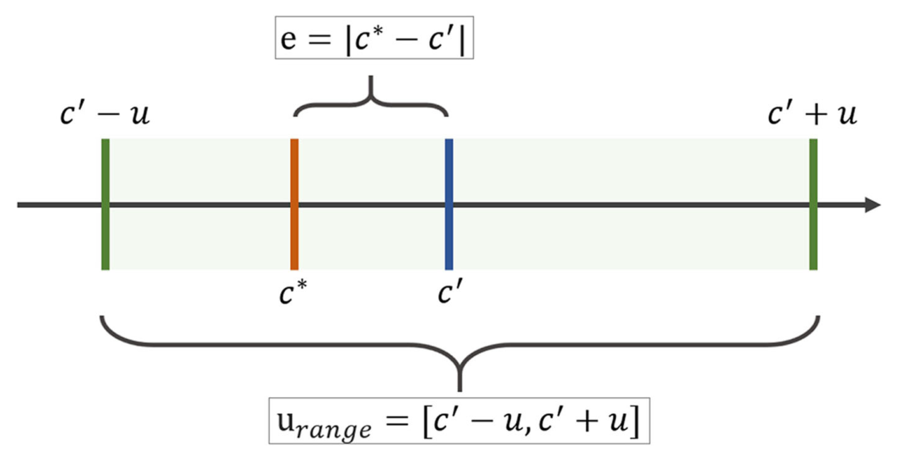
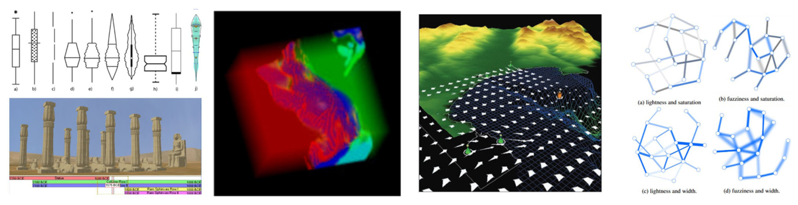
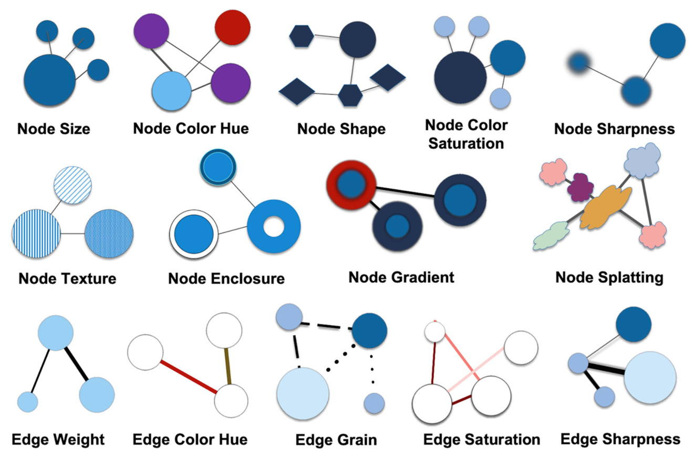
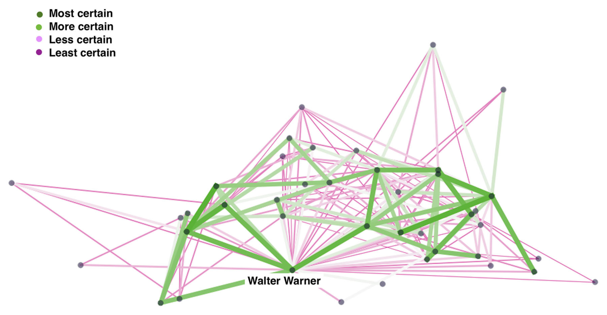
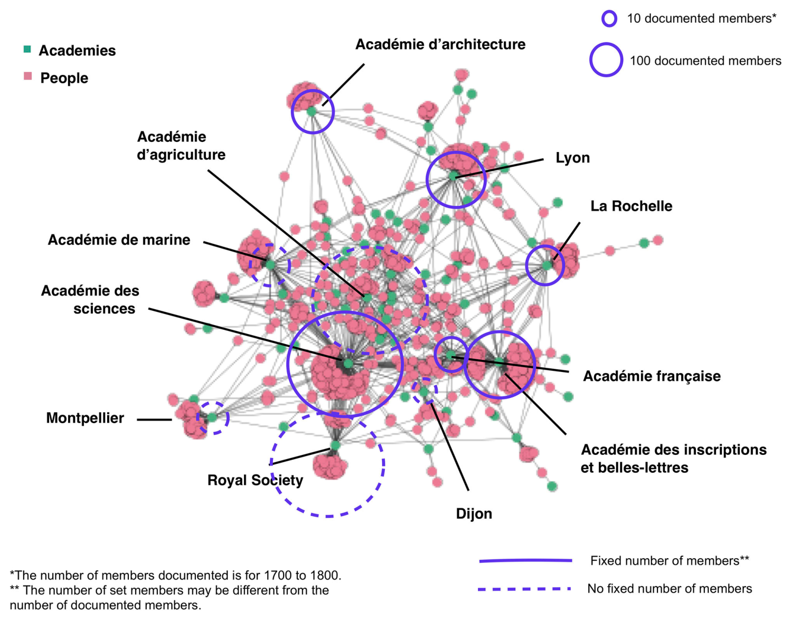

**Melanie Conroy, Christina Gillmann, Francis Harvey, Tamara Mchedlidze, Sara Irina Fabrikant, Florian Windhager, Gerik Scheuermann, Timothy R. Tangherlini, Christopher N. Warren, Scott B. Weingart, Malte Rehbein, Katy Börner, Kimmo Elo, Stefan Jänicke, Andreas Kerren, Martin Nöllenburg, Tim Dwyer, Øyvind Eide, Stephen Kobourov and Gregor Betz**

*TYPE Original Research — PUBLISHED 12 January 2024 — DOI 10.3389/fcomm.2023.1305137*

## Abstract

Network visualization is one of the most widely used tools in digital humanities research. The idea of uncertain or “fuzzy” data is also a core notion in digital humanities research. Yet network visualizations in digital humanities do not always prominently represent uncertainty. In this article, we present a mathematical and logical model of uncertainty as a range of values which can be used in network visualizations. We review some of the principles for visualizing uncertainty of different kinds, visual variables that can be used for representing uncertainty, and how these variables have been used to represent different data types in visualizations drawn from a range of non-humanities fields like climate science and bioinformatics. We then provide examples of two diagrams: one in which the variables displaying degrees of uncertainty are integrated/pinto the graph and one in which glyphs are added to represent data certainty and uncertainty. Finally, we discuss how probabilistic data and what-if scenarios could be used to expand the representation of uncertainty in humanities network visualizations.

KEYWORDS: network visualization, mathematical uncertainty, uncertainty in networks, digital humanities, visual variables, historical networks

## 1 Introduction

Over the past 20 years, network visualization has become an established method within digital humanities, especially within digital literary studies, digital history, and art history, where large projects have often been running for a decade or more (Gelshorn and Weddigen, 2008; Ahnert et al., 2020). Early projects visualizing networks in DH often relied on simple network models, where nodes and edges were each of one type and there was relatively little engagement with complex network types or ways of visualizing uncertainty <!-- page 1 --> or the heterogeneity of data. These models continue to work well to represent social, communication, textual, and other humanities networks. Digital humanities scholars generally understand how simple network models can be used to represent particular data types, such as nodes representing people and edges representing social ties, and they have become sophisticated at adjusting adopted network methods to the needs of the humanities, especially in historical disciplines which use networks as both a mathematical concept and a metaphor (Lemercier, 2015; Düring et al., 2016). Theories of how humanistic networks differ from networks drawn from the natural sciences have become quite sophisticated, although sometimes overly dismissive of complexity and uncertainty in other fields, notably the natural sciences. Concepts like uncertainty and complexity can be slippery and be used in contradictory ways, especially across humanities disciplines (Therón and Wandl-Vogt, 2018). Some of these forms of uncertainty are necessary parts of humanistic study and cannot be reduced, removed from the model, or “cleaned” form the data (Drucker, 2011; Rawson and Muñoz, 2019; Windhager et al., 2019b). Nevertheless, all information contains uncertainty, normally of multiple kinds (MacEachren et al., 2012). Uncertainty is, however, hard to represent in data models and derivative visualizations (Kessels and van Bree, 2017); thus, uncertainty tends to be underemphasized in visualizations and visualization- driven disciplines (Ciuccarelli, 2014; Van der Zwaan et al., 2016). In this article, we consider the kinds of uncertainty most relevant to networks in the digital humanities, as well as some of the visual variables that can be used to represent uncertainty. We then recommend some alternative strategies for representing the same forms of uncertainty drawn from the natural sciences, meteorology, and geography. In general, we recommend foregrounding data uncertainty within digital humanities network diagrams.

First, we must define what we mean by uncertainty, how uncertainty can be quantified, and how uncertainty can be visualized (Levontin et al., 2020). This section is quite technical, but it is important to note that many software packages often perform these functions automatically and invisibly, out of sight and mind from the user. Similarly, techniques such as regression analysis and bootstrapping are commonly used in the digital humanities community through software packages such as R without the user’s always being aware of the underlying mathematical models. It is nevertheless important to understand the underlying mathematical concepts when creating a visual vocabulary.

## 2 Materials and methods

### 2.1 Definition of uncertainty

Humanities scholars sometimes overestimate the gaps between themselves and their colleagues in the natural sciences when it comes to appreciation for uncertainty and non-positivistic elements of data analysis (Drucker, 2012, p. 89). This is not always the case; networks in medicine, biology, neuroscience, and climate science also contend with high levels of uncertainty (Knutti et al., 2003; Mastrandrea et al., 2010; Merchant et al., 2017; Gomis and Pidcock, 2018; Alizadehsani et al., 2021). Another significant source of confusion is that uncertainty is often used interchangeably with error in ordinary speech, though uncertainty and error can operationally refer to different phenomena. In this article, we advance a technical definition of uncertainty which is distinct from omission, slippage in meaning, or contradiction. To clarify the difference between error and this formal definition of uncertainty, we provide formal definitions of error and uncertainty. Let *c* ∈ (−∞, ∞) be a measurand and *c*∗ be the true value of this measurand. When performing the measure, the result will be *c*′. The error *e* of the performed measure can be defined as follows: an error is defined as the difference between the measured value and the true value of the object being measured (Boyat and Joshi, 2015). This means *e* = |*c*∗−*c*′|. Therefore, the quantification of error requires a ground-truth that clearly shows the difference between the actual value and the measured value.

In contrast, the uncertainty *u* defines a range around the measured value *c*′ in which the measured value could also have been placed (Figure 1). Here, uncertainty is defined as the quantification of doubt about the measurement result. Therefore, the uncertainty range expressing all possible measured values is *u*range = [*c*′−*u*, *c*′ + *u*]. The key point is that the uncertainty range is located around the measured value *c*′. Consequently, the uncertainty of a measure has no direct correlation with the true value *c*∗. Furthermore, even if the correct value is known, the uncertainty cannot be computed based on it.

In short, an error can be computed directly. For example, a percentage that has been miscalculated can be recalculated. For the uncertainty range, this does not hold. The uncertainty range depends on the parameter *u*. There is no unified definition for this parameter. Instead, there exist numerous uncertainty models that aim to compute *u*, since uncertainty can be caused for a variety of reasons. This is particularly true for data in the digital humanities for which a single value cannot be calculated due to the assumption of an “open world,” where the total amount of data is not known and, therefore, exact measures cannot be calculated.

The best way to encode uncertainty is with a range or with multiple values that maintain the integrity of the original data source, especially when the original data is of high quality and/or importance. Sometimes uncertainty is “hidden” by creating estimates that are not well-explained, such as a person being born in circa 1800 instead of 1792–1803, or an author being said to publish 10 books when the actual possible range is 8–15. Ranges are perhaps less commonly used in datasets than they could be. We would like to argue for a re-consideration of this tendency to represent uncertain values as formally certain via inaccurately estimated or “guesstimated” values.

### 2.2 Quantifications of uncertainty

In many cases, uncertainty in a technical sense can be described as a boundary around the measurand (Olston and Mackinlay, 2002). For example, uncertainty could be from 3 to 12 letters sent. This defines a boundary around the measurand. In this case, we are not primarily interested in how many times each measured value occurs or how the values are distributed. Instead, we are interested in the limits of variation (Belforte et al., 1987, p. 167). We can use these simple ranges if we are not interested in supplying a value that is most likely or in visualizing the distribution of values. We could, <!-- page 2 --> for example, say that a letter writer sent between 50 and 100 letters without trying to calculate which number of letters is most probable or displaying a distribution.

If we do want to indicate which values are more likely, we need to use a probabilistic distribution function. A probabilistic distribution function allows us to calculate the most likely probable location of the true value that was captured. We would also be able to visualize the probability density of a measurand located at an arbitrary point in some space and to display how potential or measured values are distributed—in other words, which values are more likely to occur (Loucks and van Beek, 2017). In a probabilistic distribution function, the measurand usually defines the most probable location of the true value that was captured. The most common probabilistic distribution functions are Gaussian distribution functions, but any distribution can theoretically be used to express uncertainty.

The process of quantifying uncertainty can be approached from two directions: forward uncertainty quantification and backward uncertainty quantification (Helton, 2008). Forward uncertainty quantification works on the basis of the propagation of input data uncertainty. As a result, the uncertainty of the output of a system can be quantified. These approaches aim to capture the variance in a measure and accumulate it throughout a sequence of computations. Forward uncertainty quantification techniques use different types of stochastic sampling strategies, such as Monte Carlo sampling (Yang et al., 2012). Forward uncertainty quantification is often used to quantify epistemic uncertainty. Backward uncertainty quantification aims to determine the difference between the experiment and the mathematical model; it is particularly useful when there is model uncertainty and we do not know which model to use (Øksendal and Sulem, 2014).

### 2.3 Sources of uncertainty in data

Uncertainty can arise at any stage in data processing and can have many sources, including computer error, human error, and bias. In digital networks, six sources of uncertainty are of particular interest; these are drawn from a taxonomy of uncertainty in visual analytics with examples from humanities networks and the addition of “imprecise values,” which are more common in textual sources than databases or large datasets (Gillmann et al., 2023).

1. Missing Values: Missing values are common in historical sources

and archives, including metadata. For example, library metadata might be missing a date of publication for a book. This date could be missing because it is unknown to the library, or it was missed in cataloging, or because it was never recorded by the publisher. In order to deal with missing values, many digital humanities projects will assign estimates, such as c1750; other projects will enter null values so that the data can be visualized in a timeline or graph. If such missing values are estimated or replaced, the process must be carefully tracked and a degree of certainty/uncertainty should be assigned to that value.

2. Imprecise Values: Textual sources often contain verbal estimates

of numerical values, such as a person being born in the early twentieth century or a historical figure having “many” or “few” friends. In the reconstruction of social networks, values often need to be estimated for the number or contacts or size of groups.

3. Incorrect Values: Captured dates and word strings from

digitized sources are often either incorrectly scanned or incorrect in the original source. Many digital humanities projects will either maintain the incorrect values as data representing a particular source or replace the data with the true value, if it is known. Visualizing and analyzing these incorrect values can help reveal patterns in these errors.

4. Ambiguous Values: Proper names, place names, and pronouns

**FIGURE 1** A formal definition of uncertainty. Source: Gillmann, 2019.

often have unclear referents. Multiple strings can refer to the same referent. Such unclear correspondences between texts or numbers and referents are far from unique in the humanities but the problem is persistent, especially with older or lower quality data. When there are many unclear correspondences, patterns within the data may not represent an underlying structure; artifacts of data collection can obscure any patterns <!-- page 3 -->

that were present in the archive used or within social or

cultural relations.

5. Uncertain Actors and Relations: Historical actors and the relations between historical actors are often uncertain. For instance, we may not know if a name in a text refers to an actually existing individual. Likewise, two people may be frequently discussed in the same texts without having known each other, or two sources might disagree whether a connection exists. If one network diagram represents actors or relations within multiple sources (or multiple relations represented in the same text), attention must be paid to displaying the sources of uncertainty in the nodes and edges themselves or in an accompanying text or diagram.

6. Existence of Communities or Hierarchy: When communities are automatically detected within a network, the algorithm used can alter whether two nodes are classed as part of the same community. Small differences in data quality or assumptions can radically alter the network structure and which nodes are grouped together. Here we are most interested in data that is approximative

or contains a range of possible values, rather than data that is suspect for ideological reasons or that is incorrect due to human errors. For this reason, after a consideration of possible sources of uncertainty, we focus on the visualization of data uncertainty after its collection and preparation for analysis, rather than human error or underlying theoretical and methodological issues. We, therefore, mainly focus on the uncertainty inherent in the data that is used to design a hierarchical graph.

### 2.4 Visualizing uncertainty in data

Challenges lie in transforming these sources of uncertainty into communicative visualizations. Uncertainty can have positive and negative impacts on viewers; these affective impacts can help the viewer to understand underlying conceptual problems or gaps in the data by creating negative mental stimulation (Anderson et al., 2019). We distinguish here four general steps to creating an uncertainty-aware visualization (Sacha et al., 2016):

1. Quantify uncertainty in each component;

2. Visualize uncertainty information;

3. Enable interactive uncertainty exploration; and

4. Propagate and aggregate uncertainty (if the underlying data are transformed). These principles have been successfully applied to a variety

of data types, including unstructured data, spatial data, time- dependent data, geographic data, and graph data (Gillmann et al., 2016). This process can be used with datasets from medicine, climate science, geography, or social networks.

In order to foreground uncertainty, it is best to draw visual attention to areas with higher uncertainty or less confidence, as in Figure 2 (Bonneau et al., 2014). In this figure, we see four approaches to foregrounding uncertainty that are used in information visualization: boxplot graphs in archaeology, the use of shape and color (here volume rendering with alpha blending), a confidence interval to represent uncertainty in chronological data, and manipulation of visual variables in graphs (lightness, saturation, width, and fuzziness) to represent uncertainty in network data. The foregrounding of uncertainty can be achieved through diverse means, including comparison techniques, attribute modification, glyphs, and image discontinuity. Comparison techniques aim to represent a variety of scenarios in one visualization. Attribute modification aims to indicate uncertainty by utilizing attributes such as color or transparency. Glyphs are geometric objects that indicate properties and are usually used as an overlay in the original data. Finally, image discontinuity can be used to indicate uncertainty of data points.

Figure 3 shows six simplified ways of using these visualization strategies for different data types: spatial data, graph data, field data, high-dimensional data, time-dependent data, and document or text data. Many of the visual variables like hue and density are used to show more and less likely data points. The graph data visualization uses node splatting to show where data becomes uncertain. While various visualization strategies can be used for different data types, many disciplines have implicit or explicit notions of which diagrams should be used for different data types and these can be hard or unproductive to contest, unless a new vocabulary is needed.

An underexplored question is whether these design methods are actually effective in drawing viewers’ attention to data uncertainty and changing their analysis of the represented data, but we know that these techniques can draw attention to specific parts of the visualization. We also know that knowing about uncertainty in data has actual consequences for its exploration, analysis, and display. Some studies have shown that some aspects of a network impact topology more than others; for example, Roller attempts a statistical ranking of the importance of elements in a network dataset by applying generalized hypergeometric ensembles to identify which network layer is most important for the overall network topology and to infer significant links in noisy network data (Casiraghi et al., 2017). However, we must bear in mind that what appears to be good design to researchers or practitioners of visualization may not be interpreted in the expected way and it is important to test diagrams on users who are similar to the intended audience for the visualization (Munzner, 2014, p. 69).

One idea supported in the literature is to use blur or shading to express uncertainty (MacEachren et al., 2012). Alternatively, we can mix multiple attributes of edges or nodes to highlight uncertainty: width, hue, lightness, saturation, fuzziness, grain, and transparency (Guo et al., 2015). In addition, glyphs might be used to display the degree of uncertainty of a node (Collins et al., 2007; Liu et al., 2016). Among digital humanities disciplines, musicology has developed perhaps the most complex and complete system for visualizing uncertainty in social networks, as well as in audio data, due to the imprecision of time, vastness of musical data, imprecise boundaries between genres, and aspects of audio production and recording that are often visualized using a range of diagram types (Khulusi et al., 2020). <!-- page 4 -->

### 2.5 Visual variables to indicate uncertainty

While line width and color are most often used to represent uncertainty, there is a wide variety of visual variables, from shape to position to saturation, that can be used to encode uncertainty (MacEachren, 1992; MacEachren et al., 2012). Figure 4 shows visual representations of some of these visual variables.

**FIGURE 2** Various modes of displaying uncertainty, and ranges in various data types across the academic disciplines. Source: Gillmann et al., 2016.

**FIGURE 3** Uncertainty-aware visualization approaches for different types of data. (A) Spatial data. (B) Graph data. (C) Field data. (D) High-dimensional data. (E) Time-dependent data. (F) Document data. Source: Maack et al., 2022 (Creative Commons 4.0 license).

**FIGURE 4** Visual variables to show uncertainty. Copyright: authors.

**FIGURE 5** Network of associates of Walter Warner. Data: Six degrees of Francis Bacon. Copyright: authors.

These visual variables are commonly used in network diagrams. They are also analogous to visual variables on related fields that may inform viewers’—especially non-expert viewers’—interpretation of network diagrams. Visual variables are core elements of cartographic symbolization and have been used for millennia to depict quantitative and qualitative data in points, line, and area symbols on maps (Bertin, 1987). As a close relative to transportation network maps or quantitative and qualitative cartographic flow maps (Slocum et al., 2022), visual variables also serve as core elements of network visualizations in the digital humanities. Since node size and edge weight are so commonly used to represent the count of an entity and the number or strength of connections (e.g., in cartographic flow maps), those visual variables may be less appropriate to represent uncertainty, as viewers may associate them more with quantitative values <!-- page 5 --> in the underlying data. Variables that are commonly used to indicate the uncertain status of either nodes or edges include size (weight), color (saturation or hue), curved vs. straight edges, shape transparency, and density. Size, line width, and hue are often used to represent quantitative differences like weights. Node or edge “splatting” is very promising for representing probabilistic data but is not generally supported in network visualization software (Schulz et al., 2017) and is less often used. Shape of edges, such as sine- waved or zig-zagged edges, can also be used to represent degrees of uncertainty. <!-- page 6 -->

Color is often used to represent qualitative differences, such as the type of nodes or type of edges (Cesario et al., 2011). Less often used variables include edge grain, node enclosure, node splatting, or node texture. These are variables which could be particularly useful in representing uncertainty, as they may encourage viewers who are less familiar with them to interrogate the data model and think more deeply about the data behind the visualization. Since the possibilities to indicate uncertainty are so numerous, a proper approach in developing visualizations suitable to the dataset and the audience requires careful selection and refinement of visualizations. Several challenges need to be addressed when selecting visual variables for uncertainty in the context of historical networks: First, researchers should consider what is uncertain in the original dataset. Second, researchers need to consider the purpose of the visualization. Likely only some of the aspects of uncertainty in the data need to be represented in the network graph, particularly given the imperative to avoid visual clutter and information overload. Finally, not all of these visual variables can easily be used with current network visualization software like Gephi or Cytoscape.

## 3 Results

### 3.1 Uncertainty integrated into the graph

**FIGURE 6** Network of French academies and academy members in eighteenth-century France with glyphs of total number of members. Source: Conroy, 2019.

As we have seen, uncertain data can either be foregrounded or minimized in network visualizations. We will look at two strategies to foreground uncertainty: (1) integrating uncertainty markers into the graph, and (2) adding glyphs or representations of uncertainty to the network visualization through additional elements. How to foreground uncertainty is a decision that should not be taken lightly, but there are cases where uncertainty is so integrated into the project design and data model that it is best to use at least one variable or glyph to represent it. The first example uses data from the Six Degrees of Francis Bacon project (Finegold et al., 2016). This project uses automated methods to extract proper names from biographical encyclopedia articles. Rather than simply tracking confirmed relations or using a simple threshold to include or exclude relations, Six Degrees of Francis Bacon calculates the rough probability that an edge represents a true relationship and represents the likelihood that such a relation exists with a <!-- page 7 --> single number. In line with Alan Liu’s suggestion, the authors use a Poisson distribution to calculate the likelihood of any one individual knowing another individual whose name occurs in the biographical article. Any connections that have a <50% chance of being real are stripped out. While such calculations have been controversial, so, too, has the idea of using probabilistic methods in digital humanities. It is, however, necessary to quantify data in order to translate them into network data and create nodes and edges.

In this visual representation (Figure 5), we emphasize the uncertainty of edges, an important research question for Six Degrees of Francis Bacon, as they have used probabilistic data. Nodes are colored an even dark gray to make them less visually prominent. The edges are colored according to the certainty of the connection between individuals, with green being more certain and pink being less certain. Assigning a number to the certainty or uncertainty of an edge or node makes it possible to represent that uncertainty, which is represented in this visualization by the thickness of the edges. The edge weight represents the numerical value of each inferred connection and the color represents the degree of uncertainty visually. The most uncertain connections, which can be investigated or analyzed for commonalities, are a dark, rather than light, color.

### 3.2 Uncertainty visualized as a supplement to the network

Another example is the bi-partite network of French academies and French academy members. Here (Figure 6) the node size represents the number of individuals in each grouping and the edges represent members who are shared across two academies.

Some academies have a known number of total members, while the total membership of others is uncertain. The total size of documented members is visualized with a glyph that varies in size based on the number of documented members. Whether the number of members is fixed is visualized via line grain. Again, the size of the glyph indicates the documented size of the academy. Whereas, the Académie française had 40 members except when one chair was vacant, smaller and regional academies may have varied or their total number of seats may not have been known throughout their history. The glyphs foreground uncertainty and gaps in the data without distorting the network structure or obscuring the documented number of members of each grouping. One weakness of using glyphs is that they add to the complexity of the diagram.

## 4 Discussion

In this article, we have reviewed the sources of uncertainty in humanities datasets for networks, borrowed uncertainty concepts and visualization strategies from other fields and applied them to digital humanities, and considered some ways to foreground uncertainty in network diagrams. Beyond the four steps, here is a non-exhaustive list of ways that uncertainty can be communicated more clearly in humanities network diagrams:

1. The coloring (hue and saturation) of nodes and edges;

2. Texture, weight, and sharpness of edges;

3. Sharpness, shape, or transparency of nodes or edges. These visual variables can be combined to represent different

types of uncertainty in the same diagram. Where uncertainty is central to the argument that the network diagram is making, the use of brighter hues, more saturation, sharper lines, or less transparency may actually better communicate the importance of data gaps than using transparent lines or less vibrant hues but can also serve to exaggerate the level of uncertainty if thresholds are used (Johannsen et al., 2018; Kübler et al., 2019; Korporaal et al., 2020). That said, indicators of uncertainty can exact a cognitive cost and are frequently misunderstood by the general public; for example, the use of color to signal uncertainty may be familiar to many through weather diagrams which frequently use bright colors to indicate extrapolation or estimation, but the meaning of these colors is often misunderstood (Gomis and Pidcock, 2018). Standards for the visualization of uncertainty in climate science have benefited from years of experimentation, which may be relevant in digital humanities projects.

Certainly not all network visualizations should include all of these visual indications of uncertainty. Visual indicators of uncertainty add an additional layer of complexity to any diagram and can be confusing for non-expert readers of graphs; as such they should be used judiciously (Windhager et al., 2019a,b). While it could be desirable for some projects to adopt a more consistent visual vocabulary for representing uncertainty in network visualizations, we will likely never adopt a single vocabulary across the diverse humanities disciplines. With the rapid increase in humanities network analysis projects, it may be desirable to borrow from medical science and climate science some of the key techniques like glyphs and color discontinuity to communicate such specific kinds of uncertainty as ambiguous values, estimated values, probabilistic data, and ranges. Where uncertainty is less important to the project or visualization, using glyphs or more subtle color discontinuities may be more appropriate than using visual variables that are a part of the network visualization.

Finally, more testing and an openness to the use of probabilistic data could be profitable for digital humanities, given the need for quantitative values to construct network visualizations. Specific visualizations within digital humanities projects are seldom tested on users to see how modifications to the diagrams transform the user experience and interpretations. An iterative research design that includes a pilot test of the visualizations, especially those also intended for broader audiences, can help identify issues early and thus promote clearer communication of where in the data uncertainty lies. Uncertainty can also be integrated at the project level through the use of “what-if scenarios,” or different states of the network which are dependent on specific variables that may change, such as robustness tests if nodes are removed. Using contrasting views to represent the network under various conditions can help the audience of a visualization to understand how the network structure could change, given different inputs, especially where data is ambiguous or major gaps are found. Rather than being foreign to the humanities, this approach is similar to counterfactual historical narratives, in which alternate narratives are used to represent a range of possibilities while still making particular outcomes <!-- page 8 --> concrete enough for an audience of scholars beyond network scientists to understand the impact of uncertainty on the network being studied. As network visualization has become an established method within digital humanities, especially within digital literary studies and digital history, these explorations are crucial to the development of graphic techniques for visualizing uncertainty.

## Data availability statement

Publicly available datasets were analyzed in this study. This data can be found at: Six Degrees of Francis Bacon (http://www.sixdegreesoffrancisbacon.com/); L’annuaire des sociétés savantes— Comité des travaux historiques et scientifiques (https://cths.fr/an/annuaire.php).

## Author contributions

MC: Funding acquisition, Visualization, Writing—original draft, Writing—review & editing. CG: Conceptualization, Funding acquisition, Visualization, Writing—original draft, Writing— review & editing. FH: Writing—original draft, Writing—review & editing. TM: Conceptualization, Writing—original draft. SF: Conceptualization, Methodology, Writing—review & editing. FW: Conceptualization, Writing—original draft, Writing—review & editing. GS: Conceptualization, Writing—original draft. SW: Conceptualization, Writing—original draft, Writing—review & editing. TT: Conceptualization, Writing—original draft. CW: Writing—original draft. MR: Writing—original draft, Writing—review & editing. KB: Conceptualization, Writing— original draft. KE: Conceptualization, Writing—original draft. SJ: Visualization, Writing—original draft. AK: Writing—original draft. MN: Writing—original draft. TD: Conceptualization, Writing—original draft. ØE: Conceptualization, Writing—original draft. SK: Conceptualization, Writing—original draft. GB: Conceptualization, Writing—original draft.

## Funding

The author(s) declare financial support was received for the research, authorship, and/or publication of this article. The author(s) acknowledge support from the German Research Foundation (DFG) and Universität Leipzig within the program of Open Access Publishing. The authors benefited from an open- access publication grant from the Division of Research and Innovation at the University of Memphis.

## Acknowledgments

We thank the editors and reviews of this manuscript for their helpful comments.

## Conflict of interest

The authors declare that the research was conducted in the absence of any commercial or financial relationships that could be construed as a potential conflict of interest.

The author(s) declared that they were an editorial board member of Frontiers, at the time of submission. This had no impact on the peer review process and the final decision.

## Publisher’s note

All claims expressed in this article are solely those of the authors and do not necessarily represent those of their affiliated organizations, or those of the publisher, the editors and the reviewers. Any product that may be evaluated in this article, or claim that may be made by its manufacturer, is not guaranteed or endorsed by the publisher.

## References

Ahnert, R., Ahnert, S., Coleman, C., and Weingart, S. (2020). *The Network Turn:* *Changing Perspectives in the Humanities (Elements in Publishing and Book Culture).* Cambridge: Cambridge University Press. doi: 10.1017/9781108866804

Alizadehsani, R., Roshanzamir, M., Hussain, S., Khosravi, A., Koohestani, A., Zangooei, M. H., et al. (2021). Handling of uncertainty in medical data using machine learning and probability theory techniques: a review of 30 years (1991–2020). *Ann.* *Oper. Res.* 21, 1–42. doi: 10.1007/s10479-021-04006-2

Anderson, E. C., Carleton, R. N., Diefenbach, M., and Han, P. K. (2019). The relationship between uncertainty and affect. *Front. Psychol.* 10:2504. doi: 10.3389/fpsyg.2019.02504

Belforte, G., Bona, B., and Frediani, S. (1987). Optimal sampling schedule for parameter estimation of linear models with unknown but bounded measurement errors. *IEEE Trans. Autom. Control* 32, 179–182. doi: 10.1109/TAC.1987.1104535

Bertin, J. (1987). *Semiology of Graphics: Diagrams, Networks, Maps*. Transl. by W. J. Berg. Madison, WI: University of Wisconsin Press.

Bonneau, G.-P., Hege, H.-C., Johnson, C. R., Oliveira, M. M., Potter, K., Rheingans, P., et al. (2014). “Overview and state-of-the-art of uncertainty visualization,” in *Scientific Visualization,* eds C. D. Hansen, M. Chen, C. R. Johnson, A. E. Kaufman, and H. Hagen (Berlin, NY: Springer), 3–27. doi: 10.1007/978-1-4471-6497-5_1

Boyat, A. K., and Joshi, B. K. (2015). A review paper: noise models in digital image processing. *arXiv preprint arXiv:*<!-- -->1505.03489. doi: 10.5121/sipij.2015.6206

Casiraghi, G., Nanumyan, V., Scholtes, I., and Schweitzer, F. (2017). From relational data to graphs: inferring significant links using generalized hypergeometric ensembles. *Lect. Notes Comput. Sci.* 10540, 111–120. doi: 10.1007/978-3-319-67256-4_11

Cesario, N., Pang, A., and Singh, L. (2011). Visualizing node attribute uncertainty in graphs. *Visual. Data Anal.* 2011:78680H. doi: 10.1117/12.872677

Ciuccarelli, P. (2014). Mind the graph: from visualization to collaborative network constructions. *Leonardo* 47, 268–269. doi: 10.1162/LEON_a_00772

Collins, C., Carpendale, M. S. T., and Penn, G. (2007). Visualization of uncertainty in lattices to support decision-making. *In EuroVis* 51–58. doi: 10.2312/VisSym/EuroVis07/051-058

Conroy, M. (2019). “The eighteenth-century French academic network,” in *Networks of Enlightenment: Digital Approaches to the Republic of Letters,* eds C. Edmondson and D. Edelstein (Liverpool: Liverpool University Press), 225–49.

Drucker, J. (2011). Humanities approaches to graphical display. *Digit. Hum. Q.* 5:1.

Drucker, J. (2012). “Humanistic theory and digital scholarship,” in *Debates* *in the Digital Humanities, Vol. 150*, ed. M. K. Gold (Minneapolis, MN: University of Minnesota Press), 85–95. doi: 10.5749/minnesota/9780816677948.003. 0011

Düring, M., Eumann, U., Stark, M., von Keyserlingk, L. (eds.). (2016). *Handbuch Historische Netzwerkforschung. Grundlagen und Anwendungen. Schriften* <!-- page 9 --> *des Kulturwissenschaftlichen Instituts Essen (KWI) zur Methodenforschung, Vol. 1.* Berlin: LIT-Verlag.

Finegold, M., Otis, J., Shalizi, C., Shore, D., Wang, L., and Warren, C. (2016). Six degrees of francis bacon: a statistical method for reconstructing large historical social networks. *Digit. Hum. Q.* 10. doi: 10.17613/M6B020

Gelshorn, J., and Weddigen, T. (2008). “Das netzwerk. zu einem denkbild in kunst und wissenschaft,” in *Grammatik der Kunstgeschichte, herausgegeben von* *Peter Schneemann und Hubert Locher* (Berlin: Edition Imorde), 57–77. Available online at: https://www.zora.uzh.ch/id/eprint/74524/1/Weddigen_u._Gelshorn_2008_Netzwerk.pdf

Gillmann, C. (2019). *Image processing under uncertainty* (Doctoral thesis). Technical University of Kaiserslautern, Kaiserslautern, Germany.

Gillmann, C., Maack, R. G. C., Raith, F., Perez, J. F., and Scheuermann, G. (2023). A taxonomy of uncertainty events in visual analytics. *IEEE Comput. Graph. Appl.* 43, 62–71. doi: 10.1109/MCG.2023.3299297

Gillmann, C., Wischgoll, T., and Hagen, H. (2016). *Uncertainty-Awareness in Open* *Source Visualization Solutions.* Retrieved from: https://corescholar.libraries.wright.edu/cse/487

Gomis, M. I., and Pidcock, R. (2018). *IPCC Visual Style Guide for Authors.* IPCC WGI Technical Support Unit. Available online at: https://www.ipcc.ch/site/assets/uploads/2019/04/IPCC-visual-style-guide.pdf

Guo, H., Huang, J., and Laidlaw, D. H. (2015). Representing uncertainty in graph edges: an evaluation of paired visual variables. *IEEE Trans. Vis. Comput. Graph.* 21, 1173–1186. doi: 10.1109/TVCG.2015.2424872

Helton, J. C. (2008). “Uncertainty and sensitivity analysis for models of complex systems,” in *Computational Methods in Transport: Verification and Validation. Lecture* *Notes in Computational Science and Engineering, Vol. 62*, ed F. Graziani (Berlin; Heidelberg: Springer). 207–228. doi: 10.1007/978-3-540-77362-7_9

Johannsen, I. M., Fabrikant, S. I., and Evers, M. (2018). “How do texture and color communicate uncertainty in climate change map displays?,” in *10th International* *Conference on Geographic Information Science (GIScience) 2018* (Melbourne, VIC).

Kessels, G., and van Bree, P. (2017). *Formulating Ambiguity in a Database*. nodegoat blog, Available online at: https://nodegoat.net/blog.s/21/formulating-ambiguity-in-a-database

Khulusi, R., Kusnick, J., Meinecke, C., Gillmann, C., Focht, J., and Jänicke, S. (2020). A survey on visualizations for musical data. *Comput. Graph. Forum* 39, 82–110. doi: 10.1111/cgf.13905

Knutti, R., Stocker, T. F., Joos, F., and Plattner, G. K. (2003). Probabilistic climate change projections using neural networks. *Clim. Dyn.* 21, 257–272. doi: 10.1007/s00382-003-0345-1

Korporaal, M., Ruginski, I. T., and Fabrikant, S. I. (2020). “Effects of uncertainty visualization on map-based decision making under time pressure,” in *Frontiers in Computer Science, Human-Media Interaction, Special Issue on* *Uncertainty Visualization and Decision Making*, eds R. Théron and L. M. K. Padilla. (Geneva: Frontiers in Computer Science), 1–20. doi: 10.3389/fcomp.2020.0 0032

Kübler, I., Richter, K.-F., and Fabrikant, S. I. (2019). Against all odds: multi-criteria decision making with hazard prediction maps depicting uncertainty. *Ann. Am. Assoc.* *Geograph.* 110, 661–683. doi: 10.1080/24694452.2019.1644992

Lemercier, C. (2015). “Formal network methods in history: why and how?,” in *Social* *Networks, Political Institutions, and Rural Societies*, ed. G. Fertig (Turnhout: Brepols), 281–310. doi: 10.1484/M.RURHE-EB.4.00198

Levontin, P., Walton, J. L., Kleineberg, J., Barons, M., French, S., Aufegger, L., et al. (2020). *Visualising Uncertainty: A Short Introduction*. London: AU4DM.

Liu, M., Liu, S., Zhu, X., Liao, Q., Wei, F., and Pan, S. (2016). An uncertainty- aware approach for exploratory microblog retrieval. *IEEE Trans. Vis. Comput. Graph.* 22, 250–259. doi: 10.1109/TVCG.2015.2467554

Loucks, D. P., and van Beek, E. (2017). “An introduction to probability, statistics, and uncertainty,” in *Water Resource Systems Planning and Management* (Cham: Springer). doi: 10.1007/978-3-319-44234-1_6

Maack, R., Scheuermann, G., Hernandez, J., and Gillmann, C. (2022). Uncertainty- aware visual analytics: scope, opportunities, and challenges. *Vis. Comput.* 39, 6345– 6366. doi: 10.21203/rs.3.rs-1177485/v1

MacEachren, A. M. (1992). Visualizing uncertain information. *Cartogr. Perspect.* 13, 10–19. doi: 10.14714/CP13.1000

MacEachren, A. M., Roth, R. E., O’Brien, J., Li, B., Swingley D., and Gahegan, M. (2012). Visual semiotics and uncertainty visualization: an empirical study. *IEEE Trans.* *Visual. Comput. Graph.* 18, 2496–2505. doi: 10.1109/TVCG.2012.279

Mastrandrea, M. D., Field, C. B., Stocker, T. F., Edenhofer, O., Ebi, K. L., Frame, D. J., et al. (2010). “Guidance note for lead authors of the IPCC fifth assessment report on consistent treatment of uncertainties,” in *IPCC Cross-Working Group Meeting on* *Consistent Treatment of Uncertainties* (Jasper Ridge, CA). Retrieved from: https://www.ipcc.ch/site/assets/uploads/2018/05/uncertainty-guidance-note.pdf

Merchant, C. J., Paul, F., Popp, T., Ablain, M., Bontemps, S., Defourny, P., et al. (2017). Uncertainty information in climate data records from Earth observation. *Earth* *Syst. Sci. Data* 9, 511–527. doi: 10.5194/essd-9-511-2017

Munzner, T. (2014). *Visualization Analysis and Design*. *A K Peters Visualization* *Series.* New York, NY: CRC Press. doi: 10.1201/b17511

Øksendal, B., and Sulem, A. (2014). Forward–backward stochastic differential games and stochastic control under model uncertainty. *J. Optim. Theory Appl.* 161, 22–55. doi: 10.1007/s10957-012-0166-7

Olston, C., and Mackinlay, J. D. (2002). “Visualizing data with bounded uncertainty,” in *Proceedings of the IEEE Symposium on Information Visualization* *(InfoVis’02) (INFOVIS ’02),* (Boston, MA), 37. doi: 10.1109/INFVIS.2002.1173145

Rawson, K., and Muñoz, T. (2019). Against cleaning. *Debates Digit. Hum.* 3, 36–45. doi: 10.5749/j.ctvg251hk.26

Sacha, D., Senaratne, H., Kwon, B. C., Ellis, G., and Keim, D. A. (2016). The role of uncertainty, awareness, and trust in visual analytics. *IEEE Trans. Visual. Comput.* *Graph.* 22, 240–249. doi: 10.1109/TVCG.2015.2467591

Schulz, C., Nocaj, A., Goertler, J., Deussen, O., Brandes, U., and Weiskopf, D. (2017). Probabilistic graph layout for uncertain network visualization. *IEEE Trans. Vis.* *Comput. Graph.* 23, 531–540. doi: 10.1109/TVCG.2016.2598919

Slocum, T. A., McMaster, R. B., Kessler, F. C., and Howard, H. H. (2022). *Thematic* *Cartography and Geovisualization, 4th Edn.* CRC Press. doi: 10.1201/9781003150527

Therón, R., and Wandl-Vogt, E. (2018). “Uncertainty in digital humanities,” in *Proceedings of the Sixth International Conference on Technological Ecosystems for* *Enhancing Multiculturality* (New York, NY), 815–818. doi: 10.1145/3284179.3284317

Van der Zwaan, J. M., Van Meersbergen, M., Fokkens, A., Ter Braake, S., Leemans, I., Kuijpers, E., et al. (2016). “Storyteller: visualizing perspectives in digital humanities projects,” in *Computational History and Data-Driven Humanities: Second IFIP WG 12.7* *International Workshop, CHDDH 2016* (Dublin: Springer International Publishing), 78–90. doi: 10.1007/978-3-319-46224-0_8

Windhager, F., Salisu, S., and Mayr, E. (2019a). Exhibiting uncertainty: visualizing data quality indicators for cultural collections. *Informatics* 6:29. doi: 10.3390/informatics6030029

Windhager, F., Salisu, S., Schreder, G., and Mayr, E. (2019b). “Uncertainty of what and for whom-and does anyone care? Propositions for cultural collection visualization,” in *4th IEEE Workshop on Visualization for the Digital Humanities* *(VIS4DH)* (Vancouver, BC), 1–5. Available online at: https://vis4dh.dbvis.de/2019/papers/2019/VIS4DH2019_paper_7.pdf

Yang, B., Qian, Y., Lin, G., Leung, R., and Zhang, Y. (2012). Some issues in uncertainty quantification and parameter tuning: a case study of convective parameterization scheme in the WRF regional climate model. *Atmos. Chem. Phys.* 12, 2409–2427. doi: 10.5194/acp-12-2409-2012 <!-- page 10 -->
