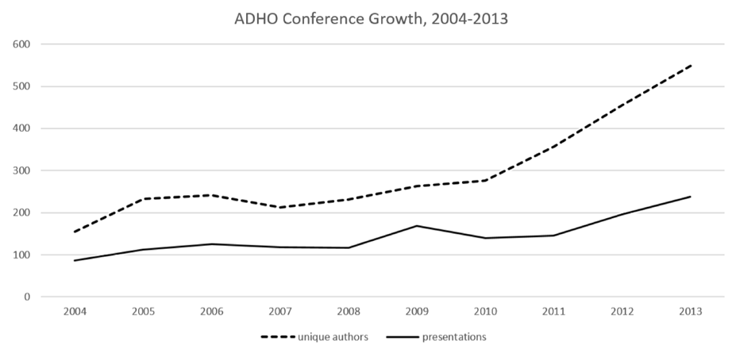
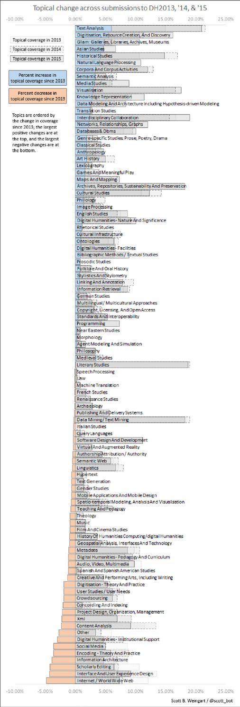
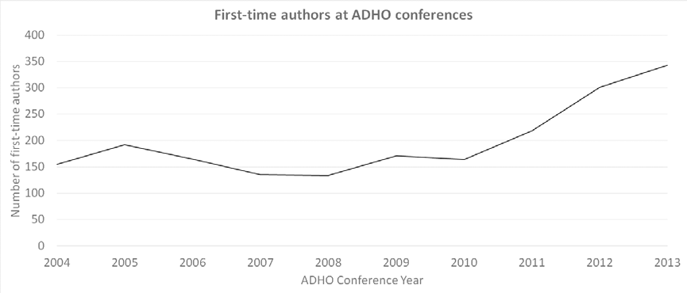
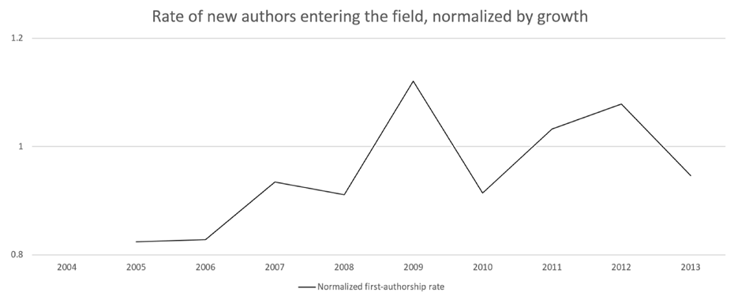
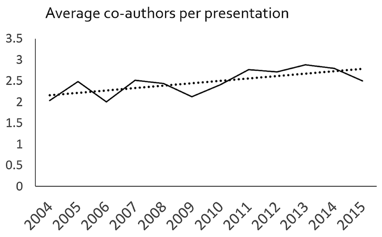
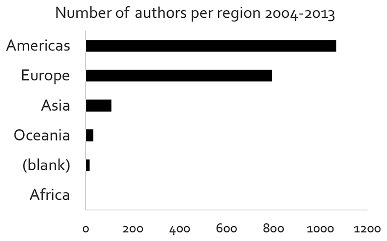
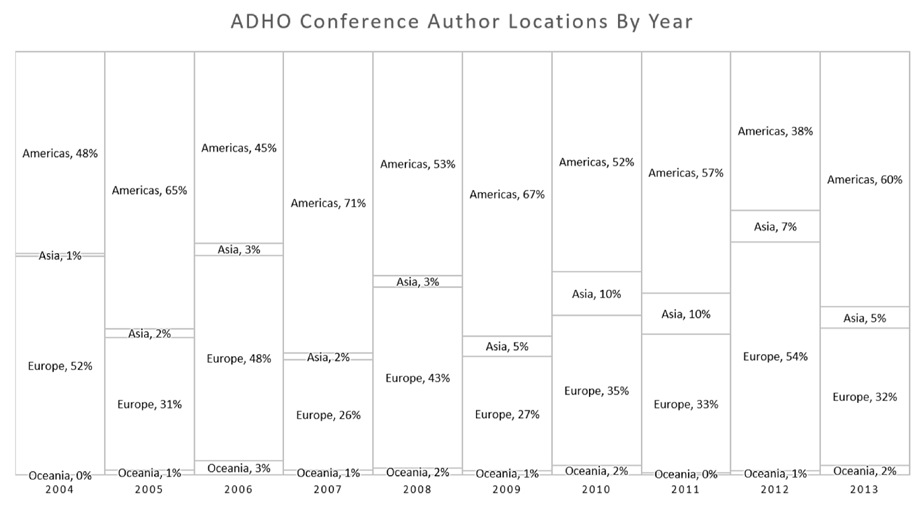
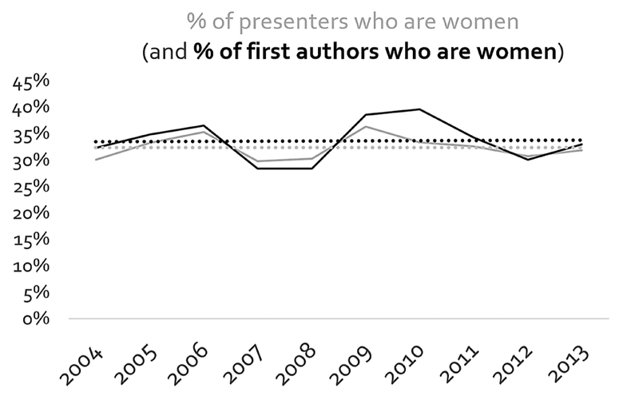

<!-- page 1 -->

**RESEARCH**

**Scott B. Weingart1 and Nickoal Eichmann-Kalwara2**

1 Carnegie Mellon University, US

2 University of Colorado, Boulder, US

Corresponding author: Nickoal Eichmann-Kalwara (nickoal.eichmann@colorado.edu)

## Abstract

This study identifies how the flagship Digital Humanities conference has evolved since 2004 and continues to evolve by analyzing the topical, regional, and authorial trends in its presentations. Additionally, we explore the extent to which Digital Humanists live up to the characterization of being diverse, collaborative, and global using the conference as a proxy. Given the increased popularization of “digital humanities” within the last decade, and especially recent successes in popular press and grant initiatives, this study tempers the sometimes utopic rhetoric that appears alongside mentions of the term.

**Keywords:** ADHO; authorship; disciplinarity

Cette étude a pour but de cerner comment la conférence phare sur les humanités numériques a évolué depuis 2004 et continue à évoluer, en analysant les tendances thématiques, régionales et d’auteur dans ses présentations. De plus, nous explorons dans quelle mesure les humanistes numériques sont à la hauteur de la caractérisation en matière de diversité, de collaboration et de mondialisation, en utilisant la conférence comme intermédiaire. Étant donné la vulgarisation croissante des « humanités numériques » au cours de la dernière décennie, et en particulier les récents succès dans la presse populaire et les initiatives de subvention, cette étude modère la rhétorique parfois utopique qui apparaît aux côtés des mentions du terme.

**Mots-clés:** ADHO; authorship; disciplinarité

<!-- page 2 -->

## Introduction

“Digital Humanities” is a fraught term, on whose definition rests funding decisions, tenure lines, and institutional power dynamics. Its (or their) public face is multifaceted: New York Times articles (Cohen 2010), museum exhibits (Quirk 2015), popular tools (DiRT Directory 2016), and tech industry partnerships (Google Research Blog 2010; Kirschenbaum 2007) all contribute to how the Digital Humanities (DH) interact with the wider world.[^1] In academic circles, the term is often associated with backchannel chatter (Holmberg and Thelwall 2014), grey literature (Huggett 2012), and informal workshops and conferences (French 2015). DH has too many definitions to be well-defined (Terras, Nyhan, and Vanhoutte 2013), but its influence is great enough to warrant an exploration of how it appears to newcomers, to scholars, and to the world. The annual Alliance of Digital Humanities Organizations (ADHO) conference provides one important vantage point whence to launch such an exploration (Earhart 2015; Sugimoto and Weingart 2015). As the largest and most public DH-labeled event,[^2] the conference reflects and constructs many of the visible contours of DH, even (or especially) when it fails to adequately represent all aspects of the community, the scholarship, or the pedagogy.

The first Digital Humanities conference was held in 2006 following the founding of ADHO, but its roots are in the joint Association for Literary and Linguistic Computing (ALLC)/Association for Computers and the Humanities (ACH) conference first held in 1989 (ADHO.org 2016).[^3] This essay reflects on an ongoing quantitative analysis of this conference to trace its changing shape since 1989. The analysis investigates whether the common characterization of DH as collaborative, inclusive, <!-- page 3 --> and globally-minded appears true through data-driven methods, keeping in mind that while ADHO’s conference is not a synecdoche for the entire digital humanities community, the conference does represent the community’s most public face. We present results in modest visualizations and simple statistics for greatest accessibility. Preliminary results reveal a growing conference, growing research team sizes, poor gender diversity, poor (but recently improving) regional diversity, and some shifts in topical focus of presentations. In light of recent controversies in which self-identified digital humanists have become increasingly worried that they and their work are not adequately represented, a topic discussed at length at DH2015 (Terras 2015 and 2011), we conclude that the annual DH conference has more work to do in reflecting its broad constituency and ethos for inclusion and diversity, though we save improvement suggestions for the companion piece referenced in Footnote 1.

### Methods and Data

The DH conference and its joint ALLC/ACH predecessor began in 1989. We have collected schedules or programs from each, and have entered their contents into a spreadsheet to analyze trends across geography and time. By the writing of this piece, we have no data entered from before 2004. From DH2004–DH2013, we entered presentation title, author names, author institutional affiliations (if provided), author country affiliations (if provided), author academic departments (if provided), presentation type (panel, poster, plenary, etc.), presentation text (abstract or full paper depending on availability), and keywords (if provided). In addition to this 2004–2013 dataset of publicly available conference information, we created an additional dataset from conference *submissions* for 2013, 2014, and 2015, which contains the same fields as the above dataset. By checking submissions against the final programs for 2013–2015, we could analyze acceptance rates across several variables.

During and after data collection, we hand-cleaned names, institutions, and departments, ensuring as best as possible that different people with similar names were given separate unique IDs, and that identical people with spelling variations in their names were given the same unique ID. We did the same for departments and institutions. We appended gender information (m/f/other/unknown) to authors <!-- page 4 --> by a combination of hand-entry and automated inference using Lincoln Mullen’s “gender” package for R (Mullen 2016). This is problematic for many reasons, including a lack of possible gender options, the inability to encode gender changes over time, and the possibility of our matching incorrect genders to authors—especially those with names poorly represented on U.S. census and birth records (Posner 2015). We are working to improve this process (see an extended discussion in our forthcoming companion piece with Jeana Jorgensen), but feel even uncertain information is better than no information in this context.

Finally, we used a combination of Google Spreadsheets, Microsoft Excel, Notepad++, OpenRefine, and the R and RStudio development environment to collect and analyze the data for trends. We opt to present simple visualizations, counts, and comparisons rather than more rigorous statistical results in the interest of clarity, but at the expense of certainty. Readers should interpret these results as indicative rather than conclusive.

## Findings

The number of presentations and unique authors at the annual conference has increased nearly every year in the last decade (see **Figure 1**). Although the data do not appear in **Figure 1**, preliminary analysis shows even greater acceleration in 2014 and 2015.

**Figure 1:** Rate of DH conference growth over 10 years (2004–2013).

<!-- page 5 -->

This matches other analyses of digital humanities (Terras 2012), showing increasing DH activity and participation across the board, with no signs of slowing down. The conference is healthy and attendance rotates, with 60 ± 10% of each year’s authors never having attended previously. This suggests a core of about 200 authors, as of 2013, orbited by a constellation of digital humanists who do not regularly attend the conference, disciplinary tourists (perhaps humanities or computer science researchers or librarians with one-off DH projects), and short-term collaborators on multi-authored projects. Such a large portion of attendees appearing only once raises the question of whether “big tent digital humanities” itself should be considered a discipline in its own right, or simply a meeting place that some steer closer to than others. That is: is DH made up entirely of tourists?

Although data for earlier years are unavailable due to privacy standards in many countries, data from the conference in Sydney, Australia in 2015 show that attendance and author lists do not perfectly overlap. Only 70% of pre-registered attendees were also authors of conference presentations. The other 30% of attendees, nearly 150 people, likely included local participants, ADHO committee members, university administrators, and industry professionals. Between attendees and authors, by 2015 we suspect a core community of around 300 returning participants, and a periphery numbering in the several thousands (THATCamp n.d.; @DHNow n.d.).[^4]

That not every author attends, and not every attendee is an author, is itself unsurprising. The demographic difference between the two groups is worth mention, however. We found at DH2015 that ≈35% of authors were women, yet women comprised ≈46% of attendees (Weingart 2015).[^5] Work must be done to improve representation at future conferences to combat this disparity.

<!-- page 6 -->

### Topics

When submitting to the DH conference, authors must attach author-supplied keywords and ADHO-assigned topics to their presentations. Conference committees rarely made this data public before 2013, meaning topical analysis over the last few decades requires hand-coding or algorithmic assistance, neither of which are complete at the time of this writing. Preliminary results are available, however, combining coded data after 2013 (see **Figure 2** and Weingart n.d.)[^6] with anecdotal evidence from preceding years.

In recent years, DH presentations have shifted away from project-based to principle- and skill-focused topics. For instance, interface and user-experience design, scholarly editing, and information architecture, among other project-based topics, have declined. Conversely, text analysis, visualization, and data modeling have increased, especially in the last few years. The exception to this is the rise of topics associated with digitization and GLAM (Galleries, Libraries, Archives, & Museums).

The most prominent topics covered recently have related to literary studies, text analysis/mining, visualization archives, and interdisciplinary collaboration. History, linguistics, philosophy, and gender studies have found a home at DH in the past, but their presence fluctuates, especially in comparison with the dominance of literary studies. This dominance should not be surprising given digital humanities’ cultural origins (Schreibman, Siemens and Unsworth 2004),[^7] though it often comes at the expense of representing other equally rich traditions combining technology with the humanities (Leon 2015; Sloman 1978).[^8] Historical studies jumped from comprising 10% of presentations in 2013 to 17% in 2014, and down to 15% in 2015. It remains unclear whether this indicates random fluctuations, trends over time, or differing regional profiles of DH. Other recently growing topics include semantic analysis and cultural studies.

<!-- page 7 -->

**Figure 2:** Topical change at DH Conferences 2013–2015.

<!-- page 8 -->

The most visible drops in coverage came in topics related to pedagogy, scholarly editions, user interfaces, and research involving social media and the web. Between 2013 and 2015, the conference lost a quarter of its coverage related to pedagogy. “Scholarly Editing” dropped from 11% to 7% of the conference proceedings, and “Interface and User Experience Design” from 13% to 8%. Among the more surprising drops were those in “Internet/World Wide Web” (12% to 8%) and “Social Media” (8.5% to 5%). We mention these specifically because the trends are fairly clear across the three years for which we have data, and conform to our anecdotal awareness of previous years. That said, three years of analysis is not enough to form solid conclusions about shifts in topical coverage, and more collection will be required to confirm these results.

### Authorship

Between 2004 and 2013, nearly 2,000 total authors presented at DH, with the most rapid introduction of new authors after 2010 (see **Figure 3**). Even after taking the growth of the conference itself into account, new authors are appearing faster than we might expect. **Figure 4** shows the rate of introduction of new authors normalized by the growth of the conference itself, such that values above 1 mean authors are entering the conference faster than the conference is growing. The rate of new authors is increasing, suggesting the conference is becoming less insular, or perhaps there are more disciplinary tourists, submitting one presentation and never doing so again. The percentage of returning authors is consequently decreasing, while the sheer volume of core authors is still slowly increasing. This suggests, possibly, that the DH conference is growing in popularity and encouraging more tourists faster than it is growing in core members.

DH often self-identifies as innately collaborative, yet our study indicates that over one-third of presenters at the DH conference remain close to their disciplinary humanistic roots by adhering to the single-authorship tradition (Spiro 2009).[^9] It is unclear whether other humanities conferences hold a similar co-authorship ratio. <!-- page 9 --> Even so, with nearly two-thirds of DH presentations signed by multiple authors, the data indicate a tendency toward collaboration, whether or not that collaboration is *innate* to all DH work.

**Figure 3:** Increasing number of authors at DH conferences who never authored at the conference before.

**Figure 4:** First-authorship rate normalized by conference growth.

The co-authorship rate does not likely represent a true account of collaborative work, but rather a lower bound. Collaboration in digital humanities research may often go uncredited, with invisible work contributed by students, interns, or hired assistance. Given this, single-authored DH presentations may have uncredited authors, and perhaps multi-author presentations do not represent their full collaborative scope in the authorship credits. This confusion will continue as long as DH lacks an agreed-upon standard for credit, though work is being done in this direction (Crymble and Flanders 2013).

<!-- page 10 -->

**Figure 5:** Average number of co-authors on a single presentation in a given DH conference year.

While the insular nature of humanities research is unlikely to disappear from DH, a time-based analysis shows that the number of single-authored presentations is decreasing, as the average number of authors per presentation steadily grows (see **Figure 5**).

### Regional Diversity

Since ADHO is a collection of international organizations, we were interested in the regional diversity of conference authors. We inferred author countries based on their institutional affiliations (e.g., University of Victoria is coded as Canada) and clustered them by U.N. macro regional standards (e.g., Canada = Americas). In doing this, our analysis shows the conference lacks regional diversity, which may be attributed to the locations in which the conference is held.[^10] Between 2004 and 2013, 1,056 authors originated from the Americas (US: 851; Canada: 202; Mexico: 1; Peru: 1; Uruguay: 1), and 794 were from Europe (see **Figure 6**). **Figure 7** shows the prominence of American authors occurred not only in the odd years when the <!-- page 11 --> conference was held in the Americas (with ≈65% American authors), but also in the even years when it was held in Europe (with ≈50% American attendees). While the conference remains Americas-centric overall, regional diversity is on the rise, with notable increases of authors from Asia and Oceania, although no scholars affiliated with African countries appeared in this analysis.

**Figure 6:** Authors per region 2004–2013. Authors we were unable to locate are aggregated under “(blank)”.

**Figure 7:** Country of author institutions to DH conferences 2004–2013.

<!-- page 12 -->

Preliminary analysis shows greater regional diversity in 2014, and unsurprisingly the most diverse yet in 2015, when the conference was held in Sydney. We feel ADHO’s decision to bring the conference farther afield was a step in the right direction.

### Gender Distribution

With women playing increasingly central leadership roles in the DH community, we hoped to see similarly improved representation among DH authors. After coding for author gender, we looked at the percentage of authors each year who were women (or at least who registered as women according to our hand-corrected algorithmic approach), as well as the percentage of first authors who were women (see **Figure 8**). With minor fluctuations per year but an unchanging average over time, about a third of all authors from 2004–2013 were women. The ratio is only slightly (though consistently) better for first-authorships, such that a higher percentage of first authors were women.

The critique may be raised that this is not a problem of representation, but of interest—though even if this were a broadly valid criticism, it is not true in this case. As mentioned earlier, ≈35% of DH2015 authors appear to be women, contrasted against ≈46% of attendees. Thus attendees are not adequately represented among conference authors. From 2004–2013, North American men seem to represent the largest share of authors by far.

**Figure 8:** Percentage of female authors at each annual ADHO conference 2004–2013.

<!-- page 13 -->

## Conclusions and Future Analysis

The data show that over the last decade, ADHO’s international conference has become slightly more collaborative and regionally diverse, that text and literature currently reign supreme, and that women are underrepresented with no signs of improvement thus-far. This is at odds with many of our anecdotal experiences with colleagues online and at home, a group that is more diverse and multidisciplinary than the annual conference reflects. We hope for ADHO to take this disparity into account when organizing future conferences. For instance, if conference location correlates to regional diversity of authors, ADHO might consider hosting the DH conference less often in North America and more often in non-Anglocentric countries. Certainly to some extent, the onus is on the authors and reviewers themselves to promote diversity and broader representation in their panels and projects, and ADHO might find ways to encourage diverse panels and multi-author presentations, or discourage many presentations from the same author. Finally, diversifying the reviewer pool could broaden the topical scope and geographic representation of presentations and attendees. These suggestions reflect efforts already underway in ADHO, which we applaud. We do not make these suggestions as a gesture towards reaching an international conference whose demographics exactly match the global population, but to ensure DH scholarship remains healthy through the inclusion of a broad range of perspectives and approaches.

While the preliminary results are useful and telling, we continue to expand our dataset to include DH abstracts since 1989, and with that, we will look deeper into our initial findings. For instance, while we can anecdotally conclude that there has been a shift in the focus of topics presented at DH, from project- to skill-based, we plan to provide a quantitative assessment of these shifts over time and space. It would be interesting to see how topics distribute geographically, to determine whether regional differences contribute to various differences over self-definitions of digital humanities. Furthermore, we hope to examine authorship with more granularity, to interrogate the diversity of multi-authored presentations for cross-institutional and international collaboration. We also plan to analyze the <!-- page 14 --> relationships between new and repeat authors with topics and the fields they come from, as well as correlating topic with gender. Preliminary results suggest gender does skew what topic is being discussed, with topics more often written by women less likely to appear in the conference. Finally, we will open our dataset so authors can edit their own information, allowing a more sensitive gender analysis beyond the male/female binary and taking into account the fluidity of the category over time.

## Author Typology

The authors of this article are credited in descending order by significance of contribution. The corresponding author is Nickoal Eichmann-Kalwara (ne). Author contributions, described using the CASRAI CRedIT typology (“CRediT – CASRAI” 2016), are as follows (authors identifed by initials):

Corresponding author: ne

Conceptualization: sw

Methodology: sw, ne

Validation: sw, ne

Formal Analysis: sw, ne

Investigation: sw, ne

Data Curation: ne, sw

Writing – Original Draft Preparation: sw, ne

Writing – Review & Editing: ne, sw

Visualization: sw, ne

Project Administration: sw, ne

Funding Acquisition: sw

## Competing Interests

The authors have no competing interests to declare.

## References

**@DHNow.** n.d. Accessed January 30, 2017. https://twitter.com/dhnow.

**Alliance of Digital Humanities Organizations.** 2016. “Conference.” Accessed December 6. http://adho.org/conference.

<!-- page 15 -->

**Cohen, Patricia.** 2010. “Humanities Scholars Embrace Digital Technology.” *New York Times*, November 17. http://www.nytimes.com/2010/11/17/arts/17digital.html.

**Crymble, Adam,** and **Julia Flanders.** 2013. “FairCite.” *Digital Humanities Quarterly* 7(2). http://www.digitalhumanities.org/dhq/vol/7/2/000164/000164.html.

**DiRT Directory.** 2016. Accessed January 19, 2017. http://dirtdirectory.org.

**Earhart, Amy.** 2015. “Take Back the Narrative: Rethinking the History of Diverse Digital Humanities.” *Presentation at Digital Humanities Forum 2015*, University of Kansas, September 26.

**Eichmann-Kalwara, Nickoal, Jeana Jorgensen,** and **Scott B. Weingart.** Forthcoming. “Representation at Digital Humanities Conferences (2000–2015).” DOI: https://doi.org/10.6084/m9.figshare.3120610.v1

**Eichmann, Nickoal,** and **Scott B. Weingart.** 2015. “What’s Under the Big Tent? ADHO Conference Abstracts, 2004–2015”. *Presentation at the Digital Humanities Summer Institute Colloquium*, Victoria, British Columbia, June 16. DOI: https://doi.org/10.6084/m9.figshare.1461760.v4

**French, Amanda.** 2015. “THATCamp, Me, and Virginia Tech Libraries.” *Amandafrench.net* (blog), April 13. http://amandafrench.net/2015/04/13/thatcamp-me-and-virginia-tech-libraries/.

**Google Research Blog.** 2010. “Our Commitment to the Digital Humanities.” July 14. http://googleresearch.blogspot.com/2010/07/our-commitment-to-digital-humanities.html.

**Holmberg, Kim,** and **Mike Thelwall.** 2014. “Disciplinary Differences in Twitter Scholarly Communication.” *Scientometrics*, January. DOI: https://doi.org/10.1007/s11192-014-1229-3

**Huggett, Jeremy.** 2012. “Core or Periphery? Digital Humanities from an Archaeological Perspective.” *Historical Social Research/Historische Sozialforschung* 37: 3(141): 86–105.

**Kirschenbaum, Matthew G.** 2007. “The Remaking of Reading: Data Mining and the Digital Humanities.” *The National Science Foundation Symposium on Next Generation of Data Mining and Cyber-Enabled Discovery for Innovation (NGDM’07): Final Report*. http://www.almaden.ibm.com/cs/projects/iis/hdb/Publications/papers/ngdm07report.pdf.

<!-- page 16 -->

**Leon, Sharon.** 2015. “User-Centered Digital History: Doing Public History on the Web.” *Brackett* (blog), March 3. https://www.6floors.org/bracket/2015/03/03/user-centered-digital-history-doing-public-history-on-the-web/.

**Mullen, Lincoln.** 2016. “Predict Gender from Names Using Historical Data.” https://github.com/ropensci/gender.

**Posner, Miriam.** 2015. “What’s Next: The Radical, Unrealized Potential of Digital Humanities.” *Miriam Posner’s Blog*, July 27. http://miriamposner.com/blog/whats-next-the-radical-unrealized-potential-of-digital-humanities/.

**Quirk, Kathy.** 2015. “Digital Humanities Lab launches first exhibit.” *Today@UWM*, January 23. http://uwm.edu/humanities/digital-humanities-lab-launches-first-exhibit/.

**Schreibman, Susan, Ray Siemens,** and **John Unsworth,** eds. 2004. *A Companion to Digital Humanities*. Oxford: Blackwell. http://www.digitalhumanities.org/companion/.

**Sloman, Aaron.** 1978. *The Computer Revolution in Philosophy: Philosophy, Science and Models of Mind.* Highlands, NJ: Humanities Press.

**Spiro, Lisa.** 2009. “Collaborative Authorship in the Humanities.” *Digital Scholarship in the Humanities* (blog), April 21. https://digitalscholarship.wordpress.com/2009/04/21/collaborative-authorship-in-the-humanities/.

**Sugimoto, Cassidy R,** and **Scott Weingart.** 2015. “The Kaleidoscope of Disciplinarity.” *Journal of Documentation* 71(4): 775–94 DOI: https://doi.org/10.1108/JD-06-2014-0082

**Terras, Melissa.** 2011. “Peering Inside the Big Tent: Digital Humanities and the Crisis of Inclusion.” *Melissa Terras’ Blog*, July 26. http://melissaterras.blogspot.com/2011/07/peering-inside-big-tent-digital.html.

**Terras, Melissa.** 2012. “Infographic: Quantifying Digital Humanities.” *UCL Centre for Digital Humanities* (blog), January 20. http://blogs.ucl.ac.uk/dh/2012/01/20/infographic-quantifying-digital-humanities/.

**Terras, Melissa.** 2015. “Why I Do Not Trust Frontiers Journals, Especially Not @FrontDigitalHum.” *Melissa Terras*, July 21. http://melissaterras.org/2015/07/21/why-i-do-not-trust-frontiers-journals-especially-not-frontdigitalhum/.

<!-- page 17 -->

**Terras, Melissa, Julianne Nyhan,** and **Edward Vanhoutte,** eds. 2013. *Defining Digital Humanities: A Reader*. Ashgate Publishing.

**THATCamp.org.** n.d. “People.” Accessed January 30, 2017. http://thatcamp.org/people/.

**Weingart, Scott.** 2015. “Acceptances to Digital Humanities 2015 (part 3).” *Scottbot.net* (blog), June 27. http://scottbot.net/acceptances-to-digital-humanities-2015-part-3/.

**Weingart, Scott.** n.d. “Tag: dhconf.” *Scottbot.net* (blog). Accessed January 30, 2017. http://scottbot.net/tag/dhconf/.

## Notes

[^1]: This is an extension of work presented at the DHSI 2015 Colloquium (Eichmann and Weingart 2015). The research began as a blog series by Weingart (see his blog, scottbot.net). A companion piece focusing on representation at DH is forthcoming (Eichmann-Kalwara, Jorgensen, and Weingart forthcoming).

[^2]: The ADHO DH conference draws publishers, students, faculty, librarians, museum curators, and archivists, among others. It is not always the most populated event (e.g., in 2014 the Digital Humanities Summer Institute (DHSI) itself hosted more attendees than ADHO’s conference), but it is undoubtedly the highest-profile annual DH event.

[^3]: Although international conferences from the same tradition and community were held as early as the 1960s, and alternating European (ALLC)/North American (ICCH) conferences began in the early 1970s, the first truly joint conference was held in 1989. Its successors represent the largest international digital humanities conferences, and as such are the focus of this analysis.

[^4]: This matches with other numbers measured in late 2015 that has since grown to over 7,000 registered users at THATCamp.org, over 24,000 followers of @DHNow on Twitter, etc.

[^5]: See http://scottbot.net/acceptances-to-digital-humanities-2015-part-3/ for a more detailed discussion. Next steps include checking the extent to which this ratio matches the conference “core” of 200 participants, and the various other digital humanities communities and conferences.

[^6]: More exhaustive post-2013 topical analyses appear in Weingart’s blog (http://scottbot.net/tag/dhconf/).

[^7]: Susan Schreibman, Ray Siemens, and John Unsworth’s *A Companion to Digital Humanities* popularized the term Digital Humanities around a strongly literary tradition.

[^8]: Examples of underrepresented communities include digital public history (Leon 2015) and computational philosophy (Sloman 1978).

[^9]: While future research will investigate diversity within presentations (i.e. ask whether individual multi-authored works include collaborators from other countries and institutions), Lisa Spiro compared digital humanities scholarship and disciplinary scholarship to determine the extent of collaboration in DH-oriented and discipline-specific journals (Spiro 2009). [^10] Between 2004 and 2015, in each odd-numbered year, the DH conference was held in the North America, and all even years took place in Europe, with the exception of Australia in 2015. The host country, from 2004–2015, has been: Sweden, Canada, France, USA, Finland, USA, UK, USA, Germany, USA, Switzerland, Australia.

