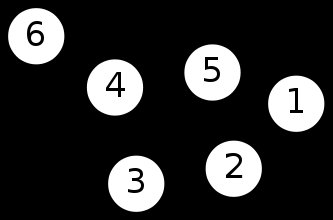
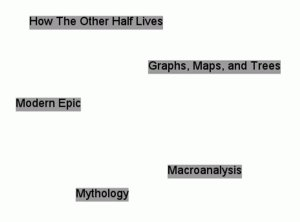
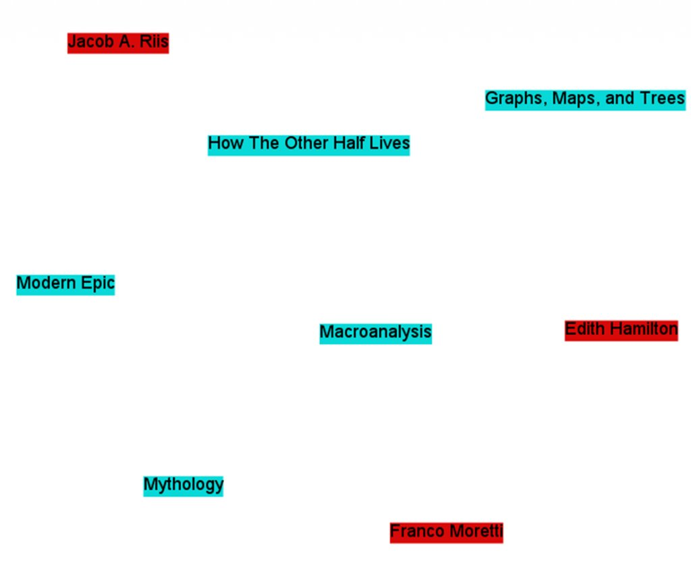
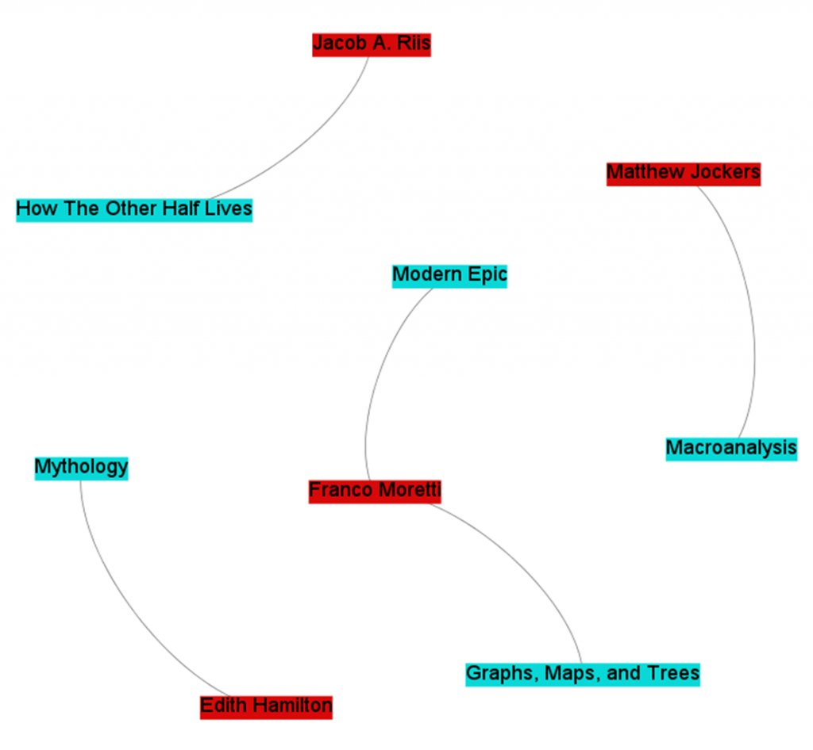
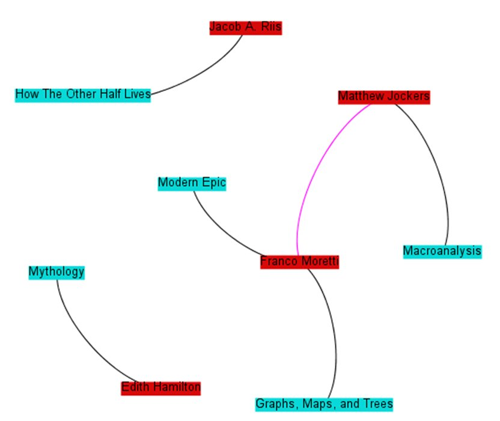
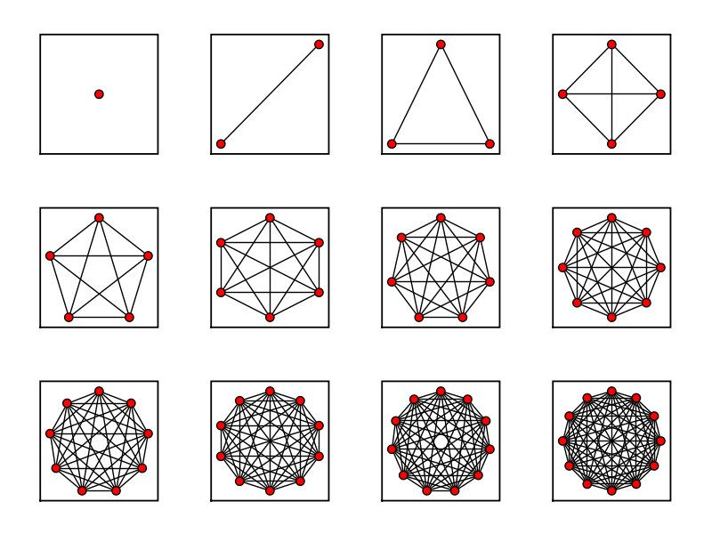

# Demystifying Networks

# Part 1 of *n*: An Introduction

A [bunch](http://www.scottbot.net/HIAL/index.html@p=1942.html) [of](http://www.scottbot.net/HIAL/index.html@p=221.html) [my](http://www.scottbot.net/HIAL/index.html@p=129.html) [recent](http://www.scottbot.net/HIAL/index.html@p=120.html) [posts](http://www.scottbot.net/HIAL/index.html@p=80.html) have mentioned networks. [Elijah Meeks](http://dhs.stanford.edu/)
not-so-subtly hinted that it might be a good idea to discuss some of
the basics of networks on this blog, and I’m happy to oblige. He already
[introduced network visualizations on his own blog](https://dhs.stanford.edu/visualization/more-networks/),
and did a fantastic job of it, so I’m going to try to stick to more of
the conceptual issues here, gearing the discussion generally toward
people with little-to-no background in networks or math, and
specifically to digital humanists interested in applying network
analysis to their own work. This will be part of an ongoing series, so
if you have any requests, please feel free to mention them in the
comments below (I’ve already been asked to discuss how social networks
apply to fictional worlds, which is probably next on the list).

# Some Warnings

A network is a fantastic tool in the digital humanist’s toolbox – one of many – and it’s no exaggeration to say pretty much *any*
data can be studied via network analysis. With enough stretching and
molding, you too could have a network analysis problem! As with many
other science-derived methodologies, it’s fairly easy to extend the
metaphor of network analysis into any number of domains.

The danger here is two-fold.

1. [When you’re given your first hammer, everything looks like a nail](http://en.wikipedia.org/wiki/Law_of_the_instrument). Networks *can* be used on any project. Networks *should*
   be used on far fewer. Networks in the humanities are experiencing quite
   the awakening, and this is due in part to until-recently untapped
   resources. There is a lot of low-hanging fruit out there on the
   networks+humanities tree, and they ought to be plucked by those brave
   and willing enough to do so. However, that does not give us an excuse to
   apply networks to *everything*. This series will talk a little bit about when hammers are useful, and when you really should be reaching for a screwdriver.
2. Methodology appropriation is *dangerous*. Even when the
   people designing a methodology for some specific purpose get it right –
   and they rarely do – there is often a score of theoretical and
   philosophical caveats that get lost when the methodology gets
   translated. In the more frequent case, when those caveats are not known
   to begin with, “borrowing” the methodology becomes even more dangerous.
   Ted Underwood [blogs a great example of why literary historians ought to skip a major step in Latent Semantic Analysis](http://tedunderwood.wordpress.com/2011/10/16/lsa-is-a-marvellous-tool-but-humanists-may-no-use-it-the-way-computer-scientists-do/), because the purpose of the literary historian is *so very different*
   from that of computer scientists who designed the algorithm. This
   series will attempt to point out some of the theoretical baggage and
   necessary assumptions of the various network methods it covers.

# The Basics

Nothing worth discovering has ever been found in safe waters. Or rather, everything worth discovering in safe waters *has already been discovered*,
so it’s time to shove off into the dangerous waters of methodology
appropriation, cognizant of the warnings but not crippled by them.

Anyone with a lot of time and a vicious interest in networks should stop reading *right now*, and instead pick up copies of [Networks, Crowds, and Markets](http://www.cs.cornell.edu/home/kleinber/networks-book/) (Easley & Kleinberg, 2010) and [Networks: An Introduction](http://www.amazon.com/Networks-Introduction-Mark-Newman/dp/0199206651)
(Newman, 2010). The first is a non-mathy introduction to most of the
concepts of network analysis, and the second is a more in depth (and
formula-laden) exploration of those concepts. They’re phenomenal,
essential, and worth every penny.

Those of you with slightly less time, but somehow enough to read my
rambling blog (there are apparently a few of you out there), so good of
you to join me. We’ll start with the *really basic* basics, but stay with me, because by part *n* of this series, we’ll be going over the really cool stuff only ninjas, Gandhi, and The Rolling Stones have worked on.

## Networks

The word “network” originally meant just that: “a [net-like arrangement of threads, wires, etc.](http://www.etymonline.com/index.php?term=network)” It later came to stand for any complex, interlocking system. **Stuff** and **relationships**.

[](http://www.scottbot.net/HIAL/wp-content/uploads/2011/12/network.png)

A simple network representation

Generally, network studies are made under the assumption that neither
the stuff nor the relationships are the whole story on their own. If
you’re studying something with networks, odds are you’re doing so
because you think the objects of your study are *interdependent* rather than *independent*. Representing information as a network implicitly suggests not only that connections matter, but that they are *required* to understand whatever’s going on.

Oh, I should mention that people often use the word “graph” when
talking about networks. It’s basically the mathy term for a network, and
its definition is a bit more formalized and concrete. Think dots
connected with lines.

Because networks are studied by lots of different groups, there are
lots of different words for pretty much the same concepts. I’ll explain
some of them below.

## The Stuff

Stuff (presumably) exists. Eggplants, true love, the *Mary Celeste*, tall people, and Terry Pratchett’s *Thief of Time* all fall in that category. Network analysis generally deals with one or a small handful of *types* of stuff, and then a multitude of examples of that type.

Say the *type* we’re dealing with is a book. While scholars
might argue the exact lines of demarcation separating book from
non-book, I think we can all agree that most of the stuff in my
bookshelf are, in fact, books. They’re the *stuff*. There are different examples of books; a quotation dictionary, a Poe collection, and so forth.

I’ll call this assortment of stuff *nodes*. You’ll also hear them called *vertices* (mostly from the mathematicians and computer scientists), *actors* (from the sociologists), *agents* (from the modelers), or *points* (not really sure where this one comes from).

The *type* of stuff corresponds to the *type* of node. The individual examples are the nodes themselves. All of the nodes are books, and each book is a different node.

Nodes can have attributes. Each node, for example, may include the title, the number of pages, and the year of publication.

A list of nodes could look like this:

```
| Title                    | # of pages | year of publication |
| ----------------------------------------------------------- |
| Graphs, Maps, and Trees  | 119        | 2005                |
| How The Other Half Lives | 233        | 1890                |
| Modern Epic              | 272        | 1995                |
| Mythology                | 352        | 1942                |
| Macroanalysis            | unknown    | 2011                |
```

[](http://www.scottbot.net/HIAL/wp-content/uploads/2011/12/NetBooks2.png)

A network of books (nodes) with no relationships (connections)

We can get a bit more complicated and add more node *types* to the network. Authors, for example. Now we’ve got a network with books and authors (but nothing linking them, yet!). *Franco Moretti* and *Graphs, Maps, and Trees*
are both nodes, although they are of different varieties, and not yet
connected. We would have a second list of nodes, part of the same
network, that might look like this:

```
| Author          | Birth | Death   |
| --------------------------------- |
| Franco Moretti  | ?     | n/a     |
| Jacob A. Riis   | 1849  | 1914    |
| Edith Hamilton  | 1867  | 1963    |
| Matthew Jockers | ?     | n/a     |
```

[](http://www.scottbot.net/HIAL/wp-content/uploads/2011/12/NetBooksAuthors1.png)

A network of books and authors without relationships.

A network with two types of nodes is called *2-mode*, *bimodal*, or *bipartite*. We can add more, making it *multimodal*.
Publishers, topics, you-name-it. We can even add seemingly unrelated
node-types, like academic conferences, or colors of the rainbow. The
list goes on. We would have a new list for each new variety of node.

Presumably we could continue adding nodes and node-types until we run
out of stuff in the universe. This would be a bad idea, and not just
because it would take more time, energy, and hard-drives than could ever
possibly exist.

As it stands now, network science is ill-equipped to deal with
multimodal networks. 2-mode networks are difficult enough to work with,
but once you get to three or more varieties of nodes, most algorithms
used in network analysis *simply do not work*. It’s not that they *can’t* work; it’s just that most algorithms were only created to deal with networks with one variety of node.

This is a trap I see many newcomers to network science falling into,
especially in the Digital Humanities. They find themselves with a
network dataset of, for example, authors and publishers. Each author is
connected with one or several publishers (we’ll get into the connections
themselves in the next section), and the up-and-coming network
scientist loads the network into their favorite software and visualizes
it. Woah! A network!

Then, because the software is easy to use, and has a lot of buttons
with words that from a non-technical standpoint seem to make a lot of
sense, they press those buttons to see what comes out. Then, they change
the visual characteristics of the network based on the buttons they’ve
pressed.

Let’s take a concrete example. Popular network software Gephi comes with a button that measures the *centrality*
of nodes. Centrality is a pretty complicated concept that I’ll get into
more detail later, but for now it’s enough to say that it does exactly
what it sounds like; it finds how central, or important, each node is in
a network. The newcomer to network analysis loads the author-publisher
network into Gephi, finds the centrality of every node, and then makes
the nodes bigger that have the highest centrality.

The issue here is that, although the network loads into Gephi
perfectly fine, and although the centrality algorithm runs smoothly, the
resulting numbers *do not mean what they usually mean*.
Centrality, as it exists in Gephi, was fine-tuned to be used with single
mode networks, whereas the author-publisher network is bimodal.
Centrality measures have been made for bimodal networks, but those
algorithms are not included with Gephi.

Most computer scientists working with networks do so with only one or
a few types of nodes. Humanities scholars, on the other hand, are often
dealing with the interactions of many *types* of things, and so
the algorithms developed for traditional network studies are
insufficient for the networks we often have. There are ways of fitting
their algorithms to our networks, or vice-versa, but that requires
fairly robust technical knowledge of the task at hand.

Besides dealing with the single mode / multimodal issue, humanists
also must struggle with fitting square pegs in round holes. Humanistic
data are almost by definition uncertain, open to interpretation,
flexible, and not easily definable. Node types are concrete; your object
either *is* or *is not* a book. Every book-type thing shares certain unchanging characteristics.

This *reduction of data* comes at a price, one that some argue
traditionally divided the humanities and social sciences. If humanists
care more about the differences than the regularities, more about what
makes an object unique rather than what makes it similar, that is the
very information they are likely to lose by defining their objects as
nodes.

This is not to say it cannot be done, or even that it has not! People
are clever, and network science is more flexible than some give it
credit for. The important thing is either to be aware of what you are
losing when you reduce your objects to one or a few types of nodes, or
to change the methods of network science to fit your more complex data.

## The Relationships

Relationships (presumably) exist. Friendships, similarities, web
links, authorships, and wires all fall into this category. Network
analysis generally deals with one or a small handful of *types* of relationships, and then a multitude of examples of that type.

Say the *type* we’re dealing with is an authorship. Books (the *stuff*) and authors (another kind of *stuff*)
are connected to one-another via the authorship relationship, which is
formalized in the phrase “X is an author of Y.” The individual
relationships themselves are of the form “Franco Moretti *is an author of* Graphs, Maps, and Trees.”

Much like the stuff (nodes), relationships enjoy a multitude of names. I’ll call them *edges*. You’ll also hear them called *arcs*, *links*, *ties*, and *relations*. For simplicity sake, although *edges*
are often used to describe only one variety of relationship, I’ll use
it for pretty much everything and just add qualifiers when discussing
specific types. The *type* of relationship corresponds to the *type* of edge. The individual examples are the edges themselves.

Individual edges are defined, in part, by the nodes that they connect.

A list of edges could look like this:

```
| Person                   | Is an author of            |
| ----------------------------------------------------- |
| Franco Moretti           | Modern Epic                |
| Franco Moretti           | Graphs, Maps, and Trees    |
| Jacob A. Riis            | How The Other Half Lives   |
| Edith Hamilton           | Mythology                  |
| Matthew Jockers          | Macroanalysis              |
```

[](http://www.scottbot.net/HIAL/wp-content/uploads/2011/12/NetBooksAuthorsEdges.png)

Network of books, authors, and relationships between them.

Notice how, in this scheme, edges can only link two different types
of nodes. That is, a person can be an author of a book, but a book
cannot be an author of a book, nor can a person an author of a person.
For a network to be truly bimodal, it *must* be of this form. Edges can go between types, but not among them.

This constraint may seem artificial, and in some sense it is, but for
reasons I’ll get into in a later post, it is a constraint required by
most algorithms that deal with bimodal networks. As mentioned above,
algorithms are developed for specific purposes. Single mode networks are
the ones with the most research done on them, but bimodal networks
certainly come in a close second. They are networks with two types of
nodes, and edges *only* going *between* those types.

Of course, the world humanists care to model is often a good deal
more complicated than that, and not only does it have multiple varieties
of nodes – it also has multiple varieties of edges. Perhaps, in
addition to “X is an author of Y” type relationships, we also want to
include “A collaborates with B” type relationships. Because edges, like
nodes, can have attributes, an edge list combining both might look like
this.

```
| Node1                    | Node 2                     | Edge Type         |
| ----------------------------------------------------- | ----------------- |
| Franco Moretti           | Modern Epic                | is an author of   |
| Franco Moretti           | Graphs, Maps, and Trees    | is an author of   |
| Jacob A. Riis            | How The Other Half Lives   | is an author of   |
| Edith Hamilton           | Mythology                  | is an author of   |
| Matthew Jockers          | Macroanalysis              | is an author of   |
| Matthew Jockers          | Franco Moretti             | collaborates with |
```

[](http://www.scottbot.net/HIAL/wp-content/uploads/2011/12/Full-Network.png)

Network of authors, books, authorship relationships, and collaboration relationships.

Notice that there are now two types of edges: “is an author of” and
“collaborates with.” Not only are they two different types of edges;
they act in two *fundamentally different ways*. “X is an author
of Y” is an asymmetric relationship; that is, you cannot switch out
Node1 for Node2. You cannot say “Modern Epic is an author of Franco
Moretti.” We call this type of relationship a *directed edge*, and we generally represent that visually using an arrow going from one node to another.

“A collaborates with B,” on the other hand, is a symmetric
relationship. We can switch out “Matthew Jockers collaborates with
Franco Moretti” with “Franco Moretti collaborates with Matthew Jockers,”
and the information represented would be exactly the same. This is
called an *undirected edge*, and is usually represented visually by a simple line connecting two nodes.

Most network algorithms and visualizations break down when combining
these two flavors of edges. Some algorithms were designed for directed
edges, like [Google’s PageRank](http://en.wikipedia.org/wiki/PageRank),
whereas other algorithms are designed for undirected edges, like many
centrality measures. Combining both types is rarely a good idea. Some
algorithms will still run when the two are combined, however the results
usually make little sense.

Both directed and undirected edges can also be weighted. For example,
I can try to make a network of books, with those books that are similar
to one another sharing an edge between them. The more similar they are,
the heavier the weight of that edge. I can say that every book is
similar to every other on a scale from 1 to 100, and compare them by
whether they use the same words. Two dictionaries would probably connect
to one another with an edge weight of 95 or so, whereas *Graphs, Maps, and Trees* would probably share an edge of weight 5 with *How The Other Half Lives*.
This is often visually represented by the thickness of the line
connecting two nodes, although sometimes it is represented as color or
length.

It’s also worth pointing out the difference between explicit and
inferred edges. If we’re talking about computers connected on a network
via wires, the edges connecting each computer *actually exist*. We can weight them by wire length, and that length, too, *actually exists*. Similarly, citation linkages, neighbor relationships, and phone calls are explicit edges.

We can begin to move into interpretation when we begin creating edges
between books based on similarity (even when using something like word
comparisons). The edges are a layer of interpretation not intrinsic in
the objects themselves. The humanist might argue that all edges are
intrinsic all the way down, or inferred all the way up, but in either
case there is a difference in kind between two computers connected via
wires, and two books connected because we feel they share similar
topics.

As such, algorithms made to work on one may not work on the other; or
perhaps they may, but their interpretative framework must change
drastically. A very central computer might be one in which, if removed,
the computers will no longer be able to interact with one another; a
very central book may be something else entirely.

As with nodes, edges come with many theoretical shortcomings for the
humanist. Really, everything is probably related to everything else in
its [light cone](http://en.wikipedia.org/wiki/Light_cone).
If we’ve managed to make everything in the world a node, realistically
we’d also have some sort of edge between pretty much everything, with a
lesser or greater weight. A network of nodes where almost everything is
connected to almost everything else is called *dense*,
and dense networks networks are rarely useful. Most network algorithms
(especially ones that detect communities of nodes) work better and
faster when the network is *sparse*, when most nodes are only connected to a small percentage of other nodes.

[](http://www.scottbot.net/HIAL/wp-content/uploads/2011/12/complete.png)

Maximally dense networks from sagemath.org

To make our network sparse, we often must artificially cut off which
edges to use, especially with humanistic and inferred data. That’s what [Shawn Graham showed us how to do when combining topic models with networks](http://electricarchaeologist.wordpress.com/2011/11/11/topic-modeling-with-the-java-gui-gephi/).
The network was one of authors and topics; which authors wrote about
which topics? The data itself connected every author to every topic to a
greater or lesser degree, but such a dense network would not be very
useful, so Shawn limited the edges to the *highest weighted* connections between an author and a topic. The resulting network looked like [this](http://electricarchaeologist.files.wordpress.com/2011/11/topics-by-authors-v2.pdf), when it otherwise would have looked like a big ball of spaghetti and meatballs.

Unfortunately, given that humanistic data are often uncertain and
biased to begin with, every arbitrary act of data-cutting has the
potential to add further uncertainty and bias to a point where the
network no longer provides meaningful results. The ability to cut away
just enough data to make the network manageable, but not enough to lose
information, is as much an art as it is a science.

## Hypergraphs & Multigraphs

Mathematicians and computer scientists have actually formalized more complex varieties of networks, and they call them [hypergraphs](http://en.wikipedia.org/wiki/Hypergraph) and [multigraphs](http://en.wikipedia.org/wiki/Multigraph).
Because humanities data are often so rich and complex, it may be more
appropriate to represent it using these representations. Unfortunately,
although ample research has been done on both, most out-of-the-box tools
support neither. We have to build them for ourselves.

A hypergraph is one in which more than two nodes can be connected by
one edge. A simple example would be a “is a sibling of” relationship,
where the edge connected three sisters rather than two. This is a
symmetric, undirected edge, but perhaps there can be directed edges as
well, of the type “Alex *convinced* Betty *to run away from* Carl.”

A multigraph is one in which multiple edges can connect any two
nodes. We can have, for example, a transportation graph between cities. A
edge exists for every transportation route. Realistically, many routes
can exist between any two cities; some by plane, several different
highways, trains, etc.

I imagine both of these representations will be important for
humanists going forward, but rather than relying on that computer
scientist who keeps hanging out in the history department, we ourselves
will have to develop algorithms that accurately capture exactly what it
is we are looking for. We have a different set of problems, and though
the solutions may be similar, they must be adapted to our needs.

## Side note: RDF Triples

Digital humanities loves [RDF](http://en.wikipedia.org/wiki/Resource_Description_Framework). RDF basically works using something called a *triple*;
a subject, a predicate, and an object. “Moretti is an author of Graphs,
Maps, and Trees” is an example of a triple, where “Moretti” is the
subject, “is an author of” is the predicate, and “Graphs, Maps, and
Trees” is the object. As such, nearly all RDF documents can be
represented as a directed network. Whether that representation would
actually be useful depends on the situation.

## Side note: Perspectives

Context is key, especially in the humanities. One thing the last few
decades has taught us is that perspectives are essential, and any model
of humanity that does not take into account its multifaceted nature is
doomed to be forever incomplete. According to Alex, Betty and Carl are
best friends. According to Carl, he can’t actually stand Betty. The
structure and nature of a network might change depending on the
perspective of a particular node, and I know of no model that captures
this complexity. If you’re familiar with something that might capture
this, or are working on it yourself, please let me know via comments or
e-mail.

# Networks, Revisited

The above post discussed the simplest units of networks; the stuff
and the relationships that connect them. Any network analysis approach
must subscribe to and live with that duality of objects. Humanists face
problems from the outset; data that does not fit neatly into one
category or the other, complex situations that ought not be reduced, and
methods that were developed with different purposes in mind. However,
network analysis remains a viable methodology for answering and raising
humanistic questions – we simply must be cautious, and must be willing
to get our hands dirty editing the algorithms to suit our needs.

In the coming posts of this series, I’ll discuss various
introductory topics including data representations, basic metrics like
degree, centrality, density, clustering, and path length, as well as
ways to link old network analysis concepts with common humanist
problems. I’ll also try to highlight examples from the humanities, and
raise methodological issues that come with our appropriation of somebody
else’s algorithms.

This will probably be the longest of the posts, as some concepts are
fairly central and must be discussed all-at-once. Again, if anybody has
any particular concepts of network analysis they’d like to see
discussed, please don’t hesitate to comment with your request.

---

## Reader Comments

> **Stephen Ross**, 2012-01-02T21:24:12+00:00
>
> If one wanted to do multimodal
> analysis, is there a way to do basic or bimodal analysis on several sets
> of data and then overlay them or correlate them? I’m thinking of
> looking at various relationships obtaining amongst members of a
> professional society, their home institutions, their topics, etc. Would
> it be possible to graph the names, then the institutions, then the
> topics, etc. and then find some way to correlate that data to produce a
> complex representation of the centrality of persons, places, topics,
> etc?
>
> Thanks for the post, by the way — very, very helpful.

>> **Scott Weingart**, 2012-01-08T13:42:10+00:00
>>
>> That’s a question I’ve struggled
>> with before, as well. While it is conceivable to make a network that
>> combines all of those elements, and with some finagling perhaps an
>> algorithm that will encode meaningful information about all elements,
>> I’m not really convinced that’s the best way to go.
>>
>> Whether you’re looking for a visual or numerical representation, *only one*
>> representation is rarely enough. For visualizations, although getting
>> everything distilled down into one picture is satisfying and great PR
>> for your project, it constrains you to two (at most three) axes, and
>> then a few extra dimensions for color, size, etc. Sometimes that’s
>> sufficient; for example, in the above question, you can find centrality
>> of people, institutions, and topics by themselves, then connect them all
>> in one large graph, sized by centrality, and colored by what “type” of
>> node each is. If your data are too large, however, this graph will
>> become unreadable pretty fast. The better option might be to represent
>> each node type individually in a separate representation, and only then
>> perhaps all of them together for a broader view of how they all connect.
>>
>> For simple numerical scores, one representation is even worse. Scores
>> are inherently ordinal, so you’ll get a list of nodes where some topic
>> is more central than some person, who is himself more central than some
>> institution. It would be hard finding meaning in those orders, so it
>> again might be best to stick with multiple representations.
>>
>> In either case, don’t sacrifice understandability for the desire to squeeze everything into one picture.
>>
>> That being said, you can also find edges between every person through
>> professional society affiliation, institution, topic, etc., and make
>> each of those associations different *edge types*, with each edge
>> weighted. Some software packages allow visualizing multiple edges
>> between nodes, so you view, say, four different edges between Alice and
>> Bob. Or, you can add them all together in some way and visualize the
>> network that way, but you’ll be losing the individual types of
>> connections in the process.

> **Daniel Shore (@DanAShore)**, 2013-09-23T18:29:08+00:00
>
> Hey Scott,
> This is a really helpful, clear, post on what networks do and don’t do
> well. One thing that you might consider clarifying is what you mean by
> “useful,” as when you say that “dense networks networks are rarely
> useful.” I gather that by “useful” you mean “susceptible to algorithmic
> analysis.” But of course there are plenty of other things for which
> networks are useful.
> d

>> **Scott Weingart**, 2013-09-23T19:17:54+00:00
>>
>> Dan, thanks for the comment, that’s a great point, I’ll update accordingly in my next write-through.

> **Christof**, 2014-09-05T15:33:04+00:00
>
> Hi Scott, thanks for this very clear
> and to-the-point post. When I recently experimented with making a
> network of crime fiction novels and their topics, I had to deal
> precisely with some of the issues you discuss: how to deal with a
> bimodal network and how to deal with high density.
> As for the bimodality, for example, depending on the relative number of
> topics and novels, topics may just on account of their smaller number
> have higher centrality, which I guess would then be a misleading
> measure. In my case, even with a ratio of 200 novels to 40 topics, this
> is certainly noticeable.
> And as for the sparsity issue, cutting out a relatively large part of
> the low-scoring novel-topic associations certainly helped with
> visualization. But it seems choosing the cut-off point is a matter of
> trial-and-error and experience. In my case, I took out any novel-topic
> associations with a score lower than 0.05, of which there were many,
> reducing the number of edges by about two thirds. But this will vary
> with the number of documents and number of topics in the dataset.
> Anyway, this post is still a good read!
