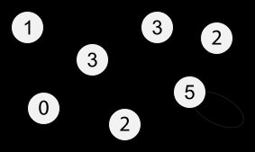
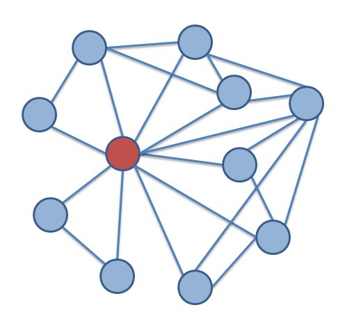

---
# post identity
title: "Networks Demystified 2: Degree"
authors:
  - family: "Weingart"
    given: "Scott"
    display_name: "Scott Weingart"
post_date: "2011-12-17"
modified_date: "2012-09-24"

# blog identity
blog_title: "the scottbot irregular"
blog_url: "http://www.scottbot.net/HIAL"
blog_platform: "WordPress"

# categorization
categories: ["method"]
tags: ["centrality", "methodologies", "network analysis", "networks demystified"]

# archival provenance
original_url: "http://www.scottbot.net/HIAL/?p=6526"
archive_url: "https://web.archive.org/web/20151006115258/http://www.scottbot.net/HIAL/?p=6526"
archive_date: "2015-10-06"
archive_timestamp: "20151006115258"

# descriptive
description: "Herein lies Part the Second of n posts introducing various network concepts. Part the First can be found here. From here on out, the posts will be cover only one topic at a time. I'll occasionally ..."
language: "en"

# comments
comments_preserved: true
comment_count: 3

# provenance
source_html: "Networks_Demystified_2__Degree___the_scottbot_irregular.htm"
source_html_sha256: "6f2b85cc3fe5f486b32c69c8837854890fc8f9faab1af98db88f8c0d93bb5881"
extraction_date: "2026-04-26"
extraction_tool: "claude scholarly-blog-html-to-markdown skill"
extraction_notes: |
  Wayback toolbar, injected scripts, and Cloudflare/Ruffle bootstrap stripped.
  Post body taken from article#post-6526 > .entry-content.
  Theme: Independent Publisher (WordPress 4.3.1).
  WordPress chrome stripped: post-author-card, entry-meta, entry-title-meta, sharing/related blocks, comment form.
  Localized 2 content image(s) using user-uploaded files.
  Reader comments preserved (3 of 3).
  No footnotes detected in source.
bibkey: "weingartNetworksDemystified22012"
---

# Networks Demystified 2: Degree

Herein lies Part the Second of *n* posts introducing various network concepts. Part the First can be found [here](http://www.scottbot.net/HIAL/?p=6279).
From here on out, the posts will be cover only one topic at a time.
I’ll occasionally use math, but will do my best to explain it
from the ground up, assuming no previous knowledge of mathematical
notation.

## Node Degree: An Introduction

Today I’ll cover the deceptively simple concept of *node degree*.
I say “deceptive” because, on the one hand, network degree can tell you
quite a lot. On the other hand, degree can often lead one astray,
especially as networks become larger and more complicated.

A node’s *degree*is, simply, how many edges it is connected to. Generally, this also correlates to how many *neighbors*
a node has, where a node’s neighborhood is those other nodes connected
directly to it by an edge. In the network below, each node is
labeled by its degree.

*http://en.wikipedia.org/wiki/File:UndirectedDegrees_(Loop).svg*

If you take a minute to study the network, something might strike you
as odd. The bottom-right node, with degree 5, is connected to only four
distinct edges, and really only three other nodes (four, including
itself). *Self-loops*,
which will be discussed later because they’re annoying and we hates
them preciousss, are counted twice. A self-loop is any edge which starts
and ends at the same node.

*Why* are self-loops counted twice? Well, as a rule of
thumb you can say that, since the degree is the number of times the node
is connected to an edge, and a self-loop connected to a node twice,
that’s the reason. There are some more mathy reasons dealing with matrix
representation, another topic for a later date. Suffice to say that
many network algorithms will not work well if self-loops are only
counted once.

The odd node out on the bottom left, with degree zero, is called an *isolate*. An isolate is any node with no edges.

At any rate, the concept is clearly simple enough. Count the number
of times a node is connected to an edge, get the degree. If only getting
higher education degrees were this easy.

## Centrality

Node degree is occasionally called *degree centrality*. [Centrality](http://en.wikipedia.org/wiki/Centrality)
is generally used to determine how important nodes are in a network,
and lots of clever researchers have come up with lots of clever ways to
measure it. “Importance” can mean a lot of things. In social networks,
centrality can be the amount of influence or power someone has; in the
U.S. electrical grid network, centrality might mean which power station
should be removed to cause the most damage to the network.

The simplest way of measuring node importance is to just look at its
degree. This centrality measurement at once seems deeply intuitive
and extremely silly. If we’re looking at the social network of facebook,
with every person a node connected by an edge to their friends, it’s no
surprise that the most well-connected person is probably also the most
powerful and influential in the social space. On the same token, though,
degree centrality is such a coarse-grained measurement that it’s really
anybody’s guess what *exactly* it’s measuring. It could
mean someone has a lot of power; it could also mean that someone tried
to become friends with absolutely everybody on facebook.

### Degree Centrality Sampling Warnings

Degree works best as a measure of network centrality when you have *full knowledge* of
the network. That is, a social network exists, and instead of getting
some glimpse of it and analyzing just that, you have the entire context
of the social network: all the friends, all the friends of friends, and
so forth.

When you have an *ego-network*
(a network of one person, like a list of all my friends and who among
them are friends with one another), clearly the node with the highest
centrality is the ego node itself. This knowledge tells you very little
about whether that ego is actually central within the larger network,
because you sampled the network *such that the ego is necessarily the most central*. Sampling strategies – how you pick which nodes and edges to collect – can fundamentally affect centrality scores.

*Ego Network: http://upload.wikimedia.org/wikipedia/commons/7/72/Ego_network.png*

A historian of science might generate a correspondence network from
early modern letters currently held in Oxford’s library. In fact, this
is currently happening, and the resulting resource will be invaluable.
Unfortunately, centrality scores generated from nodes in that early
modern letter writing network will more accurately reflect the whims of
Oxford editors and collectors over the years, rather than the underlying
correspondence network itself. Oxford scholars over the years selected
certain collections of letters, be they from Great People or sent to or
from Oxford, and that choice of what to hold at Oxford libraries will
bias centrality scores toward Oxford-based scholars, Great People, and
whatever else was selected for.

Similarly, the generation of a social network from a literary work
will bias the recurring characters; characters that occur more
frequently are simply statistically more likely to appear with more
people, and as such will have the highest degrees. It is likely that the
degree centrality and frequency of character occurrence are almost
exactly correlated.

Of course, if what you’re looking for is *the most central character in the novel* or *the most central figure from Oxford’s perspective*,
this measurement might be perfectly sufficient. The important thing is
to be aware of the limitations of degree centrality, and the possible
biasing effects from selection and sampling. Once those biases are
explicit, careful and useful inferences can still be drawn.

Things get a bit more complicated when looking at document similarity
networks. If you’ve got a network of books with edges connecting them
based on whether they share similar topics or keywords, your degree
centrality score will mean something *very different*. In this
case, centrality could mean the most general book. Keep in mind that
book length might affect these measurements as well; the longer a book
is, the more likely (by chance alone) it will cover more topics.
Thus, longer books may also appear to be more central, if one is not
careful in generating the network.

### Degree Centrality in Bi-Modal Networks

Recall that bi-modal networks are ones where there are two different
types of nodes (e.g., articles and authors), and edges are relationships
that bridge those types (e.g., authorships). In this example, the more
articles an author has published, the more central she is. Degree
centrality would have nothing to do, in this case, with the number of
co-authorships, the position in the social network, etc.

With an even more multi-modal network, having many types of nodes,
degree centrality becomes even less well defined. As the sorts of things
a node can connect to increases, the utility of simply counting the
number of connections a node has decreases.

## Micro vs. Macro

Looking at the degree of an individual node, and comparing it against
others in the network, is useful for finding out about the relative
position of that node within the network. Looking at the degree *of every node at once* turns
out to be exceptionally useful for talking about the network as a
whole, and comparing it to others. I’ll leave a thorough discussion of
degree distributions for a later post, but it’s worth mentioning them in
brief here. The degree distribution shows how many nodes have how many
edges.

As it happens, many real world networks exhibit something called
“power-law properties” in their degree distributions. What that
essentially means is that a small number of nodes have an exceptionally
high degree, whereas most nodes have very low degrees. By comparing the
degree distributions of two networks, it is possible to say whether they
are structurally similar. There’s been some fantastic work
comparing the degree distribution of social networks in various plays
and novels to find if they are written or structured similarly.

## Extending Degree

For the entirety of this post, I’ve been talking about networks that
were unweighted and undirected. Every edge counted just as much as every
other, and they were all *symmetric* (a connection from A to B implies the same connection from B to A). Degree can be extended to both weighted and directed (*asymmetric*) networks with relative ease.

Combining degree with edge weights is often called *strength*.
The strength of a node is the sum of the weights of its edges. For
example, let’s say Steve is part of a weighted social network. The first
time he interacts with someone, an edge is created to connect the two
with a weight of 1. Every subsequent interaction incrementally increases
the weight by 1, so if he’s interacted with Sally four times, Samantha
two times, and Salvador six times, the edge weights between them are 4,
2, and 6 respectively.

In the above example, because Steve is connected to three people, his degree is **3**. Because he is connected to one of them four times, another twice, and another six times, his weight is 4+2+6=**8**.

Combining degree with directed edges is also quite simple. Instead of
one degree score, every node now has two different degrees: *in-degree* and *out-degree*.
The in-degree is the number of edges pointing to a node, and the
out-degree is the number of edges pointing away from it. If Steve *borrowed* money from Sally, and *lent* money to Samantha and Salvador, his in-degree might be **1** and his out-degree **2**.

## Powerful Degrees

The degree of a node is really very simple: more connections, higher
degree. However, this simple metric accounts for quite a great deal in
network science. Many algorithms that analyze both node-level properties
and network-level properties are closely correlated with degree and
degree distribution. This is a [pareto](http://en.wikipedia.org/wiki/Pareto_principle)-like effect; a great deal about a network is driven by the degree of its nodes.

While degree-based results are often intuitive, it is worth pointing
out that the prime importance of degree is a direct result of the binary
network representation of nodes and edges. Interactions either happen
or they don’t, and everything that *is* is a self-contained
node or edge. Thus, how many nodes, how many edges, and which nodes have
which edges will be the driving force of any network analysis. This is
both a limitation and a strength; basic counts influence so much, yet
they are apparently powerful enough to yield intuitive, interesting, and
ultimately useful results.

---

## Reader Comments

> **Cody Rioux**, 2012-01-08 06:12
>
> I’m really enjoying this series and I’m
> very surprised nobody else has commented on either of these articles
> yet, unless I’m totally missing the comments. Anyway I’m just learning
> about these topics myself as I’m learning (and blogging as I learn)
> about SNA.
>
> On that note I was going to write something on centrality for an
> upcoming blog post I’ve been planning on doing about mining twitter for
> influential people on a given topic. However I feel like you explained
> it with far more elegance than I could. I’m going to link back here
> instead for the explanation.
>
> So I just wanted to say keep up the good work, and you definitely
> have at least one new RSS subscriber and twitter follower thanks to this
> series.

> **Dennis Davidson**, 2012-01-08 19:19
>
> Scott,
> Thank you for writing a clear explanation to this topic. I’ve just
> completed Andre Skupin’s Knowledge Visualization seminar at SDSU.
> Network analysis can be a rather obtuse subject for the uninitiated.
> Your post on node degree is brief, to the point, and clearly written.
> But most important, it clarified this topic for me.
> Dennis

>> **Scott Weingart**, 2012-01-08 19:45
>>
>> Thanks, Dennis! I’m glad the post helped. Please send Andre my regards the next time you see him.
