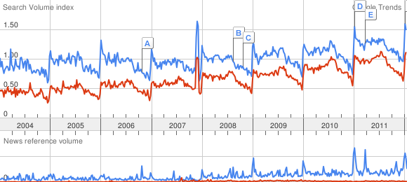
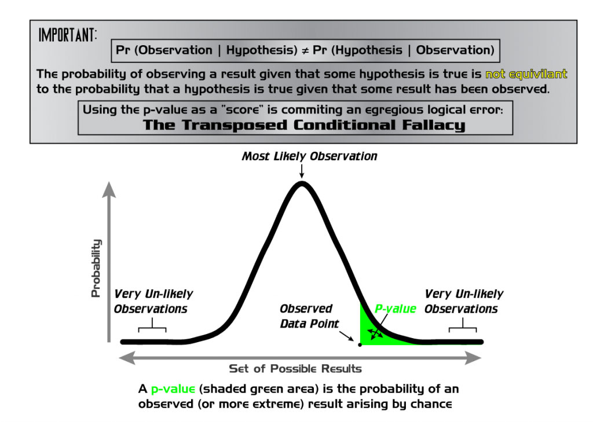
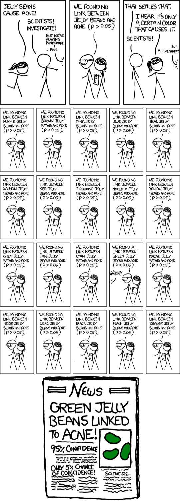

# Avoiding traps

We have the advantage of arriving late to the game.

In the cut-throat world of high-tech venture capitalism, the first company with a good idea often finds itself at the mercy of latecomers. The latecomer’s product might be better-thought-out, advertised to a more appropriate market, or simply prettier, but in each case that improvement comes through hindsight. Trailblazers might get there first, but their going is slowest, and their way the most dangerous.

Digital humanities finds itself teetering on the methodological edge of many existing disciplines, boldly going where quite a few have gone before. When I’ve blogged before about [the dangers of methodology appropriation](#), it was in the spirit of guarding against our misunderstanding of foundational aspects of various methodologies. This post is instead about avoiding the monsters already encountered (and occasionally vanquished) by other disciplines.

*If a map already exists with all the dragons' hideouts, we should probably use it. (Image from the Carta Marina)*

## Everything Old Is New Again

A collective guffaw probably accompanied my defining digital humanities as a “new” discipline. Digital humanities itself has a [rich history](#) dating back to [big iron](#) computers in the 1950s, and the humanities in general, well… they’re *old*. Probably older than my grandparents.

The important point, however, is that we find ourselves in a state of re-definition. While this is not the first time, and it certainly will not be the last, this state is exceptionally useful in planning against future problems. Our blogosphere cup overfloweth with definitions of and guides to the digital humanities, many of our journals are still in their infancy, and [our curricula are over-ready for massive reconstruction](#). Generally (from what I’ve seen), everyone involved in these processes are *really excited* and *open to new ideas*, which should ease the process of avoiding monsters.

Most of the below examples, and possible solutions, are drawn from the same issues of bias I’ve [previously discussed](#). Also, the majority are *meta-difficulties*. While some of the listed dangers are avoidable when writing papers and doing research, most are discipline-level systematic. That is, despite any researcher’s best efforts, the aggregate knowledge we gain while reading the newest exciting articles might *fundamentally mislead us*. While these dangers have never been wholly absent from the humanities, our recent love of big data profoundly increases their effect sizes.

An architect from Florida might not be great at designing earthquake-proof housing, and while earthquakes are still a distant danger, this shouldn’t really affect how he does his job at home. If the same architect moves to California, odds are he’ll need to learn some extra precautions. The same is true for a digital humanist attempting to make inferences from lots of data, or from a bunch of studies which all utilize lots of data. Traditionally, when looking at the concrete and particular, *evidence for* something is necessary and (with enough evidence) sufficient to believe in that thing. In aggregate, *evidence for* is necessary but *not* sufficient to identify a trend, because that trend may be dwarfed by or correlated to some other data that are not available.

<!-- page 2 -->

*Don't let Florida architects design your California home. (Image by Claudio Núñez, through Wikimedia Commons)*

The below lessons are not *all* applicable to DH as it exists today, and of course we need to adapt them to our own research (their meaning changes in light of our different material of study), however they’re still worth pointing out and, perhaps, may be guarded against. Many traditional sciences still struggle with these issues due to *institutional inertia*. Their journals have acted in such a way for so long, so why change it now? Their tenure has acted in such a way for so long, so why change it now? We’re already restructuring, and we have a great many rules that are still in flux, so *we can change it now*.

Anyway, I’ve been dancing around the examples for way too long, so here’s the meat:

## Sampling and Selection Bias

The problem here is actually two-fold, both for the author of a study, and for the reader of several studies. We’ll start with the author-centric issues.

### Sampling and Selection Bias in Experimental Design

People talk about sampling and selection biases in different ways, but for the purpose of this post we’ll use [wikipedia’s definition](#):

> **Selection bias** is a statistical bias in which there is an error in choosing the individuals or groups to take part in a scientific study.
>
> …
>
> A distinction, albeit not universally accepted, of **sampling bias** \[from selection bias\] is that it undermines the [external validity](#) of a test (the ability of its results to be generalized to the rest of the population), while selection bias mainly addresses [internal validity](#) for differences or similarities found in the sample at hand. In this sense, errors occurring in the process of gathering the sample or cohort cause sampling bias, while errors in any process thereafter cause selection bias.

In this case, we’ll say a study exhibits a **sampling error** if the conclusions drawn from the data at hand, while internally valid, does not actually hold true for the world around it. Let’s say I’m analyzing the prevalence of certain grievances in the [cahiers de doléances](#) from the French Revolution. [One study](#) showed that, of all the lists written, those from urban areas were significantly more likely to survive to today. Any content analysis I perform on those lists will bias the grievances of those people from urban areas, because my sample is not representative. Conclusions I draw about grievances *in general* will be inaccurate, unless I explicitly take into account which sort of documents I’m missing.

**Selection bias** can be insidious, and many varieties can be harder to spot than sampling bias. I’ll discuss two related phenomena of selection bias which lead to **false positives**, those pesky statistical effects which leave us believing we’ve found something exciting when all we really have is hot air.

#### Data Dredging

<!-- page 3 -->

The first issue, probably the most relevant to big-data digital humanists, is [**data dredging**](#). When you have *a lot* of data (and increasingly more of us have just that), it’s very tempting to just try to find correlations between absolutely *everything*. In fact, as exploratory humanists, that’s what we often do: get a lot of stuff, try to understand it by looking at it from every angle, and then write anything interesting we notice. *This is a problem*. The more data you have, the more statistically likely it is that it will contain false-positive correlations.

Google has lots of data, let’s use them as an example! We can look at search frequencies over time to try to learn something about the world. For example, [people search for “Christmas”](#) around and leading up to December, but that search term declines sharply once January hits. [Comparing that search with searches for “Santa”](#), we see the two results are pretty well correlated, with both spiking around the same time. From that, we might infer that the two are somehow related, and would do some further studies.

Unfortunately, Google has *a lot* of data, and a lot of searches, and if we just looked for every search term that correlated well with any other over time, well, we’d come up with [a lot of nonsense](#). Apparently searches for “losing weight” and “2 bedroom” are 93.6% correlated over time. Perhaps there is a good reason, perhaps there is not, but this is a good cautionary tale that *the more data you have, the more seemingly nonsensical correlations will appear*. It is then *very easy* to cherry pick only the ones that seem interesting to you, or which support your hypothesis, and to publish those.

*Comparing searches for "losing weight" (blue) against "2 bedroom" (red) over time, using Google Trends.*

#### Cherry Picking

The other type of selection bias leading to false positives I’d like to discuss is [**cherry picking**](#). This is selective use of evidence, cutting data away until the desired hypothesis appears to be the correct one. The humanities, not really known for their hypothesis testing, are not *quite* as likely to be bothered by this issue, but it’s still something to watch out for. This is also related to **confirmation bias**, the tendency for people to only notice evidence for that which they already believe.

Much like data dredging, cherry picking is often done without the knowledge or intent of the research. It arises out of what [Simmons, Nelson, and Simonsohn (2011)](#) call *researcher degrees of freedom*. Researchers often make decisions on the fly:

> Should more data be collected? Should some observations be excluded? Which conditions should be combined and which ones compared? Which control variables should be considered? Should specific measures be combined or transformed or both?
>
> …
>
> The problem, of course, is that the likelihood of at least one (of many) analyses producing a falsely positive finding \[that is significant\] is \[itself necessarily significant\]. This exploratory behavior is not the by-product of malicious intent, but rather the result of two factors: (a) ambiguity in how best to make these decisions and (b) the researcher’s desire to find a statistically significant result.

When faced with decisions of how to proceed with analysis, we will almost invariably (and inadvertently) favor the decision that results in our hypothesis seeming more plausible.

If I go into my favorite dataset (The Republic of Letters!) trying to show that Scholar A was very similar to Scholar B in many ways, odds are I could do that no matter who the scholars were, so long as I had enough data. If you take a cookie-cutter to your data, don’t be surprised when cookie-shaped bits come out the other side.

### Sampling and Selection Bias in Meta-Analysis

There are copious examples of problems with meta-analysis. Meta-analysis is, essentially, a quantitative review of studies on a particular subject. For example, a medical meta-analysis could review data from hundreds of small studies testing the side-effects of a particular medicine, bringing them all together and drawing new or more certain conclusions via the combination of data. Sometimes these are done to gain a larger sample size, or to show how effects change across different samples, or to provide evidence that one non-conforming study was indeed a statistical anomaly.

<!-- page 4 -->

A meta-analysis is the quantitative alternative to something every one of us in academia does frequently: read a lot of papers or books, find connections, draw inferences, explore new avenues, and publish novel conclusions. Because quantitative meta-analysis is so similar to what we do, we can use the problems it faces to learn more about the problems we face, but which are more difficult to see. A criticism oft-lobbed at meta-analyses is that of [garbage in – garbage out](#); the data used for the meta-analysis is not representative (or otherwise flawed), so the conclusions as well are flawed.

There are a number of reasons *why* the data in might be garbage, some of which I’ll cover below. It’s worth pointing out that the issues above (cherry-picking and data dredging) also play a role, because if the majority of studies are biased toward larger effect sizes, then the overall perceived effect across papers will appear systematically larger. This is not only true of quantitative meta-analysis; when every day we read about trends and connections that may not be there, no matter how discerning we are, some of those connections will stick and our impressions of the world will be affected. Correlation might not imply *anything*.

Before we get into publication bias,  I will write a short aside that I was really hoping to avoid, but really needs to be discussed. I’ll dedicate a post to it eventually, when I feel like punishing myself, but for now, here’s my summary of

**The Problems with P**

Most of you have heard of **p-values**. A lucky few of you have never heard of them, and so do not need to be untrained and retrained. A majority of you probably hold a view similar to a high-ranking, well-published, and well-learned professor I met recently. “All I know about statistics,” he said, “is that p-value formula you need to show whether or not your hypothesis is correct. It needs to be under .05.” Many of you (more and more these days) are aware of the problems with that statement, and I thank you from the bottom of my heart.

Let’s talk about statistics.

The problems with p-values are innumerable (let me count the ways), and I will not get into most of them here. Essentially, though, the calculation of a p- value is *the likelihood that the results of your study did not appear by random chance alone*. In many studies which rely on statistics, the process works like this: begin with a hypothesis, run an experiment, analyze the data, calculate the p-value. The researcher then publishes something along the lines of “my hypothesis *is correct* because *p* is under 0.05.”

Most people working with p-values know that it has something to do with the null hypothesis (that is, the default position; the position that there is no correlation between the measured phenomena). They work under the assumption that the p-value is the likelihood that the null hypothesis is true. That is, if the p-value is 0.75, it’s 75% likely that the null hypothesis is true, and there is no correlation between the variables being studied. Generally, the cut-off to get published is 0.05; you can only publish your results if it’s less than 5% likely that the null hypothesis is true, or more than 95% likely that *your hypothesis* is true. That means you’re pretty darn certain of your result.

Unfortunately, most of that isn’t actually how p-values work. Wikipedia writes:

> The **p-value** is the [probability](#) of obtaining a [test statistic](#) at least as extreme as the one that was actually observed, assuming that the [null hypothesis](#) is true.

In a nutshell, assuming there is *no correlation* between two variables, what’s the likelihood that they’ll appear as correlated as you observed in your experiment by chance alone? If your p-value is .05, that means it’s 5% likely that random chance caused your variables to be correlated. That is, ***one in every twenty studies (5%) that get a p-value of 0.05 will have found a correlation that doesn’t really exist***.

<!-- page 5 -->

*Wikipedia's image explaining p-values.*

To recap: p-values say nothing about your hypothesis. They say, assuming there is no real correlation, what’s the likelihood that your data show one anyway? Also, in the scholarly community, a result is considered “significant” if *p* is less than or equal to 0.05. Alright, I’m glad that’s out of the way, now we’re all on the same footing.

#### Publication Biases

**The positive results bias**, the first of many interrelated [publication biases](#), simply states that positive results are more likely to get published then negative or inconclusive ones. Authors and editors will be more likely to submit and accept work if the results are significant (*p* &lt; .05). **The file drawer problem** is the opposite effect: negative results are more likely to be stuck in somebody’s file drawer, never to see the light of day. **HARKing** (Hypothesizing After the Results Are Known), much like cherry-picking above, is when, if during the course of a study many trials and analyses occur, only the “significant” ones are ever published.

Let’s begin with HARKing. Recall that a p-value is (basically) the likelihood that an effect occurred by chance alone. If one research project consisted of 100 different trials and analyses, if only 5 of them yielded significant results pointing toward the author’s hypothesis, those 5 analyses likely occurred by chance. They could still be published (often without the researcher even realizing they were cherry-picking, because obviously non-fruitful analyses might be stopped before they’re even finished). Thus, again, more positive results are published than perhaps there ought to be.

Let’s assume *some people* are perfect in every way, shape, and form. Every single one of their studies is performed with perfect statistical rigor, and all of their results are sound. Again, however, they only publish their positive results – the negative ones are kept in the file drawer. Again, more positive results are being published than being researched.

Who cares? So what that we’re only seeing the good stuff?

The problem is that, using common significance testing of *p* &lt; 0.05, 5% of published, positive results ought to have occurred by chance alone. *However*, since we cannot see the studies that haven’t been published because their results were negative, those 5% studies that yielded correlations where they should not have are given *all the scholarly weight*. One hundred small studies are done on the efficacy of some medicine for some disease; only five by chance find some correlation – they are published. Let’s be liberal, and say another three are published saying there was no correlation between treatment and cure. Thus, an outside observer will see that the evidence is stacked in the favor of the (ineffectual) medication.

<!-- page 6 -->

<!-- page 7 -->

*xkcd take on significance values. (comic 882)*

#### The Decline Effect

A recent [much-discussed article](#) by John Lehrer, as well as [countless studies](#) by John Ioannidis and others, show two things: (1) a large portion of published findings are false (some of the reasons are shown above). (2) The effects of scientific findings seem to decline. A study is published, showing a very noticeable effect of some medicine curing a disease, and further tests tend show that very noticeable effect declining sharply. (2) is mostly caused by (1). Much ink (or blood) could be spilled discussing this topic, but this is not the place for it.

### Biases! Everywhere!

So there are a lot of biases in rigorous quantitative studies. Why should humanists care? We’re aware that people are not perfect, that research is contingent, that we each bring our own subjective experiences to the table, and they shape our publications and our outlooks, and none of those are necessarily *bad things*.

The issues arise when we start using statistics, or [algorithms derived using statistics](#), and other methods used by our quantitative brethren. Make no mistake, our qualitative assessments are often subject to the same biases, but it’s easy to write reflexively on one’s own position when they are only one person, one data-point. In the age of Big Data, with multiplying uncertainties for any bit of data we collect, it is far easier to lose track of small unknowns in the larger picture. We have the opportunity of learning from past mistakes so we can be free to make mistakes of our own.

## Solutions?

Ioannidis’ most famous article is, undoubtedly, the polemic “[Why Most Published Research Findings Are False](#).” With a statement like that, what hope is there? Ioannidis himself has some good suggestions, and there are many floating around out there; as with anything, the first step is becoming cognizant of the problems, and the next step is fixing them. Digital humanities may be able to avoid inheriting these problems entirely, if we’re careful.

We’re already a big step ahead of the game, actually, because of the nearly nonsensical volumes of tweets and blog posts on nascent research.  In response to publication bias and the file drawer problem, many people suggest a authors submit their experiment to a registry *before* they begin their research. That way, it’s completely visible what experiments on a subject have been run that did not yield positive results, regardless of whether they eventually became published. Digital humanists are constantly throwing out ideas and preliminary results, which should help guard against misunderstandings through publication bias. We have to talk about all the effort we put into something, *especially* when nothing interesting comes out of it. The fact that some scholar felt there should be something interesting, and there wasn’t, is itself interesting.

At this point, “replication studies” means very little in the humanities, however if we begin heading down the road where replication studies become more feasible, our journals will need to be willing to accept them just as they accept novel research. Funding agencies should also be just as willing to fund old, non-risky continuation research as they are the new exciting stuff.

Other institutional changes needed for us to guard against this sort of thing is open access publications (so everyone draws inferences from the same base set of research), tenure boards that accept negative research and exploratory research (again, not as large of an issue for the humanities), and restructured curricula that teach quantitative methods and their pitfalls, *especially* statistics.

On the ground level, a good knowledge of statistics (especially [Bayesian statistics](#), doing away with p-values entirely) will be essential as more data becomes available to us. When running analysis on data, to guard against coming up with results that appear by random chance, we have to design an experiment before running it, stick to the plan, and publish *all* results, not just ones that fit our hypotheses. The [false-positive psychology](#) paper I mentioned above actually has a lot of good suggestions to guard against this effect:

> 1. Authors must decide the rule for terminating data collection before data collection begins and report this rule in the article.
> 2. Authors must collect at least 20 observations per cell or else provide a compelling cost-of-data-collection justification.
> 3. Authors must list all variables collected in a study
> 4. Authors must report all experimental conditions, including failed manipulations.
> 5. If observations are eliminated, authors must also report what the statistical results are if those observations are included.
> 6. If an analysis includes a covariate, authors must report the statistical results of the analysis without the covariate.

> 1. Reviewers should ensure that authors follow the requirements.
> 2. Reviewers should be more tolerant of imperfections in results.
> 3. Reviewers should require authors to demonstrate that their results do not hinge on arbitrary analytic decisions.
> 4. If justifications of data collection or analysis are not compelling, reviewers should require the authors to conduct an exact replication.

## Going Forward

<!-- page 8 -->

This list of problems and solutions is neither *exhaustive* nor *representative*. That is, there are a lot of biases out there unlisted, and not all the ones listed are the most prevalent. Gender and power biases come to mind, however they are well beyond anything I could intelligently argue, and there are issues of peer- review and retraction rates that are an entirely different can of worms.

Also, the humanities are simply *different*. We don’t exactly test hypothesis, we’re not looking for ground truths, and our publication criteria are very different from that of the natural and social sciences. It seems clear that the issues listed above will have some mapping on our own research going forward, but I make no claims at understanding exactly how or where. My hope in this blog post is to raise awareness of some of the more pressing concerns in quantitative studies that might have bearing on our *own* studies, so we can try to understand how they will be relevant to our own research, and how we might guard against it.

---

## Reader Comments

> **Trevor**, January 24, 2012 at 11:33 pm
>
> Great post. Lots of important points for DH folk to remember. With that said I’m also curious to get your ideas on which of these apply differently when appropriated as part of a hermunitic, pragmatist, or symbolic interactionist perspectives. A colleague and I started think through some of the hermunitic part [http://writinghistory.trincoll.edu/data/hermeneutics-of-data-and-historical-writing-gibbs-owens/](http://writinghistory.trincoll.edu/data/hermeneutics-of-data-and-historical-writing-gibbs-owens/) but it’s very much a small first step into the world of working with data and recgonizing the traps that come with statistical intrepretation.

> **John Kruschke**, January 25, 2012 at 2:05 am
>
> Great post! Since you brought up the false-positive psychology article, I thought I’d raise my objections to two of its conclusions, which I blogged about [here](#).

> **Paige Wytinck**, April 11, 2012 at 2:58 pm
>
> My name is Paige Wytinck, and I am a student in a digital humanities seminar called “Hamlet in the Humanities Lab” at the University of Calgary: [http://bit.ly/tu4iRu](http://bit.ly/tu4iRu)
>
> In my final paper for the course, I would like to base my argument on your blog post. You can read my paper after April 25th on the course blog: [http://engl203.ucalgaryblogs.ca/](http://engl203.ucalgaryblogs.ca/)
