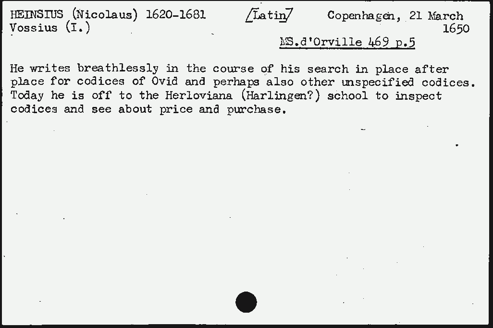
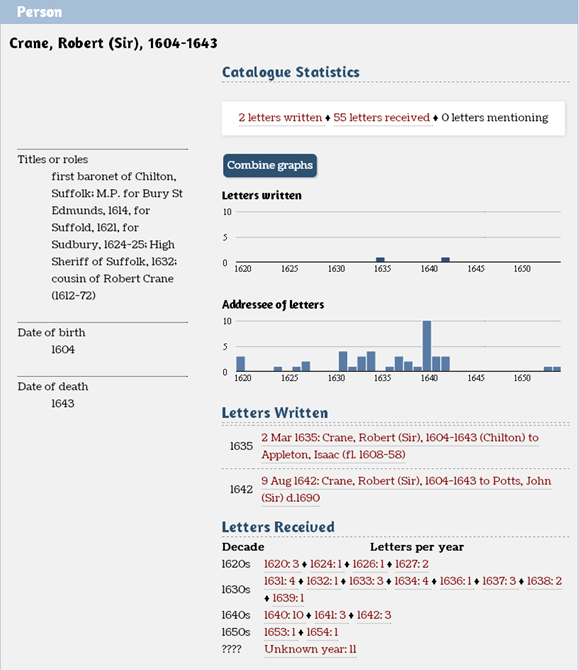
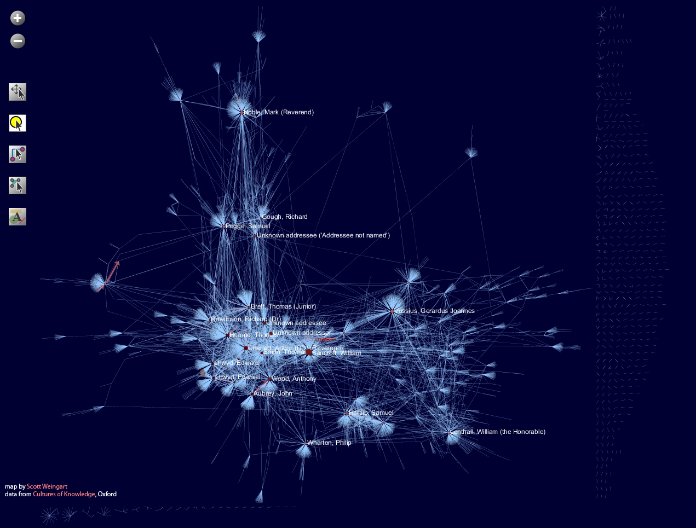
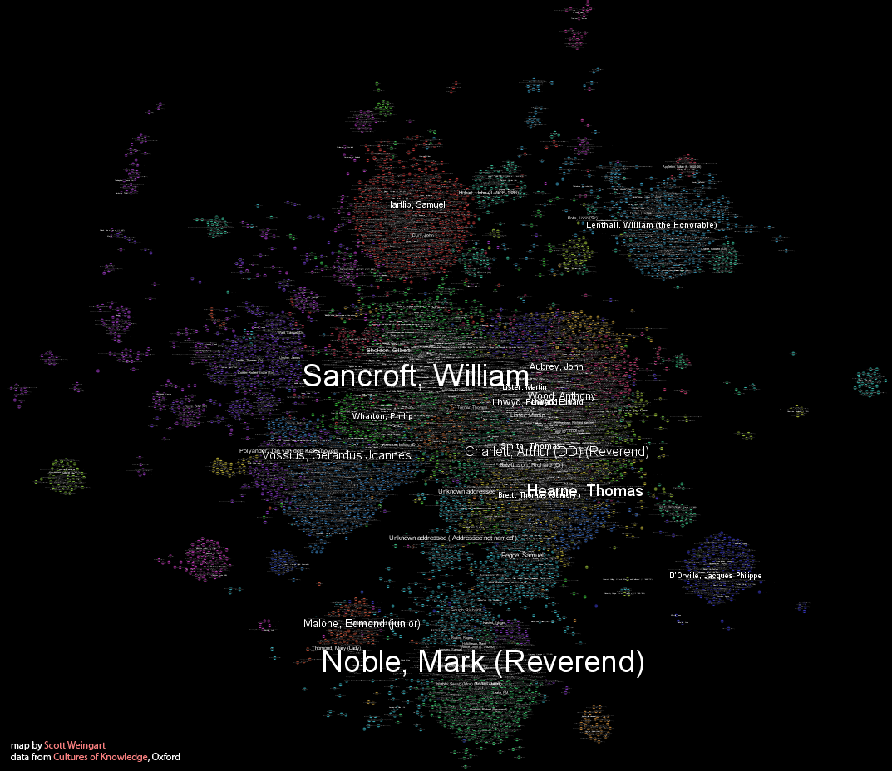

# Early Modern Letters Online

Early modern history! Science! Letters! Data! Four of my favoritest things have been combined in this brand new beta release of [Early Modern Letters Online](http://emlo.bodleian.ox.ac.uk/) from Oxford University.

EMLO Logo

## Summary

EMLO (what an adorable acronym, [I kind of what to tickle it](http://en.wikipedia.org/wiki/Tickle_Me_Elmo)) is Oxford’s answer to a metadata database (metadatabase?) of, you guessed it, early modern letters. This is pretty much a gold standard metadata project. It’s still in beta, so there are some interface kinks and desirable features not-yet-implemented, but it has all the right ingredients for a great project:

<!-- page 2 -->

- Information is free and open; I’m even told it will be downloadable at some point.
- Developed by a combination of historians (via [Cultures of Knowledge](http://www.culturesofknowledge.org/)) and librarians (via the [Bodleian Library](http://www.bodleian.ox.ac.uk/bodley)) working in tandem.
- The interface is fast, easy, and includes faceted browsing.
- Has a fantastic interface for adding your own data.
- *Actually includes citation guidelines thank you so much*.
- Visualizations for at-a-glance understanding of data.
- Links to full transcripts, abstracts, and hard-copies where available.
- Lots of other fantastic things.

Sorry if I go on about how fantastic this catalog is – like I said, I love letters *so much*. The index itself includes roughly 12,000 people, 4,000 locations, 60,000 letters, 9,000 images, and 26,000 additional comments. It is without a doubt the largest public letters database currently available. Between the data being compiled by this group, along with that of the [CKCC](http://ckcc.huygens.knaw.nl/) in the Netherlands, the [Electronic Enlightenment Project](http://www.e-enlightenment.org/) at Oxford, Stanford’s [Mapping the Republic of Letters](http://republicofletters.stanford.edu/) project, and [R.A. Hatch](http://www.clas.ufl.edu/users/ufhatch/pages/)‘s research collection, there will without a doubt soon be hundreds of thousands of letters which can be tracked, read, and analyzed with absolute ease. The mind boggles.

## Bodleian Card Catalogue

## Summaries

Without a doubt, the coolest and most unique feature this project brings to the table is the digitization of Bodleian Card Catalogue, a fifty-two drawer index-card cabinet filled with summaries of nearly 50,000 letters held in the library, all compiled by the Bodleian staff many years ago. In lieu of full transcriptions, digitizations, or translations, these summary cards are an amazing resource by themselves. Many of the letters in the EMLO collection include these summaries as full-text abstracts.

<!-- page 3 -->

One of the Bodleian summaries showing Heinsius looking far and wide for primary sources, much like we’re doing right now…

The collection also includes the correspondences of John Aubrey (1,037 letters), Comenius (526), Hartlib (4,589 many including transcripts), Edward Lhwyd (2,139 many including transcripts), Martin Lister (1,141), John Selden (355), and John Wallis (2,002). The advanced search allows you to look for only letters with full transcripts or abstracts available. As someone who’s worked with a lot of letters catalogs of varying qualities, it is refreshing to see this one being upfront about unknown/uncertain values. It would, however, be nice if they included the editor’s best guess of dates and locations, or perhaps inferred locations/dates from the other information available. (For example, if birth and death dates are known, it is likely a letter was not written by someone before or after those dates.)

<!-- page 4 -->

## Visualizations

In the interest of full disclosure, I should note that, much like with the [CKCC](http://ckcc.huygens.knaw.nl/) letters [interface](http://vimeo.com/25753611), I spent some time working with the Cultures of Knowledge team on visualizations for EMLO. Their group was absolutely fantastic to work with, with impressive resources and outstanding expertise. The result of the collaboration was the integration of visualizations in metadata summaries, the first of which is a simple [bar chart showing the numbers of letters written, received, and mentioned in per year](http://emlo.bodleian.ox.ac.uk/profile/person/c573b65e-4315-4846-9d8d-9dda68f458e1) of any given individual in the catalog. Besides being useful for getting an at-a-glance idea of the data, these charts actually proved *really useful* for data cleaning.

<!-- page 5 -->

Sir Robert Crane (1604-1643)

In the above screenshot from previous versions of the data, Robert Crane is shown to have been addressed letters in the mid 1650s, several years after his reported death. While these could also have been spotted automatically, there are many instances where a few letters are dated very close to a birth or death date, and they often turn out to miss-reported. Visualizations can be great tools for data cleaning as a form of [sanity test](http://en.wikipedia.org/wiki/Sanity_testing). [This is the new, corrected version](http://emlo.bodleian.ox.ac.uk/profile/person/4c9ca742-eb6a-49b7-9d41-487d81397cfe?sort=score-d&everything=robert%20crane&baseurl=/forms/quick&type=quick&numFound=4313&start=6) of Robert Crane’s page. They are using [d3.js](http://mbostock.github.com/d3/), a fantastic javascript library for building visualizations.

Because I can’t do anything with letters without looking at them as a network, I decided to put together some visualizations using [Sci2](https://sci2.cns.iu.edu/user/index.php) and [Gephi](http://gephi.org/). In both cases, the Sci2 tool was used for data preparation and analysis, and the final network was visualized in GUESS and Gephi, respectively. The first graph shows network in detail with edges, and names visible for the most “central” correspondents. The second visualization is without edges, with each correspondent clustered according to their place in the overall network, with the most prominent figures in each cluster visible.

<!-- page 6 -->

Built with Sci2/Guess

Built with Sci2/Gephi

The graphs show us that this is *not* a fully connected network. There are many islands of one or two letters or a small handful of letters. These can be indicative of a *prestige bias* in the data. That is, the collection contains many letters from the most prestigious correspondents, and increasingly fewer as the prestige of the correspondent decreases. Put in another way, there are many letters from a few, and few letters from many. This is a characteristic shared with [power law](http://en.wikipedia.org/wiki/Power_law) and other “long tail” distributions. The jumbled community structure at the center of the second graph is especially interesting, and it would be worth comparing these communities against institutions and informal societies at the time. Knowledge of large-scale patterns in a network can help determine what sort of analyses are best for the data at hand. More on this in particular will be coming in the next few weeks.

<!-- page 7 -->

It’s also worth pointing out these visualizations as another tool for data-checking. You may notice, on the bottom left-hand corner of the first network visualization, two separate Edward Lhwyds with virtually the same networks of correspondence. This meant there were two distinct entities in their database referring to the same individual – a problem which has since been corrected.

## More Letters!

Notice that the EMLO site makes it very clear that they are open to contributions. There are many letters datasets out there, some digitized, some still languishing idly on dead trees, and until they are all combined, we will be limited in the scope of the research possible. We can always use more. If you are in any way responsible for an early-modern letters collection, meta-data or full-text, please help by opening that collection up and making it integrable with the other sets out there. It will do the scholarly world a great service, and get us that much closer to understanding the processes underlying scholarly communication in general. The folks at Oxford are providing a great example, and I look forward to watching this project as it grows and improves.
