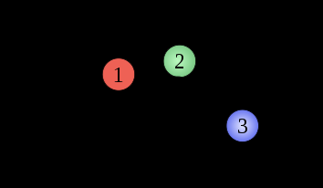

# Science Systems Engineering

**Warning**: This post is potentially evil, and definitely normative. While I am unsure whether what I describe below *should* be done*,* I’m becoming increasingly certain that it *could* be. Read with caution.

## Complex Adaptive Systems

[Science](http://en.wikipedia.org/wiki/Wissenschaft) is a [complex adaptive system](http://en.wikipedia.org/wiki/Complex_adaptive_system). It is a constantly evolving network of people and ideas and artifacts which interact with and feed back on each other to produce this amorphous socio-intellectual entity we call science. Science is also a bunch of nested complex adaptive systems, some overlapping, and is itself part of many other systems besides.

The study of complex interactions is enjoying a boom period due to the facilitating power of the “information age.” Because any complex system, whether it be a social group or a pool of chemicals, can exist in almost innumerable states while comprising the same constituent parts, it requires massive computational power to comprehend all the many states a system might find itself in. From the other side, it takes a massive amount of data observation and collection to figure out what states systems eventually *do* find themselves in, and that knowledge of how complex systems play out in the real world relies on collective and automated data gathering. From seeing how complex systems work in reality, we can infer properties of their underlying mechanisms; by modeling those mechanisms and computing the many possibilities they might allow, we can learn more about ourselves and our place in the larger multisystem.[^1]

One of the surprising results of complexity theory is that seemingly isolated changes can produce rippling, massive effects throughout a system.  Only a decade after the removal of big herbivores like giraffes and elephants from an African savanna, a generally positive relationship between bugs and plants turned into an antagonistic one. Because the herbivores no longer grazed on certain trees, those trees began producing less nectar and fewer thorns, which in turn caused cascading repercussions throughout the ecosystem. Ultimately, the trees’ mortality rate doubled, and a variety of species were worse-off than they had been.[^2] Similarly, the introduction of an invasive species can cause untold damage to an ecosystem, as has become abundantly clear in Florida[^3] and around the world (the extinction of flightless birds in New Zealand springs to mind).

http://www.flickr.com/photos/arnolouise/3202569865/

Both evolutionary and complexity theories show that self-organizing systems evolve in such a way <!-- page 2 --> that they are self-sustaining and self-perpetuating. Often, within a given context or environment, the systems which are most resistant to attack, or the most adaptable to change, are the most likely to persist and grow. Because the entire environment evolves concurrently, small changes in one subsystem tend to propagate as small changes in many others. However, when the constraints of the environment change rapidly (like with the introduction of an asteroid and a cloud of sun-cloaking dust), when a new and sufficiently foreign system is introduced (land predators to New Zealand), or when an important subsystem is changed or removed (the loss of megafauna in Africa), devastating changes ripple outward.

An environmental ecosystem is one in which many smaller overlapping systems exist, and changes in the parts may change the whole; society can be described similarly. Students of history know that the effects of one event (a sinking ship, an assassination, a terrorist attack) can propagate through society for years or centuries to come. However, a system not merely a slave to these single occurrences which cause Big Changes. The structure and history of a system implies certain stable, low energy states. We often anthropomorphize the tendency of systems to come to a stable mean, for example “nature *abhors* a vacuum.” This is just the manifestation of the second law of thermodynamics: entropy always increases, systems naturally tend toward low energy states.

For the systems of society, they are historically structured constrained in such a way that certain changes would require very little energy (an assassination leading to war in a world already on the brink), whereas others would require quite a great deal (say, an attempt to cause war between Canada and the U.S.). It is a combination of the current structural state of a system and the interactions of the constituent parts that lead that system in one direction or another. Put simply, **a society, its people, and its environment are responsible for its future**. Not terribly surprising, I know, but the formal framework of complexity theory is a useful one for what is described below.

metastability

The above picture, from the Wikipedia article on [metastability](http://en.wikipedia.org/wiki/Metastability), provides an example of what’s described above. The ball is resting in a valley, a low energy state, and a small change may temporarily excite the system, but the ball eventually finds its way into the same, or another, low energy state. When the environment is stable, its subsystems tend to find comfortably stable niches as well. Of course, I’m not sure anyone would call society wholly stable…

## Science as a System

Science (by which I mean *wissenschaft,* any systematic research) is part of society, and itself includes many constituent and overlapping parts. I [recently argued](http://www.scottbot.net/HIAL/?p=12050), not without precedent, that the correspondence network between early modern Europeans facilitated the rapid growth of <!-- page 3 --> knowledge we like to call the Scientific Revolution. Further, that network was an inevitable outcome of socio/political/technological factors, including shrinking transportation costs, increasing political unrest leading to scholarly displacement, and, very simply, an increased interest in communicating once communication proved so fruitful. The state of the system affected the parts, the parts in turn affected the system, and a growing feedback loop led to the co-causal development of a massive communication network and a period of massively fruitful scholarly work.

Scientific Correspondence Network

Today and in the past, science is embedded in, and occasionally embodied by, the various organizational and communicative hierarchies its practitioners find themselves in. The people, ideas, and products of science feed back on one another. Scientists are perhaps more affected by their labs, by the process of publication, by the realities of funding, than they might admit. In return, the knowledge and ideas produced by science, the *message*, shape and constrain the medium in which they are propagated. I’ve often heard and read two opposing views: that knowledge is True and Right  and unaffected the various social goings on of those who produce it, and that knowledge is Constructed and Meaningless outside of the social and linguistic system it resides in. The truth, I’m sure, is a complex tangle somewhere between the two, and affected by both.

<!-- page 4 -->

In either case, science does not take place in a vacuum. We do our work through various media and with various funds, in departments and networks and (sometimes) lab-coats, using a slew of carefully designed tools and a language that was not, in general, made for this purpose. In short, we and our work exist in a  complex system.

## Engineering the Academy

That system is changing. Michael Nielsen’s recent book[^4] talks about the rise of citizen science, augmented intelligence, and collaborative systems as not merely as ways to do what we’ve already done faster, but as *new methods of discovery*. The ability to coordinate on such a scale, and in such new ways, changes the game of science. It changes the *system*.

While much of these changes are happening automatically, in a self-organized sort of way, Nielsen suggests that we can learn from our past and learn from other successful collective ventures in order to make a “design science of collaboration.” That is, using what we know of how people work together best, of what spurs on the most inspired research and the most interesting results, we can *design* systems to facilitate collaboration and scientific research. In Nielsen’s case, he’s talking mostly about computer systems; how can we design a website or an algorithm or a technological artifact that will aid in scientific discovery, using the massive distributed power of the information age? One way Nielson points out is “designed serendipity,” creating an environment where scientists are more likely experience serendipitous occurrences, and thus more likely to come up with innovated and unexpected ideas.

Can we engineer science? http://www.flickr.com/photos/seattlemunicipalarchives/4818952324

In complexity terms, this idea is restructuring the system in such a way that the constituent parts or subsystems will be or do “better,” however we feel like defining better in this situation. It’s definitely not the first time an idea like this has been used. For example, science policy makers, government agencies, and funding bodies have long known that science will often go where the money is. If there is a lot of money available to research some particular problem, then that problem will tend to get researched. If the main funding requires research funded to become open access, by and large that will happen ([NIH’s PubMed requirements](http://publicaccess.nih.gov/)).

There are innumerable ways to affect the system in a top-down way in order to shape its future. Terrence Deacon writes about how it is the *constraints* on a system which tend it toward some equilibrium state[^5]; by shaping the structure of the scientific system, we can *predictably* shape its direction. That is, we can artificially create a low energy state (say, open access due to policy and funding changes), and let the constituent parts find their way into that low energy state eventually, <!-- page 5 --> reaching equilibrium. I talked a bit more about this idea of constraints leading a system in a [recent post](http://www.scottbot.net/HIAL/?p=11621).

As may be recalled from the discussion above, however, this is *not* the only way to affect a complex system. External structural changes are only part of the story of how a system grows shifts, but only a small part of the story. Because of the series of interconnected feedback loops that embody a system’s complexity, small changes can (and often do) propagate up and change the system as a whole. Lie, Slotine, and Barabási recently began writing about the “controllability of complex networks[^6],”  suggesting ways in which changing or controlling constituent parts of a complex system can reliably and predictably change the entire system, perhaps leading it toward a new preferred low energy state. In this case, they were talking about the importance of well-connected hubs in a network; adding or removing them in certain areas can deeply affect the evolution of that network, no matter the constraints. Watts recounts a great example of how a small power outage rippled into a national disaster because just the right connections were overloaded and removed[^7]. The strategic introduction or removal of certain specific links in the scientific system may go far toward changing the system itself.

Not only is science is a complex adaptive system, it is a system which is becoming increasingly well-understood. A century of various science studies combined with the recent appearance of giant swaths of data about science and scientists themselves is beginning to allow us to learn the structure and mechanisms of the scientific system. We do not, and will never, know the most intricate details of that system, however in many cases and for many changes, we only need to know general properties of a system in order to change it in predictable ways. If society feels a certain state of science is better than others, either for the purpose of improved productivity or simply more control, we are beginning to see which levers we need to pull in order to enact those changes.

This is dangerous. We may be able to predict first order changes, but as they feed back onto second order, third order, and further-down-the-line changes, the system becomes more unpredictable. Changing one thing positively may affect other aspects in massively negative (and massively unpredictable) ways.

However, generally if humans *can* do something, we will. I predict the coming years will bring a more formal Science Systems Engineering, a specialty apart from science policy which will attempt to engineer the direction of scientific research from whatever angle possible. My first post on this blog concerned a concept I dubbed [scientonomy](http://www.scottbot.net/HIAL/?p=47), which was just yet another attempt at unifying everybody who studies science in a meta sort of way. In that vocabulary, then, this science systems engineering would be an **applied scientonomy**. We have countless experts in all aspects of how science works on a day-to-day basis from every angle; that expertise may soon become much more prominent in application.

It is my hope and belief that a more formalized way of discussing and engineering scientific endeavors, either on the large scale or the small, can lead to benefits to humankind in the long run. I share the optimism of Michael Nielsen in thinking that we can design ways to help the academy run more smoothly and to lead it toward a more thorough, nuanced, and interesting understanding of whatever it is being studied. However, I’m also aware of the dangers of this sort of approach, first and foremost being disagreement on what is “better” for science or society.

At this point, I’m just putting this idea out there to hear the thoughts of my readers. In my meatspace day-to-day interactions, I tend to be around experimental scientists and quantitative social scientists who in general love the above ideas,  but at my heart and on my blog I feel like a humanist, and these ideas worry me for all the obvious reasons (and even some of the more obscure ones). I’d love to get some input, especially from those who are terrified that somebody could even think this is possible.

<!-- page 6 -->

Notes:

[^1]: I’m coining the term “multisystem” because ecosystem is insufficient, and I don’t know something better. By multisystem, I mean any system of systems; specifically here, the universe and how it evolves. If you’ve got a better term that invokes that concept, I’m all for using it. Cosmos comes to mind, but it no longer represents “[order](http://www.etymonline.com/index.php?term=cosmos),” a series of interlocking systems, in the way it once did.
[^2]: Palmer, Todd M, Maureen L Stanton, Truman P Young, Jacob R Goheen, Robert M Pringle, and Richard Karban. 2008. “Breakdown of an Ant-Plant Mutualism Follows the Loss of Large Herbivores from an African Savanna.” *Science*319 (5860) (January 11): 192–195. doi:10.1126/ science.1151579.
[^3]: Gordon, Doria R. 1998. “Effects of Invasive, Non-Indigenous Plant Species on Ecosystem Processes: Lessons From Florida.” *Ecological Applications* 8 (4): 975–989. doi:10.1890/1051-0761(1998)008[0975:EOINIP]2.0.CO;2.
[^4]: Nielsen, Michael. *Reinventing Discovery: The New Era of Networked Science*. Princeton University Press, 2011.
[^5]: Deacon, Terrence W. “Emergence: The Hole at the Wheel’s Hub.” In *The Re-Emergence of Emergence: The Emergentist Hypothesis from Science to Religion*, edited by Philip Clayton and Paul Davies. Oxford University Press, USA, 2006.
[^6]: Liu, Yang-Yu, Jean-Jacques Slotine, and Albert-László Barabási. “Controllability of Complex Networks.” *Nature*473, no. 7346 (May 12, 2011): 167–173.
[^7]: Watts, Duncan J. *Six Degrees: The Science of a Connected Age*. 1st ed. W. W. Norton & Company, 2003.
