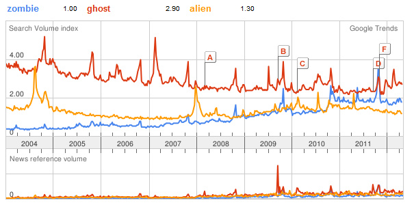

# The Myth of Text Analytics and Unobtrusive Measurement

> Just realized Klout is the perfect metaphor for media in the modern era. It assumes you’re an expert in anything you talk a lot about.
>
> — Dan Munz (@dan\_munz) [May 5, 2012](https://twitter.com/dan_munz/status/198924429324075009)

Text analytics are often used in the social sciences as a way of unobtrusively observing people and their interactions. Humanists tend to approach the supporting algorithms with skepticism, and with good reason. This post is about the difficulties of using words or counts as a proxy for some secondary or deeper meaning. Although I offer no solutions here, readers of the blog will know I am hopeful of the promise of these sorts of measurements *if used appropriately*, and right now, we’re still too close to the cutting edge to know exactly what that means. There are, however, copious examples of text analytics used well in the humanities (most recently, for example, [Joanna Guldi’s  publication on the history of walking](http://www.jstor.org/discover/10.1086/663350?uid=3739256&sid=56050796273)).

## The Confusion

[Klout](http://klout.com/) is a web service which ranks your social influence based on your internet activity. I don’t know how Klout’s algorithm works (and I doubt they’d be terribly forthcoming if I asked), but one of the products of that algorithm is a list of topics about which you are influential. For instance, Klout believes me to be quite influential with regards to **Money** (really? I don’t even have any of that.) and **Journalism** (uhmm.. no.), somewhat influential in **Juggling** (spot on.), **Pizza** (I guess I *am* from New York…), **Scholarship** (Sure!), and **iPads** (I’ve never touched an iPad.), and vaguely influential on the topic of **Cars** (nope) and **Mining** (do they mean text mining?).

My pizza expertise is clear.

<!-- page 1 -->

Thankfully careers don’t ride on this measurement (we have [other metrics](http://en.wikipedia.org/wiki/H-index) for that), but the danger is still fairly clear: the confusion of vocabulary and syntax for semantics and pragmatics. There are clear layers between the written word and its intended meaning, and those layers often depend on context and prior knowledge. Further, regardless of the intended meaning of the author, how her words are interpreted in the larger world can vary wildly. She may talk about money and pizza until she is blue in the face, but if the whole world disagrees with her, that is no measurement of expertise nor influence (even if angry pizza-lovers frequently shout at her about her pizza opinions).

We see very simple examples of this in [sentiment  analysis](http://en.wikipedia.org/wiki/Sentiment_analysis), a way to extract the attitude of the writer toward whatever it was he’s written. An old friend who recently dipped his fingers in sentiment analysis wrote this:

> @[scott\_bot](https://twitter.com/scott_bot) My sentiment engine just spit out this gem: “2.33 sarah jessica parker is a very handsome man” (scale is -5 to +5)
>
> — Warren Moore (@warrenm) [May 1, 2012](https://twitter.com/warrenm/status/197398507420794880)

According to his algorithm, that sentence was a positive one. Unless I seriously misunderstand my social cues (which I suppose wouldn’t be *too* unlikely), I very much doubt the intended positivity of the author. However, most decent algorithms would pick up that this was a tweet from somebody who was positive about Sarah Jessica Parker.

## Unobtrusive Measurements

This particular approach to understanding humans belongs to the larger methodological class of [unobtrusive measurements](http://www.socialresearchmethods.net/kb/unobtrus.php). Generally speaking, this topic is discussed in the context of the social sciences and is contrasted with more ‘obtrusive’ measurements along the lines of interviews or sticking people in labs. Historians generally don’t need to talk about unobtrusive measurements because, hey, the only way we could be obtrusive to our subjects would require exhuming bodies. It’s the idea that you can cleverly infer things about people from a distance, *without them knowing that they are being studied*.

Notice the disconnect between what I just said, and the word itself. ‘Unobtrusive’ against “without them knowing that they are being studied.” These are clearly not the same thing, and that distinction between definition and word is fairly important – and not merely in the context of this discussion. One classic example ([Doob and Gross, 1968](http://www.tandfonline.com/doi/abs/10.1080/00224545.1968.9933615)) asks how somebody’s social status determines whether someone might take aggressive action against them. They specifically measures a driver’s likelihood to honk his horn in frustration based on the perceived social status of the driver in front of them. Using a new luxury car and an old rusty station wagon, the researchers would stop at traffic lights that had turned green and would wait to see whether the car behind them honked. In the end, significantly more people honked at the low status car. More succinctly: status affects decisions of aggression.  Honking and the perceived worth of the car were used as proxies for aggression and perceptions of status, much like vocabulary is used as a proxy for meaning.

In no world would this be considered unobtrusive from the subject’s point of view. The experimenters intruded on their world, and their actions and lives changed because of it. All it says is that the subjects won’t change their behavior based on the knowledge that they are being studied. However, when an unobtrusive experiment becomes large enough, even one as innocuous as counting words, even *that* advantage no longer holds. Take, for example, citation analysis and the [h-index](http://en.wikipedia.org/wiki/H-index). Citation analysis was initially construed as an unobtrusive measurement; we can say things about scholars and scholarly communication by looking at their citation patterns rather than interviewing them directly. However, now that entire nations (like Australia or the UK) use quantitative analysis to distribute funding to scholarship, the measurements are no longer unobtrusive. Scholars know how the new scholarly economy works, and have no problem changing their practices to get tenure, funding, etc.

<!-- page 2 -->

## The Measurement and The Effect: Untested Proxies

A paper was recently published ([O’Boyle Jr. and Aguinis, 2012](http://onlinelibrary.wiley.com/doi/10.1111/j.1744-6570.2011.01239.x/full)) on the non-normality of individual performance. The idea is that we assume that people’s performance (for example students in a classroom) are normally distributed along a bell curve. A few kids get really good grades, a few kids get really bad grades, but most are ‘C’ students. The authors challenge this view, suggesting performance takes on more of a power-law distribution, where very few people perform *very well*, and the majority perform very poorly, with 80% of people performing worse than the statistical average. If that’s hard to imagine, it’s because people are trained to think of averages on a bell curve, where 50% are greater than average and 50% are worse than average. Instead, imagine one person gets a score of 100, and another five people get scores of 10. The average is (100 + (10 \* 5)) / 6 = 25, which means five out of the six people performed worse than average.

It’s an interesting hypothesis, and (in my opinion) probably a correct one, but their paper does not do a great job showing that. The reason is (you guessed it) they use scores as a proxy for performance.  For example, they look at the number of published papers individuals have in top-tier journals, and show that some authors are very productive whereas most are not. However, it’s a fairly widely-known phenomena that in science, famous names are more likely to be published than obscure ones (there are many anecdotes about anonymous papers being rejected until the original, famous author is revealed, at which point the paper is magically accepted). The number of accepted papers may be as much a proxy for fame as it is for performance, so the results do not support their hypothesis. The authors then look at awards given to actors and writers, however those awards suffer the same issues: the more well-known an actor, the the more likely they’ll be used in good movies, the more likely they’ll be visible to award-givers, etc. Again, awards are not a proxy for the quality of a performance. The paper then goes on to measure elected officials based on votes in elections. I don’t think I need to go on about how votes might not map one-to-one on the performance and prowess of an elected official.

I blogged a review of the [most recent culturomics paper](http://www.scottbot.net/HIAL/?p=12364), which used [google ngrams](http://books.google.com/ngrams) to look at the frequency of recurring natural disasters (earthquakes, floods, etc.) vs. the frequency of recurring social events (war, unemployment, etc.). The paper concludes that, *because of differences in the frequency of word-use for words like ‘war’ or ‘earthquake’,* the *phenomena themselves* are subject to different laws. The authors use word frequency as a proxy for the frequency of the events themselves, much in the same way that Klout seems to measure influence based on word-usage and counting. The problem, of course, is that the processes which govern what people decide to write down do not enjoy a one-to-one relationship to what people experience. Using words as proxies for events is just as problematic as using them for proxies of expertise, influence, or performance. The underlying processes are simply far more complicated than these algorithms give them credit for.

<!-- page 3 -->

It should be noted, however, that the counts are not *meaningless*; they just don’t necessarily work as proxies for what these ngram scholars are trying to measure. Further, although the underlying processes are quite complex, the effect size of social or political pressure on word-use may be negligible to the point that their hypothesis is actually correct. The point isn’t that one *cannot* use one measurement as a proxy for something else; rather, the effectiveness of that proxy is assumed rather than actually explored or tested in any way. We need to do a better job, *especially* as humanists, of figuring out exactly how certain measurements map onto effects we seek.

A [beautiful case study](http://arxiv.org/abs/1003.6087) that exemplifies this point was written by famous statistician Andrew Gelman, and it aims to use unobtrusive and indirect measurements to find alien attacks and zombie outbreaks. He uses [Google Trends](http://www.google.com/trends/) to show that the number of zombies in the world are growing at a frightening rate.

Zombies will soon take over!

<!-- page 4 -->
