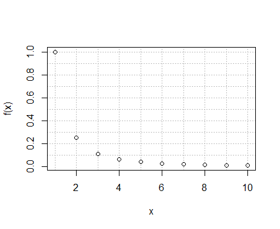
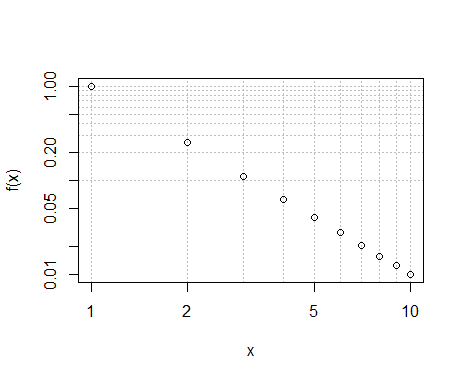
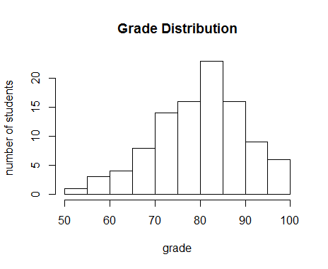
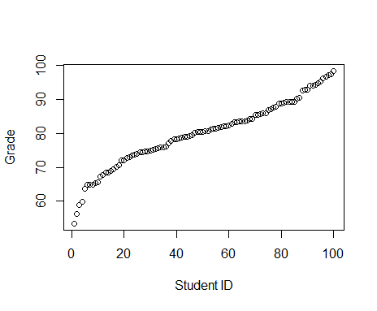
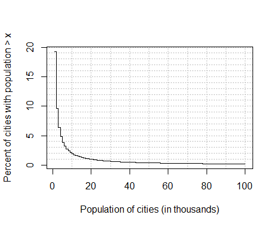
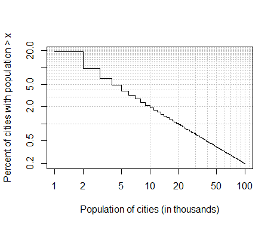
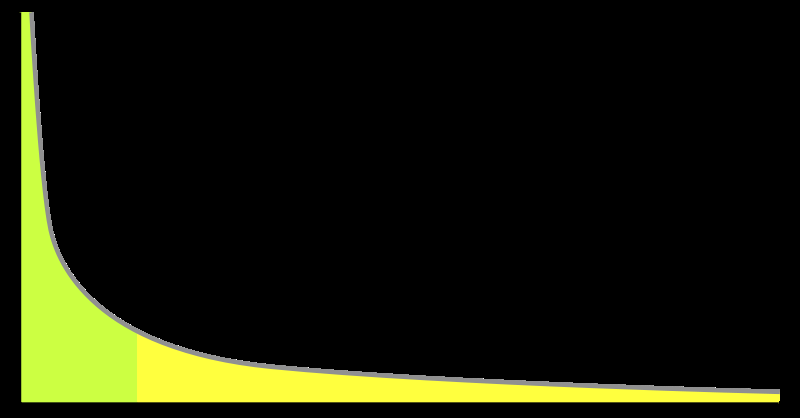

# Networks Demystified 3: The Power Law Rant

Dear humanists, scientists, music-makers, and dreamers of dreams,

Stop. Please, please, please stop telling me about the power law / Pareto distribution / Zipf’s law you found in your data.  I know it’s exciting, and I know power laws are sexy these days, but really the only excuse to show off your power law is if it’s followed by:

1. How it helps you predict/explain something you couldn’t before.
2. Why a power law is so very strange as opposed to some predicted distribution (e.g., normal, uniform, totally bodacious, etc.).
3. A comparison *against* other power law distributions, and how parameters differ across them.
4. Anything else that a large chunk of the scholarly community hasn’t already said about power laws.

Alright, I know not all of you have broken this rule, and many of you may not be familiar enough with what I’m talking about to care, so I’m going to give a quick primer here on power law and scale-free distributions (they’re the same thing). If you want to know more, read [Newman’s (2005) seminal paper](http://arxiv.org/abs/cond-mat/0412004).

The take-home message of this rant will be that **the universe counts in powers rather than linear progressions**, and thus in most cases a power law is not so much surprising as it is overwhelmingly expected. Reporting power laws in your data is a bit like reporting furry ears on your puppy; often true, but not terribly useful. Going further to describe the color, shape, and floppiness of those ears might be just enough to recognize the breed.

The impetus for this rant is my having had to repeat it at nearly every conference I’ve attended over the last year, and it’s getting exhausting.

Even though the content here looks kind of mathy, anybody should be able to approach this with *very* minimal math experience. Even so, the content is kind of abstract, and it’s aimed mostly at those people who will eventually look for and find power laws in their data. It’s an early intervention sort of rant.

I will warn that I conflate some terms below relating to probability distributions and power laws[^1] in order to ease the reader into the concept. In later posts I’ll tease apart the differences between log-normal and power laws, but for the moment let’s just consider them similar beasts.

This is actually a fairly basic and necessary concept for network analysis, which is why I’m lumping this into Networks Demystified; you need to know about this before learning about a lot of recent network analysis research.

## Introducing Power Laws

<!-- page 1 -->

## The Function

One of the things I’ve been thanked for with regards to this blog is keeping math and programming out of it; I’ll try to stick to that in this rant, but you’ll (I hope) forgive the occasional small formula to help us along the way. The first one is this:

f(*x*) = *x*<sup>*n*</sup>

The exponent, *n*, is what’s called a parameter in this function. It’ll be held constant, so let’s arbitrarily set *n* = -2 to get:

f(*x*) = *x*<sup>-2</sup>

When *n* = -2, if we make *x* the set of integers from 1 to 10, we wind up getting a table of values that looks like this:

```
x  |  f(x) = x^(-2)
--------------------
1  |  1
2  |  0.25
3  |  0.1111
4  |  0.0625
5  |  0.04
6  |  0.0277
7  |  0.0204
8  |  0.0156
9  |  0.0123
10 |  0.01
```

When plotted with *x* values along the horizontal axis and f(*x*) values along the vertical axis, the result looks like this:

[](http://www.scottbot.net/HIAL/wp-content/uploads/2012/06/linearplot.png)

<!-- page 2 -->

Figure 1

Follow so far? This is actually all the math you need, so if you’re not familiar with it, take another second to make sure you have it down before going forward. That curve the points make in Figure 1, starting up and to the left and dipping down quickly before it shoots to the right, is the shape that people see right before they shout, joyously and from the rooftops, “*We have a power law!*” It can be an exciting moment, but hold your enthusiasm for now.

There’s actually a more convenient way of looking at these data, and that’s on a *log-log plot*. What I’ve made above is a linear plot, so-called because the numbers on the horizontal and vertical axes increase linearly. For example, on the horizontal *x* axis, 1 is just as far away from 2 as 2 is from 3, and 3 is just as far away from 4 as 9 is from 10. We can transform the graph by stretching the the low numbers on the axes really wide and pressing the higher numbers closer together, such that 1 is further from 2 than 2 is from 3, 3 is further from 4 than 4 is from 5, and so forth.

If you’re not familiar with logs, that’s okay, the take-home message is that what we’re doing is **not changing the data**, we’re just **changing the graph**. We stretch and squish certain parts of the graph to make the data easier to read, and the result looks like this:

[](http://www.scottbot.net/HIAL/wp-content/uploads/2012/06/logplot.png)

<!-- page 3 -->

Figure 2

This is called a log-log plot because the horizontal and vertical axes grow logarithmically rather than linearly;  the lower numbers are further apart than the higher ones. Note that with this new graph shows *the same data as before* but, instead of having that steep curve, the data appear on a perfectly straight diagonal line. It turns out that **data which changes exponentially appears straight on a log-log plot**. This is really helpful, because it allows us to eyeball any dataset thrown on a log-log plot, and if the points look like they’re on a straight line, it’s pretty likely that the best-fit line for the data is some function involving an exponent. That is, a graph that looks like Figure 2 usually has one of those equations I showed above behind it; a “power law.” We generally care about the best-fit line because it either tells us something about the underlying dataset, or it allows us to predict new values that we haven’t observed yet. Why *precisely* you’d want to fit a line to data is beyond the scope of this post.

To sum up: a function – f(*x*) = *x*<sup>-2</sup> - produces a set of points along a curved line that falls rapidly (exponentially quickly, actually). That set of points is, by definition, described by a power law; a power function produced it, so it must be. When plotted on a log-log scale, power-law fitting data looks like a straight diagonal line.

## The Distribution

<!-- page 4 -->

When people talk about power laws, they’re usually not actually talking about simple functions like the one I showed above. In the above function ( f(*x*) =  *x*<sup>-2</sup> ), every *x* has a single corresponding value. For example, as we saw in the table, when *x* = 1, f(*x*) = 1. When *x* = 2, f(*x*) = 0.25. Rinse, repeat. Each *x* has one and only one f(*x*). When people invoke power laws, however, they usually say the *distribution* of data follows a power law.

Stats people will get angry with me for fudging some vocabulary in the interest of clarity; you should probably listen to them instead of me. Pushing forward, though, it’s worth dwelling over the subject of [probability distributions](http://en.wikipedia.org/wiki/Probability_distributionsy%20valuable%20vice%20victuals%20vile%20virginian%20voark%20wander%20warbeck%20warehouse%20wavered%20weaken%20weapon%20weighed%20well-dressed%20wept%20whirls%20wildest%20wines%20wistful%20worshipful%20wrathful%20wrists%20x%20yell%20yesterday's%20yoke%20'f%20a-going%20abounded%20abreast%20absences%20absent-mindedly%20abyss%20access%20accurately%20aches%20achieved%20acre%20actors%20adds%20adjoining%20adorned%20affront%20afloat%20aft%20ag'inst%20agitated%20agoun'%20allusion%20americanism%20amusingly%20annoy%20annoying%20antiquity%20apartment-house%20apologetic%20apothecary's%20apple%20arches%20architectural%20arguing%20aright%20armies%20articulate%20ascending%20assault%20asylums%20autumnal%20awfulness%20awoke%20babbled%20backing%20baked%20ballardsville%20ballet%20banging%20banish%20banker%20basely%20battery%20bay-window%20beaming%20becton%20behaves%20benevolence%20beseeching%20bessie%20betrayal%20bidden%20biggest%20birch%20biting%20blackened%20blade%20blessings%20blest%20blinded%20blinds%20blossom%20boasting%20bohemian%20boot%20breasts%20breaths%20brightly%20broadcloth%20brokenly%20bronze%20broom%20bullet%20burdens%20businessman%20buttoning%20calash%20canned%20canoes%20captivity%20capture%20cash%20cautiously%20cavernous%20celebrating%20cellars%20chandelier%20chandeliers%20cheerily%20chips%20choke%20chrysostom%20chuckle%20cigar-case%20circles%20civilities%20claimed%20claret%20clean-shaven%20clerk's%20clew%20coax%20cock%20cocktail%20coincidence%20collars%20collected%20colonnade%20comforting%20commence%20comments%20committing%20communal%20compliance%20complimentary%20considerate%20consul's%20consulting%20contradict%20convents%20conveyance%20convincing%20courts%20coverlet%20cozy%20cramped%20crawl%20crawled%20create%20creditors%20crib%20critic%20criticisms%20cunning%20curled%20deciding%20decorated%20defending%20defy%20delirious%20democratic%20deprecated%20deserves%20designed%20desisted%20dessert%20destination%20destitute%20diamonds%20didst%20diet%20disappear%20disappointments%20discouragement%20discuss%20dismounted%20disoccupation%20disordered%20dispose%20disputed%20dissatisfaction%20distinctions%20distressed%20disturbance%20doubting%20draft%20drakes%20draperies%20drinks%20drives%20drowsily%20drowsing%20dumn%20duplicity%20dynamite%20edifices%20effectively%20elect%20embraced%20emissary%20enclosed%20englishman's%20enlarged%20enmity%20enormity%20enraghty's%20entertained%20entitled%20entreating%20epoch%20essentially%20establish%20establishment%20estate%20evolved%20exception%20exchanging%20exigencies%20experiments%20exploit%20extremity%20eye-glasses%20ezra%20fade%20falter%20famine%20farm-house%20fastidious%20fatigues%20february%20fitly%20flaring%20flashing%20flour%20flowing%20foolishness%20forbidding%20forbore%20forecastle%20forego%20foresaw%20forgave%20forgiving%20formidable%20fort%20fortress%20foundation%20freeze%20freight%20frescobaldi%20frowsy%20futility%20gains%20gallantry%20gang%20garroter%20gazes%20giggling%20gilded%20gliding%20glimmering%20glittering%20good-nature%20goodman%20goods%20governor's%20grind%20grinding%20grinned%20grouped%20guest-chamber%20guest-house%20hailing%20haint%20hallo%20handful%20harbor%20hardest%20hardily%20hardship%20hay-stacks%20headlong%20hearn%20heart's%20heart-broken%20heartily%20heine%20helpful%20hemmed%20hen%20hereditary%20heroines%20heterogeneous%20hey%20hints%20hobby%20hooks%20horse-cars%20horseback%20house-keeping%20howling%20hurting%20hyacinths%20hysterically%20ice-cream%20identity%20illogical%20illogically%20imperfect%20imploringly%20impulsive%20inability%20incline%20incoherent%20incomparable%20increases%20indecent%20indulging%20inexperience%20inexperienced%20inflection%20inflict%20initiative%20ink%20inoffensive%20insisting%20insolence%20intelligently%20intercept%20intervening%20invitations%20isle%20isolated%20iteration%20iv%20jars%20jerry%20jerusha%20jew%20jocosely%20journalist%20journeys%20kansas%20kinder%20kneel%20knob%20knocks%20knots%20labyrinth%20lacks%20laden%20lapsing%20lavishly%20lecture%20ledge%20lending%20les%20lied%20lief%20likewise%20limits%20livelier%20loaf%20loafing%20locomotives%20loitered%20lone%20longest%20lookin'%20louder%20lounge%20loyal%20luggage%20lumberville%20lured%20m-yes%20maddening%20maker%20malice%20malicious%20managing%20mandel's%20manifest%20mare's%20marina%20marquee%20martyrdom%20martyrs%20masquerade%20matam%20matelot%20meanwhile%20meats%20mediaeval%20menace%20mend%20mermaid%20merrick%20methinks%20mice%20mike%20milldam%20milling%20mince-pie%20miniature%20missing%20moan%20molest%20mom%20monotony%20more'n%20mother-country%20motherly%20mournful%20murderer%20muted%20mysteries%20nail%20nails%20narrative%20negative%20negro%20nephew%20new-yorkers%20newport%20nineteen%20nonchalance%20noonday%20noting%20obeying%20objected%20obligatories%20occult%20official%20olive's%20onward%20operated%20oppression%20orthodox%20oval%20overdo%20overlook%20overlooked%20overworked%20owning%20paced%20pacific%20padrone%20papa's%20passers%20passivity%20passports%20pathetically%20patriarchal%20pavements%20peal%20peas%20peasants%20pecuniary%20penitence%20penitently%20perch%20peril%20permanent%20personification%20phew%20phil%20philadelphy%20philosophical%20phrased%20physicians%20pierce%20piercing%20pinned%20placidly%20plague%20plaintive%20planets'%20plank%20planning%20plant%20pleasantry%20poetical%20poise%20poker%20pore%20posing%20pots%20pouted%20poy%20precaution%20precipitate%20prescott%20presenting%20prettiness%20prime%20proclamation%20profanation%20prospects%20protesting%20protests%20prudence%20publication%20publishers%20publishing%20purposely%20pursuits%20puy%20quay%20quieted%20rachel%20radiance%20raged%20railway%20rainbow%20ranch%20rap%20ray%20rebel%20rebellious%20redder%20refrained%20refreshments%20relapsed%20relieving%20reminds%20removal%20renewal%20rents%20repel%20repelled%20reporting%20reproaches%20reproachfully%20repulsive%20resistance%20respectability%20retiring%20retreats%20revelation%20reverse%20revolted%20revulsion%20reynolds%20rhoce%20richest%20rigidly%20riot%20ripened%20risked%20rite%20robertses%20robust%20rococo%20rolls%20ruins%20rural%20rustic%20sacredly%20salad%20sanity%20satin%20savor%20saw-mill%20scamp%20score%20scorned%20scornful%20screen%20sects%20senior%20sentry%20serial%20serpent%20servile%20shading%20shapeless%20shield%20shrubs%20sickly%20sidelong%20sidewise%20silvery%20simple-hearted%20singly%20sixth%20skeptical%20skillfully%20sleigh%20smelling%20smells%20smoking-car%20smuggle%20snapped%20snatches%20sneak%20sneer%20snuff%20solar%20somebody's%20soup%20specific%20spectacular%20speechless%20spokesman%20spoon%20spree%20spy%20stab%20stake%20state-rooms%20statue%20steals%20stealthily%20steamer-chair%20steamship%20stem%20stems%20stiffened%20stillness%20stirs%20storms%20straggling%20stray%20stroll%20subtlety%20suggests%20suits%20summed%20sundays%20supplies%20surrounded%20surroundings%20suspended%20suspiciously%20sustain%20sustained%20swarmed%20swarthy%20sweeps%20swim%20swiss%20s%C3%B6r%20tainted%20tangible%20tasting%20tattered%20tavern%20tchk%20tearful%20teased%20telephoned%20tendencies%20tenement-houses%20tension%20terrapin%20terrified%20tested%20texture%20thence%20there'd%20thronging%20thrusts%20tilting%20timidity%20today%20toils%20tolerance%20tolerantly%20topped%20tout%20towering%20toy%20tracks%20trapped%20travesty%20treachery%20tread%20trellis%20trespass%20tricks%20tucked%20turnpike%20twenty-eight%20twins%20undertone%20unity%20universally%20university%20unnecessarily%20unquestionably%20unreal%20unselfishness%20unsparingly%20vacancy%20vastness%20velvet%20vengeance%20victims%20victory%20villagers%20voluble%20voted%20wardrobe%20weakened%20week's%20wheeled%20whim%20whimpering%20whistling%20widowhood%20wilful%20wilfully%20wipe%20withdraws%20witty%20world's%20worrying%20worshippers%20wyatt's%20ye're%20years'%20yer%20yields%20'as%20'ave%20'deed%2030%2045%20a'ready%20a-goin'%20aboat%20abominably%20abound%20abruptness%20abstractions%20academy%20accountable%20accusation%20acquitted%20acres%20actions%20adapt%20adjusted%20admission%20adoration%20adored%20advising%20afar%20afternoons%20agency%20agnostic%20agonies%20aide%20alas%20alertly%20alight%20alter%20alternately%20amateurs%20ambitions%20americanisms%20ancestors%20andrews's%20animated%20anticipate%20antislavery%20apathy%20apollinaris%20appearances%20appointments%20appreciable%20appreciative%20apprehensions%20arm-chairs%20armenian%20armor%20arnold's%20arrogance%20ash%20aslant%20aspirations%20associate%20assumption%20ast%20asylum%20atlantic%20atone%20atoned%20attachment%20attacks%20attendance%20attract%20attress%20attributes%20auburndale%20avoiding%20awtust%20babble%20babies%20backbone%20backwards%20baptist%20barely%20barrel%20bathe%20beads%20beats%20beauties%20befall%20befallen%20begause%20believer%20bellington%20belongings%20beople%20bereft%20bestow%20bestowing%20betraying%20beware%20bind%20birch-bark%20bird's%20blackstone%20blink%20blocked%20blossomed%20blurred%20boards%20boldness%20bones%20bothering%20bottles%20bouquet%20brains%20brakeman's%20braver%20breadths%20breakfasted%20bridget%20bridle%20brightened%20brighter%20brown-stone%20brunt%20bunch%20bunks%20buoyancy%20bury%20bust%20bustling%20cackling%20camp-meeting%20caps%20captors%20caresses%20casa%20catastrophe%20cemetery%20center%20certainty%20chafed%20chaos%20characterizes%20charmingly%20cheat%20cherished%20cherries%20chestnut%20chewing%20chianti%20chris%20civic%20cleaned%20clearing%20clearness%20clergymen%20clients%20cling%20cloudy%20clump%20coachman%20collect%20comb%20combat%20comely%20commands%20commend%20commoner%20commonplaces%20companies%20comparing%20complaint%20complimented%20composing%20comprehensive%20compunction%20comradery%20concealing%20concealment%20conceivable%20concerts%20confide%20conny%20consciences%20conscientiousness%20conservatory%20considerably%20consoling%20conspicuously%20consternation%20constituted%20constraint%20construction%20contemptuously%20contest%20contingencies%20contract%20contradiction%20contrasting%20contritely%20contrivance%20conveniences%20converts%20convey%20cooler%20cooper%20corporal%20corresponded%20courageous%20courtesies%20covertly%20cowards%20cowering%20coziness%20crack%20crackers%20cradle%20creator%20crests%20crickets%20critics%20crop%20cynicism%20d'ye%20dances%20darkling%20dates%20david's%20dawning%20dazzled%20deaf%20december%20deception%20defeated%20defenders%20deferential%20definitively%20deliberation%20deliciously%20dem%20denounce%20departing%20depraved%20derrick%20despicable%20destroying%20detach%20devils%20dick's%20dies%20dig%20digestion%20din%20diplomacy%20disappearance%20disapproval%20disengaged%20disown%20dispersing%20displayed%20distances%20distraught%20distrusted%20divers%20divert%20division%20docks%20door-yard%20doorstep%20drawl%20drearily%20driving-wheel%20dry-goods%20dubuque%20dug%20duke%20dummy%20dusky%20dye%20easiest%20easy-chairs%20eccentric%20ecclesiastical%20economically%20effigy%20eked%20elected%20embarrass%20embodied%20emerges%20emptied%20endeavors%20engaging%20episode%20erred%20esteemed%20europeanized%20evening's%20evergreen%20evolution%20exaggerate%20excesses%20exchanges%20excitements%20exclusively%20exhibitions%20expanses%20expansion%20explode%20exposure%20extend%20extension%20extract%20exulting%20eyelids%20f%20facilities%20family's%20fantastically%20farthest%20fated%20fathom%20favours%20fearlessly%20fearlessness%20feat%20females%20ferocious%20ferocity%20fertile%20festivity%20fib%20fibbing%20filial%20finery%20firmness%20fitful%20fixes%20flames%20flanders%20flanked%20flavors%20flexible%20florida's%20fluted%20foes%20fooled%20foolishly%20for't%20forefinger%20forgetfulness%20forgets%20formality%20formula%20fortified%20forty-eight%20framer%20frees%20freezing%20frescoed%20freshly%20fretted%20friendships%20fronted%20frowns%20froze%20frying%20fulfil%20fumbled%20gables%20gaily%20galley%20gambling%20gardener%20gauze%20gimcrackery%20glistened%20goblet%20goings%20goo%20goodnight%20gorgeous%20gourd%20governed%20grabbed%20graciously%20grassy%20graver%20graves%20groping%20grotesqueness%20ground-floor%20gutter%20ha'%20hackneyed%20half-dozen%20hallecks'%20hallowed%20halves%20handkerchiefs%20haply%20harassed%20haunt%20havoc%20heared%20hemisphere%20hickory%20hilarity%20hireling%20historian%20histrionic%20holidays%20hoofs%20hooked%20hopefully%20horribly%20horrors%20hovered%20hubbell%20hum%20humiliate%20humorously%20hungrily%20hunting%20hurled%20hurrah%20hurries%20ice-water%20ideally%20idiot%20idt's%20ignominy%20imitation%20impassive%20imperfectly%20imported%20impose%20imposed%20imposing%20impossibility%20imprudence%20in-doors%20inaudible%20incomparably%20incomprehensible%20indelicacy%20indispensable%20induce%20induced%20inexorable%20inexpressibly%20infamy%20informal%20informed%20inmates%20inmost%20insincerity%20insinuated%20insists%20institution%20intact%20intaglio%20intently%20intercepted%20interference%20interfering%20international%20interruption%20intimation%20intruder%20invariably%20inventive%20invested%20invoke%20iron-gray%20irrelevant%20irreparable%20ivory%20jam%20jobs%20jumps%20kanawha%20kanucks%20kerosene%20kings%20knowest%20knowingly%20kurhaus%20lacked%20lagging%20lakes%20laps%20lapses%20lasts%20latterly%20lavished%20lecturers%20lemon%20lemonade%20lenient%20liberal%20lids%20lilacs%20lilies%20liquor%20livin'%20loathe%20locality%20loftier%20long-lost%20loosed%20loudly%20lucas%20lunched%20lurched%20luxuries%20luxuriously%20magic%20mahogany%20majestic%20malign%20mankind%20mansions%20mantle%20masculine%20matches%20mattered%20meaner%20meetin'%20mela's%20melodramatic%20messiah%20metropolitan%20midsummer%20mightily%20mildly%20miranda%20miserably%20moaning%20moans%20moch%20modified%20momently%20monumental%20monuments%20mortar%20mounts%20mouthful%20mudda%20muffled%20multitudinous%20mutilation%20nasal%20nationalities%20nationality%20nations%20necklace%20needlessly%20neutral%20nevil%20niece's%20nigh%20ninety%20nobility%20nobody's%20nominally%20nonchalant%20nook%20noses%20nuisance%20nymphs%20o'er%20obedient%20obeys%20obliges%20occurrence%20occurrences%20offensively%20omnibuses%20opera-glass%20orange%20oratory%20orchards%20orchestra%20ornament%20others'%20out-of-the-way%20outburst%20outraged%20overhanging%20pairs%20palatial%20pantomime%20pantry%20paradise%20parapet%20partnership%20pat%20patches%20patronize%20peacefully%20pedt%20peep%20perambulator%20perchance%20perturbation%20perversely%20philosophized%20pig%20pillar%20pinched%20piteous%20pitilessly%20pity's%20placard%20players%20playfully%20plebeian%20plumpton%20pole%20polished%20polonaise%20ponder%20poplars%20portal%20postman%20preachers%20precipitately%20preferences%20prejudiced%20preoccupations%20presuming%20prevails%20primarily%20princely%20printer%20privileged%20privy%20prized%20proceedings%20processes%20profane%20proffered%20profuse%20prolong%20prolonging%20prompting%20proximity%20publicly%20pug%20pullman%20punctilious%20pupil%20quaintness%20qualifications%20quarrelled%20quarrelling%20queried%20quickness%20races%20racket%20ragged%20rags%20raises%20rattled%20reading-room%20reassuring%20rebuked%20receives%20recitative%20reclined%20recollected%20reconciles%20recorded%20records%20reddening%20refectory%20refreshing%20registers%20relax%20releases%20relinquish%20remembers%20remembrance%20remoter%20rendering%20repulse%20repute%20research%20resources%20respite%20restlessly%20restores%20restrained%20restricted%20results%20reveal%20reverend%20reverted%20rhine%20riddle%20riverside%20rock's%20root%20rougher%20ruffians%20rug%20rugged%20rumford%20russians%20rusty%20s'd%20saddle%20sanctuary%20savior%20sawyer%20scandalized%20schoolmaster%20scrupulous%20sculptor%20seasickness%20secretary%20secular%20self-betrayal%20semblance%20sentimentalize%20separation%20serving-man%20sexes%20shabbiness%20sharpened%20sheepish%20sheer%20sheriff%20shipwrecked%20shrill%20shrine%20sickening%20silliness%20similar%20similarly%20sinful%20sinister%20site%20slop%20slovenly%20smote%20smothered%20snake%20sneered%20snowballs%20soften%20softening%20soil%20solace%20solved%20sorrier%20sot%20soul's%20southward%20spaniards%20speculator%20spelling%20sprained%20squared%20stages%20stained%20stairways%20stammered%20steadfastly%20steaming%20stored%20straggled%20straightway%20strains%20strode%20stuffed%20stuffs%20stumbled%20stumbling%20stunned%20subjective%20successfully%20suffrage%20suffused%20summons%20superficially%20surrounding%20survey%20surveyed%20surveying%20survive%20swirling%20swore%20symptoms%20talkun'%20tapped%20tasteful%20taunt%20tea-table%20team%20telegraphed%20tellin'%20temperaments%20tempered%20tempest%20temptations%20tenement%20tennyson%20tents%20terrors%20testified%20thanking%20theme%20thickened%20thicket%20thiefs%20thinkun'%20thirty-five%20thorough%20thrall's%20threats%20three-quarters%20thresholds%20thrilling%20throbbed%20tidings%20tightly%20tinged%20tingling%20tips%20tissue-paper%20titles%20toe%20toes%20toleration%20tormenting%20torpor%20traced%20traffic%20trailed%20tram%20tranquillity%20transacted%20transfigured%20transient%20translate%20treasure%20trembles%20trim%20trimmed%20truckle%20trucks%20tumbling%20turf%20twinkle%20twitching%20uncanny%20undertaking%20unequal%20unfailing%20unfolded%20unfurnished%20unheeded%20unite%20unmarried%20unmoved%20unprecedented%20unrest%20unspeakable%20untrue%20urging%20usefulness%20utters%20valet%20valleys%20vanish%20varying%20vehement%20verse%20vestibule%20victor%20vienna%20viewed%20vii%20vindictive%20wail%20warped%20wasting%20weapons%20wednesday%20weekly%20weeps%20wharton%20whereas%20wherefore%20whiskers%20whispers%20wider%20willett's%20wiping%20withhold%20womanish%20woodland%20worcester%20worships%20wring%20wronging%20wrongs%20yawned%20z'rilla%20'twere%209%20abed%20abel's%20abhorred%20abolitionist%20abraham%20absorption%20accessible%20accidentally%20accord%20accounting%20accumulated%20accurate%20achievement%20acquired%20adieux%20adjust%20admires%20adoring%20advancement%20adventurous%20advertise%20advertiser%20adviser%20affable%20affectation%20affects%20affirm%20affords%20afternoon's%20aggressive%20aggressively%20agnes's%20agricultural%20alcove%20alfred%20alienate%20alliance%20allowable%20alternative%20altrurianism%20angles%20animation%20ankles%20annual%20anomaly%20anticipation%20antiquities%20anything's%20apathetic%20architects%20argues%20aristide%20aristocrat%20armed%20arresting%20arrives%20artist's%20ascent%20ascertained%20aspiration%20assemblage%20assemble%20assignment%20astonish%20astray%20athletic%20attach%20attends%20audacity%20austere%20authoritatively%20availed%20balls%20banked%20barber%20bareheaded%20bargains%20basements%20bat%20bated%20bath-robes%20bathing%20beauport%20bedroom%20bedside%20begrudge%20beguiled%20beholden%20bemis's%20bended%20beneficent%20bension%20berlin%20beseechingly%20bets%20beun'%20black-robed%20blacked%20bland%20blended%20blissful%20blooming%20bluntness%20boarded%20boarding%20bodies%20bolts%20bond%20bounce%20bounty%20boyhood%20braced%20brake%20breakfast-table%20breakfasts%20breeding%20bretty%20bridegroom%20brighton%20brilliantly%20brincibles%20brisk%20brogue%20brokers%20brood%20brook%20brotherhood%20brownstone%20brushing%20brutality%20bubbled%20bully%20bulwark%20bungled%20burdened%20buryin'%20burying%20butcher's%20butter-ball%20buttered%20cable%20calculated%20calf%20camp-stool%20campbells%20camping%20canals%20candy%20canst%20capacious%20captured%20caressingly%20careworn%20carpeted%20carven%20caste%20caterer%20cavaliere%20cedars%20ceilings%20cell%20centred%20ceremonious%20challenging%20chambermaid%20champlain%20channel%20chapter%20characteristics%20chased%20chasmin%20chatter%20cheapness%20cheated%20cheered%20cheers%20chef%20cheque%20chewing-gum%20chimney-piece%20chivalrous%20chivalry%20chorewoman%20chuckled%20cinders%20city's%20civilly%20clamored%20clandestine%20classics%20clause%20clearer%20cleopatra%20clergy%20click%20client%20cloak%20closets%20coffin%20collective%20commander%20commerce%20commonest%20commune%20compel%20competent%20composition%20conceded%20concerns%20conclave%20conditional%20condoned%20confessing%20confoundedly%20congratulated%20conjured%20conquest%20consecrated%20constitute%20construct%20constructed%20contemplating%20contemptible%20contending%20contentedly%20continental%20continuous%20contrasts%20contrition%20conversational%20converse%20convict%20convulsive%20cooing%20coop%20cope%20cornices%20corpus%20corrected%20correcting%20counting%20courteously%20cowed%20crag%20craning%20creating%20creeping%20crevice%20criminals%20criticised%20crook%20crow%20cryin'%20cuffs%20culpability%20cultivation%20curbstone%20currents%20curses%20cursing%20curtained%20curwen's%20customary%20damascus%20dan'el%20dark-eyed%20darker%20darkest%20darted%20dawes%20daybreak%20days'%20debated%20debauch%20decencies%20decides%20decisions%20deck-hands%20declining%20decrepit%20defect%20defection%20defensive%20deliberate%20delightfully%20delirium%20demanding%20denouncing%20denunciation%20der%20dere%20deserts%20desists%20despises%20destitution%20determination%20dewey's%20dewy%20dictate%20diffident%20diminishing%20dining-saloon%20dinner-party%20dirt%20disbelief%20discover%20disease%20disgraced%20disheartened%20dishevelled%20dismiss%20dispassionate%20dispensation%20displeased%20disrespect%20distorted%20disuse%20diverted%20divide%20dizzy%20dominion%20donna%20doomed%20door-knob%20door-way%20dormer-windows%20dough%20doun's%20doze%20drained%20dramatized%20draped%20drawback%20drawbacks%20dreading%20dress-coats%20drily%20drowning%20duly%20dutchman%20dyspepsia%20economic%20edged%20edible%20ee%20effrontery%20elaborately%20elastic%20elbows%20election%20electrics%20elegantly%20elemental%20elizabeth%20eloquent%20elusive%20embarrassments%20embers%20embraces%20embracing%20embroidered%20emergencies%20emerging%20emerson%20empire%20emptiness%20encountering%20endeared%20endeavored%20energetic%20enfeebled%20english-basement%20enjoys%20enrich%20ensues%20estimate%20evangeline%20examination%20excel%20excite%20exclamations%20exclusion%20existing%20exists%20expectance%20experimental%20explosive%20exposed%20extending%20exterior%20extorted%20fabrique%20facade%20facades%20faculties%20fairish%20faithless%20falteringly%20farm-houses%20farmer's%20faster%20fatalism%20fatally%20feeding%20feelin'%20fees%20feign%20feigning%20fenleigh%20festival%20fiery%20file%20finality%20finishing%20fire-alarm%20fishermen%20flakes%20flask%20flatters%20flirtations%20flirted%20float%20flocked%20flute%20foe%20follies%20foot-passengers%20forborne%20forecast%20forests%20forging%20forks%20foul%20foundt%20fountain's%20four-masted%20fragrance%20fragrant%20freeing%20freshened%20friendt%20frock%20frog%20fugitive%20fumbling%20fumes%20function%20fungi%20fusina%20gait%20garbage%20gardened%20garroting%20gasps%20generalization%20giant%20gibbon%20giddy%20girls'%20gittun'%20glares%20glistening%20glossy%20gloved%20godhead%20goodall%20goodwife%20gossiping%20gountry%20grab%20grade%20grapes%20grazing%20greed%20greenwich%20grimness%20grinning%20groaning%20grooms%20grown-up%20hackman%20hackmen%20hairy%20halting%20halts%20hammer%20hand-painted%20handsomer%20handsomest%20hannah's%20hardening%20hardy%20haria%20harshness%20hass%20hazardous%20healthy%20heaping%20hearken%20heave%20heavier%20hebrews%20heh%20heighten%20helm%20hermit%20heroical%20high-altar%20high-born%20high-strung%20hillside%20histories%20hoarded%20hollo%20honoured%20hood%20hoodwink%20hopefulness%20horse-shoe%20hospitalities%20hosts%20humane%20humanitarian%20humiliated%20humorist%20hunt%20huron%20hurts%20icy%20ii%20illinois%20illogicality%20illumined%20illustrate%20imaginations%20immemorial%20immovable%20impending%20imperious%20imperiously%20impersonally%20impertinence%20impertinent%20impressively%20improbable%20inadequacy%20incarnate%20incensed%20inches%20inclination%20inclines%20incongruous%20inconsistency%20inevitably%20inexpressible%20infatuation%20influences%20informally%20inglehart's%20inhabited%20inhaled%20inhospitable%20inhuman%20inkstand%20insensibly%20inspected%20inspire%20instruments%20intangible%20integrity%20intellect%20intending%20intermediary%20internal%20interposing%20intolerably%20intrude%20intrusion%20intrusive%20intrusted%20inventing%20irreproachable%20irresistible%20ivy%20jaded%20jail%20jargon%20jarred%20jarring%20jefferson%20jenny%20jested%20jollity%20journals%20judgments%20judicially%20keener%20keenness%20kentucky%20kicked%20kid%20kills%20kindt%20kingston%20lahke%20lain%20lament%20landini%20landlord's%20landlords%20landscapes%20lapels%20lawyer's%20lease%20leavin'%20legend%20leniently%20leonards%20lettered%20leyden%20liable%20libraries%20lif%20lifeless%20light-hearted%20litter%20livery%20loads%20loan%20loathing%20locks%20lodgers%20logging%20lohengrin%20loop%20loosened%20lordly%20losses%20loveliest%20lowly%20lukun'%20lull%20lustre%20madison%20madonnas%20mage%20maght%20magnificence%20mahn%20maintaining%20majesty%20malaria%20male%20mandeville%20mane%20maple%20margin%20marine%20markets%20martin%20mastered%20mayflowers%20measured%20meat-pie%20meditation%20meditatively%20melt%20menacing%20mending%20mercifully%20merciless%20merriment%20mind's%20mingle%20mining%20miraculous%20mirrors%20misses%20mister%20mite%20moccasins%20mockeries%20moneyed%20monster%20mooning%20morn%20mornings%20morsel%20mourned%20munching%20municipal%20murders%20muscles%20musty%20naiad%20nakedness%20narrowed%20narrowing%20nash's%20necks%20needle%20neglecting%20neighbor%20nelson%20nervelessly%20nervousness%20nets%20nineteenth%20northward%20notices%20nowise%20oaks%20oap%20observing%20obstinacy%20occupations%20oddity%20odorous%20ominous%20onions%20operatic%20optimism%20orator%20originally%20othah%20out-of-doors%20outcast%20outcasts%20outdoors%20outlandish%20oven%20overawed%20overcast%20overdone%20overheard%20overruled%20overruling%20pacify%20padua%20paints%20parade%20paralyzed%20paraphernalia%20pardoned%20parish%20parlours%20paroxysms%20parson%20pastor%20paupers%20paws%20peaceable%20peak%20pear%20pease%20peltrie%20pen's%20penances%20penitent%20perforce%20perform%20perilous%20perplexing%20persiflage%20persuasion%20pertness%20perturbed%20petals%20petted%20petulantly%20philippa's%20phillips%20philosophize%20photographer%20pianist%20pinks%20pit%20pitched%20pittsburg%20planting%20platter%20pleasantries%20pledged%20plied%20plunges%20pneumonia%20poet's%20poisoned%20poked%20polity%20pondered%20portable%20portiere%20ports%20post-office%20postmaster%20pounded%20precedence%20precedent%20prematurely%20presidents%20presumption%20pretense%20pretensions%20prevalent%20prevents%20priestly%20prima%20primeval%20priscilla's%20privations%20privity%20proceeding%20professors%20profoundly%20promising%20promotion%20prophets%20proportions%20propped%20proprieties%20prosper%20prospered%20prostrate%20prostrated%20protected%20providential%20province%20puff%20punch%20purchaser%20purest%20purser%20pursuing%20pusiness%20putty%20puzzling%20quail%20quarreled%20queen's%20quell%20questioner%20quickened%20quickest%20quiescent%20rabbit%20radical%20rag%20railing%20raillery%20raining%20rains%20rake%20ramble%20ramsey's%20ranged%20rankled%20rapturous%20ravages%20raves%20reappearing%20reasonableness%20reassurance%20reassure%20rebelled%20recesses%20recognising%20recognizes%20recoil%20recoiling%20reef%20reeking%20reeling%20references%20reflecting%20reflections%20refrain%20refreshment%20regardless%20registered%20regretting%20regularity%20rein%20relapse%20relate%20relaxation%20religions%20renouncing%20renton%20repartee%20repay%20repellent%20repentance%20replace%20replies%20represents%20reprobate%20resenting%20resign%20resolve%20respirations%20resulted%20retrospectively%20reverdy's%20reviving%20revolving%20ridiculously%20rightfully%20rim%20ripe%20ripening%20roadside%20roaring%20robbery%20rocking%20rocking-chair%20rogers's%20roughly%20rounds%20ruse%20sacerdotal%20sales%20salient%20samuel%20sandals%20sandy%20sash%20satirical%20sauce%20saucer%20sawing%20sayin'%20scanty%20scares%20scattering%20scent%20scented%20sceptical%20scott%20scrambled%20scraped%20scraps%20scratched%20scratching%20scrupulously%20sdarfe%20seashore%20seating%20seaward%20secrecy%20sect%20securely%20securities%20seemingly%20select%20self-contempt%20self-control%20self-denial%20self-reliance%20selfishly%20sensibly%20sentences%20separately%20serves%20serving-woman%20shabbily%20shares%20sharing%20sharpness%20shaven%20sheepishly%20sheets%20shifted%20shifting%20shipwreck%20shivered%20shocks%20shovel%20shreds%20shrinkage%20shrouds%20siege%20signing%20simulated%20simultaneous%20sinner%20sinuous%20sisterhood%20sizes%20skilful%20skin%20slain%20slant%20sleepless%20slipper%20slower%20slumbers%20slyly%20smoker%20smokes%20sneering%20snorting%20so't%20softer%20solidity%20somewheres%20soothed%20sorely%20soreness%20soundly%20southerner%20spark%20spat%20speaking-tube%20spoilt%20sport%20sprain%20springfield%20sprinkled%20spun%20squaw%20stagger%20staid%20stakes%20stalked%20stanton%20star%20startling%20station-master%20stationery%20steamer's%20stearns's%20sternness%20stewardess%20stewed%20stiffness%20sting%20stormed%20stra%20straightforward%20straining%20streams%20strenuously%20strife%20stripped%20strolling%20strung%20stubborn%20stubbornly%20stumps%20stupefied%20stylishly%20submissive%20suburb%20suddenness%20sultry%20superhuman%20superiors%20supplement%20surfeit%20surprises%20surveys%20swam%20sweeter%20swells%20swivel-chair%20swoon%20swords%20table-cloth%20tackle%20tasks%20taunted%20taxicab%20teams%20temperature%20temporarily%20tenants%20testify%20tha's%20theaters%20thereby%20thinner%20thirteen%20threads%20thrift%20throbbing%20thyself%20tickled%20tides%20tighter%20tinkled%20toast%20tolerate%20toothache%20tormentor%20torture%20tottered%20towered%20trained%20traitors%20trampled%20transfixed%20transgression%20transports%20travelers%20traveling%20travelling-suit%20tropical%20troublesome%20troupe%20truer%20truthful%20truthfulness%20try-east%20turks%20twenty-seven%20twitter%20unabashed%20unalloyed%20unavailing%20unbelief%20unbuttoned%20undisciplined%20undone%20unfair%20unfeeling%20unfinished%20unfriended%20ungentlemanly%20ungracious%20unheard%20unimaginable%20uninteresting%20unkempt%20unliterary%20unnoticed%20unsympathetic%20unutterable%20upbraiding%20upholstery%20upland%20uplifted%20urgence%20ursuline%20ursulines'%20uttering%20vagaries%20vale%20vaster%20venus%20veracity%20vernal%20verses%20version%20vetoed%20vi%20vicious%20vigilance%20viii%20violation%20violets%20virginians%20visions%20wailing%20wakeful%20wakes%20wanderings%20wanton%20wantun'%20warrant%20watch-chain%20watery%20wayfarer%20wearied%20wedding-journey%20weed%20weeds%20welks%20welsh%20whereupon%20whirlpool%20whisky%20wickedest%20wid%20wild-cat%20wilder%20willed%20williams's%20window-sill%20winking%20wintry%20wire%20withheld%20woe%20woffington%20wood-work%20woods-pasture%20wooing%20wool%20worshipers%20worshipped%20worthier%20wrappings%20wrenched%20wrings%20writhing%20yankees%20yawning%20yelled%20yourn%20zest%20'ad%20'd%20'n%20'old%20'twould%201759%201870%20abandonment%20aberration%20abet%20abjectly%20abolished%20absorbing%20absurdities%20absurdly%20accented%20accidental%20accommodations%20accompany%20accomplish%20accordingly%20accordion%20acknowledging%20acknowledgments%20acquiring%20activities%20acton%20actuality%20acute%20adam%20additional%20ado%20adorable%20adventurer%20adventurers%20adversary%20agencies%20agonized%20agreeably%20agrees%20ah'll%20ah've%20alleys%20allows%20amateurish%20ambush%20amiss%20amply%20amstel%20analyze%20ancestry%20angle%20anglo-saxon%20anne%20announce%20annunciator%20anonymous%20answerable%20anticipative%20anyways%20apparatus%20appealingly%20applies%20apropos%20aptness%20arab%20arched%20aristograt%20armenians%20armful%20arrivals%20arrogant%20artemus%20askin'%20asphalt%20assenting%20assertion%20assisted%20associates%20assuring%20astounded%20athertons%20athwart%20atoms%20attacking%20attentively%20auburn%20audacities%20auf%20austria%20author's%20authoritative%20avenged%20averse%20azure%20backer%20baedeker%20baffling%20baker%20baldness%20baleful%20bangor%20banishment%20banners%20barking%20baseness%20bashful%20basin%20bath-gown%20battle-field%20beak%20beamed%20beards%20bearer%20bearings%20beaux%20bedding%20begoming%20belle%20bellows%20beloved%20benefactor%20benighted%20benny's%20betrothal%20betrothed%20betting%20bewailed%20bids%20billiard-room%20bindings%20birthday%20bitterest%20bittridges%20blackly%20blackness%20blanched%20blasphemous%20blast%20blasts%20blend%20blondes%20blot%20blotted%20bluffs%20blur%20blushes%20boastful%20boating%20bodily%20boilers%20boldest%20bookcase%20bookmarks%20bough%20bounced%20bounded%20bracing%20breakfasting%20brebeuf%20breed%20brentano's%20brevity%20brick-work%20bristled%20bristling%20brooklyn%20bruise%20brung%20brutally%20brutus%20bubble%20bubbling%20buds%20builder%20bulkhead%20bulks%20burglars%20busily%20butchers'%20butler%20button-hole%20cabbage%20cabin-boy%20cacouna%20cad%20cafe%20caffe%20californian's%20call-boy%20call-boys%20calvary%20campaign%20candlesticks%20canteen%20canvasback%20caress%20caricature%20carnage%20carnival%20carving-knife%20cas%20cashier%20casks%20cautious%20cave%20celery%20centres%20certificate%20challenged%20chaperon%20charlatan%20chat%20chatted%20cheaply%20cheerfuller%20cherish%20choke-cherries%20chokes%20church-going%20ch%C3%A2teau-bigot%20cincinnati%20circuit%20circular%20citizenship%20clacking%20claiming%20clans%20clapping%20clattered%20clawing%20cleaning%20cleanliness%20clears%20clicking%20climbs%20cloistered%20close-shuttered%20closeness%20clumsiness%20co-operation%20coach%20coase%20coaxing%20code%20coherent%20coins%20collapse%20colonnades%20colt's%20combine%20commissioned%20commonness%20communication%20companionable%20companions%20company's%20compartment%20complaining%20complexions%20complicate%20complicates%20complicity%20comrades%20comun'%20conclude%20concussion%20conferences%20confidant%20conflagration%20congratulations%20congress%20conjugal%20connecting%20connoisseur%20consenting%20considers%20consolations%20consorted%20consumption%20contradictions%20contrasted%20contributions%20contrive%20controversy%20conundrum%20conversed%20conversion%20convicted%20conway%20cooled%20coonrod's%20cooper's%20copied%20copying%20cork%20corn-pone%20cornfields%20corporation%20corps%20corresponding%20corridors%20corruption%20costliness%20couch%20coughed%20countryman%20court-house%20courted%20cousine%20cracked%20craven%20crawling%20crazed%20crazily%20creed%20creeds%20creepy%20crisis%20criterions%20criticising%20cross-streets%20crouching%20crowds%20crueller%20crumbs%20cummings's%20curling%20curving%20cushioned%20customers%20cuts%20cylinder%20d%20da%20dadda%20dailies%20dainties%20dame%20damozel%20dangled%20dangles%20daniel%20darkens%20dart%20daughter-in-law%20dean%20dears%20deeds%20deepening%20deer%20deerfield%20defense%20deferentially%20defrauded%20degenerating%20dejectedly%20delays%20demon%20demoralized%20densely%20deprave%20depravity%20depression%20deprive%20deprived%20des%20desiring%20desisting%20despaired%20despite%20detaching%20detailed%20deux%20developing%20devotees%20devoting%20diagonally%20dictated%20didactic%20diffused%20digest%20dire%20directing%20directness%20disability%20disadvantages%20disapprove%20disarray%20disastrous%20disconsolately%20discord%20discount%20discretion%20disembodied%20disheartening%20dishonest%20dishonesty%20dishonorable%20disintegration%20disks%20disorderly%20dispatch%20disregard%20dissatisfied%20dissolved%20distinctness%20distinguishable%20districts%20disturbing%20disused%20divinity%20dock%20docket%20document%20dog's%20domesticated%20door-bell%20dormer-window%20dorothea%20dorrance%20dozed%20drainage%20drawing-rooms%20drip%20dripping%20drugged%20dryfooses'%20dryness%20du%20dubiously%20ducks%20dudgeon%20duller%20dullness%20dumned%20dunkards%20durst%20earnings%20earrings%20easing%20eavesdrop%20echoes%20economical%20economist%20eddy%20editions%20efery%20effaced%20effectiveness%20efficient%20effulgence%20effusion%20egyptian%20egyptians%20elevation%20eligible%20embattled%20emblematic%20emissaries%20enclose%20energies%20enforce%20engines%20english-speaking%20enhanced%20ennobling%20enormously%20entangled%20enterprising%20entertainments%20entreat%20entreaties%20equipage%20equivalent%20erected%20erie%20err%20errands%20essay%20essence%20establishing%20estrangement%20ethical%20europeans%20evading%20evils%20evoked%20excellency%20excitable%20excitedly%20exclude%20executed%20execution%20exertion%20exhaustive%20exhorter%20exiled%20expiate%20explanations%20exploiting%20exploring%20extraction%20eyelashes%20facile%20fad%20fagots%20fainting%20fairer%20fake%20famed%20family-man%20family-room%20fancying%20fashionableness%20fates%20fathaw%20fatuity%20feathers%20fee%20fellow-beings%20fenleigh's%20fervid%20fetish%20feudal%20feverish%20fibs%20fiddle%20fidgeted%20filed%20fills%20finely%20fireside%20five-dollar%20flagging%20flaming%20flavia's%20flippant%20flourished%20flourishing%20flower-beds%20flowering%20flushing%20foamy%20focus%20foibles%20fonder%20fool's%20footfalls%20forbearing%20forebodings%20foreshortened%20formlessly%20formulation%20foundations%20fowls%20framed%20frames%20franklin%20freak%20freckles%20frequenters%20friendlier%20friendliest%20frightfully%20fringed%20frolic%20frontier%20frowningly%20frugal%20fruitless%20fulfillment%20fulness%20fuming%20funds%20funnels%20furnishing%20furs%20furthest%20fwhat%20gable%20gallop%20games%20garibaldi%20gayest%20gayeties%20geese%20general's%20generalizing%20genesee%20gentility%20gentler%20geraniums%20gif%20gigantic%20gillespie's%20gimcracks%20gits%20gladys%20glamour%20glen%20glided%20glimpsed%20goaded%20gomes%20gondolas%20good-evening%20good-fellowship%20graduated%20grammatical%20grandest%20grandson%20grappling%20grasped%20grass-plots%20grasshopper%20grasshoppers%20gratification%20gratifying%20greenfield%20greet%20grieves%20grievous%20groped%20grossly%20grotesquely%20groves%20grudge%20gruff%20guardian%20guessing%20guidance%20guided%20guitar%20gulped%20gurgling%20gusts%20gypsy%20hacks%20hadst%20hadt%20hair-cloth%20half-grown%20half-shut%20hall-boy%20hampered%20hampshire%20hang-dog%20harbour%20hard-headed%20hardress%20hardships%20hardt%20harness%20hastening%20hat-brim%20hauling%20haunting%20havin'%20head-waiter%20headstrong%20healed%20hearers%20hearse%20heart-breaking%20heartsick%20heaviness%20hebrew%20heedless%20heel%20hell-fire%20helpfulness%20hendry%20hi%20high-spirited%20highness%20highways%20hindering%20hisself%20hitching-weight%20hoase%20hoax%20holes%20hollyhocks%20home-like%20homelike%20honly%20hopelessness%20hordes%20horridly%20hourly%20house-hunting%20houseless%20housework%20how'd%20howells%20howl%20hue%20humbling%20humbug%20hump%20hundredth%20hup%20hurons%20hushed%20hustle%20huts%20hypocrite%20hypocritical%20ice-tea%20idealizing%20identified%20idiotic%20idolatry%20idyllic%20ill-advised%20ill-timed%20illimitable%20illusions%20imaginably%20imitate%20immensity%20immortality%20immunity%20impetuous%20implanted%20implies%20import%20importunate%20improving%20inadequate%20inattention%20inattentive%20incessantly%20including%20incognito%20incommode%20incompatible%20inconvenience%20incorrigible%20incredulous%20indignity%20indirect%20indiscriminately%20indulgent%20infants%20infected%20inferences%20infirm%20influenced%20inform%20informality%20informing%20inhabitants%20inherent%20initial%20injurious%20innumerable%20insanity%20inscription%20insight%20insincere%20inspires%20instruct%20insular%20intellectually%20intelligencer%20intensify%20intentionally%20interpose%20interruptions%20intersecting%20interviewed%20intricate%20invalids%20invasion%20inventors%20investment%20invisible%20involves%20involving%20irrelevance%20irretrievably%20irreverence%20irreverent%20irritation%20jack's%20jamb%20jambs%20japan%20jeered%20jehovah%20jerked%20jerks%20jests%20jesus%20jets%20jewel%20jewish%20jocosity%20jolt%20journalists%20jovial%20joys%20judging%20juncture%20jus'%20justifiable%20justification%20jutting%20keeper%20keepers%20kelp%20key-hole%20kindliest%20kith%20kittenish%20knickerbockers%20knotted%20labels%20laborer%20laconic%20ladders%20lambs%20lamentation%20land-agent%20lash%20latch-key%20latham's%20laughable%20lax%20lazzaro%20leafless%20learnt%20leathern%20lectured%20lecturing%20leghorn%20legislative%20legislature%20legitimate%20leisurely%20lick%20lieutenant%20lightened%20limb%20limply%20lincoln%20lingers%20lining%20linsey-woolsey%20lionel%20literal%20littered%20liveliest%20loaded%20loafers%20loftily%20long-lashed%20longfellow%20longs%20loomed%20luke%20lulled%20lumbering%20lumps%20lurch%20lurk%20lurks%20ma%20macroyd's%20madly%20madman%20magistrates%20make-believe%20make-up%20managers%20manages%20manifestly%20mann%20manoeuvres%20mansion%20marble-topped%20market-place%20mason's%20matched%20mate's%20mated%20matrimony%20matronly%20matrons%20matter-of-fact%20maxwell%20mayst%20mcilhenys%20meaningless%20medical%20meditating%20melodrama%20men-servants%20mercy's%20merged%20merriam%20meshes%20messages%20metallic%20metaphor%20methodist%20midday%20middlemarch%20middlin'%20milder%20milkin'%20millon's%20mindful%20ministrations%20minstrelsy%20minute's%20minutes'%20minx%20mirandy%20mirrored%20miser'ble%20misinterpretation%20misled%20moderation%20modify%20moisture%20moonlit%20mop%20morbidly%20mornin'%20mornun'%20mortify%20moss%20mothah%20motioned%20mourners'%20mournfully%20mug%20mule%20multitudes%20mumbled%20muses%20musicales%20musically%20muslin%20myth%20n%20nahant%20nancy's%20narration%20narrow-minded%20near-sighted%20necktie%20needing%20needles%20nefarious%20negroes%20nest%20new-world%20nicchio%20ninety-nine%20no'th%20nobleness%20noding%20nominal%20non-committally%20nondescript%20normandy%20now's%20objections%20objective%20obligatory%20observances%20observations%20observers%20obstacles%20obstinate%20occupants%20oftenest%20oil-regions%20old-established%20old-time%20old-world%20oldt%20oliver%20omitted%20omniscience%20onderstand%20one-half%20one-sided%20openness%20opera-house%20oppressive%20oranges%20organize%20outcome%20outcry%20outing%20outlawed%20outlay%20outlays%20outlined%20outlive%20outlived%20outlook%20outnumbered%20outrageously%20overcoats%20overgrown%20overhear%20overwrought%20owl%20pained%20palate%20palpitated%20paper-cutter%20paralysis%20parlor-car%20parody%20parthian%20partition%20partners%20passably%20patriotic%20patriotism%20patron%20patronising%20patted%20pauper%20peaches%20pearl%20peasant-women%20penetrating%20penknife%20peopled%20peoples%20perceptions%20perdition%20peremptorily%20perfidy%20perishing%20perpetuated%20perversion%20peter's%20petition%20pg%20phantasmal%20philosopher%20philosophically%20photographic%20piano-stool%20piazzas%20pictur's%20pigeons%20pigs%20pike%20piled%20pilot%20pioneers%20piped%20piquant%20pitiable%20planking%20plentifully%20plotting%20ploughing%20plucking%20plumes%20plutocracy%20poke%20pokes%20poking%20polish%20politicians%20pop%20poppa's%20popularity%20populous%20porter's%20portico%20portier%20positions%20possessing%20postal%20posts%20pounds%20poverty-stricken%20practicable%20practicality%20practicing%20practitioner%20prayin'%20prayun'%20preamble%20preceding%20precipices%20predatory%20preparatory%20presentable%20preserve%20presumed%20pretences%20pretension%20prizes%20pro%20probability%20proclaim%20procuratie%20prodigal%20professes%20profits%20promenaders%20promenading%20promoting%20pronunciation%20propensity%20prophesied%20proposes%20protecting%20protestants%20prow%20prying%20puckered%20pulses%20punctual%20punctuality%20pungent%20punishing%20purblind%20purchases%20puritanism%20puritans%20purport%20purring%20puttin'%20quaintly%20quaking%20qualification%20quavered%20queen-mother%20queerness%20querulous%20quest%20quitting%20rack%20rainy%20raising%20rally%20raptures%20rascally%20rascals%20rasped%20rats%20ravening%20ravings%20re-enter%20re-enters%20reappear%20receptions%20reciprocal%20reciprocity%20recklessness%20reckoned%20recollecting%20reconstructed%20recounted%20recovery%20recreant%20red-hot%20redfield's%20refers%20reflects%20reformer%20refrigerator%20refuses%20regimental%20regulation%20rejecting%20rejoined%20relatives%20relent%20reliance%20reliefs%20relinquished%20relish%20remnant%20remnants%20repairing%20repented%20replaces%20representing%20repress%20reprisal%20reproduction%20repugnance%20reputed%20requested%20rescuing%20resentfully%20reservation%20residences%20resorted%20resource%20respectively%20restrain%20restrains%20retarders%20retrieval%20revels%20revered%20reverting%20reviews%20revival%20rhetoric%20rhyme%20rhythmical%20ridiculing%20righteous%20risking%20rites%20ritual%20river's%20robber%20roor%20rosy%20rot%20rotten%20rounding%20rudder%20russian%20rustle%20rye%20sacrificing%20sacrilegious%20sagacity%20salaried%20salem%20salesladies%20sallied%20salmon%20sane%20sanguine%20satisfying%20saucy%20sausage%20scales%20scant%20scarfs%20scarlet%20schemes%20schiller%20scientist%20scoundrels%20scrambling%20scraping%20scratches%20screw%20scribble%20sculpture%20searches%20seasands%20secrets%20securing%20selected%20self-assertion%20self-love%20self-satisfaction%20self-satisfied%20sells%20seminary%20sensitiveness%20sentimentalized%20sermons%20settlers%20settling%20severally%20shadowy%20shady%20shamefully%20shanty%20sharper%20shave%20shedding%20sheds%20shines%20shirk%20shirts%20shoe%20shoe-bag%20shortened%20shove%20shrewdly%20shrubbery%20shrugs%20shuffle%20shumaker's%20shutters%20sideboard%20sightly%20silks%20singled%20sister-in-law%20sixpence%20skeleton%20skeptic%20sketch-book%20skilfully%20skins%20skull-cap%20sky-line%20slamming%20slander%20slangy%20slanted%20sleighs%20slew%20slide%20sliding-doors%20slighted%20sling%20sloped%20sloping%20smashed%20smith%20snake-skin%20snatching%20soberer%20soda%20sodden%20sojourning%20somers's%20soothe%20sophisticated%20sounding%20sour%20soured%20spade%20spake%20sparse%20speakers%20specious%20spectral%20spectre%20speculated%20speculating%20speculations%20spelled%20spendthrift%20spice%20spicy%20spilt%20squad%20squeezed%20squirrel%20stables%20staccato%20stains%20stalls%20stalwart%20stamps%20standards%20standun'%20starlight%20starry%20starved%20statements%20stationed%20stew%20stiffen%20stifle%20stifled%20stimulated%20stolidly%20stormily%20strained%20strawberries%20streak%20streaming%20strides%20strings%20striped%20strokes%20stuffy%20stung%20stylishness%20subdue%20subsequent%20subsided%20substitute%20subterfuge%20suburban%20successes%20suffice%20suggestively%20summer's%20summit%20summon%20sums%20sundown%20sunflower%20sunnily%20sunrise%20sunsets%20superabundance%20superseded%20superstitions%20supped%20suppers%20supplant%20supplication%20supplying%20surf-bathing%20surfaces%20surged%20surges%20surname%20suspecting%20suspects%20suspension%20swamp%20sway%20swollen%20symbol%20sympathizing%20symphony%20tablets%20taciturn%20tack%20talare%20talented%20taller%20tar%20tariff%20taverns%20tax%20teaches%20teacup%20teapot%20temperance%20tempting%20tending%20thanksgiving-day%20thaw%20theft%20theoretically%20thigh%20thinly%20thinned%20thirst%20thirsty%20thoat%20thoroughfare%20thoughtfulness%20thrain%20threatens%20three-cornered%20thrice%20throne%20thumping%20thundered%20thwarted%20ticket-office%20time's%20timorous%20tingled%20titter%20tolerably%20tolstoy%20tomahawk%20toppled%20torpedo%20toys%20tractable%20trader%20trails%20trannel's%20transformed%20transients%20translations%20translator%20translucent%20transported%20trapping%20traversed%20treble%20tricked%20trinkets%20triumphal%20triviality%20trolleys%20trouble's%20truce%20trump%20trumpery%20trustfully%20trusts%20tumble%20twain%20twelvemough's%20twitches%20twittered%20twittering%20tying%20typhoid%20uhland%20ulster%20umpire%20unaccountable%20unawares%20unbecoming%20uncandid%20unconventional%20uncovered%20undeniable%20undergone%20underlying%20undertook%20undesirable%20undignified%20undoubtedly%20undress%20unerring%20unfairness%20unfaith%20unfavorable%20unfolding%20unfriendly%20ungratefully%20unguarded%20uniforms%20unintentional%20unitarian%20unjustly%20unlimited%20unnerved%20unresponsive%20unsaid%20unscrupulous%20unseemly%20unsociable%20unsuccessful%20unsuspected%20unsuspicious%20untasted%20untold%20untouched%20unwholesome%20upbraid%20upbraided%20urn%20utica%20vagabond%20vagueness%20validity%20vaudeville%20vegetation%20veneranda%20vent%20venturing%20verify%20verona%20vertebrate%20vest%20vexatious%20vibration%20vices%20vigilant%20vigils%20violating%20virgin%20vis-a-vis%20vista%20vitally%20volition%20volumes%20vows%20voyages%20wagner%20wales%20walled%20walter%20waltz%20wands%20wards%20wary%20wastes%20watchful%20water-gate%20watkins's%20watterville%20wayside%20wayward%20web%20weeks'%20weigh%20weirdness%20welfare%20welling's%20whiffs%20whims%20wholesale%20wholesomeness%20whoop%20wick%20wickedly%20widely%20widowed%20width%20wiedersehen%20wilds%20willow%20winders%20window-seat%20windstuhl%20winter's%20wiry%20witch%20wither%20witnessing%20woak%20woes%20womanhood%20wonderingly%20workers%20wounds%20wraith%20wrapt%20wretchedness%20writin'%20yards%20yo%20yorkers%20zealous%20'fore%20'fraid%20'ow%20'twixt%201%2011th%201775%201835%201848%201855%201860%201879%205%20abasement%20abbate%20abbate's%20abdicate%20abe%20abhorrent%20abiding%20abode%20abolish%20abolition%20abounding%20abram%20absented%20abuses%20abusing%20abysmal%20abyssinians%20accepts%20accessory%20accomplices%20accomplishments%20accordance%20accuses%20ach%20acquiescent%20ad%20adamantine%20adapting%20additions%20adequacy%20adequate%20administer%20admittance%20admixture%20adoption%20advisable%20afeared%20affidavit%20affirming%20afflict%20affluence%20affording%20afghan%20after-dinner%20agent's%20agents'%20aging%20agreeing%20ahdeal%20aimed%20aims%20air-cushion%20airily%20airing%20aisles%20alacrity%20alaska%20albums%20alertness%20alice%20aliens%20all-wise%20alleghanies%20alley%20alluring%20allusions%20ally%20amassing%20amazing%20amy's%20analytic%20andt%20angelically%20announcement%20announcing%20annoyances%20annually%20anon%20anticipated%20anywise%20aplomb%20apologizing%20apoplexy%20apostles%20apostolic%20appalling%20appeased%20applaud%20applying%20appropriations%20approves%20approving%20aprons%20arabian%20arabs%20archness%20area%20aristides'%20arithmetic%20arm's%20arm's-length%20arm-in-arm%20armchair%20arnold%20arranges%20arrears%20art's%20artfully%20ascended%20ascertain%20ascetic%20ash-barrels%20ashen%20askingly%20assailants%20asserting%20asses%20assign%20assimilate%20assorted%20asters%20astir%20astride%20athenians%20athens%20atoning%20attainable%20attendant%20attintion%20attractions%20aunts%20austerely%20austerity%20australia%20austrians%20authorised%20authorship%20autobiographical%20avowed%20awaiting%20awe-stricken%20awtusts%20ax%20azaleas%20bab%20baggage-room%20bah%20baie%20baited%20bale%20ballad%20ballast%20balloon%20balm%20bankers%20banner%20banshee%20bantered%20baptized%20barefaced%20bargaining%20barge%20barked%20barometer%20barouche%20barricades%20bath-room%20battered%20battle-ground%20bazar%20beach-wagon%20bead%20beams%20beardy%20beckon%20beckons%20becuz%20bedstead%20beethoven%20beetles%20befriending%20beggar%20beginnings%20beholder%20beholding%20bell-pull%20bella's%20bellow%20bemoan%20bemoaned%20benching%20benediction%20beneficial%20beneficiary%20benevolent%20bereaved%20bereavement%20bestowal%20bettered%20betters%20betwixt%20bevans%20bevans's%20bewitched%20bewitching%20bierhaus%20bigamist%20bigot%20bill's%20billow%20bins%20birch-trees%20birthdays%20bites%20blackest%20blamelessly%20blaspheme%20blasphemy%20bleed%20blinding%20blindness%20blinking%20blondness%20blood's%20bloodier%20bloody%20bloomed%20blue-eyed%20boarding-school%20boasts%20boiler%20boiling%20boisterous%20bondage%20bone%20bonsecours%20book-keepers%20book-shelves%20booming%20boon%20booth%20booths%20booty%20boring%20borry%20bottle's%20bounces%20bounding%20bowery%20bracelets%20branching%20brands%20bravo%20breast-pocket%20breathlessness%20bricks%20bridte%20brightest%20brim%20brimming%20brooks%20browbeating%20brown-complexioned%20browning%20bu'st%20buffeted%20buggy-seat%20bullying%20bunker%20burglar's%20burlesquing%20burner%20burns%20burnun'%20bushel%20bushy%20butcher%20bygones%20c'est%20cabins%20cackle%20cackled%20cage%20cah%20calashes%20calico%20californians%20callers%20callin'%20calmed%20calvinist%20camera%20camp-meetings%20camp-stools%20campos%20canary%20canes%20canonico%20caricatures%20carmelite%20caroline%20carpenter's%20carriage-drivers%20cartier's%20carve%20casement%20castaways%20categorical%20cater%20cattle-range%20cautions%20cavalier%20celebrates%20celestial%20cemeteries%20censor%20censured%20centre-table%20ceremonial%20channels%20characteristically%20characterizing%20chariot%20charity-boys%20charlesbourg%20charlestown%20charlotte%20cheapening%20cheapest%20cheating%20checkers%20checking%20childless%20chit%20chocolate-creams%20chop%20chopping%20christ's%20christenings%20christopher%20chronicle%20circulars%20cistern%20clack%20clad%20clamber%20claps%20clashing%20clattering%20claw%20claybank's%20cleanly%20clemency%20clenched%20cliffs%20clinch%20clinched%20clipped%20clog-dancer%20closest%20clothes-lines%20clubbing%20clumps%20clustered%20clustering%20clutter%20co-operative%20coasting%20coat-sleeve%20coaxingly%20cocked%20cocoanut%20cocoons%20cod%20cogs%20coiled%20coin%20coing%20cold-blooded%20colder%20collections%20collision%20collusion%20colo'%20colonies%20colonists%20colorless%20columbus%20combed%20combining%20comer%20comforts%20comically%20commenced%20commercialized%20commiseration%20committee-room%20communicate%20communities%20comparable%20complacency%20complaisance%20complication%20comply%20complying%20comprehend%20comprehensible%20compressed%20compute%20con%20concessions%20concurrence%20condescension%20conferred%20confides%20conformed%20confusing%20conjecturable%20conjure%20connect%20conquer%20conquered%20consensus%20conservative%20consisted%20consistency%20consoles%20consolingly%20consuls%20consumed%20consummate%20contained%20containing%20contemplates%20contemporaries%20contends%20contested%20contingency%20continuance%20contortions%20contracted%20contralto%20contravention%20contributor%20controlling%20convalescent%20conveniently%20conventions%20conversing%20convolutions%20cooed%20coquetry%20coquettish%20corals%20cornhill%20correction%20corroboration%20corrupting%20cough%20coughing%20counterfeit%20countess%20counts%20coup%C3%A9%20court-room%20court-yard%20courteous%20courting%20cower%20cozily%20crabs%20cracker%20cranberry%20craned%20crape%20crashes%20creak%20creation%20creditable%20creditor%20creeps%20crestfallen%20crick%20crimes%20crippled%20crises%20cropped%20crops%20cross-town%20crosses%20crouches%20crucial%20crucifix%20crushes%20crust%20crystal%20cuess%20curbstones%20cured%20curing%20curt%20curwens%20customer%20cutlery%20cutters%20cyclone%20cymbals%20cynic%20d'avignon%20dabbling%20dad%20dainty%20daisy%20dames%20dangerously%20dangers%20danse%20daresay%20darken%20dashboard%20dated%20dauntless%20dawned%20deadliest%20dealings%20death's%20deathly%20debtor%20deceiving%20decisive%20declares%20defamation%20defences%20defends%20defiances%20defining%20deformity%20degenerate%20degradation%20degraded%20degrading%20delegate%20delightedly%20delivery%20dell%20demeanor%20demolished%20demolition%20demonstrations%20demoralizing%20denies%20denser%20deplorable%20depots%20depraving%20deprecating%20depressed%20derided%20descanted%20descendants%20desecration%20desertion%20deshabille%20desirable%20desks%20despatching%20despondency%20destroys%20detains%20detest%20deucedly%20developments%20devotee%20devoured%20devouring%20dew%20diagnosis%20diagonal%20dialect%20dictation%20dictionary%20digs%20dilemma%20diligence%20diligently%20dime%20diminished%20dimness%20dint%20dip%20dipped%20disabuse%20disagree%20disagreeably%20discern%20disclaim%20disclaiming%20discomfited%20discomfiture%20discomforts%20disconsolate%20discourage%20discoveries%20discreet%20discussions%20disdaining%20disengaging%20dishabille%20disheveled%20dishonored%20disobedience%20disparity%20dispatched%20displays%20displeasing%20disposing%20disproportion%20disputing%20disqualified%20disrespectful%20distinctive%20distracting%20distributed%20dividend%20divides%20dividing%20divinely%20divorced%20divvy%20dizzily%20do'%20doctrines%20domestics%20domineering%20doos%20dormant%20dotards%20dotted%20double-breasted%20double-headed%20doubled%20doughnuts%20dove%20down-hearted%20dozens%20drab%20drags%20dramatize%20drawled%20dream-land%20dresden%20dressing-case%20dressing-table%20dripped%20drivin'%20drollery%20drop-light%20drownded%20drumming%20drums%20drunkenness%20dryads%20dtea-rhoces%20dtidn't%20ducal%20dues%20dulled%20dullest%20dunes%20dunkard%20dupes%20dwindled%20dyspeptic%20e'en%20ear-shot%20earning%20earns%20earthen%20earthquake%20easter%20eastlake%20easy-going%20eatin'%20eating-houses%20eavesdropper%20ecclesiastic%20eclipse%20eden%20edging%20edited%20edito'%20effectually%20effusive%20egotistical%20eily%20eke%20elapsed%20elated%20eldresses%20electricians%20electricity%20elevator-boy%20eliot%20embodiment%20emboldened%20embowered%20emitted%20emphasis%20emphatic%20enables%20encircled%20encircling%20enclosing%20encore%20endearments%20endow%20endowed%20engineers%20englishwoman%20englishwomen%20englishy%20engrossed%20enraged%20entreatingly%20envied%20envoy%20epigram%20epochs%20equine%20equipages%20era%20escapade%20escort%20especial%20estimable%20et%20etchings%20ev'n%20evah%20evanescence%20evelyn's%20everlastingly%20evermore%20ex-military%20exceedingly%20exclamatory%20exempt%20exercises%20exert%20exiles%20exonerated%20expeditions%20experimented%20experimenting%20expire%20expired%20exploration%20explorations%20exposing%20expostulation%20expressman%20extinguished%20extremes%20exultant%20eye-opener%20fable%20fables%20facetious%20factitious%20fades%20fainter%20famished%20fanatical%20fantasticality%20fantasy%20farce%20fared%20fasting%20father'll%20fatherhood%20fatiguing%20fatuous%20faultless%20fearing%20feathered%20feebleness%20feeds%20feline%20feller%20fellow-students%20fellowship%20felon%20fencing%20ferns%20festive%20fetches%20feud%20fewer%20fictions%20fiendish%20fights%20filament%20filigree%20financially%20findt%20finger-nails%20finger-tips%20fingering%20finishes%20firmament%20fished%20fisherman%20fists%20fitchburg%20five-o'clock%20fixedly%20flabby%20flagon%20flapping%20flattened%20fleet%20flicker%20flimsy%20flirts%20flocks%20flooded%20floods%20florentine%20florid%20floundering%20floury%20flowed%20flower-bed%20flown%20fluctuations%20flushes%20flutters%20font%20football%20footfall%20footsteps%20footway%20foray%20fore%20foreboded%20forecasting%20foregone%20forestall%20forma%20formation%20forsake%20fortifying%20fortitude%20fortnightly%20forty-second%20fours%20fowl%20foyer%20fragile-looking%20fragmentary%20franker%20freaks%20freckled%20freer%20frequented%20frequently%20frescoes%20freshen%20fretful%20fretting%20frivolity%20frocks%20frolics%20frosts%20frugally%20fuel%20fulfilling%20fulsome%20furnaces%20furnishings%20fuse%20gabidal%20gallant%20gaping%20garden-party%20gardening%20garret%20garroters%20gas-jet%20gas-lights%20gas-wells%20gaslight%20gauntly%20gelatinous%20generalize%20gentlemen's%20geoffrin%20gesticulated%20gesturing%20ghost-dance%20gibby%20gibe%20giggle%20gin-sling%20gingerly%20girth%20glazed%20glengarry%20glimmered%20glittered%20globe%20glorify%20glup%20goats%20goblets%20goddess%20gold-headed%20good-for-nothing%20good-fortune%20good-humor%20good-humored%20good-humoredly%20goodbye%20gorge%20gossamer%20gowns%20grades%20gradual%20grains%20grandfather's%20granting%20grape%20grape-arbor%20graphic%20gratuitous%20gravel%20grease%20greeks%20greeley%20greets%20grocer's%20grouping%20groveling%20growled%20grudgingly%20grumble%20guardedly%20guarding%20guide-book%20guides%20gulls%20gulp%20gunwale%20gurgles%20gust%20gutters%20guttural%20ha'n't%20habitant%20haggardly%20hairs%20half-day%20half-hour's%20hallucinations%20hammers%20hammock%20hand-baggage%20hand-bags%20hand-rail%20handles%20handt%20harbored%20hard-hearted%20harden%20hare%20harlem%20harmon%20harriet%20harshest%20hartley's%20hastens%20hat-rack%20hatted%20hatter%20hawnest%20headway%20heah%20heartfelt%20heating%20heaving%20hem%20hemlocks%20herald%20herein%20hernshaw's%20hewn%20hideousness%20high-principled%20hindmost%20hindoos%20hinting%20hip%20hippopotamus%20hips%20hissed%20historians%20hitty%20hobble%20hoe%20holiest%20home-bound%20homely%20homestead%20homeward-bound%20homicidal%20honey-moon%20honeymoon%20honeysuckle%20honours%20hooded%20hop%20hops%20horace%20horizons%20hornets%20hospitals%20hoste%20hostesses%20hostilities%20house-plants%20housewives%20hover%20hubbell's%20huckleberries%20hues%20hugging%20hugo%20hullo%20hulls%20humming%20humored%20hundred-trip%20hungarian%20hurl%20hurriedly%20hushing%20hussar%20hussies%20hut%20hyena%20hymns%20hypocrisy%20identical%20idlers%20illustrative%20images%20imagines%20imperatively%20implacable%20implements%20implying%20impolite%20imposition%20impostors%20imposture%20impracticable%20impress%20impromptu%20improper%20incentive%20inclinations%20incommoded%20incompatibility%20incomplete%20inconceivable%20inconsequence%20inconsistent%20inconvenienced%20inconvenient%20increasingly%20indecorous%20indefinable%20indescribable%20indicate%20indifferentism%20indigenous%20indigestion%20indiscreet%20indiscriminate%20indistinct%20individuality%20indolent%20indolently%20indomitable%20ineffectually%20inefficient%20inexorably%20inexpugnable%20infatuated%20infernally%20infirmity%20infused%20initiation%20inland%20innate%20inordinately%20inquest%20inquirer%20inquirers%20inscriptions%20inscrutable%20insensate%20insignificant%20insinuate%20insolently%20inspirations%20instants%20institutions%20insufficient%20insults%20insupportable%20intelligibly%20intends%20intentional%20intents%20interchange%20interpolated%20interpreter%20interrogatively%20intershot%20interspersed%20intertwined%20intonation%20intoxicating%20intruded%20intruders%20intuitions%20invalid's%20invalidate%20invariable%20invest%20invites%20invoked%20invulnerable%20irksome%20ironing%20irresolution%20irrespective%20irresponsibility%20irretrievable%20irritable%20irritated%20items%20ja%20jacks%20jacqueminot%20jammed%20janey%20jangling%20january%20jap%20japs%20jasmine%20jay%20jersey%20jeweled%20jimmy%20jingled%20joey's%20johnson%20joints%20joke's%20jolted%20jolting%20jordan%20jot%20jubilant%20judicious%20justifies%20kanuck%20keg%20kendricks's%20keyhole%20kicks%20kind-hearted%20kindle%20kindlier%20kindnesses%20kitchens%20knack%20kneels%20knight%20laborers%20laborious%20laces%20lagged%20lahfe%20lameness%20lancaster%20landing-stairs%20lanes%20languished%20lannard's%20lanterns%20lard%20larkspurs%20lateral%20latitude%20laughing-stock%20laughingly%20launches%20laurels%20lawrence's%20lawton's%20lazarus%20leaders%20leant%20learns%20learnun'%20lee%20leftenant%20lengths%20leonard's%20lettin'%20lettun'%20liberties%20licked%20life-insurance%20life-like%20light-house%20lilly's%20limping%20links%20linseed%20listlessness%20liturgy%20livid%20loafed%20localities%20locker%20locking%20locust%20log-built%20long-stemmed%20longfellow's%20loons%20lottery%20loudest%20lounges%20lowell%20lucid%20luckily%20lug%20lugubrious%20lukewarm%20lunches%20lures%20lustrous%20ly%20lyddy'd%20lynched%20m'wife%20m-ready%20m-well%20machinist%20maddened%20made-up%20madonna%20magazine's%20magistrate's%20mahl-stick%20mahself%20maimed%20maisonneuve%20maize%20manhood%20mania%20maniac%20maniacal%20manifested%20manifold%20manipulation%20manned%20manufacture%20manufactures%20marketing%20marking%20marsh's%20marshal%20masked%20massed%20masterful%20masterpiece%20maternal%20matting%20mature%20mawning%20mayn't%20meanest%20meanly%20measureless%20mechanic%20meddling%20mediocrity%20meditated%20meditative%20meeting-house%20meetun'%20melodious%20memorable%20memorandum%20menagerie%20menial%20mercenary%20merci%20mercies%20mercury%20meretricious%20meritorious%20mervane%20metaphysics%20midio%20mildness%20milking%20milky%20milliner's%20millionaire's%20millstones%20mine's%20minions%20minister's%20minutely%20mischievous%20misconception%20misdeed%20mislaid%20mistaking%20mistook%20mistrust%20mockingly%20modelled%20modelling%20models%20moderate%20molasses%20mole%20monde%20monet%20monsters%20moody%20moonshine%20moorings%20moose%20mop-board%20mops%20morris%20mortgage%20mosquitoes%20motor%20motored%20mott%20mought%20mousse%20mower%20muddy%20multiplied%20mumbling%20mundane%20munificence%20murderers%20murderous%20muriel's%20murray's%20murricle%20musketry%20muskets%20mustaches%20mutilated%20mutiny%20mutton%20muzzle%20myriad%20mysteriously%20mystic%20nail-keg%20napoleon%20narrower%20narrowly%20narrowness%20nature's%20naughtiness%20neapolitan%20nebulous%20necessaries%20neckties%20nefer%20negotiation%20negotiations%20neigh%20nerved%20nestled%20net%20neutrality%20newfoundland%20newtonville%20niche%20niel%20night-long%20nightcap%20nixon%20noisily%20non%20norah%20norrey%20notable%20nothing's%20noticeable%20notoriously%20nourished%20nourishing%20nugget%20numerous%20nuova%20nursery%20nurtured%20nuts%20o'brien%20oar%20obeisance%20obeisances%20obligatoires%20oblique%20obliquely%20obscured%20observable%20obsolete%20obstruction%20occurs%20ode%20oder%20odour%20offending%20office-boy%20officially%20offing%20oftentimes%20oil-cloth%20oily%20oligarchy%20omnipotence%20on'y%20one-handed%20one-horse%20one-quarter%20open-air%20opener%20operas%20oppressing%20oppressor%20opulence%20orchard%20ordeals%20ore%20organization%20organized%20orientals%20orleans%20ostler%20ouah%20out-doors%20outbreaks%20outdone%20outlawry%20outset%20outspoken%20overarching%20overawe%20overcame%20overdid%20overeat%20overhearing%20overhung%20overlooks%20overstated%20overtook%20overture%20overtures%20overweening%20owing%20pah%20paired%20pale-blue%20paler%20pall%20pallet%20palliate%20palsy%20paltry%20pamphlet%20panes%20panoply%20papanti's%20papooses%20parasols%20parents'%20parker%20parkman%20partake%20partiality%20particles%20passable%20passengers'%20passeth%20passionless%20pasteboard%20pastures%20paternal%20paternalism%20patients%20patricians%20patronized%20patterns%20paucity%20pauperis%20paved%20paw%20payments%20pazzelli%20pearly%20pebble%20pecksuot%20peculation%20peeping%20penance%20penitents%20pensiveness%20pent%20pepper%20perceptible%20perfected%20performers%20performing%20perjured%20perkins%20permanently%20permission%20perplexedly%20persist%20personified%20personnel%20perspiring%20persuading%20perused%20pervade%20pervaded%20perverseness%20perversity%20perverted%20pessimistic%20pester%20pestilence%20petting%20petty%20pew%20phantom-like%20phenomenon%20philanthropist%20philanthropy%20photographed%20picot%20picture-book%20picture-buying%20pictured%20piers%20pigeon%20pilgrimage%20pilgrims%20piling%20pill%20pince-nez%20pine-boughs%20pine-root%20piously%20pipe-stem%20piping%20pisani%20pistol%20pities%20pittance%20plainest%20planets%20planing%20plantation%20plastered%20playful%20pledge%20plotted%20plumed%20plumptons%20plunder%20poems%20poetically%20poignancy%20poignantly%20poised%20poises%20polacks%20politician%20pompeiian%20ponderous%20pont%20poorly%20poseuse%20positively%20post-boxes%20postscript%20pot-herbs%20potentiality%20practices%20prattle%20prattled%20preaches%20precarious%20preciousness%20precipitous%20preconceived%20preconceptions%20preferring%20prefers%20premature%20premium%20preoccupation%20prescience%20prescribe%20presences%20preserves%20presumptuous%20pretends%20pretty-appearing%20prevaricate%20prevarication%20preventing%20previously%20prevision%20preying%20prig%20primary%20principally%20prink%20prinking%20printing%20prints%20processions%20produces%20production%20profaned%20profanity%20professionally%20progressive%20projecting%20promenade-deck%20prominent%20pronounce%20pronounces%20properties%20prophecies%20prophecy%20prosecutor%20prostration%20protector%20prouder%20proudest%20provident%20provider%20proving%20provision-stores%20provokingly%20prudent%20psychomancy%20publications%20pudding%20puffing%20puffs%20pugs%20pump%20pumping%20punched%20puncheon%20puns%20purer%20purr-ox-eyed%20pursuers%20puzzles%20py%20quahte%20quailed%20quaked%20quakers%20qualify%20queerly%20questionable%20queue%20quibble%20quicker%20quietest%20quieting%20quincy%20quits%20quoting%20raced%20racked%20racks%20rafts%20rained%20rallied%20rancor%20ransomed%20rapacity%20rapidity%20rarest%20raspberries%20rat%20rated%20ravine%20ravishing%20readier%20readings%20realm%20rearrange%20rearranged%20rearranging%20reassuringly%20rebelliously%20rebuff%20recalling%20recently%20reclaim%20recoils%20recounting%20recreation%20red-coated%20reduces%20reel%20reentered%20reflex%20reformed%20reforms%20refute%20regain%20regained%20regional%20regulated%20rehearse%20rehearsing%20reigning%20reigns%20reinstated%20reiterated%20rejoicing%20relating%20relegated%20relentless%20relentlessly%20reliable%20religiously%20relinquishing%20remanded%20remorseful%20removing%20renders%20rending%20repast%20repetitions%20reproaching%20reproving%20reptile%20repulsion%20reputations%20requiring%20researches%20resentful%20resentments%20resident%20resistless%20responses%20responsibilities%20restlessness%20restoring%20restraint%20retail%20retarded%20retirement%20retorts%20retreated%20retroactively%20reunion%20revel%20revenue%20revering%20reverses%20revision%20revisited%20revivals%20revive%20rhythmic%20richness%20ridden%20ridge%20ridiculed%20rigor%20rioters%20riotous%20rivalry%20roaming%20rocking-chairs%20rods%20role%20rond%20roomy%20rouleau%20roycroft's%20ruling%20rumbling%20rummaging%20rumored%20rumpled%20runners%20ruskin%20rusticity%20saddened%20sadder%20saddest%20saffron%20sailors'%20saith%20sakes%20salads%20salted%20salute%20sanctity%20sands%20sardines%20sardonically%20satire%20saw-mills%20scalded%20scalp%20scanning%20scepticism%20school-mistress%20schooling%20scissors%20scoffing%20scollay's%20scramble%20scrawl%20screams%20screwing%20scrupulosity%20scuffle%20scurrying%20sea-shore%20sea-voyage%20sealskin%20seams%20searchingly%20secessionists%20secluded%20second-girls%20seconded%20seconds%20see't%20seeds%20seemeth%20seething%20seizure%20selecting%20self-condemnation%20self-reliant%20self-respectful%20self-respecting%20seller%20selves%20sendt%20seneca%20senile%20sentimentalist%20sentimentalizing%20sentimentally%20sentinel%20separating%20sergeants%20servant's%20settlements%20seventeenth%20seventy%20sever%20shallows%20shalt%20shamed%20shames%20shapely%20sharpest%20sheet-iron%20shell-fish%20shelving%20shepherds%20shipboard%20shirt-bosom%20shirt-front%20shivering%20shop-girl%20shop-girls%20shouts%20showers%20sickened%20sight-seeing%20sighted%20signify%20signorina%20simpleness%20simplification%20simplified%20simultaneity%20singer%20singin'%20single-hearted%20singun'%20sisterhoods%20sisters'%20six-o'clock%20sixteen%20skepticism%20skilled%20skip%20skirted%20slackened%20slap%20slapped%20slaughter%20slaving%20sleepily%20slices%20slightness%20slung%20smallness%20smash%20smiting%20smitten%20smoothness%20smouldering%20smugglers%20snakes%20snappy%20snob%20snow-fight%20snowed%20sobriety%20sociables%20socialist%20societies%20sociological%20solicitude%20solidly%20solitudes%20someone%20somepin%20somet'ing%20something's%20somethings%20sop%20soprano%20sorcery%20sorrowed%20sorrowfully%20soulless%20souvenir%20sovereigns%20spain%20spaniard%20sparkle%20spars%20speaking-tubes%20specifically%20speck%20sped%20speeding%20spends%20spilling%20spinner%20spins%20spire%20spirit-lamp%20spiritless%20spiritualism%20spiritually%20spiteful%20splendour%20splint%20spoils%20spotless%20sprays%20spreads%20spring-house%20sprinkle%20sprinkling%20squeak%20squeamish%20squirrels%20stabbed%20stage-play%20stage-whisper%20stager's%20stainless%20stand-point%20standish's%20stanza%20stark%20start-off%20starvation%20state's%20stating%20stationary%20statistical%20statue-like%20statute%20steak%20steamboats%20steamed%20steamer-chairs%20steeped%20steerage-passengers%20stench%20stertorous%20stilled%20stimulus%20stinging%20stinted%20stitch%20stoical%20stoicism%20stolid%20stony%20storage%20storied%20storming%20stow%20stowed%20stranded%20strange's%20stranger's%20strangest%20strap%20strapped%20strayed%20streaks%20street-car%20street-door%20strewed%20stride%20stringing%20stripe%20stripes%20structures%20strummed%20stucco%20stuffing%20sturdy%20subdivided%20subdues%20subduing%20subjectively%20sublimely%20submissively%20submits%20subordination%20subscribe%20subscribers%20succeeding%20succinctly%20succor%20suffocating%20sugar-party%20suicidal%20suit-case%20suk%20sun-up%20sunday-school%20sung%20sunstroke%20sup%20superannuated%20superscription%20superstitious%20supposable%20supposin'%20suppress%20suppression%20sur%20surf%20surgical%20surmounted%20surpassing%20surprisingly%20survives%20survivors%20susan%20susceptibility%20susy's%20swarm%20swarms%20swaying%20sweltering%20swerving%20swifter%20swindle%20swindling%20switch%20swivel%20swooning%20swoop%20swum%20syringas%20syrup%20t'%20tailor%20tails%20talker%20taper%20tapering%20tapers%20tardily%20tastefully%20tatters%20tawdry%20taxed%20tear-stained%20tearfully%20technical%20telegram%20telescope%20temporizing%20tenable%20tenacity%20tenant%20tenderer%20tendrils%20tenements%20tens%20tense%20tether%20thawed%20thereafter%20therein%20thickening%20thine%20thoroughfares%20thousandth%20threading%20threateningly%20throats%20thumped%20thumps%20tick%20ticket-seller%20tidn't%20time-table%20tinned%20tins%20tiptoe%20tiptoeing%20tirade%20titian's%20title-page%20to-day's%20toasted%20tobacco-juice%20togeder%20toilette%20tol'%20tolerates%20tomboyish%20tonsure%20topple%20torpid%20torrent%20tortured%20totters%20town's%20toyed%20traders%20tram-car%20trampling%20trams%20trance%20transact%20transcript%20transferring%20transit%20transmitter%20transportation%20treasured%20treats%20trepidations%20tribunal%20tricksters%20trifles%20trimming%20trinity%20tripped%20trips%20trodden%20troop%20trooping%20trot%20trough%20truck%20truculence%20trumped%20trustful%20tub%20tube%20tubes%20tuesdays%20tugging%20tumultuous%20turbid%20turn-out%20turnout%20tutor%20twentieth%20twenty-one%20twinkling%20twitch%20two-handed%20two-thirds%20twos%20types%20tyrant%20tyrants%20ultimate%20un%20unaccustomed%20unaided%20unambitious%20unamiable%20unbend%20unburden%20unbutton%20uncertainly%20uncomfortably%20uncovers%20uncritical%20uncut%20undecided%20undefined%20undeniably%20underbrush%20undergoing%20underhand%20underlings%20undertakes%20undertakings%20undismayed%20undue%20unfailingly%20unfolds%20unfortunately%20unhappily%20unheeding%20unimpaired%20unimportant%20uninterested%20uninterrupted%20uninterruptedly%20unions%20unison%20unjustifiable%20unladylike%20unlucky%20unmanly%20unmask%20unmerited%20unobtrusive%20unpacking%20unpleasantly%20unprepared%20unprofitable%20unqualified%20unrivaled%20unruffled%20unsafe%20unscrupulously%20unshaven%20unsophisticated%20unspoken%20unsteady%20unstrung%20unturned%20untying%20unusually%20unwillingly%20unworldliness%20unworthiness%20upbraidings%20upheaval%20uphill%20uplands%20uppermost%20upset%20upturned%20urgent%20ushered%20ut%20vacated%20valuation%20vance's%20vanities%20vanquished%20vantage%20vapors%20varnish%20vary%20veils%20venerable%20veneration%20venetians%20veridical%20verified%20verily%20versed%20vessel's%20veterans%20victories%20victorious%20victual%20viewing%20vigil%20villemarie%20virginal%20visionary%20vistas%20vivacity%20volunteers%20votes%20votive%20vouchsafed%20voyaging%20vs%20w'at%20wad%20waists%20waiting-rooms%20wakened%20walkers%20walkin'%20wallowing%20waltzing%20wandt%20waning%20warehouses%20wareroom%20warfare%20warily%20warlike%20warmer%20warming%20warranted%20warrior%20wass%20watchers%20water-color%20water-proof%20watered%20wather%20waver%20we-e-e-ll%20weaknesses%20weaving%20wed%20wedding-ring%20weddings%20welbies%20well-a-day%20well-meaning%20well-worn%20wellesley%20wemmel%20wenus%20westerner%20what'll%20wheat%20where'd%20whereabouts%20whimsically%20whipping%20whir%20whisking%20whistles%20whited%20whittier%20whittled%20who'd%20who'll%20who've%20wicked-looking%20widened%20wiggy%20wiles%20wilkins%20will-power%20willful%20willis's%20willows%20willowy%20wind-harp%20windrows%20winged%20winningly%20wintered%20wires%20withering%20withholding%20withstood%20wittingly%20wm%20wolfe's%20womankind%20wonderin'%20wood-shed%20woodburns%20wooed%20work-basket%20working-man%20working-people%20workings%20worshiped%20worsteds%20worthlessness%20wouldent%20wove%20wrahte%20wrapper%20wreathed%20wrench%20wrestle%20wrinkles%20xenophon%20yachts%20yarns%20yelling%20yells%20yo'ng%20youngish%20'48%20'abit%20'all%20'arris%20'arrises%20'aven't%20'but%20'eart%20'er%20'ere's%20'mously%20'no%20'of%20'ole%20'pears%20'piscopalians%20'spose%20'till%20'twill%2012th%2015%201812%201858%203%204th%207%2079%2081%208th%20abate%20abated%20abatement%20abdication%20abetted%20abeyant%20able-bodied%20abler%20abnormally%20absentee%20abstinence%20abstracted%20academies%20acceptances%20accesses%20accession%20accessories%20accommodation%20accumulate%20accuracy%20accusal%20achieve%20achieves%20achieving%20acknowledgement%20aconite%20acquit%20acquittal%20actor's%20actuated%20adage%20adams%20addingses%20ade%20adepts%20adhesion%20adjured%20adjusting%20adjusts%20admirers%20admiringly%20admissions%20admits%20admitting%20admonished%20adonis%20adorers%20adorn%20advent%20adversaries%20advocate%20advocated%20aerial%20aesthetics%20affectations%20affectional%20affinition%20affinity%20affirmation%20afflicting%20afflictions%20afflicts%20affluent%20affronted%20afresh%20africa%20aftah%20after-thought%20agag%20agassiz%20aggression%20agnosticism%20agoin'%20agoing%20agriculture%20ah-h-h-h-h%20ahdeals%20ahl%20aides%20ailing%20aimlessness%20aired%20airiness%20akimbo%20akin%20al%20alienated%20alienation%20all-powerful%20allay%20alleging%20alleviations%20allude%20allured%20almonds%20altered%20altruistic%20altrurianization%20ambassador%20ambient%20ambulance%20amelioration%20amend%20amende%20amendment%20american's%20americanizing%20amerigan%20amethyst%20amicable%20amity%20ammidown%20amphitheatre%20amplitude%20amputation%20analogy%20analysed%20analytical%20analyzing%20and'd%20andrew%20angel's%20anglican%20angus%20animal's%20animating%20annexes%20announcements%20annoys%20anthem%20anthracite%20antic%20antiphony%20antiques%20apologetically%20apostrophic%20apostrophizing%20apotheosis%20apparitions%20appease%20appetizer%20apple-bee%20appliances%20appreciably%20appreciating%20apprehended%20approachable%20appropriated%20approximation%20apron-strings%20aqueducts%20arbitrate%20arbitration%20arbor%20arburton%20arcades%20arcady%20archaic%20archbishop%20arching%20architect's%20architecturally%20archives%20archly%20arctic%20arctics%20areas%20argent%20arid%20arisen%20armiger's%20aroundt%20arouse%20artful%20artisans%20artless%20as't%20ascend%20ascertaining%20ascribe%20asia%20askun'%20aspiring%20assailed%20assailing%20assails%20assassin%20assaulted%20assertions%20assignable%20assimilated%20assistance%20assortment%20assuaged%20assumes%20assuming%20astonishes%20astor%20astutely%20atheist%20atmospheric%20atom%20atomic%20atrocities%20atrocity%20attaches%20attaching%20attain%20attainted%20attired%20attracting%20attracts%20audaciously%20audibly%20audiences%20aurora%20auroral%20australasian%20authentic%20automatic%20aux%20available%20avalanche%20avenge%20avert%20avery%20avoidance%20avow%20awaited%20awaken%20awfulest%20axe%20ayes%20b'lieve%20back-hair%20backed%20bad-looking%20baddish%20baffle%20bagatelles%20bail%20baking%20baldwin%20balked%20ball-rooms%20ballot%20balmss%20ban%20banalities%20bananas%20bandage%20bangs%20banishing%20banisters%20banjos%20bank-notes%20banking%20bantering%20baperss%20baptisms%20baptists%20bar-keeper's%20bar-room%20barb%20barbarian%20barber's%20barberina%20barcaroles%20barefoot%20barefooted%20bargained%20barges%20bark-lodge%20barks%20barn's%20baron%20barons%20barred%20bart%20basking%20bass%20bath-gowns%20bath-tub%20baths%20batteries%20battle-fields%20battled%20battlefield%20battling%20baudelaire%20baying%20bazaars%20bead-wrought%20beaded%20beadle%20beatific%20beck%20beckoning%20bedclothes%20bedded%20bedrooms%20bee%20beef-tea%20beehives%20been-here-before%20beetling%20beets%20befalls%20befell%20befool%20befooled%20begone%20begrudged%20beholds%20behoof%20behooved%20beldam%20belford%20belfry%20belgian%20belied%20bell-ratchets%20belles%20belligerent%20bellinghams%20bellpulls%20benefactors%20beneficence%20benign%20benjamin%20berfume%20berhaps%20bernhardt%20bertha%20berthold%20bestows%20betrays%20better-looking%20beverley%20bewail%20bib%20biblical%20biddle%20bien%20big-bugs%20bigamy%20biglow%20bigness%20bigoted%20billiards%20billowed%20billows%20bin%20biographies%20biography%20bird-like%20WORD%20TYPES:%20SIZE:). If you don’t think you’re familiar with probability distributions, you’re wrong. Let’s start with an example most of my readers will probably be familiar with:

[](http://www.scottbot.net/HIAL/wp-content/uploads/2012/06/grades.png)

Figure 3

The graph is fairly straightforward. Out of a hundred students, it looks like one student has a grade between 50 and 55, three students have a grade between 55 and 60, four students have a grade between 60 and 65, about eight students have a grade between 65 and 70, etc. The astute reader will note that a low B average is most common, with other grades decreasingly common on either side of the peak. This is indicative of a **normal distribution**, something I’ll touch on again momentarily.

Instead of saying there are a hundred students represented in this graph, let’s say instead that the numbers on the left represent a percentage. That is, **20%** of students have a grade between 80 and 85. If we stack up the bars on top of each other, then, they would just reach 100%. And, if we were to pick a student at random from a hat (advice: always keep your students in a hat), the height of each bar corresponds to the probability that the student you picked at random would have the corresponding grade.

<!-- page 5 -->

More concretely, when I reach into my student hat, 20% of the uncomfortably-packed students have a low B average, so there’s a 20% chance that the student I pick has a low B. There’s about a 5% chance that the student has a high A. That’s why this is a graph of **probability distribution**, because the height of each bar represents the probability that a particular value will be seen when data is chosen at random. Notice particularly how different the above graph is from the first one we discussed, Figure 1. For example, every *x* value (the grade group) corresponds to multiple other data points; that is, about 20% of the students correspond to a low B. That’s because the height of the data points, the value on the vertical axis, is a measure of the *frequency* of a particular value rather than just two bits of information about one data point.

The grade distribution above can be visualized much like the function from before (remember, that  f(*x*) = *x*<sup>-2</sup> bit?), take a look:

[](http://www.scottbot.net/HIAL/wp-content/uploads/2012/06/gradeplot.png)

Figure 4

This graph and Figure 3 show the same data, except this one is broken up into individual data points. The horizontal axis is just a list of 100 students, in order of their grades, pretending that each number on that axis is their student ID number. They’re in order of their rank, which is generally standard practice.  The vertical axis measures each student’s grade.

<!-- page 6 -->

We can see near the bottom left that only four students scored below sixty, which is the same thing we saw in the degree distribution graph above. The entire point of this is to say that, when we talk about power laws, we’re talking graphs of distributions rather than graphs of data points. While figures 3 and 4 show the same data, figure 3 is the interesting one here, and we say that figure 3 is described by a [normal distribution](http://en.wikipedia.org/wiki/Normal_distribution). A normal distribution looks like a bell curve, with a central value with very high frequency (say, students receiving a low B), and decreasing frequencies on either side (few high As and low Fs).

There are other datasets which present power law probability distributions. For example, we know that city population sizes tend to be distributed along a power law[^2]. That is, city populations are not normally distributed, with most cities having a around the same population and a few cities having some more or some less than the average. Instead, most cities have quite a small population, and very few cities have quite high populations. There are only a few New Yorks, but there are plenty of Bloomington, Indianas.

If we were to plot the probability distribution of cities – that is, essentially, the percent of some national population living in various size cities, we’d get a graph like Figure 5.

[](http://www.scottbot.net/HIAL/wp-content/uploads/2012/06/populationlin.png)

Figure 5

This graph should be seen as analogous to Figure 3, the probability distribution of student grades. We see that nearly 20% of cities have a population of about a thousand, another 10% of cities have populations around two thousand, about 1% of cities have a population of twenty thousand, and the tiniest fraction of cities have more than a hundred thousand residents.

<!-- page 7 -->

If I were to reach into my giant hat filled with cities in the fictional nation graphed here (let’s call it Narnia, because it seems to be able to fit into small places), there’d be a 20% chance that the city I picked up had only a thousand residents, and a negligible chance that the city would be the hugely populated one on the far right. Figure 5 shows that cities, unlike grades, are not normally distributed but instead are distributed along some sort of power function. This can be seen more clearly when the distribution is graphed on a log-log plot like Figure 2, stretching the axes exponentially.

[](http://www.scottbot.net/HIAL/wp-content/uploads/2012/06/populationlog.png)

Figure 6

A straight line! A power law! Time to sing from the heavens, right? I mean hey, that’s *really cool*. We expect things to be normally distributed, with a lot of cities being medium-sized and fewer cities being smaller or larger on either side, and yet city sizes are distributed exponentially, where a few cities have huge populations and increasing numbers of cities hold increasingly smaller portions of the population.

Not so fast. Exponentially shrinking things appear pretty much everywhere, and it’s often far *more* surprising that something is normally or uniformly distributed. Power laws *are* normal, in that they appear everywhere. When dealing with differences of size and volume, like city populations  or human wealth, **the universe tends to enjoy numbers increasing exponentially rather than linearly**.

<!-- page 8 -->

## Orders of Magnitude and The Universe

I hope everyone in the whole world has seen the phenomenal 1977 video, [Powers of Ten](http://www.youtube.com/watch?v=0fKBhvDjuy0). It’s a great perspective on our place in the universe, zooming out from a picnic to the known universe in about five minutes before zooming back down to DNA and protons. Every ten seconds the video features a zooming level another of order of magnitude smaller or greater, going from ten to a hundred to a thousand meters. This is by no means the same as a power law (it’s the difference of 10<sup>x</sup> rather than x<sup>10</sup>), but the point in either case is that understanding the scale of the universe is a lot easier in terms of exponents than in terms of addition or multiplication.

## Zipf’s Law

[Zipf’s law](http://en.wikipedia.org/wiki/Zipf's_law) is pretty cool, guys. It says that most languages are dominated by the use of a few words over and over again, with more rare words exponentially less frequently used. The top-most ranking word in English, “the,” is used twice as much second-most-frequent word, “of,” which itself is used nearly twice as much as “and.” In fact, in one particularly large corpus, only 135 words comprise half of all words used. That is, if we took a favorite book and removed all but the top hundred  words used, half the book would still exist. This law holds true for most languages. Power law!

## The Long Tail

A few years ago, *Wired* editor Chris Anderson wrote an article (then a blog, then a book) called “[The Long Tail](http://www.wired.com/wired/archive/12.10/tail.html),” which basically talked about the business model of internet giants like Amazon. Because Amazon serves such a wide audience, it can afford to carry books that almost nobody reads, those niche market books that appeal solely to underwater basket weavers or space taxidermists or *Twilight* readers (that’s a niche market, right? People aren’t *really* reading those books?).

Local booksellers could never stock those books, because the cost of getting them and storing them would overwhelm the number of people in the general vicinity who would actually buy them. *However*, according to Anderson, because Amazon’s storage space and reach is nigh-infinite, having these niche market books for sale actually pays off tremendously.

Take a look at Figure 7. It’s not actually visualizing a distribution like in Figure 5; it’s more like Figure 4 with the students and the grades. Pretend each tick on the horizontal axis is a different book, and their heights corresponds to how many times each book is bought. They’re ordered by rank, so the bestselling books are over at the left, and as you go further to the right of the graph, the books clearly don’t do as well.

[](http://www.scottbot.net/HIAL/wp-content/uploads/2012/06/800px-Long_tail.svg_.png)

<!-- page 9 -->

Figure 7: http://en.wikipedia.org/wiki/File:Long_tail.svg

One feature worth noting is that, in the graph above, the area of green is equal to the area of yellow. That means a few best-sellers comprise 50% of the books bought on Amazon. A handful of books dominate the market, and they’re the green side of Figure 7.

*However*, that means the other 50% of the market is books that are rarely purchased. Because Amazon is able to store and sell books from that yellow section, it can double its sales. Anderson popularized the term “long tail” as that yellow part of the graph. To recap, we now have cities, languages, and markets following power laws.

## Pareto Principle

The [Pareto Principle](http://en.wikipedia.org/wiki/Pareto_principle), also called the 80/20 rule, is brought up in an absurd amount of contexts (often improperly). It says that 80% of land in Italy is held by 20% of the population; 20% of pea pods contain 80% of the peas; the richest 20% control 80% of the income (as of 1989…); 80% of complaints in business come from 20% of the clients; the list goes on. Looking at Figure 7, it’s easy to see how such a principle plays out.

## Scale-Free Networks

Yay! We finally get to the networks part of this Networks Demystified post. Unfortunately it’ll be rather small, but parts 4 and 5 of Networks Demystified will be about Small World and Scale Free networks more extensively, and this post sort of has to come first.

<!-- page 10 -->

If you’ve read Parts I and II of [Networks Demystified](http://www.scottbot.net/HIAL/?tag=networks-demystified), then you already know the basics. Here’s what you need in brief: Networks are stuff and relationships between them. I like to call the stuff *nodes* and the relationships *edges*. A node’s *degree* is how many times it’s connected to an edge. Read the beginning of Demystified Part II for more detail, but that should be all you need to know for the next example. It turns out that the *node degree distribution* of many networks follows a power law (surprise!), and scholarly citation networks are no exception.

### Citation Networks

If you look at scholarly articles, you can pretend each paper is a node and each citation is an edge going from the citing to the cited article. In a turn of events that will shock no-one, some papers are cited very heavily while most are, if they’re lucky, cited once or twice. A few superstar papers attract the majority of citations. In network terms, a very few nodes have a huge degree – are attached to many edges – and the amount of edges per node decreases exponentially as you get to less popular papers. Think of it like Figure 5, where cities with exponentially higher population (horizontal axis) are exponentially more rare (vertical axis). It turns out this law holds true for almost all citation networks.

### Preferential Attachment

The concept of preferential attachment is very old and was independently discovered by many, although the term itself is recent. I’ll get into the history of it and relevant citations in my post on scale-free networks, what matters here is the effect itself. In a network, the idea goes, nodes that are *already* linked to many others will be more likely to collect even *more* links. The rich get richer. In terms of citation networks, the mechanism by which nodes preferentially attach to other nodes is fairly simple to discern.

A few papers, shortly after publication, happen to get a lot of people very excited; the rest of the papers published at the same time are largely ignored. Those few initial papers are cited within months of their publication and then researchers come across the new papers in which the original exciting papers were cited. That is, papers that are heavily cited have a greater chance of being noticed, which in turn increases their chances of being *even more* heavily cited as time goes on. The rich get richer.

This is also an example of a positive feedback loop, a point which I’ll touch on in some greater detail in the next section. This preferential attachment appears in all sorts of evolving systems, from social networks to the world wide web. And, in each of these cases, power laws appear present in the networks.

## Feedback Loops

Wikipedia defines [positive feedback](http://en.wikipedia.org/wiki/Positive_feedback) as “a process in which the effects of a small disturbance on a system include an increase in the magnitude of the perturbation.” We’ve all heard what happens when somebody takes a microphone too close to the speaker it’s projecting on. The speaker picks up some random signal from the mic and projects it back into the mic, which is then re-amplified through the speaker, picked up again by the mic, and so on until everyone in the room has gone deaf or the speaker explodes.

Wikipedia seemingly-innocuously adds “[w]hen there is more positive feedback than there are stabilizing tendencies, there will usually be exponential growth of any oscillations or divergences from equilibrium.” In short, feedback tends to lead to exponential changes. And systems that are not sufficiently stabilized (hint: most of them aren’t) will almost inevitably fall into positive feedback loops, which will manifest as (you guessed it) power laws.

<!-- page 11 -->

Once more with the chorus: power laws.

## Benford’s Law

By this point I’m sure you all believe me about the ubiquity (and thus impotence) of power laws. Given that, what I’m about to say shouldn’t surprise you but, if you haven’t heard of it before, I promise you it will still come as a shock. It’s called [Benford’s Law](http://en.wikipedia.org/wiki/Benford's_law), and what it says is equal parts phenomenal and absurd.

Consult your local post office records (it’s okay, I’ll wait) and find a list of every street address in your county. Got it? Good. Now, get rid of everything but the street numbers; that is, if one address reads “1600 Pennsylvania Avenue, Northwest Washington, DC 20500,” get rid of everything but the “1600.” We’re actually going to go even further, get rid of everything but *the first digit* of the street address.

Now, you’re left with a long list of single-digits that used to be the first digits of street addresses. If you were to count all of those digits, you would find that digit “1″ is used significantly more frequently than digit “2.” Further, digit “2″ appears significantly more frequently than digit “3.” This trend continues down to digit “9.”

That’s odd, but not terribly shocking. It gets more shocking when you find out that the same process (looking at the first digits of numbers and seeing that 1 is used more than 2, 2 more than 3, 3 more than 4, etc.) holds true for the area of rivers, physical constants, socio-economic data, the heights of skyscrapers, death rates, numbers picked at random from issues of Readers’ Digest, etc., etc., etc. In an absurdly wide range of cases, the probability distribution of leading digits in lists of numbers shows lower digits appear exponentially more frequently than higher digits. In fact, when looking at the heights of the world’s tallest buildings, it holds true *no matter the scale*; that is, if heights are measured in yards, miles, kilometers, or furlongs, Benford’s law still holds.

So what’s going on here? It turns out that if you take the logarithm of all the numbers in these sets, the numbers turn out to be uniformly distributed[^3]. I won’t unpack logs here (I’ve already gone on too long, haven’t I?), but this basically means that if you take into account powers and exponents, all of these numbers are actually uniformly distributed. The universe tends to filter random numbers into exponential equations before we have a chance to count them, but once we *do* count them, **all we see are power laws**.

## Conclusion

About four thousand words ago, I wrote that reporting power laws in your data is about as useful as reporting furry ears on your dog. That neither means that power laws are useless nor that they should never be reported. It’s just that they’re not particularly exciting by themselves. If you’ve found a power law in your data, that’s great! Now comes the time when you have to actually *describe* the line that you’ve found. Finding the parameters for the power law and comparing them against other similar datasets can be exceptionally enlightening, as would using the trends found for prediction or comparison.

<!-- page 12 -->

Too often (at least once in every conference I’ve attended in the last year), I see people mentioning that their data followed a power law and leaving it at that. Oy vey. Alright, now that that’s out of the way, I promise the next Networks Demystified post will actually be about networks again.

[^1]: I opt not to use words like “mass,” “log-normal,” or “exponential,” but don’t worry, I have a rant about people confusing those as well. It’ll come out soon enough.

[^2]: Actually it’s log-normal, but it’s close enough for our purposes here.

[^3]: The log-uniform distribution is actually a [special case of a power law](http://bioinformatics.oxfordjournals.org/content/24/6/741.full) with a parameter of -1. Nifty, huh?

<!-- page 13 -->
