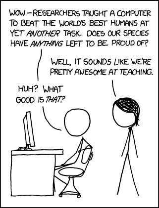

# Currated syllabi

Those who follow me on twitter already know about my new curated course syllabi page, but here’s an announcement for the RSS crowd (I’m looking at you, [Elijah](https://dhs.stanford.edu/author/emeeks/)). Basically, there are a bunch of DH courses out there (and great lists of syllabi at [CUNY](http://commons.gc.cuny.edu/wiki/index.php/DH_Syllabi), the [DH Working Group on Zotero](https://www.zotero.org/groups/digital_humanities/items/collectionKey/SB4WENVI), and the [DH Education Group on Zotero](https://www.zotero.org/groups/digital_humanities_education/items/collectionKey/MXXEMX7P)), but I know of no resource that specifically focuses on the computational / algorithmic / quantitative humanities syllabi, so I decided to put one together. You can find it [here](http://www.scottbot.net/HIAL/?page_id=21794), as well as in the pages menu up top, at this point including 19 courses taught over 24 semesters, and I welcome suggestions of more.

<!-- page 2 -->

via [xkcd](http://xkcd.com/894/)
