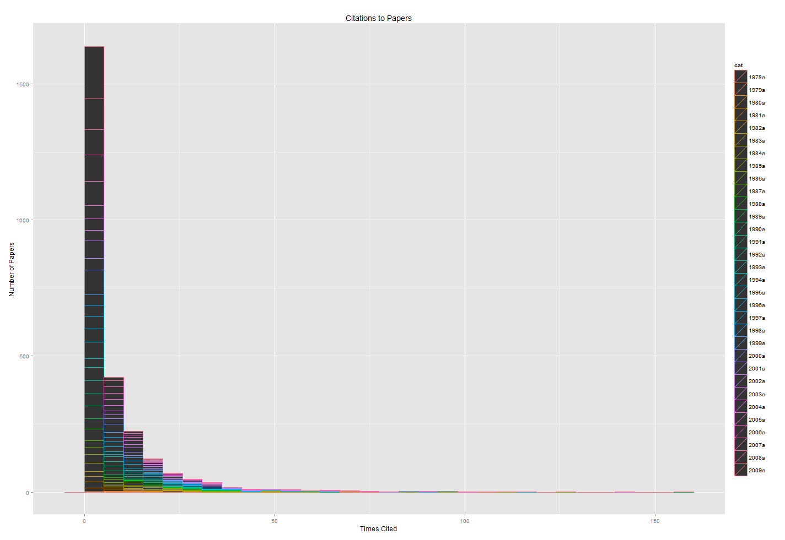
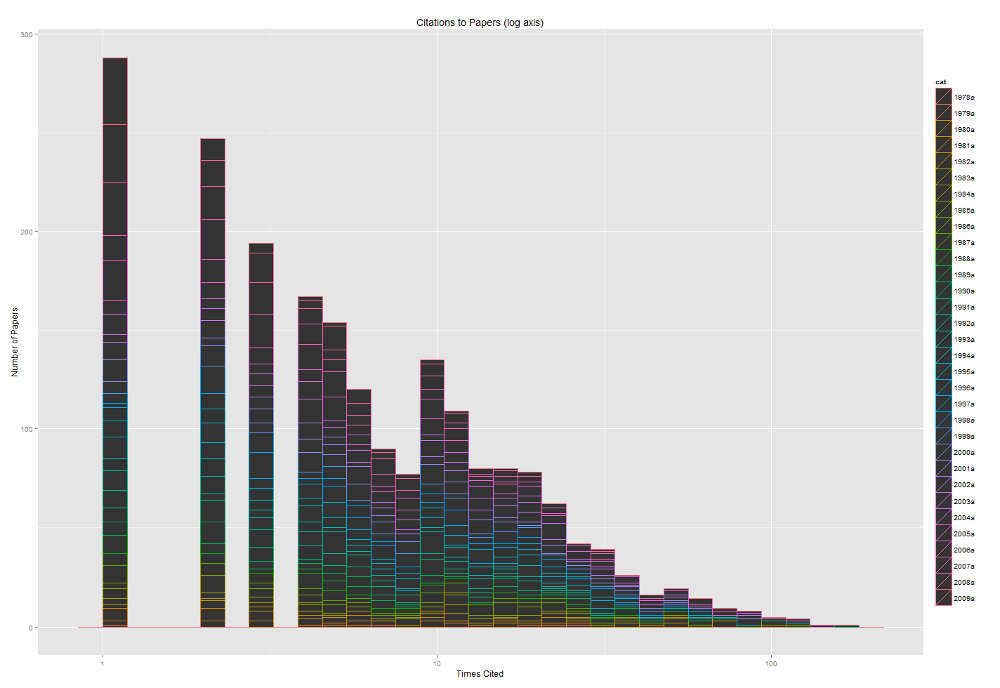
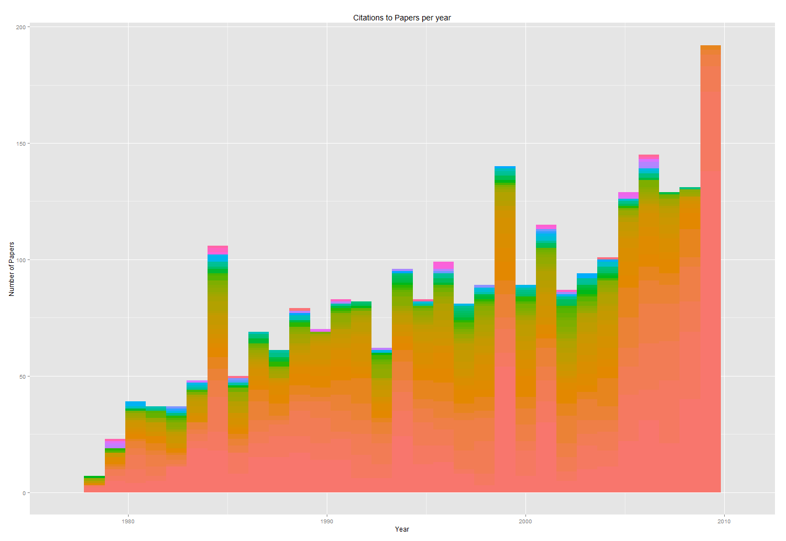
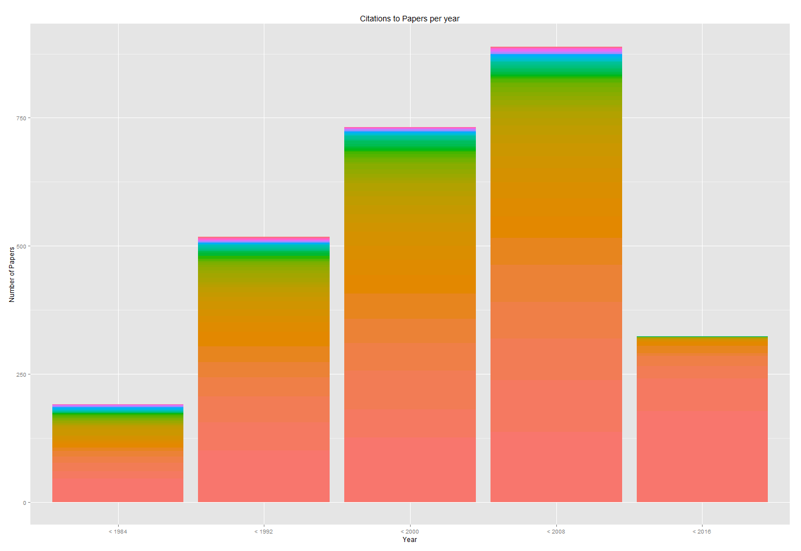
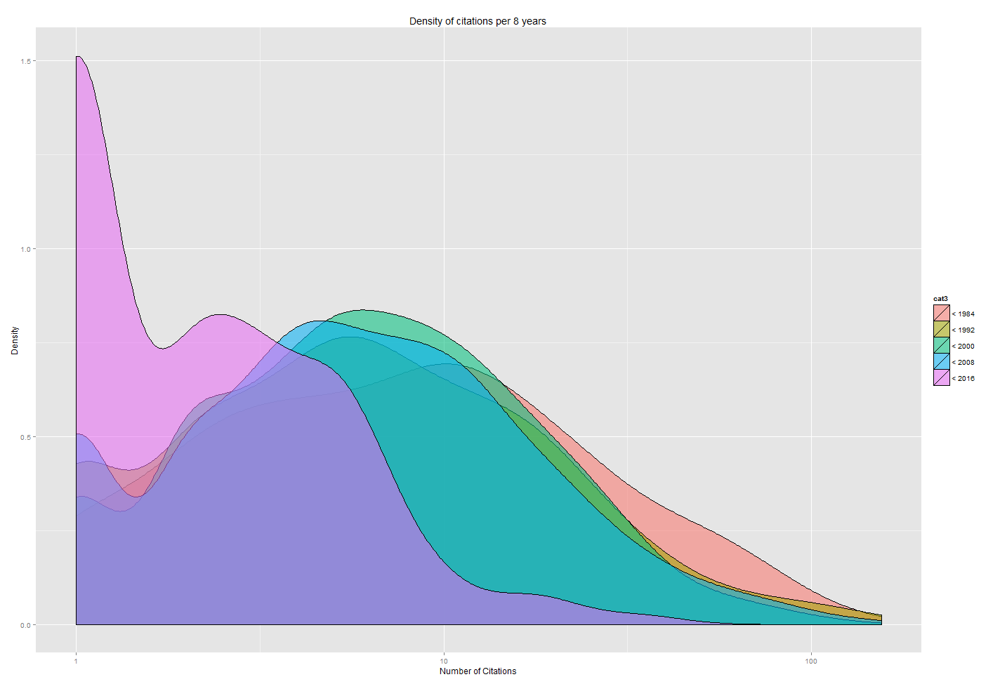

# How many citations does a paper have to get before it's significantly above baseline impact for the field?

> How many citations does a paper have to get before it’s significantly above baseline impact for the field? Can anyone answer this basic Q?
>
> — mrgunn (@mrgunn) [September 20, 2012](https://twitter.com/mrgunn/status/248622367482454017)

[Note: This blog post was originally hidden because it's not aimed at my usual audience. I decided to open it up because, hey, I guess it's okay for all you humanists and data scientists to know that one of the other hats I wear is that of an [informetrician](http://en.wikipedia.org/wiki/Informetrics). Another reason I kept it hidden is because I'm pretty scared of how people use citation impact ratings to evaluate research for things like funding and tenure, often at the expense of other methods that ought be used when human livelihoods are at stake. So please don't do that.]

It depends on the field, and field is defined pretty loosely. This post is in response to a twitter conversation between mrgunn, myself, and some others. mrgunn thinks citation data ought to be freely available, and I agree with him, although I believe data is difficult enough to gather and maintain that a service charge for access is fair, if a clever free alternative is lacking. I’d love to make a clever free alternative ([CiteSeerX](http://citeseerx.ist.psu.edu/index) already is getting there), but the best data still comes from expensive sources like ISI’s Web of Science or Scopus.

At any rate, the question is an empirical one, and one that lots of scientometricians have answered in a number of ways. I’m going to perform my own SSA (Super-Stupid Analysis) here, and I won’t bother taking statistical regression models or Bayesian inferences into account, because you can get a pretty good sense of “impact” (if you take citations to be a good proxy for impact, which is debatable – I won’t even get into using citations as a proxy for quality) using some fairly simple statistics. For the mathy and interested, a forthcoming paper by Evans, Hopkins, and Kaube treats the subject more seriously in [Universality of Performance Indicators based on Citation and Reference Counts](http://theory.ic.ac.uk/~time/bibliometrics/iccitations.pdf).

I decided to use the field of Scientometrics, because it’s fairly self-contained (and I love being meta), and I drew my data from ISI’s Web of Science. I retrieved all articles published in the journal *Scientometrics* up until 2009, which is a nicely representative sample of the field, and then counted the number of citations to each article in a given year. Keep in mind that if you’re wondering how much your *Scientometrics* paper stood out above its peers in citations with this chart, you have to use ISI’s citation count to your paper, otherwise you’re comparing apples to something else that isn’t apples.

<!-- page 1 -->

*Figure 1. Histogram of citations to papers, with the height of each bar representing the number of papers cited x times. The colors break down the bars by year. (Click to enlarge)*

<!-- page 2 -->

*Figure 2. Same as Figure 1, but with the x axis on a log scale.*

According to Figure 1 and Figure 2 (Fig. 2 is the same as Fig. 1 but with the *x* axis on a log scale to make the data a bit easier to read), it’s immediately clear that citations aren’t normally distributed. This tells us right away that some basic statistics simply won’t tell us much with regards to this data. For example, if we take the average number of citations per paper, by adding up each paper’s citation count and dividing it by the total number of papers, we get **7.8 citations per paper**. However, because the data are so skewed to one side, over 70% of the papers in the set fall below that average (that is, 70% of papers are cited fewer than 7 times). In this case, a slightly better measurement would be the median, which is 4. That is, **about half the papers have fewer than four citations**. About a fifth of the papers have no citations at all.

If we look at the colors of Figure 1, which breaks down each bar by year, we can see that the data aren’t really evenly distributed by years, either. Figure 3 breaks this down a bit better.

*Figure 3. Number of papers to articles in the journal Scientometrics, colored by number of citations each received.*

<!-- page 3 -->

In Figure 3, you can see the amount of papers published in a given year, and the colors represent how many citations each paper got that year, with the red end of the spectrum showing papers cited very little, and the violet end of the spectrum showing highly cited papers. Immediately we see that the most recent papers don’t have many highly cited articles, so the first thing we should do is normalize by year. That is, an article published this year shouldn’t be placed against the same standards as an article that’s had twenty years to slowly accrue citations.

To make these data a bit easier to deal with, I’ve sliced the set into 8-year chunks. There are smarter ways to do this, but like I said, we’re keeping the analysis simple for the sake of presentation. Figure 4 is the same as Figure 3, but separated out into the appropriate time slices.

*Figure 4. Same as figure 3, but separated into 8 year time slices.*

Now, to get back to the original question, mrgunn asked how many citations a paper needs to be above the fold. Intuitively, we’d probably call a paper highly impactful if it’s in the blue or violet sections of its time slice (sorry for those of you who are colorblind, I just mean the small top-most area). There’s another way to look at these data that’ll make it a bit easier to eyeball how much more citations a paper’s received than its peers; a density graph. Figure 5 shows just that.

<!-- page 4 -->

*Figure 5. Each color blob represents a time slice, with the height at any given point representing the proportion of papers in that chunk of time which have x citations. The x axis is on a log scale.*

Looking at Figure 5, it’s easy to see that a paper published before 2008 with fewer than half a dozen citations is clearly below the norm. If the paper were published after 2008, it could be above the norm even if it had only a small handful of citations. A hundred citations is clearly “highly impactful” regardless of the year the paper was published. To get a better sense of papers that are above the baseline, we can take a look at the actual numbers.

The table below (excuse the crappy formatting, I’ve never tried to embed a big table in WP before) shows the percent of papers which have *x* citations *or fewer* in a given time slice. That is, 24% of papers published before 1984 have no citations to them, 31% of papers published before 1984 have 0 or 1 citations to them, 40% of papers published before 1984 have 0, 1, or 2 citations to them, and so forth. That means if you published a paper in *Scientometrics*  in 1999 and ISI’s Web of Science says you’ve received 15 citations, it means your paper has received more citations than 80% of the other papers published between 1992 and 2000.

[table id=2 /]

The conversation also brought up the point of whether this should be a clear binary at the ends of the spectrum (paper *A* is low impact because it received only a handful of citations, paper *B* is high impact because it received 150, but we can’t really tell anything in between), or whether we could get a more nuanced few of the spectrum. A combined qualitative/quantitative analysis would be required for a really *good* answer to that question, but looking at the numbers in the table above, we can see pretty quickly that while 1 citation is pretty different from 2 citations, 38 citations is pretty much the same as 39. That is, the “jitter” of precision probably increases exponentially the more citations you’ve received, such that with very few citations the “impact” precision is quite high, and that precision gets exponentially lower the more citations you’ve received.

<!-- page 5 -->

All this being said, I do agree with mrgunn that a free and easy to use resource for this sort of analysis would be good. However, because citations often don’t equate to quality, I’d be afraid this tool would just make it easier and more likely for people to make sweeping and inaccurate quality measurements for the purpose of individual evaluations.

<!-- page 6 -->
