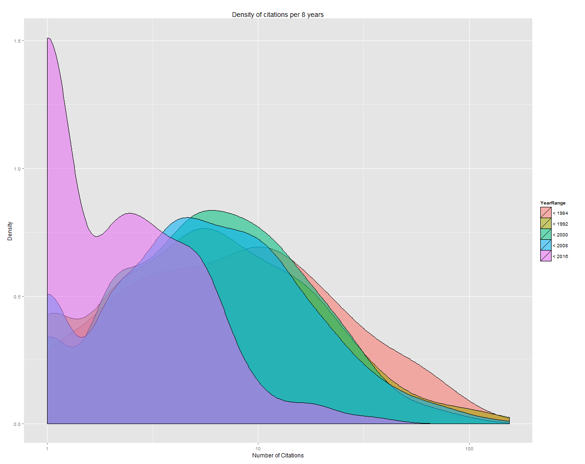

# Making pretty things with R and ggplot2

This isn’t going to be a long tutorial. I’ve just had three people asking how I made the pretty graphs on my last post about [counting citations](http://www.scottbot.net/HIAL/index.html@p=22108.html), and I’m almost ashamed to admit how easy it was. Somebody with no experience coding can (I hope) follow these steps and make themselves a pretty picture with the data provided, and understand how it was created.

```r
library(ggplot2)
sci=read.csv("scicites.csv")
qplot(Cited, data = sci, geom="density", fill=YearRange, log="x", xlab="Number of Citations",
```

That’s the whole program. Oh, also this table, saved as a csv:

[table id=3 /]

And that was everything I used to produce this graph:

[](http://www.scottbot.net/HIAL/wp-content/uploads/2012/09/density.png)

<!-- page 1 -->

Density graph made with R.

## Quick Walkthrough

### Installation

The first thing you need to make this yourself is the programming language R (an awesome language for statistical analysis) installed on your machine, which you can get [here](http://www.r-project.org/). Download it and install it; it’s okay, Ill wait. Now, R by itself is not fun to code in, so my favorite program to use when writing R code is called [RStudio](http://rstudio.org/), so go install that too. Now you’re going to have to install the visualization package, which is called [ggplot2](http://ggplot2.org/). You do this from within RStudio itself, so open up the newly installed program. If you’re running Windows Vista or 7, don’t open it up the usual way; right click on the icon and click ‘Run as administrator’ – you need to do this so it’ll actually let you install the package. Once you’ve opened up RStudio, at the bottom of the program there’s a section of your screen labeled ‘Console’, with a blinking text cursor. In the console, type install.packages(“ggplot2”) and hit enter. Congratulations, ggplot2 is now installed.

<!-- page 2 -->

Now download [this R file](http://www.scottbot.net/uploads/scientometrics.R) (‘Save as’) that I showed you before and open it in RStudio (‘File -&gt; Open File’). It should look a lot like that code at the beginning of the post. Now go ahead and [download the](http://www.scottbot.net/HIAL/wp-content/uploads/2012/09/scicites.csv) csv shown above as well, and be sure to put it in the same directory[^1] you put the R code. Once you’ve done that, in RStudio click ‘Tools -&gt; Set Working Directory -&gt; To Source File Location’), which will help R figure out where the csv is that you just downloaded.

Before I go on explaining what each line of the code does, run it and see what happens! Near the top of your code on the right side, there should be a list of buttons, on the left one that says ‘Run’ and on the right one that says ‘Source’. Click the button that says ‘**Source**‘. Voila, a pretty picture!

### Code

Now to go through the code itself, we’ll start with line 1. library(ggplot2) just means that that we’re going to be using ggplot2 to make the visualization, and lets R know to look for it when it’s about to put out the graphics.

Line 2 is fairly short as well, sci=read.csv(“scicites.csv”), and it creates a new variable called sci which contains the entire csv file you downloaded earlier. read.csv(“scicites.csv”) is a command that tells R to read the csv file in the parentheses, and setting the variable sci as equal to that read file just saves it.

Line 3 is where the magic happens.

```r
qplot(Cited, data = sci, geom="density", fill=YearRange, log="x", xlab="Number of Citations",
```

The entire line is surrounded by the parenthetical command qplot() which is just our way of telling R “hey, plot this bit in here!” The first thing inside the parentheses is Cited, which you might recall was one of the columns in the CSV file. This is telling qplot() what column of data it’s going to be plotting, in this case, the number of citations that papers have received. Then, we tell qplot() where that data is coming from with the command data = sci, which sets what table the data column is coming from. After that geom=”density” appears. geom is short for ‘Geometric Object’ and it sets what the graph will look like. In this case we’re making a density graph, so we give it “density”, but we could just as easily have used something like “histogram” or “line”.

<!-- page 3 -->

The next bit is fill=YearRange, which you might recall was another column in the csv. This is a way of breaking the data we’re using into categories; in this case, the data are categorized by which year range they fall into. fill is one way of categorizing the data by filling in the density blobs with automatically assigned colors; another way would be to replace fill with color. Try it and see what happens. After the next comma is log=”x”, which puts the *x*-axis on a [log scale](http://en.wikipedia.org/wiki/Logarithmic_scale), making the graph a bit easier to read. Take a look at what the graph looks like if you delete that part of it.

Now we have a big chunk of code devoted to labels. xlab=”Number of Citations”, ylab=”Density”, main=”Density of citations per 8 years”. As can probably be surmised, xlab corresponds to the label on the *x*-axis, ylab corresponds to the label on the *y*-axis, and main corresponds to the title of the graph. The very last part, before the closing parentheses, is alpha=I(.5). alpha sets the transparency of the basic graph elements, which is why the colored density blobs all look a little bit transparent. I set their transparency to .5 so they’d each still be visible behind the others. You can set the value between 0 and 1, with the former being completely transparent and the latter being completely opaque.

There you have it, easy-peasy. Play around with the csv, try adding your own data, and take a look at [this chapter](http://ggplot2.org/book/qplot.pdf) from “ggplot2: Elegant Graphics for Data Analysis” to see what other options are available to you.

[^1]: thanks Andy for the correction!

---

## Reader Comments

<!-- page 4 -->

> [**David**](http://guy/), October 27, 2012
>
> Are you available for statistical programming in R? Thanks

> [**andypryke**](http://andypryke.wordpress.com/), April 28, 2013
>
> Nice article for novices. One tiny error, you wrote “download the csv shown above as well, and be sure to put it in the same file you put the R code.” This should of course read folder or directory, not file.

> **Zach Shearer**, June 19, 2015
>
> Thanks for the nice walk-through. I’m just getting started with R and until now the graphics for graphs and charts have been pretty darn ugly.

<!-- page 5 -->

<!-- page 6 -->
