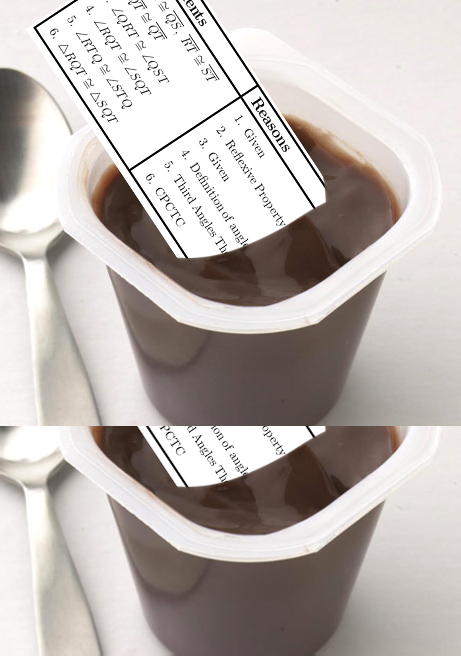
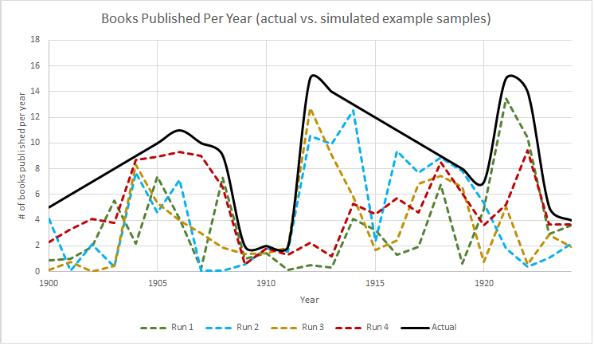
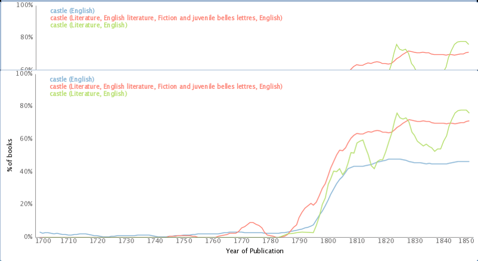

# Liveblogged Review of Macroanalysis by Matthew L. Jockers, Part 2

I just got Matthew L. Jocker’s *Macroanalysis* in the mail, and I’m excited enough about it to liveblog my review. Here’s the review of part II (Analysis), chapter 5 (metadata). Read [Part 1](http://www.scottbot.net/HIAL/?p=34566), Part 3, …

## Part II: Analysis

Part II of *Macroanalysis* moves from framing the discussion to presenting a series of case studies around a theme, starting fairly simply in claims and types of analyses and moving into the complex. This section takes up 130 of the 200 pages; in a discipline (or whatever DH is) which has coasted too long on claims that the proof of its utility will be in the pudding (eventually), it’s refreshing to see a book that is at least 65% pudding. That said, with so much substance – particularly with so much *new* substance – Jockers opens his arguments up for specific critiques.

<!-- page 2 -->

Aiming for more pudding-based scholarly capital in DH. via brenthor.

Quantitative arguments must by their nature be particularly explicit, without the circuitous language humanists might use to sidestep critiques. Elijah Meeks and others have been arguing for some time now that the requirement to solidify an argument in such a way will ultimately be a benefit to the humanities, allowing faster iteration and improvement on theories. In that spirit, for this section, I offer my critiques of Jockers’ mathematical arguments not because I think they are poor quality, but because I think they are particularly good, and further fine-tuning can only improve them. The review will now proceed one chapter at a time.

### Metadata

Jockers begins his analysis exploring what he calls the “lowest hanging fruit of literary history.” Low hanging fruit can be pretty amazing, as [Ted Underwood says](http://tedunderwood.com/2013/02/20/wordcounts-are-amazing/), and Jockers wields some fairly simple data in impressive ways. The aim of this chapter is to show that powerful insights can be achieved using long-existing collections of library metadata, using a collection of nearly 800 Irish American works over 250 years as a sample dataset for analysis. Jockers introduces and offsets his results against the work of Charles Fanning, whom he describes as *the* expert in Irish American fiction in aggregate. A pre-DH scholar, Fanning was limited to looking through only the books he had time to read; an impressive many, according to Jockers, but perhaps not *enough*. He profiles 300 works, fewer than half of those represented in Jockers’ database.

<!-- page 3 -->

The first claim made in this chapter is one that argues against a primary assumption of Fanning’s. Fanning expends considerable effort explaining why there was a dearth of Irish American literature between 1900-1930; Jockers’ data show this dearth barely existed. Instead, the data suggest, it was only eastern Irish men who had stopped writing. The vacuum did not exist west of the Mississippi, among men or women. Five charts are shown as evidence, one of books published over time, and the other four breaking publication down by gender and location.

Jockers is careful many times to make the point that, with so few data, the results are suggestive rather than conclusive. This, to my mind, is too understated. For the majority of dates in question, the database holds fewer than 6 books per year. When breaking down by gender and location, that number is twice cut in half. Though the explanations of the effects in the graphs are plausible, the likelihood of noise outweighing signal at this granularity is a bit too high to be able to distinguish a just-so story from a credible explanation. Had the data been aggregated in five- or ten-year intervals (as they are in a later figure 5.6), rather than simply averaged across them, the results may have been more credible. The argument may be brought up that, when aggregating across larger intervals, the question of where to break up the data becomes important; however, cutting the data into yearly chunks from January to December is no more arbitrary than cutting them into decades.

There are at least two confounding factors one needs to take into account when doing a temporal analysis like this. The first is that *what actually happened in history* may be causally contingent, which is to say, there’s no particularly useful causal explanation or historical narrative for a trend. It’s just accidental; the right authors were in the right place at the right time, and all happened to publish books in the same year. Generally speaking, if only around five books are published a year, though sometimes that number is zero and sometimes than number is ten, any trends that we see (say, five years with only a book or two) may credibly be considered due to chance alone, rather than some underlying effect of gender or culture bias.

<!-- page 4 -->

The second confound is the representativeness of the data sample to some underlying ground truth. Datasets are not necessarily representative of anything, however as defined by Jockers, his dataset *ought to be* representative of *all* Irish American literature within a 250 year timespan. That’s his gold standard. The dataset obviously does not represent all books published under this criteria, so the question is how well do his publication numbers match up with the actual numbers he’s interested in. Jockers is in a bit of luck here, because what he’s interested in is whether or not there was a resounding silence among Irish authors; thus, no matter what number his charts show, if they’re more than one or two, it’s enough to disprove Fanning’s hypothesized silence. Any dearth in his data may be accidental; any large publications numbers are not.

This example chart compares a potential “real” underlying publication rate against several simulated potential sample datasets Jockers might have, created by multiplying the “real” dataset by some random number between 0 and 1.

I created the above graphic to better explain the second confounding factor of problematic samples. The thick black line, we can pretend, is the *actual number of books published* by Irish American authors between 1900 and 1925. As mentioned, Jockers would only know about a subset of those books, so each of the four dotted lines represents a possible dataset that he could be looking at in his database instead of the real, underlying data. I created these four different dotted lines by just multiplying the underlying real data by a random number between 0 and 1[^1]. From this chart it should be clear that it would not be possible for him to report an influx of books when there was a dearth (for example, in 1910, no potential sample dataset would show more than two books published). However, if Jockers wanted to make any other claims besides whether or not there was a dearth (as he tentatively does later on), his available data may be entirely misleading. For example, looking at the red line, Run 4, would suggest that ever-more books were being published between 1910 and 1918, when in fact that number should have decreased rapidly after about 1912.

<!-- page 5 -->

The correction included in *Macroanalysis* for this potential difficulty was to use 5-year moving averages for the numbers rather than just showing the raw counts. I would suggest that, because the actual numbers are so small and a change of a small handful of books would look like a huge shift on the graph, this method of aggregation is insufficient to represent the uncertainty of the data. Though his charts show moving averages, they still shows small changes year-by-year, which creates a [false sense of precision](http://en.wikipedia.org/wiki/False_precision). Jockers’ chart 5.6, which aggregates by decade and does not show these little changes, does a much better job reflecting the uncertainty. Had the data showed hundreds of books per year, the earlier visualizations would have been more justifiable, as small changes would have amounted to less emphasized shifts in the graph.

It’s worth spending extra time on choices of visual representation, because we have not collectively arrived at a good visual language for humanities data, uncertain as they often are. Nor do we have a set of standard practices in place, as quantitative scientists often do, to represent our data. That lack of standard practice is clear in *Macroanalysis*; the graphs all have subtitles but no titles, which makes immediate reading difficult. Similarly, axis labels (“count” or “5-year average”) are unclear, and should more accurately reflect the data (“books published per year”), putting the aggregation-level in either an axis subtitle or the legend. Some graphs have no axis labels at all (e.g., 5.12-5.17). Their meanings are clear enough to those who read the text, or those familiar with ngram-style analyses, but should be more clear at-aglance.

<!-- page 6 -->

Questions of visual representation and certainty aside, Jockers still provides several powerful observations and insights in this chapter. Figure 5.6, which shows Irish American fiction per capita, reveals that westerners published at a much higher relative rate than easterners, which is a trend worth explaining (and Jockers does) that would not have been visible without this sort of quantitative analysis. The chapter goes on to list many other credible assessments and claims in light of the available data, as well as a litany of potential further questions that might be explored with this sort of analysis.  He also makes the important point that, without quantitative analysis, “cherrypicking of evidence in support of a broad hypothesis seems inevitable in the close-reading scholarly traditions.” Jockers does not go so far as to point out the extension of that rule in data analysis; with so many visible correlations in a quantitative study, one could also cherry-pick those which support one’s hypothesis. That said, cherry-picking no longer seems *inevitable*. Jockers makes the point that Fanning’s dearth thesis was false because his study was anecdotal, an issue Jockers’ dataset did not suffer from. Quantitative evidence, he claims, is not in competition with evidence from close reading; both together will result in a “more accurate picture of our subject.”

The second half of the chapter moves from publication counting to word analysis. Jockers shows, for example, that eastern authors are less likely to use words in book titles that identify their work as ‘Irish’ than western authors, suggesting lower prejudicial pressures west of the Mississippi may be the cause. He then complexifies the analysis further, looking at “lexical diversity” across titles in any given year – that is, a year is more lexically diverse if the titles of books published that year are more unique and dissimilar from one another. Fanning suggests the years of the famine were marked by a lack of imagination in Irish literature; Jockers’ data supports this claim by showing those years had a lower lexical diversity among book titles. Without getting too much into the math, as this review of a single chapter has already gone on too long, it’s worth pointing out that both the number of titles and the average length of titles in a given year can affect the lexical diversity metric. Jockers points this out in a footnote, but there should have been a graph comparing number of titles per year, length per year, and lexical diversity, to let the readers decide whether the first two variables accounted for the third, or whether to trust the graph as evidence for Fanning’s lack-of-imagination thesis.

<!-- page 7 -->

One of the particularly fantastic qualities about this sort of research is that readers can follow along at home, exploring on their own if they get some idea from what was brought up in the text. For example, Jockers shows that the word ‘century’ in British novel titles is popular leading up to and shortly after the turn of the nineteenth century. Oddly, in the larger corpus of literature (and it seems English language books in general), we can use bookworm.culturomics.org to see that, rather than losing steam around 1830, [use of ‘century’ in most novel titles actually increases until about 1860, before dipping briefly](http://bookworm.culturomics.org/#?%7B%22time_limits%22%3A%5B1809%2C1922%5D%2C%22search_limits%22%3A%5B%7B%22word%22%3A%5B%22century%22%5D%2C%22aLanguage%22%3A%5B%22eng%22%5D%7D%2C%7B%22word%22%3A%5B%22century%22%5D%2C%22lc1%22%3A%5B%22PN%22%2C%22PR%22%2C%22PZ%22%5D%2C%22aLanguage%22%3A%5B%22eng%22%5D%7D%2C%7B%22word%22%3A%5B%22century%22%5D%2C%22lc1%22%3A%5B%22PN%22%5D%2C%22aLanguage%22%3A%5B%22eng%22%5D%7D%5D%7D). Moving past titles (and fiction in general) to full text search, google ngrams shows us a [small dip around 1810 followed by continued growth](http://books.google.com/ngrams/graph?content=century&year_start=1800&year_end=1900&corpus=15&smoothing=3&share=) of the word ‘century’ in the full text of published books. These different patterns are interesting particularly because they suggest there was something unique about the British novelists’ use of the word ‘century’ that is worth explaining. Oppose this with Jockers’ chart of the word ‘castle’ in British book titles, whose trends actually correspond quite well to the [bookworm trend](http://bookworm.culturomics.org/#?%7B%22time_limits%22%3A%5B1700%2C1850%5D%2C%22search_limits%22%3A%5B%7B%22word%22%3A%5B%22castle%22%5D%2C%22aLanguage%22%3A%5B%22eng%22%5D%7D%2C%7B%22word%22%3A%5B%22castle%22%5D%2C%22lc1%22%3A%5B%22PN%22%2C%22PR%22%2C%22PZ%22%5D%2C%22aLanguage%22%3A%5B%22eng%22%5D%7D%2C%7B%22word%22%3A%5B%22castle%22%5D%2C%22lc1%22%3A%5B%22PN%22%5D%2C%22aLanguage%22%3A%5B%22eng%22%5D%7D%5D%7D) until the end of the chart, around 1830. [*edit: Ben Schmidt points out in the comments that bookworm searches full text, not just metadata as I assumed, so this comparison is much less credible.*]

<!-- page 8 -->

Use of the word ‘castle’ in the metadata of books provided by OpenLibrary.org. Compare with figure 5.14. via bookworm.

Jockers closes the chapter suggesting that factors including gender, geography, and time help determine what authors write about. That this idea is trivial makes it no less powerful within the context of this book: the chapter is framed by the hypothesis that certain factors influence Irish American literature, and then uses quantitative, empirical evidence to support those claims. It was oddly satisfying reading such a straight-forward approach in the humanities. It’s possible, I suppose, to quibble over whether geography determines what’s written about or whether the sort of person who would write about certain things is also the sort of person more likely to go west, but there can be little doubt over the causal direction of the influence of gender. The idea also fits well with the current complex systems approach to understanding the world, which mathematically suggests that environmental and situational constraints (like gender and location) will steer the unfolding of events in one direction or another. It is not a reductionist environmental determinism so much as a set of probabilities, where certain environments or situations make certain outcomes more likely.

Stay tuned for Part the Third!

Notes:

[^1]: If this were a more serious study, I’d have multiplied by a more credible pseudo-random value keeping the dataset a bit closer to the source, but this example works fine for explanatory value

---

<!-- page 9 -->

## Reader Comments

> **Ben Schmidt**, April 15, 2013
>
> Enjoying the series.
>
> Just wanted to point out that the Bookworm database uses the full-text of all those books, not just titles–approximately the same size as the Ngrams corpus over the same period (1800-1922). So the charts are more comparable to Ngrams than to book title studies.

>> **Scott Weingart**, April 15, 2013
>>
>> Oops! It appears I’ve been using bookworm wrong this whole time. For some reason I’d thought it was searching the metadataset, rather than just using it as selection criteria – thanks for clearing that up, Ben.

<!-- page 10 -->
