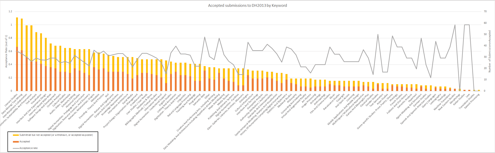
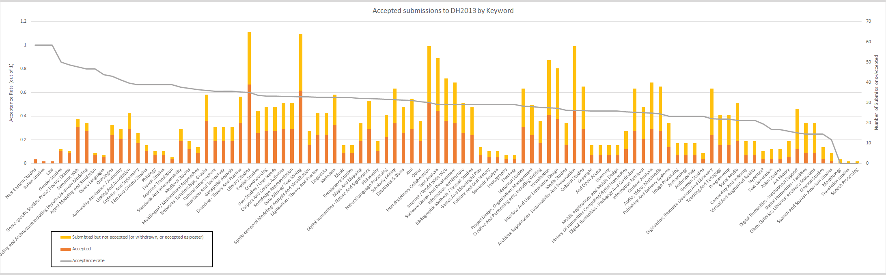
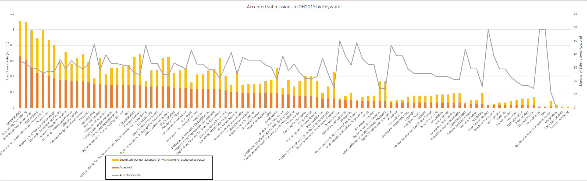

# Acceptances to Digital Humanities 2013 (part 1)

The 2013 Digital Humanities conference in Nebraska just released its [program](http://dh2013.unl.edu/schedule-and-events/program/) with a list of papers and participants. As some readers may recall, when the initial round of reviews went out for the conference, I tried my hand at [analyzing submissions to DH2013](http://www.scottbot.net/HIAL/?p=24437). Now that the schedule has been released, the data available puts us in a unique position to compare proposed against accepted submissions, thus potentially revealing how what research is *being done* compares with what research the DH community (through reviews) finds *good* or *interesting*. In my last post, I [showed](http://www.scottbot.net/HIAL/wp-content/uploads/2012/11/TopicCounts.png) that literary studies and data/text mining submissions were at the top of the list; only half as many studies were historical rather than literary. Archive work and visualizations were also near the top of the list, above multimedia, web, and content analyses, though each of those were high as well. A [keyword analysis showed](http://www.scottbot.net/HIAL/wp-content/uploads/2012/11/dhkeywords.png) that while Visualization wasn’t necessarily at the top of the list, it was the most central concept connecting the rest of the conference together. Nobody knows (and few care) what DH really means; however, these analyses present the factors that bind together those who call themselves digital humanists and submit to its main conference. The post below explores to what extent submissions and acceptances align. I preserve anonymity wherever possible, as submitting authors did not do so with the expectation that turned down submission data would be public.

It’s worth starting out with a few basic acceptance summary statistics. As I don’t have [access to poster data](https://twitter.com/nowviskie/status/326452523932205056) yet, nor do I have [access to withdrawals](https://twitter.com/nowviskie/status/326452125125181441), I can’t calculate the full acceptance rate, but there are a few numbers worth mentioning. Just take all of the percentages as a lower bounds, where withdrawals or posters might make the acceptance rate higher. Of the 144 long papers submitted, 66.6% of them (96) were accepted, although only 57.6% (83) were accepted as long papers; another 13 were accepted as short papers instead. Half of the submitted panels were accepted, although curiously, one of the panels was accepted instead as a long paper. For short papers, only 55.9% of those submitted were accepted. There were 66 poster submissions, but I do not know how many of those were accepted, or how many other submissions were accepted as posters instead. In all, excluding posters, 60.9% of submitted proposals were accepted. More long papers than short papers were submitted, but roughly equal numbers of both were accepted. People who were turned down should feel comforted by the fact that they faced some stiff competition.

As with most quantitative analyses, the interesting bits come more when comparing internal data than when looking at everything in aggregate. The first three graphs do just that, and are in fact the same data, but ordered differently. When authors submitted their papers to the conference, they could pick any number of keywords from a controlled vocabulary. Looking at how many times each keyword was submitted with a paper (Figure 1) can give us a basic sense of what people are doing in the digital humanities. From Figure 1 we see (again, as a version of this viz appeared in the last post) that “Literary Studies” and “Text Mining” are the most popular keywords among those who submitted to DH2013; the rest you can see for yourself. The total height of the bar (red + yellow) represents the number of total submissions to the conference.

<!-- page 1 -->

*Figure 1: Acceptance rates of DH2013 by Keywords attached to submissions, sorted by number of submissions. (click to enlarge)*

Figure 2 shows the same data as Figure 1, but sorted by acceptance rates rather than the total number of submissions. As before, because we don’t know about poster acceptance rates or withdrawals, you should take these data with a grain of salt, but assuming a fairly uniform withdrawal/poster rate, we can still make some basic observations. It’s also worth pointing out that the fewer overall submissions to the conference with a certain keyword, the less statistically meaningful the acceptance rate; with only one submission, whether or not it’s accepted could as much be due to chance as due to some trend in the minds of DH reviewers.

With those caveats in mind, Figure 2 can be explored. One thing that immediately pops out is that “Literary Studies” and “Text Mining” both have higher than average acceptance rates, suggesting that not only are a lot of DHers *doing* that kind of research; that kind of research is still interesting enough that a large portion of it is getting accepted, as well. Contrast this with the topic of “Visualization,” whose acceptance rate is closer to 40%, significantly fewer than the average acceptance rate of 60%. Perhaps this means that most reviewers thought visualizations worked better as posters, the data for which we do not have, or perhaps it means that the relatively low barrier to entry on visualizations and their ensuing proliferation make them more fun to do than interesting to read or review.

“Digitisation – Theory and Practice” has a nearly 60% acceptance rate, yet “Digitisation; Resource Creation; and Discovery” has around 40%, suggesting that perhaps reviewers are more interested in discussions *about* digitisation than the actual projects themselves, even though far more ”Digitisation; Resource Creation; and Discovery” papers were submitted than “”Digitisation – Theory and Practice.” The imbalance between what was submitted and what was accepted on that front is particularly telling, and worth a more in-depth exploration by those who are closer to the subject. Also tucked at the bottom of the acceptance rate list are three related keywords “Digital Humanities – Institutional Support, “Digital Humanities – Facilities,” & “Glam: Galleries; Libraries; Archives; Museums,” each with a 25% acceptance rate. It’s clear the reviewers were not nearly as interested in digital humanities infrastructure as they were in digital humanities research. As I’ve noted a few times before, “Historical Studies” is also not well-represented, with both a lower acceptance rate than average and a lower submission rate than average. Modern digital humanities, at least as it is represented by this conference, appears far more literary than historical.

<!-- page 2 -->

*Figure 2. Acceptance rates of DH2013 by Keywords attached to submissions, sorted by number of accepted papers. (click to enlarge)*

Figure 3, once again, has the same data as Figures 2 and 1, but is this time sorted simply by accepted papers and panels. This is the front face of DH2013; the landscape of the conference (and by proxy the discipline) as seen by those attending. While this reorientation of the graph doesn’t show us much we haven’t already seen, it does emphasize the oddly low acceptance rates of infrastructural submissions (facilities, libraries, museums, institutions, etc.) While visualization *acceptance* rates were a bit low, attendees of the conference will still see a great number of them, because the initial submission rate was so high. Conference goers will see that DH maintains a heavy focus on the many aspects of text: its analysis, its preservation, its interfaces, and so forth. The web also appears well-represented, both in the study of it and development on it. Metadata is perhaps not as strong a focus as it once was (historical DH conference analysis would help in confirming this speculation on my part), and reflexivity, while high (nearly 20 “Digital Humanities – Nature and Significance” submissions), is far from overwhelming.

A few dozen papers will be presented on multimedia beyond simple text – a small but not insignificant subgroup. Fewer still are papers on maps, stylometry, or medieval studies, three subgroups I imagine once had greater representation. They currently each show about the same force as gender studies, which had a surprisingly high acceptance rate of 85% and is likely up-and-coming in the DH world. Pedagogy was much better represented in submissions than acceptances, and a newcomer to the field coming to the conference for the first time would be forgiven in thinking pedagogy was less of an important subject in DH than veterans might think it is.

<!-- page 3 -->

*Figure 3. Acceptance rates of DH2013 by Keywords attached to submissions, sorted by acceptance rate. (click to enlarge)*

As what’s written so far is already a giant wall of text, I’ll go ahead and leave it at this for now. When next I have some time I’ll start analyzing some networks of keywords and titles to find which keywords tend to be used together, and whatever other interesting things might pop up. Suggestions and requests, as always, are welcome.

<!-- page 4 -->
