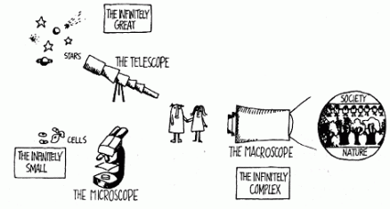

# The Historian’s Macroscope

Whelp, it appears [the cat’s out of the bag](http://electricarchaeology.ca/2013/07/24/themacroscope/). [Shawn Graham](http://electricarchaeology.ca/), [Ian Milligan](http://ianmilligan.ca/), and I have signed our [ICP](http://www.icpress.co.uk/) contract and will shortly begin the process of writing [The Historian’s Macroscope](http://www.themacroscope.org/), a book introducing the process and rationale of digital history to a broad audience. The book will be a further experiment in live-writing: as we have drafts of the text, they will go online immediately for comments and feedback. The publishers have graciously agreed to allow us to keep the live-written portion online after the book goes on sale, and though what remains online will not be the final copy-edited and typeset version, we (both authors and publishers) feel this is a good compromise to prevent the cannibalization of book sales while still keeping much of the <!-- page 2 --> content open and available for those who cannot afford the book or are looking for a taste before they purchase it. Thankfully, this plan also fits well with my [various pledges to help make a more open scholarly world](http://www.scottbot.net/HIAL/?page_id=3086).

Microscope / Telescope / Macroscope \[via [The Macroscope](http://pespmc1.vub.ac.be/macroscope/default.html) by Joël de Rosnay\]

We’re announcing the project several months earlier than we’d initially intended. In light of the [American Historical Association’s recent statement](http://blog.historians.org/2013/07/american-historical-association-statement-on-policies-regarding-the-embargoing-of-completed-history-phd-dissertations/) endorsing the six year embargo of dissertations on the unsupported claim that it will help career development, we wanted to share our own story to offset the AHA’s narrative. Shawn, Ian, and I have already worked together on a successful open access chapter in [The Programming Historian](http://programminghistorian.org/lessons/topic-modeling-and-mallet), and have all worked separately releasing public material on our respective blogs. It was largely because of our open material that we were approached to write this book, and indeed much of the material we’ve already posted online will be integrated into the final publication. It would be an understatement to say our publisher’s liaison Alice jumped at this opportunity to experiment with a semi-open publication.

The disadvantage to announcing so early is that we don’t have any content to tease you with. Stay-tuned, though. By September, we hope to have some preliminary content up, and we’d love to read your thoughts and comments; especially from those not already aligned with the DH world.

<!-- page 3 -->

---

## Reader Comments

> [**Paolo**](http://www.densitydesign.org/), July 28, 2013
>
> Nice to see another interpretation/usage of de Rosnay’s Macroscope as a reference. Here is our version, in the field of data and information visualization: [http://www.densitydesign.org/2011/04/macroscopes-and-visualization-again-a-circular-path/](http://www.densitydesign.org/2011/04/macroscopes-and-visualization-again-a-circular-path/)

>> **Scott Weingart**, July 28, 2013
>>
>> Thank you for the kind words and for pointing me to your post. Although I’m a historian, my phd supervisor is Katy Börner, who as you note has been using the term for some time. The world is always smaller than it seems!

>>> [**Paolo Ciuccarelli (@pciuccarelli)**](http://twitter.com/pciuccarelli), August 11, 2013
>>>
>>> Ah, I see..I’ve to admit I didn’t read carefully your bio…now is done!
>>>
>>> Very interesting! Just as a curiosity, do you know when she (Katy Börner) started using the term macroscope in her work? I couldn’t find evidences in the web before this one: [http://ivl.cns.iu.edu/km/news-slis/2007-borner-macroscope.pdf](http://ivl.cns.iu.edu/km/news-slis/2007-borner-macroscope.pdf)
>>>
>>> I started using it around 2008 ([http://www.densitydesign.org/2008/05/macroscopes/](http://www.densitydesign.org/2008/05/macroscopes/)), when I found this comment written by a designer about the <!-- page 4 -->2006 edition of “Places & Spaces: Mapping Science”: [http://magicalnihilism.com/2006/04/06/a-manhattan-melange-of-macroscopes/](http://magicalnihilism.com/2006/04/06/a-manhattan-melange-of-macroscopes/)
>>>
>>> Looking forward to reading your book!

>>>> **Scott Weingart**, August 11, 2013
>>>>
>>>> I know she’s been using it since at least 2006 (see e.g. [http://ivl.cns.iu.edu/km/pub/2006-borner-scipolicy-helsinki.pdf](http://ivl.cns.iu.edu/km/pub/2006-borner-scipolicy-helsinki.pdf)), but that was well before my time at the CNS. I’ll ask her to see if she remembers.
>>>>
>>>> Thanks for the words of encouragement, I hope it lives up to your expectations!

>>>>> [**Paolo Ciuccarelli (@pciuccarelli)**](http://twitter.com/pciuccarelli), August 12, 2013
>>>>>
>>>>> Thanks, it would be nice to know!
>>>>>
>>>>> BTW given your background and your actual work you might be interested in the EMAPS project (www.emapsproject.com), where we – together with the Medialab at Sciences-Po – are designing diagrams that – as a macroscope should do – make visible the complexity of the relationships between science, society and nature.

<!-- page 5 -->

<!-- page 5 -->
