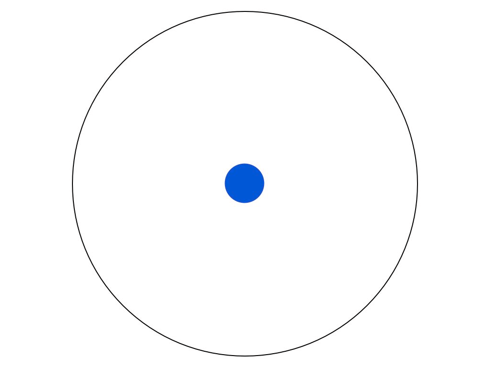
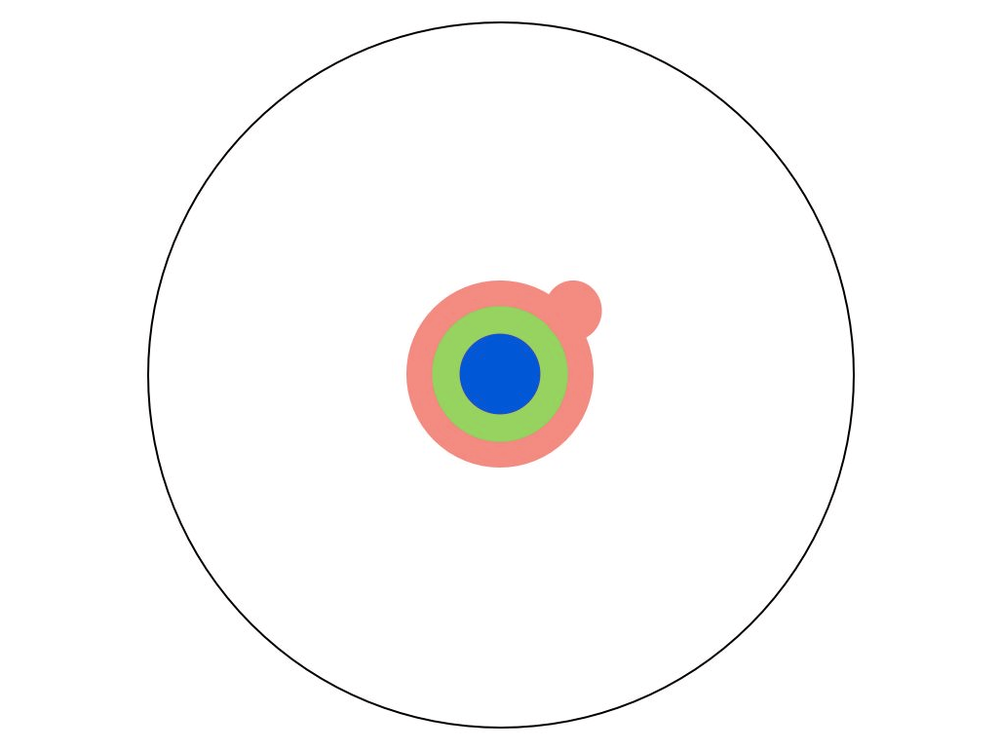
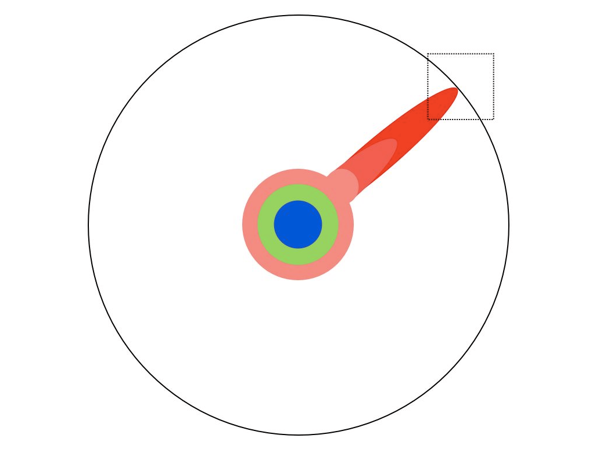
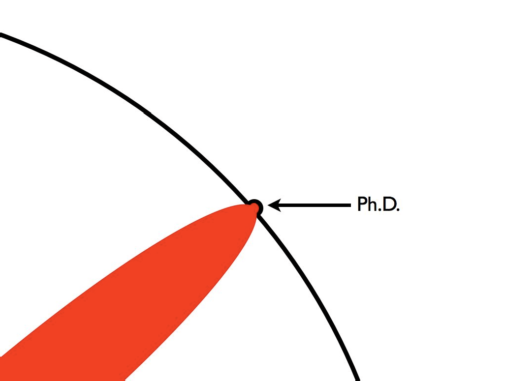
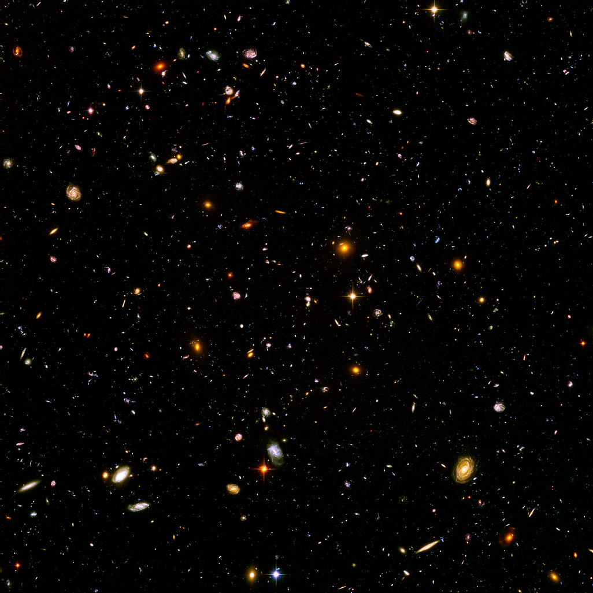
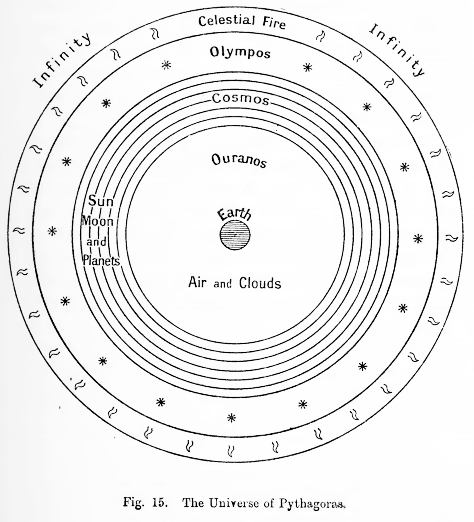
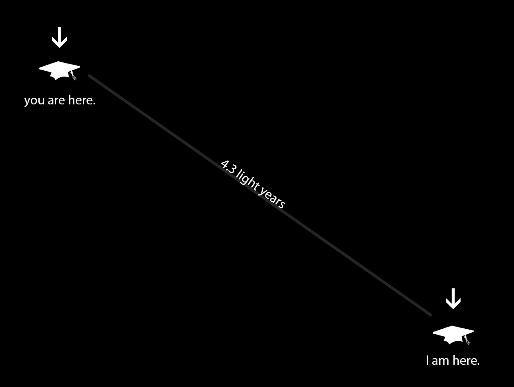
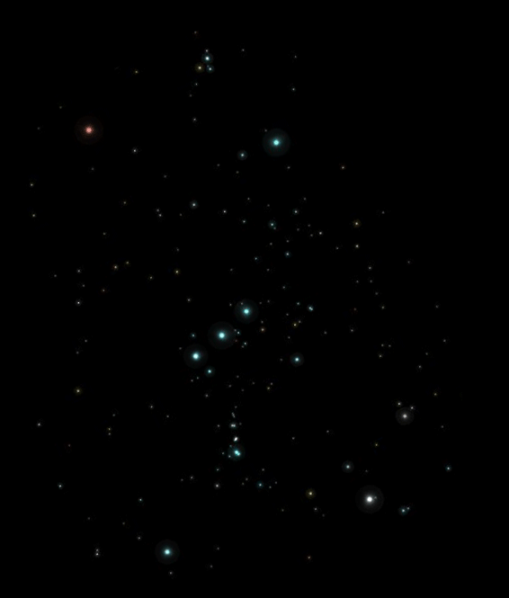
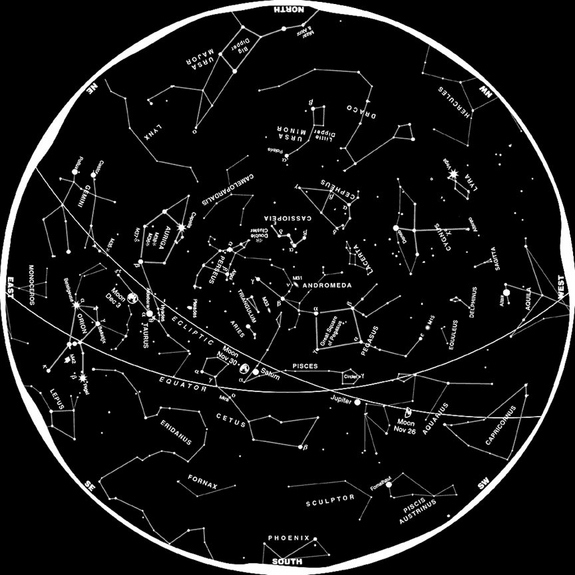

# Breaking the Ph.D. model using pretty pictures

Earlier today, [Heather Froehlich shared](https://twitter.com/heatherfro/status/374826069678772224) what’s at this point become a canonical illustration among Ph.D. students: “[The Illustrated guide to a Ph.D.](http://matt.might.net/articles/phd-school-in-pictures/)” The illustrator, Matt Might, describes the sum of human knowledge as a circle. As a child, you sit at the center of the circle, looking out in all directions.

Eventually, he describes, you get various layers of education, until by the end of your bachelor’s degree you’ve begun focusing on a specialty, focusing knowledge in one direction. <!-- page 2 -->

A master’s degree further deepens your focus, extending you toward an edge, and the process of pursuing a Ph.D., with all the requisite reading, brings you to a tiny portion of the boundary of human knowledge.

You push and push at the boundary until one day you finally poke through, pushing that tiny portion of the circle of knowledge just a wee bit further than it was. That act of pushing through is a Ph.D.

 <!-- page 3 -->

It’s an uplifting way of looking at the Ph.D. process, inspiring that dual feeling of insignificance and importance that staring at the [Hubble Ultra-Deep Field](http://en.wikipedia.org/wiki/Hubble_Ultra-Deep_Field) tends to bring about. It also exemplifies, in my mind, one of the broken aspects of the modern Ph.D. But while we’re on the subject of the Hubble Ultra-Deep Field, let me digress momentarily about stars.

Quite a while before you or I were born, Great Thinkers with Big Beards (I hear even the Great Women had them back then) also suggested we sat at the center of a giant circle, looking outwards. The entire universe, or in those days, the cosmos (Greek: κόσμος, “order”), was a series of perfect layered spheres, with us in the middle, and the stars embedded in the very top. The stars were either gems fixed to the last sphere, or they were little holes poked through it that let the light from heaven shine through. <!-- page 4 -->

As I see it, if we connect the celestial spheres theory to “The Illustrated Guide to a Ph.D.”, we’d arrive at the inescapable conclusion that every star in the sky is another dissertation, another hole poked letting the light of heaven shine through. And yeah, it takes a very prescriptive view of the knowledge and the universe that either you or I can argue with, but for this post we can let it slide because it’s beautiful, isn’t it? If you’re a Ph.D. student, don’t you want to be able to do this?

 <!-- page 5 -->

The problem is I don’t actually want to do this, and I imagine a lot of other people don’t want to do this, because *there are already so many goddamn stars*. Stars are nice. They’re pretty, how they twinkle up there in space, trillions of miles away from one another. That’s how being a Ph.D. student feels sometimes, too: there’s your research, my research, and a gap between us that can reach from Alpha Centauri and back again. Really, just astronomically far away.

It shouldn’t have to be this way. Right now a Ph.D. is about finding or doing something that’s new, in a really deep and narrow way. It’s about pricking the fabric of the spheres to make a new star. In the end, you’ll know more about less than anyone else in the world. But there’s something deeply unsettling about students being trained to ignore the forest for the trees. In an increasingly connected world, the universe of knowledge about it seems to be ever-fracturing. Very few are being trained to stand back a bit and try to find patterns in the stars. To draw constellations.

 <!-- page 6 -->

I should know. I’ve been trying to write a dissertation on something *huge*, and the advice I’ve gotten from almost every professor I’ve encountered is that I’ve got to scale it down. Focus more. I can’t come up with something new about *everything*, so I’ve got to do it about *one thing*, and do it well. And that’s good advice, I know! If a lot of people weren’t doing that a lot of the time, we’d all just be running around in circles and not doing cool things like going to the moon or watching animated pictures of cats on the internet.

But we also need to stand back and take stock, to *connect things*, and right now there are institutional barriers in place making that really difficult. My advisor, who stands back and connects things for a living (like the map of science below), gives me the same prudent advice as everyone else: focus more. It’s practical advice. For all that universities celebrate interdisciplinarity, in the end you still need to get hired by *a department*, and if you don’t fit neatly into their disciplinary niche, you’re not likely to make it.

 <!-- page 7 -->

My request is simple. If you’re responsible for hiring researchers, or promoting them, or in charge of a department or (!) a university, make it easier to be interdisciplinary. Continue hiring people who make new stars, but also welcome the sort of people who want to connect them. There certainly are a lot of stars out there, and it’s getting harder and harder to see what they have in common, and to connect them to what we do every day. New things are great, but connecting old things in new ways is also great. Sometimes we need to think wider, not deeper.

## Reader Comments

<!-- page 8 -->

> **[Mark Branson (@mbranson_1993)](http://twitter.com/mbranson_1993)**, September 3, 2013 at 1:07 pm
>
> If you can be patient (and if you have reached the PhD level, you must have patience) for about 5 years. . .at that point, you can write your own ticket to any college/university you’d like since 10,000 Baby Booomers (such as me) are turning 65 y/a DAILY, 365 days a year, for another 8-10 years. . . at that point, competition is truly dead. . . .

>> **Scott Weingart**, September 3, 2013 at 1:11 pm
>>
>> Thank you for the reply, Mark! Unfortunately, the rate of PhDs granted per year has also been growing, and the job market has been shrinking (being replaced by adjunct positions), so unfortunately I don’t think it’d be quite the smooth ride I’d want it to be…

> **[Matt Burton](http://twitter.com/mcburton)**, September 3, 2013 at 3:26 pm
>
> Scott,
> Thanks for a lovely post that visually represents something I, as a fellow interdisciplinarian, have been thinking about a lot lately. What I like about the idea of “discovering” constellations (and patterns) vs. new stars (or pulsars or green pea galaxies[1]) is it is the focus on finding knowledge within what we already know vs. “discovering” new things. The implicit realization of interdisciplinary knowlege discovery is that the sum total of human knowlege is, as David Weinberger puts it, too big to know[2]. What this meas, imho, isthe hyperspecialization of academia has left us with the classic “if only IBM knew what IBM knows” knowledge management problem. Questions in one discipline (in one department of IBM) may have have answers (or approximate answers) in completely disparate disciplines (departments).
>
> It is funny how iSchools[3], which emerged out of Schools of Library and Information Science, have created a space for interdisciplinary scholars, but I do agree, the departments should do more to hire interdisciplinary scholars. <!-- page 9 -->
>
> Hey Departments! Look to the iSchools for some fresh perspectives!
>
> [1] [http://en.wikipedia.org/wiki/Pea_galaxy](http://en.wikipedia.org/wiki/Pea_galaxy) This is an especially interested example b/c these astronomical object were discovered in the GalaxyZoo user forums by “amatur” not by “professional” astronomers. Implications for WHO is doing the pattern recognition indeed…
>
> [2] [http://www.toobigtoknow.com/](http://www.toobigtoknow.com/) While it is a pop-science book, it is actually a nice articulation of the current crisis of knowing.
>
> [3] [http://ischools.org/](http://ischools.org/) I should caveat that iSchools are only one of many places that have created a safe space for interdisciplinary scholars. They are merely the one I am most familiar with.

> **[Just The Tip | Blog not found. Abort, retry, ignore?](http://fungibility.wordpress.com/2013/09/03/just-the-tip/)**, September 4, 2013 at 12:41 am
>
> […] Breaking the Ph.D. model using pretty pictures | the scottbot irregular. […]

> **[Daniel Allington](http://www.danielallington.net/)**, September 4, 2013 at 4:36 pm
>
> Scott, I feel your pain. But the problem is not straightforward. I’d like to start with your conclusion:
>
> ‘My request is simple. If you’re responsible for hiring researchers, or promoting them, or in charge of a department or (!) a university, make it easier to be interdisciplinary.’
>
> My question is just as simple. If you’re a PhD student (even a very smart PhD student), how can you make the people who just happen to have that responsibility pay any attention whatsoever to your requests? They’re not known for going out of their way to make it easier for junior scholars to do anything at all.
>
> It’s not just those people you’ll need to persuade, by the way. The most prestigious journals, for example, tend to be quite solidly embedded within disciplines, and I’ve heard plenty of complaints (not only within the humanities) about unfair peer review comments for interdisciplinary papers. Then there’s the advice I once received from a publishing consultant, which can be summarised as follows: the audience for an interdisciplinary book consists not of the union of the sets of scholars interested in each of the disciplines touched upon, but of the intersection of those sets. And I don’t know how things work where you are, but if I send an application to the major humanities funder in my country, there are boxes I can tick to indicate interdisciplinarity and multidisciplinarity, but I’ve still got to identify my proposal as belonging to a specific discipline, and its evaluation will be entrusted to a panel of academics chosen for their prominence within it. (I can request the secondary involvement of one further such panel, but that doesn’t solve the basic problem.) <!-- page 10 -->
>
> All this doesn’t stop interdisciplinary work from being carried out, published, and even funded. But it does mean that the dice favour token interdisciplinarity.

>> **Scott Weingart**, September 4, 2013 at 4:50 pm
>>
>> Thanks for your thoughts, Daniel. I don’t really think this post will change much, and I’m well aware of all the institutional barriers, but I figure the more people raise awareness to the problems, and especially the more we get the younger scholars on board, the more likely we can achieve systematic change in the long run. A lot of people will have to retire, but maybe we can inspire a new generation that’s a little less path-dependent.

> **Daron**, September 9, 2013 at 2:36 am
>
> This is beautiful. I do hope to read the sequel where you can address the peculiar arrangements of the stars you’ve tried to connect.
>
> In Orion there is a red giant that seems quite big, but is actually much cooler than it used to be. There are binary stars that seem like a very bright individual star from a distance, but are actually separate and circling each other sharing research. There are also clouds and clusters, of course that give birth to new stars. There are burnt out stars that no longer shine but can be rediscovered, perhaps because their gravity affects the motion of the stars that still shine. <!-- page 11 -->
>
> Sometimes you can look closely and see other shining spots circling those stars, wanderers sometimes called graduate students perhaps. Star and planet both seemed quite bright at the DHPS on Friday.

<!-- page 12 -->
