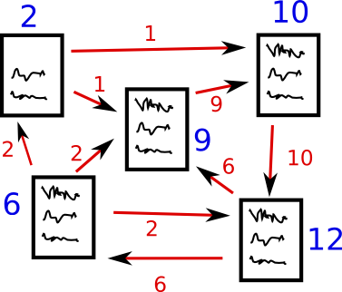
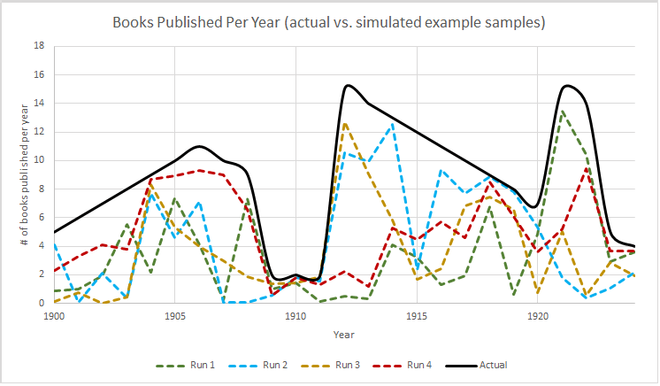
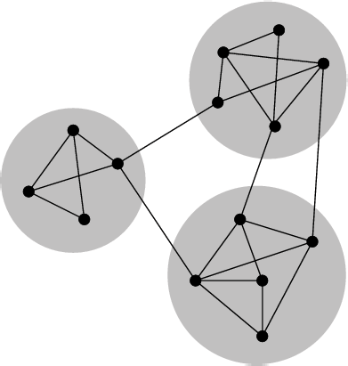
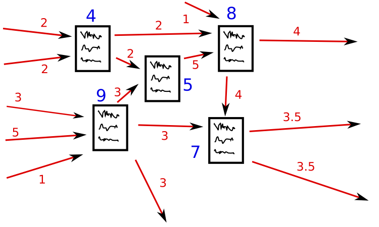

# Networks Demystified 5: Communities, PageRank, and Sampling Caveats

The fifth and sixth (coming soon…) installment of Networks Demystified <!-- page 2 --> will be a bit more applied than the previous bunch ([1](http://www.scottbot.net/HIAL/?p=6279) network basics, [2](http://www.scottbot.net/HIAL/?p=6526) degree, [3](http://www.scottbot.net/HIAL/?p=17824) power laws, [4](http://www.scottbot.net/HIAL/?p=38272) co-citation analysis). Like many of my recent posts, this one is in response to a [Twitter conversation](https://twitter.com/mwidner/status/380034784669347840):

> *Some day, I need to go back through my lists of ppl I follow and organize them better.*
>
> *— Michael Widner (@mwidner)* [*September 17, 2013*](https://twitter.com/mwidner/statuses/380034784669347840)

If you follow a lot of people on Twitter (Michael follows over a thousand), getting a grasp of them all and organizing them can be tough. Luckily **network analysis can greatly ease the task of organizing twitter follows**, and **this and next post will teach you how to do that** using [NodeXL](http://nodexl.codeplex.com/), a plugin for Microsoft Excel that (unfortunately) only works on Windows. It’s super easy, though, so if you have access to a Windows machine with Office installed, it’s worth trying it out despite the platform limitations.

This installment **will explain the concept of modularity for group detection in networks**, as well as **why certain metrics like centrality should be avoided when using certain kinds of datasets**. I’m going to be as gentle as I can be on the math, so this tutorial is probably best-suited for those just learning network techniques, but will fall short for those hoping for more detailed or specific information.

**Next installment**, Networks Demystified 6, will include the actual step-by-step instructions of how to run these analyses using NodeXL. I’m posting the description first, because I strongly believe you should learn the concepts before applying the techniques. At least that’s the theory: actually I’m posting this first because Twitter is rate-limiting the download of my follower/followee network, and I’m impatient and want to post this right away.

## Modularity / Community Detection

Modularity is a technique for finding which groups of nodes in a network <!-- page 3 --> are more similar to each other than to other groups; it lets you spot communities.

It is unfortunate (for me) that modularity is one of the more popular forms of community detection, because it also happens to be one of the methods more difficult to explain without lots of strange symbols, which I’m trying to avoid. First off, the modularity technique is not one simple algorithm, as much as it is a conceptual framework for thinking about communities in networks. There modularity you run in Gephi is different than modularity in NodeXL, because there’s more than one way to write the concept into an algorithm, and they’re not all exactly the same.

## Randomness

But to describe modularity itself, let’s take a brief detour through random-network lane. Randomization is a popular tool among network scientists, statisticians, and late 20th century avant-garde music composers for a variety of reasons. Suppose you’re having a high-stakes coin-flip contest with your friend, who winds up beating you 68/32. Before you run away crying that your friend cheated, because a fair coin should always land 50/50, remember that the universe is a random place. The 68/32 score could’ve appeared by chance alone, so you write up a quick computer program to flip a thousand coins a hundred times each, and if in those thousand computational coin-flip experiments, a decent amount come up around 68/32, you can reasonably assume your friend didn’t cheat.

The use of a simulated random result to see if what you’ve noticed is surprising (or, sometimes, [significant](http://www.scottbot.net/HIAL/?p=24697)) is quite common. I used it on the Irregular when reviewing [Matthew Jockers’](http://www.scottbot.net/HIAL/?p=34775) [*Macroanalysis*](http://www.scottbot.net/HIAL/?p=34775), shown in the graphic halfway down the page and reproduced here. I asked, in an extremely simplistic way, whether the trends Jockers saw over time were plausible by creating four dummy universes where randomness ruled, to see if his results could be attributable to chance alone. By comparing his data to my fake data, I concluded that some of his results were probably very accurate, <!-- page 4 -->and some of them might have just been chance.

This example chart compares a potential “real” underlying publication rate against several simulated potential sample datasets Jockers might have, created by multiplying the “real” dataset by some random number between 0 and 1.

Network analysts use the same sort of technique all the time. Do you want to know if it’s surprising that some actress is only six degrees away from Kevin Bacon (or anybody else on the network)? Generate a bunch of random networks with the same amount of nodes (actors) and edges (connections between them if they star in a movie together), and see if, in most cases, you can get from any one actor to any other in only six hops. Odds are you could; that’s just how random networks work.

What’s surprising is that in these, as well as most other social networks, people tend to be much more tightly clustered together than expected from a random network. They form little groups and cliques. It is significantly unlikely that in such cliquish networks, where the same groups of actors tend to appear with each other constantly, that everyone would still be only six degrees away from one another. It’s commonly known that social networks organize in what are called [small-worlds](http://en.wikipedia.org/wiki/Small-world_network), where people tend to be much <!-- page 5 --> more closely connected to one another than one would expect when they’re in such tight cliques. This is the power of random networks: they help pick out the unusual.

## Modularity Explained

Which brings us back to modularity. With some careful thinking, one would come up with a quick solutions to figuring out how to find communities in networks: find clusters of nodes that have more internal edges between them than external edges to other groups.

What network communities should look like. \[[via](http://commons.wikimedia.org/wiki/File:Network_Community_Structure.png)\]

There’s a lurking problem with this idea, though. If you were just counting the number of in-group connections vs. out-group connections, you could come up with an optimal solution very quickly if you say the entire network is one community: *voila!* no outgoing connections, and lots of internal connections. If instead you say in advance that you want two communities, or <!-- page 6 --> you only want communities of a certain size, it mitigates the problem somewhat, but then you’re stuck with needing to set the number of communities beforehand, which is a difficult constraint if you’re not sure what that number should be.

The key is randomness. You want to find communities of nodes for which there are more internal links than you would expect given that the graph was random, and fewer external links than you would expect given the graph was random. Mark Newman [defines modularity](http://www.pnas.org/content/103/23/8577.full) as: “the number of edges falling within groups minus the expected number in an equivalent network with edges placed at random.”

Modularity is thus a network-level measurement, and it can change based on what communities you choose in your network. For example, in the figure above, most of the edges in the network are within the Freakish Grey Blobs (hereafter FGBs), and within the FGBs the edges are very dense. In that case, we would expect the modularity to be quite high. However, imagine we drew the FGBs around different nodes in the network instead: if we made four FGBs instead of three, splitting the left group into two, we’d find that a larger fraction of the edges are falling outside of groups, thus decreasing the overall network’s modularity score.

Similarly, let’s say we made two FGBs instead of three. We merge the two groups in the right into one supergroup (group 1), and leave the group on the left (group 1) the same. What would happen to the modularity? In that case, because group 2 is now less dense (defining density as the number of edges within the group compared to the total possible number of edges within it), and we’d expect a random network to look a bit more similar, so the overall network’s modularity score would (again) decrease slightly.

That’s modularity in a nutshell. The method of finding the appropriate groupings in a network varies, but essentially, all the algorithms keep drawing FGBs around different groups of nodes until the overall modularity <!-- page 7 --> score of the network is as high as possible. Find the right configuration of FGBs such that the modularity score is very high, and then label the nodes in each separate FGB as their own community. In the figure above, there are three communities, and your favorite network analysis software will label them as such.

## Some metrics to avoid (with caveats)

There’s a stubbornly persistent desire, when analyzing a tasty new network dataset, to just run every algorithm in the box and see what comes up. PageRank and centrality? Sure! Clustering? Sounds great! Unfortunately, each algorithm makes certain underlying assumptions about the data, and our twitter network breaks many of those assumptions.

The most important worth mentioning is that we’ve already sinned. Remember how we plan on calculating **modularity**, and remember how I defined it earlier? Nothing was mentioned about whether or not the edges were directed. Asymmetrical edges (like asymmetries between follower and followee) are not understood by the modularity algorithm we described, which assumes there would be no difference between a follower, a followee, or a reciprocal connection of both. Running modularity on a directed network is, in general, a bad idea: in most networks, the direction of an edge is very important for determining community involvement. We can safely ignore this issue here, as we’re dealing with the fairly low-stakes problem of letting the computer help us organize our twitter network, but in publications or higher-stakes circumstances, this would be something to avoid without thinking through the implications very carefully.

A network metric that might seem more appropriate to the forthcoming twitter dataset, [PageRank](http://en.wikipedia.org/wiki/PageRank), is similarly inadequate without a few key changes. As I haven’t demystified PageRank yet, here’s a short description, with the promise to expand on it later.

<!-- page 8 -->

**PageRank** is Google’s algorithm for ranking websites in their search results, and it’s inspired by citation analysis, but it turns out to be useful in various other circumstances. There are two ways to explain the algorithm, both equally accurate. The first has to do with probability: what is the probability that, if someone just starts clicking links on the web at random, they’ll eventually land on your website. The higher the chance that someone clicking links at random will reach your site, the higher your PageRank.

PageRank’s other definition makes a bit more ‘on-the-ground’ sense; given a large, directed network (like websites linking to other websites), those sites that are very popular can determine another site’s score by whether or not they link to it. Say a really famous website, like BBC, links to your site; you get lots of points. If Sam’s New England Crab Shack & Duck Farm links to your site, however, you won’t get many points. Seemingly paradoxically, the more points *your website* has, the more points you can give to sites that you link to. Sites that get linked to a lot are considered reputable, and in turn they link to other sites and pass that reputation along. *But*, the clever bit is that your site can only pass a fraction of its reputation along based on how many other sites it links to, thus if your site only links to the Scottbot Irregular, the Irregular will get lots of points from it, but if it links to ten sites *including* the Irregular, my site would only get a tenth of the potential points.

<!-- page 9 -->

How PageRank works(-ish). Those sites which have more points in turn confer more points to others. \[[via](http://commons.wikimedia.org/wiki/File:Pagerank1.png)\]

This generalizes pretty easily to all sorts of networks including, as it happens, twitter follow networks. Those who are followed by lots of people are scored highly; if one of those highly scoring individuals follows only a select few, that select few will also receive a significant increase in rank. When a user is followed by many other users with very high scores, that user is scored the highest of them all. PageRank, then, is a neat way of looking at who has the power in a twitter network. Those at the top are those who even the relatively popular find interesting and worth following.

Which brings us to this, the network we’re creating to organize our twitter neighborhood. The network type is right: a directed, unweighted network. The algorithm will work fine. It will tell you, for example, that **you are** (or are nearly) **the most popular person in your twitter neighborhood**. And why wouldn’t it? Most of the people in your neighborhood follow you, or follow people who follow you, so the math is inevitable.

And the problem is obvious. Your **sampling strategy** (the criteria you used to gather your data) inherently biases this particular network metric, and most other metrics within the same family. You’ve used what’s called [snowball sampling](http://en.wikipedia.org/wiki/Snowball_sampling), so-named because your sample snowballs into a huge network in relatively short order, starting from a single person: you. It’s you, then those you follow, then those *they* follow, and so forth. You are inevitably at the center of your snowball, and the various network centrality measurements will react accordingly.

Well, you might ask, what if you just ignore yourself when looking at the network? Nope. Because PageRank (among other algorithms) takes everyone’s <!-- page 10 -->score into account when calculating others’ scores; even if you close your eyes whenever your name pops up, your presence will still exert an invisible influence on the network. In the case of PageRank, because your score is so high, you’ll be conferring a much higher score to (potentially) otherwise unpopular people you happen to follow.

The short-term solution is to **remove yourself from the network before you run any of your analyses**. This actually still isn’t perfect, for reasons I don’t feel like getting into because the post is already too long, but it will give at least a *better* idea of PageRank centrality within your twitter neighborhood.

While you’re at it, you should also **remove yourself before running community detection**. As *you* might be the connection that bridges two otherwise disconnected communities together, and for the purpose of this study you’re trying to organize people separate from your own influence on them, running modularity on the network without you in it will likely give you a better sense of your neighborhood.

## Continuing

Stay-tuned for the next exciting installment of Networks Demystified, wherein I’ll give step-by-step instructions on how to actually do the things I’ve described using [NodeXL](http://nodexl.codeplex.com/). If you want a head-start, go ahead and download and start playing with it.


<!-- page 11 -->

---

## Reader Comments

> [**Clement**](http://www.clementlevallois.net/), September 18, 2013
>
> Great post! What a clear explanation of modularity and PageRank.

> [**Clement Levallois (@seinecle)**](http://twitter.com/seinecle), November 18, 2013
>
> I’d want more now: how does resolution interact with modularity scores… Tricky to understand.

>> **Scott Weingart**, November 18, 2013
>>
>> Hm, neither the original concept nor the algorithm they cite mentions a resolution parameter, so you’ll have to ask the ones who implemented the algorithm. My random hunch is it’s just a simple change in what constitutes a good modularity score, and a change in optimization under these new conditions, but that’s just a shot in the dark.

<!-- page 12 -->
