# Networks Demystified 7: Doing Co-Citation Analyses

So this is awkward. I’ve published *Networks Demystified 7: Doing Citation Analyses* before *Networks Demystified 6: Organizing Your Twitter Lists*. What depraved lunatic would do such a thing? The kind of depraved lunatic that is teaching this very subject twice in the next two weeks: deal with it, you’ll get your twitterstructions soon, internet. In the meantime, enjoy the irregular nature of the scottbot irregular.

And this is part 7 of my [increasingly inaccurately named trilogy](http://www.amazon.com/Mostly-Harmless-increasingly-inaccurately-Hitchhikers/dp/B000K06888) of instructional network analysis posts ([1](http://www.scottbot.net/HIAL/?p=6279) network basics, [2](http://www.scottbot.net/HIAL/?p=6526) degree, [3](http://www.scottbot.net/HIAL/?p=17824) power laws, [4](http://www.scottbot.net/HIAL/?p=38272) co-citation analysis, [5](http://www.scottbot.net/HIAL/?p=39344) communities and PageRank, 6 this space left intentionally blank). I’m covering how to actually do citation analyses, so it’s a continuation of [part 4 of the series](http://www.scottbot.net/HIAL/?p=38272). If you want to know what citation analysis is and why to do it, as well as a laundry list of previous examples in the humanities and social sciences, go read that post. If you want to just finally be able to analyze citations, like you’ve always dreamed, read on. [^1]

You’re going to need two things for these instructions: [The Sci2 Tool](https://sci2.cns.iu.edu/user/index.php), and either a subscription to the multi-gazillion dollar [ISI Web of Science database](http://apps.webofknowledge.com/WOS_GeneralSearch_input.do?highlighted_tab=WOS&product=WOS&last_prod=WOS&SID=R1Mob41A2TwplkqAuc3&search_mode=GeneralSearch), or this [sample dataset](http://www.scottbot.net/HIAL/wp-content/uploads/2013/09/isis_records.txt). The Sci2 (Science of Science) Tool is a fairly buggy program (I’m allowed to say that because I’m kinda off-and-on the development team and I wrote half [the user manual](http://sci2.wiki.cns.iu.edu/display/SCI2TUTORIAL/Science+of+Science+%28Sci2%29+Tool+Manual;jsessionid=992CAA695741C1FCE26D11EC191E72DB)) that specializes in ingesting data of various formats and turning them into networks for analysis and visualization. It’s a good tool to use before you run to Gephi to make your networks pretty, and has a growing list of available plugins. If you already have the Sci2 Tool, download it again, because there’s a new version and it doesn’t auto-update. Go download it. It’s 80mb, I’ll wait.

Once you’ve registered for (not my decision, don’t blame me!) and [downloaded the tool](https://sci2.cns.iu.edu/user/index.php), extract the zip folder wherever you want, no install necessary. The first thing to do is increase the amount of memory available to the program, assuming you have at least a gig of RAM on your computer. We’re going to be doing some intensive analysis, so you’ll need the extra space. Edit sci2.ini; on Windows, that can be done by right-clicking on the file and selecting ‘edit’; on Mac, I dunno, elbow-click and press ‘CHANGO’? I have no idea how things work on Macs. (Sorry Mac-folk! We’ve actually documented in more detail how to increase memory – on both Windows and Mac – [here](http://sci2.wiki.cns.iu.edu/display/SCI2TUTORIAL/3.4+Memory+Allocation))

Once editing the file, you’ll see a nigh-unintelligble string of letters and numbers that end in “-Xmx350m”. Assuming you have more than a gig of RAM on your computer, change that to “-Xmx1000m”. If you don’t have more RAM, really, you should go get some. Or use only a quarter of the dataset provided. Save it and close the text editor.

Run Sci2.exe We didn’t pay Microsoft to register the app, so if you’re on Windows, you may get a OHMYGODWARNING sign. Click ‘run anyway’ and safely let my team’s software hack your computer and use it to send pictures of cats to famous network scientists. (No, we’ll be good, promise). You’ll get to a screen remarkably like Figure 7. Leave it open, and if you’re at an institution that pays ISI Web of Science the big bucks, [head there now](http://apps.webofknowledge.com/WOS_GeneralSearch_input.do?highlighted_tab=WOS&product=WOS&last_prod=WOS&SID=R1Mob41A2TwplkqAuc3&search_mode=GeneralSearch). Otherwise ignore this and just download the [sample dataset](http://www.scottbot.net/HIAL/wp-content/uploads/2013/09/isis_records.txt).

## Downloading Data

I’m a historian of science, so let’s look for history of science articles. Search for ‘*Isis*‘ as a ‘Publication Name’ from the drop-down menu (see Figure 1) and notice that, as of 9/23/2013, there are 14,858 results (see Figure 2).

<!-- page 2 -->

[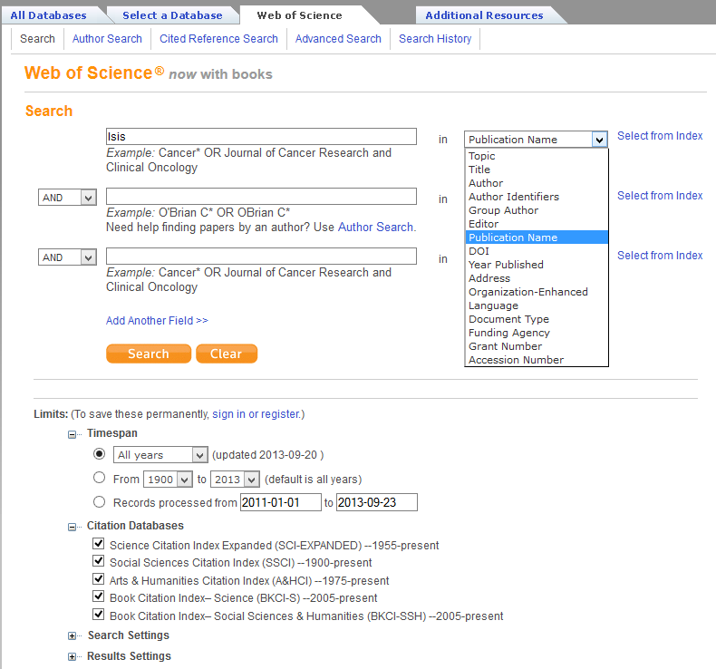](http://www.scottbot.net/HIAL/wp-content/uploads/2013/09/searchforisis.png)

Figure 1: Searching for Isis as the name of a publication.

<!-- page 3 -->

[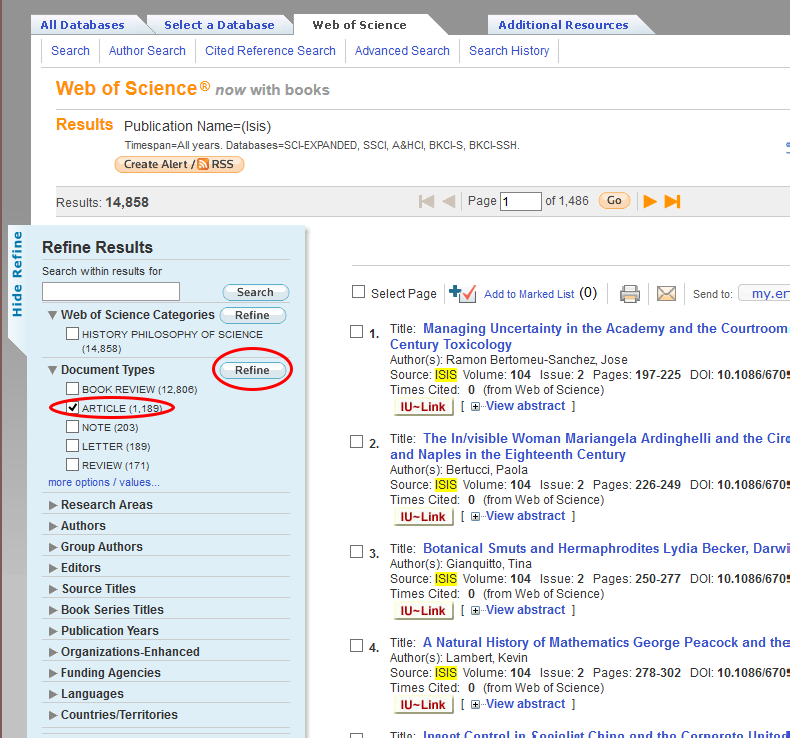](http://www.scottbot.net/HIAL/wp-content/uploads/2013/09/isisresults1.png)

Figure 2: Isis periodical search results.

This is a list of every publication in the journal *ISIS*. Each individual record includes bibliographic material, abstract, and the list of references that are cited in the article. To get a reasonable dataset to work with, we’re going to download every article ever published in *ISIS*, of which there are 1,189. The rest of the records are book reviews, notes, etc. Select only the articles by clicking the checkbox next to ‘articles’ on the left side of the results screen and clicking ‘refine’.

The next step is to download all the records. This web service limits you to 500 records per download, so you’re going to need to download 3 separate files (records 1-500, 501-1000, and 1001-1189) and combine them together, which is a fairly complicated step, so pay close attention. There’s a little “Send to:” drop-down menu at the top of the search results (Figure 3). Click it, and click ‘Other File Formats’.

<!-- page 4 -->

[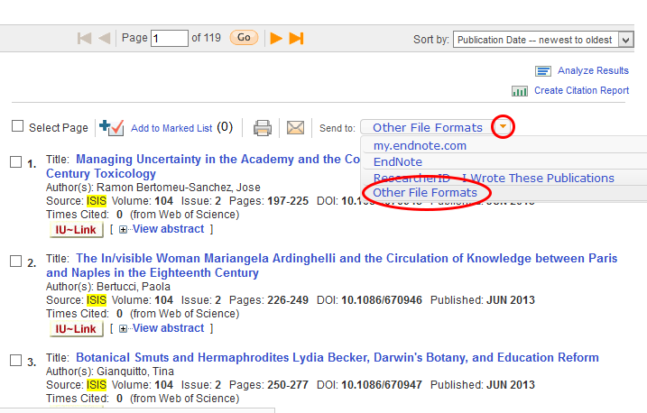](http://www.scottbot.net/HIAL/wp-content/uploads/2013/09/saveisis.png)

Figure 3: Saving Web of Science records.

At the pop-up box, check the radio box for records 1 to 500 and enter those numbers, change the record content to ‘Full Record and Cited References’, and change the file format to ‘Plain Text’ (Figure 4). Save the file somewhere you’ll be able to find it. Do this twice more, changing the numbers to 501-1000 and 1001-1189, saving these files as well.

[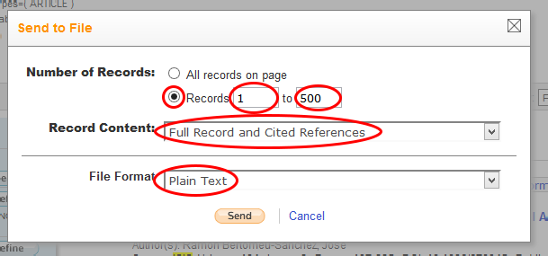](http://www.scottbot.net/HIAL/wp-content/uploads/2013/09/isisdownload.png)

Figure 4: Parameters for downloading Web of Science files.

You’ll end up with three files, possibly named: savedrecs.txt, savedrecs(1).txt, and savedrecs(2).txt. If you open one up (Figure 5), you’ll see that each individual article gets its own several-dozen lines, and includes information like author, title, keywords, abstract, and (importantly in our case) cited references.

<!-- page 5 -->

[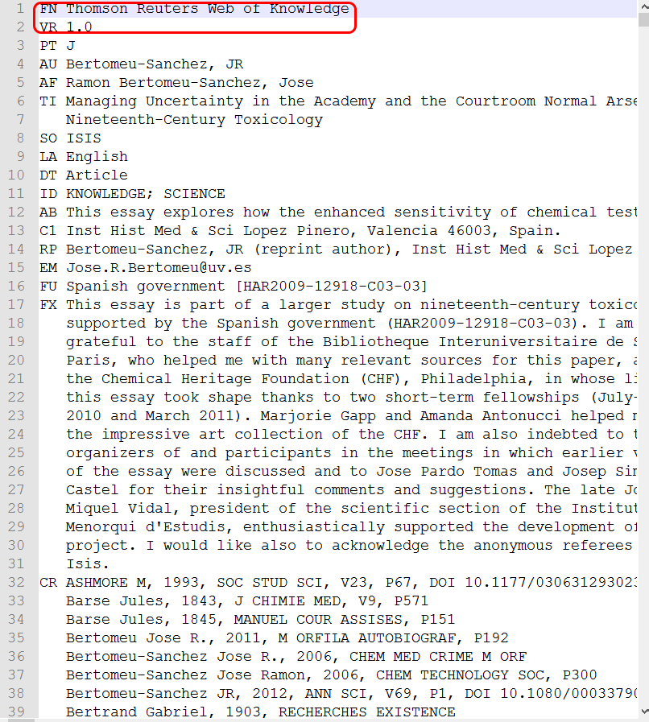](http://www.scottbot.net/HIAL/wp-content/uploads/2013/09/isisrecord.png)

Figure 5: An example *ISIS* record.

<!-- page 6 -->

[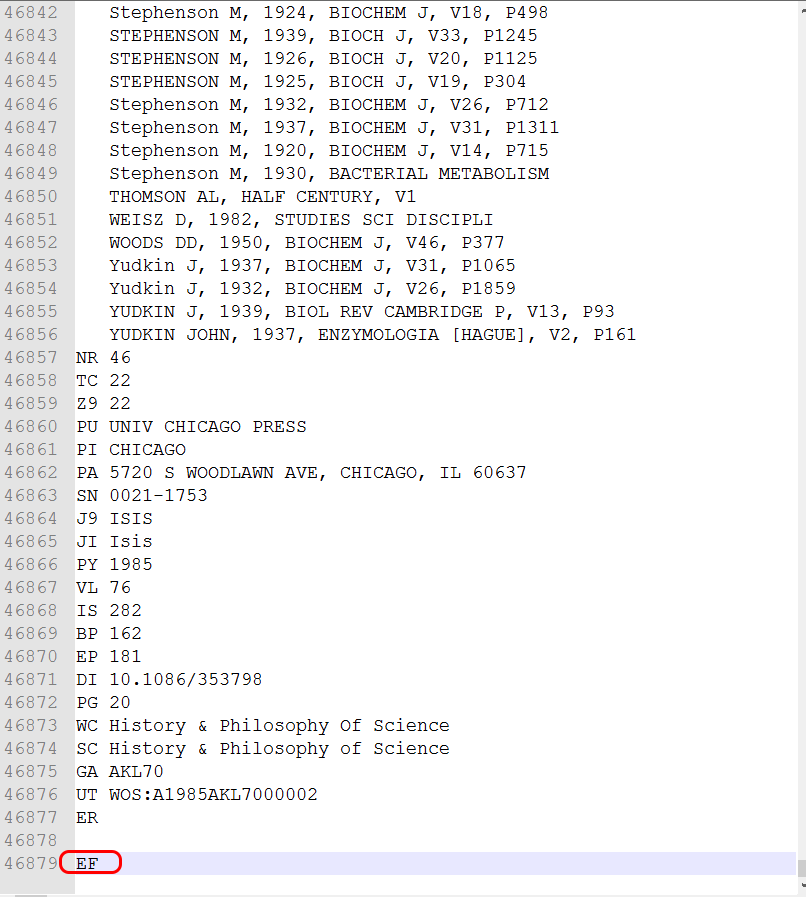](http://www.scottbot.net/HIAL/wp-content/uploads/2013/09/isisrecordend.png)

Figure 6: The end of an *ISIS* record file.

You’ll also notice (Figures 5 & 6) that first two lines and last line of every file are special header and footer lines. If we want to merge the three files so that the Sci2 Tool can understand it, we have to delete the footer of the first file, the header and footer of the second file, and the header of the last file, so that the new text file only has one header at the beginning, one <!-- page 7 -->footer at the end, and none in between. Those of you who are familiar enough with a text editor (and let’s be honest, it should be everyone reading this) go ahead and copy the three files into one huge file with only one header and footer. If you’re feeling lazy, just [download it here](http://www.scottbot.net/HIAL/wp-content/uploads/2013/09/isis_records.txt).

## Creating a Citation Network

Now open the Sci2 Tool (Figure 7) and go to File->Load in the drop-down menu. Find your super file with all of *ISIS* and open it, loading it as an ‘ISI flat format’ file (Figure 8).

[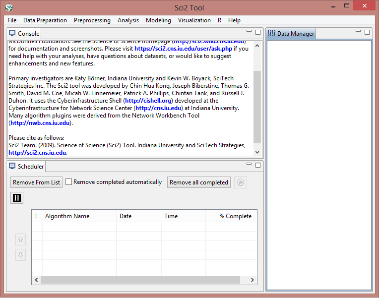](http://www.scottbot.net/HIAL/wp-content/uploads/2013/09/sci2loadscreen.png)

Figure 7: The Sci2 Tool.

<!-- page 8 -->

[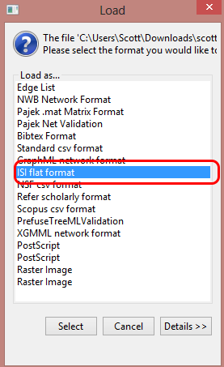](http://www.scottbot.net/HIAL/wp-content/uploads/2013/09/loadISIfile.png)

Figure 8: Loading a file as an ISI flat format file.

If all goes correctly, two new files should appear in the Data Manager, the pane on the right-hand side of the software. I’ll take a bit of a detour here to explain the Sci2 Tool.

The main ‘Console’ pane on the top-left will include a complete log of your workflow, including all the various algorithms you use, what settings and parameters you use with them, and how to cite the various ones you use. When you close the program, a copy of the text in the ‘Console’ pain will save itself as a log file in the program directory so you can go back to it later and see what exactly you did.

The ‘Scheduler’ pane on the bottom is just that: it shows you what algorithms are currently running and what already ran. You can safely ignore it.

Along with the drop-down menus at the top, the already-mentioned ‘Data Manager’ pane on the right is where you’ll be spending most of your time. Every time you load a file, it will appear in the data manager. Every time you run an algorithm on or manipulate that file in some way, a copy of it with the new changes will appear hierarchically nested below the original file. This is so, if you make a mistake, want to use an earlier version of the file, or want to run run a different set of analyses, you can still do so. You can right-click on files in the data manager to view or save them in various file formats. It is important to remember to make sure that the appropriate file is selected in the data manager when you run an analysis, as it’s easy to accidentally run an algorithm on some other random data file.

With that in mind, once your file is loaded, make sure to select (by left-clicking) the ’1189 Unique ISI Records’ data file in the data manager. If you right-click and view the file, it should open up in Excel (Figure 9) or whatever your default \*.csv viewer is, and you’ll see that the previous text file has been converted to a spreadsheet. You can look through it to see what the data look like.

<!-- page 9 -->

[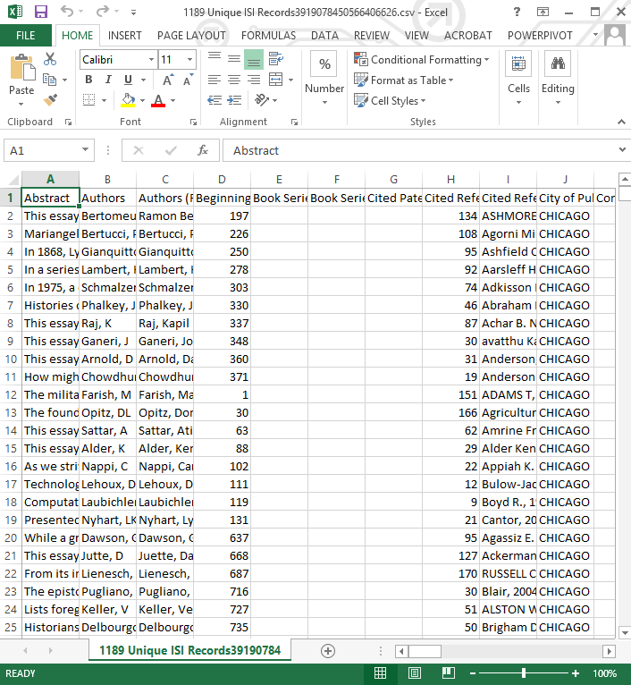](http://www.scottbot.net/HIAL/wp-content/uploads/2013/09/isicsv.png)

Figure 9: All of the *ISIS* History of Science journal articles as a csv.

When you’re done ogling at all the pretty data, close the spreadsheet and go back to the tool. Making sure the ’1189 Unique ISI Records’ file is selected, go to ‘Data Preparation -> Extract Paper Citation Network’ in the drop-down menu.

Voilà! You now have a history of science citation network. The algorithm spits out two files: ‘Extracted paper-citation network’, which is the network file itself, and ‘Paper information’, which is a spreadsheet that includes all the nodes in the network (in this case, articles that either were published in *ISIS* or are cited by them). It includes a ‘localCitationCount’ column, which tells you how frequently a work is cited within the dataset (Shapin’s *Leviathan and the Air Pump*‘ is cited 16 times, you’ll see if you open up the file), and a ‘globalCitationCount’ column, which is how many times ISI Web of Science thinks the article has been cited overall, not just within the dataset (Merton’s “ The Matthew effect in science II” is cited 183 times overall). ‘globalCitationCount’ statistics are of course only available for the records you downloaded, so you have them for *ISIS* published articles, but none of the other records.

<!-- page 10 -->

Select ‘Extracted paper-citation network’ in the data manager. From the drop-down menu, run ‘Analysis -> Networks -> Network Analysis Toolkit (NAT)’. It’s a good idea to run this on any network you have, just to see the basic statistics of what you’re working with. The details will appear in the console window (Figure 10).

[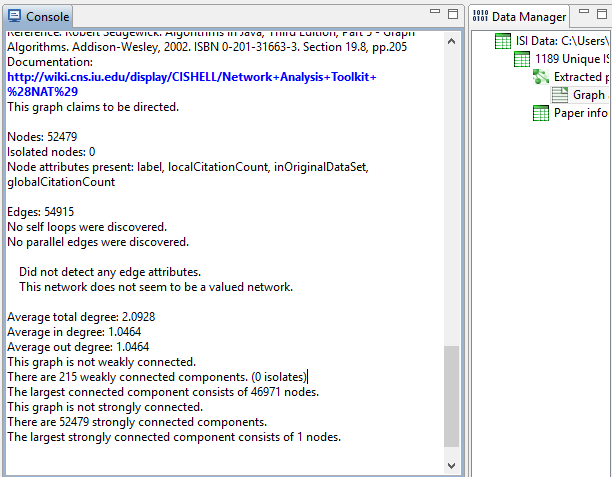](http://www.scottbot.net/HIAL/wp-content/uploads/2013/09/NAT.png)

Figure 10: Network analysis toolkit output on the *ISIS* citation network.

There are a few things worth noting right away. The first is that there are 52,479 nodes; that means that our adorable little dataset of 1,189 articles actually referenced over 50,000 other works between them, about 50 refs/article. The second fact worth noting is that there are 54,915 directed edges, which is the total number of direct citations in the dataset. One directed edge is a citation from a citing node (an *ISIS* article) to a cited node (either an *ISIS* article, or a book, or whatever the author decides to reference).

The last bit worth pointing out is the number of weakly connected components, and the size of the largest connected component. Each weakly connected component is a chunk of the network connected by citation chains: if article A and B are the only articles which cite article C, if article C cites nothing else, and if A and B are uncited by any other articles, they together make a weakly connected component. As soon as another citation link comes from or to them, it becomes part of that component. In our case, the biggest component is 46,971 nodes, which means that most of the nodes in the network are connected to each other. That’s important, it means history of science as represented by *ISIS* is relatively cohesive. There are 215 weakly connected components in all, small islands that are disconnected from the mainland.

If you have [Gephi](https://gephi.org/) installed, you can visualize the network by selecting ‘Extracted paper-citation network’ in the data manager and clicking ‘Visualization -> Networks -> Gephi’, though what you do from there is beyond the scope of these instructions. It also probably won’t make a heck of a lot of sense: there aren’t many situations where visualizing a citation network are actually useful. It’s what’s called a [Directed Acyclic Graph](http://en.wikipedia.org/wiki/Directed_acyclic_graph), which are generally the most visually boring graphs around (don’t cite me on this).

I do have a **very important warning**. You can tell it’s important because it’s bold. The Sci2 Tool was made by my advisor [Katy Börner](http://ella.slis.indiana.edu/~katy/) as a tool for people with similar research to her own, whose interests lie in modeling and predicting the spread of information on a network. As such, the **direction of citation edges created by the tool are opposite what many expect**. They go **from the cited source to the citing source**, because the idea is that’s the direction that information flows, rather than from the citing source to the cited source. As a historian, I’m more interested in considering the network in the reverse direction: citing to cited, as that gives more agency to the author. More details in the footnote. [^2]

Great, now that that’s out of the way, let’s get to the more interesting analyses. Select ‘Extracted paper-citation network’ in the data manager and run ‘Data Preparation -> Extract Document Co-Citation Network’. And then wait. Have you waited for a while? Good, wait some more. This is a process. And 50,000 articles is a lot of articles. While you’re waiting, reread [Networks Demystified 4: Co-Citation Analysis](http://www.scottbot.net/HIAL/?p=38272) to get an idea of what it is you’re doing and why you want to do it.

<!-- page 11 -->

Okay, we’re done (assuming you increased the allotted memory to the tool like we discussed earlier). You’re no presented the ‘Co-citation Similarity Network’ in the data manager, and you should, once again, run ‘Analysis -> Networks -> Network Analysis Toolkit (NAT)’ in the Data Manager. This as well will take some time, and you’ll see why shortly.

[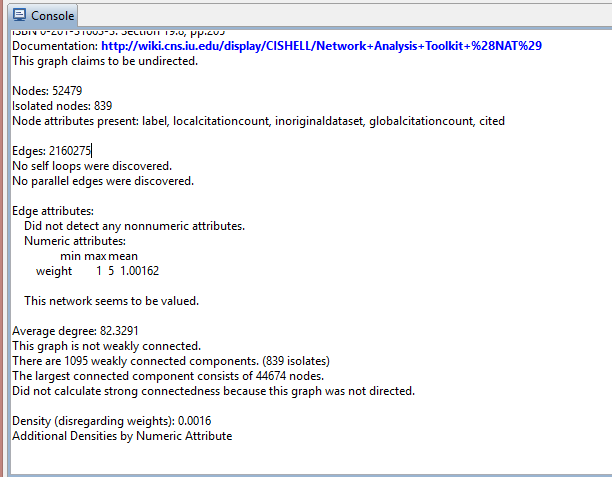](http://www.scottbot.net/HIAL/wp-content/uploads/2013/09/NATCoCite.png)

Figure 11: Network analysis toolkit of the *ISIS* co-citation network.

Notice that while there are the same number of nodes (citing or cited articles) as before, 52,479, the number of edges went from 54,915 to 2,160,275, a 40x increase. Why? Because every time two articles are cited together, they get an edge between them and, according to the ‘Average degree’ in the console pane, each article or book is cited alongside an average of 82 other works.

In order to make the analysis and visualization of this network easier we’re going to significantly cut its size. Recall that document co-citation networks connect documents that are cited alongside each other, and that the weight of that connection is increased the more often the two documents appear together in a bibliography. What we’re going to do here is drastically reduce the network’s size deleting any edge between documents unless they’ve been cited together more than once. Select ‘Co-citation Similarity Network’ and run ‘Preprocessing -> Networks -> Extract Edges Above or Below Value’. Use the default settings (Figure 12).

Note that when you’re doing a scholarly citation analysis, cutting all the edges below a certain value (called ‘thresholding’) is usually a bad idea unless you know exactly how it will affect your study. We’re doing it here to make the walkthrough easier.

<!-- page 12 -->

[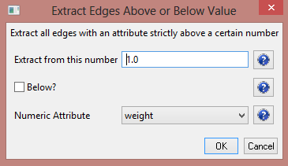](http://www.scottbot.net/HIAL/wp-content/uploads/2013/09/extractedges.png)

Figure 12: Extracting edges to reduce the size of the network.

Run ’Analysis -> Networks -> Network Analysis Toolkit (NAT)’ on the new ‘Edges above 1 by weight’ dataset, and note that the network has been reduced from two million edges to three thousand edges, a much more manageable number for our purposes. You’ll also see that there are 51,313 isolated nodes: nodes that are no longer connected to the network because we cut so many edges in our mindless rampage. Who cares about them? Let’s delete them too! Select ‘Edges above 1 by weight’ and run ‘Preprocessing -> Networks -> Delete Isolates’, and watch as fifty thousand precious history of science citations vanish in a puff of metadata. Gone.

If you run the Network Analysis Toolkit on the new network, you’ll see that we’re left with a small co-citation net of 1,166 documents and 3,344 co-citations between them. The average degree tells us that each document is connected to, on average, 6 other documents, and that the largest connected component contains 476 documents.

So now’s the moment of truth, the time to visualize all your hard work. If you know how to use Gephi, and have it installed, select ‘With isolates removed’ in the data manager and run ‘Visualization -> Networks -> Gephi’. If you don’t, run ‘Visualization -> Networks -> GUESS’ instead, and give it a minute to load. You will be presented with this stunning work of art vaguely reminiscent of last night’s spaghetti and meatball dinner (Figure 13).

<!-- page 13 -->

[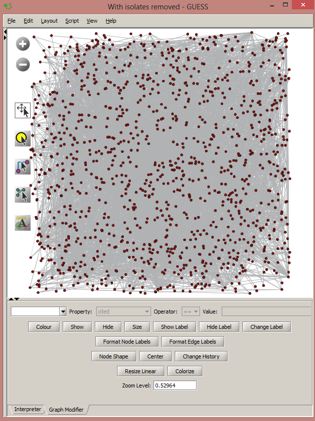](http://www.scottbot.net/HIAL/wp-content/uploads/2013/09/GUESS-first-run.png)

Figure 13: GUESS in all its glory.

Fear not! The first step to prettifying the network is to run ‘Layout -> GEM’ and then ‘Layout -> Bin Pack’. Better already, right? Then you can make edits using the graph modifier below (or using python commands in the interpreter), but the friendly folks at my lab have put together a script for you that will do that automatically. Run ‘Script -> Run Script’.

When you do, you will be presented with a godawful java applet that automatically sticks you in some horrible temp directory that you have to find your way out of. In the ‘Look In:’ <!-- page 14 -->navigation drop-down, find your way back to your desktop or your documents directory and then find wherever you installed the Sci2 Tool. In the Sci2 directory, there’s a folder called ‘scripts’, and in the ‘scripts’ folder, there’s a ‘GUESS’ folder, and in the ‘GUESS’ folder you will find the holy grail. Select ‘reference-co-occurrence-nw.py’ and press ‘open’.

Magic! Your document co-citation network is now all green and pretty, and you can zoom in and out using either the +/- button on the left, or using your mouse wheel and clicking and dragging on the network itself. It’ll look a bit like Figure 14.

[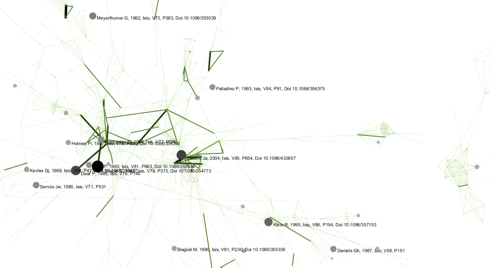](http://www.scottbot.net/HIAL/wp-content/uploads/2013/09/cocite.png)

Figure 14: Co-Citation network in GUESS.

If you feel more dangerous and cool, you can try visualizing the same network in Gephi, and it might come out something like Figure 15.

<!-- page 15 -->

[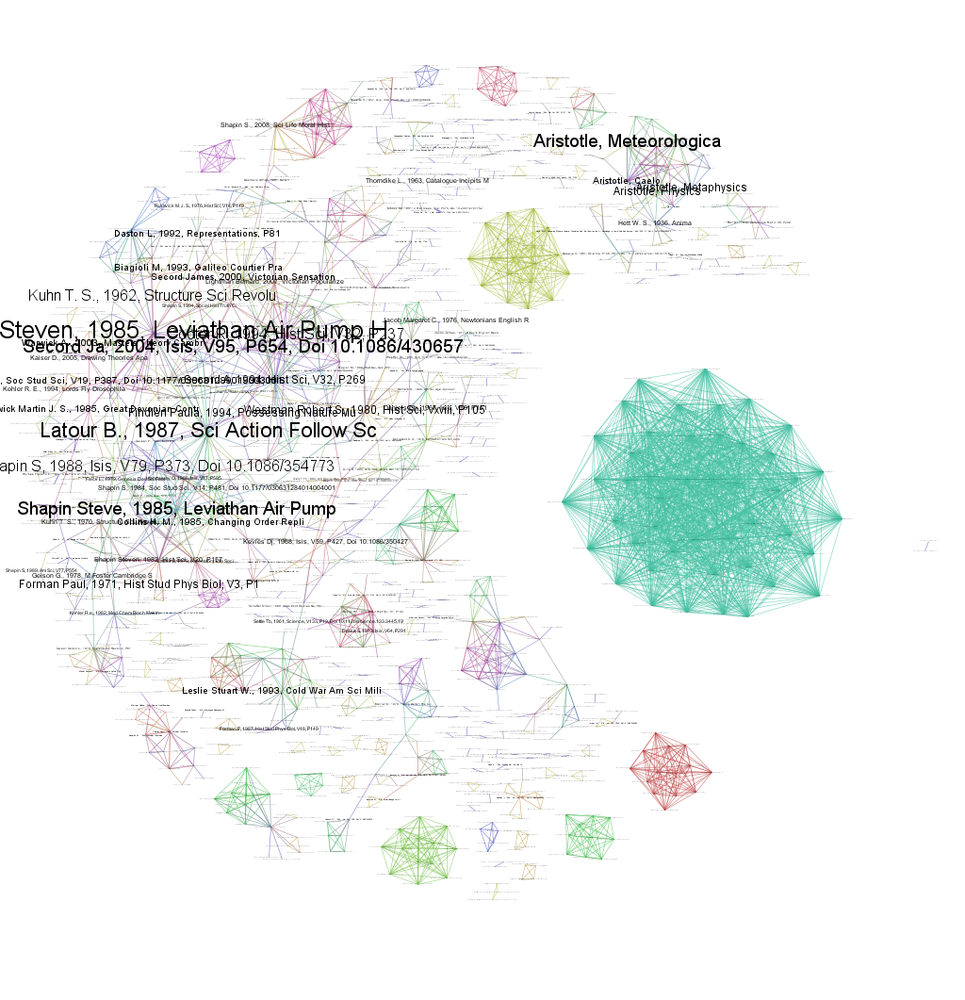](http://www.scottbot.net/HIAL/wp-content/uploads/2013/09/CoCiteGephi4k.png)

<!-- page 16 -->

Figure 15: Gephi’s document co-citation network, with nodes sized by how frequently they’re cited in *ISIS*. Click to enlarge.

That’s it! You’ve co-cited a dataset. I hope you feel proud of yourself, because you should. And all without breaking a sweat. If you want (and you should want), you can save your results by right clicking the various files in the data manager you want to save. I’d recommend saving the most recent file, ‘With isolates removed’, and saving it as an NWB file, which is fairly easy to read and is the Sci2 Tool’s native format.

Stay-tuned for the paradoxically earlier-numbered Networks Demystified 6, on organizing your twitter feed.

Notes:

[^1]: Part 4 also links to a few great tutorials on how to do this with programming, but if you don’t know the first thing about programming, start here instead.

[^2]: Those of you who know network basics, keep this in mind when running your analyses: PageRank, In & Out Degree, etc., may be opposite of what you expect, with the papers that cite the most sources as those with the highest In-Degree and PageRank. If this is opposite your workflow, you can fairly easily change the data by hand in a spreadsheet editor or with regular expressions.
