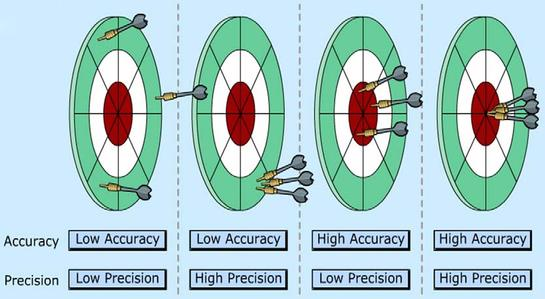
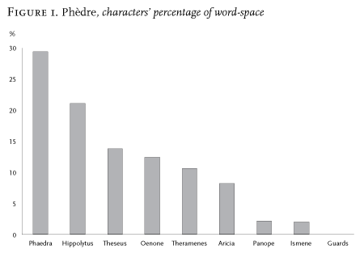
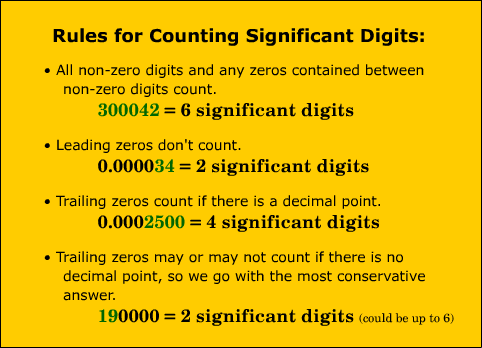

# Appreciability & Experimental Digital Humanities

<!-- page 1 -->

> ***Operationalize**: to express or define (something) in terms of the operations used to determine or prove it.*

Precision deceives. Quantification projects an illusion of certainty and solidity no matter the provenance of the underlying data. It is a black box, through which uncertain estimations become sterile observations. The process involves several steps: a cookie cutter to make sure the data are all shaped the same way, an equation to aggregate the inherently unique, a visualization to display exact values from a process that was anything but.

<!-- page 2 -->

In this post, I suggest that Moretti’s discussion of operationalization leaves out an integral discussion on precision, and I introduce a new term, **appreciability**, as a constraint on both accuracy and precision in the humanities. This conceptual constraint paves the way for an experimental digital humanities.

## Operationalizing and the Natural Sciences

An operationalization is the use of definition and measurement to create meaningful data. It is an incredibly important aspect of quantitative research, and it has served the western world well for at leas 400 years. Franco Moretti recently published a [LitLab Pamphlet](http://litlab.stanford.edu/LiteraryLabPamphlet6.pdf) and a [nearly identical article in the New Left Review](http://newleftreview.org/II/84/franco-moretti-operationalizing) about operationalization, focusing on how it can bridge theory and text in literary theory. Interestingly, his description blurs the line between the operationalization of his variables (what shape he makes the cookie cutters that he takes to his text) and the operationalization of his theories (how the variables interact to form a proxy for his theory).

Moretti’s account anchors the practice in its scientific origin, citing primarily physicists and historians of physics. This is a deft move, but an unexpected one in a recent DH environment which attempts to distance itself from a narrative of humanists just playing with scientists’ toys. Johanna Drucker, for example, [commented on such practices](http://www.digitalhumanities.org/dhq/vol/5/1/000091/000091.html):

> *\[H\]umanists have adopted many applications \[…\] that were developed in other disciplines. But, I will argue, such \[…\] tools are a kind of intellectual Trojan horse, a vehicle through which assumptions about what constitutes information swarm with potent force. These assumptions are cloaked in a rhetoric taken wholesale from the techniques of the empirical sciences that conceals their epistemological biases under a guise of familiarity.*
>
> *\[…\]*
>
> *Rendering observation (the act of creating a statistical, empirical, or subjective account or image) as if it were the same as the phenomena observed collapses the critical distance between the phenomenal world and its interpretation, undoing the basis of interpretation on which humanistic knowledge production is based.*

<!-- page 3 -->

But what Drucker does not acknowledge here is that this positivist account is a century-old caricature of the fundamental assumptions of the sciences. Moretti’s account of operationalization as it percolates through physics is evidence of this. The operational view very much agrees with Drucker’s thesis, where the phenomena observed takes second stage to a definition steeped in the nature of measurement itself. Indeed, Einstein’s introduction of relativity relied on an understanding that our physical laws and observations of them rely not on *the things themselves*, but on our ability to measure them in various circumstances. The prevailing theory of the universe on a large scale is a theory of measurement, not of matter. Moretti’s reliance on natural scientific roots, then, is not antithetical to his humanistic goals.

I’m a bit horrified to see myself typing this, but I believe Moretti *doesn’t go far enough* in appropriating natural scientific conceptual frameworks. When describing what formal operationalization brings to the table that was not there before, he lists precision as the primary addition. “It’s new because it’s precise,” Moretti claims, “Phaedra is allocated 29 percent of the word-space, not 25, or 39.” But he asks himself: is this precision useful? Sometimes, he concludes, “It adds detail, but it doesn’t change what we already knew.”

<!-- page 4 -->

*From Moretti, ‘Operationalizing’, New Left Review.*

I believe Moretti is asking the wrong first question here, and he’s asking it because he does not steal enough from the natural sciences. The question, instead, should be: is this precision meaningful? Only after we’ve assessed the reliability of new-found precision can we understand its utility, and here we can take some inspiration from the scientists, in their notions of accuracy, precision, uncertainty, and significant figures.

## Terminology

First some definitions. The **accuracy** of a measurement is how close it is to the true value you are trying to capture, whereas the **precision** of a measurement is how often a repeated measurement produces the same results. The number of [**significant figures**](http://en.wikipedia.org/wiki/Significant_figures) is a measurement of how precise the measuring instrument can possibly be. [**False precision**](http://en.wikipedia.org/wiki/False_precision) is the illusion that one’s measurement is more precise than is warranted given the significant figures. [**Propagation of uncertainty**](http://en.wikipedia.org/wiki/Propagation_of_uncertainty) is the pesky habit of false precision to weasel its way into the conclusion of a study, suggesting conclusions that might be unwarranted.

<!-- page 5 -->

*Accuracy and Precision. \[[via](http://apchemcyhs.wikispaces.com/Uncertainty+and+Significant+Figures)\]*

Accuracy roughly corresponds to how well-suited your operationalization is to finding the answer you’re looking for. For example, if you’re interested in the importance of Gulliver in *Gulliver’s Travels*, and your measurement is based on how often the character name is mentioned (12 times, by the way), you can be reasonably certain your measurement is inaccurate for your purposes.

Precision roughly corresponds to how fine-tuned your operationalization is, and how likely it is that slight changes in measurement will affect the outcomes of the measurement. For example, if you’re attempting to produce a network of interacting characters from *The Three Musketeers*, and your measuring “instrument” is increase the strength of connection between two characters every time they appear in the same 100-word block, then you might be subject to difficulties of precision. That is, your network might look different if you start your sliding 100-word window from the 1st word, the 15th word, or the 50th word. The amount of variation in the resulting network is the degree of imprecision of your operationalization.

Significant figures are a bit tricky to port to DH use. When you’re sitting at home, measuring some space for a new couch, you may find that your meter stick only has tick marks to the centimeter, but nothing smaller. This is your highest threshold for precision; if you eyeballed and guessed your space was actually 250.5cm, you’ll have reported a falsely precise number. Others looking at your measurement may have assumed your meter stick was more fine-grained than it was, and any calculations you make from that number will propagate that falsely precise number.

<!-- page 6 -->

*Significant Figures. \[[via](http://chemsite.lsrhs.net/measurement/sig_fig.html)\]*

Uncertainty propagation is especially tricky when you wind up combing two measurements together, when one is more precise and the other less. The rule of thumb is that your results can only be as precise as the least precise measurements that made its way into your equation. The final reported number is then generally in the form of 250 (±1 cm). Thankfully, for our couch, the difference of a centimeter isn’t particularly appreciable. In DH research, I have rarely seen any form of precision calculated, and I believe some of those projects would have reported different results had they accurately represented their significant figures.

## Precision, Accuracy, and Appreciability in DH

Moretti’s discussion of the increase of precision granted by operationalization leaves out any discussion of the certainty of that precision. Let’s assume for a moment that his operationalization is accurate (that is, his measurement is a perfect conversion between data and theory). Are his measurements precise? In the case of Phaedra, the answer at first glance is yes, words-per-character in a play would be pretty robust against slight changes in the measurement process.

<!-- page 7 -->

And yet, I imagine, that answer will probably not sit well with some humanists. They may ask themselves: Is Oenone’s 12%  appreciably different from Theseus’s 13% of the word-space of the play? In the eyes of the author? Of the actors? Of the audience? Does the difference make a difference?

The mechanisms by which people produce and consume literature is not precise. Surely Jean Racine did not sit down intending to give Theseus a fraction more words than Oenone. Perhaps in DH we need a measurement of precision, not of the measuring device, but of our ability to interact with the object we are studying. In a sense, I’m arguing, we are not limited to the precision of the ruler when measuring humanities objects, but to the precision of the human.

In the natural sciences, accuracy is constrained by precision: you can only have as accurate a measurement as your measuring device is precise.  In the corners of humanities where we study how people interact with each other and with cultural objects, we need a new measurement that constrains both precision and accuracy: **appreciability**. A humanities quantification can only be as precise as that precision is appreciable by the people who interact with matter at hand. If two characters differ by a single percent of the wordspace, and that difference is impossible to register in a conscious or subconscious level, what is the meaning of additional levels of precision (and, consequently, additional levels of accuracy)?

## Experimental Digital Humanities

Which brings us to experimental DH. How does one evaluate the appreciability of an operationalization except by devising clever experiments to test the extent of granularity a person can register? Without such understanding, we will continue to create formulae and visualizations which portray a false sense of precision. Without visual cues to suggest uncertainty, graphs present a world that is exact and whose small differentiations appear meaningful or deliberate.

<!-- page 8 -->

Experimental DH is not without precedent. In [Reading Tea Leaves](http://www.umiacs.umd.edu/~jbg/docs/nips2009-rtl.pdf) (Chang et al., 2009), for example, the authors assessed the quality of certain topic modeling tweaks based on how a large number of people assessed the coherence of certain topics. If this approach were to catch on, as well as more careful acknowledgements of accuracy, precision, and appreciability, then those of us who are making claims to knowledge in DH can seriously bolster our cases.

There are some who present the formal nature of DH as antithetical to the highly contingent and interpretative nature of the larger humanities. I believe appreciability and experimentation can go some way alleviating the tension between the two schools, building one into the other. On the way, it might build some trust in humanists who think we sacrifice experience for certainty, and in natural scientists who are skeptical of our abilities to apply quantitative methods.

Right now, DH seems to find its most fruitful collaborations in computer science or statistics departments. Experimental DH would open the doors to new types of collaborations, especially with psychologists and sociologists.

I’m at an extremely early stage in developing these ideas, and would welcome all comments (especially those along the lines of “You dolt! Appreciability already exists, we call it *x*.”) Let’s see where this goes.

---

## Reader Comments

> [**ds663**](http://danielallenshore.wordpress.com/), February 4, 2014
>
> For those of us who study earlier periods of literary history, empirical studies of appreciability won’t get us very far without some rather unappealing assumptions about cognitive universalism. From our ability or inability to notice something about a text, we cannot infer the ability or inability of someone reading or writing in a different time or culture. But literary history gives us plenty of evidence of what was visible, imitable, and significant in different periods. For earlier periods what is required is not psychology, or sociology, or (god forbid) cog sci, but historical phenomenology.
>
> That issue aside, I think your concept of appreciability does useful work. If a judgement about character space of whatever precision in a single text isn’t appreciable, how much less appreciable would an aggregate measure drawn from dozens or thousands of texts (of which only a few were ever read by a single person), or more sophisticated measures like principle components or log likelihoods be?
>
> I also wonder if you’ve considered the issue of vagueness. Many of our most used literary concepts are constitutively vague; that is, vagueness if a feature of their use, not a bug, and they are appreciable precisely in their vagueness. The standard philosophical examples of vague terms are “heap” and “bald.” Unless you’re an epistemicist like Timothy Williamson, the term “bald” never specifies a precise number of hairs (i.e. &lt;40). A term like "protagonist" may entail a claim about word-space, but only in a vague way. To give a precisification of the term would not be to clarify the content of this term, but to mistake or falsify a constitutive feature of its use. The term "protagonist" is and has been significant (it is semiotic) in a way that a 29% has not (though it may be in the future).

>> [**ds663**](http://danielallenshore.wordpress.com/), February 4, 2014
>>
>> i.e. A 29% word-space.

>> **Scott Weingart**, February 4, 2014
>>
>> Daniel, thank you for the comment; I was a bit worried about the historical aspect of this as well, but I think you hit the nail on the head with the issues of cognitive universalism. Historical phenomenology is undoubtedly the right direction to go here.
>>
>> Regarding the relaitonship between appreciability and distant reading, I do see your point, but think there are different goals in mind (or, if you will, different vantage points from which something may be appreciable). For Moretti’s interests, it makes sense to define appreciability at the level of the single work as it interacts with individual people. Those interested in distant reading might be looking for different types of answers, e.g., do different society’s give appreciably different wordspace to different genders?, where appreciability here is closer aligned with statistical significance. The ability to affect or be affected on a grand or statistically average level is different than at the individual level. I think. I suppose this is to some extent an empirical question; how can we explore the differences between appreciability at different scales?
>>
>> As for vagueness, it is something I’ve considered, but I figure the burden of use is on Moretti in this case as another issue needing tackling. It may be that vague and precise concepts will come to co-exist, with a realization that they are not necessarily translatable.

> [**Ben Schmidt**](http://www.benschmidt.org/), February 4, 2014
>
> I’m somewhat sympathetic to the project, but I worry that trying to operationalize categories like “The extent of granularity a person can register” will at once A) layer a second set of poorly-operationalized concepts on top of the ones we’re already working with, and B) unintentionally block off (or more likely, implicitly denigrate) most of the interesting we could ask. Three major categories of objection spring immediately to mind:
>
> First, because in reality “the person” is not some abstract and uniform self that responds uniformly to stimuli: it’s contingent and historically constructed. (This has always been one of my problems with Drucker, BTW; I think she strongly overplays the connection between the form of graphical display and the interpretive techniques available to its readers. Topic for another place.) You can’t play people symphonies on Mechanical Turk to learn if late-18th century audiences found the C# at the end of the first phrase of the Eroica disconcerting or not.
>
> Second, even historical perception doesn’t take place solely through the individual sensorium; to give a totally trivial example, I remember going through with my friends in 5th grade and counting up the lines given to girls and boys, respectively, in our school play. The fine quantitative results were directly accessible to us historical actors back then: and we were just 10 year olds. 12-tone music isn’t perceptually accessible, but it still matters historically whether Berg ‘follows the rules’ or not. And most importantly, plenty (most) questions for which quantitative methods are appropriate will not have individual actors at all.
>
> Finally, the experiential categories that psychometrics can successfully operationalize aren’t going to be particularly extensive: I wrote in my dissertation, for example, about why attempts to measure attention (“attention quotient,” “attention span”) failed where “Intelligence quotient” succeeded. This is a suitable constraint for psychology to operate under; but we have all our fields precisely so that we can study the things that don’t admit of those. It’s unlikely that live questions of critical analysis will be easily amenable with existing psychometric techniques; and seems optimistic that we’ll simply be able to come up with new ones.
>
> I think my third point here is the weakest as currently put; the other two seem pretty important.
>
> That’s not to say there isn’t a role for experimental work; but I think it will and should be tiny, even compared to computational/quantitative digital humanities alone.

>> **Scott Weingart**, February 4, 2014
>>
>> Ben, Thanks. The extra layer of operational complexity was something I should have considered, but didn’t, and is a very good point. The 1st and 2nd objections are ones I’ve considered, especially regarding the variants in interactions between people. This, I think, jumps to becoming a question of precision rather than appreciability (or the precision of the appreciability, but let’s not get that meta). I think it is still possible to present a credible range, even assuming a wide historical and social distribution of appreciability.
>>
>> That said, I think I’m convinced by your suggestion that the scope of experimental questions is necessarily limited, and if we restrain ourselves to only those questions which can by psychometrically tested, we’d lose quite a bit of good work.

> **michael\_simeone**, February 4, 2014
>
> I really appreciated this post, especially some of your closing thoughts about moving the humanities into collaborations that do not include (or are not limited to) computer science. Even if an understanding of experimental procedure doesn’t produce a widely useful methodological turn (still might), it may still serve as an opportunity to have humanities participate in new research projects as they are being designed.
>
> Engineering and applied sciences seem like a good fit for this future direction, even if they are not classically experimental in the sense of other fields like biology, chemistry, and physics are “experimental sciences.”
