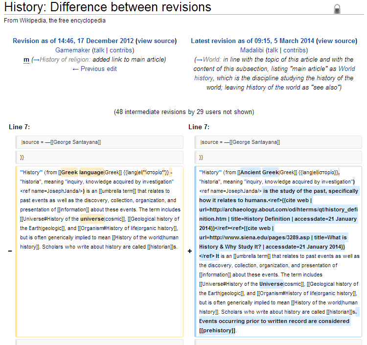
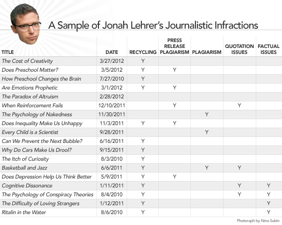
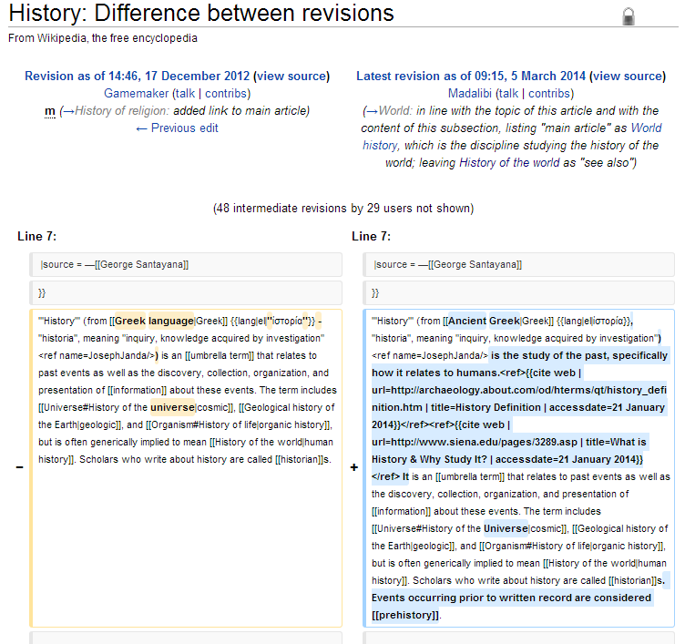

# Barriers to Scholarship & Iterative Writing

<!-- page 1 -->

This post is mostly just thinking out loud, musing about two related barriers to scholarship: a stigma related to self-plagiarism, and various copyright concerns. It includes a potential way to get past them.

<!-- page 2 -->

## Self-Plagiarism

When Jonah Lehrer’s [plagiarism scandal](http://en.wikipedia.org/wiki/Jonah_Lehrer#Plagiarism_and_quote_fabrication_scandal) first broke, it sounded a bit silly. Lehrer, it turned out, had taken some sentences he’d used in earlier articles, and reused them in a few *New Yorker* blog posts. Without citing himself. Oh no, I thought. Surely, *this* represents the height of modern journalistic moral depravity.

Of course, later it was revealed that he’d bent facts, and plagiarized from others without reference, and these were all legitimately upsetting. And plagiarizing himself *without reference* was mildly annoying, though certainly not something that should have attracted national media attention. But it raises an interesting question: why is self-plagiarism wrong? And it’s as wrong in academia as it is in journalism.

<!-- page 3 -->

*Lehrer chart from Slate. \[[via](http://www.slate.com/articles/health_and_science/science/2012/08/jonah_lehrer_plagiarism_in_wired_com_an_investigation_into_plagiarism_quotes_and_factual_inaccuracies_.html)\]*

I can’t speak for journalists (though Alberto Cairo can, and he [lists some of the good reasons why non-referenced self-plagiarism is bad](https://twitter.com/scott_bot/status/442672981420949505) and links to [not one](http://www.plagiarismtoday.com/2012/07/31/the-fall-of-jonah-lehrer/), but [two articles about it](http://www.slate.com/articles/life/culturebox/2012/06/jonah_lehrer_self_plagiarism_the_new_yorker_staffer_stopped_being_a_writer_and_became_an_idea_man_.html), and), but for academia, the reasons behind the wrongness seem pretty clear.

1. It’s wrong to directly lift from any source without adequate citation. This only applies to non-cited self-plagiarism, obviously.
2. It’s wrong to double-dip. The currency of the academy is publications / CV lines, and if you reuse work to fill your CV, you’re getting an unfair advantage.
3. Confusion. Which version should people reference if you have so many versions of a similar work?
4. Copyright. You just can’t reuse stuff, because your previous publishers own the copyright on your earlier work.

That about covers it. Let’s pretend academics always cite their own works (because, hell, it gives them more citations), so we can do away with #1. Regular readers will know my position on publisher-owned copyright, so I just won’t get into #4 here to save you my preaching. The others are a bit more difficult to write off, but before I go on to try to do that, I’d like to talk a bit about my own experience of self-plagiarism as a barrier to scholarship.

I was recently invited to speak at the [Universal Decimal Classification seminar](http://seminar.udcc.org/2013/), where I presented on the history of trees as a visual metaphor for knowledge classification. It’s not exactly my research area, but it was such a fun subject, I’ve decided to write an article about it. The problem is, the proceedings of the UDC seminar were published, and about 50% of what I wanted to write is already sitting in a published proceedings that, let’s face it, not many people will ever read. And if I ever want to add to it, I have to change the already-published material significantly if I want to send it out again.

<!-- page 4 -->

Since I presented, my thesis has changed slightly, I’ve added a good chunk of more material, and I fleshed out the theoretical underpinnings. I now have a pretty good article that’s ready to be sent out for peer review, but if I want to do that, I can’t just have a reference saying “half of this came from a published proceeding.” Well, I *could*, but apparently there’s [a slight taboo against this](https://twitter.com/scott_bot/statuses/395170031165640704). I was told to “be careful,” that I’d have to “rephrase” and “reword.” And, of course, I’d have to cite my earlier publication.

I imagine most of this comes from the fear of scholars double-dipping, or padding their CVs. Which is stupid. Good scholarship should come first, and our methods of scholarly attribution should mold itself to it. Right now, scholarship is enslaved to the process of attribution and publication. It’s why we willingly donate our time and research to publishing articles, and then have our universities buy back our freely-given scholarship in expensive subscription packages, when we could just have the universities pay for the research upfront and then release it for free.

## Copyright

The question of copyright is pretty clear: how much will the publisher charge if I want my to reuse a significant portion of my work somewhere else? The publisher to which I refer, Ergon Verlag, I’ve heard is pretty lenient about such things, but what if I were reprinting from a different publish?

There’s an additional, more external, concern about my materials. It’s a history of illustrations, and the manuscript itself contains 48 illustrations in all. If I want to use them in my article, for demonstrative purposes, I not only need to cite the original sources (of course), I need to [get permission to use the illustrations](https://twitter.com/scott_bot/status/441926443639914498) from the publishers who scanned them – and this can be costly and time consuming. I priced a few of them so-far, and they range from free to hundreds of dollars.

<!-- page 5 -->

## A Potential Solution – Iterative Writing

To recap, there are two things currently preventing me from sending out a decent piece of scholarship for peer-review:

1. A taboo against self-plagiarism, which requires quite a bit of time for rewriting, permission from the original publisher to reuse material, and/or the dissolution of such a taboo.
2. The cost and time commitment of tracking down copyright holders to get permission to reproduce illustrations.

I believe the first issue is largely a historical artifact of print-based media. Scholars have this sense of citing *the source* because, for hundreds of years, nearly every print of a single text was largely identical. Sure, there were occasionally a handful of editions, some small textual changes, some page number changes, but citing *a text* could easily be done, and so we developed a huge infrastructure around citations and publications that exists to this day. It was costly and difficult to change a printed text, and so it wasn’t done often, and now our scholarly practices are based around the idea scholarly material has to be permanent and unchanging, *finished*, if they are to enter into the canon and become citeable sources.

In the age of Wikipedia, this is a weird idea. Texts grow organically, they change, they revert. Blog posts get updated. A scholarly article, though, is relatively constant, even those in online-only publications. One of the major exceptions are ArXiv-like pre-print repositories, which allow an article to go through several versions before the final one goes off to print. But generally, once the final version goes to print, no further changes are made.

The reasons behind this seem logical: it’s the way we’ve always done it, so why change a good thing? It’s hard to cite something that’s constantly changing; how do we know the version we cited will be preserved?

<!-- page 6 -->

In an age of cheap storage and easily tracked changes, this really shouldn’t be a concern. Wikipedia does this very well: you can easily cite the version of an article from a specific date and, if you want, easily see how the article changed between then and any other date.

*Changes between versions of the Wikipedia entry on History.*

This would be more difficult to implement in academia because article hosting isn’t centralized. It’s difficult to be certain that the URL hosting a journal article now will persist for 50 years, both because of ownership and design changes, and it’s difficult to trust that whomever owns the article or the site won’t change the content and not preserve every single version, or a detailed description of changes they’ve made.

<!-- page 7 -->

There’s an easy solution: don’t just reference everything you cite, **embed everything you cite**. If you cite a picture, include the picture. If you cite a book, include the book. If you cite an article, include the article. Storage is cheap: if your book cites a thousand sources, and includes a copy of every single one, it’ll be at most a gigabyte. Probably, it would be quite a deal smaller. That way, if the material changes down the line, everyone reading your research will till be able to refer to the original material. Further, because you include a full reference, people can go and look the material up to see if it has changed or updated in the time since you cited it.

Of course, this idea can’t work – copyright wouldn’t let it. But again, this is a situation where the industry of academia is getting in the way of potential improvements to the way scholarship can work.

The important thing, though, is that self-plagiarization would become a somewhat irrelevant concept. Want to write more about what you wrote before? Just iterate your article. Add some new references, a paragraph here or there, change the thesis slightly. Make sure to keep a log of all your changes.

I don’t know if this is a good solution, but it’s one of many improvements to scholarship – or at least, a removal of barriers to publishing interesting things in a timely and inexpensive fashion – which is currently impossible because of copyright concerns and institutional barriers to change. Cameron Neylon, from PLOS, recently discussed [how copyright put up some barriers to his own interesting ideas](http://cameronneylon.net/blog/improving-on-access-to-research/). Academia is not a nimble beast, and because of it, we are stuck with a lot of scholarly practices which are, in part, due to the constraints of old media.

In short: academic writing is tough. There are ways it could be easier, that would allow good scholarship to flow more freely, but we are constrained by path dependency from choices we made hundreds of years ago. It’s time to be a bit more flexible and be more willing to try out new ideas. This isn’t anywhere near a novel concept on my part, but it’s worth repeating.

<!-- page 8 -->

The last big barrier to self-plagiarism, double dipping to pad one’s CV, still seems tricky to get past. I’m not thrilled with the way we currently assess scholarship, and “CV size” is just one of the things I don’t like about it, but I don’t have any particularly clever fixes on that end.

---

## Reader Comments

> [**Mike Taylor**](http://www.miketaylor.org.uk/dino/pubs/), March 10, 2014
>
> Leaving aside your suggested long-term solution (which I’m not crazy about), here’s my take on your current situation.
>
> You should just go ahead and do it, reusing whatever passages of text you want to re-use. So long as you’re up front with the new venue about what you’ve done, there’s no rational reason for anyone to object to this. Cite the original in the new paper, stating that the new expands on and supersedes that.
>
> Don’t fritter away your valuable time doing pointless clerical work (“rephrase and reword”) that has net negative value. The idea that you should is pure superstition. If reusing verbatim was wrong, so would reusing with wording-changes be.
>
> As for the impediment of copyright: if you signed away your copyright in your own work, then yes, you have to get permission from the copyright holder. As I’ve noted before, [Plagiarism is nothing to do with copyright](http://svpow.com/2013/09/20/plagiarism-is-nothing-to-do-with-copyright/): among other things, that means that just because plagiarism isn’t a problem for you here, it does’t follow that copyright isn’t.

>> **Scott Weingart**, March 10, 2014
>>
>> Thanks Mike! I especially enjoyed that link, which I hadn’t read through before. I can’t really say whether I’m crazy about my own long-term solution (still thinking about it…), but it seemed like a reasonable way of getting past the attribution problem.
