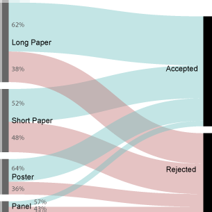
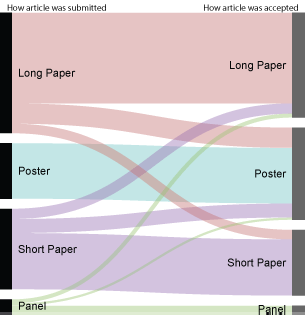
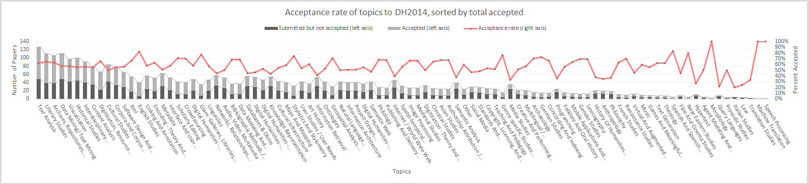
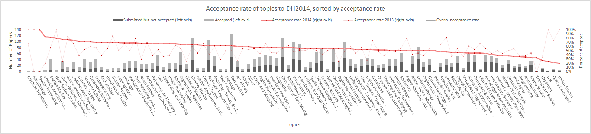

# Acceptances to Digital Humanities 2014 (part 1)

It’s that time again! The annual Digital Humanities [conference schedule has been released](http://dh2014.org/2014/04/09/dh2014-detailed-schedules/), and this time it’s in Switzerland. In an effort to console myself from not having the funding to make it this year, I’ve gone ahead and analyzed the nitty-gritty of acceptances and rejections to the conference. For those interested in this sort of analysis, you can find my take on [submissions to DH2013](http://www.scottbot.net/HIAL/?p=24437), [acceptances at DH2013](http://www.scottbot.net/HIAL/?p=35242), and [submissions to DH2014](http://www.scottbot.net/HIAL/?p=39588). If you’re visiting this page from the future, you can find any future DH conference analyses at [this tag link](http://www.scottbot.net/HIAL/?tag=dhconf).

The overall acceptance rate to DH2014 was 59%, although that includes many papers and panels that were accepted as posters. There were 589 submissions this year (compared to 348 submissions last year), of which 345 were accepted. By submission medium, this is the breakdown:

- Long papers: 62% acceptance rate (lower than last year)
- Short papers: 52% acceptance rate (lower than last year)
- Panels: 57% acceptance rate (higher than last year)
- Posters: 64% acceptance rate (didn’t collect this data last year)

Figure 1: Acceptances to DH2014 by submission medium.

A surprising number of submitted papers switched from one medium to another when they were accepted. A number of panels became long papers, a bunch of short papers became long papers, and a punch of long papers became short papers. Although a bunch of submissions became posters, no posters wound up “breaking out” to become some other medium. I was most surprised by the short papers which became long (13 in all), which leads me to believe some of them may have been converted for scheduling reasons. This is idle speculation on my part – the organizers may reply otherwise. [Edit: the organizers did reply, and [assured us this was not the case](https://twitter.com/scott_bot/status/454316699668332544). I see no recent to doubt that, so congratulations to those 13 short papers that became long papers!]

Figure 2: Medium switches in DH2014 between submission and acceptance.

It’s worth keeping in mind, in all analyses listed here, that I do not have access to any withdrawals; accepted papers were definitely accepted, but not accepted may have been withdrawn rather than rejected.

<!-- page 2 -->

Figures 3 and 4 all present the same data, but shed slightly different lights on digital humanities. Each shows the acceptance rate by various topics, but they’re ordered slightly differently. All submitting authors needed to select from a limited list of topics to label their submissions, in order to aid with selecting peer reviewers and categorization.

Figure 3 sorts topics by the total amount that were accepted to DH2014. This is at odds with Figure 2 from my post on [DH2014 submissions](http://www.scottbot.net/HIAL/?p=39588), which sorts by total number of topics submitted. The figure from my previous post gives a sense of what digital humanists are doing and submitting, whereas Figure 3 from this post gives a sense of what the visitor to DH2014 will encounter.

Figure 3: Topical acceptance to DH2014 sorted by total number of accepted papers tagged with a particular topic. (click to enlarge)

The visitor to DH2014 won’t see a hugely different topical landscape than the visitor to DH2013 ([see analysis here](http://www.scottbot.net/HIAL/?p=35242)). Literary studies, text analysis, and text mining still reign supreme, with archives and repositories not far behind. Visitors will see quite a bit fewer studies dedicated to the internet and the world wide web, and quite a bit more dedicated to historical and corpus-based research. More details can be seen by comparing the individual figures.

Figure 4, instead, sorts the topics by their acceptance rate. The most frequently accepted topics appear at the left, and the least frequently appear at the right. A lighter red line is used to show acceptance rates of the same topics for 2013. This graph shows what peers consider to me more credit-worthy, and how this has changed since 2013.

Figure 4: Topical acceptance to DH2014 sorted by percentage of acceptance for each topic. (click to enlarge)

It’s worth pointing out that the highest and lowest acceptance rates shouldn’t be taken very seriously; with so few submitted articles, the rates are as likely random as indicative of any particularly interesting trend. Also, for comparisons with 2013, keep in mind the North American and European traditions of digital humanities may be driving the differences.

There are a few acceptance ratios worthy of note. English studies and GLAM (Galleries, Libraries, Archives, Museums) both have acceptance rates extremely above average, and also quite a bit higher than their acceptance rates from the previous year. Studies of XML are accepted slightly above the average acceptance rate, and also accepted proportionally more frequently than they were in 2013. Acceptance rates for both literary and historical studies papers are about average, and haven’t changed much since 2013 (even though there were quite a few more historical submissions than the previous year).

Along with an increase in GLAM acceptance rates, there was a big increase in rates for studies involving archives and repositories. It may be they are coming back in style, or it may be indicative of a big difference between European and North American styles. There was a pretty big drop in acceptance rates for ontology and semantic web research, as well as in pedagogy research across the board. Pedagogy had a weak foothold in DH2013, and

<!-- page 3 -->

has an even weaker foothold in 2014, with both fewer submitted articles, and a lower rate of acceptance on those submitted articles.

In the next blog post, I plan on drilling a bit into author-supplied keywords, the role of gender on acceptance rates, and the geography of submissions. As always, I’m happy to share data, but in this case I will only share sufficiently aggregated/anonymized data, because submitting authors who did not get accepted have an expectation of privacy that I intend to keep.
