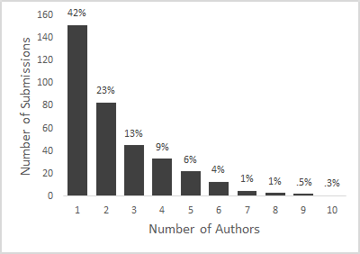
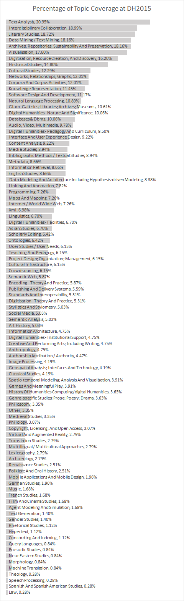

# Submissions to Digital Humanities 2015 (pt. 1)

<!-- page 1 -->

It’s that time of the year again! The [2015 Digital Humanities](http://dh2015.org/) conference will take place next summer in Australia, and [as per usual](http://www.scottbot.net/HIAL/?tag=dhconf), I’m going to summarize what is being submitted to the conference and, eventually, how those submissions become accepted. Each year reviewers get the chance to “bid” on conference submissions, and this lets us get a peak inside the general trends in DH research. This post (pt. 1) will focus solely on this year’s submissions, and next post will compare them to previous years and locations.

<!-- page 2 -->

It’s important to keep in mind that trends in the conference over the last three years may be temporal, geographic, or accidental. The 2013 conference took place in Nebraska, 2014 in Switzerland, 2015 in Australia, and 2016 is set to happen in Poland; it’s to be expected that regional differences will significantly inform who is submitting pieces and what topics will be discussed.

This year, 358 pieces were submitted to the conference (about as many as were submitted to Nebraska in 2013, but more on that in the follow-up post). As with previous years, authors could submit four varieties of works: long papers, short papers, posters, and panels / multi-paper sessions. Long papers comprised 54% of submissions, panels 4%, posters 15%, and short papers 30%.

In total, there were 859 named authors on submissions – this number counts authors more than once if they appear on multiple submissions. Of those, 719 authors are unique.[^1]  Over half the submissions are multi-authored (58%), with 2.4 authors per submission on average, a median of 2 authors per submission, and a max of 10 authors on one submission. While the majority of submissions included multiple authors, the sheer number of single-authored papers still betrays the humanities roots of DH. The histogram is below.

<!-- page 3 -->

*A histogram of authors-per-submission.*

As with previous years, authors may submit articles in any of a number of languages. The theme of this year’s conference is “Global Digital Humanities”, but if you expected a multi-lingual conference, you might be disappointed. Of the 358 submissions, 353 are in English. The rest are in French (2), Italian (2), and German (1).

Submitting authors could select from a controlled vocabulary to tag their submissions with topics. There were 95 topics to choose from, and their distribution is not especially surprising. Two submissions each were tagged with 25 topics, suggesting they are impressively far reaching, but for the most part submissions stuck to 5-10 topics. The breakdown of submissions by topic is below, where the percentage represents the percentage of submissions which are tagged by a specific topic. My interpretation is below that.

<!-- page 5 -->

*Percentage of submissions tagged with a specific topic.*

A full 21% of submissions include some form of Text Analysis, and a similar number claim Text or Data Mining as a topic. Other popular methodological topics are Visualizations, Network Analysis, Corpus Analysis, and Natural Language Processing. The DH-o-sphere is still pretty text-heavy; Audio, Video, and Multimedia are pretty low on the list, GIS even lower, and Image Analysis (surprisingly) even lower still. Bibliographic methods, Linguistics, and other approaches more traditionally associated with the humanities appear pretty far down the list. Other tech-y methods, like Stylistics and Agent-Based Modeling, are near the bottom. If I had to guess, the former is on its way down, and the latter on its way up.

Unsurprisingly, regarding disciplinary affiliations, Literary Studies is at the top of the food chain (I’ll talk more about how this compares to previous years in the next post), with Archives and Repositories not far behind. History is near the top tier, but not quite there, which is pretty standard. I don’t recall the exact link, but Ben Schmidt argued pretty convincingly that this may be because there are simply fewer new people in History than in Literary Studies. Digitization seems to be gaining some ground its lost in the previous years. The information science side (UX Design, Knowledge Representation, Information Retrieval, etc.) seems reasonably strong. Cultural Studies is pretty well-represented, and Media Studies, English Studies, Art History, Anthropology, and Classics are among the other DH-inflected communities out there.

<!-- page 6 -->

Thankfully we’re not completely an echo chamber yet; only about a tenth of the submissions are about DH itself – not great, not terrible. We still seem to do a lot of talking about ourselves, and I’d like to see that number decrease over the next few years. Pedagogy-related submissions are also still a bit lower than I’d like, hovering around 10%. Submissions on the “World Wide Web” are decreasing, which is to be expected, and TEI isn’t far behind.

All in all, I don’t really see the trend toward “Global Digital Humanities” that the conference is themed to push, but perhaps a more complex content analysis will reveal a more global DH than we’ve sen in the past. The self-written Keyword tags (as opposed to the Topic tags, not a controlled vocabulary) reveal a bit more internationalization, although I’ll leave that analysis for a future post.

It’s worth pointing out there’s a statistical property at play that makes it difficult to see deviations from the norm. Shakespeare appears prominently because many still write about him, but even if Shakespearean research is outnumbered by work on more international playwrights, it’d be difficult to catch, because I have no category for “international playwright” – each one would be siphoned off into its own category. Thus, even if the less well-known [long tail](http://en.wikipedia.org/wiki/Long_tail) topics  significantly outweigh the more popular topics, that fact would be tough to catch.

All in all, it looks like DH2015 will be an interesting continuation of the DH tradition. Perhaps the most surprising aspect of my analysis was that nothing in it surprised me; half-way around the globe, and the trends over there are pretty identical to those in Europe and the Americas. It’ll take some more searching to see if this is a function of the submitting authors being the same as previous years (whether they’re all simply from the Western world), or whether it is actually indicative of a fairly homogeneous global digital humanities.

<!-- page 7 -->

Stay-tuned for Part 2, where I compare the analysis to previous years’ submissions, and maybe even divine future DH conference trends using tea leaves or goat entrails or predictive modeling (whichever seems the most convincing; jury’s still out).

Notes:

[^1]: As far as I can tell – I used all the text similarity methods I could think of to unify the nearly-duplicate names.

---

## Reader Comments

> **Adam crymble**, November 6, 2014
>
> I think to an extent historians don’t see this as their conference. Americans go to the AHA and Brits go to subject specific events with other historians. One certainly feels like they are at a literature studies conference at the DH series

>> **Scott Weingart**, November 6, 2014
>>
>> Yes, but this is (I feel) unfortunate: it means historians don’t have an exclusively DH event to attend where they feel at home. I get the feeling Ben was correct, it may just be because the number of lit studies people outweigh the historians in general – perhaps the solution is fracturing the conferences, but that also seems inelegant and unwise at this stage.

>>> [**Ian Milligan**](http://ianmilligan.ca/), November 6, 2014
>>>
>>> I largely agree with Adam – that was a bit of the sense I had at DH 2015. A problem, which maybe will work itself out over the next decade or so, was an occasional assumption that humanists were literary scholars: using technical concepts to break down poems, for example, that needed to be unpacked for this historian at least. (Plus the occasional haughtiness about TEI for humanists that struck me as not grasping some of the particularities of historical scholarship, but I digress…)
>>>
>>> That being said, given the roots of DH and the breakdown of humanists there, there are affordances for scholars to be able to use their technical terms and have debates that are germaine to their experiences, so I dunno what the best solution is either.

>>>> **James-C**, November 6, 2014
>>>>
>>>> Hi Ian, Sorry if you encountered any ‘haughtiness about TEI’ that wasn’t grasping ‘some of the particularities of historical scholarship’. As someone deeply involved in the TEI and TEI projects this is a shame. I don’t think TEI people are usually haughty. There has been some occasional backlash against the TEI as it becomes a more de facto format, but usually (in my experience) that is filled with misunderstandings and ignorance. That is, as you can imagine, frustrating to some. While its actual documentation and training materials certainly leave a lot to be desired, the thought that has gone into the recommendations of the TEI Guidelines is substantial, and quite useful in delineating concepts for encoding the intellectual content of historical documents. As someone whose PhD was in medieval studies I would greatly appreciate (perhaps off post) knowing about any problems or limitations you find in the TEI with your own work. Surely the best thing is to make it better? Best, @jamescummings

> [**Jordan T. T-H**](http://jtth.net/), November 6, 2014
>
> That’s an incredible number of single-author publications. Is that a normal thing in your field? In cognitive/developmental psych that’s unheard of.

>> **Scott Weingart**, November 6, 2014
>>
>> It’s normal but changing – I haven’t done the longitudinal or comparative analyses yet, but I’m willing to bet it’s more than a few years ago, and much more than any other humanities conference. Single authorship is part of the disciplinary heritage, as most people “in” DH are inherited from the humanities.

>> **James-C**, November 6, 2014
>>
>> That is definitely normal. As it is in the individual humanities fields in general. Having more than 2 or 3 authors listed on an article is very unusual in most humanities disciplines. It is just a different tradition (which is, as Scott notes, changing), increasingly humanities is becoming more about research collectives than the lone scholar in a dusty archive.
