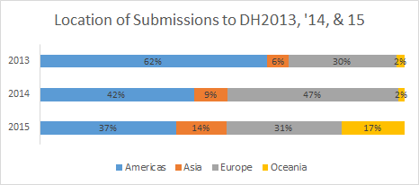
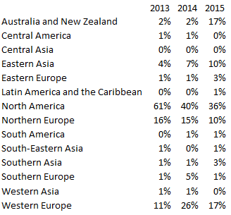

# Submissions to Digital Humanities 2015 (pt. 3)

<!-- page 1 -->

This is the third post in a three-part series analyzing submissions to the 2015 Digital Humanities conference in Australia. In parts [1](http://www.scottbot.net/HIAL/?p=41041) & [2](http://www.scottbot.net/HIAL/?p=41053), I covered submission volumes, topical coverage, and comparisons to conferences in previous years. This post will briefly address the geography of submissions, further exploring my criticism that this global-themed conference doesn’t feel so global after all. My geographic analysis shows the conference to be more international than I originally suspected.

I’d like to explore whether submissions to DH2015 are more broad in scope than those to previous conferences as well, but given time constraints, I’ll leave that exploration to a later post in this series, which has covered [submissions and acceptances at DH conferences since 2013](http://www.scottbot.net/HIAL/?tag=dhconf).

For this analysis, I looked at the universities of the submitting (usually lead) author on every submission, and used a geocoder to extract country, region, and continent data for each given university. This means that every submission is attached to one and only one location, even if other authors are affiliated with other places. Not perfect, but good enough for union work. After the geocoding, I corrected the results by hand[^1], and present those results here.

It is immediately apparent that the DH2015 authors represent a more diverse geographical distribution than those in previous years. DH2013 in Nebraska was the only conference of the three where over half of submissions were concentrated in one continental region, the Americas. The Switzerland conference in 2014 had a slightly more even regional distribution, but still had very few contributions (11%) from Asia or Oceania. Contrast these heavily skewed numbers against DH2015 in Australia, with a third of the contributions coming from Asia or Oceania.

<!-- page 2 -->

*DH submissions broken down by UN macro-continental regions.*

The trend continues broken down by UN micro-continental regions. The trends are not unexpected, but they are encouraging. When the conference was in Switzerland, Northern and Western Europe were much more well-represented, as was (surprisingly?) Eastern Asia. This may present the case that Eastern Asia’s involvement in DH is on the rise even not taking into account conference locations. Submissions for 2015 in Sydney are well-represented by Australia, New Zealand, Eastern Asia, and even Eastern Europe and Southern Asia.

<!-- page 3 -->

*DH conferences broken down by % covered from region in a given year.*

One trend is pretty clear: the dominance of North America. Even at its lowest point in 2015, authors from North America comprise over a third of submissions. This becomes even more stark in the animation below, on which every submitting author’s country is represented.

*DH2013-2015 with dots sized by the percent coverage that year.*

The coverage from the United States over the course of the last three years barely changes, and from Canada shrinks only slightly when the conference moves off of North America. The UK also pretty much retains its coverage 2013-2015, hovering around 10% of submissions. Everywhere else the trends are pretty clear: a slow move eastward as the conference moves east. It’ll be interesting to see how things change in Poland in 2016, and wherever it winds up going in 2017.

In sum, it turns out “Global Digital Humanities 2015″ is, at least geographically, much more global than the conferences of the previous two years.

<!-- page 4 -->

While the most popular topics are pretty similar to those in earlier years, I haven’t yet done an analysis of the diversity of the less popular topics, and it may be that they actually prove more diverse than those in earlier years. I’ll save that analysis for when the acceptances come in, though.

Notes:

[^1]: It’s a small enough dataset. There’s 648 unique institutional affiliations listed on submissions from 2013-2015, which resolved to 49 unique countries in 14 regions on 4 continents.
