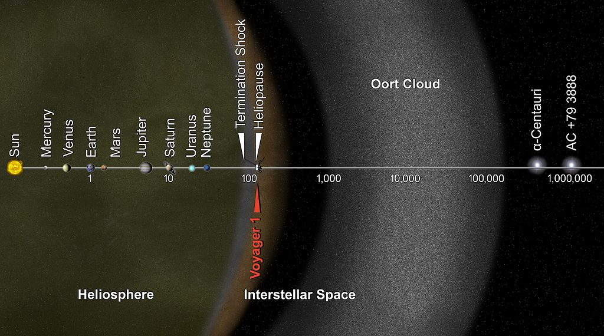
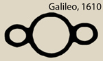
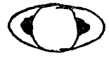
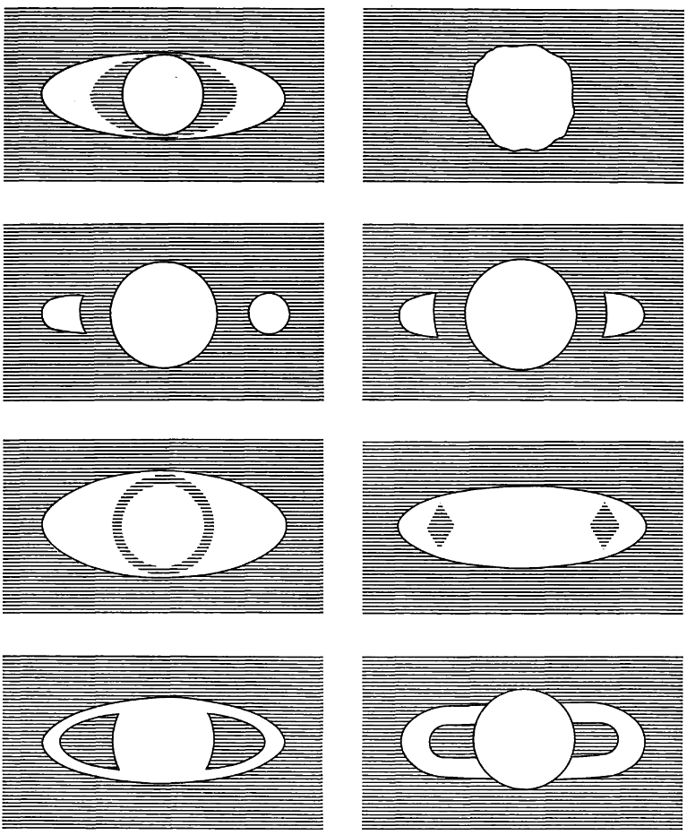
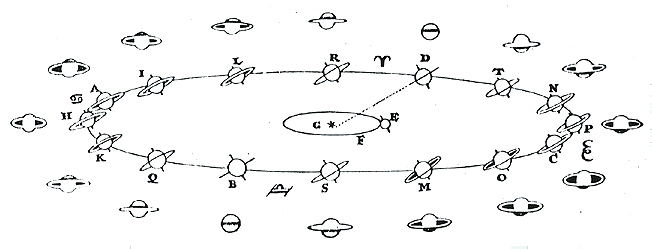
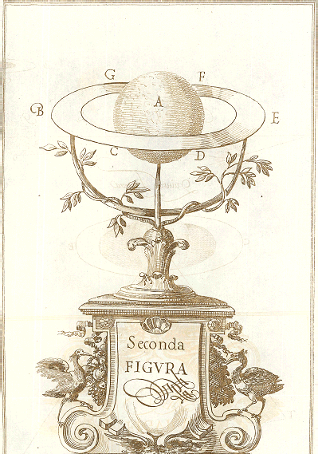
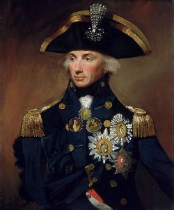
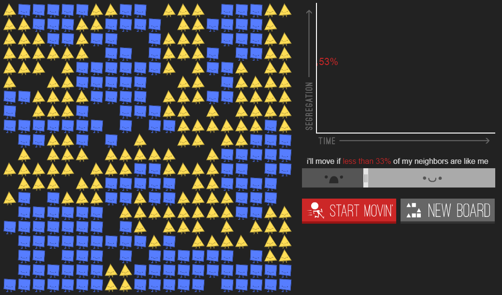

# Digital History, Saturn’s Rings, and the Battle of Trafalgar

<!-- page 1 -->

History and astronomy are a lot alike. When people claim history couldn’t possibly be scientific, because how can you do science without direct experimentation, astronomy should be used as an immediate counterexample.

Astronomers and historians both view their subjects from great distances; too far to send instruments for direct measurement and experimentation. Things have changed a bit in the last century for astronomy, of course, with the advent of machines sensitive enough to create earth-based astronomical experiments. We’ve also built ships to take us to the farthest reaches, for more direct observations.

<!-- page 2 -->

*Voyager 1 Spacecraft, on the cusp of interstellar space. \[[via](http://en.wikipedia.org/wiki/Voyager_1)\]*

It’s unlikely we’ll invent a time machine any time soon, though, so historians are still stuck looking at the past in the same way we looked at the stars for so many thousands of years: through a glass, darkly. Like astronomers, we face countless observational distortions, twisting the evidence that appears before us until we’re left with an echo of a shadow of the past. We recreate the past through narratives, combining what we know of human nature with the evidence we’ve gathered, eventually (hopefully) painting ever-clearer pictures of a time we could never touch with our fingers.

Some take our lack of direct access as a good excuse to shake away all trappings of “scientific” methods. This seems ill-advised. Retaining what we’ve learned over the past 50 years about how we construct the world we see is important, but it’s not the whole story, and it’s got enough parallels with 17th century astronomy that we might learn some lessons from that example.

## Saturn’s Rings

In the summer 1610, Galileo observed Saturn through a telescope for the first time. He wrote with surprise that

*Galileo’s Saturn. \[[via](http://seedmagazine.com/content/article/from_galileo_to_cassini/)\]*

> *the star of Saturn is not a single star, but is a composite of three, which almost touch each other, never change or move relative to each other, and are arranged in a row along the zodiac, the middle one being three times larger than the two lateral ones…*

This curious observation would take half a century to resolve into what we today see as Saturn’s rings. Galileo wrote that others, using inferior telescopes, would report seeing Saturn as oblong, rather than as three distinct spheres. Low and behold, within months, several observers reported an oblong Saturn.

<!-- page 3 -->

*Galileo’s Saturn in 1616.*

What shocked Galileo even more, however, was an observation two years later when the two smaller bodies disappeared entirely. They appeared consistently, with every observation, and then one day *poof* they’re gone. And when they eventually did come back, they looked remarkably odd.

Saturn sometimes looked as though it had “handles”, one connected to either side, but the nature of those handles were unknown to Galileo, as was the reason why sometimes it looked like Saturn had handles, sometimes moons, and sometimes nothing at all.

Saturn was just really damn weird. Take a look at these observations from Gassendi a few decades later:

<!-- page 4 -->

*Gassendi’s Saturn \[[via](http://adsabs.harvard.edu/full/1974JHA.....5..105V)\]*

What the heck was going on? Many unsatisfying theories were put forward, but there was no real consensus.

Enter Christiaan Huygens, who in the 1650s was fascinated by the Saturn problem. He believed a better telescope was needed to figure out what was going on, and eventually got some help from his brother to build one.

The idea was successful. Within short order, Huygens developed the hypothesis that Saturn was encircled by a ring. This explanation, along with the various angles we would be viewing Saturn and its ring from Earth, accounted for the multitude of appearances Saturn could take. The figure below explains this:

<!-- page 5 -->

*Huygens’ Saturn \[[via](http://galileo.rice.edu/sci/observations/saturn.html)\]*

The explanation, of course, was not universally accepted. An opposing explanation by an anti-Copernican Jesuit contested that Saturn had six moons, the configuration of which accounted for the many odd appearances of the planet. Huygens countered that the only way such a hypothesis could be sustained would be with inferior telescopes.

While the exact details of the dispute are irrelevant, the proposed solution was very clever, and speaks to contemporary methods in digital history. The Accademia del Cimento devised an experiment that would, in a way, test the opposing hypotheses. They built two physical models of Saturn, one with a ring, and one with six satellites configured just-so.

<!-- page 6 -->

*The Model of Huygens’ Saturn \[[via](http://www.dbnl.org/tekst/huyg003oeuv03_01/huyg003oeuv03_01_0095.php#z0796)\]*

In 1660, the experimenters at the academy put the model of a ringed Saturn at the end of a 75-meter / 250-foot hallway. Four torches illuminated the model but were obscured from observers, so they wouldn’t be blinded by the torchlight.  Then they had observers view the model through various quality telescopes from the other end of the hallway. The observers were essentially taken from the street, so they wouldn’t have preconceived notions of what they were looking at.

Depending on the distance and quality of the telescope, observers reported seeing an oblong shape, three small spheres, and other observations that were consistent with what astronomers had seen. When seen through a glass, darkly, a ringed Saturn does indeed form the most unusual shapes.

In short, the Accademia del Cimento devised an experiment, not to test the physical world, but to test whether an underlying reality could appear completely different through the various distortions that come along with how we observe it. If Saturn had rings, would it look to us as though it had two small satellites? Yes.

This did not prove Huygens’ theory, but it did prove it to be a viable candidate given the observational instruments at the time. Within a short time, the ring theory became generally accepted.

## The Battle of Trafalgar

So what’s Saturn’s ring have to do with the price of tea in China? What about digital history?

The importance is in the experiment and the model. You do not need direct access to phenomena, whether they be historical or astronomical, to build models, conduct experiments, or generally apply scientific-style methods to test, elaborate, or explore a theory.

<!-- page 7 -->

In October 1805, Lord Nelson led the British navy to a [staggering victory](http://en.wikipedia.org/wiki/Battle_of_Trafalgar) against the French and Spanish during the Napoleonic Wars. The win is attributed to Nelson’s unusual and clever battle tactics of dividing his forces in columns perpendicular to the single line of the enemy ships. Twenty-seven British ships defeated thirty-three Franco-Spanish ones. Nelson didn’t lose a single British ship lost, while the Franco-Spanish fleet lost twenty-two.

*Horatio Nelson \[[via](http://en.wikipedia.org/wiki/Battle_of_Trafalgar)\]*

But let’s say the prevailing account is wrong. Let’s say, instead, due to the direction of the wind and the superior weaponry of the British navy, victory was inevitable: no brilliant naval tactician required.

This isn’t a question of counterfactual history, it’s simply a question of competing theories. But how can we support this new theory without venturing into counterfactual thinking, speculation? Obviously Nelson did lead the fleet, and obviously he did use novel tactics, and obviously a resounding victory ensued. These are indisputable historical facts.

It turns out we can use a similar trick to what the Accademia del Cimento devised in 1660: pretend as though things are different (Saturn has a ring; Nelson’s tactics did not win the battle), and see whether our observations would remain the same (Saturn looks like it is flanked by two smaller moons; the British still defeated the French and Spanish).

It turns out, further, that someone’s already done this. In 2003, two Italian physicists [built a simulation](http://ieeexplore.ieee.org/xpl/login.jsp?tp=&arnumber=1231440&url=http%3A%2F%2Fieeexplore.ieee.org%2Fxpls%2Fabs_all.jsp%3Farnumber%3D1231440) of the Battle of Trafalgar, taking into account details of the ships, various strategies, wind direction, speed, and so forth. The simulation is a bit like a video game that runs itself: every ship has its own agency, with the ability to make decisions based on its environment, to attack and defend, and so forth.  It’s from a class of simulations called [agent-based models](http://en.wikipedia.org/wiki/Agent-based_model).

<!-- page 8 -->

When the authors directed the British ships to follow Lord Nelson’s strategy, of two columns, the fleet performed as expected: little loss of life on behalf of the British, major victory, and so forth. But when they ran the model *without* Nelson’s strategy, a combination of wind direction and superior British firepower still secured a British victory, even though the fleet was outnumbered.

> *…\[it’s said\] the English victory in Trafalgar is substantially due to the particular strategy adopted by Nelson, because a different plan would have led the outnumbered British fleet to lose for certain. On the contrary, our counterfactual simulations showed that English victory always occur unless the environmental variables (wind speed and direction) and the global strategies of the opposed factions are radically changed, which lead us to consider the British fleet victory substantially ineluctable.*

Essentially, they tested assumptions of an alternative hypothesis, and found those assumptions would also lead to the observed results. A military historian might (and should) quibble with the details of their simplifying assumptions, but that’s all part of the process of improving our knowledge of the world. Experts disagree, replace simplistic assumptions with more informed ones, and then improve the model to see if the results still hold.

## The Parable of the Polygons

This agent-based approach to testing theories about how society works is exemplified by the [Schelling segregation model](http://en.wikipedia.org/wiki/Thomas_Schelling). This week the model shot to popularity through Vi Hart and Nicky Case’s [Parable of the Polygons](http://ncase.me/polygons/), a fabulous, interactive discussion of some potential causes of segregation. Go click on it, play through it, experience it. It’s worth it. I’ll wait.

<!-- page 9 -->

Finished? Great! The model shows that, *even if* people only move homes if less than 1/3rd of their neighbors are the same color that they are, massive segregation will still occur. That doesn’t seem like too absurd a notion: everyone being happy with 2/3rds of their neighbors as another color, and 1/3rd as their own, should lead to happy, well-integrated communities, right?

Wrong, apparently. It turns out that people wanting 33% of their neighbors to be the same color as they are is *sufficient* to cause segregated communities. Take a look at the community created in Parable of the Polygons under those conditions:

*[Parable of the Polygons](http://ncase.me/polygons/)*

This shows that very light assumptions of racism can still easily lead to divided communities. It’s not making claims about racism, or about society: what it’s doing is showing that this particular model, where people want a third of their neighbors to be like them, is sufficient to produce what we see in society today. Much like Saturn having rings is sufficient to produce the observation of two small adjacent satellites.

<!-- page 10 -->

More careful work is needed, then, to decide whether the model is an accurate representation of what’s going on, but establishing that base, that the model is a plausible description of reality, is essential before moving forward.

## Digital History

Digital history is a ripe field for this sort of research. Like astronomers, we cannot ([yet?](http://en.wikipedia.org/wiki/TARDIS)) directly access what came before us, but we can still devise experiments to help support our research, in finding plausible narratives and explanations of the past. The NEH Office of Digital Humanities has already started [funding workshops](https://securegrants.neh.gov/publicquery/main.aspx?f=1&gn=HT-50030-10) and projects along these lines, although they are most often geared toward philosophers and literary historians.

The person doing the most thoughtful theoretical work at the intersection of digital history and agent-based modeling is likely [Marten Düring](http://martenduering.com/projects/computer-simulations-and-history/), who is definitely someone to keep an eye on if you’re interested in this area. An early innovator and strong practitioner in this field is [Shawn Graham](http://electricarchaeology.ca/about/), who actively blogs about related issues.  This technique, however, is far from the only one available to historians for devising experiments with the past. There’s a lot we can still learn from 17th century astronomers.

---

## Reader Comments

> **Brad**, March 27, 2015
>
> Scott, if I remember correctly, astronomers in the 17th C referred to the “ears of Saturn”. Because the rings could not be differentiated from the body of Saturn through the mid-1600s, the rings appeared as ears.
