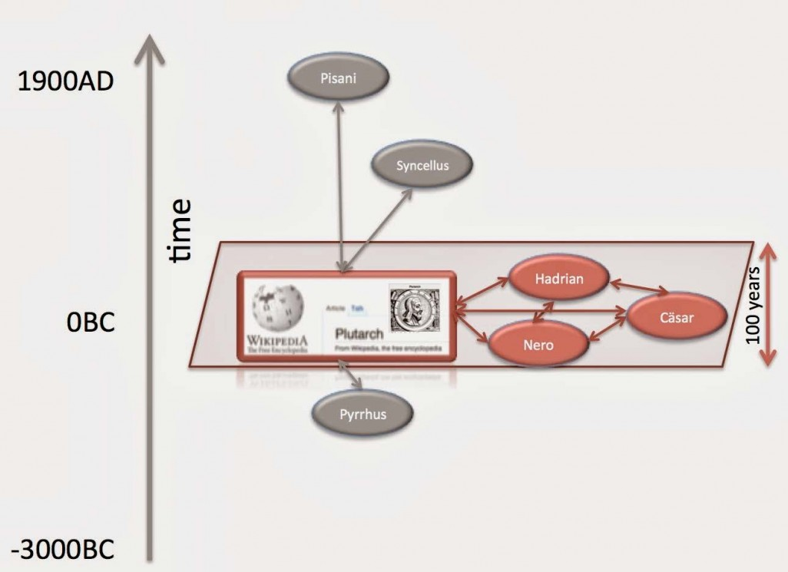
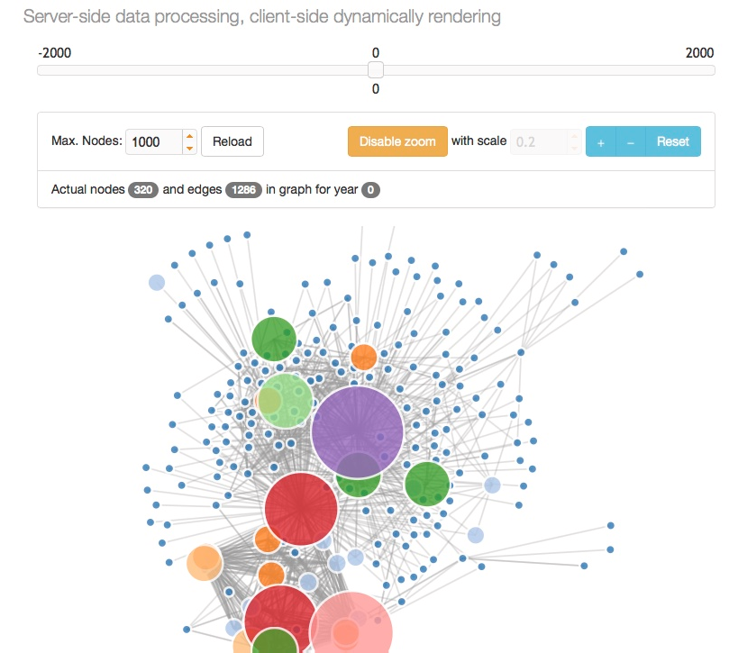
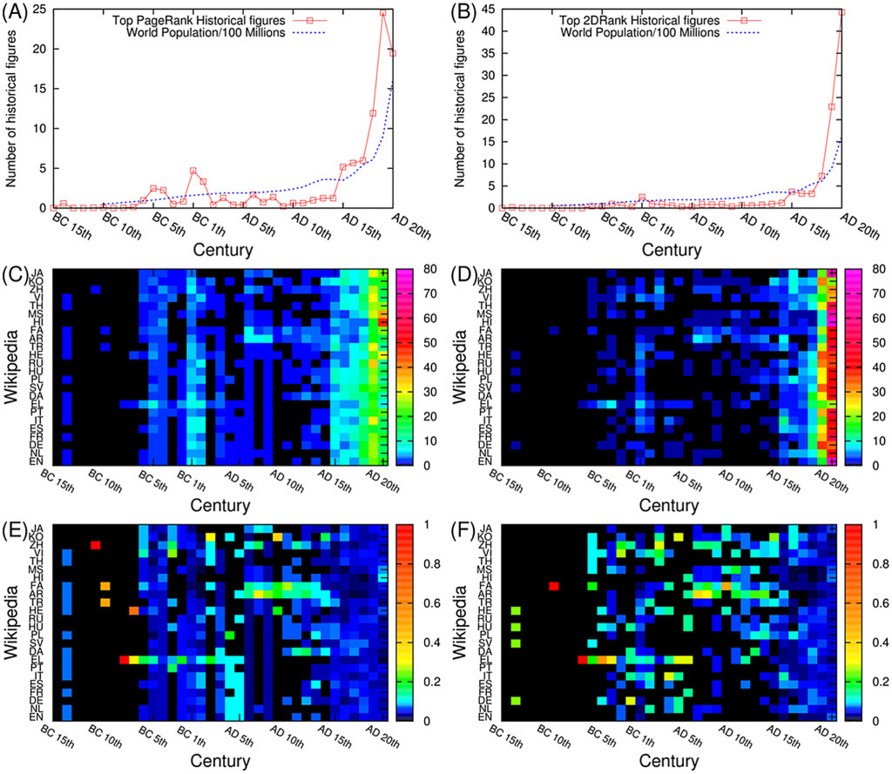

# Culturomics 2: The Search for More Money

<!-- page 1 -->

> *“God willing, we’ll all meet again in Spaceballs 2: The Search for More Money.” -Mel Brooks, Spaceballs, 1987*

A long time ago in a galaxy far, far away (2012 CE, Indiana), I wrote a few blog posts explaining that, when writing history, it might be good to talk to historians ([1](http://www.scottbot.net/HIAL/?p=12364),[2](http://www.scottbot.net/HIAL/?p=16713),[3](http://www.scottbot.net/HIAL/?p=39494)). They were popular posts for the Irregular, and inspired by Mel Brooks’ [recent interest](http://www.nydailynews.com/entertainment/movies/mel-brooks-talks-spaceballs-2-article-1.2108721) in making *Spaceballs 2*,  I figured it was time for a sequel of my own. You know, for all the money this blog pulls in.[^1]

Two teams recently published very similar articles, attempting cultural comparison via a study of historical figures in different-language editions of Wikipedia. The [first](http://arxiv.org/abs/1502.05256), by Gloor et al., is for a conference next week in Japan, and frames itself as cultural anthropology through the study of leadership networks. The [second](http://journals.plos.org/plosone/article?id=10.1371/journal.pone.0114825), by Eom et al. and just published in PLoS ONE, explores cross-cultural influence through historical figures who span different language editions of Wikipedia.

<!-- page 2 -->

Before reading the reviews, keep in mind I’m not commenting on method or scientific contribution—just historical soundness. This often doesn’t align with the original authors’ intents, which is fine. My argument isn’t that these pieces fail at their goals (science is, after all, iterative), but that they would be markedly improved by adhering to the same standards of historical rigor as they adhere to in their home disciplines, which they could accomplish easily by collaborating with a historian.

The road goes both ways. If historians don’t want physicists and statisticians bulldozing through history, we ought to be open to collaborating with those who don’t have a firm grasp on modern historiography, but who nevertheless have passion, interest, and complementary skills. If the point is understanding people better, by whatever means relevant, we need to do it together.

## Cultural Anthropology

“Cultural Anthropology Through the Lens of Wikipedia – A Comparison of Historical Leadership Networks in the English, Chinese, Japanese and German Wikipedia” by Gloor et al. [analyzes](http://arxiv.org/abs/1502.05256) “the historical networks of the World’s leaders since the beginning of written history, comparing them in the four different Wikipedias.”

Their method is simple ([simple isn’t bad!](http://tedunderwood.com/2013/02/20/wordcounts-are-amazing/)): take each “people page” in Wikipedia, and create a network of people based on who else is linked within that page. For example, if Wikipedia’s article on Mozart links to Beethoven, a connection is drawn between them. Connections are only drawn between people whose lives overlap; for example, the Mozart (1756-1791) Wikipedia page also links to Chopin (1810-1849), but because they did not live concurrently, no connection is drawn.

<!-- page 3 -->

*Figure 1 from [Gloor et al](http://arxiv.org/ftp/arxiv/papers/1502/1502.05256.pdf)*

A separate network is created for four different language editions of Wikipedia (English, Chinese, Japanese, German), because biographies in each edition are rarely exact translations, and often different people will be prominent within the same biography across all four languages. [PageRank](http://www.scottbot.net/HIAL/?p=39344) was calculated for all the people in the resulting networks, to get a sense of who the most central figures are according to the Wikipedia link structure.

“Who are the most important people of all times?” the authors ask, to which their data provides them an answer.[^2] In China and Japan, they show, only warriors and politicians make the cut, whereas religious leaders, artists, and scientists made more of a mark on Germany and the English-speaking world. Historians and biographers wind up central too, given how often their names appear on the pages of famous contemporaries on whom they wrote.

Diversity is also a marked difference: 80% of the “top 50″ people for the English Wikipedia were themselves non-English, whereas only 4% of the top people from the Chinese Wikipedia are not Chinese. The authors conclude that “probing the historical perspective of many different language-specific Wikipedias gives an X-ray view deep into the historical foundations of cultural understanding of different countries.”

<!-- page 4 -->

*Figure 3 from [Gloor et al](http://arxiv.org/ftp/arxiv/papers/1502/1502.05256.pdf)*

Small quibbles aside (e.g. their data include the year 0 BC, which [doesn’t exist](http://en.wikipedia.org/wiki/0_%28year%29)), the big issue here is the ease with which they claim these are the “most important” actors in history, and that these datasets provides an “X-ray” into the language cultures that produced them. This betrays the [same naïve assumptions that plague much of culturomics research](http://www.scottbot.net/HIAL/?p=16713): that you can uncritically analyze convenient datasets as a proxy for analyzing larger cultural trends.

<!-- page 5 -->

You can in fact analyze convenient datasets as a proxy for larger cultural trends, you just need some cultural awareness and a critical perspective.

In this case, several layers of assumptions are open for questioning, including:

- Is the PageRank algorithm a good proxy for historical importance? (The answer turns out to be yes in some situations, but probably not this one.)
- Is the link structure in Wikipedia a good proxy for historical dependency? (No, although it’s probably a decent proxy for current cultural popularity of historical figures, which would have been a better framing for this article. Better yet, these data can be used to explore the many well-known and unknown biases that pervade Wikipedia.)
- Can differences across language editions of Wikipedia be explained by any factors besides cultural differences? (Yes. For example, editors of the German-language Wikipedia may be less likely to write a German biography if one already exists in English, given that ≈64% of Germany speaks English.)

These and other questions, unexplored in the article, make it difficult to take at face value that this study can reveal important historical actors or compare cultural norms of importance. Which is a shame, because simple datasets and approaches like this one can produce culturally and scientifically valid results that wind up being incredibly important. And the scholars working on the project are top-notch, it’s just that they don’t have all the necessary domain expertise to explore their data and questions.

## Cultural Interactions

The great thing about PLoS is the quality control on its publications: [there isn’t much](http://www.plosone.org/static/publication). As long as primary research is presented, the methods are sound, the data are open, and the experiment is well-documented, you’re in.

<!-- page 6 -->

It’s a great model: all reasonable work by reasonable people is published, and history decides whether an article is worthy of merit. Contrast this against the current model, where (let’s face it) everything gets published eventually anyway, it’s just a question of how many journal submissions and rounds of peer review you’re willing to sit through. Research sits for years waiting to be published, subject to the whims of random reviewers and editors who may hold long grudges, when it could be out there the minute it’s done, open to critique and improvement, and available to anyone to draw inspiration or to learn from someone’s mistakes.

“Interactions of Cultures and Top People of Wikipedia from Ranking of 24 Language Editions” by Eom et al. is a perfect example of this model. Do I consider it a paragon of cultural research? Obviously not, if I’m reviewing it here. Am I happy the authors published it, respectful of their attempt, and willing to use it to push forward our mutual goal of soundly-researched cultural understanding? Absolutely.

Eom et al.’s piece, similar to that of Gloor et al. above, [uses links between Wikipedia people pages to rank historical figures and to make cultural comparisons](http://journals.plos.org/plosone/article?id=10.1371/journal.pone.0114825). The article explores 24 different language editions of Wikipedia, and goes one step further, using the data to explore intercultural influence. Importantly, given that this is a journal-length article and not a paper from a conference proceeding like Gloor et al.’s, extra space and thought was clearly put into the cultural biases of Wikipedia across languages. That said, neither of the articles reviewed here include any authors who identify themselves as historians or cultural experts.

This study collected data a bit differently from the last. Instead of a network connecting only those people whose lives overlapped, this network connected *all* pages within a single-language edition of Wikipedia, based only on links between articles.[^3] They then ranked pages using a number of metrics, including but not limited to PageRank, and only then automatically extracted people to find who was the most prominent in each dataset.

<!-- page 7 -->

In short, every Wikipedia article is linked in a network and ranked, after which all articles are culled except those about people. The authors explain: “On the basis of this data set we analyze spatial, temporal, and gender skewness in Wikipedia by analyzing birth place, birth date, and gender of the top ranked historical figures in Wikipedia.” By birth place, they mean the country *currently* occupying the location where a historical figure was born, such that Aristophanes, born in Byzantium 2,300 years ago, is considered Turkish for the purpose of this dataset. The authors note this can lead to cultural misattributions ≈3.5% of the time (e.g. Kant is categorized as Russian, having been born in a city now in Russian territory). They do not, however, call attention to the mutability of culture over time.

*Table 2 from [Eom et al](http://journals.plos.org/plosone/article?id=10.1371/journal.pone.0114825#pone.0114825.ref039).*

It is unsurprising, though comforting, to note that the fairly different approach to measuring prominence yields many of the same top-10 results as Gloor’s piece: Shakespeare, Napoleon, Bush, Jesus, etc.

Analysis of the dataset resulted in several worthy conclusions:

- Many of the “top” figures across all language editions hail from Western Europe or the U.S.

<!-- page 8 -->

- Language editions bias local heroes (half of top figures in Wikipedia English are from the U.S. and U.K.; half of those in Wikipedia Hindi are from India) and regional heroes (Among Wikipedia Korean, many top figures are Chinese).
- Top figures are distributed throughout time in a pattern you’d expect given global population growth, excepting periods representing foundations of modern cultures (religions, politics, and so forth).
- The farther you go back in time, the less likely a top figure from a certain edition of Wikipedia is to have been born in that language’s region. That is, modern prominent figures in Wikipedia English are from the U.S. or the U.K., but the earlier you go, the less likely top figures are born in English-speaking regions. (I’d question this a bit, given cultural movement and mutability, but it’s still a result worth noting).
- Women are consistently underrepresented in every measure and edition. More recent top people are more likely to be women than those from earlier years.

<!-- page 9 -->

*Figure 4 from Eom et al.*

The article goes on to describe methods and results for tracking cultural influence, but this blog post is already tediously long, so I’ll leave that section out of this review.

There are many methodological limitations to their approach, but the authors are quick to notice and point them out. They mention that Linnaeus ranks so highly because “he laid the foundations for the modern biological naming scheme so that plenty of articles about animals, insects and plants point to the Wikipedia article about him.” This research was clearly approached with a critical eye toward methodology.

Eom et al. do not fare as well historically as methodologically; opportunities to frame claims more carefully, or to ask different sorts of questions, are overlooked. I mentioned earlier that the research assumes historical cultural consistency, but cultural currents intersect languages and geography at odd angles.

The fact that Wikipedia English draws significantly from other locations the earlier you look should come as no surprise. But, it’s unlikely English Wikipedians are simply looking to more historically diverse subjects; rather, the locus of some cultural current (Christianity, mathematics, political philosophy) has likely moved from one geographic region to another. This should be easy to test with their dataset by looking at geographic clustering and spread in any given year. It’d be nice to see them move in that direction next.

I do appreciate that they tried to validate their method by comparing their “top people” to lists other historians have put together. Unfortunately, the only non-Wikipedia-based comparison they make is to a book written by an astrophysicist and white separatist with no historical training: “To assess the alignment of our ranking with previous work by historians, we compare it with \[Michael H.\] Hart’s list of the top 100 people who, according to him, most influenced human history.”

<!-- page 10 -->

## Top People

Both articles claim that an algorithm analyzing Wikipedia networks can compare cultures and discover the most important historical actors, though neither define what they mean by “important.” The claim rests on the notion that Wikipedia’s grand scale and scope smooths out enough authorial bias that analyses of Wikipedia can inductively lead to discoveries about Culture and History.

And critically approached, that notion is more plausible than historians might admit. These two reviewed articles, however, don’t bring that critique to the table.[^4] In truth, the dataset and analysis lets us look through a remarkably clear mirror into the cultures that created Wikipedia, the heroes they make, and the roots to which they feel most connected.

Usefully for historians, there is likely much overlap between history and the picture Wikipedia paints of it, but the nature of that overlap needs to be understood before we can use Wikipedia to aid our understanding of the past. Without that understanding, boldly inductive claims about History and Culture risk reinforcing the same systemic biases which we’ve slowly been trying to fix. I’m absolutely certain the authors don’t believe that only 5% of history’s most important figures were women, but the framing of the articles do nothing to dispel readers of this notion.

Eom et al. themselves admit “\[i\]t is very difficult to describe history in an objective way,” which I imagine is a sentiment we can all get behind. They may find an easier path forward in the company of some historians.

<!-- page 11 -->

[^1]: net income: -$120/year.

[^2]: If you’re curious, the 10 most important people in the English-speaking world, in order, are George W. Bush, ol’ Willy Shakespeare, Sidney Lee, Jesus, Charles II, Aristotle, Napoleon, Muhammad, Charlemagne, and Plutarch.

[^3]: Download their data [here](http://www.quantware.ups-tlse.fr/QWLIB/topwikipeople/).

[^4]: Actually the Eom et al. article does raise useful critiques, but mentioning them without addressing them doesn’t really help matters.
