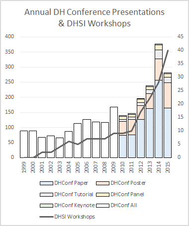
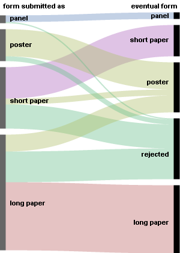
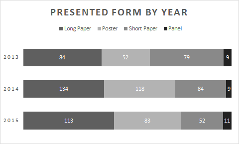
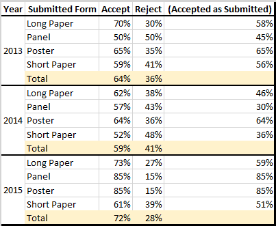
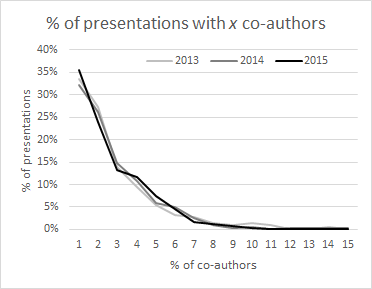
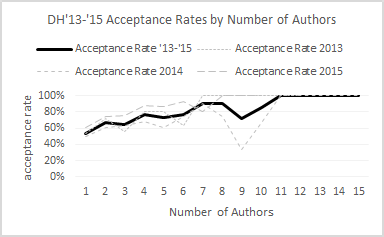

# Acceptances to Digital Humanities 2015 (part 1)

<!-- page 1 -->

**tl;dr**

Part 1 is about sheer numbers of acceptances to DH2015 and comparisons with previous years. DH is still growing, but the conference locale likely prohibited a larger conference this year than last. Acceptance rates are higher this year than previous years. Long papers still reign supreme. Papers with more authors are more likely to be accepted.

**Introduction**

It’s that time of the year again, when all the good little boys, girls, and other genders of DH gather around the scottbot irregular in ~~pointless meta-analysis~~ quiet self-reflection. As most of you know, the [2015 Digital Humanities conference](http://dh2015.org/) occurs next week in Sydney, Australia. They’ve just released the [final program](http://dh2015.org/abstracts/index.php), full of pretty exciting work, which means I can compare it to my analysis of submissions to DH2015 ([1](http://www.scottbot.net/HIAL/?p=41041), [2](http://www.scottbot.net/HIAL/?p=41053), & [3](http://www.scottbot.net/HIAL/?p=41064)) to see how DH is changing, how work gets accepted or rejected, etc. This is part of my [series on analyzing DH conferences](http://www.scottbot.net/HIAL/?tag=dhconf).

Part 1 will focus on basic counts, just looking at percentages of acceptance and rejection by the type of presentation, and comparing it with previous years. Later posts will cover topical, gender, geography, and kangaroos. *NOTE: When I say “acceptances”, I really mean “presentations that appear on the final program.” More presentations were likely accepted and withdrawn due to the expense of traveling to Australia, so take these numbers with appropriate levels of skepticism.*[^1]

<!-- page 2 -->

**Volume**

Around 270 papers, posters, and workshops are featured in this year’s conference program, down from last year’s ≈350 but up from DH2013’s ≈240. Although this is the first conference since 2010 with fewer presentations than the previous year’s, I suspect this is due largely to geographic and monetary barriers, and we’ll see a massive uptick next year in Poland and the following in (probably) North America. Whether or not the trend will continue to increase in 2018’s Antarctic locale, or 2019’s special Lunar venue, has yet to be seen.[^2]

*Annual presentations at DH conferences, compared to growth of DHSI in Victoria.*

As you can see from the chart above, even given this year’s dip, both DH2015 and the annual [DHSI](http://dhsi.org/) event in Victoria reveals DH is still on the rise. It’s also worth noting that last year’s DHSI was likely the first where more people attended it than the international ADHO conference.

<!-- page 3 -->

**Acceptance Rates**

A full 72% of submissions to DH2015 will be presented in Sydney next week. That’s significantly more inclusive than previous years: 59% of submitted manuscripts made it to DH2014 in Lausanne, and 64% to DH2013.

At first blush, the loss of exclusivity may seem a bad sign of a conference desperate for attendees, but to my mind the exact opposite is true: this is a great step forward. Conference peer review & acceptance decisions [aren’t particularly objective](http://blog.mrtz.org/2014/12/15/the-nips-experiment.html), so using acceptance as a proxy for quality or relevance is a bit of a misdirection. And if we can’t aim for consistent quality or relevance in the peer review process, we ought to aim at least for inclusivity, or higher acceptance rates, and let the participants themselves decide what they want to attend.

**Form**

Acceptance rates broken down by form (panel, poster, short paper, long paper) aren’t surprising, but are worth noting.

- 73% of submitted long papers were accepted, but only 59% of them were accepted as long papers. The other 14% were accepted as posters.
- 61% of submitted short papers were accepted, but only 51% as short papers; the other 10% became posters.
- 85% of posters were accepted, all of them as posters.
- 85% of panels were accepted, all of them as panels.
- A few papers/panels were converted into workshops.

<!-- page 4 -->

*How submitted articles eventually were rejected or accepted. (e.g. 59% of submitted long papers were accepted as long papers, 14% as posters, and 27% were rejected.)*

Weirdly, short papers tend to have a lower acceptance rate than long papers over the last three years. I think that’s because if a long paper is rejected, it’s usually further along in the process enough that it’s more likely to be secondarily accepted-as-a-poster, but even that doesn’t account for the entire differential in the acceptance rate. Anyone have any thoughts on this?

Looking over time, we see an increasingly large slice of the DH conference pie is taken up by long papers. My guess is this is just a natural growth as authors learn the difference between long and short papers, a distinction which was only introduced relatively recently.

<!-- page 5 -->

*A breakdown of presentation forms at the last three DH conferences.*

The breakdown of acceptance rates for each conference isn’t very informative, due in part to the fact I only have the last three years. In another few years this will probably become interesting, but for those who just can’t get enough o’ them sweet sweet numbers, here they are, special for you:

*Breakdown of conference acceptances 2013-2015. The rightmost column shows the percent of, for example, long papers that were not only accepted, but accepted AS long papers. Yellow rows are total acceptance rates per year.*

**Authorship**

DH is still pretty single-author-heavy. It’s getting better; over the last 10 years we’ve seen an upward trend in number of authors per paper (more details in a future blog post), but the last three years have remained pretty stagnant. This year, 35% of presentations & posters will be by a single author, 25% by two authors, 13% by 3 authors, and so on down the line. The numbers are unremarkably consistent with 2013 and 2014.

<!-- page 6 -->

*Percent of accepted presentations with a certain number of co-authors in a given year. (e.g. 35% of presentations in 2015 were single-authored.)*

We *do* however see an interesting trend in acceptance rates by number of authors. The more authors on your presentation, the more likely your presentation is to be accepted. This is true of 2013, 2014, and 2015. Single-authored works are 54% likely to be accepted, while works authored by two authors are 67% likely to be accepted. If your submission has more than 7 authors, you’re incredibly unlikely to get rejected.

*Acceptance rates by number of authors, 2013-2015. The more authors, the more likely a submission will be accepted.*

<!-- page 7 -->

Obviously this is pure description and correlation; I’m not saying multi-authored works are higher quality or anything else. Sometimes, works with more authors simply have more recognizable names, and thus are more likely to be accepted. That said, it is interesting that large projects seem to be favored in the peer review process for DH conferences.

Stay-tuned for parts 2, π, 16, and 4, which will cover such wonderful subjects as topicality, gender, and other things that seem neat.

Notes:

[^1]: The appropriate level of skepticism here is 19.27

[^2]: I hear Elon Musk is keynoting in 2019.

---

## Reader Comments

> [**maxkemman**](http://maxenlindi.wordpress.com/), June 24, 2015
>
> Thanks for this analysis Scott! One question about the multi-authored works: is this perhaps related to the type of submission? I can imagine that multi-authored works are more often panels or posters (showcasing a project rather than making an argument), which have higher acceptance rates, especially this year

>> **Scott Weingart**, June 24, 2015
>>
>> Great point, thanks! That makes a lot of sense. A quick analysis does indeed reveal that papers are more likely to have fewer authors, and posters more likely to have more, though unfortunately the dataset isn’t yet large enough when separating it out to say whether or not the effect you’re seeing is anything but noise. I suspect you’re right, though, and in a few years we should have enough data to test that.
