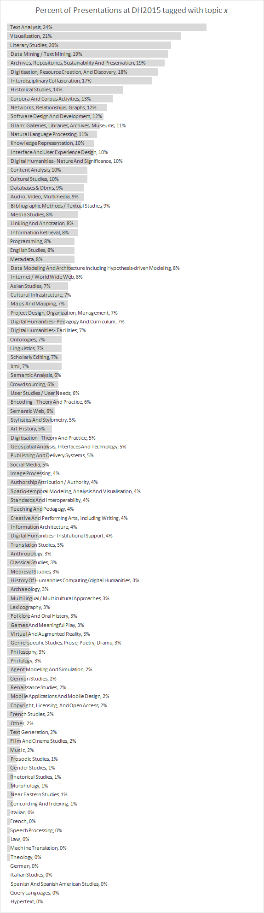
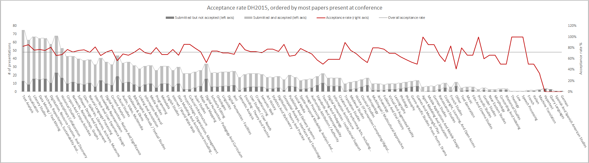
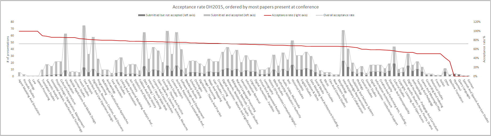
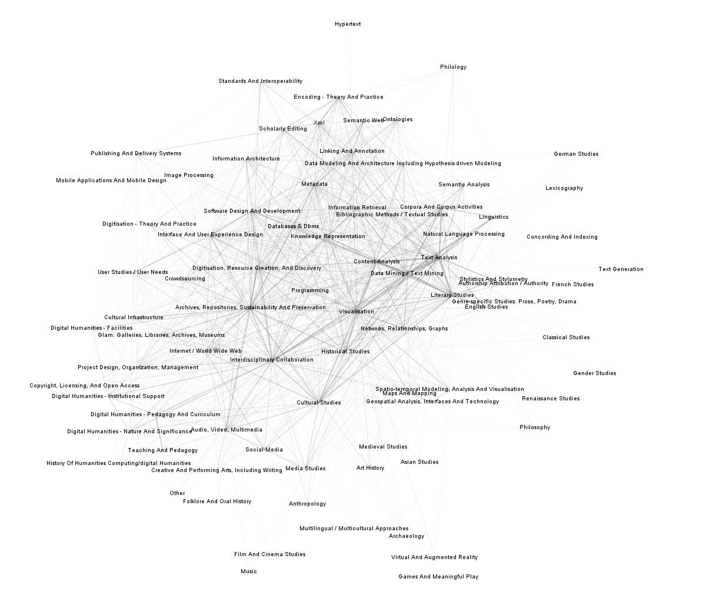

# Acceptances to Digital Humanities 2015 (part 2)

<!-- page 1 -->

Had enough yet? Too bad! Full-ahead into my analysis of DH2015, part of my [6,021-part series on DH conference submissions and acceptances](http://www.scottbot.net/HIAL/?tag=dhconf). If you want more context, read the [Acceptances to DH2015 part 1](http://www.scottbot.net/HIAL/?p=41327).

**tl;dr**

This post’s about the topical coverage of DH2015 in Australia. If you’re curious about how the landscape compares to previous years, see [this post](http://www.scottbot.net/HIAL/?p=41053). You’ll see a lot of text, literature, and visualizations this year, as well as archives and digitisation projects. You won’t see a lot of presentations in other languages, or presentations focused on non-text sources. Gender studies is pretty much nonexistent. If you want to get accepted, submit pieces about visualization, text/data, literature, or archives. If you want to get rejected, submit pieces about pedagogy, games, knowledge representation, anthropology, or cultural studies.

**Topical analysis**

I’m sorry. This post is going to contain a lot of giant pictures, because I’m in the mountains of Australia and I’d much rather see beautiful vistas than create interactive visualizations in d3. Deal with it, dweebs. You’re just going to have to do a lot of scrolling down to see the next batch of text.

This year’s conference presents a mostly-unsurprising continuations of the status quo (see [2014’s](http://www.scottbot.net/HIAL/?p=40695) and [2013’s](http://www.scottbot.net/HIAL/?p=35242) topical landscapes). Figure 1, below, shows the top author-chosen topic words of DH2015, as a proportion of the total presentations at the conference. For example, an impressive quarter, 24%, of presentations at DH2015 are about “text analysis”. The authors were able to choose multiple topics for each presentation, which is why the percentages add up to way more than 100%.

<!-- page 2 -->

*Scroll down for the rest of the post.*

<!-- page 4 -->

*Figure 1. Topical coverage of DH2015. Percent represents the % of presentations which authors have tagged with a certain topical keyword. Authors could tag multiple keywords per presentation.*

Text analysis, visualization, literary studies, data mining, and archives take top billing. History’s a bit lower, but at least there’s more history than the abysmal showing at DH2013. Only a tenth of DH2015 presentations are about DH itself, which is maybe impressive given how much we talk about ourselves? (cf. this post)

As usual, gender studies representation is quite low (1%), as are foreign language presentations and presentations not centered around text. I won’t do a lot of interpretation this post, because it’d mostly be repeat of earlier years. At any rate, acceptance rate is a bit more interesting than coverage this time around. Figure 2 shows acceptance rates of each topic, ordered by volume. Figure 3 shows the same, sorted by acceptance rate.

The topics that appear most frequently at the conference are on the far left, and the red line shows the percent of submitted articles that will be presented at DH2015. The horizontal black line is the overall acceptance rate to the conference, 72%, just to show which topics are above or below average.

<!-- page 5 -->

*Figure 2. Acceptance rates of topics to DH2015, sorted by volume. Click to enlarge.*

*Figure 3. Acceptance rates of topics to DH2015, sorted by acceptance rate. Click to enlarge.*

Notice that all the most well-represented topics at DH2015 have a higher-than-average acceptance rate, possibly suggesting a bit of [path-dependence](https://en.wikipedia.org/wiki/Path_dependence) on the part of peer reviewers or editors. Otherwise, it could mean that, since a majority peer reviewers were also authors in the conference, and since (as I’ve shown) the majority of authors have a leaning toward text, lit, and visualization, it’s also what they’re likely to rate highly in peer review.

The first dips we see under the average acceptance rate is “Interdisciplinary Studies” and “Historical Studies” (☹), but the dips aren’t all that low, and we ought not to read too much into it without comparing it to earlier conferences. More significant are the low rates for “Cultural Studies”, and even more than that are the two categories on Teaching, Pedagogy, and Curriculum. Both categories’ acceptance rates are about 20% under the average, and although they’re obviously correlated with one another, the acceptance rates are similar to 2014 and 2013. In short, *DH peer reviewers or editors are more unlikely to accept submissions on pedagogy than on most other topics*, even though they sometimes represent a decent chunk of submissions.

<!-- page 6 -->

Other low points worth pointing out are “Anthropology” (huh, no ideas there), “Games and Meaningful Play” (that one came as a surprise), and “Other” (can’t help you here). Beyond that, the submission counts are too low to read any meaningful interpretations into the data. The Game Studies dip is curious, and isn’t reflected in earlier conferences, so it could just be noise for 2015. The low acceptance rates in Anthropology are consistent 2013-2015, and it’d be worth looking more into that.

**Topical Co-Occurrence, 2013-2015**

Figure 4, below, shows how topics appear together on submissions to DH2013, DH2014, and DH2015. Technically this has nothing to do with acceptances, and little to do with this year specifically, but the visualization should provide a little context to the above analysis. Topics connect to one another if they appear on a submission together, and the line connecting them gets thicker the more connections two topics share.

<!-- page 7 -->

*Figure 4. Topical co-occurrence, 2013-2015. Click to enlarge.*

Although the “Interdisciplinary Collaboration” topic has a low acceptance rate, it understandably ties the network together; other topics that play a similar role are “Visualization”, “Programming”, “Content Analysis”, “Archives”, and “Digitisation”. All unsurprising for a conference where people come together around method and material. In fact, this reinforces our “DH identity” along those lines, at least insofar as it is represented by the annual ADHO conference.

There’s a lot to unpack in this visualization, and I may go into more detail in the next post. For now, I’ve got a date with the Blue Mountains west of Sydney.

---

## Reader Comments

> [**Prof. Janni Aragon**](http://web.uvic.ca/polisci/people/faculty/aragon.php), June 27, 2015
>
> Wow. I wish I could say that I am surprised. Thanks for sharing this.
