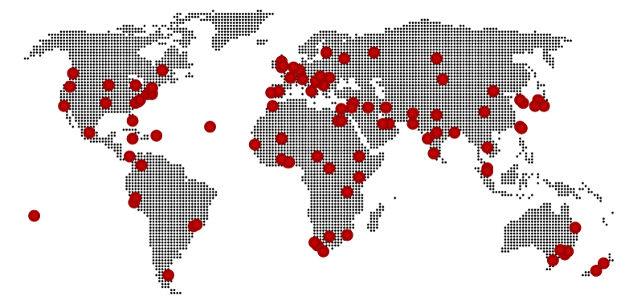
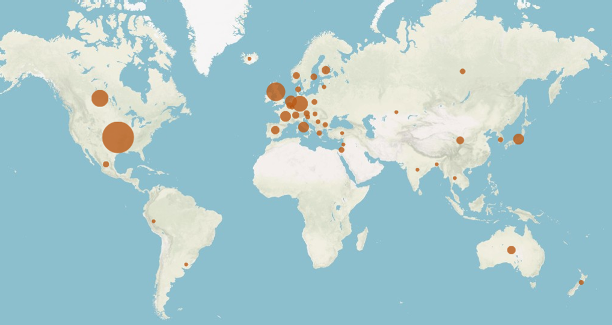
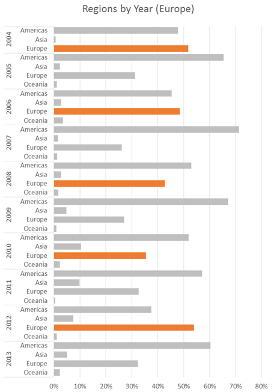
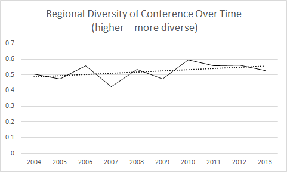
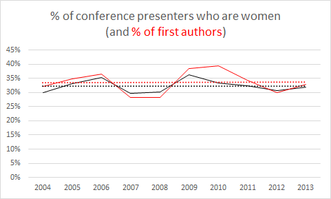

# Acceptances to Digital Humanities 2015 (part 3)

<!-- page 1 -->

**tl;dr**

There’s a disparity between gender diversity in authorship and attendance at [DH2015](http://dh2015.org/); attendees are diverse, authors aren’t. That said, the geography of attendance is actually pretty encouraging this year. A lot of this work draws a project on the history of DH conferences I’m undertaking with the inimitable [Nickoal Eichmann](http://t.co/wVjuUyh8rQ). She’s been integral on the research of everything you read about conferences pre-2013.

**Diversity at DH2015: Preliminary Numbers**

For those just joining us, I’m analyzing this year’s international Digital Humanities conference being held in Sydney, Australia ([part 1](http://www.scottbot.net/HIAL/?p=41327), [part 2](http://www.scottbot.net/HIAL/?p=41347)). This is the 10th post in a [series of reflective entries on Digital Humanities conferences](http://www.scottbot.net/HIAL/?tag=dhconf), throughout which I explore the landscape of Digital Humanities as it is represented by the ADHO conference. There are other Digital Humanities (a great place to start exploring them in Alex Gil’s [arounddh](http://arounddh.org/about/)), but since this is the biggest event, it’s also an integral reflection on our community to the public and non-DH academic world.

<!-- page 2 -->

*Figure 1. Map from [Around DH](http://www.arounddh.org/journey/) in 80 Days.*

If the DH conference is our public face, we all hope it does a good job of representing our constituent parts, big or small. It does not. The DH conference systematically underrepresents women and people from parts of the world that are not Europe or North America.

Until today, I wasn’t sure whether this was an issue of underrepresentation, an issue of lack of actual diversity among our constituents, or both. Today’s data have shown me it may be more underrepresentation than lack of diversity, although I can’t yet say anything with certainty without data from more conferences.

I come to this conclusion by comparing *attendees* to the conference to *authors of presentations* at the conference. My assumption is that if authorship and attendee diversity are equal, and both poor, then we have a diversity problem. If instead attendance is diverse but authorship is not, then we have a representation problem. It turns out, at least in this dataset, the latter is true. I’ve been able to reach the conclusion because the conference organizing committee (themselves a diverse, fantastic bunch) have published and made available the [DH2015 attendance list](http://dh2015.org/wp-content/uploads/2015/06/DH2015-Attendees.pdf).

Because this is an important subject, this post is more somber and more technically detailed than most others in this series.

**Geography**

The published Attendance List was nice enough to already attach country names to every attendee, so making [an interactive map](https://scottbot.cartodb.com/viz/34389002-1c67-11e5-b015-0e018d66dc29/public_map) to attendees was a simple manner of cleaning the data ([here it is as csv](http://www.scottbot.net/HIAL/wp-content/uploads/2015/06/DH2015-Attendees.csv)), aggregating it and plugging it into CartoDB.

<!-- page 3 -->

*Embedded: [interactive CartoDB map of DH2015 attendees by country](https://scottbot.cartodb.com/viz/34389002-1c67-11e5-b015-0e018d66dc29/public_map)*

Despite a lack of South American and African attendees, this is still a pretty encouraging map for DH2015, especially compared to earlier years. The geographic diversity of attendees is actually mirrored in the conference submissions ([analyzed here](http://www.scottbot.net/HIAL/?p=41064)), which to my mind means the ADHO decision to hold the conference somewhere other than North America or Europe succeeded in its goal of diversifying the organization. From what I hear, they hope to continue this trend by moving to a three-year rotation, between North America, Europe, and elsewhere. At least from this analysis, that’s a successful strategy.

<!-- page 4 -->

*Figure 2. DH submissions broken down by UN macro-continental regions (details in an [earlier post](http://www.scottbot.net/HIAL/?p=41064)).*

If we look at the locations of authors at ADHO conferences from 2004-2013, we see a very different profile than is apparent this year in Sydney. The figure below, made by my collaborator Nickoal Eichmann, shows all author locations from ADHO conferences in this 10-year range.

*Figure 3. ADHO conference author locations, 2004-2013. Figure by Nickoal Eichmann.*

Notice the difference in geographic profile from this year?

This also hides the sheer prominence of the Americas (really, just North America) at every single ADHO conference since 2004. The figure below shows the percentage of authors from different regions at DH2004-2013, with Europe highlighted in orange during the years the conference was held in Europe.

<!-- page 5 -->

*Figure 4. Geographic home of authors to ADHO conferences 2004-2013. Years when Europe hosted are highlighted in orange.*

If you take a second to study this visualization, you’ll notice that with only one major exception in 2012, *even when the conference was held in Europe, the majority of authors hailed from the Americas*. That’s cray-cray, yo. Compare that to 2015 data from Figure 2; the Americas are still technically sending most of the authors, but the authorship pool is significantly more regionally diverse than the decade of 2004-2013.

<!-- page 6 -->

Actually, even before the DH conference moved to Australia, we’ve been getting slightly more geographically diverse. Figure 5, below, shows a slight increase in diversity score from 2004-2013.

*Figure 5. Regional diversity of authors at ADHO conferences, 2004-2013.*

In sum, *we’re getting better!* Also, our diversity of attendance tends to match our diversity of authorship, which means we’re not suffering an underrepresentation problem on top of a lack of diversity. The lack of diversity is obviously still a problem, but it’s improving, and in no small part to the efforts of ADHO to move the annual conference further afield.

**Historical Gender**

Gravy train’s over, folks. We’re getting better with geography, sure, but what about gender? Turns out our gender representation in DH sucks, it’s always sucked, and unless we forcibly intervene, it’s likely to continue to suck.

We’ve probably inherited our gender problem from computer science, which is weird, because such a large percentage of leadership in DH organizations, committees, and centers are women. What’s more, the issue isn’t that women aren’t doing DH, it’s that they’re not being well-represented at our international conference. Instead they’re going to other conferences which are focused on diversity, which as Jacqueline Wernimont points out, is less than ideal.

<!-- page 7 -->

> *[@scott\_bot](https://twitter.com/scott_bot) was talking about this w [@amyeetx](https://twitter.com/amyeetx) and others and said that I’m frustrated to have other major events be the “gender” events 1/2*
>
> *— Jacqueline Wernimont (@profwernimont) [June 27, 2015](https://twitter.com/profwernimont/status/614625887087132672)*
>
> *[@scott\_bot](https://twitter.com/scott_bot) it matters that it’s ADHO (it is the umbrella assoc. after all) and the diversity in presentations isn’t there 2/2*
>
> *— Jacqueline Wernimont (@profwernimont) [June 27, 2015](https://twitter.com/profwernimont/status/614626117006307329)*

So what’s the data here? Let’s first look historically.

*Figure 6. Gender ratio of authors to presentations at DH2004-DH2013. First authorship ratio is in red. In collaboration with Nickoal Eichmann.*

Figure 6 shows percentage of women authors at DH2004-DH2013. The data were collected in collaboration with Nickoal Eichmann.[^1]

Notice the alarming tendency for DH conference authorship to hover between 30-35% women. Women fair slightly better as first authors—that is to say, if a woman authors an ADHO presentation, they’re more likely to be a first author than a second or third. This matches well with the fact that a lot of the governing body of DH organizations are women, and yet the ratio does not hold in authorship. I can’t really hazard a guess as to why that is.

<!-- page 8 -->

**Gender in 2015**

Which brings us to 2015 in Sydney. I was encouraged to see the organizing committee publish an [attendance list](http://dh2015.org/wp-content/uploads/2015/06/DH2015-Attendees.pdf), and immediately set out to find the gender distribution of attendees.[^2] *Hurray!* I [tweeted](https://twitter.com/scott_bot/status/614617416656498688). About 46% of attendees to DH2015 were women. That’s almost 50/50!

Armed with the same hope I’ve felt all week (what with two fantastic recent Supreme Court decisions, a Papal decree on global warming, and the dropping of confederate flags all over the country), I set out to count gender among authors at DH2015.

…

Preliminary results show 34.6%[^3] of authors at DH2015 are women. Status [quo quo quo quo](http://genius.com/1591318/Samuel-beckett-luckys-monologue/Quaquaquaqua).

So how do we reconcile the fact that only 35% of authors at DH2015 are women, yet 46% of attendees are? I’m interpreting this to mean that we don’t have a diversity problem, but a representation problem; for some reason, though women comprise nearly half of active participants at DH conferences, they only comprise a third of what’s actually presented at them.

This representation issue is further reflected by the [topical analysis of DH2015](http://www.scottbot.net/HIAL/?p=41347), which shows that only 10% of presentations are tagged as cultural studies, and only 1% as gender studies. Previous years show a similar low number for both topics. (It’s worth noting that cultural studies tend to have a slightly lower-than-average acceptance rate, while gender studies has a slightly higher-than-average acceptance rate. Food for thought.)

<!-- page 9 -->

Given this, how do we proceed? At an individual level, obviously, people are [already trying to figure out paths forward](https://jwernimont.wordpress.com/2015/06/26/build-a-better-list-of-code-experts/), but what about at the ADHO level? Their efforts, and efforts of constituent members, have been successful at improving regional diversity at our flagship annual event. What sort of intervention can we create to similarly improve our gender representation problems? Hopefully comments below, or Twitter conversation, might help us collaboratively build a path forward, or offer suggestions to ADHO for future events.[^4]

Stay-tuned for more DH2015 analyses, and in the meantime, keep on fighting the good fight. These are problems we can address as a community, and despite our many flaws, we can actually be [pretty good at changing things for the better](http://melissaterras.blogspot.co.uk/2013/05/on-changing-rules-of-digital-humanities.html) when we [notice our faults](http://sourceforge.net/p/tei/feature-requests/425/?page=1).

Notes:

[^1]: It’s worth noting we made a lot of simplifying assumptions that  we very much shouldn’t have, as [Miriam Posner so eloquently pointed out with regards to Getty’s Union List of Author Names](http://miriamposner.com/blog/humanities-data-a-necessary-contradiction/).

    We labeled authors as male, female, or unknown/other. We did not encode changes of author gender over time, even though we know of at least a few authors in the dataset for whom this would apply. We hope to remedy this issue in the near future by asking authors themselves to help us with identification, and we ourselves at least tried to be slightly more sensitive by labeling author gender by hand, rather than by using an algorithm to guess based on the author’s first name.

    This series of choices was problematic, but we felt it was worth it as a first pass as a vehicle to point out bias and lack of representation in DH, and we hope you all will help us improve our very rudimentary dataset soon.

[^2]: This is an even more problematic analysis than that of conference authorship. I used Lincoln Mullen’s fabulous [gender guessing library in R](https://github.com/ropensci/gender), which guesses gender based on first names and statistics from US Social Security data, but obviously given the regional diversity of the conference, a lot of its guesses are likely off. As with the above data, we hope to improve this set as time goes on.

<!-- page 10 -->

[^3]: Very preliminary, but probably not far off; again using Lincoln Mullen’s R library.

[^4]: Obviously I’m far from the first to come to this conclusion, and many ADHO committee members are already working on this problem (see GO::DH), but the more often we point out problems and try to come up with solutions, the better.
