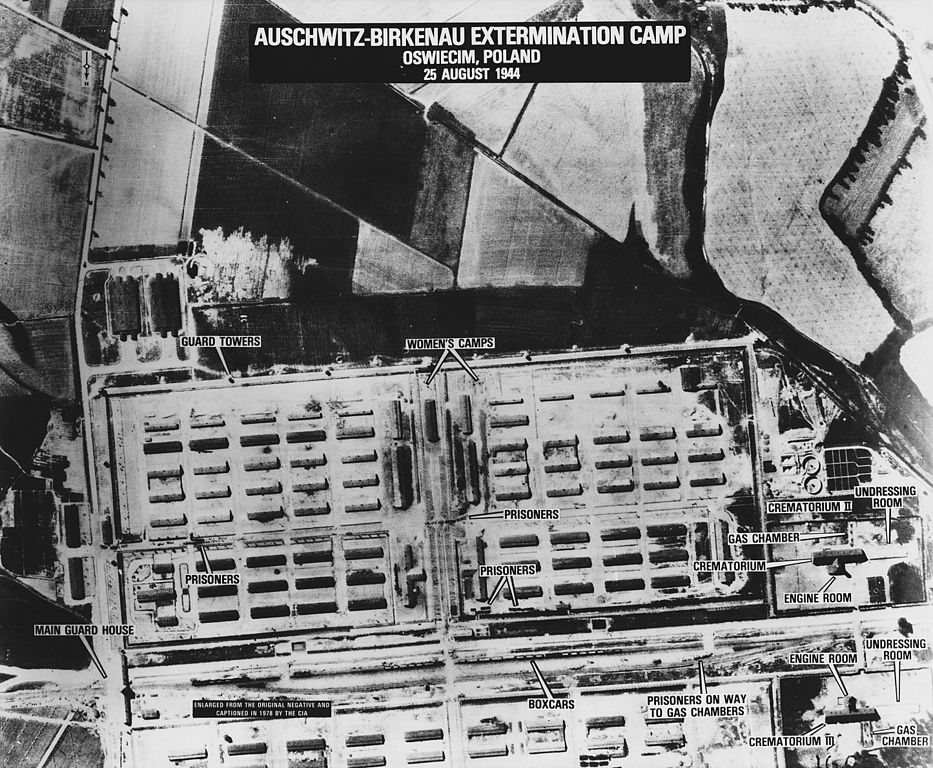
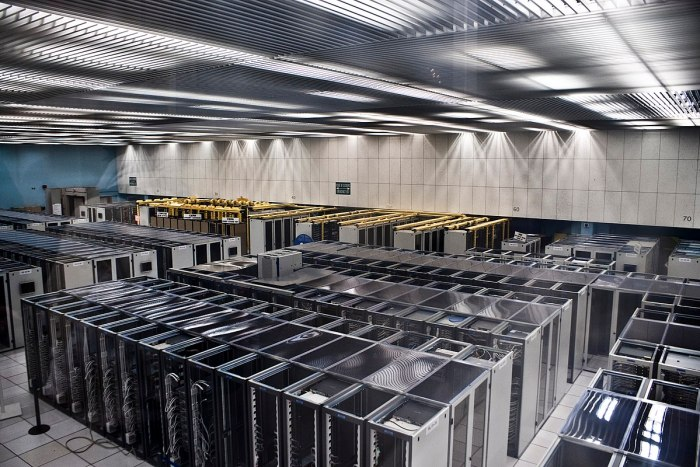

# Ghosts in the Machine

<!-- page 1 -->

Musings on materiality and cost after a tour of The Shoah Foundation.

## Forgetting The Holocaust

As the only historian in my immediate family, I’m responsible for our genealogy, saved in a massive [GEDCOM](https://en.wikipedia.org/wiki/GEDCOM) file. Through the wonders of the web, I now manage quite the sprawling tree: over 100,000 people, hundreds of photos, thousands of census records & historical documents. The majority came from distant relations managing their own trees, with whom I share.

Such a massive well-kept dataset is catnip for a digital humanist. I can analyze my family! The obvious first step is basic stats, like the most common last name (Aber), average number of kids (2), average age at death (56), or most-frequently named location (New York). As an American Jew, I wasn’t shocked to see New York as the most-common place name in the list. But I was unprepared for the second-most-common named location: **Auschwitz**.

I’m lucky enough to write this because my great grandparents all left Europe before 1915. My grandparents don’t have tattoos on their arms or horror stories about concentration camps, though I’ve met survivors their age. I never felt so connected to The Holocaust, *HaShoah*, until I took time to see explore the hundreds of branches of my family tree that simply stopped growing in the 1940s.

<!-- page 2 -->

*Aerial photo of Auschwitz-Birkenau. \[[via wikipedia](https://en.wikipedia.org/wiki/File:Birkenau25August1944.jpg)\]*

1 of every 16 Jews in the entire world were murdered in Auschwitz, about a million in all. Another 5 million were killed elsewhere. The global Jewish population before the Holocaust was 16.5 million, a number [we’re only now approaching again, 70 years later](http://time.com/3939972/global-jewish-population/). And yet, somehow, last month a school official and [national parliamentary candidate in Canada admitted](http://www.cbc.ca/news/canada/hamilton/news/canada-election-2015-ndp-hamilton-alex-johnstone-auschwitz-1.3241065) she “didn’t know what Auschwitz was”.

I grew up hearing “[Never Forget](https://en.wikipedia.org/wiki/Never_forget_(political_phrase))” as a mantra to honor the 11 million victims of hate and murder at the hands of Nazis, and to ensure it never happens again. That a Canadian official has forgotten—that we have all forgotten many of the other genocides that haunt human history—suggests how easy it is to forget. And how much work it is to remember.

## The material cost of remembering

<!-- page 3 -->

## 50,000 Holocaust survivors & witnesses

[*Yad Vashem*](https://en.wikipedia.org/wiki/Yad_Vashem) (“a place and a name”) represents the attempt to inscribe, preserve, and publicize the names of Jewish Holocaust victims who have no-one to remember them. Over four million names have been collected to date.

[The USC Shoah Foundation](https://en.wikipedia.org/wiki/USC_Shoah_Foundation_Institute_for_Visual_History_and_Education), founded by Steven Spielberg in 1994 to remember Holocaust survivors and witnesses, is both smaller and larger than *Yad Vashem*. Smaller because the number of survivors and witnesses still alive in 1994 numbered far fewer than *Yad Vashem*‘s 4.3 million; larger because the foundation conducted video interviews: 100,000 hours of testimony from 50,000 individuals, plus recent additions of witnesses and survivors of other genocides around the world. Where *Yad Vashem* remembers those killed, the Shoah Foundation remembers those who survived.  **What does it take to preserve the memories of 50,000 people?**

I got a taste of the answer to that question at a workshop this week hosted by [USC’s Digital Humanities Program](https://dornsife.usc.edu/digitalhumanities/about/), who were kind enough to give us a tour of the Shoah Foundation facilities. [Sam Gustman](https://sfi.usc.edu/about/staff/sam-gustman), the foundation’s CTO and Associate Dean of USC’s Libraries, gave the tour.

*Shoah Foundation Digitization Facility \[via my camera\]*

Digital preservation it a complex process. In this case, it began by digitizing 235,000 analog [Betacam SP Videocassettes](https://en.wikipedia.org/wiki/Betacam), on which the original interviews had been recorded, a [process which took from 2008-2012](http://webcache.googleusercontent.com/search?q=cache%3Ahttps%3A%2F%2Fsfi.usc.edu%2Fnews%2F2012%2F06%2Fusc-shoah-foundation-institute-completes-preservation-holocaust-testimonies). This had to be done quickly (automatically/robotically), given that cassette tapes are prone to become sticky, brittle, and [unplayable](http://www.imagepermanenceinstitute.org/webfm_send/303) within a few decades due to hydrolysis. They digitized about 30,000 hours per year. The process eventually produced [8 petabytes (link to more technical details)](https://lib.stanford.edu/files/pasig2009sf/Shoah-Foundation-Architecture-final.pdf) of  [lossless JPEG 2000](https://en.wikipedia.org/wiki/JPEG_2000) videos, roughly the equivalent of 2 million DVDs. Stacked on top of each other, those DVDs would reach three times higher than Burj Khalifa, the world’s tallest tower.

<!-- page 4 -->

From there, the team spent quite some time correcting errors that existed in the original tapes, and ones that were introduced in the process of digitization. They employed a small army of signal processing students, patented new technologies for automated error detection & processing/cleaning, and wound up [cleaning video from about 12,000 tapes](http://www.wired.com/insights/2014/01/video-restoration-innovation-restores-holocaust-testimony/). According to our tour guide, cleaning is still happening.

Lest you feel safe knowing that digitization lengthens the preservation time, turns out you’re wrong. Film lasts longer than most electronic storage, but making film copies would have [cost the foundation $140,000,000](http://articles.latimes.com/2012/jun/25/entertainment/la-et-ct-shoah-foundation-completes-digitization-of-holocaust-survivor-testimonies-20120625) and made access incredibly difficult. Digital copies would only cost tens of millions of dollars, even though hard-drives couldn’t be trusted to last more than a decade. [Their solution](http://www.oracle.com/us/corporate/press/1577231) was a [RAID hard-drive system](https://en.wikipedia.org/wiki/RAID) in an [Oracle StorageTek SL8500](http://www.oracle.com/us/products/servers-storage/storage/tape-storage/034341.pdf) (of which they have two), and a nightly process of checking video files for even the slightest of errors. If an error is found, a backup is loaded to a new cartridge, and the old cartridge is destroyed. Their two StorageTeks each fit over 10,000 drive cartridges, have 55 petabytes worth of storage space, weigh about 4,000 lbs, and are about the size of a New York City apartment. If a drive isn’t backed up and replaced within three years, they throw it out and replace it anyway, just in case. And this setup apparently [saved the Shoah Foundation $6 million](http://www.businesswire.com/news/home/20081203005564/en/USC-Shoah-Foundation-Institute-Launches-Important-Living).

*StorageTek SL8500 \[[via CERN](http://cern.ch/)\]*

Oh, and they have another facility a few states away, connected directly via high-bandwidth fiber optic cables, where everything just described is duplicated in case California falls into the ocean.

Not bad for something that [costs libraries $15,000 per year](https://sfiaccess.usc.edu/Documents/VHA%20Access%20OverviewRoadmap.pdf), which is about the same the library would pay for [*one damn chemistry journal*](http://www.tandfonline.com/action/pricing?journalCode=gcoo20#.VjZ2H7erS50)*.*

<!-- page 5 -->

So **how much does it cost to remember 50,000 Holocaust witnesses and survivors** for, say, 20 years? I mean, above and beyond the cost of building a cutting edge facility, developing new technologies of preservation, cooling and housing a freight container worth of hard drives, laying fiber optic cables below ground across several states, etc.? I don’t know. But I do know how much the Shoah Foundation would charge you to save 8 petabytes worth of videos for 20 years, if you were a USC Professor. [They’d charge you $1,000/TB/20 years](http://www.ists.dartmouth.edu/docs/samgustman_slides10-26-12.pdf).

The Foundation’s videos take up 8,000 terabytes, which at $1,000 each would cost you $8 million per 20 years, or about **half a million dollars per year**. Combine that with all the physical space it takes up, and **never forgetting the Holocaust is sounding rather prohibitive**. And what about after 20 years, when modern operating systems forget how to read JPEG 2000 or interface with StorageTek T10000C Tape Drives, and the Shoah Foundation needs to undertake another massive data conversion? I can see why that Canadian official didn’t manage it.

## The Reconcentration of Holocaust Survivors

While I appreciated the guided tour of the exhibit, and am thankful for the massive amounts of money, time, and effort scholars and donors are putting into remembering Holocaust survivors, I couldn’t help but be creeped out by the experience.

Our tour began by entering a high security facility. We signed our names on little pieces of paper and were herded through several layers of locked doors and small rooms. Not quite the way one expects to enter the project tasked with remembering *and respecting* the victims of genocide.

The Nazi’s assembly-line techniques for mass extermination led to starkly regular camps, like Auschwitz pictured above, laid out in efficient grids for the purpose of efficient control and killings. “Concentration camp”, by the way, refers to the concentration of people into small spaces, coming from [“reconcentration camps” in Cuba](https://books.google.com/books?id=1wv5KHk2_dsC&pg=PA193). Now we’re concentrating 50,000 testimonies into a couple of closets with production line efficiency, reconcentrating the stories of people who dispersed across the world, so they’re all in one easy-to-access place.

<!-- page 6 -->

*Server farm \[[via wikipedia](https://it.wikipedia.org/wiki/Server_farm#/media/File:CERN_Server_03.jpg)\]*

We’ve squeezed 100,000 hours of testimony into a server farm that consists of a series of boxes embedded in a series of larger boxes, all aligned to a grid; input, output, and eventual destruction of inferior entities handled by robots. Audits occur nightly.

The Shoah Foundation materials were collected, developed, and preserved with the utmost respect. The goal is just, the cause respectable, and the efforts incredibly important. And by reconcentrating survivors’ stories, they can now be accessed by the world. I don’t blame the Foundation for the parallels which are as much a construct of my mind as they are of the society in which this technology developed. Still, on Halloween, it’s hard to avoid reflecting on the material, monetary, and ultimately dehumanizing costs of processing ghosts into the machine.
