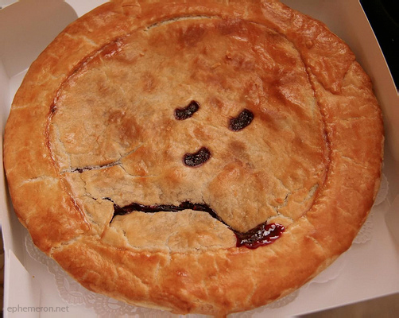

# “Digital History” Can Never Be New

<!-- page 1 -->

If you claim computational approaches to history (“digital history”) lets historians ask new types of questions, or that they offer new historical approaches to answering or exploring old questions, you are wrong. You’re not actually wrong, but you are institutionally wrong, which is maybe worse.

This is a problem, because rhetoric from practitioners (including me) is that we can bring some “new” to the table, and when we don’t, we’re called out for not doing so. The exchange might (but probably won’t) go like this:

> **Digital Historian**: And this graph explains how velociraptors were of utmost importance to Victorian sensibilities.
>
> **Historian in Audience**: But how is this telling us anything we haven’t already heard before? Didn’t John Hammond already make the same claim?
>
> **DH**: That’s true, he did. One thing the graph shows, though, is that velicoraptors *in general* tend to play much more unimportant roles across hundreds of years, which lends support to the Victorian thesis.
>
> **HiA**: Yes, but the generalized argument doesn’t account for cultural differences across those times, so doesn’t meaningfully contribute to this (or any other) historical conversation.

<!-- page 2 -->

## New Questions

History (like any discipline) is made of people, and those people have *Ideas* about what does or doesn’t count as history (well, historiography, but that’s a long word so let’s ignore it). If you ask a new type of question or use a new approach, that new thing probably doesn’t fit historians’ *Ideas* about proper history.

Take [culturomics](http://science.sciencemag.org/content/331/6014/176). They make claims like this:

<!-- page 3 -->

> The age of peak celebrity has been consistent over time: about 75 years after birth. But the other parameters have been changing. Fame comes sooner and rises faster. Between the early 19th century and the mid-20th century, the age of initial celebrity declined from 43 to 29 years, and the doubling time fell from 8.1 to 3.3 years.

Historians saw those claims and asked “so what”? It’s not interesting or relevant according to the things historians usually consider interesting or relevant, and it’s problematic in ways historians find things problematic. For example, it ignores cultural differences, does not speak to actual human experiences, and has nothing of use to say about a particular historical moment.

It’s true. Culturomics-style questions do not fit well within a humanities paradigm ([incommensurable](https://en.wikipedia.org/wiki/Commensurability_(philosophy_of_science)), anyone?). By the standard measuring stick of what makes a good history project, culturomics does not measure up. A new type of question requires a new measuring stick; in this case, I think a good one for culturomics-style approaches is [the extent to which they bridge individual experiences with large-scale social phenomena](http://scottbot.net/bridging-token-and-type/), or how well they are able to reconcile statistical social regularities with free or contingent choice.

<!-- page 4 -->

The point, though, is a culturomics presentation would fit few of the boxes expected at a history conference, and so would be considered a failure. Rightly so, too—it’s a bad history presentation. But what culturomics *is* successfully doing is asking new types of questions, whether or not historians find them legitimate or interesting. Is it good culturomics?

To put too fine a point on it, since history is often a question-driven discipline, **new types of questions that are too different from previous types are no longer legitimately within the discipline of history**, even if they are intrinsically about human history and do not fit in any other discipline.

What’s more, new types of questions may appear simplistic by historian’s standards, because they fail at fulfilling even the most basic criteria usually measuring historical worth. It’s worth keeping in mind that, to most of the rest of the world, our historical work often fails at meeting *their* criteria for worth.

## New Approaches

New approaches to old questions share a similar fate, but for different reasons. That is, if they are novel, they are not interesting, and if they are interesting, they are not novel.

Traditional historical questions are, let’s face it, not particularly new. Tautologically. Some old questions in my field are: what role did now-silent voices play in constructing knowledge-making instruments in 17th century astronomy? How did scholarship become institutionalized in the 18th century? Why was Isaac Newton so annoying?

<!-- page 5 -->

My own research is an attempt to provide a broader view of those topics (at least, the first two) using computational means. Since my topical interest has a rich tradition among historians, it’s unlikely any of my historically-focused claims (for example, that scholarly institutions were built to replace the really complicated and precarious role people played in coordinating social networks) will be without precedent.

After decades, or even centuries, of historical work in this area, there will always be examples of historians already having made my claims. My contribution is the bolstering of a particular viewpoint, the expansion of its applicability, the reframing of a discussion. Ultimately, maybe, I convince the world that certain social network conditions play an important role in allowing scholarly activity to be much more successful at its intended goals. *My contribution is not, however, a claim that is wholly without precedent*.

But this is a problem, since DH rhetoric, even by practitioners, can understandably lead people to expect such novelty. Historians in particular are *very* good at fitting old patterns to new evidence. It’s what we’re trained to do.

Any historical claim (to an acceptable question within the historical paradigm) can easily be countered with “but we already *knew* that”. Either the question’s been around long enough that every plausible claim has been covered, or the new evidence or theory is similar enough to something pre-existing that it can be taken as precedent.

<!-- page 6 -->

The most masterful recent discussion of this topic was Matthew Lincoln’s [Confabulation in the humanities](http://matthewlincoln.net/2015/03/21/confabulation-in-the-humanities.html), where he shows how easy it is to make up evidence and get historians to agree that they already knew it was true.

To put too fine a point on it, new approaches to old historical questions are destined to produce results which conform to old approaches; or if they don’t, it’s easy enough to stretch the old & new theories together until they fit. **New approaches to old questions will fail at producing completely surprising results; this is a bad standard for historical projects**. If a novel methodology were to create truly unrecognizable results, it is unlikely those results would be recognized as “good history” within the current paradigm. That is, historians would struggle to care.

## What Is This Beast?

What is this beast we call digital history? Boundary-drawing is a [tried-and-true tradition in the humanities, digital or otherwise](http://lareviewofbooks.org/article/neoliberal-tools-archives-political-history-digital-humanities/). It’s theoretically kind of stupid but practically incredibly important, since funding decisions, tenure cases, and similar career-altering forces are at play. If digital history is a type of history, it’s fundable as such, tenurable as such; [if it isn’t, it ain’t](https://www.goodreads.com/quotes/16478-contrariwise-continued-tweedledee-if-it-was-so-it-might-be). What’s more, if what culturomics researchers are doing are also history, their already-well-funded machine can start taking slices of the [sad NEH pie](http://www.slideshare.net/bbobley/bobleyinternationalresearch).

<!-- page 7 -->

<!-- page 8 -->

*Artist’s rendition of sad NEH pie. \[[via](http://ramblingsofamisfittoy.blogspot.com/2012_10_01_archive.html)\]*

So “what counts?” is unfortunately important to answer.

This discussion around what is “legitimate history research” is really important, but I’d like to table it for now, because it’s so often conflated with the discussion of what is “legitimate research” *sans* history. The former question easily overshadows the latter, since academics are mostly just schlubs trying to make a living.

For the last century or so, history and philosophy of science have been smooshed together in departments and conferences. It’s caused a lot of concern. Does history of science need philosophy of science? Does philosophy of science need history of science? What does it mean to combine the two? Is what comes out of the middle even useful?

Weirdly, the question sometimes comes down to “does *history and philosophy of science* even exist?”. It’s weird because people identify with that combined title, so I [published a citation analysis in *Erkenntnis*](http://link.springer.com/article/10.1007/s10670-014-9621-1/fulltext.html) a few years back that basically showed that, indeed, there is an area between the two communities, and indeed those people describe themselves as doing *HPS*, whatever that means to them.

<!-- page 9 -->

*Look! Right in the middle there, it’s history and philosophy of science.*

I bring this up because digital history, as many of us practice it, leaves us floating somewhere between public engagement, social science, and history. Culturomics occupies a similar interstitial space, though inching closer to social physics and complex systems.

<!-- page 10 -->

From this vantage point, we have a couple of options. We can say digital history is just history from a slightly different angle, and try to be evaluated by standard historical measuring sticks—which would make our work easily criticized as not particularly novel. Or we can say digital history is something new, occupying that in-between space—which could render the work unrecognizable to our usual communities.

The either/or proposition is, of course, ludicrous. The best work being done now skirts the line, offering something just novel enough to be surprising, but not so out of traditional historical bounds as to be grouped with culturomics. But I think we need to more deliberate and organized in this practice, lest we want to be like History and Philosophy of Science, still dealing with basic questions of legitimacy fifty years down the line.

In the short term, this probably means trying not just to avoid the rhetoric of newness, but to actively curtail it. In the long term, it may mean allying with like-minded historians, social scientists, statistical physicists, and complexity scientists to build a new framework of legitimacy that recognizes the forms of knowledge we produce which don’t always align with historiographic standards. As [Cassidy Sugimoto and I recently wrote](http://www.emeraldinsight.com/doi/full/10.1108/JD-06-2014-0082), this often comes with journals, societies, and disciplinary realignment.

<!-- page 11 -->

**The least we can do is steer away from a novelty rhetoric, since what is novel often isn’t history, and what is history often isn’t novel.**

## “Branding” – An Addendum

After writing this post, I read Amardeep Singh’s [call to, among other things, avoid branding](http://www.electrostani.com/2016/05/in-defense-of-digital-tools-by-non-tool.html):

> Here’s a way of thinking that might get us past this muddle (and I think I agree with the authors that the hype around DH is a mistake): let’s stop branding our scholarship. We don’t need Next Big Things and we don’t need Academic Superstars, whether they are DH Superstars or Theory Superstars. What we do need is to find more democratic and inclusive ways of thinking about the value of scholarship and scholarly communities.

This is relevant here, and good, but tough to reconcile with the earlier post. In an ideal world, without disciplinary brandings, we can all try to be welcoming of works on their own merits, without relying our preconceived disciplinary criteria. In the present condition, though, it’s tough to see such an environment forming. In that context, maybe a unified digital history “brand” is the best way to stay afloat. This would build barriers against whatever new thing comes along next, though, so it’s a tough question.
