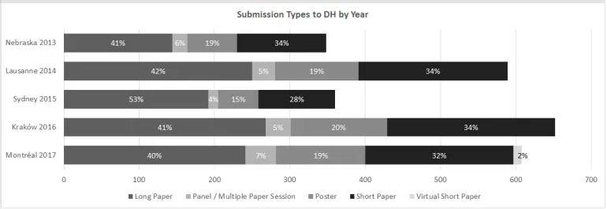
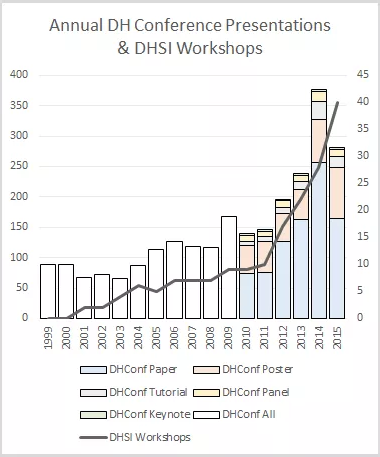
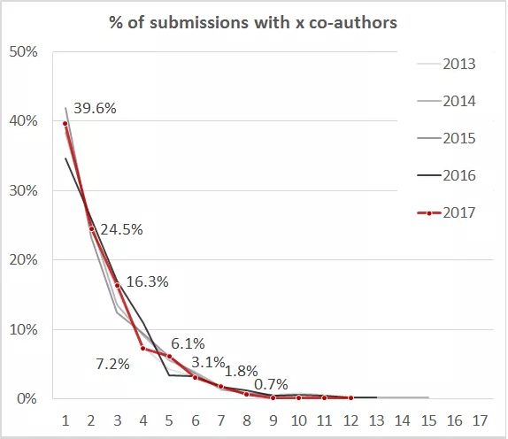
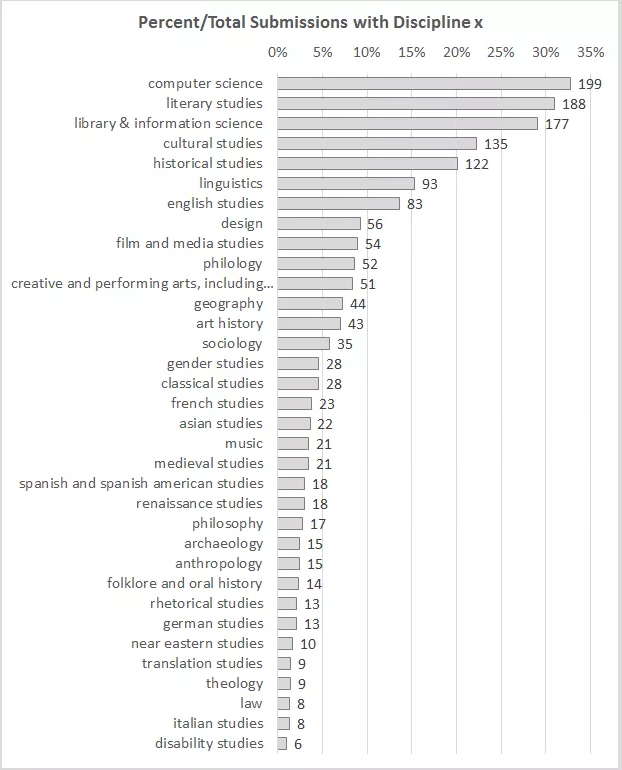
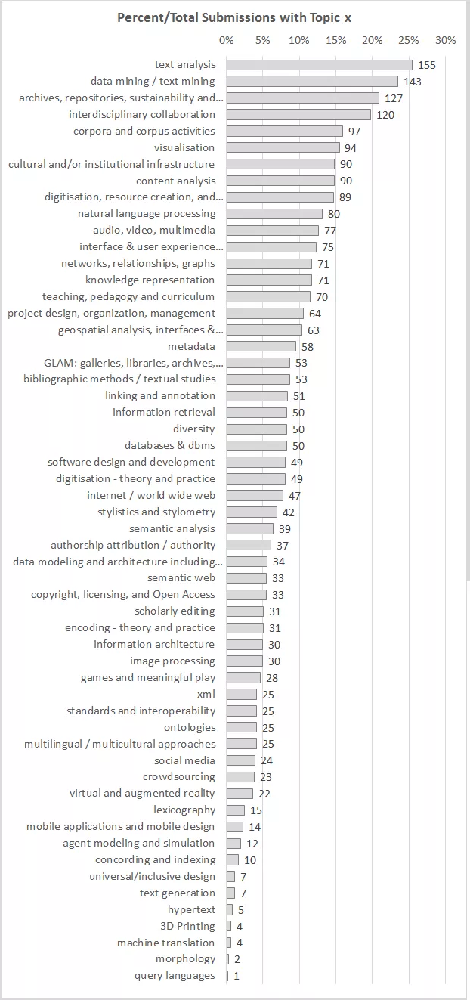

# Submissions to DH2017 (pt. 1)

Like [many times before](http://scottbot.net/tag/dhconf/), I’m analyzing the [international digital humanities conference](http://adho.org/conference), this time the [2017 conference in Montréal](https://dh2017.adho.org/). The data I collect is available to any conference peer reviewer, though I do a bunch of scraping, cleaning, scrubbing, shampooing, anonymizing, etc. before posting these results.

This first post covers the basic landscape of submissions to next year’s conference: how many submissions there are, what they’re about, and so forth.

The analysis is opinionated and sprinkled with my own preliminary interpretations. If you disagree with something or want to see more, comment below, and I’ll try to address it in the inevitable follow-up. If you want the data, too bad—since it’s only available to reviewers, there’s an expectation of privacy. If you are sad for political or other reasons and live near me, I will bring you chocolate; if you are sad and do not live near me, you should move to Pittsburgh. We have chocolate.

## Submission Numbers & Types

I’ll be honest, I was surprised by this year’s submission numbers. This will be the first ADHO conference held in North America since it was held in Nebraska in 2013, and I expected an influx of submissions from people who haven’t been able to travel off the continent for interim events. I expected the biggest submission pool yet.

Submissions per year by type.

What we see, instead, are fewer submissions than Kraków last year: 608 in all. The low number of submissions to Sydney was expected, given it was the first  conference held outside Europe or North America, but this year’s numbers suggests the DH Hype Machine might be cooling somewhat, after five years of rapid growth.

Annual presentations at DH conferences, compared to growth of DHSI in Victoria, 1999-2015.

We need some more years and some more DH-Hype-Machine Indicators to be sure, but I reckon things are slowing down.

The conference offers five submission tracks: Long Paper, Short Paper, Poster, Panel, and (new this year) Virtual Short Paper. The distribution is pretty consistent with previous years, with the only deviation being in Sydney in 2015. Apparently Australians don’t like short papers or posters?

I’ll be interested to see how the “Virtual Short Paper” works out. Since authors need to decide on this format before submitting, it doesn’t allow the flexibility of seeing if funding will become available over the course of the year. Still, it’s a step in the right direction, and I hope it succeeds.

<!-- page 2 -->

## Co-Authorship

More of the same! If nothing else, we get points for consistency.

Percent of Co-Authorships

Same as it ever was, nearly half of all submissions are by a single author. I don’t know if that’s because humanists need to justify their presentations to hiring and tenure committees who only respect single authorship, or if we’re just used to working alone. A full 80% of submissions have three or fewer authors, suggesting large teams are still not the norm, or that we’re not crediting all of the labor that goes into DH projects with co-authorships. \[Post-publication note: See [Adam Crymble’s comment, below](http://scottbot.net/submissions-to-dh2017-pt-1/#comment-522), for important context\]

## Language, Topic, & Discipline

Authors choose from several possible submission languages. This year, 557 submissions were received in English, 40 in French, 7 in Spanish, 3 in Italian, and 1 in German. That’s the easy part.

The Powers That Be decided to make my life harder by changing up the categories authors can choose from for 2017. Thanks, Diane, ADHO, or whoever decided this.

In previous years, authors chose any number of keywords from a controlled vocabulary of about 100 possible topics that applied to their submission. Among other purposes, it helped match authors with reviewers. The potential topic list was relatively static for many years, allowing me to analyze the change in interest in topics over time.

This year, they added, removed, and consolidated a bunch of topics, as well as divided the controlled vocabulary into “Topics” (like metadata, morphology, and machine translation) and “Disciplines” (like disability studies, archaeology, and law). This is ultimately good for the conference, but makes it difficult for me to compare this against earlier years, so I’m holding off on that until another post.

But I’m not bitter.

This year’s options are at the bottom of this post in the appendix. Words in red were added or modified this year, and the last list are topics that used to exist, but no longer do.

So let’s take a look at this year’s breakdown by discipline.

<!-- page 3 -->

Disciplinary breakdown of submissions

Huh. “Computer science”—a topic which last year did not exist—represents nearly a third of submissions. I’m not sure how much this topic actually means anything. My guess is the majority of people using it are simply signifying the “digital” part of their “Digital Humanities” project, since the topic “Programming”—which existed in previous years but not this year —used to only connect to ~6% of submissions.

“Literary studies” represents 30% of all submissions, more than any previous year (usually around 20%), whereas “historical studies” has stayed stable with previous years, at around 20% of submissions. These two groups, however, can be pretty variable year-to-year, and I’m beginning to suspect that their use by authors is not consistent enough to take as meaningful. More on that in a later post.

That said, DH is clearly driven by lit, history, and **library/information science**. **L/IS** is a new and welcome category this year; I’ve always suspected that DHers are as much from **L/IS** as the humanities, and this lends evidence in that direction. Importantly, it also makes apparent a dearth in our disciplinary genealogies: when we trace the history of DH, we talk about the history of humanities computing, the history of the humanities, the history of computing, but rarely the history of L/IS.

I’ll have a more detailed breakdown later, but there were some surprises in my first impressions. “Film and Media Studies” is way up compared to previous years, as are other non-textual disciplines, which refreshingly shows (I hope) the rise of non-textual sources in DH. Finally. Gender studies and other identity- or intersectional-oriented submissions also seem to be on the rise (this may be an indication of US academic interests; we’ll need another few years to be sure).

If we now look at **Topic** choices (rather than **Discipline** choices, above), we see similar trends.

<!-- page 4 -->

Topical distribution of submissions

Again, these are just first impressions, there’ll be more soon. Text is still the bread and butter of DH, but we see more non-textual methods being used than ever. Some of the old favorites of DH, like authorship attribution, are staying pretty steady against previous years, whereas others, like XML and encoding, seem to be decreasing in interest year after year.

One last note on Topics and Disciplines. There’s a list of discontinued topics at the bottom of the appendix. Most of them have simply been consolidated into other categories, however one set is conspicuously absent: meta-discussions of DH. There are no longer categories for DH’s history, theory, how it’s taught, or its institutional support. These were pretty popular categories in previous years, and I’m not certain why they no longer exist. Perusing the submissions, there are certainly several that fall into these categories.

## What’s Next

For Part 2 of this analysis, look forward to more thoughts on the topical breakdown of conference submissions; preliminary geographic and gender analysis of authors; and comparisons with previous years. After that, who knows? I take requests in the comments, but anyone who requests “Free Bird” is banned for life.

## Appendix: Controlled Vocabulary

Words in red were added or modified this year, and the last list are topics that used to exist, but no longer do.

**Topics**

- 3D Printing
- agent modeling and simulation
- archives, repositories, sustainability and preservation
- audio, video, multimedia

<!-- page 5 -->

- authorship attribution / authority
- bibliographic methods / textual studies
- concording and indexing
- content analysis
- copyright, licensing, and Open Access
- corpora and corpus activities
- crowdsourcing
- cultural and/or institutional infrastructure
- data mining / text mining
- data modeling and architecture including hypothesis-driven modeling
- databases & dbms
- digitisation – theory and practice
- digitisation, resource creation, and discovery
- diversity
- encoding – theory and practice
- games and meaningful play
- geospatial analysis, interfaces & technology, spatio-temporal modeling/analysis & visualization
- GLAM: galleries, libraries, archives, museums
- hypertext
- image processing
- information architecture
- information retrieval
- interdisciplinary collaboration
- interface & user experience design/publishing & delivery systems/user studies/user needs
- internet / world wide web
- knowledge representation
- lexicography
- linking and annotation
- machine translation
- metadata
- mobile applications and mobile design
- morphology
- multilingual / multicultural approaches
- natural language processing
- networks, relationships, graphs
- ontologies
- project design, organization, management
- query languages
- scholarly editing
- semantic analysis
- semantic web
- social media
- software design and development
- speech processing
- standards and interoperability
- stylistics and stylometry
- teaching, pedagogy and curriculum
- text analysis
- text generation
- universal/inclusive design
- virtual and augmented reality
- visualisation
- xml

**Disciplines**

- anthropology
- archaeology
- art history
- asian studies
- classical studies
- computer science
- creative and performing arts, including writing
- cultural studies
- design
- disability studies
- english studies
- film and media studies
- folklore and oral history
- french studies
- gender studies
- geography
- german studies
- historical studies
- italian studies
- law
- library & information science
- linguistics
- literary studies
- medieval studies
- music
- near eastern studies
- philology

<!-- page 6 -->

- philosophy
- renaissance studies
- rhetorical studies
- sociology
- spanish and spanish american studies
- theology
- translation studies

**No Longer Exist**

- Digital Humanities – Facilities
- Digital Humanities – Institutional Support
- Digital Humanities – Multilinguality
- Digital Humanities – Nature And Significance
- Digital Humanities – Pedagogy And Curriculum
- Genre-specific Studies: Prose, Poetry, Drama
- History Of Humanities Computing/digital Humanities
- Maps And Mapping
- Media Studies
- Other
- Programming
- Prosodic Studies
- Publishing And Delivery Systems
- Spatio-temporal Modeling, Analysis And Visualisation
- User Studies / User Needs

---

## Reader Comments

> [**Elisa Beshero-Bondar**](http://greensburg.pitt.edu/academics/faculty/elisa-e-besherobondar), November 12, 2016 at 2:22 pm
>
> As an XML-and-TEI head, I think the decrease in topics marked “XML” and “encoding-theory and practice” may be twofold: 1) text scholars who code may be going to other conferences like the TEI or DIXiT, or possibly not thinking of what they do as “DH” and 2) there hasn’t been as much formal training available in these areas in North America vs in Europe. Is building a digital edition and designing a web interface for it considered the stuff of DH that ADHO represents? Seems like you have to be doing some kind of data analytics for it to qualify, and the numbers of people who can process their XML to analyze it quantitatively start to dwindle for lack of training opportunities. Of course I’d like to see that change because there’s so much cool data-binding and analysis you can do working with your own home-grown tree structures–even at scale over lots of (ok, clean digital) texts with regex and autotagging. But even without that–there’s a real scholarly need to build sustainable and accessible digital editions, and to build interfaces for those takes a lot of decision-making that seems the stuff of “digital” Humanities. The communities working on these things do exist and are active when you find them–the manuscripts SIG at the TEI is a lively group with much under discussion! My guess is that ADHO has not been (lately?) the place for discussing text modelling. But does ADHO define “DH” for us?

>> [**Scott B. Weingart**](http://scottbot.net/), November 20, 2016 at 1:02 pm
>>
>> Thanks for the thoughtful comment, Elisa. I do definitely see #1 happening with all aspects of DH – the community seems to be splintering, in a healthy, natural-growth sort of way. The 2nd point you mention, a drop in training in the U.S., I don’t think is a complete explanation, because we see the drops happening every year, including in Europe.
>>
>> That said, I agree with you there ought to still be a place for rich encoding, markup, and editions. ADHO is probably susceptible to flavor-of-the-year representation, in that the most novel, exciting projects will probably be presented there, and those may not be (and shouldn’t be) the bulk of projects actually happening in the larger DH community. If ADHO is biased towards the topical flavor-of-the-year, it makes sense that smaller regional or topical conferences will host the many important communities that are not in that particular wave.
>>
>> This is an important distinction, and I think I need to do a better job of showing that ADHO is not a synecdoche for DH.

> [**joseeduardogonzalez**](http://joseeduardogonzalez.wordpress.com/), November 15, 2016 at 5:25 pm
>
> You should separate Spanish from Spanish American studies. They are two different “disciplines.”

>> **scott b. weingart**, November 15, 2016 at 7:37 pm
>>
>> Hi José, I have no control over the categories, I just analyze the data that I mine from the conference submissions – but I take your point.

> [**Jan Rybicki**](http://info.filg.uj.edu.pl/~jrybicki/), November 17, 2016 at 7:09 am
>
> Cool stuff, all this. I’d like to comment on one of the phenomena described, i.e. submission numbers. I see little evidence of what you call “cooling off the hype”, and more of a geographical mechanism: “Conferences in Europe are Bigger” (your diagram doesn’t have Hamburg 2012, which was big too. Seen from this perspective, Montreal 2017 fares quite well despite the shocking date of the conference that cuts right into family vacation time. I also guess (but I am not being very objective here) that Krakow had the additional appeal of being safe yet somewhat exotic and cheap(ish). The real test to our respective hypothesis will only come in Utrecht 2019… Although that result might be biased by the massive emigration of liberal intellectuals from the US to Europe (too early to make such jokes? sorry!).

>> **scott b. weingart**, November 20, 2016 at 1:14 pm
>>
>> Thanks Jan. I do see the effect you’re discussing, but if you look at the chart from 1999-2015 (final paper counts, not submissions), you don’t see the same massive shifts between Europe and the U.S./Canada – in fact, you often see relationship flip. Hamburg in 2012 had fewer presentations than Nebraska in 2013, for example.
>>
>> What it may mean is that the hype, or community, is growing faster in Europe than it is in North America, which is a sort of compromise between both our claims. But, as you say, time will tell – we’ll need to see what the next several years show. Also, it would be valuable to start comparing these numbers to other DH conferences around the world, to help account for timing effects of particular conferences, expense of specific cities, etc. Of course, as you joke (not too soon!), the effects of the next 4 years of U.S. politics may overshadow the effects of DH growing or shrinking in size…

> [**Adam Crymble**](http://programminghistorian.org/), November 20, 2016 at 12:18 pm
>
> I always love your analyses. I think they’re a great way to see what’s happening in the field.
>
> I think Jan Rybicki is right about the Europe vs North America phenomenon, though Montreal is also cheapish and exotic for Americans (and a beautiful city).
>
> Re co-authorship, I’d be careful to say that DH scholars aren’t crediting all of the work of their team mates. I’ve written on this before when I and Julia Flanders co-wrote about fair citation (‘Faircite’ – [http://digitalhumanities.org/dhq/vol/7/2/000164/000164.html](http://digitalhumanities.org/dhq/vol/7/2/000164/000164.html)).
>
> We need to separate the project from the paper. Many projects in DH include a number of activities that involve subsets of individuals working towards a larger initiative. For example, at the Programming Historian we focus on providing learning resources for scholars interested in digital skills. We currently have 10 team members. 3 of them are working on a Spanish Translation. Last year one of them (me) worked on a sub-project to try to make the project more gender-neutral. If the Spanish team writes a paper on their experiences I wouldn’t expect all 10 of us to be on it. And when I wrote up my recommendations on gender neutrality, it was a solo-authored initiative. In neither case is this about not crediting colleagues. It’s more about atomisation and the nature of what a ‘paper’ is as distinct from a ‘project’.

>> **scott b. weingart**, November 20, 2016 at 1:24 pm
>>
>> Thanks Adam, you raise a good point about authorship. I wrote the numbers suggest “large teams are still not the norm, or that we’re not crediting all of the labor that goes into DH projects with co-authorships”, which I think is still true, but misleading. I should have written “or that we’re not crediting all of the labor that goes into DH projects with co-authorships on every article submitted about it.” That’s not intended to be a value judgement, just a statement of the very fact you point out – papers often don’t represent the full scope of a project. Your article is an important one for all DHers, and I’ll update the post to point to this comment.
>>
>> As for the Europe vs. North America phenomenon, see my recent reply to Jan – I think you two may be right, but with caveats. Time will tell. If nothing else, I’m excited for my first visit to Montreal.

> [**Max Kemman (@MaxKemman)**](http://twitter.com/MaxKemman), November 21, 2016 at 1:39 pm
>
> Thanks for this analysis Scott! For the Europe/US discussion it would be useful to gain more insight where authors and participants come from. From your previous analyses it seemed to me that Americans are more open to a long flight to a conference than Europeans, though my impression may well be wrong. With respect to travelling, your comment “\[a\]pparently Australians don’t like short papers or posters?” should probably also be viewed in this light. I can imagine that a 24h flight to Australia is not something one wants to do for a poster, but will do for a long paper? Unless you also found Australian researchers to submit fewer posters to long papers compared to Europeans for European conferences, or North Americans for NA conferences?

>> **scott b. weingart**, November 21, 2016 at 1:49 pm
>>
>> Thanks, Max! With respect to Australians and short papers, nothing so sophisticated, I’m afraid. I was just noting that the Australian conference had fewer short papers and posters, which I’d assumed meant that folks from that area were less likely to write them — but I was probably wrong. Your answer is more likely, that the community of scholars from outside Australia were less interested in submitting short proposals that year.
>>
>> As for Europe/US distinction, that’s a great question – I haven’t connected this pool of submitting authors with my master list yet, so I don’t know their locations, but that’s next on the list.

> [**tedunderwood**](http://tedunderwood.wordpress.com/), November 21, 2016 at 3:08 pm
>
> Thanks, Scott. This survey is always helpful. I think your interpretation is spot-on, and your response to Elisa above also seems right. “ADHO is not a synecdoche for DH.” It is, I think, \*central\* to the DH phenomenon, but it’s possible that the outward expansion or diffusion of the things we call DH could tend to reduce the prominence of the central nucleus.
>
> That has, anecdotally, been my experience. I attended the ADHO conference in 2012 and 2014 — and enjoyed it — but then stopped going. There were several reasons, but fundamentally, I found I was learning more at other, smaller meetings, closer to home and targeted more specifically at distant reading. I still peruse the conference program every year, and I can envision returning, but when my schedule gets crowded it’s no longer necessarily the top priority.
>
> I think this is not a bad thing. Organizations can only get so big, and the ADHO conference is already huge. It’s doing important work, but it can’t do everything at once.
