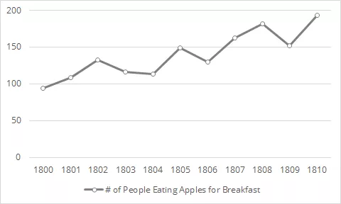
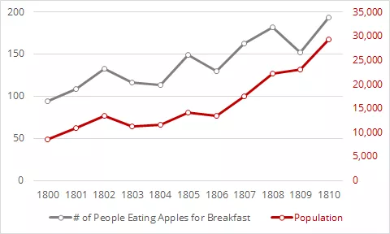
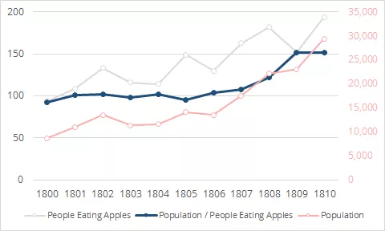

# Argument Clinic

> *Like what’s your secret for taking historical evidence and understanding how calculating std or mse or kde means something?????*
>
> *— Zoe LeBlanc (@Zoe_LeBlanc)* [*July 25, 2017*](https://twitter.com/Zoe_LeBlanc/status/889676081745231873)

Zoe LeBlanc asked how basic statistics lead to a meaningful historical argument. A [good discussion followed](https://twitter.com/Zoe_LeBlanc/status/889676081745231873), worth reading, but since I couldn’t fit my response into tweets, I hoped to add a bit to the thread here on the *irregular*. I’m addressing only one tiny corner of her question, in a way that is peculiar to my own still-forming approach to computational history; I hope it will be of some use to those starting out.

In brief, **I argue that one good approach to computational history cycles between data summaries and focused hypothesis exploration, driven by historiographic knowledge, in service to finding and supporting historically interesting agendas**. There’s a lot of good computational history that doesn’t do this, and a lot of bad computational history that does, but this may be a helpful rubric to follow.

In the spirit of Monty Python, the below video has absolutely nothing to do with the discussion at hand.

<!-- page 2 -->

Zoe’s question gets at the heart of one of the two most prominent failures of computational history in 2017[^1]: the inability to go beyond descriptive statistics into historical argument.[^2] I’ve [written before](http://scottbot.net/digital-history-can-never-be-new/) on one of the many reasons for this inability, but that’s not the subject of this post. **This post covers some good practices in getting from statistics to arguments.**

## Describing the Past

Historians, for the most part, aren’t experimentalists.[^3] Our goals vary, but they often include telling stories about the past that haven’t been told, by employing newly-discovered evidence, connecting events that seemed unrelated, or revisiting an old narrative with a fresh perspective.

Facts alone usually don’t cut it. We don’t care what Jane ate for breakfast without a *so what*. Maybe her breakfast choices say something interesting about her socioeconomic status, or about food culture, or about how her eating habits informed the way she lived. **Alongside a fact, we want why or how it came to be, what it means, or its role in some larger or future trend.** A sufficiently big and surprising fact may be worthy of note on its own (“Jane ate orphans for breakfast” or “The government did indeed collude with a foreign power”), but <!-- page 3 --> such surprising revelations are rare, not the only purpose for historians, and still beg for context.

**Computational history has gotten away with a lot of context-free presentations of fact**.[^4] That’s great! It’s a sign there’s a lot we didn’t know that contemporary methods & data make easily visible.[^5] Here’s an example of [one of mine](http://scottbot.net/networks-demystified-4-co-citation-analysis/), showing that, despite [evidence to the contrary](https://link.springer.com/article/10.1007/s10670-010-9214-6), there is a thriving community at the intersection of history and philosophy of science:

*My citation analysis showing a bridge between history & philosophy of science.*

But, though we’re not running out of low-hanging fruit, the novelty of mere description is wearing thin. Knowing *that* a community exists between history & philosophy of science is not particularly interesting; knowing why it exists, what it changes, or whether it is less tenuous than any other disciplinary borderland are more interesting and [historiographically recognizable](http://scottbot.net/digital-history-can-never-be-new/) questions.

## Context is Key

So how to get from description to historical argument? Though there’s no right path, and the route depends on the type of claim, this post may offer some <!-- page 4 --> guidance. Before we get too far, though, a note:

**Description has little meaning without context and comparison**. The data may show that more people are eating apples for breakfast, but there’s a lot to unpack there before it can be meaningful, let alone relevant.

*Line chart of # of people who eat apples over time.*

It may be, for example, that the general population is growing just as quickly as the number of people who eat apples. If that’s the case, does it matter that apple-eaters themselves don’t seem to be making up any larger percent of the population?

<!-- page 5 -->

*Line chart of # of people who eat apples over time (left axis) compared to general population (right axis).*

The answer for a historian is: of course it matters. If we were talking about casualties of war, or amount of cities in a country, rather than apples, a twofold increase in absolute value (rather than percentage of population) makes a huge difference. It’s more lives affected; it’s more infrastructure and resources for a growing nation.

But the nature of that difference changes when we know our subject of study matches population dynamics. If we’re looking at voting patterns across cities, and we notice population density correlates with party affiliation, we can use that as a launching point for *so what*. Perhaps sparser cities rely on fewer social services to run smoothly, leading the population to vote more conservative; perhaps past events pushed conservative families towards the outskirts; perhaps.

**Without having a *ground* against which to contextualize our results, a base map like general population, the *fact* of which cities voted in which direction gives us little historical meat to chew on**.

On the other hand, some surprising facts, when contextualized, leave us less surprised. A two-fold increase in apple eating across a decade is pretty surprising, until you realize it happened alongside a similar increase in population. The fact is suddenly less worthy of report by itself, though it may have implications for, say, the growth of the apple industry.

But Zoe asked about statistics, not counting, in finding meaning. I don’t want to divert this post into teaching stats, and nor do I want to assume statistical knowledge, so I’ll opt for an incredibly simple metric: ratio.

The illustration above shows an increase in both population and apple-eating, and eyeball estimates show them growing apace. If we divide the total population by the number of people eating apples, however, our story is complicated.

<!-- page 6 -->

*Line chart of # of people who eat apples over time (left axis) compared to general population (right axis). A thick blue line in the middle (left axis) shows the ratio between the two.*

Though both population and apple-eating increase, in 1806 the population begins rising much more rapidly than the number of apple-eaters.[^6] **It is in this statistically-derived difference that the historian may find something worth exploring and explaining further.**

There are a many ways to compare and contextualize data, of which this is one. They aren’t worth enumerating, but the importance of contextualization is relevant to what comes next.

## Question- and Data-Driven History

Computational historians like to talk about question-driven analysis. Computational history is best, we say, when it is led by a specific question or angle. The alternative is dumping a bunch of data into a statistics engine, describing it, and finding something weird, and saying “oh, this looks interesting.”

When push comes to shove, most would agree the above dichotomy is false. Historical questions don’t *pop* out of thin air, but from a continuously shifting <!-- page 7 --> relationship with the past. We read primary and secondary sources, do some data entry, do some analysis, do some more reading, and through it all build up a knowledge-base and a set of expectations about the past. We also by this point have a set of claims we don’t quite agree with, or some secondary sources with stories that feel wrong or incomplete.

**This is where the computational history practice begins: with a firm grasp of the history and historiography of a period, and a set of assumptions, questions, and mild disagreements**.

From here, if you’re reading this blog post, you’re likely in one of two camps:

1. You have a big dataset and don’t know what to do with it, or
2. You have a historiographic agenda (a point to prove, a question to answer, etc.) that you don’t know how to make computationally tractable.

We’ll begin with #1.

### 1. I have data. Now what?

Congratulations, you have data!

<!-- page 8 -->

*Congratulations!*

This is probably the thornier of the two positions, and the one more prone to results of *mere description*. You want to know how to turn your data into interesting history, but you may end up doing little more than enumerating the blades of grass on a field. To avoid that, you must begin down a process sometimes called scalable reading, or a special case of the hermeneutic circle.

You start, of course, with mere description. How many records are there? What are the values in each? Are there changes over time or place? Who is most central? Before you start quantifying the data, write down the answers you expect to these questions, with a bit of a causal explanation for each.

Now, barrage your dataset with visualizations and statistical tests to find out exactly what makes it up. See how the results align with the hypotheses you noted down. If you created the data yourself, one archival visit at a time, you won’t find a lot that surprises you. That’s alright. *Be sure to take time to consider what’s missing from the dataset, due to archival lacunae, bias, etc*.

If any results surprise you, dig into the data to try to understand why. If none do, think about claims from secondary sources–do any contradict the data? Align with it?

This is also a good point to bring in contextualization. If you’re looking at the number of people doing something over time, try to compare your dataset to population dynamics. If you’re looking at word usage, find a way to compare your data to base frequencies of that word in similar collections. If you’re looking at social networks, compare them to random networks to see if their average path length or degree distribution are surprising compared to networks of similar size. **Every unexpected result is an opportunity for exploration**.

Internal comparisons may also yield interesting points to pursue further, *especially* if you think your data are biased. Given a limited dataset of actors, their genders, their roles, and play titles, for example, you may not be able <!-- page 9 --> to make broad claims about which plays are more popular, but you could see how different roles are distributed across genders within the group.

Internal comparisons could also be temporal. Given a dataset of occupations over time with a particular city, *if you compare those numbers to population changes over time*, you could find the moments where population and occupation dynamics part ways, and focus on those instances. Why, suddenly, are there more grocers?

**The above boils down into two possible points of further research: deviations from expectation, or deviations from internal consistency.**

Deviations from expectation–your own or that of some notable secondary source–can be particularly question-provoking. “Why didn’t this meet expectations” quickly becomes “what is wrong or incomplete about this common historical narrative?” From here, it’s useful to dig down into the points of data that exemplify such deviations, and see if you can figure out why and how they break from expectations.

Deviations from internal consistency–that is, when comparisons within the data wind up showing different trends–lead to positive rather than negative questions. Instead of “why is this theory wrong?”, you may ask, “why are these groups different?” or “why does this trend cease to keep pace with population during these decades?” Here you are asking specific questions that require new or shifted theories, whereas with deviations from expectations, you begin by seeing where existing narratives fail.

**It’s worth reiterating that, in both scenarios, questions are drawn from deviations from some underlying theory.**

In deviations from expectation, the underlying theory is what you bring to your data; you *assume* the data *ought to* look one way, but it doesn’t. You are coming with an internal, if not explicit, quantitative model of how the data ought to look.

In deviations from internal consistency, that data’s descriptive statistics provide <!-- page 10 --> the underlying theory against which there may be deviations. Apple-eaters deviating in number from population growth *is only interesting if, at most points, apple-eaters grow  evenly alongside population*. That is, you assume general statistics should be the same between groups or over time, and if they are not, it is worthy of explanation.

This an oversimplification, but a useful one. Undoubtedly, combinations of the two will arise: maybe you *expect* the differences between men and women in roles they play will be large, but it turns out they are small. This provides a deviation of both kinds, but no less legitimate for it. In this case, your recourse may be looking for other theatrical datasets to see if the gender dynamics play out the same across them, or if your data are somehow special and worthy of explanation outside the context of larger gender dynamics.

Which brings us, inexorably, to the cyclic process of computational history. **Scalable reading. The hermeneutic circle. Whatever.**

Point is, you’re at the point where some deviation or alignment seems worth explanation or exploration. You could stop here. You could present this trend, give a convincing causal [just-so story](https://matthewlincoln.net/2015/03/21/confabulation-in-the-humanities.html) of why it exists, and leave it at that. You will probably get published, since you’ve already gone farther than *mere description*, the trap of so much computational history.

But you shouldn’t stop here. You should take this opportunity to strengthen your story. Perhaps this is the point where you put your “traditional” historian’s cap back on, and go dust-diving for archival evidence to support your claims. I wouldn’t think less of you for it, but if you stop there, you’d only be reaping half the advantages of computational history.

In the example above, looking for other theatrical datasets to contextualize gender results in your own, hinted at the **second half of the computational history research cycle**: creating computationally tractable questions. Recall this section described the first half: making sense of data. Although I presented the two as separate, they productively feed on one another.

<!-- page 11 -->

Once you’ve gone through your data to find how it aligns with your or others’ preconceived notions of the past, or how by its own internal deviations it presents interesting dilemmas, you have found yourself in the second half of the cycle. You have questions or theories you want to ask of data, but you do not yet have the data or the statistics to explore them.

This seems counter-intuitive. Why not just use the data or statistics already gathered, sometimes painstakingly over several years? Because if you use the same data & stats to both generate and answer questions, your evidence is circular. Specifically, you risk making a scientistic claim of what could easily be a spurious trend. It may simply be that, by random chance, the breakfast record-keeper lost a bunch of records from 1806-1810, thus causing the decline seen in the population ratio.

**To convincingly make arguments from a historical data description, you must back it up using triangulation**–approaching the problem from many angles. That triangulation may be computational, archival, archaeological, or however else you’re used to historying, but we’ll focus here on computational.

### 2. Computationally Tractable Questions

So you’ve got a historiographic agenda, and now you want to make it computationally tractable. Good luck! This is the hard part.

<!-- page 12 -->

*Good luck!*

“Sparse areas relied less on social services.” “The infrastructure of science became less dependent on specific individuals over the course of the 17th century.” “T-Rex was a remarkable climber.” “Who benefited most from the power vacuum left by the assassination?” These hypotheses and questions do not, on their own, lend themselves to quantitative analysis.

Chief among the common difficulties of turning a historiographic agenda into a computationally tractable hypothesis is a lack of familiarity of computational methods. If you don’t know what a computer is good at, you can’t form an experiment to use one.

I said that history isn’t experimental, but I lied. Archival research can be an experiment if you go in with a hypothesis and a pre-conceived approach or set of criteria that would confirm it. Computational history, at this stage, is also experimental. It often works a little like this (but it may not):[^7]

1. **Set your agenda**. Start with a hypothesis, historiographic framework, or question. For example, “The infrastructure of science became less dependent on specific individuals over the course of the 17th century.” (*that question’s mine, don’t steal it.*)
2. **Find testable hypotheses**. Break it into many smaller statements that can be confirmed, denied, or quantitatively assessed. “*If* science depends less on specific individuals over the 17th century, the distribution of names mentioned in scholarly correspondence will flatten out. That is, in 1600 a few people will <!-- page 13 --> be mentioned frequently, whereas most will be mentioned infrequently; in 1700, the frequency of name mentions will be more evenly distributed across correspondence.” Or “*If* science depends less on specific individuals over the 17th century, when an important person died, it affected the scholarly network less in 1700 than in 1600.” (Notice in these two examples how finding evidence for the littler statements will corroborate the bigger hypothesis, and vice-versa.)
3. **Match hypotheses to approaches**. Come up with methodological proxies, datasets, and/or statistical tests that could corroborate the littler statements. Be careful, thorough, and specific. For example, “In a network of 17th-century letter writers, if the removal of a central figure in 1600 decreases the average path length of the network *less than* the the removal of a central figure in 1700, central figures likely played less important structural roles. This will be most convincing if the effects of node removal smoothly decreases across the century.” (This is the step in which you need to come to the table with knowledge of different computational methods and what they do.)
4. **Specify proxies**. List specific analytic approaches needed for the promising tests, and the data required to do them. For example, you need a list of senders and recipients of scholarly letters, roughly evenly distributed across time between 1600 and 1700, and densely-packed enough to perform network analysis. There could be a few different analytic approaches, including removing highly-central nodes and re-calculating average path length; employing measurements of attack tolerance; etc. Probably worth testing them all and seeing if each result conforms to the pre-existing theory.
5. **Find data.** Find pre-existing datasets that will fit your proxies, or estimate how long it will take to gather enough data yourself to reasonably approach your hypotheses. Opt for data that will work for as many approaches as possible. You may find some data that will suggest new hypotheses, and you’ll iterate back and forth between steps #3-#5 a few times.
6. **Collect data. Run experiments**. Uh, yeah, just do those things. Easy as [baking apple pie from scratch](https://www.goodreads.com/quotes/32952-if-you-wish-to-make-an-apple-pie-from-scratch).
7. **Match experimental results to hypotheses**. Here’s the fun part, you get to see how many of your predictions matched your results. Hopefully a bunch, but even if they didn’t, it’s an excuse to figure out why, and start the process anew. <!-- page 14 --> You can also start exploring the additional datasets to help you develop new questions. The astute may have noticed, **this step brings us back to the first half of computational historiography: exploring data and seeing what you can find**.[^8]

From here, it may be worthwhile to cycle back to the data exploration stage, then back here to computationally tractable hypothesis exploration, and so on ad infinitum.

By now, making meaning out of data probably feels impossible. I’m sorry. The process is much more fluid and intertwined than is easily unpacked in a blog post. The back-and-forth can take hours, days, months, or years.

But the important thing is, after you’ve gone back-and-forth a few times, you should have a combination of quantitative, archival, theoretical, and secondary support for a solidly historical argument.

## Contexts of Discovery and Justification

Early 20th-century philosophy of science cared a lot about the distinction between the [contexts of discovery and justification](https://plato.stanford.edu/entries/scientific-discovery/#DisBetConDisConJus). Violently shortened, the context of discovery is how you reached your conclusion, and the context of justification is how you argue your point, regardless of the process that got you there.

I bring this up as a reminder that the two can be distinct. By the 1990s, quantitative historians who wanted to remain legible to their non-quantitative colleagues often saved the data analysis for an appendix, and even there the focus was on the actual experiments, not the long process of coming up with tests, re-testing, collecting more data, and so on.

The result of this cyclical computational historiography need not be (and rarely is, and perhaps can never be) a description of the process that led you to the evidence <!-- page 15 --> supporting your argument. While it’s a good idea to be clear about where your methods led you astray, the most legible result to historians will necessarily involve a narrative reconfiguration.

## Causality and Truth

Small final notes on two big topics.

First, **Causality**. This approach won’t get you there. It’s hard to disentangle causality from correlation, but more importantly in this context, it’s hard to choose between competing causal explanations. The above process can lead you to plausible and corroborated hypotheses, but it cannot prove anything.

Consider this: “My hypothesis about apples predicts these 10 testable claims.” You test each claim, and each test agrees with your predictions. It’s a success, but a soft one; you’ve shown your hypothesis to be plausible given the evidence, but not inevitable. A dozen other equally sensible hypotheses *could have produced the same 10 testable claims*. You did not prove those hypotheses wrong, you just chose one model that happened to work.[^9]

**Even if no alternate hypothesis presents itself, and all of your tests agree with your hypothesis, you still do not have causal proof**. It may be that the proxies you chose to test your claims are bad ones, or incomplete, or your method has unseen holes. Causality is tricky, and in the humanities, proof especially so.

Which leads us to the next point: **Truth**. Even if somehow you devise the perfect process to find proof of a causal hypothesis, the causal description does not constitute capital-T Truth. There are many truths, coming from many perspectives, about the past, and they don’t need to agree with each other. Historians care not just about what happened, but how and why, and those hows and whys are driven by people. Messy, inconsistent people who believe many conflicting things within the span of a moment. **When it comes to questions of society, even the most scientistic of scholars must come to terms with <!-- page 16 --> uncertainty and conflict, which after all are more causally central to the story of history than most clever narratives we might tell.**

[^1]: Also called digital history, and [related to quantitative history and cliometrics in ways we don’t often like to admit](http://scottbot.net/lessons-from-digital-historys-antecedents/).
[^2]: The other most prominent failure in computational history is our tendency to group things into finite discrete categories; in this case, a two-part list of failures.
[^3]: With some notable exceptions. Some historians [simulate the past](http://scottbot.net/digital-history-saturns-rings-and-the-battle-of-trafalgar/), others perform experiments on rates of material decay, or on the chemical composition of inks. It’s a big world out there.
[^4]: When I say fact, assume I add all the relevant post-modernist caveats of the contingency of objectivity etc. etc. Really I mean “matters of history that the volume of available evidence make difficult to dispute.”
[^5]: [Ted Underwood](https://tedunderwood.com/2013/02/20/wordcounts-are-amazing/) and [I](https://scottbot.net/on-simplicity/) have both talked about the exciting promise of incredibly low-hanging fruit in new approaches.
[^6]: OK in retrospect I should have used a more historically relevant example – I wasn’t expecting to push this example so far.
[^7]: If this seems overly scientistic, worry not! Experimental science is often defined by its recourse to rote procedure, which means pretty much any procedural explanation of research will resemble experimental science. There are many ways one can go about scalable reading / triangulation of computational historiography, not just the procedural steps #1-#7 above, but this is one of the easier approaches to explain. Soft falsification and hypothesis testing are plausible angles into computational history, but not necessary ones.
[^8]: A brief addendum to steps #6-#7: although I’d argue [Null-Hypothesis Significance Testing](https://en.wikipedia.org/wiki/Statistical_hypothesis_testing) or population-based statistical inferences may not be relevant to historiography, especially when its based in triangulation, they may be useful in certain cases. Without delving too deeply into the weeds, they can help you figure out the extent to which the effect you see may just be noise, not indicative of any particular trend. [Statistical effect sizes](https://en.wikipedia.org/wiki/Effect_size) also may be of use, <!-- page 17 --> helping you see whether the magnitude of your finding is big enough to have any appreciable role in the historical narrative.
[^9]: Shawn Graham and I wrote about this in relation to archaeology and simulation [here](https://hcommons.org/deposits/item/hc:10105/), on the subject of underdetermination and abduction

---

## Reader Comments

> [**Matt Lavin**](https://twitter.com/mjlavin80), July 26, 2017 at 1:46 pm
>
> This post hits the nail on the head in a lot of ways. Two things I’d add or elaborate on that you mention in brief. First, I agree that the process of formulating questions involves “a continuously shifting relationship with the past,” but it’s probably worth underscoring all the ways in which we engage not with “the past” but with narratives, testimonials, and other information that we use to construct “what was,” and then the elusive thing living in our imagination we call “the past.” I know historians know this, but it’s useful to come back to it in the context of data because each dataset is indeed a simplification or reduction of what happened, and that has to be OK on some level, because that’s what history always is.
>
> Second, and related, seldom do available data and well established scholarly questions line up. Often, the task is to find a measurable corollary to a deeper idea. You allude to this principle with your thoughts on causality, but that’s a limitation even when data and questions do line up. I’d add that the measurable often has an <!-- page 18 --> additional layer of abstraction or a more indirect relationship to the original question than one might expect.
>
> I’d love to know, for example, if and/how public discourse about authorial identity changed over time, especially in relation to the passage of particular copyright laws. More likely, a study would measure one specific but related question, and it might be as simple as “how did the top terms associated with the word ‘author’ (i.e. collocations) in U.S. newspapers change after the passage of the International Copyright Act.” This models both narrowing and coming at the idea from the side. I’ve focused on one nation, one copyright law, one type of discourse, and one measure. It’s horribly incomplete on its but feasible as a first step. I might find that there’s a blip of change due to specific coverage but, basically, nothing else changed, or that a bigger change was occurring before and after this act, and the act looks more like a result than a cause. I could find that some change tracks perfectly with the act’s passage or, most likely, I would arrive at some totally unexpected combination of these, or some totally unanticipated complication unrelated to what I anticipated. Hopefully, any result would bring me a little closer to the original question of how notions of authorial identity and copyright law are related (as discussed by Foucault, Derrida, Woodmansee, and others).

> Pingback: [Computational Evidence for Literary-Historical Argument | Ryan Cordell](http://ryancordell.org/research/dh/computational-evidence-for-literary-historical-argument/)
