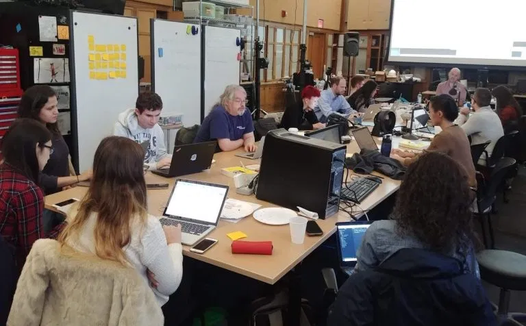
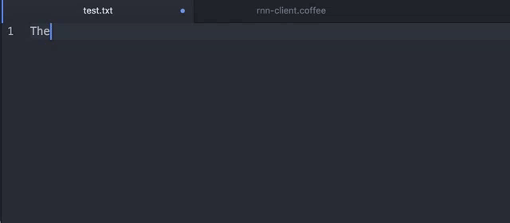
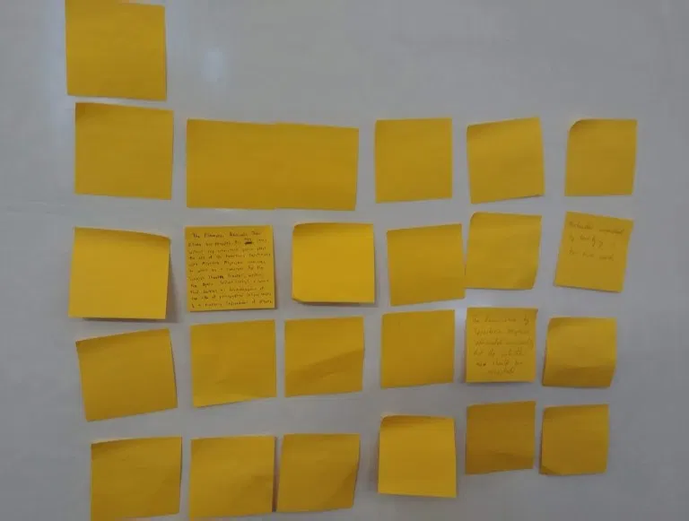
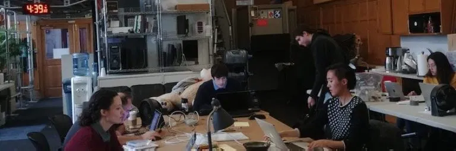

# The Center for Midnight

> *How many people do you need? Is an artistic movement only a movement as a collective? Can one person alone carry the melody?*

Over the course of 12 hours between October 29th and October 31st, a pop-up writing collective of artists, scholars, and algorithms uncovered a [fragmentary history of the Center for Midnight](https://www.robinsloan.com/center-for-midnight/), an imagined artistic movement of the late twentieth century.



We named ourselves the Midnight Society, though our membership was as <!-- page 2 --> difficult to enumerate as our goals. About thirty participants wandered in and out of the STUDIO for Creative Inquiry at Carnegie Mellon University over those three evenings, contributing words or technical expertise or editorial opinions or halloween candy, some for moments and others for hours. Members arrived from as far as the Atlantic and the Pacific, though the heart of our collective rested in Pittsburgh, the mind in Robin Sloan, and the words in a neural network taught to read by biographers and comedians.



The Center for Midnight began, as so many things do, with a blank page and a blinking cursor.

When we first invited bestselling author and technologist Robin Sloan to Pittsburgh, we knew we wanted him for an extended artist’s residency, but we didn’t have an end goal in sight. His first book, *Mr. Penumbra’s 24-Hour Bookstore*, has been called a love letter to digital humanities (by [me](https://scottbot.net/in-defense-of-collaboration/), among [others](https://twitter.com/mkirschenbaum/status/273077844400304129)), so you can see why a digital humanities center like ours would be interested in bringing him to town.

Inspiration came from his most recent experiments on human/computer collaborative writing. Sloan is developing a sort of [cyborg text editor](https://github.com/robinsloan/rnn-writer), an algorithmic cure for writer’s block, a machine that reads what you’ve written so far and offers a few words that might come next. It does so by reaching into its model of language, a recurrent neural network trained on whatever collection of <!-- page 3 --> text seems appropriate, and trying to find sensible endings to the sentence you began.

Together with the Frank-Ratchye STUDIO for Creative Inquiry and the Department of English, Carnegie Mellon University’s dSHARP Center for Innovative Digital Initiatives decided to invite Sloan to lead a three-day experiment of generative fiction. We would assemble a multi-talented team of artists and scholars from around Pittsburgh and elsewhere, connect them with Robin Sloan’s generative text editor, and attempt to assemble a readable short story in the space of 12 hours. The [results](https://www.robinsloan.com/center-for-midnight/) exceeded our high expectations.

Center for Midnight

<!-- page 4 -->

Before the workshop, we established a few ground rules. Participants would be capped at a dozen (we failed at keeping to that rule, to our benefit), would need to commit to being available every day (also failed, and also worked out fine), and would need to come with diverse skills and backgrounds (thankfully, finally, a success). More than four hours of writing a day would be a slog, and most people had daytime commitments, so we settled on 4-8pm, Monday through Wednesday, with copious food provided.

Inspired by David Markson’s *The Last Novel*, Robin decided to assemble the short story in 1-3 sentence snippets, which would allow people to contribute as much or as little as they were able. The story would be about a yet-unnamed artistic movement, so Robin pre-trained his recurrent neural network on the biographies of artists.

## Day 1

When everyone arrived on the afternoon of October 29th, the house was surprisingly packed; well over the dozen people I’d hand-selected, with more trickling in as the night went on. I guess word had gotten out. Our temporary base, the STUDIO for Creative Inquiry, acts as a home to rotating students, artists, and other ne’er-do-wells; its residents filled out our rogues’ gallery.

We spent a good while introducing ourselves, which proved important. By the end of the workshop, though our numbers had thinned, we wound up leaning on each person’s interests and skills for the tasks required to finish the story.

Robin introduced the premise, that each of us would use the algorithmic collaboration tool to assemble snippets of text about some fictional artist or artistic theme, and dump our results into a collective google doc. We produced about 80 snippets in all, ranging from a handful of words to over 300, each appended with a brief process note from the author:

- “I have no idea if Maabundas is a real word or if it was generated nonsense. <!-- page 5 --> Either way, it sounds cool.”
- “I cackled.”
- “Following up on my magical steer from a previous text chunk. This required a bit of guidance. I liked that it made me think of how I wanted certain bits to sound by generating text that I could respond to.”

Over the course of the night, we brainstormed other documents on which to train the neural network, and we settled on a bunch of biographies from the Harlem Renaissance, a corpus of stand-up comedy scripts, and the collected biographies of art collectors.

At the end of the evening, each of us picked a favorite line or phrase to share with the group, including:

- “The institutionalized monks of Yann Hirsch”
- “The Center for Midnight”
- “The golden age of lithography”
- “He wandered down to the beach, watching as the anti-capitalist, plant-themed novelist and short story writer wrestled with filmmaker Benjamin John O’Toole in a drunken bout of delirium.”

Stuffed with Mediterranean food and halloween candy, we went our separate ways, while Robin continued to work.

## Day 2

A 6×6 wall of seemingly blank post-its awaited us in the STUDIO. Each had on its sticky side a unique short instruction from Robin, defining a period, a subject, and a method: inception / artistic work / generate text; conflict / artist / mine text; development / relationship / generate text.

<!-- page 6 -->



We also arrived to a one-page description, assembled by Robin from yesterday’s favorite lines:

```
THE CENTER FOR MIDNIGHT (1967-1978)
Methods: (primarily but not exclusively) lithography and embroidery
Obsessed with: the sea, aging, and time

Inception → Development → Conflict → Dissolution

Dramatis personae
Strongly consider mentioning one or more of these:
-Okyanica-La Trail
-Minerva Black
-The filmmaker Benjamin John O'Toole
-Territoria Migraine ← yep that's a name
-The institutionalized monks of Yann Hirsch
```

Today’s assignment was to uncover the Center for Midnight’s story, which began in 1967 (the average year from yesterday’s google doc) and ended in 1978 (the <!-- page 7 --> median year). We each took a sticky note in turn, read our instructions, and got to work writing about the artists, artworks, and relationships that circled the Center at every stage of its short life. When finished, we deposited the text in a new google doc, exchanged stickies, and started all over again.

The Midnight Society, as I started thinking of our team, wrote 4,300 words that day. We riffed off each other, taking narrative threads we saw being dropped in the google doc and weaving them through our own snippets of semi-generated prose.

While we wrote, we listened to a ghostly soundtrack of music generated by Robin, assembled from a neural network trained on an artist he wished had produced more music.

Today’s algorithmic collaboration felt a bit different, now that we’d expanded the corpus on which the model was trained to include art collectors, artists from the Harlem Renaissance, and stand-up comedians. It was a bizarre time.

The night wrapped up, again, with the eating of food and picking of favorites:

- “She embroidered the ideas of Laura de Gioste on a seaside tree.”
- “Many works found considerable readers in the airport, specifically the painting called Neue Big Chrome.”
- “Minerva Black’s irreverent embroidery depicted classical Greek figures alongside high-tech imagery: Athena and her computer.”
- “When he died, she is reported to have said, ‘He became a response to himself.’”

## Day 3

The evening of Halloween, and only the most dedicated remained. About ten of us arrived to a soundtrack Robin had generated just that morning. The music was not <!-- page 8 --> unlike the calls of a dying caribou, and about as distressing, which if nothing else fit the holiday.



A new google doc awaited us, assembled from the words we’d contributed yesterday, though significantly reduced. Robin put order to our words, replaced a few proper nouns to solidify the narrative thread, and gave us some time to read what we’d written (or be impressed by this master author’s ability to give meaning to madness).

To polish the draft off, we marked the passages that confused or displeased us, and then each spent a while fixing the problem sections: making the narrative flow, removing tangents, and tightening the prose. On the final readthrough, we vetoed changes that needed vetoing, revived a few beloved but cut lines, and generally marveled at the readability of the final piece.

Somehow, amidst the chaos of machine prose and a barely coordinated, rotating group of amateurs, we assembled a [story](https://www.robinsloan.com/center-for-midnight/) with a narrative arc, delicious prose, and a coherent (if strange) plot.

## Aftermath

We can answer the question that drove our experimental workshop: can a dozen artists, technologists, and scholars collaborate with each other and with machines to produce a readable, interesting story in under 12 hours?

<!-- page 9 -->

Yes, if guided by a professional cyborg author like [Robin Sloan](https://www.robinsloan.com/).

While I can’t speak for the others, I found this to be the most refreshing writing crucible I’ve yet experienced.

I rarely get the opportunity to write fiction, but when I do, it’s a one-way street. I can send words to an empty screen, but the screen never sends words back. Over these three nights, a combination of algorithms and compatriots sat behind my blank page, and we lobbed words back and forth as though the blinking cursor were a tennis net.

Robin Sloan’s algorithmic writing companion works an awful lot like gmail’s new predictive sentence completion, just turned upside-down. It expands rather constrains a text’s possible futures. Whether this bodes a new era of writing, I cannot say. The experience rhymes with *Oulipo*, but reads more accessibly. If ease and mass distribution are the tailwind of 21st century change, perhaps the next decade will see the rise of a new sort of writing.

In the meantime, I’m scheming my next experiment.
