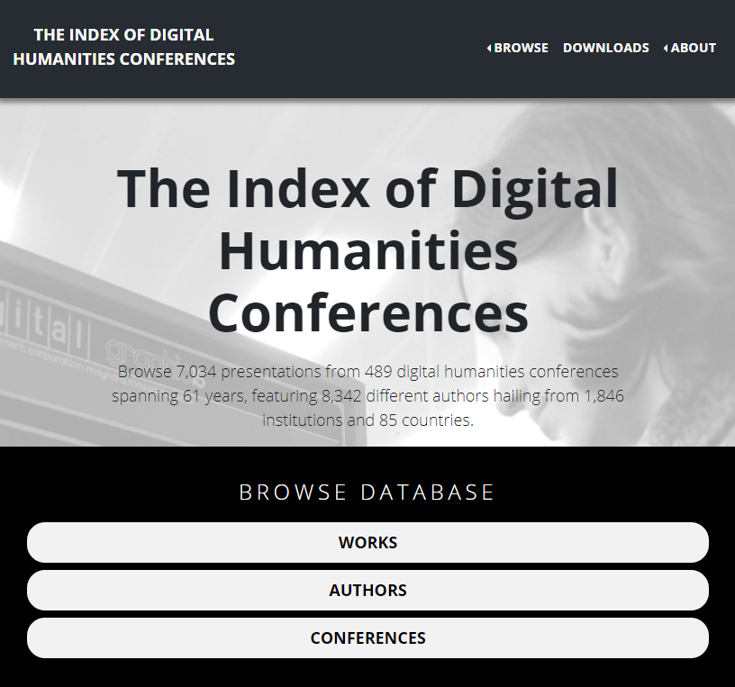

# The Index of Digital Humanities Conferences

<!-- page 1 -->

Check out [*The Index of Digital Humanities Conferences*](https://dh-abstracts.library.cmu.edu/), the largest extant collection of DH conference metadata.

## The Data

The *Index* focuses on the flagship ADHO conference, but encompasses other events as well. As of this release, it indexes [489 conferences](https://dh-abstracts.library.cmu.edu/conferences) from 39 countries dating back to 1960. We entered individual work metadata for 59 of those conferences, including titles, keywords, authorships, institutional affiliations, and so on. In all, there are [7,082 conference presentations](https://dh-abstracts.library.cmu.edu/works) by [8,392 authors](https://dh-abstracts.library.cmu.edu/authors), hailing from 1,830 institutions and 86 countries.

<!-- page 2 -->

*The Index of Digital Humanities Conferences homepage.*

The where/when conference data was crowdsourced through a [google sheet](https://docs.google.com/spreadsheets/d/1PlmqA6_53NUQ0xHAcMBdvDQjpir02clBpNoU5MglTJs/edit#gid=0) and twitter. Conference presentation metadata comes from a variety of public sources. Recent ADHO conferences generally come from XML files on [ADHO’s GitHub page](https://github.com/ADHO/), and earlier ADHO / ACH / ALLC conference metadata was entered by hand from old websites, PDFs, listservs, and printed conference programs contributed by Joe Rudman (ACH Treasurer 1985-1989). Non-ADHO conference data was entered by hand from public programs (usually PDFs).

To ease browsing and analysis, we cleaned and merged as much as we could. That means connecting “Cambridge University” with “University of Cambridge” and the occasional “Camridge University”, as well as “Scott B. Weingart” with “Scott Weingart”.

<!-- page 3 -->

When possible, we also indexed the full texts of conference abstracts / program entries. Currently those are only being used to power the search engine and generally not visible on a conference work page. We hope to be able to display full text in the coming months, as we get permissions to republish them from the original rights holders.

*The attribute assignment model diagram for the Index of Digital Humanities Conferences.*

## The Good

Julianne Nyhan and Andrew Flinn [recently wrote](https://link.springer.com/chapter/10.1007/978-3-319-20170-2_1)

<!-- page 4 -->

> *A crucial obstacle to the writing of histories of the field is that much of DH’s archival evidence has either not been preserved or is held by individuals (and so remains ‘hidden’ unless one can discover its existence and secure approval and the means to access it).*
>
> — Nyhan & Flynn, 2016

This holds as true for DH conferences as for the sources Nyhan & Flinn were working with. There’s no single public archive for physical conference programs, most old conference websites no longer exist (often even absent from the Internet Archive), and even ADHO’s digital records are spread out across many sources or locked in byzantine and private ConfTool data dumps.

Ours isn’t the first attempt to put a DH conference database together, but it is the most extensive. It represents eight years of work by many [collaborators and contributors](https://dh-abstracts.library.cmu.edu/pages/team/), and builds off those earlier attempts. And it’s all open for anyone to use: anyone can [download](https://dh-abstracts.library.cmu.edu/downloads) the data to browse or analyze.

In making this corner of our community’s history more accessible, we hope this helps fill the archival gap pointed out by Nyhan and Flinn.

## The Bad

This was always a passion project: never funded, nor supported by any scholarly organization. We work on it in empty moments, usually months apart. We don’t have resources for additional quality control, nor time to implement all the features we want on the website.

Errors are rampant. We made mistakes entering data, we made mistakes cleaning and merging data, and we inherited mistakes made by conference program editors or even, occasionally, authors themselves. Some common issues include merging two entries that should be separate (John Smith of Florida vs. John Smith of Maryland, not the same person), or not merging two entries who should be connected (J.B. Smith vs. John Smith, the same person).

<!-- page 5 -->

If you spot an error, please reach out to me, and I’ll do my best to fix it in a timely fashion.

For a dataset that spent its first six years as a hilariously complicated excel spreadsheet shared on Dropbox, the web interface is amazing. It solves so many problems. But there’s still a lot missing, because we simply don’t have time to build it. Faceting works strangely, we’re missing a lot of useful search interfaces, and we just don’t have the infrastructure needed to turn this into a crowdsourcing project.

## The Ugly

Errors in data cleaning and merging can be problematic, but generally not show-stopping. Unfortunately data in the *Index* does have a few show-stopping issues, but rather than keep everything private until we can fix them all, we’re releasing this publicly in the hope the community can help.

When merging people, unless we’re absolutely certain two people with different names are the same, we won’t connect them in the database. That means a Jane Smith who changes her name to Jane Doe after getting married will not be merged. The issue disproportionately affects women (who are more likely to change names during their careers), and as [Jessica Otis and I point out](https://6dfb.tumblr.com/post/136678327006/gender-inclusivity-in-six-degrees), will put those women at a disadvantage in any eventual analysis.

The merging issue also affects people who for whatever reason (often gender/identity transition) decide to change their names. To complicate matters further, many who change their names do not want their birth name / deadname shared on the web, but since we don’t know that, their old names remain visible within our database.

Our data entry and cleaning gets worse the further we (the data collectors) get from our cultural comfort zones. This became a problem in the first and last name fields; figuring out what went where proved particularly difficult for us with respect to Hispanic and Indian authors. We reached out to friends for help, and used the separations entered by authors themselves when XML was available, but errors still abound.

<!-- page 6 -->

Additionally, our department/institution database ontology (a strict hierarchy) fails for many Italian and French research units, which are often shared across many institutions. Italian and French affiliations are frankly in an abysmal state, and we’d appreciate input to help us untangle that mess.

## Sir Not Appearing In This Film

The most apparent absence in the database and website is the full text of presentation abstracts (which are sometimes the entire conference paper).

We have full text for 75% of all works in the database (5,301 of them, to be exact), but because we either don’t know their copyright status or don’t have explicit permission to publish them, they are currently invisible. Searching in the works page will search through the full text of the abstracts, and present works with relevant hits, but visitors will have to find other sources to view the abstracts themselves. We’re working to secure permissions to share what we have, but it may take some time.

When I [first started this project back in 2012](http://scottbot.net/digital-humanities-2013-submission-analysis/), it was based on submissions to the DH conference, which I collected by scraping (without permission) the semi-private website for reviewers to select which submissions they were most qualified to review. I continued this for several years, comparing submitted abstracts to what made it to the final program, adding collaborators along the way. For privacy reasons, that data isn’t included here.

My collaborators and I also began collecting author demographic data, using it to [point out biases, absences, and related issues of equity and inclusion in the DH conference community](https://dhdebates.gc.cuny.edu/read/untitled-4e08b137-aec5-49a4-83c0-38258425f145/section/5dcc1fee-caef-4c10-aa3c-08a9bbf0b68b). Though reductive, the data served its purpose. Following the work of Miriam Posner and conversations with Shack Hackney, however, we believe the potential for harm in making demographic data part of this public database would outweigh any potential benefits.

<!-- page 7 -->

Such demographic data would also likely put as at odds with GDPR. It’s worth pointing out that ADHO is keeping its distance from this project because it is worried about potential GDPR ramifications even without demographic data, which is understandable. From several sources (e.g., [1](https://www.nationalarchives.gov.uk/documents/information-management/guide-to-archiving-personal-data.pdf), [2](https://www.legislation.gov.uk/ukpga/2018/12/schedule/2/part/6/enacted), [3](https://ec.europa.eu/info/sites/info/files/eag_draft_guidelines_1_11_0.pdf)), it seems this is an “archive in the public interest” and thus doesn’t violate GDPR, however I’m not a lawyer and I suppose anything can happen.

In the spirit of GDPR and the general “right to be forgotten”, we will happily take down any personal data for any reason. Just reach out to me if you’d like your materials to be removed.

## Roll Credits

As alluded to earlier, this was a group effort over eight years. Nickoal Eichmann-Kalwara has been my partner in crime (sometimes literally, but only small crimes) for most of it. We’ve put in countless hours guiding the project, entering and cleaning data, and strong-arming friends into becoming collaborators. Jeana Jorgensen contributed her inimitable expertise and guidance for many years. Matt Lincoln single-handedly turned our janky spreadsheets into an actual database and website.

There are 55 additional names on our [credits page](https://dh-abstracts.library.cmu.edu/pages/team/), and every one of them is worth mention.

## Appendix: Conferences with Presentation Metadata

Although there are 489 conferences in the index, only 59 of them currently include presentation metadata. They are presented below, organized by conference series when applicable. Some series overlap (e.g., ACH/ALLC overlaps one year with ADHO), so the numbers will add up to higher than 59.

<!-- page 8 -->

*Conferences that aren’t part of a series*

- 1964 Conference on the Use of Computers in Humanistic Research (1)
- 1964 Literary Data Processing Conference (1)
- 1968 Computers and their potential applications in museums (1)
- 1969 IBM Symposium on Introducing the Computer into the Humanities (1)
- 1979 International Conference on Literary and Linguistic Computing (1)
- 2019 The Arts, Knowledge, and Critique in the Digital Age in India: Addressing Challenges in the Digital Humanities (1)

*Conferences that are part of a series*

- ADHO (the “DH” conference) (15)
- ACH/ICCH (25)
- ALLC/EADH (24)
- Caribbean Digital (1)
- Digital Humanities Alliance of India (DHAI) (1)
- Digital Humanities Forum (1)
- Encuentro de Humanistas Digitales (EHD) (1)
- EADH (1)
- ALLC IM/AGM (4)
- Japanese Association for Digital Humanities Annual Conference (JADH) (1)
- Joint ACH/ALLC (18)
- KeystoneDH (1)
