**Network Workbench Tool**  
**User Manual 1.0.0**

**Getting Started**  
**General Tutorial**  
**Domain Specific: Information Science Tutorial**  
**Domain Specific: Social Science Tutorial**  
**Domain Specific: Scientometrics Tutorial**

*Updated 09.16.2009*

**Project Investigators:** Dr. Katy Börner, Dr. Albert-László Barabási (Northeastern University), Dr. Santiago Schnell (University of Michigan), Dr. Alessandro Vespignani, Dr. Stanley Wasserman, and Dr. Eric A. Wernert

**Programmers:** Weixia (Bonnie) Huang, Russell J. Duhon, Micah W. Linnemeier, Patrick Phillips, Chintan Tank, Joseph Biberstine, Timothy Kelley, Duygu Balcan, Mariano Beiró (Universidad de Buenos Aires, Argentina), Bruce W. Herr II, Santo Fortunato (Institute for Scientific Interchange Foundation, Torino, Italy), Ben Markines, Felix Terkhorn, Heng Zhang, Megha Ramawat, César A. Hidalgo (Harvard University), Ramya Sabbineni, Vivek Thakre, Ann McCranie, Alessandro Vespignani, and Katy Börner

**Users, Testers & Tutorial Writers:** Katy Börner, Angela Zoss, Hanning Guo, Scott Weingart, Ann McCranie, Mark A. Price (at Indiana University unless otherwise specified)

*Cyberinfrastructure for Network Science Center*  
*School of Library and Information Science*  
*Indiana University, Bloomington, IN*

*http://cns.slis.indiana.edu*

For comments, questions or suggestions, please post to the nwb-helpdesk@googlegroups.com mailing list.

<!-- page 1 -->

### Table of Contents

- 1. GETTING STARTED 4
  - 1.1 INTRODUCTION 4
  - 1.2 DOWNLOAD AND INSTALL 4
  - 1.3 CUSTOMIZING NWB 6
  - 1.4 USER INTERFACE 7
  - 1.5 WORKFLOW DESIGN 8
- 2. SAMPLE DATASETS AND SUPPORTED DATA FORMATS 9
  - 2.1 SAMPLE DATASETS 9
  - 2.2 DATA FORMATS 10
- 3. CODE LIBRARY 11
  - 3.1 OSGI PLUGINS 11
  - 3.2 CISHELL PLUGINS 11
  - 3.3 CONVERTER PLUGINS 12
  - 3.4 ALGORITHM PLUGINS 12
    - 3.4.1 Preprocessing 12
    - 3.4.2 Analysis 13
    - 3.4.3 Modeling 13
    - 3.4.4 Visualization 14
  - 3.5 SUPPORTING LIBRARIES 14
  - 3.6 INTEGRATED TOOLS 14
    - 3.6.1 GUESS 14
    - 3.6.2 Gnuplot 14
- 4. GENERAL TUTORIAL 14
  - 4.1 LOAD, VIEW, AND SAVE DATA 14
  - 4.2 DATA CONVERSION SERVICE 16
  - 4.3 COMPUTE BASIC NETWORK STATISTICS 16
  - 4.4 MODELING 17
    - 4.4.1 Random Graph Model 17
    - 4.4.2 Watts-Strogatz Small World 18
    - 4.4.3 Barabási-Albert Scale Free Model 19
  - 4.5 TREE VISUALIZATIONS 20
    - 4.5.1 Tree View Visualization 20
    - 4.5.2 Tree Map Visualization 20
    - 4.5.3 Balloon Graph Visualization 21
    - 4.5.4 Radial Tree Visualization 22
    - 4.5.5 Radial Tree/Graph with Annotation 23
  - 4.6 GRAPH VISUALIZATIONS 23
    - 4.6.1 JUNG-based Circular, Kamada-Kawai, Fruchterman-Rheingold, and Spring Layouts 23
    - 4.6.2 Prefuse-based Specified, Radial Tree/Graph, Force Directed, and Fruchterman-Rheingold, and Small World Layouts 24
    - 4.6.3 GUESS Visualizations 24
    - 4.6.4 DrL Large Network Layout 27
    - 4.6.5 LaNet 27
    - 4.6.6 Circular Hierarchy 28
  - 4.7 SAVING VISUALIZATIONS FOR PUBLICATION 28
- 5. DOMAIN SPECIFIC: INFORMATION SCIENCE 28
  - 5.1 READ AND DISPLAY A FILE HIERARCHY 28
  - 5.2 ERROR AND ATTACK TOLERANCE OF NETWORKS 28
  - 5.3 STUDYING PEER-TO-PEER NETWORKS 28

<!-- page 2 -->

- 6. DOMAIN SPECIFIC: SOCIAL SCIENCE 28
  - 6.1 LOAD DATA 29
  - 6.2 BASIC NETWORK PROPERTIES 29
  - 6.3 NETWORK ANALYSIS 30
  - 6.4 VISUALIZATION 30
- 7. DOMAIN SPECIFIC: SCIENTOMETRICS 31
  - 7.1 INTRODUCTION 31
    - 7.1.1 Available Datasets and Algorithms 31
    - 7.1.2 General Workflow 32
  - 7.2 BIBLIOGRAPHIC DATA ACQUISITION AND PREPARATION 33
    - 7.2.1 Publication Data: ISI, Scopus, and Google Scholar 34
    - 7.2.2 Personal Bibliographies: EndNote and Bibtex 36
    - 7.2.3 Funding: NSF Data 36
    - 7.2.4 Scholarly Database 38
  - 7.3 TEMPORAL ANALYSIS 40
    - 7.3.1 Charting Trends 40
    - 7.3.2 Burst Detection 40
    - 7.3.3 Slice Table by Time 44
  - 7.4 GEOSPATIAL ANALYSIS 45
  - 7.5 TOPICAL ANALYSIS 46
  - 7.6 NETWORK ANALYSIS 46
    - 7.6.1 Direct Linkages 47
    - 7.6.2 Co-Occurrence Linkages 50
    - 7.6.3 Co-Citation Linkages 55
  - 7.7 ANALYZING AND VISUALIZING LARGE NETWORKS 56
    - 7.7.1 Basic Network Properties 56
    - 7.7.2 Backbone Identification 57
    - 7.7.3 Community Detection 58
    - 7.7.4 Large Network Layout 63
  - 7.8 COMPARISON WITH OTHER TOOLS 63
    - 7.8.1 General Comparison 63
    - 7.8.2 HistCite by Eugene Garfield 66
    - 7.8.3 CiteSpace by Chaomei Chen 67
    - 7.8.4 Pajek by Vladimir Batagelj et al 72
    - 7.8.5 Software by Loet Leydesdorff 72
- ACKNOWLEDGEMENTS 73
- REFERENCES 73
- LICENSE 77

<!-- page 3 -->

## 1. Getting Started

*1.1 Introduction* The Network Workbench (NWB) Tool (Herr II, Huang, Penumarthy, & Börner, 2007) is a network analysis, modeling, and visualization toolkit for physics, biomedical, and social science research. It is built on Cyberinfrastructure Shell (CIShell) (Cyberinfrastructure for Network Science Center, 2008), an open source software framework for the easy integration and utilization of datasets, algorithms, tools, and computing resources. CIShell is based on the OSGi R4 Specification and Equinox implementation (OSGi-Alliance, 2008). The Network Workbench Community Wiki provides a one-stop online portal for researchers, educators, and practitioners interested in the study of networks. It is a place for users of the NWB Tool, CIShell, or any other CIShell based program to get, upload, and request algorithms and datasets to be used in their tool so that it truly meets their needs and the needs of the scientific community at large. Users of the NWB Tool can

  Access major network datasets online or load their own networks.

  Perform network analysis with the most effective algorithms available.

  Generate, run, and validate network models.

  Use different visualizations to interactively explore and understand specific networks.

  Share datasets and algorithms across scientific boundaries.

As of August 2009, the NWB Tool provides access to over 100 algorithms and over 60 sample datasets for the study of networks. It also allows the loading, processing, and saving of thirteen file formats (NWB, GraphML, Pajek .net, Pajek .matrix, XGMML, TreeML, ISI, Scopus, NSF, Bibtex, Endnote, Edgelist, and CSV) and supports automatic conversion between those formats. Additional algorithms and data formats can be integrated into the NWB Tool using wizard driven templates. Although the CIShell and the NWB Tool are developed in Java, algorithms developed in other programming languages such as FORTRAN, C, and C++ can be easily integrated. Among others, JUNG (O'Madadhain, Fisher, & Nelson, 2008) and Prefuse libraries (Heer, Card, & Landay, 2005) have been integrated into the NWB as plug-ins. NWB also supplies a plug-in that invokes the Gnuplot application (Williams & Kelley, 2008) for plotting data analysis results and the GUESS tool (Adar, 2007) for rendering network layouts. LaNet-vi (Alvarez-Hamelin, Dall'Asta, Barrat, & Vespignani, 2008) for rendering network layouts. LaNet-vi (Alvarez-Hamelin et al., 2008) uses the *k-* core decomposition to visualize large scale complex networks in two dimensions.

*1.2 Download and Install* The Network Workbench tool is a stand-alone desktop application that installs and runs on all common operating systems. NWB Tool 0.7.0 and later versions require Java SE 5 (version 1.5.0) or later to be pre-installed on your local machine. You can check the version of your Java installation by running the command line: java –version If not already installed on your computer, download and install Java SE 5 or 6 from http://www.java.com/en/download/index.jsp. To download NWB Tool, go to http://nwb.slis.indiana.edu/download.html and select your operating system from the pull down menu, see Figure 1.1.

<!-- page 4 -->

**Figure 1.1:** Select operating system and download NWB Tool Save the jar file in a new empty **yournwbdirectory** directory, double click the jar file, or run the command line: java -jar *yourfilename*.*jar*

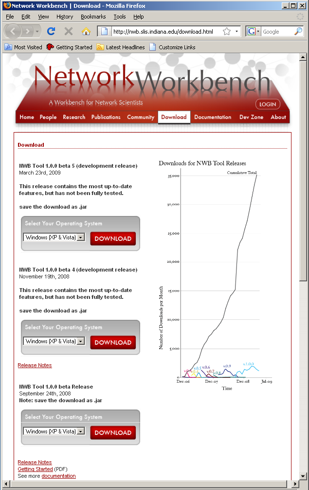

<!-- page 5 -->

will appear on the Desktop. To run NWB Tool, double click the ‘Network Workbench’ icon. To uninstall NWB Tool, i.e., to delete all files in **yournwbdirectory**, double click the ‘Uninstall NWB’ icon. WARNING: clicking the ‘Uninstall NWB’ icon will delete every file and folder within **yournwbdirectory**. Make sure all necessary documents are backed up.

After the successful installation, two NWB icons

*1.3 Customizing NWB* Because NWB is built on CIShell, users can fully customize the tool through the use of plugins. A thorough walkthrough of how to develop and integrate plugins can be found at http://cishell.org/?n=DevGuide.NewGuide. A user might create or download an NWB plugin or simply receive it via email from a colleague. To add the plugin to the tool, save the *.jar file into the *yournwbdirectory*/plugins directory, restart the NWB Tool, and the plugin will appear in the appropriate menu. To delete a plugin, exit the NWB Tool and delete the corresponding *.jar file from the *yournwbdirectory*/plugins directory. When the Tool is re-started, the plugin will no longer be available in the menu. Users can also organize the menu items as they wish. In order to do so, you must open *yournwbdirectory*/configuration/default_menu.xml in any text editor. The file is shown in Figure 1.2.

**Figure 1.2**: Changing the menu structure by editing the *default_menu.xml* specification file The file is organized in a hierarchy, with menu items nested inside other menu items. An item’s depth within the hierarchy is signified by how far it is indented, and the menu it resides in is determined by what top_menu name or menu name it is underneath. A menu item takes the form *<menu pid = “*AlgorithmIdentifierHere*” />,* and from

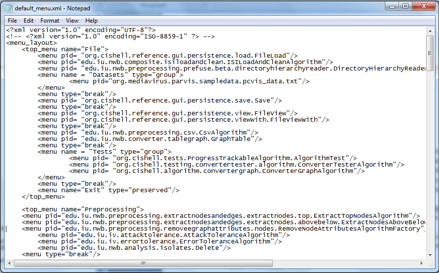

<!-- page 6 -->

within this file the menu items and titles can be customized completely. Dividing lines between menu items are represented by *<menu type=“break”/>*. Remember to add a new *<menu pid = “*AlgorithmIdentifierHere*”>* for custom plugins. Save *default_menu.xml* when finished and restart the program to see the changes.

*1.4 User Interface* The general NWB Tool user interface is shown in Figure 1.3, see also (Herr II et al., 2007).

**Figure 1.3:** Network Workbench Tool interface components All operations such as loading, viewing, or saving datasets, running various algorithms, and algorithm parameters, etc. are logged sequentially in the ‘Console’ window as well as in the log files. The Console window also displays the acknowledgement information about the original authors of the algorithm, the developers, the integrators, a reference paper, and the URL to the reference if available, together with an URL to the algorithm description in the NWB community wiki. The ‘Data Manager’ window displays all currently loaded and available datasets. The type of a loaded file is indicated by its icon:

Text—text file

Table— tabular data (csv file)

Matrix—data (Pajek .mat)

Plot—plain text file that can be plotted using Gnuplot

Tree—Tree data (TreeML)

Network—Network data (in-memory graph/network object or network files saved as Graph/ML, XGMML, NWB, Pajek .net or Edge list format)

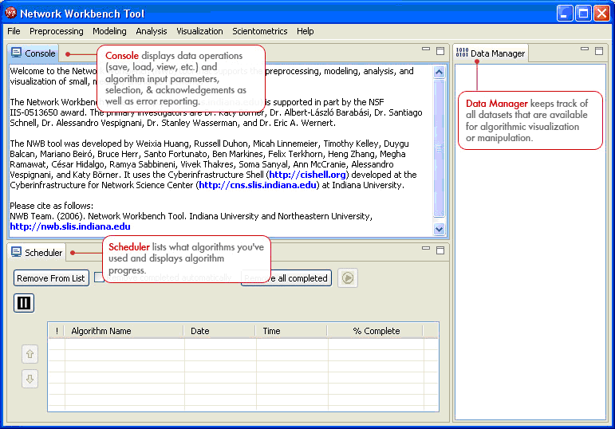

<!-- page 7 -->

Derived datasets are indented under their parent datasets. That is, the children datasets are the results of applying certain algorithms to the parent dataset. The ‘Scheduler’ lets users keep track of the progress of running algorithms.

*1.5 Workflow Design* Many if not all network studies require the application of more than one algorithm. A sequence of algorithm calls is also called a workflow. A common workflow comprises data loading/sampling/modeling, then preprocessing and analysis and finally visualization. Figures 1.4 and 1.5 show the menu items available in the final 1.0.0 release. There are domain specific plugin sets, e.g., for scientometrics, see Figure 7.1 in section 7. Domain Specific: Scientometrics. Algorithms that are not applicable to a currently loaded and selected dataset are grayed out.

**Figure 1.4:** File, Preprocessing, Modeling, and Visualization menus The Analysis menu has several submenus as shown in Figure 1.5.

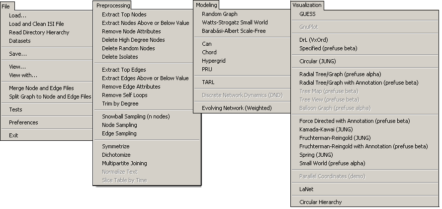

<!-- page 8 -->

**Figure 1.5:** Analysis menu and submenus

## 2. Sample Datasets and Supported Data Formats

*2.1 Sample Datasets* The ‘*yournwbdirectory*/sampledata’ directory provides sample datasets from the biology, network, scientometrics, and social science research domains, see listing below. **/biology** FlyMINT.nwb humanprot.nwb TF_DNA_regulonDB.nwb WI5.nwb WormMint.nwb YeastMINT.nwb /biology/DND * Used in DND model colorectalCancerModel csv drosophila.csv graduationUseCase.csv samplePolynomialUseCase.csv simpleDNDFunction.csv **/network** convertGraph_v0.8.0.graphml kidscontest.net netsci06-conference.net seiyu.graphml.xml **/scientometrics** /scientometrics/bibtex LaszloBarabasi.bib bibsonomy.bib /scientometrics/csv LaszloBarabasi.csv /scientometrics/endnote

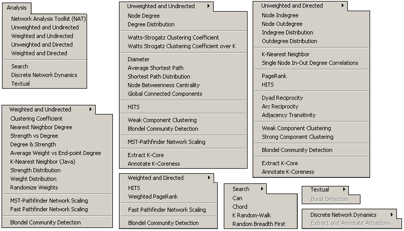

<!-- page 9 -->

LaszloBarabasi.enw /scientometrics/isi FourNetSciResearchers.isi LaszloBarabasi.isi EugeneGarfield.isi AlessandroVespignani.isi StanleyWasserman.isi test5papers.isi ThreeNetSciResearchers.isi /scientometrics/models/TARL Agingfunction.txt inscript.tarl /scientometrics/nsf BethPlale.nsf Cornell.nsf GeoffreyFox.nsf Indiana.nsf MichaelMcRobbie.nsf Michigan.nsf /scientometrics/properties * Used to extract networks and merge data bibtexCoAuthorship.properties endnoteCoAuthorship.properties isiCoAuthorship.properties isiCoCitation.properties isiPaperCitation.properties mergeBibtexAuthors.properties mergeEndnoteAuthors.properties mergeIsiPaperCitation.properties mergeIsiAuthors.properties mergeNsfPIs.properties mergeScopusAuthors.properties nsfCoPI.properties nsfPIToProject.properties scopusCoAuthorship.properties /scientometrics/scopus BrainCancer.scopus **/socialscience** florentine.nwb friendster.graphml.xml friendster.xgmml.xml PSYCHCONSULT.nwb terror.graphml.xml terror.xgmml.xml

### 2.2 Data Formats

In August 2009, the NWB Tool supports loading the following input file formats:

  GraphML (*.xml or*.graphml)

  XGMML (*.xml)

  Pajek .NET (*.net)

  Pajek .Matrix (*.mat)

  NWB (*.nwb)

  TreeML (*.xml)

  Edgelist (*.edge)

  Scopus csv (*.scopus)

  NSF csv (*.nsf)

  CSV (*.csv)

  ISI (*.isi)

  Bibtex (*.bib)

<!-- page 10 -->

 Endnote Export Format (*.enw)

and the following network file output formats:

  GraphML (*.xml or*.graphml)

  Pajek .MAT (*.mat)

  Pajek .NET (*.net)

  NWB (*.nwb)

  XGMML (*.xml)

These formats are documented at https://nwb.slis.indiana.edu/community/?n=DataFormats.HomePage.

**3. Code Library** The NWB Tool is an ‘empty shell’ filled with plugins. Some plugins run the core architecture, see OSGi and CIShell plugins. Others convert loaded data into in-memory objects, into formats the different algorithms can read - behind the scenes. Most interesting for users are the algorithms plugins that can be divided into algorithms for preprocessing, analysis, modeling, and visualization. Last but not least there are other supporting libraries and entire tools that are plugged-and-played.

### 3.1 OSGi Plugins

org.eclipse.core.commands_3.3.0.I20070605-0010.jar org.eclipse.core.contenttype_3.2.100.v20070319.jar org.eclipse.core.databinding_1.0.0.I20070606-0010.jar org.eclipse.core.databinding.beans_1.0.0.I20070606-0010.jar org.eclipse.core.expressions_3.3.0.v20070606-0010.jar org.eclipse.core.jobs_3.3.0.v20070423.jar org.eclipse.core.net_1.0.0.I20070531.jar org.eclipse.core.runtime_3.3.100.v20070530.jar org.eclipse.core.runtime.compatibility.auth_3.2.100.v20070502.jar org.eclipse.equinox.app_1.0.1.R33x_v20070828.jar org.eclipse.equinox.cm_3.2.0.v20070116.jar org.eclipse.equinox.common_3.3.0.v20070426.jar org.eclipse.equinox.ds_1.0.0.v20070226.jar org.eclipse.equinox.event_1.0.100.v20070516.jar org.eclipse.equinox.launcher_1.0.0.v20070606.jar org.eclipse.equinox.launcher_1.0.1.R33x_v20080118.jar org.eclipse.equinox.launcher.gtk.linux.x86_1.0.0.v20070606 org.eclipse.equinox.log_1.0.100.v20070226.jar org.eclipse.equinox.metatype_1.0.0.v20070226.jar org.eclipse.equinox.preferences_3.2.101.R33x_v20080117.jar org.eclipse.equinox.registry_3.3.1.R33x_v20070802.jar org.eclipse.equinox.useradmin_1.0.0.v20070226.jar org.eclipse.equinox.util_1.0.0.200803111100.jar org.eclipse.help_3.3.0.v20070524.jar org.eclipse.jface_3.3.0.I20070606-0010.jar org.eclipse.jface.databinding_1.1.0.I20070606-0010.jar org.eclipse.osgi_3.3.2.R33x_v20080105.jar org.eclipse.osgi.services_3.1.200.v20070605.jar org.eclipse.osgi.util_3.1.200.v20070605.jar org.eclipse.rcp_3.2.0.v20070612.jar org.eclipse.swt_3.3.0.v3346.jar org.eclipse.swt.gtk.linux.x86_3.3.0.v3346.jar org.eclipse.ui_3.3.0.I20070614-0800.jar org.eclipse.ui.forms_3.3.0.v20070511.jar org.eclipse.ui.workbench_3.3.0.I20070608-1100.jar org.eclipse.update.configurator_3.2.100.v20070615.jar org.eclipse.update.core_3.2.100.v20070615.jar org.eclipse.update.core.linux_3.2.0.v20070615.jar org.eclipse.update.ui_3.2.100.v20070615.jar

### 3.2 CIShell Plugins

edu.iu.nwb.gui.brand_1.0.0.jar edu.iu.nwb.gui.brand.welcometext_0.0.1.jar

<!-- page 11 -->

org.cishell.algorithm.convertergraph_1.0.0.jar org.cishell.framework_1.0.0.jar org.cishell.reference_1.0.0.jar org.cishell.reference.gui.datamanager_1.0.0.jar org.cishell.reference.gui.guibuilder.swt_1.0.0.jar org.cishell.reference.gui.log_1.0.0.jar org.cishell.reference.gui.menumanager_1.0.0.jar org.cishell.reference.gui.persistence_1.0.0.jar org.cishell.reference.gui.prefs.swt_0.0.1.jar org.cishell.reference.gui.scheduler_1.0.0.jar org.cishell.reference.gui.workspace_1.0.0.jar org.cishell.reference.prefs.admin_0.0.1.jar org.cishell.reference.services_1.0.0.jar org.cishell.service.autostart_1.0.0.jar org.cishell.templates_1.0.0.jar org.cishell.templates.jythonrunner_1.0.0 org.cishell.testing.convertertester.algorithm_0.0.1.jar org.cishell.testing.convertertester.core.new_0.0.1.jar org.cishell.tests.ProgressTrackableAlgorithm_1.0.0.jar org.cishell.utilities_1.0.0.jar

### 3.3 Converter Plugins

edu.iu.nwb.converter.edgelist_1.0.0.jar edu.iu.nwb.converter.jungprefuse_1.0.0.jar edu.iu.nwb.converter.jungprefusebeta_1.0.0.jar edu.iu.nwb.converter.nwb_1.0.0.jar edu.iu.nwb.converter.nwbgraphml_1.0.0.jar edu.iu.nwb.converter.nwbpajeknet_1.0.0.jar edu.iu.nwb.converter.pajekmat_1.0.0.jar edu.iu.nwb.converter.pajekmatpajeknet_1.0.0.jar edu.iu.nwb.converter.pajeknet_0.7.0.jar edu.iu.nwb.converter.prefusebibtex_0.0.1.jar edu.iu.nwb.converter.prefusecsv_0.7.0.jar edu.iu.nwb.converter.prefusegraphml_0.7.0.jar edu.iu.nwb.converter.prefuseisi_0.7.0.jar edu.iu.nwb.converter.prefusensf_0.0.1.jar edu.iu.nwb.converter.prefuserefer_0.0.1.jar edu.iu.nwb.converter.prefusescopus_0.0.1.jar edu.iu.nwb.converter.prefuseTreeBetaAlpha_1.0.0.jar edu.iu.nwb.converter.prefusetreeml_1.0.0.jar edu.iu.nwb.converter.prefusexgmml_1.0.0.jar edu.iu.nwb.converter.tablegraph_1.0.0.jar edu.iu.nwb.converter.treegraph_1.0.0.jar edu.iu.scipolicy.converter.psraster_0.0.1.jar

### 3.4 Algorithm Plugins

#### 3.4.1 Preprocessing

edu.iu.nwb.composite.extractauthorpapernetwork_0.0.1.jar edu.iu.nwb.composite.extractcowordfromtable_1.0.0.jar edu.iu.nwb.composite.extractpapercitationnetwork_0.0.1.jar edu.iu.nwb.composite.isiloadandclean_0.0.1.jar edu.iu.nwb.preprocessing.bibcouplingsimilarity_0.9.0.jar edu.iu.nwb.preprocessing.cocitationsimilarity_1.0.0.jar edu.iu.nwb.preprocessing.csv_1.0.0.jar edu.iu.nwb.preprocessing.duplicatenodedetector_1.0.0.jar edu.iu.nwb.preprocessing.extractnodesandedges_0.0.1.jar edu.iu.nwb.preprocessing.pathfindernetworkscaling.fast_1.0.0.jar edu.iu.nwb.preprocessing.pathfindernetworkscaling.mst_1.0.0.jar edu.iu.nwb.preprocessing.prefuse.beta.directoryhierarchyreader_1.0.0.jar edu.iu.nwb.preprocessing.removegraphattributes_0.0.1.jar edu.iu.nwb.preprocessing.tablefilter_1.0.0.jar edu.iu.nwb.preprocessing.text.normalization_1.0.0.jar edu.iu.nwb.preprocessing.timeslice_1.0.0.jar edu.iu.nwb.preprocessing.trimedges_1.0.0.jar edu.iu.nwb.tools.mergenodes_1.0.0.jar

<!-- page 12 -->

edu.iu.nwb.util_1.0.0.jar edu.iu.nwb.shared.isiutil_1.0.0.jar

#### 3.4.2 Analysis

edu.iu.nwb.analysis.averageshortestpath_1.0.0.jar edu.iu.nwb.analysis.blondelcommunitydetection_0.0.1.jar edu.iu.nwb.analysis.burst_1.0.0.jar edu.iu.nwb.analysis.clustering_1.0.0.jar edu.iu.nwb.analysis.clustering_vs_k_1.0.0.jar edu.iu.nwb.analysis.connectedcomponents_1.0.0.jar edu.iu.nwb.analysis.diameter_1.0.0.jar edu.iu.nwb.analysis.dichotomize_1.0.0.jar edu.iu.nwb.analysis.extractattractors_0.0.1.jar edu.iu.nwb.analysis.extractcoauthorship_1.0.0.jar edu.iu.nwb.analysis.extractdirectednetfromtable_1.0.0.jar edu.iu.nwb.analysis.extractnetfromtable_1.0.0.jar edu.iu.nwb.analysis.hits_1.0.0.jar edu.iu.nwb.analysis.indegreedistribution_1.0.0.jar edu.iu.nwb.analysis.isidupremover_0.0.1.jar edu.iu.nwb.analysis.isolates_1.0.0.jar edu.iu.nwb.analysis.java.directedknn_0.0.1.jar edu.iu.nwb.analysis.java.nodedegree_0.0.1.jar edu.iu.nwb.analysis.java.nodeindegree_0.0.1.jar edu.iu.nwb.analysis.java.nodeoutdegree_0.0.1.jar edu.iu.nwb.analysis.java.strongcomponentclustering_0.0.1.jar edu.iu.nwb.analysis.java.undirectedknn_0.0.1.jar edu.iu.nwb.analysis.kcore_1.0.0.jar edu.iu.nwb.analysis.multipartitejoining_1.0.0.jar edu.iu.nwb.analysis.onepointcorrelations_1.0.0.jar edu.iu.nwb.analysis.outdegreedistribution_1.0.0.jar edu.iu.nwb.analysis.pagerank_1.0.0.jar edu.iu.nwb.analysis.pagerank.weighted_0.0.1.jar edu.iu.nwb.analysis.reciprocity.arc_1.0.0.jar edu.iu.nwb.analysis.reciprocity.dyad_1.0.0.jar edu.iu.nwb.analysis.sampling_1.0.0.jar edu.iu.nwb.analysis.selfloops_1.0.0.jar edu.iu.nwb.analysis.shortestpathdistr_1.0.0.jar edu.iu.nwb.analysis.sitebetweenness_1.0.0.jar edu.iu.nwb.analysis.symmetrize_1.0.0.jar edu.iu.nwb.analysis.totaldegreedistribution_1.0.0.jar edu.iu.nwb.analysis.transitivity.adjacency_1.0.0.jar edu.iu.nwb.analysis.weakcomponentclustering_1.0.0.jar edu.iu.nwb.analysis.weighted.averageclusteringcoefficient_0.6.0.jar edu.iu.nwb.analysis.weighted.averagenearestneighbor_0.6.0.jar edu.iu.nwb.analysis.weighted.degreeaveragestrength_0.6.0.jar edu.iu.nwb.analysis.weighted.degreestrength_0.6.0.jar edu.iu.nwb.analysis.weighted.endpointdegree_0.6.0.jar edu.iu.nwb.analysis.weighted.randomweight_0.6.0.jar edu.iu.nwb.analysis.weighted.strengthdistribution_0.6.0.jar edu.iu.nwb.analysis.weighted.weightdistribution_0.6.0.jar edu.iu.iv.attacktolerance_1.0.0.jar edu.iu.iv.errortolerance_1.0.0.jar edu.iu.iv.search.p2p.bfs_1.0.0.jar edu.iu.iv.search.p2p.randomwalk_1.0.0.jar

#### 3.4.3 Modeling

edu.iu.nwb.modeling.barabasialbert_1.0.0.jar edu.iu.nwb.modeling.discretenetworkdynamics_1.0.0.jar edu.iu.nwb.modeling.erdosrandomgraph_1.0.0.jar edu.iu.nwb.modeling.smallworld_1.0.0.jar edu.iu.nwb.modeling.weighted.evolvingnetwork_1.0.0.jar edu.iu.iv.modeling.p2p.can_1.0.0.jar edu.iu.iv.modeling.p2p.chord_0.4.0.jar edu.iu.iv.modeling.p2p.hypergrid_0.4.0.jar edu.iu.iv.modeling.p2p.pru_0.4.0.jar edu.iu.iv.modeling.tarl_0.4.0.jar

<!-- page 13 -->

#### 3.4.4 Visualization

edu.iu.nwb.visualization.balloongraph_1.0.0.jar edu.iu.nwb.visualization.drl_1.0.0.jar edu.iu.nwb.visualization.gnuplot_1.0.0.jar edu.iu.nwb.visualization.guess_1.0.0.jar edu.iu.nwb.visualization.jungnetworklayout_1.0.0.jar edu.iu.nwb.visualization.prefuse.alpha.smallworld_1.0.0.jar edu.iu.nwb.visualization.prefuse.beta_1.0.0.jar edu.iu.nwb.visualization.radialgraph_1.0.0.jar edu.iu.nwb.visualization.roundrussell_1.0.0.jar nwb.visualization.lanet_1.0.0.jar

### 3.5 Supporting Libraries

antlr_stringtemplate_1.0.0 cern.colt_1.2.0 com.ibm.icu_3.6.1.v20070417.jar freehep_psviewer_0.0.1.jar FreeHEP_VectorGraphics_1.0.0 javabib.orig_1.0.0.jar joda_time_1.0.0 jythonlib_2.2.1 lucene_2.3.2 lucene_snowball_1.0.0 stax_1.0.0 uk.ac.shef.wit.simmetrics_1.0.0.jar org.apache.commons.collections_3.1.0 org.mediavirus.parvis_0.4.0.jar edu.uci.ics.jung_1.7.4 edu.iu.nwb.help.documentation_0.0.1.jar edu.iu.nwb.shared.blondelexecutable_0.0.1.jar edu.iu.nwb.templates.staticexecutable.nwb_0.0.1.jarorg.mediavirus.parvis.sampledata_1.0.0.jar org.prefuse.lib_20060715.0.0

### 3.6 Integrated Tools

**3.6.1 GUESS** GUESS is an exploratory data analysis and visualization tool for graphs and networks. The system contains a domain-specific embedded language called Gython (an extension of Python, or more specifically Jython) which supports operators and syntax for working on graph structures in an intuitive manner. An interactive interpreter binds the text that you type in the interpreter to the objects being visualized for more useful integration. GUESS also offers a visualization front end that supports the export of static images and dynamic movies. For more information, see https://nwb.slis.indiana.edu/community/?n=VisualizeData.GUESS.

**3.6.2 Gnuplot** Gnuplot is a portable command-line driven interactive data and function plotting utility for UNIX, IBM OS/2, MS Windows, DOS, Macintosh, VMS, Atari and many other platforms. For more information, see http://www.gnuplot.info.

## 4. General Tutorial

*4.1 Load, View, and Save Data* In the NWB Tool, use *'File > Load File'* to load one of the provided in sample datasets in ‘*yournwbdirectory*/sampledata’ or any dataset of your own choosing, see section 2. Sample Datasets and Supported Data Formats and Figure 4.1.

<!-- page 14 -->

**Figure 4.1:** Select a file

The result will be listed in the ‘Data Manager’ window, see Figure 4.2.

**Figure 4.2:** Display of loaded network in the ‘Data Manager’ window Any file listed in the ‘Data Manager’ can be saved, viewed, renamed, or discarded by right clicking it and selecting the appropriate menu options. If *‘File > View With...’* was selected, the user can select among different application viewers, see Figure 4.3. Choosing *‘Microsoft Office Excel…’* for a tabular type file will open MS Excel with the table loaded.

**Figure 4.3:** Select Application Viewer Type for selected file in ‘Data Manager’

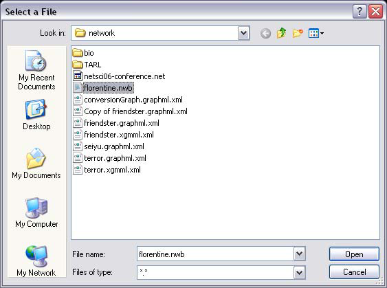

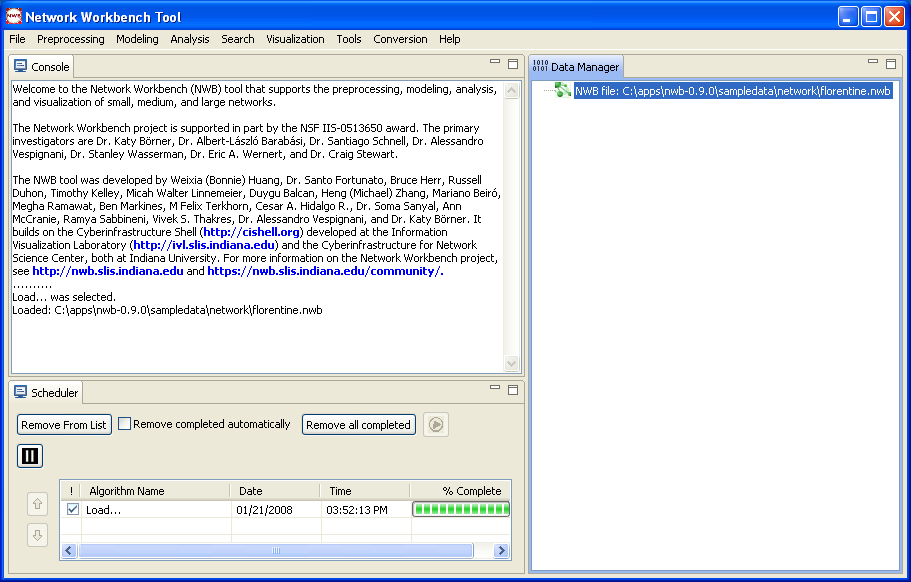

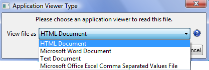

<!-- page 15 -->

The NWB Tool can save a network using *‘File > Save...’* which brings up the ‘Save’ window, see Figure 4.4. Note that some data conversions are lossy, i.e., not all data is preserved, see also sections 2.1 Sample Data and 2.2 Supported Data Formats.

**Figure 4.4:** Select output data type

*4.2 Data Conversion Service* The NWB Tool can convert between a number of different file types. For example, Figure 4.4 above shows the different file types in which t a network can be saved. The tool includes a plugin, accessible at *‘File > Tests > Converter Graph’*, which generates a directed graph of the 29 converters that convert among 22 different formats, see Figure 1. Nodes are weighted depending upon how many times they participate in a converter relationship.

**Figure 4.5:** Converter graph More information can be found at https://nwb.slis.indiana.edu/community/?n=File.ConverterGraph and https://nwb.slis.indiana.edu/community/?n=CustomFillings.DataConversionService.

### 4.3 Compute Basic Network Statistics

It is often advantageous to know for a network

  Whether it is directed or undirected

  Number of nodes

  Number of isolated nodes

  A list of node attributes

  Number of edges

  Whether the network has self loops, if so, lists all self loops

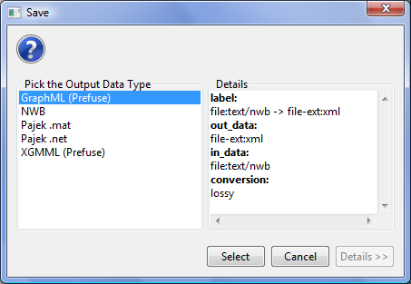

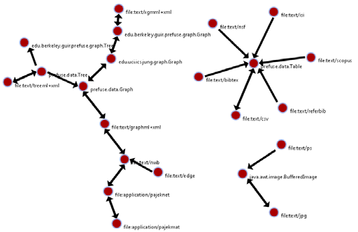

<!-- page 16 -->

  Whether the network has parallel edges, if so, lists all parallel edges

  A list of edge attributes

  Average degree

  Whether the graph is weakly connected

  Number of weakly connected components

  Number of nodes in the largest connected component

  Strong connectedness for directed networks

  Graph density

In the NWB Tool, use *‘Analysis > Network Analysis Toolkit (NAT)’* to get basic properties, e.g., for the network of Florentine families available in ‘*yournwbdirectory*/sampledata/network/ florentine.nwb’. The result for this dataset is: This graph claims to be undirected. Nodes: 16 Isolated nodes: 1 Node attributes present: label, wealth, totalities, priorates Edges: 27 No self loops were discovered. No parallel edges were discovered. Edge attributes: Nonnumeric attributes: Example value marriag... T busines... F Did not detect any numeric attributes This network does not seem to be a valued network. Average degree: 3.375 This graph is not weakly connected. There are 2 weakly connected components. (1 isolates) The largest connected component consists of 15 nodes. Did not calculate strong connectedness because this graph was not directed. Density (disregarding weights): 0.225

*4.4 Modeling* Some research questions require descriptive models to capture the major features of a (typically static) dataset, others demand process models that simulate, statistically describe, or formally reproduce the statistical and dynamic characteristics of interest (Börner, Sanyal, & Vespignani, 2007). Process models provide insights into why a certain network structure and/or dynamics exist. The NWB Tool provides different algorithms to model networks such as Random Graph, Small World, and Barabási-Albert Scale Free models discussed below, as well as diverse peer-topeer modeling algorithms (http://iv.slis.indiana.edu/lm/lm-p2p-search.html), and a Discrete Network Dynamics tool (https://nwb.slis.indiana.edu/community/?n=ModelData.DiscreteNetworkDynamics).

**4.4.1 Random Graph Model** The random graph model generates a graph that has a fixed number of nodes which are connected randomly by undirected edges; see Figure 4.6 (left). The number of edges depends on a specified probability. The edge probability is chosen based on the number of nodes in the graph. The model most commonly used for this purpose was introduced by Gilbert (1959). This is known as the *G(n,p)* model with *n* being the number of vertices and *p* the linking probability. The number of edges created according to this model is not known in advance. Erdős-Rényi introduced a similar model where all the graphs with *m* edges are equally probable and *m* varies between *0* and *n(n- 1)/2* (Erdős & Rényi, 1959). This is known as the *G(n,m)* model. The degree distribution for this network is Poissonian, see Figure 4.6 (right)

<!-- page 17 -->

**Figure 4.6:** Random graph and its Poissonian node degree distribution Very few real world networks are random. However, random networks are a theoretical construct that is well understood and their properties can be exactly solved. They are commonly used as a reference, e.g., in tests of network robustness and epidemic spreading (Batagelj & Brandes). In the NWB Tool, the random graph generator implements the *G(n,p)* model by Gilbert. Run with *‘Modeling > Random Graph’* and input the total number of nodes in the network and their wiring probability. The output is a network in which each pair of nodes is connected by an undirected edge with the probability specified in the input. A wiring probability of 0 would generate a network without any edges and a wiring probability of 1 with *n* nodes will generate a network with *(n-1)* edges. The wiring probability should be chosen dependent on the number of vertices. For a large number of vertices the wiring probability should be smaller.

**4.4.2 Watts-Strogatz Small World** A small-world network is one whose majority of nodes are not directly connected to one another, but still can reach any other node via very few edges. It can be used to generate networks of any size. The degree distribution is almost Poissonian for any value of the rewiring probability (except in the extreme case of rewiring probability zero, for which all nodes have equal degree). The clustering coefficient is high until beta is close to 1, and as beta approaches one, the distribution becomes Poissonian. This is because the graph becomes increasingly similar to an Erdős-Rényi Random Graph, see Figure 4.7. (Watts & Strogatz, 1998; Inc. Wikimedia Foundation, 2009).

**Figure 4.7:** Small world graph (left) and its node degree distribution equation (right) Small world properties are usually studied to explore networks with tunable values for the average shortest path between pairs of nodes and a high clustering coefficient. Networks with small values for the average shortest path

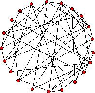

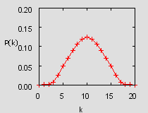

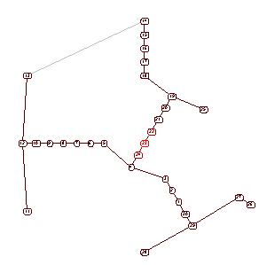

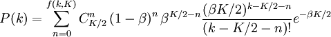

<!-- page 18 -->

and large values for the clustering coefficient can be used to simulate social networks, unlike ER random graphs, which have small average shortest path lengths, but low clustering coefficients. The algorithm requires three inputs: the number *n* of nodes of the network, the number *k* of initial neighbors of each node (the initial configuration is a ring of nodes) and the probability of rewiring the edges (which is a real number between 0 and 1). The network is built following the original prescription of Watts and Strogatz, i.e., by starting from a ring of nodes each connected to the k nodes and by rewiring each edge with the specified probability. The algorithm run time is *O(kn).* Run with *‘Modeling > Watts-Strogatz Small World’* and input 1000 nodes, 10 initial neighbors, and a rewiring probability of 0.01 then compute the average shortest path and the clustering coefficient and verify that the former is small and the latter is relatively large.

**4.4.3 Barabási-Albert Scale Free Model** The Barabási-Albert (BA) model is an algorithm which generates a scale-free network by incorporating growth and preferential attachment. Starting with an initial network of a few nodes, a new node is added at each time step. Older nodes with a higher degree have a higher probability of attracting edges from new nodes. The probability of attachment is given by

. The initial number of nodes in the network must be greater than two and each of these nodes must have at least one connection. The final structure of the network does not depend on the initial number of nodes in the network. The degree distribution of the generated network is a power law with a scaling coefficient of *-3* (Barabási & Albert, 1999; Barabási & Albert, 2002). Figure 4.8 shows the network on the left and the probability distribution on a loglog scale on the right.

**Figure 4.8:** Scale free graph (left) and its node degree distribution (right) This is the simplest known algorithm to generate a scale-free network. It can be applied to model undirected networks such as the collaboration network among scientists, the movie actor network, and other social networks where the connections between the nodes are undirected. However, it cannot be used to generate a directed network. The inputs for the algorithm are the number of time steps, the number of initial nodes, and the number initial edges for a new node. The algorithm starts with the initial number of nodes that are fully connected. At each time step, a new node is generated with the initial number of edges. The probability of attaching to an existing node is calculated by dividing the degree of an existing node by the total number of edges. If this probability is greater than zero and greater than the random number obtained from a random number generator then an edge is attached between the two nodes. This is repeated in each time step. Run with *‘Modeling > Barabási-Albert Scale Free Model’* and a time step of around *1000*, initial number of nodes *2*, and number of edges *1* in the input. Layout and determine the number and degree of highly connected nodes via *‘Analysis > Unweighted and Undirected > Degree Distribution’* using the default value. Plot node degree distribution using Gnuplot.

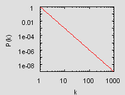

<!-- page 19 -->

*4.5 Tree Visualizations* Many network datasets come in tree format. Examples include family trees, organizational charts, classification hierarchies, and directory structures. Mathematically, a tree graph is a set of straight line segments (edges) connected at their ends containing no closed loops (cycles). A tree graphs is also called a simple, undirected, connected, acyclic graph (or, equivalently, a connected forest). A tree with *n* nodes has *n-1* graph edges. All trees are bipartite graphs. Many trees have a root node and are called rooted trees. Trees without a root node are called free trees. Subsequently, we will only consider rooted trees. In rooted trees, all nodes except the root node have exactly one parent node. Nodes which have no children are called leaf nodes. All other nodes are referred to as intermediate nodes. This section introduces different algorithms to visualize tree data using tree views, tree maps, radial tree/graph, and balloon graph layouts.

**4.5.1 Tree View Visualization** The tree view layout places the root node on the left of the canvas. First level nodes are placed on an imaginary vertical line to the right of it. Second level nodes are placed on an imaginary vertical line left of the first level nodes, etc. In the NWB Tool, select a tree dataset, e.g., generated using the ‘Directory Hierarchy Reader,’ in the ‘Data Manager’ window, then use *‘Visualization >Tree View (prefuse beta)’* and a window similar to Figure 1 will appear displaying the Tree View visualization. If you press and hold the right or middle button of the mouse while moving it back and forth, you can zoom in and out on the Tree. By clicking a folder name such as */sampledata*, all subfolders and files inside the */sampledata* folder will display. Use the search box in the bottom right corner to enter a search terms and matching files will highlight.

**Figure 4.9:** Tree View visualization with */sampledata* directory expanded and *florentine.nwb* file highlighted

**4.5.2 Tree Map Visualization** Tracing its ancestry to Venn diagrams, the Treemap algorithm was developed by Ben Shneiderman’s group at the HCI Lab at the University of Maryland (Johnson & Schneiderman, 1991). It uses a space filling technique to map a tree structure (e.g., file directory) into nested rectangles with each rectangle representing a node.

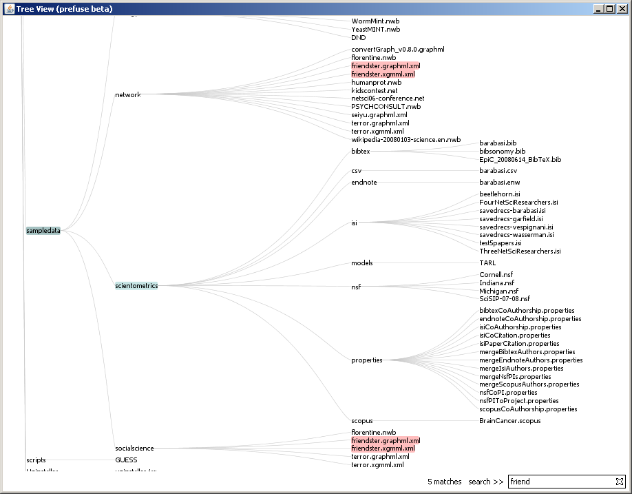

<!-- page 20 -->

A rectangular area is first allocated to hold the representation of the tree, and this area is then subdivided into a set of rectangles that represent the top level of the tree. This process continues recursively on the resulting rectangles to represent each lower level of the tree, with each level alternating between vertical and horizontal subdivisions. The parent-child relationship is indicated by enclosing the child-rectangle by its parent-rectangle. That is, all descendents of a node are displayed as rectangles inside its rectangle. Associated with each node is a numeric value (e.g. size of a directory) and the size of a node’s rectangle is proportional to its value. Shneiderman's Treemaps for space-constrained visualization of hierarchies' webpage (http://www.cs.umd.edu/hcil/treemaps/) provides the full story. In the NWB Tool, select a tree dataset, e.g., generated using the ‘Directory Hierarchy Reader,’ in the Data Manager window, then run *‘Visualization > Tree Map (prefuse beta)’.* A window similar to Figure 4.10 will appear displaying the Tree Map visualization. Use the search box in the bottom right corner to enter a search terms and matching files will highlight pink. The darker the box, the deeper the file in the hierarchy. The box dimensions are a relative measure of file size.

**Figure 4.10:** Tree Map visualization of complete */nwb* directory hierarchy

**4.5.3 Balloon Graph Visualization** A balloon graph places the focus node in the middle of the canvas and all its children in a circle around it. Children of children are again places in a circle around their parents, etc. In the NWB Tool, select a tree dataset, e.g., generated using the Directory Hierarchy Reader, and run *‘Visualization > Balloon Graph (prefuse alpha)’.* A window similar to Figure 4.11 will appear displaying the Balloon Graph visualization. Double-click on a node to focus on it and observe the change of the layout. Like in all other prefuse layouts, hold down left mouse button to pan and right button to pan.

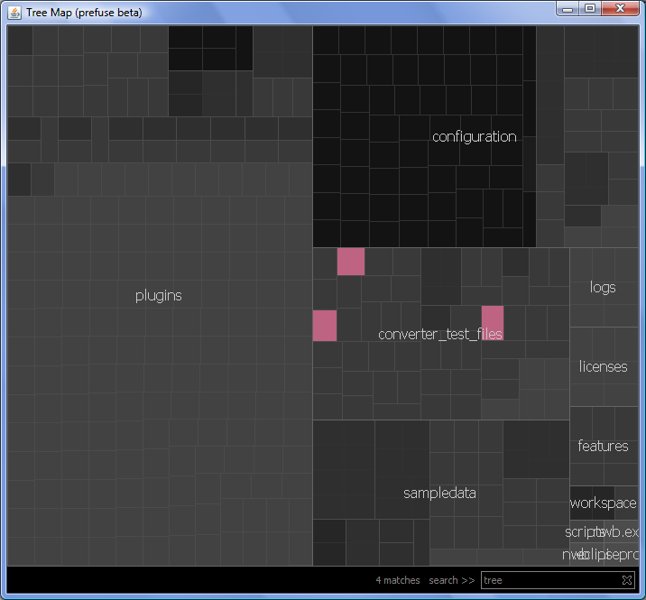

<!-- page 21 -->

**Figure 4.11:** Balloon Tree visualization of complete */nwb* directory hierarchy

**4.5.4 Radial Tree Visualization** Radial trees layout uses a focus + context (fisheye) technique for visualizing and manipulating very large trees. The focused node is placed in the center of the display and all other nodes are rendered on appropriate circular levels around that selected node. The further away a node is from the center, the smaller it is rendered. This way, potentially very large rooted or unrooted trees such controlled vocabularies, taxonomies, or classification hierarchies can be displayed. Users can focus on particular parts of those trees without losing context. In the NWB Tool, select a tree dataset, e.g., generated using the Directory Hierarchy Reader, first three levels, directories only. Run *‘Visualization > Radial Tree/Graph (prefuse alpha)’.* A window similar to Figure 4.12 will appear displaying the Radial Tree/Graph visualization. Double-click on a node to focus on it and observe the change of the layout. Hovering over a node, e.g., the /nwb root directory, colors it red and all its neighbors blue. Like in all other prefuse layouts, hold down left mouse button to pan and right button to pan.

**Figure 4.12:** Radial Tree/Graph visualization of first three levels of */nwb* directories

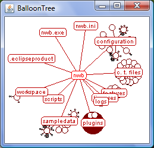

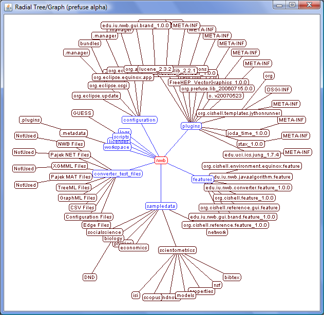

<!-- page 22 -->

#### 4.5.5 Radial Tree/Graph with Annotation

Highlight the same tree dataset and select *‘Visualization> Radial Tree/Graph (prefuse beta)’* to set data mapping parameters such as node size, node color, node shape, ring color, edge size, and edge color. A legend will be generated automatically.

*4.6 Graph Visualizations* Most visualization plugins provided in the NWB Tool are designed to layout graphs. Examples are the

  JUNG based Circular layout, Kamada-Kawai, Fruchterman-Rheingold, and interactive Spring layout;

  prefuse based Specified, Radial Tree/Graph (with or without annotation), Force Directed with Annotation, and Fruchterman Rheingold with Annotation, and Small World layouts.

  GUESS tool supporting more customized visualizations and diverse output formats.

  DrL for visualizing very large networks – up to 1 million nodes.

  LaNet

**4.6.1 JUNG-based Circular, Kamada-Kawai, Fruchterman-Rheingold, and Spring Layouts** Visualizations of the ‘*yournwbdirectory*/sampledata/networks/ florentine.nwb’ network using Circular, Kamada- Kawai, Fruchterman-Rheingold, and Spring Layouts are given in Figure 4.13.

**Figure 4.13:** Circular, Kamada-Kawai, Fruchterman-Rheingold, and Spring (JUNG) layouts

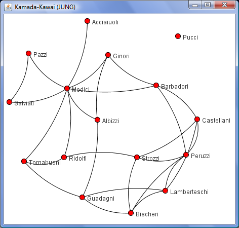

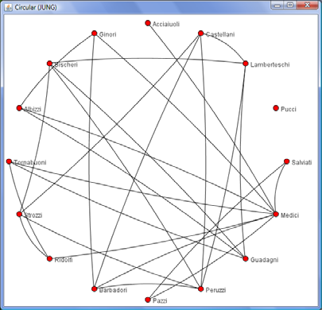

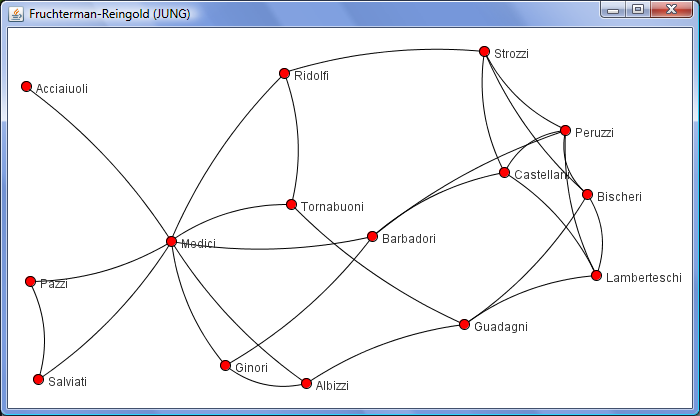

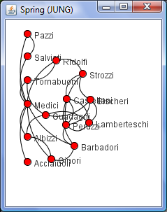

<!-- page 23 -->

**4.6.2 Prefuse-based Specified, Radial Tree/Graph, Force Directed, and Fruchterman-Rheingold, and Small World Layouts** Specified layout requires pre-computed x, y values for each node. Node positions can be computed, e.g., using *‘Visualization >DrL’* Visualizations of the ‘*yournwbdirectory*/sampledata/networks/ florentine.nwb’ network using Radial Tree/Graph, Force Directed with Annotation, and Fruchterman-Rheingold with Annotation, are given in Figure 4.14. Note that algorithms that do not read nwb format, e.g., Balloon Graph are grayed out and not selectable.

**Figure 4.14:** Radial Tree/Graph and Fruchterman-Rheingold with Annotation (prefuse) layouts The Fruchterman-Rheingold and the Force Directed with Annotation layout were run using the parameter values shown in Figure 4.15, left. The menu to the right of the Force Directed layout lets one increase the DefaultSpringLength to spread out nodes.

**Figure 4.15:** Force Directed with Annotation (prefuse) layout

**4.6.3 GUESS Visualizations** Load the sample dataset ‘*yournwbdirectory*/sampledata/networks/ florentine.nwb’ and calculate an additional node attribute ‘Betweenness Centrality’ by running *‘Analysis > Unweighted and Undirected > Node Betweenness*

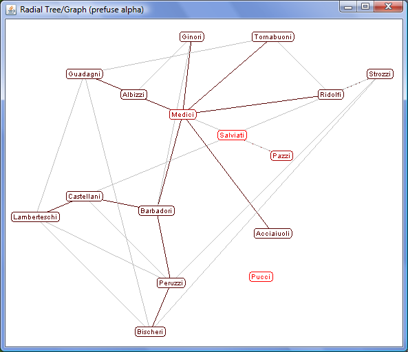

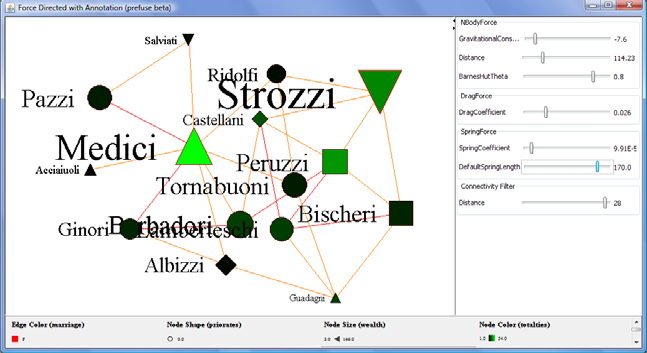

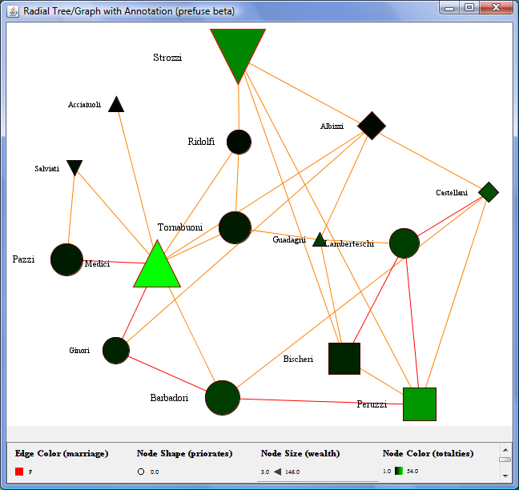

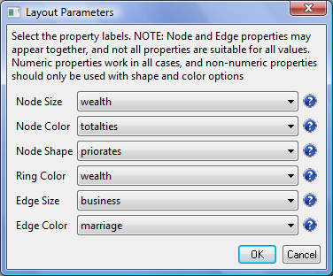

<!-- page 24 -->

*Centrality’* with default parameters. Then select the network and run *‘Visualization > GUESS’* to open GUESS with the file loaded. It might take some time for the network to load. The initial layout will be random. Wait until the random layout is completed and the network is centered before proceeding. GUESS has three windows called 1. Information window to examine node and edge attributes, see Figure 4.16, left 2. Visualization window to view and manipulate network, see Figure 4.16, right. 3. Interpreter/Graph Modifier Window to analyze/change network properties, below the Visualization window.

**Figure 4.16:** GUESS ‘Information Window’, visualization window, and ’Graph Modifier’ window

***4.6.3.1. Network Layout and Interaction*** GUESS provides different layout algorithms under menu item ‘Layout’. Apply *‘Layout > GEM’* to the Florentine network. Use *‘Layout > Bin Pack’* to compact and center the network layout. Using the mouse pointer, hover over a node or edge to see its properties in the Information window. Right click on a node *to ‘center on’, ‘color’, ‘remove’, ‘Modify Field …’* a node, see Figure 4.16. Interact with the visualization as follows:

  Pan – simply ‘grab’ the background by clicking and holding down the left mouse button, and move it using the mouse.

  Zoom – Using the scroll wheel on the mouse OR press the “+” and “-” buttons in the upper-left hand corner OR right-click and move the mouse left or right. Center graph by selecting ‘*View > Center’*.

  Click

to select/move single nodes. Hold down ‘Shift’ to select multiple.

  Right click node to modify Color, etc. Use the Graph Modifier to change node attributes, e.g.,

  Select “all nodes” in the Object drop-down menu and click ‘Show Label’ button.

  Select *‘Resize Linear - Nodes - totalities’* drop-down menu, then type “5” and “20” into the “From” and “To” Value box separately. Then select ‘Do Resize Linear’.

  Select *‘Colorize - Nodes - totalities’*, then select white and enter

(204,0,51) in the pop-up color box boxes on in the “From” and “To” buttons.  Select “Format Node Labels”, replace default text {originallabel} with your own label in the pop-up box ‘Enter a formatting string for node labels’. This will create the labels shown in Figure 4.17.

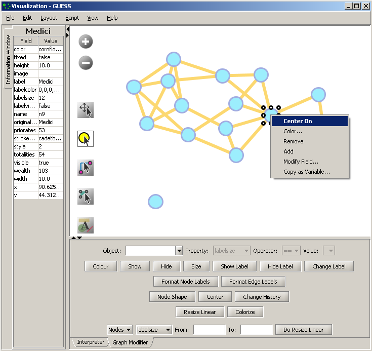

<!-- page 25 -->

**Figure 4.17:** Using the GUESS ‘Graph Modifier’

***4.6.3.2. Interpreter*** Use Jython, a version of Python that runs on the Java Virtual Machine, to write code that can be interpreted. Here we list some GUESS commands which can be used to modify the layout. Color all nodes *uniformly* g.nodes.color =red # circle filling g.nodes.strokecolor =red # circle ring g.nodes.labelcolor =red # circle label colorize(numberofworks,gray,black) for n in g.nodes: n.strokecolor = n.color Size code nodes g.nodes.size = 30 resizeLinear(numberofworks,.25,8) Label for i in range(0, 50): # make labels of most productive authors visible nodesbynumworks[i].labelvisible = true Print for i in range(0, 10): print str(nodesbydegree[i].label) + ": " + str(nodesbydegree[i].indegree) Edges g.edges.width=10 g.edges.color=gray Color and resize nodes based on their betweenness: colorize(wealth, white, red) resizeLinear(sitebetweenness, 5, 20) The result is shown in Figure 6. Read https://nwb.slis.indiana.edu/community/?n=VisualizeData.GUESS on more information on how to use the interpreter.

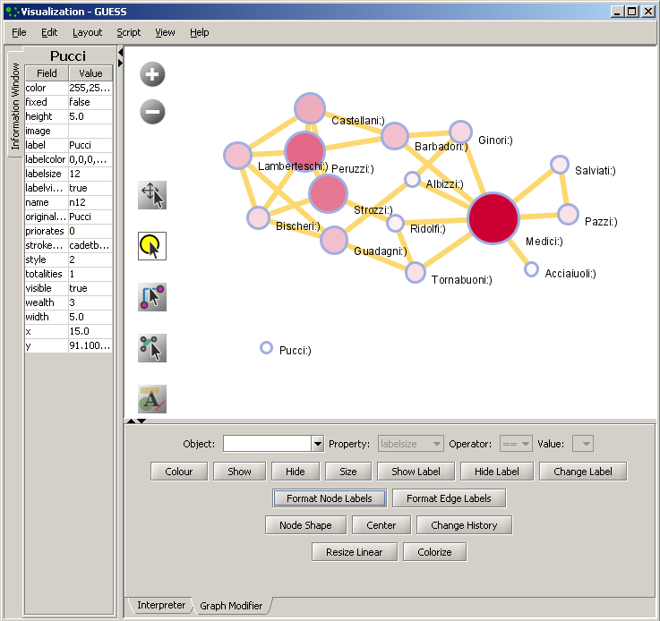

<!-- page 26 -->

**Figure 4.18:** Using the GUESS ‘Interpreter’

**4.6.4 DrL Large Network Layout** DrL is a force-directed graph layout toolbox for real-world large-scale graphs up to 2 million nodes (Davidson, Wylie, & Boyack, 2001; Martin, Brown, & Boyack, in preparation).of up to 2 million nodes. It includes:

  Standard force-directed layout of graphs using algorithm based on the popular VxOrd routine (used in the VxInsight program).

  Parallel version of force-directed layout algorithm.

  Recursive multilevel version for obtaining better layouts of very large graphs.

  Ability to add new vertices to a previously drawn graph. This is one of the few force-directed layout algorithms that can scale to over 1 million nodes, making it ideal for large graphs. However, small graphs (hundreds or less) do not always end up looking good. The algorithm expects similarity networks as input. Distance and other networks will have to be converted before they can be laid out. The version of DrL included in NWB only does the standard force-directed layout (no recursive or parallel computation). DrL expects the edges to be weighted, directed edges where the weight (greater than zero) denotes how similar the two nodes are (higher is more similar). The NWB version has several parameters. The edge cutting parameter expresses how much automatic edge cutting should be done. 0 means as little as possible, 1 as much as possible. Around .8 is a good value to use. The weight attribute parameter lets you choose which edge attribute in the network corresponds to the similarity weight. The X and Y parameters let you choose the attribute names to be used in the returned network which corresponds to the X and Y coordinates computed by the layout algorithm for the nodes. DrL can be very useful for large-scale similarity computations such as co-citation and co-word analyses. In NWB, the results can be viewed in either GUESS or *‘Visualization > Specified (prefuse alpha)’*. For more information see https://nwb.slis.indiana.edu/community/?n=VisualizeData.DrL.

**4.6.5 LaNet** See https://nwb.slis.indiana.edu/community/?n=VisualizeData.K-CoreDecomposition

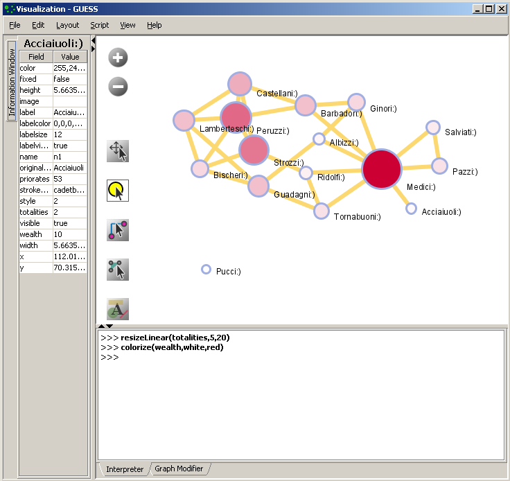

<!-- page 27 -->

**4.6.6 Circular Hierarchy** Please see the Sci2 Tool at http://sci.slis.indiana.edu for the “Circular Hierarchy” algorithm that is compatible with the NWB Tool.

*4.7 Saving Visualizations for Publication* Use *‘File> Export Image’* to export the current view or the complete network in diverse file formats such as jpg, png, raw, pdf, gif, etc.

## 5. Domain Specific: Information Science

*5.1 Read and Display a File Hierarchy* It is interesting to see the structure of file directory hierarchies that can be thought of as a tree with a specific folder at its root and its subfolders and the files within them as its branches.

In the NWB Tool, use *‘File > Read Directory Hierarchy’* to parse a file directory hierarchy recursively using parameters:

Root directory Directory from where to start crawling subfolders and files Levels to recurse Number of levels of depth to recurse hierarchy Recurse the entire tree Check to recurse entire hierarchy Reade directories only Check to disregard files

Change the default input by checking “Recurse the entire tree,” and uncheck “Read directories only (skips files)”:

After clicking the ‘OK’ button a ‘*Directory Tree – Prefuse (Beta) Graph’* shows up in the Data Manager window. Select this dataset and visualize using any of the available tree visualization algorithms, see section 4.5 Tree Visualizations for instructions.

*5.2 Error and Attack Tolerance of Networks* Please see http://iv.slis.indiana.edu/lm/lm-errorattack.html

*5.3 Studying Peer-to-Peer Networks* Please see http://iv.slis.indiana.edu/lm/lm-p2p-search.html

**6. Domain Specific: Social Science** Tutorial originally prepared for Sunbelt 2008 by Ann McCranie, Department of Sociology, Indiana University, Bloomington, amccrani@indiana.edu **.** For this example, we will use PSYCHCONSULT, an extract from the Staff Study of the Indianapolis Network Mental Health Study. This is a file in the Network Workbench (*.nwb) format, a basic edge-list format that can include node and edge attribute information in a text file. It is a directed (asymmetric) unvalued (unweighted) network that represents the consultation choices among the staff that work in a psychiatric hospital.

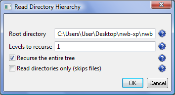

<!-- page 28 -->

*6.1 Load Data* Load the /sampledata/socialscience/PSYCHCONSULT.nwb dataset after launching the NWB Tool with ‘*File > Load’.* Choose the PSYCHCONSULT data located in the ‘s*ampledata/socialscience’* folder. This folder will be located in your NWB Installation Directory. Once you have loaded this network, you will see it appear in the right-hand ‘Data Manager’ window. You may right-click on this network and choose ‘View’ to look at the contents. You may also open this file separately in a text editor to explore it or make changes. Please note that as you work, new files will be created in the Data Manager window. You may choose to save these files in various formats, and you will need to make sure that you have highlighted the network file that you wish to work in.

*6.2 Basic Network Properties* As a matter of practice, you may want to learn a little about your network and confirm that it was read correctly into NWB. The Graph and Network Analysis Toolkit provides a quick overview of your network: ‘*Analysis > Network Analysis Toolkit’.* If you run this on the PSYCHCONSULT network, you will find that you have a directed network with 113 nodes and no isolated nodes. There are two node attributes present: the node label (which is, in this case, the job title of all of the employees) and the area (in this network, the unit in which the employee generally worked). You can also see that you have 861 edges, no self-loops or parallel edges, and no edge attributes. A common edge attribute is weight (value), but this network is unweighted. The network is weakly connected - each node is connected to another node in the main component with no isolates. It is not strongly connected, however, as some nodes are unreachable (they send, but do not receive ties). You will also see the network’s density reported. Network Analysis Toolkit (NAT) was selected. Implementer(s): Timothy Kelley Integrator(s): Timothy Kelley Reference: Robert Sedgewick. Algorithms in Java, Third Edition, Part 5 - Graph Algorithms. Addison-Wesley, 2002. ISBN 0-201-31663-3. Section 19.8, pp.205 Documentation: **https://nwb.slis.indiana.edu/community/?n=AnalyzeData.NetworkAnalysisToolkit** This graph claims to be directed. Nodes: 113 Isolated nodes: 0 Node attributes present: label, area Edges: 861 No self loops were discovered. No parallel edges were discovered. Edge attributes: Did not detect any nonnumeric attributes Numeric attributes: min max mean weight 1 1 1 This network seems to be valued. Average total degree: 15.238938053097344 Average in degree: 7.619469026548669 Average out degree: 7.619469026548671 This graph is weakly connected. There are 1 weakly connected components. (0 isolates) The largest connected component consists of 113 nodes. This graph is not strongly connected. There are 13 strongly connected components. The largest strongly connected component consists of 101 nodes.

<!-- page 29 -->

Density (disregarding weights): 0.06803 Additional Densities by Numeric Attribute densities (weighted against standard max) weight: 0.06803 densities (weighted against observed max) weight: 0.06803 If you should find isolates or self-loops in your data, they could pose problems for several algorithms that are currently implemented. NWB offers options for dealing with these issues: ‘*Preprocessing > Remove Self-Loops’* and ‘*Preprocessing > Delete Isolates’*. These options will create a new network file in the Data Manager window. You can then select this network and save it with a new name.

*6.3 Network Analysis* NWB implements a few basic algorithms that you can use with an unweighted and directed network like PSYCHCONSULT. Make sure your network is highlighted in the Data Manager window. In-degree and out-degree centrality can be calculated with ‘*Analysis > Unweighted and Directed* > *Node Indegree’.* Note that this will actually create two files: a text file with a sequence of the in-degree centrality of the nodes and a new network file that has appended the in-degree as an integer attribute. Choose this network file, apply the NODE OUTDEGREE centrality algorithm and you can create a new network with both measures as attributes. Reciprocity can be calculated with ‘*Analysis > Unweighted and Directed > Dyad Reciprocity’*. This will give you a network-level reciprocity measure. In this network, 17.5 percent of dyads are reciprocal.

*6.4 Visualization* There are several visualization options under development in the NWB Tool. To replicate the one shown at this poster presentation, you will need to use the GUESS package, which is an implementation of the open-source program developed by Eytan Adar. To learn more about this package, visit http://graphexploration.cond.org/index.html and be sure to look at the manual and wiki. With the original PSYCHCONSULT file you loaded into NWB highlighted (it should be the top of the Data Manager) choose ‘*Visualization > Guess’*. For this relatively small network, the loading time will be a few seconds. You will see a second window appear with a network. In this new window, choose ‘*Layout > Kamada-Kawai’*. You may choose to repeat this layout multiple times. The basic shape and layout of the network will remain the same, but you will notice the orientation changing. You can also drag and enlarge the window that the network is in. To see specific information about nodes or edges, choose ‘*View > Information Window’*. As you pass your mouse over the edges and nodes in the network, you will see specific information about these nodes. In order to zoom into the network, right-click on the background and drag to the right. Drag left in order to zoom out. Dragging with the left mouse button will move the entire network. If you “lose” the network, choose ‘*View > Center’*. Currently there are only a few menu-based interfaces for the rich options of GUESS. For instance, you can change the background color via *‘Edit > Background Color’*. To take advantage of some of the other options of GUESS, you can actually type commands into the console (located in the bottom of the screen) or you can create a script file - a simple text file with the extension .py. Either type the following commands into the console or create a .py file in a text editor. To run the script file, chose ‘*File > Run Script’* and choose your newly created script file.

g.nodes.labelvisible=true

<!-- page 30 -->

for node in g.nodes: node.x=node.x*10 node.y=node.y*10 colorize(label) (label==”psychiatrist”).color=red (label==”med dir, inpt. unit”).color=red (label==”nurse”).color=blue clusts = groupBy(area) for c in clusts: createConvexHull(c,randomColor(50)) After you have entered these commands or run this script file, your network might disappear off-screen. Choose *‘View > Center’* to refocus on the network. These commands make the labels visible, change the sizes of the nodes and edges, colors the labels (the same color being assigned to nodes that have the same label of job type, thus psychiatrists and the medical director red, while nurses are colored blue). The script also creates “hulls,” or demarcations of areas of the network based on the attribute of area. You can experiment with the random colors assigned to the hulls by rerunning this script or line. To save your visualization, choose ‘*File > Export Image’*.

## 7. Domain Specific: Scientometrics

### 7.1 Introduction

**7.1.1 Available Datasets and Algorithms** Scientometrics specific sample datasets can be found in /nwb/sampledata/scientometrics/bibtex – personal bibliography files /endnote – personal bibliography files /isi – datasets downloaded from ISI/Thomson Scientific /models – parameter and data files needed for TARL model /nsf – datasets downloaded from the National Science Foundation /properties – parameter files needed for network extraction /scopus – datasets downloaded from Scopus Relevant algorithm plugins are stored in the general /nwb/plugins directory, see section 3. Code Library. Each algorithm has the package name that best fits its function, e.g., preprocessing, analysis, visualization, etc. An example is ‘edu.iu.nwb.preprocessing.cocitationsimilarity_1.0.0’. In the NWB Tool, the scientometrics specific algorithms have been grouped under a special ‘Scientometrics’ menu item to ease usage, see Figure 7.1.

<!-- page 31 -->

**Figure 7.1:** Scientometrics menu in the Network Workbench Tool

**7.1.2 General Workflow** The general workflows of scientometric studies and specifically the mapping of science were detailed in (Börner, Chen, & Boyack, 2003). The general workflow of a scientometric study is given in Table 7.1. Major steps are (1) data extraction, (2) defining the unit of analysis, (3) selection of measures, (4) calculation of similarity between units, (5) ordination, or the assignment of coordinates to each unit, and (6) use of the resulting visualization for analysis and interpretation.

**Table 7.1**: General steps involved in a scientometric study **Layout (often one code does both similarity and ordination steps) (1) Data Extraction (2) Unit of Analysis (3) Measures (4) Similarity (5) Ordination**

**(6) Display**

**Searches** *ISI Scopus Google Scholar Medline Patents Grants* **Broadening** *By citation By terms*

**Common Choices** *Paper Journal Institutional - Author - Lab/Center - Dep./School - Institution Geolocation - County - State - Country - Continent Topical - Term*

**Counts/ Frequencies** *Attributes (e.g. terms) Author citations Co-citations By year* **Thresholds** *By counts*

**Scalar (unit by unit matrix)** *Direct linkage - Paper-citation - Author-paper Co-occurrence - Co-author - Bibliographic coupling - Co-word/co-term - Co-classification Co-citation - Author co-citation (ACA) - Document co-citation (DCA) Combined linkage* **Vector (unit by attribute matrix)** *Vector space model (words/terms)*

**Dimensionality Reduction** *Eigenvector/Eigenvalue solutions Factor Analysis (FA) and Principal Components Analysis (PCA) Multi-dimensional scaling (MDS) Pathfinder Networks (PFNet) Self-organizing maps (SOM) Topics Model* **Cluster Analysis Scalar** *Triangulation Force-directed placement (FDP)*

**Interaction** *Browse Pan Zoom Filter Query Detail on demand* **Analysis & Interpretation**

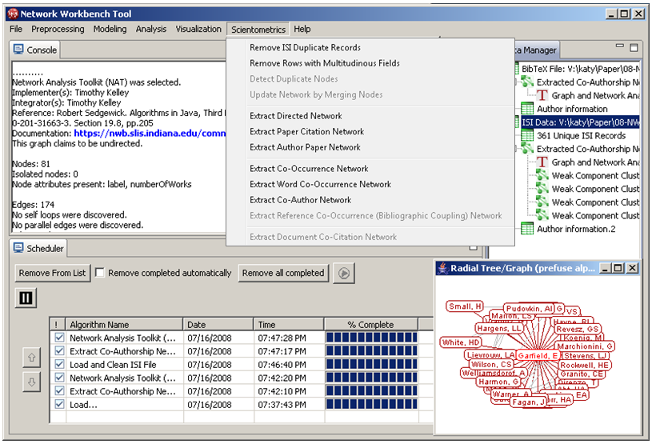

<!-- page 32 -->

*- Keyword or ontologies, classifications, taxonomies ,etc.*

*Latent Semantic Analysis (words/terms) including Singular Value Decomp. (SVD)* **Correlation (if desired)** *Pearson’s R on any of above*

***7.1.2.1 Data Extraction*** Data are either compiled by hand or downloaded in bulk from major databases. For details see section 2 Sample Datasets and Supported Data Formats.

#### 7.1.2.2 Units of Analysis

Major units of science studied in scientometrics are authors, papers, and journals as well as other institutional, geospatial, and topical units. Note that a laboratory and/or center can be interdisciplinary. A department/school is typically discipline specific.

Authors have an address with information on affiliation and geo-location. Most author consumed/produced records have a publication date, a publication type (e.g., journal paper, book, patents, grant, etc.), topics (e.g., keywords or classifications assigned by authors and/or publishers). Because authors and records are associated, the geolocation(s) and affiliation(s) of an author can be linked to the authors’ papers. Similarly, the publication date, publication type and topic(s) can be associated with a paper’s author(s).

***7.1.2.3 Selection of Measures*** Statistics such as the number of papers, grants, co-authorships, citation (over time) per author; bursts of activity (number of citations/patents/collaborators/funding, etc.); or changes of topics and geo-locations for authors and their institutions over time can be computed. Derived networks are examined to count the number of papers or co-authors per author, the number of citations per paper or journal, etc. but also to determine the strength or success of coauthor/inventor/investigator relations, etc. The geospatial and topic distribution of funding input & research output; the structure and evolution of research topics; evolving research areas (e.g., based on young yet highly cited papers); or the diffusion of information, people, or money over geospatial and topic space can be studied.

***7.1.2.4 Ordination*** Ordination techniques such as triangulation or force directed placement take a set of documents, their similarities/distances, and parameters and generate a typically 2-dimensional layout that places similar documents closer together and dissimilar ones further apart. Note that the table covers measures and algorithms commonly used in bibliometrics/scientometrics research yet few of the new temporal, geospatial, topical, and network based approaches in existence today.

***7.1.2.5 Display*** Analysis results can be communicated via text, tables, charts, maps that are printed on paper or explored online, to name just a few options. Steps 3-5 will be discussed separately for

  Temporal analyses in section 7.3,

  Geospatial analyses in section 7.4,

  Topical analyses in section 7.5, and

  Network analyses in section 7.6.

*7.2 Bibliographic Data Acquisition and Preparation* The NWB Tool reads publication data from Thomson Scientific/ISI or Scopus. Google Scholar data can be acquired using 3rd party tools such as *Publish or Perish* (Harzing, 2008) that retrieves papers from Google scholar for a specific data and supports the export into BibTex (bib), CSV (txt), or EndNote (enw) that can be read by NWB Tool. Personal references collected via reference management software such as EndNote (Thomson-Reuters, 2008a), Reference Manager (The-Thomson-Corporation, 2008), or the Bibtex format (Feder, 2006) can also be read, as can funding data downloaded from the National Science Foundation and other scholarly data available in plain commaseparated value files. Examples are given here.

<!-- page 33 -->

**7.2.1 Publication Data: ISI, Scopus, and Google Scholar** Today, most science studies use either Thomson Scientific’s databases or Scopus as they each constitute a multidisciplinary, objective, internally consistent database. Google Scholar constitutes a thirds choice. Please see comparison of three sources and discussion of coverage in section 7.2.1 Publication Data: ISI, Scopus, and Google Scholar.

#### 7.2.1.1 ISI Data

For the purposes of this tutorial we exemplarily downloaded publication records from four major network science researchers, three of whom are principal investigators of the Network Workbench project. Their names, ages (retrieved from Library of Congress), number of citations for highest cited paper, *h*-index (Bornmann, 2006), and number of papers and citations over time as calculated by the Web of Science by Thomson Scientific (Thomson- Reuters, 2008b) are given in Table 7.2. ISI formatted files of all papers including references were downloaded for all four researchers in December 2007. The superset of the four data files is called ‘FourNetSciResearchers’ in the remainder of this tutorial.

**Table 7.2:** Names, ages, number of citations for highest cited paper, h-index, and number of papers and citations over time as rendered in the Web of Science for four major network science researchers

**Name Age Total #** **Cites**

**H- Index**

**Total # Papers**

**# Papers and Citations per Year for the last 20 Years**

Eugene Garfield

82 1525 31 672

Stanley Wasserman 122 17 35

Alessandro Vespignani

42 451 33 101

Albert- László Barabási Repeated query on Sept 21st, 2008

40 41

2218 16,920

47 52

126 159

The table reveals that a high age, i.e., more time for publishing, typically results in more papers. The enormous differences in citation dynamics between physics and social sciences such as scientometrics or sociology are visible. Vespignani and Barabási are both physicists and their papers very rapidly acquire citation counts. Note that neither books nor Conference papers are captured in this dataset.

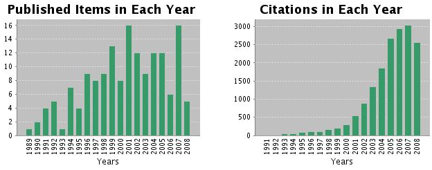

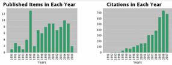

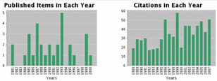

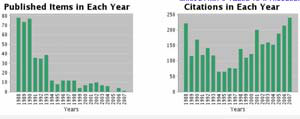

<!-- page 34 -->

***7.2.1.2 Scopus Data*** The NWB Tool reads publication data from Scopus, see https://nwb.slis.indiana.edu/community/?n=LoadData.Scopus.

***7.2.1.3 Google Scholar*** Google Scholar data can be acquired using *Publish or Perish* (Harzing, 2008) that can be freely downloaded from http://www.harzing.com/pop.htm. A query for papers by Albert-László Barabási run on Sept. 21, 2008 results in 111 papers that have been cited 14,343 times, see Figure 7.2.

**Figure 7.2:** *Publish or Perish* interface with query result for Albert-László Barabási To save records, select from menu ‘*File > Save as Bibtex*’ or ‘*File > Save as CSV*’ or ‘*File > Save as EndNote’*. All three file formats can be read by NWB Tool. The result in all three formats named ‘barabasi.*’ is also available in the respective subdirectories in ‘*yournwbdirectory*/sampledata/scientometrics’ and will be used subsequently.

***7.2.1.4 Comparison of ISI, Scopus, and Google Scholar*** A number of recent studies have examined and compared the coverage of Thomson Scientific’s Web of Science (WoS), Scopus, Ulrich’s Directory, and Google Scholar (GS). It has been shown that the databases have a rather small overlap in records. The overlap between WoS and Scopus was only 58.2%. The overlap between GS and the union of WoS and Scopus was a mere 30.8%. While Scopus covers almost twice as many journals and conferences than WoS it covers fewer journals in the arts and humanities. A comprehensive analysis requires access to more than one database, see also (Bosman, van Mourik, Rasch, Sieverts, & Verhoeff, 2006; de Moya-Anegón et al., 2007; Fingerman, 2006; Meho & Yang, 2007; Nisonger, 2004; Pauly & Stergiou, 2005). In the NWB Tool, load ‘*yournwbdirectory*/sampledata/scientometrics/isi/*‘barabasi.isi’ ‘*yournwbdirectory*/sampledata/scientometrics/scopus/*‘barabasi.scopus’ ‘*yournwbdirectory*/sampledata/scientometrics/bibtex/ ‘barabasi.bib’ // downloaded from Google Scholar

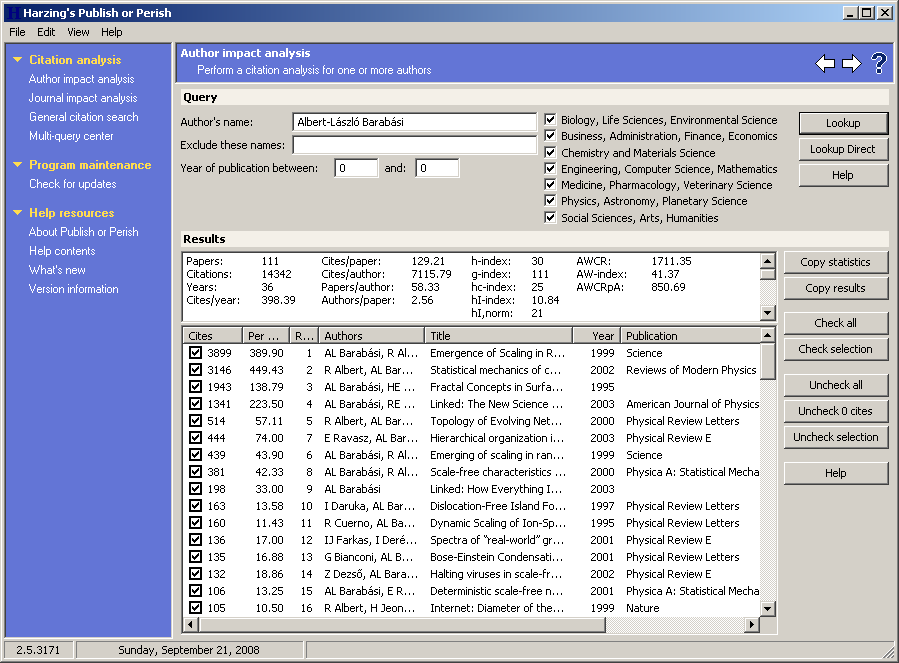

<!-- page 35 -->

is also available in the respective subdirectories in ‘*yournwbdirectory*/sampledata/scientometrics’ It is interesting to compare the result set retrieved from ISI, Scopus, and Scholar Google.

**7.2.2 Personal Bibliographies: EndNote and Bibtex** Personal references collected via reference management software such as EndNote (Thomson-Reuters, 2008a), Reference Manager (The-Thomson-Corporation, 2008) or the Bibtex format (Feder, 2006) can also be read. Sample datasets are included in *scientometrics/sampledata/bibtex* or */endnote.* Simply load the file and a csv file with all unique files will appear in the Data Manager.

**7.2.3 Funding: NSF Data** Funding data provided by the National Science Foundation (NSF) can be retrieved via the *Award Search* site (http://www.nsf.gov/awardsearch). Search by PI name, institution, and many other fields, see Figure 7.3.

**Figure 7.3:** NSF ‘Award Search’ site To retrieve all projects funded under the new Science of Science and Innovation Policy (SciSIP) program, simply select the ‘Program Information’ tab, do an ‘Element Code Lookup’, enter ‘7626’ into ‘Element Code’ field, and hit ‘Search’ button. On Sept 21st, 2008, exactly 50 awards were found. Award records can be downloaded in CSV, Excel or XML format. Save file in CSV format, and a sample csv file is available in **yournwbdirectory*/sampledata/scientometrics/nsf/scipolicy.csv’.* In the NWB Tool, load the file using *'File > Load File'.* A table with all records will appear in the Data Manager. Right click and view file in ‘Microsoft Office Excel’. To show how to analyze and visualize funding data, we use the active NSF awards data from Indiana University (257 records), Cornell University (501 records) and University of Michigan Ann Arbor (619 records) which were downloaded on 11/07/2008. Save files as csv but rename into .nsf. Or simply use the files provided in ‘*yournwbdirectory*/sampledata/scientometrics/nsf/’*.* **7.2.3.1Extracting Co-PI Networks** Load NSF data, selecting the loaded dataset in the Data Manager window, run *‘Scientometrics > Extract Co- Occurrence Network’* using parameters:

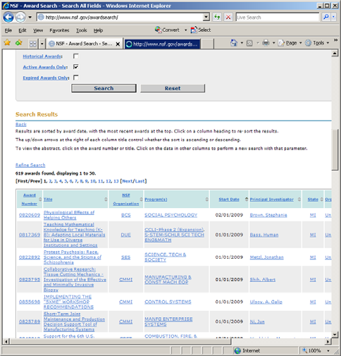

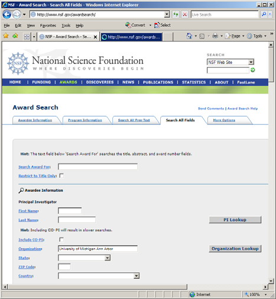

<!-- page 36 -->

Two derived files will appear in the Data Manager window: the co-PI network and a merge table. In the network, nodes represent investigators and edges denote their co-PI relationships. The merge table can be used to further clean PI names. Choose the “Extracted Network on Column All Investigators” and run the *‘Analysis > Network Analysis Toolkit (NAT)’* reveals that the number of nodes and edges but also of isolate nodes that can be removed running *‘Preprocessing > Delete Isolates’*. Select *‘Visualization > GUESS’* to visualize. Run ‘co-PI-nw.py’ script. Visualizations of co-PI network of two universities are given in Figure 7.4.

**Figure 7.4:** Co-PI network of Indiana University (left) and Cornell University (right) To extract and visualize the largest components, e.g., of Cornell’s PI network shown in Figure 7.5: Select network after removing isolates and run *‘Analysis > Unweighted and Undirected > Weak Component Clustering’* with parameter

Indiana’s largest component has 19 nodes, Cornell’s has 67 nodes, Michigan’s has 55 nodes. Visualize Cornell’s network in GUESS using same .py script and save via *‘File > Export Image’* as jpg.

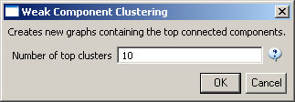

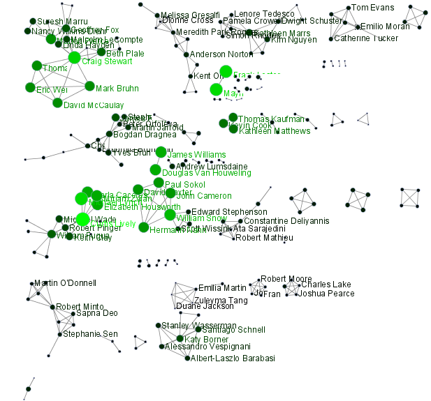

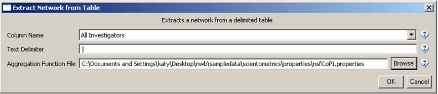

<!-- page 37 -->

**Figure 7.5:** Largest component of Cornell University co-PI network. Node size and color encode the total award amount. The top-50 nodes with the highest total award amount are labeled.

**7.2.4 Scholarly Database** Medline, U.S. patent, as well as funding data provided by the National Science Foundation and the National Institutes of Health can be downloaded from the Scholarly Database (SDB) at Indiana University. SDB supports keyword based cross-search of the different data types and data can be downloaded in bulk, see Figures 7.6 and 7.7 for interface snapshots. Register to get a free account or use ‘*Email: nwb@indiana.edu*’ and ‘*Password: nwb’* to try out functionality. Search the four databases separately or in combination for ‘Creators’ (authors, inventors, investigators) or terms occurring in ‘Title’, ‘Abstract’, or ‘All Text’ for all or specific years. If multiple terms are entered in a field, they are automatically combined using ‘OR’. So, ‘breast cancer’ matches any record with ‘breast’ or ‘cancer’ in that field. You can put AND between terms to combine with ‘AND’. Thus ‘breast AND cancer’ would only match records that contain both terms. Double quotation can be used to match compound terms, e.g., ‘”breast cancer”’ retrieves records with the phrase “breast cancer”, and not records where ‘breast’ and ‘cancer’ are both present, but not the exact

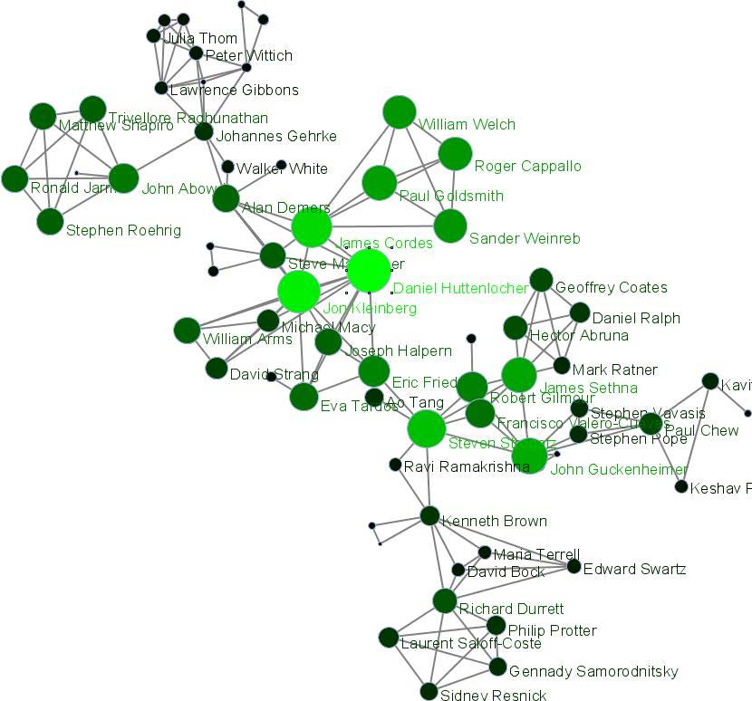

<!-- page 38 -->

phrase. The importance of a particular term in a query can be increased by putting a ^ and a number after the term. For instance, ‘breast cancer^10’ would increase the importance of matching the term ‘cancer’ by ten compared to matching the term ‘breast’.

**Figure 7.6:** Scholarly Database ‘Home’ page and ‘Search’ page Results are displayed in sets of 20 records, ordered by a Solr internal matching score. The first column represents the record source, the second the creators, third comes the year, then title and finally the matching score. Datasets can be downloaded as dump for future analysis.

**Figure 7.7:** Scholarly Database search results and download interfaces

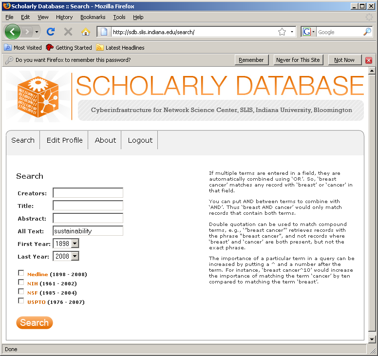

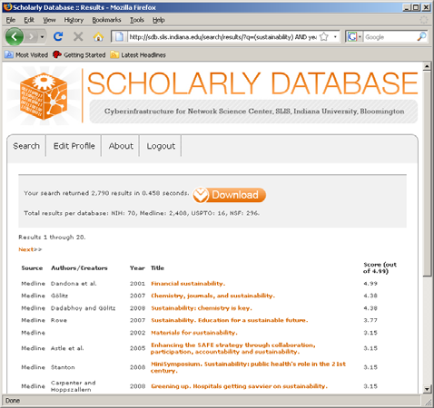

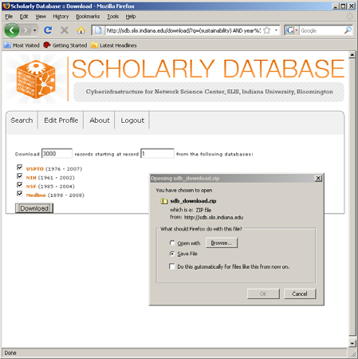

<!-- page 39 -->

To run burst detection (see section 7.3.2 Burst Detection) over Medline abstracts, simply download matching Medline records. Load *medline_medline_master.csv* into NWB, run *‘Preprocessing > Normalize Text’* with a space as ‘New Separator’ and select ‘abstract’. Then Run ‘*Analysis > Textual > Burst Detection’* with parameters:

and space as a text separator. The result is a table that shows bursting words together with their length, weight, strength, start and end of burst.

*7.3 Temporal Analysis* Science evolves over time. Attribute values of scholarly entities and their diverse aggregations increase and decrease at different rates and respond with different latency rates to internal and external events. Temporal analysis aims to identify the nature of phenomena represented by a sequence of observations such as patterns, trends, seasonality, outliers, and bursts of activity. Data comes as a time series, i.e., a sequence of events/observations which are ordered in one dimension: time. Time series data can be continuous, i.e., there is an observation at every instant of time (see figure below), or discrete, i.e., observations exist for regularly or irregularly spaced intervals. Temporal aggregations, e.g., over journal volumes, years, decades, are common. Temporal analysis frequently involves some form of filtering is applied to reduce noise and make patterns more salient. Smoothing (e.g., averaging using a smoothing window of a certain width) and curve approximation might be applied. The number of scholarly records over time is plotted to get a first idea of the temporal distribution of a dataset. It might be shown in total values or in % of total. Sometimes, it is interesting to know how long a scholarly entity was ‘active’, how ‘old’ it was in a certain year, what growth, latency to peak, or decay rate it has, what correlations with other time series exist, or what trends are observable. Data models such as the least squares model -- available in most statistical software packages – are applied to best fit a selected function to a data set and to determine if the trend is significant.

**7.3.1 Charting Trends** Please see the Sci2 Tool at http://sci.slis.indiana.edu for geospatial mapping algorithms that are compatible with the NWB Tool.

**7.3.2 Burst Detection** A scholarly dataset can be understood as a discrete time series: in other words, a sequence of events/ observations which are ordered in one dimension – time. Observations (here papers), exist for regularly spaced intervals, e.g., each month (volume) or year. Kleinberg’s burst detection algorithm (Kleinberg, 2002) identifies sudden increases in the usage frequency of words. These words may connect to author names, journal names, country names, references, ISI keywords, or terms used in title and/or abstract of a paper. Rather than using plain frequencies of the occurrences of words, the algorithm

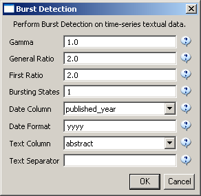

<!-- page 40 -->

employs a probabilistic automaton whose states correspond to the frequencies of individual words. State transitions correspond to points in time around which the frequency of the word changes significantly. The algorithm generates a ranked list of the word bursts in the document stream, together with the intervals of time in which they occurred. This can serve as a means of identifying topics, terms, or concepts important to the events being studied that increased in usage, were more active for a period of time, and then faded away. In the NWB Tool, the algorithm can be found under *‘Analysis > Textual > Burst Detection’*. As the algorithm itself is case sensitive, care must be taken if the user desires ‘KOREA’ and ‘korea’ and ‘Korea’ to be identified as the same word. As the Garfield ISI data is very different in character from the rest, it is left out of the burst analysis done here. One particular difference is the absence of ISI keywords from most of the works in the Garfield dataset. In the NWB Tool, use *'File > Load and Clean ISI File'* to load ThreeNetSciResearchers.isi, which is a file that contains all of Wasserman’s, Vespignani’s and Barabási’s ISI records and is provided as a sample dataset in ‘*yournwbdirectory*/sampledata/scientometrics/isi/ThreeNetSciResearchers.isi’. The result is two new tables in the Data Manager. The first is a table with all ISI records. The second is a derived (indented) table with unique ISI records named *‘262 Unique ISI Records’*. In the latter file, ISI records with unique ID numbers (UT field) are merged, and only the record with the higher citation count (CT value) is kept. Select the *‘262 Unique ISI Records’* table and run *'Analysis > Textual > Burst Detection'* using the parameters: Gamma 1.0 # default setting General Ratio 2.0 # default setting First Ratio 2.0 # default setting Bursting States 1 # default setting Date Column Select “Publication Year” from the long listing Date Format Select “yyyy” Text Column Select “Authors” Text Separator **|** Note: Throughout the tutorial we will use ‘#’ to indicate comments or further instructions within parameter or code blocks. These do not need to be entered into the tool. A third table (derived from *‘262 Unique ISI Records’*) labeled *‘Burst detection analysis ...’* will appear in the Data Manager. On a PC running Windows, right click on this table and select view to see the data in Excel. On a Mac or a Linux system, right click and save the file, then open using the spreadsheet program of your choice. The table has 6 columns. The first column lists bursting words, here author names, the length of the burst, the burst weight, burst strength, together with the burst start and end year. Note that words can burst multiple times. If they do, then the burst ‘weight’ indicates how much support there is for the burst above the previous bursting level, while ‘strength’ indicates how much support there is for the burst over the non-bursting baseline. Since the burst detection algorithm was run with ‘bursting state = 1’, i.e., modeled only one burst per word, the burst weight is identical to the burst strength in this output. To generate a visual depiction of the bursts in MS Excel perform the following steps: 1. Sort the data ascending by burst start year. 2. Add column headers for all years, i.e., enter first start year in G1, here 1980. Continue, e.g., using formulae *‘=G1+1’*, until highest burst end year, here 2004 in cell AF1. 3. In the resulting word by burst year matrix, select the upper left blank cell (G2) and using ‘*Format > Conditional Formatting’* color code the cells according to burst value. To color cells for years with a burst (total power) value of more or equal 10 red and cells with a higher value dark red use the following formulas and format patterns: Condition 1 =AND(AND(G$1>=$E2,OR(G$1<=$F2,$F2="")),$D2>=10) Condition 2 =AND(G$1>=$E2,OR(G$1<=$F2,$F2="")) Apply the format to all cells in the word by year matrix. The result for the given example is shown in Figure 7.8.

<!-- page 41 -->

**Figure 7.8:** Visualizing burst results in MS Excel Running burst detection on the combined Wasserman, Vespignani, and Barabási ISI file for authors, ISI keywords, and cited references results in Figure 7.9. To generate the latter two results, select Text Column ‘New ISI Keywords’ and ‘Cited References’ instead of ‘Authors’ in the burst parameters. The results reveal many of the trends one would expect to see among these major network science researchers. For instance, the ISI keywords burst with terms related to diffusion and growth in the early 90s, criticality and critical behavior in the late 90s, and finish with small-world networks, complex networks, and metabolic networks starting in the early 2000s and not being finished at the end of the dataset (as opposed to ending in 2005, the last year of the dataset but for three papers). Another pattern is that almost all of the authors with bursts in the dataset were graduate students of Wasserman, Vespignani, or Barabási during this period. One notable example of this is Reka Albert, who bursts from 1997 to 2000, corresponding to work on her Ph.D. with Barabási. The result can be visualized as a chart with word and time dimensions; see Figure 7.9. Bursts for each word are shown as horizontal red bars across the time dimension. Bursts with strength above 10 are colored a darker red. All bursts are shown for authors and keywords, but only words in the fifteen most powerful bursts are shown for cited references and terms in the abstract. For each type of word, words are sorted by the start of their first burst and the end of their last burst. In the burst for abstract terms, stop words are removed. This chart was made in MS Excel by following the steps enumerated to create Figure 7.8, with some minor modifications for display.

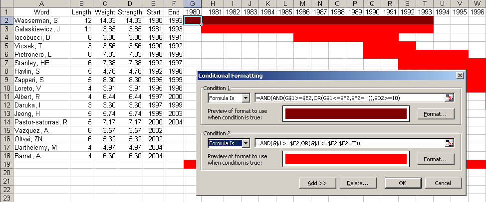

<!-- page 42 -->

**Figure 7.9:** Visualization of bursts for author names, ISI keywords, and cited references It is interesting to note in the cited reference bursts that many of the strongest bursts are the most recent. This confirms that many of the foundational techniques of network science have developed recently, particularly as the publications with very strong bursts include those by Barabási and Albert on statistical mechanics of scale-free networks, Watts and Strogatz on small world networks, and Newman on random networks. It also reflects a change in dynamics, however, as the historically social-science-dominated-field of network science now sees major contributions by physicists.

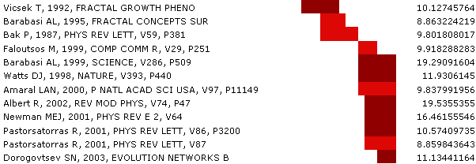

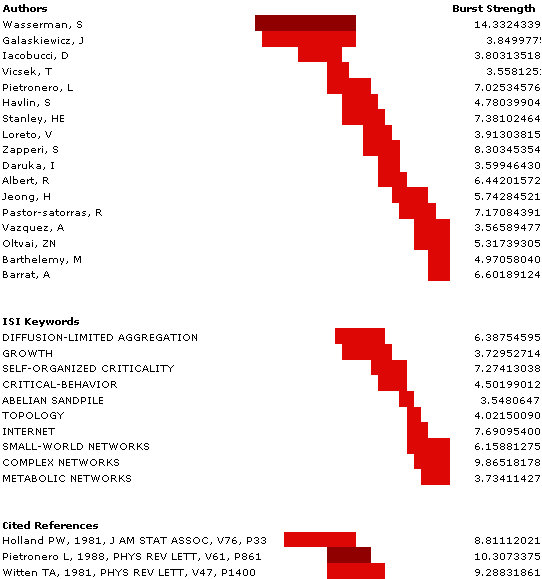

<!-- page 43 -->

**7.3.3 Slice Table by Time** Use time slicing to see the evolution of a network over time. It can be found in *‘Preprocessing > Slice Table by Time’*. Here, we slice the “Vespignani” dataset into five year intervals from 1988-2007, see Figure 7.10.

**Figure 7.10:** Input values in ‘Slice Table by Time’ algorithm User should choose “Publication Year” in the Date/Time Column field and leave the Date/Time Format field as the default. “Slice Into” allows the user to slice the table by days, weeks, months, quarters, years, decades, and centuries. There are two additional options for time slicing—cumulative and align with calendar. The former produces cumulative tables containing all data from the beginning of the time range to the end of the table’s time interval, which can be seen in the Data Manager and below:

The latter option aligns the output tables according to calendar intervals:

If user chooses “Years” under “Slice Into”, time slicing will start from January 1st of the first year. If “Months” is chosen, it will start from the first day of the earliest month in the chosen time interval.

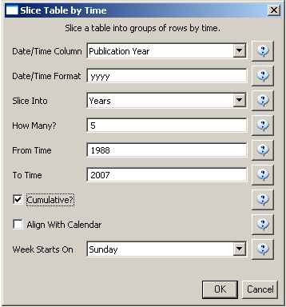

<!-- page 44 -->

To see the evolution of Vespignani’s co-authorship network over time, check “cumulative”. Then, extract coauthorship networks for each sliced time table by clicking “*Scientometrics > Extract Co-Author Network*”. Visualize the evolving network using GUESS as shown in Figure 7.11.

**1988-1992 1988-1997**

**1988-2002 1988-2007**

**Figure 7.11:** Evolving co-authorship network of Vespignani from 1988-2007 The four networks reveal that from 1988-1992, Alessandro Vespignani had one main co-author and four other coauthors. His network expanded considerably to 71 co-authors and 221 co-author links until 2007.

*7.4 Geospatial Analysis* Geospatial analysis has a long history in geography and cartography. Geospatial analysis aims to answer the question where something happens and with what impact on neighboring areas. It requires spatial attribute values such as geolocations for authors or their papers extracted from affiliation data or spatial positions of nodes generated from layout algorithms. Geospatial data can be continuous, i.e., each record has a specific position, or discrete, i.e., a position or area (shape file) exists for sets of records, e.g., number of papers per country. Spatial aggregations, e.g., merging via zip codes, counties, states, countries, continents, are common. *Cartographic generalization* refers to the process of abstraction such as (1) graphic generalization, i.e., the simplification, enlargement, displacement, merging, or selection of entities that does not affect their symbology and (2) conceptual symbolization: merging, selection, plus symbolization and enhancement of entities, e.g., representing high density areas by a new (city) symbol (Kraak & Ormeling, 1987).

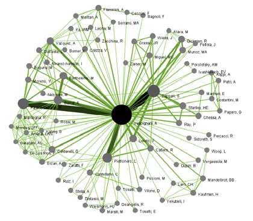

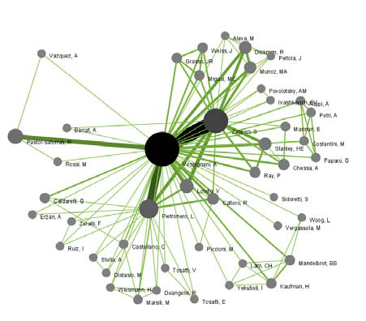

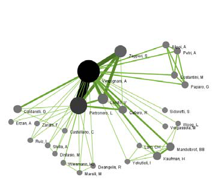

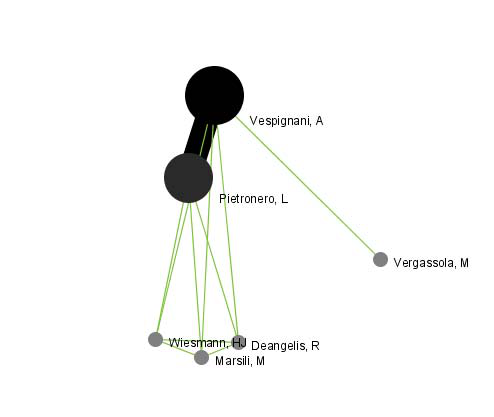

<!-- page 45 -->

*Geometric Generalization* aims to solve the conflict between the number of visualized features, the size of symbols, and the size of the display surface. Cartographers dealt with this conflict mostly intuitively until researcher's like Friedrich Töpfer attempted to find quantifiable expressions for it (Skupin, 2000; Tobler, 1973; Töpfer, 1974; Töpfer & Pillewizer, 1966). Please see the Sci2 Tool at http://sci.slis.indiana.edu for geospatial mapping algorithms that are compatible with the NWB Tool.

*7.5 Topical Analysis* The topic, also called semantic, coverage of a unit of science can be derived from text associated with it. For example, topic coverage and topical similarity of, e.g., authors or institutions, can be derived from units associated with them, e.g., papers, patents, or grants. Topical aggregations, e.g., over journal volumes, scientific disciplines, or institutions are common. *Topic analysis* extracts the set of unique words or word profiles and their frequency from a text corpus. Stop words, such as ‘the’, ‘of’, etc., are removed. Stemming, i.e., the reduction of words such as ‘scientific’, ‘science’ to ‘scien’ can be applied (Porter, 1980). *Co-word analysis* identifies the number of times two words are used in the title, keyword set, abstract and/or full text of, e.g., a paper. The space of co-occurring words can be mapped providing a unique view of the topic coverage of a dataset. Similarly, units of science can be grouped based on the number of words they share in common (Callon, Courtial, Turner, & Bauin, 1983; Callon, Law, & Rip, 1986). Salton’s term frequency inverse document frequency (TFIDF) is a statistical measure used to evaluate how important a word is to, e.g., paper, in a corpus. The importance increases proportionally to the number of times a word appears in the paper but is offset by the frequency of the word in the corpus (Salton & Yang, 1973). Dimensionality reduction techniques such as self organizing maps (SOM) or the topics model, see Table 7.1, are commonly used to project high-dimensional information spaces, e.g., the matrix of all unique papers times their unique terms, into a low, typically 2-dimensional space. See section 7.6.2 Co-Occurrence Linkages for examples on how to use the NWB Tool for word co-occurrence analysis (Deerwester, Dumais, Furnas, Landauer, & Harshman, 1990; Griffiths & Steyvers, 2002; Kohonen, 1995; Kruskal, 1964; Landauer & Dumais, 1997; Landauer, Foltz, & Laham, 1998).

*7.6 Network Analysis* The study of networks aims to increase our understanding of natural and man-made interactions. It builds upon social network analysis (Carrington, Scott, & Wasserman, 2005; Scott, 2000; Wasserman & Faust, 1994), physics (Barabási, 2002), information science (Börner et al., 2007), bibliometrics (Borgman & Furner, 2002; Nicolaisen, 2007), scientometrics, webometrics (Narin & Moll, 1977; White & McCain, 1998) , informetrics (Wilson, 2001), webometrics (Thelwall, Vaughan, & Björneborn, 2005), communication theory (Monge & Contractor, 2003), sociology of science (Lenoir, 2002), and several other disciplines. Authors, institutions, countries as well as words, papers, journals, patents, funding, etc. are represented as nodes and their complex interrelations as edges. For example, author and paper nodes exist in a delicate ecology of evolving networks. Given a set of papers, diverse networks can be extracted. Typically, three types of linkages are distinguished: *direct linkages*, e.g., paper citation linkages; *co-occurrences*, e.g., of words, authors, references; and *co-citations*, e.g., of authors or papers. Linkages may be among units of the same type, e.g., co-authorship linkages, or between units of different types, e.g., authors produce papers. Units of the same type can be interlinked via different link types, e.g., papers can be linked based on co-word, direct, co-citation, or bibliographic coupling analysis. Linkages might be directed and/or weighted. Nodes and their linkages can be represented as adjacency matrix, edge list, and visually as structure plot or graph. Each non-symmetrical occurrence matrix, e.g., paper citations, has two associated (symmetrical) co-occurrence matrices, e.g., a bibliographic coupling and a co-citation matrix.

<!-- page 46 -->

**Figure 7.12 shows a sample dataset of five papers, A through E, published over three years together with their authors x, y, z, references (blue references are papers outside this set) and citations (green ones go to papers outside this set) as well as some commonly derived networks. The extraction and analysis of these and other scholarly networks is explained subsequently.**

**Figure 7.12:** Sample paper network (left) and four different network types derived from it (right). Diverse algorithms exist to calculate specific node, edge, and network properties, see (Börner et al., 2007). Node properties comprise degree centrality, betweenness centrality, or hub and authority scores. Edge properties include are durability, reciprocity, intensity ('weak' or 'strong'), density (how many potential edges in a network actually exist), reachability (how many steps it takes to go from one 'end' of a network to the other), centrality (whether a network has a 'center' point(s)), quality (reliability or certainty), and strength. Network properties refer to the number of nodes and edges, network density, average path length, clustering coefficient, and distributions from which general properties such as small world, scale-free, or hierarchical can be derived. Identifying major communities via community detection algorithms and calculating the ‘backbone’ of a network via pathfinder network scaling or maximum flow algorithms helps to communicate and make sense of large scale networks.

#### 7.6.1 Direct Linkages

***7.6.1.1 Paper-Paper (Citation) Network*** Papers cite other papers via references forming an unweighted, directed paper citation graph. It is beneficial to indicate the direction of information flow, in order of publication, via arrows. References enable a search of the citation graph backwards in time. Citations to a paper support the forward traversal of the graph. Citing and being cited can be seen as roles a paper possesses (Nicolaisen, 2007). In the NWB Tool, load the file ‘*yournwbdirectory*/sampledata/scientometrics/isi/FourNetSciResearchers.isi’ using *'File > Load and Clean ISI File'.* A table of the records and a table of all records with unique ISI ids will appear in the Data Manager. In this file each original record now has a ‘Cite Me As’ attribute that is constructed from the 'first author, PY, J9, VL, BP' fields of its ISI record and will be used when matching paper and reference records. To extract the paper citation network, select the *‘361 Unique ISI Records’* table and run *'Scientometrics > Extract Directed Network'* using the parameters:

<!-- page 47 -->

The result is a directed network of paper citations in the Data Manager. Each paper node has two citation counts. The local citation count (LCC) indicates how often a paper was cited by papers in the set. The global citation count (GCC) equals the times cited (TC) value in the original ISI file. Paper references have no GCC value, except for references that are also ISI records. Currently, the NWB Tool sets the GCC of references to -1 (except for references that are not also ISI records). This is useful to prune the network to contain only the original ISI records. To view the complete network, select the network and run *‘Visualization > GUESS’* and wait until the network is visible and centered. Layout the network, e.g., using the Generalized Expectation-Maximization (GEM) algorithm using *‘GUESS: Layout > GEM’*. Pack the network via *‘GUESS: Layout > Bin Pack’*. To change the background color use *‘GUESS: Display > Background Color’*. To size and color code nodes, select the ‘Interpreter’ tab at the bottom, left-hand corner of the GUESS window, and enter the command lines: > resizeLinear(globalcitationcount,1,50) > colorize(globalcitationcount,gray,black) > for e in g.edges: ... e.color="127,193,65,255" # enter a tab after the three dots ... # hit Enter again Note: The Interpreter tab will have ‘>>>’ as a prompt for these commands. It is not necessary to type ‘>” at the beginning of the line. You should type each line individually and hit enter to submit the commands to the Interpreter. For more information, refer to the GUESS tutorial at http://nwb.slis.indiana.edu/Docs/GettingStartedGUESSNWB.pdf. This way, nodes are linearly size and color coded by their GCC, and edges are green as shown in Figure 7.13 (left). Any field within the network can be substituted to code the nodes. To view the available fields, open the Information Window (*‘Display > Information Window’*) and mouse over a node. Also note that each ISI paper record in the network has a dandelion shaped set of references. The GUESS interface supports pan and zoom, node selection, and details on demand, see GUESS tutorial. For example, the node that connects the Barabási-Vespignani network in the upper left to Garfield’s network in the lower left is *Price, 1986, Little Science, Big Science*. The network on the right is centered on Wasserman’s works.

<!-- page 48 -->

**Figure 7.13:** Directed, unweighted paper-paper citation network for ‘FourNetSciResearchers’ dataset with all papers

and references in the GUESS user interface (left) and a pruned paper-paper citation network after removing all

references and isolates (right) The complete network can be reduced to papers that appeared in the original ISI file by deleting all nodes that have a GCC of -1. Simply run *'Preprocessing > Extract Nodes Above or Below Value’* with parameter values: Extract from this number -1 Below? # leave unchecked Numeric Attribute globalCitationCount The resulting network is unconnected, i.e., it has many subnetworks many of which have only one node. These single unconnected nodes, also called isolates, can be removed using *'Preprocessing > Delete Isolates’*. Deleting isolates is a memory intensive procedure. If you experience problems at this step, you may wish to consult the FAQ entitled “How do I increase the amount of memory available to Network Workbench?” at https://nwb.slis.indiana.edu/community/?n=Main.FAQ. The *‘FourNetSciResearchers’* dataset has exactly 65 isolates. Removing those leaves 12 networks shown in Figure 6 (right) using the same color and size coding as in Figure 5 (left). Using *‘GUESS: Display > Information Window’* reveals detailed information for any node or edge. Here the node with the highest GCC value was selected. Alternatively, nodes could have been color and/or size coded by their degree using, e.g., > g.computeDegrees() > colorize(outdegree,gray,black) Note that the outdegree corresponds to the LCC within the given network while the indegree reflects the number of references, helping to visually identify review papers. The complete paper-paper-citation network can be split into its subnetworks using *‘Analysis > Unweighted & Directed > Weak Component Clustering’* with the default values. The largest component has 163 nodes, the second largest 45, the third 24, and the fourth and fifth have 12 and 11 nodes respectively. The largest component, also called giant component, is shown in Figure 7. The top 20 papers, by times cited in ISI, have been labeled using > toptc = g.nodes[:] > def bytc(n1, n2): ... return cmp(n1.globalcitationcount, n2.globalcitationcount) > toptc.sort(bytc) > toptc.reverse() > toptc > for i in range(0, 20):

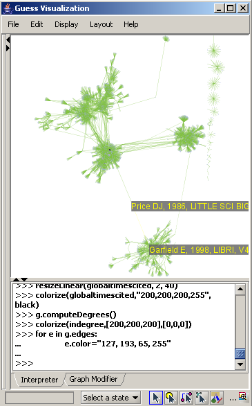

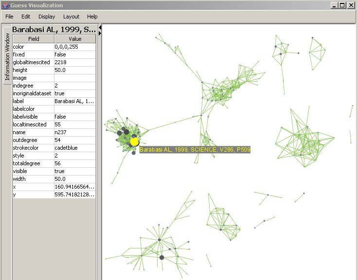

<!-- page 49 -->

... toptc[i].labelvisible = true Alternatively, run *‘GUESS: File > Run Script …’* and select ‘*yournwbdirectory*/sampledata/scientometrics/isi/paper-citation-nw.py’*.*

**Figure 7.14:** Giant components of the paper citation network Compare the result with Figure 7.13 (right) and note that this network layout algorithm–and most others–are nondeterministic. That is, different runs lead to different layouts – observe the position of the highlighted node in both layouts. However, all layouts aim to group connected nodes into spatial proximity while avoiding overlaps of unconnected or sparsely connected subnetworks.

***7.6.1.2 Author-Paper (Consumed/Produced) Network*** There are active and passive units of science. Active units, e.g., authors, produce and consume passive units, e.g., papers, patents, datasets, software. The resulting networks have multiple types of nodes, e.g., authors and papers. Directed edges indicate the flow of resources from sources to sinks, e.g., from an author to a written/produced paper to the author who reads/consumes the paper.

#### 7.6.2 Co-Occurrence Linkages

***7.6.2.1 Author Co-Occurrence (Co-Author) Network*** Having the names of two authors (or their institutions, countries) listed on one paper, patent, or grant is an empirical manifestation of scholarly collaboration. The more often two authors collaborate, the higher the weight of their joint co-author link. Weighted, undirected co-authorship networks appear to have a high correlation with social networks that are themselves impacted by geospatial proximity (Börner, Penumarthy, Meiss, & Ke, 2006; Wellman, White, & Nazer, 2004). To produce a co-authorship network in the NWB Tool, select the table of all 361 unique ISI records from the *‘FourNetSciResearchers’* dataset in the Data Manager window. Run *‘Scientometrics > Extract Co-Author Network’* using the parameter: File Format isi The result is two derived files in the Data Manager window: the co-authorship network and a table with a listing of unique authors, also known as ‘merge table’. The merge table can be used to manually unify author names, e.g., “Albet, R” and “Albert, R” see example below.

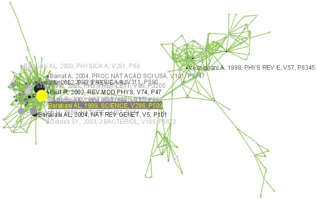

<!-- page 50 -->

In order to manually examine and if needed correct the list of unique authors, open the merge table, e.g., in a spreadsheet program. Sort by author names and identify names that refer to the same person. In order to merge two names, simply delete the asterisk (‘*’) in the last column of the duplicate node’s row. In addition, copy the uniqueIndex of the name that should be kept and paste it into the cell of the name that should be deleted. Table 7.3 shows the result for merging “Albet, R” and “Albert, R” where “Albet, R” will be deleted yet all of the nodes linkages and citation counts will be added to “Albert, R”. **Table 7.3:** Merging of author nodes using the merge table label timesCited numberOfWorks uniqueIndex combineValues

Abt, HA 3 1 142 *

Alava, M 26 1 196 *

Albert, R 7741 17 60 *

Albet, R 16 1 60

A merge table can be automatically generated by applying the Jaro distance metric (Jaro, 1989, 1995) available in the open source Similarity Measure Library (http://sourceforge.net/projects/simmetrics/) to identify potential duplicates. In the NWB Tool, simply select the co-author network and run *‘Scientometrics > Detect Duplicate Nodes’* using the parameters: Attribute to compare on label Merge when this similar 0.95 Create notice when this similar 0.85 Number of shared first letter 2 The result is a merge table that has the very same format as Table 7.3, together with two textual log files. The log files describe which nodes will be merged or not merged in a more human-readable form. Specifically, the first log file provides information on which nodes will be merged (right click and select view to examine the file), while the second log file lists nodes which will not be merged, but are similar. Based on this information the automatically generated merge table can be further modified as needed. In sum, unification of author names can be done manually or automatically independently or in conjunction. It is recommended to create the initial merge table automatically and to fine-tune it as needed. Note that the same procedure can be used to identify duplicate references – simply select a paper-citation network and run *‘Scientometrics > Detect Duplicate Nodes’* using the same parameters as above and a merge table for references will be created. To merge identified duplicate nodes, select the merge table and the co-authorship network holding down the ‘Ctrl’ key. Run *‘Scientometrics > Update Network by Merging Nodes’*. This will produce an updated network as well as a report describing which nodes were merged. The updated co-author network can be visualized using *‘Visualization > GUESS’*, see the above explanation on GUESS. Figure 7.15 shows a layout of the combined *‘FourNetSciResearchers’* dataset after setting the background color to white and using the command lines: > resizeLinear(numberofworks,1,50) > colorize(numberofworks,gray,black) > for n in g.nodes: ... n.strokecolor = n.color # border color same as its inside color > resizeLinear(numberofcoauthoredworks, .25, 8) > colorize(numberofcoauthoredworks, "127,193,65,255", black) > nodesbynumworks = g.nodes[:] # make a copy of the list of all nodes > def bynumworks(n1, n2): # define a function for comparing nodes ... return cmp(n1.numberofworks, n2.numberofworks) > nodesbynumworks.sort(bynumworks) # sort list > nodesbynumworks.reverse() # reverse sorting, list starts with highest # > for i in range(0, 50): # make labels of most productive authors visible ... nodesbynumworks[i].labelvisible = true

<!-- page 51 -->

Alternatively, run *‘GUESS: File > Run Script …’* and select ‘*yournwbdirectory*/sampledata/scientometrics/isi/co- author-nw.py’*.* That is, author nodes are color and size coded by the number of papers per author. Edges are color and thickness coded by the number of times two authors wrote a paper together. The remaining commands identify the top-50 authors with the most papers and make their name labels visible. GUESS supports the repositioning of selected nodes. Multiple nodes can be selected by holding down the ‘Shift’ key and dragging a box around specific nodes. The final network can be saved via *‘GUESS: File > Export Image’* and opened in a graphic design program to add a title and legend. The image below was created using Photoshop and label sizes were changed as well.

**Figure 7.15:** Undirected, weighted co-author network for ‘FourNetSciResearchers’ dataset

***7.6.2.2 Word Co-Occurrence Network*** The topic similarity of basic and aggregate units of science can be calculated via an analysis of the co-occurrence of words in associated texts. Units that share more words in common are assumed to have higher topic overlap and are connected via linkages and/or placed in closer proximity. Word co-occurrence networks are weighted and undirected. In the NWB Tool, select the table of 361 unique ISI records from the *‘FourNetSciResearchers’* dataset in the Data Manager. Run ‘*Preprocessing > Normalize Text’* using parameters New Separator |

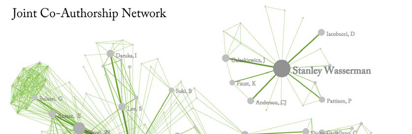

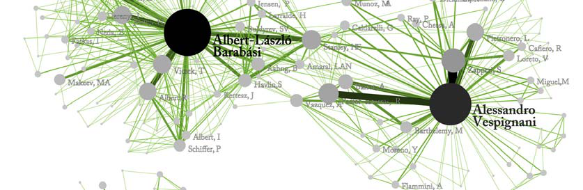

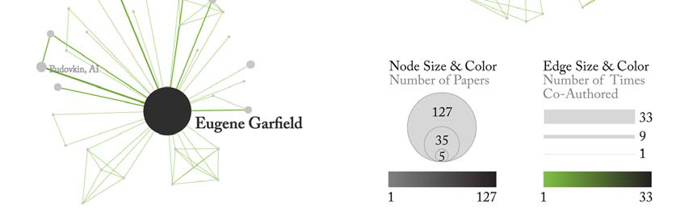

<!-- page 52 -->

Abstract # Check this box The performed text normalization utilizes the StandardAnalyzer provided by Lucene (http://lucene.apache.org). It separates text into word tokens, normalizes word tokens to lower case, removes 's from the end of words, removes dots from acronyms, and deletes stop words. Soon the Porter stemmer (http://tartarus.org/~martin/PorterStemmer) will become available as well. The result is a derived table in which the text in the abstract column is normalized. Select this table and run ‘*Scientometrics > Extract Word Co-Occurrence Network’* using parameters:

Node Identifier Column Cite Me As Text Source Column Abstract Text Delimiter | Aggregate Function File [None] The outcome is a network in which nodes represent words and edges denote their joint appearance in a paper. Word co-occurrence networks are rather large and dense. Running the *‘Analysis > Network Analysis Toolkit (NAT)’* reveals that the network has 2,888 word nodes and 366,009 co-occurrence edges. There are 235 isolate nodes that can be removed running ‘*Preprocessing > Delete Isolates’*. Note that when isolates are removed, papers without abstracts are removed along with the keywords. The result is one giant component with 2,653 nodes and 366,009 edges. To visualize this rather large network run *‘Visualization > DrL (VxOrd)’* with default values. To keep only the strongest edges run ‘*Preprocessing > Extract Top Edges’* using parameters Top Edges 1000 and leave the others at their default values. Once edges have been removed, the network can be visualized by running *'Visualization > GUESS'*. In GUESS, run the following commands: > for node in g.nodes: # to position the nodes at the DrL calculated place ... node.x = node.xpos* 40 ... node.y = node.ypos * 40 ... > resizeLinear(references, 2, 40) > colorize(references,[200,200,200],[0,0,0]) > resizeLinear(weight, .1, 2) > g.edges.color = "127,193,65,255" and set the background color to white to re-create the visualization. The result should look something like the one in Figure 7.16 (left). To visualize the same network using Specified (prefuse beta), run *‘Visualization > Specfied (prefuse beta)’* and enter *xpos* for the *x* parameter and *ypos* for the *y* parameter. Double right-click in the white box to zoom the graph into view. The result should look like figure 7.16 (right).

<!-- page 53 -->

**Figure 7.16:** Undirected, weighted word co-occurrence network for ‘FourNetSciResearchers’ dataset using GUESS

(left) and Specified (prefuse beta) (right).

***7.6.2.3 Cited Reference Co-Occurrence (Bibliographic Coupling) Network*** Papers, patents or other scholarly records that share common references are said to be coupled bibliographically (Kessler, 1963), see Figure 7.12. The bibliographic coupling (BC) strength of two scholarly papers can be calculated by counting the number of times that they reference the same third work in their bibliographies. The coupling strength is assumed to reflect topic similarity. Co-occurrence networks are undirected and weighted. In NWB Tool, a bibliographic coupling network is derived from a directed paper citation network; see section 7.6.1.1. Paper-Paper (Citation) Network. Select the paper citation network of the *‘FourNetSciResearchers’* dataset in the Data Manager. Run *‘Scientometrics > Extract Reference Co-Occurrence (Bibliographic Coupling) Network’* and the bibliographic coupling network becomes available in the Data Manager. Running *‘Analysis > Network Analysis Toolkit (NAT)’* reveals that the network has 5,335 nodes (5,007 of which are isolate nodes) and 6,206 edges. Edges with low weights can be eliminated by running *'Preprocessing > Extract Edges Above or Below Value’* with parameter values:

Isolate nodes can be removed running ‘*Preprocessing > Delete Isolates’*. The resulting network has 241 nodes and 1,508 edges in 12 weakly connected components. This network can be visualized in GUESS; see Figure 7.17 and the above explanation. Nodes and edges can be color and size coded, and the top-20 most cited papers can be labeled by entering the following lines in the GUESS Interpreter: > resizeLinear(globalcitationcount,2,40) > colorize(globalcitationcount,(200,200,200),(0,0,0)) > resizeLinear(weight,.25,8) > colorize(weight, "127,193,65,255", black) > for n in g.nodes: ... n.strokecolor=n.color > toptc = g.nodes[:] > def bytc(n1, n2): ... return cmp(n1.globalcitationcount, n2.globalcitationcount) > toptc.sort(bytc)

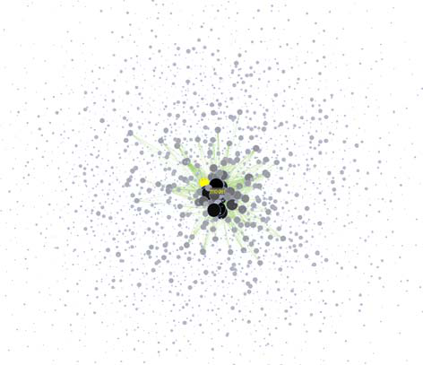

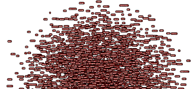

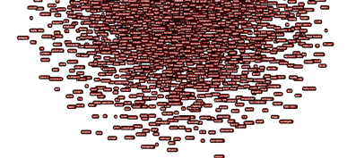

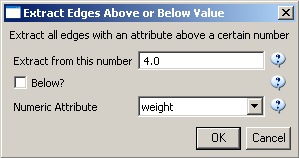

<!-- page 54 -->

> toptc.reverse() > toptc > for i in range(0, 20): ... toptc[i].labelvisible = true Alternatively, run *‘GUESS: File > Run Script …’* and select ‘*yournwbdirectory*/sampledata/isi/reference-co- occurence-nw.py’.*

**Figure 7.17**: Reference co-occurrence network layout for ‘FourNetSciResearchers’ dataset

**7.6.3 Co-Citation Linkages** Two scholarly records are said to be *co-cited* if they jointly appear in the list of references of a third paper, see Figures 7.12 and 7.18 (right). The more often two units are co-cited the higher their presumed similarity.

***7.6.3.1 Document Co-Citation Network (DCA)*** DCA was simultaneously and independently introduced by Small and Marshakova in 1973 (Marshakova, 1973.; Small, 1973; Small & Greenlee, 1986). It is the logical opposite of bibliographic coupling. The co-citation frequency equals the number of times two papers are cited together, i.e., they appear together in one reference list.

In the NWB Tool, select the paper-citation network, see section 7.6.1.1. Paper-Paper (Citation) Network, and run *‘Scientometrics > Extract Document Co-Citation Network’*. The co-citation network will become available in the Data Manager. It has 5,335 nodes (213 of which are isolates) and 193,039 edges. Isolates can be removed running ‘*Preprocessing > Delete Isolates’*. The resulting network has 5122 nodes and 193,039 edges – and is too dense for display in GUESS. Edges with low weights can be eliminated by running *'Preprocessing > Extract Edges Above or Below Value’* with parameter values: Extract from this number 4 Below? # leave unchecked Numeric Attribute weight Here, only edges with a local co-citation count of five or higher are kept. The giant component in the resulting network has 265 nodes and 1,607 edges. All other components have only one or two nodes. The giant component can be visualized in GUESS, see Figure 7.18 (right); see the above explanation, and use the same size and color coding and labeling as the bibliographic coupling network. Simply run *‘GUESS: File > Run Script …’* and select ‘*yournwbdirectory*/sampledata/isi/reference-co-occurence-nw.py’*.*

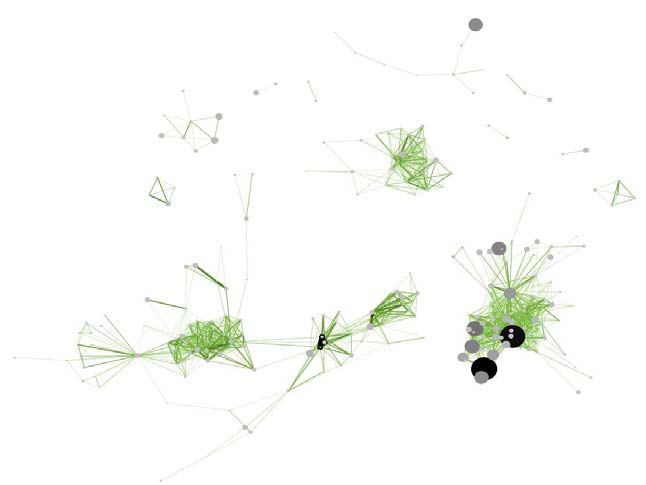

<!-- page 55 -->

**Figure 7.18:** Undirected, weighted bibliographic coupling network (left) and undirected, weighted co-citation

network (right) of ‘FourNetSciResearchers’ dataset, with isolate nodes removed

***7.6.3.2 Author Co-Citation Network (ACA)*** Authors of works that are repeatedly juxtaposed in references-cited lists are assumed to be related. Clusters in ACA networks often reveal shared schools of thought or methodological approach, common subjects of study, collaborative and student-mentor relationships, ties of nationality, etc. Some regions of scholarship are densely crowded and interactive. Others are isolated and nearly vacant. Please see the Sci2 Tool at http://sci.slis.indiana.edu for further information on Author Co-Citation Networks.

*7.7 Analyzing and Visualizing Large Networks* Most network analysis and visualization algorithms do not scale to millions of nodes. Even if a layout is produced it is often hard to interpret. Therefore, it is beneficial to employ algorithms that help identify the backbone, i.e., the major connections in a network, or identify communities.

**7.7.1 Basic Network Properties** The *‘Analysis > Network Analysis Toolkit (NAT)’* (Cisco Systems, 2004) can be applied to any size network to compute basic network properties, see sample output for ‘FourNetSciResearchers’ dataset below. Nodes: 248 Isolated nodes: 1 Node attributes present: label, timesCited, numberOfWorks Edges: 891 No self loops were discovered. No parallel edges were discovered. Edge attributes: Did not detect any nonnumeric attributes Numeric attributes: min max mean number of works ... 1 33 1.76094 This network seems to be valued. Average degree: 7.175483870967743

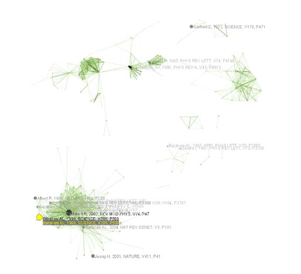

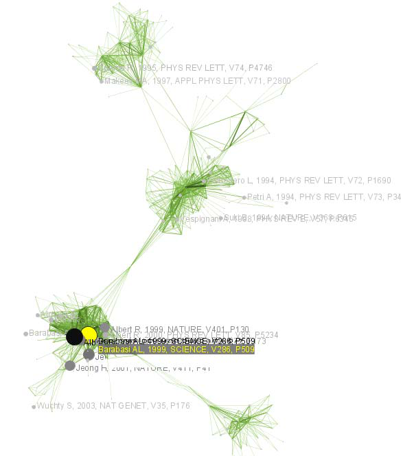

<!-- page 56 -->

This graph is not weakly connected. There are 4 weakly connected components. (1 isolates) The largest connected component consists of 194 nodes. Did not calculate strong connectedness because this graph was not directed. Density (disregarding weights): 0.02909 Additional Densities by Numeric Attribute densities (weighted against standard max) numberOfCoAuthoredWorks: 0.05123 densities (weighted against observed max) numberOfCoAuthoredWorks: 0.00155 This is especially important if networks are large as the network properties suggest certain data reduction approaches. For example, if a network is unconnected, it might be beneficial to layout components separately – identify existing components using *‘Analysis > Unweighted and Undirected > Connected Components’*. If a network is very dense, then backbone identification and community detection methods discussed below should be applied to identify major structures.

#### 7.7.2 Backbone Identification

***7.7.2.1 Pathfinder Network Scaling (PfNet)*** Pathfinder network scaling is a structural modeling technique originally developed for the analysis of proximity data in psychology (Schvaneveldt, Durso, & Dearholt, 1985). It is assumed to provide "a fuller representation of the salient semantic structures than minimal spanning trees, but also a more accurate representation of local structures than multidimensional scaling techniques" (Chen, 1999). The algorithm takes a proximity matrix as input and defines a network representation of the items while preserving only the most important links. It relies on the so-called triangle inequality to eliminate redundant or counter-intuitive links. Given two links or paths in a network that connect two nodes, the link/path is preserved that has a greater similarity defined via the Minkowski metric. It is assumed that the link/path with the greater similarity better captures the interrelationship between the two nodes and that the alternative link/path with lower similarity is redundant and should be pruned from the network. Two parameters *r* and *q* influence the topology of a pathfinder network. The *r-*parameter influences the weight of a path based on the Minkowski metric. The* q-*parameter defines the number of links in alternative paths (=length of a path) up to which the triangle inequality must be maintained. A network of* N* nodes can have a maximum path length of *q=N-1*. With *q=N-1* the triangle inequality is maintained throughout the entire network. For details on the method and its applications see (Schvaneveldt, 1990). The NWB Tool provides two more scalable versions of pathfinder network scaling as discussed below.

***7.7.2.2 MST-Pathfinder Network Scaling*** The original pathfinder network scaling algorithm has a runtime of *O(n4)* which limits its applicability to larger networks. One alternative is the MST-Pathfinder algorithm, which prunes the original network to get its *PFNET(*∞*,n-1)* in just *O(n2 log n)* time. The underlying idea comes from the fact that the union (superposition) of all the Minimum Spanning Trees extracted from a given network is equivalent to the PFNET resulting from the Pathfinder algorithm parameterized by a specific set of values (*r* = ∞ and *q = n-1*), the ones most frequently considered in many different applications. This efficiency enables the MST based approach to scale a network with 10,000 nodes and 100 million edges in approximately 129 seconds compared to more than 222 hours using the original approach. However, the algorithm cannot be applied to directed networks, because the sorting process deals with undirected links. In the NWB Tool the algorithm can be found under *‘Analysis >* (Un)*Weighted and Undirected > MST-Pathfinder Network Scaling’*. The user has to specify the edge weight column and how the edge weight should be considered (Dissimilarity or Similarity):

<!-- page 57 -->

For example, when an edge weight represents how many times two authors have co-authored, that is a measure of similarity, and the user should select the *Similarity* option. The provided network should not contain edge weights less than or equal to *0*. If it does, a warning is generated and a default edge weight is assumed for that edge. The output is the pruned network.

***7.7.2.3 Fast Pathfinder Network Scaling Algorithm*** The fast pathfinder network scaling algorithm prunes the original network to get an approximation of its *PFNET(r, n-1)* in just *O(n3)* time. It uses a very different approach compared to MST based pathfinder scaling. The underlying idea of this approach is based on a classical algorithm in graph theory for shortest path computation called Floyd- Warshall's Shortest Path Algorithm. This leads to a reduction in the time complexity from *O(n4)* to *O(n3).* Also the space complexity is drastically reduced from *(2 n)-1* matrices in the original algorithm to 2 matrices. If a network has a low standard deviation for edge weights or if many of the edge weights are equal to the minimum edge weight, then that network might not be scaled as much as expected. This prevents unweighted networks from being scaled at all. If the networks being processed are undirected then the MST based pathfinder network scaling algorithm can be used. This will give results many times faster than fast pathfinder algorithm. In the NWB Tool, the algorithm can be found under *‘Analysis > Weighted and* (Un)*directed > Fast-Pathfinder Network Scaling’*. The user has to provide the ‘Value of R parameter’, the field that represents the edge weight and how the edge weight should be considered (Dissimilarity or Similarity):

The provided network should not contain edge weights of less than or equal to 0. If it does, a warning is generated and a default edge weight is assumed for that edge. The value of R gives the Minkowski distance to use. It ranges from 1 to infinity. Since R = infinity is the most commonly used in Pathfinder network scaling, there is a checkbox, which when checked indicates that value of R is infinity (it is checked by default).

**7.7.3 Community Detection** Diverse algorithms exist to identify sub-networks or communities in large scale networks. The simplest method is to extract individual connected components, which are any maximal set of nodes where every node can be reached from every other node. This so called weak component clustering is a useful technique from graph theory, because network algorithms generally work independently on each component--as no edges exist between components. In the NWB Tool, running *‘Analysis > Unweighted and Undirected > Weak Component Clustering’* on the “*FourNetSciResearchers*” co-authorship network results in three unconnected components that can be visualized separately.

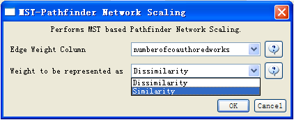

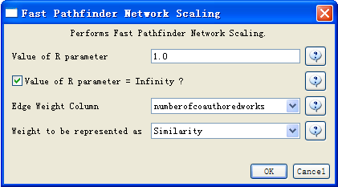

<!-- page 58 -->

In weighted networks, e.g., co-occurrence or co-citation networks (see section 7.6.2. Co-occurrence Linkages) thresholds can be applied, e.g., all edges below a certain weight can be omitted, leading to a less dense, possibly unconnected network. As an example, we show the application of *‘Preprocessing > Extract Edges Above or Below Value’* to the “*FourNetSciResearchers*” for different thresholds in Figure 7.19. Higher thresholds result in fewer edges and more network components.

**Figure 7.19:** Layout of ‘FourNetSciResearchers’ dataset with no threshold (left), with three or more co-authorships

(middle) and with 5 or more co-authorships (right)

***7.7.3.1 Betweenness Centrality (BC)*** refers to the number of times a path from any node in a network to any other node in this network goes through a specific node or edge (Freeman, 1977). A node or edge that interconnects two sub-networks has a high BC value and is also called a gatekeeper or weak link (Granovetter, 1973). The original algorithm is computationally very expensive and only applicable to networks of up to several hundred nodes. In 2001, Ulrik Brandes proposed a more efficient algorithm for betweenness that exploits the extreme sparseness of typical networks (Brandes, 2001). Other shortest-path based indices, like closeness or radiality, can be computed simultaneously within the same bounds (Anthonisse, 1971). In the NWB Tool, application of *‘Analysis > Unweighted and Undirected > Node Betweenness Centrality’* to the ‘FourNetSciResearchers’ co-authorship network adds BC values to each node. The top-five nodes with the highest BC value are listed below:

BC Value Name ISI’s TC # Papers

31515.5 Barabasi, AL 13496 127

19812.7 Vespignani, A 3811 101

3589.5 Garfield, E 2469 98

1531.35 Stanley, HE 994 22

1528.89 Vazquez, A 620 10 Figure 7.20 (left) shows a GUESS visualization with nodes size coded and color coded according to their BC values, using the following GUESS interpreter commands:

> resizeLinear(sitebetweenness,2,40) # nodes > colorize(sitebetweenness,[200,200,200],[0,0,0]) > colorize(numberofcoauthoredworks,[127,193,65],[0,0,0]) # edges > resizeLinear(numberofcoauthoredworks,.5,8) > gemLayout() > binPackLayout() The elimination of the top 5 nodes with the highest BC values leads to unconnected clusters of nodes, see Figure 7.20 (right). Note how Garfield’s network (top-right) disintegrates into many smaller subnetworks, while the joint Barabasi-Vespignani network exhibits a giant connected component even after the removal of the top-4 edges. The Wasserman network (bottom-right) is unaffected, since no nodes or edge have been removed.

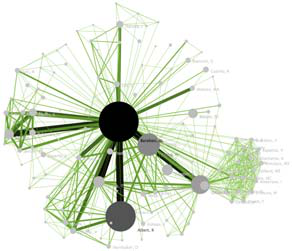

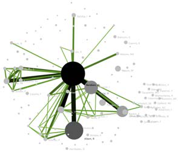

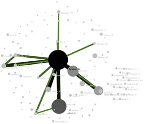

<!-- page 59 -->

**Figure 7.20:** Layout of ‘FourNetSciResearchers’ dataset, with nodes size coded according to their BC value (left)

and with the top 5 nodes with the highest BC values removed (right).

***7.7.3.2 Hyperlink-Induced Topic Search (HITS)*** HITS is a widely used algorithm in Web structure mining developed by Jon Kleinberg (Kleinberg, 1999). It is mostoften used for rating web pages with an authority score and a hub score. The authorityscore measures the value of a web page’s page content, and its hub score measures the value of hyperlinks between pages. Authority and hub scores are mutually recursive; authority is determined by how many hubs point to a page, and hub value is determined by how authoritative its links are. HITS can be used effectively on more general network problems, such as social, biological, or scholarly networks. The network can be directed or undirected, weighted or unweighted. The output is a network that in addition to the original node attributes, has two extra floating point attributes, *authority_score and hub_score*. In the NWB Tool, this very algorithm can be found in *’Unweighted & Undirected’, ‘Unweighted & Directed’, Weighted & Undirected’,* or *‘Weighted & Directed’,* in *‘Analysis’.* Here we apply it to the ‘FourNetSciResearchers’ paper citation network. The top-ten nodes with the highest *authority_score* and *hub_score* are listed below.

**authority_score Paper**

0.05984392 Albert R, 2002, REV MOD PHYS, V74, P47

0.026528405 Vazquez A, 2002, PHYS REV E, V65, DOI ARTN 066130

0.025031997 Ravasz E, 2003, PHYS REV E, V67, DOI ARTN 026112

0.022470286 Colizza V, 2005, PHYSICA A, V352, P1

0.02229378 Barabasi AL, 2002, PHYSICA A, V311, P590

0.021960443 Pastor-satorras R, 2001, PHYS REV E, V6306, DOI ARTN 066117

0.021393541 Moreno Y, 2002, EUR PHYS J B, V26, P521

0.021259034 Barabasi AL, 2004, NAT REV GENET, V5, P101

0.020125171 Vazquez A, 2003, PHYS REV E, V67, DOI ARTN 046111

0.019402143 Pastor-satorras R, 2002, PHYS REV E, V65, DOI ARTN 036104

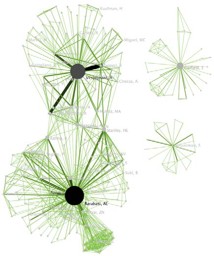

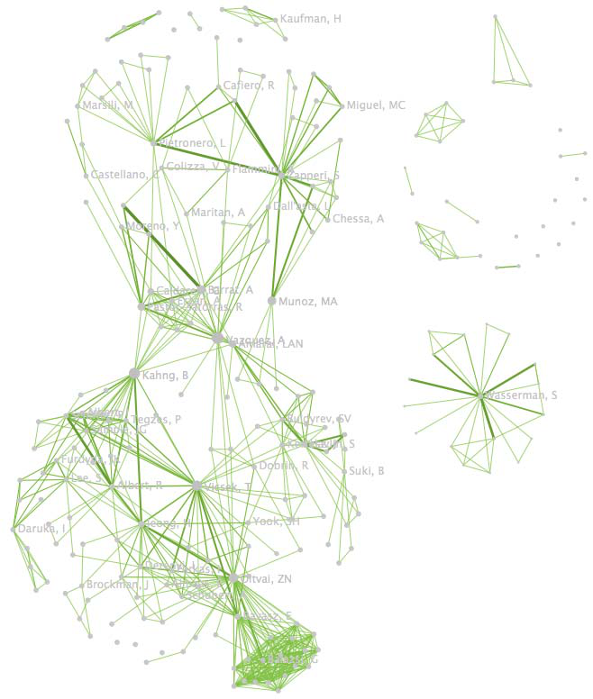

<!-- page 60 -->

**hub_score Paper**

0.017088737 Barabasi AL, 1999, SCIENCE, V286, P509

0.014638619 Watts DJ, 1998, NATURE, V393, P440

0.010365143 Amaral LAN, 2000, P NATL ACAD SCI USA, V97, P11149

0.010319315 Albert R, 2002, REV MOD PHYS, V74, P47

0.010109196 Faloutsos M, 1999, COMP COMM R, V29, P251

0.010072703 Pastorsatorras R, 2001, PHYS REV LETT, V86, P3200

0.009628947 Albert R, 2000, NATURE, V406, P378

0.00906183 Erdos P, 1960, PUBL MATH I HUNG, V5, P17

0.008962325 Barabasi AL, 1999, PHYSICA A, V272, P173

0.008767571 Albert R, 1999, NATURE, V401, P130 Figure 7.21 shows a GUESS visualizations of the giant component of the ‘*FourNetSciResearchers*’ dataset. Nodes are area size-coded and color-coded according to their *authority_score* (left) and *hub_score* values (right). Top 10 nodes with *authority_score* and *hub_score* are highlighted with purple and red respectively.

**Figure 7.21:** Giant component of the paper citation network of ‘FourNetSciResearchers’ dataset, with nodes size coded according to their *authority_score* value (left) and *hub_score* (right) As can be seen, all nodes with high HITS value are in the center of the network. The top 10 nodes with high *authority_score* are different from the nodes with high *hub_score*.

***7.7.3.3 PageRank*** PageRank (PR) is a link analysis algorithm used by Google to rank web pages (Brin & Page, 1998).A page linked to from many others pages with high PageRank can itself achieve a high PR. The higher a page’s PR, the higher it ranks in the Google Search Engine. Loet Leydesdorff (2009) compares existing and new indicators for scientometricians, including PageRank. Ying Ding et al (Ding, Yan, Frazho, & Caverlee, 2009) also studied how varied damping factors in the PageRank algorithm influence the author ranking and proposed weighted PageRank algorithms (Inc Wikimedia Foundation, 2009). The algorithm requires three inputs: the network to analyze, the number of bins for the distribution, and the damping factor, which is a probability (i.e., a real number between 0 and 1). Default values are provided.

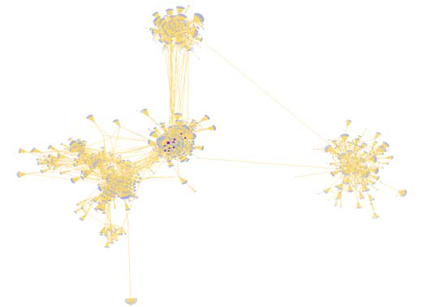

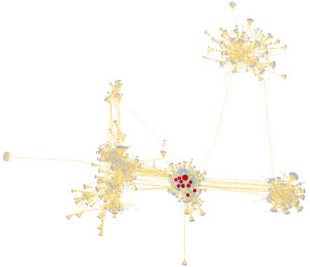

<!-- page 61 -->

The network to analyze must be directed, otherwise there are no special constraints. In the NWB Tool, application of *‘Analysis > Unweighted and Directed > PageRank’* to the ‘*FourNetSciResearchers’* paper citation network adds a *PageRank* values to each node.

**Figure 7.22:** Paper citation network layout of ‘*FourNetSciResearcher*s’ dataset, with nodes size coded according to their *PageRank* value The top-ten nodes with the highest PageRank values are listed below.

**PageRank Paper**

0.0157327 Pattison P, 2000, J MA

0.0128512 Anderson CJ, 1992, SOC

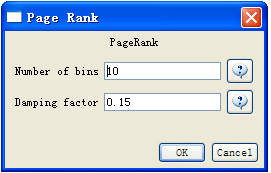

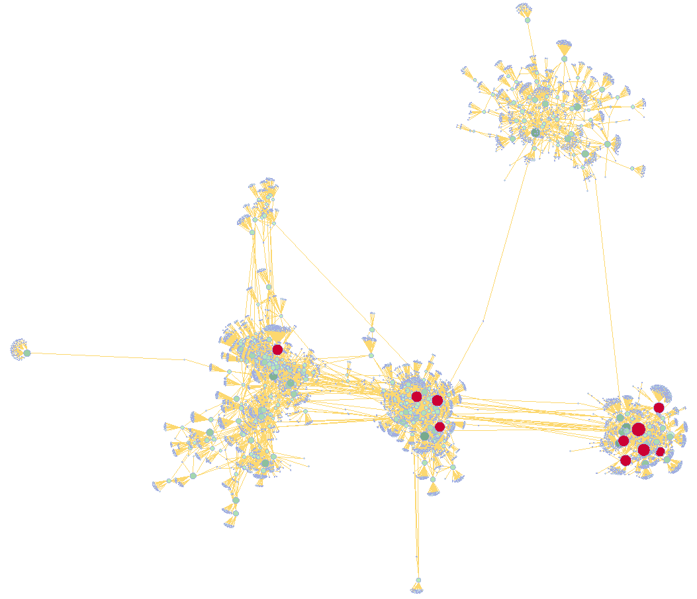

<!-- page 62 -->

0.0109013 Colizza V, 2006, NAT P

0.0102774 Faust K, 1992, SOC NET

0.0100571 Anderson CJ, 1999, SOC

0.00988407 Albert R, 2002, REV MO

0.00958214 Walker ME,1993,SOCIO

0.00957449 Erzan A, 1995, REV MOD

0.00865961 Colizza V, 2005, PHYSI

0.00791988 Wasserman S, 1990,J M Note that the *PageRank, authority_score* and *hub_score* for each node differ considerably. Interestingly, “Albert R, 2002, REV MOD PHYS, V74, P47” always appears in the three top 10 nodes’ sorting list.

***7.7.3.4 Blondel Community Detection*** Blondel agglomerates communities hierarchically based on improvements in modularity (Blondel, Guillaume, Lambiotte, & Lefebvre, 2008). The algorithm is affected by edge weight but not directionality, and it outputs a network whose nodes are annotated with community labels. Further documentation can be found in the Sci2 Tool documentation at http://sci.slis.indiana.edu or in the NWB Community Wiki at https://nwb.slis.indiana.edu/community/?n=AnalyzeData.BlondelCommunityDetection.

***7.7.3.5 Other Community Detection Algorithms*** The NWB team is currently working on integrating additional community detection algorithms into Network Workbench. We hope to include the following algorithms in the near future:

  Girvan and Newman 1999, which cuts edges in order of descending betweenness centrality to give clusters (Girvan & Newman, 2002)

  Palla et. al 2005, also called CFinder which finds communities based on overlapping cliques , and

  Reichardt and Bornholdt 2004, which models community structure as identical equilibrium spin states (Reichardt & Bornholdt, 2004)

**7.7.4 Large Network Layout** The NWB Tool supports the layout of networks with up to 10 million nodes via DrL, formerly called VxOrd (Davidson et al., 2001). For example, it is possible to select a co-citation network and run ‘Visualization > DrL (VxOrd)’ with parameters Edge Cutting 0.8 Edge Weight Attribute weight X Position Attribute xpos Y Position Attribute ypos The result is a *Laid Out Network* file that contains x, y positions for all nodes. The file can be visualized using GUESS or *‘Visualization > Specified (prefuse beta)’* with parameters x xpos y ypos Note that only node positions are generated. Color and size coding of nodes and edges has to be done in a separate step. For a step-by-step tutorial using DrL, see section 7.6.2.2 Word Co-Occurrence Network.

### 7.8 Comparison with Other Tools

**7.8.1 General Comparison** Table 7.4 provides an overview of existing tools used in scientometrics research, see also (Fekete & Börner-chairs, 2004). The tools are sorted by the date of their creation. Domain refers to the field in which they were originally

<!-- page 63 -->

developed such as social science (SocSci), scientometrics (Scientom), biology (Bio), geography (Geo), and computer science (CS). Coverage aims to capture the general functionality and types of algorithms available, e.g., Analysis and Visualization (A+V), see also description column. **Table 7.4.** Network analysis and visualization tools commonly used in scientometrics research. Tool Year Domain Coverage Description UI Open Source Operating System References S&T Dynamics Toolbox

1985 Scientom . Scientom. Tools from Loet Leydesdorff for organization analysis, and visualization of scholarly data.

Command- line No Windows (Leydesdorff, 2008)

In Flow 1987 SocSci A + V Social network analysis software for organizations with support for what-if analysis.

Graphical No Windows (Krebs, 2008)

Pajek 1996 SocSci* A + V A network analysis and visualization program with many analysis algorithms, particularly for social network analysis.

Graphical No Windows (Batagelj & Mrvar, 1998)

UCINet 2000 SocSci* A + V Social network analysis software particularly useful for exploratory analysis.

Graphical No Windows (Borgatti, Everett, & Freeman, 2002) Boost Graph Library

Library Yes All Major (Siek, Lee, & Lumsdaine, 2002) Visone 2001 SocSci A + V Social network analysis tool for research and teaching, with a focus on innovative and advanced visual methods.

2000 CS Analysis and Manipulation Extremely efficient and flexible C++ library for extremely large networks.

Graphical No All Major (Brandes & Wagner, 2008)

GeoVISTA 2002 Geo GeoVis GIS software that can be used to lay out networks on geospatial substrates.

Graphical Yes All Major (Takatsuka & Gahegan, 2002) Cytoscape 2002 Bio* Visualization Network visualization and analysis tool focusing on biological networks, with particularly nice visualizations.

Graphical Yes All Major (Cytoscape- Consortium, 2008)

Tulip 2003 CS Visualization Graph visualization software for networks over 1,000, 000 elements.

Graphical Yes All Major (Auber, 2003)

iGraph 2003 CS Analysis and Manipulation A library for classic and cutting edge network analysis usable with many programming languages.

Library Yes All Major (Csárdi & Nepusz, 2006)

CiteSpace 2004 Scientom A + V A tool to analyze and visualize scientific literature, particularly co-citation structures.

Graphical Yes All Major (Chen, 2006)

HistCite 2004 Scientom A + V Analysis and visualization tool for data from the Web of Science.

Graphical No Windows (Garfield, 2008)

R 2004 Statistics A + V A statistical computing language with many libraries for sophisticated network analyses.

Command- line Yes All Major (Ihaka & Gentleman, 1996)

Prefuse 2005 Visualiza tion Visualization A general visualization framework with many capabilities to support network visualization and analysis.

Library Yes All Major (Heer et al., 2005)

GUESS 2007 Networks Visualization A tool for visual graph exploration that integrates a scripting environment.

Graphical Yes All Major (Adar, 2007)

<!-- page 64 -->

GraphViz 2004 Networks Visualization Flexible graph visualization software. Graphical Yes All Major (AT&T- Research- Group, 2008) NWB Tool 2006 Bio, SocSci, Scientom

A + V Network analysis & visualization tool conducive to new algorithms supportive of many data formats.

Graphical Yes All Major (Huang, 2007.)

BibExcel 2006 Scientom A + V Transforms bibliographic data into forms usable in Excel, Pajek, NetDraw, and other programs.

Graphical No Windows (Persson, 2008)

Publish or Perish 2007 Scientom Data Collection and Analysis

Harvests and analyzes data from Google Scholar, focusing on measures of research impact.

Web-based No Windows, Linux (Harzing, 2008)

Many of these tools are very specialized and capable. For instance, BibExcel and Publish or Perish are great tools for bibliometric data acquisition and analysis. HistCite and CiteSpace each support very specific insight needs – from studying the history of science to the identification of scientific research frontiers. The S&T Dynamics Toolbox provides many algorithms commonly used in scientometrics research and it provided bridges to more general tools. Pajek and UCINET are very versatile, powerful network analysis tools that are widely used in social network analysis. Cytoscape is excellent for working with biological data and visualizing networks. The Network Workbench Tool has fewer analysis algorithms than Pajek and UCINET, and less flexible visualizations than Cytoscape. Network Workbench, however, makes it much easier for researchers and algorithm authors to integrate new and existing algorithms and tools that take in diverse data formats. The OSGi (http://www.osgi.org) component architecture and CIShell algorithm architecture (http://cishell.org) built on top of OSGi make this possible. Cytoscape is also adopting an architecture based on OSGi, though it will still have a specified internal data model and will not use CIShell in the core. Moving to OSGi will make it possible for the tools to share many algorithms, including adding Cytoscape’s visualization capabilities to Network Workbench. Recently, a number of other efforts adopted OSGi and/or CIShell. Among them are

  ***Cytoscape*** (http://www.cytoscape.org) lead by Trey Ideker, UCSD is an open source bioinformatics software platform for visualizing molecular interaction networks and integrating these interactions with gene expression profiles and other state data (Shannon et al., 2002).

  ***Taverna Workbench*** (http://taverna.sourceforge.net) lead by Carol Goble, University of Manchester, UK is a free software tool for designing and executing workflows (Hull et al., 2006). Taverna allows users to integrate many different software tools, including over 30,000 web services from many different domains, such as chemistry, music and social sciences. The myExperiment (http://www.myexperiment.org) social web site supports finding and sharing of workflows and has special support for Taverna workflows (De Roure, Goble, & Stevens, 2009). Currently, Taverna uses Raven at its core but a reimplementation using OSGi is underway.

  ***MAEviz*** (https://wiki.ncsa.uiuc.edu/display/MAE/Home) managed by Shawn Hampton, NCSA is an opensource, extensible software platform which supports seismic risk assessment based on the Mid-America Earthquake (MAE) Center research in the Consequence-Based Risk Management (CRM) framework (Elnashai et al., 2008). It uses the Eclipse Rich Client Platform (RCP) that includes Equinox, a component framework based on the OSGi standard. The 125 MAEviz plugins consist of 6 core plugins, 7 plugins related to the display of hazard, building, and bridges, and lifeline data, 11 network and social science plugins, and 2 report visualization plugins. Bard (previously NCSA-GIS) has 11 in core plugins, 2 relevant for networks and 10 for visualization. The analysis framework has 6 core plugins. Ogrescript has 14 core plugins. A total of 54 core Eclipse OSGI plugins are used such as org.eclipse.core*, org.eclipse.equinox*, org.eclipse.help*, org.eclipse.osgi*, org.eclipse.ui*, and org.eclipse.update* (https://wiki.ncsa.uiuc.edu/display/MAE/OSGI+Plugins).

  ***TEXTrend*** (http://www.textrend.org) lead by George Kampis, Eötvös University, Hungary develops a framework for the easy and flexible integration, configuration, and extension of plugin-based components

<!-- page 65 -->

in support of natural language processing (NLP), classification/mining, and graph algorithms for the analysis of business and governmental text corpuses with an inherently temporal component (Kampis, Gulyas, Szaszi, & Szakolczi, 2009). TEXTrends recently adopted OSGi/CIShell for the core architecture and the first seven plugins are IBMs Unstructured Information Management Architecture (UIMA) (http://incubator.apache.org/uima), the data mining, machine learning, classification and visualization toolset WEKA (http://www.cs.waikato.ac.nz/ml/weka), Cytoscape, Arff2xgmml converter, R (http://www.r-project.org) via iGgraph and scripts (http://igraph.sourceforge.net), and yEd. Upcoming work will focus on integrating the Cfinder clique percolation analysis and visualization tool (http://www.cfinder.org), workflow support, and web services. Several of the tools listed in the table above are also libraries. Unfortunately, it is often difficult to use multiple libraries, or sometimes any outside library, even in tools that allow the integration of outside code. Network Workbench, however, was built to integrate code from multiple libraries (including multiple versions of the same library). For instance, two different versions of Prefuse are currently in use, and many algorithms use JUNG (the Java Universal Network/Graph Framework). We feel that the ability to adopt new and cutting edge libraries from diverse sources will help create a vibrant ecology of algorithms. Although it is hard to discern trends for tools which come from such diverse backgrounds, it is clear that over time the visualization capabilities of scientometrics tools have become more and more sophisticated. Scientometrics tools have also in many cases become more user friendly, reducing the difficulty of common scientometrics tasks as well as allowing scientometrics functionality to be exposed to non-experts. Network Workbench embodies both of these trends, providing an environment for algorithms from a variety of sources to seamlessly interact in a user-friendly interface, as well as providing significant visualization functionality through the integrated GUESS tool. The reminder of this section compares the Scientometrics functionality in NWB Tool with alternative and complementary tools.

**7.8.2 HistCite by Eugene Garfield** *Compiled by Angela Zoss* HistCite was developed by Eugene Garfield and his team to identify the key literature in a research field. As stated on the Web site, HistCite analyzes ISI data retrieved via a keyword based search or cited author search and identifies: important papers, most prolific and most cited authors and journals, other relevant papers, keywords that can be used to expand the collection. It can also be used to analyze publication productivity and citation rates of individuals, institutions, countries. By analyzing the result of an author search, highly cited articles, important coauthor relationships, a time line of the authors’ publications, and historiographs showing the key papers and timeline of a research field can be derived. A trial version of the tool is available at http://www.histcite.com. An interactive version of the “FourNetSciResearchers.isi” analysis result is at http://ella.slis.indiana.edu/~katy/outgoing/combo. Subsequently, we compare paper-paper citation networks created by NWB Tool and HistCite for the “FourNetSciResearchers.isi” dataset. HistCite identifies 360 nodes in this network, while NWB identifies 361 unique records. The discrepancy is the result of two records that have identical “Cite Me As” values: “ANDERSON CJ, 1993, J MATH PSYCHOL, V37, P299 0 0”. NWB is able to distinguish these two records, which have unique ISI IDs but are both book reviews by the same reviewer on the same page in the same journal issue. HistCite identifies 901 edges between the 360 papers. NWB Tool originally identified 5335 nodes and 9595 edges, as not only linkages between papers in the set but also linkages to references are extracted. The latter nodes can be excluded by removing nodes with a globalCitationCount value of -1 (see section 7.6.1.1 Paper-Paper (Citation) Network). The resulting network has 341 nodes and 738 edges (or 276 nodes and 738 edges after deleting isolates). This network can be visualized in HistCite using *Tools > Graph Maker*. The Graph Maker inputs the nodes of the network, which are then laid out chronologically from the top of the screen to the bottom. The size of the nodes relates to the value of either the Local Citation Score (LCS) or the Global Citation Score (GCS), depending on the

<!-- page 66 -->

type of graph selected. The script examples from Scientometrics section 7.6.1.1 give suggestions on how to resize the nodes within *GUESS* to accomplish something similar with NWB. The nodes included can be limited within the Graph Maker according to either their ranking in the sequence of LCS or GCS or their LCS/GCS values. In NWB, this corresponds to “Extract Top Nodes” or “Extract Nodes Above or Below Value”. To see all nodes, set the limit to a number above the number of nodes and click on the “Make graph” button, see HistCite result in Figure 7.23.

**Figure 7.23:** Paper-citation graph of the FourNetSciResearcher network in HistCite As can be seen, this graph includes several isolates, i.e., nodes that have no links to or from other nodes in the network (i.e., Local Cited References = 0 and Local Citation Score = 0). According to the textual summary of the dataset given by HistCite, there are 59 such isolates in this network. These nodes can be marked manually and deleted from the network for a cleaner version of this graph.

**7.8.3 CiteSpace by Chaomei Chen** *Compiled by Hanning Guo* CiteSpace II is a tool to visualize patterns and trends in scientific literature. The Java-based tool was developed by Dr. Chaomei Chen at Drexel University and can be downloaded from http://cluster.cis.drexel.edu/~cchen/CiteSpace. For means of comparison, we apply CiteSpace to the ‘*FourNetSciResearcher’* dataset containing all of the ISI records of Garfield, Wasserman, Vespignani, and Barabási. Specifically, we derive the document co-citation, coauthorship, word co-occurrence networks, and burst detection.

***7.8.3.1 Document Co-Citation Network*** The document co-citation network for the FourNetSciResearcher dataset was derived using the NWB Tool and CiteSpace, see Figure 7.24. In both cases the sizes of the nodes stand for betweenness centrality. Node color coding in NWB Tool was set to reflect betweenness centrality. CiteSpace color codes nodes based on ten 2-year time slices covering 1988-2007. Top 10% of most cited references are selected. 415 nodes and 7147 links are laid out in the network. An alternative, larger figure of a document co-citation network derived via NWB Tool is given in section 7.6.3.1 Document Co-Citation Network (DCA).

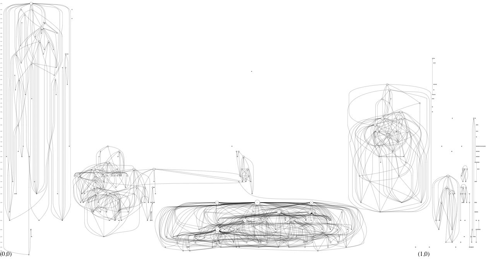

<!-- page 67 -->

**Figure 7.24:** Document co-citation network of FourNetSciResearchers with NWB Tool (left) and using CiteSpace II (right)

***7.8.3.2 Author Co-Occurrence (Co-Author) Network*** Figure 7.25 shows the CiteSpace rendering of the co-authorship network for the FourNetSciResearchers dataset using five 4-year time slices covering 1988-2007. In this network, the top10% of most occurred authors from each slice are selected. There are 249 nodes and 907 links in it. Compare to NWB rendering in section 7.6.2.1 Author Co- Occurrence (Co-Author) Network.

**Figure 7.25:** Co-authorship network of FourNetSciResearchers in CiteSpace II

***7.8.3.3 Word Co-Occurrence Network*** Figure 7.26 shows the CiteSpace rendering of the keywords (descriptors and identifiers) co-occurrence network for the FourNetSciResearchers dataset using ten 2-year time slices covering 1988-2007. The top 50% of the most often

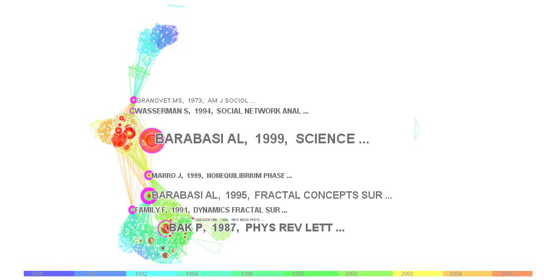

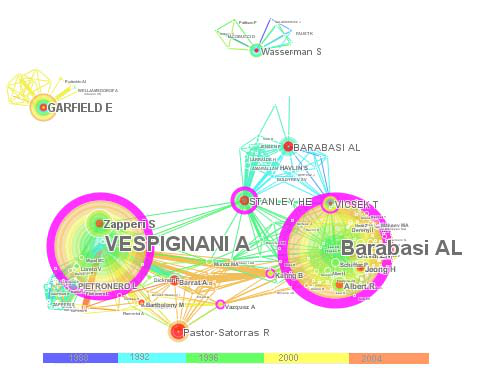

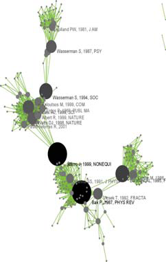

<!-- page 68 -->

occurring keywords from each slice are selected in the network which has 247 nodes and 830 links. Compare to NWB rendering in section 7.6.2.2 Word Co-Occurrence Network.

**Figure 7.26:** Keyword co-occurrence network of FourNetSciResearchers in CiteSpace II

***7.8.3.4 Burst Detection*** Burst detection using NWB Tool was discussed in section 7.3.2 Burst Detection.

**Figure 7.27:** Network of co-author’s institutions for “*FourNetSciResearchers*” with burst phrases in CiteSpace II

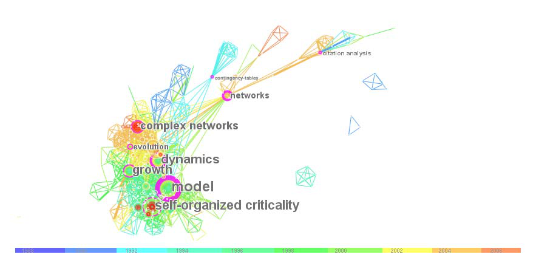

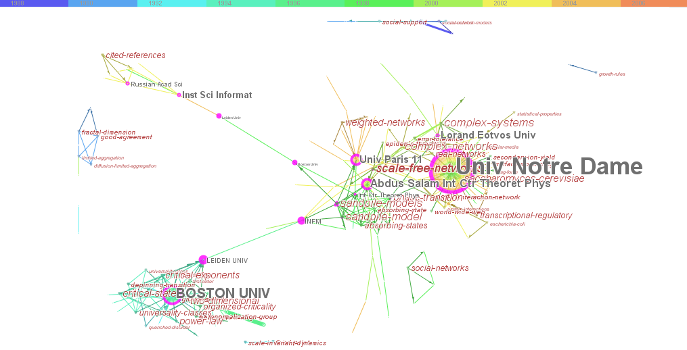

<!-- page 69 -->

#### 7.8.3.5 Comparison

*Supported Data Formats* NWB Tool supports GraphML (*.xml or*.graphml),XGMML (*.xml), Pajek .NET (*.net) , Pajek .Matrix (*.mat), NWB (*.nwb), TreeML (*.xml), Edge list (*.edge), CSV (*.csv), ISI (*.isi). CiteSpaceⅡ can load ISI export format. It also offers converters from SDSS, NSF, Scopus, and Derwent to WOS (ISI), Medline, see Table 7.5. **Table 7.5:** Network Workbench Tool vs. CiteSpaceⅡ **Function NWB Tool CiteSpace**Ⅱ **Data Extraction** ISI √ √ Scopus √ √ Google Scholar √ √ Medline √ NSF √ √ Citeseer √ √ Google Scholar √ **Network Derivation** Paper-Paper (Citation) Network √ Author-Paper (Consumed/Produced) Network √

Document Co-Citation Network √ √ Author Co-citation Network √ Journal Co-citation Network √ Co-authorship Network √ √ Network of Co-author’s institutions √ Network of Co-author’s countries √ Word Co-occurrence Network √ √ Subject Categories Co-occurrence Network √ Cited Reference Co-Occurrence (Bibliographic Coupling) Network √

**Burst detection** √ √ **Others** Cluster View √ √ Time Zone View √ Time slicing √ Pathfinder Network √ √ Detect Duplicate Nodes √ Merge Duplicate Nodes √ √ Betweenness Centrality √ √ Extract *K-*core √ Geospatial Maps √

***7.8.3.6 Visualizations*** CiteSpace II colors nodes and edges by time, e.g., In the co-citation network, papers by citation year, making it easy to observe the growth of a network over time, see the detailed explanation in Figure 7.28.

<!-- page 70 -->

**Figure 7.28:** Temporal reference system, size and color coding in Citespace II CiteSpace II highlights high betweenness centrality (BC) nodes, also called pivotal points, by purple circle borders. This can be replicated in NWB Tool by coloring all nodes above a certain BC threshold value. However, Citespace II can also show the nodes with red colors whose citation has a sharp increase in certain time slice. In Figure 7.24, some n odes are rather large and have a purple ring and red color. An example is “BARABASI AL,1999,SCIENCE,V286,P5909”. Using the function of ‘Citation History’ in Citespace II, the citation count history of this node can be plotted. Figure 7.29 shows that this very node not only has high betweenness, but also has the sharp increase on citation in certain time slices.

**Figure 7.29:** Citation History of Node “BARABASI AL,1999,SCIENCE,V286,P5909” In the given example, co-authorship networks generated using NWB Tool appear to be easier to read while CiteSpace II renders word co-citation networks in a more legible way. Citespace II also provide spectral clustering and expectation maximization clustering, see Figure 7.30.

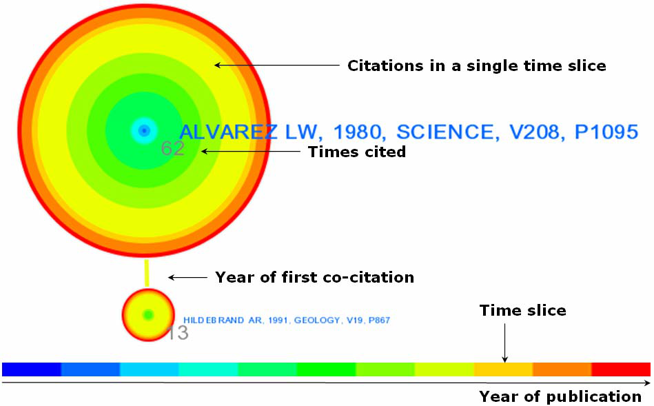

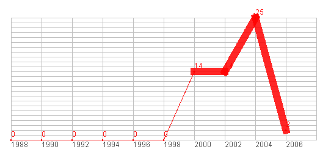

<!-- page 71 -->

**Figure 7.30:** Spectral clustering (left) and expectation (right) maximization clustering of document co-citation network of ‘*FourNetSciResearchers’*

*Network Extraction* A comparison of networks that are extracted by NWB Tool and CiteSpace II can be found in Table 7.5. As for word co-occurrence networks, NWB Tool can process the words from any data field but only from one field at a time. CiteSpace II can process words occurring in title, abstract, descriptors, and/or identifiers fields.

*Burst Detection* Both tools support burst detection for time stamped author names, journal names, country names, references, ISI keywords, or terms used in title and/or abstract of a paper. NWB can detect different types of burst according to the need of research. CiteSpace II can detect burst phrases form noun phrases or plain text and visualize them. It notes that Noun Phrases are identified using part-of-speech tagging. Plain text terms are identified by sliding-window term selector.

**7.8.4 Pajek by Vladimir Batagelj et al.** Please see the Sci2 Tool documentation at http://sci.slis.indiana.edu for a comparison with Pajek (http://pajek.imfm.si/doku.php) covering supporting network analysis and visualization.

**7.8.5 Software by Loet Leydesdorff** Leydesdorff’s software is a suite of programs with different analysis functions. It contains the analysis of coauthorship network, word co-occurrence network, international collaboration network, institute collaboration networks, etc. The results can be visualized using Pajek, Ucinet, or NWB. The software also includes *Acc2ISI.exe* for the reverse route of turning databases (exported from MS Access) into the “tagged” format of the Web-of- Science, *IntColl.EXE* for the analysis and visualization of international collaboration, *InstColl.Exe* for the analysis and visualization of institutional collaboration, *GScholar.Exe* for the organization of Google Scholar files into files for relational database management (MS Access, dBase) and *Google.Exe* for the organization of Google files into files for relational database management (MS Access, dBase). Simultaneously, some of them are available for Chinese, Korean and Dutch data.

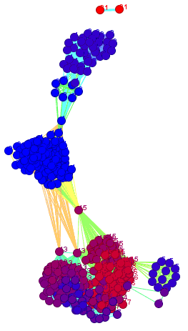

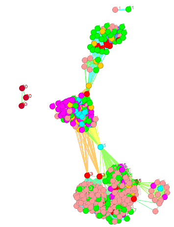

<!-- page 72 -->

Please see the Sci2 Tool documentation at http://sci.slis.indiana.edu for a detailed comparison with Leydesdorff software.

**Acknowledgements** Network Workbench investigators are Dr. Katy Börner, Dr. Albert-László Barabási, Dr. Santiago Schnell, Dr. Alessandro Vespignani, Dr. Stanley Wasserman, and Dr. Eric A. Wernert. The NWB project benefits from input by advisory board members Craig Alan Stewart, Noshir Contractor, James Hendler, Jason Leigh, Neo Martinez, Michael Macy, Ulrik Brandes, Mark Gerstein, Stephen North, and Tom Snijders. We acknowledge open source libraries and tools used, see sections 3.5 Supporting Libraries and 3.6 Integrated Tools for details. The Network Workbench and the Scholarly Database are supported in part by the 21st Century Fund, the James S. McDonnell Foundation, the National Science Foundation under grants IIS-0238261, IIS-0513650, SBE-0738111, the School of Library and Information Science, and the Cyberinfrastructure for Network Science Center at Indiana University. Any opinions, findings, and conclusions or recommendations expressed in this material are those of the author(s) and do not necessarily reflect the views of the National Science Foundation.

**References** Adar, Eytan. (2007). *Guess: The Graph Exploration System.* http://graphexploration.cond.org/ (accessed on 4/22/08). Alvarez-Hamelin, Ignacio, Luca Dall'Asta, Alain Barrat, Alessandro Vespignani. (2008). LaNet-vi.

http://xavier.informatics.indiana.edu/lanet-vi/ (accessed on 7/17/07). Anthonisse, J.M. (1971). *The rush in a directed graph*. Amsterdam, NL: Stichting Mathematisch Centrum. AT&T-Research-Group. (2008). *Graphviz-Graph Visualizaiton Software*. http://www.graphviz.org/Credits.php (accessed on 7/17/08). Auber, David (Ed.). (2003). *Tulip: A Huge Graph Visualisation Framework*. Berlin: Springer-Verlag. Barabási, A. L. (2002). *Linked: The New Science of Networks*. Cambridge, UK: Perseus. Barabási, A. L., R. Albert. (2002). Statistical mechanics of complex networks. *Reviews of Modern Physics, 74*, 47- 97. Barabási, A. L., Reka Albert. (1999). Emergence of scaling in random networks. *Science, 286*, 509-512. Batagelj, Vladimir, Ulrik Brandes. Efficient Generation of Large Random Networks. *Physical Review E 71*, 036113- 036118. http://www.inf.uni-konstanz.de/algo/publications/bb-eglrn-05.pdf (accessed on 8/31/2009). Batagelj, Vladimir, Andrej Mrvar. (1998). Pajek-Program for Large Network Analysis. *Connections, 21*(2), 47-57. Blondel, Vincent D., Jean-Loup Guillaume, Renaud Lambiotte, Etienne Lefebvre. (2008). *Fast unfolding of community hierarches in large networks*. http://arxiv.org/abs/0803.0476 (accessed on 7/17/08). Borgatti, S.P., M. G. Everett, L.C. Freeman. (2002). *Ucinet for Windows: Software for Social Network Analysis*.

http://www.analytictech.com/ucinet/ucinet_5_description.htm (accessed on 7/15/08). Borgman, C.L., J. Furner. (2002). Scholarly Communication and Bibliometrics. In B. Cronin & R. Shaw (Eds.), *Annual Review of Information Science and Technology*. Medford, NJ: Information Today, Inc./American Society for Information Science and Technology. Börner, Katy, Chaomei Chen, Kevin W. Boyack. (2003). Visualizing Knowledge Domains. In Blaise Cronin (Ed.), *Annual Review of Information Science & Technology (ARIST)* (Vol. 37, pp. 179-255). Börner, Katy, Shashikant Penumarthy, Mark Meiss, Weimao Ke. (2006). Mapping the Diffusion of Information Among Major U.S. Research Institutions. *Scientometrics: Dedicated issue on the 10th International Conference of the International Society for Scientometrics and Informetrics, 68*(3), 415-426. Börner, Katy, Soma Sanyal, Alessandro Vespignani. (2007). Network Science. In Blaise Cronin (Ed.), *Annual Review of Information Science & Technology* (Vol. 41, pp. 537-607). Medford, NJ: Information Today, Inc./American Society for Information Science and Technology. Bornmann, Lutz. (2006). *H Index: A New Measure to quantify the Research Output of Individual Scientists*.

http://www.forschungsinfo.de/iq/agora/H_Index/h_index.asp (accessed on 7/17/08). Bosman, Jeroen, Ineke van Mourik, Menno Rasch, Eric Sieverts, Huib Verhoeff. (2006). Scopus Reviewed and Compared: The Coverage and Functionality of the Citation Database Scopus, Including Comparisons with Web of Science and Google Scholar. *Utrecht University Library*. Brandes, Ulrik. (2001). A Faster Algorithm for Betweeness Centrality. *Journal of Mathematical Sociology, 25*(2), 163-177.

<!-- page 73 -->

Brandes, Ulrik, Dorothea Wagner. (2008). *Analysis and Visualization of Social Networks*. http://visone.info/ (accessed on 7/15/08). Brin, S., L. Page. (1998). *The Anatomy of a Large-Scale Hypertextual Web Search Engine.* Paper presented at the Proceedings of the Seventh International Conference on World Wide Web 7, Brisbane, Australia, pp. 107- 117. Callon, M., J.P. Courtial, W. Turner, S. Bauin. (1983). From Translations to Problematic Networks: An Introduction to Co-Word Analysis. *Social Science Information 22*, 191-235. Callon, M., J. Law, A. Rip (Eds.). (1986). *Mapping the Dynamics of Science and Technology*. London: Macmillan. Carrington, P., J. Scott, S. Wasserman. (2005). *Models and Methods in Social Network Analysis*. New York: Cambridge University Press. Chen, Chaomei. (1999). Visualizing semantic spaces and author co-citation networks in digital libraries. *Information Processing and Management, 35*(3), 401-420. Chen, Chaomei. (2006). CiteSpace II: Detecting and Visualizing Emerging Trends and Transient patterns in Scientific Literature. *JASIST, 54*(5), 359-377. Cisco Systems, Inc. (2004). *Network Analysis Toolkit*.

http://www.cisco.com/univercd/cc/td/doc/product/natkit/index.htm (accessed on 7/15/08). Csárdi, Gábor, Tamás Nepusz. (2006). *The igraph software package for complex network research*.

http://necsi.org/events/iccs6/papers/c1602a3c126ba822d0bc4293371c.pdf (accessed on 7/17/08). Cyberinfrastructure for Network Science Center. (2008). Cyberinfrastructure Shell. http://cishell.org/ (accessed on 7/17/08). Cytoscape-Consortium. (2008). *Cytoscape*. http://www.cytoscape.org/index.php (accessed on 7/15/08). Davidson, G. S., B. N. Wylie, Kevin W. Boyack. (2001). Cluster Stability and the Use of Noise in Interpretation of Clustering, *IEEE Information Visualization* (pp. 23-30). San Diego, CA: IEEE Computer Society. de Moya-Anegón, Felix, Zaida Chinchilla-Rodriquez, Benjamin Vargas-Quesada, Elena Corera-Álvarez, Francisco José Munoz-Fernández, Antonio González-Molina, Victor Herrero-Solanao. (2007). Coverage Analysis of Scopus: A Journal Metric Approach. *Scientometrics, 73*(1), 53-78. De Roure, D., C. Goble, R. Stevens. (2009). The Design and Realisation of the myExperiment Virtual Reserach Environment for Social Sharing of Workflows. *Future Generation Computer Systems, 25*, 561-567. http://eprints.ecs.soton.ac.uk/15709/ (accessed on 6/22/2009). Deerwester, S., S.T. Dumais, G.W. Furnas, T.K. Landauer, R. Harshman. (1990). Indexing by Latent Semantic Analysis. *Journal of the American Society for Information Science 41*, 391-407. Ding, Ying , Erija Yan, Arthur Frazho, James Caverlee. (2009). PageRank for Ranking Authors in Co-Citation Networks. *Journal of the American Society for Information Science and Technology, 9999*(9999), 1-15. Elnashai, Amr, Bill Spencer, Jim Myers, Terry McLaren, Shawn Hampton, Jong Sung Lee, Chris Navarro, Nathan Tolbert. (2008). Architectural Overview of MAEviz - HAZTURK. *Journal of Earthquake Engineering, 12*(S2), 92-99. Erdős, P., A. Rényi. (1959). On Random Graphs I. *Publicationes Mathematicae Debrecen, 6*, 290-297. Feder, Alexander. (2006). *BibTeX.org: Your BibTeX resource*. http://www.bibtex.org/ (accessed on 7/15/08). Fekete, Jean-Daniel, Katy Börner-chairs (Eds.). (2004). *Workshop on Information Visualization Software Infrastructures*. Austin, Texas. Fingerman, Susan. (2006). Electronic Resources Reviews: Web of Science and Scopus: Current Features and Capabilities. *Issues in Science and Technology Librarianship, Fall*. http://www.istl.org/06- fall/electronic2.html (accessed on 9/23/08). Freeman, L.C. (1977). A set of measuring centrality based on betweenness. *Sociometry, 40*, 35-41. Garfield, Eugene. (2008). HistCite: Bibliometric Analysis and Visualization Software (Version 8.5.26). Bala Cynwyd, PA: HistCite Software LLC. http://www.histcite.com/ (accessed on 7/15/08). Gilbert, E.N. (1959). Random Graphs. *Ann. Math Stat., 30*, 1141. Girvan, M., M.E.J. Newman. (2002). Community Structure in Social and Biological networks. *PNAS, 99*, 7821-7826. Granovetter, Mark. (1973). The Strength of Weak Ties. *American Journal of Sociology, 78*, 1360-1380. Griffiths, Thomas L., Mark Steyvers. (2002). A Probabilistic Approach to Semantic Representation, *Proceedings of the 24th Annual Conference of the Cognitive Science Society*. Fairfax, VA. Harzing, Anne-Wil. (2008). *Publish or Perish: A citation analysis software program.* .

http://www.harzing.com/resources.htm. (accessed on 4/22/08). Heer, Jeffrey, Stuart K. Card, James A. Landay. (2005). *Prefuse: A toolkit for interactive information visualization.* Paper presented at the Conference on Human Factors in Computing Systems, Portland, OR: New York: ACM Press, pp. 421-430.

<!-- page 74 -->

Herr II, Bruce W., Weixia (Bonnie) Huang, Shashikant Penumarthy, Katy Börner. (2007). Designing Highly Flexible and Usable Cyberinfrastrucutres for Convergence. In William S. Bainbridge & Mihail C. Roco (Eds.), *Progess in Convergence: Technologies for Human Wellbeing* (Vol. 1093, pp. 161-179). Boston, MA: Annals of the New York Academy of Sciences. Huang, Weixia (Bonnie), Bruce Herr, Russell Duhon, Katy Börner. (2007.). *Network Workbench--Using Service- Oriented Architecture and Component-Based Development to Build a Tool for Network Scientists.* Paper presented at the International Workshop and Conference on Network Science. Hull, Duncan, Katy Wolstencroft, Robert Stevens, Carole Goble, Mathew R. Pocock, Peter Li, Tom Oinn. (2006). Taverna: A Tool for Building and Running Workflows of Services. *Nucleic Acids Research, 34*(Web Server Issue), W729-W732. http://nar.oxfordjournals.org/cgi/content/abstract/34/suppl_2/W729 (accessed on 6/22/2009). Ihaka, Ross, Robert Gentleman. (1996). R: A language for data analysis and graphics. *Journal of Computational and Graphical Statistics, 5*(3), 299-314. http://www.amstat.org/publications/jcgs/ (accessed on 7/17/08). Jaro, M. A. (1989). Advances in record linking methodology as applied to the 1985 census of Tampa Florida. *Journal of the American Statistical Society, 64*, 1183-1210. Jaro, M. A. (1995). Probabilistic linkage of large public health data file. *Statistics in Medicine, 14*, 491-498. Johnson, Brian, Ben Schneiderman. (1991, October 22-25). *Tree-Maps: A Space-Filling Approach to the Visualization of Hierarchical Information Structures.* Paper presented at the 2nd International IEEE Visualization Conference, San Diego, CA, pp. 284-291. Kampis, G., L. Gulyas, Z. Szaszi, Z. Szakolczi. (2009). Dynamic Social Networks and the TEXTrend / CIShell Framework, *Applications of Social Network Analysis*. University of Zurich: ETH Zurich. Kessler, Michael M. (1963). Bibliographic coupling between scientific papers. *American Documentation, 14*(1), 10- 25. Kleinberg, J. M. (1999). Authoritative sources in a hyperlinked environment. *Journal of ACM, 46*(5), 604-632. Kleinberg, J. M. (2002). *Bursty and Hierarchical Structure in Streams.* Paper presented at the 8th ACMSIGKDD International Conference on Knowledge Discovery and Data Mining: ACM Press, pp. 91-101. Kohonen, Tuevo. (1995). *Self-Organizing Maps*. Berlin: Springer. Kraak, Menno-Jan, Ferjan Ormeling. (1987). Cartography: Visualization of Spatial Data. Delft, NL: Delft University Press. Krebs, Valdis. (2008). *Orgnet.com: Software for Social Network Analysis and Organizational Network Analysis*.

http://www.orgnet.com/inflow3.html (accessed Kruskal, J.B. (1964). Multidimensional Scaling: A Numerical method. *Psychometrica, 29*, 115-129. Landauer, T. K., P. W. Foltz, D. Laham. (1998). Introduction to Latent Semantic Analysis. *Discourse Processes, 25*, 259-284. Landauer, T.K., S. T. Dumais. (1997). A Solution to Plato's Problem: The Latent Semantic Analysis Theory of the Acquisition, Induction and Representation of Knowledge. *Psychological Review, 104*, 211-240. Lenoir, Timothy. (2002). Quantitative Foundations for the Sociology of Science: On Linking Blockmodeling with Co-Citation Analysis. In John Scott (Ed.), *Social Networks: Critical Concepts in Sociology*. New York: Routledge. Leydesdorff, Loet. (2008). *Software and Data of Loet Leydesdorff*. http://users.fmg.uva.nl/lleydesdorff/software.htm (accessed on 7/15/2008). Leydesdorff, Loet. (2009). How are new citation-based journal indicators adding to the bibliometric toolbox? *Journal of the Amercian Society for Information Science & Technology, 60*(7), 1327-1336. http://users.fmg.uva.nl/lleydesdorff/journal_indicators/ (accessed on 8/31/2009). Marshakova, I.V. (1973.). Co-Citation in Scientific Literature: A New Measure of the Relationship Between Publications.". *Scientific and Technical Information Serial of VINITI, 6*, 3-8. Martin, S., W. M. Brown, K.W. Boyack. (in preparation). DrL: Distributed Recursive (Graph) Layout. *Journal of Graph Algorithms and Applications*. Meho, Lokman I., Kiduk Yang. (2007). Impact of Data sources on Citation Counts and Rankings of LIS Faculty: Web of Science versus Scopus and Google Scholar. *Journal of the American Society for Information Science and Technology, 58*(13), 2105-2125. http://www3.interscience.wiley.com/cgi- bin/fulltext/116311060/PDFSTART (accessed on 9/23/08). Monge, P.R., N. Contractor. (2003). *Theories of Communication Networks*. New York: Oxford University Press. Narin, F. , J.K. Moll. (1977). Bibliometrics. *Annual Review of Information Science and Technology, 12*, 35-38. Nicolaisen, Jeppe. (2007). Citation Analysis. In Blaise Cronin (Ed.), *Annual Review of Information Science and Technology* (Vol. 41, pp. 609-641). Medford, NJ: Information Today, Inc.

<!-- page 75 -->

Nisonger, T.E. (2004). Citation Autobiography: An Investigation of ISI Datbase Coverage in Determining Author Citedness. *College & Research Libraries, 65*(2), 152-163. O'Madadhain, Joshua, Danyel Fisher, Tom Nelson. (2008). *Jung: Java Universal Network/Graph Framework*. University of California, Irvine. http://jung.sourceforge.net/ (accessed OSGi-Alliance. (2008). *OSGi Alliance*. http://www.osgi.org/Main/HomePage (accessed on 7/15/08). Pauly, Daniel, Konstantinos I. Stergiou. (2005). Equivalence of Results from two Citation Analyses: Thomson ISI's Citation Indx and Google Scholar's Service. *Ethics in Science and Environmental Politics, 2005*, 33-35. Persson, Olle. (2008). Bibexcel. Umeå, Sweden: Umeå University. http://www.umu.se/inforsk/Bibexcel/ (accessed on 7/15/08). Porter, M.F. (1980). An Algorithm for Suffix Stripping. *Program, 14*(3), 130-137.

http://tartarus.org/~martin/PorterStemmer/def.txt (accessed on 9/23/08). Reichardt, Jorg, Stefan Bornholdt. (2004). Detecting Fuzzy Community Structure in Complex Networks with a Potts Model. *Physical Review Letters, 93*(21), 218701. Salton, Gerard, C.S. Yang. (1973). On the Specification of Term Values in Automatic Indexing. *Journal of Documentation, 29*, 351-372. Schvaneveldt, R. (Ed.). (1990). *Pathfinder Associative Networks: Studies in Knowledge Organization*. Norwood, NJ: Ablex Publishing. Schvaneveldt, R.W., F.T. Durso, D.W. Dearholt. (1985). *Pathfinder: Scaling with network structures* (MCCS-85). Scott, J. P. (2000). *Social Network Analysis: A Handbook*. London: Sage Publications. Shannon, P., A. Markiel, O. Ozier, N.S. Baliga, J.T. Wang, D. Ramage, N. Amin, B. Schwikowski, T. Ideker. (2002). Cytoscape: a software environment for integrates models of biomolecular interaction networks. *Genome Research, 13*(11), 2498-2504. Siek, Jeremy, Lie-Quan Lee, Andrew Lumsdaine. (2002). *The Boost Graph Library: User Guid and Reference Manual*. New York: Addison-Wesley. Skupin, André. (2000). From Metaphor to Method: Cartographic Perspectives on Information Visualization. *Proceedings of InfoVis 2000*, 91-97. Small, Henry. (1973). Co-Citation in Scientific Literature: A New Measure of the Relationship Between Publications. *JASIS, 24*, 265-269. Small, Henry G., E. Greenlee. (1986). Collagen Research in the 1970's *Scientometrics, 10*, 95-117. Takatsuka, M., M. Gahegan. (2002). GeoVISTA Studio: A Codeless Visual Programming Environment for Geoscientific Data Analysis and Visualization. *The Journal of Computers & Geosciences, 28*(10), 1131- 1144. The-Thomson-Corporation. (2008). *Reference Manager*on 7/15/08). Thelwall, M., L. Vaughan, L. Björneborn. (2005). Webometrics. In Blaise Cronin (Ed.), *Annual Review of Information Science and Technology* (Vol. 39, pp. 179-255). Medford, NJ: Information Today, Inc./American Society for Information Science and Technology. Thomson-Reuters. (2008a). *Endnote*. http://www.endnote.com/encopyright.asp (accessed on 7/15/08). Thomson-Reuters. (2008b). *Web of Science*. http://scientific.thomsonreuters.com/products/wos/ (accessed on 7/17/08). Tobler, Waldo R. (1973). A Continuous Transformation Useful for Districting. *Science, 219*, 215-220. Töpfer, F. (1974). *Kartographische Generalisierung*. Gotha/Leipzig: VEB Herrmann Haack/Geographisch- Kartographische Anstalt. Töpfer, F., W. Pillewizer. (1966). The Principles of Selection. *Cartographic Journal, 3*, 10-16. Wasserman, S., K. Faust. (1994). *Social network Analysis: Methods and Applications*. New York: Cambridge University Press. Watts, D. J., S.H. Strogatz. (1998). Collective dynamics of "small-world" networks. *Nature, 393*, 440-442. Wellman, B, Howard D. White, N. Nazer. (2004). Does Citation Reflect Social Structure? Longitudinal Evidence from the "Globenet" Interdisciplinary Research Group. *JASIST, 55*, 111-126. White, Howard D., Katherine W. McCain. (1998). Visualizing a Discipline: An Author Co-Citation Analysis of Information Science, 1972-1995. *Journal of the American Society for Information Science, 49*(4), 327-355. Wikimedia Foundation, Inc. (2009). *PageRank*. http://en.wikipedia.org/wiki/PageRank (accessed on 8/31/2009). Wikimedia Foundation, Inc. (2009). *Poisson Distribution*. http://en.wikipedia.org/wiki/Poisson_distribution (accessed on 8/31/2009). Williams, Thomas, Colin Kelley. (2008). *gnuplot homepage*. http://www.gnuplot.info/ (accessed on 7/17/08).

<!-- page 76 -->

Wilson, C.S. (2001). Informetrics. In M.E. Williams (Ed.), *Annual Review of Information Science and Technology* (Vol. 37, pp. 107-286). Medford, NJ: Information Today, Inc./American Society for Information Science and Technology. **License** The Network Workbench Tool (NWB Tool) is licensed under the Apache License, Version 2.0 (the "License"). You may obtain a copy of the License at: http://www.apache.org/licenses/LICENSE-2.0. Unless required by applicable law or agreed to in writing, software distributed under the License is distributed on an "AS IS" BASIS, WITHOUT WARRANTIES OR CONDITIONS OF ANY KIND, either express or implied. See the License for the specific language governing permissions and limitations under the License.

<!-- page 77 -->

