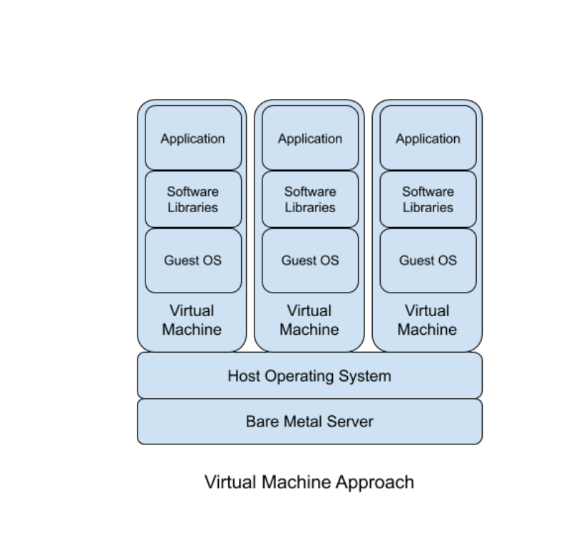
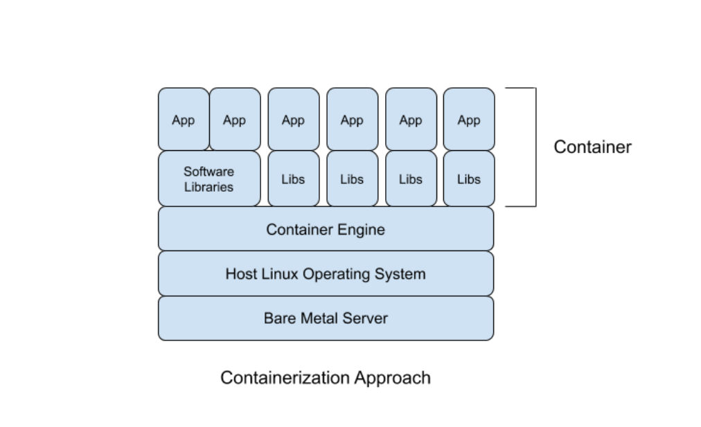
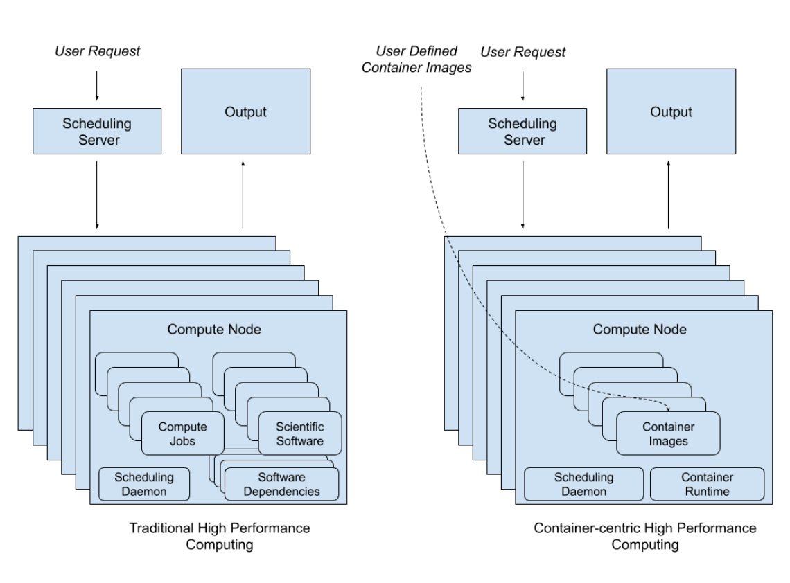
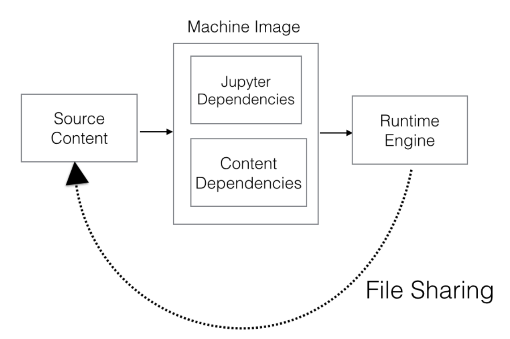
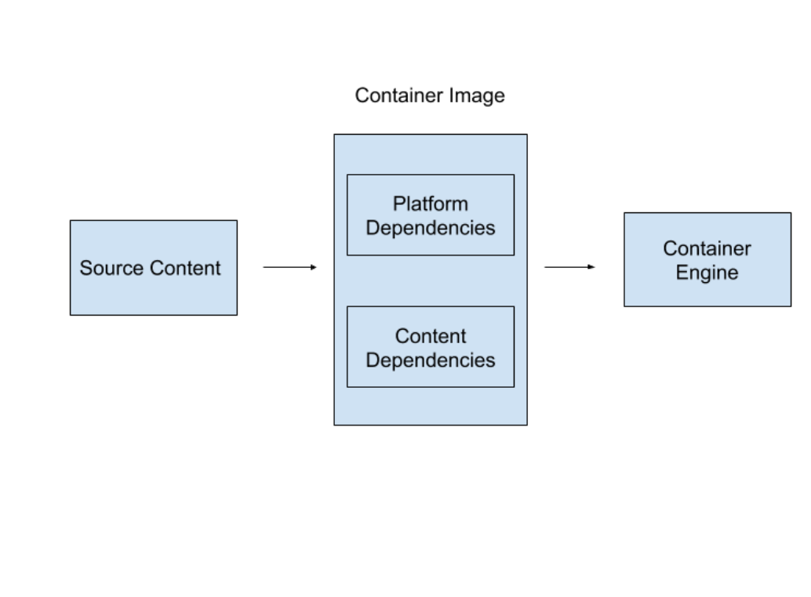

# Digits

*Two Reports on New Units of Scholarly Publication*

*Matt Burton*

UNIVERSITY OF PITTSBURGH

*Matthew J. Lavin*

UNIVERSITY OF PITTSBURGH

*Jessica Otis*

GEORGE MASON UNIVERSITY

*Scott B. Weingart*

CARNEGIE MELLON UNIVERSITY[^1]

Journal of Electronic Publishing

[Volume 22,](https://quod.lib.umich.edu/j/jep/3336451.0022?rgn=main;view=fulltext) [Issue 1](https://quod.lib.umich.edu/j/jep/3336451.0022.1*?rgn=main;view=fulltext), 2019

DOI: https://doi.org/10.3998/3336451.0022.105 [https://doi.org/10.3998/3336451.0022.105]

[http://creativecommons.org/licenses/by/4.0/]

## Table of Contents

- [Table of Contents](https://quod.lib.umich.edu/j/jep/3336451.0022.105/--digits-two-reports-on-new-units-of-scholarly-publication?trgt=p_s78359zep7kg;view=fulltext#p_s78359zep7kg)
- [Introduction](https://quod.lib.umich.edu/j/jep/3336451.0022.105/--digits-two-reports-on-new-units-of-scholarly-publication?trgt=p_39vso4qxqqhs;view=fulltext#p_39vso4qxqqhs)
- [A New Unit of Publication](https://quod.lib.umich.edu/j/jep/3336451.0022.105/--digits-two-reports-on-new-units-of-scholarly-publication?trgt=p_zfwr8jh9689g;view=fulltext#p_zfwr8jh9689g)
  - [Technical Background](https://quod.lib.umich.edu/j/jep/3336451.0022.105/--digits-two-reports-on-new-units-of-scholarly-publication?trgt=p_fcy5sf9cogom;view=fulltext#p_fcy5sf9cogom)
    - [What are Containers?](https://quod.lib.umich.edu/j/jep/3336451.0022.105/--digits-two-reports-on-new-units-of-scholarly-publication?trgt=p_tx2znfsc3hya;view=fulltext#p_tx2znfsc3hya)
      - [Containers vs. Virtual Machines](https://quod.lib.umich.edu/j/jep/3336451.0022.105/--digits-two-reports-on-new-units-of-scholarly-publication?trgt=p_ngqn26f4dk68;view=fulltext#p_ngqn26f4dk68)
      - [Container Technologies](https://quod.lib.umich.edu/j/jep/3336451.0022.105/--digits-two-reports-on-new-units-of-scholarly-publication?trgt=p_scg9b8las243;view=fulltext#p_scg9b8las243)
      - [Orchestration](https://quod.lib.umich.edu/j/jep/3336451.0022.105/--digits-two-reports-on-new-units-of-scholarly-publication?trgt=p_mpp2sbeamoyh;view=fulltext#p_mpp2sbeamoyh)
    - [The Significance of Containers](https://quod.lib.umich.edu/j/jep/3336451.0022.105/--digits-two-reports-on-new-units-of-scholarly-publication?trgt=p_24k6wleo0wjo;view=fulltext#p_24k6wleo0wjo)
  - [Container use in Academia](https://quod.lib.umich.edu/j/jep/3336451.0022.105/--digits-two-reports-on-new-units-of-scholarly-publication?trgt=p_mncs0swgaqnl;view=fulltext#p_mncs0swgaqnl)
    - [Containers for Software Dependency Management](https://quod.lib.umich.edu/j/jep/3336451.0022.105/--digits-two-reports-on-new-units-of-scholarly-publication?trgt=p_1a1v8l62i5g1;view=fulltext#p_1a1v8l62i5g1)
    - [Containers for Reproducible Research](https://quod.lib.umich.edu/j/jep/3336451.0022.105/--digits-two-reports-on-new-units-of-scholarly-publication?trgt=p_4i2ozwfj309h;view=fulltext#p_4i2ozwfj309h)
    - [Containers for Preservation](https://quod.lib.umich.edu/j/jep/3336451.0022.105/--digits-two-reports-on-new-units-of-scholarly-publication?trgt=p_yzfyrh4fz14a;view=fulltext#p_yzfyrh4fz14a)
  - [Full-Stack Scholarship](https://quod.lib.umich.edu/j/jep/3336451.0022.105/--digits-two-reports-on-new-units-of-scholarly-publication?trgt=p_rztoqzq94k81;view=fulltext#p_rztoqzq94k81)
  - [Conclusion: Containers for Digital Scholarship](https://quod.lib.umich.edu/j/jep/3336451.0022.105/--digits-two-reports-on-new-units-of-scholarly-publication?trgt=p_93ua53p9r0k9;view=fulltext#p_93ua53p9r0k9)
  - [Bibliography](https://quod.lib.umich.edu/j/jep/3336451.0022.105/--digits-two-reports-on-new-units-of-scholarly-publication?trgt=p_ikigdabqqdg4;view=fulltext#p_ikigdabqqdg4)
- [New Scholarship in the Digital Age](https://quod.lib.umich.edu/j/jep/3336451.0022.105/--digits-two-reports-on-new-units-of-scholarly-publication?trgt=p_gjdgxs;view=fulltext#p_gjdgxs)
  - [Introduction](https://quod.lib.umich.edu/j/jep/3336451.0022.105/--digits-two-reports-on-new-units-of-scholarly-publication?trgt=p_z7q4ehpt2xja;view=fulltext#p_z7q4ehpt2xja)
    - [Data Collection](https://quod.lib.umich.edu/j/jep/3336451.0022.105/--digits-two-reports-on-new-units-of-scholarly-publication?trgt=p_csicnzl741f0;view=fulltext#p_csicnzl741f0)
    - [The Problems of Non-Traditional Scholarly Objects](https://quod.lib.umich.edu/j/jep/3336451.0022.105/--digits-two-reports-on-new-units-of-scholarly-publication?trgt=p_3esq0m6olpg9;view=fulltext#p_3esq0m6olpg9)
    - [Recommendations for Future Intervention](https://quod.lib.umich.edu/j/jep/3336451.0022.105/--digits-two-reports-on-new-units-of-scholarly-publication?trgt=p_4xpjiqx49avn;view=fulltext#p_4xpjiqx49avn)
  - [Report on Interviews and Recommendations](https://quod.lib.umich.edu/j/jep/3336451.0022.105/--digits-two-reports-on-new-units-of-scholarly-publication?trgt=p_3dy6vkm;view=fulltext#p_3dy6vkm)
    - [Challenges Making Non-Traditional Scholarly Objects](https://quod.lib.umich.edu/j/jep/3336451.0022.105/--digits-two-reports-on-new-units-of-scholarly-publication?trgt=p_1t5csth4ihn6;view=fulltext#p_1t5csth4ihn6)
      - [Collaborative Production](https://quod.lib.umich.edu/j/jep/3336451.0022.105/--digits-two-reports-on-new-units-of-scholarly-publication?trgt=p_ts80046ymhqm;view=fulltext#p_ts80046ymhqm)
      - [Sociotechnical Challenges and Limitations](https://quod.lib.umich.edu/j/jep/3336451.0022.105/--digits-two-reports-on-new-units-of-scholarly-publication?trgt=p_4d34og8;view=fulltext#p_4d34og8)
      - [Funding](https://quod.lib.umich.edu/j/jep/3336451.0022.105/--digits-two-reports-on-new-units-of-scholarly-publication?trgt=p_17dp8vu;view=fulltext#p_17dp8vu)
      - [Copyright and sensitive data](https://quod.lib.umich.edu/j/jep/3336451.0022.105/--digits-two-reports-on-new-units-of-scholarly-publication?trgt=p_3rdcrjn;view=fulltext#p_3rdcrjn)
      - [Credit models](https://quod.lib.umich.edu/j/jep/3336451.0022.105/--digits-two-reports-on-new-units-of-scholarly-publication?trgt=p_lnxbz9;view=fulltext#p_lnxbz9)
    - [Challenges Publishing Non-Traditional Scholarly Objects](https://quod.lib.umich.edu/j/jep/3336451.0022.105/--digits-two-reports-on-new-units-of-scholarly-publication?trgt=p_35nkun2;view=fulltext#p_35nkun2)
      - [Peer review](https://quod.lib.umich.edu/j/jep/3336451.0022.105/--digits-two-reports-on-new-units-of-scholarly-publication?trgt=p_44sinio;view=fulltext#p_44sinio)
      - [Prestige](https://quod.lib.umich.edu/j/jep/3336451.0022.105/--digits-two-reports-on-new-units-of-scholarly-publication?trgt=p_2jxsxqh;view=fulltext#p_2jxsxqh)
      - [Alternative Audiences](https://quod.lib.umich.edu/j/jep/3336451.0022.105/--digits-two-reports-on-new-units-of-scholarly-publication?trgt=p_cpo3pnpam6ne;view=fulltext#p_cpo3pnpam6ne)
      - [Discoverability and access](https://quod.lib.umich.edu/j/jep/3336451.0022.105/--digits-two-reports-on-new-units-of-scholarly-publication?trgt=p_giir63pz88qt;view=fulltext#p_giir63pz88qt)
      - [Financial models and licensing](https://quod.lib.umich.edu/j/jep/3336451.0022.105/--digits-two-reports-on-new-units-of-scholarly-publication?trgt=p_q2d1d7u0cqix;view=fulltext#p_q2d1d7u0cqix)
    - [Challenges Maintaining Non-Traditional Scholarly Objects](https://quod.lib.umich.edu/j/jep/3336451.0022.105/--digits-two-reports-on-new-units-of-scholarly-publication?trgt=p_b7pkievqjylv;view=fulltext#p_b7pkievqjylv)
      - [Disparate notions of maintenance](https://quod.lib.umich.edu/j/jep/3336451.0022.105/--digits-two-reports-on-new-units-of-scholarly-publication?trgt=p_ino1thccaien;view=fulltext#p_ino1thccaien)
      - [Legacy Projects](https://quod.lib.umich.edu/j/jep/3336451.0022.105/--digits-two-reports-on-new-units-of-scholarly-publication?trgt=p_2xcytpi;view=fulltext#p_2xcytpi)
      - [Technical and personnel resources](https://quod.lib.umich.edu/j/jep/3336451.0022.105/--digits-two-reports-on-new-units-of-scholarly-publication?trgt=p_1ci93xb;view=fulltext#p_1ci93xb)
      - [Cost Models](https://quod.lib.umich.edu/j/jep/3336451.0022.105/--digits-two-reports-on-new-units-of-scholarly-publication?trgt=p_gi8jfc9sd0j;view=fulltext#p_gi8jfc9sd0j)
    - [Challenges Preserving Non-Traditional Scholarly Objects](https://quod.lib.umich.edu/j/jep/3336451.0022.105/--digits-two-reports-on-new-units-of-scholarly-publication?trgt=p_1635aq4jo1qq;view=fulltext#p_1635aq4jo1qq)
      - [Preservable outputs](https://quod.lib.umich.edu/j/jep/3336451.0022.105/--digits-two-reports-on-new-units-of-scholarly-publication?trgt=p_qsh70q;view=fulltext#p_qsh70q)
      - [Purpose of Preservation](https://quod.lib.umich.edu/j/jep/3336451.0022.105/--digits-two-reports-on-new-units-of-scholarly-publication?trgt=p_m7j5wlqqwvfh;view=fulltext#p_m7j5wlqqwvfh)
      - [When to preserve](https://quod.lib.umich.edu/j/jep/3336451.0022.105/--digits-two-reports-on-new-units-of-scholarly-publication?trgt=p_3as4poj;view=fulltext#p_3as4poj)
      - [Continuing to Institutionalize Preservation](https://quod.lib.umich.edu/j/jep/3336451.0022.105/--digits-two-reports-on-new-units-of-scholarly-publication?trgt=p_1pxezwc;view=fulltext#p_1pxezwc)
      - [Technical resources](https://quod.lib.umich.edu/j/jep/3336451.0022.105/--digits-two-reports-on-new-units-of-scholarly-publication?trgt=p_wsuh8depk846;view=fulltext#p_wsuh8depk846)
  - [Conclusion & Looking Forward](https://quod.lib.umich.edu/j/jep/3336451.0022.105/--digits-two-reports-on-new-units-of-scholarly-publication?trgt=p_5rizygapbzke;view=fulltext#p_5rizygapbzke)
  - [Bibliography](https://quod.lib.umich.edu/j/jep/3336451.0022.105/--digits-two-reports-on-new-units-of-scholarly-publication?trgt=p_2j28i9ci6p06;view=fulltext#p_2j28i9ci6p06)
- [Appendix A: Interview Protocol](https://quod.lib.umich.edu/j/jep/3336451.0022.105/--digits-two-reports-on-new-units-of-scholarly-publication?trgt=p_gwudyy8dal0j;view=fulltext#p_gwudyy8dal0j)
- [Appendix B: Commonly Referenced Technologies](https://quod.lib.umich.edu/j/jep/3336451.0022.105/--digits-two-reports-on-new-units-of-scholarly-publication?trgt=p_23ckvvd;view=fulltext#p_23ckvvd) <!-- page 1 --> <!-- page 2 --> <!-- page 3 -->

## Introduction

The *Digits* team (Matt Burton, Matthew J. Lavin, Jessica Otis, and Scott B. Weingart) convened around the question of how we might share, preserve, and legitimize scholarship freed from the affordances of print. For the A.W. Mellon-funded *Digits Planning Grant* (2016-2018), the PIs had three goals:

1. Investigate the use of software containers for research in the sciences, social sciences, and humanities.

2. Assess the infrastructural needs of digital humanists around publishing and preserving web-centric scholarship.

3. Gather a team of experts to guide the above activities and plan how they might inform a beneficial intervention into the scholarly ecosystem.

Through our investigation into the scholarly uses of containers, we discovered that the technical infrastructure needed to connect containers with digital publications is underdeveloped. We see potential for container technologies to facilitate existing digital scholarly publications and afford new forms of computational scholarship, but this process would first require a series of infrastructural bridges. The digital scholarship needs assessment we conducted, as well as our advisory board meetings, made it clear that a targeted technological intervention alone would not be enough to welcome web-first publications into the scholarly ecosystem; in-tandem cultural and institutional changes are also necessary.

The first and second of our three tasks resulted in the two reports that comprise this article. The first report, *A New Unit of Publication: The potential of software containers for digital scholarship*, involved an environmental and secondary source scan of activities at the intersection containerization and scholarship. The second report, *New Scholarship in the Digital Age: Making, publishing, maintaining, and preserving non-traditional scholarly objects*, summarizes 75 interviews of scholars, technicians, publishers, and others who work towards the publication of digital-first scholarship.

Both reports were presented to the *Digits* advisory board, including Laurie Allen (Penn), Lauren Brumfield (Reclaim Hosting), Dan Cohen (Northeastern), Dan Evans (CMU), Martin Paul Eve (Birkbeck College, London), Ilya Kreymer (Rhizome), Alison Langmead (Pitt), Sharon Leon (MSU), David Newbury (Getty), Andrew Odewahn (O’Reilly Media), Mary Shaw (CMU), Ammon Shepherd (UVA), Ed Summers (UMD), Whitney Trettien (Penn), Amanda Visconti (UVA), Keith Webster (CMU), and David Wilkinson (Pitt).

Several lessons became apparent over the course of the grant period.

Our container study revealed myriad use-cases of containers in academia that are research oriented. Container adoption is much wider in the sciences than in the humanities, especially for dependency management and reproducibility.

Our findings also suggest that containers are used in teaching, but we didn’t fully investigate this topic. Lastly, we found few if any efforts focusing specifically on containers as a unit of scholarly publication at the time of conducting our research. In the past several years, however, some additional examples have arisen or come to our attention, including Binder and NextJournal.

Commenting on the use of a software container as a unit of scholarly publication, the advisory board stressed the importance of starting with templates or examples when creating digital platforms, of making working prototypes before over-theorizing, and of creating a platform that fits easily within the current publication ecosystem. The board further suggested a project on the long-term costs associated with creating, hosting, and maintaining digital scholarly objects would be critically useful to efforts in this space moving forward.

The first advisory board meeting settled on four important elements that a container-based intervention would need to encompass to be successful: setting **specifications**, creating a **production environment**, facilitating a **publication platform**, and designing with **preservation** as a top priority. <!-- page 4 -->

Our DH infrastructure study reinforced our sense of how many factors impede digital scholarship, as well as how deeply these impediments run. The diverse ecosystem around digital publications adds friction to their existence at every stage of their lifecycle, particularly at points where a digital object is transferred from one party to another. After conducting our study, we concluded that the best way to solve the identified problems would be to target every stage of the digital scholarly workflow in concert. Although these interventions, ideally, would occur all at once, various piecemeal interventions could radically improve the ability of scholars to create, publish, preserve, and receive recognition for their digital work. Some of the interventions we discuss are technical, but at least as many are entirely social. Even where technical solutions are to be found, implementing them will require scholarly buy-in and a willingness to adapt existing scholarly practices.

The second advisory board meeting echoed the findings of the infrastructure report, and additionally offered some next steps:

1. Constructing the technology and standards for a self-contained digital scholarly object.

2. Developing plugins for pre-existing authorship, publication, and preservation platforms to allow for the easy transfer of complex digital objects from one stage to the next.

3. Developing a tool that can encapsulate a given system stack and solicit metadata on the scholarly object within in order to create a digital object conforming to the agreed upon standards.

4. Creating or fostering sample publications that use the proposed technologies to act as a lightning rod to encourage wide adoption.

5. Working with publishers and institutions to adopt and support these standards.

6. Teaching scholars and creators to build towards these standards.

7. Encapsulating or easing the encapsulation of several popular platforms for digital publication, to foster a broader adoption of these standards.

The combined expertise and experience of the advisory board stressed the difficulty of such an orchestrated effort, as important as it is.

The irony is not lost on us that, at the start of this collaboration, we often spoke of orchestration, but this term had a specific and technical meaning for us related to products like Docker and Kubernetes. By the time we completed our work, we were speaking almost exclusively of orchestration as a sociotechnical concept.

We remain committed to the idea that containerization, or a similar lightweight encapsulation technology, has an important role to play in the future of scholarly publication. With the completion of the Digits grant, however, we have come to believe that containerization will only ever be one piece of a much larger puzzle. We hope the ensuing two reports will be useful in revealing that puzzle’s ultimate picture.

We would like to thank everyone at the A.W. Mellon Foundation, particularly Patricia Hswe, Michael Gossett, and Donald J. Waters, for their generous support, guidance, and feedback. We would also like to thank the 75 interview subjects and the members of our advisory board for their thoughtful insights.

## A New Unit of Publication

The potential of software containers for digital scholarship

Picture a web-based digital publication. Whether it contains an interactive map, a network visualization, a curated collection of born-digital objects, or other multi-modal expression, chances are this project is built upon layers of technological systems or “stacks.” A *stack* is an assemblage of software that forms the operational infrastructure behind the project itself. Industry professionals often speak of the LAMP stack, the MEAN stack, and Ruby on Rails and, indeed, these technologies are the cornerstone of the web.[^2] <!-- page 5 -->

A stack's seeming ubiquity, however, creates an illusion of monolithic, laborless setup and configuration underpinning the data modeling and public facing layers of production that most digital humanities scholars and web developers tend to focus on. Anyone who has attempted to maintain, preserve, or replicate a digital project knows, however, that the deepest layers of any server stack can have a profound impact on how algorithms run and how information displays. A given operating system will immediately enable or prohibit certain software; one’s choice of database can erase an important difference between the two types of data; failing to apply a software patch behind schedule can, in the words of Deltron, "crash your whole computer system and revert you to papyrus."[^3] These challenges have given rise to two widespread paradigms of support: dedicated servers with full time, in-house system administrators or large-scale, cloud-based vendors who offer varying levels of stack flexibility and system administration support. In a higher education IT or on cheap commodity cloud providers, one is likely to find flexibility (say, a virtual machine with no predetermined operating system or software) with little or no support, or a well supported software stack designed for a narrow set of use-cases. Within this context, playing around with ideas, creating experimental prototypes, reproducing another’s work to interrogate it—or collectively, “sandboxing”—is particularly difficult.

In the face of these challenges, an approach called *software containerization* is becoming increasingly popular. Containerization offers a potential solution to the primary challenges of maintenance, reproducibility, and preservation for web-based digital scholarship, but also necessitates a significant departure from the current status quo. In December 2016, our working group received funding from the Andrew W. Mellon Foundation for “Digits: a Platform to Facilitate the Production of Digital Scholarship,” an 18-month project to survey the use of container technologies in scholarly publication, assess the needs of researchers producing web-centric scholarship, and develop blueprints for a platform to facilitate those needs. The first stage of our investigations has been to author an environmental scan of software containers in scholarly contexts with two focal research questions:

- How are containers being discussed and adopted in the academic research contexts?[^4]

- Which aspects of containerization have not yet been fully explored in the context of digital scholarship?

In *Section 1: Technical Background*, we begin by providing a short introduction to container technology. This opening section attempts to introduce container-based approaches in a manner accessible to an imagined reader without deep technical or server “back-end” experience. *Section 2: Containers in Academia* provides a review of formal and informal conversations about software containers across a variety of disciplines. As a substantive body of published scholarship demonstrates, containerization has seen more use in high-performance computing (HPC) and the other scientific contexts than it has in digital humanities. *Section 3: Full-Stack Scholarship* focuses on the prevalent but as-yet-unrealized idea that containers might come to function as standalone publications (self-contained, as it were), with each software container encapsulating a new unit of publishable work comparable to an article or a monograph.

This document focuses on the use and potential for containers within the academic research community, however the development of software containers (with some exceptions discussed below) is primarily driven by industrial needs and resources. We cannot hope to cover all of that activity here, as it is already challenging to track everything happening with containers in academia.[^5]

### Technical Background

This section provides a semi-technical introduction to software containers, intended to provide a high-level overview of important and relevant technical concepts of software containers without getting too bogged down in the system-level details of any particular implementation. The section includes a comparison between containers and virtual machines, a discussion of five relevant container technologies, and finally a brief introduction to orchestration. The technical background also includes a short consideration of the social and organizational significance of containers, drawing from their impact in industry and the implications for research workflows and infrastructure.

#### What are Containers?

Software containers are a suite of technology components for Linux-based operating systems that enable the isolation of computational processes. More specifically, containers are an instance of operating-system-level virtualization [https://en.wikipedia.org/wiki/Operating-system-level_virtualization] .[^6] Many of the technologies for isolating resources that make containers possible ([LVM](https://en.wikipedia.org/wiki/Logical_Volume_Manager_(Linux)) [https://en.wikipedia.org/wiki/Logical_Volume_Manager_(Linux)] , chroot [https://en.wikipedia.org/wiki/Chroot] , [cgroups](https://en.wikipedia.org/wiki/Cgroups) [https://en.wikipedia.org/wiki/Cgroups] ) have existed for many years, but have only recently been integrated into easy to use interfaces, the most popular being Docker [https://en.wikipedia.org/wiki/Docker_(software)] .[^7] Docker is by far the most widely adopted container technology, but there are alternatives such as rkt [https://coreos.com/rkt][^8] or singularity [http://singularity.lbl.gov/] (Kurtzer et al. 2017).

The recent popularity of containers, namely Docker, stems from the capability to “package software into standardized units for development, shipment and deployment [https://www.docker.com/what-container] .”[^9] This statement from Docker’s marketing materials can be broken down to illustrate why containers have seen a dramatic rise in popularity and public discussion since June 2014 when Docker 1.0 was released. <!-- page 6 -->

1. *Package software:* Containers make it easy to bundle or envelop software applications and services along with their software dependencies to create an executable *thing* with clearly defined boundaries.

2. *Standardized unit:* The *thing-ness* of software containers is embodied in the *container image*, a file format for bundling the components of a software application including the code, compiled binaries, configuration files, data files, dependencies, or anything else needed for the execution of the contained software application. This standardization make possibly the fast and easy movement of applications across platforms.

3. *Development, shipment and deployment:* Containers have standardized interfaces for execution, which means that software contained within them will execute consistently on any system capable of running containers (assuming the same underlying container technology). This standardization enables the contained software to run in many different environments without dealing with significant overhead related to software dependencies and system configuration. Packaging and standardization allows containers to be *portable* across environments with each environment having far fewer software dependencies, namely the container runtime. Importantly, the environment used to develop the application (perhaps on a developer’s laptop) can be identical to the production environment (perhaps on a commodity cloud provider like Amazon Web Services). The bundling of containers into standardized units makes moving the contained application from the developer’s laptop to the cloud deployment (“shipping”) easier and less likely to introduce bugs because the runtime environment is (nearly) identical.

In order to fully understand software containers, one must widen the scope of one’s idea of “software.” For many users, software applications might bring to mind software such as Microsoft Word or apps for smartphones. While it is theoretically possible to put client side applications with graphical user interfaces into a container, the technology was not necessarily designed for such use cases;[^10] for purposes of this paper it is most reasonable to think of a container as a mechanism for packaging a *server.* Nearly all of the software applications being put into containers run on the Linux operating system and are back-end applications like web-servers, databases, business application servers, middleware, etc.

Containers’ immediate appeal in server administration and web development is due to three central features (or affordances): performance, encapsulation, and portability. Containers have fast *performance* because they are system processes, not separate operating systems, which leads to very fast “boot up” times and low resource (memory, CPU) overhead. Such speed is possible because containers share many of the operating system resources with the host computer. Empirical analysis has shown (Felter et al. 2015; Hale et al. 2016; Le and Paz 2017) that for CPU and memory tasks, containers performed nearly as fast as native hardware and faster than virtual machines (discussed more below).

*Encapsulation* is the idea of circumscribing all the code an application needs to execute in a single logical unit. All too often, the process of server setup is one of saying “I need to install application A, but to install that I need to install library B, but to install B I need to install library C.” The resulting state, “dependency hell,” results in profound frustration. Detailed installation instructions can help for identical environments but may leave out assumed information on taken- for-granted dependencies. Conditions like these are widespread in scholarly computing, where reproduction of others’ code/results is considered especially important. When applications are developed inside a container, the only external dependency becomes the container runtime environment itself.

*Portability* builds on top of encapsulation, as containers are portable across different host environments. The container engine performs as an infrastructural gateway, not unlike an actual shipping container, capable of executing a wide variety of software conforming to a standard interface (Egyedi 2001). Portability is made possible through a *container image*. A container image is an immutable file format within which a contained application’s dependencies are bundled together. Container images can be executed creating a “live” or running instance of a particular image. As a result, one can easily have two containers running from the same image, reducing configuration overhead. For example, a developer might create an image that contains a web server and a default folder for the website that server will host. Multiple websites with the same dependencies could be hosted by launching two or three or even more containers from that image. This ease of reuse is the key to a container’s portability. Locally, an image can operate as a base for many containers.

Containerization is not without detractors and skeptics. Foremost, the sheer exuberance for containers makes some wonder how much of the attention is mere hype. Academic IT tends to be especially wary of committing to a technology that could become obscure within a 3-to-5 year timescale. Further, containers are only supported on Linux, both for the host and the system running inside the container. In contexts where Linux is already the preferred operating system (e.g., server administration and web development), containerization offers more immediate gains than losses. The small performance hit has been seen as a worthwhile price to pay for the benefits of encapsulation and portability for all except the most extreme computationally intensive tasks. <!-- page 7 -->

##### Containers vs. Virtual Machines

How are containers different from virtual machines? Virtual machines envelope more layers of the computing environment, going deeper down into the system and emulating computer hardware. Virtual machines run *operating systems* where containers run software *applications*. .

[/j/jep/images/3336451.0022.105-00000001.png]

Figure 1.

*The components of the software-hardware stack encapsulated by virtual machines. Diagram by Authors.*

The focus on applications means containers are much lighter weight than virtual machines. Containers do not need to “boot up” because they draw more resources from the host operating system and share resources with other containers running on the system; they are already “booted up”. This efficiency means the overhead of containers is much smaller than virtual machines. The performance and efficiency of containers (vs. virtual machines) comes at a reduced flexibility for the kinds of software applications that can be run inside of containers. Where a virtual machine can theoretically run any operating system capable of running on the virtualized hardware, containers can only run software developed to run on Linux. <!-- page 8 -->

[/j/jep/images/3336451.0022.105-00000002.png]

Figure 2.

*The components of the software-hardware stack encapsulated by containers. Diagram by Authors.*

Containers are not a replacement for virtual machines; they function at a different level of abstraction. In many deployments, containers are being used *inside* virtual machines (especially in the commodity cloud where everything is virtualized) as a means of using computational resources as efficiently as possible. For example, if an enterprise needs four redundant web servers, rather than having four heavy virtual machines each only running a web server, they can have a single virtual machine (or two for an extra layer of redundancy) running multiple containers for each web server. This means running (and paying for) two virtual machines instead of four. The efficient use of computational resources is one of the value propositions of software containers, especially for enterprise applications like web-servers that are not very computationally intensive.

A seasoned system administrator might say “I don’t need containers to run multiple web servers, I can just run them myself!” and they would be correct. However, the portability and standardization of containers, not to mention the software ecosystem that has emerged to control the creation, deployment, and management of containers, makes running applications and services several orders of magnitude easier than it has ever been in the past.[^11]

##### Container Technologies

***Table 1. A short list of relevant container technologies***

| Technology | Launch date | License | Comments |
|---|---|---|---|
| (“Docker” Enterprise 3.0) (runc)[^12] | June 2014 | Apache 2.0 | Most popular container technology, runs on 15% of hosts monitored, according to one study last updated in April 2017. The annual Portworx Container Adoption Survey suggests that Docker’s reputation has steadily declined since 2017.[^13] |
| (“CoreOS rkt”)[^14] | July 2016 | Apache 2.0 | Under active development. Appears to be growing in popularity, especially given the fact it works with Kubernetes and is not Docker. |
| Singularity [http://singularity.lbl.gov/][^15] | April 2016 | 3 clause BSD | A container technology developed specifically for scientific computing. Has same advantages of industry containers (portability, reproducibility, environmental encapsulation) with additional security and an execution model better suited to HPC environments. |
| Shifter [https://www.nersc.gov/research- and-development/user-defined- images/][^16] | December 2015 | 3 clause BSD | Another container technology specifically for HPC. Pre-cursor to Singularity. Development may have slowed or stalled. |
| Open Container Initiative [https://www.opencontainers.org/] [^17] | June 2015 | n/a | An industry led standardization effort. Current focus is a Runtime Specification [https://github.com/opencontainers/runtime-spec] and an Image Specification [https://github.com/opencontainers/image-spec] for executing and bundling containers. Designed around a runtime and format donated by Docker (runc).[^18] | <!-- page 9 -->

This list of container technologies in the table above is not exhaustive[^19] but represents the most popular or most relevant technologies for this discussion (as of 2017). As of this writing, Docker is the *de facto* standard for the industrial application of containers. It should be noted that Docker is not simply a container technology, but rather a suite of technologies including a container runtimev(runc), specification formats (Dockerfile, docker-compose.yml), image server (Docker Hub), and orchestration system (Swarm).[^20]

The academic community has developed its own alternatives to industrial software containers. Shifter [https://www.nersc.gov/research-and-development/user-defined-images/] and, more popular, Singularity [http://singularity.lbl.gov] . These technologies have emerged from the unique needs of high performance computing (HPC) where the computational workloads aren’t long-running, low overhead web services, but rather computationally intensive (but bounded) data processing or simulation jobs.[^21] In high performance computing, containers are less of a solution to optimal utilization of resources (they are already good at this) and more focused on leveraging containers to manage the complexities of scientific software. Furthermore, the security model of Docker, running with elevated user privileges, is fundamentally incompatible with the current security model of HPC system where users typically have very few privileges to install software or configure the system.

The advantage of containers for HPC is the ability to support *user defined images* (Douglas M. Jacobsen and Canon 2015; D. M. Jacobsen and Canon 2016): where the work and responsibility of managing the software and its dependencies is pushed on to the researcher or scientist to configures their software environment as they please. Once they have added all of the needed content (dependencies, data, code, etc.) they can move the container image to a shared resource, most often a high performance research computing cluster, and run their computation *without the need for the system administrators of the shared resource to install and configure the researcher’s software.* The appeal of operating containers at a non-admin privilege level is substantial, and the demand for secure containerization should not be underestimated.

The vision for academic computing proposed by Singularity containers leverages the affordances of container technology (encapsulation and portability) while also integrating into existing technical infrastructure and workflows of research computing. <!-- page 10 -->

[/j/jep/images/3336451.0022.105-00000003.png]

Figure 3.

*Traditional vs. container centric HPC. Diagram by Authors.*

Additionally, Singularity enables integration with existing job scheduling systems used by the research computing community like the [Slurm Workload Manager](https://slurm.schedmd.com/) [https://slurm.schedmd.com] .[^22] Singularity containers in essence become self-contained binary applications with a single dependency, the container runtime, instead of the traditional HPC use case of managing the gordian knot of interdependencies for all the scientific software needed by the many users of a shared computing facility.

##### Orchestration

While containers in and of themselves have reconfigured the landscape of system administration, the most significant impact has been the coupling of software containers with new breeds of *orchestration* systems. Orchestration [https://en.wikipedia.org/wiki/Orchestration_(computing)] , broadly, is the automated management of systems and services within some kind of computational ecosystem.[^23] While orchestration is not a new concept, container orchestration has enabled the technology industry to provide services at a scale never before possible. Google’s Gmail web service (and many other Google services) are composed and managed in containers with orchestration (Verma et al. 2015). Orchestration systems like [Kubernetes](https://kubernetes.io/) [https://kubernetes.io/] [,](https://kubernetes.io/)[^24] provide a set of abstractions to allow administrators to define the applications and services they want (and their redundancy) and then handles all the messy work maintaining that environment automatically. <!-- page 11 -->

The technological landscape of orchestration is rapidly changing, so any technical description given today would be immediately out-of-date. It is more important to know how orchestration changes the nature of the work of developing, deploying, and maintaining systems and services. Consider the difference between a chef cooking individual meals at a restaurant and the standardized meals prepared at a fast food restaurant. While the former focuses attention to each plate, the latter scales to “billions and billions served.” Container orchestration shifts the attention of the system administrator away from the deployment and management of individual systems towards collections of applications and services. With orchestration, the emphasis is less upon setting up a bare metal server or virtual machine with hands-on configuration, because this approach does not scale to hundreds or thousands or tens of thousands of instances. Instead, given a cluster of identical, minimally configured nodes (either bare metal or virtual machines), the system administrator leverages orchestration software and pre-configured containers to articulate an ecosystem at the scale of the data-center instead of the individual system. Much like fast food, this paradigm of service emphasizes certain kinds of use cases where bulk processing is more important than individuated attention.[^25]

Orchestration forces an *infrastructure level* perspective and enables the management and operation of heterogeneous applications and services *at scale.* Installing and configuring software occurs once in the creation of a container image, which can then be replicated across a computing cluster. Orchestration for enterprise or industrial applications and service is related to the job scheduling in HPC discussed above, but the technologies, capabilities, and the kinds of workloads are very different (web servers and databases vs. computational modeling). Commodity cloud providers like Azure, Amazon, and Google offer containers as a service,[^26] which is possible because of orchestration systems like Kubernetes (which is also offered as a service[^27] ).

Containers and orchestration posit radically new ways of managing computation. As such, new best practices, like The Twelve Factor App[^28] are challenging traditional models for the architecture, development, and deployment of enterprise applications and services. These new paradigms, like [microservices](https://en.wikipedia.org/wiki/Microservices) [https://en.wikipedia.org/wiki/Microservices] [^29] and [serverless computing](https://en.wikipedia.org/wiki/Serverless_computing) [https://en.wikipedia.org/wiki/Serverless_computing] ,[^30] are radical departures in the architecture, development, and deployment of enterprise applications and services. For example, Microsoft’s Azure Container Instances abstract away the infrastructural boilerplate of networking, filesystems, virtual machines, and server configuration, rending all of that work invisible to the user (invisible, but not eliminated). These systems are designed to execute (and bill) containerized applications on the order of seconds instead of days or weeks.[^31] Containers move and consolidate specific forms of technical work, which has benefits in terms of labor efficiency, but may have broader implications as well.

#### The Significance of Containers

Docker’s logo is a whale carrying shipping containers. The developers and advocates of software containers liken their impact to that of shipping containers. This analogy is often used as a justification to skeptical systems or business administrators who are, rightly-so, risk averse when it comes to new technology. Just as shipping containers reduced the cost and simplified the logistics of moving material goods across the Earth (Levinson 2008), software containers made it easier to “ship” applications and services. When the means of executing software is standardized, infrastructure can be designed around a standard interface rather than a multitude of uniquely designed applications.[^32]

Alongside these new technologies emerge new ways of working, sometimes called the “DevOps” philosophy (Clark et al. 2014). The term *DevOps* originated with efforts to break down the traditional siloes of development and operations. Instead engineers work “across the entire application lifecycle” and cultivate “a range of skills not limited to a single function.”[^33] DevOps takes the programming, scripting, and automation abilities of developers and focuses those efforts on the operation of information infrastructure. Essentially the DevOps approach is one that automates much of the system administration performed by hand. More tritely, DevOps is about tools-for-managing-tools, which has resulted in a cambrian explosion of new tools and techniques for managing existing suites of tools for managing services like web servers, databases, or application servers.

Containers introduce not only a new set of tools to learn, but a whole new set of concepts and a philosophy of system administration. This conceptual change is perhaps the most significant, and disruptive, aspect of software containers. The affordances of portability and encapsulation also change how particular forms of IT work are done, *and by whom*. The analogy of the shipping container raises significant, and problematic, questions about labor and the visibility of work. These are questions we must keep at the forefront of the conversations around software containers for digital scholarship in the digital humanities.

### Container use in Academia

Three topics emerged from our review of the published literature and ongoing conversations about containers in academic research contexts. First, we cover containers for software dependency management. A growing body of scholarship suggests that this is the most immediate and salient value proposition associated with containers for scholarly endeavors. Second, we cover containers for reproducible research. As with software dependency management, reproducibility seems to be a promising benefit of moving to a containerization approach. Third, we address the existing literature on using software containers for preservation. There is perhaps less consensus pertaining to the pros and cons of using containers in this way, but digital preservation is a crucial concern among many scholarly communities, so an assessment of how scholars have discussed this subject is warranted. Overall, this section describes how these mostly separate uses of containers lay the groundwork for beginning to imagine software containers as a new unit of publication. <!-- page 12 -->

#### Containers for Software Dependency Management

Much of the software dependency management conversation emerged from the HPC community, which has been dealing with the “[dependency hell](https://en.wikipedia.org/wiki/Dependency_hell) [https://en.wikipedia.org/wiki/Dependency_hell] ”[^34] problem for decades. Dependency hell describes the problem of managing the menagerie of shared software packages or libraries that a particular application, especially a scientific application, requires in order to function. Software dependencies can be shared by multiple applications, which quickly creates a tangled morass of inter-dependencies. Dependency hell adds costs, both in terms of time and money, to the development, deployment, and redeployment of software; an especially potent problem for the management of scientific software.

The high performance computing community suffers, perhaps more than any other academic group, from challenges with software dependency management because research computing groups manage computational clusters as a service for researchers with varying computational needs and expertise. Because of this variability, many research computing clusters are centrally controlled, where system administrators, not the individual users, must manage the software configuration of the cluster. This workflow places system administrators squarely in the path of getting science done, which can create tensions when scientists need bespoke or highly customized software for their specific research. System administrators do not scale and complex software dependencies coupled with poorly designed scientific software results in dependency hell.

Software containers alleviate the challenges of dependency management, especially for the management of software in high-performance computing environments, by giving users the “privilege” of the administrative labor of installing software (Belmann et al. 2015; Moreews et al. 2015; Szitenberg et al. 2015; Chung et al. 2016; Devisetty et al. 2016; Hosny et al. 2016; Hung et al. 2016). Software containers, especially implementations like Singularity, allow for researchers to work with the software environment they like, as opposed to conforming to the standardized and secure software environment of the HPC cluster. Through *portability* and *encapsulation*, software containers afford a more robust environment for running scientific software without the burden of an exponentially growing list of software to support or secure. In theory, the only software dependency is the container runtime itself.

The portability and performance of containers allows a researcher to move quickly and easily from their laptop or desktop as soon as their research needs have outgrown their current resources.

Images can provide a complete, stable, and consistent environment that can be easily distributed to end users, thereby avoiding the difficulties that end-users commonly face with deep dependency trees. Containers have the further advantage of largely abstracting away the host system, making it possible to deliver a common and consistent environment on many different platforms, be it laptop, workstation, cloud instance or supercomputer. (Hale et al. 2016, 14).

Examples of this approach include projects like Bioboxes (Belmann et al. 2015), which is an effort to address the difficulties installing and maintaining software in bioinformatics using Docker containers with standardized interfaces. Bioinformatics relies upon complex and custom software creating usability problems that can inhibit the progress of science. Other efforts in the biosciences, such as the University of Pittsburgh’s Center for Causal Discovery (CCD) use preconfigured Docker containers to relieve difficulty configuring their causal modeling applications.[^35] Instead of battling with the complexities of the Python to Java software bridge, researchers can just run their ready-to-run container (personal communication). The CCD container builds on top of the Jupyter Docker Stacks [https://github.com/jupyter/docker-stacks] ,[^36] which are a collection of generic Docker containers with Jupyter Notebooks and other Python libraries for data science and scientific computing. The [DHbox](http://dhbox.org/) [http://dhbox.org/] project[^37] is using Docker containers to manage the complexity of installing popular digital humanities tools and create a ready-to-run “laboratory in the cloud” for research and teaching.[^38]

Software containers for science are often framed as creating portable research environments or workbenches (Willis et al. 2017). The idea here is that all of the software dependencies necessary to do science are bundled up and made available to the researcher, who connect the data needed for doing their science. This offloads the headache of each researcher compiling and configuring software on their environment by allowing them to build on top of other (perhaps more experienced) effort to set up scientific software. In this sense, software containers allow for standardized workbench/lab- bench like computing environments for the scientists to do their work. This begs the question, if we can bundle scientific software environment can we bundle the data and scientific workflow as well?

#### Containers for Reproducible Research

<!-- page 13 -->

Reproducible research is a vast and active conversation (Gentleman and Lang 2007; Peng 2011; LeVeque, Mitchell, and Stodden 07/2012; Stodden, Leisch, and Peng 2014; Stodden and Miguez 2014; Meng et al. 07/2015; Marwick 2016; Meng and Thain 2015) far out of scope for this paper. Although containers are a boon for managing software, currently the most active and vibrant conversation around software containers for science (and other academic disciplines) revolves around containers’ potential application for reproducible research. Encapsulation enable researchers to capture the full fidelity of their research environments and portability allows sharing beyond prosaic methods sections in journal articles. Containers seem like a natural fit for reproducible research; the capability of containers to encapsulate the software dependencies of a computational research environment can be extended to include the data, metadata, code, and workflow of a specific project or publication. In such a case, a container transforms from a universal workbench into a product or publication oriented object with all of the dependencies and content in a single bundle.

The conversation around containers for reproducibility is very active with informal workshops bringing together a variety of disciplines.[^39] In reviewing the literature, no single discipline can be singled out as leading the adoption of containers for reproducible research, this work crosses disciplinary lines. Researchers from multiple disciplines, brought together by methodological commonalities (specifically a DevOps approach) to achieve reproducibility. Certain kinds of computational researcher, especially those drawing on industrial data science, incorporate ideas from the software development industry, such as [continuous integration](https://en.wikipedia.org/wiki/Continuous_integration) [https://en.wikipedia.org/wiki/Continuous_integration][^40] to create reproducible computational workflows (Beaulieu-Jones and Greene 2016). These approaches take specific technologies like Docker and combine them with cutting edge software development techniques to automate reproducibility. Again, the distinguishing feature of researchers talking about and using containers are those with the DevOps approach to their work, not any individual discipline as a whole.

One early contribution that kicked off the conversation about containers and reproducibility is Karl Boettiger’s (2015) article, *An Introduction to Docker for reproducible research.* Boettiger enumerates several technological barriers to reproducible research:

- *Dependency hell,* which we discussed above and is a major motivating factor for the adoption of containers in the high performance research computing community.

- *Imprecise documentation*, highlights the fact that documentation is poor, especially all of the technical and procedural details that are left out of a publication’s method section

- *Code rot*, the recognition that software and its dependencies are not static, but dynamic entities continually being updated with bug fixes, new features, and security patches. Such changes can sometimes impact the reproducibility of computational research.

- *Lack of adoption,* there are already many existing technical solutions for creating reproducible research, but they are narrow or heavy handed solutions.

Boettiger argues Docker provides a solution to these technical problems by encapsulating dependencies, explicit documentation in Dockerfiles, avoiding code rot through versioned container images and enabling adoption by being portable, lightweight, and easy to integrate into existing workflows. However, he recognizes technical remedies alone will not solve the problems of reproducible research. There are significant cultural barriers to overcome, not in the least convincing researchers to be more transparent and share their code and workflow. Boettiger points out the incentive structures do not exist to reward the additional work of sharing additional materials like code and data. Docker or other container technologies add another burden if researchers are not already accustomed to a DevOps approach to their practice.

Both a benefit and a challenge for containers is the lack of standardized ways to express workflows within containers. While some argue the Dockerfile provides explicit documentation of a container’s contents, the execution of processes inside a container lack explicit semantics. Software containers are somewhat agnostic to the semantics expression of their contents, which potentially makes each individual container a black box.[^41] This makes a container is a blank canvas within which researchers can pour dependencies, code, data, and metadata, which has an important advantage because many people have their own personal workflows and environments (especially in the absence of collaborators). This “blank canvas” approach may be a boon for early adoption as computational research practices change, but a thousand and one bespoke containers for a thousand and one research projects still presents problems for reproduction and preservation. There have been efforts to standardize the expression of workflows within the container (O’Connor et al. 2017) and Knoth (2016) uses Docker encapsulate a standardized workflow building on a standard software install for the genomics community. <!-- page 14 -->

How data and code get into containers and how to execute a workflow is unique for each container because the technology is so endlessly flexible. While this affords easier adoption because it imposes fewer constraints upon how the computational work gets done, it may present challenges to the long-term reproducibility of the encapsulated research.

#### Containers for Preservation

The question of preserving containers is a natural follow-on from containers for reproducible research. This conversation has only just begun with only some very preliminary work specifically focused on the preservation of containers as opposed to more general conversations about scientific workflows. There has been some initial effort to propose a conceptual framework for the preservation of Docker containers (Emsley and De Roure 2017), leveraging linked-open- data standards to provide a semantic expression of the workflow. Such efforts are a good start, but significantly more work is needed. The [DASPOS](https://daspos.crc.nd.edu/) [https://daspos.crc.nd.edu/] project,[^42] an NSF funded effort to address the problems of data and software preservation for science, convened a workshop [https://daspos.crc.nd.edu/index.php/workshops/container-strategies-for-data-software-preservation-that-promote-open-science] to explicitly discuss containers for software preservation.

Containers are seen, alongside virtual machines, as one mechanism for preserving scientific software (Thain, Ivie, and Meng 2015). Scientific software preservation is related to container preservation and projects like SoftwareX [https://www.journals.elsevier.com/softwarex/] and [ReproZip](https://www.reprozip.org/) [https://www.reprozip.org/] are fellow travelers of the preservation landscape.[^43] Other efforts like [Collective Knowledge](http://cknowledge.org/) [http://cknowledge.org/] and the Occam [https://occam.cs.pitt.edu/] use containers, but focus their attention on preserving the components and build process with richer semantics, so the encapsulated workflow could be rebuilt on whatever the next technology may emerge after containers.[^44]

Part and parcel to preservation is standardization. For long-term preservation to succeed, some formal and agreed upon standards must be established. In industry, standardization of containers is being driven by the Open Container Initiative (OCI). The OCI specifications for runtime environments and image formats just recently reached 1.0.[^45] Unfortunately, this is entirely an industry driven effort and it is unclear if the unique needs of academic applications are being addressed. Singularity, the container developed by and for academia/HPC has initiated their own effort towards a format specification, in part to address the lack of best practices for content (data files, code, and metadata) placed inside containers.[^46]

The harsh reality, which any archivist or digital preservation professional would be quick to point out, is thinking about preservation is never at the forefront of researcher’s or system administrator’s attention. Archivists and librarians are often dealing with unmanaged dumps of data and information in a variety of formats that haven’t been designed with preservation in mind. This will continue to be true with software containers. Researchers are already using a variety of container technologies (Docker, Shifter, Singularity, etc.) and there will probably never be universal agreement on a standard format or set of practices. Just like the way in which archives get email or document dumps, we can anticipate they may someday get container image dumps. “Without information on the environment, source code and other relevant metadata, we can inspect it but don’t have a can opener.” - (Mooney and Gerrard 2017). Digital forensics tools like BitCurator[^47] give archivists such a can opener, but they don’t yet support software containers.

There are still many open questions related to the preservation of containers:

- How to deal with proprietary, licensed software?

- How to deal with proprietary hardware like GPUs?

- What additional environmental information is needed?

- For layered container images are the lower layers available?

- Does it make more sense to focus preservation efforts on the components rather than the container?

- How do we preserve Docker or other runtime engines?[^48]

There are not enough archivists and digital preservation professionals participating in the academic conversations around software containers. Researchers need to invite archivists to help with the preservation of their work, but also the archives community needs to start actively paying attention to the rapidly moving technological landscape around them; this is a mutual failure. Computer scientists are taking up the task of digital preservation without consulting on the wealth of expertise from the archives community. While this problem is far out of scope for this document, it is relevant because software containers solve some preservation problems, but also introduce new ones. Furthermore, the challenges of digital preservation and reproducible research are not exclusively technological and computer scientists are not necessarily equipped to deal with many of the social, historical, and political dynamics of preservation. <!-- page 15 -->

Scientists, scholars, and researchers are under enormous pressure publish their research, this is how they get credit and this is how the incentive structure of academia operates. The additional work of making data sharable, documenting code, and producing reproducible workflows is unrewarded overhead work. This problem is even worse for digital scholarship and digital publications that do not have a traditional print-centric publication as the expression of the work. All of this work, the workflows or non-traditional publications do not enter the systems of publishing and so they often not given due credit and are certainly not preserved. But what if they were? What if we thought about containers as publications?

### Full-Stack Scholarship

This section of the report considers containers as publications, which is a radical idea whose promises and perils have not been fully evaluated. This section is speculative and the ideas are very much “in beta.” The potential for containers to be publications in and of themselves is precisely what we want to open up for further discussion.

There is some existing work considering the possibility of using containers as a basis for scholarly publishing. Opening Reproducible Research [http://o2r.info/] ,[^49] is a promising model being developed by geoscientists at the University of Münster. The project has been developing a conceptual model, a platform, and standards for executable research compendia (ERC), which are publishable units that include “the actual paper, source code, the computational environment, the data set, and a definition of a user interface.”[^50]

ERC leverage the affordances of containers and lay out a set of standardized requirements for their contents. In this model, the container is just one part of a collection of files that get wrapped into a standard archival format familiar to librarians.[^51] The scope of ERC are very modest, they are meant for small research workflows that can be run on a laptop using programming languages like R. Workflows requiring big data or multi-mode high performance computing are not their target audience.

Beyond what goes inside the container, the project proposes a publication and review process that is compatible with traditional scholarly publishing. ERC are meant to integrate into traditional journal publishing processes because they presuppose a print-centric paper as the main output. They are meant as a way to augment traditional publications by wrapping up all of the additional materials related to the production of a traditional, print-centric publication and necessary for reproducibility.[^52]

ERC is an interesting model for thinking about containers are publications and their implementation could provide a basis for further work. However, the final publication in their workflow is still static, print-centric documents. Furthermore, the execution of an ERC is expected to time bound (even if it takes a long time) and have clearly defined outputs. This is at odds with some of the use cases for digital projects in the humanities that don't have such clearly delineated boundaries between data, workflow, and publication and are long-running processes. For example, a database backed web application such as [Infinite Ulysses](http://www.infiniteulysses.com/) [http://www.infiniteulysses.com/] is a long running process and doesn't necessarily fit the ERC model describe above.[^53] ERC is not, in its current design, supportive of multi-modal humanities (McPherson 2009).

There are other efforts thinking about the rich expressions. Brett Victor’s Media for Thinking the Unthinkable[^54] has inspired a new genre of multimodal publications that leverage the affordances of the web browser.[^55] One of the complications of web publishing is the difficulties with encapsulation and portability, websites can have porous boundaries and they belie the very idea of portability, they exist at one location and are difficult to move because of the conflation of address and identifier.[^56] There is the potential for a fruitful marriage between the affordances of web and the affordances of containers to create executable, media rich documents that are encapsulate and portable. <!-- page 16 -->

In “[Computational Publishing with Jupyter](https://github.com/odewahn/computational-publishing) [https://github.com/odewahn/computational-publishing] ” Andrew Odewahn combines Jupyter Notebooks with software containers as a model for computational publishing.[^57]

[/j/jep/images/3336451.0022.105-00000004.png]

Figure 4.

*Odewahn’s model for computational publishing. Used with permission from Computational Publishing with Jupyter.*[^58]

Odewahn’s model outlines the basic components for thinking about software containers as publications that encapsulate Jupyter Notebooks as a web-based interface for accessing and interacting with the container’s contents. We can generalize this model and think more abstractly about maintaining a distinction between content and platform, yet still encapsulating both.

[/j/jep/images/3336451.0022.105-00000005.png]

Figure 5. <!-- page 17 -->

*A generalized technical model for computational publishing. Diagram by Authors.*

Drawing on this model we can think of computational publications as having the following components:

- Source Content - This is the meat of a computational publication and also the most recognizable. Source content could be narrative, data, code and/or other digital components.

- A Container Image - Container images, would encapsulate the source content, but also two sets of dependencies:

- Platform dependencies - Computational publications will need a platform in which to provide an interface to the content. Odewahn uses Jupyter as the platform, but we could expand to consider a full range of expressive platforms, for example [Bookworm](http://bookworm.culturomics.org/) [http://bookworm.culturomics.org/] , [Omeka](https://www.omeka.net/) [https://www.omeka.net/] [,](https://www.omeka.net/) Scalar [http://scalar.usc.edu/scalar/] , static sites, or custom web applications.[^59] These platforms each have their own set of software dependencies.

- Content dependencies - Source content may include a separate set of dependencies from those of the expressive platform. A researcher’s Jupyter Notebook may require visualization libraries like matplotlib, altair, or plotly and machine learning libraries like scikit-learn. These are not requirements of the Jupyter platform, but are necessary for executing the source content.

- The Container Engine - The previous components related to the runtime environment *internal* to the computational publication, the container engine is the external dependency and environment for running the publication. The container engine can be designed to execute any computable publication conforming to a standardized interface.

This rough, high-level model is provided to stimulate discussion and thinking around the technical architecture of computational publications. It may already be evident that conceptualizing digital scholarship in this way would require many in academia to shift in both thinking and practice. Although many digitally savvy practitioners in academic contexts already partition and document their software with the expectation of future use, switching from a non-containerized approach to containerization would require a shift in practice comparable to moving from a no-collaboration-expected model to an applications that assumes third-party developers.

Yet, if a scholar were to “rethink the entire enterprise of academic publishing” and rebuild “public scholarship from the ground up ,” it would behoove that scholar to examine the things we take for granted, such as publishers, peer-review, preservation, and the support structures that have evolved around the affordances of print materiality (Trettien 2017). Such a shift will have much greater ramifications than simply our technological choices, it changes the role and relationship with the many invisible laborers of scholarly publishing like librarians and archivists. The potential benefits of such reconceptualization would be manifold, but advocating such a shift raises obvious complications about power, academic prestige, and the material labor of who maintains new publishing infrastructures.

### Conclusion: Containers for Digital Scholarship

Software containers’ adoption in academic research contexts leverage three technological affordances:

- *Encapsulation* - Containers encapsulate everything an application needs to execute in a single logical unit, the image.

- *Portability* - With standard image formats and runtime interfaces, containers can be easily moved and executed across different platforms and infrastructures.

- *Performance -* Because containers share resources with the host operating system they are faster and lighter than alternatives like virtual machines.

The most popular container technology, Docker, has become the *de facto* standard for packaging and deploying enterprise applications like web servers and databases in the commercial sector. While Docker is also popular amongst researchers, academically developed alternatives like Singularity have emerged to address some the the problems unique to the research context, such as security..

- How are containers being discussed and adopted in academic research contexts?

In scanning the literature, public discourse, and conference/workshop discussions the adoption and use of software containers roughly falls into three use cases. First, containers are being used by system administrators, especially in high performance computing, to reduce the complexity of scientific software dependencies. Second, beyond encapsulating software dependencies, containers can bundle data and workflows to enable reproducible research. Third, the encapsulation of software, data, and workflows means they are not only portable across space, but also time making containers an important format for the long-term preservation of research workflows and outputs. <!-- page 18 -->

- Which aspects of containerization have not yet been fully explored in the context of digital scholarship?

The current discussion and application of containers has primarily focused on alleviating *existing* problems in the maintenance, reproduction, and preservation of computational research. We argue containers open a new horizon of possible practices in scholarly publishing. While there are some efforts thinking about such possibilities, the conceptual models and the use-cases are still conservative. Publishing environments and workflows of a traditional print-centric publication does not go far enough, we think containers could be an enabling format for a new breed of *computational publications*.

The value proposition of containers in academia is not merely that they run fast; encapsulate information; or are portable from a laptop to a supercomputer. The technological problems containers solve are a result of social and organizational differences across academia.[^60] Solomon Hykes, the CEO of Docker, has also made the point that “the real value of Docker is not technology” but rather “getting people to agree on something.”[^61] Regardless of whether academic community settles upon Docker or Singularity as the container technology of choice, the more important point is to have *standards* that (mostly) everyone can agree upon. The emergence and adoption of standards are complicated social, technological, cultural, political, and economic processes with a complicated tangle of agendas, incentives, and artifacts (Egyedi 2001; Millerand and Bowker 2007; Lampland and Star 2009; Busch 2011). There is a lot of social and conceptual work, beyond the technical work of building platforms, as various disciplines and constituencies adopt or resist the potential changes that software containers make possible in scholarly publishing.

Understanding the risks and rewards of software containers is an important next step for this project. The second stage of “Digits: a Platform to Facilitate the Production of Digital Scholarship,” will involve creating a second report for publication. This follow-up document will focus on assessing the infrastructural needs of digital humanists around publishing and preserving web-centric digital scholarship and will evaluate the potential of software containers for specific disciplinary practices in the humanities.

### Bibliography

Beaulieu-Jones, Brett K., and Casey S. Greene. 2016. “Reproducible Computational Workflows with Continuous Analysis.” bioRxiv, August, 056473.

Belmann, Peter, Johannes Dröge, Andreas Bremges, Alice C. McHardy, Alexander Sczyrba, and Michael D. Barton. 2015. “Bioboxes: Standardised Containers for Interchangeable Bioinformatics Software.” GigaScience 4: 47.

Boettiger, Carl. 2015. “An Introduction to Docker for Reproducible Research.” ACM SIGOPS Operating Systems Review 49 (1): 71–79.

Busch, Lawrence. 2011. Standards: Recipes for Reality. MIT Press.

Chung, M. T., N. Quang-Hung, M. T. Nguyen, and N. Thoai. 2016. “Using Docker in High Performance Computing Applications.” In 2016 IEEE Sixth International Conference on Communications and Electronics (ICCE), 52–57.

Clark, Dav, Aaron Culich, Brian Hamlin, and Ryan Lovett. 2014. “BCE: Berkeley’s Common Scientific Compute Environment for Research and Education.” In Proceedings of the 13th Python in Science Conference (SciPy 2014). https://www.researchgate.net/profile/Dav_Clark/publication/290855636_BCE_Berkeley’s_ Common_Scientific_Compute_Environment_for_Research_and_Education/links/ 569c560c08aeeea985a5b390.pdf [https://www.researchgate.net/profile/Dav_Clark/publication/290855636_BCE_Berkeley%E2%80%99s_Common_Scientific_Compute_Environme .

“CoreOS.” 2017. Accessed July 27. https://coreos.com/rkt [https://coreos.com/rkt] .

“Deltron 3030 - Virus Lyrics | MetroLyrics.” 2017. Accessed July 30. http://www.metrolyrics.com/virus-lyrics-deltron- 3030.html [http://www.metrolyrics.com/virus-lyrics-deltron-3030.html] .

Devisetty, Upendra Kumar, Kathleen Kennedy, Paul Sarando, Nirav Merchant, and Eric Lyons. 2016. “Bringing Your Tools to CyVerse Discovery Environment Using Docker.” F1000Research 5 (December): 1442.

“Docker.” 2017. Docker. Accessed July 27. https://www.docker.com/ [https://www.docker.com/] .

“Docker Alternatives and Competitors | G2 Crowd.” 2017. G2 Crowd. Accessed July 27. https://www.g2crowd.com/products/docker/competitors/alternatives [https://www.g2crowd.com/products/docker/competitors/alternatives] .

Egyedi, Tineke. 2001. “Infrastructure Flexibility Created by Standardized Gateways: The Cases of XML and the ISO Container.” Knowledge, Technology & Policy 14 (3): 41–54. <!-- page 19 -->

Emsley, I., and D. De Roure. 2017. “A Framework for the Preservation of a Docker Container.” In . https://ora.ox.ac.uk/objects/uuid:f567f27a-4efb-431e-abcb-07b6e8c03ce2 [https://ora.ox.ac.uk/objects/uuid:f567f27a- 4efb-431e-abcb-07b6e8c03ce2] .

Felter, W., A. Ferreira, R. Rajamony, and J. Rubio. 2015. “An Updated Performance Comparison of Virtual Machines and Linux Containers.” In 2015 IEEE International Symposium on Performance Analysis of Systems and Software (ISPASS), 171–72.

Gentleman, Robert, and Duncan Temple Lang. 2007. “Statistical Analyses and Reproducible Research.” Journal of Computational and Graphical Statistics: A Joint Publication of American Statistical Association, Institute of Mathematical Statistics, Interface Foundation of North America 16 (1): 1–23.

Hale, Jack S., Lizao Li, Chris N. Richardson, and Garth N. Wells. 2016. “Containers for Portable, Productive and Performant Scientific Computing.” arXiv:1608.07573 [cs], August. http://arxiv.org/abs/1608.07573 [http://arxiv.org/abs/1608.07573] .

Holdgraf, Chris, Aaron Culich, Ariel Rokem, Fatma Deniz, Maryana Alegro, and Dani Ushizima. 2017. “Portable Learning Environments for Hands-On Computational Instruction: Using Container- and Cloud-Based Technology to Teach Data Science.” In Proceedings of the Practice and Experience in Advanced Research Computing 2017 on Sustainability, Success and Impact, 32. ACM.

Hosny, Abdelrahman, Paola Vera-Licona, Reinhard Laubenbacher, and Thibauld Favre. 2016. “AlgoRun: A Docker-Based Packaging System for Platform-Agnostic Implemented Algorithms.” Bioinformatics 32 (15): 2396–98.

Hung, Ling-Hong, Daniel Kristiyanto, Sung Bong Lee, and Ka Yee Yeung. 2016. “GUIdock: Using Docker Containers with a Common Graphics User Interface to Address the Reproducibility of Research.” PloS One 11 (4): e0152686.

Jacobsen, D. M., and R. S. Canon. 2016. “Shifter: Containers for HPC.” In Cray Users Group Conference (CUG’16).

Jacobsen, Douglas M., and Richard Shane Canon. 2015. “Contain This, Unleashing Docker for Hpc.” Proceedings of the Cray User Group. http://ai2-s2-pdfs.s3.amazonaws.com/77d9/7e17c7129a810d14fb8dfd17fa4ca07e18bc.pdf [http://ai2-s2-pdfs.s3.amazonaws.com/77d9/7e17c7129a810d14fb8dfd17fa4ca07e18bc.pdf] .

Kamvar, Zhian N., Margarita M. López-Uribe, Simone Coughlan, Niklaus J. Grünwald, Hilmar Lapp, and Stéphanie Manel. 01/2017. “Developing Educational Resources for Population Genetics in R: An Open and Collaborative Approach.” Molecular Ecology Resources 17 (1): 120–28.

Knoth, C., and D. Nust. 2016. “Enabling Reproducible OBIA with Open-Source Software in Docker Containers.” In http://proceedings.utwente.nl/456/ [http://proceedings.utwente.nl/456/] .

Lampland, Martha, and Susan Leigh Star. 2009. Standards and Their Stories: How Quantifying, Classifying, and Formalizing Practices Shape Everyday Life. Cornell University Press.

Le, Emily, and David Paz. 2017. “Performance Analysis of Applications Using Singularity Container on SDSC Comet.” In Proceedings of the Practice and Experience in Advanced Research Computing 2017 on Sustainability, Success and Impact, 66. ACM.

LeVeque, Randall J., Ian M. Mitchell, and Victoria Stodden. 07/2012. “Reproducible Research for Scientific Computing: Tools and Strategies for Changing the Culture.” Computing in Science & Engineering 14 (4): 13–17.

Levinson, Marc. 2008. The Box: How the Shipping Container Made the World Smaller and the World Economy Bigger. Princeton University Press.

Marwick, Ben. 2016. “Computational Reproducibility in Archaeological Research: Basic Principles and a Case Study of Their Implementation.” Journal of Archaeological Method and Theory, January, 1–27.

McPherson, T. 2009. “Introduction: Media Studies and the Digital Humanities.” Cinema Journal 48 (2): 119–23.

Meng, Haiyan, Rupa Kommineni, Quan Pham, Robert Gardner, Tanu Malik, and Douglas Thain. 07/2015. “An Invariant Framework for Conducting Reproducible Computational Science.” Journal of Computational Science 9: 137–42.

Meng, Haiyan, and Douglas Thain. 2015. “Umbrella: A Portable Environment Creator for Reproducible Computing on Clusters, Clouds, and Grids.” In Proceedings of the 8th International Workshop on Virtualization Technologies in Distributed Computing, 23–30. VTDC ’15. New York, NY, USA: ACM.

Millerand, F., and G. C. Bowker. 2007. “Metadata Standards: Trajectories and Enactment in the Life of an Ontology’.” Formalizing Practices: Reckoning with Standards, Numbers and Models in Science and Everyday Life.

Mooney, James, and David Gerrard. 2017. “Software ‘Best Before’ Dates: Posing Questions about Containers and Digital Preservation.” presented at the Docker Containers for Reproducible Research Workshop, Cambridge, June 28. https://drive.google.com/file/d/0B7Jaz2j9AIcWTlRSakNxY2hNdVE/view [https://drive.google.com/file/d/0B7Jaz2j9AIcWTlRSakNxY2hNdVE/view] . <!-- page 20 -->

Moreews, François, Olivier Sallou, Hervé Ménager, Yvan Le bras, Cyril Monjeaud, Christophe Blanchet, and Olivier Collin. 2015. “BioShaDock: A Community Driven Bioinformatics Shared Docker-Based Tools Registry.” F1000Research, December. doi:10.12688/f1000research.7536.1 [http://dx.doi.org/10.12688/f1000research.7536.1] .

Nüst, Daniel, Markus Konkol, Edzer Pebesma, Christian Kray, Marc Schutzeichel, Holger Przibytzin, and Jörg Lorenz. 2017. “Opening the Publication Process with Executable Research Compendia.” D-Lib Magazine 23 (1/2). doi:10.1045/january2017-nuest [http://dx.doi.org/10.1045/january2017-nuest] .

O’Connor, Brian D., Denis Yuen, Vincent Chung, Andrew G. Duncan, Xiang Kun Liu, Janice Patricia, Benedict Paten, Lincoln Stein, and Vincent Ferretti. 2017. “The Dockstore: Enabling Modular, Community-Focused Sharing of Docker-Based Genomics Tools and Workflows.” F1000Research 6 (January): 52.

Peng, R. D. 2011. “Reproducible Research in Computational Science.” Science 334 (6060): 1226–27.

Portworx, 2019 Container Adoption Survey, Presented by Portworx and Aqua Security. https://portworx.com/wp-content/uploads/2019/05/2019-container-adoption-survey.pdf [https://portworx.com/wp-content/uploads/2019/05/2019-container-adoption-survey.pdf]

Portworx, 2019 Container Adoption Survey, Presented by Portworx and Aqua Security. https://portworx.com/wp-content/uploads/2018/12/Portworx-Container-Adoption-Survey-Report-2018.pdf [https://portworx.com/wp-content/uploads/2018/12/Portworx-Container-Adoption-Survey-Report-2018.pdf]

Špaček, František, Radomír Sohlich, and Tomáš Dulík. 2015. “Docker as Platform for Assignments Evaluation.” Procedia Engineering 100: 1665–71.

Stodden, Victoria, Friedrich Leisch, and Roger D. Peng. 2014. Implementing Reproducible Research. CRC Press.

Stodden, Victoria, and Sheila Miguez. 2014. “Best Practices for Computational Science: Software Infrastructure and Environments for Reproducible and Extensible Research.” Journal of Open Research Software 2 (1): 8.

Szitenberg, Amir, Max John, Mark L. Blaxter, and David H. Lunt. 2015. “ReproPhylo: An Environment for Reproducible Phylogenomics.” PLoS Computational Biology 11 (9): e1004447.

Thain, Douglas, Peter Ivie, and Haiyan Meng. 2015. “Techniques for Preserving Scientific Software Executions: Preserve the Mess or Encourage Cleanliness?” doi:10.7274/R0CZ353M [http://dx.doi.org/10.7274/R0CZ353M] .

Trettien, Whitney. 2017. “A Feminist Note on ‘Publication, Power, and Patronage.’” Medium. Medium. July 27. https://medium.com/@whitneytrettien/a-feminist-note-on-publication-power-and-patronage-a834ed6a5cd0 [https://medium.com/@whitneytrettien/a-feminist-note-on-publication-power-and-patronage-a834ed6a5cd0] .

Verma, Abhishek, Luis Pedrosa, Madhukar Korupolu, David Oppenheimer, Eric Tune, and John Wilkes. 2015. “Large- Scale Cluster Management at Google with Borg.” In Proceedings of the Tenth European Conference on Computer Systems, 18:1–18:17. EuroSys ’15. New York, NY, USA: ACM.

“What Is DevOps? - Amazon Web Services (AWS).” 2017. Amazon Web Services, Inc. Accessed July 31. https://aws.amazon.com/devops/what-is-devops/ [https://aws.amazon.com/devops/what-is-devops/] .

Williams, Jason J., and Tracy K. Teal. 01/2017. “A Vision for Collaborative Training Infrastructure for Bioinformatics: Training Infrastructure for Bioinformatics.” Annals of the New York Academy of Sciences 1387 (1): 54–60.

Willis, Craig, Mike Lambert, Kenton McHenry, and Christine Kirkpatrick. 2017. “Container-Based Analysis Environments for Low-Barrier Access to Research Data.” In Proceedings of the Practice and Experience in Advanced Research Computing 2017 on Sustainability, Success and Impact, 58. ACM.

## New Scholarship in the Digital Age

Making, Publishing, Maintaining, and Preserving Non-Traditional Scholarly Objects

### Introduction

Today’s academic ecosystem is growing beyond the culture of print that once circumscribed it. As Padmini Ray Murray and Claire Squires argue, the “publishing value chain,” from the invention of movable type through the twentieth century, remained surprisingly stable. “The human experience of how we produce, disseminate and perceive text is now, however, being irrevocably transformed by digital technologies.”[^62] <!-- page 21 -->

Murray and Squires’ observations also hold true for scholarly publishing. Although print-based scholarship remains the gold standard in the humanities, scholars are increasingly producing digital-first objects as part of their research, artistic endeavors, teaching, or other documentary forms. In this report, we refer to such digital artifacts as non-traditional scholarly objects (NTSOs).[^63] Despite their increasing popularity, NTSOs present challenges to publishing and must be reshaped or distorted to fit the social and technical structures of traditional scholarly publishing. Institutions generally have a limited range of supported infrastructures, as well as varying degrees of technical expertise and capacity to adapt. Practitioners still disagree about how credit and prestige are allocated, how collaboration should function, and who ought to maintain responsibility and ownership for projects that are no longer under active development.

Lack of stable standards has led to digital scholarship taking diverse forms, in parallel to the heterogeneity of early printed books.[^64] This variety enriches the scholarly landscape, but it comes with a price. Whereas printable scholarship has a clear place in academia, NTSOs struggle to thrive.

This A.W. Mellon-funded report describes the myriad ways digital scholarship is being conceived, produced, distributed, and preserved in the digital humanities. With its long history of digital-first publications, digital humanities practitioners participate in every stage of scholarly production. We interviewed 75 of these practitioners to learn about their processes, what drives them, what holds them back, and how their work fits into a changing academic world.

Through anonymized and aggregated responses, we report on the digital scholarly workflow broken into four categories: (1) making, (2) publishing, (3) maintaining, and (4) preserving digital scholarship. In each section, we report on challenges surfaced in our interviews, with particular attention to the sociotechnical intricacies of that particular phase of an NTSO’s lifespan. We further identify five key stakeholder roles: (1) catalysts, (2) makers, (3) evaluators, (4) hosts, and (5) audiences.[^65] We highlight points of agreement and divergence, of values and practices, of frictions and difficulties common to each role.

There is a substantial range of opinion about the social and technical infrastructure needed to support, maintain, and preserve digital scholarship. A primary tension articulated in this report is between the expressive capacities afforded by the digital medium and the constraints of standardized scholarly production. This tension is exacerbated by limitations in even state-of-the-art technical practices, lack of institutional readiness to support such work, and unclear or opposing values with respect to how digital scholarly objects are treated.

In processing the interviews, an unremarked-upon issue became increasingly apparent. Complex NTSOs pass through many hands for many reasons, with no single stakeholder responsible for their trajectories across these spaces. Each party focuses on their own needs, leading to unpredictable difficulties. A recurring result of this disjoint is the lack of capacity of publishers, libraries, and other institutions to steward NTSOs, often on account of difficulty around the hand-offs of these objects from one party to the next. Transferring ownership or stewardship of NTSOs is one of the most significant social and technical challenges faced by today’s practitioners.[^66]

We began with the belief that software containerization offered a path towards decreasing these challenges at minimal cost, with the added advantage of creating a more standardized unit of digital publication which will be easier to collaborate on, distribute, and preserve. After conducting this study, we believe even more strongly in the importance of a single, encapsulated format for digital scholarly objects as a necessary intervention into the problems raised here. Digital encapsulation and standardization could do for NTSOs what PDFs did for static digital documents, and what shipping containers did for the global transportation of goods. On the PDF format, Lisa Gitelman writes:

The format prospers both because of its transmissiveness and because of the ways that it supports structured hierarchies of authors and readers (“workflow”) that depend on documents. One might generalize that pdfs make sense partly according to a logic of attachment and enclosure. That is, like the digital objects we ‘attach’ to and send along with e-mail messages, or the nondigital objects we still enclose in envelopes or boxes and send by snail mail, pdfs are individually bounded and distinct.[^67]

As Mark Levinson has pointed out, the encapsulation offered by shipping containers was transformative in its reduction of trade costs in the mid-twentieth century, particularly around the hand-offs of goods.[^68] In our study, we identify similar high cost points at the hand-offs between NTSOs. We believe the encapsulation of NTSOs would drastically rebalance the digital scholarly value chain, reducing friction at hand-off points in ways similar to the shipping container. However, as with shipping containers, such a technology has the potential to bring harsher conditions to the already contingent laborers associated with these hand-offs. <!-- page 22 -->

While the current study outlines particular points of contention or difficulties that software containers might help address, we do not limit our report to the links in the digital scholarly value chain directly related to such technical infrastructure. Instead, we offer an integrative view of the practices, pitfalls, and promise of digital-first scholarly publication.[^69] Ultimately, this report raises the importance of orchestrated interventions into the various stages of the digital scholarship workflow: making, publishing, maintaining, and preserving. An initial intervention could at once reduce pain points and increase the prestige of NTSOs. Ours is not the first group to recommend positive interventions or paths forward.[^70] Out of necessity, however, most have focused on smaller subsets of the categories we report on. Many of these projects have reported that problems in other areas of the digital scholarly workflow limited their efficacy.[^71] In response to this obstacle, we propose several integrative approaches toward stabilizing and supporting digital scholarship.[^72]

#### Data Collection

Before drafting this report, the project team spent approximately eight months doing fieldwork. We interviewed professionals associated with the production, dissemination, and preservation of digital scholarship. We began each semi- formal interview with a consistent list of questions (see Appendix A), but allowed for relevant and interesting conversational threads and themes to emerge. Most interviews involved one subject and one interviewer asking questions and taking notes. We used audio recording for some responses, and a few interviews took place with pairs of interviewers. In some cases, we also interviewed project teams as a group. Interviews usually lasted approximately one hour.[^73]

We interviewed a range of subjects tied to the production, publication, or preservation of non-traditional scholarly objects. We used convenience sampling to generate an interview pool of 75 people whose roles included researchers, publishers, and librarians.[^74] The sample included graduate students, independent scholars and developers, contingent employees, tenured faculty, staff, and other established field leaders. Participants' projects varied in size from solo-practitioners project at small institutions to multi-institutional collaborations.

We strove for extensive coverage of the digital scholarship community. Convenience sampling, however, does not necessarily produce an exhaustive inventory of the field. For example, we interviewed far more researchers and librarians than publishers. Our pool converged on common concerns in the wider community, indicating we achieved some qualitative saturation in our data collection, but there is much still do. Our subjects most likely over-represent large universities and liberal arts colleges. In turn, we under-represent less well-funded institutions and community colleges. Supplemental work in these areas would strengthen our findings. Lastly, this report is our distillation of extensive conversations. As such, it leaves out some nuance and specificity. We also heard important points, stories, and insights that were not ultimately included in this document. Despite these limitations, our findings still apply to a large cross section of the digital scholarship community.

#### The Problems of Non-Traditional Scholarly Objects

We use the term non-traditional scholarly objects (NTSOs) as a subset of digital scholarship. Both differ from traditional forms of print-first scholarship. In our interviews we provided a variety of examples to help clarify our idea of NTSOs, including blogs, Twitter bots, searchable databases, and interactive data visualization essays.

These examples are all web-based. They provide a range of linear and exploratory experiences. They depend on many digital platforms, some custom and others “off-the-shelf.” Their creators had various levels of expertise and technical proficiency. Many of the projects were posted on a scholar's website and disseminated via social media.

We wish to distinguish NTSOs from the more general term of digital scholarship. Digital scholarship is a broader label that can imply ecosystems, contexts, and infrastructures. The key element, as described by Christine Borgman, is the intersection of digital components and scholarship.[^75] With the idea of NTSOs, we want to focus attention on objects. We do not seek to bracket the broader social, institutional, and cultural contexts of digital scholarship. Rather, we foreground objects and processes, especially making, publishing, maintaining, and preserving.

These four distinct themes emerged from our interviews with digital humanities practitioners. By making, we refer the practices related to the creation, conceptualization, and construction of NTSOs. Publishing refers to both their publication and dissemination. Maintaining refers to the practice of ensuring that NTSOs remain accessible and operational.[^76] Preservation, for the purposes of this report, refers to “all the activities necessary to ensure the long-term accessibility of a resource.”[^77] In the context of digital scholarship, this includes making an artifact suitable for inclusion in the long- term scholarly record.

Our report uses section headings to separate content by theme. In each of these four areas, our subjects discussed their biggest challenges. Our report uses subsection headings to identify these challenges. At the end of each subsection, we describe potential interventions and recommendations.

#### Recommendations for Future Intervention

<!-- page 23 -->

Recommendations are aimed at practitioners working in one or more of five roles: catalysts, makers, evaluators, hosts, and audiences. These categories are defined in relationship to NTSOs themselves:

**Catalysts** Those who facilitate the conception and development of NTSO. This includes funders, digital scholarship centers, university departments, scholarly organizations, etc.

**Makers** Those who make or directly shape NTSOs. This includes researchers, programmers, and other digital makers, but also in some circumstances peer reviewers, editors, etc.

**Evaluators** Those who evaluate NTSOs. This includes editors, peer reviewers, publishers, tenure committees, etc.

**Hosts** Those who host, serve, maintain, or preserve NTSOs. This includes libraries, archives, publishers, hosting companies/platformers, etc. Occasionally, this includes digital makers themselves.

**Audiences** Those who access NTSOs. This includes readers, those who access NTSOs via API, etc.

Breaking the tasks of NTSOs into discrete categories (*Making / Publishing / Maintaining / Preserving*) or roles (*Catalysts / Makers / Evaluators / Hosts / Audience*) often occurs implicitly and without intent. Among our key findings is that this natural fracturing is itself an impediment to the long-term success of NTSOs. Many tasks fall through the cracks between categories, and no single body can work to orchestrate success across all links in the scholarly value chain.

With this in mind, we offer an additional category of recommendation, disconnected from any one role:

**NTSO** These recommendations are for the future of NTSOs themselves; how they might act and interact, the shape they may take, and how they may evolve.

Recommendations aimed at NTSOs are those we believe the entire community ought to consider, and cannot be mapped to specific roles.

We asked our interview subjects to comment specifically on pain points and areas of dispute. The proposals draw both from suggestions raised during interviews and from a synthesis of secondary literature. They are intended to be illustrative rather than exhaustive. On account of the variety of perspectives available, some are contradictory. Some recommendations are actionable in the short term, and most point to the need for a coordinated effort from all stakeholders. Many recommendations are actively being tested by A.W. Mellon-funded initiatives like our own. We hope that these challenges and recommendations will guide further discussions, investigations, and interventions.

### Report on Interviews and Recommendations

#### Challenges Making Non-Traditional Scholarly Objects

NTSOs typically require some combination of expertise in research content, proprietary software, and dev-ops.[^78] When team members do not have the requisite expertise, the team will often grow. In other cases, projects begin with a technically proficient maker in search of subject matter. Large scale projects may include a range of traditional and hybrid roles. Our interviews were consistent with the truism that bespoke digital projects entail heavy technical labor at the start. Pre-packaged software or templates, in contrast, demand less labor upfront but afford less flexibility.

We did not interview scholars focused on traditional publication tracks. Previous work, however, suggests that digital humanities projects tend to involve more collaborators than print-based humanities publications. These named and unnamed participants come from a wide range of institutional and commercial settings.[^79] In this section, we explore who creates NTSOs and how, focusing on common challenges. <!-- page 24 -->

The label “digital makers” has been used in many different contexts to describe people who create non-traditional objects, scholarly or otherwise. For example, in 2015 the U.K. foundation Nesta published a report titled *Young Digital Makers*, which argued, “For most young people digital technology is an everyday part of life. Many are avid consumers of digital media. However they often don’t understand how to manipulate the underlying technology, let alone how to create it for themselves.”[^80] For the report’s author, Oliver Quinlan, “digital maker” was a broad but useful construct because it referred to a range of activities that were “distinct from simply using digital devices.”[^81] In the context of digital humanities, some practitioners have embraced these labels.[^82] For the purposes of this report, our use of the term *maker* is analogous.

##### Collaborative Production

Digital makers reported working along a collaborative spectrum. In many humanities disciplines, researchers follow the sole author / individual scholar model. In this model, a scholar conducts research and claims sole credit for the outputs, which tend to be peer-reviewed articles and monographs.

When others' contributions support this work, an author's acknowledgements sometimes make note of it. Our subjects named librarian consultations, collections access, help with archival materials, research assistantships, and informal peer review as important supportive labor. Yet the individual scholar model does not consider this work coequal with authorship. Some of our subjects, who operate as solo practitioners, showed a preference for this model, perhaps in part due to existing tenure and promotion systems. Other digital makers embraced division of labor to expand their projects' scope. Project partners had expertise they lacked, or helped expand output capacity. A minority of subjects rejected the credit models of traditional scholarship altogether.

When collaboration does occur, some predictable problems arise. The sociotechnical aspects of collaboration, including collaborative credit models and project orchestration environments, seem particularly difficult to navigate. Most humanities disciplines lack strong models for collaboration, and teamwork skills vary greatly. Our research suggests that lack of training deters collaboration. Administrative skills are rare, and many in the humanities consider this labor ignoble. Some interview subjects reported difficult transitions between exerting control over their research process and performing the role of a Principal Investigator. For PIs, the ability to coordinate large project teams is especially important. Secondary communications skills are also crucial. Humanistic knowledge (“subject matter expertise”) and technical proficiency make up two other important axes of skill reported as essential to the development of NTSOs. Some NTSOs are developed by the rare solo digital maker who excels in multiple skillsets, resulting in particularly coherent projects that are often limited in scope.

Well-functioning collaborations, in contrast, can enable digital makers to work beyond what an individual could create by themselves. Such successes seem to give rise to more hybrid project roles. The rewards of such partnerships often included skill development and increased project momentum, but may also show signs of fracture or discontinuity where collaborators meet.

Every NTSO—like every piece of scholarship—must go through many hands. Digital making, however, seems to bring the tension points of collaboration to the fore, and increase the likelihood of conflict. This difference between scholarship in general and NTSOs in particular may relate to the speed at which roles change, or the number of changes a role is likely to undergo before stabilizing. Further, a large digital project could depend on dozens or even hundreds of contributors. Any web-facing digital object, at its core, rests on a complex stack of manufacturers, software developers, internet engineers, and system administrators. Countless members of an NTSO’s audience may also contribute to or co-construct the object, as in crowdsourcing initiatives or annotated editions.

In recognition of these complexities, our report does not attempt to define or contain the idea of a “digital maker.” Instead, we focus on the labor that typifies digital making. Many scholars who would not claim the label "digital maker" take part in digital making. Many other participants remain anonymous or uncredited. Our rhetorical shift calls attention to the innumerable contributions to almost any project.

We found that remaining unnamed often relates to one of three norms:

1. The labor was a service offered in exchange for some reciprocal benefit, including funding or university credit.

2. The labor was part of some standardized infrastructural apparatus.

3. So many participants performed the labor that naming all contributors was impractical.

Reciprocated labor might include work by paid programmers, interns, or students. These kinds of collaborators more often appear by name in website acknowledgements than in books or articles published about digital projects. <!-- page 25 -->

Standardized infrastructural labor includes editors, peer reviewers, librarians, and archivists in one category, and technical experts such as in-house developers, digital humanities center personnel, and system administrators in another. Many such professionals receive credit for their work through internal activity reports, though they remain publicly unacknowledged. Such hidden labor is typical in both digital and print mediums. According to some subjects, the erasure from mention in externally-facing publications has been a source of consternation.

Subjects also mentioned cases where too many people had contributed components for acknowledgement to be feasible. When digital projects use outside products, software, and digital infrastructure, the labor of these entities also often remains unacknowledged. In turn, the labor of building and maintaining open source software goes uncredited. Likewise, an NTSO based on audience participation (eg. social annotation projects) or HIT/micro-tasking labor (e.g. Mechanical Turk), may not credit its participants by name.

Collaboration is hard. Some participants in the NTSO ecosystem would prefer to avoid it. Others want to collaborate but find it hazardous and a professional risk. Changing models for credit and compensation can create more conflicts. As the labor of digital making becomes more institutionalized, some types of collaboration seem more appealing. At the same time, technical labor is becoming less visible. We discuss this ostensible contradiction in the next section.

###### Recommendations

Based directly on interviews, our interpretation of them, or on our interpretation of surveyed literature.

- [Makers] Embrace hybrid roles, flexible teams, and more diffuse definitions of collaboration and making.

- [Makers] Acknowledge labor that is often hidden, such as editors, system administrators, etc. One possible mechanism is by using standard collaborator contribution statements.

- [Evaluators] Value non-traditional contributions as much as recognizable writing work.

- [Catalysts] Create space particularly for generalists or collaborators with shifting roles. Though they may not hyper- specialize in any one area, these contributors often act as translators without whom an NTSO cannot exist.

- [Makers] Learn and be able to describe in some detail the contribution of every member of a project team.

- [Catalysts] Facilitate workspaces and programs where a culture of every team member knowing each other’s contributions is the norm. This may be accomplished, in part, via standardized communication infrastructures and practices.

- [Makers] Seek training in effective project management and collaboration.

- [Catalysts] Create incentives and programs for makers to get trained in project management and collaboration, through funding initiatives, workplace events, etc. Such programs need adequate scaffolding, with clear pathways to gain the expertise necessary in these areas.

##### Sociotechnical Challenges and Limitations

NTSO production leads to pain points around technology, expertise, and gaps between the two.[^83] The variety of projects in our study makes generalization a challenge. This section attempts to identify and categorize the most pressing sociotechnical challenges and limitations we encountered.

Foremost, our interview subjects described tension between experimentation and maintenance. Projects using off-the- shelf platforms and solutions such as Omeka, Scalar, and WordPress were described as less experimental.[^84] Other projects were bespoke creations, and required significant technical skills to build. Some proponents of custom projects said that off-the-shelf platforms would not meet their needs. Others told us that their projects exceeded the hardware or systems capacity of their home institutions. In general, more experimental approaches were seen as less maintainable, and more maintainable platforms were seen as less fit for experimentation.

These obstacles appear sociotechnical. Institutions select digital architecture based on complex criteria. Project teams pursuing institutional partnerships for the sake of technical support must often use off-the-shelf platforms.[^85] Such compromises constrain projects and deter experimentation, and yet the range of hosted platforms may have been selected with other priorities in mind.[^86] Even when technical needs are met, bureaucratic barriers or university policies may slow development, or make implementation more difficult than anticipated.[^87] Our interview subjects expressed frustration at this tension.

Our interview subjects were eager to talk about web-hosting decisions and stressed their importance. They discussed four broad categories of hosting solutions: <!-- page 26 -->

1. “Under-the-desk” servers (any server where the scholar acts as system administrator)

2. External services (DigitalOcean, GitHub, WordPress.com, Reclaim Hosting, etc.)

3. Institutional partnerships (a university library hosts an Omeka instance, a custom web application, etc.)

4. Publisher partnerships (a publisher supports hosting and/or building an NTSO).[^88]

In categories 2, 3, and 4, project members tend to cede control of system administration. The work of system administration is often hidden or misunderstood.

A parallel may be drawn between these models and traditional book or journal publication. Authors play a substantial role in creating and publishing books and journal articles, but they tend to cede control over the afterlife of their work, including distribution, access, and preservation. Even during the production process, authors are accustomed to publishers controlling things like page design and printing. The notion of a structured hand-off (such as page proofs) is well understood.

In contrast to print publications, less structured hand-offs occur more frequently in NTSOs. In some cases, the work is parallel and simultaneous. Points of friction can arise between the original team and the production team almost any time in the process. Our interview subjects expressed frustration that security problems, hosting changes, or other sociotechnical issues can force a team to work on a project long after their collaboration has ended or their funding has run out.

Such concerns affect discussions of whose job it is to build the “under-the-hood” pieces of NTSOs. Factors such as funding, institutional personnel, team member expertise, and hardware & software affect these decisions. Negotiations can be complicated, resource-intensive, and difficult to understand. PIs may feel they lack the expertise to conduct such negotiations. These considerations have a strong impact on whether a project is “off-the-shelf” or custom built.

Custom built NTSOs tend to be more complex and idiosyncratic than "off-the-shelf" products. Hand-offs, as a result, are more difficult. Documentation is often absent or out of date. Even with clear records, moving such NTSOs between servers may be expensive and time-consuming.

The implications for digital objects in the scholarly ecosystem are dire. Scholars struggle to hand their digital work to peer reviewers, libraries, publishers, and other maintainers. Maintainers struggle to transfer them to institutions tasked with preserving digital scholarship. The loss of a single key team member may lead to a project’s failure because that team member possesses skills or key knowledge that no other team members has. Under these conditions, libraries cannot hope to host copies of important NTSOs the way many libraries keep copies of important books.[^89]

A majority of NTSOs rely entirely on a few off-the-shelf digital tools or platforms. Fewer require some form of customization, coding, or other expert technical labor, and fewer still are entirely bespoke, requiring as much nuance, care, and skill as the humanities work involved. However, the amount of technical effort needed to fit NTSOs into the scholarly publication chain is the inverse of this. The complexity and diversity of bespoke projects means they are often the most difficult to individually accommodate. Though they are in the minority, our subjects reported that bespoke NTSOs often comprise the most interesting and impactful projects within their communities.

###### Recommendations

Based directly on interviews, our interpretation of them, or on our interpretation of surveyed literature.

- [NTSO] NTSOs must become more easily portable to ease the burden of transferring work between makers, evaluators, and hosts. This would become significantly easier were NTSOs encapsulated in or organized by a single file, particularly one with relevant scholarly metadata.

- [Makers] [Evaluators] [Hosts] Specify and minimize the amount of hand-offs that take place; plan the moments of hand-off carefully.

- [Makers] [Evaluators] [Hosts] Become more comfortable with containerization (or other encapsulation) standards.

- [Makers] [Evaluators] [Hosts] Use encapsulated NTSOs during hand-offs.

- [Catalysts] Incentivize encapsulation, through grant requirements, institutional encapsulation standards, and investing in consortial models to construct standards of scholarly encapsulation.

- [Makers] [Hosts] Use clearly articulated web hosting agreements to reduce the sense of uncertainty around, e.g., whether a university continues to host a faculty project after the faculty has switched institutions.

- [Hosts] Widen range of hosting options to accommodate short-term, low cost sandboxing and prototyping. <!-- page 27 -->

- [Makers] Articulate project charters that specify a project’s longevity. Depending on the choice, develop with that longevity in mind, or state clear project end dates.[^90]

- [Makers] Learn the hardware and software stack supporting the NTSO enough to be able to describe it.

- [Catalysts] Incentivize makers learning hardware and software stacks by offering trainings and decreasing the disconnect between makers and system administrators.

- [NTSOs] Given that the majority of NTSOs exist on one of a few platforms, the community needs to come together to agree on standard hand-off solutions for these types of objects.

- [NTSOs] Although bespoke NTSOs are in the minority, given that many described them as the most interesting and impactful within their scholarly communities, it is essential that these bespoke objects are not ignored in favor of focusing on off-the-shelf solutions. As much or more effort must be expended on standardizing the bespoke NTSO scholarly value chain, which in turn will be useful for standardizing off-the-shelf solutions.

##### Funding

Our research suggests that NTSO production does not fit traditional humanities funding models. The models focus on paying for books, research trips, conferences, and other initiatives with clear end-dates or end-products. Instead, digital scholarship tends to either be self-funded or dependent upon grants. This introduces a host of problems from the grant- funding economy into the humanities.

All our subjects expressed gratitude for the support of various funding institutions. Many said they were nervous about the consequences if a major grant funder, such as the A.W. Mellon Foundation or the National Endowment for the Humanities, were to stop offering grants for digital work. Some well-funded institutions would be able to support digital scholarship using internal funding, but the vast majority of digital makers do not have access to such resources. As a result, their projects would become limited to what they could self-fund. A change like this would fundamentally alter the production landscape of NTSOs.

The grant-funded economy also shapes the way digital makers choose to run their projects. Universities typically charge overhead rates from external grants to cover indirect costs. These rates are often set with the assumption of scientific research. As a result, overheads in the humanities tend to assume costs that typical digital humanities projects don’t have. In turn, such projects are left with less funding to cover costs that scientific grants typically don’t have.

In more than one interview, we were told that overhead payments take a significant part of a project’s funding. The fact that sciences have more grant funding and more funding sources than the humanities seems to aggravate these concerns, especially since overhead costs contribute more directly to scientific necessities such as lab space. This structure can also lead PIs to make hard decisions based on cost models rather than project needs. For example, teams may outsource development work to avoid paying benefits and make the budget stretch farther. One subject noted that grant-funded project team members, as soon as they were trained, were often “stolen” by other projects and university libraries that could pay them higher salaries.

Hard funding comes with several advantages. Our interview subjects described career stability as one of its most compelling features. Many subjects reported university policies that make soft-funded faculty or staff ineligible to apply for grants in their own right. Several faculty or staff with soft funding reported searching for a grant-eligible faculty members to serve as in-name-only PIs to circumvent such policies. Interview subjects saw hard funding as a way to avoid the negative experience of a project coming to an awkward or even ruinous conclusion. At the end of a grant-funded project, developers are often laid off, and no one remains to address inevitable bugs and security issues. One subject described being responsible for a legacy project that “falls over” at irregular intervals. This particular person, however, did not have the knowledge or expertise to do more than restart the server.

To address problems of soft funding, some archives, libraries, and museums have attempted to make more permanent technical and personnel resources available to project partners. Such organizational partners face a different set of challenges from lone scholars or one-off projects. Most often, they are constrained by technical debt from past projects, as well as limited capacity of personnel and technical breadth. In response, many reported limiting the types of objects they are willing to work with in order to accommodate as many projects as possible.[^91] A minority of our subjects said they take on bespoke production with only one or two projects at a time. Based on our research, few organizations have secured long-term funding for bespoke production. Exemplary projects produced in these cases seem, to others, impossible to imitate. Even when funding is stable, interview subjects reported an absence of protocols for or commitments to ongoing maintenance and preservation. <!-- page 28 -->

Some of our interview subjects reported funding some or all of their projects out of pocket. Web servers operating at home or under someone's desk were more common than we expected. Self-funded services such as Reclaim Hosting, Digital Ocean, or Amazon Web Services were even more common. The costs of these solutions varied greatly. The most common reasons for such setups were as follows:

1. The technical needs of the maker exceeded the capacities of their home institution.

2. The project's preferred software or hardware was not permitted by the institution.

3. Bureaucratic hoops proved too complex or too onerous for the maker or project team.

Self-funding offered the advantage of making projects easier to move between institutions. Likewise, they offer complete freedom to experiment and develop projects using various approaches. They also shift the burden of tech support onto the individual or team working on the project. No subject we interviewed who went this route received compensation for the monetary costs or time debt produced by their self-hosted systems.

As evidenced in our interviews, several publishers, libraries, and others are thinking about these issues and have collectively offered some solutions.[^92] Our subjects, however, reported being under-resourced, understaffed, and missing the crucial expertise to execute these ideas.

###### Recommendations

Based directly on interviews, our interpretation of them, or on our interpretation of surveyed literature.

- [Catalysts] Support research into the start-up costs of creating digital projects, and the long-term costs of maintaining and preserving them. Include in these cost evaluations everything from a maker’s time to equipment costs and sysadmin labor.

- [Hosts] Ensure hosting, maintenance, and preservation costs are transparent, and include the full stack of development and technical requirements.

- [Makers] Clearly document all project activities, time spent, and costs incurred.

- [Makers] Write librarians, technical staff, and others into grant applications to ensure these and related costs are accounted for.

- [Hosts] Clarify costs of technical infrastructure and staff to ensure they can be accounted for in grants.

- [Catalysts] Encourage grant applicants to include more complete sociotechnical costs in grant applications, and accept applications with such details as integral to the projects being undertaken.

- [Evaluators] Press for more clarity in method with respect to personnel time, contribution statements, and technical infrastructure.

- [Hosts] Particularly libraries, lean into the analogy between the laboratory in the sciences and the library in the humanities.[^93] Use this analogy to demand a larger cut of indirect costs levied by the university, and to help project teams secure grant funding for project infrastructure costs.

- [Hosts] Fill the role of “laboratory for the humanities” by providing makers with more flexible web hosting and cloud storage, particularly for preliminary work.

##### Copyright and sensitive data

Our subjects raised logistical and ethical concerns about copyright and sensitive data. Those working with post-1924 United States materials reported more problems with copyright. The new affordances of text-mining complicate questions of access, as many academic distributors only permit browsing access to copyrighted materials. Others charge fees for large-scale, computational use cases (e.g., text-mining). In the United States, analysis of copyrighted materials for scholarly purposes qualifies as fair use, but the re-distribution of copyrighted materials as part of a dataset does not. Some vendor licensing agreements bar any redistribution of data, even if copyright is not a factor. Such complexities have led to creative solutions like the HathiTrust Research Center’s original “walled garden,” which enabled pre-defined text analysis algorithms to run on copyrighted materials. HTRC has also provided “non-consumptive” versions of texts in the form of term frequency tables.

In our interviews, several other issues related to copyright came up. Scenarios were complex and broad ranging. There was no consensus among our subjects around fairly common questions, such as the conditions necessary to call a work transformative. In cases where licensing was more of a concern than copyright, our subjects voiced similar frustration and uncertainty. <!-- page 29 -->

Many of our subjects discussed concerns related to sensitive data. Humanists are often unfamiliar with Institutional Review Board (IRB) requirements and procedures. IRB is often described as a baseline ethical standard and not a cure- all.[^94] As our interview subjects pointed out, ethical considerations beyond IRB are often crucial. Further, IRB- exempt projects can encounter ethical quandaries when attempting to create digital datasets.[^95]

One common example of this is Twitter data, which is publicly available and thus—theoretically—free for scholars to analyze yet which can include sensitive materials belonging to or associated with marginalized groups who did not consent to be collected and studied this way.

Another useful example is the digitization of the *On Our Backs* lesbian porn magazine archive. While the digitizers believe that they were operating within the limits of current copyright, most of the contributors to the magazine did so when it was a limited print-run magazine—many before the modern internet existed—and some later contributors explicitly withheld consent to having their images posted online for anyone with a browser to find. Given the potentially catastrophic personal and professional harm that could occur to the contributors through this digitization, this may be considered an unethical digital project regardless of its legality. Makers must therefore exercise caution when creating digital projects, even if they believe they have the legal right to do so.

###### Recommendations

Based directly on interviews, our interpretation of them, or on our interpretation of surveyed literature.

- [Catalysts] Foster and offer legal and ethical training for digital scholarship, similar to training required in the sciences around IRB and similar issues.

- [Makers] Take time to learn about the legal and ethical issues surrounding digital scholarship before embarking on projects. If an instructor, teach students about these issues.

- [Evaluators] Keep legality and ethics in mind when evaluating data-rich research. Be particularly mindful of situations that are legal but not ethical.

- [Catalysts] [Hosts] With respect to legally ambiguous but ethically clear situations, cultivate a risk-tolerant atmosphere that encourages experimentation.[^96]

- [Catalysts] [Hosts] [Evaluators] [Audiences] Encourage and incentivize open data practices.

- [Makers] When ethical, adopt radically open data practices. Avoid using copyright claims as a means of staving off criticism and discouraging engagement with “under-the-hood” elements of a project.

##### Credit models

Of the social aspects of creating a digital project, credit models were consistently mentioned as the most likely to generate friction for a project team. As discussed above, the humanities lack strong models for collaboration. Existing norms obfuscate a great deal of labor and may foster resentment among team members.[^97]

The structural aspects of credit influence how some would-be digital makers approach collaboration, particularly with developers and librarians. Some interview subjects reported a common attitude of de facto authority and control. They reported visitors to digital scholarship centers or libraries arriving with all project details predetermined, expecting staff to construct the project without providing any feedback or guidance. The vast majority of our subjects from digital scholarship centers and libraries objected to this model. They said it reinforced problematic hierarchical structures within their institutions, as well as divisions between the digital and the humanities in the community at large.

Some felt that categorizing technical labor as “service” devalues those contributions. In many cases, the technical aspects of a project are foundational to the project's scholarly intervention or argument. This service model may also inhibit or close off career pathways for developers within academia.[^98] One subject argued that these paths should be analogous to computing industry career pathways, with the goal of ensuring that talented developers find intellectual fulfillment within their positions. Many must fight a double battle to receive both external and internal recognition for their work. Such attitudes may reinforce the idea that digital scholarship is not “real” scholarship. In turn, they may undercut broader efforts to legitimize digital humanities in the wider humanities community.

In contrast, two of our subjects who began on the academic track and ended up as digital humanities developers in permanently-funded positions expressed relief and excitement over the very aspects that others found problematic. Both said they had some agency to shape projects and sometimes lead their own, but spend most of their time on what their employers assign. Authorship credit is possible in their positions, but not inevitable. Both expressed distaste for the prestige-driven academic tenure process and said they were happy to have so-called “alt-ac” positions. <!-- page 30 -->

The majority of our subjects agreed on the need for credit models that acknowledged the work of project team members; they also expressed that this was easier said than done. Who, for example, should be included as a co-author on an article written about a digital project? Tarkang et. al. suggests that authorship denotes “those who deserve credit and can take responsibility for the work.”[^99] In the sciences, “the work” includes lab research and the “writing, submission, and editing required for a paper.” In some humanities disciplines, where lab research does not take place, authorship consists solely of writing, submitting, and revising. An article based on a digital project might follow either of the two models. Friction can arise when contributors to a project are not listed as authors because they did not take part in the composition of an article or book.

Many interview subjects discussed the difference between team credit and individual credit. They reported creating an “About Us” page that lists everyone associated with a project. In one interview, we were told that this system is analogous to films where credits roll on for ages at the end. Such credits, they said, only last as long as the project remains online and often do not provide readers with an adequate understanding of an individual team member’s contribution to the project.

Even when digital labor is made visible, it is often misunderstood. The amount of time, effort, and skill that goes into activities such as data wrangling are especially opaque. Many of the people we spoke with expressed uncertainty about how to claim credit for the project work on their own CVs and portfolios. Where does one put pedagogical materials, datasets, software, contract work, consulting work, funded Kickstarters, or Patreon donations? These problems go beyond the CV itself; they speak to uncertainty about how to describe and categorize their work. One subject expressed a desire to see these questions lead into a deeper analysis of what people are getting credit for and why. What, in other words, does tenure mean? The uncertainty of the present moment, they said, creates an opportunity to raise these questions for digital scholarship, as well as academia more broadly.[^100] Such a reassessment, they said, raises the question of how prestige drives scholarly publication. Meanwhile, most of our interview subjects focused on the value of their own work in the current credit system.

###### Recommendations

Based directly on interviews, our interpretation of them, or on our interpretation of surveyed literature.

- [Catalysts] [Hosts] Revise requirements for how credit is articulated to ensure labor does not go unrewarded. Arguably, taking implicit credit for others' work is a form of plagiarism, yet the stigma of a plagiarism accusation is currently much greater than failing to share credit. Apply social pressure to balance these credit norms.

- [Evaluators] Require clear contribution statements when evaluating digital projects.

- [Makers] Via scholarly organizations, coordinate norms for claiming credit in NTSOs on CVs and portfolios. Define contribution types and roles, but non-dogmatically. Some subjects preferred a “total collaboration” model, since many particularly vibrant NTSOs included contributors who were involved in every aspect of its creation.

- [Evaluators] Accept non-traditional contributions as credit in cases of hiring, tenure, and promotion.

- [Catalysts] [Makers] Standardize the use of project charters and other formal agreements to reduce the friction around credit statements early on in projects.

- [NTSOs] NTSO metadata standards must evolve to accommodate flexible, ambiguous, or expansive contribution statements.

#### Challenges Publishing Non-Traditional Scholarly Objects

In this study, we have separated publication and maintenance under different section headings. Though they often overlap, they present distinct challenges to digital scholarship. We employ the term publishing to collapse a range of activities:

1. Peer review.

2. Manuscript preparation, including editing, proofreading, quote checking, and production design.

3. Distribution, marketing, publicity, and indexing.

The prestige value of a specific imprint, as well as the financial models that support these activities, are also included in this section. Not all publishers take on these roles, but they distinguish publishing from our other categories. Publishing serves as a convenient umbrella term for this report. <!-- page 31 -->

Avenues for the publication of print materials are well established, as is the division between published and unpublished. [^101] In contrast, the line for digital scholarship between published and not published remains amorphous, without a clear distinction between “made”, “online”, and “published.” In the current academic ecosystem, the labor of making a finalized public-facing, digital object often falls on its creators, while typesetting and finalization of “print-ready” versions of print scholarship falls on publishers or editors. Traditional print scholarship benefits from a level of codification that NTSOs presently lack.

Some have attempted to codify NTSO production by creating avenues to move NTSOs into the traditional credit pipeline, but the most prevalent options for such transfer struggle to accommodate digital scholarship on its own terms. For example, NTSOs are often connected to traditional scholarly publications under the following circumstances:

1. Digital or print publications that stamp peer-review approval on pre-made digital objects.

2. Journals that publicly review digital objects (as with a book review).

3. A print publication (i.e., companion piece) authored by members of the digital project team.

4. a print publication with a digital supplement or appendix, where the publication is seen as the primary, peer reviewed object.

In three out of four of these circumstances, a journal or publisher partially accommodates an NTSO, but the final product does not sit alongside its print counterpart. In these cases, the NTSO is not peer reviewed and does not earn prestige or credit equal to the print publication to which it is attached.

In choosing among these “shoehorn avenues,” interview subjects said they must consider:

1. How the eventual NTSO will be cited.

2. Where and how it will appear in their CV.

3. The stated requirements of their chosen career path.

4. How to justify it to a dissertation director or a to hiring, tenure/promotion committee (where applicable).

Academic prestige was an abiding concern, and pessimism was abundant in our interviews. They described options as scarce, lacking in prestige, and often ill-fitted to their work. Most described the labor of transforming their work for the print ecosystem as difficult, with dubious benefits.[^102] Others, especially public humanists and digital artists, reported that their audience and peers were more concerned with public impact or critical reception than academic prestige, and thus did not need to “shoehorn” NTSOs into pre-existing academic publication ecosystems. Many of these interviews subjects, however, said they work outside the research tenure stream and are less tied to traditional scholarly metrics than most of their colleagues. The perception that experimental work of making NTSOs was best suited for post- tenure faculty or alt-ac jobs was widespread.

##### Peer review

Our interview subjects identified peer review as an especially important aspect of traditional publishing, but adapting peer review for NTSOs is daunting. Peer reviewers must have expertise in the NTSO’s technical form and its content. As a result, qualified peer reviewers can be hard to find. When a project's content and technical form can be compartmentalized, reviewers with one expertise or the other can be enlisted. NTSOs built with off-the-shelf tools may help with such separation. On rare occasions, however, an NTSO’s content and technical form are completely intertwined. Given the relatively small intersection between digital humanities scholars and scholars of a particular subfield, all qualified reviewers might already be attached to the project under review either as active team members or as advisors.

Our subjects expressed concern about any peer review system too sophisticated for an average scholar. For example, in digital exhibits a reviewer must be able to assess whether the technology choices make sense for the NTSO. For digital objects with complex computational elements, a reviewer needs to be able to determine whether the source material, data, and methods work together to support the object's central argument. Access to a digital object’s “front end” and source code is often necessary. If an NTSO requires the installation of software or dependencies to run locally for evaluation, many potential peer reviewers would be excluded.

Another difficulty inherent in adopting the traditional peer-review process for NTSOs comes from requested revisions. Peer reviewers might consider all aspects of the NTSO equally revisable but projects that rely on standard content management systems and other off-the-shelf solutions such as Omeka, Scalar, or Wordpress can only make changes that the platform allows and affords. A relatively simple suggestion for revision could be, in this context, difficult or impossible to accommodate from a technical perspective. <!-- page 32 -->

Bespoke projects can be similarly difficult to revise, and may cause even more difficulties. An ad hoc solution to a particular problem could be easy to program but, depending on the scaffolding of project elements, even seemingly minor revisions might require rebuilding the project from the ground up. As with other challenges, the issue here is sociotechnical. Often, large projects enlist outside consultants who are available on a term-limited basis. Technical services might be funded through grants, provided as part of a course, or extended as grant-in-aid from a digital scholarship center or library. In such cases, revisions are possible from a purely technical standpoint. Social barriers, instead, make revision impractical and unlikely to occur.[^103]

###### Recommendations

Based directly on interviews, our interpretation of them, or on our interpretation of surveyed literature.

- [Catalysts] [Makers] [Hosts] Start the peer review process early, perhaps during the initial design and development phases, so that NTSO revisions can be incorporated before a technical point of no return.

- [Catalysts] [Makers] [Evaluators] Foster the education of peer review standards for NTSOs. This can perhaps be combined with other teaching goals, such as technical literacy. Utilize scholarly organizations such as MLA, ALA, and AHA to host seminars and pre-conference workshops on best practices for reviewing NTSOs.

- [Catalysts] [Makers] [Hosts] For moments when early integrated peer review is not possible, foster and adopt open, post-publication peer review models.[^104]

- [NTSO] NTSOs must be portable between collaborators and peer reviewers, and executable such that non-technical peer reviewers are still able run and review the object.

##### Prestige

Despite the difficulties of publishing NTSOs, many of our interview subjects remained committed to adapting core elements of monograph publishing to their work. Academic prestige was at the heart of this support, as was loyalty to peer review as a process. Some said they were concerned with how NTSOs appear on their CVs, and many said they preferred Omeka and Scalar because of their “monograph whiff.” A booklike object, they said, would be easier for hiring, promotion, and tenure committees to understand.[^105]

There was no consensus as to whether monographs, articles, or conference papers were most analogous to NTSOs.[^106] Some suggested that such a judgment depended on the size and scope of the project. Almost all our subjects, however, sought to draw comparisons to traditional modes of publication. A few also related experiences of having NTSOs evaluated as service instead of scholarship. The subjects who recalled such experiences found them objectionable. One attributed the misjudgment to an overly narrow definition scholarship, i.e., that only a prose-like intervention articulating and defending a critical argument should count. Some subjects voiced the idea that “the model is the argument,” but they also conceded that such scholarship would be less recognizable to some reviewers.[^107] In other words, our interview subjects saw the norms of print as crucial to traditional prestige.

Many of our subjects were especially concerned about the stigma of self-publication. This label, they felt, would lead reviewers to dismiss the work and disqualify it from being “serious scholarship.” There was some disagreement (and even tension) about whether publishers were a healthy part of the scholarly ecosystem. Some called for prestigious journals in their field to create more space for NTSOs. Their core idea was to extend the prestige of traditional, print-based scholarship to contexts where digital scholarship could appear.[^108]

Others called for the reform of (or even an end to) prestige-based scholarship. A press’ reputation, one interview subject argued, is too often relied upon to determine the importance and prestige of a scholarly work. Outsourcing scholarly gatekeeping to publishers, they said, prevented scholars from reading and judging scholarship on its own merits. As stated previously, many of our subjects who chose “alt-ac” career paths expressed great relief at “being freed” from the structures of prestige, credit, and promotion. Many of these subjects directly associated these structures with a publisher- centric system.[^109]

###### Recommendations

Based directly on interviews, our interpretation of them, or on our interpretation of surveyed literature.

- [Catalysts] [Makers] Articulate criteria for NTSOs to be treated as equal to monographs, journal articles, and conference presentations via scholarly organizations, tenure guidelines, grant programs, and other initiatives. Reduce the knowledge gap regarding the amount and kinds of labor that go into producing NTSOs.

- [Makers] [Evaluators] Continue experimenting with radically alternative credit models. <!-- page 33 -->

- [Hosts] Put resources into and create space for NTSOs. Treat NTSOs as equally valuable and valued as print-based scholarship.

- [Evaluators] Adopt capacious notions of scholarship that include NTSOs and self-published work. Work to divorce the means of distribution from the granting of prestige.

##### Alternative Audiences

In our interviews, issues of prestige were directly linked to intended audience. Many digital makers have traditional academic audiences in mind for their scholarship, including disciplinary scholars in the humanities and STEM, which can be further divided by level of specialization. Imagined classroom use was also a common intended audience for interviewees NTSOs. Several of the people we interviewed identify strongly with the public humanities and see their audiences as various segments of the public. They expressed interest in matters of social justice, cultural heritage communities, and policy-making. The great range in size of perceived audiences appears to have a strong impact on the software, tools, and platforms used to create and publish NTSOs. In cases where audience response (approval, engagement, etc.) is a priority, the norms of prestige are perhaps less salient.

Those who said they prioritized public humanities showed little interest in attempting to emulate traditional publishing models. Instead, they argued that effectively self-publishing—that is, paying for their own project hosting and taking responsibility for the full lifecycle of the project—enabled them to reach their intended audiences.[^110] The scholars we spoke with who were engaged in public-facing scholarship tended to work on smaller or solo projects, and either worked in contexts where these projects were sufficient to keep them employed, or worked on enough more traditional- looking projects that they rested on these when it came time for assessment, tenure, promotion, or re-appointment.

###### Recommendations

Based directly on interviews, our interpretation of them, or on our interpretation of surveyed literature.

- [Makers] Build NTSOs with user-centric design, particularly but not exclusively when building for general audiences.

- [NTSOs] NTSO standards should align with modern user-focused web standards, including for mobile compatibility, accessibility, and minimalism. Adopting these standards, conveniently, will also help NTSOs become more easily accessible and preservable, and decay more gracefully.

- [Catalysts] [Hosts] Build networks, indices, databases, and other aggregators to collect NTSOs and make them more discoverable by non-traditional audiences. Such networks would do well to include secondary educators, community organizers, and other stakeholders.[^111]

- [Makers] Proactively seek inclusion of NTSOs in aggregators depending on the intended audience. Reaching out to non- governmental organizations and for-profit entities may be relevant, depending on the NTSOs focus.

- [Audience] Normalize paying for NTSOs or NTSO consortia out of respect for the labor involved.[^112]

- [Makers] Directly justify decisions to self-publish if going up for tenure or promotion, describing how the work was received by scholars and broader audiences.

- [Evaluators] Accept non-traditional audiences and venues as legitimate markers for success.

##### Discoverability and access

Most of our interview subjects agreed that discovery and access are two of the largest barriers to success for NTSOs. Making self-published materials visible is difficult. As we have suggested, many NTSOs are published on scholars’ personally-maintained websites.

NTSOs hosted by digital centers or other groups with institutional websites tend to be more visible. Some interviewees noted they now pay increased attention to dissemination. Putting something online “is not enough anymore,” one subject said. They suggested further that scholars must do more than ever before to market even traditionally published scholarship. <!-- page 34 -->

Our subjects noted that aggregators, distributors, and library catalogues do not prioritize NTSOs, even those hosted by traditionally prestigious publishers including Stanford University Press. Scholars generally know that they can find monographs, journals, and articles using library-integrated services like the MLA bibliography, JSTOR, EBSCO, ProQuest, and Worldcat. None of the subjects we spoke with were aware of any such systems that indexed digital projects.[^113] NTSOs, as a result, are less visible and discoverable than print scholarship. According to one subject, many well established aggregators, in fact, see NTSOs as a potential threat to their market share. Their focus has been embedding digital assets into proprietary distribution models. In some cases, vendors have focused on adding metadata to open access or public domain materials. Improved search or browse functionality ostensibly justifies re-distributing free materials for profit.

Some of our interview subjects had negative reactions to these attempts. They wanted to know why for-profit companies were in control of academic scholarship that they felt should be under the control of their makers or at least available without charge. (None offered solutions for the increased burden this would place on makers.) Other subjects were more focused on outcomes. One such subject said they had begun using Google Scholar because it indexes recent scholarship better than their university library catalog. Newer aggregators generally do not provide easy ways to search for digital projects, datasets, libraries, bots, or other digital project “detritus” that might be of interest to a digital scholar.

One interview subject had a particularly negative reaction to Google Scholar. The root of this particular critique was Google's opaque metadata and indexing standards, but it suggested a broader concern. New indexes, like the aggregators they seek to supplant, do not account for NTSOs.[^114]

###### Recommendations

Based directly on interviews, our interpretation of them, or on our interpretation of surveyed literature.

- [NTSOs] Standardization must form around NTSO formats and metadata before indices/aggregators can pick them up.

- [Catalysts] Encourage standardization around local or funded NTSOs.

- [Catalysts] Fund, create, or join consortia tasked with creating generalized indices for NTSOs of particular forms.

- [Makers] Learn, adopt, or help create standards for NTSOs, particularly with respect to standard locations and structures for metadata.

- [Catalysts] Fund studies and support projects into how to make repositories more NTSO-compatible.

##### Financial models and licensing

The publishers we interviewed spoke of financing and maintaining NTSOs as two main stumbling blocks to integrating them into existing business practices. This was true for traditional publishers, higher education institutions publishing on their own platforms, and individual creators who self-published. Currently, there is no business model established for NTSOs that is as clear as the models for print publishing. In a print context, publishers can reliably calculate cost-per- book upfront, and have developed industry-standard methods for cost recovery.[^115]

Our interview subjects making NTSOs expressed reluctance to work with for-profit publishers. These publishers might have the resources to experiment, one subject said, but their goals conflict with academia’s. University presses were seen as a more ethical option. Many such presses have expressed interest in publishing NTSOs, but their business models often prevent them from experimenting freely. Outside grants allow some experimentation, but this does not constitute a sustainable model.

Offering NTSOs alongside a monetizable print component can sometimes offset these costs. However, this structure can also create tension between the print and digital component, since the financial model implies that the print component is the main product. Several of the press representatives we spoke to said they were hesitant to try a digital-first model, for fear of cannibalizing sales. The few interview subjects who had taken this approach said they used embargo periods— during which time only the print publication would be available for sale—to assuage this fear. More often, access to a digital object would come gratis, on its own or with purchase of a print edition.

Publishers we spoke to said that lack of technical uniformity and clear production pipelines are the root drivers of costs. Each digital object requires different labor, which creates a larger financial burden for publishers. Hiring expertise in various technologies, they said, would be especially cost prohibitive. Combined with a lack of consensus around cost- recovery models, these forces push production labor to NTSO project teams and their host institutions.

Based on our interviews, this financial model is relatively common. However, it makes NTSO publication less appealing for project teams, as they are not able to offset their labor as much as they would like. Many NTSO makers are not able to pursue this model, as they lack the necessary funding, expertise, or institutional support. Such factors keep NTSOs marginal, which further inhibits their legitimacy and potential prestige. <!-- page 35 -->

Presses may also avoid NTSO publication because unclear lines of ownership can sometimes develop with large scale digital projects. In our interviews, this issue came up several times. If a project has been handed off from one lead investigator to another, it may be unclear who has the ability to offer control and ownership of the component pieces.[^116] The concern is also partially a financial one because licensing concerns are seen as a risk to cost recovery. If licensed material is part of project, that license is a continuing cost. The licensing party could discontinue services or abruptly change their price.

In contrast, some makers cited the control they gained by self-hosting NTSOs as an upshot. Many may use self-hosting to sidestep issues of intellectual property, since they are not accountable to publishers’ legal teams to produce signed intellectual property agreements. Self-hosting can also allow an NTSO to continue to function after official financial support has been exhausted. Although self-hosting can sometimes increase the lifespan of a project, interview subjects who said they preferred to maintain control of their materials seemed more comfortable with the idea of digital ephemerality. Some NTSOs, they said, do not need to be as durable as printed books.

###### Recommendations

Based directly on interviews, our interpretation of them, or on our interpretation of surveyed literature.

- [NTSOs] Financial models appear to be held back by a collective action problem. Publishers seem to be risk-averse because it is difficult to assess costs upfront. Outside forces can easily disrupt an NTSOs ability to pay for itself long- term. Normalizing NTSO production could alleviate both problems. Meanwhile, many scholars are dissuaded from taking on NTSO production because of their marginal status. One solution would be to produce a critical mass of non- traditional scholarly output to try and make it less marginal (supply side). The other would favor targeting NTSO demand by appealing to new audiences (consumer side).

#### Challenges Maintaining Non-Traditional Scholarly Objects

Project teams, digital scholarship centers, and host institutions are responsible for most NTSO maintenance. Likewise, they are the primary distributors of these objects. With print publication, scholarly presses handle production, distribution, and preparing materials for long-term access (typesetting, printing on acid-free paper, indexing, etc.). Libraries are then primarily responsible for the care and preservation of these print publications. With NTSOs, maintenance burdens have shifted to those who have not traditionally been responsible for such tasks, and who are often ill-prepared for their requirements.[^117]

Our subjects pointed to many issues that project maintainers need to address. Such labor includes scoping resource requirements, preparing projects for preservation, and retroactively dealing with “legacy projects” built on outdated platforms.

There was no consensus among our subjects about who should be responsible for project maintenance. Several said that their labor in making an NTSO should end at the point of publication. As with a print resource, the resulting object would become someone else’s responsibility. One of our subjects said that long-term maintenance concerns prohibited faculty from considering NTSO production. If a project might only be maintained for three to five years, they felt their time and effort would be better spent writing a traditional book. Others said the shifted maintenance burden made it easier to take their projects with them when they left institutions. Still others viewed direct control over how long their scholarship remained available online as a benefit.

##### Disparate notions of maintenance

Many of the people we interviewed questioned the way we were using the term *preservation* and wondered whether the scholarly community as a whole was using it appropriately with respect to NTSOs. They asked if maintenance of digital project could be considered preservation. If not, where was the boundary between these two activities? Interview subjects asked “what is the difference between the live web site and the archived site? We can’t get rid of preservation, but can we get rid of maintenance?” Collectively they raised questions about how separate these activities are.

This report adopts the position that maintenance and preservation must be viewed as separate categories. Conflating the two obscures much of the labor of NTSO production. For the purposes of this report, we have tried to use *maintain* and *preserve* consistently. A project that is being *maintained* continues to be accessible via the same or similar means as originally designed. A project that is being *preserved* may not be rapidly or easily accessible in its original context but may continue to be accessible in the long term.[^118] Web archiving provides an illustrative example of how we distinguish between maintenance and preservation. A web project that is hosted on its original domain on the same platform or perhaps flattened into a static site is being maintained. A web archive of that site that is accessed via the Wayback Machine or is being stored without public access is being preserved. The modality and availability of access is how we, for the purposes of this report, separate the two practices.

###### Recommendations

<!-- page 36 -->

Based directly on interviews, our interpretation of them, or on our interpretation of surveyed literature.

- [Makers] [Hosts] [Catalysts] Pursue education and outreach strategies to close gaps in understanding about maintenance.

- [Hosts] [Catalysts] Create professional development opportunities targeting maintenance task competencies.

- [Makers] Clearly define maintenance tasks and document work.

- [Makers] [Hosts] Use project charters and other documents to help set clear expectations for maintenance at a project’s outset.

- [Catalysts] Direct grant funding towards normalizing NTSO maintenance activities.

##### Legacy Projects

Our interviews returned often to the so-called “legacy projects” problem.[^119] Teams, centers, departments, or institutions have existing obligations to maintain certain NTSOs. Some digital content, likewise, is seen as too important to lose. Since many of these projects originated twenty or more years ago, many use non-standard or now-out-of-date technologies. They may be dependent legacy database engines, webservers, and operating systems. These projects can constitute major security risks for hosting institutions, especially when code with known exploits is running on public- facing servers. One common technique involves hijacking a server’s resources to create a zombie or bot. A project may continue to function while its resources are used to send spam emails, mine cryptocurrencies, or spread malware. An NTSO's functionality may degrade or disappear due to changing browser or platform standards, security patches, or changes to external resources.[^120]

###### Recommendations

Based directly on interviews, our interpretation of them, or on our interpretation of surveyed literature.

- [NTSOs] It would greatly reduce costs and complexities were many actively maintained legacy NTSOs transferred to a static or encapsulated preservation state. This would require significant initial investment by [Catalysts] and [Hosts], but would reduce overall costs of long-term maintenance and preservation.

- [Makers] [Hosts] Help establish clear pathways between maintenance and preservation to ease hand-offs.

- [Makers] [Hosts] Avoid models where continuous updating and ongoing maintenance is the norm. Many NTSOs could adopt a model more like a scholarly monograph, with various editions in stable preservation states.

- [NTSOs] Software containers, though not a panacea for maintenance challenges, can reduce maintenance overhead and mitigate the effects of “dependency hell.” Containers are often perceived as difficult to adopt but are often praised as time-savers once adopted.

- [Makers] Consider simplifying NTSOs using approaches like minimal computing.

- [Makers] Build graceful degradation into original objects or their metadata.[^121]

##### Technical and personnel resources

Maintaining digital objects requires significant personnel and technical resources. Both of these raise costs. Some interview subjects, especially solo practitioners, said they took on maintenance and stewardship responsibilities themselves, including personally paying for hosting, renewing domains, updating software, responding to copyright issues, moderating user-comments, and updating metadata for search engine indexing. With few exceptions, our subjects reported letting digital objects remain inaccessible when their projects became too difficult to maintain. They rarely put effort into long-term access or preservation beyond a reliance on, for example, GitHub or an institutional repository (if the IR could accept the project in the first place).

One solo practitioner said their projects might remain offline for months at a time before someone notices and informs them. Fixing the underlying issue could take longer still. More than anything, maintenance requires people tasked with the labor of maintenance. One interview subject said that lack of personnel was “the ultimate hurdle.” All the computers in the world, they said, aren’t enough to maintain projects if there aren’t enough people with knowledge and expertise to work on them. Those with outside support (institution, publisher, etc.) sometimes shared short-term maintenance labor. More often, solo practitioners or teams reported making hard choices about how to best use limited resources. <!-- page 37 -->

Maintenance is a 24/7 enterprise. It combines ensuring an NTSO maintains functionality and remains reasonably secure. As one subject reminded us, it could even include walking into a server room and moving a computer because of a leak in the roof. In our section on making NTSOs, we described the trade-offs between standardization and experimentation. These decisions affect a project's eventual maintenance demands. Institutions committed to maintaining multiple software stacks (each perhaps requiring its own virtual machine) must have the expertise on hand to deal with each of these stacks. Hosts with standardized system stacks can maintain more projects at once, but at the expense of expressive capacity. Many content management systems, though, are perpetual targets of attacks. As a result, using platforms such as Omeka or Scalar incur additional maintenance costs in dealing with the security risks of standardization. In our interviews, the precise cost of accommodating multiple software stacks vs. standardized systems remained unclear.[^122]

###### Recommendations

Based directly on interviews, our interpretation of them, or on our interpretation of surveyed literature.

- [Makers] [Hosts] Create documentation that addresses an eventual project hand-off directly.

- [Evaluators] Help establish and defend the norm among NTSOs and NTSO production teams that documentation will directly address expectations for any future project hand-off.

- [Makers] [Hosts] Develop consistent editorial policies, agreements, etc. before hand-offs take place. This recommendation may make preservation easier, either by freeing hand-off teams from making curatorial decisions or providing clear guidance for those decisions.

- [Makers] [Hosts] Allocate the necessary time and resources for maintenance teams to keep sites functional and secure. New maintenance needs, such as recently identified security risks, can arise at a moment's notice.

##### Cost Models

As noted in our interviews, maintenance costs are difficult to estimate ahead of time and can grow quickly. Costs can remain low for longer periods of time, with sudden increases for upgrading or short-term troubleshooting. One interview subject compared digital scholarship to venture capitalism. They said this paradigm focuses on starting projects rather than maintaining them in the long term. Based on our interviews, although funders mandate maintenance and sustainability, current funding systems do not accommodate these requirements. Sustainable NTSOs need permanent infrastructure and personnel, which are hard to maintain with project-based expenditures.[^123]

Our interview subjects were practical about the resource requirements of maintaining projects. Many (in small and large institutions) pointed out the need to be realistic about what individuals, centers, or libraries can do. Determining whether a project should be maintained or preserved, they said, required balancing several factors:

1. Audience or community demand for the resource.

2. The level of access needed to meet current demand.

3. Commitments made to grant-funders, partners, etc.

4. The value or significance of the project.

Several interview subjects spoke of both intellectual and monetary value. Some suggested that digital project maintainers should not be afraid to justify and even monetize their projects to support maintenance costs. One said they wanted to “take the hubris” out of digital projects, arguing: if you let it go and it’s valuable, people will step in to ensure its survival.

###### Recommendations

Based directly on interviews, our interpretation of them, or on our interpretation of surveyed literature.

- [Makers] [Hosts] Work to make maintenance costs more transparent, and incorporate these costs into budgets.

- [NTSOs] Broadly speaking, the digital scholarship community should be open to cost models that involve monetizing to support maintenance costs (e.g., following the model of Omeka.net, MLA member resources, etc.).

- [Hosts] Develop models to pass maintenance burdens from a project's creators to the people or communities who are most invested in its survival. This is how libraries maintain access to certain valued physical books or journals. Even institutions that want to act as maintainers of access to NTSOs, however, often lack the resources and infrastructure to do so.[^124]

- [Catalysts] [Hosts] Normalize budget lines related to institutional infrastructure and budget for continuing costs, rather than project-based expenditures. This will require a shift in institutional culture, and may require new types of institutions built around maintaining and making accessible NTSOs. Increased funding will be necessary, and might come from lines such as university indirect rates.

#### Challenges Preserving Non-Traditional Scholarly Objects

<!-- page 38 -->

As we've noted, the people we spoke with tended to conflate maintenance and preservation. The soft edge between the two speaks to the need for more clarity about the differences between these two practices. It may also suggest that project teams are keeping NTSOs in states of active maintenance while trying to preserve them. The digital scholarship community has debated how to ethically and practically use the Internet as a publication space and a repository space. [^125] What’s more, previous scholarship has pointed out that NTSOs blur the lines between these two activities.

In our interviews, we focused on questions of what to preserve, why to preserve it, how to enact effective preservation strategies, and how long a preserved digital object should last.[^126] We also asked about who should perform the labor and who should pay for it. Others have pointed out that effective NTSO preservation begins before an object is built. [^127] Keeping this idea in mind, we have made efforts to frame preservation in relation to making, publishing, and maintaining.

##### Preservable outputs

Interview subjects had strong opinions about what were their most essential outputs. Some argued that their data, ideally in rawest form, were the fundamental building blocks of their work. Others said metadata was an essential output that must be preserved as well. Many pointed out that metadata was necessary for automated indexing systems and would enable citation. Some felt that code, or to a lesser extent software-dependencies, were important digital outputs to preserve.

Less often mentioned digital outputs included project documentation and user interfaces. Many tasked with preserving digital projects expressed frustration at the lack of explanatory documentation. This was true for experts working on custodial legacy projects and non-custodial preservation. We heard often that production was prioritized over documentation and metadata.

Tension between ephemerality and permanence, combined with existing incentives, may reinforce such priorities.[^128]

Many of our subjects felt that digital interfaces were the least important aspects of their projects to preserve. This feeling may be because they did not consider the design and user experience of their NTSOs to be scholarly outputs worthy of study in their own right.

Others said they thought preserving video recordings of user interactions was sufficient for preserving an interactive user interface. However, they recognized a loss of context when trying to preserve digital projects in this way. One interview subject in particular used the extended metaphor of preserving old Nintendo games: “You can have a Nintendo and you can have a Mega Man II cartridge, but you can’t have the sleepovers where you played Mega Man II until four in the morning.”

###### Recommendations

Based directly on interviews, our interpretation of them, or on our interpretation of surveyed literature.

- [Makers] [Hosts] [Catalysts] Continue education and outreach efforts. As with maintenance, the perceived burden of preservation is shaped by gaps in understanding.

- [Makers] Develop better explanatory documentation to address how projects will be preserved, especially in post- custodial preservation contexts. This is particularly important for points of hand-off.

- [Catalysts] Pursue grant programs to increase education, outreach, and documentation initiatives, aimed specifically at increasingly NTSO preservability.

##### Purpose of Preservation

Our interview subjects had vastly different views on the purpose and usefulness of preservation. Where Ithaka’s “The State of Digital Preservation in 2018” frames digital preservation as a necessity, our subjects questioned the preservation of NTSOs.[^129] Lack of consensus on this subject might reflect a digital scholarship value system in flux. Our report, unlike Ithaka’s, focuses specifically on digital scholarship, so many of our subjects responded to the idea of preserving argument-driven objects. <!-- page 39 -->

One group of subjects expressed little interest in preserving NTSOs. Some considered their projects as a form of digital ephemera. Such NTSOs may be important for a time but also significant in that they are not designed to last. Others articulated a tension between the freedom to explore and the demands of preservability. Their experimental “flights of fancy,” one said, simply weren’t worth long-term care. The idea that not everything can or should be preserved came up in many of our interviews.

Most of our interview subjects did not share this view. NTSOs, they said, should be preserved due to scholarly standards of evidence, especially to ensure the veracity of future arguments built on prior work. The comparison we heard most related to citing sources. As long as an NTSO is making a contribution to the scholarly conversation, they said, it should be available for scholars to reference. Unlike in the sciences and social sciences, where arguments and experiments might become “stale” after a few years, humanities arguments and evidence may be referenced for decades. Our subjects said this time scale makes preservation more important in the humanities.

NTSOs that no longer contribute to contemporary debates often have value to other audiences. Some of these may be cultural heritage objects in themselves. Others may inform future intellectual histories. One of our interview subjects argued that self-analysis and reflection requires access to the historical record. Studying the historiography or legacy of digital fields requires access to the NTSOs created in those fields. They asked, how much of the history of humanities computing and digital humanities has been lost due to the challenges of preserving early digital objects?[^130]

Finally, and most pragmatically, our interviewees pointed to issues revolving around contractual requirements. Many grant-funded digital projects have data management plans or other commitments to keeping project outputs accessible. Institutions and scholars are often bound (by law or contract) to preserve the outputs of sponsored research. Others said preserving their project outputs was a moral imperative. We heard this position most with public-facing resources used by a particular community, or in the classroom.

The decisions around what to preserve are challenging in the face of scarce resources. Meanwhile, NTSOs are becoming increasingly complicated. The people we spoke with said they felt no obligation to spend time and money preserving projects of interest to “just one professor.” They did note, however, that they felt a stronger obligation to preserve social justice projects, regardless of usage statistics. This raises the issue of when and what to preserve, which we address in the next section.

###### Recommendations

Based directly on interviews, our interpretation of them, or on our interpretation of surveyed literature.

- [Makers] [Audiences] [Evaluators] Participate in conversations with communities of interest in determining what is preserved and why.

- [Makers] Reach out to potential stakeholders early in the design of an NTSO. Expectations for such community building is likely to increase over time.

- [Makers] [Audiences] [Evaluators] Clearly articulate motives and needs. Different reasons for preservation can inform different preservation strategies.

- [Makers] [Hosts] Continue to develop levels of preservation in concert with users or audiences' needs.

##### When to preserve

In the previous section, we raised the issue of how to determine an NTSO’s value. Appraisal, especially in libraries and archives, is a well-established process used to determine the value of records. These determinations inform decisions about preservation and deaccessioning. The labor of preservation is often invisible from the outside and taken for granted, as noted by several subjects. In traditional scholarly publishing, preservation takes place after-the-fact and the author is not involved. The scholars we interviewed, however, had a deeper understanding of appraisal and preservation than we expected. Such understanding perhaps arose from their need to play a greater role in these processes than would be necessary with printed materials.

In the context of NTSOs, a crucial and related concept is graceful degradation, the gradual loss of functionality over time. Digital objects do not automatically degrade in this way. If neglected, they may pass from functionality to a complete inaccessibility with little or no transition time. Some of our subjects lamented their inability to preserve NTSOs in their entirety. Most, however, said they were comfortable with graceful degradation, as long as core functionality, or the content, remained. As we noted before, ephemerality was also acceptable on a case-by-case basis. <!-- page 40 -->

Some of those we spoke to said that wanted the original versions of their work to be available for as long as possible. One specifically argued for the 10-year “life of a laptop” to become standard. Another suggested 5-10 years with a 20-year lifespan in special cases, followed by an explicit shut-down process. However, as we noted when discussing maintenance, most projects do not have an explicit shut-down procedure or predetermined end-of-life. This absence can give rise to what several of our interview subjects called “zombie projects,” with no clear hand-off between maintenance and preservation. It may also increase the number of projects that are still online and functional but no longer maintained, and at risk of system failure.

Our interview subjects were particularly emphatic about the need, sometimes, to embrace ephemerality. This was almost always expressed as a condition of digital experimentation. Knowing that their work does not—and indeed should not— exist in the long-term can encourage scholars to “hack” or “play.” One person said they’d found it liberating to think of a website existing only when visited by a user’s browser.

Some of our interview subjects felt that preservation standards for born-digital content exceed norms for print. Books and paper, one person said, are only considered preservable because of the infrastructure that we have built to protect them. A book outside on the pavement would only last days. Books go out of print and journals fold, so why, with digital projects, should we have an idea of “we paid for it, it should exist forever”? Some subjects said they focused on more personal short-to-medium timelines such as a semester, a graduate career, a job search, or tenure and promotion.

We detected a strong sense in many of our interviews that projects in need of long-term preservation would emerge organically from the field. Institutions and agencies willing to invest the time and resources necessary to maintain, reinvent, and generally preserve notable projects would presumably step forward. This perspective may be naïve or callous, but we believe it is important to note.[^131] A significant divide may exist between the digital preservation community and people who tend to create NTSOs.

As we noted earlier, some of our subjects did argue for the need to preserve as much as possible. One person argued that digital scholarship should last as long as non-acidic paper. Another wanted active projects to be maintained for decades. Preservation of content and outputs, one said, should be preserved “forever,” or the lifespan of the institution stewarding the digital object. Other subjects said they thought that only the most ground-breaking or frequently used digital projects needed long-term preservation, but we did not speak extensively about the selection criteria.[^132]

###### Recommendations

Based directly on interviews, our interpretation of them, or on our interpretation of surveyed literature.

- [NTSOs] Although much work on this subject has been and continues to be undertaken, NTSOs must coalesce around proven models of graceful degradation.

- [Makers]Embrace graceful degradation methods in the development of NTSOs

- [Hosts] If an NTSO is not built to gracefully decay, consider building in that functionality during the hand-off between institutions, or between maintenance and preservation.[^133]

- [Makers] Have open conversations about the lifecycle of your project with your team members, and to articulate your project’s goals as they pertain to ephemerality or preservation.

- [Hosts] [Audiences] [Makers] Consider graceful degradation models that include video surrogates to capture the spirit of the original work in modified form, narrated by the author to maintain the project’s original argumentative structure for the academic record.

- [Hosts] [Audiences] [Makers] Consider, alternatively, shut-down processes that include “flattening” the digital object into a standardized or easier to preserve format, such as static HTML. A version like this would enable a digital project to remain accessible without excessive resource costs.[^134]

##### Continuing to Institutionalize Preservation

When asked how to establish effective digital preservation for their NTSO, many of our subjects said they hadn’t thought about it. We found that almost anyone in the development chain for a project can disavow responsibility for preservation. (One might say “it isn’t my job,” or “let’s wait and see what happens.”) Many reported taking one of these approaches in the past. Some said they stored NTSOs on a server or relied upon free, commercial services such as GitHub despite acknowledging that these weren’t preservation solutions. Anything more, some said, would exceed their available resources. <!-- page 41 -->

We saw strong consensus that, in an ideal world, libraries and archives would maintain and preserve NTSOs. Many said they already ask archivists, special collections librarians, and scholarly communications librarians for guidance on digital preservation.[^135] Some added that NTSOs developed with library involvement have a better chance of long term sustainability. They said they considered well established roles and responsibilities crucial for digital preservation.[^136] Several of our subjects stressed that universities and colleges must preserve NTSOs themselves. They warned that higher education’s failure to preserve NTSOs would ensure a for-profit takeover of the labor. There was particularly strong resistance to the idea of corporate, for-profit, or vendor ownership of NTSOs. Some subjects worried the different incentives, time-scales, and values of for-profit vendors made them ill-suited for the role of cultural steward. Even some who held this opinion felt vendors were the only option, however, given a lack of local institutional expertise, resources, or technical support for dealing with digital preservation.

We saw overall agreement that the current social, technical, and financial realities are obstacles. Some stressed that smaller or less-funded institutional libraries had particular challenges. Most of our subjects, however, said that such concerns inhibit all libraries from taking on such stewardship roles.[^137]

###### Recommendations

Based directly on interviews, our interpretation of them, or on our interpretation of surveyed literature.

- [Makers] [Hosts] Use "Memorandums of Understanding" between project teams and libraries to establish clear roles and responsibilities for digital preservation. These might be comparable to the practice of donation agreements associated with material and print collections.

- [Catalysts] [Hosts] Pursue consortium models for preservation to enable smaller or less-well funded institutional libraries to pool resources and take advantage of economies of scale.[^138]

- [Catalysts] [Hosts] Ensure considerable resources are available at cultural heritage institutions to deal with digital maintenance and preservation. Lack of sufficient resources appears to be the most significant reason this task gets outsourced to other organizations in ways that practitioners feel are inappropriate or inadequate.

##### Technical resources

Preservation requires ongoing technical resources, even if the project is not accessible. Potential costs include:

1. Server mirroring and storing backups.

2. Maintaining links (e.g., between datasets and code).

3. Format migration.

4. Re-deploying to new platforms.

This work, especially platform migration, requires increasing technical proficiency. The digital preservation community is exploring new technologies to streamline preservation, but some of these have a steep learning curve. Some newer preservation technologies, such as emulation or containerization, they said, are overkill or unproven for preservation. One subject said, “we don’t need [to emulate] a whole desktop environment” to provide access to a single digital project.

Only a few of those we interviewed had experience with emulation and containerization. Many held the view that either would be difficult to learn. Even those with direct experience questioned how a workforce with the necessary expertise would be developed.

Learning any new skill requires training and time commitment. New competencies can also broaden job descriptions and increase expectations. Already overextended project team members are understandably wary of proposed changes with such potential.

Attitudes about whose job it is to preserve NTSOs may constitute, in itself, a sociotechnical obstacle to effective preservation. Our subjects were sensitive to shifting responsibilities for digital preservation. As we've discussed, many we interviewed said they don't want to be responsible for long-term preservation. Several raised the prospect of a scenario where a digital maker leaves the institution where they deposited a project. This contingency seemed to provoke particular concern. Preservation, they said, should work like books. This is to say that preservation would remain the responsibility of libraries, archives, and other memory institutions, even after a maker has left.

Deep technical expertise, preservation personnel, and technological infrastructure come at significant financial cost. We heard several times that these costs need to be "baked into " project budgets. Others said they felt that grant funding should not support preservation costs. Most agreed that preservation was best accounted for as part of the overhead of a university or other institutional home.

###### Recommendations

Based directly on interviews, our interpretation of them, or on our interpretation of surveyed literature. <!-- page 42 -->

- [Hosts] Investigate the potential of emulation or containerization as mechanisms to make active preservation easier.

- [Makers] [Catalysts] Consider using software containers for maintenance, but not preservation. However, note that making an NTSO more maintainable will often make it easier to preserve.

- [Hosts] [Audiences] [Catalysts] Explore use cases for containers where users requests access to a preserved NTSO. With a software container, a project could be recovered from its preserved state and brought temporarily into some active, temporarily maintained state for consultation. This mode of access would require technically skilled personnel who can manage the technical stack, “revive” a preserved project to make it accessible, and shut it down after the access needs have been met.

- [Hosts] Create infrastructure for NTSO creators to self-deposit their work. Such a system would need to include metadata and documentation. Many institutional repositories, at present, are unable to accommodate complex NTSOs in a way that would allow them to be easily revived.

### Conclusion & Looking Forward

We envision a future in which scholarship that embraces its digital affordances and materiality are placed on equal footing with typeset, print-ready scholarly publications.

Currently, non-traditional scholarly objects (NTSOs) fit poorly in the academic world. They are less prestigious, more difficult to find, and more likely to suffer neglect than their printable counterparts. The stages of and roles involved in an NTSO’s life are ill-defined and contentious. The rich variety of NTSOs is both a blessing and a curse, resulting in an explosion of creative, transformative scholarship that by its nature defies academic norms.

Challenges faced by NTSOs will not disappear soon. Their inevitable growth is a function of the changing environments in which scholars work. A sound fitting of NTSOs within their academic world will require a series of informed, orchestrated interventions that take into account every aspect of their complex lives.

Our perspective on how to intervene emerged organically from the work of this report. Based on hundreds of hours of interviews and a survey of secondary literature, we relay common pain points associated with digital scholarship. The NTSO workflow is broken into stages (1. Making, 2. Publishing, 3. Maintaining, and 4. Preserving), with subsections organized by topic. We further identify five roles (1. Catalysts, 2. Makers, 3. Evaluators, 4. Hosts, and 5. Audiences).

Though the report’s structure suggests stages and roles are easily separated, the opposite is true. Stages and roles blur together, rarely following a neat trajectory. This blurriness betrays a lack of standard protocol engendered by the uncertainty of the new. We do not anticipate the stages and roles organized here will be those eventually settled upon, but they offer a useful starting point to articulate challenges surrounding NTSOs.

Across all stages, several broad and overlapping problem areas suggesting intervention strategies became apparent, including:

1. Sociotechnical challenges being treated as technical challenges.

2. Gaps in expectations and communication between roles leading to poorly aligned practices.

3. Friction around hand-off points and periods of transition.

4. Nonexistent or competing standards preventing NTSOs from thriving.

**(1) Sociotechnical challenges are all-too-easily mistaken for purely technical hurdles**. When dealing with NTSOs, individuals catalysts, makers, and hosts often try to address sociotechnical challenges with technical solutions. Even this study fell into this trap, initially positing software container technology alone as a possible cure for challenges faced by NTSOs. In interviews, we heard of decisions between digital platforms being driven entirely by technical capacities and limitations. The capabilities of such platforms are important, but so are factors like what the institution will support, what previous team members have used in the past, and what is the norm for a particular field. As these are *sociotechnical* challenges, separating the technical from the social, cultural, or institutional challenges is impossible; each dimension must be considered in tandem. Interventions, similarly, must address this spectrum. Clear communication of these factors at every stage is essential. <!-- page 43 -->

**(2) Gaps in expectations and communication between roles lead to poorly aligned practices**. Despite the fact that development, publication, and preservation of digital scholarship depends on a shared ecosystem, conversations in that ecosystem often fall out of sync. For example, NTSO makers seem more likely to blur distinctions between maintenance and preservation, which can obscure labor and shortchange resource needs. Likewise, motives and incentives shape expectations. A scholar including an NTSO in their tenure portfolio has specific needs for preservation and evaluation. Yet, the scholarly infrastructure at their institution may be unable or unwilling to accommodate a one-off, bespoke digital project. The motivations and incentives of the individual scholar are not aligned with the institution. Many problems we observed appeared related to a lack of communication or a failure to understand motivational contexts. Interventions must be built with members of different roles in close conversation with one another.

**(3) Periods of transition and points of hand-off are the most crippling moments in the life of an NTSO, and perhaps the best starting point for an orchestrated intervention**. NTSOs are often distributed across many files, systems, hand-driven modes of stewardship. Packaging and transferring NTSOs between collaborators, roles, or stages can be intensely difficult. Often, without the same group of people, technologies, and resources brought to bear on its creation, an NTSO will be impossible to move from one party to another. Even when it can be moved, as with any fragile object, an NTSO’s transfer can require significant costs and expertise. And because of the collaborative nature of NTSOs, they might need to change hands frequently. We heard frustrations like "how do I submit a digital object without self-publishing it?" or "how do I know what technical stack would work best for a particular scholarly journal?" We argue these frictions suggest a deeper question: How might the digital scholarship ecosystem normalize transfers of ownership or stewardship for NTSOs? One essential steps in this process will be the encapsulation of NTSOs, clearly demarcating an object and its context of functionality.

**(4) Nonexistent or competing standards prevent NTSOs from thriving**. The lack of agreed upon NTSO standards contributes significantly to the friction around hand-offs, and impedes the normalization of digital scholarship. For example, we learned about an NTSO developed within a particular library context which was technically incompatible with a journal seeking different sorts of digital content. Not only could the subject not get their NTSO published—they were unable to deposit it in the same library’s digital preservation system. Although standards have arisen around NTSOs, they often compete, or look quite different across stages. Getting past these difficulties will require more orchestrated interventions.

One question that underlies these challenges is: “Who can take action to effect change?” We avoid suggestions of how the world ought to be, disconnected from specific actors who can bring about the change. In recognition of how easy (or arguably cheap) it is to recommend that other parties make broad, sweeping changes, we pointed our recommendations toward practitioners in each of the five identified roles. Our last category of recommendation pertains to NTSOs as objects, and how we might collectively shape them to suit scholarly needs.

How and where to act first is a difficult subject. A well-established way to overcome collective action problems is to disrupt the balance with an orchestrated intervention. It would not be enough to make it easier for journals to accept bespoke websites. Such an effort would need a community of practitioners and peer reviewers to test and use the new tool. Likewise, establishing a new approach to hosting digital scholarship without bringing in stakeholders from publishing and preservation will surely fail. Some well-known failures in digital scholarship have espoused the philosophy, "if we build it they will come." Orchestrated interventions, in contrast, make building coalitions and lining up beta testers co-equal priorities to prototyping. Any attempt to create smoother hand-offs, in particular, must keep this in mind. Solutions not building toward each other are building away from each other.

After extensive research, we identified no panaceas or silver bullets. The path forward seems clearer than when we began, thanks to the continued efforts of many stakeholders. But the future we envision, in which NTSOs are as prestigious, discoverable, and easy to hand-off as their print-first counterparts, is still far off. Standards need better articulation and coordination. More shared tools and platforms must be developed. Crucially, incentives must shift to encourage and reward experimentation.

Perhaps most importantly, there is an urgent need for a single format (or set of formats) for NTSOs that encapsulates both the content and the structure of these complex digital objects. Such a format must balance its ability to enable maximally expressive scholarship alongside its need to constrain NTSOs to standard shapes. The design must support a broad range of digital projects while also reducing friction at the various points of hand-off. Standardized formats could offer clear targets tied to existing reward structures and publication systems, thus addressing the challenges around incentives.

Like with the codex book or the PDF, we anticipate a paradigm of encapsulation for NTSOs would eventually curtail the expressive diversity of scholarly objects. In the meantime, we are excited to watch the tension at the heart of this balance foster works of profound creativity and value. And we hope the approaches suggested here will help bring these works the legitimacy, durability, and wide audience they deserve.

### Bibliography

<!-- page 44 -->

Agate, Nicky, Rebecca Kennison, Stacy Konkiel, Christopher Long, Jason Rhody, and Simone Sacchi. “About HuMetricsHSS.” HuMetricsHSS, September 2019. https://humetricshss.org/about/ [https://humetricshss.org/about/] .

AIMS Work Group. “AIMS Born-Digital Collections: An Inter-Institutional Model for Stewardship.” White Paper, 2012. http://www2.lib.virginia.edu/aims/whitepaper/AIMS_final.pdf [http://www2.lib.virginia.edu/aims/whitepaper/AIMS_final.pdf] .

Altman, Micah, Jeffrey Bailey, Karen Cariani, Jim Corridan, Jonathan Crabtree, Michelle Gallinger, Andrea Goethals, et al. “2015 National Agenda for Digital Stewardship.” Report. NDSA Coordinating Committee, September 2014. http://www.digitalpreservation.gov/documents/2015NationalAgendaExecSummary.pdf [http://www.digitalpreservation.gov/documents/2015NationalAgendaExecSummary.pdf] .

Arp, Laurie Gemill, and Megan Forbes. It Takes a Village: Open Source Software Sustainability. A Guidebook for Programs Serving Cultural and Scientific Heritage. LYRASIS, 2018.

Bailey, Charles W. Digital Curation Bibliography: Preservation and Stewardship of Scholarly Works. USA: CreateSpace Independent Publishing Platform, 2012.

Belcher, Wendy Laura. Writing Your Journal Article in Twelve Weeks: A Guide to Academic Publishing Success. SAGE, 2009.

Borgman, Christine L. Scholarship in the Digital Age: Information, Infrastructure, and the Internet. Cambridge, MA: MIT Press, 2008.

———. “The Digital Future Is Now: A Call to Action for the Humanities.” Digital Humanities Quarterly 3, no. 4 (January 2, 2010). https://escholarship.org/uc/item/0fp9n05s [https://escholarship.org/uc/item/0fp9n05s] .

Bryson, Tim, Miriam Posner, Alain St. Pierre, and Stewart Varner. SPEC Kit 326: Digital Humanities (November 2011). SPEC Kit. Association of Research Libraries, 2011. https://doi.org/10.29242/spec.326 [https://doi.org/10.29242/spec.326] .

Burkert, Mattie. “London Stage Database.” Mattie Burkert (blog), October 15, 2015. https://mattieburkert.com/london- stage-project/ [https://mattieburkert.com/london-stage-project/] .

———. “Recovering the London Stage Information Bank: Lessons from an Early Humanities Computing Project.” Digital Humanities Quarterly 011, no. 3 (August 28, 2017).

Butler, Brandon, Amanda Visconti, and Ammon Shepherd. “Archiving Dh Part 3: The Long View.” Scholars’ Lab (blog), April 30, 2019. https://scholarslab.lib.virginia.edu/blog/archiving-dh-part-3-the-long-view/ [https://scholarslab.lib.virginia.edu/blog/archiving-dh-part-3-the-long-view/] .

Carlin, Claire, Ewa Czaykowska-Higgins, Janelle Jenstad, Elizabeth Grove-White, Corey Davis, John Durno, Lisa Goddard, et al. “The Endings Project,” 2019. https://projectendings.github.io [https://projectendings.github.io] .

Daigle, Bradley, Lorrie Chisholm, Brantley Craig, Elizabeth Gushee, and Matthew Stephens. “Valley of the Shadow.” University of Virginia Library Digital Production Group, 2003. https://dcs.library.virginia.edu/sustaining-digital- scholarship/valley-of-the-shadow/ [https://dcs.library.virginia.edu/sustaining-digital-scholarship/valley-of-the-shadow/] .

Davis, Robin Camille. “Taking Care of Digital Efforts: A Multiplanar View of Project Afterlives.” In Proceedings of the Modern Languages Association 2015. Vancouver, 2015. https://robincamille.com/presentations/mla2015/ [https://robincamille.com/presentations/mla2015/] .

Elliott, Michael A. “The Future of The Monograph in the Digital Era: A Report to the Andrew W. Mellon Foundation.” Journal of Electronic Publishing 18, no. 4 (December 17, 2015). https://doi.org/10.3998/3336451.0018.407 [https://doi.org/10.3998/3336451.0018.407] .

Eve, Martin Paul. “Open Access Publishing Models and How OA Can Work in the Humanities.” Bulletin of the Association for Information Science and Technology 43, no. 5 (2017): 16–20. https://doi.org/10.1002/bul2.2017.1720430505 [https://doi.org/10.1002/bul2.2017.1720430505] .

Fenlon, Katrina, Megan Senseney, Maria Bonn, and Janet Swatscheno. “Humanities Scholars and Library-Based Digital Publishing: New Forms of Publication, New Audiences, New Publishing Roles.” Journal of Scholarly Publishing, April 12, 2019. https://doi.org/10.3138/jsp.50.3.01 [https://doi.org/10.3138/jsp.50.3.01] .

Galey, Alan, and Stan Ruecker. “How a Prototype Argues.” Literary and Linguistic Computing 25, no. 4 (December 1, 2010): 405–24. https://doi.org/10.1093/llc/fqq021 [https://doi.org/10.1093/llc/fqq021] .

Germano, William. Getting It Published, 2nd Edition: A Guide for Scholars and Anyone Else Serious about Serious Books. University of Chicago Press, 2009. <!-- page 45 -->

Gitelman, Lisa. Paper Knowledge: Toward a Media History of Documents. Durham ; London: Duke University Press Books, 2014.

Griffin, Gabriele, and Matt Steven Hayler. “Collaboration in Digital Humanities Research – Persisting Silences.” Digital Humanities Quarterly 012, no. 1 (April 4, 2018).

Groeneveld, Elizabeth. “Remediating Pornography: The On Our Backs Digitization Debate.” Continuum 32, no. 1 (January 2, 2018): 73–83. https://doi.org/10.1080/10304312.2018.1404677 [https://doi.org/10.1080/10304312.2018.1404677] .

Guiliano, Jennifer, and Roopika Risam. “Reviews in Digital Humanities.” Reviews in Digital Humanities, August 30, 2019. https://reviewsindh.pubpub.org/ [https://reviewsindh.pubpub.org/] .

Gunsalus, C. K., Edward M. Bruner, Nicholas C. Burbules, Leon Dash, Matthew Finkin, Joseph P. Goldberg, William T. Greenough, Gregory A. Miller, and Michael G. Pratt. “Mission Creep in the IRB World.” Science 312, no. 5779 (June 9, 2006): 1441–1441. https://doi.org/10.1126/science.1121479 [https://doi.org/10.1126/science.1121479] .

Haynes, Anthony. Writing Successful Academic Books. Cambridge University Press, 2010.

Humphreys, Alex, Christina Spencer, Laura Brown, Matthew Loy, and Ronald Snyder. “Reimagining the Digital Monograph: Design Thinking to Build New Tools for Researchers.” Journal of Electronic Publishing 21, no. 1 (2018). http://dx.doi.org/10.3998/3336451.0021.102 [http://dx.doi.org/10.3998/3336451.0021.102] .

Ithaka S+R. “Life Cycle of a Digital Resource.” Ithaka S+R (blog), 2016. https://sr.ithaka.org/life-cycle-of-a-digital- resource/ [https://sr.ithaka.org/life-cycle-of-a-digital-resource/] .

Jules, Bergis, Ed Summers, and Vernon Mitchell, Jr. “Documenting the Now: Ethical Considerations for Archiving Social Media Content Generated by Contemporary Social Movements: Challenges, Opportunities, and Recommendations.” White Paper, April 2018. https://www.docnow.io/docs/docnow-whitepaper-2018.pdf [https://www.docnow.io/docs/docnow-whitepaper-2018.pdf] .

Keener, Alix. “The Arrival Fallacy: Collaborative Research Relationships in the Digital Humanities.” Digital Humanities Quarterly 009, no. 2 (August 7, 2015).

Kemp, Angie, Lee Skallerup, and Kris Shaffer. “What Do You Do with 11,000 Blogs? Preserving, Archiving, and Maintaining UMW Blogs - A Case Study.” Journal of Interactive Technology and Pedagogy, no. 15 (2019). https://jitp.commons.gc.cuny.edu/what-do-you-do-with-11000-blogs-preserving-archiving-and-maintaining-umw-blogs-a-case-study/ [https://jitp.commons.gc.cuny.edu/what-do-you-do-with-11000-blogs-preserving-archiving-and-maintaining-umw-blogs-a-case-study/] .

Kirby, Jasmine Simone. “How NOT to Create a Digital Media Scholarship Platform: The History of the Sophie 2.0 Project.” IASSIST Quarterly 42, no. 4 (February 22, 2019): 1–16. https://doi.org/10.29173/iq926 [https://doi.org/10.29173/iq926] .

Klein, Martin. “A Web-Centric Pipeline for Archiving Scholarly Artifacts.” Keynote presented at the TPDL/DCMI, 2018. https://www.slideshare.net/martinklein0815/a-webcentric-pipeline-for-archiving-scholarly-artifacts [https://www.slideshare.net/martinklein0815/a-webcentric-pipeline-for-archiving-scholarly-artifacts] .

Kretzschmar, William A., and William Gray Potter. “Library Collaboration with Large Digital Humanities Projects.” Literary and Linguistic Computing 25, no. 4 (December 1, 2010): 439–45. https://doi.org/10.1093/llc/fqq022 [https://doi.org/10.1093/llc/fqq022] .

Langmead, Alison, Tracey Berg-Fulton, Thomas Lombardi, David Newbury, and Christopher Nygren. “A Role-Based Model for Successful Collaboration in Digital Art History.” International Journal for Digital Art History, no. 3 (July 27, 2018). https://doi.org/10.11588/dah.2018.3.34297 [https://doi.org/10.11588/dah.2018.3.34297] .

Lavoie, Brian F, Eric Childress, Ricky Erway, Ixchel M Faniel, Constance Malpas, Jennifer Schaffner, Titia van der Werf, and OCLC Research. The Evolving Scholarly Record. Dublin, Ohio: OCLC Research, 2014. http://www.oclc.org/content/dam/research/publications/library/2014/oclcresearch-evolving-scholarly-record-2014.pdf [http://www.oclc.org/content/dam/research/publications/library/2014/oclcresearch-evolving-scholarly-record-2014.pdf] .

Lavoie, Brian F, Constance Malpas, and OCLC Research. Stewardship of the Evolving Scholarly Record: From the Invisible Hand to Conscious Coordination, 2015. http://www.oclc.org/content/dam/research/publications/2015/oclcresearch-esr-stewardship-2015.pdf [http://www.oclc.org/content/dam/research/publications/2015/oclcresearch-esr-stewardship-2015.pdf] .

Levinson, Marc. The Box: How the Shipping Container Made the World Smaller and the World Economy Bigger. Princeton, NJ: Princeton University Press, 2008. <!-- page 46 -->

Linclon, Matthew, Zoe LeBlanc, Rebecca Sutton Koeser, and Jamie Fulsom. “The State of Digital Humanities Software Development Roundtable.” Pittsburgh, PA, 2019. https://www.conftool.org/ach2019/index.php?page=browseSessions&form_session=139&presentations=show [https://www.conftool.org/ach2019/index.php?page=browseSessions&form_session=139&presentations=show] .

Lockridge, Timothy, Enrique Paz, and Cynthia Johnson. “The Kairos Preservation Project.” Computers and Composition 46 (December 1, 2017): 72–86. https://doi.org/10.1016/j.compcom.2017.09.002 [https://doi.org/10.1016/j.compcom.2017.09.002] .

Maron, Nancy L. “The Department of Digital Humanities (DDH) at King’s College London 2011: Cementing It Status as an Academic Department, Case Study Update 2011.” Ithaka Case Studies in Sustainability. Ithaka S+R, 2011. https://sr.ithaka.org/publications/the-department-of-digital-humanities-ddh-at-kings-college-london-2011/ [https://sr.ithaka.org/publications/the-department-of-digital-humanities-ddh-at-kings-college-london-2011/] .

Maron, Nancy L, and Sarah Pickle. “Sustainability Implementation Toolkit: Developing an Institutional Strategy for Supporting Digital Humanities Resources.” Ithaka S+R (blog), June 18, 2014. https://sr.ithaka.org/publications/sustainability-implementation-toolkit/ [https://sr.ithaka.org/publications/sustainability-implementation-toolkit/] .

———. “Sustaining the Digital Humanities: Host Institution Support beyond the Start-Up Phase.” Ithaka S+R, June 18, 2014.

Maron, Nancy L, K. Kirby Smith, and Matthew Loy. “Sustaining Digital Resources: An On-the-Ground View of Projects Today.” New York: Ithaka S+R, August 11, 2015. https://doi.org/10.18665/sr.22408 [https://doi.org/10.18665/sr.22408] .

Maron, Nancy, Kimberly Schmelzinger, Christine Mulhern, and Daniel Rossman. “The Costs of Publishing Monographs: Toward a Transparent Methodology.” Journal of Electronic Publishing 19, no. 1 (Summer 2016): 52. https://doi.org/10.3998/3336451.0019.103 [https://doi.org/10.3998/3336451.0019.103] .

Maxwell, John W., Alessandra Bordini, and Katie Shamash. “Reassembling Scholarly Communications: An Evaluation of the Andrew W. Mellon Foundation’s Monograph Initiative (Final Report, May 2016).” Journal of Electronic Publishing 20, no. 1 (2017). https://doi.org/10.3998/3336451.0020.101 [https://doi.org/10.3998/3336451.0020.101] .

Maxwell, John W., Erik Hanson, Leena Desai, Carmen Tiampo, Kim O’Donnell, Avvai Ketheeswaren, Melody Sun, Emma Walter, and Ellen Michelle. “Mind the Gap.” PubPub: Simon Fraser University / MIT Press, July 2019. https://mindthegap.pubpub.org/ [https://mindthegap.pubpub.org/] .

Mazanec, CeciIia. “#ThanksForTyping Spotlights Unnamed Women In Literary Acknowledgments.” NPR.org, March 30, 2017. https://www.npr.org/2017/03/30/521931310/-thanksfortyping-spotlights-unnamed-women-in-literary-acknowledgements [https://www.npr.org/2017/03/30/521931310/-thanksfortyping-spotlights-unnamed-women-in-literary-acknowledgements] .

McCarty, Willard. “Collaborative Research in the Digital Humanities.” In Collaborative Research in the Digital Humanities, 13–22. Routledge, 2016.

Meneses, Luis, Jonathan Martin, Richard Furuta, and Ray Siemens. “Quantifying the Degree of Planned Obsolesce in Online Digital Humanities Projects.” presented at the ACH, Pittsburgh, PA, July 2019.

MLA Task Force. “Report of the MLA Task Force on Evaluating Scholarship for Tenure and Promotion.” Profession 2007, no. 1 (November 26, 2007): 9–71. https://doi.org/10.1632/prof.2007.2007.1.9 [https://doi.org/10.1632/prof.2007.2007.1.9] .

Morgan, Paige C. “The Consequences of Framing Digital Humanities Tools as Easy to Use.” College & Undergraduate Libraries 25, no. 3 (July 3, 2018): 211–31. https://doi.org/10.1080/10691316.2018.1480440 [https://doi.org/10.1080/10691316.2018.1480440] .

Murray, Padmini Ray, and Claire Squires. “The Digital Publishing Communications Circuit.” Book 2.0 3, no. 1 (June 1, 2013): 3–23. https://doi.org/10.1386/btwo.3.1.3_1 [https://doi.org/10.1386/btwo.3.1.3_1] .

Newbold, Bryan. “About Fatcat.” fatcat!, 2019. https://fatcat.wiki/about [https://fatcat.wiki/about] .

Nowviskie, Bethany. “Evaluating Collaborative Digital Scholarship (or, Where Credit Is Due).” Journal of Digital Humanities 1, no. 4 (Fall 2012).

Nowviskie, Bethany, and Dot Porter. “The Graceful Degradation Survey: Managing Digital Humanities Projects Through Times of Transition and Decline.” In Proceedings of Digital Humanities 2010. King’s College, London, 2010. http://dh2010.cch.kcl.ac.uk/academic-programme/abstracts/papers/html/ab-722.html [http://dh2010.cch.kcl.ac.uk/academic-programme/abstracts/papers/html/ab-722.html] . <!-- page 47 -->

Oppegaard, Brett, and Michael Rabby. “The App-Maker Model: An Embodied Expansion of Mobile Cyberinfrastructure.” Digital Humanities Quarterly 010, no. 3 (August 17, 2016).

O’Sullivan, James. “The Equivalence of Books: Monographs, Prestige, and the Rise of Edge Cases.” Convergence 24, no. 5 (October 1, 2018): 494–503. https://doi.org/10.1177/1354856518780457 [https://doi.org/10.1177/1354856518780457] .

Owens, Trevor. The Theory and Craft of Digital Preservation. Johns Hopkins University Press, 2018.

Padilla, Thomas, Laurie Allen, Hannah Frost, Sarah Potvin, Elizabeth Russey Roke, and Stewart Varner. “Final Report — Always Already Computational: Collections as Data,” May 22, 2019. https://doi.org/10.5281/zenodo.3152935 [https://doi.org/10.5281/zenodo.3152935] .

Pendergrass, Keith, Walker Sampson, Tim Walsh, and Laura Alagna. “Toward Environmentally Sustainable Digital Preservation.” The American Archivist 82, no. 1 (June 2019): 165–206. https://doi.org/10.17723/0360-9081- 82.1.165 [https://doi.org/10.17723/0360-9081-82.1.165] .

Pitti, Daniel V. “Designing Sustainable Projects and Publications.” In A Companion to Digital Humanities, edited by Susan Schreibman, Ray Siemens, and John Unsworth, 469–87. Malden, MA, USA: Blackwell Publishing Ltd, 2004. https://doi.org/10.1002/9780470999875.ch31 [https://doi.org/10.1002/9780470999875.ch31] .

Plantin, Jean-Christophe, Carl Lagoze, and Paul N Edwards. “Re-Integrating Scholarly Infrastructure: The Ambiguous Role of Data Sharing Platforms.” Big Data & Society 5, no. 1 (June 2018): 205395171875668. https://doi.org/10.1177/2053951718756683 [https://doi.org/10.1177/2053951718756683] .

Posner, Miriam. “Digital Humanities and the Library.” Blog. Miriam Posner’s Blog (blog), April 2013. http://miriamposner.com/blog/digital-humanities-and-the-library/ [http://miriamposner.com/blog/digital-humanities- and-the-library/] .

Quinlan, Oliver. “Young Digital Makers: Surveying Attitudes and Opportunities for Digital Creativity across the UK.” Nesta, March 2015. https://media.nesta.org.uk/documents/youngdigmakers.pdf [https://media.nesta.org.uk/documents/youngdigmakers.pdf] .

Reed, Ashley. “Managing an Established Digital Humanities Project: Principles and Practices from the Twentieth Year of the William Blake Archive.” Digital Humanities Quarterly 008, no. 1 (April 17, 2014).

Rieger, Oya. “The State of Digital Preservation in 2018: A Snapshot of Challenges and Gaps.” Ithaka S+R, October 29, 2018. https://doi.org/10.18665/sr.310626 [https://doi.org/10.18665/sr.310626] .

Robertson, Tara. “Concerns about Reveal Digital’s Statement about On Our Backs.” Tara Robertson (blog), October 12, 2016. https://tararobertson.ca/2016/oob-part3/ [https://tararobertson.ca/2016/oob-part3/] .

———. “Digitization: Just Because You Can, Doesn’t Mean You Should.” Tara Robertson (blog), March 20, 2016. http://tararobertson.ca/2016/oob/ [http://tararobertson.ca/2016/oob/] .

———. “Update on On Our Backs and Reveal Digital.” Tara Robertson (blog), August 16, 2016. https://tararobertson.ca/2016/oob-update/ [https://tararobertson.ca/2016/oob-update/] .

Rosenthal, David. “Personal Pods and Fatcat.” DSHR’s Blog (blog), April 18, 2019. https://blog.dshr.org/2019/04/personal-pods-and-fatcat.html [https://blog.dshr.org/2019/04/personal-pods-and- fatcat.html] .

Russell, Andrew, and Lee Vinsel. “Hail the Maintainers.” Aeon, 2016. https://aeon.co/essays/innovation-is-overvalued- maintenance-often-matters-more [https://aeon.co/essays/innovation-is-overvalued-maintenance-often-matters-more] .

Schreibman, Susan, Laura Mandell, and Stephen Olsen. “Introduction.” Profession, 2011, 123–35.

Shweder, Richard A., and Richard E. Nisbett. “Don’t Let Your Misunderstanding of the Rules Hinder Your Research.” The Chronicle of Higher Education, April 19, 2017. https://www.chronicle.com/article/Don-t-Let-Your/239823 [https://www.chronicle.com/article/Don-t-Let-Your/239823] .

———. “Long-Sought Research Deregulation Is Upon Us. Don’t Squander the Moment.” The Chronicle of Higher Education, March 12, 2017. https://www.chronicle.com/article/Long-Sought-Research/239459 [https://www.chronicle.com/article/Long-Sought-Research/239459] .

Sieczkiewicz, Robert. “On the Diversity of Digital Decay.” In Proceedings of Keystone DH 2016. Pittsburgh, PA, 2016. http://keystonedh.network/2016/abstracts/#submission-40.

Sikes, Sara B. “A Design Process Model for Inquiry-Driven, Collaboration-First Scholarly Communications – DH2018.” Mexico City, 2018. https://dh2018.adho.org/en/a-design-process-model-for-inquiry-driven-collaboration-first-scholarly-communications/ [https://dh2018.adho.org/en/a-design-process-model-for-inquiry-driven-collaboration-first-scholarly-communications/] . <!-- page 48 -->

Sikes, Sara, Maria Bonn, and Elli Mylonas. “Building Capacity for Digital Scholarship & Publishing: Three Approaches from Mellon’s 2014-2015 Scholarly Communications Initiative,” 3. Montreal, Canada, 2017. https://dh2017.adho.org/abstracts/135/135.pdf [https://dh2017.adho.org/abstracts/135/135.pdf] .

Silvia, Paul J. How to Write a Lot: A Practical Guide to Productive Academic Writing. American Psychological Association, 2018.

Smart, Scott, Charles Watkinson, Gary Dunham, and Nicholas Fitzgerald. “Determining the Financial Cost of Scholarly Book Publishing.” Journal of Electronic Publishing 19, no. 1 (Summer 2016). https://doi.org/10.3998/3336451.0019.102 [https://doi.org/10.3998/3336451.0019.102] .

Smithies, James, Carina Westling, Anna-Maria Sichani, Pam Mellen, and Arianna Ciula. “Managing 100 Digital Humanities Projects: Digital Scholarship & Archiving in King’s Digital Lab.” Digital Humanities Quarterly 013, no. 1 (April 26, 2019).

Sula, Chris Alen. “Digital Humanities and Libraries: A Conceptual Model.” Journal of Library Administration 53, no. 1 (January 1, 2013): 10–26. https://doi.org/10.1080/01930826.2013.756680 [https://doi.org/10.1080/01930826.2013.756680] .

“Supporting the Digital Humanities: Report of a CNI Executive Roundtable.” Coalition for Networked Information, 2016. https://www.cni.org/wp-content/uploads/2016/05/CNI-SupportDH-exec-rndtbl.report.F14.pdf [https://www.cni.org/wp-content/uploads/2016/05/CNI-SupportDH-exec-rndtbl.report.F14.pdf] .

Tarkang, Elvis E., Margaret Kweku, and Francis B. Zotor. “Publication Practices and Responsible Authorship: A Review Article.” Journal of Public Health in Africa 8, no. 1 (June 27, 2017). https://doi.org/10.4081/jphia.2017.723 [https://doi.org/10.4081/jphia.2017.723] .

Terras, Melissa, James Baker, James Hetherington, David Beavan, Martin Zaltz Austwick, Anne Welsh, Helen O’Neill, Will Finley, Oliver Duke-Williams, and Adam Farquhar. “Enabling Complex Analysis of Large-Scale Digital Collections: Humanities Research, High-Performance Computing, and Transforming Access to British Library Digital Collections.” Digital Scholarship in the Humanities, May 2, 2017. https://doi.org/10.1093/llc/fqx020 [https://doi.org/10.1093/llc/fqx020] .

The Information Maintainers, D. Olson, J. Meyerson, M. A. Parsons, J. Castro, M. Lassere, D. J. Wright, et al. “Information Maintenance as a Practice of Care.” White Paper, June 17, 2019. https://doi.org/10.5281/zenodo.3251131 [https://doi.org/10.5281/zenodo.3251131] .

The Prototyping Team of the Los Alamos National Laboratory, and The Web Science and Digital Library Research Group at Old Dominion University. “About.” My Research Institute, 2018. https://myresearch.institute/about/ [https://myresearch.institute/about/] .

Thomas, William G., and Patrick D. Jones. “History Harvest.” University of Nebraska-Lincoln, 2019. https://historyharvest.unl.edu/ [https://historyharvest.unl.edu/] .

Trettien, Whitney. Cut/Copy/Paste: Fragments of History. University Of Minnesota Press, Forthcoming. https://manifold.umn.edu/projects/cut-copy-paste [https://manifold.umn.edu/projects/cut-copy-paste] .

Vinopal, Jennifer, and Monica McCormick. “Supporting Digital Scholarship in Research Libraries: Scalability and Sustainability.” Journal of Library Administration 53, no. 1 (January 1, 2013): 27–42. https://doi.org/10.1080/01930826.2013.756689 [https://doi.org/10.1080/01930826.2013.756689] .

Visual Media Workshop at the University of Pittsburgh. “The Socio-Technical Sustainability Roadmap.” The Socio- Technical Sustainability Roadmap, October 2018. http://sustainingdh.net [http://sustainingdh.net] .

Waters, Donald J. “Monograph Publishing in the Digital Age.” The Andrew W. Mellon Foundation. Shared Experiences Blog (blog), July 22, 2016. https://mellon.org/resources/shared-experiences-blog/monograph-publishing-digital- age/ [https://mellon.org/resources/shared-experiences-blog/monograph-publishing-digital-age/] .

Wilkin, John, Ronald W. Bailey, Antoinette Burton, Allen Renear, Harriett Green, Megan Senseney, Marilyn Thomas- Houston, et al. Publishing Without Walls, 2016. https://publishingwithoutwalls.illinois.edu/ [https://publishingwithoutwalls.illinois.edu/] .

Zundert, Joris van. “On Not Writing a Review about Mirador: Mirador, IIIF, and the Epistemological Gains of Distributed Digital Scholarly Resources.” Digital Medievalist 11, no. 1 (August 3, 2018): 5. https://doi.org/10.16995/dm.78 [https://doi.org/10.16995/dm.78] .

## Appendix A: Interview Protocol

*Opening statement to set the context* <!-- page 49 -->

We are interested in the production, publication, and preservation of non-traditional scholarly output. By non-traditional scholarly output we mean, for example:

- ORBIS: http://orbis.stanford.edu/ [http://orbis.stanford.edu/]

- Ben Schmidt’s “A guided tour of teaching language”: http://benschmidt.org/profCloud/ [http://benschmidt.org/profCloud/]

- Twitter Bots

- Scholarly Blogs

- Online Databases like the Trans-Atlantic Slave Database: http://www.slavevoyages.org/ [http://www.slavevoyages.org/]

- Digital Hadrian’s Villa Project: http://vwhl.squarespace.com/digital-hadrians-villa-project/ [http://vwhl.squarespace.com/digital-hadrians-villa-project/]

*Questions (Note: we did not necessarily ask these questions with this specific wording, and we occasionally modified questions when they seemed inappropriate for a particular interviewee.)*

1. What is your role in the production, publication, and/or preservation of non-traditional scholarly output?

2. What is it that you do in your role? Give us some details? Tell us what you did on your last project?

3. Who was the intended audience for the project?

4. Who did you work with on your last project (if anyone)? What were your collaborator’s roles?

5. Walk me through your last project from cradle to grave.

6. What were the pain points with the work you did on that project?

7. Where did the project get “published?”

8. What affordances/expressive capabilities would you like in your non-traditional scholarly output (that you currently don’t have)?

9. How do you see credit functioning for your work and for non-traditional scholarly objects more generally?

10. What happened/happens when the project ends? What is the afterlife?

11. Who is responsible for the project?

12. How important is/was the preservation of the project?

13. In relation to your work on non-traditional scholarly output, what are your goals for the future?

14. Do you have any questions for us?

## Appendix B: Commonly Referenced Technologies

Amazon S3

Angular

ArcGIS

Archiva

BePress

Blocks

campus data centers and servers

CartoDB

databases (MongoDB, mySQL, postgreSQL, etc.)

Dataverse

Docker

Drupal

Dublin Core

Electron

Fedora <!-- page 50 -->

Flash

Fusion

general “supercomputing”

Gephi

GitHub

Glacier

Google Drive / Doc / Sheets / Maps

HathiTrust

HTML/CSS

Hydra

iFrame

IIIF

Janeway

Java

JavaScript/D3

Jekyll

JQuery

Jupyter Notebooks

Kubernetes

LAMP stack, servers, other “systems administration” stuff?

Manifold

Mastodon

Microsoft Office

multispectral imaging

Neatline

NER

Observable

OJS

Omeka (Omeka S)

Open Refine

PHP

Plotly

Python

QGIS

Quark

Quicktime

R

React

Reclaim Hosting

Ruby on Rails

Scalar

Sigma IS

specific digital repositories/asset management platforms

TEI <!-- page 51 -->

Tropy

Twine

Twitter

Ubiquity

Unity

virtual reality and 3D

Voyant

WordPress

XML

Zotero <!-- page 52 --> <!-- page 53 --> <!-- page 54 --> <!-- page 55 --> <!-- page 56 --> <!-- page 57 --> <!-- page 58 --> <!-- page 59 --> <!-- page 60 --> <!-- page 61 -->

[^1]: Authorship order is alphabetical.

[^2]: See, for example https://stackoverflow.com/questions/12409677/web-stacks-listing-of-common-web-stacks- environments [https://stackoverflow.com/questions/12409677/web-stacks-listing-of-common-web-stacks-environments] and https://www.coursereport.com/blog/lamp-stack-vs-mean-stack-vs-ruby-on-rails [https://www.coursereport.com/blog/lamp-stack-vs-mean-stack-vs-ruby-on-rails]

[^3]: (“Deltron 3030 - Virus Lyrics | MetroLyrics” 2017)

[^4]: This report focuses on a research context and set aside the use of containers in teaching.

[^5]: For more information about the broader ecology of containers in we recommend this informal, but informative, collection of links: https://github.com/Friz-zy/awesome-linux-containers [https://github.com/Friz-zy/awesome- linux-containers]

[^6]: https://en.wikipedia.org/wiki/Operating-system-level_virtualization [https://en.wikipedia.org/wiki/Operating- system-level_virtualization]

[^7]: https://en.wikipedia.org/wiki/Logical_Volume_Manager_(Linux) [https://en.wikipedia.org/wiki/Logical_Volume_Manager_(Linux)] ; https://en.wikipedia.org/wiki/Chroot [https://en.wikipedia.org/wiki/Chroot] ; https://en.wikipedia.org/wiki/Cgroups [https://en.wikipedia.org/wiki/Cgroups] ; https://en.wikipedia.org/wiki/Docker_(software) [https://en.wikipedia.org/wiki/Docker_(software)]

[^8]: https://coreos.com/rkt [https://coreos.com/rkt]

[^9]: https://www.docker.com/what-container [https://www.docker.com/what-container]

[^10]: The oldweb.today project from Rhizome is using containers to run old web browsers on archived versions of website in a web-based GUI. http://oldweb.today/ [http://oldweb.today/]

[^11]: https://cloud.google.com/containers/ [https://cloud.google.com/containers/]

[^12]: https://www.docker.com/ [https://www.docker.com/]

[^13]: https://www.datadoghq.com/docker-adoption/ [https://www.datadoghq.com/docker-adoption/] ; https://portworx.com/wp-content/uploads/2018/12/Portworx-Container-Adoption-Survey-Report-2018.pdf [https://portworx.com/wp-content/uploads/2018/12/Portworx-Container-Adoption-Survey-Report-2018.pdf] ; https://portworx.com/wp-content/uploads/2019/05/2019-container-adoption-survey.pdf [https://portworx.com/wp-content/uploads/2019/05/2019-container-adoption-survey.pdf]

[^14]: https://coreos.com/rkt [https://coreos.com/rkt]

[^15]: http://singularity.lbl.gov [http://singularity.lbl.gov]

[^16]: https://www.nersc.gov/research-and-development/user-defined-images/ [https://www.nersc.gov/research-and- development/user-defined-images/]

[^17]: https://www.opencontainers.org [https://www.opencontainers.org]

[^18]: https://github.com/opencontainers/runtime-spec [https://github.com/opencontainers/runtime-spec] ; https://github.com/opencontainers/image-spec [https://github.com/opencontainers/image-spec]

[^19]: https://github.com/Friz-zy/awesome-linux-containers#containers [https://github.com/Friz-zy/awesome-linux- containers#containers]

[^20]: https://github.com/veggiemonk/awesome-docker [https://github.com/veggiemonk/awesome-docker]

[^21]: https://www.nersc.gov/research-and-development/user-defined-images/ [https://www.nersc.gov/research-and- development/user-defined-images/] ; http://singularity.lbl.gov/ [http://singularity.lbl.gov/]

[^22]: https://slurm.schedmd.com/ [https://slurm.schedmd.com/]

[^23]: https://en.wikipedia.org/wiki/Orchestration_(computing) [https://en.wikipedia.org/wiki/Orchestration_(computing)]

[^24]: https://kubernetes.io/ [https://kubernetes.io/]

[^25]: In the cloud computing industry you may often hear the analogy "cattle not pets." That it, systems administrators need to stop thinking and caring for servers as their pets (managing the configuration by hand, giving servers names, managing a collection of services on a single server). Containerization and the cloud force administrators to think differently about their servers, as nameless cattle to be managed at scale using automated tools.

[^26]: (“Docker Alternatives and Competitors | G2 Crowd” 2017)

[^27]: https://cloud.google.com/container-engine/ [https://cloud.google.com/container-engine/]

[^28]: https://12factor.net/ [https://12factor.net/]

[^29]: https://en.wikipedia.org/wiki/Microservices [https://en.wikipedia.org/wiki/Microservices]

[^30]: https://en.wikipedia.org/wiki/Serverless_computing [https://en.wikipedia.org/wiki/Serverless_computing]

[^31]: https://docs.microsoft.com/en-us/azure/container-instances/container-instances-overview [https://docs.microsoft.com/en-us/azure/container-instances/container-instances-overview]

[^32]: A deliberate absence in Docker’s marketing material is the impact of the shipping container on the labor and the loss of jobs for dockworkers and other port laborers. Someone needs to study the social and organizational implications of containers.

[^33]: (“What Is DevOps? - Amazon Web Services (AWS)” 2017)

[^34]: https://en.wikipedia.org/wiki/Dependency_hell [https://en.wikipedia.org/wiki/Dependency_hell]

[^35]: https://github.com/bd2kccd/docker [https://github.com/bd2kccd/docker]

[^36]: https://github.com/jupyter/docker-stacks [https://github.com/jupyter/docker-stacks]

[^37]: http://dhbox.org/ [http://dhbox.org/]

[^38]: Software containers are also increasingly popular for teaching because they reduce cognitive overload and time commitment of installing software which can affect student experience (Clark et al. 2014; Špaček, Sohlich, and Dulík 2015; Holdgraf et al. 2017; Kamvar et al. 01/2017; Williams and Teal 01/2017).

[^39]: For the most recent The Software Sustainability Institute convened a Docker Containers for Reproducible Research Workshop [https://www.software.ac.uk/c4rr] (https://www.software.ac.uk/c4rr [https://www.software.ac.uk/c4rr] ). Slides are available on the agenda [https://www.software.ac.uk/c4rr/agenda] (https://www.software.ac.uk/c4rr/agenda [https://www.software.ac.uk/c4rr/agenda] ) and there is a short blog post with a summary (http://www.dpoc.ac.uk/2017/07/05/c4rr-containers-for-reproducible-research-conference/). [http://www.dpoc.ac.uk/2017/07/05/c4rr-containers-for-reproducible-research-conference/] Also see the Twitter stream [https://twitter.com/search?f=tweets&vertical=default&q=%23c4rr&src=typd] (https://twitter.com/search? f=tweets&vertical=default&q=%23c4rr&src=typd [https://twitter.com/search? f=tweets&vertical=default&q=%23c4rr&src=typd] ).

[^40]: https://en.wikipedia.org/wiki/Continuous_integration [https://en.wikipedia.org/wiki/Continuous_integration]

[^41]: Common Workflow Language (CWL) http://bcbio-nextgen.readthedocs.io/en/latest/contents/cwl.html [http://bcbio-nextgen.readthedocs.io/en/latest/contents/cwl.html] - bcbio can take workflows described in CWL and run them in Docker container.

[^42]: https://daspos.crc.nd.edu [https://daspos.crc.nd.edu]

[^43]: https://www.journals.elsevier.com/softwarex/ [https://www.journals.elsevier.com/softwarex/] ; https://www.reprozip.org [https://www.reprozip.org]

[^44]: http://cknowledge.org [http://cknowledge.org] ; https://occam.cs.pitt.edu [https://occam.cs.pitt.edu]

[^45]: https://coreos.com/blog/open-container-initiative-specifications-are-10 [https://coreos.com/blog/open-container- initiative-specifications-are-10]

[^46]: http://containers-ftw.org/SCI-F/ [http://containers-ftw.org/SCI-F/]

[^47]: https://www.bitcurator.net/ [https://www.bitcurator.net/]

[^48]: Mooney and Gerrard point out the recommended way to build Docker from scratch, which has 40+ dependences, is with Docker.

[^49]: http://o2r.info [http://o2r.info]

[^50]: See Nüst et al. 2017

[^51]: https://en.wikipedia.org/wiki/BagIt [https://en.wikipedia.org/wiki/BagIt]

[^52]: See Nüst et al. 2017

[^53]: http://www.infiniteulysses.com [http://www.infiniteulysses.com]

[^54]: http://worrydream.com/MediaForThinkingTheUnthinkable/ [http://worrydream.com/MediaForThinkingTheUnthinkable/]

[^55]: https://distill.pub/about/ [https://distill.pub/about/]

[^56]: https://www.w3.org/Provider/Style/URI [https://www.w3.org/Provider/Style/URI]

[^57]: https://github.com/odewahn/computational-publishing [https://github.com/odewahn/computational-publishing]

[^58]: https://github.com/odewahn/computational-publishing [https://github.com/odewahn/computational-publishing]

[^59]: http://bookworm.culturomics.org [http://bookworm.culturomics.org] ; https://www.omeka.net [https://www.omeka.net] ; http://scalar.usc.edu/scalar/ [http://scalar.usc.edu/scalar/]

[^60]: As are most problems, so this isn’t necessarily a big insight.

[^61]: https://blog.docker.com/2014/06/keynote-videos-from-dockercon14/ [https://blog.docker.com/2014/06/keynote- videos-from-dockercon14/]

[^62]: Padmini Ray Murray and Claire Squires, “The Digital Publishing Communications Circuit,” Book 2.0 3, no. 1 (June 1, 2013): 3–23, https://doi.org/10.1386/btwo.3.1.3_1 [https://doi.org/10.1386/btwo.3.1.3_1] .

[^63]: We struggled for some time with what to call these scholarly artifacts, and arrived at “Non-Traditional Scholarly Objects” (NTSOs) more because we needed to name them *something* than because it felt like the best term for the task. “Digital” or “digital first” scholarly objects would include documents intended for print or which adopt the affordances of print, like a PDF, which is not our target. “Complex digital scholarly object” is not quite right, because many of these objects are simpler than a single typeset page. “Non-traditional” is a similarly poor choice, both because it contrasts against a single monolithic print tradition that does not exist, and because it is too broad, encompassing scholarly comic books, performances, and so on. We ask the readers to temporarily suspend their disbelief with respect to the term, in lieu of a more convenient or better alternative.

[^64]: For a discussion of the diversity of early printed books, see Whitney Trettien, Cut/Copy/Paste: Fragments of History (University Of Minnesota Press, Forthcoming), https://manifold.umn.edu/projects/cut-copy-paste [https://manifold.umn.edu/projects/cut-copy-paste] . A good analogous survey of diversity in the digital publishing ecosystem is available in John W. Maxwell et al., “Mind the Gap” (PubPub: Simon Fraser University / MIT Press, July 2019), https://mindthegap.pubpub.org/ [https://mindthegap.pubpub.org/] . OCLC also recently completed two surveys of the evolving scholarly record, suggesting that diversifying forms and widening distribution of custodial responsibilities is causing pressure on the scholarly publication ecosystem. Brian F Lavoie et al., The Evolving Scholarly Record (Dublin, Ohio: OCLC Research, 2014), http://www.oclc.org/content/dam/research/publications/library/2014/oclcresearch-evolving-scholarly-record-2014.pdf [http://www.oclc.org/content/dam/research/publications/library/2014/oclcresearch-evolving-scholarly-record-2014.pdf] ; Brian F Lavoie, Constance Malpas, and OCLC Research, Stewardship of the Evolving Scholarly Record: From the Invisible Hand to Conscious Coordination, 2015, http://www.oclc.org/content/dam/research/publications/2015/oclcresearch-esr-stewardship-2015.pdf [http://www.oclc.org/content/dam/research/publications/2015/oclcresearch-esr-stewardship-2015.pdf] .

[^65]: Practitioners often take on multiple roles, and within those roles may not distinguish between them. For the purpose of this report, any mention of roles should be read with this in mind.

[^66]: For another discussion on the “presently splintered scholarly infrastructure” on account of a publication system “optimized mainly for text publications,” see Jean-Christophe Plantin, Carl Lagoze, and Paul N Edwards, “Re- Integrating Scholarly Infrastructure: The Ambiguous Role of Data Sharing Platforms,” Big Data & Society 5, no. 1 (June 2018): 205395171875668, https://doi.org/10.1177/2053951718756683 [https://doi.org/10.1177/2053951718756683] .

[^67]: Lisa Gitelman, Paper Knowledge: Toward a Media History of Documents (Durham ; London: Duke University Press Books, 2014).

[^68]: Levinson explains that “by far the biggest expense in [shipping goods] was shifting the cargo from land transport to ship at the port of departure and moving it back to truck or train at the other end of the ocean voyage. [...] As container shipping became intermodal, [...] the overall cost of transporting goods [became] little more than a footnote in a company’s cost analysis.” Marc Levinson, The Box: How the Shipping Container Made the World Smaller and the World Economy Bigger (Princeton, NJ: Princeton University Press, 2008).

[^69]: The sister study to this one, conducted by the same team, resulted in a white paper enumerating the uses of containerization in academia as of 2017. We concluded that, although containerization is becoming widespread for uses such as reproducibility or collaboration, the technology’s use (or even experimentation) is still relatively rare within scholarly publishing. Both this and the sister study fit into a larger A.W. Mellon-funded project called “Digits: a Platform to Facilitate the Production of Digital Scholarship”, in which the four co-authors explore the possibility of software containers as a worthwhile technological intervention into the scholarly publication pipeline. Information on both studies, as well as the resulting reports, can be found on our website at http://digits.pub [http://digits.pub] .

[^70]: For example, Brandon Butler, Amanda Visconti, and Ammon Shepherd, “Archiving Dh Part 3: The Long View,” Scholars’ Lab (blog), April 30, 2019, https://scholarslab.lib.virginia.edu/blog/archiving-dh-part-3-the-long-view/ [https://scholarslab.lib.virginia.edu/blog/archiving-dh-part-3-the-long-view/] ; Claire Carlin et al., “The Endings Project,” 2019, https://projectendings.github.io [https://projectendings.github.io] ; Alison Langmead et al., “A Role- Based Model for Successful Collaboration in Digital Art History,” International Journal for Digital Art History, no. 3 (July 27, 2018), https://doi.org/10.11588/dah.2018.3.34297 [https://doi.org/10.11588/dah.2018.3.34297] ; Trevor Owens, The Theory and Craft of Digital Preservation (Johns Hopkins University Press, 2018).

[^71]: Michael A. Elliott, “The Future of The Monograph in the Digital Era: A Report to the Andrew W. Mellon Foundation,” Journal of Electronic Publishing 18, no. 4 (December 17, 2015), https://doi.org/10.3998/3336451.0018.407 [https://doi.org/10.3998/3336451.0018.407] ; John W. Maxwell, Alessandra Bordini, and Katie Shamash, “Reassembling Scholarly Communications: An Evaluation of the Andrew W. Mellon Foundation’s Monograph Initiative (Final Report, May 2016),” Journal of Electronic Publishing 20, no. 1 (2017), https://doi.org/10.3998/3336451.0020.101 [https://doi.org/10.3998/3336451.0020.101] ; Sara Sikes, Maria Bonn, and Elli Mylonas, “Building Capacity for Digital Scholarship & Publishing: Three Approaches from Mellon’s 2014-2015 Scholarly Communications Initiative” (Digital Humanities 2017, Montreal, Canada, 2017), 3, https://dh2017.adho.org/abstracts/135/135.pdf [https://dh2017.adho.org/abstracts/135/135.pdf] .

[^72]: For related approaches see, e.g., John Wilkin et al., Publishing Without Walls, 2016, https://publishingwithoutwalls.illinois.edu/ [https://publishingwithoutwalls.illinois.edu/] .

[^73]: Audio recordings were partially transcribed by Scott and Nechama Weingart, and partially transcribed by Rev.com before being corrected by interviewers.

[^74]: These people were chosen from our social networks, from people attending the same conferences/events we were attending, from geographical proximity to our travel routes, and/or by name recognition in our fields.

[^75]: Christine L. Borgman, Scholarship in the Digital Age: Information, Infrastructure, and the Internet (Cambridge, MA: MIT Press, 2008), 1–12.

[^76]: For broader articulations of maintenance, see, e.g., Andrew Russell and Lee Vinsel, “Hail the Maintainers,” Aeon, 2016, https://aeon.co/essays/innovation-is-overvalued-maintenance-often-matters-more [https://aeon.co/essays/innovation-is-overvalued-maintenance-often-matters-more] ; The Information Maintainers et al., “Information Maintenance as a Practice of Care,” White Paper, June 17, 2019, https://doi.org/10.5281/zenodo.3251131 [https://doi.org/10.5281/zenodo.3251131] .

[^77]: Ithaka S+R, “Life Cycle of a Digital Resource,” Ithaka S+R (blog), 2016, https://sr.ithaka.org/life-cycle-of-a- digital-resource/ [https://sr.ithaka.org/life-cycle-of-a-digital-resource/] .

[^78]: MLA Task Force, “Report of the MLA Task Force on Evaluating Scholarship for Tenure and Promotion,” Profession 2007, no. 1 (November 26, 2007): 9–71, https://doi.org/10.1632/prof.2007.2007.1.9 [https://doi.org/10.1632/prof.2007.2007.1.9] ; Bethany Nowviskie, “Evaluating Collaborative Digital Scholarship (or, Where Credit Is Due),” Journal of Digital Humanities 1, no. 4 (Fall 2012).

[^79]: See, for example, Gabriele Griffin and Matt Steven Hayler, “Collaboration in Digital Humanities Research – Persisting Silences,” Digital Humanities Quarterly 012, no. 1 (April 4, 2018); Alix Keener, “The Arrival Fallacy: Collaborative Research Relationships in the Digital Humanities,” Digital Humanities Quarterly 009, no. 2 (August 7, 2015); William A. Kretzschmar and William Gray Potter, “Library Collaboration with Large Digital Humanities Projects,” Literary and Linguistic Computing 25, no. 4 (December 1, 2010): 439–45, https://doi.org/10.1093/llc/fqq022 [https://doi.org/10.1093/llc/fqq022] ; Langmead et al., “A Role-Based Model for Successful Collaboration in Digital Art History”; Willard McCarty, “Collaborative Research in the Digital Humanities,” in Collaborative Research in the Digital Humanities (Routledge, 2016), 13–22; Daniel V. Pitti, “Designing Sustainable Projects and Publications,” in A Companion to Digital Humanities, ed. Susan Schreibman, Ray Siemens, and John Unsworth (Malden, MA, USA: Blackwell Publishing Ltd, 2004), 469–87, https://doi.org/10.1002/9780470999875.ch31 [https://doi.org/10.1002/9780470999875.ch31] ; Chris Alen Sula, “Digital Humanities and Libraries: A Conceptual Model,” Journal of Library Administration 53, no. 1 (January 1, 2013): 10–26, https://doi.org/10.1080/01930826.2013.756680 [https://doi.org/10.1080/01930826.2013.756680] .

[^80]: Oliver Quinlan, “Young Digital Makers: Surveying Attitudes and Opportunities for Digital Creativity across the UK” (Nesta, March 2015), 7, https://media.nesta.org.uk/documents/youngdigmakers.pdf [https://media.nesta.org.uk/documents/youngdigmakers.pdf] .

[^81]: Quinlan, 7.

[^82]: See, for example, Brett Oppegaard and Michael Rabby, “The App-Maker Model: An Embodied Expansion of Mobile Cyberinfrastructure,” Digital Humanities Quarterly 010, no. 3 (August 17, 2016).

[^83]: For a discussion on similar challenges with respect to research needs, and infrastructural recommendations based on such needs, see Melissa Terras et al., “Enabling Complex Analysis of Large-Scale Digital Collections: Humanities Research, High-Performance Computing, and Transforming Access to British Library Digital Collections,” Digital Scholarship in the Humanities, May 2, 2017, https://doi.org/10.1093/llc/fqx020 [https://doi.org/10.1093/llc/fqx020] .

[^84]: From a technical standpoint, these concerns related closely to decisions about whether a project will deliver static or dynamic content. Most projects include dynamic content, which requires a web-hosting solution that offers, at a minimum, a database service such as MySQL. Some projects are built to depend upon an outside data service such as an API or a linked, open data service. Several interview subjects linked technical considerations to an early decision to adopt or eschew a particular technical stack, project template, or digital tool, such as Drupal, Omeka, Wordpress, Ruby on Rails, or Django.

[^85]: The recently released final report for Always Already Computational: Collections as Data finds, similarly, that “Challenges to collections as data development are more organizational than technical” (15) The report recommends “inclusive organizational experimentation,” which requires, according to their report, “a combination of community engagement, domain knowledge, and the capacity for infrastructure development” (16). The report also calls for cultural heritage organizations reconsider traditional divisions of labor. See Thomas Padilla et al., “Final Report — Always Already Computational: Collections as Data,” May 22, 2019, https://doi.org/10.5281/zenodo.3152935 [https://doi.org/10.5281/zenodo.3152935] .

[^86]: These points of friction are particularly noticeable when makers work with university or library IT groups more accustomed to supporting enterprise computing, or with high performance computing centers whose systems were developed with different uses in mind (even when HPC centers earnestly seek to support these new uses of their infrastructures, as they often do).

[^87]: A series of publications by Ithaka S+R aimed to scope and address these very concerns. Ithaka S+R, “Life Cycle of a Digital Resource”; Nancy L Maron, “The Department of Digital Humanities (DDH) at King’s College London 2011: Cementing It Status as an Academic Department, Case Study Update 2011,” Ithaka Case Studies in Sustainability (Ithaka S+R, 2011), https://sr.ithaka.org/publications/the-department-of-digital-humanities-ddh-at-kings-college-london-2011/ [https://sr.ithaka.org/publications/the-department-of-digital-humanities-ddh-at-kings-college-london-2011/] ; Nancy L Maron and Sarah Pickle, “Sustainability Implementation Toolkit: Developing an Institutional Strategy for Supporting Digital Humanities Resources,” Ithaka S+R (blog), June 18, 2014, https://sr.ithaka.org/publications/sustainability-implementation-toolkit/ [https://sr.ithaka.org/publications/sustainability-implementation-toolkit/] ; Nancy L Maron, K. Kirby Smith, and Matthew Loy, “Sustaining Digital Resources: An On-the-Ground View of Projects Today” (New York: Ithaka S+R, August 11, 2015), https://doi.org/10.18665/sr.22408 [https://doi.org/10.18665/sr.22408] . Indeed our results exactly replicate key findings from their 2014 report that "even on campuses with designated DH centers, there is rarely an end-to-end solution," and that "some stages in the digital project life cycle seem not to be owned by any one unit”—Nancy L Maron and Sarah Pickle, “Sustaining the Digital Humanities: Host Institution Support beyond the Start-Up Phase” (Ithaka S+R, June 18, 2014). Despite the valuable recommendations from Ithaka S+R, our study finds little evidence that matters have changed between 2011 and 2019.

[^88]: Of the four models, publisher partnership were the least common among our subjects.

[^89]: Angie Kemp, Lee Skallerup, and Kris Shaffer, “What Do You Do with 11,000 Blogs? Preserving, Archiving, and Maintaining UMW Blogs - A Case Study,” Journal of Interactive Technology and Pedagogy, no. 15 (2019), https://jitp.commons.gc.cuny.edu/what-do-you-do-with-11000-blogs-preserving-archiving-and-maintaining-umw-blogs-a-case-study/ [https://jitp.commons.gc.cuny.edu/what-do-you-do-with-11000-blogs-preserving-archiving-and-maintaining-umw-blogs-a-case-study/] ; Joris van Zundert, “On Not Writing a Review about Mirador: Mirador, IIIF, and the Epistemological Gains of Distributed Digital Scholarly Resources,” Digital Medievalist 11, no. 1 (August 3, 2018): 5, https://doi.org/10.16995/dm.78 [https://doi.org/10.16995/dm.78] .

[^90]: Ithaka S+R points to things like understanding the digital lifecycle of a project, articulating institutional expectations, and obtaining the commitment of key stakeholders. Maron and Pickle, “Sustainability Implementation Toolkit: Developing an Institutional Strategy for Supporting Digital Humanities Resources.” “The Socio-Technical Sustainability Roadmap” emphasizes project lifespan should be considered in tandem with things like reliable sites of production, hosting, and documentation practices. Visual Media Workshop at the University of Pittsburgh, “The Socio-Technical Sustainability Roadmap,” The Socio-Technical Sustainability Roadmap, October 2018, http://sustainingdh.net [http://sustainingdh.net] . For a different take on designing for sustainable digital projects, see Laurie Gemill Arp and Megan Forbes, It Takes a Village: Open Source Software Sustainability. A Guidebook for Programs Serving Cultural and Scientific Heritage (LYRASIS, 2018)..

[^91]: Even in cases where institutions like libraries limit their services to a few off-the-shelf platforms, the rhetoric around those tools often unrealistically hides the various costs and necessary labor associated with such platforms. See, e.g., Kemp, Skallerup, and Shaffer, “What Do You Do with 11,000 Blogs? Preserving, Archiving, and Maintaining UMW Blogs - A Case Study”; Paige C. Morgan, “The Consequences of Framing Digital Humanities Tools as Easy to Use,” College & Undergraduate Libraries 25, no. 3 (July 3, 2018): 211–31, https://doi.org/10.1080/10691316.2018.1480440 [https://doi.org/10.1080/10691316.2018.1480440] .

[^92]: See, for example, Maron and Pickle, “Sustaining the Digital Humanities: Host Institution Support beyond the Start-Up Phase”; Jennifer Vinopal and Monica McCormick, “Supporting Digital Scholarship in Research Libraries: Scalability and Sustainability,” Journal of Library Administration 53, no. 1 (January 1, 2013): 27–42, https://doi.org/10.1080/01930826.2013.756689 [https://doi.org/10.1080/01930826.2013.756689] ; “Supporting the Digital Humanities: Report of a CNI Executive Roundtable” (Coalition for Networked Information, 2016), https://www.cni.org/wp-content/uploads/2016/05/CNI-SupportDH-exec-rndtbl.report.F14.pdf [https://www.cni.org/wp-content/uploads/2016/05/CNI-SupportDH-exec-rndtbl.report.F14.pdf] .

[^93]: See, for example, Christine L. Borgman, “The Digital Future Is Now: A Call to Action for the Humanities,” Digital Humanities Quarterly 3, no. 4 (January 2, 2010), https://escholarship.org/uc/item/0fp9n05s [https://escholarship.org/uc/item/0fp9n05s] .

[^94]: See C. K. Gunsalus et al., “Mission Creep in the IRB World,” Science 312, no. 5779 (June 9, 2006): 1441–1441, https://doi.org/10.1126/science.1121479 [https://doi.org/10.1126/science.1121479] ; Richard A. Shweder and Richard E. Nisbett, “Long-Sought Research Deregulation Is Upon Us. Don’t Squander the Moment.,” The Chronicle of Higher Education, March 12, 2017, https://www.chronicle.com/article/Long-Sought-Research/239459 [https://www.chronicle.com/article/Long-Sought-Research/239459] ; Richard A. Shweder and Richard E. Nisbett, “Don’t Let Your Misunderstanding of the Rules Hinder Your Research,” The Chronicle of Higher Education, April 19, 2017, https://www.chronicle.com/article/Don-t-Let-Your/239823 [https://www.chronicle.com/article/Don-t-Let- Your/239823] .

[^95]: For a selection of such ethical concerns, see e.g., Elizabeth Groeneveld, “Remediating Pornography: The On Our Backs Digitization Debate,” Continuum 32, no. 1 (January 2, 2018): 73–83, https://doi.org/10.1080/10304312.2018.1404677 [https://doi.org/10.1080/10304312.2018.1404677] ; Bergis Jules, Ed Summers, and Vernon Mitchell, Jr., “Documenting the Now: Ethical Considerations for Archiving Social Media Content Generated by Contemporary Social Movements: Challenges, Opportunities, and Recommendations,” White Paper, April 2018, https://www.docnow.io/docs/docnow-whitepaper-2018.pdf [https://www.docnow.io/docs/docnow-whitepaper-2018.pdf] ; Tara Robertson, “Digitization: Just Because You Can, Doesn’t Mean You Should,” Tara Robertson (blog), March 20, 2016, http://tararobertson.ca/2016/oob/ [http://tararobertson.ca/2016/oob/] ; Tara Robertson, “Update on On Our Backs and Reveal Digital,” Tara Robertson (blog), August 16, 2016, https://tararobertson.ca/2016/oob-update/ [https://tararobertson.ca/2016/oob- update/] ; Tara Robertson, “Concerns about Reveal Digital’s Statement about On Our Backs,” Tara Robertson (blog), October 12, 2016, https://tararobertson.ca/2016/oob-part3/ [https://tararobertson.ca/2016/oob-part3/] .

[^96]: We acknowledge this recommendation could put catalysts and hosts at greater legal risk, but some of our subjects believed well-resourced institutions have an obligation to absorb these risks in order to protect boundary-pushing NTSOs. At present, risk-averse institutions often have a chilling effect on otherwise ethical, important research agendas.

[^97]: See, for example, CeciIia Mazanec, “#ThanksForTyping Spotlights Unnamed Women In Literary Acknowledgments,” NPR.org, March 30, 2017, https://www.npr.org/2017/03/30/521931310/-thanksfortyping-spotlights-unnamed-women-in-literary-acknowledgements [https://www.npr.org/2017/03/30/521931310/-thanksfortyping-spotlights-unnamed-women-in-literary-acknowledgements] .

[^98]: An extended discussion of this was presented in Matthew Linclon et al., “The State of Digital Humanities Software Development Roundtable” (Association for Computers and the Humanities, Pittsburgh, PA, 2019), https://www.conftool.org/ach2019/index.php?page=browseSessions&form_session=139&presentations=show [https://www.conftool.org/ach2019/index.php?page=browseSessions&form_session=139&presentations=show] .

[^99]: Elvis E. Tarkang, Margaret Kweku, and Francis B. Zotor, “Publication Practices and Responsible Authorship: A Review Article,” Journal of Public Health in Africa 8, no. 1 (June 27, 2017), https://doi.org/10.4081/jphia.2017.723 [https://doi.org/10.4081/jphia.2017.723] .

[^100]: These questions of credit are more broadly addressed in the body of work by Nicky Agate et al., “About HuMetricsHSS,” HuMetricsHSS, September 2019, https://humetricshss.org/about/ [https://humetricshss.org/about/] .

[^101]: Such avenues are fixed enough that numerous how-to titles purport to guide would-be authors through the process of publishing academic books or articles. (See Wendy Laura Belcher, Writing Your Journal Article in Twelve Weeks: A Guide to Academic Publishing Success (SAGE, 2009); William Germano, Getting It Published, 2nd Edition: A Guide for Scholars and Anyone Else Serious about Serious Books (University of Chicago Press, 2009); Anthony Haynes, Writing Successful Academic Books (Cambridge University Press, 2010); Paul J. Silvia, How to Write a Lot: A Practical Guide to Productive Academic Writing (American Psychological Association, 2018).) The preponderance of these books, however, may also suggest that traditional paths are becoming harder to navigate and/or increasingly competitive.

[^102]: Several scholarly journals and academic presses have established publication targets for digital-first content, including but not limited to *Kairos*, Manifold@uminnpress, and Stanford Digital Projects.

[^103]: Potential solutions to these problems are offered by groups such as UConn’s Greenhouse Studios Design Process Model.Sara B. Sikes, “A Design Process Model for Inquiry-Driven, Collaboration-First Scholarly Communications – DH2018” (Digital Humanities, Mexico City, 2018), https://dh2018.adho.org/en/a-design-process-model-for-inquiry-driven-collaboration-first-scholarly-communications/ [https://dh2018.adho.org/en/a-design-process-model-for-inquiry-driven-collaboration-first-scholarly-communications/] .

[^104]: *Reviews in Digital Humanities* is a recent intervention with a great deal of promise. The journal seeks to facilitate “scholarly evaluation of digital humanities work and its outputs.” Jennifer Guiliano and Roopika Risam, “Reviews in Digital Humanities,” Reviews in Digital Humanities, August 30, 2019, https://reviewsindh.pubpub.org/ [https://reviewsindh.pubpub.org/] .

[^105]: Several important projects fall under what might be called “augmented book platforms,” including Manifold, Scalar, and Quire.

[^106]: For discussions around monographs and NTSOs, see e.g., Alex Humphreys et al., “Reimagining the Digital Monograph: Design Thinking to Build New Tools for Researchers,” Journal of Electronic Publishing 21, no. 1 (2018), http://dx.doi.org/10.3998/3336451.0021.102 [http://dx.doi.org/10.3998/3336451.0021.102] ; James O’Sullivan, “The Equivalence of Books: Monographs, Prestige, and the Rise of Edge Cases,” Convergence 24, no. 5 (October 1, 2018): 494–503, https://doi.org/10.1177/1354856518780457 [https://doi.org/10.1177/1354856518780457] ; Donald J. Waters, “Monograph Publishing in the Digital Age,” The Andrew W. Mellon Foundation, Shared Experiences Blog (blog), July 22, 2016, https://mellon.org/resources/shared-experiences-blog/monograph-publishing-digital-age/ [https://mellon.org/resources/shared-experiences-blog/monograph-publishing-digital-age/] .

[^107]: For discussion around this topic, and a set of recommendations, see Alan Galey and Stan Ruecker, “How a Prototype Argues,” Literary and Linguistic Computing 25, no. 4 (December 1, 2010): 405–24, https://doi.org/10.1093/llc/fqq021 [https://doi.org/10.1093/llc/fqq021] .

[^108]: "[T]he humanities must broaden traditional definitions of scholarship,” according to Susan Schreibman, Laura Mandell, and Stephen Olsen, “Introduction,” Profession, 2011, 123–35.

[^109]: At least one interview subject called for a credit system with little or no value placed on prestige. They said the existing system was incompatible with the types of scholarship they want to do and that they didn’t “believe in credit” in the traditional academic sense.

[^110]: The use of self-publication for alternative audiences should be seen as distinct from the apparent motivation of scholars who said they lacked patience for fitting their NTSOs into traditional scholarly publication ecosystems.

[^111]: Initiatives that have done this well include Documenting the Now and History Harvest. Jules, Summers, and Mitchell, Jr., “Documenting the Now: Ethical Considerations for Archiving Social Media Content Generated by Contemporary Social Movements: Challenges, Opportunities, and Recommendations”; William G. Thomas and Patrick D. Jones, “History Harvest,” University of Nebraska-Lincoln, 2019, https://historyharvest.unl.edu/ [https://historyharvest.unl.edu/] .

[^112]: This recommendation could, in some cases, conflict with some open access models. We want to acknowledge that this one of several paths forward.

[^113]: Interview subjects did mention sites like NINES (http://www.nines.org/ [http://www.nines.org/] ) and 18th Century Connect (http://www.18thconnect.org/ [http://www.18thconnect.org/] ), but noted they did not serve the same purpose as services like JSTOR and Worldcat. Other initiatives include, e.g., Google Dataset Search (https://toolbox.google.com/datasetsearch [https://toolbox.google.com/datasetsearch] ), but the tool is far from comprehensive, with areas of strength in natural sciences.

[^114]: There are many efforts to change this. For projects attempting to unify indexing, aggregation, and archiving, see, e.g., Martin Klein, “A Web-Centric Pipeline for Archiving Scholarly Artifacts,” (Keynote, 2018), https://www.slideshare.net/martinklein0815/a-webcentric-pipeline-for-archiving-scholarly-artifacts [https://www.slideshare.net/martinklein0815/a-webcentric-pipeline-for-archiving-scholarly-artifacts] ; Bryan Newbold, “About Fatcat,” fatcat!, 2019, https://fatcat.wiki/about [https://fatcat.wiki/about] ; David Rosenthal, “Personal Pods and Fatcat,” DSHR’s Blog (blog), April 18, 2019, https://blog.dshr.org/2019/04/personal-pods-and- fatcat.html [https://blog.dshr.org/2019/04/personal-pods-and-fatcat.html] ; The Prototyping Team of the Los Alamos National Laboratory and The Web Science and Digital Library Research Group at Old Dominion University, “About,” My Research Institute, 2018, https://myresearch.institute/about/.

[^115]: Martin Paul Eve, “Open Access Publishing Models and How OA Can Work in the Humanities,” Bulletin of the Association for Information Science and Technology 43, no. 5 (2017): 16–20, https://doi.org/10.1002/bul2.2017.1720430505 [https://doi.org/10.1002/bul2.2017.1720430505] ; Nancy Maron et al., “The Costs of Publishing Monographs: Toward a Transparent Methodology,” Journal of Electronic Publishing 19, no. 1 (Summer 2016): 52, https://doi.org/10.3998/3336451.0019.103 [https://doi.org/10.3998/3336451.0019.103] ; Scott Smart et al., “Determining the Financial Cost of Scholarly Book Publishing,” Journal of Electronic Publishing 19, no. 1 (Summer 2016), https://doi.org/10.3998/3336451.0019.102 [https://doi.org/10.3998/3336451.0019.102] .

[^116]: Such complexities also create questions about who should receive credit in publications.

[^117]: See e.g., Katrina Fenlon et al., “Humanities Scholars and Library-Based Digital Publishing: New Forms of Publication, New Audiences, New Publishing Roles,” Journal of Scholarly Publishing, April 12, 2019, https://doi.org/10.3138/jsp.50.3.01 [https://doi.org/10.3138/jsp.50.3.01] ; Vinopal and McCormick, “Supporting Digital Scholarship in Research Libraries.” For additional information on the changing relationship of library- based NTSO collaborations, see Miriam Posner, “Digital Humanities and the Library,” Blog, Miriam Posner’s Blog (blog), April 2013, http://miriamposner.com/blog/digital-humanities-and-the-library/ [http://miriamposner.com/blog/digital-humanities-and-the-library/] ; Tim Bryson et al., SPEC Kit 326: Digital Humanities (November 2011), SPEC Kit (Association of Research Libraries, 2011), https://doi.org/10.29242/spec.326 [https://doi.org/10.29242/spec.326] .

[^118]: See The Maintainers (http://themaintainers.org [http://themaintainers.org] ) for ongoing discussions about distinctions between maintenance and preservation.

[^119]: “A generation of legacy projects that need maintenance but are out of funding have reached critical stages of their lifecycles, an increasingly hostile security context has made DH projects potential attack vectors into institutional networks, heterogeneous and often delicate technologies have complicated the task of maintenance, and an increasing number of emerging formats have made archiving and preservation yet more difficult.” James Smithies et al., “Managing 100 Digital Humanities Projects: Digital Scholarship & Archiving in King’s Digital Lab,” Digital Humanities Quarterly 013, no. 1 (April 26, 2019).

[^120]: For discussions of loss of NTSOs and other web resources, see Carlin et al., “The Endings Project”; Robin Camille Davis, “Taking Care of Digital Efforts: A Multiplanar View of Project Afterlives,” in Proceedings of the Modern Languages Association 2015 (Modern Languages Association, Vancouver, 2015), https://robincamille.com/presentations/mla2015/ [https://robincamille.com/presentations/mla2015/] ; Luis Meneses et al., “Quantifying the Degree of Planned Obsolesce in Online Digital Humanities Projects” (July 2019); Bethany Nowviskie and Dot Porter, “The Graceful Degradation Survey: Managing Digital Humanities Projects Through Times of Transition and Decline,” in Proceedings of Digital Humanities 2010 (Digital Humanities 2010, King’s College, London, 2010), http://dh2010.cch.kcl.ac.uk/academic-programme/abstracts/papers/html/ab- 722.html [http://dh2010.cch.kcl.ac.uk/academic-programme/abstracts/papers/html/ab-722.html] ; Robert Sieczkiewicz, “On the Diversity of Digital Decay,” in Proceedings of Keystone DH 2016 (KeystoneDH, Pittsburgh, PA, 2016), http://keystonedh.network/2016/abstracts/#submission-40.

[^121]: Graceful degradation here refers to some aspect of the content remaining accessible even if the project loses some technical functionality. We discuss graceful degradation further in Part III of this report, especially in the subsection “When to Preserve.”

[^122]: Based on our interviews and advisory board conversations, we arrived at a rough, unproven consensus on the calculus of system maintenance costs. Every additional custom system stack increases the maintenance cost as much as the last, whereas hosting increasing numbers of NTSOs on a single platform does not increase maintenance costs as significantly. This rough consensus drives the tension between an institutional partner’s willingness to support fully custom NTSOs and their interest in supporting the widest possible group of makers.

[^123]: In discussing Sophie 1.0 and Sophie 2.0, Jasmine Kirby discusses the role a lack of permanent, paid staff played in the failure of the Sophie project. The many other contributing factors brought up in her study are particularly relevant to many other sections of this report. Jasmine Simone Kirby, “How NOT to Create a Digital Media Scholarship Platform: The History of the Sophie 2.0 Project,” IASSIST Quarterly 42, no. 4 (February 22, 2019): 1– 16, https://doi.org/10.29173/iq926 [https://doi.org/10.29173/iq926] .

[^124]: We recognize that collectively maintaining access to NTSOs comes with greater technical and social challenges. Institutions may be reluctant to take on such tasks even for content created within their remit, let alone content created elsewhere but deemed of scholarly value to members of that institution.

[^125]: The topic is too large to even summarize here, but special attention ought to be paid to, e.g., Keith Pendergrass et al., “Toward Environmentally Sustainable Digital Preservation,” The American Archivist 82, no. 1 (June 2019): 165–206, https://doi.org/10.17723/0360-9081-82.1.165 [https://doi.org/10.17723/0360-9081-82.1.165] .

[^126]: For a focus on this topic as part of a larger agenda, see Micah Altman et al., “2015 National Agenda for Digital Stewardship,” Report (NDSA Coordinating Committee, September 2014), http://www.digitalpreservation.gov/documents/2015NationalAgendaExecSummary.pdf [http://www.digitalpreservation.gov/documents/2015NationalAgendaExecSummary.pdf] .

[^127]: “The threat of obsolescence asks us to reconsider how we teach, create, and circulate digital scholarship.” Timothy Lockridge, Enrique Paz, and Cynthia Johnson, “The Kairos Preservation Project,” Computers and Composition 46 (December 1, 2017): 72–86, https://doi.org/10.1016/j.compcom.2017.09.002 [https://doi.org/10.1016/j.compcom.2017.09.002] .

[^128]: For a longer conversation around the importance of documentation in legacy projects, as well as many other topics that are relevant to this report, see Ashley Reed, “Managing an Established Digital Humanities Project: Principles and Practices from the Twentieth Year of the William Blake Archive,” Digital Humanities Quarterly 008, no. 1 (April 17, 2014).

[^129]: Oya Rieger, “The State of Digital Preservation in 2018: A Snapshot of Challenges and Gaps” (Ithaka S+R, October 29, 2018), https://doi.org/10.18665/sr.310626 [https://doi.org/10.18665/sr.310626] .

[^130]: For some notable efforts in this space, see e.g., Mattie Burkert, “Recovering the London Stage Information Bank: Lessons from an Early Humanities Computing Project,” Digital Humanities Quarterly 011, no. 3 (August 28, 2017); Mattie Burkert, “London Stage Database,” Mattie Burkert (blog), October 15, 2015, https://mattieburkert.com/london-stage-project/ [https://mattieburkert.com/london-stage-project/] ; Bradley Daigle et al., “Valley of the Shadow,” University of Virginia Library Digital Production Group, 2003, https://dcs.library.virginia.edu/sustaining-digital-scholarship/valley-of-the-shadow/ [https://dcs.library.virginia.edu/sustaining-digital-scholarship/valley-of-the-shadow/] ; Lockridge, Paz, and Johnson, “The Kairos Preservation Project”; Smithies et al., “Managing 100 Digital Humanities Projects.”

[^131]: We also note that this attitude may reinforce an "infrastructural" perspective of preservation. That is, preservation as an invisible process that will “naturally” and “organically” occur, so it doesn't warrant significant consideration. This perspective may often be built upon another’s hidden labor.

[^132]: For a state-of-field bibliographic overview of many of these discussions, see works from Charles W. Bailey, Digital Curation Bibliography: Preservation and Stewardship of Scholarly Works (USA: CreateSpace Independent Publishing Platform, 2012).

[^133]: This concept has also been discussed on Twitter. See for example, https://twitter.com/elotroalex/status/1156996180926238720 [https://twitter.com/elotroalex/status/1156996180926238720]

[^134]: Although both examples would involve substantial human mediation and modification of the original project, one interview subject specifically reminded us that all “preservation is interpretive and will never not be.”

[^135]: For a foundational archival perspective, see AIMS Work Group, “AIMS Born-Digital Collections: An Inter- Institutional Model for Stewardship.,” White Paper, 2012, http://www2.lib.virginia.edu/aims/whitepaper/AIMS_final.pdf [http://www2.lib.virginia.edu/aims/whitepaper/AIMS_final.pdf] .

[^136]: The people we interviewed did not specifically mention preservation service providers such as Portico, third party involvement has an important role to play in this ecosystem.

[^137]: This is not to suggest an overall lack of progress. Ithaka’s “The State of Digital Preservation in 2018” discusses several examples of positive momentum. The report also notes, “Although the interviewees described many areas of progress, they also commented on their concerns about how to provide sufficient levels of digital preservation to meet the community’s needs.” See Rieger, “The State of Digital Preservation in 2018.”

[^138]: Ideally, preservation will include strategies of multiple distribution through perhaps a regional network, redundant broadcasting, and multiplicity of access (See, for example, https://www.lockss.org [https://www.lockss.org] ).
