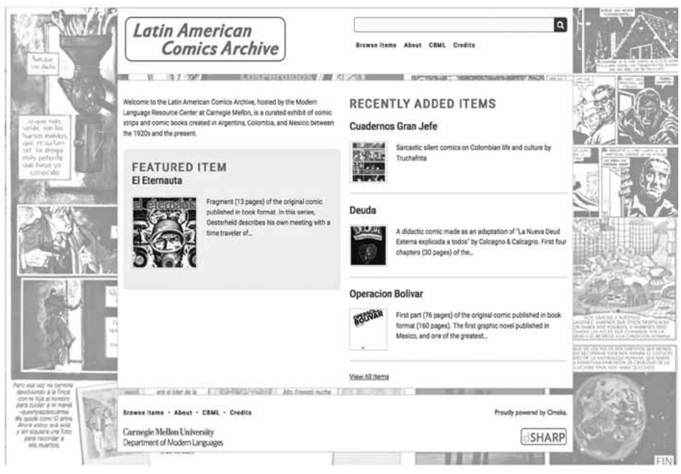
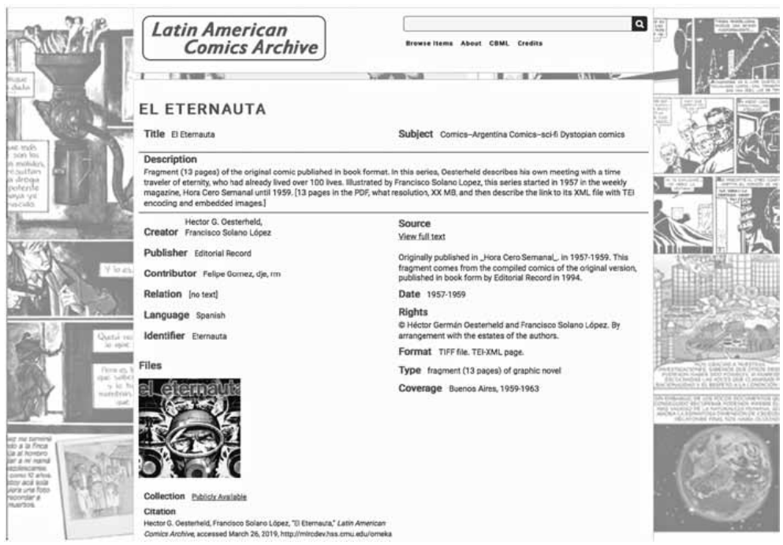
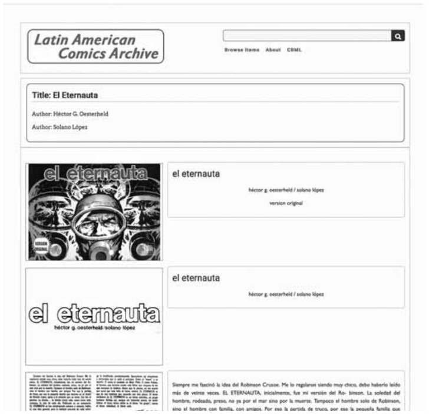
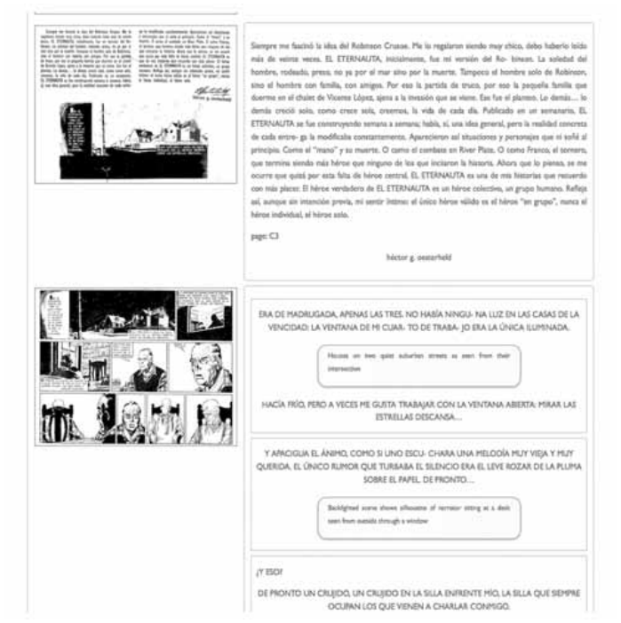
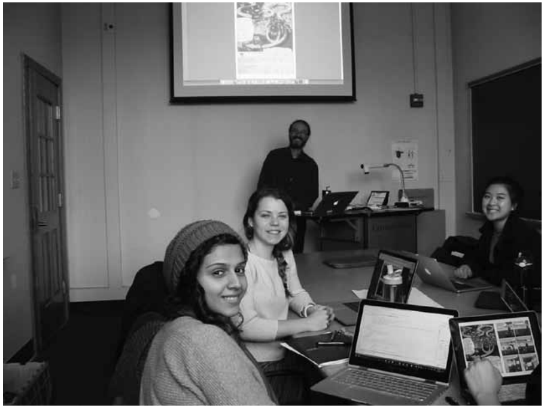
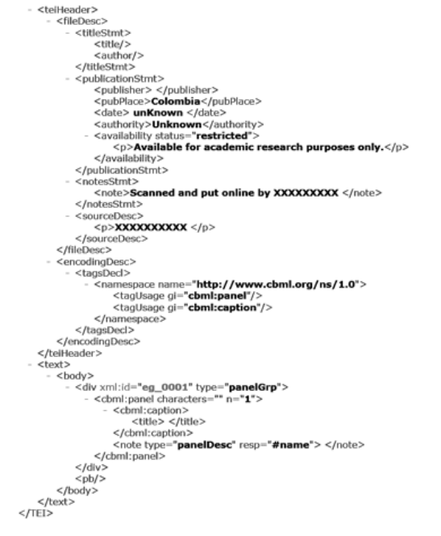

# The Latin American Comics Archive (LACA): an online platform housing digitized Spanish-language comics as a tool to enhance literacy, research, and teaching through scholar/student collaboration

**Felipe Gómez \*, Scott Weingart \*2, Rikk Mulligan \*3 & Daniel Evans \*4**

Fecha de recepción: diciembre 2017

Fecha de aceptación: octubre 2018

Versión final: julio 2019

<!-- page 47 -->

**Abstract:** The Latin American Comics Archive (LACA)[^1] is an ongoing project combining capabilities for Spanish language and culture teaching, research in the Humanities, and digital technologies as a tool for expanding the access and analysis of Latin American comics for both scholars and students. Thanks to a Digital Humanities Mellon Seed Grant, LACA started out with a small representative sample of Latin American comics that were digitized and encoded in CBML over the 2016-2017 academic year. In the Fall of 2017, a pilot course allowed students and researchers to access and explore these source materials as pedagogical tools for learning and researching about Spanish language and Latin American culture. The use of digital tagging and annotation tools on the archive enabled for the analysis of the visual and verbal language of comics, as well as cultural and linguistic items or themes, and a variety of formal categories. Students and researchers were able to collaborate in the definition of key terms to be annotated and used for the research of topics in the digitized comics, with the object of ultimately creating or collaborating in critical editions of comics for use by others, and the expansion of the archive, which will eventually be open to general scholarly use by students and researchers. Integrated applications could also allow for the production of short critical interventions in comic format.

**Keywords:** Latin American comics - multimodal literacy - Digital Humanities - Spanish-language teaching and research.

[Abstracts in Spanish and Portuguese on pages 66-67]

(\*) Felipe Gómez. Doctor in Spanish Language and Literatures (University of Michigan—Ann Arbor, MI, U.S.A.). Associate Teaching Professor of Hispanic Studies, Department of Modern Languages, Marianna Dietrich College of Humanities and Social Sciences, Carnegie Mellon University. fgomez@andrew.cmu.edu

(\*2) Scott Weingart. Doctoral student in Informatics, History of Science (Indiana University, IN, U.S.A.). Program Director, Digital Humanities, Research & Academic Services, Carnegie Mellon University. scottbot@cmu.edu

<!-- page 48 -->

(\*3) Rikk Mulligan. Doctor in American Studies with a specialty in Popular Culture (Michigan State University, MI, U.S.A.). Master’s in History, focus in Digital Humanities (George Mason University, VA, U.S.A.). Digital Scholarship Strategist in the University Libraries, Carnegie Mellon University. rikk@cmu.edu

(\*4) Daniel Evans. Master’s student in Literary and Cultural Studies (Carnegie Mellon University, Pittsburgh, PA, U.S.A.). Digital Humanities Developer, Marianna Dietrich College of Humanities and Social Sciences, Carnegie Melon University. djevans@andrew.cmu.edu

## I. Background and definition of the problem

Scholarship on comics has slowly gained ground and legitimacy in the United States over the past three decades, most notably after Art Spiegelman’s *Maus* was awarded the Pulitzer Prize in 1992 and Scott McCloud’s landmark *Understanding Comics* (1993) was published[^1]. Nowadays, it is not surprising anymore to find comics courses in higher education academic programs ranging from English and Modern Languages, to Art History and Communications, as scholars and teachers continue paying increasing attention to the use and potential of the medium as a powerful communication tool to convey factual and conceptual information through visual means. Furthermore, comics have been used in recent years as the chosen format for everything from public health messages to human rights lessons, to Ph. D. dissertations, and are the focus of academic conferences, journals, and research grants (Chute & Jagoda, 2014). In the Humanities comics may have once been viewed as merely a “gateway to literacy,” but today they are often considered works of literature and/or a valuable form of reading in and of themselves thanks in part to a growing number of scholarly voices arguing for their use in the classroom to promote a variety of literacy practices. The definitions of literacy used in this context vary widely, but there is a clear tendency to understand the term beyond sole competency in reading and writing, and toward a more inclusive and expansive perspective that includes the critical and effective use of language for a variety of purposes relevant to peoples’ lives. Dubin and Kuhlman’s (1992) definition of literacy itself as “competence, knowledge and skills,” as well as Hiebert’s (1991) perspective on it as a process in which meaning is created through an interaction of reader and text, are of particular value to understand in what ways, given the current shift in thinking across literacy-related fields, the question of how visual elements actually create meaning has become increasingly important. Rick Kern (2000) adds to this understanding by defining literacy as “the use of socially-, historically-, and culturally-situated practices of creating and interpreting meaning through texts,” involving some awareness of relationships between textual conventions and contexts of use and, perhaps even “the ability to reflect critically on those relationships.” This approach to literacy highlights the potential of comics to help students “understand how images produce meaning, and become engaged in the search for this meaning” (Versaci, 2008). <!-- page 49 --> As Brandt (2009) notes in her study of literacy and society, the former “has always been intimately connected to [equality] and to the well-functioning of a democracy,” and integrating comics into the curriculum is a step toward creating more democratic notions of text, literacy, and curriculum, and toward expanding the understanding and definitions of these notions (Carter, 2008). In the second language (L2) classroom this is especially relevant at a time when the necessity for learners to cultivate the ability to comprehend, analyze, and create multimodal texts in the target language, and grasp how the use of language and other symbolic systems generates meaning has been made more salient (Kramsch, 2006; Dupuy, Michelson, & Petit, 2013). Multimodal literacy, as a complex act of meaning-making, requires from learners the ability to “make connections, determine importance, synthesize information, evaluate, and critique,” and to take into account the interaction of visual and textual literacies as a basis for a more complete understanding (Frey & Fisher, 2008). The simultaneous focus on visual and textual literacies provided by comics emphasizes the existing proximity between the act of reading them and the ways students receive information today (Versaci, 2008; Tabachnik, 2009).

Our project, described in the following sections, seeks to address some of the specific obstacles that the study of L2 comics within the United States continues to encounter despite its increasing relevance for the understanding and development of L2 multimodal literacy. While many of these obstacles are also faced when dealing with English-language U.S. comics and analogous materials, the obstacles seem to be accentuated when dealing with primary-source research on L2 comics. Among other difficulties, collections are most often housed in libraries or archives in their home countries, and this means desired sources could be very far away. Items may be both in public and private hands, and there are often rigid restrictions to their access for reasons ranging from fragility to rarity and value. Frequently, relevant materials of this type aren’t properly cataloged (if at all), which complicates identifying, finding, and accessing them. When using traditional research methods, these challenges have to be confronted and solved by each researcher, working in isolation with the source documents. Many of these issues also generate constraints in the realm of teaching (Ault, 2003), where limitations in the access to sources restricts course conceptualization and implementation, and where students don’t usually have much agency or opportunities to engage in larger debates and conversations with other students or scholars of L2 comics.

## II. The Promise (and Perils) of Digital Humanities

We believe the Digital Humanities (DH) can facilitate and enhance the use of Spanish-language comics as a research and teaching tool. Spiro (2012) recognized five broad values in DH: openness, collaboration, collegiality and connectedness, diversity, and experimentation. These values provide a sturdy ground on which to build the Latin American Comics Archive (LACA). Such an archive, available without a costly subscription, can provide international access to cultural artefacts not often encountered, and can in turn inspire the development of more such resources which can be contributed to the archive. Such an endeavor is necessarily experimental, requiring the creators of the archive to iteratively <!-- page 50 --> construct an argument about the ontological structure of Latin American comics, which will eventually be formally embedded in the model representing the comics themselves (Turton, 2017)[^2]. This experimental process winds up being an incredibly valuable pedagogical tool in helping students learn and understand the fluidity of textual structure (Brooks, 2017; Singer, 2013).

The five values Spiro points out, unfortunately, are less true in practice than in theory. For a host of reasons, DH tends to reinforce cultural inequalities and hegemonies (Bode, 2017; Earhart, 2012; McPherson, 2012; Risam, 2015b). Archives tend to focus on English language material and duplicate the bias of literary canons, text is often privileged at the expense of more multimodal media, and even within the same language community, Spanish digital humanists pay little attention to their Latin American colleagues (O’Donnell, Bordalejo, Ray Murray, del Rio, & Gonzales Blanco, 2016). This is slowly changing, with the creation of advocacy organizations like PACE and GO::DH, the hosting of the international DH conference in Mexico City in 2018, and a push at many levels towards greater diversity, but work still needs to be done and the stakes are high: “the ability to produce digital cultural heritage is a matter of epistemic survival” (Risam, 2015a). We intend our project as one step towards the goal connecting the practice of DH with its ideals.

Thankfully, we do not have to pursue this effort in a vacuum, and can rely on the good work of many others laboring at the intersection of DH, Comics Studies, and Latin American Studies, including Laurie Taylor, Ernesto Priego, and John Walsh. Indeed, our project is built using Walsh’s Comic Book Markup Language (CBML), a digital encoding scheme developed specifically for the affordances of comic books (Walsh, 2012). Since CBML’s release, a rich literature has emerged around the intersection of comics and DH, covering subjects ranging from its pedagogical uses to advanced methods for extracting data from digitized comic images. Recently, Whitson and Salter edited an entire special volume of *Digital Humanities Quarterly* dedicated to this intersection, paying special attention to the experimental pedagogical value of the pairing, and going so far as to conclude “studying comics may prove to be a fundamental part of understanding the digital humanities in the future” (Whitson & Salter, 2015).

Additionally, much work has gone into the encoding and analysis of comics “at scale”, with the hopes of being able to easily study trends between thousands or even millions of comics at once. In literary studies, this has been called distant reading (Underwood, 2017). This requires, first, a visual ontology which is flexible enough to accommodate the affordances of comics (Bateman, Veloso, Wildfeuer, Cheung, & Guo, 2017; Walsh, 2012). Also required is a fast way to encode visual or textual elements from each comic, a task being approached from many angles (Dunst, Hartel, Hohenstein, & Laubrock, 2016; Haidar & Ganascia, 2016; Kuboi, 2014; Manovich, 2012; Manovich, Douglass, & Huber, 2011; Tufis & Ganascia, 2016). Although our project focuses on more minute details than would be visible in these large-scale approaches, we have encoded the comics with a standard metadata scheme and markup language with the intent of allowing the archive to be interoperable with larger datasets, which will be especially beneficial when attempting to diversify and balance larger corpora of digitized comics.

To date, a large focus of DH has relied on the type of analysis derived from the implementation of markup language and digital archival work (Eyman & Ball, 2015). But even <!-- page 51 --> if “tags make text more searchable, as well as visualizable, in ways limited only by the descriptions in the tags” (Whitson, 2013), the affordances of comics as a form of communication require rethinking literacy and writing to come up with a broader definition to encompass newer types of text forms by exploring comics as a method for teaching multimodal literacies (Jacobs, 2013). Cultural and theoretical arguments such as those by Gloria Anzaldúa (2001) and Walter Mignolo (2003) that go against the grain of the Western foundational narrative of “the rhetorical tradition,” writing, and meaning-making practices, and consider writing systems in other ancient cultures and the study of the history of visual rhetoric and its legitimacy as an intellectual practice (e.g. codex rhetorics), seem to lead most productively into a type of comics-related analysis that is useful in advancing toward the goal of challenging definitions of literacy and of the “book” itself (Howes, 2010). This type of analysis takes into account the function of the book as a tool of oppression of pictorial forms (Mignolo, 2003) and draws attention to the hidden epistemic violence inherent in scientific modes of seeing that present themselves as neutral, objective and natural[^3].

## III. The Latin American Comics Archive

As mentioned earlier, the LACA was created with an interest in the potential use of comics for enhancing literacy and learning--in particular in the L2 classroom. But besides providing students and researchers with a platform to exercise and evaluate literacy, additional aims included integrating digital and traditional material to create overarching interpretations; fostering digital literacy and communication by conveying materials and interpretation to a wide public audience; and supporting collaboration through teamwork.

The project combines ongoing humanities research on Spanish-language Latin American comics with the use of digital technologies to enable access to, and analysis of, these materials. While traditional research methodologies as those described in the first part of this paper are capable of yielding positive and in some cases sufficient results, the process is usually slow, and hindered by many of the limitations outlined. Under the assumptions that suitable DH tools can make this process more open and collaborative, while also expanding the kind and scope of questions that can be asked (which cannot be asked with a smaller, more traditionally conceived or presented corpus), and thus can enrich and enhance the products for both teaching and research, the project offers a platform in which materials can be archived, shared, and used by both students and scholars of Latin American comics. The use of these tools could also provide instructors with data about student cultural and linguistic learning to inform future classroom teaching.

Conceptually, the archive was modeled after, and as a complement to, existing examples such as the Catálogo de Historietas de la Hemeroteca Nacional at the UNAM in Mexico, or the Comics and Popular Culture archive developed at MIT in the early 2000s. On a first and most basic level, LACA is meant to be a public digital archive for Latin American comics by including a representative sample of digitized materials with the objectives of allowing students and researchers to explore how these comics have evolved, and enabling digital access to some materials in many cases only otherwise available in private collections, libraries, and rare book rooms. As such, it can help to relieve at least in part the difficulties of locating and using the sources for research and teaching to explore themes and a variety of formal categories. <!-- page 52 -->

On a more ambitious level, LACA’s goal is to become a hub for the interaction of students and scholars interested in experimenting with the inquiry of Latin American comics through the affordances of the digital medium’s increased computational capabilities and visual display. Given the potential of DH tools in facilitating collaboration between and among scholars and students, LACA aspires to become an initiative that can transform and expand the scale of traditional research methods on this subject, and to open new modes and possibilities for text analysis that can be employed into the realm of student agency and learning, and could foreseeably have applicable use in other courses in Modern Languages and, more broadly, the Humanities. In what follows this article documents three integrated parts of the project as it stands today toward accomplishing these goals: 1) the creation of a curated digital archive of Latin American comics and the development of an online Metamedia platform to house these sources; 2) the identification of digital tools to enhance research and teaching of Spanish-language comics through student/scholar collaboration; and 3) the piloting and preliminary implementation of the archive for research and teaching purposes.

At the earliest stage of the project, the lead researcher in the team curated a small representative sample of Latin American comics that could be used. The majority of these materials came from his own research and teaching over the past five years, and included for the most part examples produced throughout the 20th and 21st centuries in Argentina, Colombia, and Mexico. Even though the initial motivation was not to create a comprehensive archive of Spanish-language Latin American comics, it was deemed important to have at least one representative example of a comic or comic strip from every two-decade period starting in the early 20th century, and to include classic works such as *Mafalda*, *Copetín*, *Kalimán*, and *El Eternauta*, but also groundbreaking works published more recently, such as *Operación Bolívar* or *Virus tropical*. A goal was set toward having a total of 10-15 digitized items in the initial sprint, with item length ranging from single page to a thirty page maximum, and avoiding multivolume issues and oversize images. Works from these lists that were already digitized helped jumpstart the platform development, while those not yet available on digital media were scanned with help from students and library staff at our institution, and in a few cases were generously provided by the authors themselves. The technical foundation for LACA combines Omeka, an open source content management system used to create online digital exhibits and collections, with TEI Boilerplate, a server-side XSLT transformation toolkit developed by researchers at Indiana University, which produces a combination of HTML, CSS, and Javascript to display TEI XML documents using a web browser. The Omeka platform offers a customizable front-end for public or restricted access to individual items and curated collections of cultural heritage objects, in this instance the comic strips, comic books, and graphic novels of LACA (Figure 1).

<!-- page 53 -->

**Figure 1.** Omeka platform hosting the LACA.

This platform is managed through a web browser rather than the command-line, reducing the need for technical expertise, enabling faculty and students to focus on curating and providing metadata for the content. Omeka is designed to use Dublin Core, a library and museum metadata standard, to define and share its collections’ metadata with others through an Application Programing Interface (API). Dublin Core provides a basis for faculty and students working with the objects in the archive to better understand the processes involved in not only describing objects, but also developing the expertise to describe their cultural context using metadata. (Figure 2)

<!-- page 54 -->

**Figure 2.** Screen shot of item browsing on the Omeka platform.

In particular, for LACA intellectual property and permissions information is incorporated to help make the appropriate works sharable with others on the web, while protecting the rights of those who have not granted permission to share their creative work.

The Omeka platform incorporates the PDF files for each item, with the entries linked to corresponding XML files prepared by faculty and student editors. The XML files are viewable in-browser through TEI Boilerplate XSLT Transformation. This allows end-users to view the comic book metadata via the Omeka site and then seamlessly link out to the XSLT transformations. These transformations display a thumbnail of each individual comic book page on the left hand-side of the screen with its corresponding text on the right. This added functionality provides users the ability to navigate and search across the entirety of the comic. (Figures 3 and 4)

<!-- page 55 -->

**Figure 3.** Screen shot of page view on the Omeka platform.

**Figure 4.** Screen shot of page view on the Omeka platform.

<!-- page 56 -->

Following work by Walsh (2012), we explored the possibilities for tagging comics afforded by the sets of XML standards commonly used in digital archives or through digital annotation tools. With the use of tags, scholars and students can describe physical objects, locations (e.g., GPS locations of place names mentioned in the text), embed links to other relevant material available on the web (e.g. connect readers to information about characters and creators) or describe material elements on the page (e.g., watermarks, ink color, handwriting, damage), all of which increase the potential for new realms of analysis of the visual and verbal language of comics. In terms of teaching Spanish as an L2, tags can also be used to map lexical content items, L2 expressions, grammatical structure, or technical language. Encoding parts of speech could have applications for linguistic analysis, teaching, and learning (e.g., students can include alternate readings for an unclear word, translations, etc.).

CBML was identified by the team as an ideal digital tool affording the vocabulary and structure to encode Spanish-language comics, while also offering interfacing possibilities to advance objectives related to the research and teaching of these materials through student/scholar collaboration. As a markup language, CBML offers sets of machine-readable “tags” to identify features of documents and data such as structure and semantics. As Walsh aptly reiterates following literary scholars and digital humanists, the application of these codes to a document is not only translating it for the machine, but also

> Often the most crucial and informative stage of […] studying or manipulating texts in digital environments. […] [It] is a form of discovery, or prospecting, in which the encoder maps a document’s structure, identifies semantic elements of interest, and documents relationships internal and external to the document. Scholarly encoding is a form of both reading and writing.

This quote summarizes accepted notions of coding as a performative task through which inferences and interpretations are made about the text that lead to meaning-making.

The Fall 2016 and Spring 2017 semesters were spent focusing on coding the selected comics, attempting to secure rights for copyrighted materials, creating the online platform, and bringing the materials to this newly developed architecture. Members of the team met once or twice a month over this period, both in person and virtually. A part of the team researched similar open source digital archival platforms and came up with a design and functionality with the assistance of other members. The team employed a user-centered design approach which stressed ease-of-use, accessibility, and simplified styles. A site which required low-maintenance costs and could be easily preserved appealed to the team. In order to gather an initial evaluation of the effectiveness of the platform and integrated digital tools, pilot courses were planned to be offered over the span of the 2017-2018 academic year. With a framework focused on L2 acquisition and a multimodal approach encompassing the linguistic, the visual, and the digital, these courses seek to interrogate literacy at the intersection of Language and Cultural studies and DH, assessing modes and nodes of interdisciplinary connections to literacy in the fields. The courses provide students with examples of Latin American comics onto which current tools, approaches, and applications of multimodal literacy can be used. In the context of the classroom, the <!-- page 57 --> teacher can provide students with different models and “tools” of linguistic, visual, and digital literacy analysis as well as examples of current debates around types of analysis in the field.

The pilot Hispanic Studies course “Comics, Community, and Coding: Electronic Textuality and Culture in Latin America” was offered over the Fall 2017 semester at our institution (Figure 5). As part of the Hispanic Studies curriculum, the objectives for this topics course included standard linguistic and cultural competence goals for the 4th year, aimed at strengthening and improving skills for active interaction at the high intermediate level with individuals within the Hispanic world and/or for more advanced classes in Hispanic studies. It also introduced specific content goals related to Latin American comics, the context for their development, production and reception, and their relevance and importance within the field of cultural studies. Given that these pilot courses are based on a 21st century digital-age approach to academic literacy aligned with today’s standards, they are also meant to convey basic literacy in DH, and provide sufficient grounding from which to gain further knowledge in order to better understand how the visuals we deal with on a day to day basis produce meaning. DH objectives introduced were aimed at learning the basics of CBML and using this language to contribute to encoding comics for the LACA, while at the same time having the coding process be an additional tool to develop literacy by learning how to read comics critically in order to identify and analyze key elements of the genre and its relationships to societal issues.

**Figure 5.** The lead researcher with some of his students in the Fall 2017 pilot course.

<!-- page 58 -->

The course structure allowed for one of the three weekly 50-minute sessions to be dedicated to hands-on CBML coding assignments, usually organized in pairs and small groups of students. After reading and discussing theoretical and practical underpinnings of TEI, XML, CBML, and coding in general, students received basic hands-on training in CBML with an individual assignment coding comic strip examples from the 1920s and the 1940s. Models and templates were provided in which main structural elements of the comic (i.e. page, panel, caption, and balloon) were outlined so students could identify and differentiate those parts, and complete their coding accordingly (Figure 6). Course assignments were gradually increased in complexity and length, going from the coding of a single panel to a page, and to a number of contiguous pages, while steadily incorporating elements and attributes to describe structural parts of the panel such as page numbers and signatures, lists of characters, names, citations, diegetic floating texts; qualities such as text rendition, shot types, figure descriptions, or the sex, age, and relationship of characters; and to code and create lists of lexical items. The full Tag Set Documentation including all the TEI elements available in the default CBML customization was provided, but the class also developed an ongoing collaborative page with a shortlist of elements and attributes introduced and used for assignments, with links to their definitions and comments on their usage.

**Figure 6.** Fragment of one of the templates provided to students for the CBML coding of comics

<!-- page 59 -->

Students and the instructor assessed the effectiveness of the course model through periodic surveys measuring achieved tasks versus stated goals[^4]. Although the pool of students was small, by the end of the term all of the students felt the goal of learning the basics of CBML and contributing to the LACA had been met either well or very well. Respondents expressed enthusiasm with what they had learned, but also a desire to spend more class time on CBML and gain new knowledge at a faster rate, with clearer explanations and more examples than those provided in the Tag Set Documentation. They were particularly interested in coding more instances of comics, more elements of them, and generating research outputs. We are aware that this may be particular to the types of students at our institution, who noticeably relish learning new tools as they are learning content, but may not always be the case elsewhere.

Besides learning the basics of CBML, all students considered that coding helped them meet other goals in the course such as gaining familiarity on classic and recent examples of Latin American comics and understanding their importance within the field of cultural studies, increasing cultural competence by building and developing knowledge on these comics and the conditions for their development, production, and reception, and their relationship with the history, social formations, and cultural production of Latin America; and increasing their lexical knowledge. Importantly for the purposes of the project, students also felt that coding in CBML had helped them develop analytic skills by learning how to read comics critically in terms of key elements of the genre and a variety of issues of class, race, gender and sexuality, among others. A majority of them thought that coding had also helped them establish referents and contributed to a broad comprehension of the customs, history, and underpinning conditions of the Spanish-speaking world, as well as given them tools to produce critical analyses of issues by comparing and contrasting multiple texts. “By forcing the coder to examine the situation, layout, and characters in each comic,” said one of the responders, “I feel that I’ve developed a new perspective on the cultural elements which go into constructing a comic.” Another one stated that “Coding comics with more complicated formats […] really made me think about what makes up a comic and how to critically analyze one.” These feelings were echoed by several others who thought CBML allowed them to pay more attention to the details, and analyze the written and visual language and the cultural context of the text in a way that would not have happened without the activity.

In terms of building a foundation for active interaction with Spanish-speaking individuals and/or more advanced classes in Hispanic literature and culture, most students were initially skeptic that coding could be helpful toward this goal. Elaborating, one of the respondents thought that even if coding did not prevent them from advancing Spanish language skills, it did not advance them either. This perspective, however, seemed to contradict other opinions reported above (i.e. regarding gains in lexical and cultural knowledge), and opinions on this item changed by the end of the term, when a wider understanding of what this “active interaction” might entail (e.g., oral communication skills) was enabled through class discussion. One student was specific about these gains, stating that “paying close attention to the coding of certain words (like places, terms, names) has furthered my knowledge of a country’s people and social attitudes,” highlighting how this may have increased their ability to make meaning out of the comics and connect it to a <!-- page 60 --> wider understanding of cultural specificities through the process of analysis. The data produced through these surveys allowed for the determination of necessary changes and adjustments that could be incorporated into “Introduction to Hispanic Literary & Cultural Studies: Superheroes and Beyond,” a similar iteration on Latin American superhero comics currently being piloted for 3rd-year students of the program, in which feedback will once again be elicited through the same mechanisms. In theory, the model could be adapted for other language programs where comics are currently being used.

As part of the pilot course, students chose and developed a final project individually or in small groups. The project entailed three parts: a short critical essay examining a social/linguistic/graphic issue found in one or more of the Latin American comics; an XML document in which several panels from one or more of the comics were encoded in CBML, accompanied by a short narrative reflection on how these panels illustrate and/or contribute to the analysis brought forth in the critical essay; and an oral presentation, in which students made use of their Spanish-language and presentational skills to communicate to an audience of peers their hypothesis and pieces of supporting evidence, including those derived from CBML coding. With this final project, students were required to apply models and examples found throughout the course to put their analytic skills to work using different tools, and involving CBML coding as one of them. Reflecting on the coding of the selected panels, one of the students stated, “during the final project I was able to make connections to my thesis that I would not have realized without the coding component.” This type of comment makes us optimistic about how the course model can help further establish the connection between coding, multiple literacies, and the development of language skills.

## IV. Conclusions, Challenges, and Future plans

The study of comics is a powerful avenue to develop integrated textual and visual competence, knowledge, and skills relevant for students today. Given the power of comics as communication tools that combine text and image in a way that is in close proximity to how students receive much of their information nowadays, it makes sense to continue to pay increasing attention to the medium’s use and potential in helping students engage in the search for a greater comprehension of the process whereby readers and text interact to create meaning. Using comics toward this goal in the L2 classroom also creates opportunities for a curriculum based on more democratic concepts of text and literacy. LACA contributes to these goals by making a collection of Spanish-language Latin American comics available for the L2 classroom. Beyond that, it gives students the opportunity to hone on the use of comics for enhancing multimodal literacy and learning through the integration of DH tools. The Fall 2017 pilot course provides initial evidence that coding the comics contained in the collection facilitates students’ attention to details, notice of patterns, and, in general, collaborative advancement in the analysis and understanding of the linguistic and cultural elements contained in the comics, while also helping them keep in mind communication to a wide public audience. Instructors can also benefit from the <!-- page 61 --> additional opportunities afforded to glean information about students’ progress toward cultural, linguistic, visual, and digital literacy.

We intend to make LACA publicly available for use as a hub where students and scholars interested in experimenting with the inquiry of Latin American comics can interact. This would help transform and expand the scale of traditional research methods used, and could open new modes and possibilities for text analysis that can be employed into the realm of student agency and learning. However, as we advance in the process to attain this goal, we acknowledge that since the majority of modern comic books are still largely under exclusive rights protection, copyright issues remain one of the most difficult challenges to tackle in this kind of a project. Despite the fact that the CBML-XML transcriptions and mark-up may be exempt under the basis of transformative use, copyright restrictions can limit the use of digital copies or reproductions of the comics in the classroom and forbid the public display of these works, thereby curtailing the possibilities for collaboration between and among students and scholars beyond institutional and even national walls. Most of the comics currently housed under the LACA are not owned by massive media conglomerates and therefore do not face the jealous copyright policing that may be found when dealing with famous superhero comics. Luckily, some of the creators have graciously and explicitly granted permission for their works to be made available through Omeka as a digital exhibit and for the pages to be transcribed. However, because of the very nature of some of the materials in the collection, things are complicated by other types of factors: these are works of foreign origin, governed by the Berne Convention for the Protection of Literary and Artistic Works (United States, 1988) and the Universal Copyright Convention (Library of Congress, 1977), rather than just U.S. copyright[^5]. This would, in theory allow for their fair use. Nevertheless, as the comics we have been dealing with were in many cases published by small independent presses which may not exist anymore, and given that some of their authors either are or may now be defunct, it is a project in itself to track the copyright ownership and be able to contact the appropriate people, in hope to get a positive response to the request. In our case, these are among plausible reasons why some creators and intellectual property owners have not responded to requests; in theory, these works default to protected status and cannot be displayed publicly. Some works may also be orphaned--the rights may have changed hands, but the current legal status is uncertain because the original owners have died and no records of ownership or transfer have been recovered. The cases of Rius and Oesterheld illustrate very well this point[^6].

For the time being, the project could concentrate on publishing on the Web only materials for which permissions have been obtained, as well as older comic book publications that will be entering the public domain in coming decades, and those from the same period which may already be in the public domain because the copyright was not renewed. Efforts would need to be made to include Spanish-language materials in lists like those created by The Next Issue Project that identify public domain titles that could be used for this purpose. But despite these limitations, it is important to keep in mind Walsh’s (2012) point that “nothing prevents a scholar from applying CBML markup to any text as part of a strategy for reading, interpretation, and analysis. The end goal of markup is not and should not always be publication of a digital surrogate. The encoding of a text may be a rigorous intellectual activity that has great value as process, not just as product.” <!-- page 62 --> As discussed above, the early pilot of the course indeed gives us reasons to believe that continuing to give students the chance to collaborate in the CBML encoding of the comics positively contributes to the development of a multimodal literacy that can be of value to their learning of the L2 and to a culturally-sensitive functioning in society.

## V. Acknowledgements

The initial funding for LACA was made possible through an Andrew W. Mellon Seed in Digital Humanities Grant administered through the College of Humanities and Social Sciences at our institution. The authors would like to thank Elisa Beshero-Bondar, Martha Mantilla, David Scherer, Olivia Wikle, Sébastien Dubreil, Marc Siskin, Fatema Almeshqab, Rachel Gómez, Edward Healy, Danielle Joseph, Noa Park, Haili Adams, Nicole Casey, Madison Dodds, and Anna Telmer for their contributions and support to different parts of the project.

## VI. Notes

[^1]: On the use of comics as material for scholarship and the classroom see for instance Fernández L’Hoeste & Poblete (2009), Merino (2003), and Tabachnick (2009), among others.

[^2]: As Turton (2017) states: “the subjectivity involved in creating our own data structures and ontologies, and these elements’ inherent statuses as arguments about data, is a strength, an affordance, of such an approach, as well as something that embraces the situatedness and plurality of data that […] have been advocated for in the Digital Humanities. […] By contrasting and combining different ontologies it is possible to shed light on our texts and to allow our texts to shed light on our ontologies, all the while fracturing any notion of computational methods as objective black boxes by foregrounding their artificiality.”

[^3]: A recent instance of analysis informed by this type of rhetorical thinking can be found in Joanna Page and Edward King’s reading of Edgar Clément’s *Operación Bolívar*. Page and King examine how the graphic novel performs a challenge to the limits of Cartesian vision by confronting it with a baroque scopic regime that echoes the form of pre-conquest codices. They argue that the graphic novel’s multiple fragmentary perspectives, excess of imagery, absence of clear distinctions between diegetic imagery and structural supports, and use of collage, are elements that force readers to forge plurivectorial paths across the text (King & Page, 2017).

[^4]: The responses from the surveys for the pilot course can be viewed at: https://www.surveymonkey.com/results/SM-ZSRLWCZD8 and https://www.surveymonkey.com/results/SM-BFKJBFJT8.

[^5]: All of Central and South America are signatories to the Berne Convention, which grants 50 years of copyright protection to printed works.

[^6]: In an infamous case of outright abuse, Rius was cheated in the 1960s by his editor, who had secretly copyrighted the title of his comic *Los Supermachos*. When Rius discovered <!-- page 63 --> this, the editor had already printed several issues of the comic with an artist and a scriptwriter he had hired. Rius also discovered that his contract had a series of clauses which prevented him from using his own characters in other publications, and had to create a new title with new characters to be able to continue publishing (Merino, 2003). Today, it is not always easy to discern which of Rius’ comics copyrights are still owned by him, a fact that is further complicated by his recent decease in 2017. Héctor German Oesterheld’s case is also a poignant one given that, as a publisher of much of his own work through Editorial Frontera, it could be assumed that he owns the publishing rights to his classic work *El Eternauta*. However, Oesterheld and his four daughters were disappeared by the Argentine dictatorship in 1976-1977 (Merino, 2003), presumably leaving his wife Elsa Sánchez, and the illustrator Solano López as the sole inheritors of those rights. Alfredo Scutti, an editor, “acquired” the rights from Elsa Sánchez during the eighties, while she was suffering personal and economic hardships. For more on the long and protracted legal battle that ensued during the nineties to recover them, see for instance Adán Aliaga’s 2011 documentary *La Mujer del Eternauta* (*El Eternauta’s Wife*) and the interview with Solano López in *Comiqueando* (12), 1995. A court decision in this case ruled in favor of Oesterheld’s inheritors in 2015 (see https://www.fiscales.gob.ar/procuracion-general/dictaminaron-que-los-herederos-de-oesterheld-tienen-los-derechos-de-autor-sobre-el-eternauta/).

## VII. Works cited

Anzaldúa, G. (2001). *Borderlands/La frontera*. Excerpted In Bizzell, P., & Herzberg, B. (2001), eds. *The Rhetorical Tradition: Readings from Classical Times to the Present*. Boston: Bedford-St. Martin’s. 1585-1604.

Ault, D. (2003). In the Trenches, Taking the Heat: The Confessions of a Comics Professor. *International Journal of Comic Art, 5*(2), 241-260.

Bateman, J. A., Veloso, F. O. D., Wildfeuer, J., Cheung, F. H., & Guo, N. S. (2017). An open multilevel classification scheme for the visual layout of comics and graphic novels: Motivation and design. *Digital Scholarship in the Humanities*, *32*(3), 476–510. https://doi.org/10.1093/llc/fqw024

Bode, K. (2017). The Equivalence of “Close” and “Distant” Reading; Or, Toward a New Object for Data-Rich Literary History. *Modern Language Quarterly*, *78*(1).

Brandt, D. (2009). *Literacy and learning: Reflections on writing, reading, and society*. San Francisco, CA: Jossey-Bass.

Brooks, M. (2017). Teaching TEI to undergraduates: A case study in a digital humanities curriculum. *College & Undergraduate Libraries*, *0*(0), 1–15. https://doi.org/10.1080/10691316.2017.1326331

Carter, J. B. (2008). Comics, the canon, and the classroom. In Frey, N., & Fisher, D. (2008). *Teaching visual literacy: using comic books, graphic novels, anime, cartoons, and more to develop comprehension and thinking skills*. Thousand Oaks, CA: Corwin Press. 47-60.

Chute, H., & Jagoda, P. (2014). Special Issue: Comics & Media. *Critical Inquiry*, 40(3), 1–10. *JSTOR*, JSTOR, www.jstor.org/stable/10.1086/677316.

<!-- page 64 -->

Dubin, F., & Kuhlman, N. (1992). The dimensions of cross-cultural literacy. In Dubin F., & Kuhlman, N. (Eds.). *Cross-cultural literacy: Global perspectives on reading and writing*. Englewood Cliffs, NJ: Regents/Prentice Hall. v-x.

Dunst, A., Hartel, R., Hohenstein, S., & Laubrock, J. (2016). Corpus Analyses of Multimodal Narrative: The Example of Graphic Novels. In *Digital Humanities 2016: Conference Abstracts*. Krakow, Poland. Retrieved from http://dh2016.adho.org/static/data-copy/387.html

Dupuy, B., Michelson, K. & Petit, E. (2013). Fostering Multiliteracies Through a Global Simulation Approach in Intermediate French: A Curricular Project.” Nclc.org

Earhart, A. E. (2012). Can Information Be Unfettered? Race and the New Digital Humanities Canon. In M. K. Gold (Ed.), *Debates in the Digital Humanities*. Minnesota: University Of Minnesota Press. Retrieved from http://dhdebates.gc.cuny.edu/debates/text/13

Eyman, D., & Ball, C.E. (2015). Digital Humanities Scholarship and Electronic Publication, in: Ridolfo, J., & Hart-Davidson, W. (Eds.). *Rhetoric and the digital humanities*. Chicago; London: University Of Chicago Press. 65-79.

Fernández L’Hoeste, H. D., & Poblete, J. (2009). *Redrawing the nation: National identity in Latin/o American comics.* New York: Palgrave Macmillan.

Frey, N., & Fisher, D. (2008). *Teaching visual literacy: using comic books, graphic novels, anime, cartoons, and more to develop comprehension and thinking skills*. Thousand Oaks, CA: Corwin Press.

Haidar, A., & Ganascia, J. (2016). Automatic Detection of Characters in Case Insensitive Text in Comics. In *Digital Humanities 2016: Conference Abstracts* (pp. 425-426). Jagiellonian University & Pedagogical University, Kraków.

Hiebert, E. H. (1991). Introduction. In Hiebert, E. H. (Ed.), *Literacy for a diverse society: Perspectives, practices, and policies*. New York: Teachers College Press. 1-6.

Howes, F. (2010). Imagining a multiplicity of visual rhetorical traditions: Comics lessons from rhetoric histories. *ImageTexT: Interdisciplinary Comics Studies, 5*(3), 48.

Jacobs, D. (2013). *Graphic Encounters: Comics and the Sponsorship of Multimodal Literacy*. London: Bloomsbury Publishing.

Kern, R. (2000). *Literacy and language teaching*. Oxford: Oxford University Press.

King, E., & Page, J. (2017). *Posthumanism and the graphic novel in Latin America*. London : UCL Press. 84-108.

Kramsch, C. (2006). From Communicative Competence to Symbolic Competence. *The Modern Language Journal*, *90*(2), 249-252. Retrieved from http://www.jstor.org/stable/3876875

Kuboi, T. (2014). Element Detection in Japanese Comic Book Panels. *Master’s Theses and Project Reports*. https://doi.org/10.15368/theses.2014.141

Library of Congress. (1977). *United States copyright protection for books by foreign authors under the Universal Copyright Convention*. Washington, D.C: Copyright Office, Library of Congress.

Manovich, L. (2012). How to Compare One Million Images? In *Understanding Digital Humanities* (pp. 249-278). Palgrave Macmillan, London. https://doi.org/10.1057/9780230371934_14

Manovich, L., Douglass, J., & Huber, W. (2011). Understanding scanlation: how to read one million fan-translated manga pages. *Image & Narrative*, *12*(1), 206-228.

<!-- page 65 -->

McCloud, S. (1994). *The invisible art: Understanding comics*. NY: HarperCollins Publishers.

McPherson, T. (2012). Why Are the Digital Humanities So White? or Thinking the Histories of Race and Computation. In M. K. Gold (Ed.), *Debates in the Digital Humanities*. Minnesota: University Of Minnesota Press. Retrieved from http://dhdebates.gc.cuny.edu/debates/text/13

Merino, A. (2003). *El cómic hispánico*. Madrid: Cátedra.

Mignolo, W. (2003). *The darker side of the Renaissance: Literacy, territoriality, and colonization*. Ann Arbor: The University of Michigan Press.

O’Donnell, D., Bordalejo, B., Ray Murray, P., del Rio, G., & Gonzales Blanco, E. (2016). Boundary Land: Diversity as a defining feature of the Digital Humanities. In *Digital Humanities 2016: Conference Abstracts*. Krakow, Poland. Retrieved from http://dh2016.adho.org/static/data-copy/387.html

Risam, R. (2015a). Across Two (Imperial) Cultures. In *HASTAC 2015*. East Lansing, Michigan. Retrieved from http://roopikarisam.com/uncategorized/across-two-imperial-cultures-2/

Risam, R. (2015b). Beyond the Margins: Intersectionality and the Digital Humanities, *9*(2). Retrieved from http://www.digitalhumanities.org/dhq/vol/9/2/000208/000208.html

Singer, K. (2013). Digital Close Reading: TEI for Teaching Poetic Vocabularies /. *The Journal of Interactive Technology & Pedagogy*, (3). Retrieved from https://jitp.commons.gc.cuny.edu/digital-close-reading-tei-for-teaching-poetic-vocabularies/

Spiro, L. (2012). “This Is Why We Fight”: Defining the Values of the Digital Humanities. In M. K. Gold (Ed.), *Debates in the Digital Humanities*. Minnesota: University Of Minnesota Press. Retrieved from http://dhdebates.gc.cuny.edu/debates/text/13

Tabachnick, S. E. (2009). *Teaching the Graphic Novel*. New York, N.Y: The Modern Language Association of America.

Tufis, M., & Ganascia, J.-G. (2016, March). *Adding semantics to comics using a crowdsourcing approach*. Retrieved from https://hal.archives-ouvertes.fr/hal-01288528

Turton, A. (2017). Towards Feminist Data Production: A Case Study From Comics. In *Digital Humanities 2017: Conference Abstracts*. Montreal, Canada. Retrieved from https://dh2017.adho.org/abstracts/493/493.pdf

Underwood, T. (2017). A Genealogy of Distant Reading, *11*(2). Retrieved from http://www.digitalhumanities.org/dhq/vol/11/2/000317/000317.html

United States. (1988). *Berne Convention for the Protection of Literary and Artistic Works: Message from the President of the United States transmitting the Berne Convention for the Protection of Literary and Artistic Works of September 9, 1886, completed at Paris on May 4, 1986, revised at Berlin on November 13, 1908, completed at Berne on March 20, 1914, and revised at Rome on June 2, 1928, at Brussels on June 26, 1948, at Stockholm on July 14, 1967, and at Paris on July 24, 1971 and amended in 1979*. Washington: U.S. G.P.O.

Versaci, Rocco (2008). “‘Literary Literacy’ and the Role of the Comic Book.” In Frey, N., & Fisher, D. (2008). *Teaching visual literacy: using comic books, graphic novels, anime, cartoons, and more to develop comprehension and thinking skills*. Thousand Oaks, CA: Corwin Press. 91-111.

Walsh, J. A. (2012). Comic Book Markup Language: An Introduction and Rationale, *6*(1). Retrieved from http://www.digitalhumanities.org/dhq/vol/6/1/000117/000117.html

<!-- page 66 -->

Whitson, R. T. (2013). “Comics and the Digital Humanities.” Presentation for Comics and the Multimodal World. http://www.rogerwhitson.net/?p=2130

Whitson, R. T., & Salter, A. (2015). Introduction: Comics and the Digital Humanities, *9*(4). Retrieved from http://www.digitalhumanities.org/dhq/vol/9/4/000210/000210.html

**Resumen:** El Archivo del Cómic Latinoamericano (LACA, por sus siglas en inglés) es un proyecto en curso que combina las áreas de la enseñanza del idioma español y las culturas latinoamericanas, la investigación en las Humanidades, y las tecnologías digitales para desarrollar una herramienta que permita a estudiantes e investigadores/as mayores posibilidades de acceso a y análisis de los cómics latinoamericanos. Gracias a una modesta beca del fondo Digital Humanities Mellon Seed Grant en Carnegie Mellon University, LACA se inició con el propósito de curar y digitalizar una pequeña muestra representativa de cómics latinoamericanos que luego fueron codificados en el lenguaje CBML a lo largo del año académico 2016-2017. En el otoño de 2017, se puso en práctica un curso piloto en el que el investigador principal (IP) y sus estudiantes exploraron el uso de estos materiales como herramientas pedagógicas para el aprendizaje y la investigación en torno a la lengua española y las culturas latinoamericanas. El uso de herramientas de marcaje y anotación sobre el archivo permitió el análisis de aspectos visuales y verbales propios del lenguaje historietístico, al igual que de elementos o temas culturales y lingüísticos, bajo una variedad de categorías formales. Mediante la colaboración entre estudiantes y el IP, se definieron y anotaron elementos clave para contribuir a la investigación, hacia el objetivo último de expandir el archivo con ediciones o exhibiciones de estos cómics para usuarios que sean investigadores/as y estudiantes. El desarrollo de aplicaciones integradas también podría permitir eventualmente la producción de breves intervenciones críticas originales en el formato de cómic.

**Palabras clave:** Cómic latinoamericano - alfabetización multimodal - Humanidades Digitales - Enseñanza e Investigación del español.

**Resumo:** O Latin American Comic Archive (LACA) é um projeto em andamento que combina as áreas de ensino de espanhol e culturas latino-americanas, pesquisa em Humanidades e tecnologias digitais para desenvolver uma ferramenta que permita aos estudantes e pesquisadores maiores possibilidades de acesso e análise de histórias em quadrinhos latino-americanas. Graças a um fundo de bolsas modesta Digital Humanities Mellon Seed Grant da Universidade Carnegie Mellon, LACA foi iniciado com o objetivo de cura e digitalizar uma pequena amostra representativa de quadrinhos da América Latina que mais tarde foram codificadas em linguagem CBML longo do ano lectivo 2016- 2017 No outono de 2017, ele implementou um curso piloto em que o investigador principal (PI) e seus alunos exploraram o uso destes materiais como ferramentas educacionais para a aprendizagem ea investigação sobre a língua espanhola e culturas latino-americanas . O uso de ferramentas de marcação e anotação no arquivo permitiu a análise de aspectos visuais e <!-- page 67 --> verbais da linguagem histórica, bem como elementos ou temas culturais ou linguísticos, sob uma variedade de categorias formais. Através da colaboração entre os alunos ea IP, eles foram definidas e chave para contribuir para a investigação, para o objetivo final de expandir o arquivo com edições ou exposições desses quadrinhos para os usuários que são pesquisadores / e elementos estudantes marcou. O desenvolvimento de aplicações integradas poderia também permitir a produção de intervenções críticas originais curtas no formato cómico.

**Palabras chave:** Quadrinhos latino-americanos - alfabetização multimodal - Humanidades Digitais - Ensino e Pesquisa de Espanhol.

[Las traducciones de los abstracts fueron supervisadas por el autor de cada artículo]
