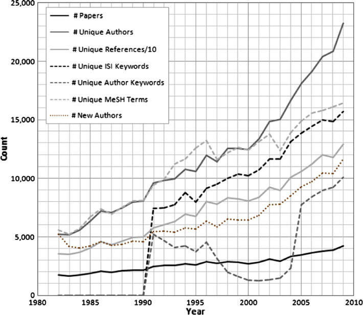
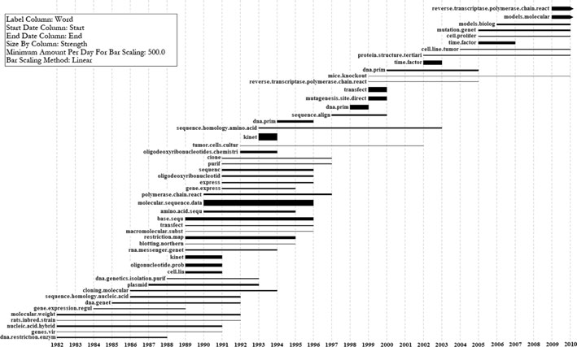
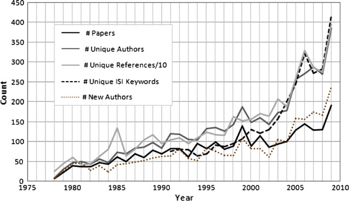
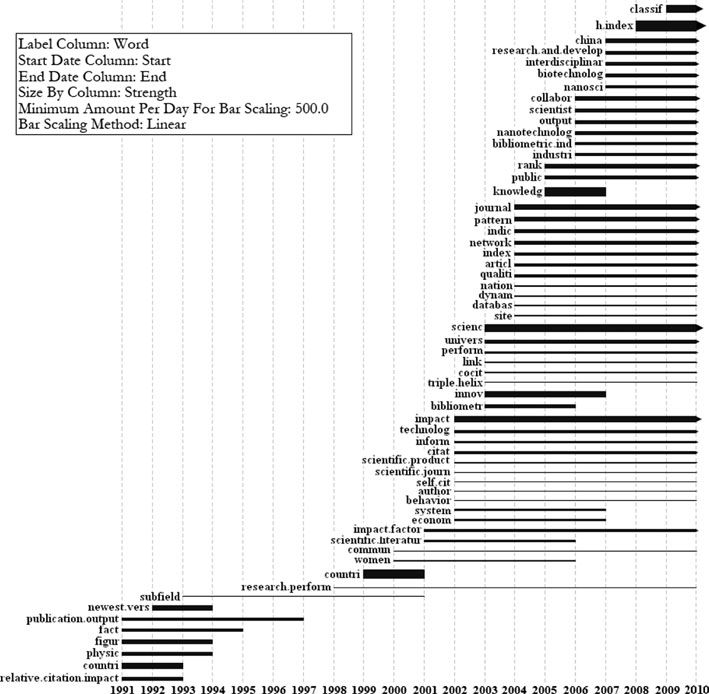
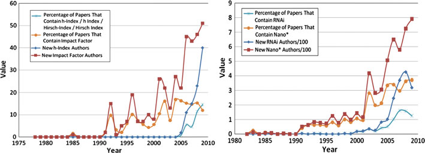
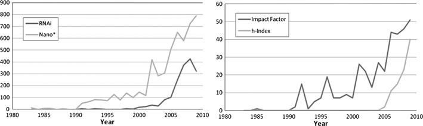
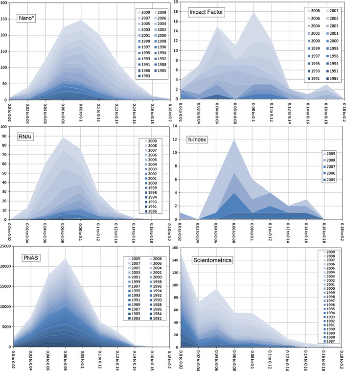
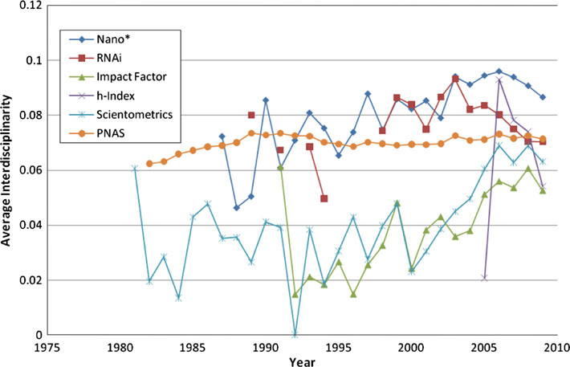
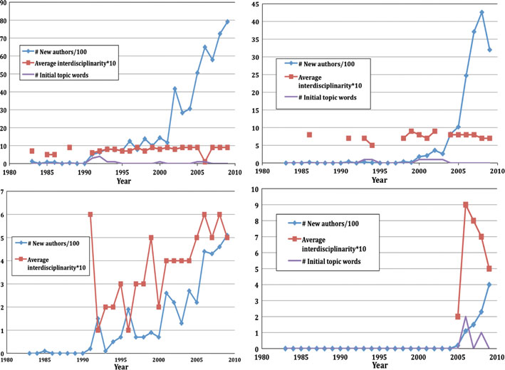

# Mixed-indicators model for identifying emerging research areas

**Hanning Guo · Scott Weingart · Katy Börner**

Received: 2 June 2011 / Published online: 21 June 2011
© Akadémiai Kiadó, Budapest, Hungary 2011

## Abstract

This study presents a mixed model that combines different indicators to describe and predict key structural and dynamic features of emerging research areas. Three indicators are combined: sudden increases in the frequency of specific words; the number and speed by which new authors are attracted to an emerging research area, and changes in the interdisciplinarity of cited references. The mixed model is applied to four emerging research areas: RNAi, Nano, h-Index, and Impact Factor research using papers published in the *Proceedings of the National Academy of Sciences of the United States of America* (1982–2009) and in *Scientometrics* (1978–2009). Results are compared in terms of strengths and temporal dynamics. Results show that the indicators are indicative of emerging areas and they exhibit interesting temporal correlations: new authors enter the area first, then the interdisciplinarity of paper references increases, then word bursts occur. All workflows are reported in a manner that supports replication and extension by others.

**Keywords**  Burst detection · Prediction · Emerging trend · Temporal dynamics · Science of science (Sci²) tool

---

H. Guo (✉)
WISE Lab, Dalian University of Technology, Dalian, China
e-mail: guoh@indiana.edu

H. Guo · S. Weingart · K. Börner
Cyberinfrastructure for Network Science Center, School of Library and Information Science, Indiana University, Bloomington, IN, USA

S. Weingart
e-mail: scbweing@indiana.edu

K. Börner
e-mail: katy@indiana.edu

*Scientometrics* (2011) 89:421–435
DOI 10.1007/s11192-011-0433-7

<!-- page 421 -->

## Introduction and related work

The identification of emerging research trends is of key interest to diverse stakeholders. Researchers are attracted to promising new topics. Funding agencies aim to identify emerging areas early to encourage their growth via interdisciplinary workshops, solicitations, and funding awards. Industry monitors and exploits promising research to gain a competitive advantage. Librarians need to create new categories and special collections to capture emerging areas. The public at large has a general interest in understanding cutting-edge science and its impact on daily life. While it is not recommendable to "oversell" or "over promise" new research, it is desirable to catch the attention of the media, graduate students, and funding agencies.

Different approaches have been proposed to identify emerging research areas (Lee 2008; Takeda and Kajikawa 2009), their level of maturity (Serenko et al. 2010; Watts and Porter 2003), and their speed of development (Van Raan 2000; Braun et al. 1997). The first and perhaps most difficult task is the delineation of all research areas. Zitt and Bassecoulard (2008) and Lewison (1991) studied how to define research areas. There are various ways to define research areas such as grouping specialist journals, collecting a list of authors, running topical queries according to the field terminology, etc. Hence, much work on emerging areas of research has been done in hindsight—using a set of by then established keywords, e.g., nano, neuro, or highly cited "pioneering" papers to run term based or cited reference searches. Sometimes, all papers published in one or several journals are analyzed. None of these approaches catch all work published on a topic, however, their results can be a reasonable proxy for analysis. The method of using established words to refine an emerging research area is taken in this study.

Science indicators have been deployed to examine the emergence or growth of scientific fields, such as Price's index (Price 1970), immediacy index (Garfield and Small 1989) and currency index (Small 2006). Lucio-Arias and Leydesdorff (2007) explore the emergence of knowledge from scientific discoveries and its disrupting effects in the structure of scientific communication. They apply network analysis to illustrate this emergence in terms of journals, words and citations. Work by Leydesdorff and Schank (2008) examines changes in journal citation patterns during the emergence of a new area. Kajikawa et al. (2008) detects emerging technologies by using citation network analysis, finding that fuel and solar cell research are rapidly growing domains. Scharnhorst and Garfield (2010) proposed author- and text-based approaches of historiography and field mobility to trace the influence of a specific paper of Robert K. Merton (1968). The historiograph of the citation flows around Merton's paper of 1968 reveals the emergence of the new field of Science and Technology Studies in the 1970s. They show that studying a research area's origin papers or following a scholar's academic trajectory are pragmatic ways to trace the spread of knowledge.

Many researchers use quantitative models to study how ideas spread within scientific communities and how scientific fields develop over time. Goffman conducted several studies (1966, 1971; Goffman and Harmon 1971; Goffman and Newill 1964) to mathematically model the temporal development of scientific fields. He maintains that an epidemic model can predict the rise and fall of a particular research area. Luís M. A. Bettencourt et al. (2008) analyze the temporal evolution of emerging areas within several scientific disciplines according to numbers of authors and publications using contagion models developed in epidemiology.

Several studies identify emerging topic trends using Kleinberg's (2003) burst detection algorithm. This algorithm employs a probabilistic automaton whose states correspond to the frequencies of individual words and state transitions correspond to points in time around which the frequency of the word changes significantly. Given a set of time stamped text, e.g., abstracts and publication years of papers, the algorithm identifies those abstract words that experience a sudden increase in usage frequency and outputs a list of these words together with the begin and end of the burst and the burst strength that indicates the change in usage frequency. <!-- page 422 --> Mane and Börner (2004) applied the burst algorithm to identify highly bursting words as indicators of future trends in a *Proceedings of the National Academy of Sciences* (PNAS) dataset covering biomedical and other research in 1982–2001. Chen (2006) applied the same algorithm to identify emergent research-front concepts in datasets retrieved via term search. Later work by Chen et al. (2009) combines burst detection as a temporal property with betweenness centrality as a structural property to evaluate the impact of transformative science and knowledge diffusion.

"Mixed indicators model" section of this paper introduces a mixed model approach to the identification of emerging research areas. "Data acquisition and preparation" section introduces two datasets used to exemplify and validate the model. "Model application to h-Index, impact factor for *Scientometrics* and RNAi, Nano* for *PNAS*" section applies the mixed model approach to four research areas and the interdisciplinarity indicator to the two datasets from section "Data acquisition and preparation" and discusses the results. "Model validation" section compares and validates the different indicators. "Discussion and outlook" section concludes this paper with a general discussion and an outlook to future work.

## Mixed indicators model

This paper introduces, applies, and validates a combination of partial indicators to identify emerging research areas. Specifically, the following three hypotheses are examined as indicators:

1. Word bursts precede the widespread usage of words and indicate new research trends,
2. Emerging areas quickly attract new authors, and
3. Emerging areas cite interdisciplinary references.

The first indicator utilizes prior research by Mane, Börner, and Chen (see "Introduction and related work" section). The second indicator was inspired by the work of Kuhn (1970) and Menard (1971). Kuhn argued that scientific revolutions are begun and adopted by new scientists in the field. Menard's work on the growth of scientific areas showed that an area does not grow by "old scientists" accepting and working on new ideas but by attracting new, typically young scientists. The third indicator was inspired by the fact that emerging research areas grow out of existing research, i.e., expertise taught in school and practice, and it cites existing relevant work from diverse lines of research. Intra-area citation is not possible as no research yet exists on the new topic. The two following datasets will be used to introduce, exemplify, and validate the proposed set of indicators.

## Data acquisition and preparation

The study uses two datasets: all 75,389 papers published in the *Proceedings of the National Academy of Sciences* in 1982–2009 and all 2,653 papers published in *Scientometrics* from its creation in 1978 to 2009. *PNAS* is highly interdisciplinary and unlikely to capture the entire work of any single author. *Scientometrics* is domain specific, might capture main works of single authors, and is much smaller in size.

### PNAS data and statistics

*PNAS* data was downloaded from Thomson Reuters's Web of Science (*WoS*) (Thomson Reuters 2010) on 2/18/2010 with the publication name query *Proceedings of the National* <!-- page 423 --> *Academy of Sciences of the United States of America* or *Proceedings of the National Academy of Sciences of the United States of America Physical Science* or *Proceedings of the National Academy of Sciences of the United States of America Biological Science*.

The retrieval resulted in 95,715 records. Using *WoS*'s "Refine Results" function, the dataset was restricted to those 75,389 records published in 1982–2009. It comprises 69,939 articles, 1,892 editorial materials, 1,112 proceedings papers, 1,060 corrections, 770 correction additions, 206 reviews, 181 letters, 157 biographical items, 60 notes, 2 reprints, and 1 tribute to Roger Revelle's contribution to carbon dioxide and climate change studies.

Employing the Science of Science (Sci²) Tool (Sci2 Team 2009a), the number of new unique authors per year, unique references (CR), unique ISI keywords, and unique author keywords were calculated (see Fig. 1). As no author or ISI keywords existed before 1991, 184,246 MeSH terms were added using the procedure introduced by Boyack (2004). All terms from the paper titles, author keywords, ISI keywords, and MeSH terms were merged into one "ID" field. The "ID" field was further processed by

- Removing a common set of stop words using the Sci² Tool stop word list (Sci2 Team 2009b), and all individual letters and numbers.
- Removing all punctuations except "-" or "/."
- Reducing multiple whitespaces to just one space and removing leading and trailing whitespace.
- Lower-casing all words.
- Replacing all "-" and spaces with period separators to preserve compound words.
- Stemming all ID words using the Sci² tool. Common or low-content prefixes and suffixes are removed to identify the core concept. For example "emergent" will be replaced by "emerg."
- Normalizing the "AU" author field by uppercasing first letters for more legible labelling.

Two author's names, "Wei-Dong-Chen" and "Yu-Lin," were manually changed into "Chen, WD" and "Lin, Y," and "in vitro" and "in vivo" were replaced by "invitro" and "invivo" respectively.

**Fig. 1**  Number of unique *PNAS* papers, authors, ISI keywords, author keywords, MeSH terms, references/10 and new authors from 1982 to 2009

<!-- page 424 -->

To understand this dataset's temporal dynamics, bursts, i.e., sudden increases in the frequency of words in titles, new ISI keywords, author keywords and MeSH terms were identified. The top 50 results are shown in Fig. 2. Each bursting word is shown as horizontal black bar with a start and ending time, sorted by burst start year. The bar's area represents burst strength. The words "molecular.weight," "nucleic.acid.hybrid," "dna.restriction.enzym," "rats.inbred.strain," and "genes.vir" (given in the lower left) burst first. The first two words have a higher burst strength, which is indicated by their larger area. Between 1982 and 1991, more words are bursting than in any other period, and the top 3 bursting words ("molecular.sequence.data," "base.sequ" and "restriction.map") appear in this time span. Words "models.molecular" and "reverse.transcriptase.polymerase.chain.react" burst in 2009 and are still ongoing. Figure 2 also shows words that burst multiple times, e.g., "dna.prim" bursts in 1994, 1998 and 2000, "kinet," "reverse.transcriptase.polymerase.chain.react," "time.factor," and "transfect" burst twice over the time span.

**Fig. 2**  *Horizontal bar graph* of top 50 bursting topic words from *PNAS*

<!-- page 425 -->

### Scientometrics data and statistics

All papers published in the journal *Scientometrics* from 1978 to 2009 were downloaded from *WoS* (Thomson Reuters 2010) on 3/15/2010. The dataset includes 2,653 records: 1,894 articles, 387 proceedings papers, 93 book reviews, 74 notes, 73 editorial materials, 34 reviews, 27 letters, 22 biographical-items, 17 bibliographies, 11 meeting abstracts, 8 items about an individual, 7 corrections/additions, 4 corrections, 1 discussion, and 1 news item.

The number of unique papers per year, authors, references, ISI keywords and new authors were identified, and unique ISI keywords were further processed as those in "*PNAS* data and statistics" section. Author names "VANRAAN, AFJ," "vanRaan, AFJ," "VanRaan, AFJ," "Van Raan, AFJ," and "van Raan, AFJ" were manually replaced by "Vanraan, AFJ" and the ISI keyword "Hirsch-index" was replaced by "h-index." Counts per year for all six variables are plotted in Fig. 3.

The same temporal analysis workflows as "*PNAS* data and statistics" section were then run to identify bursts in ISI keywords and results are shown in Fig. 4 (see "*PNAS* data and statistics" section for how to read horizontal bar graphs). In the early 1990s, studies in *Scientometrics* mainly focused on Scientometrics indicators, especially of relative citation impact. These studies originated from Braun et al. (1987, 1989a, b) and were followed by several publications with "facts and figures" in the titles. The amount of bursting words per year suddenly increased after 2000. Only 10 bursting words appeared from 1991 to 1999, while 50 bursting words appeared in the following 10 years. Studies related to "scienc," "impact" and "journal" are the top three bursting topics in the 2000s. Indicators of scientometric methodologies bursted in this time period, as evidenced by the burstiness of "impact factor," "indic," "index," "h.index," "cocit," "citat" and "self.cit." Figure 4 shows that "h.index" was the burstiest word related to indicators over the entire timespan of the dataset. The h-index, proposed by Hirsch (2005), inspired discussions on its <!-- page 426 --> strengths and limitations, as well as research on improved indicators. The word "countri" is the only word that burst twice, from 1991 to 1993 and from 1999 to 2001, indicating the interest in country level, geospatially explicit studies such as Chu (1992), Adamson (1992), Tsipouri (1991), Kim (2001), etc. The Triple Helix innovation model was another bursting topic, as indicated by the burstiness of "triple.helix," and it contributed to the burstiness of "univers" and "innov."

**Fig. 3**  Number of unique papers published in *Scientometrics*, their authors, ISI keywords, references/10 and new authors for the years 1978–2009

**Fig. 4**  *Horizontal bar graph* of all bursting ISI keywords from *Scientometrics*

<!-- page 427 -->

## Model application to h-Index, impact factor for *Scientometrics* and RNAi, Nano* for *PNAS*

### Construction of datasets

A single journal such as *PNAS* or *Scientometrics* records the (often parallel) emergence of multiple areas of research over time. To understand the structure and temporal dynamics of different indicators for concrete areas of research, publications for four emerging areas were extracted: "h-Index" and "Impact Factor" for *Scientometrics*, and "RNAi" and "Nano*" for *PNAS*. Keywords were chosen that represent topically diverse research areas at different stages of their lives in order to account for topic- or time-specific biases.

These four research areas are clearly very different in nature; however, without a clear corpus of every paper in a particular area, keywords were used which were unique and specific enough to encompass a great many papers surrounding a particular topic or method while still avoiding unrelated publications. The keywords "h-Index" and "impact factor" represent specific topics within the larger umbrella of performance indicators a rather active area of research in *Scientometrics*. "Nano*" represents a set of research related by several common factors and RNAi represents the study of or using a single biological system. It is a contention of this study that new and specific vocabulary is a close enough proxy to emerging cohesive research that it can be used in dataset selection. However, the mixed indicator approach presented here can be used with any canonical list of publications representing an area, topic, discipline, etc., and we hope to be able to use these indicators on more accurate lists as they become available.

Figure 5 shows the percentage of papers in *Scientometrics* or *PNAS* which contain each set of keywords. For example, the term "impact factor" appeared in 23 *Scientometrics* paper abstracts or titles in 2009, a total of 192 *Scientometrics* study were published in 2009, and hence the value for that keyword in 2009 is 11.98. The chart also includes the number of unique authors per year who published a paper with that keyword for the first time. The number of new authors from *PNAS* (Fig. 5, right) has been divided by 100 to fit the scale of the chart.

**Fig. 5**  Papers containing given keywords and the amount of authors publishing papers with those keywords for the first time in *Scientometrics* (*left*) and *PNAS* (*right*)

### Emerging areas are preceded by word bursts

Table 1 shows all bursting words related to topics of "RNAi," "Nano*," and "h-Index"; no bursting words related to "Impact Factor." All words are sorted by start year. For example, research on h-index is mostly focused on ranking measurements, scientists' activities, and journal impact factor studies. The h-index was proposed in 2005 and words began bursting the next year. In this case, word bursts help pinpoint topics trends.

<!-- page 428 -->

**Table 1**  Bursting topic words for "RNAi", "Nano*", and "h-Index"

| Word | Strength | Start | End |
| --- | --- | --- | --- |
| **RNAi** | | | |
| messenger.rna | 6.36 | 1993 | 2002 |
| antisense.rnai | 3.11 | 1994 | 2002 |
| caenorhabditis.elegan | 3.87 | 2000 | 2006 |
| functional.genomic.analysi | 3.09 | 2001 | 2003 |
| double.stranded.rna | 5.16 | 2002 | 2003 |
| gene | 2.96 | 2003 | 2005 |
| **Nano*** | | | |
| express | 6.73 | 1991 | 1999 |
| bind | 3.90 | 1991 | 2001 |
| sequenc | 3.77 | 1991 | 2003 |
| rat.brain | 4.83 | 1992 | 2001 |
| gene | 3.90 | 1992 | 1997 |
| clone | 3.48 | 1992 | 1999 |
| site | 3.18 | 1992 | 1996 |
| inhibit | 3.37 | 1993 | 2002 |
| identif | 3.48 | 1994 | 2000 |
| design | 4.01 | 2000 | 2003 |
| microscopi | 3.67 | 2005 | 2005 |
| peptid | 3.64 | 2006 | 2006 |
| **h-Index** | | | |
| rank | 2.97 | 2006 | 2007 |
| scientist | 2.56 | 2006 | 2006 |
| journal | 2.43 | 2008 | |

### Emerging areas quickly attract new authors

To understand the attraction of emerging research areas to authors, all unique authors and the year of their first published paper in the dataset was found (see Fig. 6). Topics "RNAi" and "Nano*" experience a noticeable increase in the number of new authors. The number of new authors in "Impact Factor" and "h-Index" also increase remarkably quickly. The sudden increase of new authors to "h-Index" research after 2005 is attributable to the influence of Hirsch's paper published in 2005.

In future work we plan to analyze the origin of new authors (from what areas of science are they coming?) and to study their key features such as career age.

### Emerging areas cite highly interdisciplinary references

It is assumed that papers in a new research area cite papers from many areas of research, as no papers yet exist in the nascent area. Thus, sudden increases in the diversity of cited references might indicate an emerging research area. In order to test the interdisciplinarity of the sets of papers containing "Nano*," "RNAi," "Impact Factor," and "h-Index," each set was mapped to the UCSD Map of Science (Klavans and Boyack 2009). This map clusters more than 16,000 journals into 554 disciplines and gives the similarity between these disciplines. An interdisciplinarity score (see Eq. 1) per year was given to "Nano*," <!-- page 429 --> "RNAi," "Impact Factor," and "h-Index" using the "Rao-Stirling diversity" (Rao 1982; Stirling 2007). The distribution of references in each paper across the map of science was calculated. Then, the "Rao-Stirling diversity" *D* was calculated for each pair of referenced disciplines on the map. The probability of the first discipline (*p_i*) was multiplied by the probability of the second discipline (*p_j*) and the distance between the two disciplines (*d_ij*), which was then summed for the distribution.

$$
D = \sum_{ij\,(i \ne j)} p_i \cdot p_j \cdot d_{ij} \tag{1}
$$

*d_ij* was calculated as the great-circle distance between disciplines, rather than the more standard Euclidean distance, because the UCSD map is laid out on the surface of a sphere. The result is an aggregate measurement of the diversity of individual papers and their references. We define this diversity as interdisciplinarity rather than multidisciplinarity because it measures individual paper references rather than the spread of references across an entire journal or dataset. Porter and Rafols (2009) also used "Rao-Stirling diversity" to measure how the degree of interdisciplinarity has changed between 1975 and 2005 for six research domains.

**Fig. 6**  Number of new authors per year for "RNAi" and "Nano*" research areas (*left*) versus "Impact Factor" and "h-Index" research areas (*right*)

Figure 7 shows the interdisciplinary distribution of each set of documents per year over time. Several references could not be matched directly with journals in the UCSD Map of Science. If fewer than 50% of a paper's references mapped onto the UCSD map, the paper was excluded from the analysis. Older papers were more likely to be excluded from the analysis, as the further back in time citations go, the less likely their journal would be represented on the UCSD Map of Science. The newest papers' references also experienced a dip in their matches on the UCSD map, as they may have been citing journals too new to be mapped. Between 50 and 80% of *Scientometrics* references were not mapped, probably due to the high volume of monograph citations. This is one likely cause of the significantly different internal distributions of interdisciplinarity between *Scientometrics* and *PNAS*, whose references could consistently match to the UCSD map 70% of the time.

Average interdisciplinarity was calculated by taking the average interdisciplinary score across all papers in a given set per year. "Nano*," "RNAi," "Impact Factor," "h-Index" and *Scientometrics* all show an increase in average interdisciplinarity of references over time (see Fig. 8). This may be an indicator that the areas are still expanding in the number and diversity of attracted authors and ideas from different areas. Interestingly, works published in all of *PNAS* since 1982 show virtually no change in their level of interdisciplinarity over time, demonstrating the continuous very high level of interdisciplinarity of papers in this journal.

<!-- page 430 -->

**Fig. 7**  Interdisciplinarity of references cited in "Nano*" (*upper left*), "RNAi" (*middle left*), "Impact Factor" (*upper right*), "h-Index" (*middle right*), *PNAS* (*bottom left*) and *Scientometrics* (*bottom right*) datasets. *Darker areas* indicate earlier publications, the *y* axis indicates the number of papers with a certain interdisciplinarity score, where *x* = 0 is the least interdisciplinarity possible

## Model validation

### Comparison of indicators

The three different indicators provide different insights. The number and type of bursting words is an indicator of the intensity and topical direction of change. The number of new authors an area manages to attract reveals the brain drain from other research areas to itself. The interdisciplinarity of paper references gives an indicator of the diversity and topical origin of the base knowledge from which the new area draws.

Each of the four datasets do have a steady increase in the number of new authors and interdisciplinarity scores which might be an indicator that all four of them are emerging <!-- page 431 --> areas of research. More datasets, especially ones representing established or dying research areas, are needed to make more concrete conclusions.

### Temporal dynamics

Comparing the temporal dynamics of the three indicators reveals correlations between them, see Fig. 9. The figure shows that the appearance of new authors always signified the beginning of an emerging area. In "Nano*," "RNAi" and "h-Index" datasets, a sudden increase in the diversity of cited references occurred with the appearance of new authors simultaneously. Word bursts occurred 8 years later for "Nano*," 7 years later for "RNAi" and only 1 year later for "h-Index." For "Impact Factor" dataset, a sudden increase in the diversity of cited references occurred 6 years after new authors appeared. The correlation between increasing new authors and diversity of cited references suggests that new authors are coming from diverse established areas rather than some already nascent cohort with a pre-existing body of research.

**Fig. 8**  Average interdisciplinarity of references cited in the six datasets per year

## Discussion and outlook

This paper presented, exemplified, and compared three indicators that seem to be indicative of emerging areas and have interesting temporal correlations: new authors enter the area first, the interdisciplinarity of paper references increases, then word bursts occur. Although the indicators are descriptive, they can be applied to identify new areas of research and hence have a certain predictive power.

The datasets used to validate the model have limitations. With only two journals, journal-specific rather than subject-specific trends might dominate. As *Scientometrics* <!-- page 432 --> publishes relatively few papers, keyword filtering resulted in even smaller sets. The use of two largely unrelated journals and two unrelated sets of keywords was an attempt to offset journal-specific or discipline-specific artefacts, as was the use of keywords at different stages of their popularity and use. Future work should use a larger and more diverse dataset of emerging research areas.

Diversity was measured using the UCSD Map of Science covering 2001–2005 data. However, the structure of science evolved continuously since the first paper in this study was published in 1978. Two problems arise: papers that were initially highly interdisciplinary but were part of a larger trend linking multiple disciplines in the future will be seen as less interdisciplinary than they ought to be. This may explain why *PNAS* seems to slowly increase in interdisciplinarity over time (see Fig. 8). Secondly, the UCSD map does not capture journals that ceased to exist before 2001 or did not yet exist in 2005 (see "Emerging areas cite highly interdisciplinary references" section). An updated version of the UCSD map covering the years 2001–2010 will soon become available.

**Fig. 9**  Temporal dynamics of three indicators for "Nano*" (*upper left*), "RNAi" (*upper right*), "Impact Factor" (*bottom left*), and "h-Index" (*bottom right*)

Future work will add additional indicators (e.g., densification of scholarly networks during the maturation of a research area; a combination of lexical and citation based information) but also other datasets (e.g., data of mature or dying areas) to the indicator-by-dataset validation matrix to make sure the indicators are:

- efficient to calculate,
- predictive, i.e., give different results for mature or dying areas, and
- stable, i.e., are robust regarding data errors/omissions.

<!-- page 433 -->

We welcome replications of this study and suggestions for improvements. The open source Science of Science Tool (Sci2 Team 2009a) can be downloaded from http://sci2.cns.iu.edu. All workflows used in this study as well as the *Scientometrics* dataset are available online as part of the Sci2 Tool tutorial (Weingart et al. 2010).

**Acknowledgments**  We would like to thank Joseph Biberstine and Russell J. Duhon for developing custom queries and code and appreciate the expert comments from the three anonymous reviewers. This work is funded by the James S. McDonnell Foundation and the National Institutes of Health under awards R21DA024259 and U24RR029822.

## References

Adamson, I. (1992). Access and retrieval of information as coordinates of scientific development and achievement in Nigeria. *Scientometrics, 23*(1), 191–199.

Bettencourt, L., Kaiser, D., Kaur, J., Castillo-Chavez, C., & Wojick, D. (2008). Population modeling of the emergence and development of scientific fields. *Scientometrics, 75*(3), 495–518.

Boyack, K. W. (2004). Mapping knowledge domains: Characterizing PNAS. *Proceedings of the National Academy of Sciences of the United States of America, 101*(Suppl 1), 5192–5199.

Braun, T., Glänzel, W., & Schubert, A. (1987). One more version of the facts and figures on publication output and relative citation impact of 107 countries, 1978–1980. *Scientometrics, 11*(1), 9–15.

Braun, T., Glänzel, W., & Schubert, A. (1989a). Assessing assessments of British science: Some facts and figures to accept or decline. *Scientometrics, 15*(3), 165–170.

Braun, T., Glänzel, W., & Schubert, A. (1989b). The newest version of the facts and figures on publication output and relative citation impact: A collection of relational charts, 1981–1985. *Scientometrics, 15*(1–2), 13–20.

Braun, T., Schubert, A., & Zsindely, S. (1997). Nanoscience and nanotechnology on the balance. *Scientometrics, 38*(2), 321–325.

Chen, C. (2006). Citespace II: Detecting and visualizing emerging trends and transient patterns in scientific literature. *Journal of the American Society for Information Science and Technology, 57*(3), 359–377.

Chen, C., Chen, Y., Horowitz, M., Hou, H., Liu, Z., & Pellegrino, D. (2009). Towards an explanatory and computational theory of scientific discovery. *Journal of Informetrics, 3*(3), 191–209.

Chu, H. (1992). Communication between Chinese and non-Chinese scientists in the discovery of high-TC superconductors: II. The informal perspective. *Scientometrics, 25*(2), 253–277.

Garfield, E., & Small, H. (1989). Identifying the change frontiers of science. In M. Kranzberg, Y. Elkana, & Z. Tadmor (Eds.), *Conference proceedings of innovation: At the crossroads between science and technology* (pp. 51–65). Haifa, Israel: The S. Neaman Press.

Goffman, W. (1966). Mathematical approach to the spread of scientific ideas: The history of mast cell research. *Nature, 212*(5061), 452–499.

Goffman, W. (1971). A mathematical method for analyzing the growth of a scientific discipline. *Journal of Association for Computing Machinery, 18*(2), 173–185.

Goffman, W., & Harmon, G. (1971). Mathematical approach to the prediction of scientific discovery. *Nature, 229*(5280), 103–104.

Goffman, W., & Newill, V. A. (1964). Generalization of epidemic theory: An application to the transmission of ideas. *Nature, 204*(4955), 225–228.

Hirsch, J. E. (2005). An index to quantify an individual's scientific research output. *Proceedings of the National Academy of Sciences of the USA, 102*(46), 16569–16572.

Kajikawa, Y., Yoshikawaa, J., Takedaa, Y., & Matsushima, K. (2008). Tracking emerging technologies in energy research: Toward a roadmap for sustainable energy. *Technological Forecasting and Social Change, 75*(6), 771–782.

Kim, M.-J. (2001). A bibliometric analysis of physics publications in Korea, 1994–1998. *Scientometrics, 50*(3), 503–521.

Klavans, R., & Boyack, K. W. (2009). Toward a consensus map of science. *Journal of the American Society for Information Science and Technology, 60*(3), 455–476.

Kleinberg, J. (2003). Bursty and hierarchical structure in streams. *Data Mining and Knowledge Discovery, 7*(4), 373–397.

Kuhn, T. S. (1970). *The structure of scientific revolutions*. Chicago: University of Chicago Press.

<!-- page 434 -->

Lee, W. H. (2008). How to identify emerging research fields using scientometrics: An example in the field of information security. *Scientometrics, 76*(3), 1588–2861.

Lewison, G. (1991). The scientific output of the EC's less favoured regions. *Scientometrics, 21*(3), 383–402.

Leydesdorff, L., & Schank, T. (2008). Dynamic animations of journal maps: Indicators of structural changes and interdisciplinary developments. *Journal of the American Society for Information Science and Technology, 59*(11), 1810–1818.

Lucio-Arias, D., & Leydesdorff, L. (2007). Knowledge emergence in scientific communication: From "Fullerenes" to "nanotubes". *Scientometrics, 70*(3), 603–632.

Mane, K., & Börner, K. (2004). Mapping topics and topic bursts in PNAS. *Proceedings of the National Academy of Sciences of the United States of America (PNAS), 101*(Suppl 1), 5287–5290.

Menard, H. W. (1971). *Science: Growth and change*. Cambridge, MA: Harvard Univ Press.

Merton, R. K. (1968). The matthew effect in science: The reward and communication systems of science are considered. *Science, 159*(3810), 56–63.

Porter, A. L., & Rafols, I. (2009). Is science becoming more interdisciplinary? Measuring and mapping six research fields over time. *Scientometrics, 81*(3), 719–745.

Price, D. J. D. S. (1970). Citation measures of hard science, softscience, technology, and nonscience. In C. E. A. P. Nelson, D. (Ed.), *Communication among scientists and engineers* (pp. 3–12): Heath Lexington Books, Massachusetts.

Rao, C. R. (1982). Diversity: Its measurement, decomposition, apportionment and analysis. *Sankhyā: The Indian Journal of Statistics, Series A, 44*(1), 1–22.

Scharnhorst, A., & Garfield, E. (2010 in press). Tracing scientific influence. *Dynamic of Socio-Economic System, 2*(1).

Sci2 Team. (2009a). *Science of Science (Sci2) Tool*: Indiana University and SciTech Strategies, Inc. http://sci2.cns.iu.edu. Accessed 8 June 2010.

Sci2 Team. (2009b). *Stop word list*. http://nwb.slis.indiana.edu/svn/nwb/trunk/plugins/preprocessing/edu.iu.nwb.preprocessing.text.normalization/src/edu/iu/nwb/preprocessing/text/normalization/stopwords.txt. Accessed 11 June 2010.

Serenko, A., Bontis, N., Booker, L., Sadeddin, K., & Hardie, T. (2010). A scientometric analysis of knowledge management and intellectual capital academic literature (1994–2008). *Journal of Knowledge Management, 14*(1), 3–23.

Small, H. (2006). Tracking and predicting growth areas in science. *Scientometrics, 63*(3), 595–610.

Stirling, A. (2007). A general framework for analysing diversity in science, technology and society. *Journal of the Royal Society Interface, 4*(15), 707–719.

Takeda, Y., & Kajikawa, Y. (2009). Optics: A bibliometric approach to detect emerging research domains and intellectual bases. *Scientometrics, 78*(3), 543–558.

Thomson Reuters (2010). *Web of science*. http://scientific.thomsonreuters.com/products/wos/. Accessed 8 June 2010.

Tsipouri, L. (1991). Effects of EC R&D policy on Greece: Some thoughts in view of the stride programme. *Scientometrics, 21*(3), 403–416.

Van Raan, A. F. J. (2000). On growth, ageing, and fractal differentiation of science. *Scientometrics, 47*(2), 1588–2861.

Watts, R. J., & Porter, A. L. (2003). R&D cluster quality measures and technology maturity. *Technological Forecasting and Social Change, 70*(8), 735–758.

Weingart, S., Guo, H., Börner, K., Boyack, K. W., Linnemeier, M. W., & Duhon, R. J., et al. (2010). *Science of Science (Sci2) Tool User Manual*. http://sci2.wiki.cns.iu.edu. Accessed 28 Jan 2011.

Zitt, M., & Bassecoulard, E. (2008). Challenges for scientometric indicators: Data de-mining, knowledge flows measurements and diversity issues. *Ethics in Science and Environmental Politics, 8*, 49–60.

<!-- page 435 -->
