---
# --- identity ---
title: "Journal of Digital Humanities"
subtitle: "Vol. 2, No. 1 (Winter 2012): the topic modeling special issue"
authors:
  - { family: "Weingart", given: "Scott B.", role: "guest editor" }
  - { family: "Meeks", given: "Elijah", role: "guest editor" }
  - { family: "Cohen", given: "Daniel J.", role: "editor" }
  - { family: "Fragaszy Troyano", given: "Joan", role: "editor" }
  - { family: "Hoffman", given: "Sasha", role: "associate editor" }
  - { family: "Wieringa", given: "Jeri", role: "associate editor" }
author_note: "Guest editors of the issue, followed by the journal's editors as printed."
editors:
  - { family: "Cohen", given: "Daniel J.", role: "editor" }
  - { family: "Fragaszy Troyano", given: "Joan", role: "editor" }
  - { family: "Hoffman", given: "Sasha", role: "associate editor" }
  - { family: "Wieringa", given: "Jeri", role: "associate editor" }
  - { family: "Meeks", given: "Elijah", role: "guest editor" }
  - { family: "Weingart", given: "Scott B.", role: "guest editor" }
contributors:
  - "David M. Blei"
  - "Megan R. Brett"
  - "David Mimno"
  - "Lisa M. Rhody"
  - "Andrew Goldstone"
  - "Ted Underwood"
  - "Benjamin M. Schmidt"
  - "Shawn Graham"
  - "Ian Milligan"
  - "Adam Crymble"
# --- publication ---
publication_type: "journal_issue"
container_title: "Journal of Digital Humanities"
journal: "Journal of Digital Humanities"
volume: "2"
issue: "1"
publisher: "Roy Rosenzweig Center for History and New Media, George Mason University (a PressForward publication)"
publisher_place: "Fairfax, VA"
# --- dates ---
issued: "2013"
year: 2013
# --- identifiers ---
issn: "2165-6673"
url: "http://journalofdigitalhumanities.org/2-1/"
# --- descriptive ---
keywords: ["topic modeling", "digital humanities", "LDA", "MALLET", "Paper Machines", "text mining"]
language: "en"
license: "CC-BY 3.0"
# --- provenance ---
source_pdf: "Journal Of Digital Humanities 2-1.pdf"
source_pdf_sha256: "18ca8f1404129152b8eaa1e2a4b35831c0eb3a7ac421b1a535162e51a54f5c6b"
page_count: 83
extraction_date: "2026-08-01"
extraction_tool: "claude scholarly-pdf-to-markdown skill"
extraction_notes: |
  Full edited issue (83 landscape pages, 1024x748, produced with iBooks Author),
  converted as one combined markdown. Digital-native text layer; no OCR. Layout is
  two columns per page read left column then right; section dividers ("Beginnings",
  "Applications & Critiques", "Reviews") and the cover are single-column pages.
  Structure: issue title as the single H1; every article title, section divider, and
  the Contributors page as H2 (mirroring the issue's own structure); article-internal
  headings as H3. Small-caps author bylines rendered as bold uppercase lines beneath
  each article title. Metadata (editors, ISSN, license) from the cover and masthead;
  Crossref/network was not reachable, so all metadata comes from the PDF itself.
  In-text endnote markers are red bracketed numbers restarting per article; they were
  renumbered globally as markdown footnotes, with each article's "Notes:" definitions
  kept in place at the article's end. Hyperlinks reconstructed from PDF link
  annotations; some annotation URIs are truncated in the source PDF itself (an iBooks
  Author export flaw, e.g. a tedunderwood.com and a lisarhody.com target) and are
  reproduced as stored. Poem-title links inside Tables 2 and 3 and a few other styled
  link texts carry no URI annotation in the PDF, so they appear as plain text.
  Tables 1-3 (Rhody) and the two data-appendix topic tables reconstructed as GFM
  tables from the text layer using the ruled grid. The R code appendix pages (67-72)
  are screenshots in the source and are embedded as images (their code is not
  separately transcribed, matching the source). Figures cropped at 200 DPI; figure
  numbering fig-001... follows reading order. Review info-boxes (MALLET / Paper
  Machines version blocks, Helvetica) and iBooks "Editor's Note" asides rendered as
  block quotes / caption paragraphs. Section-divider mini-TOC entries reformatted as
  list items with leader dots collapsed to an em dash. Page anchors use the printed
  folio (front matter "i"; body 1-82); the unfoliated cover is anchored as "cover".
  The cover date reads "Winter 2012"; the issue was released in 2013 (PDF created
  2013-04-24). MANIFEST.txt included.
bibkey: "weingartVol2No2013"
---

# Journal of Digital Humanities, Vol. 2, No. 1


VOL. 2 NO. 1 WINTER 2012

DANIEL J. COHEN, EDITOR

JOAN FRAGASZY TROYANO, EDITOR

SASHA HOFFMAN, ASSOCIATE EDITOR

JERI WIERINGA, ASSOCIATE EDITOR

ELIJAH MEEKS & SCOTT WEINGART, GUEST EDITORS

ISSN 2165-6673 CC-BY 3.0

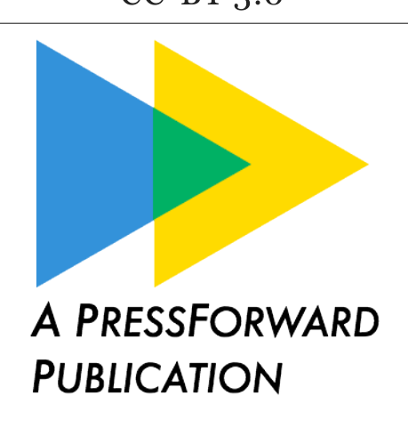

ROY ROSENZWEIG CENTER FOR HISTORY AND NEW MEDIA

GEORGE MASON UNIVERSITY

<!-- page cover -->

## Pacing Scholarly Conversations

The advancement of scholarship relies on the timely communication of questions, methods, results, and reflections. The iterative publications [*Digital Humanities Now*](http://digitalhumanitiesnow.org/) and the [*Journal of Digital Humanities*](http://journalofdigitalhumanities.org/) are intended to facilitate this process. *DHNow* surfaces and distributes the conversations weekly in order to invite participation and feedback. The *Journal of Digital Humanities* then identifies the conversations that need a stable landing on which to pause and reflect before continuing onward.

In the past year the scholarly conversation about the practice of topic modeling has taken place in workshops and through extended conversations online. This issue of the *Journal of Digital Humanities* draws from that gray literature of presentations, blog posts, and unpublished papers. Under the guidance of our guest editors Elijah Meeks and Scott B. Weingart, several new pieces were solicited for this special issue, and two were greatly expanded from ongoing research projects.

This issue reflects the expertise and investment in topic modeling from a wide range of disciplines and practitioners, including historians, literary scholars, archaeologists, technologists, and information scientists. We think you will agree that topic modeling is a practice within digital humanities that is ready for a moment of serious engagement with questions and methods before taking another leap forward.

Daniel J. Cohen and Joan Fragaszy Troyano, Editors

<!-- page i -->

## The Digital Humanities Contribution to Topic Modeling

**ELIJAH MEEKS AND SCOTT WEINGART**

Topic modeling could stand in as a synecdoche of digital humanities. It is distant reading in the most pure sense: focused on corpora and not individual texts, treating the works themselves as unceremonious “buckets of words," and providing seductive but obscure results in the forms of easily interpreted (and manipulated) “topics.” In its most commonly used tool, it runs in the command line. To achieve its results, it leverages occult statistical methods like “dirichlet priors” and “bayesian models.” Were a critic of digital humanities to dream up the worst stereotype of the field, he or she would likely create something very much like this, and then name a popular implementation of it after a hammer.

Since 2010, introductions to topic modeling for humanists have appeared with increasing frequency. Most offer you a list of words, all apparently related yet in no discernible order, identified as a “topic.” You’re introduced to topics, and how a computer came to generate them automatically without any prior knowledge of word definitions or grammar. It’s amazing, you read, but not magic: a simple algorithm that can be understood easily if only you are willing to dedicate an hour or two to learn it. The results would speak for themselves, and a decade ago you would have been forgiven if you imagined only a human could have produced the algorithm’s output. You would marvel at the output, for a moment, before realizing there isn’t much immediately apparent you can actually do with it, and the article would list a few potential applications along with a slew of caveats and dangers. We are ready, now, for a more sustained and thorough exploration of topic modeling.

In our role as guest editors, we have designed this issue of the *Journal of Digital Humanities* to push the conversation on topic modeling and also to reflect on the larger community in which it is situated. We believe the rapid pace of communication about topic modeling, the focus on workshops and gray literature and snippets of code, the mixed methods invoked and used, are an ideal introduction to what it means to be a digital humanist in a networked world. This is not to say that the issue is another round in defining the digital humanities – far from it – the pieces herein provide an understanding of how to do topic modeling, what to use, its dangers, and some excellent examples of topic models in practice.

Just as tools are enshrined methodologies, methods like topic modeling are reflections of movements. Topic modeling itself is about 15 years old, arriving from the world of computer science, machine learning, and information retrieval. It describes a method of extracting clusters of words from sets of documents. Topic modeling has been applied to datasets in multiple domains, from bioinformatics to comparative literature, and to documents ranging in size from monographs to tweets. One particular variety of topic model, an approach called Latent Dirichlet Allocation (LDA), along with its various derivatives, has been the most popular approach to topic modeling in the humanities.

LDA originated in David M. Blei’s computer science lab in 2002/2003 in collaboration with David N. Blei and Andrew Y. Ng,[^1] and the term LDA <!-- page 2 --> has since become nearly synonymous with topic modeling in general. Over the last several years, LDA crept slowly into the humanities world. The software team behind MALLET, by far the most popular tool for topic modeling in the humanities, was led by computer scientist Andrew McCallum and eventually included David Mimno, a researcher with a background in digital humanities. Around the same time, computer scientist David J. Newman and historian Sharon Block collaborated on topic modeling an eighteenth century newspaper,[^2] a project culminating in the history article “Doing More with Digitization”[^3] in 2006. Others at Stanford and elsewhere continued working fairly quietly combining topic modeling with digital humanities for some time, before the explosion of interest that began in 2010.

Two widely circulated blog posts first introduced topic modeling to the broader digital humanities community: Matthew L. Jockers on [topic modeling a Day of DH](http://www.matthewjockers.net/2010/03/19/whos-your-dh-blog-mate-match-making-the-day-of-dh-bloggers-with-topic-modeling/) and Cameron Blevins on [a late eighteenth century diary](http://dh2011abstracts.stanford.edu/xtf/view?docId=tei/ab-173.xml;query=;brand=default). Then at one of the first NEH-funded Institutes for Advanced Topics in the Digital Humanities, held at UCLA in August 2010 and focusing on [network analysis](http://www.ipam.ucla.edu/programs/hum2010/), Mimno, Blei, and David Smith introduced many digital humanists to topic modeling for the first time.[^4] Since that time, dozens of tutorials, walkthroughs, techniques, implementations, and cries of frustration have been posted through various web outlets, often inspiring multithreaded conversations, reply posts, or backchannel Twitter chatter.

In this additional way topic modeling typifies digital humanities: the work is almost entirely represented in that gray literature. While there is a hefty bibliography for spatial analysis in humanities scholarship, for example, in order to follow research that deploys topic modeling for humanities inquiry you must read blogs and attend conference presentations and workshops. For those not already participating in the conversation, this dispersed discussion can be a circuitous and imposing barrier to entry. In addition to sprawling across blogs, tweets, and comment threads, contributions also span methods and disciplines, employ sophisticated visualizations, sometimes delve into statistics and code, and other times adopt the language of literary critique.

This topical issue of the *Journal of Digital Humanities* is meant to catch and present the most salient elements of the topic modeling conversation: a comprehensive introduction, technical details, applications, and critiques from a humanistic perspective. By doing so, we hope to make topic modeling more accessible for new digital humanities scholars, highlight the need for existing practitioners to continue to develop their theoretical approaches, and further sketch out the relationship between this particular method and those of the broader digital humanities community.

This issue also features an experimental this-space-left-intentionally-blank section; any conversation inspired by this issue over the next month, either [posted as a comment](http://journalofdigitalhumanities.org/2-1/respond-to-jdh-2-1/) or tagged [on Twitter](http://journalofdigitalhumanities.org/2-1/responses-from-twitter/) using #JDHTopics, will eventually be folded into the issue itself as supplemental material. Naturally, this forthcoming section also will include some topic modeling of that material. While we hope the engagement with this issue continues for some time, only material submitted by May 11, 2013 will be included in the final addition to the issue.

### Section 1: Concepts

The creator of LDA, David M. Blei, opens the issue with an original article offering a [grand narrative of topic modeling and its application in the humanities](http://journalofdigitalhumanities.org/2-1/topic-modeling-and-digital-humanities-by-david-m-blei/). He explains the basic principles behind topic modeling, frames it in relation to probabilistic modeling as a field, and <!-- page 3 --> explores modeling as a tool for finding and expressing meaning. Blei urges humanities scholars to focus on the model in topic modeling, echoing Willard McCarty’s claim that “modeling points the way to a computing that is *of* as well as *in* the humanities: a continual process of coming to know by manipulating representations.”[^5]

A more [instructional piece](http://journalofdigitalhumanities.org/2-1/topic-modeling-a-basic-introduction-by-megan-r-brett/) is presented by Megan R. Brett, to frame the conversations appearing in this issue. Originally written to introduce students to topic modeling, Brett brings together many invaluable resources and examples. Those unfamiliar with topic modeling will find this piece particularly helpful context for the remaining articles in this special issue.

Next [David Mimno’s presentation](http://journalofdigitalhumanities.org/2-1/the-details-by-david-mimno/), given at the Maryland Institute of Technology and the Humanities (MITH) [topic modeling workshop](http://mith.umd.edu/topicmodeling/) in November 2012, provides the most accessible introduction to the math behind topic modeling available. Mimno argues that those intending to implement topic modeling should understand the details of behind topic modeling, and offers an insightful presentation about how topic models are trained, evaluated, and visualized.

### Section 2: Applications and Critiques

If topic modeling has recently inspired a wealth of introductions for humanists, actual applications written in humanities channels have been harder to come by until very recently. Perhaps two of the most notable projects are Matthew L. Jockers’ forthcoming book *Macroanalysis*, which explores literature using – among other methods – topic modeling,[^6] and David Mimno’s recent article on topic modeling the last century of classics journals.[^7]

Lisa M. Rhody provides a long piece drawn from her dissertation research project that [extends the traditionally thematic-oriented topic modeling to figurative and poetic language](http://journalofdigitalhumanities.org/2-1/topic-modeling-and-figurative-language-by-lisa-m-rhody/). She explores the productive failure of topic modeling, which highlights the processual nature of topic modeling, and reinforces the dialectic with traditional reading. Rhody’s work is perhaps the best evidence thus-far that what we might have identified as cohesive “topics” are more complex than simple thematic connections; indeed, “topics” are more closely related to what Ted Underwood calls “discourses,” a comparison discussed in greater detail within the article. Some of her raw model data is available in an [appendix](http://journalofdigitalhumanities.org/2-1/topic-model-data-for-topic-modeling-and-figurative-language-by-lisa-m-rhody/).

Andrew Goldstone and Ted Underwood offer a [history of literary criticism through topic models of *PMLA*](http://journalofdigitalhumanities.org/2-1/what-can-topic-models-of-pmla-teach-us-by-ted-underwood-and-andrew-goldstone/). In this piece, originally crossposted on their blogs, they integrate network analysis and representation to better understand and simultaneously complicate the results of the topic models they run. By highlighting the process of topic modeling, Goldstone and Underwood reveal how different methodological choices may lead to contrasting results.

Because topic modeling transforms or compresses free data (raw narrative text) into structured data (topics as a ratio of word tokens and their strength of representation in documents) it is tempting to think of it as “solving” text. Ben Schmidt [addresses this in an expansion and revision of his earlier critiques of topic modeling and its use in the humanities](http://journalofdigitalhumanities.org/2-1/words-alone-by-benjamin-m-schmidt/). As with other pieces in this edition, his research integrates what are becoming less and less distinct computational methods – in this case data visualization and spatial analysis – to better understand the strengths and weaknesses of topic models. The result is a call for caution in the use of topic modeling because it moves scholars away from interpreting language – their great strength – toward interpreting “topics," an ill-defined act which might provide the <!-- page 4 --> false security of having resolved the distinction between a word and the thing that it represents. Schmidt’s code is available in an [appendix](http://journalofdigitalhumanities.org/2-1/code-appendix-for-words-alone-by-benjamin-m-schmidt/).

### Section 3: Tools

Two tools in particular have enjoyed wide adoption among digital humanists: [MALLET](http://mallet.cs.umass.edu/), produced by Andrew McCallum and computer scientists, and [Paper Machines](https://github.com/chrisjr/papermachines), created and developed by Jo Guldi and Chris Johnson-Roberson. For those looking to try their hand at topic modeling their own sets of documents, the *Programming Historian* includes a [tutorial on MALLET](http://programminghistorian.org/lessons/topic-modeling-and-mallet) by Shawn Graham, Scott B. Weingart, and Ian Milligan; and Sarita Alami of the Emory Digital Scholarship Commons offers a two-part series ([Part I](http://web.library.emory.edu/blog/supercharge-your-zotero-library-using-paper-machines-part-i), [Part II](http://web.library.emory.edu/blog/supercharge-your-zotero-library-using-paper-machines-part-ii-6)) introducing Paper Machines.

Ian Milligan and Shawn Graham, authors of the *Programming Historian*’s [tutorial on MALLET](http://programminghistorian.org/lessons/topic-modeling-and-mallet) (with Scott B. Weingart), offer here [a review not only of how the tool works, but what it means as an instantiation of a method](http://journalofdigitalhumanities.org/2-1/review-mallet-by-ian-milligan-and-shawn-graham/). The review includes links to tutorials and guides to get started, as well as some rumination on the “magic” of topic modeling.

Adam Crymble provides [a review of Paper Machines](http://journalofdigitalhumanities.org/2-1/review-papermachines-by-adam-crymble/), an open source tool which connects with Zotero to analyze sets of documents collected therein. Crymble situates topic modeling in a typical research ecosystem of analysis and search, and ties into the growing prevalence of information visualization techniques of digital humanities work.

***Critical Engagement***

In digital humanities research we use tools, make tools, and theorize tools not because we are all information scientists, but because tools are the formal instantiation of methods. That is why MALLET often stands in for topic modeling and topic modeling often stands in for the digital humanities.

The work in this issue integrates the Natural Language Processing technique of topic modeling with network representation, GIS, and information visualization. This approach takes advantage of the growing accessibility of tools and methods that had until recently required great resources (technical, professional, and financial). MALLET is an argument about text using topic modeling that a scholar employs. Scholars can choose to engage with and adjust the algorithms in MALLET. But the tool itself also allows for uncritical use of machinery built for Natural Language Processing.

The humanities is unused to such formal simulacra, however, and so a journal about scholarship might appear to be a journal about tools and software. But none of the authors in this issue simply run and accept the results as “useful” or “interesting” for humanities scholarship. Instead, they critically wrestle with the process. Their work is done with as much of a focus on what the computational techniques obscure as reveal.

Traditional humanities scholars often equate digital humanities with technological optimism. Rather the opposite is true: digital humanists offer the jaundiced realization that computational techniques like topic modeling – long held inaccessible and unapproachable and therefore unassailable – are not an upgrade from simplistic human-driven research, but merely more tools in the ever-growing shed. Whether as part of a particular research agenda, or the method as enshrined in tools, or as a part of a larger movement toward modeling in the humanities, topic modeling in the humanities has been deployed critically. The adoption of “critical technique” is just what you would expect from scholars accustomed to “critical reading.”

<!-- page 5 -->

### Notes:

[^1]: David M. Blei, Andrew Y. Ng, and Michael I. Jordan, "Latent Dirichlet allocation," Journal of Machine Learning Research 3 (4–5) (2003): 993–1022. doi:10.1162/jmlr.2003.3.4-5.993.

[^2]: D.J. Newman and S. Block, [Probabilistic topic decomposition of an eighteenth-century American newspaper](http://www.ics.uci.edu/~newman/pubs/JASIST_Newman.pdf), Journal of the American Society for Information Science and Technology 57(6) (2006): 753– 767. doi:10.1002/asi.20342.

[^3]: S. Block, "[Doing More with Digitization](http://www.common-place.org/vol-06/no-02/tales/)," Common-Place 6(2) (2006).

[^4]: Clay Templeton describes this narrative in more detail at the MITH blog.

[^5]: W. McCarty, “Modeling: A Study in Words and Meanings,” in A Companion to Digital Humanities, ed. Susan Schreibman, Ray Siemens, John Unsworth (Oxford: Blackwell, 2004) [http://www.digitalhumanities.org/companion/](http://www.digitalhumanities.org/companion/).

[^6]: M. L. Jockers, Macroanalysis: Digital Methods and Literary History  (University of Illinois Press, 2013).

[^7]: D. Mimno, "Computational historiography: Data mining in a century of classics journals," Journal on Computing and Cultural Heritage 5 (1) (2012): 3:1–3:19. doi:10.1145/2160165.2160168.

<!-- page 6 -->

## Beginnings

- **Topic Modeling and Digital Humanities**, David M. Blei — 8

- **Topic Modeling: A Basic Introduction**, Megan R. Brett — 12

- **The Details: Training and Validating Big Models on Big Data**, David Mimno — 17

<!-- page 7 -->

## Topic Modeling and Digital Humanities

**DAVID M. BLEI**

### Introduction

Topic modeling provides a suite of algorithms to discover hidden thematic structure in large collections of texts. The results of topic modeling algorithms can be used to summarize, visualize, explore, and theorize about a corpus.

A topic model takes a collection of texts as input. It discovers a set of "topics'' – recurring themes that are discussed in the collection – and the degree to which each document exhibits those topics. Figure 1 illustrates topics found by running a topic model on 1.8 million articles from the *New York Times*. The model gives us a framework in which to explore and analyze the texts, but we did not need to decide on the topics in advance or painstakingly code each document according to them. The model algorithmically finds a way of representing documents that is useful for navigating and understanding the collection.

In this essay I will discuss topic models and how they relate to digital humanities. I will describe latent Dirichlet allocation, the simplest topic model. I will explain what a "topic'' is from the mathematical perspective and why algorithms can discover topics from collections of texts.[^8]

I will then discuss the broader field of probabilistic modeling, which gives a flexible language for expressing assumptions about data and a set of algorithms for computing under those assumptions. With probabilistic modeling for the humanities, the scholar can build a statistical lens that encodes her specific knowledge, theories, and assumptions about texts. She can then use that lens to examine and explore large archives of real sources.

### Topics

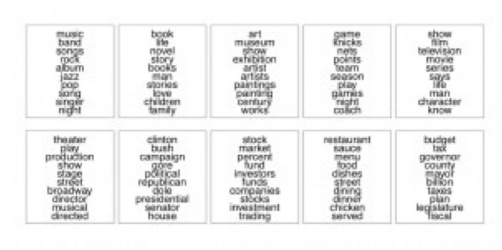

Figure 1: Some of the topics found by analyzing 1.8 million articles from the *New York Times*. Each panel illustrates a set of tightly co-occurring terms in the collection. Hoffman, M., Blei, D. Wang, C. and Paisley, J. “Stochastic variational inference.” *Journal of Machine Learning Research*, forthcoming.

The simplest topic model is latent Dirichlet allocation (LDA), which is a probabilistic model of texts. Loosely, it makes two assumptions:

<!-- page 8 -->

1. There are a fixed number of patterns of word use, groups of terms that tend to occur together in documents. Call them *topics*.

2. Each document in the corpus exhibits the topics to varying degree.

For example, suppose two of the topics are *politics* and *film*. LDA will represent a book like James E. Combs and Sara T. Combs' *Film Propaganda and American Politics: An Analysis and Filmography* as partly about *politics* and partly about *film*.

We can use the topic representations of the documents to analyze the collection in many ways. For example, we can isolate a subset of texts based on which combination of topics they exhibit (such as *film* and *politics*). Or, we can examine the words of the texts themselves and restrict attention to the *politics* words, finding similarities between them or trends in the language. Note that this latter analysis factors out other topics (such as *film*) from each text in order to focus on the topic of interest.

Both of these analyses require that we know the topics and which topics each document is about. Topic modeling algorithms uncover this structure. They analyze the texts to find a set of topics – patterns of tightly co-occurring terms – and how each document combines them. Researchers have developed fast algorithms for discovering topics; the analysis of of 1.8 million articles in Figure 1 took only a few hours on a single computer.

What exactly is a topic? Formally, a topic is a probability distribution over terms. In each topic, different sets of terms have high probability, and we typically visualize the topics by listing those sets (again, see Figure 1). As I have mentioned, topic models find the sets of terms that tend to occur together in the texts.[^9] They look like "topics'' because terms that frequently occur together tend to be about the same subject.

But what comes after the analysis? Some of the important open questions in topic modeling have to do with how we use the output of the algorithm: How should we visualize and navigate the topical structure? What do the topics and document representations tell us about the texts? The humanities, fields where questions about texts are paramount, is an ideal testbed for topic modeling and fertile ground for interdisciplinary collaborations with computer scientists and statisticians.

### The Wider World of Probabilistic Models

Topic modeling sits in the larger field of *probabilistic modeling*, a field that has great potential for the humanities. Traditionally, statistics and machine learning gives a "cookbook" of methods, and users of these tools are required to match their specific problems to general solutions. In probabilistic modeling, we provide a language for expressing assumptions about data and generic methods for computing with those assumptions. As this field matures, scholars will be able to easily tailor sophisticated statistical methods to their individual expertise, assumptions, and theories.[^10]

In particular, LDA is a type of probabilistic model with hidden variables. Viewed in this context, LDA specifies a *generative process*, an imaginary probabilistic recipe that produces both the hidden topic structure and the observed words of the texts. Topic modeling algorithms perform what is called *probabilistic inference*. Given a collection of texts, they reverse the imaginary generative process to answer the question "What is the likely hidden topical structure that generated my observed documents?''

The generative process for LDA is as follows. First choose the topics, each one from a distribution over distributions. Then, for each <!-- page 9 --> document, choose topic weights to describe which topics that document is about. Finally, for each word in each document, choose a topic assignment – a pointer to one of the topics – from those topic weights and then choose an observed word from the corresponding topic. Each time the model generates a new document it chooses new topic weights, but the topics themselves are chosen once for the whole collection.[^11] I emphasize that this is a conceptual process. It defines the mathematical model where a set of topics describes the collection, and each document exhibits them to different degree. The inference algorithm (like the one that produced Figure 1) finds the topics that best describe the collection under these assumptions.

Probabilistic models beyond LDA posit more complicated hidden structures and generative processes of the texts. As examples, we have developed topic models that include syntax, topic hierarchies, document networks, topics drifting through time, readers' libraries, and the influence of past articles on future articles. Each of these projects involved positing a new kind of topical structure, embedding it in a generative process of documents, and deriving the corresponding inference algorithm to discover that structure in real collections. Each led to new kinds of inferences and new ways of visualizing and navigating texts.

What does this have to do with the humanities? Here is the rosy vision. A humanist imagines the kind of hidden structure that she wants to discover and embeds it in a model that generates her archive. The form of the structure is influenced by her theories and knowledge – time and geography, linguistic theory, literary theory, gender, author, politics, culture, history. With the model and the archive in place, she then runs an algorithm to estimate how the imagined hidden structure is realized in actual texts. Finally, she uses those estimates in subsequent study, trying to confirm her theories, forming new theories, and using the discovered structure as a lens for exploration. She discovers that her model falls short in several ways. She revises and repeats.

Note that the statistical models are meant to help interpret and understand texts; it is still the scholar's job to do the actual interpreting and understanding. A model of texts, built with a particular theory in mind, cannot provide evidence for the theory.[^12] (After all, the theory is built into the assumptions of the model.) Rather, the hope is that the model helps point us to such evidence. Using humanist texts to do humanist scholarship is the job of a humanist.

In summary, researchers in probabilistic modeling separate the essential activities of designing models and deriving their corresponding inference algorithms. The goal is for scholars and scientists to creatively design models with an intuitive language of components, and then for computer programs to derive and execute the corresponding inference algorithms with real data. The research process described above – where scholars interact with their archive through iterative statistical modeling – will be possible as this field matures.

### Discussion

I reviewed the simple assumptions behind LDA and the potential for the larger field of probabilistic modeling in the humanities. Probabilistic models promise to give scholars a powerful language to articulate assumptions about their data and fast algorithms to compute with those assumptions on large archives. I hope for continued collaborations between humanists and computer scientists/ statisticians. With such efforts, we can build the field of probabilistic <!-- page 10 --> modeling for the humanities, developing modeling components and algorithms that are tailored to humanistic questions about texts.

**Acknowledgments**

The author thanks Jordan Boyd-Graber, Matthew Jockers, Elijah Meeks, and David Mimno for helpful comments on an earlier draft of this article.

### Notes:

[^8]: See Blei, D. 2012. “Probabilistic Topic Models.” Communications of the ACM 55 (4): 77–84. doi: 10.1145/2133806.2133826 for a technical review of topic modeling (and citations). Available online: [http://www.cs.princeton.edu/~blei/papers/Blei2012.pdf](http://www.cs.princeton.edu/~blei/papers/Blei2012.pdf).

[^9]: Some readers may be interested in the details of why topic modeling finds tightly co-occurring sets of terms. Topic modeling algorithms search through the space of possible topics and document weights to find a good representation of the collection of documents. Mathematically, the topic model has two goals in explaining the documents. First, it wants its topics to place high probability on few terms. Second, it wants to attach documents to as few topics as possible. These goals are at odds. With few terms assigned to each topic, the model captures the observed words by using more topics per article. With few topics assigned to each article, the model captures the observed words by using more terms per topic.

This trade-off arises from how model implements the two assumptions described in the beginning of the article. In particular, both the topics and the document weights are probability distributions. The topics are distributions over terms in the vocabulary; the document weights are distributions over topics. (For example, if there are 100 topics then each set of document weights is a distribution over 100 items.)

Distributions must sum to one. On both topics and document weights, the model tries to make the probability mass as concentrated as possible. Thus, when the model assigns higher probability to few terms in a topic, it must spread the mass over more topics in the document weights; when the model assigns higher probability to few topics in a document, it must spread the mass over more terms in the  topics.

[^10]: Technical books about this field include Bishop, C. 2006. Pattern Recognition and Machine Learning. Springer; Koller, D. and Friedman, N. 2009. Probabilistic Graphical Models: Principles and Techniques. MIT Press; and Murphy, K. 2013. Machine Learning: A Probabilistic Approach. MIT Press.

[^11]: The name "latent Dirichlet allocation'' comes from the specification of this generative process. In particular, the document weights come from a Dirichlet distribution – a distribution that produces other distributions – and those weights are responsible for allocating the words of the document to the topics of the collection. The document weights are hidden variables, also known as latent variables.

[^12]: There are some methods. For an excellent discussion of these issues in the context of the philosophy of science, see Gelman, A., and C.R. Shalizi. 2012. “Philosophy and the Practice of Bayesian Statistics.” British Journal of Mathematical and Statistical Psychology 661 (2013): 8-38. doi: 10.1111/j.2044-8317.2011.02037.x.

<!-- page 11 -->

## Topic Modeling: A Basic Introduction

**MEGAN R. BRETT**

The purpose of this post is to help explain some of the basic concepts of topic modeling, introduce some topic modeling tools, and point out some other posts on topic modeling. The intended audience is historians, but it will hopefully prove useful to the general reader.

### What is Topic Modeling?

Topic modeling is a form of text mining, a way of identifying patterns in a corpus. You take your corpus and run it through a tool which groups words across the corpus into ‘topics’. Miriam Posner has [described topic modeling](http://miriamposner.com/blog/?p=1335) as “a method for finding and tracing clusters of words (called “topics” in shorthand) in large bodies of texts.”

What, then, is a topic? One [definition offered on Twitter](https://twitter.com/footnotesrising/status/264823621799780353) during a conference on topic modeling described a topic as “a recurring pattern of co-occurring words.” A topic modeling tool looks through a corpus for these clusters of words and groups them together by a process of similarity (more on that later). In a good topic model, the words in topic make sense, for example “navy, ship, captain” and “tobacco, farm, crops.”

### How does it work?

One way to think about how the process of topic modeling works is to imagine working through an article with a set of highlighters. As you read through the article, you use a different color for the key words of themes within the paper as you come across them. When you were done, you could copy out the words as grouped by the color you assigned them. That list of words is a topic, and each color represents a different topic. Note: this description is inspired by the following illustration from [David Blei's article](http://www.cs.princeton.edu/~blei/papers/Blei2012.pdf) [pdf], which is one of the best visual representations of a topic I’ve found.[^13]

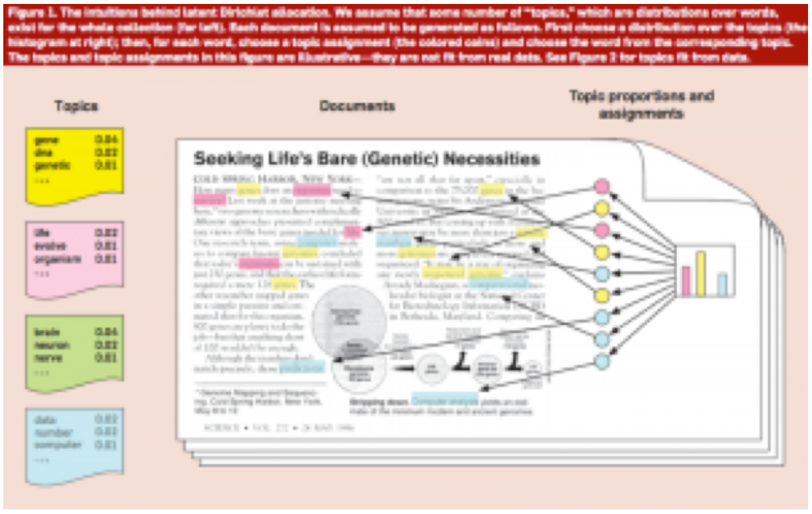

Figure 1: Illustration from Blei, D. 2012. “Probabilistic Topic Models.”

<!-- page 12 -->

How the actual topic modeling programs is determined by mathematics. Many topic modeling articles include equations to explain the mathematics, but I personally cannot parse them. The best non-equation explanation of how at least one topic modeling program assigns words to topics was given by David Mimno at a [conference](http://mith.umd.edu/topicmodeling/) on topic modeling held in November 2012 by the Maryland Institute for Technology in the Humanities and the National Endowment for the Humanities. As he [explains](http://vimeo.com/53080123) (starting at around 9:00), the computer compares the occurrence of topics within a document to how a word has been assigned in other documents to find the best match (you can find Mimno’s [slides on his website](http://www.cs.princeton.edu/~mimno/)).

The model Mimno is explaining is latent Dirichlet allocation, or LDA, which seems to be the most widely used model in the humanities. LDA has strengths and weaknesses, and it may not be right for all projects. It does form the basis of MALLET, which is an open source and fairly accessible tool for topic modeling.

For more detailed explanations of how topic modeling works, and how it can be applied, take a look at the other [speaker videos](http://mith.umd.edu/topicmodeling/speaker-videos/) from the [MITH/NEH conference](http://mith.umd.edu/topicmodeling/). Ted Underwood has offered his explanation of how the process works in a post titled [Topic Modeling Made Just Simple Enough](http://tedunderwood.com/2012/04/07/topic-modeling-made-just-simple-enough/).

Scott B. Weingart has written [an excellent overview of current scholarship on topic modeling](http://www.scottbot.net/HIAL/?p=19113) with links to everything from a [fable- like explanation of topic modeling](http://www.matthewjockers.net/2011/09/29/the-lda-buffet-is-now-open-or-latent-dirichlet-allocation-for-english-majors/) to articles which [delve into the technical side](http://ariddell.org/weblog/2012/07/22/simple-topic-model/). Many of the more complex articles and posts include complex-looking equations, but it is possible to understand the basics of topic modeling without knowing how to unravel the equations.

### What do you need to topic model?

**1. A corpus, preferably a large one** If you wanted to topic model one fairly short document, you might be better off with a set of highlighters or a good pdf annotation tool. Topic modeling is built for large collections of texts. The people behind [Paper Machines](https://github.com/chrisjr/papermachines), a tool which allows you to topic model your Zotero library, recommend that you have at least 1,000 items in the library or collection you want to model. The question of “how big” or “how small” is ultimately subjective, but I think you want to have at least in the hundreds if not a minimum of 1,000 documents in your corpus. Bear in mind that you define what a document is for the tool. If you have a particularly long work you can divide it into pieces and call each piece a document.

With some tools, you will have to prepare the corpus before you can topic model. Essentially what you have to do is tokenize the text, changing it from human-readable sentences to a string of words by stripping out the punctuation and removing capitalization. You can also tell it to ignore “stopwords” which you define, which usually include things like a, the, and, etc. What you (hopefully) end up with is a document with no capitalization, punctuation, or numbers to throw off the algorithms.

There are a number of ways to clean up your text for topic modeling (and text mining). For example, you can use [Python and Regular Expressions](http://www.fredgibbs.net/clio3workspace/blog/cleaning-bad-ocr-with-regular-expressions-and-python/), the [command line](http://www.fredgibbs.net/clio3workspace/blog/cleaning-up-downloaded-files/) (Terminal), and [R](http://www.fredgibbs.net/clio3workspace/blog/reading-with-r/).

If you want to give topic modeling a try, but do not have a corpus of your own, there are sources for large data. You could, for example, download the complete works of Charles Dickens as a series of text files from [Project Gutenberg](http://www.gutenberg.org/), which makes a large number of public domain works available as txt files. [JSTOR Data for Research](http://about.jstor.org/service/data-for-research), which requires <!-- page 13 --> registration, allows you to download the results of a search as a csv file, which is accessible for MALLET and other topic modeling and text mining processes.

**2. Familiarity with the corpus** This may seem counterintuitive if you’re planning to use topic modeling to help you find out more about a large corpus, and yet it is very important that you at least have an idea of what should be there. Topic modeling is not an exact science by any means. The only way to know if your results are useful or wildly off the mark is to have a general idea of what you should be seeing. Most people would probably spot the outlier in a topic of “tobacco, farm, crops, navy” but more complex topics might be less obvious.

**3. A tool to do the topic modeling** However you’re going to topic model, you need to decide what you are going to use and have a way to use it.

Many humanists use [MALLET](http://mallet.cs.umass.edu/) and by extension LDA. MALLET is particularly useful for those who are comfortable working in the command line, and it takes care of tokenizing and stopwords for you. [The Programming Historian](http://programminghistorian.org/) has a [tutorial](http://programminghistorian.org/lessons/topic-modeling-and-mallet) which walks you through the basics of working with MALLET.

The Stanford Natural Language Processing Group has created a visual interface for working with MALLET, [the Stanford Topic Modeling Toolbox](http://nlp.stanford.edu/software/tmt/tmt-0.4/). If you chose to work with TMT, read Miriam Posner’s blog post on very basic strategies for [interpreting results from the Topic Modeling Tool](http://miriamposner.com/blog/?p=1335).

If you have a WordPress install and are comfortable with Python, check out Peter Organisciak’s [post on processing WordPress exports for MALLET](http://www.porganized.com/blog/processing-wordpress-exports-for-mallet).

It is important to be aware that you need to train these tools. Topic modeling tools only return as many topics as you tell them to; it matters whether you specify 50, 5, or 500. If you imagine topic modeling as a switchboard, there are a large number of knobs and dials which can be adjusted. These have to be tuned, mostly through trial and error, before the results are useful.

If you use [Zotero](http://www.zotero.org/), you can use [Paper Machines](https://github.com/chrisjr/papermachines) to topic model particularly large collections. Paper Machines is an open-source project, the [result of a collaboration between Jo Guldi and Chris Johnson-Roberson, supported by Google Summer of Code, the William F. Milton Fund, and metaLAB @ Harvard](http://metalab.harvard.edu/2012/07/paper-machines/). You can do nifty visualizations with Paper Machines, but for topic modeling you need at least 1000 documents. Luckily, you can supplement your Zotero library with data from JSTOR Data for Research.

**4. A way to understand your results** Topic modeling output is not entirely human readable. One way to understand what the program is telling you is through a visualization, but be sure that you know how to understand what the visualization is telling you. Topic modeling tools are fallible, and if the algorithm isn’t right, they can return some bizarre results.

Ben Schmidt, who is using k-means clustering to classify whaling voyages, plugged his data into LDA to [demonstrate the ways in which modeling can return results which ultimately make no sense](http://sappingattention.blogspot.com/2012/11/when-you-have-mallet-everything-looks.html). His post explains the dangers of chimerical models, where two clusters get stuck together (think “cat, fish, mouse” and “gun, rod, hunt”).

<!-- page 14 -->

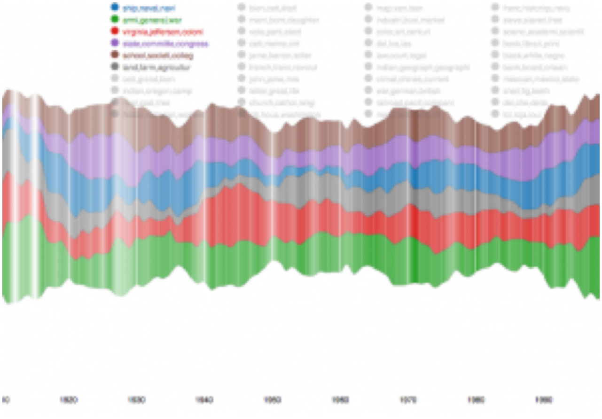

Figure 2: Paper Machines output. Pretty, but what does it mean?

### Topic Modeling and History

Topic modeling is not necessarily useful as evidence but it makes an excellent tool for discovery.

Cameron Blevins has a [series of posts](http://historying.org/martha-ballards-diary/) on his work text mining and topic modeling the diary of Martha Ballard. He has compared his results to Laurel Thatcher Ulrich’s work, which was done by hand, and the two result sets generally align. His work is particularly useful for understanding the potential and limitations of topic modeling, as so many historians are already familiar with the source material, having read Ulrich’s book *A Midwife’s Tale*.[^14] Both Blevins and Ulrich had to be familiar with the content of the diary and its historical context in order to make sense of their findings. The results of the topic modeling help to uncover evidence already in the text.

Newspapers have proved to be a popular subject for topic modeling, as it provides a way to get at change over time from a daily source. David J. Newman, a computer scientists, and Sharon Block, a historian, worked together to topic model the *Pennsylvania Gazette*.[^15] Table 4 in their article ([pdf](http://www.ics.uci.edu/~newman/pubs/JASIST_Newman.pdf)) lists off the most likely words in a topic and the label they assigned to that topic; some of the topics are obvious but others make it clear that you have to understand the context of a corpus in order to read the results. Another example of topic modeling a historic newspaper is a project from the University of Richmond (VA), [Mining the Dispatch](http://dsl.richmond.edu/dispatch/pages/home). The objective of the project was to explore social and political life in Richmond during the Civil War. The site allows you to interact with the topic models with some interpretation. Exploring this site might help you understand how modifying settings in a topic modeling tool changes the output.

Topic modeling is complicated and potentially messy but useful and even fun. The best way to understand how it works is to try it. Don’t be afraid to fail or to get bad results, because those will help you find the settings which give you good results. Plug in some data and see what happens.

Originally published by Megan R. Brett on [December 12, 2012](http://www.fredgibbs.net/clio3workspace/blog/topic-modeling/).

### Notes:

[^13]: Blei, D. 2012. “Probabilistic Topic Models.” Communications of the ACM 55 (4): 77–84. doi: 10.1145/2133806.2133826 Available at [http://www.cs.princeton.edu/~blei/papers/Blei2012.pdf](http://www.cs.princeton.edu/~blei/papers/Blei2012.pdf).

<!-- page 15 -->

[^14]: Laurel Thatcher Ulrich, A Midwife's Tale (New York: Alfred A. Knopf, 1990).

[^15]: David J. Newman and Sharon Block, "Probabilistic Topic Decomposition of an Eighteenth-Century American Newspaper" Journal of the American Society for Information Science and Technology, 57(6):753-767, 2006. Available at [http://www.ics.uci.edu/~newman/pubs/JASIST\_Newman.pdf](http://www.ics.uci.edu/~newman/pubs/JASIST_Newman.pdf)

<!-- page 16 -->

## The Details: Training and Validating Big Models on Big Data

**DAVID MIMNO**

In this video, David Mimno discusses some of the different choices one can make in training models and what their implications are for efficiency, scalability, and topic quality, using the MALLET topic modeling package. This presentation was recorded on November 3, 2012 at the Maryland Institute for Technology as part of the [Topic Modeling Workshop](http://journalofdigitalhumanities.org/wp-admin/mith.umd.edu/topicmodeling), sponsored by the National Endowment of the Humanities and MITH, at the University of Maryland. Slides are available [here](http://www.cs.princeton.edu/~mimno/slides/details.pdf).

DAVID MIMNO, PRINCETON UNIVERSITY

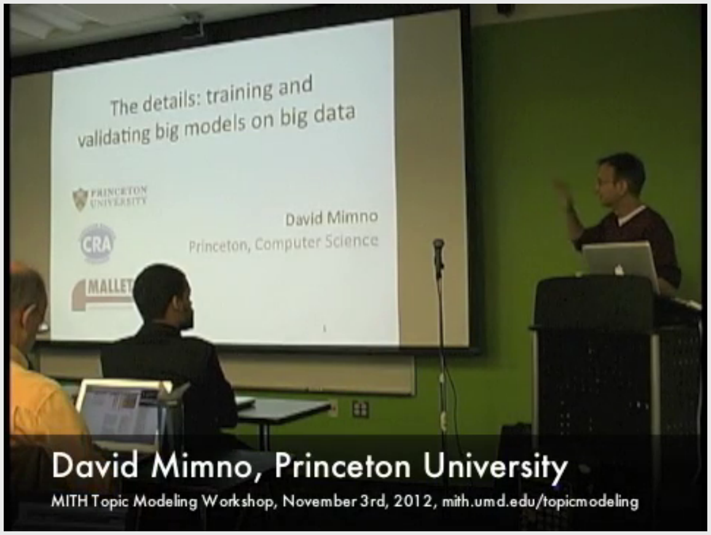

MITH Topic Modeling Workshop, November 3, 2012

<!-- page 17 -->

## Applications & Critiques

- **Topic Modeling and Figurative Language**, Lisa M. Rhody — 19

- **Topic Model Data for Topic Modeling and Figurative Language**, Lisa M. Rhody — 36

- **What Can Topic Models of PMLA Teach Us About the History of Literary Scholarship?**, Andrew Goldstone and Ted Underwood — 39

- **Words Alone: Dismantling Topic Models in the Humanities**, Benjamin M. Schmidt — 49

- **Code Appendix for “Words Alone: Dismantling Topic Models in the Humanities”**, Benjamin M. Schmidt — 66

<!-- page 18 -->

## Topic Modeling and Figurative Language

**LISA M. RHODY**

*… to have them for an instant in her hands both at once, the story and its undoing…* from “Self Portrait as Hurry and Delay” [Penelope at her loom]

Located at the center of Jorie Graham’s collection *The End of Beauty*, “Self Portrait as Hurray and Delay” crafts a portrait of the artist, poised at a precarious moment in which thought begins to take shape. Like Penelope, Graham entertains the illusion, if only momentarily, of a choice between bringing a creative impulse into form or allowing it to come undone. A weaver of language, Graham subtly, deftly, but unsuccessfully attempts to delay the inevitable moment in poetic creation in which complexity of thought adopts form through language, and so realized is also reduced. In *The End of Beauty*, the beginning of the creative act signals an inevitable descent into meaning – language’s ultimate impulse.

Understanding how topic modeling algorithms handle figurative language means allowing for a similar beautiful failure – not a failure of language, but a necessary inclination toward form that involves a diminishing of language’s possible meanings. However, the necessarily reductive methodology of sorting poetic language into relatively stable categories, as topic modeling suggests, yields precisely the kind of results that literary scholars might hope for – models of language that, having taken form, are at the same moment at odds with the laws of their creation.

In the following article, I suggest that topic modeling poetry works, in part, because of its failures. Somewhere between the literary possibility held in a corpus of thousands of English-language poems and the computational rigor of Latent Dirichlet Allocation (LDA), there is an interpretive space that is as vital as the weaving and unraveling at Penelope’s loom.

When Michael Witmore refers to texts as “massively addressable at different levels of scale,” as he does in his two blog posts in *Debates in the Digital Humanities* (2012), he taps into a similar vein of thought as Jorie Graham. Witmore explains that

> What makes a text a text – its susceptibility to varying levels of address – is a feature of book culture and the flexibility of the textual imagination. We address ourselves to this level, in this work, and think about its relation to some other. (325)

In other words, texts can be approached from a multiplicity of perspectives – as bound entities, pages, chapters, paragraphs, poems, or “works.” Textual and literary scholarship requires a willingness to isolate a particular aspect of the text through often abstract or arbitrary constraints, producing what Witmore calls “unities.” To a certain extent, textual scholarship implies a double bind: no one can address a text at all of its possible levels simultaneously, and yet, by constraining our understanding of what a text is, we make a caricature of it. Witmore describes “narrowing” our perspective of a text in caricature <!-- page 19 --> as “willfully abstract in the sense that, at crucial moments of the analysis, we foreground relations as such – relations that should be united with experience” (329).

The constraints of choosing one textual “unity” correspondingly expands our ability to address a larger scale of texts, revealing patterns and relationships that might otherwise have remained hidden. By locating “figurative language” as an aspect of address for topic modeling, I choose to constrain my consideration of poetic texts and agree to a caricature of poetry that hyper-focuses on its figurative aspects so that we can better understand how topic modeling, a methodology that deals with language at the level of word and document, can be leveraged to identify latent patterns in poetic discourse.

***Revising Ekphrasis***

Topic modeling with LDA first captured my attention as a possible way to ask discovery-oriented questions about a genre of poetry called ekphrasis – poems written to, for, or about the visual arts. Contemporary critical models of ekphrasis define the genre through the identification of recurring tropes invoked by poets confronted by the differences between linguistic and visual media. Drawing from a longstanding tradition of competition between poets and painters and the verbal and visual arts, our most recognized critical model for ekphrasis turns on the axis of difference, otherness, hostility, and competition. Conventions of ekphrasis include vocalizing the poet’s frustrated desire for the still, fixed, and feminized image (“[Ode on a Grecian Urn](http://www.poets.org/viewmedia.php/prmMID/15564)” by John Keats); narrating the pregnant moment of the visual work of art (“[Landscape with the Fall of Icarus](http://www.poets.org/viewmedia.php/prmMID/15828)” by William Carlos Williams); recounting one’s visit to a museum as if the reader’s guide or teacher (“[Musée des Beaux Arts](http://english.emory.edu/classes/paintings&poems/auden.html)” by W.H. Auden); describing a figure transfixed on the canvas (“[My Last Dutchess](http://www.poets.org/viewmedia.php/prmMID/15701)” by Robert Browning); or even using the image as a vehicle to travel back through public and personal history (“[For the Union Dead](http://www.poets.org/viewmedia.php/prmMID/15280)” by Robert Lowell). Much like my abbreviated list here, the “canonical” texts used to trace the long-standing tradition of ekphrasis, from Homer’s first description of Achilles’ shield in the *Illiad* to John Ashbury’s "Portrait in a Convex Mirror," have been based until just recently on examples exclusively by men.

LDA, then, offered an attractive alternative for asking questions about the ekphrastic tradition for two reasons. First, as a computational method it allowed me to cast a much wider net. Rather than selecting from just a few poems, LDA allowed me to cast my net as wide as 4,500 poems. Second, both LDA and our existing model of ekphrasis presuppose that latent patterns of language, when discovered, can be used to describe the corpus as a whole. Organizing a corpus of poetry in terms of its participation in recognized conventions of language seemed in keeping with LDA’s assumptions that texts are composed of a fixed number of topics, and so I was drawn to the prospect of using LDA to uncover ways poets enter into, disrupt, or perpetuate the ongoing discourses associated with the tropes that typify ekphrasis.

Therefore, the rationale for deploying LDA as a method of discovery and as a means of understanding the contents of large corpora of texts begins with a similar set of assumptions. For example, LDA assumes that text documents in large corpora tend to draw from categories of language that are associated with the subjects of those documents. In an effort to discover the semantic composition of a large collection of text documents, LDA calculates the likelihood that words that refer to similar subjects appear in similar contexts, and then the LDA algorithm groups those words into “topics.” LDA, then, presupposes that we can discover the semantic composition of a corpus by grouping <!-- page 20 --> into “topics” distributions of words from a set vocabulary that tend to occur together. The process is not unlike the critical assumptions made about ekphrasis – that it draws repeatedly from the same tropes and conventions.

### Unpacking the Assumptions of LDA

Following in the vein of Matthew Jockers, Ted Underwood, Scott Weingart, and others who have published gentle introductions to topic modeling for humanists,[^16] I want to begin with a short, if potentially reductive, narrative of how LDA generates topics from text corpora. I will return to this example throughout the article to illustrate how highly figurative language texts such as poetry respond to LDA differently than texts that strive for more literal meaning.

Imagine that there is a farmers’ market on the other side of town. Many of your neighbors rave about the quality of the produce there, but you would like to know what kinds of produce are available before you decide to drive across town to try it out. One Saturday morning, your neighbors leave for the market with empty baskets and return with full baskets. You assume that your neighbors can only choose from the types of produce available at the farmer’s market and that there is a limited variety of produce available. Since it is happens to be late summer in our fictional story, your neighbors select from 10 types of produce that are available at the market: early Gala and Granny Smith apples, butternut squash, Bosc pears, and one neighbor even snatches up the last pint of blueberries. One by one as your neighbors return, you survey the contents of their baskets. Looking into more and more baskets and revising your predictions, you reconsider based on which produce appears together in a basket the most frequently how to reorganize the 10 produce types.

Examining the quantities and varieties of produce in each basket, you could begin to predict not only the range of produce that might have been at the farmers’ market but also the relative quantities. Over the course of sampling your neighbors’ baskets, you come to the conclusion that the selection of produce at the farmer’s market consists of 20% green apples, 20% red apples, 15% pears, 10% winter squash, 10% cantaloupe, 5% corn, 5% beans, 5% tomatoes and 5% assorted other kinds of produce that were different enough from one another that it makes sense to just call them miscellaneous. As more neighbors arrive, with baskets to examine, you can refine your predictions about what the available selection of produce have been at the market.

In the case of the farmer’s market, your approach to predicting the 10 kinds of produce and the available quantities of each based on the contents of your neighbor’s baskets is akin to the way LDA algorithms approach texts. LDA assumes that documents are like your neighbors’ baskets, and your neighbors are like authors who select from a limited number of available types of words in order to produce documents – in this case poems. Each author chooses to varying degrees how much of each kind of topic they use for each document; however, the number of total available topics, just like the total number of kinds of produce remains constant. While this constraint, the assumption that all the words in a corpus could be derived from a limited set of topics, strikes the human reader as an artificial limitation, it is a necessary constraint in order for LDA to work.

LDA attempts to describe the overall distribution of topics in a collection of texts in the same way that you discovered the types and quantities of produce at the market. The size of the “topics” likewise reflects your estimation of how much of each kind of produce is available. You were able to predict that there were more apples and pears at the market than there were blueberries and tomatoes because <!-- page 21 --> across the whole sampling of baskets there were more apples and pears and fewer pints of blueberries.

There is one significant difference, however, between the human topic model example and the algorithm. LDA does not produce names for the topics it discovers or sort words with an understanding of what words *mean*. Imagine that while you are sorting through baskets, you come across an Asian pear. You’ve never seen an Asian pear before, but the Asian pear was in a basket with a large number of apples and pears. You make note of that, set it in either the apple or pear group temporarily, knowing that you will come back to it after you have gathered more information and continue to sort through baskets. Over the remaining baskets, Asian pears tend to appear in other baskets where there are also other kinds of pears more often than in baskets where there are also apples. As a result, you come to the conclusion that, since Asian pears frequently appear in baskets with other pears, the Asian pear in each future basket should be sorted with the pears. This method of determining how to sort Asian pears reflects the manner in which LDA assigns words to topics, according to the other words that are found in the same document. Although the algorithm cannot account for what words mean, much like your method of discovery about Asian pears, LDA does a surprisingly good job of sorting words based on co-occurrence. Finally, LDA sorts words into topics based on prior knowledge that there are a finite number of topics in the overall corpus – much the same way that you knew to look for 10 types of produce.[^17]

Topic models (and LDA is one kind of topic modeling algorithm) are generative, unsupervised methods of discovering latent patterns in large collections of natural language text: generative because topic models produce new data that describe the corpora without altering it; unsupervised because the algorithm uses a form of probability rather than metadata to create the model; and latent patterns because the tests are not looking for top-down structural features but instead use word-by-word calculations to discover trends in language. David Blei, credited with developing LDA and probabilistic topic modeling methods, describes topic models the following way:

> Topic models have been developed with information engineering applications in mind. As a statistical model, however, topic models should be able to tell us something, or help us form a hypothesis, about the data. What can we *learn* about the language (and other data) based on the topic model posterior? (Blei “Introduction” 84)

Blei stages topic modeling as an *ex post facto* method for challenging our assumptions about natural language data. In other words, once a collection has been created, LDA can test our assumptions about what topics are discoverable.

What drew me to LDA as a tool for discovering latent patterns of language use in ekphrastic poetry was that it seemed particularly wellsuited to identifying the tropes of ekphrastic discourse. One could reasonably expect that since the language of stillness, breathlessness, desire, and competition are commonly found in ekphrastic poetry, that LDA might be able to locate ekphrastic poems within a much larger corpus – in this case 4,500 poems. I wondered, could topic models detect gendered language, tropes, or the language of stillness in ways that “we can *learn*” about the genre more broadly? This is the question that began *Revising Ekphrasis*, a digital topic modeling and corpus discovery project I developed that uses digital and computational tools to explore ekphrastic and non-ekphrastic poetry.

The topic model represented in this article is [one of several from the *Revising Ekphrasis* project](http://journalofdigitalhumanities.org/2-1/topic-model-data-for-topic-modeling-and-figurative-language-by-lisa-m-rhody). I’ve chosen this particular model to focus on for two reasons. It was the first model in the project to produce results that prompted a reconsideration of the tropes and <!-- page 22 --> conventions of ekphrasis. Secondly, it illustrates how figurative language resists thematic topic assignments and by doing so, effectively increases the attractiveness of topic modeling as a methodological tool for literary analysis of poetic texts. Few questions will find “answers” here. Instead the hope is to uncover new methods for addressing enduring humanities questions that we might fruitfully ask about figurative language with LDA.

### LDA Topics and Poetry

A form of text mining developed in response to the growing challenge of managing, organizing, and navigating large, digitized document archives, topic modeling was developed with primarily non-fiction corpora in mind. One of the most notable, early uses of LDA by Blei explores a digitized archive of the journal *Science*. Other exemplary topic modeling projects have used Wikipedia, NIH grants, JSTOR, and an archive of Classics journals.[^18] As literary scholars well know, however, poems exercise language in ways purposefully inverse to other forms of writing, such as journal articles, encyclopedia entries, textbooks, and newspaper articles. Consequently, it is reasonable to predict that there will be differences between topics created by LDA models of poetry and models of non-fiction texts. In terms of the nonfigurative language found in topic models of the journal *Science*, Blei explains that topics detect *thematic* trends across texts:

> We formally define a topic to be a distribution over a fixed vocabulary. For example, the *genetics* topic has words about genetics with high probability and the *evolutionary biology* topic has words about evolutionary biology with high probability. (Blei “Introduction” 78)

Presented as a method of discovery and description, computer scientists see topics as revealing latent thematic trends that pervade large and otherwise unstructured text corpora, and with respect to the data used to create the topic model, this conclusion makes sense and works well.

Since topic modeling was designed to be used with texts that employ as little figurative language as possible, the expectation that words with similar meanings will be found in the same document as other words with related meanings makes sense. This is not the case, however, in a genre like poetry, where the use of highly figurative speech actually increases the scope of the language one might expect to see in a document. For example, literary devices such as metaphor or simile compare two objects, experiences, or feelings that are completely unalike, and in doing so isolates and heightens our awareness of what makes them similar. Poetic texts are more likely to contain purposefully-figurative language; therefore, the first step in understanding how figurative language responds to LDA is to consider what changes occur between the topic assignments in a journal article from *Science* in direct contrast to the same process for a poetic text – in this case, Anne Sexton’s “The Starry Night.”

In order to compare how LDA creates topics in non-figurative texts (*Science)* versus how topics are generated from a corpus of poetry, I begin with an overview of how Blei’s model of 100 topics across 17,000 *Science* articles are created. Next, I create a parallel example using Anne Sexton’s poem “The Starry Night” from a 60 topic model of 4,500 poems from the *Revising Ekphrasis* dataset, pointing out how topic models estimate topic proportions in the document and how topic keyword distributions in poetry are not “thematic” in the way that topic models of non-fiction documents are.

In “Probabilistic Topic Models,” Blei uses two illustrations to explain how topic modeling of a large, digitized collection of *Science* works*.* The first illustration depicts an excerpt from one article within the collection titled “Seeking Life’s Bare (Genetic) Necessities” and <!-- page 23 --> demonstrates the relationship between topics and keyword distributions. His first illustration (Figure 1) uses the colors yellow, pink, green, and blue to represent four of the topics that the model predicts exist in the dataset. Recalling my earlier example of the farmers’ market, the pink, blue, and yellow topics are like the types of produce at the market. On the far right hand side of Figure 1 is a bar graph that represents the proportions of the yellow, pink, and blue topics the model predicts are in the document (an article in this case). The largest topic in the document is yellow followed by pink then blue. The lines from the bar graph on the far right point to the places in the text where words that are associated with the yellow, pink, and blue topics can be found in the document. Essentially, the histogram in Figure 1 is showing the equivalent in the farmers’ market example of there being more apples than pears or grapes in a single basket. On the far left hand side are the first three words of the topic keyword distribution. Those represent the individual produce items in each produce type that could be found in the places in the text that are highlighted in yellow, pink, and blue.

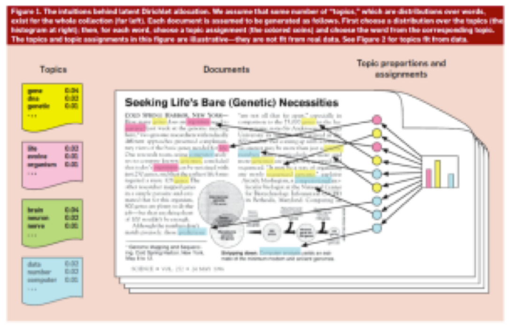

Figure 1: Illustrative example of *Science* topic model (Blei “Introduction” 78)

The graphic in Figure 1 helps to identify how the topic proportions (like the number of apples in a basket of produce from the market) correlate to individual words in the document (highlighted above in yellow, pink, and blue), which then comprise the “topic” keyword distributions that are displayed at the far left as a partial list of keywords.[^19]

Figure 1 is an illustrative example, meaning the document and topic assignments in the graphic are not actually derived from a specific model; however, in a second graphic, Blei continues to explain the how “Seeking Life’s Bare (Genetic) Necessities” appears within a 100 topic model of 17,000 *Science* articles. In Figure 2, Blei represents the probability of each topic using a histogram (bar graph) that demonstrates the relationship between the topics 0-99 (along the horizontal axis) and the probability (as a decimal along the vertical axis) that the topic is found in “Seeking Life’s Bare (Genetic) Necessities.” Some topics have higher probabilities of appearing in the document than others, as represented by the taller bars in the graph. On the right side of the graphic, the topic keyword distributions are listed vertically in columns. At the top of each column is a bolded word surrounded by quotation marks that serves as a label created by Blei to describe the words in the topic and demonstrating Blei’s rationale for claiming that topics are thematic. For example, the topic labeled “Genetics” is predicted by LDA to be the largest topic in the document in much the same way that in the farmer’s market analogy you could determine that the largest produce type in a single basket was from the topic “apples.” In that light, the model’s prediction about “Seeking Life’s Bare (Genetic) Necessities” makes sense. We would normally expect the words human, genome, dna, genetic to be found in articles about “genetic necessities.” By glancing over the words in the topic keyword distributions, we gather together a sense of what the article might be about.

<!-- page 24 -->

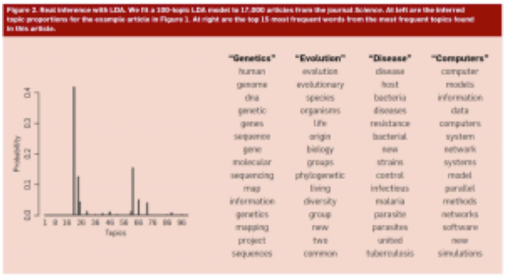

Figure 2: Topic keywords for a single document in *Science* and the proportion of the document described by each topic.

Surveying Blei’s list of key terms in each topic in Figure 2 clarifies the way in which models predict thematic trends in large text corpora. The sense that each of the words in each of the columns belongs together makes a compelling case for LDA’s ability to use Dirichlet allocation to sort large collections of documents into topical categories. Affixing the term “latent” to the statistical model (latent Dirichlet allocation), as Blei explains, foregrounds the expectation that topic modeling is meant to discover hidden patterns within the large collection of texts. It would take even the most proficient human reader an extraordinary period of time to read 17,000 articles from *Science*. Therefore, while we know through disciplinary familiarity and deduction that the topics in Figure 2 are likely topics to be found throughout the journal’s publication, we wouldn’t be able to detect or retain those patterns through human reading. Blei, therefore, concludes that probabilistic topic modeling “provides a powerful tool for discovering and exploiting the hidden thematic structure in large archives of text” (“Introduction” 82).

Unsurprisingly, humanists interested in sorting, sifting, and organizing large collections of text, managing large document archives, and creating better browsing options for digital libraries find LDA’s potential exciting and promising. Furthermore, humanists interested in uncovering the “latent patterns” in large datasets are likewise enthused by the algorithm’s potential for exploratory studies. Most notably, Robert Nelson’s project [*Mining the Dispatch*](http://dsl.richmond.edu/dispatch/) employs LDA to uncover hidden patterns within the archives of the *Richmond Daily Dispatch* just before, during, and after the Civil War. Nelson’s LDA analysis uses the topic distributions over thousands of *Dispatch* articles over the course of the war to track relationships between increases in military draft and fatalities and the patriotic rhetoric. Even more impressively, Nelson’s utilization of LDA is more than a descriptive endeavor because he moves from identifying topic distributions to engaging humanities concerns such as shifts in the rhetoric of nationalism in the Confederate South during the Civil War in relationship to changes in casualty rates and calls for enlistment.[^20] Nelson’s work in this area represents one of the most ambitious and successful projects to date in the humanities that uses probabilistic topic modeling. *Mining the Dispatch* is the first to broach the territory of figurative language and LDA in its analysis of patriotic discourse in Civil War Confederate newspapers. In Nelson’s project, poetry is combined with opinion articles and political and agricultural reports, and the composition of the dataset seemingly allows the poetic texts to map well with its prose counterparts.

However, topic models of purely figurative language texts like poetry do not produce topics with the same *thematic* clarity as those in Blei’s topic model of *Science* or even Nelson’s model of the *Richmond Daily Dispatch.* The literary scholar has good reason to be skeptical about the results of LDA analysis when the dataset to be explored includes primarily, if not exclusively, poetic texts. Given our disparate <!-- page 25 --> expectations for how language should operate in poetry as opposed to non-fiction, should the same standards for evaluating topic models of non-figurative language texts guide the principles we use to evaluate the accuracy of topic models of figurative language collections? How would they differ?

### Evaluating Topic Models of Figurative Language

As Ian H. Witten, Eibe Frank, and Mark A. Hall remind us in *Data Mining: Practical Machine Learning Tools and Techniques,* the guiding factors for text mining generally and topic modeling specifically are to generate *actionable* and *comprehensible* results (9.5).

> **Actionable**: Results should be consistent and reproducible, which means that the model could also be used to make predictions about new data added to the dataset. Of course, whether or not results are indeed actionable depends to a large extent on the ability to find a fair and measurable degree of success. Actionable results require that researchers are clear about their *a priori* assumptions and the composition of the dataset and the predicted degree to which the results might be found reliable.

> **Comprehensible**: For the results of text mining to be useful, humans need to be able to read, to understand, and to interpret them. Frequently, in topic modeling comprehensible results are understood to be thematic or semantically meaningful. In other words, when reading key word distributions, it is usually obvious that there is a thematic array that humans can read and interpret sensibly. For example, in Blei’s keyword distributions the terms “evolution, evolutionary, species, organisms, life, origin” lead to a comprehensible thematic topic: evolution.

Herein lies the rub for texts as highly figurative, purposefully ambiguous, and semantically rich as poetry. Returning once again to Blei’s article, he writes: “The interpretable topic distributions arise by computing the hidden structure that likely generated the observed collection of documents,” which he clarifies further in a footnote:

> Indeed calling these models “topic models” is retrospective – the topics that emerge from the inference algorithm are interpretable for almost any collection that is analyzed. The fact that these look like topics has to do with the statistical structure of observed language and how it interacts with the specific probabilistic assumptions of LDA. (Blei “Introduction” 79)

The topics from *Science* read as comprehensible, cohesive topics because the texts from which they were derived aim to use language that identifies very literally with its subject. The algorithm, however, does not know the difference between figurative and non-figurative uses of language. So the process LDA employs does not change: topics remain a distribution of words over a fixed vocabulary, such that topics are formed only by those words included in the dataset and in the statistical distribution of those words across the entire set. Therefore, *comprehensible* results, in the case of *Science,* seems a reasonable determiner as to whether or not a model is also *actionable.*

What, if anything, changes if we work through a parallel example of how a topic model “reads” Anne Sexton’s “The Starry Night”? The model used for this example used 4,500 poems from the *Revising Ekphrasis* dataset to generate 60 topics. When the collection of poems was prepared for the experiment, words that hold a relatively small amount of semantic weight, but are numerous enough to skew the model’s results, such as articles, frequently used pronouns, conjunctions, prepositions, and pronouns were removed. In the example below, the words removed before the topic model was run have been struck out.

<!-- page 26 -->

Returning to the farmer’s market example from earlier in this article, “The Starry Night” is an example of what one neighbor’s basket of produce (poem/document) might look like. The basket’s contents are distributed much like the produce in the neighbors’ baskets. 29% of the produce (words) would be like apples (Topic 32), 12% of the produce would be corn (Topic 2), and 9% of the produce would be like grapes (Topic 54).[^21] All in all, 50% of the basket (poem/document) can be accounted for by three produce types (topics).[^22] For simplicity’s sake, I have ignored the smaller topics and will focus just on the top three topics found in the document. In order to simulate to some degree the way in which the topic model “reads” the poem, I have crossed out words that would be removed by the stoplist, and highlighted in green (Topic 32), yellow (Topic 2), and blue (Topic 54).

In Table 1, which directly follows the poem, there are three columns that list the topics from which “The Starry Night” is predicted by the LDA to draw most heavily. In each column of the table, the number of the topic is listed at the top next to the probable proportion of the document that uses words from this topic. The fifteen words below each Topic number represents a sampling of the word distribution that makes up the whole topic. For example, in the farmer’s market example the topic with the largest percentage would be “apples.” Under the “apples” topic, we might find Macintosh, Fuji, Honeycrisp, and Gala, all words associated with apples. For the purpose of making the assignment of words from the poem to the topic keyword distributions clear, each topic has been assigned a color (green/32, yellow/2, blue/ 54).[^23]

> **Editor’s Note:** To view tables in iBook, switch to Landscape.

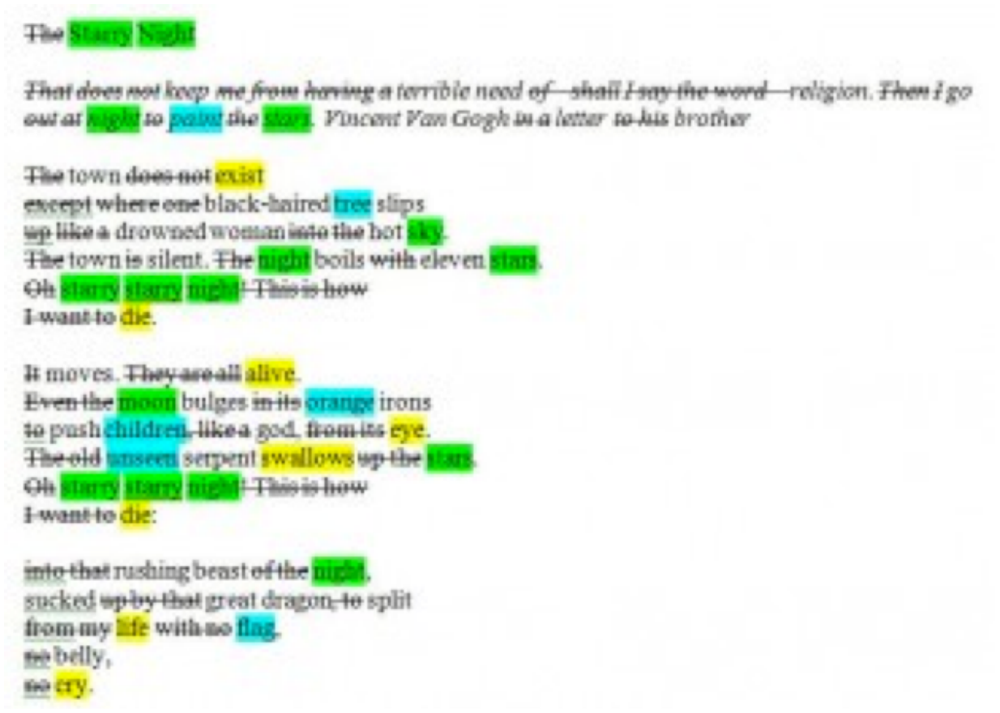

Figure 3: "The Starry Night" by Anne Sexton. Text with a strike through it has been removed as a stopword during preprocessing. Text highlighted in green can be found in Topic 32. Text highlighted in yellow can be found in Topic 2. Text highlighted in blue can be found in Topic 54.

<!-- page 27 -->

| **TOPIC 32** | **TOPIC 2** | **TOPIC 54** |
|---|---|---|
| night | death | tree |
| light | life | green |
| moon | heart | summer |
| stars | dead | flowers |
| day | long | grass |
| dark | world | trees |
| sun | blood | flower |
| sleep | earth | spring |
| sky | man | leaves |
| wind | soul | sun |
| time | men | fruit |
| eyes | face | garden |
| star | day | winter |
| darkness | pain | leaf |
| bright | die | apple |

*Table 1: Keyword distributions generated by a 60 topic model of 4500 poems (Note: Keywords in this table are representative of the entire model, not just words from "The Starry Night."*

Topic 32 and 54 appear similar to the coherent, thematic topics in the topic model of *Science*. Topic 32 includes words that could fall under the rubric of “night,” and the words in Topic 54 could be described as the “natural world.” We might be tempted based on this first read to assign the topic labels “night” and “natural world” in the same way that Blei labels topics from *Science* as “genetic” and “evolution"; however, as I will discuss further on, those labels and the assumption that the topics are “thematic” in the same way as Blei’s would be incorrect. For example, the night and natural world of “The Starry Night” are actually painted representations of those concepts, and consequently, it would be misleading to say that the poem is, strictly speaking, about night and the natural world *in the same way* that the article from *Science* is about genetics and evolution.

Topic 2, on the other hand, does not have the same unambiguous comprehensibility that 32 and 54 do: the words in Topic 2 are more loosely connected. It would be tempting to read the topic as having to do with death, but we would do that because our reading of “The Starry Night” predisposes us to consider it that way. There are “intruder” words in this category. By looking solely at the words in the list and not taking into consideration “The Starry Night,” words such as long, world, and day are not necessarily words we might classify as “death” words in the strictest sense.

In fact, topic intrusion is one way in which computer scientists have begun to develop a method for evaluating and interpreting topic models. In “[Reading Tea Leaves: How Humans Interpret Topic Models](http://www.umiacs.umd.edu/~jbg/docs/nips2009-rtl.pdf),” (pdf) Jonathan Chang, Jorden Boyd-Graber, Sean Gerrish, Chong Wang, and David Blei suggest methods for measuring the “interpretability of a topic model” (2). The authors present two human evaluation tests meant to discern the accuracy of models by using the keyword distributions (like the individual items from the farmers’ market), and the topic to document probabilities (the proportion of kinds of apples compared to how many fruit are in each basket) – called word intrusion and topic intrusion tests respectively. Word intrusion tests involve selecting the first eight or so words from each topic and adding one word to each list for a total of nine words. Human subjects (generally disciplinary experts) were then asked to determine which word in each group did not belong. Chang, et al. discovered that with relative high success, human readers could discern a thematic connection between terms to reliably distinguish the single out-of-place term. As a result, the authors suggest that word intrusion tests measure “how well the inferred topics match human concepts” (6). <!-- page 28 -->

On the other hand, topic intrusion tests presented human subjects with topic labels (like apples, pears, and corn are labels for the “types of produce” that might be at the farmer’s market); the words most likely to be associated with each topic (such as Macintosh, Gala, Fuji, and Honeycrisp), and the top documents associated with each topic (basket #1, basket #2, basket #3, for example). Then, one document (a basket unlike any of the others) that does not belong in the group, the “intrusion,” is then added to the set, and human subjects were then asked to identify which document did not belong, which, again, they could do with reasonable accuracy.

For the purposes of modeling poetry data, word intrusion would not be as effective a method for determining a model’s accuracy at categorizing documents or detecting latent patterns unless the specific changes that happen to the nature of topic distributions for poetic corpora are adjusted for. “Intruders” as individual words does not work for LDA topics of poetry because poems purposefully access and repurpose language in unexpected ways. In other words, topics from the models in my project were not easily interpreted by keywords alone, and yet the results are still useful.

### Interpreting Models of Figurative Language Texts

Topic models of poetry do have a form of comprehensibility, but our understanding of coherence between topic keywords needs to be slightly different in models of poetry than in models of non-fiction texts. My research confirms, to a degree, Ted Underwood’s suspicion that topics in literary studies are better understood as a representation of “discourse” (language as it is used and as it participates in recognized social forms) rather than a thematic string of coherent terms.[^24] However, because the topic model I describe here has been “chunked” at the level of individual poems, the matter of how we interpret a model and how we use it as a vehicle for discovery is different from how Underwood deploys the term at the beginning of his interpretive process. My use of the term “discourse” drives my attention back to close readings of individual poems searching for similarities and differences between poems predicted to contain higher proportions of the same topic.

Topic models of poetry do not reflect the anecdotal evidence that LDA frequently leads to semantically meaningful word distributions. Instead, topic models of the *Revising Ekphrasis* dataset created four consistently recurring *types* of topics. Moreover, recognizing the following four types of topics coupled with close reading of samplings of documents containing each “topic,” which allows a literary scholar to see coherence in topics as forms of discourses, worked much better for determining whether or not the results of the model were actionable and comprehensible. When viewed as forms of discourse, topics can be re-considered in light of whether or not close readings show that individual documents are entering into a form of discourse for a thematic purpose.

LDA topics from a model of the poetic documents in the *Revising Ekphrasis* dataset return one of four *types* of topic, which I define as follows:

**OCR**[^25] ***and other language or dialect distinctive features***[^26] – These topics represent, for example, errors that occur in the optical character recognition scanning process used when turning print documents into digitizing texts, for example substituting “com” for “corn.” The most common OCR errors have been filtered out through a preprocessing technique that searches for such errors and <!-- page 29 --> fixes them; however, machines aren’t perfect and some of these features remain in the final dataset. Their presence may sort out as if they were features of another language. More commonly in this dataset, however, one or two topics form around an approximate 1% of the data that includes foreign language terms or the original form of a poem before its English language translation. The following two topic examples found in the same topic model as “The Starry Night” demonstrate how the model clusters these:

> Topic 4: de la el en green verde con los mi se del poem n lo os poema yo oo ya sobre

> Topic 30: de miss ain jump dat ah dey ter yo slim scarlett hunh git back tu stan fu huh barbie den

Similarly, topics can also be created by grouping together distinctive dialects and languages other than English. We will not be considering these topics in detail other than to point out that they exist.

***Large “chunk” topics*** – Longer or extended poems that outsize the majority of other documents in the subset pull one or more topics toward language specific to that particular poem. For example, the keyword distribution for Topic 12 includes terms such as: bongy, yonghy, bo, lady, jug, order, jones and jumblies. These are words that are repeated frequently in the extended poem “The Courtship of the Yonghy-Bonghy-Bo” by Edward Lear and demonstrate how one poem with high levels of repetition can pull a topic away from the rest of the corpus, along with other poems with high frequency repetitions of particular phrases. In the case of Topic 12, the poems included in the topic and shown in Table 2 tend to be longer and to include greater incidence of repetition. It is possible that these poems share thematic affinities, but the strength of those affinities have more to do with linguistic structure than meaning. In Table 2, the documents with the highest probabilities of drawing a large proportion of their words from Topic 12 are listed in descending order. Under the “Topic 12” label are the probable proportions for each document expressed in decimals. In the second column are the corresponding poem titles.[^27]

| **TOPIC 12** | **POEM TITLE** |
|---|---|
| 0.680665 | The Courtship of the Yonghy-Bonghy-Bo |
| 0.590501 | Choose Life |
| 0.504747 | Zero Star Hotel [At the Smith and Jones] |
| 0.501921 | The Midnight [For here we are here] |
| 0.47986 | Earthmover |
| 0.462247 | Invitation to the Voyage |
| 0.412626 | Mr. Macklin's Jack O'Lantern |
| 0.358385 | The Steel Rippers |
| 0.333965 | The Cruel Mother |
| 0.276595 | Vacant Lot with Pokeweed |
| 0.274312 | Lullaby of an Infant Chief |
| 0.253223 | The Jumblies |
| 0.250493 | American Sonnet (35) |
| 0.230571 | Rückenfigur |
| 0.221246 | Two Poems |
| 0.217995 | The Lady of Shalott |
| 0.2177 | Mr. Smith |
| 0.209471 | The Assignation |
| 0.191892 | Ulalume |
| 0.179114 | I Too Was Loved by Daphne |

*Table 2: Titles of poems in the* Revising Ekphrasis *dataset with the highest probable proportion of Topic 12, listed in descending order. In the list of poems, those available on the American Academy of Poets website (*[*www.poets.org*](http://poets.org/)*) can be reached by clicking the link on the poem's title.*

<!-- page 30 -->

**Semantically** ***evident topics*** – Some topics do appear just as one might expect them to in the 100-topic distribution of *Science* in Blei’s paper. Topics 32 and 54, as illustrated above in Anne Sexton’s “The Starry Night,” exemplify how LDA groups terms in ways that appear upon first blush to be thematic as well. As I mentioned earlier, though, the illusion of thematic comprehensibility obscures what is actually being captured by the topic model. The way in which we interpret semantically evident topics like 32 and 54 must be different from the semantically coherent topics of non-figurative language texts. It is more accurate to say that Topics 32 and 54 participate in discourses surrounding “night” and “natural landscapes” in Anne Sexton’s “The Starry Night.”

As Elizabeth Bergmann Loizeaux points out in *Twentieth-Century Poetry and the Visual Arts*, Sexton’s poem enters into an ongoing conversation with other confessional poets about madness and artistic genius by engaging in language that refocuses collective attention on a widely-recognized work of art with a recognized connection to another artist suffering from mental duress.[^28] She enters into that discourse through the other surrounding discourses that include night and natural landscape. It would still be incorrect to say that 29% of the document is “about” night, when what Sexton describes is a *painting* of a night sky and natural landscape. As literary scholars, we understand that Sexton’s use of the tumultuous night sky depicted by Vincent Van Gogh provides a conceit for the more significant thematic exploration of two artists’ struggle with mental illness.

Therefore, it is important not to be seduced by the seeming transparency of semantically evident topics. Even though the topics appear to have a semantic relationship with the poems because they appear so comprehensible, it is important to remember that semantically evident topics form around a *manner* of speech that reflects quite powerfully the definition of discourse described by Bakhtin: “between the word and its object, between the word and the speaking subject, there exists an elastic environment of other, alien words about the same object” (293). The significant questions to ask regarding such topics when interpreting LDA topic models have more to do with what we learn about the relationships between the ways in which poems participate in the discourses that the topic model identifies. Word intrusion tests (the kind suggested by Chang, et. al. as a measurement of a model’s accuracy) may still work with semantically evident topics because semantically evident topics mirror the thematic comprehensibility of topics from models of non-figurative language; however, there are naturally occurring word intrusions that may not affect the efficacy of the topic distributions, and these would require deeper human interpretation before just throwing them out.

**Semantically** ***opaque topics –*** Some topics, such as Topic 2 in “The Starry Night,” appear at first to have little comprehensibility. Unlike semantically evident topics, they are difficult to synthesize into the single phrases simply by scanning the keywords associated with the topic. Semantically opaque topics would not pass the intrusion tests suggested by Chang, et. al. because even a disciplinary expert might have trouble identifying the “intruder” word as an outlier. Determining a pithy label for a topic with the keywords, “death, life, heart, dead, long, world, blood, earth…” is virtually impossible *until* you return to the data, read the poems most closely associated with the topic, and infer the commonalities among them.

In Table 3, I list the poems the model predicts contain the highest amount of Topic 2 in them along with the probable proportion of the document that draws from Topic 2 (The amount of each basket the model predicts can be described as “apples,” for instance).

<!-- page 31 -->

| **TOPIC 2** | **POEM TITLE** |
|---|---|
| 0.535248643 | When to the sessions of sweet silent thought (Sonnet 30) |
| 0.533343438 | By ways remote and distant waters sped (101) |
| 0.517398877 | A Psalm of Life |
| 0.481152152 | We Wear the Mask |
| 0.477938906 | The times are nightfall, look, their light grows less |
| 0.472091675 | The Slave's Complaint |
| 0.451175606 | The Guitar |
| 0.447100571 | Tears in Sleep |
| 0.446314271 | The Man with the Hoe |
| 0.437962153 | A Short Testament |
| 0.433767746 | Beyond the Years |
| 0.433152279 | Dead Fires |
| 0.429638773 | O Little Root of a Dream |
| 0.427326132 | Bangladesh II |
| 0.425835136 | Vitae Summa Brevis Spem Nos Vetat Incohare Longam |

*Table 3: Titles of the 15 poems with the highest predicted proportions of Topic 2 in them and their corresponding topic distributions. If the poem is available through the American Academy of Poets (*[*www.poets.org*](http://www.poets.org/)*), you can read it by clicking on the link from the poem's title.*

Skimming the top fifteen poems associated with Topic 2 would confirm our assumption that the model has grouped together kinds of poetic language used to discuss death. Topic 2 is interesting for a number of reasons, not the least of which is that even though Paul Laurence Dunbar’s “We Wear the Mask” never once mentions the word “death,” the discourse Dunbar draws from to describe the erasure of identity and the shackles of racial injustice are identified by the model as drawing heavily from language associated with death, loss, and internal turmoil – language which “The Starry Night” indisputably also draws from.

To say that Topic 2 is *about* “death, loss, and internal turmoil” is overly simplistic and does not reflect the range of attitudes toward loss and death that are present throughout the poems associated with this topic; however, to say that Topic 2 draws from the language of elegy would be more accurate. Identifying that Dunbar’s “We Wear the Mask” and “Beyond the Years” draw from discourses associated with elegy supports recent scholarship by Marcellus Blout in his 2007 essay titled, “Paul Lawrence Dunbar and the African American Elegy:”

> I am using a set of terms that point to how I see Dunbar as initiating a *tradition* of African American elegies. I should underscore here that I am not arguing that the African American practice of the elegy is necessarily distinctive from other traditions of the elegy. But I want to suggest that such practice is continuous. Dunbar’s poems of the 1890s point us directly to more recent elegies written by African Americans in the latter part of the twentieth century. (241)

By identifying Dunbar’s poems in a topic of elegiac language, the topic model supports Blout’s claims that Dunbar’s poems participate in elegiac discourse as a means of identity formation for African Americans at the turn of the twentieth century. What the topic model (and the close reading prompted by the topics produced by the model) might also help identify is whether or not other poems by contemporary African American poets similarly draw from Topic 2, further supporting Blout’s claim that Dunbar “initiates a tradition.”

In fact, Dunbar is not the only African American poet included in the list of documents that draw heavily from Topic 2. "The Slave's Complaint" by George Moses Horton (1797-1884) is also included. "The Slave's Complaint" moves through the three stages one might expect to find in an elegiac poem – from lamentation to praise to possible consolation. Could Horton, a poet and a slave, whose poems were written down by school children and printed under the title *The Hope of Liberty* in 1829 have been an influential part of Dunbar's <!-- page 32 --> inclination toward the elegiac? It would take a combination of more topic modeling tests and more traditional historical and archival research to answer that question; however, these are the questions we have been hoping topic modeling might help produce.

In other words, opaque topics such as Topic 2 in models that have mixed results prompt the kinds of questions we are looking for as humanists. What this small discovery shows is that topic modeling as a methodology, particularly in the case of highly-figurative language texts like poetry, can help us to get to new questions and discoveries – not because topic modeling works perfectly, but because poetry causes it to fail in ways that are potentially productive for literary scholars.

Just as semantically evident topics require interpretation, determining the coherence of a semantically opaque topic requires closer reading of the other documents with high proportions of the same topic in order to check whether or not the poems are drawing from similar discourses, even if those same poems have different *thematic* concerns. While semantically evident topics gravitate toward recurring images, metaphors, and particular literary devices, semantically opaque topics often emphasize tone. Words like “death, life, heart, dead, long, world” out of context tell us nothing about an author’s attitude or thematic relationships between poems, but when a disciplinary expert scales down into close readings of the compressed language of the poems themselves, one finds that there are rich deposits of hermeneutic possibility available there.

Searching for thematic coherence in topics formed from poetic corpora would prove disappointing since topic keyword distributions in a thematic light appear at first glance to be riddled with “intrusions.” However, by understanding topics as forms of discourse that must be accompanied by close readings of poems in each topic, researchers can make use of a powerful tool with which to explore latent patterns in poetic texts. For poetry data in particular and literary texts in general, close reading and contextual understanding work together, like the weaving and unraveling of Penelope at her loom, in order to identify relations between texts by shuttling between computational defamiliarization and scholarly experience.[^29]

### Notes:

[^16]: For other gentle introductions to LDA for humanists, see Matthew Jockers’s blog post “[The LDA Buffet is Now Open; or, Latent Dirichlet Allocation for English Majors](http://www.matthewjockers.net/2011/09/29/the-lda-buffet-is-now-open-or-latent-dirichlet-allocation-for-english-majors/)” or Scott Weingart’s blog post “[Topic Modeling for Humanists: A Guided Tour](http://www.scottbot.net/HIAL/?p=19113)” or Shawn Graham, Scott Weingart, and Ian Milligan’s “[Getting Started with Topic Modeling and Mallet](http://programminghistorian.org/lessons/topic-modeling-and-mallet).”

[^17]: The process of determining the number of topics to tell the model to use is not, as of yet, a standardized procedure. The measure for the “right” topic number is often derived through trial and error. After starting with one number (usually between 40 and 60) one determines how “actionable” and “coherent” the topics that the model produces are, adjusting up and down in subsequent iterations until there is agreement that the best model has been produced.

[^18]: For more information on how LDA has been used by humanists to detect changing attitudes toward patriotism and nationalism, see: Nelson, Robert K. *Mining the Dispatch*.

[^19]: In the farmers' market example mentioned earlier in this article, each topic (kinds of produce) is composed of the words (Gala apple, Bosc pear, yellow squash, etc.) in the document (basket). Topic keyword distributions are a list of the words likely to be from a particular topic, in order from most likely to least likely. For humans <!-- page 33 --> interpreting topic models, key word distributions are often where the process begins.

[^20]: For more information on how LDA has been used by humanists to detect changing attitudes toward patriotism and nationalism, see: Nelson, Robert K. *Mining the Dispatch*.

[^21]: The words “poem” and “document” throughout the remainder of this article are used interchangeably because the dataset consists of individual poems saved as individual plain text documents that include only the title and body of individual poems.

[^22]: The sum of the three top document probabilities: (29+12+9=50)

[^23]: Again, to be clear, the keywords in each topic are derived from all the documents in the set of 4,500 that the LDA considers to be part of the topic, so there will be more words in the key word distributions than there are in “The Starry Night.” The model assumes that words in the key word distribution are often found in the context of other words also listed in the key word distribution.

[^24]: I qualify this statement out of recognition that the document types Underwood is modeling are volumes as opposed to individual poems, which may have effects on the degree of reliability with which one can make the comparison. For more on conversations between Ted Underwood and I regarding topics as forms of discourse, see Underwood, Ted. “[What Kinds of ‘topics’ Does Topic Modeling Actually Produce?](http://tedunderwood.com/2012/04/01/what-kinds-of-topics-does-)” and Rhody, Lisa. “[Chunks, Topics, and Themes in LDA](http://www.lisarhody.com/chunk).”

[^25]: OCR – Optical Character Recognition software visually changes scanned print pages into digitized text.

[^26]: Topic modeling is frequently used to help discover information in a variety of languages. I choose “other” rather than “foreign” here, since not all “other” languages would be for all researchers “foreign” ones.

[^27]: When the model outputs the probable proportions for each poem, it expresses that proportion in a decimal. When possible in my discussion of a topic, I convert the decimal to a percentage because that expression of proportion seems more appropriate and avoids statements such as “Rukenfigur” is predicted to contain .23 of Topic 12; however, when I list document probabilities as they have been produced from the model, those same numbers are expressed as decimals.

[^28]: For more on the ekphrastic conversation between Anne Sexton and W. D. Snodgrass regarding “The Starry Night,” see Loizeaux, Elizabeth Bergmann. *Twentieth-Century Poetry and the Visual Arts*.

[^29]: The author would like to thank the Maryland Institute for Technology in the Humanities, especially Travis Brown, Jennifer Guiliano, and Trevor Muñoz, for the support she received while performing the research that led to this paper.

### Works Cited:

Blei, David. “Probabilistic Topic Models.” *Communications of the ACM* 55.4 (2012): 77–84. Print.

Chang, Jonathan et al. “Reading Tea Laves: How Humans Interpret Topic Models.” *Neural Information Processing Systems (NIPS)*. 2009. Web. 3 Oct. 2012.

<!-- page 34 -->

Graham, Jorie. *The End of Beauty*. First Edition. Hopewell, NJ: Ecco, 1999. Print.

Graham, Shawn, Scott Weingart, and Ian Milligan. “Getting Started with Topic Modeling and MALLET.” *The Programming Historian 2*. Web. 21 Mar. 2013.

Heffernan, James A. W. *Museum of Words: The Poetics of Ekphrasis from Homer to Ashbery*. Chicago: University Of Chicago Press, 2004. Print.

Jockers, Matthew. “The LDA Buffet Is Now Open; or, Latent Dirichlet Allocation for English Majors.” *Matthew L. Jockers* 29 Sept. 2011. Web. 29 Oct. 2012.

Loizeaux, Elizabeth Bergmann. *Twentieth-Century Poetry and the Visual Arts*. 1st ed. Cambridge, UK; New York: Cambridge University Press, 2008. Print.

Weingart, Scott. “Topic Modeling for Humanists: A Guided Tour.” *the scottbot irregular*. 25 July 2012. Web. 21 Mar. 2013.

Witmore, Michael. “Text: A Massively Addressable Object.” *Debates in the Digital Humanities*. Minneapolis, MN and London: University of Minnesota Press, 2012. 324–327. Print.

–––––. “The Ancestral Text.” *Debates in the Digital Humanities*. Minneapolis, MN and London: University of Minnesota Press, 2012. 328–331. Print.

Witten, Ian H, Eibe Frank, and Mark Hall. *Data Mining: Practical Machine Learning Tools and Techniques*. Third Edition. New York: Elsevier Science, 2011. Web. 25 Mar. 2013.

<!-- page 35 -->

## Topic Model Data for Topic Modeling and Figurative Language

**LISA M. RHODY**

> **Editor’s Note:** To view tables in iBook please switch the Landscape

The topic model discussed in "Topic Modeling and Figurative Language" was created with MALLET. Drawing from 4,500 English-language poems from the "Revising Ekphrasis" corpus, the model was generated using the following parameters:

```
mallet train-topics --input poems-seq.mallet --num-
threads 2 --num-topics 60 --optimize-interval 10 --
output-model poems08072012test1.model --output-doc-
topics poems08072012_test1.txt --output-topic-keys
poems08072012-test1keys.txt
```

The following table contains the number of the topic (0-59); hyperparameter estimation; and top 20 key words most likely to be found in each topic.

<!-- page 36 -->

| **TOPIC** | **Proportion** | **Topic Key Words** |
|---|---|---|
| 0 | 0.07467 | city streets country middle year park town times thousand paris state york jews jew henry rich houses empire broken central |
| 1 | 0.01304 | ball father field casey trouble boy baseball ebbets brooklyn play game thousand pitcher satchel bat day luis mickey diamond los |
| 2 | 0.42746 | death life heart dead long world blood earth man soul men face day pain die days eyes years hand tears |
| 3 | 0.28246 | world life mind time space human body things future earth thought sense place called end moment air order choose form |
| 4 | 0.00659 | de la el en green verde con los mi se del poem ni lo os poema yo oo ya sobre |
| 5 | 0.02437 | horse deer shoe horses european forward loves james species nose st sweeping rider pray worm story seconds mane survive assassin |
| 6 | 0.12499 | blue red white bird color green yellow black wings birds feathers hawk girl box pink round brown nest orange flying |
| 7 | 0.02036 | portrait duke parrot grace starlings bronze woman lord heron guilt figures phyllis daphne helmet roman smiling brush painted painting gri |
| 8 | 0.04481 | sweet golden fair winds dew flowers wine tender dying fresh venus lovely brings sheep nature flow shepherd silver make crystal |
| 9 | 0.03802 | thy thou thee art thine st doth heaven hast hath dost er shalt mine leave bid rest seek thyself joy |
| 10 | 0.09271 | god lord man hell heaven soul holy ye angel good earth christ sin spirit em mercy prayer give blessed truth |
| 11 | 0.01756 | praise whack give spiral penny matter heaven alabanza violet lightning colour hanging ave hush shell chimera effects percent fat sew |
| 12 | 0.10439 | poetry line sense person poet poem language words feeling point lines meaning subject real witness physical story art problem beauty |
| 13 | 0.04146 | text words screen disaster beat tail word motion hunted speed door open gestures keys material logic failing notebook noun ladder |
| 14 | 0.01923 | coat famous matter hat layer coats fold theory weave folds completed squirrel code hole lip giving mower suddenly hats watched |
| 15 | 0.01781 | monkeys human pressure machine cave boat luminous image animal tubes dot myth patient fork bison cowboy ra solar set tuc |
| 16 | 0.23363 | house room door window street glass black wall table morning walls windows small past rooms floor books hair dark bed |
| 17 | 0.01374 | mr bo bonghy yonghy hand uh yeah um stall moonlight riding pony gonna gentlemen jack tom lady tlot jug alright |
| 18 | 0.1251 | sea water ocean waves ship sand boat fish shore tide beach land green white great shark island waters sail rock |
| 19 | 0.03033 | room drunk eng wine chang hotel private rome true john forbidden cards tiger answer rambling carl jazz roast poetry rendezvous |
| 20 | 0.0611 | poem write poems letter writing page book read poet words word wrote letters great johnny pages head poets written language |
| 21 | 0.13955 | man eyes hair black drink head sees death takes face house waits dance hand falls close beautiful air calls turns |
| 22 | 0.07743 | boy girl school boys girls train street war summer walking woman village age class bus past goodbye station line car |
| 23 | 0.00262 | wi night auld syne gat lang fere ye owre ha till goodly fu grendel nae lasses luve weary ane sae |
| 24 | 0.01807 | york times public september bush president deborah prince press office oil helicopter citizens st national mr museum american landing charles |
| 25 | 0.00633 | spam occupation conturbat mortis timor animal guam lips sharon made loneliness lynn west part east miner equation sir beef beds |
| 26 | 0.0808 | water fish surface air light back lake bridge pond fear carrying tin bodies swimming lights day bottom bright current wing |
| 27 | 0.26726 | made time great feet side hand round god eyes place stood set lay left till sun ground back turned stand |
| 28 | 0.0326 | love stood mind heaven fear dame proud rest maid fair place feast hell fatal hounds care day prey pursue pursued |
| 29 | 0.04181 | idea part ideas system tragic stage fucking mattress works brain prometheus places rock runs series friend points knowledge general positions |

<!-- page 37 -->

| **TOPIC** | **Proportion** | **Topic Key Words** |
|---|---|---|
| 30 | 0.00652 | de miss ain jump dat ah dey ter yo slim scarlett hunh git back tu stan fu huh barbie den |
| 31 | 0.16209 | soul beauty earth thoughts sweet ah er deep spirit wild heaven sad year calm rest air youth soft form dim |
| 32 | 0.38369 | night light moon stars day dark sun sleep sky wind time eyes star darkness bright dream morning bed hear blue |
| 33 | 0.0423 | war men achilles land gods great troy victory soldiers son goddess words fought battle soldier army greek left hector truth |
| 34 | 0.15537 | song voice music sound words sing singing songs long hear heard notes sweet ear voices listen bird lady wind sings |
| 35 | 0.66719 | don time ll ve make day things back people good thing feel work life find long love won remember left |
| 36 | 0.0222 | bells ii iii iv vi vii ho ice miracle thunder ix viii king peace swords wide banks miniver romeo blackbird |
| 37 | 0.20618 | head looked back thought man turned didn white fell knew stood sat heard hair red watched walked men called felt |
| 38 | 0.03754 | america soul land great part freedom rivers waters announce flow slave blood past indian passage free vast parts pass women |
| 39 | 0.03265 | art din hide beauty fear light painting artist kingdom matisse shadow stone dread gunga painter objects model gallery master peak |
| 40 | 0.53625 | wind river sky water trees snow light rain leaves white green air cold sun road field fields winter grass long |
| 41 | 0.1053 | day round till ye good er eye men hath fair high lie fast wide tis strange twas merry gentle blow |
| 42 | 0.20498 | skin stone bone bones blood mouth eye flesh black tongue steel water turn rock teeth inside hole cut bodies wet |
| 43 | 0.09104 | big money people american richard street white english york modern america phone buy chicago talking movie home war bill bag |
| 44 | 0.01553 | goat mr fly horowitz mrs tenure goats elephant buzz sheep milk trunk carlyle apricots stack nice cleft devil rushes nervous |
| 45 | 0.09358 | time question thing reason makes law light shows speech choice change perfect interest present kind measure shown account wrong great |
| 46 | 0.15667 | black red car back fire radio inside smoke road dirt bus cars dust lights train iron shirt dog gray windows |
| 47 | 0.00166 | ye ne doe ring sing woods theyr al eccho ben love answer thi shal erthe herte lyke long fayre god |
| 48 | 0.0932 | eat table bread kitchen plate salt cup food coffee orange ice eating meat milk chicken good butter fat tea cream |
| 49 | 0.23713 | love heart loved live loves sweet life world true kiss eyes lips make lover mind die dear lost give man |
| 50 | 0.09267 | vain ring er man state fate fame tis nature power great good heaven glorious strong happy race strength rise heav |
| 51 | 0.06024 | man woman men dead women young time house lies weeping world age patrizia sex unfolded married board foundry watch shows |
| 52 | 0.01615 | ll buy laura lizzie goblin forest dear marsh eat fruits sir tender gun freud blades grow beat rapture minnehaha brookdog cat fox dogs children |
|  |  | states poor street cats church rich ball tail kitten yard hare paul aged drowning village |
| 53 | 0.01909 | flags thread names learning kong rocks yr hem string cloth elizabeth mexico magic fabric united july numbers stitch needle mirrors |
| 54 | 0.23906 | tree green summer flowers grass trees flower spring leaves sun fruit garden winter leaf apple yellow rose year morning gold |
| 55 | 0.50195 | body back hands face hand eyes inside head open white arms woman mouth small sleep hair light legs dark turn |
| 56 | 0.20162 | mother father child children years dead son home brother daughter family wife bed sister baby day made parents boy born |
| 57 | 0.00688 | de moloch le la les cf des rats mayor piper pas je di bridge du river clock charbon mon est |
| 58 | 0.01597 | gertrude guitar inside blue stein beginning sieve cloud type end tiny lee live bad world wrist picasso feel small pussy |
| 59 | 0.04035 | dog cat fox dogs children states poor street cats church rich ball tail kitten yard hare paul aged drowning village |

<!-- page 38 -->

## What Can Topic Models of PMLA Teach Us About the History of Literary Scholarship?

**ANDREW GOLDSTONE AND TED UNDERWOOD**

Of all our literary-historical narratives it is the history of criticism itself that seems most wedded to a stodgy history-of-ideas approach – narrating change through a succession of stars or contending schools. While scholars like John Guillory and Gerald Graff have produced subtler models of disciplinary history, we could still do more to complicate the narratives that organize our discipline’s understanding of itself.

The archive of scholarship is also, unlike many twentieth-century archives, digitized and available for “distant reading.” Much of what we need is available through [JSTOR’s Data for Research API.](http://about.jstor.org/service/data-for-research) So last summer it occurred to a group of us that topic modeling *PMLA* might provide a new perspective on the history of literary studies. Although Goldstone and Underwood are writing this post, the impetus for the project also came from Natalia Cecire, Brian Croxall, and Roger Whitson, who may do deeper dives into specific aspects of this archive in the near future.

Topic modeling is a technique that automatically identifies groups of words that tend to occur together in a large collection of documents. It

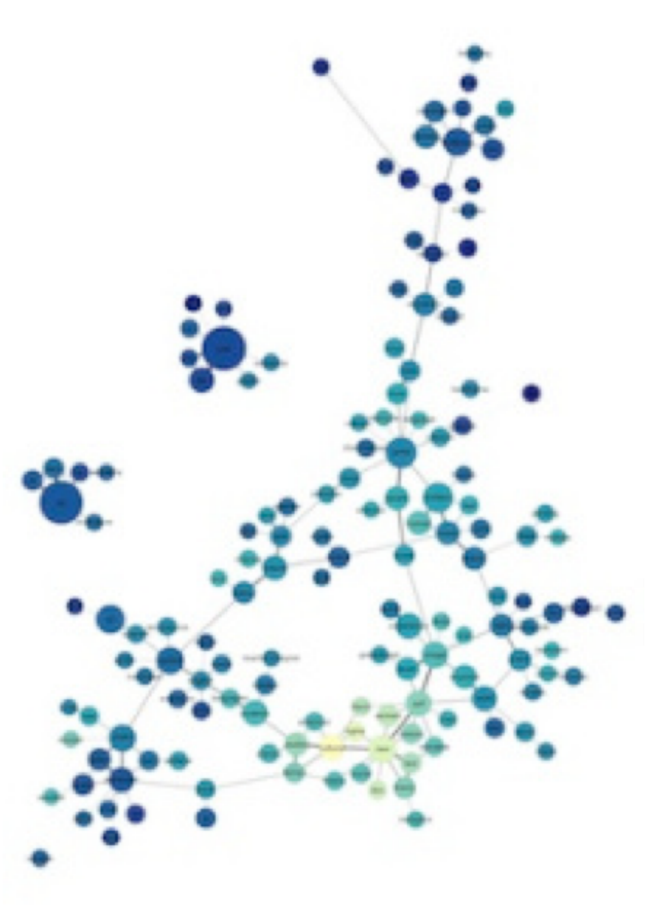

Figure 1: A browsable network based on Underwood’s model of PMLA. Click, then mouse over or click on individual topics.

<!-- page 39 -->

was developed about a decade ago [by David Blei](http://www.cs.princeton.edu/~blei/topicmodeling.html) among others. Underwood has a blog post [explaining topic modeling,](http://tedunderwood.com/2012/04/07/topic-modeling-made-just-simple-enough/) and you can find a practical introduction to the technique at the [Programming Historian](http://programminghistorian.org/lessons/topic-modeling-and-mallet). Jonathan Goodwin [has explained how](http://www.jgoodwin.net/?p=1036) it can be applied to the word-frequency data you get from JSTOR.

Obviously, *PMLA* is not an adequate synecdoche for literary studies. But, as a generalist journal with a long history, it makes a useful test case to assess the value of topic modeling for a history of the discipline.

Goldstone and Underwood each independently produced several different models of *PMLA,* using different software, stopword lists, and numbers of topics. Our results overlapped in places and diverged in places. But we’ve reached a shared sense that topic modeling can enrich the history of literary scholarship by revealing trends that are presently invisible.

### What is a topic?

A “topic model” assigns every word in every document to one of a given number of topics. Every document is modeled as a mixture of topics in different proportions. A topic, in turn, is a distribution of words – a model of how likely given words are to *co-occur* in a document. The algorithm ([called LDA](http://en.wikipedia.org/wiki/Latent_Dirichlet_allocation)) knows nothing “meta” about the articles (when they were published, say), and it knows nothing about the order of words in a given document.

This is a picture of 5940 articles from *PMLA*, showing the changing presence of each of 100 "topics" in *PMLA* over time. (Click through to enlarge; a longer list of topic keywords is [here](http://andrewgoldstone.com/pmla-lda/vara100/keys.txt).) For example, the most probable words in the topic arbitrarily numbered 59 in the model visualized above are, in descending order:

> che gli piu nel lo suo sua sono io delle perche questo quando ogni mio quella loro cosi dei

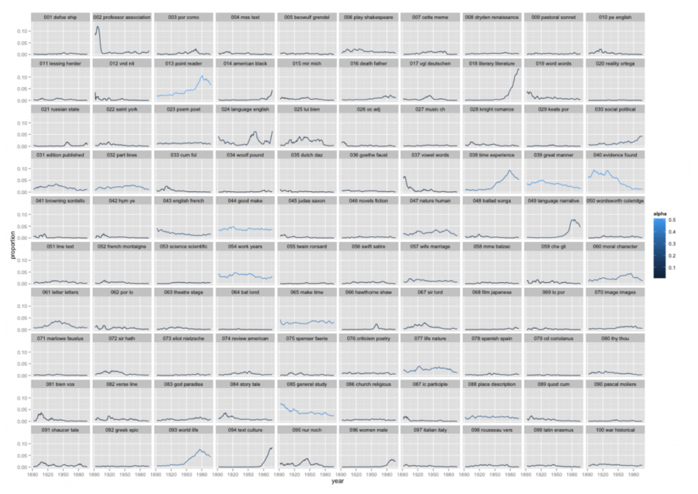

Figure 2: Presence of topics over 5940 articles from PMLA

This is not a “topic” in the sense of a theme or a rhetorical convention. What these words have in common is simply that they’re basic Italian words, which appear together whenever an extended Italian text occurs. And this is the point: a “topic” is neither more nor less than a pattern of co-occurring words.

Nonetheless, a topic like topic 59 does tell us about the history of *PMLA*. The articles where this topic achieved its highest proportion were:

<!-- page 40 -->

- Antonio Illiano, “Momenti e problemi di critica pirandelliana: L’umorismo, Pirandello e Croce, Pirandello e Tilgher,” *PMLA* 83 no. 1 (1968): pp. 135-143

- Domenico Vittorini, “I Dialogi ad Petrum Histrum di Leonardo Bruni Aretino (Per la Storia del Gusto Nell’Italia del Secolo XV),” *PMLA* 55 no. 3 (1940): pp. 714-720

- Vincent Luciani, “Il Guicciardini E La Spagna,” *PMLA* 56 no. 4 (1941): pp. 992-1006

And here’s a plot of the changing proportions of this topic over time, showing moving 1-year and 5-year averages:

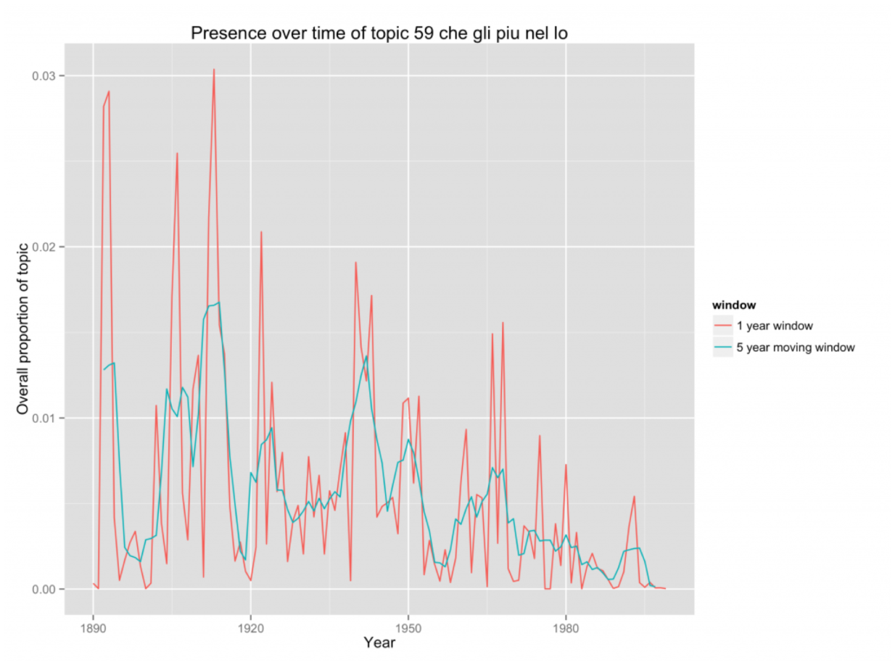

Figure 3: Presence over time of topic #59: che gli piu nel lo

We see something about *PMLA* that is worth remembering for the history of criticism, namely, that it has embedded Italian less and less frequently in its language since midcentury. (The model shows that the same thing is true of French and German.)

### What can topics tell us about the history of theory?

Of course a topic can also be a subject category – modeling *PMLA,* we have found topics that are primarily “about Beowulf” or “about music.” Or a topic can be a group of words that tend to co-occur because they’re associated with a particular critical approach.

Here, for instance, we have a topic from Underwood’s 150-topic model associated with discussions of pattern and structure in literature. We can characterize it by listing words that occur more commonly in the topic than elsewhere, or by graphing the frequency of the topic over time, or by listing a few articles where it’s especially salient.

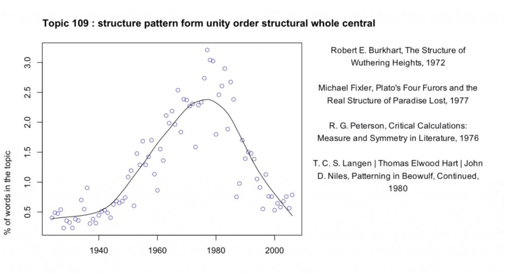

Figure 4: Presence over time of topic 109: structure pattern form unity order structural whole central

<!-- page 41 -->

At first glance this topic might seem to fit neatly into a familiar story about critical history. We know that there was a mid-twentieth-century critical movement called “structuralism,” and the prominence of “structure” here might suggest that we’re looking at the rise and fall of that movement. In part, perhaps, we are. But the articles where this topic is most prominent are not specifically “structuralist.” In the top four articles, Ferdinand de Saussure, Claude Lévi-Strauss, and Northrop Frye are nowhere in evidence. Instead these articles appeal to general notions of symmetry, or connect literary patterns to Neoplatonism and Renaissance numerology.

By forcing us to attend to concrete linguistic practice, topic modeling gives us a chance to bracket our received assumptions about the connections between concepts. While there is a distinct mid-century vogue for structure, it does not seem strongly associated with the concepts that are supposed to have motivated it (myth, kinship, language, archetype). And it begins in the 1940s, a decade or more before “structuralism” is supposed to have become widespread in literary studies. We might be tempted to characterize the earlier part of this trend as “New Critical interest in formal unity” and the latter part of it as “structuralism.” But the dividing line between those rationales for emphasizing pattern is not evident in critical vocabulary (at least not at this scale of analysis).

This evidence doesn’t necessarily disprove theses about the history of structuralism. Topic modeling might not reveal varying “rationales” for using a word even if those rationales did vary. The strictly linguistic character of this technique is a limitation as well as a strength: it’s not designed to reveal motivation or conflict. But since our histories of criticism are already very intellectual and agonistic, foregrounding the conscious beliefs of contending critical “schools,” topic modeling may offer a useful corrective. This technique can reveal shifts of emphasis that are more gradual and less conscious than the ones we tend to celebrate.

It may even reveal shifts of emphasis of which we were entirely unaware. “Structure” is a familiar critical theme, but what are we to make of this?

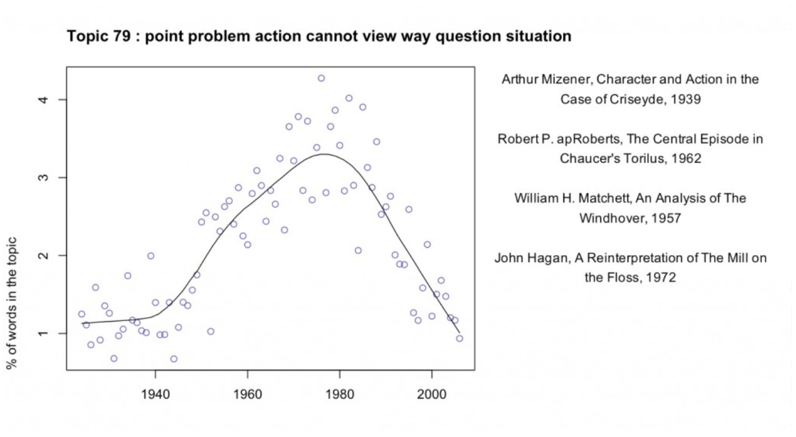

Figure 5: Presence over time of topic 79: point problem action cannot view way question situation

A fuller list of terms included in this topic would include “character”, “fact,” “choice,” “effect,” and “conflict.” Reading some of the articles where the topic is prominent, it appears that in this topic “point” is rarely the sort of point one makes in an argument. Instead it’s a moment in a literary work (e.g., “at the point where the rain occurs,” in Robert apRoberts 379). Apparently, critics in the 1960s developed a habit of describing literature in terms of problems, questions, and significant moments of action or choice; the habit intensified through the early 1980s and then declined. This habit may not have a name; it <!-- page 42 --> may not line up neatly with any recognizable school of thought. But it’s a fact about critical history worth knowing.

Note that this concern with problem-situations is embodied in common words like “way” and “cannot” as well as more legible, abstract terms. Since common words are often difficult to interpret, it can be tempting to exclude them from the modeling process. It’s true that a word like “the” isn’t likely to reveal much. But subtle, interesting rhetorical habits can be encoded in common words. (E.g. “itself” is especially common in late-20th century theoretical topics.)

We don’t imagine that this brief blog post has significantly contributed to the history of criticism. But we do want to suggest that topic modeling could be a useful resource for that project. It has the potential to reveal shifts in critical vocabulary that aren’t well described, and that don’t fit our received assumptions about the history of the discipline.

### Why browse topics as a network?

The fact that a word is prominent in topic A doesn’t prevent it from also being prominent in topic B. So certain generalizations we might make about an individual topic (for instance, that Italian words decline in frequency after midcentury) will be true only if there’s not some other “Italian” topic out there, picking up where the first one left off.

For that reason, interpreters really need to survey a topic model as a whole, instead of considering single topics in isolation. But how can you browse a whole topic model? We’ve chosen relatively small numbers of topics, but it would not be unreasonable to divide literary scholarship into, say, 500 topics. Information overload becomes a problem.

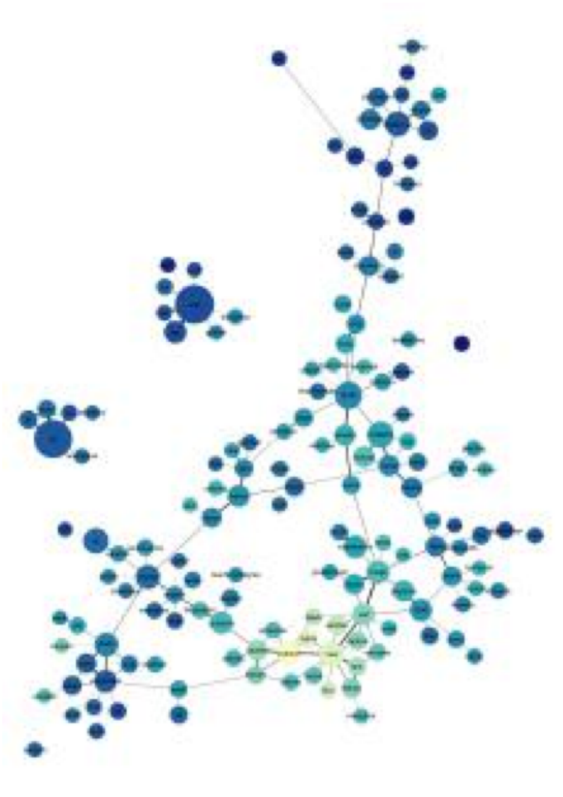

Figure 6: A browsable image map of 150 topics from PMLA. After you click through you can mouseover (or click) individual topics for more information.

<!-- page 43 -->

We’ve found network graphs useful here. Click on the image of the network on the right to browse Underwood’s 150-topic model. The size of each node (roughly) indicates the number of words in the topic; color indicates the average date of words. (Blue topics are older; yellow topics are more recent.) Topics are linked to each other if they tend to appear in the same articles. Topics have been labeled with their most salient word – unless that word was already taken for another topic, or seemed misleading. Mousing over a topic reveals a list of words associated with it; with most topics it’s also possible to click through for more information.

The structure of the network makes a loose kind of sense. Topics in French and German form separate networks floating free of the main English structure. Recent topics tend to cluster at the bottom of the page. And at the bottom, historical and pedagogical topics tend to be on the left, while formal, phenomenological, and aesthetic categories tend to be on the right.

But while it’s a little eerie to see patterns like this emerge automatically, we don’t advise readers to take the network structure too seriously. A topic model isn’t a network, and [mapping one onto a network can be misleading.](http://tedunderwood.com/2012/11/11/visualizing-topic-models/) For instance, topics that are physically distant from each other in this visualization are not necessarily unrelated. Connections below a certain threshold go unrepresented.

Moreover, as you can see by comparing illustrations in this post, a little fiddling with dials can turn the same data into networks with rather different shapes. It’s probably best to view network visualization as a convenience. It may help readers browse a model by loosely organizing topics – but there can be other equally valid ways to organize the same material.

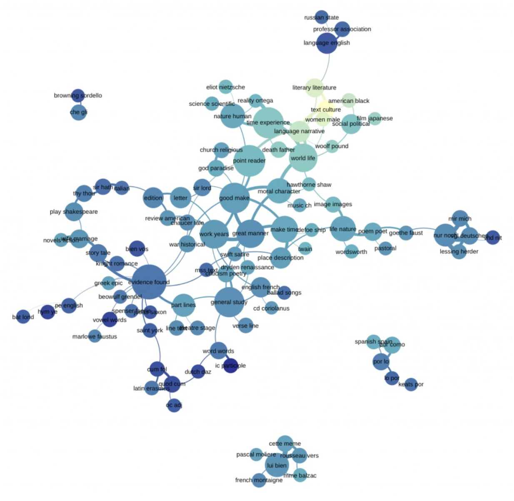

Figure 7: Goldstone’s 100-topic model of PMLA Click through to enlarge.

### How did our models differ?

The two models we’ve examined so far in this post differ in several ways at once. They’re based on different spans of *PMLA*‘s print run (1890–1999 and 1924–2006). They were produced with different software. Perhaps most importantly, we chose different numbers of topics (100 and 150).

<!-- page 44 -->

But the models we’re presenting are only samples. Goldstone and Underwood each produced several models of *PMLA*, changing one variable at a time, and we have made some closer apples-to-apples comparisons.

Broadly, the conclusion we’ve reached is that there’s both a great deal of fluidity and a great deal of consistency in this process. The algorithm has to estimate parameters that are impossible to calculate exactly. So the results you get will be slightly different every time. If you run the algorithm on the same corpus with the same number of topics, the changes tend to be fairly minor. But if you change the number of topics, you can get results that look substantially different.

On the other hand, to say that two models “look substantially different” isn’t to say that they’re incompatible. A jigsaw puzzle cut into 100 pieces looks different from one with 150 pieces. If you examine them piece by piece, no two pieces are the same – but once you put them together you’re looking at the same picture. In practice, there was a lot of overlap between our models; on the older end of the spectrum you often see a topic like “evidence fact,” while the newer end includes topics that foreground narrative, rhetoric, and gender. Some of the more surprising details turned out to be consistent as well. For instance, you might expect the topic “literary literature” to skew toward the older end of the print run. But in fact this is a relatively recent topic in both of our models, associated with discussion of canonicity. (Perhaps the owl of Minerva flies only at dusk?)

### Contrasting models: a short example

While some topics look roughly the same in all of our models, it’s not always possible to identify close correlates of that sort. As you vary the overall number of topics, some topics seem to simply disappear. Where do they go? For example, there is no exact counterpart in Goldstone’s model to that “structure” topic in Underwood’s model. Does that mean it is a figment? Underwood isolated the following article as the most prominent exemplar:

> Robert E. Burkhart, [The Structure of Wuthering Heights](http://jstor.org/stable/460794), Letter to the Editor, *PMLA* 87 no. 1 (1972): 104–5. (Incidentally, JSTOR has miscategorized this as a “full-length article.”)

Goldstone’s model puts more than half of Burkhart’s comment in three topics:

> 0.24 topic 38 time experience reality work sense form present point world human process structure concept individual reader meaning order real relationship

> 0.13 topic 46 novels fiction poe gothic cooper characters richardson romance narrator story novelist reader plot novelists character reade hero heroine drf

> 0.12 topic 13 point reader question interpretation meaning make reading view sense argument words word problem makes evidence read clear text readers

The other prominent documents in Underwood’s 109 are connected to similar topics in Goldstone’s model. The keywords for Goldstone’s topic 38 [Figure 8], the top topic here, immediately suggest an affinity with Underwood’s topic 109. Now compare the time course of Goldstone’s 38 with Underwood’s 109 (the latter is above).

It is reasonable to infer that some portion of the words in Underwood’s “structure” topic are absorbed in Goldstone’s “time experience” topic. But “time experience reality work sense” looks less like vocabulary for describing form (although “form” and “structure” are included in it, further down the list; cf. [the top words for all 100 topics](http://andrewgoldstone.com/pmla-lda/vara100/keys.txt)), and more like vocabulary for talking about experience in generalized ways – as is <!-- page 45 --> also suggested by the titles of some articles in which that topic is substantially present:

- “The Vanishing Subject: Empirical Psychology and the Modern Novel”

- “Metacommentary”

- “Toward a Modern Humanism”

- “Wordsworth’s Inscrutable Workmanship and the Emblems of Reality”

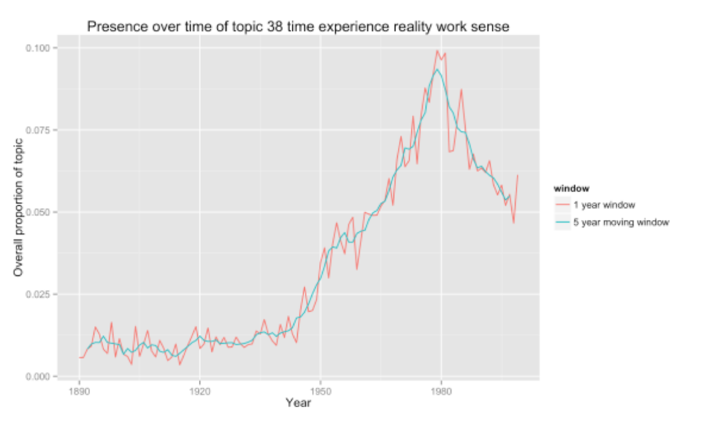

Figure 8: Presence over time of topic 38: time experience reality work sense

This version of the topic is no less “right” or “wrong” than the one in Underwood’s model. They both reveal the same underlying evidence of word use, segmented in different but overlapping ways. Instead of focusing our vision on affinities between “form” and “structure”, Goldstone’s 100-topic model shows a broader connection between the critical vocabulary of form and structure and the keywords of “humanistic” reflection on experience.

The most striking contrast to these postwar themes is provided by a topic which dominates in the prewar period, then gives way before “time experience” takes hold. Here are box plots by ten-year intervals of the proportions of another topic, Goldstone’s topic 40, in *PMLA* articles:

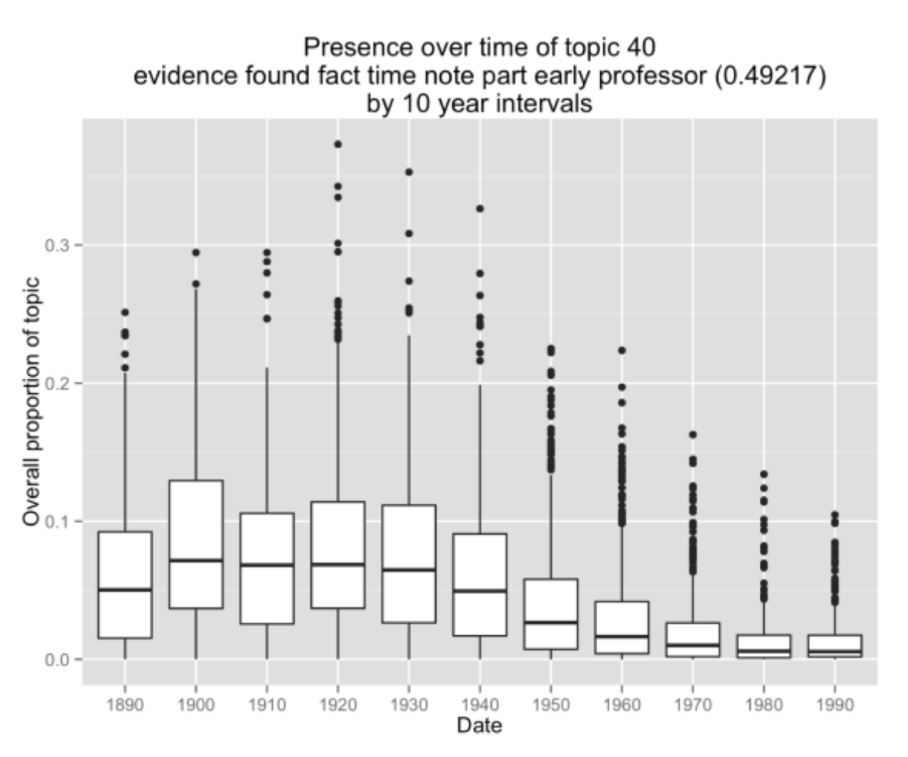

Figure 9: Presence over time of topic 40: evidence found fact time note part early professor

Underwood’s model shows a similar cluster of topics centering on questions of evidence and textual documentation, which similarly <!-- page 46 --> decrease in frequency. The language of *PMLA* has shown a consistently declining interest in “evidence found fact” in the era of the postwar research university.

So any given topic model of a corpus is not definitive. Each variation in the modeling parameters can produce a new model. But although topic models vary, models of the same corpus remain fundamentally consistent with each other.

### Using LDA as evidence

It’s true that a “topic model” is simply a model of how often words occur together in a corpus. But information of that kind has a deeper significance than we might at first assume. A topic model doesn’t just show you what people are writing *about* (a list of “topics” in our ordinary sense of the word). It can also show you *how* they’re writing. And that “how” seems to us a strong clue to social affinities – perhaps especially for scholars, who often identify with a methodology or critical vocabulary. To put this another way, topic modeling can identify discourses as well as subject categories and embedded languages. Naturally we also need other kinds of evidence to produce a history of the discipline, including social and institutional evidence that may not be fully manifest in discourse. But the evidence of topic modeling should be taken seriously.

As you change the number of topics (and other parameters), models provide different pictures of the same underlying collection. But this doesn’t mean that topic modeling is an indeterminate process, unreliable as evidence. All of those pictures will be valid. They are taken (so to speak) at different distances, and with different levels of granularity. But they’re all pictures of the same evidence and are by definition compatible. Different models may support different interpretations of the evidence, but not interpretations that absolutely conflict. Instead the multiplicity of models presents us with a familiar choice between “lumping” or “splitting” cultural phenomena – a choice where we have long known that multiple levels of analysis can coexist. This multiplicity of perspective should be understood as a strength rather than a limitation of the technique; it is part of the reason why an analysis using topic modeling can afford a richly detailed picture of an archive like *PMLA*.

Originally published by  [Ted Underwood](http://tedunderwood.com/2012/12/14/what-can-topic-models-of-pmla-teach-us-about-the-history-of-literary-scholarship/)  and  [Andrew Goldstone](http://andrewgoldstone.com/blog/2012/12/13/pmla/)  on

> December 14, 2012. Also published in [Arcade](http://arcade.stanford.edu/what-can-topic-models-of-pmla-teach-us-about-history-of-literary-scholarship).

### Appendix: How did we actually do this?

The *PMLA* data obtained from JSTOR was independently processed by Goldstone and Underwood for their different LDA tools. This created some quantitative subtleties that we’ve saved for this appendix to keep this post accessible to a broad audience. If you read closely, you’ll notice that we sometimes talk about the “probability” of a term in a topic, and sometimes about its “salience.” Goldstone used [MALLET](http://mallet.cs.umass.edu/) for topic modeling, whereas Underwood used his own Java implementation of LDA. As a result, we also used slightly different formulas for ranking words within a topic. MALLET reports the raw probability of terms in each topic, whereas Underwood’s code uses a slightly more complex formula for term salience drawn from [Blei & Lafferty (2009)](http://www.cs.cmu.edu/~lafferty/publications.html). In practice, this did not make a huge difference.

MALLET also has a “hyperparameter optimization” option which Goldstone’s 100-topic model above made use of. Before you run screaming, “hyperparameters” are just dials that control how much fuzziness is allowed in a topic’s distribution across words (beta) or across documents (alpha). Allowing alpha to vary allows greater differentiation between the sizes of large topics (often with common <!-- page 47 --> words), and smaller (often more specialized) topics. (See [“Why Priors Matter,” Wallach, Mimno, and McCallum, 2009.](http://people.cs.umass.edu/~mimno/publications.html)) In any event, Goldstone’s 100-topic model used hyperparameter optimization; Underwood’s 150-topic model did not. A comparison with several other models suggests that the difference between symmetric and asymmetric (optimized) alpha parameters explains much of the difference between their structures when visualized as networks.

Goldstone’s processing scripts are online in a [GitHub repository](http://github.com/agoldst/dfr-analysis). The same repository includes R code for making the plots from Goldstone’s model. Goldstone would also like to thank Bob Gerdes of Rutgers’s [Office of Instructional and Research Technology](http://oirt.rutgers.edu/) for support for running mallet on the university’s apps.rutgers.edu server, Ben Schmidt for helpful comments at a THATCamp Theory session, and Jon Goodwin for discussion and his [excellent blog posts on topic- modeling JSTOR data](http://www.jgoodwin.net/?p=1068).

Underwood’s network graphs were produced by measuring Pearson correlations between topic distributions (across documents) and then selecting the strongest correlations as network edges using [an algorithm Underwood has described previously.](http://tedunderwood.com/2012/11/11/visualizing-topic-models/#technote) That data structure was sent to Gephi. Underwood’s [Java implementation of LDA,](https://github.com/tedunderwood/Parallel-LDA) as well as his [*PMLA* model, and code for translating a model into a network,](https://github.com/tedunderwood/pmla-scripts) are on GitHub, although at this point he can’t promise a plugand-play workflow. Underwood would like to thank Matt Jockers for convincing him to try topic modeling (see [Matt’s impressive, detailed model of the nineteenth-century novel](http://www.matthewjockers.net/macroanalysisbook/macro-themes/)) and Michael Simeone for convincing him to try force-directed network graphs. David Mimno kindly answered some questions about the innards of MALLET.

<!-- page 48 -->

## Words Alone: Dismantling Topic Models in the Humanities

**BENJAMIN M. SCHMIDT**

As this issue shows, there is no shortage of interest among humanists in using topic modeling. An entire genre of introductory posts has emerged encouraging humanists to try LDA.[^30] So many scholars in humanities departments are turning to the tool in their research that it is sometimes described as part of the digital humanities in itself. Last fall, the NEH sponsored a workshop at Maryland which expressed concern that "[the most promising work in topic modeling is being done not by humanists exploring literary or historical corpora but instead by scholars working in natural language processing and information retrieval](http://mith.umd.edu/topicmodeling/about/)." There is not, it seems safe to say, another machine-learning algorithm in the world anyone would expect humanists to lead the progress of. Newcomers to the field could be forgiven for thinking that digital humanists need to topic model to prove their mettle; analog humanists could be forgiven for assuming that the computational interests of literary scholars and historians are particularly focused on the sorts of questions that topic models answer.

As all these scholars have said, the technique has a number of promising applications in the humanities. It does a good job giving an overview of the contents of large textual collections; it can provide some intriguing new artifacts to study; and it even holds, as I will show below, some promise for structuring non-lexical data like geographic points. But simplifying topic models for humanists who will not (and should not) study the underlying algorithms creates an enormous potential for groundless – or even misleading – "insights."

Much of the apparent ease and intuitiveness of topic models comes from a set of assumptions that are only partially true. To make topic models present new raw material for humanists to read, analysts generally assume that an individual topic produced by the algorithm has two properties. First, it is *coherent*: a topic is a set of words that all tend to appear together, and will therefore have a number of things in common. Second, it is *stable*: if a topic appears at the same rate in two different types of documents, it means essentially the same thing in both. Together, these let humanists assume that the co-occurrence patterns described by topics are *meaningful*; topics are useful because they describe things that resemble "concepts," "discourses," or "fields."

When these assumptions hold, topics offer an immense improvement over studying individual words to understand massive text corpora. Words are frustrating entities to study. Although higher order entities like concepts are all ultimately constituted through words, no word or group can easily stand in for any of them. The appeal of topic modeling for many humanists is that it makes it possible to effortlessly and objectively create aggregates that seem to be more meaningful than the words that constitute them.

But topics neither can nor should be studied independently of a deep engagement in the actual word counts that build them. Like words, they are messy, ambiguous, and elusive. When humanists examine the output from MALLET (the most widely used topic-modeling tool), they need to be aware of the ways that topics may not be as coherent as they assume. The predominant practice among humanists using topic <!-- page 49 --> modeling ensures that they will never see the ways their assumptions fail them. To avoid being misled by all the excitement, humanists need to ground the analysis of topic models in the words they are built from. From lifelong experience, humanists know how words can mislead us. They do not know how topics fail our assumptions.

This article suggests two ways to bring words back to topic models in humanistic practice, which destabilizes some of the assumptions that make topic models so appealing. The first, using geographical data, shows the problems with labeling topics based on the top five to ten words and the ways that assumptions of meaningfulness and coherence are not grounded. The second shows the dangers of accepting a topic model's assumption of topic stability across different sorts of documents: extremely common practices, such as plotting topic frequencies across time, can elide dramatic differences in what words different documents actually use. In both cases, visualization that uses the individual word assignments, not just the topic labels, can help dramatically change the readings that humanists give to topics.

New ways of reading the composition of topics are necessary, because humanists seem to want to do slightly different things with topic models than the computer scientists who invented them and know them best. Latent Direchlet Allocation (so widely used as a topic modeling algorithm that I will use "LDA" interchangeably with the general term here) was first described by David Blei et al in 2003.[^31] Blei's group at Princeton most often describes LDA as an advance in information *retrieval.* It can make, Blei shows, large collections of text browsable by giving useful tags to the documents. (Some of Blei's uses are [here](http://topics.cs.princeton.edu/polisci-review/docs/DOC00414.html) and [here](https://app.nihmaps.org/public/browser/#center=0.000000%2C0.000000;data=nih.active;showViz=true;zoom=fit;); Jonathan Goodwin has recently adapted a similar model for JSTOR articles in [rhetoric](http://jgoodwin.net/rhet-browser/) and [literary theory](http://jgoodwin.net/theory-browser/).) When confronted with a massive store of unstructured documents, topic models let you "read" the topic headings first, and then only search out articles in the topics that interest you. Much like traditional library subject headings, topic models let you search for the intersection of two related fields, can help bring new documents to your attention, and give a sense of the dominant themes in a library.

For these purposes, meaningful labels are incredibly important, and occasional misfiling unimportant. (If a document is "misfiled" into the wrong topic, the researcher simply will skip over it). But while topic models can be immensely powerful for browsing and isolating results in thousands or millions of uncatalogued texts, scholars in literature and history working with text usually have extensive data about the documents they have. A standard citation includes not just an author but a date, a city, and a publisher. Unstructured browsing is rarely useful: the interactions among metadata fields are at the heart of the researcher's interest.

Humanists seem to be using topic models, instead, for "discovery" in quite a different sense. Topic compositions, and the labels they receive, are taken as something that might generate new perspectives on texts. As [Trevor Owens describes it](http://www.trevorowens.org/2012/11/discovery-and-justification-are-different-notes-on-sciencing-the-humanities/), "anything goes in the generative world of discovery." Topic modeling enables a process of reconfigurations that can lead humanists to new insights. In this frame, topic models are only as useful or as problematic as those who use them say they are.

Still, excitement about the use of topic models for discovery needs to be tempered with skepticism about how often the unexpected juxtapositions LDA creates will be helpful, and how often merely surprising. A poorly supervised machine learning algorithm is like a bad research assistant. It might produce some unexpected constellations that show flickers of deeper truths; but it will also produce tedious, inexplicable, or misleading results. If it is not doing the desired task, it is time to give it some clearer instructions, or to find <!-- page 50 --> a new one. Much of the excitement over topic models is that they seem to work *better* than other rearrangement algorithms.

It is even possible to imagine a sort of "placebo" effect of topic modeling. By giving humanists the feeling that they are exploring large corpora much more quickly and efficiently at scale, topic models may make humanists much more willing to entertain big-picture questions about huge textual libraries. Historians and literature scholars might be able to start to tackle questions spanning centuries and tens of thousands of texts through more traditional means, using topic models only to make the initial process of venturing new ideas feel less unbounded. Confidence gained in this manner may be quite useful. But it remains important to know the ways that the tool might not be working.

### Topic Modeling at Sea

The idea that topics are meaningful rests, in large part, on assumptions of their coherence derived from checking the list of the most frequent words. But the top few words in a topic only give a small sense of the thousands of the words that constitute the whole probability distribution. In order to get a sense of what it might look like to analyze *all the words* in a topic at once, we can turn to topic models applied to data that are not, in the conventional sense, words at all. Topic models, fundamentally, are clustering algorithms that create groupings based on the distributional properties of words across documents. The distributional patterns that words show, however, are not particularly special: all sorts of other datasets show similar properties. In computer science, LDA is used for many kinds of nontextual data, from images to music.

I have been looking for some time at digitized ships' logs, in part as an arena to think about problems in reading digital texts. Ships' logs are ideal candidates for machine learning algorithms – like texts, they contained large amounts of partially structured data. A logbook is, after all, a book that has been simply been digitized to an extremely rigid vocabulary of points in space and time. Hundreds of thousands of ships' voyages have been digitized by climatologists. (Here, I am looking at some of the oldest voyages in this set: several thousand American shipping logbooks collected by the 19th-century superintendant of the US Naval Academy, Matthew Maury). But in addition to providing an extension of the possible areas to apply topic modeling, ships' logs offer a useful a test case where the operations of a topic model are much more evident.

The reason has to do with visualization. With words, it is very difficult to meaningfully convey all the data in a topic model's output. Normally, model visualization is useful to confirm statistical fit. (The classic instance of this is the [Q-Q plot](http://en.wikipedia.org/wiki/Q%E2%80%93Q_plot), which provides a faster and more intuitive test of fit for linear and other models than summary statistics). But humanists generally do not use topic models for predictive work. "Fit" for humanists means usefulness for exploration, not correspondence to some particular state of the world (as it does for statisticians). But it is extremely hard to come up with a visual representation of a textual topic model that can reveal the ways it might fail.

With textual output, the most appealing option is to characterize and interpret topics based on a list of the top words in each one, as output from MALLET or another package. If the top words appear semantically coherent, the topic is assumed to have "worked." For all textual work, humanists need search interfaces that return more than just a unidimensional ordered list. We need that for interpreting clustering results even *more* than we need it for search results; but for topics, that is extremely hard to do. Using word clouds for topic model <!-- page 51 --> results, [as Elijah Meeks has recently demonstrated](https://dhs.stanford.edu/algorithmic-literacy/using-word-clouds-for-topic-modeling-results/), makes excellent use of the form. Additionally, as Scott Weingart points out, it [includes some information about relative frequency besides just ordinal rank](http://sappingattention.blogspot.com/2012/11/when-you-have-mallet-everything-looks.html?showComment=1351877185936#c8891229013908899354). But it still restricts our interpretation of a model to a list of words, which can not be easily apprehended as a whole. Even network representations – which, as [Ted Underwood and Michael Simeone have recently described](http://tedunderwood.com/2012/12/02/visualizing-topic-models-with-force-directed-graphs/), show great potential for characterizing the relations between topics – still rely on topics identified in the traditional way (by their most common words).

Geodata, on the other hand, can be inspected simply by plotting it on a map. "Meaning" for points can be firmly reduced a two-dimensional space (the surface of the globe), while linguistic meaning cannot. (Meaning is not exclusively geographical, of course – a semantically coherent geo-topic would distinguish between "land" and "water," or "urban" vs. "farmland," regardless of geographical proximity. That means geodata provides an opportunity to visualize a topic model to test coherence of model fit. Even purely exploratory models can fall short of our hopes if they do not demonstrate coherence. The example of the ships is useful in that it shows what it might look like to visualize an *entire* topic model at once. The downside is significant. Geodata is not language, and there is no question that topic models will perform better on language than on the peculiar metaphor I have concocted here. But not all of the mistakes are completely alien to textual topics.

The mechanics of fitting a topic model to geographic paths are fairly simple. Instead of using a vocabulary of words, I create a vocabulary of latitude-longitude points at decimal resolution. Each ship's voyage collected in the ICOADS US Maury collection is a "text," and each day it spends at a point corresponds to a use of a placename "word." For example, a ship that spends two days docked in Boston would create the two-word text "42.4,-72.1 42.4,-72.1": this can be easily parsed by

MALLET.[^32] The shipping log data I have been using thus generates 600,000 or so "words" across 11,000 "texts;" in both counts and some basic structural attributes (beyond the top 10 points, the distribution of words roughly follows [Zipf's law](http://en.wikipedia.org/wiki/Zipf%27s_law)) this presents a fair analogue to lexical data. Just as in texts, there are some good reasons to want the distributional variety topic models bring. An LDA model will divide each route up among several topics. Instead of showing paths, we can visually only look at which points fall into which "topic"; but a single point is not restricted to a single topic, so New York could be part of both a hypothetical "European trade" and "California trade" topic.

In many ways, topic modeling performs far better than it has any right to on this sort of data. Here is the output of a model, plotted with high transparency so that an area on the map will appear black if it appears in that topic in 100 or more log entries. ([The basic code to build the model and plot the code is here](http://rpubs.com/benmschmidt/shipLDA).) Although "words" are squares of 0.1 degrees, that produces points smaller than a single pixel on this map [Figure1]:  shading show how many different assignments were to a given topic within 1 degree. Coloration represents frequency within the topic, with the darkest blacks for the points included more than 50 times.

One use of machine-learning algorithms in my earlier project was to separate whaling ships out from the voyages that Maury collected. This 25-topic model yields a number of distinctively "whaling" topics; given a dataset with no metadata at all, someone knowledgeable about 19thcentury whaling grounds might be able to separate out whaling by picking voyages heavy in topics 1, 4, 5, 17, 20, and 21, each of which roughly corresponds to a major whaling ground in the nineteenth century. Either as a way to understand what sorts of voyages are in the data, or as an input for further machine learning, these sorts of topics could have major benefits.

<!-- page 52 -->

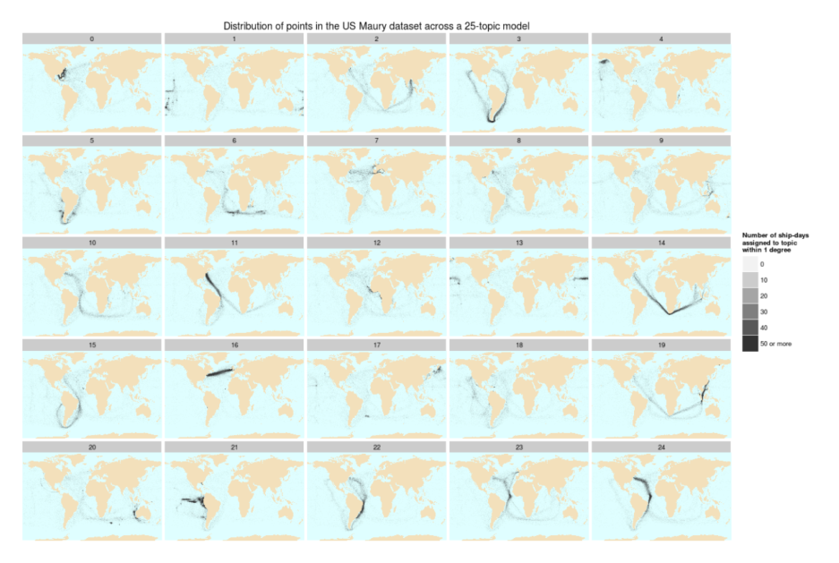

Figure 1: Distribution of points in the US Maury dataset across a 25-topic model

But it is also worth noting that there are lots of other machine learning algorithms that will do just as good a job more simply. [As part of a longer series on whaling logs, I talked about using K-means clustering and k-nearest neighbor methods to classify whaling voyages](http://sappingattention.blogspot.com/2012/11/machine-learning-on-high-seas.html). To disentangle different sorts of shipping patterns, the simplest clustering algorithm of all, k-means, does an excellent job pulling apart different sorts of voyages (the labels were generated by hand) [Figure 2]:

But the real key is that both these methods fail to make use of all the information contained in this dataset. "Vanilla" topic modeling assumes that a collection of texts is completely unstructured. But that is rarely the case for the sort of data that humanists work with. Not every whaling voyage goes to the same places; unsupervised machinelearning methods like this do not "know" that 1820s South Atlantic whaling voyages (for instance) have some fundamental properties in common with 1850s whaling voyages to the Bering Strait. But since this shipping data has other sorts of metadata, the best solution of all will be something that incorporates all of that information. In this particular case, I found the best results to be a modified k-nearest-neighbor algorithm, which let me compare each voyage to a training set strongly suspected to be whaling voyages, because they sail from ports like New Bedford or Sag Harbor. ([A fuller explanation of the methodology is available here](http://sappingattention.blogspot.com/2012/11/machine-learning-on-high-seas.html).)

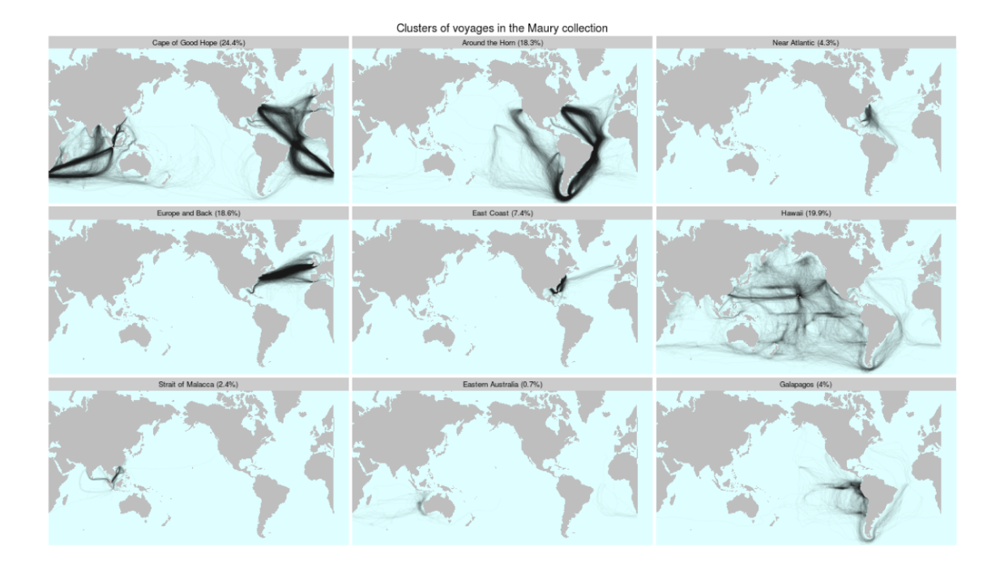

Figure 2: Clusters of voyages in the Maury Collection generated by a simple k-means algorithm

That another method works better with metadata is not necessarily a strike against topic modeling: machine learning algorithms tend to do better the more classifying information they are fed, and topic outputs might be a sensible addition to a classification set. In this particular case, I did not find them necessary, but there may be other cases where geo-coded topic models would be immensely useful.

Although geographical topic models are promising on their own, they also hold some cautionary tales for humanists using topic modeling to look at *texts.* In particular, the full range of visualization on geographical data makes it much easier to see the sorts of errors that occur in topic models. For example: when creating for a 9-topic model <!-- page 53 --> instead of a 25-topic one, things look all right on first glance. The algorithm even produces some nice features, such as separate clusters for the routes from and to US east coast on the trade winds. But there are problems as well. The first are visible by adding a new layer to the maps – red dots on each of the ten most common "words" in each set. These correspond to the top ten words conventionally used to label a topic.

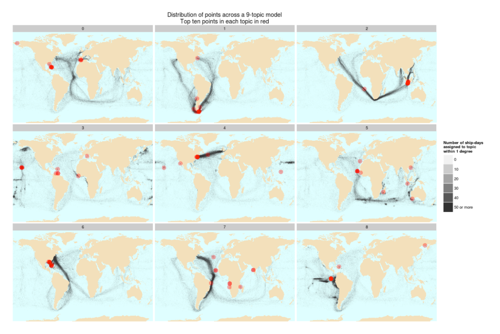

Figure 3: Distribution of points across a 9-topic model. Top ten points in each topic in red.

The top ten lists give an extremely impoverished summary of the topics. Topic 3, for instance, shows the full course of returning vessels from Calcutta and Bombay, but almost all the points are concentrated in the straits of Malacca. By a top ten inspection, topic 6 would appear to be "about" the gulf of Mexico. Showing the points geographically lets us see that the sweep actually extends from New York to Rio de Janeiro. Individual ports where ships spend the most time can dominate a topic, as in topic 7, but the real clusters driving coherence are only visible across the interactions of all the low level points.

With geodata, it is much easier to see how meaning can be constructed out of low-frequency sets of points (points that might available in another vocabulary as well); but in language as well, the most frequent words are not necessarily those that create the meaning. A textual scholar relying on top ten lists to determine what a topic represents might be as misled as a geography scholar mapping routes based on the red above, rather than the black.

The nine topic model also nicely depicts some problems with the assumption of coherence that researchers might bring to topic models. The paths themselves show some very peculiar groupings, such as a bin that includes both the western Pacific whaling grounds and the transatlantic clipper routes (in the middle of the chart). Blowing up topic 4 shows how strange it is:

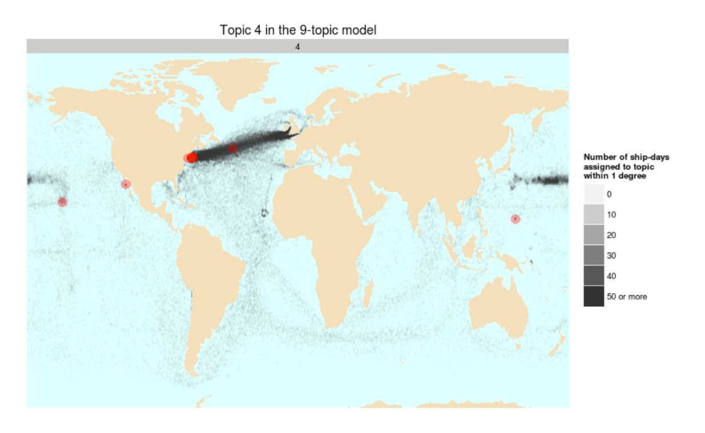

Figure 4: Topic 4 in the 9-topic model

<!-- page 54 -->

The algorithm is obviously combining two very different clusters together; whaling from Hawaii, and the eastern seaboard-England shipping route. Plotted geographically, this is obviously incorrect. But the obviousness is completely dependent on the ability to visualize the entire model at once. The standard way of interpreting topic model results, looking at the top words in each topic, would not have revealed this fact. Just looking at the top 10 might have led me to label it as "transatlantic shipping", which encompasses 7 of the ten top places in the topic. None of the top ten points lie in the whaling grounds that appear to constitute a substantial fraction of the topic. Further diagnostics with MALLET might have caught the error, since researchers in information retrieval do know that chimera topics like this frequently occur. ([David Mimno et al. recently published a paper showing algorithmic ways to find topics like these](http://www.cs.princeton.edu/~mimno/papers/mimno-semantic-emnlp.pdf).)

Currently, most humanists are not using sophisticated diagnostics packages on their topic models. The quality of insights they will be able to derive from topic models are directly related to errors like these. Noticing that "transatlantic shipping" and "Pacific whaling" were connected, I might have been sent down a trail of speculation. I might be led to some insights about how the two are connected that really amounted to no more than a just-so story. Such stories are easy to tell; everything is connected, somehow. (Indeed, a third cluster in this topic, appearing around the Cape Verde islands off the coast of Africa, most likely *is* connected to the whaling industry.) The absurdity of doing that with geographic data is pretty clear; but similar interpretive leaps are extraordinarily easy to make with texts.

Obviously this is an extreme test of LDA; that it performs at all is to its credit, and strange clustering results like this are probably a result of the differences between this and the data MALLET is designed for. Better priors (most ship voyages will probably draw from different topical distributions than a typical book, for instance) might fix this somewhat, as might tweaking the size of the input model (to use a large resolution for voyages, for example). In its own way, an example like this helps show just how powerful a method topic modeling can be. But it also reveals how important it is to find a better way of looking at topic models to see if they really mean what they appear to.

### Topics Shifting in Time

While it is easier to plot points on a map than words in a topic, even lexical datasets can be visualized in ways that bring more information to bear than simply assuming coherence and stability. Just as geospatial points exists in space, most documents exist in time.

The most widespread visualizations of topics in the humanities take advantage of this, by plotting a topic as a historical entity that can be studied in time.[^33] There is also an obvious affinity between plotting *topic* frequencies and plotting *word* frequencies. For word charts, the most widely-used source is Google Ngrams (created jointly with the Cultural Observatory at Harvard). [Bookworm](http://bookworm.culturomics.org/), which I have worked on, is obviously similar to Ngrams: it is designed to keep the Ngrams strategy of investigating trends through words, but also to refract the monolithic universal library into a set of individual texts that make it possible to study [the history of books using words, not just the history of words using books.](http://sappingattention.blogspot.com/2011/09/bookworm-and-library-search.html)

The charts over time in Bookworm/Ngrams-type graphs promote the same type of reflection as these topic-model graphs. Both attempt to show the relative frequency of some meaningful entity in a large corpus. Although one can be legitimately interested in a word, they are most often used as proxies for some essence of an underlying concept. When using words, most scholars understand the difficulties with <!-- page 55 --> doing so. No individual words can capture the full breadth of something like "Western Marxism," trace out its limits, or capture the inflections that characterize it. Vocabulary changes, so one word cannot stand in for an idea even if it did capture it fully for some period. And any word can have multiple meanings: a plot for "evolution" will track a great deal of math before Charles Darwin comes along. Moreover, the frequencies are simply too small to produce clean data with fewer than billions of words to begin with. Individual words sometimes occur as little as once per million words: although you can track them in a huge database like Google Ngrams, statistical noise may overwhelm any signal for a smaller corpus of merely a few thousand documents.

This is an intimidating catalog of problems. But it intimidates precisely because it is publicly accessible: the Ngrams-style approach wears its weaknesses on its sleeves. Topic modeling seems like an appealing way to fix just these problems, by producing statistical aggregates that map the history of ideas better than any word could. Instead of dividing texts into 200,000 (or so) words, it divides them into 200-or-so topics that should be nearly as easy to interpret, but that will be much more heavily populated. The topics should map onto concepts in some ways better than words do; and they avoid the ambiguity of a word like "bank" (riverbank? Bank of England?) by splitting it into different bins based on context.

Andrew Goldstone and Ted Underwood recently wrote a tour-de-force piece [using topic models of the *Proceedings of the Modern Language Association*](http://journalofdigitalhumanities.org/2-1/what-can-topic-models-of-pmla-teach-us-by-ted-underwood-and-andrew-goldstone) (hereafter *PMLA*) to frame big questions about the history of literary scholarship. One of their arguments is that the individual topic is too small a unit for analysis – "interpreters really need to survey a topic model as a whole, instead of considering single topics in isolation." They argue we need to look at networks of interconnection through an entire model, because individual topics cannot stand in for discrete objects on their own. This is true, and I want to underline that one implication is that it is not so easy to pull out an individual topic and chart it because – for example – there may be another, highly similar topic, that drops at the same time. But a topic can be too *big* as well as too small. Just as logbook topics should be broken down to individual points to see where they may not be coherent, textual topics need to be broken down to their individual words to understand where they might fail.

Rather than testing coherence again, though, line charts of topics raise the problem of stability. The statistical distributions behind basic LDA represent topics as stable entities that do not change. Just as with words, this cannot be precisely true: but while we know that words change their meanings, the shifts that take place in topic assignments are much harder to understand. More advanced topic modeling like dynamic topic models and Topics over Time avoid the assumption of stasis for the individual topics.[^34] But they do so at what will be an extremely high cost for most historians and literature scholars: they make strong assumptions about what sort of historical changes are possible. For applications that do *not* involve looking for changes over time, paradoxically, they may be useful: but for humanists who *do* want to look at how discourses change, they will raise major problems. The models each have their own, highly constrained assumptions about what historical change is possible; by their nature they will only show patterns of use that match those assumptions. A short description of why humanists might want to avoid Topics over Time, in particular, is included as [an appendix to this article](http://journalofdigitalhumanities.org/wp-admin/post.php?post=4081&action=edit).

A static assumption brings its own problems, since languages do change. On the surface, topics are going to look constant: but even aside from the truly obvious shifts (Petrograd becomes Leningrad <!-- page 56 --> becomes Petersburg), there will be a strong undertow of change. In any 150-year topic model, for example, the spelling of "any one" will change to "anyone," "sneaked" to "snuck", and so forth. The model is going to have to account for those changes somehow, either by simply forcing all topics to occupy narrow bands of time, or by assuming that the vocabulary of (say) chemistry did not change from 1930 to 1980. In my (limited) experience, there tend *not* to be topics that straightforwardly map onto general linguistic drift, capturing all these changes as they happen. Linguistic drift, after all, is not a phenomenon independent of meaning; it has to do with social registers, author ages, gender, and all sorts of other factors that will cause it to appear in particular sorts of texts.

The long term drifts in language, to put it metaphorically, are a sort of undertow. On the surface, discrete topics seem to bring nicely cognizable chunks in 10-20 word batches. But somewhere, an accounting needs to allow language to change in ways that may not be topically coherent. The actions of this undertow are uncertain; it may be treacherous. In long duration corpuses (over 40 years, perhaps) there should start to be a pretty strong impetus for a model to split up even topics that are conceptually clean over time, just because patterns of usage, vocabulary, and spelling are changing. Likewise, for sources like newspapers there may be strong forces driving cyclic patterns (particularly when a corpus includes advertising, which is seasonal and discrete).

To see how these changes might occur in a long duration corpus, I reimplemented the general scheme, though not the best elements, of Underwood's and Goldstone's models of *PMLA.* I downloaded approximately half of their articles (the 3500 longest *PMLA* articles) from JSTOR Data for Research. Using the scripts Goldstone shared on GitHub when he published the post and the command line version of

MALLET with default settings, I was able to quickly build my own 125topic model. Unlike Underwood and Goldstone, I did not go to any great lengths to correct the standard output: I kept the standard stopword list in MALLET, I used the first model that MALLET created, and I did not fine-tune any of the input parameters. I should be clear that what follows is not a criticism of their model or work, but rather a general attempt to sound out what the "easy" application of topic models might produce.

Just as whaling data reveals incoherence of topics in space, this model shows the possibility for substantial instability of topics through time. That indicates that a simple, intuitive use of topic models will not circumvent the difficulties with using words, *even where it initially appears to*. That implies any serious literary/historical use of topic modeling needs to include in-depth observations of how individual tokens are categorized across various metadata divisions (divergent authorial and publisher styles would be among the most important), not just the relations between topics.

***Splitting topics in time***

As a way to understand these problems, consider one topic in my *PMLA* model. Using the top topics to label, it would be called "grant state twain language foreign bs teachers." Although the list is somewhat difficult to characterize, it is not too much a reach to say that it has something to do with education and nationalism in the late 19th century United States. The reality, though, is stranger. Although the top words per topic tell one story, a great deal more data is available. LDA specifies an assignment for each individual word in each document; that word-level information can be very illuminating.

Again using Goldstone's scripts, I matched the document and wordlevel data against JSTOR metadata by year and split each topic into <!-- page 57 --> two sets of words of equal size. That makes it possible to look at the "grant state twain" topic not as a single ordered list but as *two* ordered lists. The median publication year is 1959; so one group is all words assigned to the topic before 1959, and the other all words after. For the chart below, I took the top 20 words overall, and show their position in each one of these two groups. If the word stays constant, the line is level; if it changes, the slope of the line shows the slope of the change. Rank is scaled logarithmically, so (by Zipf's law) lines of approximately equal slope change by the same raw number of mentions.

Instead, the ranked words produce two quite distinct topics. The first would be called "grant state bs ba teachers language" which, on the surface, seems to be about land grant universities. The second would be called "twain language mark clemens foreign:" that would appear to "obviously" be about Mark Twain. (The "obviousness" excludes the word "foreign," of course, but again, explanations are easy. Maybe it's *Innocents Abroad,* or the king and duke in *Huck Finn.*)

There are tremendous differences between the two topics. This is surprising because, again, the core assumption of a topic model is that the topics are *constant*. But here, the third and fourth most common words in the first period – "BS" and "BA," presumably the degrees – are the 115th and 570th most common in the later period. The topics have ended up being massively distinct historically. There is possibly – buried in the lower realms of this topic – some deeper coherence (a set of words, for example, that appear at a low level in both groups). Or perhaps this is a simply another chimera which happens to break across the year 1959, the same way the whaling topic breaks across the Atlantic and Pacific oceans. The merged topic may possibly be helped on by some coincidences as well: Twain tended to write about the same sort of states that have land grant colleges (Mississippi and Illinois are highly ranked in this set), and he helped publish Ulysses Grant's autobiography. (The default MALLET tokenization is case-insensitive, so "grant" can come from either "land-grant" or "Ulysses Grant.")

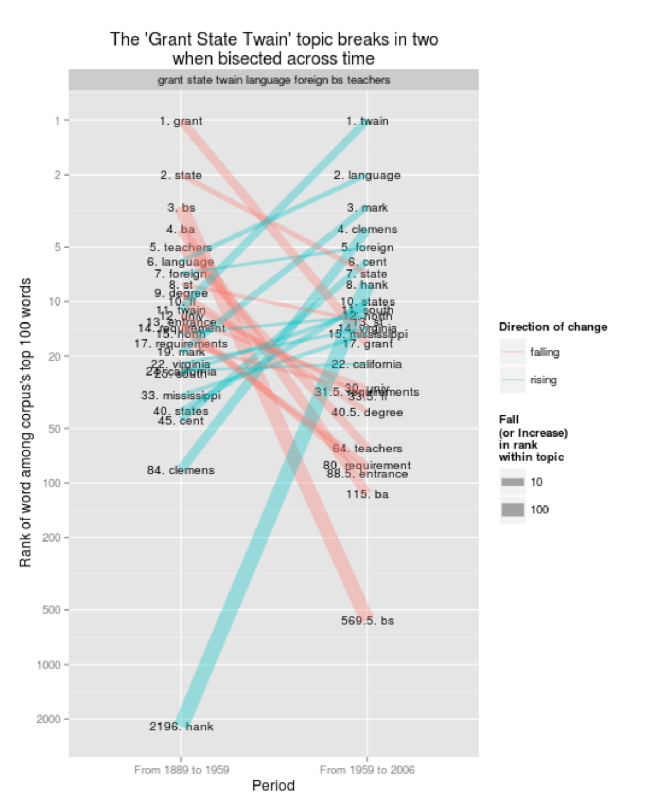

Figure 5: The "Grant State Twain" topic breaks into two when bisected across time

<!-- page 58 -->

This example is not typical: it was deliberately selected as one of the worst in this set. But out of the 70-or-so English language topics I ended up with, it was far from unique.[^35]

Here are the worst 12 topics by one measure (correlation of the top ten words across the two periods), plotted by the same technique:

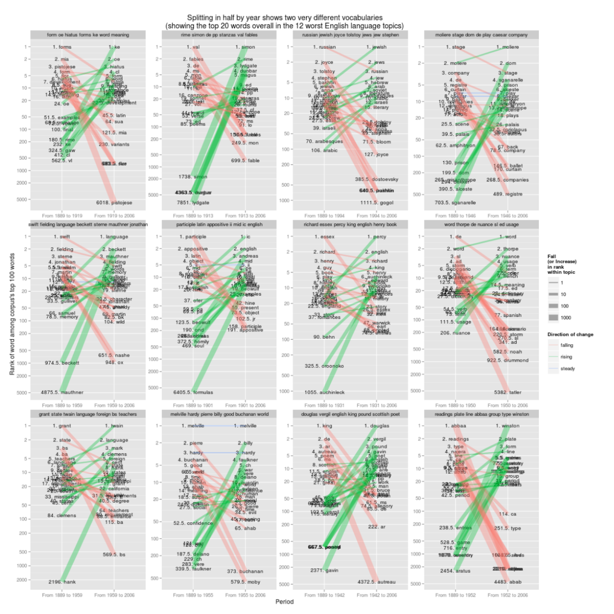

Figure 6: Splitting in half by year shows two very different vocabularies (showing the top 20 words overall in the 12 worst English language topics)

In the middle of the top row, for example, is a category that would have been labeled "Jewish fiction" by normal methods; but it manages to switch from being largely a mishmash of Ulysses and 19th-century Russian novelists before 1994, to something something completely free from Leopold Bloom and much more interested in the Arab world after. As with the shipping data, one might be tempted to draw some conclusions from that. One might start looking for the period that PMLA's political sympathies shifted away from the Israelis towards the Palestinians, for example. But given that the whole point of the mathematical abstractions in LDA is stability of topics, any sufficiently major changes will produce a new topic, rather than instability in a particular topic. A better approach would be to take some seed words and track out from them, as in the [4th pamphlet from the Stanford Literary Lab](http://litlab.stanford.edu/LiteraryLabPamphlet4.pdf) by Ryan Heuser and Long Le-Khac.

Even a sample of 12 random topics, which gives a better sense of the distribution for the entire set, shows some of these same patterns. In the middle left, for example, is a topic anchored by a common emphasis on things "Italian": but before 1924, it seems to rely heavily on the British Museum, while after that shifts in favor of Dante and Petrarch [Figure 7].

### Tracing Words Inside Topics

This suggests that in addition to understanding topic models through their descriptions, humanists should also trace the ways words drift among topics. Take the word "represent," which does not show up as anchored in any particular topic, although clearly it does form part of a pretty foundational set of vocabulary for fiction. To track this, I plot the usage of the word "represent" (and derived words like "representing") across each of the topics where it appears. The words drift among several topics in this set: appearing in a bin of three topics before 1960, <!-- page 59 --> appearing most in "criticism meaning literary" in the 60s and 70s, and appearing overwhelmingly in "language narrative text trans" from 1980 onwards [Figure 8].

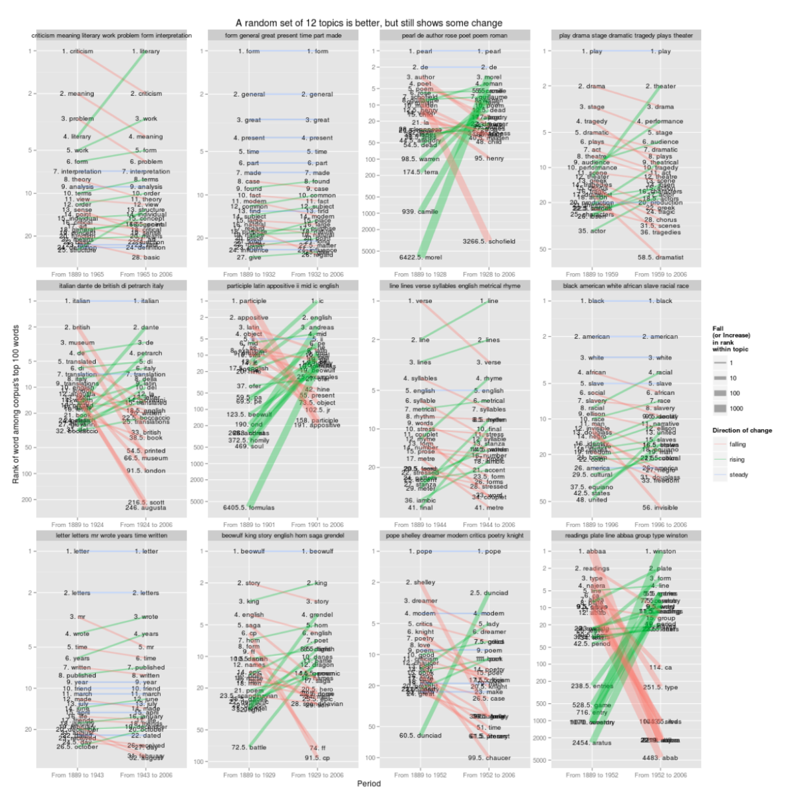

Figure 7: A random set of 12 topics is better, but still shows some change

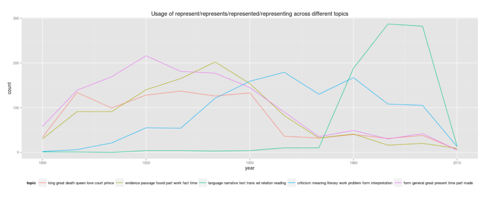

Figure 8: Usage of represent/represents/represented/ representing across different topics

It seems possible that the language of representation is shifting, and the result is that "representation" lands in new topics in each decade because of real changes. For example, "mimesis" and "mimetic" – which form a part of one particular vocabulary of representation – are lumped into that same "language narrative text" topic, but only appear after 1980:

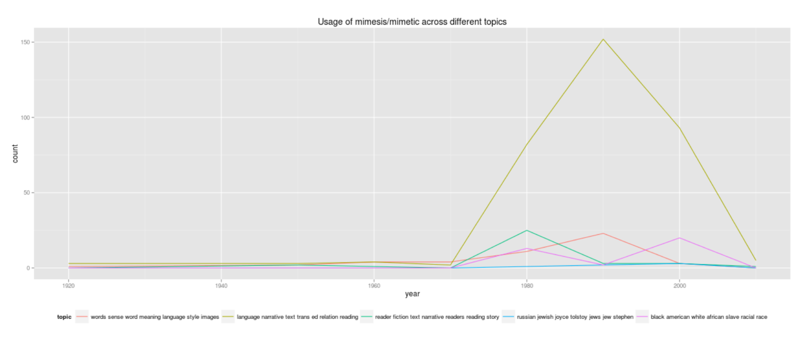

Figure 9: Usage of mimesis/mimetic across different topics

<!-- page 60 -->

The shift in representation shows something, certainly: the alignment of "mimesis" might cause one to believe that shifts in the "concept of representation" cause different topics to emerge. But the problem is that the model is not giving us a topic centered on representation. The fourth most common word is "trans," which is just footnote filler; "language" is the most common word, indicating that the right label here might just be "generic 1980s literary language." That might be useful; but it might also be tautological. One cannot say "generic 1980s literary language" peaked in the 1980s. On the other hand, words or phrases that are characteristic of real 80s literary language may also appear in any number of other topics as well, so one would want to be careful interpreting the batch as a whole. Comparisons between 1970s and 1980s literary language, for instance, would be more fruitfully done on the full set, not some topics pulled out.

### Topic Modeling in Public

In their own way, each of these examples is flawed. I have not tuned the parameters and adjusted the settings to show topic modeling at its best: by using default settings and messy datasets, the problems of topic incoherence and instability are surely exacerbated. Topic modeling for discovery will be beset by problems like this, though: no reasonable discovery procedure should involve extensive investigation of hyperparameter optimization. Certainly, humanists using topic models need to be extensively and creatively checking the individuals words that constitute their topics to see how grounded their inferences are. Checks for instability across metadata categories, like time, need to be incorporated into the tools we use for topic modeling; better methods for visualizing lexical topics as comprehensively as we can view geographical topics are sorely needed as well.

But remembering the ways that topics fail to be meaningful should also highlight the limits of the algorithm. For the purposes of discovery, topic modeling is not an indispensable tool for digital humanists, but rather one of many flawed ways that computers can reorganize texts. Perhaps humanists who only apply one algorithm to their texts should be using LDA. (Although there is something to be said for the classics: Stephen Ramsay's study of Virginia Woolf in the first chapter of *Reading Machines*[^36] shows a lot can be done with [TF-IDF,](http://en.wikipedia.org/wiki/Tf%E2%80%93idf) [Ted Underwood has done some marvelous things with Mann-Whitney scores](http://tedunderwood.com/2011/11/09/identifying-the-terms-that-characterize-an-author-or-genre-why-dunnings-may-not-be-the-best-method/), and projects like MONK have been bringing [Dunning Log- Likelihood](http://monkpublic.library.illinois.edu/monkmiddleware/public/analytics/dunnings.html) to ever wider groups). But "one" is a funny number to choose. Most humanists are better off applying zero computer programs, and most of the remainder should not be limiting themselves to a single method.

But it is in its public applications that the problems with topic modeling are most acute. When presented as evidence (in a blog post, a talk, or a book), topic models create difficulties that may not be worth the effort required to understand them. Although quantification of textual data offers benefits to scholars, there is a great deal to be said for the sort of quantification humanists do being *simple.* Simplicity is important because it connects to the accessibility of humanistic research, in the sense of easily communicated or argued against. Most of the arguments against any particular Google Ngram graph, for example, are widely accessible – they rely on rather basic facts of addition and division. The expertise to critique them relies on understanding the nature of the digitized sources used and the words charted, not anything to do with the way the numbers were assembled. Ultimately, the reason to ground all topic models more fundamentally in the words and metadata that we have is that those are the things we care about.

<!-- page 61 -->

LDA, on the other hand, tends to be less permeable to subject matter expertise. That is not to say LDA is completely inscrutable; Matthew Jockers, for example, has done just this sort of iterative improvement on the models of the Stanford literary corpus.[^37] But even those as deep into the plumbing as Jockers will have a hard time bringing other humanistic readers along on the interpretive choices they make in tuning their topic models, and instead will have to rely on protestations of authority. And most humanists who do what I have just done – blindly throw data into MALLET – will not be able to give the results the pushback they deserve. Even the most mathematically inclined may have trouble intuiting what might go wrong in 25-dimensional simplices.

Even when humanists understand the mechanics of LDA perfectly, they will not be able to engage with their fellow scholars about them effectively. That is a high price to pay. Humanistic research using data, done simply, [can help open up the act of humanistic inference to non- experts](http://sappingattention.blogspot.com/2011/06/whats-new.html); complicated algorithms can close off discussion even to fellow experts. That is not merely a function of quantification: if I use Ngrams to argue that Ataturk's policies [propelled the little city of Istanbul out of obscurity](http://books.google.com/ngrams/graph?content=Istanbul&year_start=1800&year_end=2000&corpus=15&smoothing=3&share=) around 1930, anyone who knows about Turkey can explain [my mistake](http://books.google.com/ngrams/graph?content=Istanbul%2CConstantinople&year_start=1800&year_end=2000&corpus=15&smoothing=3&share=). If I show a topic model I created, on the other hand, informed criticism will be limited to those who understand how topic modeling works. (In presenting topic models, humanists usually fall back on the coherence of the top 5 labels as *prima facie* evidence of the model's validity).

Finally, sharing research that is grounded in individual words ensures that digital humanists do not spend too much time refining arcane practices for topic interpretation that connect only tangentially to live questions. Most humanistic scholars have spent their lives interpreting words; they have a special claim to make for expertise in interpreting them. Topic models are no less ambiguous, no less fickle, and no less arbitrary than words. They require major feats of interpretation; even understanding the output of one particular model is a task which requires considerable effort. And ultimately, topics are not what we are actually interested in. Words – despite not being coherent wholes or stable constants – are. Whatever uses humanists find for topic models, in the end they must integrate the models with a close understanding of the constituent words; and only by returning to describe changes in words can they create meaning.

Originally published by Benjamin M. Schmidt in [November](http://sappingattention.blogspot.com/2012/11/when-you-have-mallet-everything-looks.html)

> [2012](http://sappingattention.blogspot.com/2012/11/when-you-have-mallet-everything-looks.html) and [January 2013](http://sappingattention.blogspot.com/2013/01/keeping-words-in-topic-models.html). Expanded and revised for the *Journal of*
> *Digital Humanities* March 2013.

**Acknowledgements and Code**

Thanks to Scott Weingart, Ted Underwood, Andrew Goldstone, and David Mimno for helpful comments on the blog version of these posts, and to Elijah Meeks and Weingart for their comments on the draft version.

All topic modeling was done using the [MALLET package](http://mallet.cs.umass.edu/) with minimal changes to the default settings: the PMLA analysis also uses code from [Andrew Goldstone's pmla GitHub repository](https://github.com/agoldst/dfr-analysis) to join JSTOR metadata to MALLET results.

Analysis was done in R. The code used to build an analyze the models is in two separate sections within the [Code Appendix](http://journalofdigitalhumanities.org/2-1/code-appendix-for-words-alone-by-benjamin-m-schmidt/):

1. The code used to topic model the ship's voyage.

2. The code for Topic Model evaluation with JSTOR and MALLET in R: how to create an analysis splitting up topics temporally to test <!-- page 62 --> their coherence, some R functions and a demonstration narrative from this text.

**Appendix: Topics over Time**

Most of what I have said above applies to what tends to be called "vanilla" topic modeling. Many humanists may be tempted, instead, to use topic modelings that incorporate some notion of temporal change as a feature of the model. But as I said, each of these expresses its own conception of historical change. Here I will describe one of these, the model "Topics over Time."[^38]

The problem with Topics over Time is that it presumes that some statistical distributions over time are better than others. This is potentially useful, but it means that anyone using it to search for patterns has to take into account the particularly constrained sorts of responses that it returns. Certain topics will be privileged; others will be ignored.

Two problematic results are likely to result from the assumptions behind topics over time:

1. Prior distributions will lead questionable assignments of documents from immediately before their peak. For example, in Wang-McCallum's paper, they identify a topic for the "Cold War." Since that topic is quite strong from 1947 to 1989, the prior distribution assumes there *must* be a number of documents from 1900 to 1945 as well. Therefore words will be assigned to that topic as a result, when they are otherwise not as good a fit. But while smooth priors cannot imagine it, there's good reason to want a Cold War topic that emerges *de novo* in 1945. They are pleased that it works better than than the related LDA topic: but the vanilla one is also more general, not including, for instance, "soviet" in its top ten.

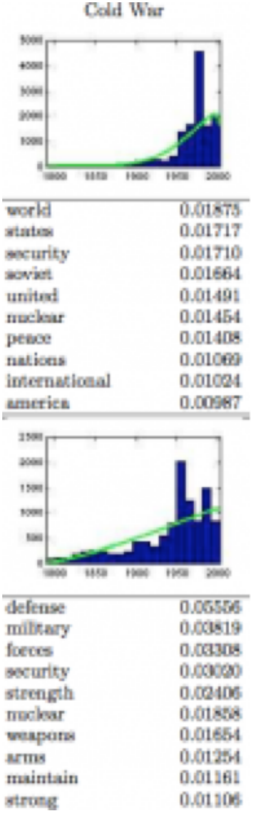

Example of two "Cold War Topics" in Topics over Time (top) and LDA (bottom) from Wang and McCallum

<!-- page 63 -->

2. Topics that don't follow a beta distribution in their temporal pattern will be lost or split. This is where the assumption of the nature of historical change completely breaks down. Although there is sound evidence that Dirichlet distributions will apply to words across documents, there is absolutely no reason to presume that historical patterns should follow a beta distribution through time. Dirichlet distributions are convenient abstractions for topic-document distributions, but are an obviously incorrect prior for topic-year distributions. One can see this from the Ngrams data: the curves are not symmetric, but rather tend to show a brief peak followed by a long decay. I can show you a lot of camel-backed curves. A large number of words that enter the language, for example, do so in the context of wartime and so have camel-backed curves, as for the word "sniper:"

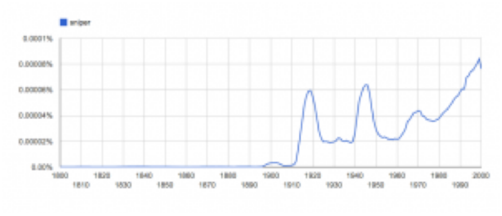

Usage of the word "sniper" in the Google Ngrams corpus (Source: Google Ngrams)

An assumption that historical changes need be continuous will end up, therefore, artificially reinforcing the already-problematic tendency of LDA to split the vocabulary of "war" (for instance) discourse into two historically conditioned ones. In analyzing newspapers, it will penalize election topics on some horizons because they peak in 2 to 4 year increments rather than smoothly building over time.

If you want to find topics that are heavily concentrated in time in a particular way, Topics over Time might be useful; but it does not seem like a good all-purpose solution to the problem of language drift.

Does that mean that modeling cannot add anything to our understanding of historical dynamics? Probably not; but it does mean that historians need to be extraordinarily cautious about interpreting the output of such models, since they will tend to privilege continuous change over discontinuous change, and unidirectional patterns over cyclical ones. (The other major temporal topic model, dynamic topic models, make their own problematic set of assumptions.) It is, perhaps, possible that someday a distributional model for change will make these models match the wide variety of historical changes that *are* reasonable to expect. But that ought to come *out of* an understanding of words or other historical units that we understand (or an understanding, at least, of the ways that we do not understand), rather than being imposed as an assumption from outside.

### Notes:

[^30]: A few good examples of the form: Jockers, Matthew L. "The LDA Buffet Is Now Open: Or, Latent Dirichlet Allocation for English Majors." Matthew L. Jockers, September 29, 2011. [http://www.matthewjockers.net/2011/09/29/the-lda-buffet-is-now-open-or-latent-dirichlet-allocation-for-english-majors/](http://www.matthewjockers.net/2011/09/29/the-lda-buffet-is-now-ope); Underwood, Ted. "Topic Modeling Made Just Simple Enough." The Stone and the Shell, April 7, 2012. [http://tedunderwood.com/2012/04/07/topic-modeling-made-just-simple-enough/](http://tedunderwood.com/2012/04/07/topic-modeling-made-just-simple-enough/); Weingart, Scott. "Topic Modeling for Humanists: A Guided Tour." the scottbot irregular, July 25, 2012. [http://www.scottbot.net/HIAL/?p=19113](http://www.scott); Posner, Miriam, and

<!-- page 64 -->

Andy Wallace. "Very Basic Strategies for Interpreting Results from the Topic Modeling Tool." Miriam Posner: Blog, October 29, 2012. [http://miriamposner.com/blog/?p=1335](http://miriamposner.com/blog/?p=1335%22%20%5Co%20%22Miriam%20Posner,%20%5C%22Very%20basic%20strategies%20for%20interpreting%20results%20from%20the%20Topic%20Modeling%20Tool%5C%22%22%20%5Ct%20%22_blank). The chapter in *The Programming Historian 2* by Shawn Graham, Scott Weingart, and Ian Milligan on Topic Modeling is also very helpful.

[^31]: David M. Blei, Andrew Ng, Michael Jordan. "Latent Dirichlet allocation," *Journal of Machine Learning Research* (3) 2003 pp. 993-1022.

[^32]: The only change to the basic constraints I made was changing the "token-regex" line so that the string "42.4,-72.1" would be parsed as a single word. Otherwise, I keep the defaults as they are.

[^33]: There are many examples of this trend, both by historians and computer scientists. For example: [Ian Milligan, "Cultural Trends in Hansard: Looking at Changes, 1994–2012"](http://ianmilligan.ca/2012/11/09/cultural-trends-in-hansard/%22%20%5Co%20%22Ian%20Milligan,%20%5C%22Cultural%20Trends%20in%20Hansard:%20Looking%20at%20Changes,%201994-2012%5C%22%22%20%5Ct%20%22_blank); [Jonathan Goodwin, “Same Stuff, Different Graph;”](http://www.jgoodwin.net/?m=201211%22%20%5Co%20%22Jonathan%20Goodwin,%20%5C%22Same%20Stuff,%20Different%20Graph%5C%22%22%20%5Ct%20%22_blank) Ted Underwood, “Some Results of Topic Modeling,” March 12, 2012; [Mining the Dispatch](http://dsl.richmond.e) from the Digital Scholarship Lab at the University of Richmond; David Hall, Daniel Jurafsky, and Christopher D. Manning. 2008. [Studying the History of](http://www.stanford.edu/~jurafs) [Ideas Using Topic Models [PDF],](http://www.stanford.edu/~jurafs) *Proceedings of EMNLP 2008*, 363– 371. [Paper Machines](http://metalab.harvard.edu/2012/07/paper) makes this widely and easily available.

[^34]: Blei, David M., and John D. Lafferty. "Dynamic topic models." In *Proceedings of the 23rd International Conference on Machine Learning*, pp. 113-120, ACM, 2006; Wang, Xuerui and Andrew McCallum. "Topics over time: a non-Markov continuous-time model of topical trends." In *Proceedings of the 12th ACM SIGKDD International Conference on Knowledge Discovery and Data Mining*, pp. 424-433, ACM, 2006.

[^35]: As an extraordinarily rough heuristic for "English," I only included in the charts that follow topics whose first word was four or more letters long. Almost all Spanish, Latin, German and Italian topics in the corpus – of which there were several – began with a two-or-three letter word, but almost none of the English-language topics did

[^36]: Ramsay, Stephen. *Reading Machines: Toward an Algorithmic Criticism*. Topics in the Digital Humanities. Urbana: University of Illinois Press, 2011.

[^37]: Jockers, Matthew L. *Macroanalysis: Digital Methods and Literary History.* University of Illinois Press, 2013.

[^38]: Wang, Xuerui, and Andrew Mccallum. “Topics over Time: a non-Markov Continuous-time Model of Topical Trends.” In *Proceedings of the 12th ACM SIGKDD International Conference on Knowledge Discovery and Data Mining*, 424–433. KDD  ’06. New York, NY, USA: ACM, 2006. doi:10.1145/1150402.1150450.

<!-- page 65 -->

## Code Appendix for “Words Alone: Dismantling Topic Models in the Humanities”

**BENJAMIN M. SCHMIDT**

> **Editor’s Note:** To view code in iBook, switch to Landscape. If you
> wish to utilize the code please visit **journalofdigitalhumanities.org**

### Topic Modeling Ships

Begin by getting the data in order. (This data is available on request.)

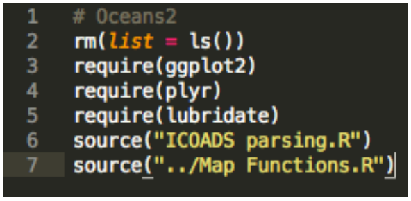

This step pulls in the Maury data and splits it. This is not fully documented as part of this article, since the purpose is to show general geodata parsing.

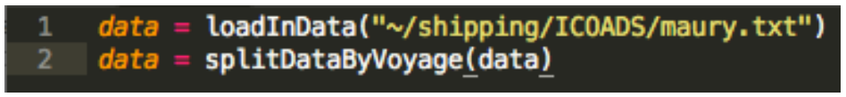

Next, save the R data.frame into a directory that MALLET will be able to interpret as a text, and run a topic model on it. The rounding gives the resolution at which the topic will be run.

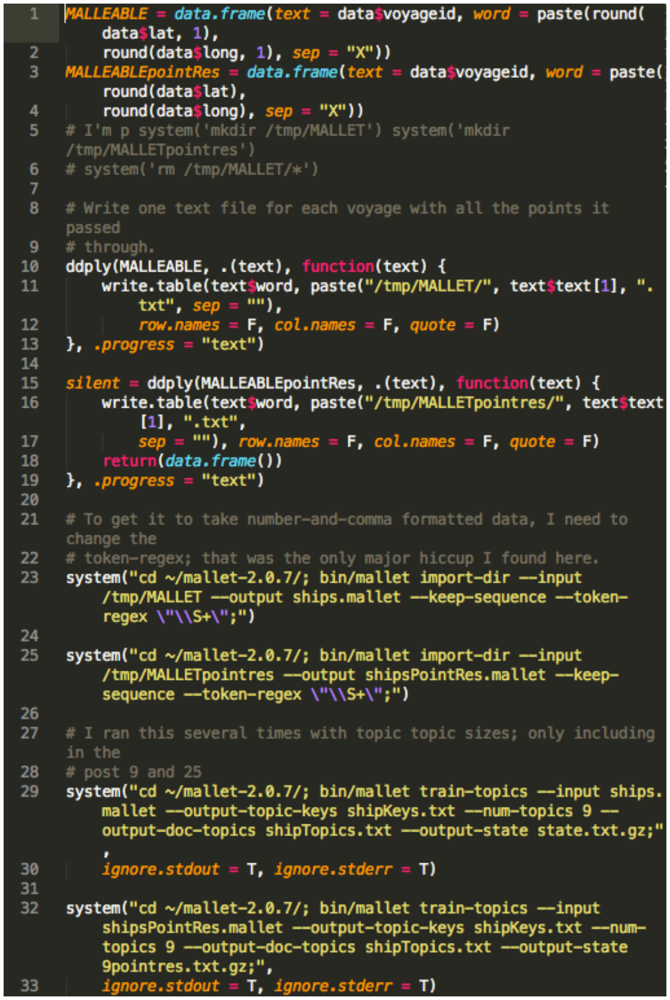

<!-- page 66 -->

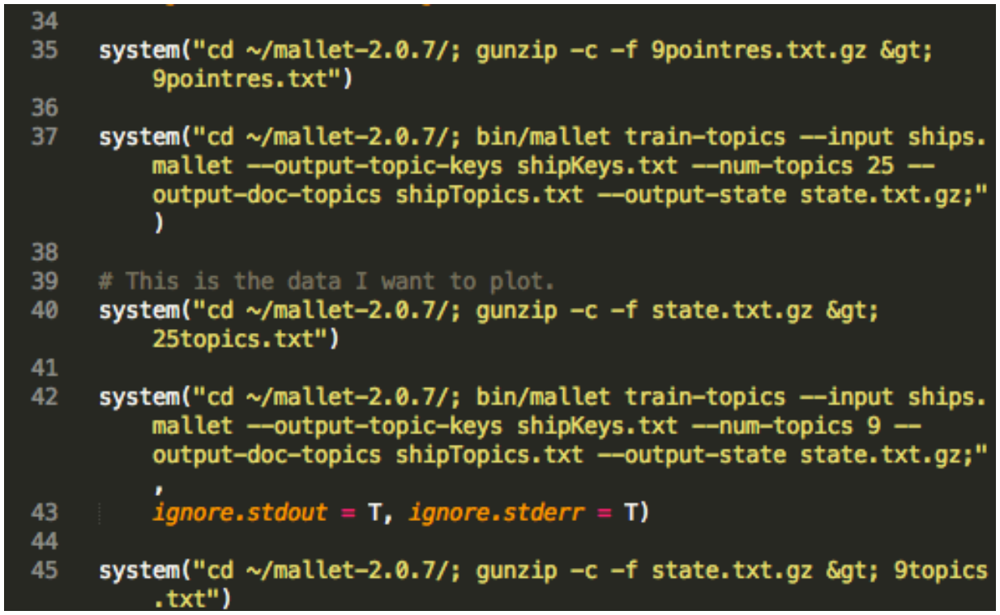

Read in those MALLET results and clean them up for analysis.

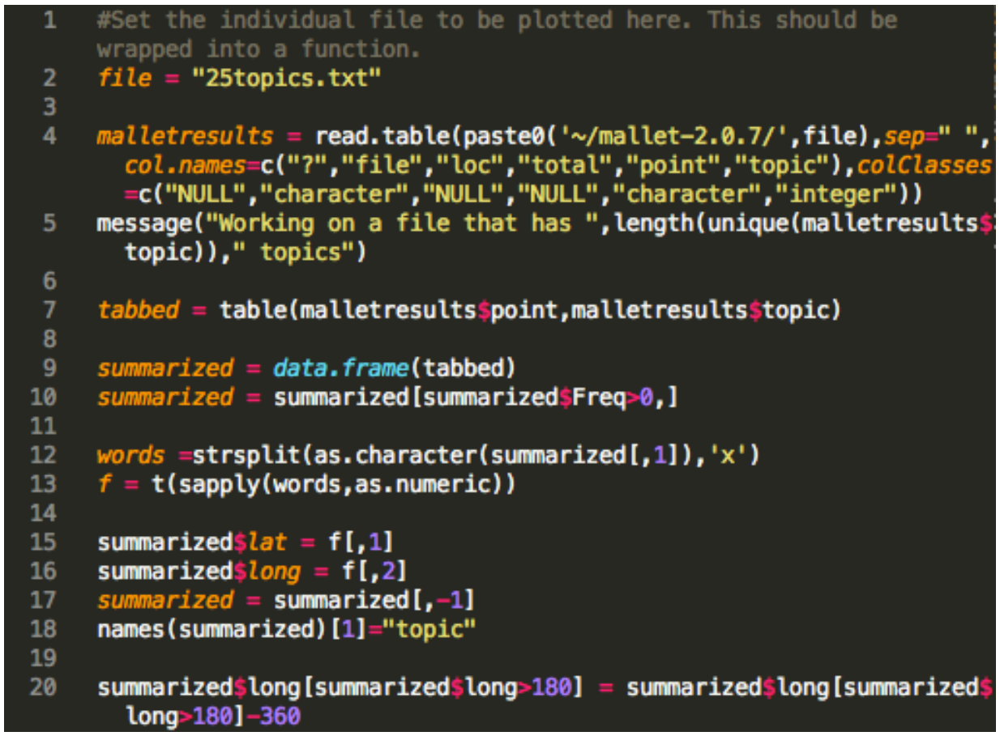

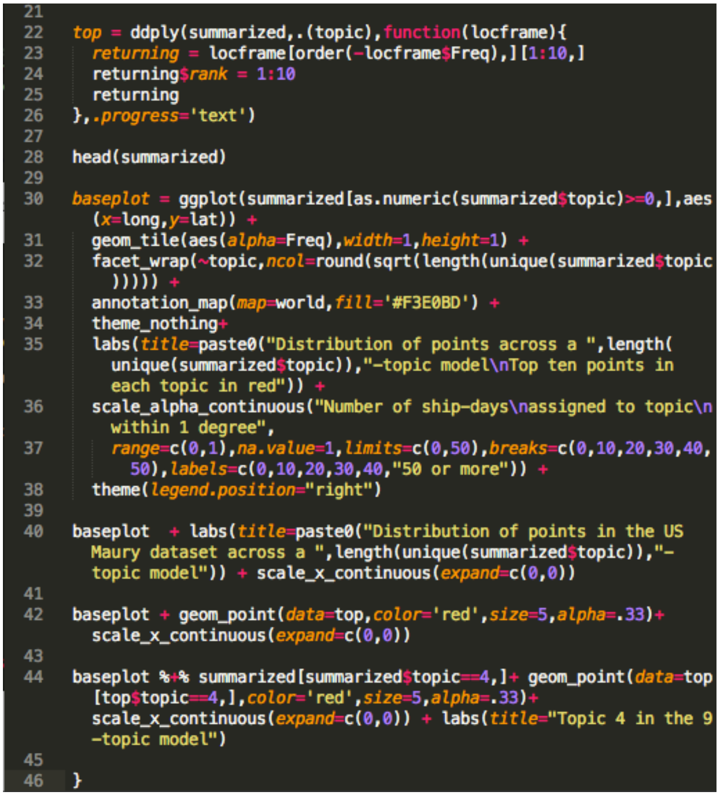

Make some plots:

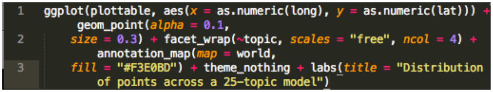

Try K-means clustering on the voyages in topic space (note: this did not work – most ended up in a single k-means cluster – so I did not <!-- page 67 --> include it in the blog post). This approach might work better with a higher number of topics, perhaps a couple hundred, but that would take better priors.

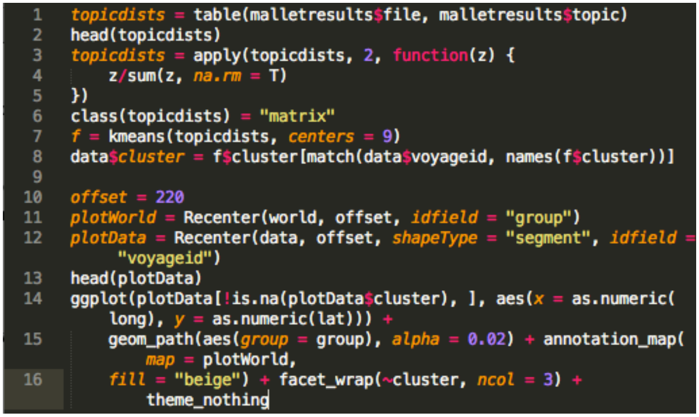

### Topic Model evaluation with JSTOR & MALLET in R

This is Ben Schmidt's R diagnostics for long-term historical topic modeling. It works off a MALLET state file.

Most of the work is done in custom functions: these are stored in the separate file "TopicModelVisualization.R" (which is printed at the end of this appendix).

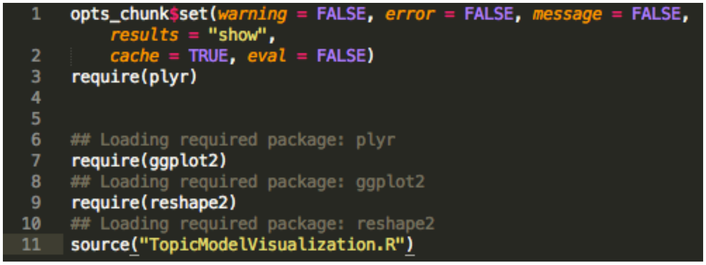

The first step is to load the MALLET file with a function to do so.

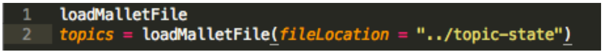

This is code I borrowed from Andrew Goldstone to match the metadata from JSTOR against the topics. If you are not using JSTOR, you would just need to 1. create a 'year' column in the topics frame 2. (optionally) create a files frame with other metadata (title, author, and so forth), indexed so that files$numid maps to topics$doc.

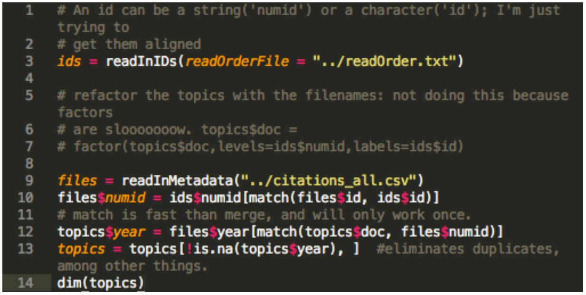

And finally, topics conventionally have names, not numbers. Here we derive those as the top seven words in each topic.


OK, now to look for weirdness.

<!-- page 68 -->

Plow through all the topics and run that function to extract out various data about them. The exact metrics I use are documented inside the code for the previous function

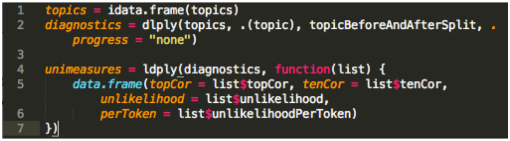

Plot some of the worst ones. This will not work with other models, perhaps. The whole block can be skipped, though.

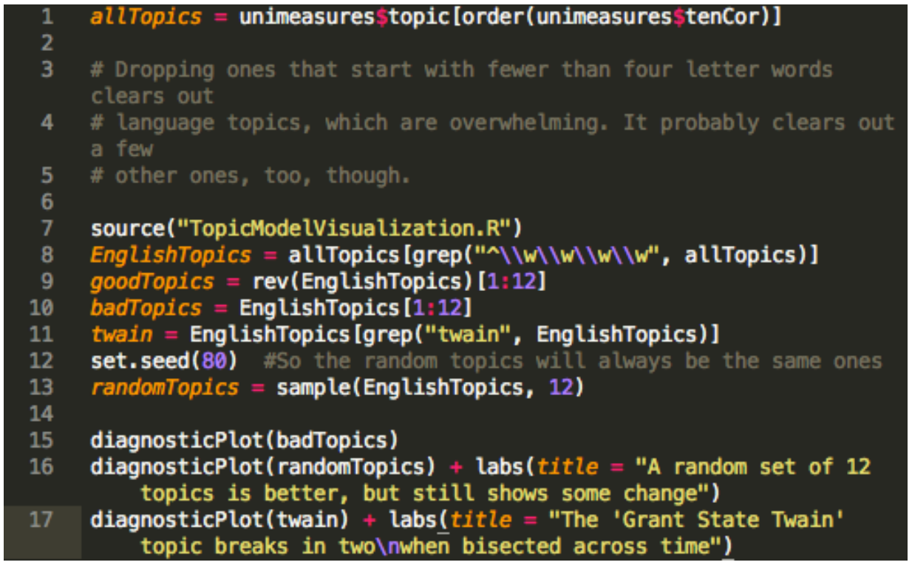

Here's a function to plot the usage of a word across its top five topics.

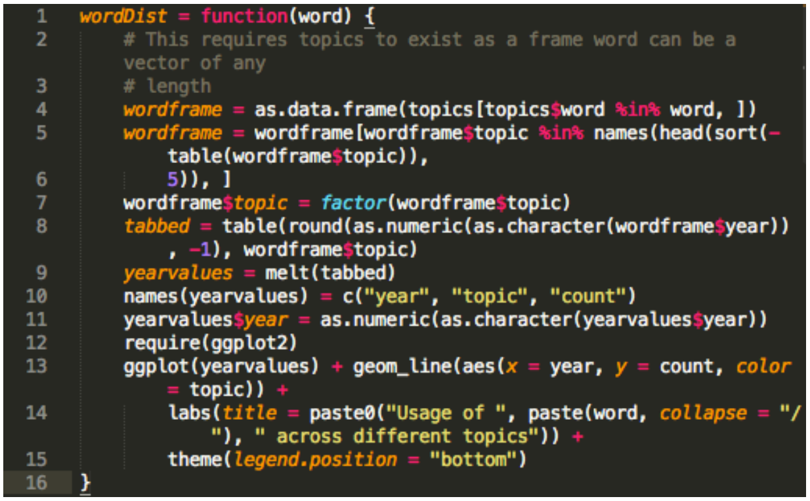

For example:

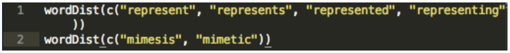

### Code to parse MALLET/JSTOR results in R

This is the block of functions used to parse mallet/JSTOR results.

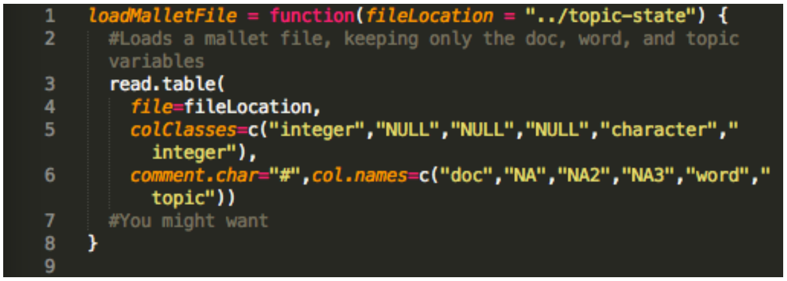

<!-- page 69 -->

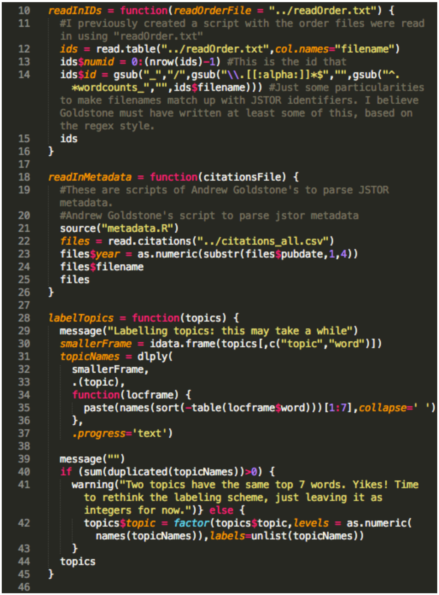

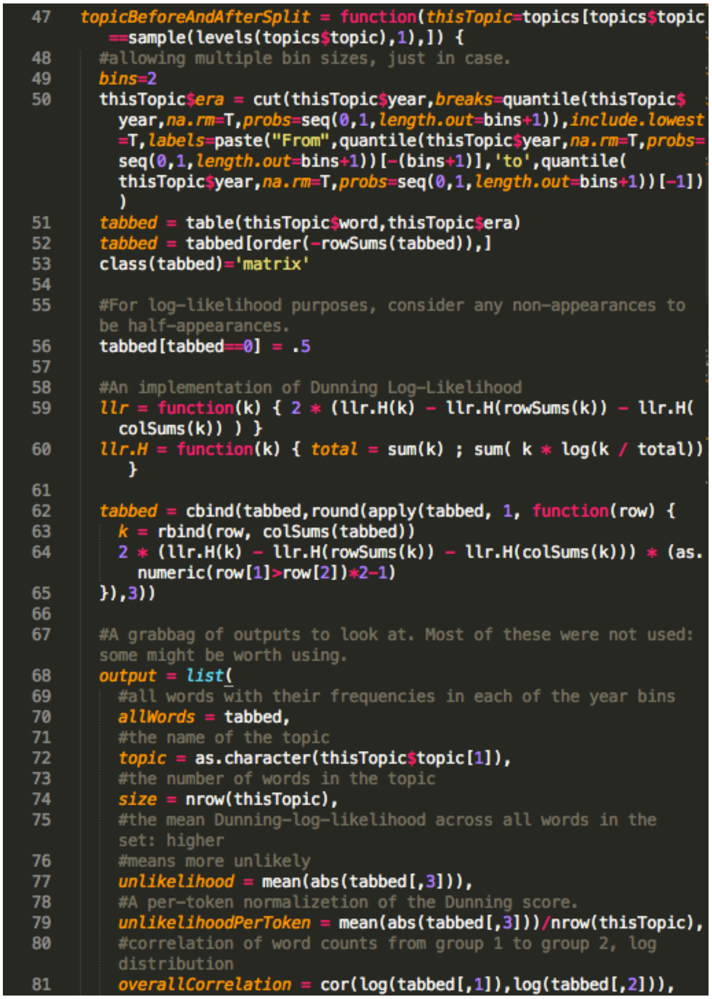

<!-- page 70 -->

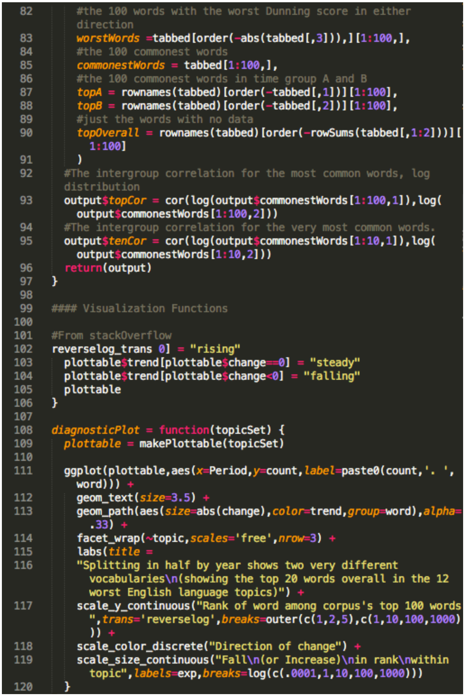

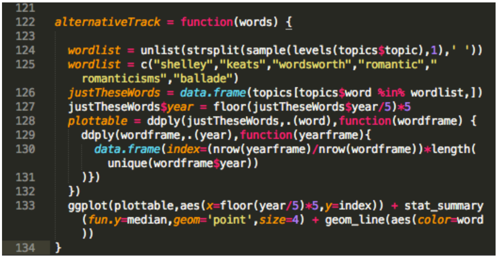

<!-- page 71 -->

## Reviews

- **Review of MALLET, produced by Andrew Kachites McCallum**, Shawn Graham and Ian Milligan — 73

- **Review of Paper Machines, produced by Chris Johnson-Roberson and Jo Guildi**, Adam Crymble — 77

<!-- page 72 -->

## Review of MALLET, produced by Andrew Kachites McCallum

**SHAWN GRAHAM AND IAN MILLIGAN**

> MALLET Version: [2.0.7](http://mallet.cs.umass.edu/download.php)
> Requirements: [Java](http://www.oracle.com/technetwork/java/javase/downloads/index.html)

> Reviewed: 15 February 2013
> Tested on: Mac OS X v. 10.8.2, and Windows 7

The [MAchine Learning for LanguagE Toolkit](http://mallet.cs.umass.edu/), or MALLET, has been one of the “hottest” tools in digital humanities research. A product of the University of Massachusetts Amherst, written by Andrew McCallum and a team of graduate students, MALLET was originally released in 2002 but has received considerable renewed interest of late. Fruitfully employing [Latent Dirichlet Allocation](http://www.cs.princeton.edu/~blei/papers/BleiNgJordan2003.pdf) [pdf], or LDA, MALLET can help navigate large bodies of information. It does so by finding clusters of words that frequently appear together, or "topics." The algorithm imagines that any possible text or document within a corpus is a mixture of different topics; each topic is imagined to be a probability distribution of terms within and across that corpus. This leads to a variety of outputs, including lists of topics and their constituent words, and list of documents and their constituent topics.

These results can often be astounding, and have even been (tongue-in-cheek) [described as “magic.”](http://www.scottbot.net/HIAL/?p=221)

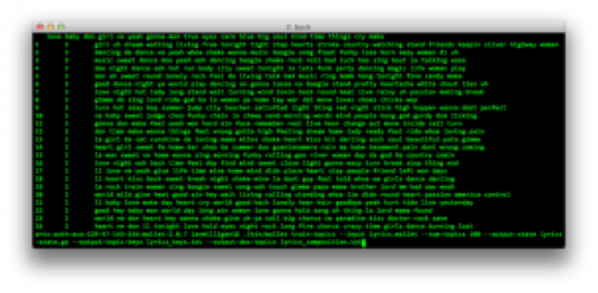

Figure 1: It isn’t pretty, but it works. The results of a topic model, showing 25 topics found across a database of nearly 15,000 song lyric files. At bottom is the command to execute yet another topic model, this time with 100 topics.

The possibilities of MALLET and topic modeling are best understood when seen in action (see also [Templeton, 2011](http://mith.umd.edu/topic-modeling-in-the-humanities-an-overview/)). In the humanities, some of the earliest uses of MALLET are Rob Nelson’s [Mining the Dispatch](http://dsl.richmond.edu/dispatch/) and Cameron Blevins (2010) "[Topic Modeling Martha Ballard’s Diary](http://historying.org/2010/04/01/topic-modeling-martha-ballards-diary/)." [Elijah Meeks](https://dhs.stanford.edu/comprehending-the-digital-humanities/) (2011) also explored the use of topic modeling a collection of blog posts, listserv messages, and articles to identify a definition of digital humanities. [Matthew Jockers](http://www.stanford.edu/~mjockers/cgi-bin/drupal/node/39) (2010) did the same for the 2010 Day of Digital Humanities. [Newman and Block](http://www.ics.uci.edu/~newman/pubs/JASIST_Newman.pdf) [pdf] (2006) explored similar techniques on a corpus of 18th century newspapers, but coded the algorithms themselves in Matlab. In 2009, in an example of the power of this method applied in a very different domain, David Mimno used topic modeling [to understand the archaeology of a Pompeian house](http://people.cs.umass.edu/~mimno/papers/pompeii.pdf) [pdf]. He imagined each room in the house could be read as a "document" and so the objects found within <!-- page 73 --> those rooms could be imagined as the "words". The resulting topics from that analysis he argued constituted vocabularies of use, indicating the function of the rooms.

Topic modeling, and MALLET in particular, have wide appeal across the digital humanities. Historians can use it to take a large archival collection with robust OCR, run it through the system, and begin to see the overall contours and shape of the material. While it does not replace in-depth close reading, it does provide invaluable context and pointers towards issues that might have otherwise been missed. Literature scholars (such as [Ted Underwood](http://tedunderwood.com/category/methodology/topic-modeling/), [Lisa Rhody](http://www.lisarhody.com/category/topic-modeling/) and [Jeff Drouin](https://dhs.stanford.edu/algorithmic-literacy/topic-networks-in-proust/)) have also fruitfully employed it to look through various narratives, seeing trends and issues throughout literary corpi.

The results produced by MALLET can be difficult to understand. For historians, some sense to the results can be injected when we consider the time dimension. In Nelson’s work, he plotted the resulting topics according to the date of publication of the original documents. Thus, he is able to tell a complex and nuanced story about, for instance, [the interplay of fugitive slaves with the labour market of civil war Richmond](http://dsl.richmond.edu/dispatch/pages/intro):

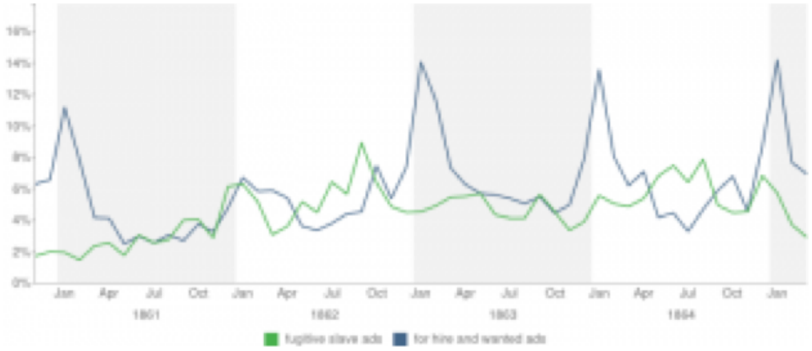

Figure 2: The ‘fugitive slave ads’ topic versus the ‘for hire and wanted ads’ topic in Mining the Dispatch, by date.

> Could it be that enslaved African American men and women destabilized the slave hiring market by using the chaos of war mobilization in and around Richmond to run away in increasing numbers? This is a question that can be formulated from but not answered by these graphs alone, that will require using more traditional research methods to investigate. But the question itself suggests the value of topic modeling. Topic modeling and other distant reading methods are most valuable not when they allow us to see patterns that we can easily explain but when they reveal patterns that we can't, patterns that surprise us and that prompt interesting and useful research questions.[^39]

Another way of visualizing the relationships suggested by MALLET’s output is to think of them as networks of ideas. It is trivial to turn a spreadsheet of documents-and-constituent-topics into a two-mode network visualization (document tied to topic), as [Meeks does here](https://dhs.stanford.edu/comprehending-the-digital-humanities/) (and Graham [does here](http://electricarchaeology.ca/2011/08/30/getting-started-with-mallet-and-topic-modeling/#comment-5056), using [Gephi](http://gephi.org/).) Ted Underwood explores in more depth other ways of visualizing topic model output [here](http://tedunderwood.com/2012/11/11/visualizing-topic-models/).

MALLET isn’t perfect. The most trenchant criticism of it is its steep learning curve. Indeed there are "hidden steps" (which perhaps form tacit knowledge for computer scientists and power users but can be completely opaque for humanists) – for instance, MALLET must be installed directly on the computer’s C:\\ drive (and not in a subfolder). Nowhere in the documentation is this stated. As installed from the website, it is a command line-only program, which requires technical familiarity. Compounding that is a fairly short and abbreviated documentation. While the basics are more or less provided, they often require further investigation and exploration to fully understand (it is also possible to get MALLET to [provide diagnostics](http://article.gmane.org/gmane.comp.ai.mallet.devel/1483/) on its analysis).

Beyond alienating novice users, the lack of documentation raises significant methodological issues. Relying only on MALLET's documentation, a user would not see discussions of how many topics are appropriate, how many sampling iterations you should use, how it <!-- page 74 --> should be optimized, and how you can read diagnostic outputs. These variables have a significant effect on outputs. Poor documentation does not simply affect usability, but also whether the tool can be consistently used and its ability to generate the most useful and rigorous results available. There is a [user mailing list for MALLET](http://mallet.cs.umass.edu/mailinglist.php), but it can be somewhat intimidating for the novice user. For users coming from the humanities, a forum such as [Digital Humanities Questions and Answers](http://digitalhumanities.org/answers/) might be more appropriate, at least initially.

This issue has been remediated by community support, however. We have co-written an [introduction in the Programming Historian 2](http://programminghistorian.org/lessons/topic-modeling-and-mallet) (with Scott Weingart), which has been linked from the MALLET page itself. Additionally, for more casual users, there is a [JAVA GUI that can be fruitfully employed](http://code.google.com/p/topic-modeling-tool/). You select your files or a directory, add a few parameters in drop-down menus or text boxes, and voila! – your topics are there before you. For working with undergraduates, this is the best way forward. Similarly, the [SEASR MEANDRE](http://seasr.org/meandre/) workbench also incorporates topic modeling with MALLET, if you want to [add it to a much more complicated workflow](http://ianmilligan.ca/2012/06/27/using-seasr-to-explore-the-past-part-one-overview/). By default SEASR exports to topic word clouds.

If the tool itself is not perfect in terms of usability, a more significant point is that the “magical” results can be misleading. This is not a criticism of MALLET per se, but rather of the topic modeling methodology itself. The ‘correct’ number of topics is perhaps another issue that needs exploring from a humanistic perspective. MALLET needs to be told at the outset the target number of topics to search for. At the moment, the best way to proceed seems to be to run multiple analyses, varying the number of topics and looking for results that seem to fit "best" (however one defines that term), which would fit into what Trevor Owens calls a "[generative approach](http://www.trevorowens.org/2012/11/discovery-and-justification-are-different-notes-on-sciencing-the-humanities/)."[^40] In which case, good practice might be to keep a kind of "lab notebook" detailing every combination of variables and the resulting outputs.

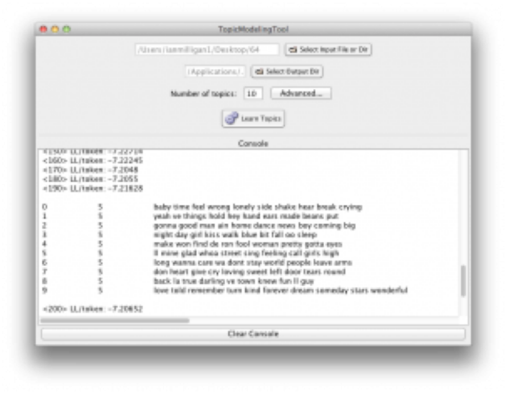

Figure 3: The Java Gui for MALLET, by David Newman and Arun Balagopalan.

If MALLET isn’t exactly magic, it is, however, a wonderful “gateway drug” into the world of large-scale textual analysis. It just “seems to work,” which is a wonderful asset to bring to the table. As the digital humanities struggles with moving beyond the perception that we just count words (although, as [Ted Underwood has pointed out in “Wordcounts are Amazing,”](http://tedunderwood.com/2013/02/20/wordcounts-are-amazing/) that’s a perfectly valid and engaging form of analysis), tools like topic modeling and MALLET help broaden our analysis. For historians, literary scholars, and other humanities researchers, MALLET is a valuable addition to your toolkit.

<!-- page 75 -->

### Notes:

[^39]: Robert K. Nelson, "Mining the Dispatch: Introduction," [http://dsl.richmond.edu/dispatch/pages/intro](http://dsl.richmond.edu/dispatch/pages/intro).

[^40]: Some further reading on this problem: Griffiths and Steyvers 2004 [pdf]; Mimno et al 2011 [pdf]; AlSumait et al. 2009 [pdf].

<!-- page 76 -->

## Review of Paper Machines, produced by Chris Johnson-Roberson and Jo Guldi

**ADAM CRYMBLE**

> Paper Machines Version: [0.3.6](https://github.com/chrisjr/papermachines)
> Requirements: [Zotero](http://www.zotero.org/download/), [Python 2.7.3](http://www.python.org/), [Java](http://www.oracle.com/technetwork/java/javase/downloads/index.html).

> Reviewed: 25 February 2013
> Tested on: Mac OS X v. 10.6.8, and Windows 7
> Tested with Zotero for Firefox 3.0 and Zotero Standalone 3.0

[Paper Machines](https://github.com/chrisjr/papermachines) is an interactive multi-tool that allows users to perform textual analyses on their Zotero notes, tags, HTML snapshots, or attached pdfs (if OCR layer is present) directly in [Zotero](https://www.zotero.org/). The project provides users with an effective way to get an intellectual grasp of a corpus relatively quickly. This Zotero add-on currently ships with five different tools, which make it possible to determine anything from the topics found in a user's Zotero library to the geographic distribution of the references present. The project works in both Zotero’s Firefox and standalone versions, which makes it particularly convenient for Zotero users but considerably less appealing for anyone who stores their research material in another program or format. Paper Machines is a promising and visually appealing teaching tool that would be particularly useful for introducing students to topic modeling, but needs some improvements to the code and documentation to be world class.

The venture is still in its alpha-phase, which means we should be both forgiving of faults, but also wary of its unpolished nature. Developed by Chris Johnson-Roberson under the direction of Jo Guldi and Matthew Battles at the [metaLab@Harvard](http://metalab.harvard.edu/), this project is forward thinking, providing access to a number of open source textual analysis projects, including [MALLET](http://mallet.cs.umass.edu/) for topic modeling and a [geoparser](https://github.com/petewarden/geodict) by Pete Warden, through a single interface. As Paper Machines is built to use already existing tools, it does not provide any new abilities to textual scholars. However, users will find appealing Paper Machines’ ability to generate different types of visualizations very quickly. As the tool does not currently make it easy to export raw data or validate the analyses conducted, users would be wise not to risk their academic reputations on the tool’s outputs unless verified through more verbose and transparent tools. This project’s great contribution is probably not to research, but to pedagogy and skills training.

The greatest value of Paper Machines is that it provides an engaging and visually stunning introduction to textual analysis for students and others looking to get their toes wet with topic modeling or linked data. This allows anyone to begin exploring large collections of sources to look for trends in the data such as an increasing interest in certain subjects over time, which could point the researcher to interesting questions worth pursuing further.

With Paper Machines, anyone with a collection of texts stored in Zotero can generate word clouds, [phrase nets](http://www-958.ibm.com/software/data/cognos/manyeyes/page/Phrase_Net.html), [map geo-references](https://github.com/petewarden/geodict) found in their corpus, extract structured data using [DBPedia](http://dbpedia.org/About), or generate and visualize [topic models](http://en.wikipedia.org/wiki/Topic_model). All of this can be done without having to pre-process your corpus or leave Zotero. For readers wondering if Paper Machines is right for their needs, the [Library at](http://disc.library.emory.edu/lincoln/) <!-- page 77 --> [Emory](http://disc.library.emory.edu/lincoln/) has conducted an excellent comparative [case study](http://disc.library.emory.edu/lincoln/) of Paper Machines, [Voyant](http://voyant-tools.org/), [MALLET](http://mallet.cs.umass.edu/), and [Viewshare](http://viewshare.org/). That succinct comparison showcases the strengths and weaknesses of each project, and suggests the best tool depends on what you are trying to determine about your corpus

Of Paper Machines’ features, the word cloud tool is probably the most disappointing. The resultant image, which can be seen in Figure 1, is considerably less flexible and attractive than those generated by other projects such as [Voyant](http://voyant-tools.org/) or [Wordle](http://www.wordle.net/) – though for those with a corpus in Zotero it is considerably quicker to use the Paper Machines version than it is to extract all of the text from Zotero and send it to one of the competing tools. The value of word clouds is certainly debatable, but could be useful for identifying obvious keywords. From looking at Figure 1 you might assume the corpus had something to do with Irish and English authors. It turns out that is not quite correct, but it is not far off either.

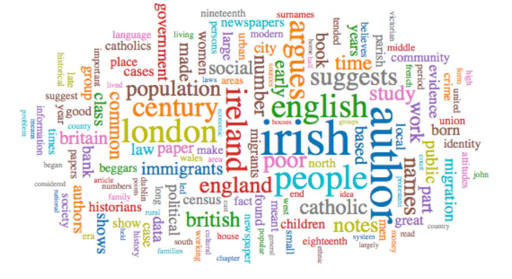

Figure 1: Example output of Paper Machines Word Cloud Feature

Phrase nets, built on the IBM Many Eyes tool of the same name, offers users the option of looking for word patterns in the corpus. For example a phrase net generated by 'x and y' will return a visualization of the key terms connected by the conjunction 'and'. As can be seen in Figure 2, which shows a phrase net, these relationships are displayed through a series of keyword pairs connected by an arrow. If a user was interested in colocation then this tool may prove useful. For example, a phrase net of 'x as y' may be a useful way to extract similes in a series of poems for further consideration. Using Paper Machines it is possible to create phrase nets of any pattern using regular expressions, which is convenient for advanced users. Despite this flexibility, the image output has limited controls. It is possible to drag overlapping phrases to make them easier to see, but the image itself is small, meaning it can be quite crowded. Users interested in the data behind the visualization will be disappointed not to have access to it.

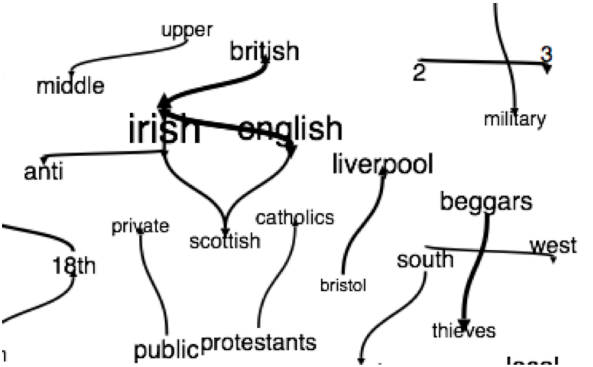

Figure 2: Example output of Paper Machines showing a Phrase Net

<!-- page 78 -->

The tool's mapping feature promises to allow users the ability to map their Zotero corpus through a series of placename gazetteers. This includes the option to heatmap a map of the world highlighting the areas mentioned most in the corpus, and to generate 'flight paths' or lines between a work's place of publication and places mentioned in the text. Unfortunately neither mapping feature functioned properly during this review and produced no matches, despite obvious place names shown in Figure 2 above.

DBPedia annotation uses the [DBpedia Spotlight service](http://dbpedia-spotlight.github.com/demo/) to identify relationships between 'named entities' in the corpus. Clicking on a black word opens a tab containing encyclopedic information on the term. On a small corpus the connections between entities might provide interesting information about people and places in a user's corpus. On a larger corpus the connections are less useful as can be seen from the tangle of grey lines in Figure 3. This feature is memory intensive and may cause Firefox to crash if the corpus is too large.

The flagship feature is undoubtedly the topic modeling visualization feature, which has generated the most excitement towards the project. The topic models themselves are built using MALLET, and the tool promises an easier way to interpret the results than does MALLET through an attractive visualization. The program makes it easy to control a number of MALLET variables used when generating the topics. These controls range from the ability to choose the number of topics to the option of selecting the number of iterations the algorithm runs. For new users these options can comfortably be ignored.

The resultant stream graph, which can be seen in Figure 4, is undoubtedly stunning, and certainly is easier to interpret quickly than MALLET’s numerical outputs. Someone with a large corpus of newspaper articles may find this tool useful for mapping a rising interest in a given topic over time: perhaps China or Afghanistan.

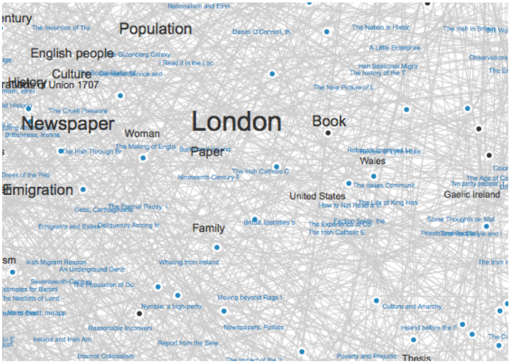

Figure 3: Example output of Paper Machines DBPedia Annotation tool

However, the graph emphasizes style over substance in a manner this reviewer would call ‘shock and awe’, designed to overwhelm a reader instead of focusing on a clear mode of conveying the data.

As [Andy Kirk](http://www.visualisingdata.com/index.php/2010/08/making-sense-of-streamgraphs/) noted in 2010, the data visualization community continues to be divided about the value of stream graphs, as both sides argue over their readability. Over time, these graphs will probably become commonplace as they are incorporated more readily into familiar visualization tools such as Microsoft Excel, their novelty is likely to wane and the project will instead have to stand on its own merits. The graph itself lacks a labeled y-axis, making it impossible to tell exactly what one is looking at or what units are being displayed. There are mysterious faded sections on the x-axis, which suggest gaps in the data, but nowhere is this made explicit. This is even more <!-- page 79 --> obvious when using your own corpus rather than the one optimized to give pretty results seen below. It is also not clear if it is possible to get a copy of MALLET’s output which was used to create the graph in case the user wanted to conduct his or her own analysis.

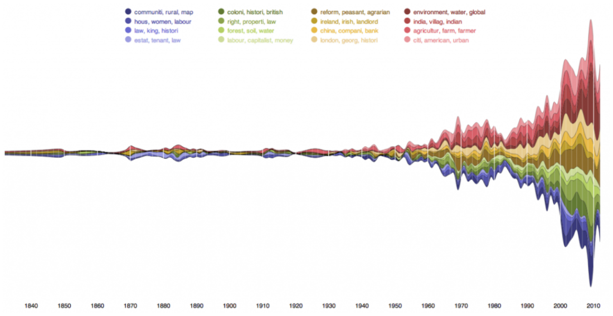

Figure 4: Example output of Paper Machines Topic Modeling Stream Graph created by Chris Johnson-Roberson (Creative Commons Attribute 3.0 Unported)

As an alpha-release, the project does have some outstanding deficiencies. In general the project is under-documented, which is a serious problem considering the greatest potential of Paper Machines is as a gentle but engaging introduction to textual analysis. There is no thorough tutorial available to explain the features and assist new users to interpret the visualizations. If the user has never installed a Firefox add-on before it is not clear how to do so from the limited instructions available in the ‘read me’ file. The project also contains a number of bugs, which are particularly evident for Mac users. I have been unable to use the mapping tools, and have seen many error messages when trying the various features. It also took nearly six hours to get the tool installed because of a conflict with Python versions on my machine that is well beyond a novice user’s ability to resolve. Though I know that is not a typical experience installing the add-on, I imagine others also experienced similar problems and were not as persistent at solving them.

With some user testing on different machines, increased documentation, and greater transparency of inputs and outputs, Paper Machines could quickly become the industry standard for introducing topic modeling to students – though this project can never replace a true understanding of the strengths and limits of topic modeling. Another few months of work or some more collaborators who are committed to polishing the project could make a real difference to an already great initiative and I for one hope the team keeps moving forward.

<!-- page 80 -->

## Contributors

**David M. Blei** is an associate professor of Computer Science at Princeton University. His research focuses on probabilistic topic models, Bayesian nonparametric methods, and approximate posterior inference. He works on a variety of applications, including text, images, music, social networks, and various scientific data.

**Megan R. Brett** is a PhD student in the Department of History and Art History at George Mason University and a research assistant at the Roy Rosenzwieg Center for History and New Media, where she serves as an assistant editor for the Papers of the War Department. Her research focuses on transatlantic family strategies in the early American republic. She is particularly interested in the way digital tools can reveal new information about correspondence and social networks in the eighteenth and nineteenth centuries. She blogs at [meganrbrett.net](http://meganrbrett.net).

**Adam Crymble** is a PhD student in history and digital humanities at King’s College London, and a founding editor of [*The Programming Historian 2*](http://programminghistorian.org/). He is also a fellow of the [*Software Sustainability Institute*](http://www.software.ac.uk/), striving to future-proof academic software and promote responsible digital tool use.

**Andrew Goldstone** is an Assistant Professor in the Department of English at Rutgers University, New Brunswick. He studies and teaches twentieth-century literature in English. His research interests include modernism and non-modernism in English and French, the sociology of literature, literary theory, the history of genre fiction, South Asian literature in English, and the digital humanities, especially computational text analysis. He also has a long-standing interest in digital systems for document preparation and typesetting, especially LaTeX.

**Shawn Graham** is an assistant professor of Digital Humanities in the [History Department at Carleton University](http://www2.carleton.ca/history/). He blogs at [Electric Archaeology](http://electricarchaeology.ca). His research interests are in data mining, network analysis, and agent based simulations in Roman archaeology.

**Elijah Meeks** is the Digital Humanities Specialist at Stanford University, where he helps bring network analysis, text analysis, and spatial analysis to bear on traditional humanities research questions. He has worked as the technical lead on The Digital Gazetteer of the Song Dynasty, Authorial London, and ORBIS: The Stanford Geospatial Network Model of the Roman World. In his time at Stanford, he's worked with Mapping the Republic of Letters, the Stanford Literary Lab, and the Spatial History Lab, as well as individual faculty and graduate students, to explore a wide variety of digital humanities research questions.

<!-- page 81 -->

[**Ian Milligan**](http://ianmilligan.ca) is an assistant professor of Canadian history in the [Department of History](https://uwaterloo.ca/history/) at the [University of Waterloo](http://uwaterloo.ca). He is a founding co-editor of [ActiveHistory.ca](http://activehistory.ca), an editor-at-large of the [*Programming Historian 2*](http://programminghistorian.org), and has written several articles in the fields of Canadian youth, digital, and labour history.

**David Mimno** is a postdoctoral researcher in the Computer Science department at Princeton. He received his PhD from the University of Massachusetts Amherst. He previously worked for an internet auction startup, the NLP group at the University of Sheffield, and the Perseus Project, a cultural heritage digital library. He has a particular interest in historical texts and languages. David is currently chief maintainer for the MALLET Machine Learning toolkit.

**Lisa Marie Rhody** received her Ph.D. in English language and literature from the [University of Maryland](http://www.umd.edu/), where her research was supported by a [Maryland Institute for Technology in the Humanities (MITH)](http://mith.umd.edu) Winnemore Dissertation Fellowship. Her research combines advanced computational analysis with traditional literary methods to explore 20th-century poetry and American literature, intersections between visual and verbal media, and women's literature. Currently, she is the project manager for [WebWise 2013](http://imlswebwise.org) at the [Roy Rosenzweig Center for History and New Media (RRCHNM)](http://chnm.gmu.edu/). She maintains a digital presence at [LisaRhody.com](http://lisarhody.com) and can be followed on Twitter at [@lmrhody](https://twitter.com/lmrhody).

**Benjamin M. Schmidt** is the Visiting Graduate Fellow at the Cultural Observatory at Harvard University, and a PhD Candidate in history at Princeton University. He writes about digital humanities at [Sapping Attention](http://sappingattention.blogspot.com).

**Ted Underwood** is Associate Professor of English at the University of Illinois, Urbana-Champaign, where he teaches eighteenth- and nineteenth-century British literature. He is the author of *The Work of the Sun: Literature, Science and Political Economy* (Palgrave, 2005), and of *Why Literary Periods Mattered* (under contract at Stanford University Press). He is currently working on a book about the value of quantitative methods in literary history.

**Scott B. Weingart** is an NSF Graduate Research Fellow and PhD student at Indiana University, where he studies Information Science and History of Science. His research focuses on the intersection of historiographic and quantitative methodologies, particularly as they can be used to study scholarly communications in the past and present. He also writes a blog called the [scottbot irregular](http://www.scottbot.net/HIAL/), aiming to make computational tools and big data analytics accessible to a wider, humanities-oriented audience. When not researching, Scott fights for open access and the reform of modern scholarly communication.

<!-- page 82 -->
