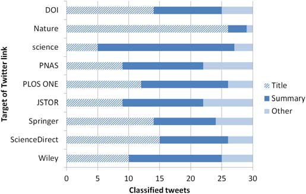
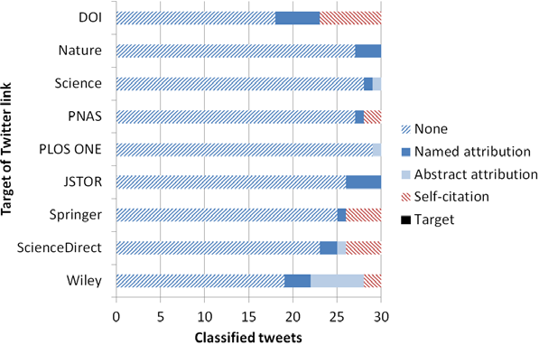
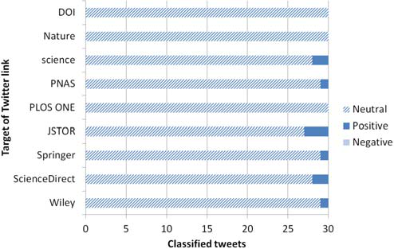
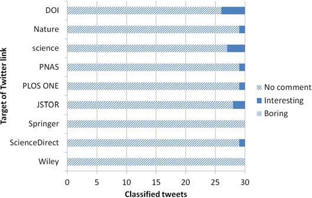

**VOLUME 17 (2013): ISSUE 1. PAPER 1**

# Tweeting Links to Academic Articles

**Mike Thelwall¹, Andrew Tsou², Scott Weingart², Kim Holmberg¹, Stefanie Haustein³**

¹ Statistical Cybermetrics Research Group, School of Technology  
University of Wolverhampton, Wulfruna Street, Wolverhampton WV1 1SB  
**United Kingdom**  
E-mail: **m.thelwall@wlv.ac.uk**, **kim.holmberg@abo.fi**

² School of Library and Information Science  
Indiana University Bloomington, 1320 East Tenth Street, Bloomington, IN 47405-3907  
**USA**  
Email: **atsou@umail.iu.edu**; **scbweing@indiana.edu**

³ École de bibliothéconomie et des sciences de l'information  
Université de Montréal, C.P. 6128, Succ. Centre-Ville, Montréal, QC. H3C 3J7  
**Canada**  
E-mail: **stefanie.haustein@umontreal.ca**

## Abstract

Academic articles are now frequently tweeted and so Twitter seems to be a useful tool for scholars to use to help keep up with publications and discussions in their fields. Perhaps as a result of this, tweet counts are increasingly used by digital libraries and journal websites as indicators of an article’s interest or impact. Nevertheless, it is not known whether tweets are typically positive, neutral or critical, or how articles are normally tweeted. These are problems for those wishing to tweet articles effectively and for those wishing to know whether tweet counts in digital libraries should be taken seriously. In response, a pilot study content analysis was conducted of 270 tweets linking to articles in four journals, four digital libraries and two DOI URLs, collected over a period of eight months in 2012. The vast majority of the tweets echoed an article title (42%) or a brief summary (41%). One reason for summarising an article seemed to be to translate it for a general audience. Few tweets explicitly praised an article and none were critical. Most tweets did not directly refer to the article author, but some did and others were clearly self-citations. In summary, tweets containing links to scholarly articles generally provide little more than publicity, and so whilst tweet counts may provide evidence of the popularity of an article, the contents of the tweets themselves are unlikely to give deep insights into scientists' reactions to publications, except perhaps in special cases.

## Keywords

Altmetrics, Twitter, Webometrics, content analysis

## Introduction

With the advent of the Internet, there are many novel ways in which academics can discover newly published research. Scholars may elect to receive email alerts containing the tables of contents of recently published journals, register keyword searches in scholarly databases and receive email alerts of new matches, or scan the activities of friends and colleagues on social sites such as Mendeley, Academia.edu, or Facebook. Academics may also follow relevant people and organisations on Twitter and monitor their status updates for pointers to new articles. From the perspective of the tweeter, the rewards for tweeting relevant research might include the social capital that accrues from performing a useful service, a reputation for identifying important new research, the attendant publicity for any personal articles tweeted, or even the altruistic pleasure that comes from helping others locate germane information. Despite evidence about academic uses of Twitter for specific conferences or disciplines (see below), no studies have focused on how academic articles in general are tweeted. This is an important limitation for those seeking to tweet their own articles effectively (assuming that they don’t just click a Tweet this link on the appropriate journal’s web site), since they will not know the optimal means with which to do so across disciplines. This is the first gap in current knowledge that the current article seeks to fill.

Taking advantage of the increasing amount of tweeting of academic articles, journals including PLOS <!-- page 1 --> ONE and Nature provide statistics on the number of social web mentions of articles. For example, PLOS ONE currently (May 2013) provides a "social shares" count at the top of each article that includes Twitter mentions as part of its suite of "Article-Level Metrics". This data is claimed to be useful because:

> "With the establishment of a networked landscape in research, researchers today employ a host of tools from which to manage references; disseminate articles; and evaluate each other's work. PLOS has integrated the leading channels within these three areas into the ALM data suite to offer a more comprehensive view of the article's impact after publication."
> **http://www.plosone.org/static/almInfo#socialBookmarks** – 16 May 2013

In addition to PLOS ONE and other journals, there are a number of sites that publish and promote the use of metrics generated from social web mentions (e.g., Twitter, Facebook, social bookmarking sites, blogs), such as **impactstory.org** and **altmetric.org**. This is part of the altmetrics movement, an initiative to promote the use of social web mentions as impact indicators for academic research (Priem, Piwowar, & Hemminger, 2012). The lack of knowledge mentioned above about how articles are tweeted is also a limitation for those using counts of tweets about an article as an indicator of its popularity. Although there is evidence that tweet counts associate with citation counts (Eysenbach, 2011; Thelwall, Haustein, Larivière, & Sugimoto, 2013) it is not known whether tweets are typically positive, negative, neutral, or mixed in tone and so it is not clear whether tweets ought to be filtered for sentiment in order to obtain better quality metrics. This is the second gap that the current article seeks to fill.

Finally, it would be useful to know, in general terms, how academic articles are tweeted in order to assess whether Twitter could be a useful means of providing insights into the strengths and weaknesses of the articles themselves. This is the third gap that the current article seeks to fill. This paper partially fills these three gaps by conducting a content analysis pilot study of samples of tweets linking to academic articles from various sources.

## Literature Review

Information posted on Twitter has the potential to reach an audience far beyond the tweeter’s immediate contacts, an important consideration for academic wishing to disseminate information. A study by Kwak, Lee, Park, and Moon (2010) found that if a tweet gets retweeted then, on average it will eventually reach 1,000 users, which suggests that wide information dissemination is possible. Thus, Twitter tends to have an avalanche effect, with information reaching a large audience based on a series of retweets by posters who might not even follow the original tweeter (Bakshy, Hofman, Mason, & Watts, 2011; boyd, Golder, & Lotan, 2010). Nevertheless, there is also evidence that individuals’ influence on Twitter (as measured by the number of their tweets that were later retweeted) follows a power law distribution, with only a handful of tweeters sufficiently connected or popular for their tweets to be likely to reach a large audience through being retweeted (Cha, Haddadi, Benevenuto, & Gummadi, 2010). In general, the most influential tweeters are more active than the less-followed tweeters (Krishnamurthy, Gill, & Arlitt, 2008), although it is not clear whether these individuals are widely followed due to their high posting volume, or whether they are prolific because their audience is sufficiently large (or appreciative). Commercial uses of Twitter have also taken off and have been researched; for example, a 2009 study by Jansen, Zhang, Sobel, and Chowdury found that 20% of tweets that mentioned commercial brands were opinionated, with the majority expressing positive sentiments and a third expressing negative sentiments.

Twitter is sometimes used for work purposes (Zhao & Rosson, 2009) and so it may be exploited by academics to publicise or monitor current research. Given that (several years ago – April-May 2007) approximately 13% of all tweets contained links to outside sources (Java, Song, Finin, & Tseng, 2007), Twitter seems to be a useful platform for sharing and locating pointers to information. Several previous studies have investigated how academics use Twitter. Twitter is used to share URLs or citations to articles (half of the time linking to the paper itself and half the time linking to a source that includes a link to the paper), and some scholars use Twitter to help ensure that they have not overlooked any important publications (Priem & Costello, 2010). During academic conferences, it seems to be used intensively to share information about, and comment on, individual talks (Weller, Dröge, & Puschmann, 2011), and in some fields (e.g., health-related research), Twitter is even used to help disseminate findings to a lay public audience (Desai et al., 2012). Even within the general population of tweeters, there is evidence that connections between individuals (i.e., followers) are not as strong as on other social media platforms (Huberman, Romero, & Wu, 2008), suggesting that Twitter is more information-based than sites such as Facebook. Nevertheless, Twitter use amongst academics is far from ubiquitous. One study found that only 16% of 57 presenters at a scientometric conference were on Twitter (Bar-Ilan, Haustein, Peters, et al., 2012).

A potential use of tweets is for publishers to help academics to identify the most important new articles by reporting the number of tweets for each one. For example, some digital libraries and other sites report how often an article has been tweeted as part of the article metadata, presumably with the assumption that readers will be drawn to the most tweeted articles and that these are likely to also be the most important. There is some evidence to support the latter. A study of a medical informatics journal found that the most tweeted articles subsequently attracted the most citations (Eysenbach, 2011) and a study of a large collection of articles found that more tweeted articles were also likely to be more cited – although this was only true after time had been factored out (Thelwall, Haustein, Larivière, & Sugimoto, 2013). From a wider perspective, the emerging field of altmetrics (Priem, Piwowar, & Hemminger, 2012) is promoting and assessing the use of social web indicators for academic articles, such as counts of tweets, Facebook wall posts or blog mentions, and this may lead to a wider acceptance and uptake of social media indicators.

Within citation analysis it is known that some citations are negative (Garfield, 1979), for example refuting earlier work. Nevertheless, it seems that the phenomenon of negative citations is rare enough to be ignored in practice when using citation counts in research evaluation (Moed, 2005) except perhaps in special cases (Baldi & Hargens, 2005). The situation in the social web seems to be different, however, because there are some high profile examples of articles that have been retracted after repeated online criticism, although particularly in blogs (Shema, Bar-Ilan, & Thelwall, 2012) rather than Twitter. Moreover, although tweets are only sort text messages, it is common for them to contain sentiment (Thelwall, Buckley, & Paltoglou, 2012). It seems that if there are many negative citations of articles in Twitter then it would be useful to manually or automatically detect and filter out the negative citations. Automatic sentiment detection has been previously attempted for academic citations (Cavalcanti, Prudêncio, Pradhan, et al. 2011) and there is sentiment analysis software that is designed for tweets in a way that is <!-- page 2 --> appropriate for social science or humanities research and gives approximately human-level accuracy (Thelwall, Buckley, & Paltoglou, 2012) but it seems that no software so far is designed for citations in Twitter. A sentiment analysis program would probably need to be designed specifically for this task because it would need to ignore any sentiment in tweeted article titles and just focus on opinions expressed about tweeted articles.

## Research Questions

The following exploratory and primarily descriptive questions are addressed in this pilot study article. Answers to these questions should give a broad overview of the nature of academic tweeting, which can be of use both to users of Twitter-based altmetrics and authors intending to tweet their own articles.

1. What are the most common ways in which links to academic articles are tweeted?

2. Are there differences between journals or collections of journals in the most common ways that academic articles are tweeted?

3. What is the typical sentiment expressed in tweets about academic articles, and, in particular, is negativity common enough to cause problems for tweet-based altmetrics?

## Methods

The overall research design was to generate a large sample of tweets of academic articles from different sources and then to conduct a faceted content analysis to describe a random sample of them.

The large sample of tweets was gathered by running a Twitter query approximately every hour from 4 March 2012 to 16 October 2012 for each of a number of URLs of journals or digital libraries (Table 1). In each case article URLs had a common starting text, such as a domain name, and queries for this common part matched all articles in the site. The four digital libraries were Wiley, ScienceDirect, Springer, and JSTOR, chosen for their large coverage of well-known academic journals. In addition, links leading to four large general journals were monitored: PLOS ONE, PNAS, Science, and Nature. Preliminary investigations suggested that these journals were widely tweeted, and accordingly, it would be interesting and relevant to investigate them. Finally, DOI links were also gathered via the query dx.doi, which matches any URL using the official dx.doi.org website to resolve a DOI to the article location (typically a journal publisher website). Although Twitter shortens almost all URLs in tweets, it is possible to use URL-based queries because Twitter search returns matches for the original URLs rather than the shortened versions.

Once the tweets for the nine selected sites had been collected, duplicate tweets and retweets were removed, leaving a list of 159,076 unique tweets (see Table 1). A random sample of 270 was then assembled using a random number generator that first selected tweeters at random and then selected one of their downloaded tweets at random (if the tweeter had more than one tweet in the sample). This produced a random sample of tweets without duplicate tweets or tweeters. A by-product of this method is that all tweeters have an equal chance to be included whether they are prolific or not. Accordingly, the sample is representative of tweeters rather than tweets.

**Table 1. Tweets for each query collected from 4 March - 16 October 2012, after eliminating duplicates.**

| Source | Twitter query | Unique tweets collected | Tweets selected |
|---|---|---|---|
| Wiley digital library | onlinelibrary.wiley.com | 39,292 | 30 |
| Science Direct digital library | sciencedirect.com | 33,380 | 30 |
| PLOS ONE journal | plosone.org/article | 30,657 | 30 |
| SpringerLink digital library | springerlink.com | 17,515 | 30 |
| PNAS journal | pnas.org/content | 11,756 | 30 |
| Science journal | scim.ag | 12,596 | 30 |
| Nature journal | go.nature.com | 6784 | 30 |
| DOI links | dx.doi | 5,234 | 30 |
| JSTOR digital library | jstor.org/stable | 1,862 | 30 |

A content analysis coding scheme was built by the first author, who coded the first 30 tweets in each randomly ordered set in each of the nine sites and inductively constructed a set of relevant categories and their descriptions (see below). Although the sentiment category could have been automatically coded, human coding would probably be more accurate because standard sentiment coders would classify sentiment in article titles in addition to opinions expressed about the titles, whereas a human coder could ignore titles. These categories were then given to three independent experienced coders (the second author, an English graduate, and a library and information science graduate), who classified the same tweets. The standard Cohen’s Kappa statistic was used to assess inter-coder reliability for the categories used, giving moderate (Landis & Koch, 1977) pairwise agreement levels between 0.410 and 0.558 for the categories used, which is sufficient for the results to be useful. The first author revisited the scheme and arbitrated on cases of disagreement.

**Facet 1: Main content of tweet**

***Title*** (even if keywords added - rare) - appears to be an exact quote of all or part of the title of the article, perhaps with some abbreviations or missing words (e.g., small words omitted)

***Summary*** (article about…) even if includes title (rare) - the tweet describes the article without using its title. (This was merged with the initial critical evaluation category because it was rare)

***Other*** - e.g., this is my article!, just a link and no comment (This was merged with the spam/irrelevant content category, which was rare).

**Facet 2: Authorship attribution for the tweeted article**

***Self-citation*** - article appears to be tweeted by one of the authors e.g., my article, our article

***Target*** - Attributes article to tweet target -e.g., saw your latest article; ….by @bob

<!-- page 3 -->

***Named attribution*** - Attributes article to third person -e.g., Brian's latest…, new one from X,

***Abstract attribution*** – attributes in an abstract sense -e.g., researchers say… scientists have found…, studies show….

***None*** – no attribution of authorship in any way

**Facet 3: Sentiment or opinion about the tweeted article**

***Positive sentiment*** - praise of article (or its topic) using words like amazing, excellent, great, impressive, good, exciting, thorough, well done,

***Negative sentiment*** - criticism of article using words like poor, bad, unimpressive

***Neutral*** – no sentiment expressed

**Facet 4: Expression of interest about the tweeted article**

***Interesting*** - States article is interesting, fascinating, engaging, thoughtful

***Boring*** - States article is boring, uninteresting, dull

***No comment*** – does not comment on whether the article is interesting or not

## Results

Figure 1 reports results of the main content analysis facet. These were approximately evenly distributed amongst the nine queries, with the exceptions of Science and Nature. Nearly three quarters of the Science tweets were summaries (73%), and 87% of the Nature tweets contained the exact titles of the articles in question. This suggests that Science and Nature organise or support tweeting of their articles with a house style, even though these tweets originate from different people and are tweeted automatically by journal publishers. An examination of the Science tweets revealed that many were modified retweets of summaries originating from the @sciencemagazine account, which explains the results in this case. For Nature, the explanation may be that many people click on the Share/bookmark link at the top of each article and tweet the text supplied by Nature, which is the article title followed by its URL.

**Figure 1. The main content of the tweets of article links.**

Figure 2 reports the authorship attribution of tweets, if any, showing that 82% did not attribute authorship in any way. These were approximately evenly distributed amongst the 9 queries. The most extreme difference, between no 18 attributions for DOI and 29 no attributions for PLOS ONE, is statistically significant (p=0.001, Chi-Square test without a Bonferroni correction), which suggests that there might be differences between queries in the way that authors are attributed, although in a majority of cases there is no attribution.

**Figure 2. Authorship attribution in the tweets of article links.**

For the remaining two facets, a total of 10 (4%) out of the 270 tweets were positive about the articles and none were negative (Figure 3). In addition, 13 (5%) declared that the article was interesting, none said that it was boring, and 95% expressed no opinion about the article (Figure 4). Hence the typical tweet about an academic article seems to be quite factual, expressing no opinions of any kind. The differences <!-- page 4 --> between the results for the different queries are too small to be significant in this case (p>0.05 for any pair of queries, Chi-Square test without a Bonferroni correction).

**Figure 3. Sentiment in the tweets of article links.**

**Figure 4. Interest expressed in the tweets of article links.**

## Discussion and conclusions

This pilot study is a small scale investigation into the important phenomenon of tweeting academic papers. The results are limited by the small sample sizes involved, as is the nature of a typical pilot study. Another limitation of the methods used here is that the sample is not comprehensive, so other journals may give different results – for example, there may be some journals and perhaps even entire specialist fields in which articles are extensively criticised or at least discussed in Twitter. Another limitation is that the analysis was restricted to individual tweets and it is possible that there were critical discussions of articles in tweets responding to the initial posts of the articles. A deeper future analysis might be able to assess the extent to which this occurs.

The results suggest that tweets linking to academic journal articles are typically objective, either tweeting an article title or tweeting a brief summary of its key points. This stands in contrast to other types of tweets, such as the 20% of tweets mentioning commercial brands that were opinionated (Jansen et al., 2009). As a result, it seems that academic tweets are unlikely to give insights into the reception of articles by readers, except perhaps in unusual circumstances, such as for particularly controversial or ground-breaking research. Nevertheless, tweet counts may still be a reasonable indicator of the notice that academics have taken of online articles. In this context, the association between tweets and future citations (Eysenbach, 2011; Thelwall, Haustein, Larivière, & Sugimoto, 2013) seems reasonable and may well be true across different academic disciplines.

There do not seem to be substantial differences between journals or collections of journals in the ways that they are tweeted, with the exception of Science and Nature (a tendency to tweet summaries and titles, respectively –see Figure 1), perhaps because of the manner in which they support tweeting (i.e., providing easy, normalized ways for readers to tweet an article). Although there were small differences between the journals or collections of journals for all the categories (Figures 1-4), they are not large enough to give convincing statistical evidence of likely difference, with the exception that there seem to be genuine differences in the extent of use of different types of author attribution (e.g., “My new article…”, “Scientists have found that..”) within tweets. The importance of this should not be overstated, however, since in all cases most tweets contained no author attribution. Nevertheless, it is possible that more substantial differences would exist for specific fields or journals with different cultures of using Twitter.

Although this is based upon a limited sample, it seems that negative tweets are likely to be rare enough to be ignored for altmetric purposes. A previous study has remarked on the rarity of sentiment in Twitter for the different topic of media events (Thelwall, Buckley, & Paltoglou, 2011) but sentiment is more prevalent in general tweets (Thelwall, Buckley, & Paltoglou, 2012) so it seems that article tweets are another type for which explicit sentiment is rare. Presumably, though, the typical non-automated tweet is sent because the author finds the article either interesting – but it could also perhaps be sent purely because the article is topically relevant to themselves or their Twitter followers, and tweeter interviews would be needed to decide how prevalent the latter is. If tweets of articles tend to be implicitly positive then this would help to give further justification for the use of tweet counts in altmetrics.

Finally, although this was designed as a pilot study to investigate the way in which articles are tweeted, <!-- page 5 --> we do not intend to conduct a full-scale study because the lack of negativity in tweets, the lack of inter-journal variety between tweeting styles and the lack of significant discussions of articles suggest that the categories used here are not likely to yield additional useful findings. Future research may wish to focus instead on tweets related to controversial academic topics (Shema, Bar-Ilan, & Thelwall, 2012), or other types of academic document, such as books (Kousha, Thelwall, & Rezaie, 2011).

## Acknowledgements

This manuscript is based upon work supported by the international funding initiative Digging into Data. Specifically, funding comes from the National Science Foundation in the United States (Grant No. 1208804), JISC in the United Kingdom, and the Social Sciences and Humanities Research Council of Canada.

## Apendix I. Exact Data

**Table 2. The main content of tweets of article links.**

| Content | Wiley | Science Direct | Springer | JSTOR | PLOS ONE | PNAS | Science | Nature | DOI | Total |
|---|---|---|---|---|---|---|---|---|---|---|
| Title | 10 | 15 | 14 | 9 | 12 | 9 | 5 | 26 | 14 | 114 (42%) |
| Summary | 15 | 11 | 10 | 13 | 14 | 13 | 22 | 3 | 11 | 112 (41%) |
| Other | 5 | 4 | 6 | 8 | 4 | 8 | 3 | 1 | 5 | 44 (16%) |
| Total | 30 | 30 | 30 | 30 | 30 | 30 | 30 | 30 | 30 | 270 (100%) |

**Table 3. Authorship attribution in the tweets of article links.**

| Attribution | Wiley | Science Direct | Springer | JSTOR | PLOS ONE | PNAS | Science | Nature | DOI | Total |
|---|---|---|---|---|---|---|---|---|---|---|
| Self-citation | 2 | 4 | 4 | 0 | 0 | 2 | 0 | 0 | 7 | 19 (7%) |
| Named attribution | 3 | 2 | 1 | 4 | 0 | 1 | 1 | 3 | 5 | 20 (7%) |
| Abstract attribution | 6 | 1 | 0 | 0 | 1 | 0 | 1 | 0 | 0 | 9 (3%) |
| Target | 0 | 0 | 0 | 0 | 0 | 0 | 0 | 0 | 0 | 0 (0%) |
| None | 19 | 23 | 25 | 26 | 29 | 27 | 28 | 27 | 18 | 222 (82%) |
| Total | 30 | 30 | 30 | 30 | 30 | 30 | 30 | 30 | 30 | 270 (100%) |

**Table 4. Sentiment in the tweets of article links.**

| Sentiment | Wiley | Science Direct | Springer | JSTOR | PLOS ONE | PNAS | Science | Nature | DOI | Total |
|---|---|---|---|---|---|---|---|---|---|---|
| Neutral | 29 | 28 | 29 | 27 | 30 | 29 | 28 | 30 | 30 | 260 (96%) |
| Positive | 1 | 2 | 1 | 3 | 0 | 1 | 2 | 0 | 0 | 10 (4%) |
| Negative | 0 | 0 | 0 | 0 | 0 | 0 | 0 | 0 | 0 | 0 (0%) |
| Total | 30 | 30 | 30 | 30 | 30 | 30 | 30 | 30 | 30 | 270 (100%) |

**Table 5. Interest expressed in the tweets of article links.**

| Interest | Wiley | Science Direct | Springer | JSTOR | PLOS ONE | PNAS | Science | Nature | DOI | Total |
|---|---|---|---|---|---|---|---|---|---|---|
| No comment | 30 | 29 | 30 | 28 | 29 | 29 | 27 | 29 | 26 | 257 (95%) |
| Interesting | 0 | 1 | 0 | 2 | 1 | 1 | 3 | 1 | 4 | 13 (5%) |
| Boring | 0 | 0 | 0 | 0 | 0 | 0 | 0 | 0 | 0 | 0 (0%) |
| Total | 30 | 30 | 30 | 30 | 30 | 30 | 30 | 30 | 30 | 270 (100%) |

## References

Bakshy, E., Hofman, J. M., Mason, W. A., and Watts, D. J. (2011). Everyone's an influencer: Quantifying <!-- page 6 --> influence on Twitter. In **Proceedings of the Fourth ACM International Conference on Web Search and Data Mining** (pp. 65-74). New York: ACM Press.

Baldi, S. and Hargens, L.L. (2005). Reassessing the N-rays reference network: The role of self citations and negative citations, **Scientometrics**, 34(2): 239-253.

Bar-Ilan, J., Haustein, S., Peters, I., Priem, J., Shema, H. & Terliesner, J.(2012). Beyond citations: Scholars' visibility on the social Web, 1**7th International Conference on Science and Technology Indicators**. Science-Metrix and OST, Montreal (pp. 98-109).

Boyd, D., Golder, S., and Lotan, G. (2010). Tweet, tweet, retweet: Conversational aspects of retweeting on Twitter. In **43rd Hawaii International Conference on System Sciences (HICSS 2010)** (pp. 1-10). Los Alamitos: IEEE Press.

Cavalcanti, D.C., Prudêncio, B.C., Pradhan, S.S., Shah, J. and Pietrobon, R. (2011). Good to be bad? Distinguishing between positive and negative citations in scientific impact. **23rd IEEE International Conference on Tools with Artificial Intelligence (ICTAI 2011)**, Los Alamitos: IEEE (pp. 156-162).

Cha, M., Haddadi, H., Benevenuto, F., and Gummadi, K. P. (2010). Measuring user influence in Twitter: The million follower fallacy. In **4th international ASSI conference on weblogs and social media (ICWSM)** (Vol. 14, No. 1, p. 8).

Desai, T., Shariff, A., Shariff, A., Kats, M., Fang, X. M., Christiano, C., and Ferris, M. (2012). Tweeting the meeting: An in-depth analysis of Twitter activity at kidney week 2011. **PLOS ONE**, 7(7), **http://www.plosone.org/article/info:doi/10.1371/journal.pone.0040253**. doi: 10.1371/journal.pone.0040253

Eysenbach, G. (2011). Can tweets predict citations? Metrics of social impact based on Twitter and correlation with traditional metrics of scientific impact. **Journal of Medical Internet Research**, 13(4): e123.

Garfield, E. (1979). Citation indexing - Its theory and application in Science, technology, and humanities. Philadelphia, PA, ISI Press.

Huberman, B., Romero, D., and Wu, F. (2008). Social networks that matter: Twitter under the microscope. Available at **SSRN 1313405**.

Jansen, B. J., Zhang, M., Sobel, K., and Chowdury, A. (2009). Twitter power: Tweets as electronic word of mouth. **Journal of the American Society for Information Science and Technology**, 60(11): 2169-2188.

Java, A., Song, X., Finin, T., and Tseng, B. (2007). Why we twitter: Understanding microblogging usage and communities. In **Proceedings of the 9th WebKDD and 1st SNA-KDD 2007 Workshop on Web Mining and Social Network Analysis** (pp. 56-65). ACM.

Kousha, K., Thelwall, M. and Rezaie, S. (2011). Assessing the citation impact of books: The role of Google Books, Google Scholar and Scopus. **Journal of the American Society for Information Science and Technology**, 62(11): 2147–2164.

Krishnamurthy, B., Gill, P., and Arlitt, M. (2008). A few chirps about Twitter. In **Proceedings of the first workshop on Online social networks** (pp. 19-24). ACM.

Kwak, H., Lee, C., Park, H., and Moon, S. (2010). What is Twitter, a social network or a news media? In **Proceedings of the 19th international conference on World wide web** (pp. 591-600). New York: ACM Press.

Landis, J. R., and Koch, G. G. (1977). The measurement of observer agreement for categorical data. **Biometrics**, 33(1): 159-174.

Moed, H.F. (2005). Citation analysis in research evaluation. Kluwer Academic Publishers, New York.

Priem, J., and Costello, K. L. (2010). How and why scholars cite on Twitter. **Proceedings of the American Society for Information Science and Technology (ASIST 2010)** (pp. 1-4) doi: 10.1002/meet.14504701201

Priem, J., Piwowar, H. A., and Hemminger, B. M. (2012). Altmetrics in the wild: Using social media to explore scholarly impact. ArXiv.org, **http://arxiv.org/abs/1203.4745v1**.

Shema, H., Bar-Ilan, J., and Thelwall, M. (2012). Research blogs and the discussion of scholarly information. **PLOS ONE** 7(5), e35869.

Thelwall, M., Buckley, K., and Paltoglou, G. (2011). Sentiment in Twitter events. **Journal of the American Society for Information Science and Technology**, 62(2): 406-418.

Thelwall, M., Buckley, K., and Paltoglou, G. (2012). Sentiment strength detection for the social Web. **Journal of the American Society for Information Science and Technology**, 63(1): 163-173.

Thelwall, M., Haustein, S., Larivière, V. and Sugimoto, C. (2013). Do altmetrics work? Twitter and ten other candidates. **PLOS ONE**, 8(5), e64841. doi:10.1371/journal.pone.0064841.

Weller, K., Dröge, E., and Puschmann, C. (2011). Citation analysis in Twitter: Approaches for defining and measuring information flows within tweets during scientific conferences. **1st Workshop on Making Sense of Microposts**, Retrieved June 16, 2011 from: **http://sunsite.informatik.rwth-aachen.de/Publications/CEUR-WS/Vol-718/paper\_04.pdf**.

Zhao, D., and Rosson, M. B. (2009). How and why people Twitter: The role that micro-blogging plays in informal communication at work. In **Proceedings of the ACM 2009 International Conference on Supporting Group Work** (pp. 243-252). New York: ACM Press.

Received 22/April/2013  
Accepted 1/August/2013

<!-- page 7 -->

<!-- page 8 -->
