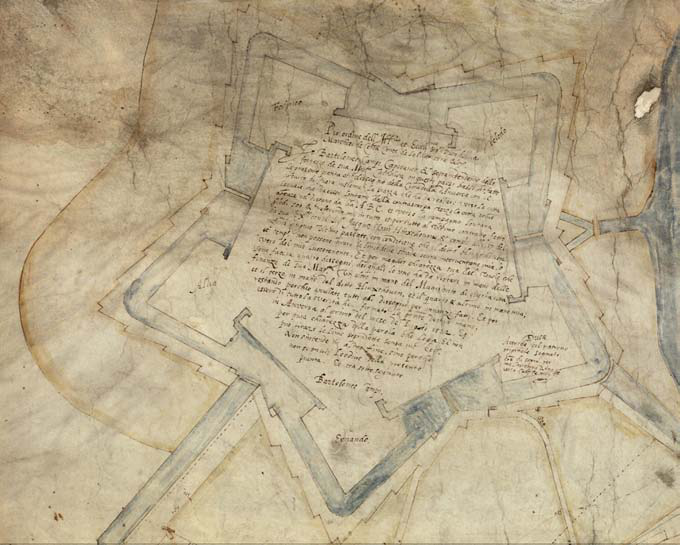
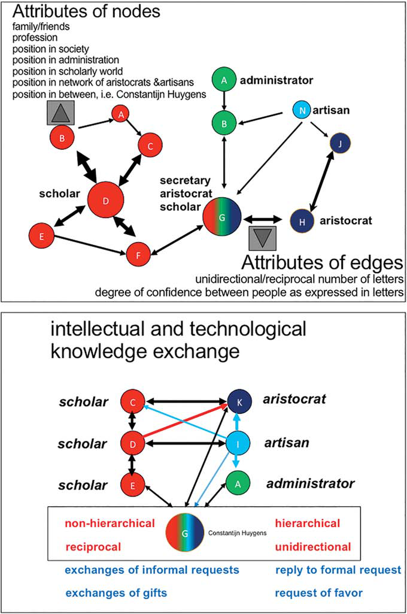
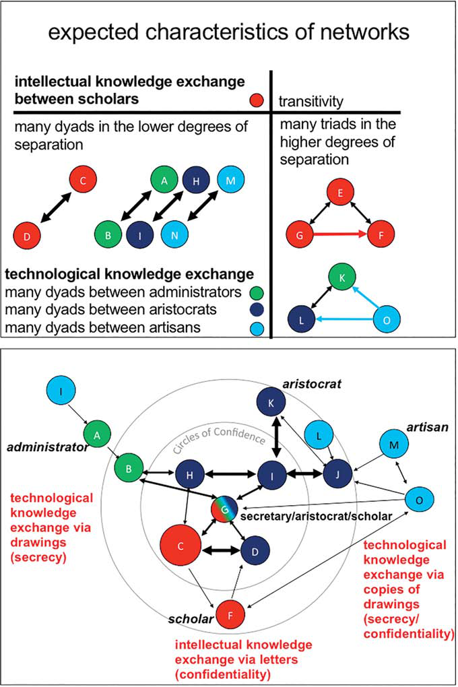

# Circles of Confidence in Correspondence

***Modeling Confidentiality and Secrecy in Knowledge Exchange Networks of Letters and Drawings in the Early Modern Period***

*Charles van den Heuvel* \
Huygens ing – The Hague, The Netherlands \
*charles.van.den.heuvel@huygens.knaw.nl*

*Scott B. Weingart* \
Carnergie Mellon University Pittsburgh, usa \
*scottbot@cmu.edu*

*Nils Spelt* \
Erasmus University Rotterdam, The Netherlands \
*nspelt@gmail.com*

*Henk Nellen* \
Huygens ing – The Hague, The Netherlands \
*henk.nellen@huygens.knaw.nl*

## Abstract

Science in the early modern world depended on openness in scholarly communication. On the other hand, a web of commercial, political, and religious conflicts required broad measures of secrecy and confidentiality; similar measures were integral to scholarly rivalries and plagiarism. This paper analyzes confidentiality and secrecy in intellectual and technological knowledge exchange via letters and drawings. We argue that existing approaches to understanding knowledge exchange in early modern Europe – which focus on the Republic of Letters as a unified entity of corresponding scholars – can be improved upon by analyzing multilayered networks of communication. We describe a data model to analyze circles of confidence and cultures of secrecy in intellectual and technological knowledge exchanges. Finally, we discuss the outcomes of a first experiment focusing on the question of how personal and professional/official relationships interact with confidentiality and secrecy, based on a case study of the correspondence of Hugo Grotius.

© koninklijke brill nv, leiden, 2016 | doi: 10.1163/18253911-03101002

<!-- page 78 -->

## Keywords

Republic of Letters – network analysis – circulation and visualization of knowledge

## 1 Confidentiality and Secrecy in the Republics of Letters: Introduction

“Networks of Trust” is the title of an article by Franz Mauelshagen, and one of many publications that discuss the concept of confidentiality in the Republic of Letters. In the historiography of the Republic of Letters, confidentiality is often described as a relationship based on trust and as an expression of friendship and reciprocity.[^1] Letters in this context are seen as substitutes for encounters in person. Secrecy, however, is often unidirectionally imposed by an authority higher up the hierarchical chain. This paper analyzes these concepts of confidentiality and secrecy by focusing on differences in the nature of intellectual and technological knowledge exchange in Early Modern Europe, and questions interpretations of the Republic of Letters as a single, distinct entity of corresponding scholars in one unified epistolary network.

As Dirk van Miert has pointed out, the Republic of Letters might seem at first sight a stable term. In reality, authors in different times and places have attached various meanings to this construct, and the community of scholars itself changed over time, both in practices and ideals.[^2] The Republic of Letters is not just a historical construct in hindsight, to which historians have attached various meanings, but a translation of existing historical terms such as *Respublica litterarum* or *République des Lettres* that were already used by scholars such as Erasmus, Leibnitz and Voltaire.[^3] Historians distinguish between scholars in informal and more formal communities in the Early Modern Period between the fifteenth and eighteenth centuries, but do not often challenge the recurrent holistic view of the Republic of Letters in its historiography.

<!-- page 79 -->

The Republic is often described in idealistic terms as a kind of single intellectual Utopia. Hans Bots called it a “supranational European community of scholars” and “an ideal state”; Franz Mauelshagen referred to it as “a fictitious community – without a territory, or clear-cut geographical or social border – with ideas and moral rules instead of a legal system, with idols instead of a government” and Anthony Grafton viewed it as “Europe’s first egalitarian society.”[^4] Such descriptions of the Republic of the Letters seem to deny a harder reality in which scholars were persecuted on account of religion and politics, had to live in exile, and in their striving for rehabilitation could not always choose their words freely out of concerns for the safety of family and friends. This was especially true given that their letters risked interception, duplication and even publication.[^5] For that reason, Dániel Margóscy recently designated the scholars in the Republic of Letters as “The Republican Army of Letters” to express the non-egalitarian, hierarchical characteristics of the intellectual knowledge exchange in this virtual republic.[^6]

Historical interpretations of knowledge exchanges within the Republic of Letters are often based on small sets of letters pertaining to one correspondent or to a small group of correspondents, and findings are extrapolated to “explain” certain phenomena. In recent years several projects have begun digitally reconstructing sections of the Republic of Letters to analyze it more comprehensively. The best-known initiatives are the projects *Mapping the Republic of Letters* of Stanford University and *Cultures of Knowledge* of Oxford University. Both projects focus on metadata gathered from the correspondence of scholars to reconstruct intellectual networks and geographies of knowledge exchange in Early Modern Europe and beyond.

<!-- page 80 -->

*The Circulation of Knowledge and Learned Practices in the 17th-century Dutch Republic* project of a consortium of Dutch universities, institutes of the Royal Netherlands Academy of Arts and Sciences and cultural heritage organizations focuses both on metadata and on the letters themselves. In this way they intend to map the dissemination and appropriation of themes of interest and the emergence of debates in the Republic of Letters. Within the context of that project, the *ePistolarium* tool was developed to automatically extract concepts and ideas from a dataset of approximately 20,000 letters written by or to Dutch scholars and scientists working in the Netherlands in the Early Modern Period, using similarity searches based on topic modeling. When the tool was launched in June 2013 six experiments were set up to put it to the test. Here, we mention two. Huib Zuidervaart developed a case to automatically discover actors who played a crucial role in the discovery of the ring structure and moons around the planet Saturn. The tool recognised not only names already discussed in the publications on this topic by the expert Van Helden, but also identified additional relevant historical figures.[^7]

Less successful were the results of an experiment by two of the present authors, Charles van den Heuvel and Henk Nellen.[^8] The question was whether the theme of confidentiality, which recurs regularly in the letters of Hugo Grotius and which is considered an important characteristic of knowledge exchange in the historiography of the Republic of Letters, could be retrieved automatically from the corpus of correspondence in the Circulation of Knowledge project.[^9] They found some references to confidentiality in the work of Grotius, but very few in other correspondence, although manual checks revealed that confidential information did indeed also appear in the letters of other scholars.

<!-- page 81 -->

The *ePistolarium* tool itself is not to blame for these disappointing results. In small datasets the “most similar” letter can still have quite a different content. It is hardly surprising that a query for confidentiality-related words, based on a similarity search in a set of 20,000 letters of which more than a third were written by or to Grotius, almost invariably leads to the correspondence of Grotius himself. But apart from the size and composition of the dataset, the use of implicit language can also explain the low recall. While in the Saturn case, words like sun, moons, planets, and stars immediately provide explicit associations with astronomy (or perhaps astrology), the many ways that a correspondent might ask the recipients of his letters to handle specific controversial information in confidence were far more implicit.

This has implications for the use of topic modeling. When continually different word combinations are used to express confidentiality, such as “Interea quas a me tenes litteras tibi habe et Vulcano sacrifica” (Meanwhile, keep the letters received from me for yourself and offer them to the god of fire) or “Haec inter nos dicta sunto” (Consider this information as exchanged between the two of us), it becomes less clear which automatically extracted strings of words are representing the same concept or topic.[^10] Understanding the pragmatics of language relies both on the words and the context of a conversation. In this case, understanding the relationships between people can yield insights into various aspects of confidentiality and secrecy. Controversial information is more likely to be shared with a relative or close friend than with a complete stranger.

Therefore, here we discuss the development of a model for circles of confidence and cultures of secrecy in networks of knowledge distribution and exchange. We use the plural term “networks” explicitly because it is presently more useful to analyze communication in the Early Modern Period as a multilayered network in which knowledge was exchanged by different actors through various media, rather than as a single entity consisting of scholars in a epistolary network. We discuss differences between intellectual and technological networks and trace the impact of personal and professional/official relationships on confidentiality and secrecy in the exchange of knowledge.

<!-- page 82 -->

## 2 The Republic of Letters and Networks of Knowledge

Several historians have already described the Republic of Letters in terms of networks. Mauelshagen referred to “Networks of Trust” and Lux and Cook used the title “Closed Circles or Open Networks” for their seminal article on exchanges of knowledge within Europe and with the Far East in the Early Modern Era.[^11] In 1998 Lux and Cook were already arguing that ideas about medical practices used in Asia circulated more freely and were adopted more quickly between England and the Dutch Republic than between England and France as a result of a larger quantity of what in network theory are called “weak ties” instead of central hubs.[^12] This implies the importance of intermediaries between tightly knit and distinct communities (scholars, merchants, artisans, administrators, general practitioners etc.) for the distribution of ideas across the networks, instead of central figures holding together an entire Republic of Letters as a closed circle. Moreover, Lux and Cook claimed that these weak ties also explain why so many scholars in the Dutch Republic were involved in the natural sciences without formally being part of an academy or society.[^13] Margócsy supported their view of the importance of weak ties, but observed that once such a link fell away, the whole network could break down.[^14] Although Mauelshagen and Lux and Cook point to different internal structures, like other historians they treat the Republic of Letters – in Margócsy’s characterization – as one “strikingly homogenous network.”[^15]

Not only do we question the homogeneity of relations within the Republic of Letters, but we argue that it consists of multiple overlapping networks. Moreover, we argue that these networks only partially covered the exchanges of knowledge that are attributed to the Republic of Letters. In the Republic of <!-- page 83 --> Letters knowledge was not transferred only through letters; as Mauelshagen observed, all kinds of objects were sent and received: “An exchange of objects was directly associated with the interactive potential of correspondence networks. Even though many objects of exchange did not belong to letters or to the text of a letter, they have to be looked upon as an essential part of correspondence.”[^16] The fact that drawings sometimes accompanied the letters also led to assumptions that all of this material belonged to the Republic of Letters. Here the exchange of alternative, visual forms of knowledge such as drawings for patents and architectural drawings for fortifications will be discussed to demonstrate that their role in transmitting information had a completely different function and character and that therefore they should not be seen as a part of this imaginary republic.

## 3 Knowledge Exchange via Visualizations

When a large geographic distance had to be bridged, letters were by far the most important means of communication between scholars, and for that reason they co-exist with books as essential sources for the history of ideas. It is thus no surprise that there exist so many editions of scholarly letters. Far less is known of another means of communication in the making of knowledge, drawings.[^17] By drawings we mean here visualizations of specific content in addition to text, rather than self-contained artistic objects. Letters often included sketches; in other cases drawings or diagrams (known as *chartae* or *schedae/schedia*) were added to support their intellectual content.[^18] For instance, the Dutch scholar Joachim Hopper wrote in 1557 to Viglius van Aytta that he had commissioned the famous cartographer Jacob van Deventer to make two maps of Frisia, one for his friend and another one for himself: “in the form that Tacitus, Ptolomaeus and other classical authors describe it.”[^19] In <!-- page 84 --> short, the letter clearly reveals how the exchange of objects, such as maps and drawings, could contribute to an intellectual endeavor.

We do not only focus on visualizations as expressions of intellectual activity, but on their role in the exchange of technological knowledge as well. Certainly the separation between intellectual and technological knowledge is not always clear-cut. For instance, the description and drawing of a patented drilling method by the engineer Pieter Pieterzoon Enten to extract clean water from deep layers under the silt soils of Amsterdam during an experiment near the Oudemannenhuis in 1605 resulted in reports and letters by scholars such as Simon Stevin, Marin Mersenne, and Constantijn and Christiaan Huygens spanning nearly six decades.[^20] However examples like these, in which technological knowledge supported by visualizations became a recurrent topic in epistolary exchanges between scholars, were exceptions rather than the rule. There were far too large a number of technical visualizations, such as patent drawings and, especially, drawings of fortifications, for them to have been exclusively associated with the Republic of Letters. If they all belonged to the correspondence of the Republic of Letters, most of the letters would have discussed a technical issue relating to fortifications or a specific invention, but that is not the case. Although the oral transmission of knowledge on the building site remained important during the Renaissance, drawings gradually gained prominence as a means of communication to explain and confirm decisions in the construction of fortifications, which were the largest building projects of the period, going up on a global scale from the Caribbean to the Far East.[^21]

In addition to this functional use of drawings, they were re-used for other purposes or collected as cultural items. Knowledge of fortification belonged to <!-- page 85 --> the cultural education of noblemen, and drawings that once played a role in the practice of warfare ended up in their private libraries and collections. Often plans for fortifications were used to prepare engraved illustrations for printed books or images of fortified cities to decorate the walls of palaces. As such, these representations of fortifications were expressions both of technological and cultural knowledge. Thousands of drawings of fortifications can be found all over Europe in the private collections of princes and noblemen and in former administrative archives, such as the Spanish Empire’s Archivo General de Simancas. Sometimes copies of the same drawings ended up in both official and private collections. Thus versions of Giovanni Maria Olgiati’s drawings, made during his 1553 tour of inspection through the Southern Netherlands for the Spanish king, may be found in the official archives of the Spanish court in Brussels, the private archives of the Savoy family in Turin, and the papal archives in the Vatican.[^22]

The enormous number of technical designs, administrative drawings, and copies thereof, and their broad diffusion, implies that we need digital reconstructions not only of the Republic of Letters, but also of the networks in which all types of drawings circulated in Early Modern Europe and beyond. How can we recreate these networks? Letters often included drawings and maps, and these drawings frequently bore annotations that allow the networks in which they circulated to be reconstructed. For instance, on a design for the citadel of Antwerp (in fact a hybrid combination of a drawing and letter; see Fig. 1), Bartolomeo Campi wrote that he had made four copies: one for the department of finances of the Spanish government; one for the city magistrates of Antwerp; one for the castle master Jacques van Hinxthoven with whom he had signed the contract; and one for himself.[^23] <!-- page 86 --> Sometimes such drawings referred to other drawings. On a design for the citadel of Milan, the Italian engineer Tomaso Corbetta referred to the measurements for the circumference of the citadel of Antwerp.[^24] Therefore, in addition to connecting letters to recreate the epistolary networks of the Republic of Letters, we must connect maps to letters and to other drawings or maps in order to restore the original networks through which knowledge was disseminated, whether the original images were supported by letters or not. Following the recent initiatives to digitally reassemble the Republic of Letters,[^25] an attempt should now be made to recreate the networks of knowledge distribution <!-- page 87 --> embodied in drawings from European administrative and private collections. Elsewhere we described how maps could be connected to letters and other maps using a combination of semantic and visual pattern recognition techniques.[^26]

**figure 1** *Bartolomeo Campi, design for the citadel of Antwerp with contract, 1572 (detail)* \
antwerp (belgium) stadsarchief [city archives] 12 # 10774

Reassembling the Republic of Letters will take a long time, and the networks of visualization likely even longer given the nascent state of visual pattern recognition. Without these large digital networks of letters and drawings, however, we cannot solve the problem described above of current assumptions regarding confidentiality and secrecy in the Republic of Letters, which as a whole are based on extrapolations of very small bodies of correspondence. We also need these large datasets to test the claims of Mauelshagen, Lux & Cook, and Margócsy concerning the topological structures of networks and our own hypotheses regarding differences in confidentiality between intellectual and technological networks. However, we can already begin to prepare a model in which these assumptions based on the expected characteristics of the concepts of confidentiality and secrecy in these different networks can be tested.

## 4 Confidentiality and Secrecy in Networks of Letters and Drawings

We already observed that in the historiography of the Republics of Letters, confidentiality is described as having been based on trust and friendship. For that reason, reciprocity in the informal exchange of knowledge is seen as an important characteristic of the Republic of Letters. However, Dirk van Miert’s description of the Republic of Letters as “a flexible, self-regulating and international conglomerate of learned networks, based on rules of conduct and communication which were never formalized” contrasts considerably with the hierarchical networks of administrators that dictated the rules on how financial and technical information in the form of drawings, with or without an accompanying letter, should be reported.[^27]

In official correspondence there were rules stipulating which institutions and persons would receive copies of drawings, and even conventions regarding <!-- page 88 --> color schemes to avoid misunderstandings in the communication processes of decision-making and planning control.[^28] Not only was the circulation of administrative documents and drawings different from the exchange of letters within the Republic of Letters; so too was the circulation of copies of such documents. Aristocrats were often involved in supervising the design and planning of military constructions. Through their involvement these aristocrats had access to official drawings, which they copied and stowed away in their private collections. Aristocrats also exchanged copies of technical drawings to impress each other; in that sense their communication can be considered as reciprocal, similar to the characterization of epistolary intellectual exchanges in the Republic of Letters. However, communication between these aristocrats and the engineers making the drawings was top-down and unidirectional. Aristocrats ordered drawings, and in those cases where engineers initiated the communication themselves, it was often to obtain privileges such as work or a pension for family. Such requests could be granted, but the artisans knew that this was not a certainty.

Although reciprocity was not guaranteed in the Republic of Letters, it was at least expected. Not only the governmental bodies discussed earlier, but also the princes and noblemen mentioned above laid down administrative rules in other forms of correspondence and instructions such as semi-public and private commissions to collect technological information. The grand duke of Tuscany, Cosimo iii dei Medici, instructed his secretary to write down in detail which places and industries an engineer in his service, Pietro Guerrini, was supposed to visit. He stipulated which people Guerrini had to meet to obtain the required, often secret, information about the latest developments in fortifications and technical inventions in the linen industry during his tour through Germany, the Low Countries, England and France. Finally, he indicated how Guerrini had to report this information in the form of drawings.[^29] This gathering of technical knowledge was certainly not reciprocal and <!-- page 89 --> Guerrini reports that during his espionage tour he was not always able to obtain the requested information: “because the Dutch were reluctant to show it.”[^30]

These different characteristics of the relationships within the various networks need to be taken into account in developing a model of confidentiality and secrecy in the exchange of intellectual and technological knowledge. To prepare the analytic model we examined the private and official correspondence of the Dutch scholar Hugo Grotius.

## 5 The Personal and Official Correspondences of Hugo Grotius (1583–1645)

We stated above that interpretations of epistolary exchanges within the Republic of Letters have often been based on extrapolations of the correspondence of just one or a few scholars. Here we look into the correspondence of the scholar Hugo Grotius (1583–1645), not with the aim of explaining daily life in the Republic of Letters as a whole, but to begin assembling useful components for a model of confidentiality and secrecy in networks of knowledge exchange. This will lay the basis for hypotheses that can be tested once sufficient material is digitized. In the future we intend to include Pierre Bayle, Johan Amos Comenius, and Samuel Hartlib as further exemplars for the model, so we can explore the impact of geographical displacement and exile on confidentiality and secrecy. Explicit references to confidentiality in their works make comparative analyses of their networks a next logical step.[^31]

<!-- page 90 -->

For the present, the rich and turbulent career of Hugo Grotius provides a variety of components relevant to the proposed model, and allows us to explore the concepts of confidentiality and secrecy in networks in more detail. Grotius left behind him a substantial correspondence of 7,725 letters, including letters to and from well-known scholars such as Justus Lipsius, Dominicus Baudius, Claude de Saumaise, Daniel Heinsius, Nicolas-Claude Fabry de Peiresc and Isaac Casaubon.[^32] However, he also wrote to friends and family; more than a third of the letters were exchanged between Grotius and blood relatives (Willem, Jan, Cornelis, Dirck and Pieter de Groot) or with his wife, Maria van Reigersberch, and her brothers Johan and Nicolaes. Apart from these private letters, Grotius had administrative duties that required him to write official and diplomatic letters. In 1613 Grotius was appointed *pensionaris*, i.e. legal advisor for the city of Rotterdam. In this capacity he was in close contact with Holland’s Advocate, Johan van Oldenbarneveldt, until religious controversy resulted in Van Oldenbarneveldt’s beheading and the condemnation of Grotius to lifelong imprisonment in 1619. After escaping from his prison in Castle Loevestein, Grotius fled to Paris and lived in exile. In 1635, after a short stay in Holland and another forced exile, this time to Hamburg, Grotius returned to Paris to become an ambassador of Christina, Queen of Sweden, until his death in 1645. Thus, in the case of Grotius, letters were exchanged in private and official networks that comprised friends and foes. These differences in network relationships might lead us to expect that some in Grotius’s network received letters in confidence, while information was kept secret from others. Correspondence became less frequent when relations cooled, and as a rule one did not correspond with adversaries. On the other hand, as relationships grew friendlier the intimacy and trust between correspondents might increase as well.

Confidentiality played an essential role in maintaining correspondence. In order to survive as an exiled Arminian (Remonstrant), Grotius joined forces with learned men of the same convictions. He was part of a small group of theologians and ministers who opposed the established Protestant church. Among this group were Wtenbogaert, Episcopius, and the French heterodox <!-- page 91 --> theologians Daniel Tilenus, Étienne de Courcelles, François d’Or, Théophile Brachet de la Milletière and Edmond Mercier. Grotius’ name was also associated with Socinianism, considered to be a dissenting belief which rejected important orthodox Christian tenets such as the doctrine of the Trinity and the pre-existence of Jesus Christ before the virgin birth. But Grotius was not a Socinian and tried with great care to remove the impression that by defending the Remonstrants he was defending Socinianism as well.[^33] Although Grotius disagreed with the Socinians on dogma, he remained on friendly terms with some of them, including Martinus Ruarus and Johannes Crellius. Consequently, Grotius was criticized by orthodox theologians such as Gisbertius Voetius and André Rivet for not distancing himself sufficiently from the Socinians and their views on the Holy Trinity. From his correspondence with Nicolaes Reigersberch, it becomes clear that Hugo Grotius was accused by Rivet in a personal conversation with Elizabeth Stuart, Queen of Bohemia, of having recommended and lent some Socinian books. Moreover, the rumor circulated that fragments of the correspondence of the Dutch scholar with the Socinian Johannes Crellius were exchanged secretly in England.[^34]

It goes without saying that Grotius had to be careful of the people with whom he shared confidential information, even those he trusted. At the same time Grotius used his good relationships with the Swedish government as an ambassador of Queen Christina to support those who shared their controversial ideas with him, even if he did not agree on all points with their views.[^35] This delicate balance between secrecy and confidentiality in the copious correspondence – both personal and diplomatic – of a scholar who, like so many others, was considered a religious dissenter and spent a long period of his life in exile, is what makes Grotius’ case so interesting. An earlier article by Henk Nellen (2005) quantitatively analyzes a set of 7,725 letters sent to or received by Grotius.[^36] Tables provide information about the number of letters exchanged annually between Grotius and other correspondents from 1594 to 1645: Grotius’ diplomatic/official correspondence between 1607 and 1645; his private correspondence between 1597 and 1645 each consisting of 10 letters or more exchanged per correspondent; and finally the speed of postal services between Paris and the Hague from 1640–1644.[^37] Several observations of Henk <!-- page 92 --> Nellen in his article on the characteristics of confidentiality and secrecy in the network of Grotius provided input into our proposed model.

## 6 Modeling Confidentiality and Secrecy in Hypothetical Networks of Knowledge Exchange

Based on our understanding of Hugo Grotius’ correspondence, we created a model of confidentiality and secrecy in intellectual knowledge exchange and connected it to the same tendencies in technical knowledge exchange in hypothetical networks. We formulated the following hypotheses:

1) *The nature of the personal relationships and the degree of confidentiality in an individual’s correspondence are correlated. The type of relationships between correspondents will influence the level of secrecy or confidentiality in their correspondence*.

In the historiography of the Republic of Letters, reciprocity between correspondents is considered to be an essential feature. The letter as surrogate for personal contact implies the importance of mutual communication. There were certain important standards in communication that depended on the nature of the relationship between individuals. For instance, the sender of a letter was more or less entitled to a reply, even if the recipient had nothing new to report.[^38] Many factors played a role in these relationships and in the social standards for epistolary exchange, such as family ties, bonds of friendship, professional interests, social status, and religious affinity.[^39] Based on the <!-- page 93 --> assumption that controversial views were more likely to be shared with relatives or good friends than with complete strangers, we would expect these attributes to inform the differences in epistolary relationships between personal and professional networks.

Based on the correspondence of Grotius, we developed a typology of his correspondents, the type of relationship that bound them, and expressions of confidentiality in their letters (see Fig. 2a). Our assertion that the type of relationship and confidentiality are correlated can be easily tested by comparing these two factors in other collections of correspondence. We would also expect to see assortative mixing, that is, individuals from a particular family group, religious affiliation, or social class would be more likely to contact others of that same group than individuals across different groups (see Fig. 2b).

2) *While letters do exist on a spectrum between the personal and the public, “standard” letters complicate matters*.

In the latter case, many people could receive a letter with the same content, especially the latest political news, but in the versions sent to family or friends, more personal news and matters of confidentiality might also be included. In this context, all references by the correspondent not to divulge the news received are significant.

Confirmation of this statement would in principal require direct analysis of the letters themselves, but on a metadata level it is still of interest to see how many copies there are of the same letter, and of those, how many are personalized. The question then becomes the extent to which personalized copies went to the inner circle and standard letters to the outer circle.

This hypothesis may be formally tested by creating a network connecting recipients of copies of the same letter, and overlaying this on a co-citation network connecting those people mentioned together in letters.[^40] We would <!-- page 94 --> expect here transitivity in the network of trust, i.e. the extension of the exchange of confidential information between two people (expressed in dyads) to three (expressed in triads) or more people (see Fig. 3a). In the structural analyses of the networks, the number of intermediates between correspondents, expressed in so-called degrees of separation, becomes relevant. Analyzing the networks ought to reveal assortative dyads in the closest circles, and the formation of transitive triads among less confidential circles (see figures 3a and b). Furthermore, we would expect a high degree of overlap between the co-citation and co-copy networks.

3) *Confidentiality and secrecy can be transferred directly and indirectly through triadic closure*.

As correspondents entered into networks of epistolary exchange, they did so not in some ideal egalitarian society, where anyone could join simply by writing a letter, but in a world regulated by social norms and rules of etiquette.[^41] In short, letters of introduction were often necessary to be admitted into an epistolary network. Retracing the evolution of co-citation networks alongside an analysis of letters of introduction sent via intermediaries would reveal the importance of introductions in transferring confidentiality. If our hypothesis is correct, the analysis should show shrinking degrees of separation in both the direct epistolary and the co-citation networks, which would provide both structural and individual evidentiary support.

4) *Expressions of confidentiality and secrecy in letters can change over time. These dynamics have an impact on the structure of the networks*.

Early correspondence is often more formal, conveying information, or a specific request or gift, but gradually they may grow in confidentiality. Alternatively, relations may become estranged or even turn into animosity, which influenced Grotius in his decision to destroy the letters he received from Daniel Heinsius.[^42] Here it becomes important to code for the duration of exchanges between correspondents and the frequency of replies, as well as the changing degree of confidentiality and secrecy throughout those exchanges. As with the analysis of introductory letters, this requires close reading of the letters <!-- page 95 --> themselves, though a purely structural analysis of the early correspondence in certain case studies could provide some clues. Here we may see a sort of evolving transitivity as well, since we would expect the inclusion or exclusion of partners in confidence to influence and be influenced by the degree of confidentiality exhibited in exchanges between shared neighbors. That is, if two previously close contacts cease communications, more likely than not this split will inform how and whether they continue to speak to shared confidants. We can follow this in the evolution of clusters in epistolary networks.

5) *Exile has a “positive” impact on the correspondence both in the public sphere (e.g., where the writer is seeking rehabilitation) and the private sphere (discussing practical issues, the safeguarding of private goods and care for the family, and more personal issues expressed in confidentiality)*.

To analyze this statement we need to create ego-networks of two sorts around exiled individuals: one network in which the individual is cited alongside, and another network made up of direct contacts. We would expect an increase in the frequency of letters to political and religious actors, as well as to family and friends, directly following the moment of exile. Regarding letters written, seeking support for rehabilitation, it is not only important to establish to which political or religious actors they were sent, but also to map the names that are mentioned to support a particular argument. Here co-citation networks of political figures mentioned in relation to Oldenbarneveldt, or of religious actors such as Arminians, Socinians, orthodox theologians etc. are useful. We should also expect an increase in correspondence upon further travel or a return home from exile, on the part of those who wished to keep in contact with correspondents they met abroad. This would also lend support to Lux & Cook’s “weak ties” argument.

6) *A comparison of the dissemination of intellectual and technological knowledge reveals that these networks only partially overlapped*.

Non-overlapping sections of the network are of a different nature, and might have an impact on confidentiality. The exchange of technological knowledge occurs in both official and semi-official circuits. The official circuit of administrators, aristocrats and artisans is often secret and communication therein mainly unidirectional. Original documents may also be copied and exchanged in more open, semi-official circuits of aristocrats and artisans (engineers). The relationship in terms of the exchange of copies between aristocrats is reciprocal, but the relationship between aristocrats and engineers or artisans is not. Aristocrats do not send drawings in return to artisans (see figures 2 and 3). These relationships can be modeled and tested.

<!-- page 96 -->

**figure 2** *Attributes of nodes and edges expressing the roles of individuals and the nature of the relationships between them in the exchange of intellectual and technological knowledge*

<!-- page 97 -->

**figure 3** *Expected properties of the structures of intellectual and technological networks*

<!-- page 98 -->

This comprehensive statement again requires the mapping of the evolution of transitive aspects of the networks, i.e. the development of triads and – within them – of hierarchical, unidirectional and non-hierarchical, non-directed (reciprocal) relationships. Here we do not only expect more triads in the higher degrees of separation, but also more reciprocal exchanges between the correspondents (see figure 3a and 3b).

Some of these statements require the close reading of many letters to establish whether they are plausible. Other claims could in principal be deduced from a structural analysis of the various networks, but this will not be possible before large quantities of correspondence are digitized in full-text and the (meta-)data are prepared in such a way that they are machine-readable. The lack of data means that our experiments for the greater part cannot be more than thought experiments. Nevertheless, we set up a very small pilot study to enable a first analysis of the concept of reciprocity in the personal and official networks in which Grotius participated.

## 7 A First Pilot Experiment on Reciprocity in the Personal and Official Networks of Hugo Grotius

In his article on the correspondence of Hugo Grotius (2005), Nellen made various statements on confidentiality that presuppose a correlation with reciprocity. Most of these statements, such as “the fact that Grotius and his friends had to proceed in secrecy deeply affected both the style and content of the correspondence,” are impossible to check without the close reading of many letters.[^43] Our experiment determined a degree of confidentiality using a network analytic heuristic in lieu of reading each letter individually. Starting off with the simple assumptions that people only convey confidential information to people they trust, and that only people who trust each other answer each other’s letters (statements that are by no means universally true, but enough to begin an experiment), we decided to test reciprocity across correspondence types as an indicator of confidentiality in Grotius’ network. We began with a set of metadata consisting of 7,725 letters written by or addressed to Hugo Grotius, containing information on the date every letter was sent and received, by whom it was written, to whom it was addressed and the geographical location of both the sender and recipient. These 7,725 numbered letters link Grotius’ with 386 persons. The list of Grotius’ addressees contains 263 names, as against 297 of those writing to Grotius.

<!-- page 99 -->

Over half of these individuals exchanged no more than three letters with Grotius. Our aim was to create a network of Grotius’ correspondence, that was as complete as possible, but without compromising the legibility of its visualization. Therefore, we chose to exclude these less frequent correspondents. In the experiment, we featured only those correspondents – 69 in total – with whom Grotius exchanged ten or more letters (see table 1). The number of letters written by Grotius (4,270) is considerably higher than the number of the letters he received (2,669); that is, 61.5% against 38.5%. Such percentages need to be interpreted with the greatest care given the fact that letters from famous scholars are more likely to be saved, transcribed and printed than those of less well-known correspondents. In our experiment the degree of reciprocity between Grotius and each correspondent, which can be seen in table 2, corresponds to the number of letters that were answered for every one hundred letters sent. We found that, on average, for every 100 letters sent or received by Grotius to his personal network, 48 were answered, while in his professional network only 31 in 100 were answered, a difference of about 33%. Using the network tool Gephi, a simple ego-network was created with Hugo Grotius at the centre (see Fig. 4) of which every node represents one of Grotius’ 69 most frequently writing correspondents.

The size of each node corresponds to the number of letters exchanged with him. A node’s distance from Grotius and the thickness of the edge (edge weight) both represent the degree of reciprocity. Finally, the colors of the nodes represent who belongs to which network. Red nodes are professional respondents, yellow nodes are personal respondents, and orange ones belong to both networks. The latter was an arbitrary but sometimes inevitable choice, because it was not always possible to decide whether a correspondent was more aligned to the personal network or the professional one. Professional contacts, for instance, could eventually become friends, but quantifying that would require a temporal dimension in the representation of both networks. Even this preliminary experiment, however, adds support to the claim that the degree of reciprocity was higher in Grotius’ personal network than in his professional one. With that said, a large amount of the correspondence in Grotius’ personal network showed virtually no reciprocity, while many exchanges with professional contacts were actively reciprocated. In short, reciprocity isn’t a sufficient indicator of confidentiality, though it may play a part in future structural analyses attempting to measure degrees of confidence.

We cannot, on the basis of this experiment alone, come to any solid conclusions. Moreover, our distinction between confidentiality and professional secrecy is intuitively problematic. Professional secrecy implies, for instance, sending classified material (e.g. secrets of state, in code or not), while confidentiality <!-- page 100 --> involving disruptive personal material (e.g. politically deviant convictions, effusions or other thoughts intended to be read exclusively by the addressee) implied the letters would not be shared with others. This subtle difference is particularly significant, since professional secrecy was common in the professional network of Grotius, which consisted mainly of his diplomatic contacts as the queen of Sweden’s ambassador to France. This makes it impossible to discern the effects of confidentiality and secrecy on the degree of reciprocity, because they influenced reciprocity through two different motives: trust on the one hand and duty on the other. Therefore it cannot be demonstrated <!-- page 101 --> that Grotius was mistaken in his conviction that he never treated (nor was treated by) his personal contacts differently than his professional contacts.[^44]

**figure 4** *Ego network of Hugo Grotius with his 69 most frequent correspondents. Red nodes are professional respondents, yellow nodes are personal respondents. Orange nodes belong to both networks. The distance of a node from the centre (Grotius) and the thickness of the edge (edge weight) both represent the degree of reciprocity.*

We need to code a larger number of attributes in order to form a more nuanced model of the role of confidentiality and secrecy in the networks of Grotius. Furthermore, to test our model we need the letters of other scholars as well, lest we risk the same part-as-whole issue that arose with the earlier studies described above. We already observed above that to test some of our hypotheses we need to analyze the content of the letters themselves. That is why the above-mentioned *Reassembling the Republic of Letters* initiative to link large amounts of letters digitally is of so much importance. However, we also stated that knowledge exchange via drawings should not be seen as a part of the Republic of Letters. Only when we successfully reassemble the Republic of Letters alongside other networks, including those of maps and drawings, can we seriously consider making more comprehensive statements on the exchange of intellectual and technological knowledge in the Early Modern Period.

<!-- page 102 -->

**table 1** *Nodes: Number of letters exchanged between Grotius and each correspondent per type of network*

| Correspondent | No. of letters exchanged with Grotius | Part of network |
|---|---|---|
| Nicolaes van Reigersberch | 1190 | Personal network |
| Willem de Groot | 1138 | Personal network |
| Axel Oxenstierna | 639 | Professional network |
| Carl Marin | 464 | Both networks / undecided |
| Ludwig Camerarius | 349 | Both networks / undecided |
| Gerardus Vossius | 255 | Personal network |
| Petter Spiring Silvercrona | 212 | Professional network |
| Harald Appelboom | 173 | Professional network |
| Johan Adler Salvius | 173 | Professional network |
| Johan Oxenstierna | 144 | Both networks / undecided |
| Georg Keller | 137 | Professional network |
| Johannes Wtenbogaert | 122 | Personal network |
| B. Aubery du Maurier | 116 | Personal network |
| Christina of Sweden | 116 | Professional network |
| Daniel Heinsius | 99 | Personal network |
| Joachim de Wicquefort | 99 | Professional network |
| Paulus Pels | 96 | Professional network |
| Israel Jasky | 74 | Both networks / undecided |
| Jan de Groot | 64 | Personal network |
| Peter Schmalz | 62 | Professional network |
| W. van Oldenbarneveldt | 60 | Personal network |
| Georg Michael Lingelsheim | 53 | Personal network |
| Isaac Casaubon | 53 | Both networks / undecided |
| Pieter de Groot | 53 | Personal network |
| Maria van Reigersberch | 47 | Personal network |
| Sten Bielke | 47 | Professional network |
| Dirck de Groot | 44 | Personal network |
| Georg Muller | 41 | Both networks / undecided |
| Claude Saumaise | 37 | Personal network |
| Otto Rhingrave | 36 | Professional network |
| Caspar Barlaeus | 35 | Personal network |
| Dominicus Baudius | 34 | Personal network |
| Pierre & Jacques Dupuy | 34 | Personal network |
| Cornelis de Groot | 29 | Personal network |

<!-- page 103 -->

**table 1** *Nodes: Number of letters exchanged between Grotius and each correspondent* (cont.)

| Correspondent | No. of letters exchanged with Grotius | Part of network |
|---|---|---|
| Matthias Bernegger | 28 | Personal network |
| Schering Rosenhane | 27 | Professional network |
| L. Aubery du Maurier | 25 | Both networks / undecided |
| Johannes Gronovius | 23 | Personal network |
| Johannes Meursius | 23 | Personal network |
| Bernhard von Sachsen-Weimar | 22 | Professional network |
| Claude Sarrau | 22 | Personal network |
| Joachim Camerarius | 22 | Professional network |
| Lars Grubbe | 22 | Professional network |
| Nicolas Fabry de Peiresc | 21 | Personal network |
| Petrus Bertius | 21 | Personal network |
| Joost Brasser | 20 | Personal network |
| Staten van Zeeland | 20 | Professional network |
| Isaac Vossius | 19 | Personal network |
| Jean des Cordes | 19 | Personal network |
| Johan de Haen | 18 | Personal network |
| Balthasar Schörling | 17 | Professional network |
| Jacques-Auguste de Thou | 16 | Personal network |
| Janus Rutgersius | 16 | Personal network |
| Simon Episcopius | 16 | Personal network |
| Johan van Reigersberch | 14 | Personal network |
| Gustaf Rosenhane | 13 | Professional network |
| Johan Boreel | 13 | Personal network |
| Martinus Ruarus | 13 | Personal network |
| Petrus Cunaeus | 13 | Personal network |
| Dirck Graswinckel | 12 | Personal network |
| Frederik Hendrik | 12 | Personal network |
| Hieronymus Bignon | 12 | Personal network |
| John Overall | 12 | Personal network |
| Gustav Karlsson Horn | 11 | Professional network |
| Pieter C. Hooft | 11 | Personal network |
| Franciscus Junius | 10 | Personal network |
| Johan Witte(n) | 10 | Personal network |
| Mericus Casaubon | 10 | Personal network |

<!-- page 104 -->

**table 2** *Edges: Degree of reciprocity in exchanges between Grotius and each correspondent. The number of letters that were answered for every one hundred letters sent.*

| Source | Target | Reciprocity |
|---|---|---|
| Grotius | Franciscus Junius | 100 |
| Grotius | Matthias Bernegger | 100 |
| Grotius | Claude Saumaise | 95 |
| Grotius | Harald Appelboom | 92 |
| Grotius | Isaac Vossius | 90 |
| Grotius | Israel Jasky | 90 |
| Grotius | Petrus Bertius | 90 |
| Grotius | Otto Rhingrave | 89 |
| Grotius | Gustaf Rosenhane | 86 |
| Grotius | Caspar Barlaeus | 84 |
| Grotius | Claude Sarrau | 83 |
| Grotius | Johan de Haen | 80 |
| Grotius | Janus Rutgersius | 78 |
| Grotius | Simon Episcopius | 78 |
| Grotius | Isaac Casaubon | 77 |
| Grotius | Jan de Groot | 73 |
| Grotius | Johannes Wtenbogaert | 72 |
| Grotius | Hieronymus Bignon | 71 |
| Grotius | John Overall | 71 |
| Grotius | Schering Rosenhane | 69 |
| Grotius | Johan Witte(n) | 67 |
| Grotius | Mericus Casaubon | 67 |
| Grotius | Johannes Gronovius | 64 |
| Grotius | Johan Adler Salvius | 63 |
| Grotius | Martinus Ruarus | 63 |
| Grotius | Pieter C. Hooft | 57 |
| Grotius | Willem de Groot | 56 |
| Grotius | Christina of Sweden | 51 |
| Grotius | Dirck Graswinckel | 50 |
| Grotius | Gerardus Vossius | 50 |
| Grotius | Georg Michael Lingelsheim | 47 |
| Grotius | L. Aubery du Maurier | 47 |
| Grotius | Jean des Cordes | 46 |
| Grotius | Staten van Zeeland | 43 |

<!-- page 105 -->

**table 2** *Edges: Degree of reciprocity in exchanges* (cont.)

| Source | Target | Reciprocity |
|---|---|---|
| Grotius | Georg Muller | 41 |
| Grotius | Maria van Reigersberch | 38 |
| Grotius | Nicolaes van Reigersberch | 38 |
| Grotius | Carl Marin | 36 |
| Grotius | B. Aubery du Maurier | 35 |
| Grotius | Jacques-Auguste de Thou | 33 |
| Grotius | Johan Oxenstierna | 32 |
| Grotius | Petrus Cunaeus | 30 |
| Grotius | Petter Spiring Silvercrona | 25 |
| Grotius | Gustav Karlsson Horn | 22 |
| Grotius | Sten Bielke | 21 |
| Grotius | Johan van Reigersberch | 17 |
| Grotius | Bernhard von Sachsen-Weimar | 16 |
| Grotius | Dick de Groot | 13 |
| Grotius | Pierre Jacques Dupuy | 13 |
| Grotius | Daniel Heinsius | 11 |
| Grotius | Axel Oxenstierna | 9 |
| Grotius | Frederik Hendrik | 9 |
| Grotius | Nicolas Fabry de Peiresc | 9 |
| Grotius | Cornelis de Groot | 7 |
| Grotius | Pieter de Groot | 6 |
| Grotius | Johannes Meursius | 5 |
| Grotius | W. van Oldenbarnevelt | 2 |
| Grotius | Balthasar Schorlings | 1 |
| Grotius | Dominicus Baudius | 1 |
| Grotius | Georg Keller | 1 |
| Grotius | Joachim Camerarius | 1 |
| Grotius | Joachim de Wicquefort | 1 |
| Grotius | Johan Boreel | 1 |
| Grotius | Joost Brasser | 1 |
| Grotius | Lars Grubbe | 1 |
| Grotius | Ludwig Camerarius | 1 |
| Grotius | Paulus Pels | 1 |
| Grotius | Peter Schmalz | 1 |

<!-- page 106 -->

[^1]: Franz Mauelshagen, “Networks of Trust and Imagined Community of the Learned,” *The Medieval History Journal*, 2003, *6*:1–32, p. 1.

[^2]: Dirk van Miert, “Introduction,” in *Communicating Observations in Early Modern Letters (1500–1675): Epistolography and Epistemology in the Age of the Scientific Revolution*, edited by Dirk van Miert (London/Turin: The Warburg Institute/Nino Aragno Editore, 2013), p. 7.

[^3]: Maarten Ultee, “The Republic of Letters: Learned Correspondence, 1680–1720,” *The Seventeenth Century*, 1987, *2*/1:95–112 for the various uses of the term Republic of Letters in the correspondence of Erasmus, Voltaire and Leibniz.

[^4]: Johannes Alphonsus H.G.M. Bots, *Republiek der Letteren. Ideaal en werkelijkheid* (Amsterdam: apa-Holland Universiteit Pers, 1977), p. 4 and p. 14; Mauelshagen, “Networks of Trust” (cit. note 1), p. 2; Anthony Grafton, “A Sketch Map of a Lost Continent: The Republic of Letters,” *Republic of Letters: A Journal for the Study of Knowledge, Politics and the Arts*, 2009, *1*:1–18, p. 1.

[^5]: See for instance, Bots, *Republiek der Letteren* (cit. note 4) and Lorraine Daston, “The Ideal and Reality of the Republic of Letters in the Enlightenment,” *Science in Context*, 1991, *4*:367–386.

[^6]: Margócsy, “The Republican Army of Letters,” 2014. Title of an unpublished lecture presented at the *History of Science Society* annual meeting on November 8, 2014. We are indebted to Dániel Margócsy (Hunter College – City University of New York) for granting us access to his article in the process of revision for publication: “A Long History of Breakdowns: A Historiographic Review,” *Social Studies of Science*, [forthcoming], written as an introduction to the conference, *Breaking Scientific Networks*, organized by him at the Center for Science & Innovation Studies, University of California, Davis, April 25, 2014: www.breakingscientificnetworks.info (accessed 9 February 2015).

[^7]: http://ckcc.huygens.knaw.nl/epistolarium (accessed 9 February 2015), tab: “first experiments”: “ePistolarium: de Casus Saturnus Text” (in Dutch) and Huib Zuidervaart: “The ePistolarium tool. Experiences in the development of a digital tool for the research of 17th-century scholarly correspondences. 30 October 2013,” http://www.culturesofknowledge.org/?page_id=4356 (accessed 9 February 2015).

[^8]: http://ckcc.huygens.knaw.nl/epistolarium (accessed 9 February 2015), tab: “first experiments” casus “The nature of scholarly communication.”

[^9]: For notions of confidentiality in letters, see for instance: Henk Nellen, “‘In strict confidence’: Grotius’ Correspondence with his Socinian Friends,” in *Self-presentation and Social Identification. The Rhetoric and Pragmatics of Letter Writing in Early Modern Times* [Supplementa humanistica Lovaniensia, 18], edited by Toon van Houdt et al. (Leuven: University Press, 2002), pp. 227–245; Henk Nellen, “The Correspondence of Hugo Grotius,” in *Les grands intermédiaires culturels de la République des Lettres. Etudes des réseaux de correspondances du xvie au xviiie siècles*, edited by Christiane Berkvens-Stevelinck et al. (Paris: Honoré Champion, 2005), pp. 127–164.

[^10]: *Briefwisseling van Hugo Grotius*, edited by P.C. Molhuysen, B.L. Meulenbroek, P.P. Witkam, H.J.M. Nellen, and C.M. Ridderikhoff, i–xvii, ckcc.huygens.knaw.nl/?page\_id=932 (accessed 10 September 2015). Rijks Geschiedkundige Publicatiën, Grote serie, Vol. i, p. 28, no. 35, Johannes Wtenbogaert to Grotius, 2 September 1602 and Vol. xi, p. 63, no. 4501, Grotius to Willem de Groot, 4 February 1640. The Correspondence of Grotius can be consulted at: http://grotius.huygens.knaw.nl/years (last accessed 29 November 2015).

[^11]: David Stephan Lux, Harold John Cook, “Closed Circles or Open Networks?: Communicating at a Distance during the Scientific Revolution,” *History of Science*, 1998, *36*:179–211.

[^12]: For a general introduction to network theory: Albert-László Barabási, *Linked. How Everything is Connected to Everything Else and What it Means for Business, Science, and Everyday Life* (New York: Plume, 2003). For the concept of weak ties: Mark S. Granovetter, “The Strength of Weak Ties,” *American Journal of Sociology*, 1973, *78*/6:1360–1380. For network theory and the Republic of Letters, see further, Scott Weingart, “The Networked Structure of Early Modern Science,” *Journal of the Association for Information Science and Technology* (submitted for review).

[^13]: Lux and Cook, “Closed Circles or Open Networks?” (cit. note 11), p. 184 and 204.

[^14]: Margóscy, “A Long History of Breakdowns” (cit. note 6).

[^15]: The full citation is “Some have argued that this period was remarkable because of the Republic of Letters, a strikingly homogenous network consisting almost entirely of European male scholars (Daston, 1991; Goldgar, 1995; Goodman, 1996; Habermas, 1991).”

[^16]: Mauelshagen, “Networks of Trust” (cit. note 1), p. 18 and Sven Dupré, Christoph Lüthy (eds.), *Silent Messengers. The Circulation of Material Objects of Knowledge in the Early Modern Low Countries* (Berlin [e.a]: lit Verlag, 2011).

[^17]: This paragraph is an abridged version of a section in an article by Charles van den Heuvel, “Mapping Knowledge Exchange in Early Modern Europe: Intellectual and Technological Geographies and Network Representations,” *International Journal of Humanities and Arts Computing*, 2014, *9*/1:95–114.

[^18]: Van Miert, “Introduction” (cit. note 2), p. 5.

[^19]: Edzo Hendrik Waterbolk, “Viglius als kaartenverzamelaar,” in *Verspreide Opstellen* (Amsterdam: Bert Bakker, 1981), p. 144.

[^20]: Charles van den Heuvel, *De Huysbou. A Reconstruction of an Unfinished Treatise on Architecture, Town Planning and Civil Engineering by Simon Stevin*, *History of science and scholarship in the Netherlands*, Vol. 7 (Amsterdam: Knaw-Edita, 2005), pp. 75–77, 445 and 475–478.

[^21]: For the diffusion of modern fortification systems: John Rigby Hale, “The Early Development of the Bastion: An Italian Chronology,” in *Renaissance War Studies*, edited by John Rigby Hale (London: Bloomsbury Academic, 1983), p. 1. For the role of drawings in fortification, Charles van den Heuvel, *‘Papiere Bolwercken’. De introductie van de Italiaanse stede- en vestingbouw in de Nederlanden en het gebruik van tekeningen* (Alphen aan den Rijn: Canaletto, 1991) with a summary in English; Charles van den Heuvel and Berhard Roosens, “Administration, Engineers and Communication under Charles v. The Transformation of Fortification in the Low Countries in the First Half of the 16th Century,” in *Le Fortezze d’Europa*. *Forme, professioni e mestieri dell’ architettura difensiva in Europa e nel Mediterraneo spagnolo*, edited by Angela Marino (Roma: Gangemi Editori, 2003), pp. 411–427.

[^22]: Charles van den Heuvel, “‘Capitaine Jehan Marie et Maistre Bastien d’Utrecht’ – Enige onbekende tekeningen van Giovanni Maria Olgiati en Sebastiaan van Noyen van Spaanse grensversterkingen in de Zuidelijke Nederlanden rond het midden van de zestiende eeuw,” *Jaarboek Stichting Menno van Coehoorn* 1986, *87*:9–23; Pieter Martens, *Militaire architectuur en vestingoorlog in de Nederlanden tijdens het regentschap van Maria van Hongarije (1531–1555). De ontwikkeling van de vestingbouw*, PhD (Ghent: Ghent University, 2009), pp. 175–207.

[^23]: “Et per meglio chiarezza sua Ecc. a vuole che se ne faccia Quattro dissegni, dei quali lo una ha da stare in mani delle finanze de sua Maj.tà. Un altro in mano del magistrate di quest città e il terzo del detto Hinxthoven, et il quarto & ultimo in mano mia, restando perchio annulati tutti gli dissegni per innanzi fatti.” Bartolomeo Campi, Design for the citadel of Antwerp 1572. Antwerp, Stadsarchief [City-Archives] 12 # 10774. See further, Van den Heuvel, *‘Papiere Bolwercken’* (cit. note 21), p. 81 and fig. 63. For the full transcription of the text, p. 197, note 106. This drawing was published without the transcription of the comment in H. Soly, “De bouw van de Antwerpse Citadel (1567–1571), sociaal economische aspecten,” *Belgisch Tijdschrift voor Militaire Geschiedenis*, 1976, *21*:549–578.

[^24]: Tommaso Cobetta, Design for the citadel of Milan. Turin, Archivio di Stato, Architettura Militare, Vol. ii, 72r. See further, Van den Heuvel, *‘Papiere Bolwercken’* (cit. note 21), p. 128.

[^25]: cost Action is1310 *Reassembling the Republic of Letters, 1500–1800. A Digital Framework for Multi-Lateral Collaboration on Europe’s Intellectual History* (Howard Hotson, Oxford University and Thomas Wallnig, University of Vienna).

[^26]: Van den Heuvel, “Mapping Knowledge Exchange” (cit. note 17), in particular, pp. 103–105.

[^27]: Dirk van Miert, *The Republic of Letters and the sustainability of public intellectual authority, 1400–2000. The informal self-regulation of knowledge through international and transconfessional networks* (unpublished note in preparation of a funding application). We are indebted to Dirk van Miert for sharing this unpublished note.

[^28]: *Correspondance française de Marguerite D’Autriche de Parme avec Philippe ii editée d’après les copies faites par M.R.C. Bakhuizen van de Brink, par J.S. Theissen […]. Ouvrage pour faites suite à l’édition de L.P. Gachard*, 3 vols. (Utrecht: Kemink, 1923). Letter from Margareth of Parma to Philip ii of 24 March 1567, “l’advertissant que l’ouvrage tire esdicts poutraictz de rouge signifie, celluy de la ville ja faicts que se pourroit applique à ladicte cittadelle, et le surplus, tiré de noir, désigne l’ouvraige que se fauldroit faire de nouveau.”

[^29]: Franco Martelli, *Il viaggio in Europa di Pietro Guerrini (1682–1686). Edizioni della corrispondenza e disegni di un inviato di Cosimo iii dei Medici* (Florence: Leo S. Olschki, 2005), ‘Istruzioni per il viaggio’ [Travel Instructions], p. 1.

[^30]: Martelli, *Il viaggio* (cit. note 29), p. 153: “L’ò però veduta una volta sola, dicendo lo [the Dutch] mostrino mal volontieri.”

[^31]: See for instance some examples from correspondents in the Hartlib Circle: Joseph Avery to Samuel Avery, 16 June 1642 (emlo id 300598): “I dare not, without order. the revealing of such secrets would not only wound my reputation, but expose all that I haue besids vnto hazard, and danger;” John Dury to Samuel Hartlib, 30 October 1640 (emlo id 302890): “in the meane tyme yow may keep my comming ouer secret to all; except unto Sir Thomas & some fewe others;” John Dury to Samuel Hartlib, 18 September 1642 (emlo id 302844): “I praye consider carefully that which I wrote to Mr Borthwick concerning the erecting of the Scottish Church of Rotterdam;” Streso to Hartlib 6 April [no year]: “The disciplin of the young palatins at Leiden, which yee must not promiscuè shew to euery one, for it is communicated unto mee secretly;” http://www.hrionline.ac.uk/hartlib/browse.jsp?id=11%2F1%2F125a-b Johann Moriaen to Samuel Hartlib, 30 April 1658; (http://www.hrionline.ac.uk/hartlib/view?file=main/31C_18_21): “[…] das ich Ihme doch nicht zuetrawen will sed hæc pereant inter nos.” Isaac de Bra to Samuel Hartlib, 10 juni 1661 (http://www.hrionline.ac.uk/hartlib/browse.jsp?id=27%2F41%2F3a-b): “Wz ee mier communiciret, dz soll sub sigillo silentij, heÿliglich beÿ mier vergraben bleÿben.” We are indebted to Robin Buning (Leiden) for this information and the transcriptions.

[^32]: This number is based on *Briefwisseling van Hugo Grotius* (cit. note 10). The ePistolarium mentions the number 8,040 but that is based on the inclusion of letters attached to the ones of Grotius but not written by or to him, and copies.

[^33]: Henk Nellen, *Hugo Grotius. A Lifelong Struggle for Peace in Church and State, 1583–1645* (Leiden, Boston: Brill, 2015), p. 232.

[^34]: Nellen, *Hugo Grotius* (cit. note 33), pp. 529–540, in particular, pp. 529–533.

[^35]: Nellen, *Hugo Grotius* (cit. note 33), p. 531.

[^36]: Nellen, “The Correspondence of Hugo Grotius” (cit. note 9).

[^37]: Nellen, “The Correspondence of Hugo Grotius” (cit. note 9), tables a–d.

[^38]: This is of course a generalization. Apparently in the large network of correspondents around Peiresc this was not the rule (we are indebted for this observation to our editor, Vittoria Feola), and authors of letters explicitly mention that they have nothing to report. For instance a letter from Suzanna Hoefnagel to Constantijn Huygens of 15 October 1562 opens and ends with the lines: “Here, there is no news” and “All greet you. From Antwerp no news.” In an experiment set up in the Epistolarium we found several references to “no news:” “geen nieuws” 33 hits; “weinig nieuws” 6 hits; “aucune nouvelle” 14 hits; “geen bericht” 6 hits; “niets te melden” 5 hits. Constantijn Huygens was the recipient of 20 and the sender of 12 “no news” letters. See case three on the following webpage: http://ckcc.huygens.knaw.nl/?page_id=1448 (accessed 27 November 2015).

[^39]: Next to losses due to fire and other disasters in archives and libraries, we need to keep in mind that also negligence or the archival practices of the scholars themselves could have had an impact on what has been saved. For instance letters from esteemed scholars might be more likely to be preserved, because of the importance of the autograph; letters with risky content might have required burning after reading. We need comparisons of more correspondence to analyze the impact of the archival practices of scholars and later institutions. We are indebted to Vittoria Feola, who pointed out to us emerging evidence from her Barlolomeo Gamba project online on emlo suggesting that today’s scholars are much indebted to nineteenth-century librarians who bought collections of early modern letters *en bloc* of people they considered worthy of attention, having in this way made a large impact on the pool of primary evidence at our disposal. http://emlo.bodleian.ox.ac.uk/blog/?catalogue=bartolomeo-gamba (accessed 30 September 2015).

[^40]: Yves Gingras developed citation and co-citation graphs of Mersenne, Oldenburg and Darwin to trace developments of evolving conversations in the Republic of Letters and in intellectual and scientific fields. Yves Gingras, “Mapping the Structure of the Intellectual Field using Citation and Co-citation Analysis of Correspondences,” *History of European Ideas*, 2010, *26*:330–339.

[^41]: Mario Biagioli, “Etiquette, Interdependence, and Sociability in Seventeenth-Century Science,” *Critical Inquiry*, 1996, *22*/2:193–238.

[^42]: Nellen, “The Correspondence of Hugo Grotius” (cit. note 9), p. 130.

[^43]: Nellen, “The Correspondence of Hugo Grotius” (cit. note 9), p. 139.

[^44]: Nellen, *Hugo Grotius* (cit. note 33), pp. 666–667 and note 19.
