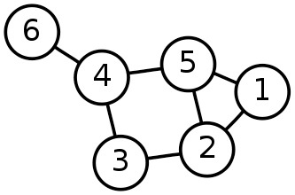
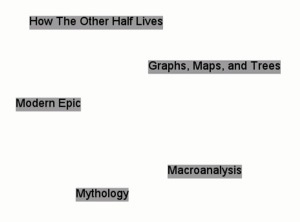
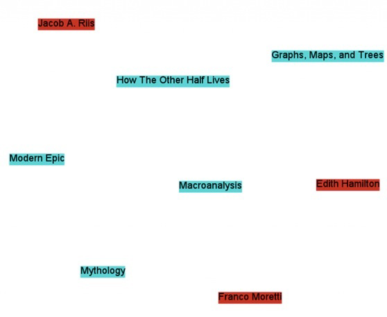
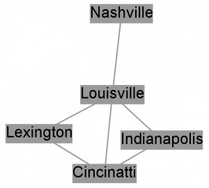
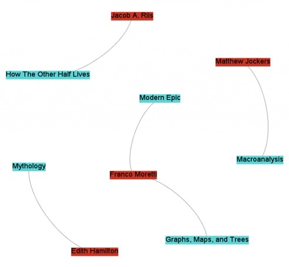
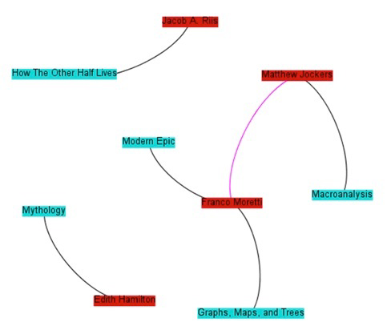
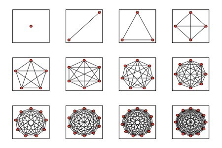
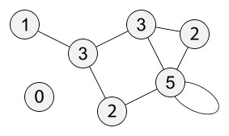
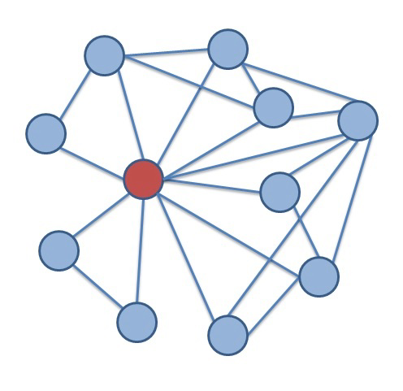

# Demystifying Networks, Parts I & II

## Part 1 of *n*: An Introduction

This piece builds on a [bunch](#) [of](#) [my](#) [recent](#) [blog posts](#) that have mentioned networks. [Elijah Meeks](#) already has prepared a good introduction to [network visualizations on his own blog](#), so I cover more of the conceptual issues here, hoping to reach people with little-to-no background in networks or math, and specifically to digital humanists interested in applying network analysis to their own work.

### Some Warnings

A network is a fantastic tool in the digital humanist's toolbox—one of many—and it's no exaggeration to say pretty much *any* data can be studied via network analysis. With enough stretching and molding, you too could have a network analysis problem! As with many other science-derived methodologies, it's fairly easy to extend the metaphor of network analysis into any number of domains.

The danger here is two-fold.

1. [When you're given your first hammer, everything looks like a nail](#). Networks *can* be used on any project. Networks *should* be used on far fewer. Networks in the humanities are experiencing quite the awakening, and this is due in part to the until-recently untapped resources of easy tools and available datasets. There is a lot of low-hanging fruit out there on the networks+humanities tree, and they ought to be plucked by those brave and willing enough to do so. However, that does not give us an excuse to apply networks to *everything*. This series will talk a little bit about when hammers are useful, and when you really should be reaching for a screwdriver.

2. Methodology appropriation is *dangerous*. Even when the people designing a methodology for some specific purpose get it right—and they rarely do—there is often a score of theoretical and philosophical caveats that get lost when the methodology gets translated. In the more frequent case, when those caveats are not known to begin with, "borrowing" the methodology becomes even more dangerous. Ted Underwood [blogs a great example of why literary historians ought to skip a major step in Latent Semantic Analysis](#), because the purpose of the literary historian is *so very different* from that of the computer scientist who designed the algorithm. This series will attempt to point out some of the theoretical baggage and necessary assumptions of the various network methods it covers.

### The Basics

Nothing worth discovering has ever been found in safe waters. Or rather, everything worth discovering in safe waters *has already been discovered*, so it's time to shove off into the dangerous waters of methodology appropriation, cognizant of the warnings but not crippled by them.

<!-- page 1 -->

Anyone with a lot of time and a vicious interest in networks should stop reading *right now*, and instead pick up copies of [Networks, Crowds, and Markets](#)[^1] and [Networks: An Introduction](#)[^2]. The first is a non-mathy introduction to most of the concepts of network analysis, and the second is a more in-depth (and formula-laden) exploration of those concepts. They're phenomenal, essential, and worth every penny.

Those of you with slightly less time, but somehow enough to read my rambling blog (there are apparently a few of you out there), so good of you to join me. We'll start with the *really basic* basics, but stay with me, because by part *n* of this series, we'll be going over the really cool stuff only ninjas, Gandhi, and The Rolling Stones have worked on.

#### Networks

The word "network" originally meant just that: ["a net-like arrangement of threads, wires, etc."](#) It later came to stand for any complex, interlocking system. **Stuff** and **relationships**.

Generally, network studies are made under the assumption that neither the stuff nor the relationships are the whole story on their own. If you're studying something with networks, odds are you're doing so because you think the objects of your study are *interdependent* rather than *independent*. Representing information as a network implicitly suggests not only that connections matter, but that they are *required* to understand whatever's going on.

Oh, I should mention that people often use the word "graph" when talking about networks. It's basically the mathy term for a network, and its definition is a bit more formalized and concrete. Think dots connected with lines.

Because networks are studied by lots of different groups, there are lots of different words for pretty much the same concepts. I'll explain some of them below.

#### The Stuff

Stuff (presumably) exists. Eggplants, true love, the *Mary Celeste*, tall people, and Terry Pratchett's *Thief of Time* all fall in that category. Network analysis generally deals with one or a small handful of *types* of stuff, and then a multitude of examples of that type.

Say the *type* we're dealing with is a book. While scholars might argue the exact lines of demarcation separating book from non-book, I think we can all agree that most of the stuff on my bookshelf are, in fact, books. They're the *stuff*. There are different examples of books: a quotation dictionary, a Poe collection, and so forth.

I'll call this assortment of stuff *nodes*. You'll also hear them called *vertices* (mostly from the mathematicians and computer scientists), *actors* (from the sociologists), *agents* (from the modelers), or *points* (not really sure where this one comes from).

*A simple-network representation from Wikipedia.org*

<!-- page 2 -->

The *type* of stuff corresponds to the *type* of node. The individual examples are the nodes themselves. All of the nodes are books, and each book is a different node.

Nodes can have attributes. Each node, for example, may include the title, the number of pages, and the year of publication.

A list of nodes could look like this:

| Title                    | # of pages | year of publication |
| ------------------------ | ---------- | ------------------- |
| Graphs, Maps, and Trees  | 119        | 2005                |
| How The Other Half Lives | 233        | 1890                |
| Modern Epic              | 272        | 1995                |
| Mythology                | 352        | 1942                |
| Macroanalysis            | unknown    | 2011                |

We can get a bit more complicated and add more node *types* to the network. Authors, for example. Now we've got a network with books and authors (but nothing linking them, yet!). *Franco Moretti* and *Graphs, Maps, and Trees* are both nodes, although they are of different varieties, and not yet connected. We could have a second list of nodes, part of the same network, that might look like this:

| Author          | Birth | Death |
| --------------- | ----- | ----- |
| Franco Moretti  | ?     | n/a   |
| Jacob A. Riis   | 1849  | 1914  |
| Edith Hamilton  | 1867  | 1963  |
| Matthew Jockers | ?     | n/a   |

*A network of books (nodes) with no relationships (connections)*

*A network of books and authors without relationships*

<!-- page 3 -->

A network with two types of nodes is called *2-mode*, *bimodal*, or *bipartite*. We can add more, making it *multimodal*. Publishers, topics, you-name-it. We can even add seemingly unrelated node-types, like academic conferences, or colors of the rainbow. The list goes on. We would have a new list for each new variety of node.

Presumably we could continue adding nodes and node-types until we run out of stuff in the universe. This would be a bad idea, and not just because it would take more time, energy, and hard-drives than could ever possibly exist. As it stands now, network science is ill-equipped to deal with multimodal networks. 2-mode networks are difficult enough to work with, but once you get to three or more varieties of nodes, most algorithms used in network analysis *simply do not work*. It's not that they *can't* work; it's just that most algorithms were only created to deal with networks with one variety of node. This is a trap I see many newcomers to network science falling into, especially in the digital humanities. They find themselves with a network dataset of, for example, authors and publishers. Each author is connected with one or several publishers (we'll get into the connections themselves in the next section), and the up-and-coming network scientist loads the network into their favorite software and visualizes it. Woah! A network! Then, because the software is easy to use, and has a lot of buttons with words that from a non-technical standpoint seem to make a lot of sense, they press those buttons to see what comes out. Then, they change the visual characteristics of the network based on the buttons they've pressed. Let's take a concrete example. Popular network software [Gephi](#) comes with a button that measures the *centrality* of nodes. Centrality is a pretty complicated concept that I'll get into more detail later, but for now it's enough to say that it does exactly what it sounds like: it finds how central, or important, each node is in a network. The newcomer to network analysis loads the author-publisher network into Gephi, finds the centrality of every node, and then makes the nodes bigger that have the highest centrality. The issue here is that, although the network loads into Gephi perfectly fine, and although the centrality algorithm runs smoothly, the resulting numbers *do not mean what they usually mean*. Centrality, as it exists in Gephi, was fine-tuned to be used with single mode networks, whereas the author-publisher network (not to mention the author-book network above) is bimodal. Centrality measures have been made for bimodal networks, but those algorithms are not included with Gephi. Most computer scientists working with networks do so with only one or a few types of nodes. Humanities scholars, on the other hand, are often dealing with the interactions of *many* types of things, and so the algorithms developed for traditional network studies are insufficient for the networks we often have. There are ways of fitting their algorithms to our networks, or vice-versa, but that requires fairly robust technical knowledge of the task at hand. Besides dealing with the single mode / multimodal issue, humanists also must struggle with fitting square pegs in round holes. Humanistic data are almost by definition uncertain, open to interpretation, flexible, and not easily definable. Node types are by definition concrete; your object either *is* or *is not* a book. Every book-type thing must share certain unchanging characteristics. This *reduction of data* comes at a price, one that some argue traditionally divided the humanities and social sciences. If humanists care more about the differences than the regularities, more about what makes an object unique rather than what makes it similar, that is the very information they are likely to lose by defining their objects as nodes. This is not to say it cannot be done, or even that it has not! People are clever, and network science is more flexible than some give it credit for. The important thing is either to be aware of what you are losing when you reduce your objects to one or a few types of nodes, or to change the methods of network science to fit your more complex data.

<!-- page 4 -->

#### The Relationships

Relationships (presumably) exist. Friendships, similarities, web links, authorships, and wires all fall into this category. Network analysis generally deals with one or a small handful of *types* of relationships, and then a multitude of examples of that type. Now that we have *stuff* and *relationships*, we're equipped to represent everything needed for a simple network. Let's start with a single mode network; that is, a network with only one sort of node: cities. We can create a network of which cities are connected to one another by at least one single stretch of highway, like the one below:

| City         | is connected to |
| ------------ | --------------- |
| Indianapolis | Louisville      |
| Louisville   | Cincinnati      |
| Cincinatti   | Indianapolis    |
| Cincinatti   | Lexington       |
| Louisville   | Lexington       |
| Louisville   | Nashville       |

The simple network above shows how certain cities are connected to one another via highways. A connection via a highways is the *type* of relationship. An example of one of the above relationships can be stated "Louisville *is connected via a highway to* Indianapolis." These connections are *symmetric* because a connection from Louisville to Indianapolis also implies a connection in the reverse direction, from Indianapolis to Louisville. More on that shortly. First, let's go back to the example of books and authors from the last section. Say the *type* we're dealing with is an authorship. Books (the *stuff*) and authors (another kind of *stuff*) are connected to one-another via the authorship relationship, which is formalized in the phrase "X is an author of Y." The individual relationships themselves are of the form "Franco Moretti is an author of *Graphs, Maps, and Trees*." Much like the stuff (nodes), relationships enjoy a multitude of names. I'll call them *edges*. You'll also hear them called *arcs*, *links*, *ties*, and *relations*. For simplicity sake, although *edges* are often used to describe only one variety of relationship, I'll use it for pretty much everything and just add qualifiers when discussing specific types. The *type* of relationship corresponds to the *type* of edge. The individual examples are the edges themselves. Individual edges are defined, in part, by the nodes that they connect. A list of edges could look like this:

| Person          | Is an author of          |
| --------------- | ------------------------ |
| Franco Moretti  | Modern Epic              |
| Franco Moretti  | Graphs, Maps, and Trees  |
| Jacob A. Riis   | How The Other Half Lives |
| Edith Hamilton  | Mythology                |
| Matthew Jockers | Macroanalysis            |

*Cities interconnected by highways*

<!-- page 5 -->

Notice how, in this scheme, edges can only link two different types of nodes. That is, a person can be an author of a book, but a book cannot be an author of a book, nor can a person an author of a person. For a network to be truly bimodal, it *must* be of this form. Edges can go between types, but not among them. This constraint may seem artificial, and in some sense it is, but for now the short explanation is that it is a constraint required by most algorithms that deal with bimodal networks. As mentioned above, algorithms are developed for specific purposes. Single mode networks are the ones with the most research done on them, but bimodal networks certainly come in a close second. They are networks with two types of nodes, and edges *only* going *between* those types. Contrast this against the single mode city-to-city network from before, where edges connected nodes of the same type. Of course, the world humanists care to model is often a good deal more complicated than that, and not only does it have multiple varieties of nodes – it also has multiple varieties of edges. Perhaps, in addition to "X is an author of Y" type relationships, we also want to include "A collaborates with B" type relationships. Because edges, like nodes, can have attributes, an edge list combining both might look like this.

| Node1           | Node 2                   | Edge Type         |
| --------------- | ------------------------ | ----------------- |
| Franco Moretti  | Modern Epic              | is an author of   |
| Franco Moretti  | Graphs, Maps, and Trees  | is an author of   |
| Jacob A. Riis   | How The Other Half Lives | is an author of   |
| Edith Hamilton  | Mythology                | is an author of   |
| Matthew Jockers | Macroanalysis            | is an author of   |
| Matthew Jockers | Franco Moretti           | collaborates with |

Notice that there are now two types of edges: "is an author of" and "collaborates with." Not only are they two different types of edges; they act in two *fundamentally different ways*. "X is an author of Y" is an asymmetric relationship; that is, you cannot switch out Node1 for Node2. You cannot say "Modern Epic is an author of Franco Moretti." We call this type of relationship a *directed edge*, and we generally represent that visually using an arrow going from one node to another.

"A collaborates with B," on the other hand, is a symmetric relationship. We can switch out "Matthew Jockers collaborates with Franco Moretti" with "Franco Moretti collaborates with Matthew Jockers," and the information represented would be exactly the same. This is called an *undirected edge*, and is usually represented visually by a simple line

*Network of books, authors, and relationships between them*

<!-- page 6 -->

connecting two nodes. Notice that this is an edge connecting two nodes of the same type (an author-to-author connection), and recall that true bimodal networks require edges to only go *between* types. Algorithms meant for bimodal networks no longer apply to the network above.

Most network algorithms and visualizations break down when combining these two flavors of edges. Some algorithms were designed for directed edges, like [Google's PageRank](#), whereas other algorithms are designed for undirected edges, like many centrality measures. Combining both types is rarely a good idea. Some algorithms will still run when the two are combined, however the results usually make little sense.

Both directed and undirected edges can also be weighted. For example, I can try to make a network of books, with those books that are similar to one another sharing an edge between them. The more similar they are, the heavier the weight of that edge. I can say that every book is similar to every other on a scale from 1 to 100, and compare them by whether they use the same words. Two dictionaries would probably connect to one another with an edge weight of 95 or so, whereas *Graphs, Maps, and Trees* would probably share an edge of weight 5 with *How The Other Half Lives*. This is often visually represented by the thickness of the line connecting two nodes, although sometimes it is represented as color or length.

It's also worth pointing out the difference between explicit and inferred edges. If we're talking about computers connected on a network via wires, the edges connecting each computer *actually exist*. We can weight them by wire length, and that length, too, *actually exists*. Similarly, citation linkages, neighbor relationships, and phone calls are explicit edges.

We can begin to move into interpretation when we begin creating edges between books based on similarity (even when using something like word comparisons). The edges are a layer of interpretation not intrinsic in the objects themselves. The humanist might argue that all edges are intrinsic all the way down, or inferred all the way up, but in either case there is a difference in kind between two computers connected via wires, and two books connected because we feel they share similar topics.

As such, algorithms made to work on one may not work on the other; or perhaps they may, but their interpretative framework must change

*Network of authors, books, authorship relationships, and collaboration relationships*

<!-- page 7 -->

drastically. A very central computer might be one in which, if removed, the computers will no longer be able to interact with one another; a very central book may be something else entirely.

As with nodes, edges come with many theoretical shortcomings for the humanist. Really, everything is probably related to everything else in its [light cone](#). If we've managed to make everything in the world a node, realistically we'd also have some sort of edge between pretty much everything, with a lesser or greater weight. A network of nodes where almost everything is connected to almost everything else is called *dense*, and dense networks are rarely useful. Most network algorithms (especially ones that detect communities of nodes) work better and faster when the network is *sparse*, when most nodes are only connected to a small percentage of other nodes.

To make our network sparse, we often must artificially cut off which edges to use, especially with humanistic and inferred data. That's what [Shawn Graham showed us how to do when combining topic models with networks](#). The network was one of authors and topics; which authors wrote about which topics? The data itself connected every author to every topic to a greater or lesser degree, but such a dense network would not be very useful, so Shawn limited the edges to the *highest weighted* connections between an author and a topic. The resulting network looked like [this](#) (PDF), when it otherwise would have looked like a big ball of spaghetti and meatballs.

Unfortunately, given that humanistic data are often uncertain and biased to begin with, every arbitrary act of data-cutting has the potential to add further uncertainty and bias to a point where the network no longer provides meaningful results. The ability to cut away just enough data to make the network manageable, but not enough to lose information, is as much an art as it is a science.

#### Hypergraphs & Multigraphs

Mathematicians and computer scientists have actually formalized more complex varieties of networks, and they call them [hypergraphs](#) and [multigraphs](#). Because humanities data are often so rich and complex, it may be more appropriate to represent them using these representations. Unfortunately, although ample research has been done on both, most out-of-the-box tools support neither. We have to build them for ourselves.

A hypergraph is one in which more than two nodes can be connected by one edge. A simple example would be an "is a sibling of" relationship, where the edge connected three sisters rather than two. This is a symmetric, undirected edge, but perhaps there can be directed

*Maximally dense networks from sagemath.org*

<!-- page 8 -->

edges as well, of the type "Alex *convinced* Betty *to run away from* Carl." A three-part edge.

A multigraph is one in which multiple edges can connect any two nodes. We can have, for example, a transportation graph between cities. A edge exists for every transportation route. Realistically, many routes can exist between any two cities: some by plane, several different highways, trains, etc.

I imagine both of these representations will be important for humanists going forward, but rather than relying on that computer scientist who keeps hanging out in the history department, we ourselves will have to develop algorithms that accurately capture exactly what it is we are looking for. We have a different set of problems, and though the solutions may be similar, they must be adapted to our needs.

#### Side note: RDF Triples

Digital humanities loves [RDF](#) (Resource Description Framework), which is essentially a method of storing and embedding structured data. RDF basically works using something called a *triple*; a subject, a predicate, and an object. "Moretti is an author of *Graphs, Maps, and Trees*" is an example of a triple, where "Moretti" is the subject, "is an author of" is the predicate, and "*Graphs, Maps, and Trees*" is the object. As such, nearly all RDF documents can be represented as a directed network. Whether that representation would actually be useful depends on the situation.

#### Side note: Perspectives

Context is key, especially in the humanities. One thing the last few decades has taught us is that perspectives are essential, and any model of humanity that does not take into account its multifaceted nature is doomed to be forever incomplete. According to Alex, his friends Betty and Carl are best friends. According to Carl, he can't actually stand Betty. The structure and nature of a network might change depending on the perspective of a particular node, and I know of no model that captures this complexity. If you're familiar with something that might capture this, or are working on it yourself, please let me know via e-mail.

#### Networks, Revisited

This piece has discussed the simplest units of networks: the stuff and the relationships that connect them. Any network analysis approach must subscribe to and live with that duality of objects. Humanists face problems from the outset: data that do not fit neatly into one category or the other, complex situations that ought not be reduced, and methods that were developed with different purposes in mind. However, network analysis remains a viable methodology for answering and raising humanistic questions—we simply must be cautious, and must be willing to get our hands dirty editing the algorithms to suit our needs.

## Part II: Node Degree: An Introduction

In Part II, I will cover the deceptively simple concept of *node degree*. I say "deceptive" because, on the one hand, network degree can tell you quite a lot. On the other hand, degree can often lead one astray, especially as networks become larger and more complicated.

A node's *degree* is, simply, how many edges it is connected to. Generally, this also correlates to how many *neighbors* a node has, where a node's neighborhood is those other nodes connected directly

<!-- page 9 -->

to it by an edge. In the network below, each node is labeled by its degree.

If you take a minute to study the network, something might strike you as odd. The bottom-right node, with degree 5, is connected to only four distinct edges, and really only three other nodes (four, including itself). *Self-loops*, which will be discussed later, are counted twice. A self-loop is any edge which starts and ends at the same node.

*Why* are self-loops counted twice? Well, as a rule of thumb you can say that, since the degree is the number of times the node is connected to an edge, and a self-loop connects to a node twice, that's the reason. There are some more math-y reasons dealing with matrix representation, another topic for a later date. Suffice it to say that many network algorithms will not work well if self-loops are only counted once.

The odd node out on the bottom left, with degree zero, is called an *isolate*. An isolate is any node with no edges.

At any rate, the concept is clearly simple enough. Count the number of times a node is connected to an edge, get the degree. If only getting higher education degrees were this easy.

### Centrality

Node degree is occasionally called *degree centrality*. [Centrality](#) is generally used to determine how important nodes are in a network, and lots of clever researchers have come up with lots of clever ways to measure it. "Importance" can mean a lot of things. In social networks, centrality can be the amount of influence or power someone has; in the U.S. electrical grid network, centrality might mean which power station should be removed to cause the most damage to the network.

The simplest way of measuring node importance is to just look at its degree. This centrality measurement at once seems deeply intuitive and extremely silly. If we're looking at the social network of [Facebook](#), with every person a node connected by an edge to their friends, it's no surprise that the most well-connected person is probably also the most powerful and influential in the social space. On the same token, though, degree centrality is such a coarse-grained measurement that it's really anybody's guess what *exactly* it's measuring. It could mean someone has a lot of power; it could also mean that someone tried to become friends with absolutely everybody on Facebook. Recall the example of a city-to-city network from Part I of this series: Louisville was the most central city because you have to drive through it to get to the most others.

### Degree Centrality Sampling Warnings

Degree works best as a measure of network centrality when you have *full knowledge* of the network. That is, a social network exists, and instead of getting some glimpse of it and analyzing just that, you

*Each node in the network is labeled with its degree, from Wikipedia.org*

<!-- page 10 -->

have the entire context of the social network: all the friends, all the friends of friends, and so forth.

When you have an *ego-network* (a network of one person, like a list of all my friends and who among them are friends with one another), clearly the node with the highest centrality is the ego node itself. This knowledge tells you very little about whether that ego is actually central within the larger network, because you sampled the network *such that the ego is necessarily the most central*. Sampling strategies—how you pick which nodes and edges to collect—can fundamentally affect centrality scores. The city-to-city network from Part I has Louisville as the most central city, however a simple look at a map of the United Staes would show that, given more data, this would no longer be the case.

A historian of science might generate a correspondence network from early modern letters currently held in Oxford's library. In fact, this is currently happening, and the resulting resource will be invaluable. Unfortunately, centrality scores generated from nodes in that early modern letter writing network will more accurately reflect the whims of Oxford editors and collectors over the years, rather than the underlying correspondence network itself. Oxford scholars over the years selected certain collections of letters, be they from Great People or sent to or from Oxford, and that choice of what to hold at Oxford libraries will bias centrality scores toward Oxford-based scholars, Great People, and whatever else was selected for.

Similarly, the generation of a social network from a literary work will bias the recurring characters; characters that occur more frequently are simply statistically more likely to appear with more people, and as such will have the highest degrees. It is likely that the degree centrality and frequency of character occurrence are almost exactly correlated.

Of course, if what you're looking for is *the most central character in the novel* or *the most central figure from Oxford's perspective*, this measurement might be perfectly sufficient. The important thing is to be aware of the limitations of degree centrality, and the possible biasing effects from selection and sampling. Once those biases are explicit, careful and useful inferences can still be drawn.

Things get a bit more complicated when looking at document similarity networks. If you've got a network of books with edges connecting them based on whether they share similar topics or keywords, your degree centrality score will mean something *very different*. In this case, centrality could mean the most general book. Keep in mind that book length might affect these measurements as well; the longer a book is, the more likely (by chance alone) it will cover more topics. Thus, longer

*An ego network from Wikipedia.org*

<!-- page 11 -->

books may also appear to be more central, if one is not careful in generating the network.

### Degree Centrality in Bimodal Networks

Recall that bimodal networks are ones where there are two different types of nodes (e.g., articles and authors), and edges are relationships that bridge those types (e.g., authorships). In this example, the more articles an author has published, the more central she is. Degree centrality would have nothing to do, in this case, with the number of co-authorships, the position in the social network, etc.

With an even more multimodal network, having many types of nodes, degree centrality becomes even less well defined. As the sorts of things a node can connect to increases, the utility of simply counting the number of connections a node has decreases.

### Micro vs. Macro

Looking at the degree of an individual node, and comparing it against others in the network, is useful for finding out about the relative position of that node within the network. Looking at the degree *of every node at once* turns out to be exceptionally useful for talking about the network as a whole, and comparing it to others. I'll leave a thorough discussion of degree distributions for a later post, but it's worth mentioning them in brief here. The degree distribution shows how many nodes have how many edges.

As it happens, many real world networks exhibit something called "power-law properties" in their degree distributions. What this essentially means is that a small number of nodes have an exceptionally high degree, whereas most nodes have very low degrees. By comparing the degree distributions of two networks, it is possible to say whether they are structurally similar. There's been some fantastic work comparing the degree distribution of social networks in various plays and novels to find if they are written or structured similarly.

### Extending Degree

For the entirety of this piece, I have been talking about networks that were unweighted and undirected. Every edge counted just as much as every other, and they were all *symmetric* (a connection from A to B implies the same connection from B to A). Degree can be extended to both weighted and directed (*asymmetric*) networks with relative ease.

Combining degree with edge weights is often called *strength*. The strength of a node is the sum of the weights of its edges. For example, let's say Steve is part of a weighted social network. The first time he interacts with someone, an edge is created to connect the two with a weight of 1. Every subsequent interaction incrementally increases the weight by 1, so if he's interacted with Sally four times, Samantha two times, and Salvador six times, the edge weights between them are 4, 2, and 6 respectively.

In the above example, because Steve is connected to three people, his degree is 1+1+1=**3**. Because he is connected to one of them four times, another twice, and another six times, his weight is 4+2+6=**8**.

Combining degree with directed edges is also quite simple. Instead of one degree score, every node now has two different degrees: *in-degree* and *out-degree*. The in-degree is the number of edges pointing to a node, and the out-degree is the number of edges pointing away from it. If Steve *borrowed* money from Sally, and *lent* money to Samantha and Salvador, his in-degree might be **1** and his out-degree **2**.

<!-- page 12 -->

### Powerful Degrees

The degree of a node is really very simple: more connections, higher degree. However, this simple metric accounts for quite a great deal in network science. Many algorithms that analyze both node-level properties and network-level properties are closely correlated with degree and degree distribution. This is a [pareto](#)-like effect; a great deal about a network is driven by the degree of its nodes.

While degree-based results are often intuitive, it is worth pointing out that the prime importance of degree is a direct result of the binary network representation of nodes and edges. Interactions either happen or they don't, and everything that *is* is a self-contained node or edge. Thus, how many nodes, how many edges, and which nodes have which edges will be the driving force of any network analysis. This is both a limitation and a strength; basic counts influence so much, yet they are apparently powerful enough to yield intuitive, interesting, and ultimately useful results.

---

*Originally published by Scott Weingart on [December 14, 2011](#) and [December 17, 2011](#). Revised for the* Journal of Digital Humanities *March 2012.*

I plan to continue blogging about network analysis, so if you have any requests, please feel free to get in touch with me at scbweing at indiana dot edu.

## Notes

[^1]: David Easley and Jon M. Kleinberg, *Networks, Crowds, and Markets: Reasoning About a Highly Connected World* (Cambridge: Cambridge University Press, 2010).

[^2]: Mark E. J. Newman, *Networks: An Introduction,* 1st ed (Oxford: Oxford University Press, 2010).

<!-- page 13 -->
