# **Connecting the Dots**

<!-- page 1 -->

This is the incredibly belated transcript of my [HASTAC 2015](#) keynote. Many thanks to the organizers for inviting me, and to my fellow participants for all the wonderful discussions. The [video](#) and [slides](#) are also online. You can find citations to some of the historical illustrations and many of my intellectual inspirations [here](#). What I said and what I wrote probably don’t align perfectly.

When you’re done reading this, you should read [Roopika Risam’s closing keynote](#), which connects surprisingly well with this, though we did not plan it.

If you take a second to expand and disentangle “HASTAC”, you get a name of an organization that doubles as a fairly strong claim about the world: that Humanities, Arts, Science, and Technology are separate things, that they probably aren’t currently in alliance with one another, and that they ought to form an alliance.

This intention is reinforced in the theme of this year’s conference: “**The Art and Science of Digital Humanities.**” Here again we get the four pillars: humanities, arts, science, and technology. In fact, bear with me as I read from [the CFP](#):

> *We welcome sessions that address, exemplify, and interrogate the **interdisciplinary nature** of DH work. HASTAC 2015 challenges participants to consider how the **interplay** of science, technology, social* <!-- page 2 --> *sciences, humanities, and arts are **producing** new **forms of knowledge**, disrupting older forms, **challenging or reifying power relationships**, among other possibilities.*

Here again is that implicit message: disciplines are isolated, and their interplay can somehow influence power structures. As with a lot of digital humanities and cultural studies, there’s also a hint of activism: that building intentional bridges is a beneficial activity, and we’re organizing the community of HASTAC around this goal.

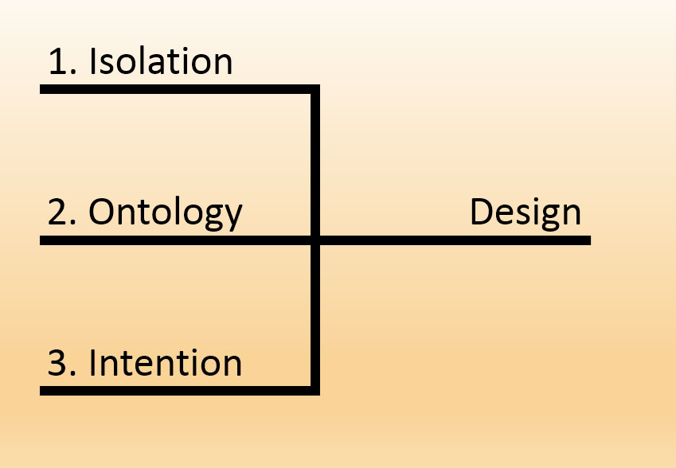

This is what I’ll be commenting on today. First, what does disciplinary **isolation** mean? I put this historically, and argue that we must frame disciplinary isolation in a rhetorical context.

This brings me to my second point about **ontology**. It turns out the way we talk about isolation is deeply related to the way we think about knowledge, the way we illustrate it, and ultimately the shape of knowledge itself. That’s **ontology**.

<!-- page 3 -->

My third point brings us back to HASTAC: that we represent an **intentional** community, and this **intent** is to build bridges which positively affect the academy and the world.

I’ll connect these three strands by arguing that we need a map to build bridges, and we need to carefully think about the ontology of knowledge to draw that map. And once we have a map, we can use it to **design** a better territory.

In short, this plenary is a call-to-action. It’s my vocal support for an intentionally improved academy, my exploration of its historical and rhetorical underpinnings, and my suggestions for affecting positive change in the future.

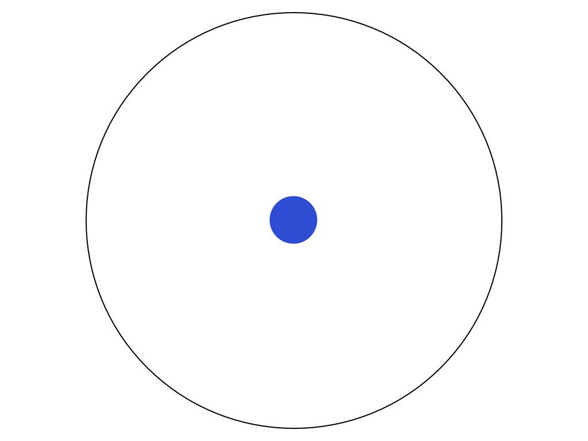

[Matt Might’s Illustrated Guide to the Ph.D.](#)

Let’s begin at the beginning. With isolation.

<!-- page 4 -->

Stop me if you’ve heard this one before:

Within this circle is the sum of all human knowledge. It’s nice, it’s enclosed, it’s bounded. It’s a comforting thought, that everything we’ve ever learned or created sits comfortably inside these boundaries.

This blue dot is you, when you’re born. It’s a beautiful baby picture. You’ve got the whole world ahead of you, an entire universe to learn, just waiting. You’re at the center because you have yet to reach your proverbial hand out in any direction and begin to *learn*.

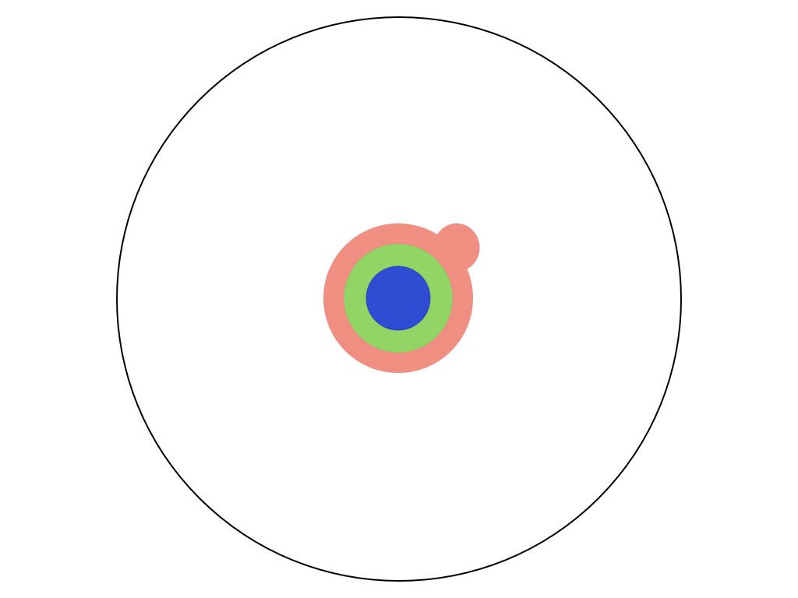

[Matt Might’s Illustrated Guide to the Ph.D.](#)

But time passes and you grow. You go to highschool, you take your liberal arts and sciences, and you slowly expand your circle into the great known. Rounding out your knowledge, as it were.

<!-- page 5 -->

Then college happens! Oh, those heady days of youth. We all remember it, when the shape of our knowledge started leaning tumorously to one side. The ill-effects of specialization and declaring a major, I suspect.

As you complete a master’s degree, your specialty pulls your knowledge inexorably towards the edge of the circle of the known. You’re not a jack of all trades anymore. You’re an *expert*.

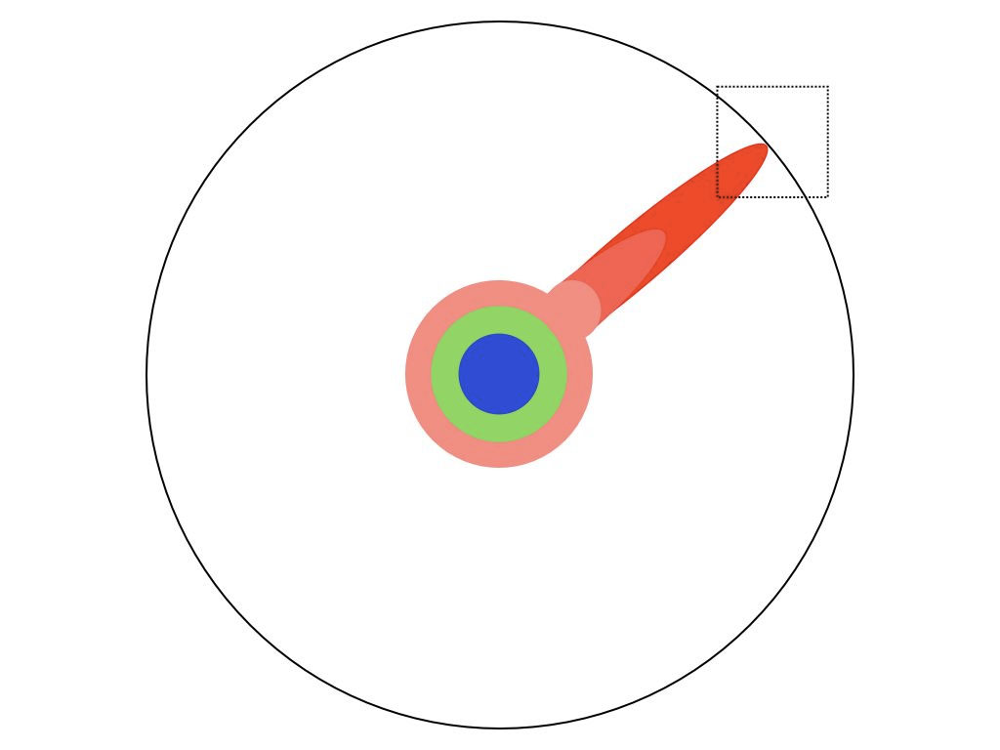

[Matt Might’s Illustrated Guide to the Ph.D.](#)

Then your PhD advisor yells at you to focus and get even smaller. So you complete your qualifying exams and reach the edge of what’s known. What lies beyond the circle? Let’s zoom in and see!

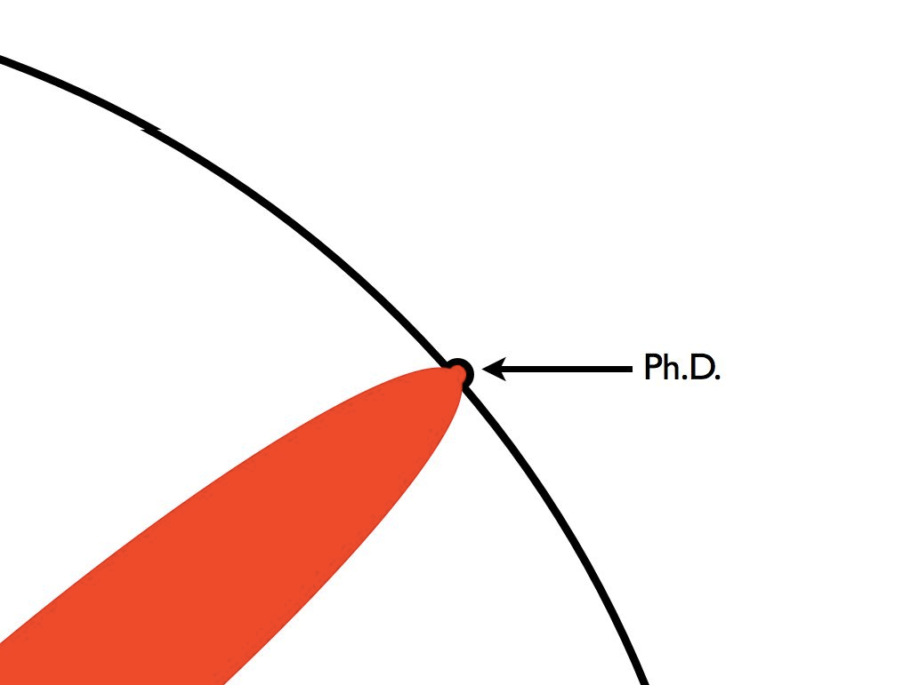

<!-- page 6 -->

[Matt Might’s Illustrated Guide to the Ph.D.](#)

You’ve reached the edge. The end of the line. The sum of all human knowledge stops here. If you want to go further, you’ll need to come up with something new. So you start writing your dissertation.

That’s your PhD. Right there, at the end of the little arrow.

You did it. Congratulations!

You now know more about less than anybody else in the world. You made a dent in the circle, you pushed human knowledge out just a tiny bit further, and all it cost you was your mental health, thirty years of your life, and the promise of a certain future. …Yay?

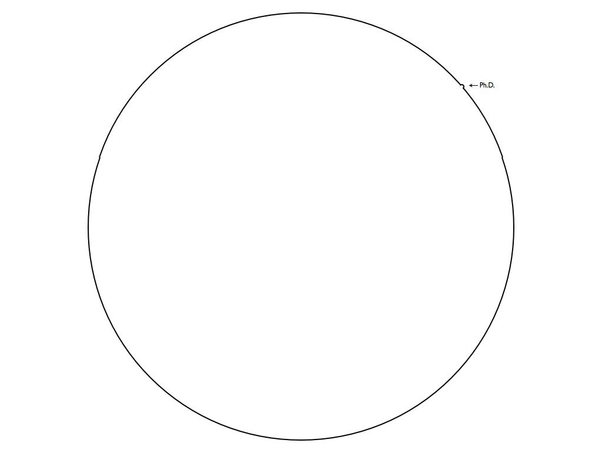

<!-- page 7 -->

[Matt Might’s Illustrated Guide to the Ph.D.](#)

So here’s the new world that you helped build, the new circle of knowledge. With everyone in this room, I bet we’ve managed to make a lot of dents. Maybe we’ve even managed to increase the circle’s radius a bit!

Now, what I just walked us all through is [Matt Might’s illustrated guide to the Ph.D](#). It made its rounds on the internet a few years back, it was pretty popular.

And, though I’m being snarky about it, it’s a pretty uplifting narrative. It provides that same dual feeling of insignificance and importance that you get when you stare at the Hubble Ultra Deep Field. You know the picture, right?

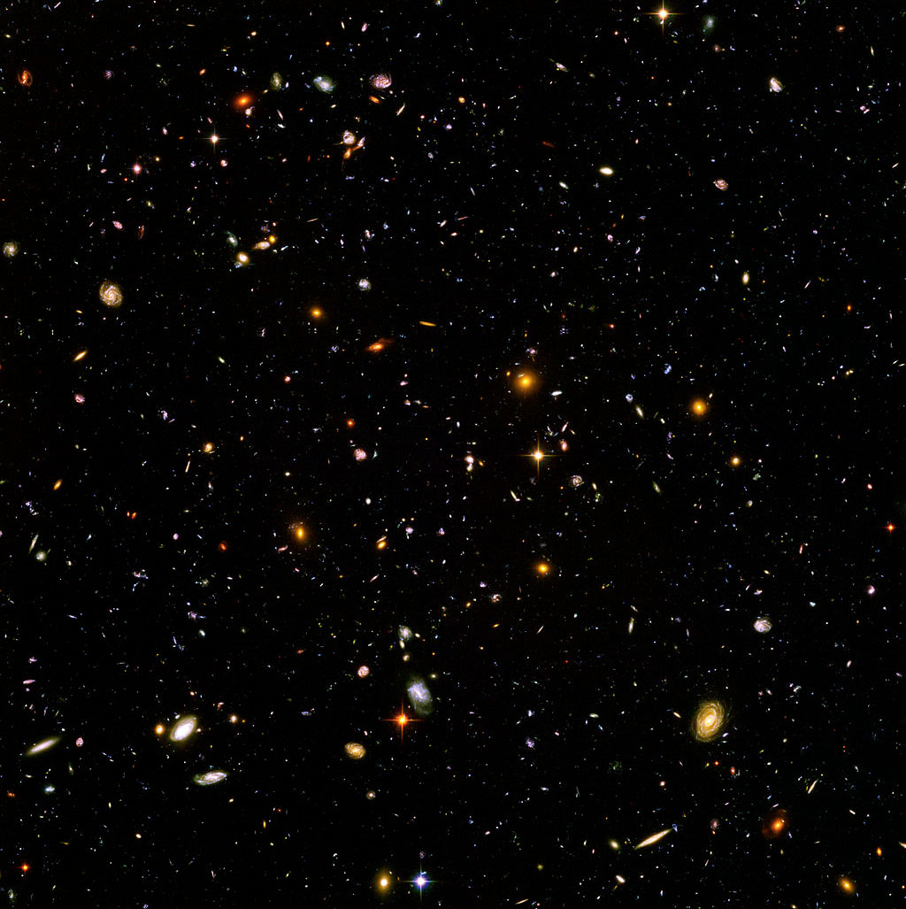

<!-- page 8 -->

[Hubble Ultra Deep Field](#)

There are 10,000 galaxies on display here, each with a hundred billion stars. To think that we, humans, from our tiny vantage point on Earth, could see so far and so much because of the clever way we shape glass lenses? That’s really cool.

And saying that every pinprick of light we see is someone else’s PhD? Well, that’s a pretty fantastic metaphor. Makes getting the PhD seem worth it, right?

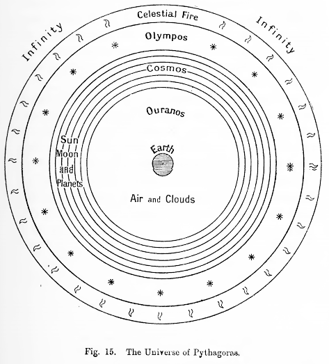

<!-- page 9 -->

Dante and the Early Astronomers; M. A. Orr (Mrs. John Evershed), 1913

It kinda reminds me of the cosmological theories of some of our philosophical ancestors.

The cosmos (Greek for “Order”), consisted of concentric, perfectly layered spheres, with us at the very center.

The cosmos was bordered by celestial fire, the light from heaven, and stars were simply pin-pricks in a dark curtain which let the heavenly light shine through.

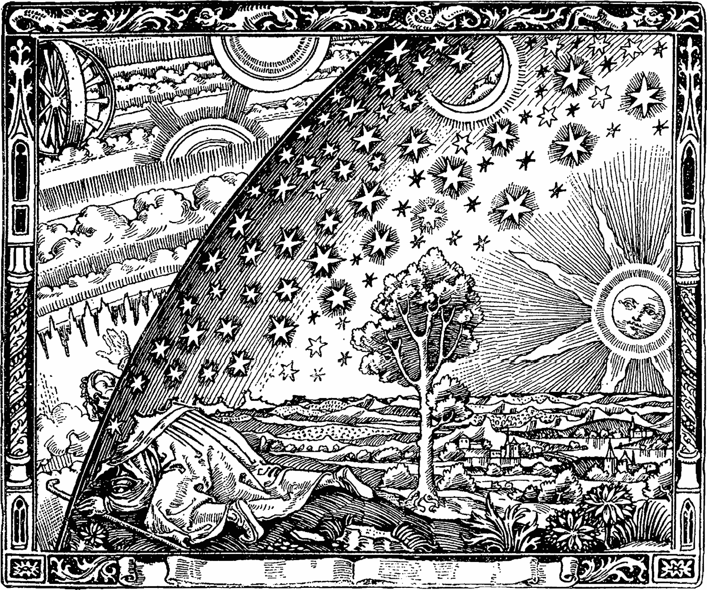

<!-- page 10 -->

[Flammarion](#)

So, if we beat Matt Might’s PhD metaphor to death, each of our dissertations are poking holes in the cosmic curtain, letting the light of heaven shine through. And that’s a beautiful thought, right? Enough pinpricks, and we’ll all be bathed in light.

[Expanding universe.](#)

But I promised we’d talk about isolation, and even if we have to destroy this metaphor to get there, we’ll get there.

<!-- page 11 -->

The universe is expanding. That circle of knowledge we’re pushing the boundaries of? It’s getting bigger too. And as it gets larger, things that were once close get further and further apart. You and I and Alpha Centauri were all neighbors for the big bang, but things have changed since then, and the star that was once our neighbor is now 5 light years away.

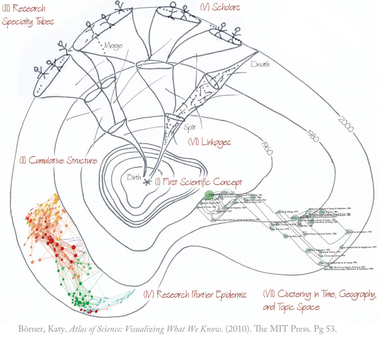

Atlas of Science, Katy Borner (2010).

In short, if we’re to take Matt Might’s PhD model as accurate, then the result of specialization is inexorable isolation. Let’s play this out.

Let’s say two thousand years ago, a white dude from Greece invented science. He wore a beard.

<!-- page 12 -->

[Note for readers: the following narrative is intentionally awful. Read on and you’ll see why.]

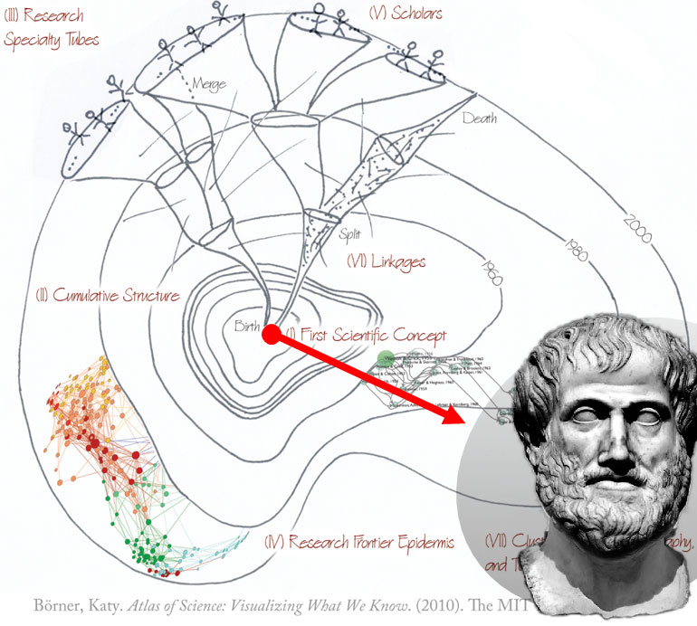

He and his bearded friends created pretty much every discipline we’re familiar with at Western universities: biology, cosmology, linguistics, philosophy, administration, NCAA football, you name it.

Over time, as Ancient Greek beards finished their dissertations, the boundaries of science expanded in every direction. But the sum of human knowledge was still pretty small back then, so one beard could write many dissertations, and didn’t have to specialize in only one direction. Polymaths still roamed the earth.

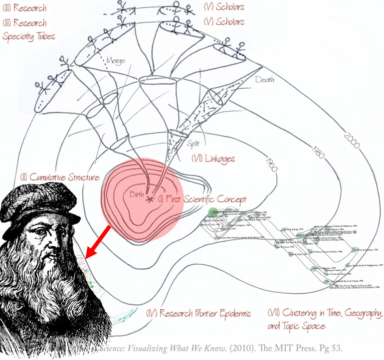

<!-- page 13 -->

Fast forward a thousand years or so. Human knowledge had expanded in the interim, and the first European universities branched into faculties: theology, law, medicine, arts.

Another few hundred years, and we’ve reached the first age of information overload. It’s barely possible to be a master of all things, and though we remember scholars and artists known for their amazing breadth, this breadth is becoming increasingly difficult to manage.

We begin to see the first published library catalogs, since the multitude of books required increasingly clever and systematic cataloging schemes. If you were to walk through Oxford in 1620, you’d see a set of newly-constructed doors with signs above them denoting their disciplinary uses: music, metaphysics, history, moral philosophy, and so on.

<!-- page 14 -->

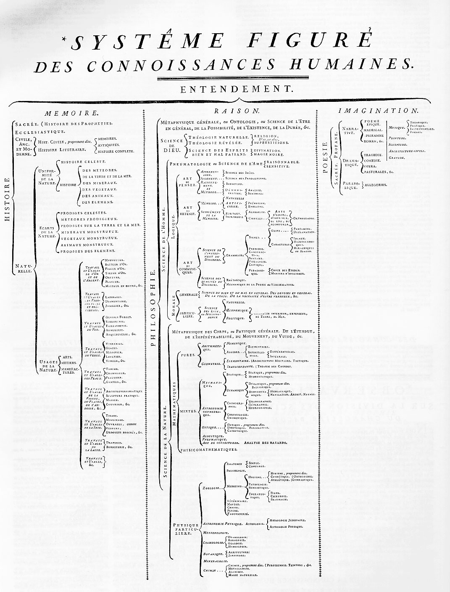

[The encyclopedia of Diderot & D’alembert](#)

Time goes on a bit further, the circle of knowledge expands, and specialization <!-- page 15 --> eventually leads to fracturing.

We’ve reached the age of these massive hierarchical disciplinary schemes, with learning branching in every direction. Our little circle has become unmanageable.

A few more centuries pass. Some German universities perfect the art of specialization, and *they* pass it along to everyone else, including the American university system.

Within another 50 years, CP Snow famously invoked the “Two Cultures” of humanities and sciences.

And suddenly here we are

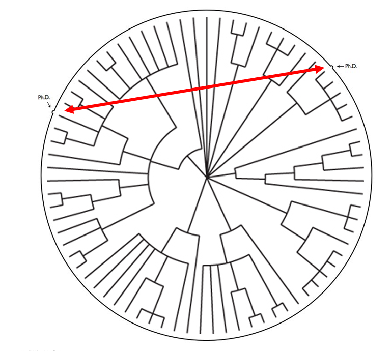

<!-- page 16 -->

On the edge of our circle, pushing outward, with every new dissertation expanding our radius, and increasing the distance to our neighbors.

Basically, the inevitable growth of knowledge results in an equally inevitable isolation. This is the culmination of super-specialization: a world where the gulf between disciplines is impossible to traverse, filled with language barriers, value differences, and intellectual incommensurabilities. You name it.

By this point, 99% of the room is probably horrified. Maybe it’s by the prospect of an increasingly isolated academy. More likely the horror’s at my racist, sexist, whiggish, Eurocentric account of the history of science, or at my absurdly reductivist and genealogical account of the growth of knowledge.

This was intentional, and I hope you’ll forgive me, because I did it to prove a point: the power of visual rhetoric in shaping our thoughts. We use the word “imagine” to describe every act of internal creation, whether or not it conforms to the root word of “image”. In classical and medieval philosophy, <!-- page 17 --> thought itself was a visual process, and complex concepts were often illustrated visually in order to help students understand and remember. *Ars memoriae*, it was called.

And in *ars memoriae*, concepts were not only given visual form, they were given *order*. This order wasn’t merely a clever memorization technique, it was a reflection on underlying truths about the relationship between concepts. In a sense, visual representations helped bridge human thought with divine structure.

This is our entrance into ontology. We’ve essentially been talking about interdisciplinarity for two thousand years, and always alongside a visual rhetoric about the shape, or ontology, of knowledge. Over the next 10 minutes, I’ll trace the interwoven histories of ontology, illustrations, and rhetoric of interdisciplinarity. This will help contextualize our current moment, and the intention behind meeting at a conference like this one. It should, I hope, also inform how we design our community going forward.

Let’s take a look some alternatives to the Matt Might PhD model.

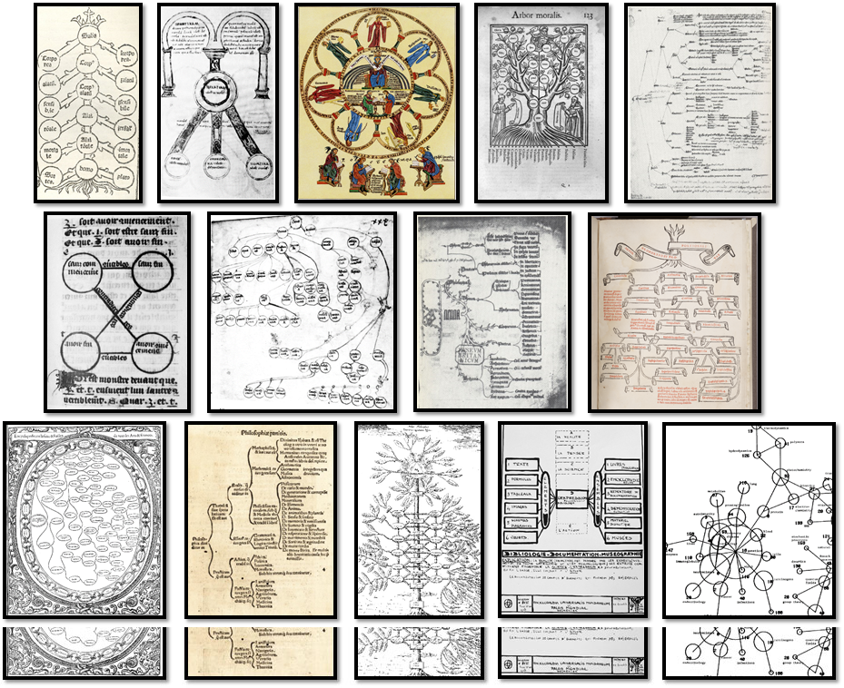

<!-- page 18 -->

Diagrams of Knowledge

Countless cultural and religious traditions associate knowledge with trees; indeed, in the Bible, the fruit of one tree is knowledge itself.

During the Roman Empire and the Middle Ages, the sturdy metaphor of trees provided a sense of lineage and order to the world that matched perfectly with the neatly structured cosmos of the time. Common figures of speech we use today like “the *root* of the problem” or “*branches* of knowledge” betray the strength with which we connected these structures to one another. Visual representations of knowledge, obviously, were also tree-like.

See, it’s impossible to differentiate the visual from the essential here. The visualization wasn’t a metaphor, it was an instantiation of essence. There are three important concepts that link knowledge to trees, which at that time were inseparable.

One: putting knowledge on a tree implied a certain genealogy of ideas. What we discovered and explored first eventually branched into more precise subdisciplines, and the history of those branches are represented on the tree. This is much like any family tree you or I would put together with our parents and grandparents and so forth. The tree literally shows the historical evolution of concepts.

Two: putting knowledge on a tree implied a specific hierarchy that would by the Enlightenment become entwined with how we understood the universe. Philosophy separates into the theoretical and the practical; basic math into geometry and arithmetic. This branching hierarchy gave an importance to the root of the tree, be that root physics or God or philosophy or man, and that importance decreased as you reached the further limbs. It also implied an order of necessity: the branches of math could not exist without the branch of philosophy it stemmed from. This is why today people still think <!-- page 19 --> things like physics is the most important discipline.

Three: As these trees were represented, there was no difference between the concept of a branch of knowledge, the branch of knowledge itself, and the object of study of that branch of knowledge. The relationship of physics to chemistry isn’t just genealogical or foundational; it’s actually transcendent. The conceptual separation of genealogy, ontology, and transcendence would not come until much later.

It took some time for the use of the branching tree as a metaphor for knowledge to take hold, competing against other visual and metaphorical representations, but once it did, it ruled victorious for centuries. The trees spread and grew until they collapsed under their own weight by the late nineteenth century, leaving a vacuum to be filled by faceted classification systems and sprawling network visualizations. The loss of a single root as the source of knowledge signaled an epistemic shift in how knowledge is understood, the implications of which are still unfolding in present-day discussions of interdisciplinarity.

By visualizing knowledge itself as a tree, our ancestors reinforced both an epistemology and a phenomenology of knowledge, ensuring that we would think of concepts as part of hierarchies and genealogies for hundreds of years. As we slowly moved away from strictly tree-based representations of knowledge in the last century, we have also moved away from the sense that knowledge forms a strict hierarchy. Instead, we now believe it to be a diffuse system of occasionally interconnected parts.

Of course, the divisions of concepts and bodies of study have no natural kind. There are many axes against which we may compare biology to literature, but even the notion of an axis of comparison implies a commonality against which the two are related which may not actually exist. Still, we’ve found the division of knowledge into subjects, disciplines, and fields a useful practice since before Aristotle. The metaphors we use for these divisions influence our understanding of knowledge itself: structured or diffuse; overlapping or separate; rooted or free; fractals or divisions; these metaphors inform <!-- page 20 --> how we think about thinking, and they lend themselves to visual representations which construct and reinforce our notions of the order of knowledge.

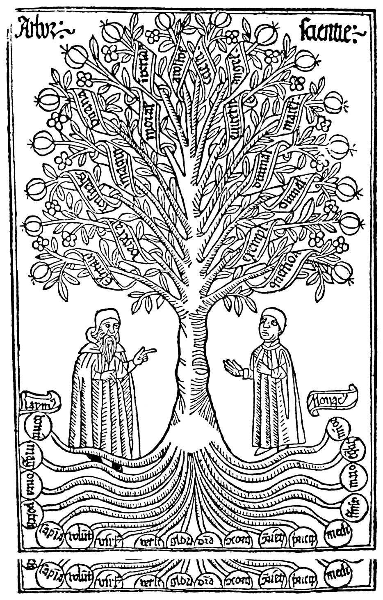

<!-- page 21 -->

Arbor Scientiae, late thirteenth century, Ramon Llull.

Given all this, it should come as no surprise that medieval knowledge was shaped like a tree – God sat at the root, and the great branching of knowledge provided a transcendental order of things. Physics, ethics, and biology branched further and further until tiny subdisciplines sat at every leaf. One important aspect of these illustrations was *unity* – they were whole and complete, and even more, they were all connected. This mirrors pretty closely that circle from Matt Might.

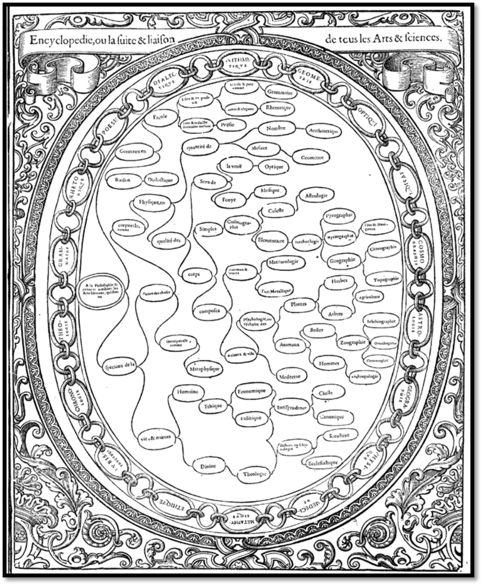

<!-- page 22 -->

Christophe de Savigny’s Tableaux: Accomplis de tous les arts liberaux, 1587

Speaking of that circle I had up earlier, many of these branching diagrams had a similar feature. Notice the circle encompassing this illustration, especially the one on the left here: it’s a chain. The chain locks the illustration down: it says, there are no more branches to grow.

This and similar illustrations were also notable for their placement. This was an index to a book, an early encyclopedia of sorts – you use the branches to help you navigate through descriptions of the branches of knowledge. How else should you organize a book of knowledge than by its natural structure?

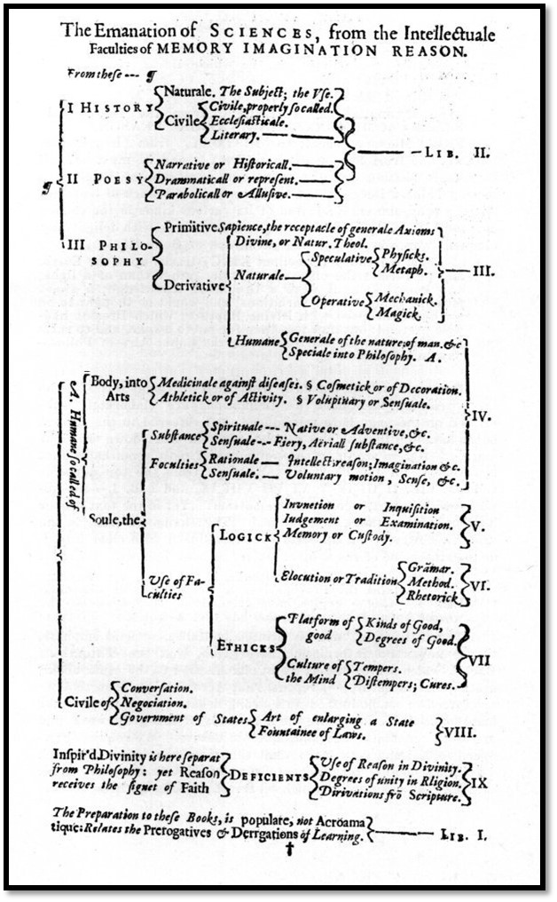

<!-- page 23 -->

Bacon’s Advancement of Learning

We start seeing some visual, rhetorical, and ontological changes by the time of Francis Bacon, who wrote “the distributions and partitions of knowledge are […] like branches of a tree that meet in a stem, which hath a dimension and quantity of entireness and continuance, before it come to discontinue and break itself into arms and boughs.”

The highly influential book broke the trends in three ways:

1. it broke the “one root” model of knowledge.

2. It shifted the system from closed to open, capable of growth and <!-- page 24 --> change

3. it detached natural knowledge from divine wisdom.

Bacon’s uprooting of knowledge, dividing it into history, poesy, and philosophy, each with its own root, was an intentional rhetorical strategy. He used it to argue that natural philosophy should be explored at *the expense* of poesy and history. Philosophy, what we now call science, was now a different kind of knowledge, worthier than the other two.

And doesn’t that feel a lot like today?

Bacon’s system also existed without an encompassing chain, embodying the idea that learning could be advanced; that the whole of knowledge could not be represented as an already-grown tree. There was no *complete* order of knowledge, because knowledge changes.

And, by being an imperfect, incomplete entity, without union, knowledge was notably separated from divine wisdom.

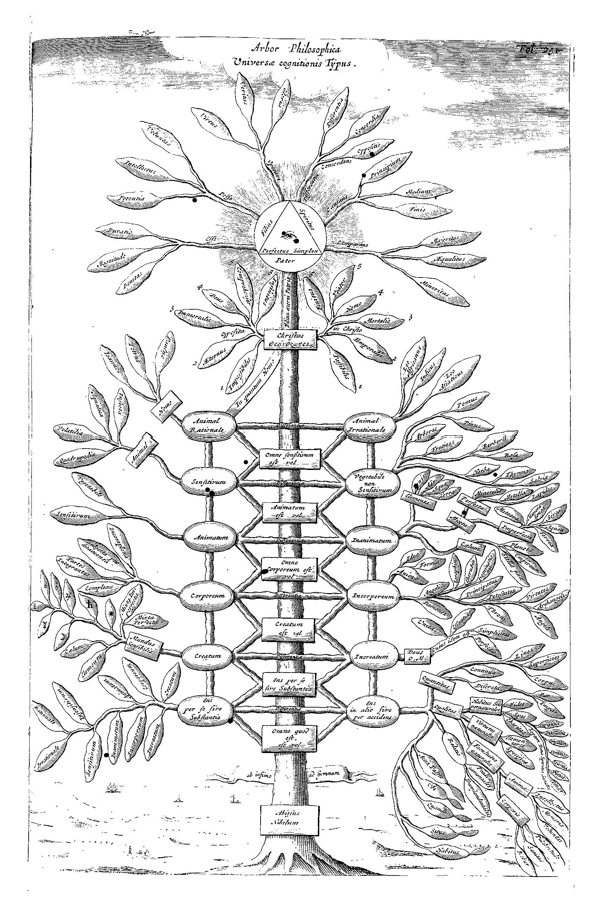

<!-- page 25 -->

Kircher’s Philosophical tree representing all branches of knowledge, from Ars Magna Sciendi (1669), p. 251.

Of course, divinity and transcendence wasn’t wholly exorcised from these ontological illustrations: Athanasius Kircher put God on the highest branch, feeding the tree’s growth. (Remember, from my earlier circle metaphor, the importance of the poking holes in the fabric of the cosmos to let the light of heaven shine through?). Descartes as well continued to describe knowledge as a tree, whose roots were reliant on divine existence.

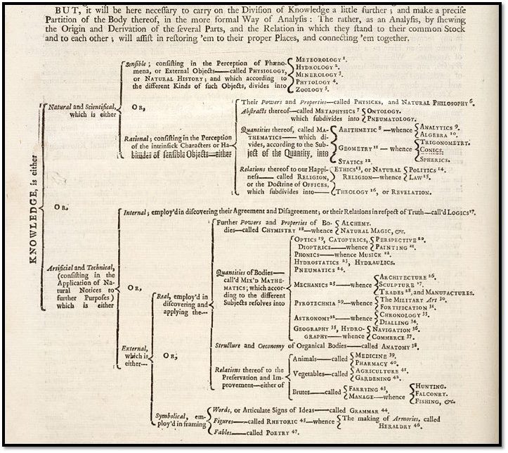

<!-- page 26 -->

Chambers’ Cyclopædia

But even without the single trunk, without God, without unity, the metaphors were still ontologically essential, even into the 18th century. This early encyclopedia by Ephraim Chambers uses the tree as an index, and Chambers writes:

“the Origin and Derivation of the several Parts, and the relation in which [the disciplines] stand to their common Stock and to each other; will assist in restoring ‘em to their *proper Places*”

Their *proper places*. This order is still *truth* with a capital T.

<!-- page 27 -->

The encyclopedia of Diderot & D’alembert

It wasn’t until the mid-18th century, with Diderot and d’Alembert’s encyclopedia, that serious thinkers started actively disputing the idea that these trees were somehow indicative of the essence of knowledge. Even they couldn’t escape using trees, however, introducing their enyclopedia by saying “We have chosen a division which has appeared to us most nearly satisfactory for the encyclopedia arrangement of our knowledge and, at the same time, for its *genealogical arrangement.*”

Even if the tree wasn’t the essence of knowledge, it still represented possible truth about the genealogy of ideas. It took until a half century later, with the <!-- page 28 --> Encyclopedia Britannica, for the editors to do away with tree illustrations entirely and write that the world was “perpetually blended in almost every branch of human knowledge”. (Notice they still use the word branch.) By now, a philosophical trend that began with Bacon was taking form through the impossibility of organizing giant libraries and encyclopedia: that there was no unity of knowledge, no implicit order, and no viable hierarchy.

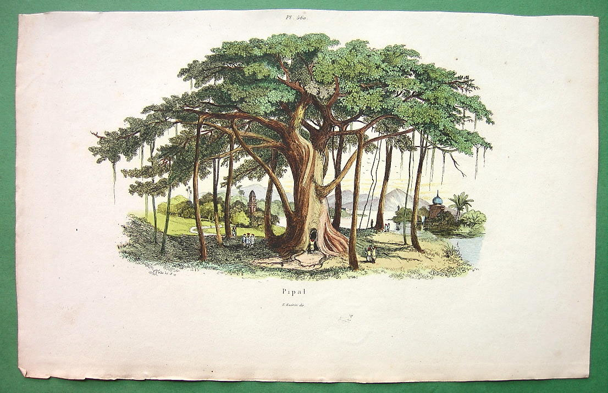

Banyan tree [[via](#)]

It took another century to find a visual metaphor to replace the branching tree. Herbert Spencer wrote that the branches of knowledge “now and again re-unite […], they severally send off and receive connecting growths; and the intercommunion is ever becoming more frequent, more intricate, more widely ramified.” Classification theorist S.R. Ranganathan compared knowledge to the Banyan tree from his home country of India, which has roots which both grow from the bottom up and the top down.

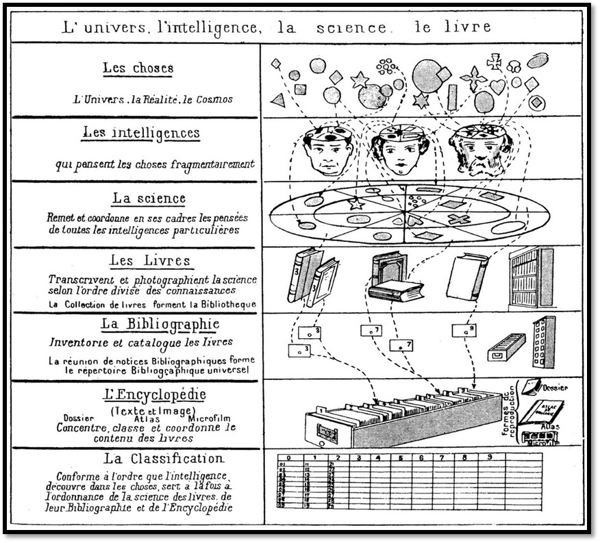

<!-- page 29 -->

Otlet 1937

The 20th century saw a wealth of new shapes of knowledge. Paul Otlet conceived a sort of universal network, connected through individual’s thought processes. H.G. Wells shaped knowledge very similar to Matt Might’s illustrated PhD from earlier: starting with a child’s experience of learning and branching out. These were both interesting developments, as they rhetorically placed the ontology of knowledge in the realm of the psychological or the social: driven by people rather than some underlying objective reality about conceptual relationships.

<!-- page 30 -->

Porter’s 1939 Map of Physics [[via](#)]

Around this time there was a flourishing of visual metaphors, to fill the vacuum left by the loss of the sturdy tree.There was, uncoincidentally, a flourishing of uses for these illustrations. Some, like this map, was educational and historical, teaching students how the history of physics split and recombined like water flowing through rivers and tributaries. Others, like the illustration to the right, showed how the conceptual relationships between knowledge domains differed from and overlapped with library classification schemes and literature finding aids.

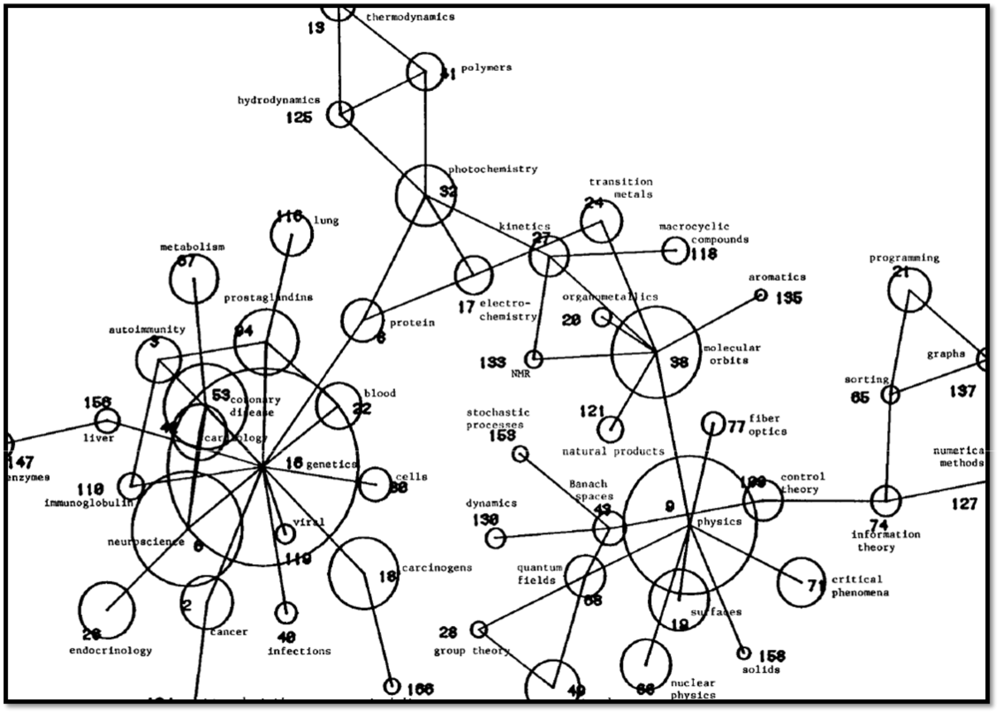

<!-- page 31 -->

Small & Garfield, 1985

By the 80s, we start seeing a slew of the illustrations we’re all familiar with: those sexy sexy network spaghetti-and-meatball graphs. We often use them to illustrate citation chains, and the relationship between academic disciplines. These graphs, so popular in the 21st century, go hand-in-hand with the ontological baggage we’re used to: that knowledge is complex, unrooted, interconnected, and co-constructed. This fits well with the current return to a concept we’d mostly left in the 19th century: that knowledge is a single, growing unit, that it’s consilient, that everyone is connected. It’s a return to the Republic of Letters from the C.P. Snow’s split of the Two Cultures.

It also notably departs from genealogical, transcendental, and even conceptual discussions of knowledge. These networks, broadly construed, are *social representations*, and while those relationships may often align with conceptual ones, concepts are not what drive the connections.

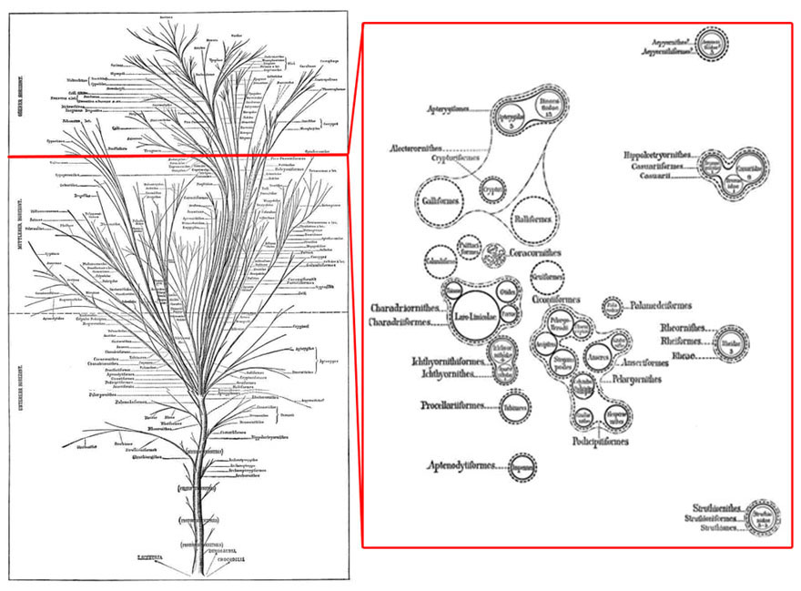

<!-- page 32 -->

Fürbringer’s Illustration of Bird Evolution, 1888

Interestingly, there is precedent in these sorts of illustrations in the history of evolutionary biology. In the late 19th-century, illustrators and scientists began asking what it would look like if you took a slice from the evolutionary tree – or, what does the tree of life look like when you’re looking at it from the top-down?

What you get is a visual structure very similar to the network diagrams we’re now used to. And often, if you probe those making the modern visualizations, they will weave a story about the history of these networks that is reminiscent of branching evolutionary trees.

There’s another set of epistemological baggage that comes along with these spaghetti-and-meatball-graphs. Ben Fry, a well-known researcher in information visualization, [wrote](#):

> *“There is a tendency when using [networks] to become smitten with one’s own data. Even though a graph of a few hundred nodes quickly becomes unreadable, it is often satisfying for the creator because the resulting figure is elegant and complex and may be subjectively beautiful, and the notion that the creator’s data is ‘complex’ fits just fine with the creator’s own interpretation of it. Graphs have a tendency of making a data set look sophisticated and important, without having solved the problem of enlightening the viewer.”*

Actually, were any of you here at last night’s Pink Floyd light show in the planetarium? They’re a lot like that. [Yes, readers, HASTAC put on a Pink <!-- page 33 --> Floyd light show.]

And this is where we are now.

Which brings us back to the outline, and HASTAC. Cathy Davidson has often described HASTAC as a social network, which is (at least on the web) always an intentionally-designed medium. Its design grants certain affordances to users: is it easier to communicate individually or in groups? What types of communities, events, or content is prioritized? These are design decisions that affect how the HASTAC community functions and interacts.

And the design decisions going into HASTAC are informed by its intent, so what is that intent? In their [groundbreaking 2004 manifesto in the Chronicle](#), Cathy Davidson and David Goldberg wrote:

> *“We believe that a new configuration in the humanities must be championed to ensure their centrality to all intellectual enterprises in the university and, more generally, to understanding the human condition* <!-- page 34 --> *and thereby improving it; and that those intellectual changes must be supported by **new institutional structures** and values.”*

This was a HASTAC rallying cry: how can the humanities constructively inform the world? Notice especially how they called for “New Institutional Structures.”

Remember earlier, how I talked about the problem if isolation? While my story about it was problematic, it doesn’t make disciplinary superspecialization any less real a problem. For all its talk of interdisciplinarity, academia is averse to synthesis on many fronts, superspecialization being just one of them. A dissertation based on synthesis, for example, is much less likely to get through a committee than a thorough single intellectual contribution to one specific field.

The academy is also weirdly averse to writing for public audiences. Popular books won’t get you tenure. But every discipline is a popular audience to most other disciplines: you wouldn’t talk to a chemist about history the same way you’d talk to a historian. Synthetic and semi-public work is exactly the sort of work that will help with HASTAC’s goal of a truly integrated and informed academy for social good, but the cards are stacked against it. Cathy and David hit the nail on the head when they target institutional structures as a critical point for improvement.

This is where design comes in.

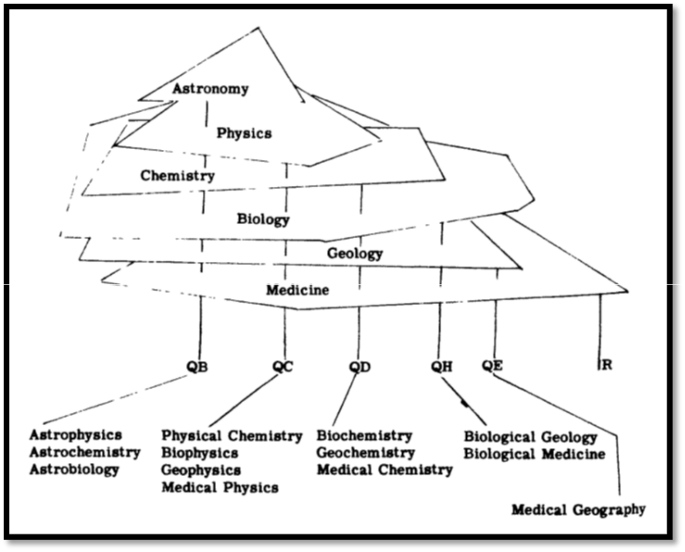

<!-- page 35 -->

Richmond, 1954

Recall again the theme this year: The **Art and Science of Digital Humanities**. I propose we take the next few days to think about how we can use art and science to make HASTAC even better at living up its intent. That is, knowing what we do about collaboration, about visual rhetoric, about the academy, how can we design an intentional community to meet its goals? Perusing the program, it looks like most of us will already be discussing exactly this, but it’s useful to put a frame around it.

When we talk about structure and the social web, there’s many great examples we may learn from. One such example is that of Tara McPherson and her colleagues, in designing the web publishing platform [Scalar](#). As opposed to WordPress, its cousin in functionality, Scalar was designed with feminist and humanist principles in mind, allowing for more expressive, non-hierarchical “pathways” through content.

When talking of institutional, social, and web-based structures, we can also take lessons history. In Early Modern Europe, the great network of information exchange known as the Republic of Letters was a shining example of the influence of media structures on innovation. Scholars would often communicate through “hubs”, which were personified in people nicknamed things like “the mailbox of Europe”. And they helped distribute new research incredibly efficiently through their vast web of social ties. These hubs were essential to what’s been called the scientific revolution, and without <!-- page 36 --> their structural role, it’s unlikely you’d see references to a scientific revolution in the 17th century Europe.

Similarly, at that time, the Atlantic slave trade was wreaking untold havoc on the world. For all the ills it caused, we at least can take some lessons from it in the intentional design of a scholarly network. There existed a rich exchange of medical knowledge between Africans and indigenous Americans that bypassed Europe entirely, taking an entirely different sort of route through early modern social networks.

If we take the present day, we see certain affordances of social networks similarly used to subvert or reconfigure power structures, as with the many revolutions in North Africa and the Middle East, or the current activist events taking place around police brutality and racism in the US. Similar tactics that piggy-back on network properties are used by governments to spread propaganda, ad agencies to spread viral videos, and so forth.

The question, then, is how we can intentionally design a community, using principles we learn from historical action, as well as modern network science, in order to subvert institutional structures in the manner raised by Cathy and David?

Certainly we also ought to take into account the research going into collaboration, teamwork, and group science. We’ve learned, for example, that teams with diverse backgrounds often come up with more creative solutions to tricky problems. We’ve learned that many small, agile groups often outperform large groups with the same amount of people, and that informal discussion outside the work-space contributes in interesting ways to productivity. Many great lessons can be found in Michael Nielsen’s book, *[Reinventing Discovery](#)*.

We can use these historical and lab-based examples to inform the design of social networks. HASTAC already work towards this goal through its scholars program, but there are more steps that may be taken, such as strategically seeking out scholars from underrepresented parts of the network.

<!-- page 37 -->

So this covers covers the science, but what about the art?

Well, I spent the entire middle half of this talk discussing how visual rhetoric is linked to ontological metaphors of knowledge. The tree metaphor of knowledge, for example, was so strongly held that it fooled Descartes into breaking his claims of mind-body dualism.

So here is where the artists in the room can also fruitfully contribute to the same goal: by literally designing a better infrastructure. Visually. Illustrations can be remarkably powerful drivers of reconceptualization, and we have the opportunity here to affect changes in the academy more broadly.

One of the great gifts of the social web, at least when it’s designed well, is its ability to let nodes on the farthest limbs of the network to still wield remarkable influence over the whole structure. This is why viral videos, kickstarter projects, and cats playing pianos can become popular without “industry backing”. And the decisions we make in creating illustrations, in fostering online interactions, in designing social interfaces, can profoundly affect the way those interactions reinforce, subvert, or sidestep power structures.

So this is my call to the room: let’s revisit the discussion about designing the community we want to live in.

Thanks very much.

<!-- page 38 -->
