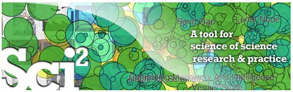

**Science of Science (Sci**2**) Tool**  
**User Manual, Version Alpha 3**

Updated 3.24.2010

**Project Investigators:** Katy Börner and Kevin W. Boyack (SciTech Strategies Inc.)

**Programmers:** Micah W. Linnemeier, Russell J. Duhon, Patrick A. Phillips, Chintan Tank, and Joseph Biberstine

**Users, Testers & Tutorial Writers:** Scott Weingart, Hanning Guo, Katy Börner

**Cyberinfrastructure for Network Science Center**  
**School of Library and Information Science**  
**Indiana University, Bloomington, IN**  
**http://cns.slis.indiana.edu**

This work is funded by the School of Library and Information Science and the Cyberinfrastructure for Network Science Center at Indiana University, the James S. McDonnell Foundation, and the National Science Foundation under Grants No. IIS‐0715303, IIS‐0534909, and IIS‐0513650. Any opinions, findings, and conclusions or recommendations expressed in this material are those of the author(s) and do not necessarily reflect the views of the National Science Foundation.

<!-- page 1 -->

# Contents

- Contents 2
- 1 Introduction 5
- 2 Getting Started 7
  - 2.1 Download, Install, Uninstall 7
  - 2.2 User Interface 8
    - 2.2.1 Menus 8
    - 2.2.2 Console 9
    - 2.2.3 Data Manager 9
    - 2.2.4 Scheduler 10
  - 2.3 Data Formats 10
  - 2.4 Saving Visualizations for Publication 11
  - 2.5 Sample Datasets 11
- 3 Algorithm and Tool Plugins 13
  - 3.1 Sci2 Tool Plugins 13
  - 3.2 Load, View, and Save Data 20
  - 3.3 Memory Allocation 20
    - 3.3.1 Windows and Linux 20
    - 3.3.2 Mac 20
  - 3.4 Memory Limits 21
- 4 Workflow Design 23
  - 4.1 Overview 23
  - 4.2 Data Acquisition and Preparation 23
    - 4.2.1 Datasets: Publications 24
    - 4.2.2 Datasets: Funding 29
    - 4.2.3 Datasets: Scholarly Database 30
  - 4.3 Database Loading and Manipulation 33
  - 4.4 Summaries and Table Extractions 33
  - 4.5 Statistical Analysis/Profiling 33
  - 4.6 Temporal Analysis (When) 33
    - 4.6.1 Burst Detection 33
    - 4.6.2 Slice Table by Time 34
  - 4.7 Geospatial Analysis (Where) 34
  - 4.8 Topical Analysis (What) 34
    - 4.8.1 Word Co‐Occurrence Network 34

<!-- page 2 -->

  - 4.9 Network Analysis (With Whom?) 35
    - 4.9.1 Network Extraction 35
    - 4.9.2 Compute Basic Network Characteristics 37
    - 4.9.3 Network Analysis 37
    - 4.9.4 Network Visualization 38
  - 4.10 Modeling (Why?) 41
    - 4.10.1 Random Graph Model 41
    - 4.10.2 Watts‐Strogatz Small World 41
    - 4.10.3 Barabási‐Albert Scale Free Model 42
- 5 Sample Workflows 44
  - 5.1 Individual Level Studies ‐ Micro 44
    - 5.1.1 Mapping Collaboration, Publication and Funding Profiles of One Researcher (EndNote and NSF Data)44
    - 5.1.2 Time Slicing of Co‐Authorship Networks (ISI Data) 47
    - 5.1.3 Funding Profiles of Three Researchers at Indiana University (NSF Data) 49
    - 5.1.4 Studying Four Major NetSci Researchers (ISI Data) 54
    - 5.1.5 Studying Four Major NetSci Researchers (ISI Data) using Database 61
  - 5.2 Institution Level Studies ‐ Meso 65
    - 5.2.1 Funding Profiles of Three Universities (NSF Data) 65
    - 5.2.2 Funding Profiles of Three Universities (NSF Data) Using Database 68
    - 5.2.3 Mapping CTSA Centers (NIH RePORTER Data) 69
    - 5.2.4 Biomedical Funding Profile of NSF (NSF Data) 71
    - 5.2.5 Mapping Scientometrics (ISI Data) 73
    - 5.2.6 Burst Detection in *Scientometrics* (ISI Data) 74
    - 5.2.7 Mapping the Field of RNAi Research (SDB Data) 77
  - 5.3 Global Level Studies – Macro 82
    - 5.3.1 Geo USPTO (SDB Data) 82
- 6 Sample Science Studies & Online Services 86
  - 6.1 Science Dynamics 86
    - 6.1.1 Mapping Topics and Topic Bursts in PNAS (2004) 86
  - 6.2 Local Impact‐Output / ROI Studies 87
    - 6.2.1 Indicator‐Assisted Evaluation and Funding of Research: Visualizing the Influence of Grants on the Number and Citation Counts of Research Papers (2003) 87
    - 6.2.2 Mapping Transdisciplinary Tobacco Use Research Centers Publications (forthcoming) 88
  - 6.3 Local and Global Science Studies 89
    - 6.3.1 Mapping the Evolution of Co‐Authorship Networks (2004) 89
    - 6.3.2 Studying the Emerging Global Brain: Analyzing and Visualizing the Impact of Co‐Authorship Teams (2005) 90
    - 6.3.3 Mapping Indiana’s Intellectual Space 91

<!-- page 3 -->

    - 6.3.4 Mapping the Diffusion of Information Among Major U.S. Research Institutions (2006) 92
    - 6.3.5 Research Collaborations by the Chinese Academy of Sciences (2009) 93
    - 6.3.6 Mapping the Structure and Evolution of Chemistry Research (2009) 94
    - 6.3.7 Science Map Applications: Identifying Core Competency (2007) 95
  - 6.4 Modeling Science 96
    - 6.4.1 113 Years of Physical Review: Using Flow Maps to Show Temporal and Topical Citation (2008) 96
    - 6.4.2 The Simultaneous Evolution of Author and Paper Networks (2004) 97
  - 6.5 Accuracy Studies 98
    - 6.5.1 Mapping the Backbone of Science (2005) 98
    - 6.5.2 Toward a Consensus Map of Science (2009) 99
  - 6.6 Databases and Tools 100
    - 6.6.1 The Scholarly Database and Its Utility for Scientometrics Research (2009) 100
    - 6.6.2 Reference Mapper 101
    - 6.6.3 Rete‐Netzwerk‐Red: Analyzing and Visualizing Scholarly Networks Using the Scholarly Database and the Network Workbench Tool (2009) 102
  - 6.7 Interactive Online Services 103
    - 6.7.1 The NIH Visual Browser: An Interactive Visualization of Biomedical Research (2009) 103
    - 6.7.2 Interactive World and Science Map of S&T Jobs (2010) 104
- 7 Extending the Sci *2* Tool 105
  - 7.1 CIShell Basics 105
  - 7.2 Read New Data 105
  - 7.3 Creating and Sharing New Algorithm Plugins 105
  - 7.4 Tools That Use OSGi and/or CIShell 106
- 8 Relevant Datasets and Tools 107
  - 8.1 Datasets 107
  - 8.2 Network Analysis Tools 108
- 9 References 111

<!-- page 4 -->

# 1 Introduction

The Science of Science (Sci2) Tool (http://sci.slis.indiana.edu) is a modular toolset specifically designed for the study of science. It supports the temporal, geospatial, topical, and network analysis and visualization of datasets at the micro (individual), meso (local), and macro (global) levels.

Tables 1.1 and 1.2 show examples of different type studies at different levels, several of which can be found in Chapter 6 Sample Science Studies & Online Services.

***Table 1.1:*** *Major analysis types and levels of analysis.*

| Analysis Types and Sample Studies | Micro/Individual (1–100 records) | Meso/Local (101–10,000 records) | Macro/Global (10,000 < records) |
| --- | --- | --- | --- |
| Statistical Analysis/Profiling | Individual persons and their expertise profiles | Larger labs, centers, universities, research domains, or states | All of NSF, all of US, all of science |
| Temporal Analysis (When) | Funding portfolio of one individual | Mapping topic bursts in 20‐years of PNAS | 113 years of physics research |
| Geospatial Analysis (Where) | Career trajectory of one individual | Mapping a state’s intellectual landscape | PNAS publications |
| Topical Analysis (What) | Base knowledge from which one grant draws | Knowledge flows in Chemistry research | Topic maps of NIH funding |
| Network Analysis (With Whom?) | NSF Co‐PI network of one individual | Co‐author network | NSF’s core competency |

***Table 5.2:*** *Screenshots of major analysis types and levels of analysis.*

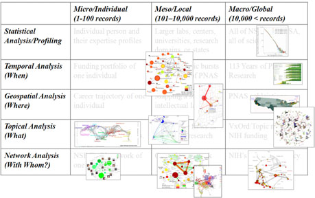

<!-- page 5 -->

Users of the tool can

  Access science datasets online or load their own.

  Perform different types of analysis with some of the most effective algorithms available.

  Use different visualizations to interactively explore and understand specific datasets.

  Share datasets and algorithms across scientific boundaries.

The Sci2 Tool is built on the Cyberinfrastructure Shell (CIShell) (Cyberinfrastructure for Network Science Center 2008), an open source software framework for the easy integration and utilization of datasets, algorithms, tools, and computing resources. CIShell is based on the OSGi R4 Specification and Equinox implementation (OSGi‐Alliance 2008).

The subsequent sections of this tutorial are organized as follows: Section 2 provides a general introduction on how to get started by installing the Sci2 Tool, managing the user interface, reading and writing different data formats, using sample datasets, and saving visualizations for publication. Section 3 discussed different types of algorithm and tool plugins. It also presents the results of scalability tests and provides information on extending memory allocation for larger datasets on different operating systems. Section 4 gives an introduction to the design of meaningful workflows comprising data acquisition and preparation for different datasets using text files or databases, temporal analysis, geospatial analysis, topical analysis, network analysis, and modeling. Section 5 exemplifies and details specific workflows at the micro (individual), meso (local), and macro (global) levels. Last but not least, section 6 reviews sample science studies and online services as inspiration for future research and practice.

<!-- page 6 -->

# 2 Getting Started

## 2.1 Download, Install, Uninstall

The Sci2 Tool is a stand‐alone desktop application that installs and runs on all common operating systems. To download the tool, please register and login via http://sci.slis.indiana.edu/sci2. Make sure to select your operating system from the pull down menu, see Figure 2.1.

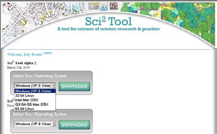

**Figure 2.1**: **Downloading the Sci**2 **Tool**

Save the zip file in a new empty *yoursci2directory* directory and extract all files.  After the files have been extracted, double click scipolicy.exe in *yoursci2directory* directory to run the program.

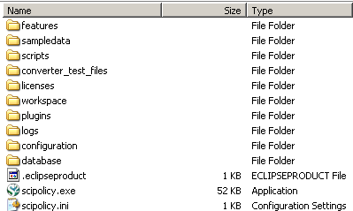

**Figure 2.2**: **Click ‘scipolicy.exe’ to run the Sci**2 **Tool**

The Sci2 Tool requires Java SE 5 (version 1.5.0) or later to be pre‐installed on your local machine. You can check the version of your Java installation by running the command line:

`java –version`

If not already installed on your computer, download and install Java SE 5 or 6 from http://www.java.com/en/download/index.jsp.

To uninstall the Sci2 Tool, simply delete **yoursci2directory**.  This will delete all sub‐directories as well, so make sure to backup all files you want to save.

Please cite the tool as

Sci2 Team. (2009). Science of Science (Sci2) Tool. Indiana University and SciTech Strategies, http://sci.slis.indiana.edu.

<!-- page 7 -->

## 2.2 User Interface

The general Sci2 Tool user interface is shown in Figure 2.3. It consists of a Menu (on top), Console (below), Data Manager (right), and Scheduler (lower left) explained subsequently.

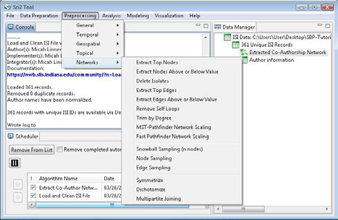

**Figure 2.3: Sci**2 **Tool interface components**

## 2.2.1 Menus

The Sci2 Tool top menu structure reflects a typical workflow.  The ‘*File*’ menu on the left allows a user to load data in many different formats. The data files can then be prepared ‘Data Preparation’, preprocessed ‘Preprocessing’, analyzed ‘Data Analysis’, and finally visualized ‘Visualization’.  Users also have the option of ‘Modeling’ new networks. The ‘Help’ menu leads to documentation and information about the tool. All seven menus are explained below. Data manipulation menus are further organized by the different types of analysis such as ‘General’, ‘Temporal’, Geospatial’, ‘Topical’, and ‘Networks.’

2.2.1.1 **File**

The ‘*File*’ menu functionality includes loading multiple data formats (see section 2.3 Data Formats for details), loading ISI and NSF data into a database, saving and viewing results, and merging or splitting node and edge files. ‘*Load and Clean ISI File*’ automatically normalizes author names and merges duplicate records, and is specifically designed for text‐based scientometric workflows (algorithms within ‘*Data Preparation > Text Files*’).  For database manipulation of ISI or NSF files, use ‘*File > Load …*’ followed by ‘*File > Load into Database*’ and select the appropriate option.  The converter graph and directory reader produces a sample graph based on file types supported by the Sci2 Tool and a sample tree based on any directory structure on the hard drive, respectively.

2.2.1.2 **Data Preparation**

After loading a file, use options in the ‘*Data Preparation*’ menu to clean the data and create networks or tables which can be used in the preprocessing, analysis, and visualization steps.  The ‘*Data Preparation > Database* ‘ menu is specifically for ISI or NSF data previously loaded into a database.  Options in ‘*Data Preparation > Text Files*’ are for any table‐based datasets (like *.csv* files) and are used to extract networks.  Find detailed information on each menu item in section 3.1 Sci2 Tool Plugins.

<!-- page 8 -->

2.2.1.3 **Preprocessing**

Use preprocessing algorithms to prune or append networks or tables before analyzing and visualizing them.  The menu is separated by domain, and most simple tasks require staying within the same domain.  For example, to visualize a co‐authorship network, only use algorithms within the ‘*Networks*’ domain under ‘*Preprocessing*’, ‘*Analysis*’, and ‘*Visualization*’.  Similarly, a geographic map requires only ‘*Geospatial*’ algorithms. Find detailed information on each menu item in section 3.1 Sci2 Tool Plugins.

2.2.1.4 **Analysis**

Once data is loaded, prepared, and processed with whatever features needed, analysis is possible in each of the four domains: temporal, geospatial, topical, or network.  Analysis results can be used on their own or in conjunction with visualizations to gain insight into a dataset.  The Sci2 Tool features predominantly network analysis algorithms, however the tool also supports geocoding of table data and burst analysis for topical or temporal studies, see section 4 Workflow Design.  Find detailed information on each menu item in section 3.1 Sci2 Tool Plugins.

2.2.1.5 **Modeling**

The Sci2 Tool supports the creation of new networks via pre‐defined models.  Learn more about modeling in section 4.10 Modeling (Why?).

2.2.1.6 **Visualization**

Once all previous data steps are complete, the Sci2 Tool can visualize the results.  The most popular choice for visualizing networks is the GUESS toolkit, or DrL for much larger scale networks.  Geocoded data can be represented on a map of the United States or a map of the world, and temporal or topical data can be viewed using the horizontal bar graph.  Find detailed information on each menu item in section 3.1 Sci2 Tool Plugins.

2.2.1.7 **Help**

The ‘*Help*’ menu leads to online documentation, advanced tool configuration, and detailed development information.

## 2.2.2 Console

All operations such as loading, viewing, or saving datasets, running various algorithms, and algorithm parameters, etc. are logged sequentially in the ‘Console’ window as well as in log files stored in the ‘*yoursci2directory* /logs’ directory. The Console window also displays the acknowledgement information about the original authors of the algorithm, the developers, the integrators, a reference paper, and the URL to the reference if available, together with an URL to the algorithm description in the NWB/Sci2 community wiki (https://nwb.slis.indiana.edu/community).

## 2.2.3 Data Manager

The ‘Data Manager’ window displays all currently loaded and available datasets. The type of a loaded file is indicated by its icon:

Text—text file

Table— tabular data (csv file)

Matrix—data (Pajek .mat)

Plot—plain text file that can be plotted using Gnuplot

Database—In‐memory database

Tree—Tree data (TreeML)

Network—Network data (in‐memory graph/network object or network files saved as Graph/ML, XGMML, NWB, Pajek .net or Edge list format)

<!-- page 9 -->

Derived datasets are indented under their parent datasets. That is, the children datasets are the results of applying certain algorithms to the parent dataset.

## 2.2.4 Scheduler

The ‘Scheduler’ lets users keep track of the progress of running algorithms.

## 2.3 Data Formats

In March 2010, the Sci2 Tool supports loading the following input file formats:

  GraphML (*.xml or*.graphml)

  XGMML (*.xml)

  Pajek .NET (*.net)

  Pajek .Matrix (*.mat)

  NWB (*.nwb)

  TreeML (*.xml)

  Edgelist (*.edge)

  Scopus csv (*.scopus)

  NSF csv (*.nsf)

  CSV (*.csv)

  ISI (*.isi)

  Bibtex (*.bib)

  Endnote Export Format (*.enw)

and the following network file output formats:

  GraphML (*.xml or*.graphml)

  Pajek .MAT (*.mat)

  Pajek .NET (*.net)

  NWB (*.nwb)

  XGMML (*.xml)

These formats are documented at https://nwb.slis.indiana.edu/community/?n=DataFormats.HomePage. In total there are 26 external and internal data formats and 35 converters—their relationships can be derived by running ‘File > Converter Graph’ and plotted as shown in Figure 2.4. Note that some conversions are symmetrical (double arrow) while others are one‐directional (arrow).

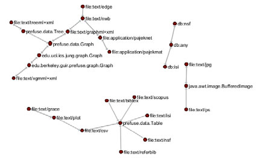

**Figure 2.4: Visualization of compatible data formats**

<!-- page 10 -->

## 2.4 Saving Visualizations for Publication

The Sci2 Tool supports various image output formats.  To save image files created by visualizations such as ‘Horizontal Bar graph’, ‘Geo Map,’ or ‘Circular Hierarchy,’ right‐click on the PostScript file in the data manager and then click ‘*Save*’.  Select ‘PostScript’ and then save the file to your desired directory.

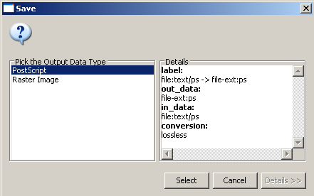

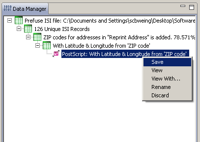

**Figure 2.5: Saving a PostScript file**

Adobe PostScript files require a special interpreter in order to be viewed.  One such interpreter is GSview, which requires the Ghostscript software available online:

Ghostscript 8.64: http://pages.cs.wisc.edu/~ghost/doc/GPL/gpl864.htm

GSview 4.9: http://pages.cs.wisc.edu/~ghost/gsview/get49.htm

When in GUESS, use ‘*File > Export Image*’ to export the current view or the complete network in diverse file formats such as jpg, png, raw, pdf, gif, etc.

## 2.5 Sample Datasets

Meaningful analysis requires carefully collected data.  The Sci2 Tool can import many varieties of scientometric data, outlined in section 3.2 Data Acquisition and Preparation, but the tool also comes bundled with several sample datasets in the /sampledata directory.  This sample data will be used throughout sections 4 Workflow Design and 5 Sample Workflows, and includes among others:


  EndNote
- `o`
  ../scientometrics/endnote/KatyBorner.enw – 146 publications authored or co‐authored by Katy
  Börner from 1992‐2010.
  
  Scholarly Database
- `o`
  ../geo/usptoInfluenza.csv – Heavily pre‐processed and geocoded data covering USPTO patents
  containing the keyword ‘Influenza’.
  
  NSF Award Search 
  - `o`
    ../scientometrics/nsf/MedicalAndHealth.nsf – 288 grants awarded from the NSF containing the
    words ‘Medical’ or ‘Health’, from 2003‐2010, totaling $152,015,288. 
- `o`
  ../scientometrics/nsf/KatyBorner.nsf – 13 grants awarded from the NSF to Katy Börner as PI or
  Co‐PI, from 2003‐2008, totaling $3,527,728. 
  - `o`
    ../scientometrics/nsf/BethPlale.nsf, GeoffreyFox.nsf, MichaelMcRobbie.nsf – 45 grants between
    three Indiana University researchers, totaling $39,031,960 from 1978‐2008.
- `o`
  ../scientometrics/nsf/Michigan.nsf, Indiana.nsf, Cornell.nsf ‐ Three universities’ grant profiles,
  totaling $951,478,510 from 2000‐2009.
  
  NIH Award Search 
- `o`
  ../scientometrics/nih/CTSA2005‐2009.xls – 2,546 papers and 534 grants for Clinical and
  Translational Science research from 2005‐2009. 
  
  Thomson Reuter’s Web of Science 

<!-- page 11 -->

- `o`
  ../scientometrics/isi/AlessandroVespignani.isi ‐ 101 publications authored or co‐authored by /
  ../scientometrics /isi/Alessandro Vespignani from 1990‐2006. 
- `o`
  ../scientometrics/isi/EugeneGarfield.isi – 99 publications retrieved on November 11th 2009. 
- `o`
  ../scientometrics/isi/FourNetSciResearchers.isi – 361 publications spanning 52 years and four
  network scientists: Albert‐László Barabási, Eugene Garfield, Alessandro Vespignani, & Stanley
  Wasserman. 
  - `o`
    ../scientometrics/isi/Scientometrics.isi – all 2,126 articles published in the journal Scientometrics
    from 1978‐2008. 

<!-- page 12 -->

# 3 Algorithm and Tool Plugins

The Sci2 Tool menu provides easy access to diverse preprocessing, modeling, analysis, visualization, and scientometrics algorithms that are listed here.  Note that the ‘Analysis > Networks’ algorithms are grouped by data‐type, i.e., (un)weighted vs. (un)directed.  Please see the online documentation (https://nwb.slis.indiana.edu/community/?n=Algorithms.HomePage) for additional details.

## 3.1 Sci2 Tool Plugins

**Load**

 Load – Load a file.

 Load and Clean ISI File – Load ISI file and reduce set to those that have unique ISI identifiers. The record with the highest value of citations (TC field) is kept.

 Load into Database

- `o`
  Load ISI File into Database – Loads an ISI file (selected in the Data Manager) but not a cleaned ISI
  file into the database. Database schema can be found at
  https://nwb.slis.indiana.edu/community/?n=Sci2Algorithm.LoadISIFileIntoDatabase and
  retrieved via right clicking an ‘NSF Database’ file in data Manager and selecting ‘View’.

- `o`
  Load NSF File into Database – Loads an NSF file (selected in the Data Manager) into a database.
  Database schema can be found at
  https://nwb.slis.indiana.edu/community/?n=Sci2Algorithm.LoadNSFFileIntoDatabase and
  retrieved via right clicking an ‘NSF Database’ file in data Manager and selecting ‘View’.

**Data Preparation**


  *Database*
- `o`
  *ISI*
  
  Merge Identical ISI People – Merges identical author names by removing punctuation
  and capitalization.
  
  Suggest ISI People Merges – Generates a pre‐annotated merging table based on a user‐
  selected threshold and string similarity metric.
  
  Merge Journals – Merges journals between sources and cited references based upon
  known name variants and abbreviations, see lookup table in
  *yoursci2directory*/configuration/JournalGroups.txt.
  
  Match References to Papers – Matches references to papers if they have the same first
  author, source (journal), start page, volume, and year.  Matching references is necessary
  for several types of analyses, e.g., extracting a paper citation or a co‐citation network.
  ‐‐‐‐‐‐‐‐‐‐‐‐‐‐‐‐‐‐‐‐‐‐‐‐‐‐‐‐‐‐‐‐‐‐‐‐‐‐‐‐‐‐‐‐‐
  
  Extract Authors – Outputs a table containing one row per author in the database and
  columns for PAPERS_AUTHORED_IN_DATASET, GLOBAL_CITATION_COUNT ,
  LOCAL_CITATION_COUNT, ADDITIONAL_NAME, FAMILY_NAME, FIRST_INITIAL,
  FULL_NAME, MIDDLE_INITIAL, PERSONAL_NAME.
  
  Extract Documents – Outputs a table containing one row per document in the database
  together with columns for TITLE, TIMES_CITED, ABSTRACT_TEXT, ARTICLE_NUMBER,
  BEGINNING_PAGE, CITED_REFERENCE_COUNT, CITED_YEAR,
  DIGITAL_OBJECT_IDENTIFIER, DOCUMENT_TYPE, DOCUMENT_VOLUME, ENDING_PAGE,
  FIRST_AUTHOR_FK, FUNDING_AGENCY_AND_GRANT_NUMBER, FUNDING_TEXT, ISBN,
  ISI_DOCUMENT_DELIVERY_NUMBER, ISI_UNIQUE_ARTICLE_IDENTIFIER, ISSUE,
  LANGUAGE, PAGE_COUNT, PART_NUMBER, PUBLICATION_DATE, PUBLICATION_YEAR,
  SOURCE  SPECIAL_ISSUE, SUBJECT_CATEGORY, SUPPLEMENT.
  
  Extract Keywords – Outputs a table containing one row per keyword in the database
  together with columns for KEYWORD, TYPE, OCCURRENCES_IN_DATASET.

<!-- page 13 -->

 Extract Document Sources – Outputs a table containing one row per document source in the database together with columns for FULL_TITLE, ISO_TITLE_ABBREVIATION, TWENTY_NINE_CHARACTER_SOURCE_TITLE_ABBREVIATION , NUM_PAPERS_CONTAINED_FROM_DATASET, ISSN, BOOK_SERIES_TITLE , BOOK_SERIES_SUBTITLE, CONFERENCE_HOST, CONFERENCE_LOCATION , CONFERENCE_SPONSORS  CONFERENCE_TITLE. ‐‐‐‐‐‐‐‐‐‐‐‐‐‐‐‐‐‐‐‐‐‐‐‐‐‐‐‐‐‐‐‐‐‐‐‐‐‐‐‐‐‐‐‐‐  Extract Authors by Year – Outputs a table containing the number of publications per author per year and author ID.  Extract References by Year – Outputs a table containing the number of references to a publication per year and a reference ID.  Extract Original Author Keywords by Year – Outputs a table containing the number of original author keywords per year.  Extract New ISI Keywords by Year – Outputs a table containing one row per new ISI keyword per year. ‐‐‐‐‐‐‐‐‐‐‐‐‐‐‐‐‐‐‐‐‐‐‐‐‐‐‐‐‐‐‐‐‐‐‐‐‐‐‐‐‐‐‐‐‐  Extract Authors by Year for Burst Detection – Outputs a table containing two columns: author name concatenated with its author ID and year of publication. Used for author burst detection.  Extract Documents by Year for Burst Detection – Used for word occurrence based burst detection.  Extract Original Author Keywords by Year for Burst Detection – Used for keyword burst detection.  Extract New ISI Keywords by Year for burst Detection – Used keyword burst detection.  Extract References by Year for Burst Detection – Used to detecting bursting references to publications. ‐‐‐‐‐‐‐‐‐‐‐‐‐‐‐‐‐‐‐‐‐‐‐‐‐‐‐‐‐‐‐‐‐‐‐‐‐‐‐‐‐‐‐‐‐  Extract Longitudinal Summary – Outputs a table with the total number of documents published, references published, references made, distinct authors, distinct sources, distinct author keywords, distinct ISI keywords, and distinct other keywords by year. ‐‐‐‐‐‐‐‐‐‐‐‐‐‐‐‐‐‐‐‐‐‐‐‐‐‐‐‐‐‐‐‐‐‐‐‐‐‐‐‐‐‐‐‐‐  Extract Co‐Author Network – Extracts a weighted, undirected network with authors as nodes and edges between authors who co‐wrote papers.  The extraction appends to nodes the number of authored documents, ISI’s times‐cited count, the publication of the earliest document, and the publication year of the most recent document.  The extraction appends to edges weights for the number of co‐written papers, and the publication years of the earliest and most recent collaboration. ‐‐‐‐‐‐‐‐‐‐‐‐‐‐‐‐‐‐‐‐‐‐‐‐‐‐‐‐‐‐‐‐‐‐‐‐‐‐‐‐‐‐‐‐‐  Extract Author Citation Network – Extracts a weighted, directed network with authors as nodes and edges from a citing author to a cited author.  Nodes include all data from the PERSON table and the number of documents authored in the current dataset.  Extract Document Citation Network (core only) – Extracts an unweighted, directed network with documents as nodes and edges from a citing paper to a cited paper.  Only those documents with full entries in the dataset are included in the network.  Nodes include all data from the DOCUMENT table.  Extract Document Citation Network (core and references) – Extracts an unweighted, directed network with documents as nodes and edges from a citing paper to a cited paper.  Nodes include all data from the DOCUMENT table.  Extract Source Citation Network (core only) – Extracts a weighted, directed network with sources (journals) as nodes and edges from a citing source to a cited source. Citations are via documents within sources, and only those sources represented by documents within the dataset are included in the network.  Nodes include all data from the SOURCE table, and edges are weighted by the number of citations between sources.  Extract Source Citation Network (core and references) – Extracts a weighted, directed network with sources (journals) as nodes and edges from a citing source to a cited

<!-- page 14 -->

source.  Citations are via documents within sources.  Nodes include all data from the
  SOURCE table, and edges are weighted by the number of citations between sources.
  ‐‐‐‐‐‐‐‐‐‐‐‐‐‐‐‐‐‐‐‐‐‐‐‐‐‐‐‐‐‐‐‐‐‐‐‐‐‐‐‐‐‐‐‐‐
  
  Extract Document Co‐Citation Network (core only) – Extracts a weighted, undirected
  network with documents as nodes and edges between documents which have been
  cited together.  Only those documents with entries in the dataset are included in the
  network.  Edge weight is determined by the number of times two articles are cited
  together, and edges are appended with the publication years of their earliest and most
  recent co‐citations.
  
  Extract Document Co‐Citation Network (core and references) – Extracts a weighted,
  undirected network with documents as nodes and edges between documents which
  have been cited together.  Edge weight is determined by the number of times two
  articles are cited together, and edges are appended with the publication years of their
  earliest and most recent co‐citations.
  
  Extract Journal Co‐Citation Network (core only) – Extracts a weighted, undirected
  network with journals as nodes and edges between journals which have been cited
  together by a common document.  Only those journals containing documents with
  entries in the dataset are included in the network.  Edge weight is determined by the
  number of times two journals are cited together, and edges are appended with the
  publication years of their earliest and most recent co‐citations.
  
  Extract Journal Co‐Citation Network (core and references) – Extracts a weighted,
  undirected network with journals as nodes and edges between journals which have
  been cited together by a common document.  Edge weight is determined by the number
  of times two journals are cited together, and edges are appended with the publication
  years of their earliest and most recent co‐citations.
  
  Extract Author Co‐Citation Network – Extracts a weighted, undirected network with
  authors as nodes and edges between authors who have been cited together by a
  common document.  Edge weight is determined by the number of times two authors
  are cited together, and edges are appended with the publication years of their earliest
  and most recent co‐citations.
  ‐‐‐‐‐‐‐‐‐‐‐‐‐‐‐‐‐‐‐‐‐‐‐‐‐‐‐‐‐‐‐‐‐‐‐‐‐‐‐‐‐‐‐‐‐
  
  Extract Author Bibliographic Coupling Network – Extracts a weighted, undirected
  network with authors as nodes and edges between authors who cite a common
  reference.  Edge weight is determined by the number of common references between
  authors.
  
  Extract Document Bibliographic Coupling Network – Extracts a weighted, undirected
  network with documents as nodes and edges between documents which cite a common
  reference.  Edge weight is determined by the number of common references between
  documents.
  
  Extract Journal Bibliographic Coupling – Extracts a weighted, undirected network with
  journals as nodes and edges between journals whose documents cite a common
  reference.  Edge weight is determined by the number of common references between
  documents.
- `o`
  *NSF*
  
  Merge Identical NSF People – Merges person names by removing punctualization and
  capitalization.
  ‐‐‐‐‐‐‐‐‐‐‐‐‐‐‐‐‐‐‐‐‐‐‐‐‐‐‐‐‐‐‐‐‐‐‐‐‐‐‐‐‐‐‐‐‐
  
  Extract Investigators – Extracts a table containing one row per investigator from an NSF
  database.
  
  Extract Awards – Extracts a table containing one row per award from an NSF database.
  
  Extract Organizations – Extracts a table containing one row per organization from an
  NSF database.
  ‐‐‐‐‐‐‐‐‐‐‐‐‐‐‐‐‐‐‐‐‐‐‐‐‐‐‐‐‐‐‐‐‐‐‐‐‐‐‐‐‐‐‐‐‐
  
  Extract Co‐PI Network – Extracts a weighted, undirected network with principline
  investigators as nodes and edges between them if they co‐investigated an award in the
  database.  Nodes are appended with the humber of awards investigated, total amount

<!-- page 15 -->

across each investigated award, start date of earliest award, and expiration date of most
  recent award.  Edges are appended with the number of awards co‐investigated by the
  two investigators and the joint award total between the investigators.
  - `o`
    *General*
    
    Create Merging Tables
    
    Merge Entities
    
    Custom Table Query
    
    Custom Graph Query
    
    Extract Raw Tables From Database
    
    *Text Files*
- `o`
  Remove ISI Duplicate Records—Removes duplicate publications form ISI records based on ISI
  Unique ID attribute.
- `o`
  Remove Rows with Multitudinous Fields—Removes rows having at least N entries within a given
  field.
  ‐‐‐‐‐‐‐‐‐‐‐‐‐‐‐‐‐‐‐‐‐‐‐‐‐‐‐‐‐‐‐‐‐‐‐‐‐‐‐‐‐‐‐‐‐
  - `o`
    Extract Directed Network—General network extraction.
- `o`
  Extract Bipartite Network–Extracts an unweighted bipartite network
- `o`
  Extract Paper Citation Network—Extracts an unweighted directed network from papers to their
  citations.
  - `o`
    Extract Author Paper Network—Extracts an unweighted directed network from authors to their
    papers.
    ‐‐‐‐‐‐‐‐‐‐‐‐‐‐‐‐‐‐‐‐‐‐‐‐‐‐‐‐‐‐‐‐‐‐‐‐‐‐‐‐‐‐‐‐‐
  - `o`
    Extract Co‐Occurrence Network—General network extraction.
- `o`
  Extract Word Co‐Occurrence Network—Extracts a weighted network showing which words
  appear with each other most frequently.
  - `o`
    Extract Co‐Author Network—Extracts a weighted network with authors as nodes and edge
    weights as the number of times those authors co‐wrote a paper.
  - `o`
    Extract Reference Co‐Occurrence (Bibliographic Coupling) Network—Extracts a weighted
    network from a Paper Citation network, with papers as nodes and edge weights as the number of
    citations two papers share.
    ‐‐‐‐‐‐‐‐‐‐‐‐‐‐‐‐‐‐‐‐‐‐‐‐‐‐‐‐‐‐‐‐‐‐‐‐‐‐‐‐‐‐‐‐‐
  - `o`
    Extract Document Co‐Citation Network—Extracts a weighted network from a Paper Citation
    network, with papers as nodes and edge weights as the number of times two papers are cited
    together.
    ‐‐‐‐‐‐‐‐‐‐‐‐‐‐‐‐‐‐‐‐‐‐‐‐‐‐‐‐‐‐‐‐‐‐‐‐‐‐‐‐‐‐‐‐‐
- `o`
  Detect Duplicate Nodes—Cleans graph data by detecting and preparing to merge nodes that are
  likely to represent the same entity.
  - `o`
    Update Network by Merging Nodes—Creates a new network by running the algorithm with both
    the Merge Table from “*Detect Duplicate Nodes*” and the original network selected.

**Preprocessing**


  *General*
- `o`
  Extract Top N% Records—Returns the top N% rows of a table by some sorting criteria.
- `o`
  Extract Top N Records— Returns the top N rows of a table by some sorting criteria.
  - `o`
    Aggregate Data– Aggregates/summarizes the input table based on values in a “Grouped On”
    column provided by the user.
    
    *Temporal*
- `o`
  Slice Table by Time—Slices a table into groups of rows by time.
  
  *Geospatial*
  - `o`
    Extract ZIP Code—Extracts a ZIP code from a given address.
    
    *Topical*
  - `o`
    Normalize Text—Replaces spaces and punctuations from a field with a standard delimiter of the
    user’s choosing.
    
    *Networks*
- `o`
  Extract Top Nodes—Extracts the top N nodes from a graph, based on a given attribute.

<!-- page 16 -->

- `o`
  Extract Nodes Above or Below Value—Extracts nodes with an attribute above or below a certain
  value.
- `o`
  Delete Isolates—Removes nodes which are not connected to any other in the graph.
  - `o`
    Extract Top Edges—Extracts the top N edges from a graph, based on a given attribute.
- `o`
  Extract Edges Above or Below Value—Extracts all edges with an attribute above or below a
  certain number from a graph.
  - `o`
    Remove Self Loops—Removes edges whose source and target nodes are equivalent from a
    graph.
  - `o`
    Trim by Degree—Deletes edges at random until each node has at most N edges.
    - `o`
      MST‐Pathfinder Network Scaling—Prunes a network using the MST‐Pathfinder algorithm.
- `o`
  Fast Pathfinder Network Scaling—Prunes a network using the Fast Pathfinder algorithm.
  ‐‐‐‐‐‐‐‐‐‐‐‐‐‐‐‐‐‐‐‐‐‐‐‐‐‐‐‐‐‐‐‐‐‐‐‐‐‐‐‐‐‐‐‐‐
  - `o`
    Snowball Sampling (N nodes)—Picks a random node and traverses its edges iteratively until N
    nodes are extracted.
  - `o`
    Node Sampling—Extracts N random nodes and their intervening edges, and then deletes isolates.
- `o`
  Edge Sampling—Extracts N random edges and their target and source nodes.
  ‐‐‐‐‐‐‐‐‐‐‐‐‐‐‐‐‐‐‐‐‐‐‐‐‐‐‐‐‐‐‐‐‐‐‐‐‐‐‐‐‐‐‐‐‐
  - `o`
    Symmetrize—Turns a directed network into an undirected network.
  - `o`
    Dichotomize—Trims edges above, equal to, or below a certain value.
    - `o`
      Multipartite Joining—Joins a multipartite graph for one node type across another node type.

**Analysis**


  *Temporal*
- `o`
  Burst Detection—Determines periods of increased activity in a table with dates/timestamps.
  
  *Geospatial*
- `o`
  Geocoder—Converts place names to latitudes and longitudes.* *
  
  *Topical*
- `o`
  Burst Detection—Determines periods of increased activity in a table with dates/timestamps.
  
  *Networks*
  - `o`
    Network Analysis Toolkit (NAT)—Calculates basic network statistics.
- `o`
  *Unweighted & Undirected*
  
  Node Degree—Calculates the amount of edges adjacent to a node, and then appends
  that value to each node.
  
  Degree Distribution—Builds a histogram of the degree values of all nodes.
  ‐‐‐‐‐‐‐‐‐‐‐‐‐‐‐‐‐‐‐‐‐‐‐‐‐‐‐‐‐‐‐‐‐‐‐‐‐‐‐‐‐‐‐‐‐
  
  K‐Nearest Neighbor (Java)—Calculates the correlation between the degree of a node
  and that of its neighbors, and then appends that value to each node.
  
  Watts‐Strogatz Clustering Coefficient—Calculates the degree to which nodes tend to
  cluster together, and then appends that value to each node.
  
  Watts Strogatz Clustering Coefficient over K—Correlates the clustering coefficient and
  the degree of the nodes of a network.
  ‐‐‐‐‐‐‐‐‐‐‐‐‐‐‐‐‐‐‐‐‐‐‐‐‐‐‐‐‐‐‐‐‐‐‐‐‐‐‐‐‐‐‐‐‐
  
  Diameter—Calculates the length of the longest shortest path between pairs of nodes in
  a network.
  
  Average Shortest Path—Calculates the average length of the shortest path between
  pairs of nodes in a network.
  
  Shortest Path Distribution—Builds a histogram of the lengths of shortest paths between
  pairs of nodes in a network.
  
  Node Betweenness Centrality—Appends a value to each node which correlates to the
  amount of shortest paths that node resides on.  The more shortest paths between node‐
  pairs a certain node resides on, the higher its betweenness centrality.
  ‐‐‐‐‐‐‐‐‐‐‐‐‐‐‐‐‐‐‐‐‐‐‐‐‐‐‐‐‐‐‐‐‐‐‐‐‐‐‐‐‐‐‐‐‐
  
  Weak Component Clustering—Extracts the N largest weakly connected components of a
  network.

<!-- page 17 -->


  Global Connected Components—Calculates the number of *connected components*, or
  subgraphs with a path between each pair of nodes.
  ‐‐‐‐‐‐‐‐‐‐‐‐‐‐‐‐‐‐‐‐‐‐‐‐‐‐‐‐‐‐‐‐‐‐‐‐‐‐‐‐‐‐‐‐‐
  
  Extract K‐Core—Extracts the kth K‐Core from a graph.  The kth K‐Core is what remains of
  the graph after every node with fewer than k edges connected to it is removed from the
  graph recursively.
  
  Annotate K‐Coreness—Appends to each node the K‐Core that node belongs to.
  ‐‐‐‐‐‐‐‐‐‐‐‐‐‐‐‐‐‐‐‐‐‐‐‐‐‐‐‐‐‐‐‐‐‐‐‐‐‐‐‐‐‐‐‐‐
  
  HITS—Computes authority and hub score for every node.
  - `o`
    *Weighted & Undirected*
    
    Clustering Coefficient—Calculates the degree to which nodes tend to cluster together,
    and then appends that value to each node.
    
    Nearest Neighbor Degree
    
    Strength vs Degree
    
    Degree & Strength
    
    Average Weight vs End‐point Degree
    
    Strength Distribution
    
    Weight Distribution
    
    Randomize Weights
    ‐‐‐‐‐‐‐‐‐‐‐‐‐‐‐‐‐‐‐‐‐‐‐‐‐‐‐‐‐‐‐‐‐‐‐‐‐‐‐‐‐‐‐‐‐
    
    Blondel Community Detection—Extracts a hierarchical community structure of a large
    network.
    ‐‐‐‐‐‐‐‐‐‐‐‐‐‐‐‐‐‐‐‐‐‐‐‐‐‐‐‐‐‐‐‐‐‐‐‐‐‐‐‐‐‐‐‐‐
    
    HITS— Computes authority and hub score for every node.
- `o`
  *Unweighted & Directed*
  
  Node Indegree—Appends the number of incoming edges to each node.
  
  Node Outdegree— Appends the number of outgoing edges to each node.
  
  Indegree Distribution—Builds a histogram of the values of the indegree of all nodes.
  
  Outdegree Distribution— Builds a histogram of the values of the outdegree of all nodes.
  ‐‐‐‐‐‐‐‐‐‐‐‐‐‐‐‐‐‐‐‐‐‐‐‐‐‐‐‐‐‐‐‐‐‐‐‐‐‐‐‐‐‐‐‐‐
  
  K‐Nearest Neighbor— Calculates the correlation between the degree of a node and that
  of its neighbors, and then appends that value to each node.
  
  Single Node In‐Out Degree Correlations—Calculates the correlations between indegree
  and outdegree of a node.
  ‐‐‐‐‐‐‐‐‐‐‐‐‐‐‐‐‐‐‐‐‐‐‐‐‐‐‐‐‐‐‐‐‐‐‐‐‐‐‐‐‐‐‐‐‐
  
  Dyad Reciprocity—The ratio of dyads with a reciprocated tie to dyads with any tie.
  
  Arc Reciprocity—The ratio of reciprocal edges to total edges.
  
  Adjacency Transitivity—The ratio of transitive triads to intransitive triads (triads missing
  one edge).
  ‐‐‐‐‐‐‐‐‐‐‐‐‐‐‐‐‐‐‐‐‐‐‐‐‐‐‐‐‐‐‐‐‐‐‐‐‐‐‐‐‐‐‐‐‐
  
  Weak Component Clustering—Extracts the N largest weakly connected components of a
  network.
  
  Strong Component Clustering—Extracts the N largest strongly connected components of
  a network.
  ‐‐‐‐‐‐‐‐‐‐‐‐‐‐‐‐‐‐‐‐‐‐‐‐‐‐‐‐‐‐‐‐‐‐‐‐‐‐‐‐‐‐‐‐‐
  
  Extract K‐Core—Extracts the kth K‐Core from a graph.  The kth K‐Core is what remains of
  the graph after every node with fewer than k edges connected to it is removed from the
  graph recursively.
  
  Annotate K‐Coreness—Appends to each node the K‐Core that node belongs to.
  ‐‐‐‐‐‐‐‐‐‐‐‐‐‐‐‐‐‐‐‐‐‐‐‐‐‐‐‐‐‐‐‐‐‐‐‐‐‐‐‐‐‐‐‐‐
  
  HITS—Computes authority and hub score for every node.
  
  PageRank—Ranks the importance of a node by how many other important nodes point
  to it.
- `o`
  *Weighted & Directed*
  
  HITS—Computes authority and hub score for every node.

<!-- page 18 -->

 Weighted PageRank—Ranks the importance of a node by how many other important nodes point to it, taking into account edge weights.

**Modeling**

  Random Graph—Generates a graph with a fixed number of nodes connected randomly by undirected edges.

  Watts‐Strogatz Small World— Generates a graph whose majority of nodes are not *directly* connected to one another, but are still connected to one another via relatively few edges.

  Barabási‐Albert Scale‐Free—Generates a scale‐free network by incorporating growth and preferential attachment. ‐‐‐‐‐‐‐‐‐‐‐‐‐‐‐‐‐‐‐‐‐‐‐‐‐‐‐‐‐‐‐‐‐‐‐‐‐‐‐‐‐‐‐‐‐‐‐‐‐‐‐‐‐

  TARL – Topics, Aging and Recursive Linking process model simulates the simultaneous evolution of author and paper networks. The model attempts to capture the roles of authors and papers in the production, storage and dissemination of knowledge. Information diffusion is assumed to occur directly via co‐ authorship and indirectly via the consumption of other author's papers. The model generates a bipartite evolving network which also incorporates aging in the paper citation network.

**Visualization**


  General
- `o`
  Image Viewer—Views PostScript files.
- `o`
  GnuPlot—Plots data.
  
  Temporal
- `o`
  Horizontal Line Graph—Generates a bar graph whose x‐axis is time and whose bars are sized
  based on a user‐specified value. Result is a Postscript file.
  
  Geospatial
  - `o`
    Geo Map (Circle Annotations)—Generates a map of the US or the world upon which circles of
    user‐defined size and color are projected. Result is a Postscript file.
  - `o`
    Geo Map (Colored‐Region Annotations)—Generates a map of the US or the world with regions
    colored based on a user‐defined metric. Result is a Postscript file.
    
    Networks
- `o`
  GUESS—Interactive data analysis and visualization tool.
  ‐‐‐‐‐‐‐‐‐‐‐‐‐‐‐‐‐‐‐‐‐‐‐‐‐‐‐‐‐‐‐‐‐‐‐‐‐‐‐‐‐‐‐‐‐
- `o`
  Radial Tree/Graph (prefuse alpha)—A single node is placed at the center and all others are laid
  around it in a tree structure.
  - `o`
    Radial Tree/Graph with Annotation (prefuse beta)—A single node is placed at the center and all
    others are laid around it in a tree structure, with labels.
  - `o`
    Tree View (prefuse beta)—Visualizes directory hierarchies in a tree structure.
  - `o`
    Tree Map (prefuse beta)—Visualizes hierarchies using the Treemap algorithm.
  - `o`
    Force Directed with Annotation (prefuse beta)—Sorts randomly placed nodes into a desirable
    layout that satisfies the aesthetics for visual presentation.
- `o`
  Fruchterman‐Reingold with Annotation (prefuse beta)—Visualization which lays out nodes based
  on some force between them.
  ‐‐‐‐‐‐‐‐‐‐‐‐‐‐‐‐‐‐‐‐‐‐‐‐‐‐‐‐‐‐‐‐‐‐‐‐‐‐‐‐‐‐‐‐‐
  - `o`
    DrL  (VxOrd)—A force‐directed graph layout toolbox focused on real‐world large‐scale graphs.
    - `o`
      Specified (prefuse beta)—Visualization tool for use with graphs having pre‐specified node
      coordinates.
      ‐‐‐‐‐‐‐‐‐‐‐‐‐‐‐‐‐‐‐‐‐‐‐‐‐‐‐‐‐‐‐‐‐‐‐‐‐‐‐‐‐‐‐‐‐
- `o`
  Circular Hierarchy—Generates a circular visualization of the output produced by a multi‐level
  aggregation method such as Blondel Community Detection. Result is a Postscript file.
  - `o`
    Science Map (Circle Annotation)—Projects circles of user‐defined size and color onto UCSD’s Map
    of Science. Result is a Postscript file. Please contact William Decker at UCSD wjdecker@ucsd.edu
    for permissions to use the UCSD map of science.
    ‐‐‐‐‐‐‐‐‐‐‐‐‐‐‐‐‐‐‐‐‐‐‐‐‐‐‐‐‐‐‐‐‐‐‐‐‐‐‐‐‐‐‐‐‐‐
    Cytoscape – Cytoscape Analyzing and Visualizing Networks Data tool, see
    http://www.cytoscape.org.

<!-- page 19 -->

## 3.2 Load, View, and Save Data

In the Sci2 Tool, use ‘*File > Load …’* to load one of the provided in sample datasets in ‘*yoursci2directory**/*sampledata*’ or any dataset of your own choosing.

Any file listed in the ‘Data Manager’ can be saved, viewed, renamed, or discarded by right clicking it and selecting the appropriate menu options. If ‘*File > View With ...*’ was selected, the user can select among different application viewers. Choosing ‘Microsoft Office Excel…’ for a tabular type file will open MS Excel with the table loaded.

The Sci2 Tool can save a network using ‘*File > Save...*’ which brings up the ‘Save’ window. Note that some data conversions are lossy, i.e., not all data is preserved.

## 3.3 Memory Allocation

Due to the constraints of the Java virtual machine, the amount of memory available to a Java application must be specified before the application starts. The tool’s default allotment of 350 Megabytes is a balance between providing enough memory for most uses of the tool, while not causing the Sci2 Tool to crash on machines with too little memory. For most analyses this amount should suffice. For larger scale operations this amount needs to be increased to make full use of your systems available memory as discussed here.

## 3.3.1 Windows and Linux

Open the file "scipolicy.ini" in your sci2 directory, using a simple text editor such as Notepad.

The file should contain the following three lines (if not, add them):

`-vmargs` `-Xms15m` `-Xmx350m`

The first number (15 here) represents how much memory is allocated to the Sci2 Tool when it first starts up. This number isn't particularly important, but should not be set to anything below 10m.

The second and more important number (350 here) represents the maximum amount of memory that can be allocated to the Sci2 Tool. This can be up to roughly 3/4th the total available memory on your machine, but should not be set any higher, or the Sci2 Tool will fail to start.

Make sure that the formatting is exactly as displayed above, as the .ini file can be finicky about extra spaces in the file, or multiple arguments on a single line.

After changing these two numbers, save the "scipolicy.ini" file, and your new memory settings should be used the next time the Sci2 Tool starts.

## 3.3.2 Mac

On a Mac, you need to configure the "scipolicy.ini" file inside the Sci2 Tool application bundle. Open the Sci2 Tool application folder and control + click on the scipolicy icon. A menu should appear, select Show Package Contents.

<!-- page 20 -->

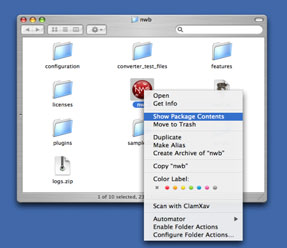

**Figure 3.1**: **Find scipolicy in the sci2 directory**

This should bring up another window with a folder labeled Contents. Open the Contents folder and then open the MacOS folder found inside. Open the "scipolicy.ini" file in TextEdit or other text editor that will leave the contents as plain text.

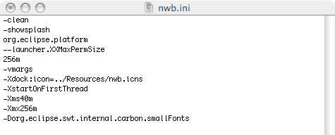

**Figure 3.2**: **Original scipolicy.ini file**

To enable the Sci2 Tool to access more memory, increase the number following ‐Xmx in the “scipolicy.ini” file. If the value is increased too much, the Sci2 Tool will not function.

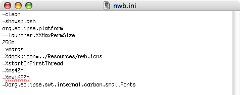

**Figure 3.3**: **Updated scipolicy.ini file**

## 3.4 Memory Limits

The Sci2 Tool’s database functionality greatly improves the volume of data which can be loaded into and analyzed by the tool.  Whereas most scientometric tools available as of March 2010 require powerful computing resources to perform large scale analyses each time a network needs to be extracted, the pre‐loaded database runs network extraction algorithms quickly and allows the users to run custom queries.  This functionality has some front‐heavy memory requirements in order to initially load the data into the database, the upper limits of which can be seen in Tables 3.1 and 3.2.

<!-- page 21 -->

***Table 3.1***: *The number of seconds to perform each action on a dataset of the given size, on a computer with 12GB of memory*.

| Computer with 12GB of RAM |  |  |  |  |  |  |  |  |  |  |  |  |
| --- | --- | --- | --- | --- | --- | --- | --- | --- | --- | --- | --- | --- |
| seirtnE | daoL | elpoeP egreM | slanruoJ egreM | hctaM | srohtuA tcartxE | stnemucoD tcartxE | srohtuA‐oC tcartxE | )retuo htiw( noitatiC tnemucoD tcartxE | noitatiC rohtuA tcartxE | noitatiC‐oC tnemucoD tcartxE | )eroC( noitatiC‐oC tnemucoD tcartxE | noitatiC‐oC rohtuA |
| 50 | 5 | 1 | 1 | 1 | 1 | 1 | 1 | 1 | 1 | 10 | 4 | 2 |
| 500 | 10 | 4 | 4 | 1 | 1 | 1 | 1 | 1 | 1 | 20 | 4 | 5 |
| 5000 | 100 | 48 | 180 | 3 | 1 | 1 | 3 | 18 | 2 | 3300 | 20 | 35 |
| 10000 | 210 | 120 | 480 | 5 | 2 | 1 | 10 | 30 | 7 |  | 60 | 100 |
| 20000 | 400 | 300 | 1200 | 15 | 5 | 1 | 22 | 70 | 20 |  | 164 | 250 |

***Table 3.2:*** *The number of seconds to perform each action on a dataset of the given size, on a computer with 1.2GB of memory.*

| Computer with 1.2GB of RAM |  |  |  |  |  |  |  |  |  |  |  |  |
| --- | --- | --- | --- | --- | --- | --- | --- | --- | --- | --- | --- | --- |
| seirtnE | daoL | elpoeP egreM | slanruoJ egreM | hctaM | srohtuA tcartxE | stnemucoD tcartxE | srohtuA‐oC tcartxE | )retuo htiw( noitatiC tnemucoD tcartxE | noitatiC rohtuA tcartxE | noitatiC‐oC tnemucoD tcartxE | )eroC( noitatiC‐oC tnemucoD tcartxE | noitatiC‐oC rohtuA |
| 50 | 50 | 55 | 9 | 4 | 3 | 1 | 1 | 1 | 1 | 1 | 40 | 13 |
| 500 | 500 | 420 | 52 | 13 | 3 | 1 | 1 | 1 | 2 | 1 | 75 | 13 |
| 5000 | 5000 | 3600 | 1080 | 480 | 25 | 1 | 1 | 12 | 90 | 2 |  | 180 |

<!-- page 22 -->

# 4 Workflow Design

## 4.1 Overview

A typical science of science study is given in Figure 4.1. It starts with a N**EEDS ANALYSIS** of a selected stakeholder group that informs the subsequent workflow design, involving **DATA ACQUISITION AND PROCESSING**; **DATA ANALYSIS, MODELING, AND LAYOUT**; and **DATA COMMUNICATION—VISUALIZATION LAYERS**. All datasets, algorithms, and parameter values used in a study have to be documented in detail in support of replication and interpretation. The resulting **VALIDATION AND INTERPRETATION** should then proceed in collaboration with domain experts and stakeholders. Insights gained might generate additional insight needs or inspire changes to the workflow. The process is highly incremental, often demanding many cycles of revision and refinement to ensure the best datasets are used, optimal algorithm parameters applied, and clearest insight achieved. 

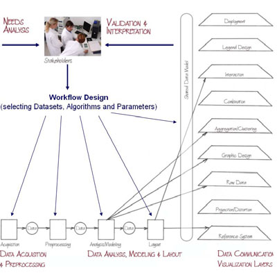

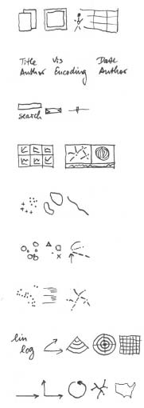

**Figure 4.1: Needs‐driven workflow design using a modular data acquisition/analysis/modeling/visualization**

*pipeline as well as visualization layers.*

Note that the visualization layers interact with other workflow elements such as analysis algorithms (e.g., network analysis algorithms that compute additional node/edge attributes for graphic design, clustering techniques that indentify cluster boundaries), or layout algorithms (e.g., network layouts that compute a spatial reference system). Subsequently, we detail major workflow elements and different types of analysis.

## 4.2 Data Acquisition and Preparation

Typically, about 80 percent of the total project effort is spent on data acquisition and preprocessing; yet well prepared data is mandatory to arrive at high‐quality results. Datasets might be acquired via questionnaires, crawled from the Web, downloaded from a database, or accessed as continuous data stream. Datasets differ by their coverage and resolution of time (days, months, years), geography (languages and/or countries considered), and topics (disciplines and selected journal sets). Their size ranges from several bytes to terabytes (trillions of

<!-- page 23 -->

bytes) of data. They might be high‐quality materials curated by domain experts or content retrieved from the Web. Based on a detailed needs analysis and deep knowledge about existing databases, the best suited yet affordable datasets have to be selected, filtered, integrated, and augmented. It may also be necessary for networks to be extracted (see section 4.7 Network Analysis for details). The Sci2 Tool supports the loading and pre‐processing of different types of data such as publication, funding and patent datasets given in different formats as discussed next.

## 4.2.1 Datasets: Publications

This section discusses different input formats for publication data. In each data format type, we list and color code data elements that are commonly used in statistical, temporal, geospatial, topical, and network analyses.

### 4.2.1.1 Refer/BibIX/enw

Refer was one of the first digital reference managers, developed by Bell labs in 1978.  Refer’s file output format has since been adopted by many tools and web services, including BibIX for UNIX, early versions of EndNote, CiteSeerX, Zotero.

Data in refer‐formatted files is commonly used for the following types of analyses:

- `o`
  Statistical Attributes
      - `o`
        %1 (Times Cited)
- `o`
  Temporal Analysis
      - `o`
        %8 (Date)
        - `o`
          %V (Volume)
        - `o`
          %D (Year Published)
  - `o`
    Geospatial Analysis
        - `o`
          %+ (Author Address)
        - `o`
          %C (Place Published)
  - `o`
    Topical Analysis
        - `o`
          %X (Abstract)
          - `o`
            %J (Journal)
          - `o`
            %K (Keywords)
          - `o`
            %F (Label)
          - `o`
            %! (Short Title)
          - `o`
            %T (Title)
    - `o`
      Network Analysis
      - `o`
        %A (Author)

### 4.2.1.2 BibTeX

Like Refer, BibTeX provides a standard reference file format used by many tools and web services, including CiteSeerX, citeulike, BibSonomy, and Google Scholar.

Data in BibTex files is commonly used for the following types of analyses:

- `o`
  Temporal Analysis
    - `o`
      date
    - `o`
      bibdate
      - `o`
        date‐added
      - `o`
        date‐modified
      - `o`
        issue
      - `o`
        month
      - `o`
        timestamp
      - `o`
        volume
      - `o`
        year
  - `o`
    Geospatial Analysis
      - `o`
        address

<!-- page 24 -->

    - `o`
      location
- `o`
  Topical Analysis
    - `o`
      abstract
    - `o`
      booktitle
    - `o`
      conference
    - `o`
      description
    - `o`
      journal
    - `o`
      keywords
  - `o`
    Network Analysis
      - `o`
        author
      - `o`
        organization

### 4.2.1.3 ISI Web of Science

Thomson Reuter’s Web of Knowledge (WoS) is a leading citation database cataloging over 10,000 journals and over 120,000 conferences.  Access it via the “Web of Science” tab at http://www.isiknowledge.com (**note:** access to this database requires a paid subscription).  Along with Scopus, WoS provides some of the most comprehensive datasets for scientometric analysis.

To find all publications by an author, search for the last name and the first initial followed by an asterisk in the author field.  For example, to find papers by Eugene Garfield, enter Garfield E* in the author field.  The search yielded 1,529 results on November 11th 2009, 500 of which can be downloaded at a time, see Figure 4.2.

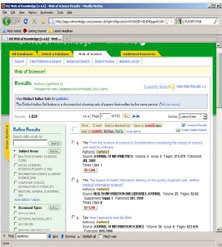

**Figure 4.2: ISI Web of Knowledge search interface**

Download the first 500 records using the output box at the bottom of the page.  Enter records ‘1’ to ‘500’, select ‘Full Record’ and ‘plus Cited Reference’, select ‘Save to Plain Text’ in the drop down menu, and then click save. Wait for the processing to complete, and then save the file as *EugeneGarfield.isi.*  Part of the resulting file can be seen in Figure 4.3 (right). A file with 99 records can be found in *“/scientometrics/isi/EugeneGarfield.isi”*.

<!-- page 25 -->

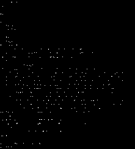

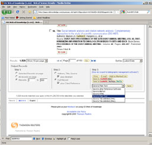

**Figure 4.3: Saving and viewing EugenGarfield.isi**

ISI files are loosely based on the RIS file format, and data in this format is commonly used for the following types of analyses:

- `o`
  Statistical Attributes
      - `o`
        NR (Cited Reference Count)
      - `o`
        TC (Times Cited)
- `o`
  Temporal Analysis
        - `o`
          RC (Date / Date Modified)
        - `o`
          PD (Date Published)
    - `o`
      IS (Issue)
    - `o`
      CY (Meeting Date)
    - `o`
      VL (Volume)
      - `o`
        PY (Year)
- `o`
  Geospatial Analysis
      - `o`
        AD (Address)
      - `o`
        C1 (Author Address)
      - `o`
        CL (Meeting Location)
      - `o`
        PA (Publisher Address)
      - `o`
        PI (Publisher City)
        - `o`
          RP (Reprint Address)
  - `o`
    Topical Analysis
        - `o`
          AB (Abstract)
        - `o`
          BS (Book Series Subtitle)
    - `o`
      SE (Book Series Title)
    - `o`
      CT (Conference Title)
    - `o`
      ID (Index Keywords)
    - `o`
      CT (Meeting Title)
      - `o`
        MH (MeSH Terms)
      - `o`
        A2 (Other Abstract)
      - `o`
        SO (Source)
      - `o`
        TI (Title)
      - `o`
        FT (Vernacular Title)
- `o`
  Network Analysis
      - `o`
        AU (Author)
        - `o`
          CR (References)
        - `o`
          IV (Investigators)
        - `o`
          AN (PubMed ID)

<!-- page 26 -->

### 4.2.1.4 Scopus

Elsevier’s Scopus, like Thomson Reuter’s Web of Science, has an extensive catalog of citations and abstracts from journals and conferences.  Subscribers to Scopus can access the service via http://www.scopus.com.

To find all articles whose abstract, title, or keywords include the terms ‘Watts Strogatz Clustering Coefficient’, simply enter those terms in the Article/Abstract/Keywords field.  Twenty‐five results were found as of November 11th, 2009.  Download up to 2,000 references by checking the ‘Select All’ box and clicking ‘Output’.

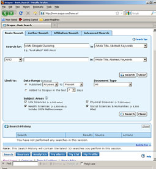

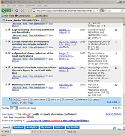

**Figure 4.4: Scopus search interface**

At the output window, select ‘Comma separated file, .csv (e.g. Excel)’ and ‘Complete format’ from the drop‐down menus and hit ‘Export’.  Save the file as *WattsStrogatz.scopus*.  Part of the resulting file can be seen in Figure 4.5 (right).

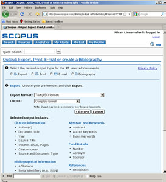

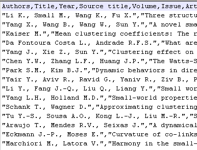

**Figure 4.5: Saving and viewing WattsStrogatz.scopus**

<!-- page 27 -->

Data in Scopus files is commonly used for the following types of analyses:

- `o`
  Temporal Analysis
      - `o`
        Issue
      - `o`
        Volume
      - `o`
        Year
- `o`
  Geospatial Analysis
      - `o`
        Correspondence Address
- `o`
  Topical Analysis
      - `o`
        Abstract
      - `o`
        Author Keywords
        - `o`
          Conference Name
        - `o`
          Index Keywords
        - `o`
          Source Title
        - `o`
          Source
        - `o`
          Title
  - `o`
    Network Analysis
    - `o`
      Authors
    - `o`
      References

### 4.2.1.5 Google Scholar

Google Scholar data can be acquired using *Publish or Perish* (Harzing, 2008) that can be freely downloaded from http://www.harzing.com/pop.htm. A query for papers by Albert‐László Barabási run on Sept. 21, 2008 results in 111 papers that have been cited 14,343 times, see Figure 4.6.

**Figure 4.6: Publish or Perish interface with query result for Albert‐László Barabási**

To save records, select from menu ‘*File > Save as Bibtex*’ or ‘*File > Save as CSV*’ or ‘*File > Save as EndNote*’. All three file formats can be read by the Sci2 Tool. The result in all three formats named ‘LaszloBarabasi.*’ is also available in the respective subdirectories in ‘_yoursci2directory_ /sampledata/scientometrics/ ’ and will be used subsequently.

Data from Google Scholar can be used for the following types of analyses:

<!-- page 28 -->

- `o`
  Statistical Attributes
  - `o`
    Cites
- `o`
  Temporal Analysis
  - `o`
    Year
- `o`
  Topical Analysis
  - `o`
    Source
  - `o`
    Title
- `o`
  Network Analysis
    - `o`
      Authors

## 4.2.2 Datasets: Funding

### 4.2.2.1 NSF Award Search

Funding data provided by the National Science Foundation (NSF) can be retrieved via the *Award Search* site (http://www.nsf.gov/awardsearch).  Search by PI name, institution, and many other fields, see Figure 4.7.

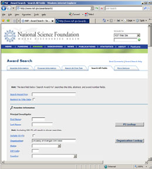

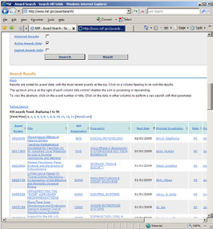

**Figure 4.7: NSF ‘Award Search’ site**

To retrieve all projects funded under the Science of Science and Innovation Policy (SciSIP) program, simply select the ‘Program Information’ tab, do an ‘Element Code Lookup’, enter ‘7626’ into the ‘Element Code’ field, and hit ‘Search’ button. On Sept 21st, 2008, exactly 50 awards were found.  Award records can be downloaded in CSV, Excel or XML format. Save file in CSV format, and replace rename the file extension from .csv to .nsf.  A sample .nsf file is available in ‘*yoursci2directory* /sampledata/scientometrics/nsf/BethPlale.nsf ’. In the Sci2 Tool, load the file  using *'File > Load File'.* A table with all records will appear in the Data Manager. Right click and view file in ‘Microsoft Office Excel’.

Data in NSF files can be used for the following types of analyses:

- `o`
  Network Analysis
      - `o`
        Principle Investigator
        - `o`
          Co‐PI Name(s)
        - `o`
          Organization
  - `o`
    Temporal Analysis
        - `o`
          Expiration Date
    - `o`
      Start Date

<!-- page 29 -->

- `o`
  Geospatial Analysis
    - `o`
      Organization City
    - `o`
      Organization State
    - `o`
      Organization Street Address
      - `o`
        Organization Zip
  - `o`
    Topical Analysis
      - `o`
        Abstract
      - `o`
        NSF Organization
      - `o`
        Title

### 4.2.2.2 NIH RePORTER

Funding data provided by the National Institutes of Health (NIH), and associated publications and patents,  can be retrieved via the *NIH RePORTER* site (http://projectreporter.nih.gov/reporter.cfm).  The database draws from eRA, MEDLINE, PubMed Central, NIH Intramural, and iEdison.  Search by location, PI name, category, etc., see Figure 4.8.

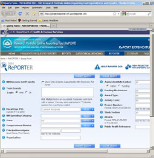

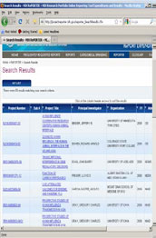

**Figure 4.8: NIH RePORTER site**

A sample search of “Epidemic” in the ‘Public Health Relevance’ field displays 205 results as of November 11th, 2009.  Up to 500 results can be exported into CSV or Excel format using the “Export” button at the top of the page. Save the file as a .csv and load it into the Sci2 Tool using *'File > Load File’* to perform temporal or topical analyses.

Data in NIH files can be used for the following types of analyses:

- `o`
  Statistical Attributes
      - `o`
        Type
- `o`
  Temporal Analysis
      - `o`
        Year of award
  - `o`
    Topical Analysis
        - `o`
          Abstract
        - `o`
          Project Title
  - `o`
    Network Analysis
        - `o`
          Principle Investigator
        - `o`
          Organization
    - `o`
      Project Number

## 4.2.3 Datasets: Scholarly Database

<!-- page 30 -->

The Scholarly Database (SDB) at Indiana University provides easy access to more than 23,000,000 records from MEDLINE, U.S. Patents, as well as awards by the National Science Foundation and the National Institutes of Health, see Figure 4.9 (right) for number of records per year. Anybody can register at http://sdb.slis.indiana.edu, cross‐ search all four databases, and download large amounts of data as dump and in precompiled formats, see Figures 4.9 to 4.11 for interface snapshots.

Search the four databases separately or in combination for ‘Creators’ (authors, inventors, investigators) or terms occurring in ‘Title’, ‘Abstract’, or ‘All Text’ for all or specific years.  If multiple terms are entered in a field, they are automatically combined using ‘OR’. So, ‘breast cancer’ matches any record with ‘breast’ or ‘cancer’ in that field. You can put AND between terms to combine with ‘AND’. Thus ‘breast AND cancer’ would only match records that contain both terms. Double quotation can be used to match compound terms, e.g., ‘“breast cancer”’ retrieves records with the phrase “breast cancer”, and not records where ‘breast’ and ‘cancer’ are both present, but not the exact phrase. The importance of a particular term in a query can be increased by putting a ^ and a number after the term. For instance, ‘breast cancer^10’ would increase the importance of matching the term ‘cancer’ by ten compared to matching the term ‘breast’.

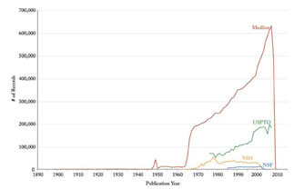

**Figure 4.9: Scholarly Database ‘Home’ page and data holdings in March 2010**

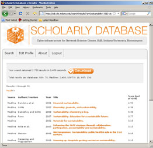

**Figure 4.10: Scholarly Database ‘Search’ and ‘Browse’ interface**

<!-- page 31 -->

Results are displayed in sets of 20 records, ordered by a Solr internal matching score. The first column represents the record source, the second the creators, third comes the year, then title and finally the matching score. Datasets can be downloaded in different subsets and formats for future analysis.

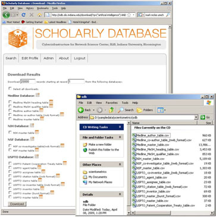

**Figure 4.11: Scholarly Database ‘Download’ interface**

Data from the SDB can be used in a great number of ways.  The following is an abridged list of suggested uses:

  - `o`
    Statistical Attributes
      - `o`
        expected_total_amount
      - `o`
        times_cited
      - `o`
        citing_patents
  - `o`
    Temporal Analysis
      - `o`
        issue_date
      - `o`
        year
      - `o`
        date_expires
      - `o`
        project_end
      - `o`
        issue
      - `o`
        date_started
    - `o`
      project_start
    - `o`
      volume
    - `o`
      published_year
- `o`
  Geospatial Analysis
    - `o`
      address
    - `o`
      street
    - `o`
      city
    - `o`
      state
      - `o`
        country
      - `o`
        zipcode
      - `o`
        residence
  - `o`
    Topical Analysis

<!-- page 32 -->

  - `o`
    abstract
  - `o`
    descriptorname
  - `o`
    nsf_org
  - `o`
    title
  - `o`
    article_title
  - `o`
    Title
- `o`
  Network Analysis
    - `o`
      name
    - `o`
      inventor
    - `o`
      authors
    - `o`
      cited_patents
    - `o`
      investigators
    - `o`
      pi_title

## 4.3 Database Loading and Manipulation

Coming soon but see Sections 5.1.5 and 5.2.2. 

## 4.4 Summaries and Table Extractions

Coming soon.

## 4.5 Statistical Analysis/Profiling

Coming soon.

## 4.6 Temporal Analysis (When)

Science evolves over time. Attribute values of scholarly entities and their diverse aggregations increase and decrease at different rates and respond with different latency rates to internal and external events. Temporal analysis aims to identify the nature of phenomena represented by a sequence of observations such as patterns, trends, seasonality, outliers, and bursts of activity.

A time series is a sequence of events or observations that are ordered in time. Time‐series data can be continuous—i.e., there is an observation at every instant of time; or discrete—i.e., observations exist for regularly or irregularly spaced intervals. Temporal aggregations—over journal volumes, years, or decades—are common.

Frequently, some form of filtering is applied to reduce noise and make patterns more salient. Smoothing (i.e., averaging using a smoothing window of a certain width) and curve approximation might be applied. The number of scholarly records is often plotted to get a first idea of the temporal distribution of a dataset. It might be shown in total values or as a percentage of those. One may find out how long a scholarly entity was active; how old it was at a certain point; what growth, latency to peak, or decay rate it has; what correlations with other time series exist; or what trends are observable. Data models such as the least squares model—available in most statistical software packages—are applied to best fit a selected function to a data set and to determine if the trend is significant. Kleinberg’s burst detection algorithm (Kleinberg 2002) is commonly applied to identify words that have experienced a sudden change in frequency of occurrence.

## 4.6.1 Burst Detection

A scholarly dataset can be understood as a discrete time series, i.e., a sequence of events/observations which are ordered in one dimension – time. Observations, e.g. papers, come into existence for regularly spaced intervals, e.g., each month (volume) or year.

Kleinberg’s burst detection algorithm identifies sudden increases in the usage frequency of words. These words may connect to author names, journal names, country names, references, ISI keywords, or terms used in title and/or abstract of a paper. Rather than using plain frequencies of the occurrences of words, the algorithm employs a probabilistic automaton whose states correspond to the frequencies of individual words. State transitions correspond to points in time around which the frequency of the word changes significantly. The

<!-- page 33 -->

algorithm generates a ranked list of the word bursts in the document stream, together with the intervals of time in which they occurred. This can serve as a means of identifying topics, terms, or concepts important to the events being studied that increased in usage, were more active for a period of time, and then faded away.

In the Sci2 Tool, the algorithm can be found under *‘Analysis > Textual > Burst Detection’*. As the algorithm itself is case sensitive, care must be taken if the user desires ‘KOREA’ and ‘korea’ and ‘Korea’ to be identified as the same word.

## 4.6.2 Slice Table by Time

Slicing a table allows the user to see the evolution of a network over time.  Time slices can be cumulative, i.e., later tables include information from all previous intervals, or fully sliced, i.e., each table only includes data from its own time interval.  Cumulative slices can be useful for seeing growth over time, whereas fully sliced tables should be used for displaying changing structure over time.

## 4.7 Geospatial Analysis (Where)

Geospatial analysis has a long history in geography and cartography. Geospatial analysis aims to answer the question of where something happens and with what impact on neighboring areas.

Geospatial analysis requires spatial attribute values or geolocations for authors and their papers, extracted from affiliation data or spatial positions of nodes, generated from layout algorithms. Geospatial data can be continuous (i.e., each record has a specific position) or discrete (i.e., each set of keywords has a position or area—shape file— e.g., number of papers per country). Spatial aggregations (e.g., merging via ZIP codes, counties, states, countries, and continents) are common.

*Cartographic generalization* refers to the process of abstraction such as (1) graphic generalization: the simplification, enlargement, displacement, merging, or selection of entities without enhancement or effect to their symbology; and (2) conceptual symbolization: the merging, selection, and symbolization of entities, including enhancement—such as representing high‐density areas with a new (city) symbol.

*Geometric generalization* aims to solve the conflict between the number of visualized features, the size of symbols, and the size of the display surface. Cartographers dealt with this conflict intuitively in part until researchers like Friedrich Töpfer attempted to solve them with quantifiable expressions.

## 4.8 Topical Analysis (What)

The topic or semantic coverage of a unit of science can be derived from the text associated with it. Topical aggregations (e.g., over journal volumes, scientific disciplines, or institutions) are common.

Topic analysis extracts the set of unique words or word profiles and their frequency from a text corpus. Stop words, such as “the” and “of” are removed. Stemming can be applied. Co‐word analysis identifies the number of times two words are used in the title, keyword set, abstract and/or full text of a paper. The space of co‐occurring words can be mapped providing a unique view of the topic coverage of a dataset. Similarly, units of science can be grouped according to the number of words they have in common.

Salton’s term frequency inverse document frequency (TFIDF) is a statistical measure used to evaluate the importance of a word in a corpus. The importance increases proportionally to the number of times a word appears in the paper but is offset by the frequency of the word in the corpus.

Dimensionality reduction techniques are commonly used to project high‐dimensional information spaces (i.e., the matrix of all unique papers multiplied by their unique terms, into a low, typically two‐dimensional space).

## 4.8.1 Word Co‐Occurrence Network

The topic similarity of basic and aggregate units of science can be calculated via an analysis of the co‐occurrence of words in associated texts. Units that share more words in common are assumed to have higher topical overlap and are connected via linkages and/or placed in closer proximity. Word co‐occurrence networks are weighted and undirected.

<!-- page 34 -->

## 4.9 Network Analysis (With Whom?)

The study of networks aims to increase our understanding of natural and manmade networks. It builds on social network analysis, physics, information science, bibliometrics, scientometrics, econometrics, informetrics, webometrics, communication theory, sociology of science, and several other disciplines.

Authors, institutions, and countries, as well as words, papers, journals, patents, and funding are represented as nodes and their complex interrelations as edges. Nodes and edges can have (time‐stamped) attributes.

Figure 4.12 shows a sample dataset of five papers, A through E, published over three years together with their authors named x, y, z, references (blue references cite papers outside this set) and citations (green citation links are made by future papers) as well as some commonly derived networks. Note that the citation links are directed from old papers to current and future papers denoting the flow of knowledge. For commonly studied network types are listed and exemplified on the right. The extraction of these and other scholarly networks is explained below.

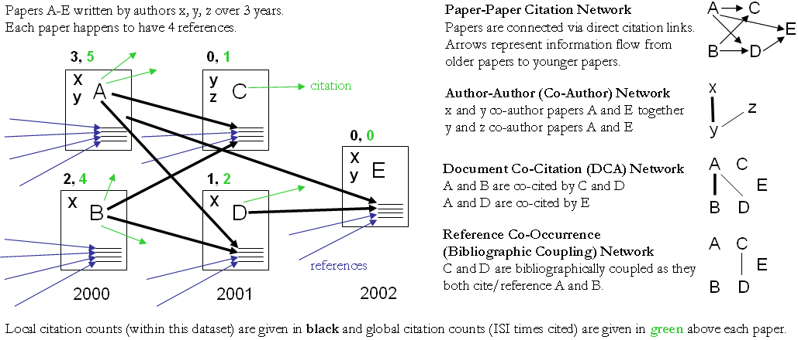

**Figure 4.12: Sample paper network (left) and four different network types derived from it (right).**

Diverse algorithms exist to calculate specific node, edge, and network properties.1 Node properties comprise degree centrality, betweenness centrality, or hub and authority scores. Edge properties include durability, reciprocity, intensity (weak or strong), density (how many potential edges in a network actually exist), reachability (how many steps it takes to go from one “end” of a network to another), centrality (whether a network has a “center” point), quality (reliability or certainty), and strength. Network properties refer to the number of nodes and edges, network density, average path length, clustering coefficient, and distributions from which general properties such as small‐world, scale‐free, or hierarchical can be derived. Identifying major communities via community detection algorithms and calculating the “backbone” of a network via pathfinder network scaling or maximum flow algorithms helps to communicate and make sense of large scale networks. 

## 4.9.1 Network Extraction

Networks are extracted using three types of linkages: direct linkages between nodes of same or different types, co‐ occurrence linkages and co‐citation linkages as explained below.

### 4.9.1.1 Direct Linkages

*4.9.1.1.1  Document‐Document (Citation) Network*

Papers cite other papers via references forming an unweighted, directed paper citation graph. It is beneficial to indicate the direction of information flow, in order of publication, via arrows. References enable a search of the citation graph backwards in time. Citations to a paper support the forward traversal of the graph. Citing and being cited can be seen as roles a paper possesses (Nicolaisen 2007).

<!-- page 35 -->

*4.9.1.1.2  Author‐Author (Citation) Network*

Authors cite other authors via document references forming a weighted, directed author citation graph.  Like document‐document networks, author citation networks represent the flow of information over time.  Unlike document citations, however, these networks have weighted edges representing the volume of citations from one author to the next.

*4.9.1.1.3  Source‐Source (Citation) Network*

For larger scale studies, it is often useful to explore citation patterns between entire journals and other varieties of publications.  These networks can reveal both the relative importance of certain publications, and the underlying connections between disciplines.  These networks are directed and weighted by volume of citations between journals.

*4.9.1.1.4  Author‐Paper (Consumed/Produced) Network*

There are active and passive units of science. Active units, e.g., authors, produce and consume passive units, e.g., papers, patents, datasets, software. The resulting networks have multiple types of nodes, e.g., authors and papers. Directed edges indicate the flow of resources from sources to sinks, e.g., from an author to a written/produced paper to the author who reads/consumes the paper.

### 4.9.1.2 Co‐Occurrence Linkages

*4.9.1.2.1  Author Co‐Occurrence (Co‐Author) Network*

Having the names of two authors (or their institutions, countries) listed on one paper, patent, or grant is an empirical manifestation of scholarly collaboration. The more often two authors collaborate, the higher the weight of their joint co‐author link. Weighted, undirected co‐authorship networks appear to have a high correlation with social networks that are themselves impacted by geospatial proximity (Wellman, White et al. 2004; Börner, Penumarthy et al. 2006).

*4.9.1.2.2  Document Cited Reference Co‐Occurrence (Bibliographic Coupling) Network*

Papers, patents or other scholarly records that share common references are said to be coupled bibliographically (Kessler 1963). The bibliographic coupling strength of two scholarly papers can be calculated by counting the number of times that they reference the same third work in their bibliographies. The coupling strength is assumed to reflect topic similarity. Co‐occurrence networks are undirected and weighted.

*4.9.1.2.3  Author Cited Reference Co‐Occurrence (Bibliographic Coupling) Network*

Authors who cite the same sources are coupled bibliographically.  The bibliographic coupling (BC) strength between two authors can be said to be a measure of similarity between them.  The resulting network is weighted and undirected.

*4.9.1.2.4  Journal Cited Reference Co‐Occurrence (Bibliographic Coupling) Network*

Like document and author bibliographic coupling networks, journal cited reference co‐occurrences provide a measurement of similarity between journals.  Edge strength between two journals is determined by the summing number of unique references both journals cite.

### 4.9.1.3 Co‐Citation Linkages

Two scholarly records are said to be *co‐cited* if they jointly appear in the list of references of a third paper. The more often two units are co‐cited the higher their presumed similarity.

*4.9.1.3.1  Document Co‐Citation Network (DCA)*

DCA was simultaneously and independently introduced by Small and Marshakova in 1973 (Small 1973; Marshakova 1973.; Small and Greenlee 1986). It is the logical opposite of bibliographic coupling. The co‐citation frequency equals the number of times two papers are cited together, i.e., they appear together in one reference list.

<!-- page 36 -->

*4.9.1.3.2  Author Co‐Citation Network (ACA)*

Authors of works that are repeatedly juxtaposed in references‐cited lists are assumed to be related. Clusters in ACA networks often reveal shared schools of thought or methodological approach, common subjects of study, collaborative and student‐mentor relationships, ties of nationality, etc. Some regions of scholarship are densely crowded and interactive. Others are isolated and nearly vacant.

*4.9.1.3.3  Journal Co‐Citation Network (JCA)*

JCA networks offer wide‐angle views of scholarly disciplines.  Slicing these networks by time can reveal the evolution of disciplinary similarity.  Like author and document co‐citation networks, these are undirected and weighted.

## 4.9.2 Compute Basic Network Characteristics

It is often advantageous to know for a network

- `o`
  Whether it is directed or undirected
  - `o`
    Number of nodes
  - `o`
    Number of isolated nodes
  - `o`
    A list of node attributes
  - `o`
    Number of edges
  - `o`
    Whether the network has self loops, if so, lists all self loops
    - `o`
      Whether the network has parallel edges, if so, lists all parallel edges
- `o`
  A list of edge attributes
  - `o`
    Average degree
  - `o`
    Whether the graph is weakly connected
  - `o`
    Number of weakly connected components
  - `o`
    Number of nodes in the largest connected component
  - `o`
    Strong connectedness for directed networks
  - `o`
    Graph density

In the Sci2 Tool, use *‘Analysis > Network Analysis Toolkit (NAT)’* to get basic properties, e.g., for the network of Florentine families available in ‘*yoursci2directory*/sampledata/network/florentine.nwb ’. The result for this dataset is:

`This graph claims to be undirected.` `Nodes: 16` `Isolated nodes: 1` `Node attributes present: label, wealth, totalities, priorates` `Edges: 27` `No self loops were discovered.` `No parallel edges were discovered.` `Edge attributes:` `Nonnumeric attributes:` `Example value` `marriag... T` `busines... F` `Did not detect any numeric attributes` `This network does not seem to be a valued network.` `Average degree: 3.375` `This graph is not weakly connected.` `There are 2 weakly connected components. (1 isolates)` `The largest connected component consists of 15 nodes.` `Did not calculate strong connectedness because this graph was not directed.` `Density (disregarding weights): 0.225`

## 4.9.3 Network Analysis

In the analysis menu, certain algorithms append values to each node, or delete groups of nodes and edges entirely. When several algorithms are applied simultaneously, their results can be compared by viewing them in GUESS. Figure 4.23 below compares ‘*Weak Component Clustering*’, ‘*Node Degree*’, ‘*Node Betweenness Centrality*’, and ‘*Pathfinder Network Scaling*’ run on the ‘*FourNetSciResearchers’* dataset.  Weak Component Clustering extracts the N largest weakly connected components of a network, Node Degree calculates the amount of edges adjacent to a

<!-- page 37 -->

node, and Pathfinder Network Scaling prunes a network to find its underlying structure.  Node Betweenness Centrality appends a value to each node which correlates to the amount of shortest paths that node resides on. The more shortest paths between node‐pairs a certain node resides on, the higher its betweenness centrality.  To learn about each algorithm, see Section 3.1 Sci2 Tool Plugins or visit https://nwb.slis.indiana.edu/community/ for details.

## 4.9.4 Network Visualization

### 4.9.4.1 GUESS Visualizations

Load the sample dataset ‘*yoursci2directory*/sampledata/networks/florentine.nwb’ and calculate an additional node attribute ‘Betweenness Centrality’ by running *‘Analysis > Networks > Unweighted and Undirected > Node Betweenness Centrality’* with default parameters. Then select the network and run *‘Visualization > Networks > GUESS’* to open GUESS with the file loaded. It might take some time for the network to load. The initial layout will be random. Wait until the random layout is completed and the network is centered before proceeding.

The GUESS window is divided into three parts:

1. Information Window ‐ Examine node and edge attributes, see Figure 4.12, left.
1. Visualization Window ‐ View and manipulate network, see Figure 4.12, top right.
1. Interpreter/Graph Modifier panels ‐ Analyze/change network properties; see Figure 4.12, bottom right.

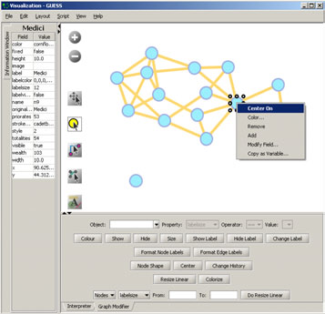

**Figure 4.12: GUESS ‘Information, ‘Visualization’, and ’Graph Modifier’ windows**

*4.9.4.1.1 Network Layout and Interaction*

GUESS provides different network layout algorithms under menu item ‘Layout’. Apply *‘Layout > GEM’* to the Florentine network.  Use *‘Layout > Bin Pack’* to compact and center the network layout.  Using the mouse pointer, hover over a node or edge to see its properties in the Information window. Right clicking on a node gives the options to *‘Center on’, ‘Color’, ‘Toggle Label’, ‘Remove’, ‘Add’, ‘Modify Field’,* and *‘Copy as Variable’,* see Figure 4.12.

GUESS supports different types of interaction:

<!-- page 38 -->

  Pan – simply ‘grab’ the background by clicking and holding down the left mouse button, and move it using the mouse.

  Zoom – Using the scroll wheel on the mouse OR press the “+” and “‐” buttons in the upper‐left hand corner OR right‐click and move the mouse left or right. Center graph by selecting ‘*View > Center’*.

  Click

to select/move single nodes. Hold down ‘Shift’ to select multiple.  Right click node to modify Color, etc.

Use the ‘Graph Modifier’ panel to change node attributes, e.g.,

  Select “all nodes” in the Object drop‐down menu and click “Show Label” button.

  Select *‘Resize Linear ‐ Nodes ‐ totalities’* drop‐down menu, then type “5” and “20” into the “From” and “To” Value box separately. Then select ‘Do Resize Linear’.

  Select *‘Colorize ‐ Nodes ‐ totalities’*, then select white and enter

(204,0,51) in the pop‐up color box boxes on in the “From” and “To” buttons.  Select “Format Node Labels”, replace default text {original label} with your own label in the pop‐up box ‘Enter a formatting string for node labels’. This will create the labels shown in Figure 4.13.

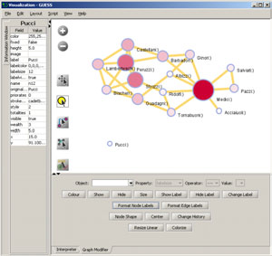

**Figure 4.13: Using the GUESS ’Graph Modifier’**

*4.9.4.1.2 Interpreter*

The ‘Interpreter’ panel supports Jython, a version of Python that runs on the Java Virtual Machine.  Users can write code in the interpreter to modify the layout and its design at a high level of detail. Here we list some exemplary GUESS commands which can be used to modify the layout.

Color all nodes *uniformly*

`g.nodes.color =red` `# circle filling` `g.nodes.strokecolor =red` `# circle ring` `g.nodes.labelcolor =red` `# circle label` `colorize(numberofworks,gray,black)` `for n in g.nodes:` `n.strokecolor = n.color`

Size code nodes

`g.nodes.size = 30` `resizeLinear(numberofworks,.25,8)`

Label

`for i in range(0, 50):` `# make labels of most productive authors visible` `nodesbynumworks[i].labelvisible = true`

<!-- page 39 -->

Print

`for i in range(0, 10):` `print str(nodesbydegree[i].label) + ": " + str(nodesbydegree[i].indegree)`

Edges

`g.edges.width=10` `g.edges.color=gray`

Color and resize nodes based on their betweenness:

`colorize(wealth, white, red)` `resizeLinear(sitebetweenness, 5, 20)`

The result is shown in Figure 4.14. Read https://nwb.slis.indiana.edu/community/?n=VisualizeData.GUESS on more information on how to use the interpreter.

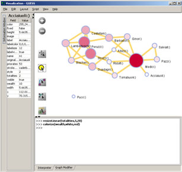

**Figure 4.14: Using the GUESS ‘Interpreter’**

### 4.9.4.2 DrL Large Network Layout

DrL is a force‐directed graph layout toolbox for real‐world large‐scale graphs up to 2 million nodes (Davidson, Wylie et al. 2001; Martin, Brown et al. in preparation). It includes:

  Standard force‐directed layout of graphs using algorithm based on the popular VxOrd routine (used in the VxInsight program).

  Parallel version of force‐directed layout algorithm.

  Recursive multilevel version for obtaining better layouts of very large graphs.

  Ability to add new vertices to a previously drawn graph.

It is one of the few force‐directed layout algorithms that can scale to over 1 million nodes, making it ideal for large graphs. However, small graphs (hundreds or less) do not always end up looking good. The algorithm expects similarity matrices as input. Distance matrices will have to be converted before they can be laid out.

The version of DrL included in Sci2 only does the standard force‐directed layout (no recursive or parallel computation). DrL expects the edges to be weighted and directed where the non‐zero weight denotes how similar the two nodes are (higher is more similar). The Sci2 version has several parameters. The edge cutting parameter expresses how much automatic edge cutting should be done. 0 means as little as possible, 1 as much as possible. Around .8 is a good value to use. The weight attribute parameter lets you choose which edge attribute in the network corresponds to the similarity weight. The X and Y parameters let you choose the attribute names to be

<!-- page 40 -->

used in the returned network which corresponds to the X and Y coordinates computed by the layout algorithm for the nodes.

DrL is commonly used to layout large networks, e.g., those derived in co‐citation and co‐word analyses.  In the Sci2 Tool, the results can be viewed in either GUESS or *‘Visualization > Specified (prefuse alpha)’*.  For more information see https://nwb.slis.indiana.edu/community/?n=VisualizeData.DrL.

## 4.10 Modeling (Why?)

Data models are grouped into two major types: descriptive models and process models. *Descriptive models* aim to illustrate the major features of a (typically static) data set, such as statistical patterns of article citation counts, networks of citations, individual differences in citation practice, the composition of knowledge domains, or the identification of research fronts as indicated by new yet highly cited papers. *Process models* or predictive models aim to simulate, statistically describe, or formally reproduce statistical and dynamic characteristics of interest.

## 4.10.1 Random Graph Model

The random graph model generates a graph that has a fixed number of nodes which are connected randomly by undirected edges, see Figure 4.15 (left).  The number of edges depends on a specified probability. The edge probability is chosen based on the number of nodes in the graph. The model most commonly used for this purpose was introduced by Gilbert (Gilbert 1959). This is known as the G(n,p) model with *n* being the number of vertices and *p* the linking probability. The number of edges created according to this model is not known in advance. Erdős‐ Rényi introduced a similar model where all the graphs with *m* edges are equally probable and *m* varies between *0* and *n(n‐1)/2* (Erdős and Rényi 1959). This is known as the* G(n,m)* model. The degree distribution for this network is Poissonian, see Figure 4.15 (right)

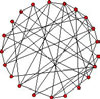

**Figure 4.15: Random graph and its Poissonian node degree distribution**

Very few real world networks are random. However, random networks are a theoretical construct that is well understood and their properties can be exactly solved. They are commonly used as a reference, e.g., in tests of network robustness and epidemic spreading (Batagelj and Brandes).

In the Sci2 Tool, the random graph generator implements the *G(n.p)* model by Gilbert. Run with *‘Modeling > Random Graph’* and input the total number of nodes in the network and their wiring probability. The output is a network in which each pair of nodes is connected by an undirected edge with the probability specified in the input.

A wiring probability of 0 would generate a network without any edges and a wiring probability of 1 with *n* nodes will generate a network with *(n‐1)* edges. The wiring probability should be chosen dependent on the number of vertices. For a large number of vertices the wiring probability should be smaller.

## 4.10.2 Watts‐Strogatz Small World

A small‐world network is one whose majority of nodes are not directly connected to one another, but still can reach any other node via very few edges. It can be used to generate networks of any size. The degree distribution is almost Poissonian for any value of the rewiring probability (except in the extreme case of rewiring probability zero, for which all nodes have equal degree). The clustering coefficient is high until beta is close to 1, and as beta approaches one, the distribution becomes Poissonian.  This is because the graph becomes increasingly similar to an Erdős‐Rényi Random Graph, see Figure 4.16. (Watts and Strogatz 1998; Wikimedia Foundation 2009).

<!-- page 41 -->

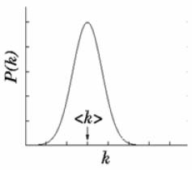

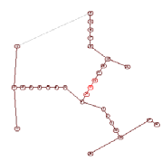

**Figure 4.16: Small world graph (left) and its node degree distribution (right)**

Small world properties are usually studied to explore networks with tunable values for the average shortest path between pairs of nodes and a high clustering coefficient. Networks with small values for the average shortest path and large values for the clustering coefficient can be used to simulate social networks, unlike ER random graphs, which have small average shortest path lengths, but low clustering coefficients.

The algorithm requires three inputs: the number *n* of nodes of the network, the number *k* of initial neighbors of each node (the initial configuration is a ring of nodes) and the probability of rewiring the edges (which is a real number between 0 and 1). The network is built following the original prescription of Watts and Strogatz, i.e., by starting from a ring of nodes each connected to the k nodes and by rewiring each edge with the specified probability. The algorithm run time is *O(kn).*

Run with *‘Modeling > Watts‐Strogatz Small World’* and input 1000 nodes, 10 initial neighbors, and a rewiring probability of 0.01 then compute the average shortest path and the clustering coefficient and verify that the former is small and the latter is relatively large.

## 4.10.3 Barabási‐Albert Scale Free Model

The Barabási‐Albert (BA) model is an algorithm which generates a scale‐free network by incorporating growth and preferential attachment. Starting with an initial network of a few nodes, a new node is added at each time step. Older nodes with a higher degree have a higher probability of attracting edges from new nodes. The probability of attachment is given by

.

The initial number of nodes in the network must be greater than two and each of these nodes must have at least one connection. The final structure of the network does not depend on the initial number of nodes in the network. The degree distribution of the generated network is a power law with a scaling coefficient of *‐3* (Barabási and Albert 1999; Barabási and Albert 2002). Figure 4.17 shows the network on the left and the probability distribution on a log‐log scale on the right. 

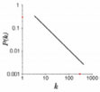

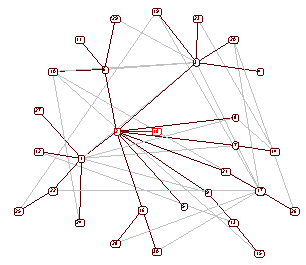

**Figure 4.17:** **Scale free graph (left) and its node degree distribution (right)**

This is the simplest known algorithm to generate a scale‐free network. It can be applied to model undirected networks such as the collaboration network among scientists, the movie actor network, and other social networks where the connections between the nodes are undirected. However, it cannot be used to generate a directed network.

The inputs for the algorithm are the number of time steps, the number of initial nodes, and the number initial edges for a new node. The algorithm starts with the initial number of nodes that are fully connected. At each time step, a new node is generated with the initial number of edges. The probability of attaching to an existing node is calculated by dividing the degree of an existing node by the total number of edges. If this probability is greater

<!-- page 42 -->

than zero and greater than the random number obtained from a random number generator then an edge is attached between the two nodes. This is repeated in each time step.

Run with *‘Modeling > Barabási‐Albert Scale Free Model’* and a time step of around *1000*, initial number of nodes *2*, and number of edges *1* in the input. Layout and determine the number and degree of highly connected nodes via *‘Analysis > Unweighted and Undirected > Degree Distribution’* using the default value. Plot node degree distribution using Gnuplot.

<!-- page 43 -->

# 5 Sample Workflows

Scientometric studies cover a wide array of datasets, methodologies, and results.  Analysis can lead to several types of insights, particularly those leading the questions “what,” “where,” “when,” and “with whom” (topical, geospatial, temporal, and network analysis, respectively), see Section 1 Introduction.  Many studies also cover statistical surveys of scientometric datasets.  For details descriptions of the types of scientometric analyses, see Sections 4.5 Statistical Analysis through 4.9 Network Analysis.

Each of these analysis types can be performed between one of three major scales: micro/individual, meso/local, and macro/global.  The Sci2 Tool supports workflows in all fifteen varieties of scientometric studies, as well as combination and modeling studies.  The following chapter describes the workflows to conduct scientometric studies of each type and at each scale.  Tables 1.1 and 1.2 in Section 1 Introduction show examples of studies in category, several of which can be found in Chapter 6 Sample Science Studies & Online Services.

## 5.1 Individual Level Studies ‐ Micro

## 5.1.1 Mapping Collaboration, Publication and Funding Profiles of One Researcher (EndNote and NSF Data)

### 5.1.1.1 Endnote

|  | KatyBorner.enw |  |  |  |  |
| --- | --- | --- | --- | --- | --- |
|  | Time frame: |  |  | 1992-2010 |  |
| Region(s): Indiana University, University of Technology in Leipzig, University of Freiburg, University of Bielefeld |  |  |  |  |  |
| Topical Area(s): |  |  |  | Network Science, Library and Information Science, Informatics and |  |
|  |  |  |  | Computing, Statistics, Cyberinfrastructure, Information Visualization, |  |
|  |  |  |  | Cognitive Science, Biocomplexity |  |
| Analysis Type(s): Co-Authorship Network |  |  |  |  |  |

Many researchers, tools, and online services use EndNote to organize their bibliographies. To analyze an individual researcher’s collaboration and publication profile, load an EndNote file into the Sci2 Tool including their entire CV. To generate a research profile for Katy Borner, load Katy Borner’s EndNote file at ‘*yoursci2directory*/sampledata/scientometrics/endnote/KatyBorner.enw ’ and run *‘Data Preparation > Text Files > Extract Co‐Author Network’* using the parameter:

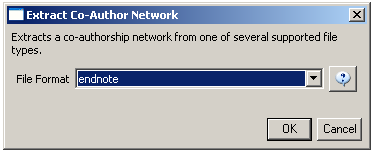

After generating Dr. Borner’s co‐authorship network, run *‘Analysis > Networks > Unweighted & Undirected > Node Degree’* to append degree information to each node.  To visualize the network, run *‘Visualization > Networks > GUESS’* and select ‘*GEM*’ in the ‘Layout’ menu once the graph is fully loaded. The resulting network in Figure 5.1 was modified using the following workflow:

1. Resize Linear > Nodes > totaldegree > From: 5 To: 30 > Do Resize Linear (Note: total degree is the number of papers) 2. Resize Linear > Edges > weight From: 1 To: 10 > Do Resize Linear (Note: weight is the number of co‐ authored papers)

<!-- page 44 -->

3. Colorize > Nodes > totaldegree From :

To:

> Do Colorize

4. Colorize > Edges > weight From:

> Do Colorize 5. Object: nodes based on ‐> > Property: totaldegree > Operator: >= > Value: 10 > Show Label 6. Type in Interpreter: `>for n in g.nodes:` `… n.strokecolor = n.color`

To:

The largest cluster in the network is outlined in black, and represents one single paper with many authors.

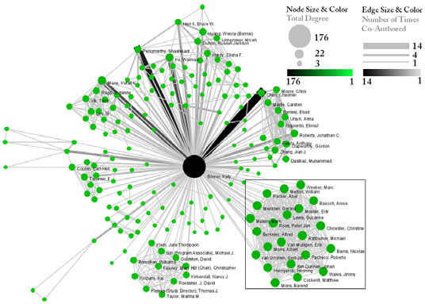

**Figure 5.1: Co‐authorship network of Katy Borner**

This is a so called ego‐centric network, i.e., almost complete data is available and shown for exactly one ego. The publication records for all other authors in the network are most likely incomplete.

### 5.1.1.2 NSF

|  | KatyBorner.nsf |  |  |  |  |
| --- | --- | --- | --- | --- | --- |
|  | Time frame: |  |  | 2003-2008 |  |
| Region(s): Indiana University |  |  |  |  |  |
| Topical Area(s): |  |  |  | Network Science, Library and Information Science, Informatics and |  |
|  |  |  |  | Computing, Statistics, Cyberinfrastructure, Information Visualization, |  |
|  |  |  |  | Cognitive Science, Biocomplexity |  |
| Analysis Type(s): Co-PI Network, Grant Award Summary |  |  |  |  |  |

Free online services such as NSF’s Award Search (See Section 4.2.2.1 NSF Award Search) support the retrieval of ego‐centric funding profiles. Here, a search was exemplarily conducted for “Katy Borner” in the “Principal Investigator” field while keeping the “Include CO‐PI” box checked.

<!-- page 45 -->

The resulting data is available at ‘*yoursci2directory*/sampledata/scientometrics/nsf/KatyBorner.nsf.*’* Load the data using ‘*File > Load*’, select the loaded dataset in the Data Manager window, and run *‘Data Preparation > Text Files > Extract Co‐Occurrence Network’* using these parameters:

Select the “Extracted Network on Column All Investigators” network and run *‘Analysis >Networks > Network Analysis Toolkit (NAT)’* to reveal that there are 13 nodes and 28 edges in the network without isolates. Select *‘Visualization > Networks > GUESS’* to visualize the resulting Co‐PI network. Select ‘*GEM*’ from the layout menu.

Load the default Co‐PI visualization theme via ‘*File > Run Script …*’and load ‘*yoursci2directory*/scripts/GUESS/co‐ *PI‐nw.py*’.  Alternatively, use the “Graph Modifier” to customize the visualization. The resulting network in Figure 5.2 was modified using the following workflow:

1. Resize Linear > Nodes > totalawardmoney > From: 5 To: 35 > Do Resize Linear
1. Resize Linear > Edges > coinvestigatedawards From: 1 To: 2 > Do Resize Linear

3. Colorize > Nodes > totalawardmoney From :

To:

> Do Colorize

4. Colorize > Edges > coinvestigatedawards From:

> Do Colorize 5. Object: all nodes > Show Label 6. Type in Interpreter: `>for n in g.nodes:` `… n.strokecolor = n.color`

To:

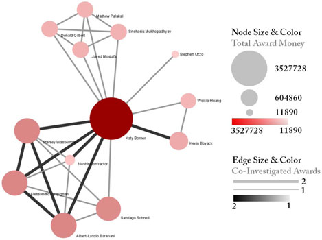

**Figure 5.2: NSF Co‐PI network of Katy Borner**

<!-- page 46 -->

For a summary of the grants themselves, with a visual representation of their award amount, select the NSF csv file in the Data Manager and run ‘*Visualization > Temporal > Horizontal Bar Graph’*, entering the following parameters:

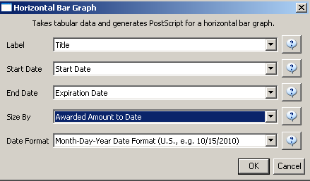

The generated postscript file can be viewed using Adobe Distiller or GhostViewer (see Section 2.4 Saving Visualizations for Publication) and is shown in Figure 5.3.

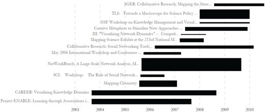

**Figure 5.3**: **Horizontal Bar Graph of KatyBorner.NSF**

Note that co‐PIs from so called collaborative awards are not shown in the network. Senior personnel that might be key to the success of a project is not part of this dataset either. That is awards in which Borner served as senior personnel as well as her senior personnel collaborators are not shown.

## 5.1.2 Time Slicing of Co‐Authorship Networks (ISI Data)

|  | AlessandroVespignani.isi |  |  |  |  |
| --- | --- | --- | --- | --- | --- |
|  | Time frame: |  |  | 1988-2006 |  |
| Region(s): Indiana University, University of Rome, Yale University, Leiden University, International Center for Theoretical Physics, University of Paris-Sud |  |  |  |  |  |
| Topical Area(s): |  |  |  | Informatics, Complex Network Science and System Research, |  |
|  |  |  |  | Physics, Statistics, Epidemics |  |
| Analysis Type(s): Co-Authorship Network |  |  |  |  |  |

<!-- page 47 -->

The Sci2 Tool supports the analysis of evolving networks.  For this study, load Alessandro Vespignani’s publication history from ISI, that was downloaded from Thomson’s Web of Science (see Section 4.2.1 Datasets: Publication) and is available at ‘*yoursci2directory*/sampledata/scientometrics/isi/AlessandroVespignani.isi ’using ‘*File > Load and Clean ISI File*’. Slice the data into five year intervals from 1988‐2007 using *‘Preprocessing > Temporal > Slice Table by Time’* and the following parameters:

Choose “Publication Year” in the Date/Time Column field and leave the default Date/Time Format. “Slice Into” allows the user to slice the table by days, weeks, months, quarters, years, decades, and centuries. There are two additional options for time slicing: ‘cumulative’ and ‘align with calendar’. The former produces cumulative tables containing all data from the beginning of the time range to the end of each table’s time interval, which can be seen in the Data Manager and below:

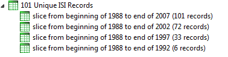

The latter option aligns the output tables according to calendar intervals:

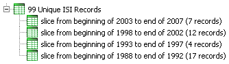

Choosing “Years” under “Slice Into” creates multiple tables beginning from January 1st of the first year. If “Months” is chosen, it will start from the first day of the earliest month in the chosen time interval.

To see the evolution of Vespignani’s co‐authorship network over time, check ‘cumulative’. Then, extract co‐ authorship networks one at a time for each sliced time table using ‘*Data Preparation > Text Files > Extract Co‐ Author Network’*, making sure to select ‘ISI’ from the drop‐down menu during the extraction. Visualize the evolving network using GUESS as shown in Figure 5.4.

<!-- page 48 -->

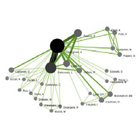

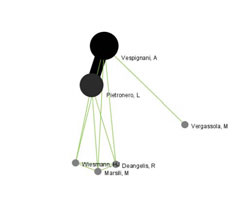

*1988‐1992                                                         1988‐1997*

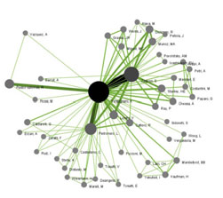

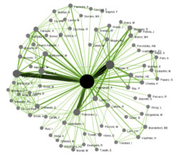

*1988‐2002 1988‐2007*

***Figure 5.4:*** *Evolving co‐authorship network of Vespignani from 1988‐2007*

The four networks reveal that from 1988‐1992, Alessandro Vespignani had one primary co‐author and four secondary co‐authors. His network expanded considerably over time comprising 221 co‐authors in 2007.

## 5.1.3 Funding Profiles of Three Researchers at Indiana University (NSF Data)

|  | GeoffreyFox.nsf |  |  |  |  |
| --- | --- | --- | --- | --- | --- |
|  | BethPlale.nsf |  |  |  |  |
|  | MichaelMcRobbie.nsf |  |  |  |  |
|  | Time frame: |  |  | 1978-2010 |  |
| Region(s): Indiana University |  |  |  |  |  |
|  | Topical Area(s): |  |  | Informatics, Miscellaneous |  |
| Analysis Type(s): Co-PI Network, Grant Award Summary |  |  |  |  |  |

<!-- page 49 -->

It is often useful to compare the profiles of multiple researchers within similar disciplinary or institutional domains. For this comparison, we use the complete funding profiles of three Indiana University researchers as retrieved via NSF’s Award Search, see Section 4.2.2.1 NSF Award Search. Load the files *‘GeoffreyFox.nsf’, ‘MichaelMcRobbie.nsf’,* and *‘BethPlale.nsf’* into the Sci2 Tool using ‘*File > Load*’ from ‘*yoursci2directory*/sampledata/scientometrics/nsf’*.* Once loaded, run ‘*Visualization > Temporal > Horizontal Bar Graph*’ for each file with the following parameters:

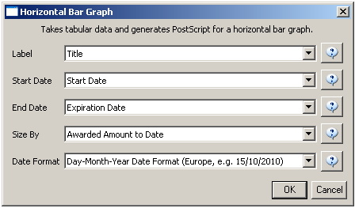

The resulting horizontal bar graph visualizations are given in Figure 5.5. The horizontal bar coding and labeling is as follows:

Note the different time spans over which grants were funded, the volume of grants (area size), and number of grants.

<!-- page 50 -->

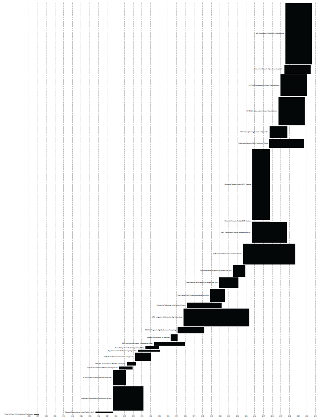

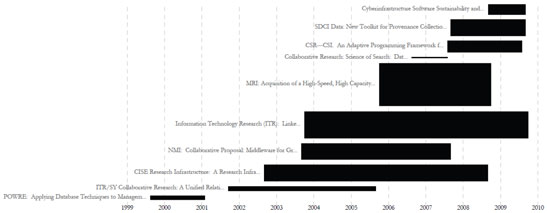

**Figure 5.5: Funding profiles over time of Geoffrey Fox (top), Beth Plale (middle) and Michael McRobbie (bottom) at**

*Indiana University.*

<!-- page 51 -->

Next, we compare the Co‐PI networks. Select each dataset in the Data Manager window and run *‘Data Preparation > Text Files > Extract Co‐Occurrence Network’* using these parameters:

Run *‘Visualization > Networks > GUESS’* on each generated network to visualize the resulting Co‐PI relationships. Select ‘*GEM*’ from the layout menu to organize the nodes and edges.

To color and size the nodes and edges using the default Co‐PI visualization theme, run ‘*yoursci2directory*/scripts/GUESS/co‐PI‐nw.py ’ from ‘*File > Run Script …*’.

**Figure 5.6: Co‐PI network of Geoffrey Fox in Indiana University.**

<!-- page 52 -->

**Figure 5.7: Co‐PI network of Beth Plale in Indiana University.**

**Figure 5.8: Co‐PI network of Michael McRobbie in Indiana University.**

<!-- page 53 -->

## 5.1.4 Studying Four Major NetSci Researchers (ISI Data)

|  | FourNetSciResearchers.isi |  |  |  |  |
| --- | --- | --- | --- | --- | --- |
|  | Time frame: |  |  | 1955-2007 |  |
| Region(s): Miscellaneous |  |  |  |  |  |
|  | Topical Area(s): |  |  | Network Science |  |
| Analysis Type(s): Paper Citation Network, Co-Author Network, Bibliographic Coupling Network, Document Co-Citation Network, Word Co- Occurrence Network |  |  |  |  |  |

### 5.1.4.1 Paper‐Paper (Citation) Network

In the Sci2 Tool, load the file ‘*yoursci2directory*/sampledata/scientometrics/isi/FourNetSciResearchers.isi’ using *'File > Load and Clean ISI File'.* A table of the records and a table of all records with unique ISI ids will appear in the Data Manager. In this file each original record now has a ‘Cite Me As’ attribute that is constructed from the 'first author, PY, J9, VL, BP' fields of its ISI record and will be used when matching paper and reference records.

To extract the paper citation network, select the *‘361 Unique ISI Records’* table and run *'Data Preparation > Text Files > Extract Directed Network'* using the parameters:

The result is a directed network of paper citations in the Data Manager. Each paper node has two citation counts. The local citation count (LCC) indicates how often a paper was cited by papers in the set. The global citation count (GCC) equals the times cited (TC) value in the original ISI file. Paper references have no GCC value, except for references that are also ISI records. Currently, the Sci2 Tool sets the GCC of references to ‐1 (except for references that are not also ISI records). This is useful to prune the network to contain only the original ISI records.

To view the complete network, select the network and run *‘Visualization > Networks > GUESS’* and wait until the network is visible and centered. Layout the network, e.g., using the Generalized Expectation‐Maximization (GEM) algorithm using *‘GUESS: Layout > GEM’*. Pack the network via *‘GUESS: Layout > Bin Pack’*. To change the background color use *‘GUESS: Display > Background Color’*. To size and color code nodes, select the ‘Interpreter’ tab at the bottom, left‐hand corner of the GUESS window, and enter the command lines:

`> resizeLinear(globalcitationcount,1,50)` `> colorize(globalcitationcount,gray,black)` `> for e in g.edges:` `...` `e.color="127,193,65,255" # enter a tab after the three dots` `...` `# hit Enter again`

Note: The Interpreter tab will have ‘>>>’ as a prompt for these commands.  It is not necessary to type ‘>’ at the beginning of the line.  You should type each line individually and hit enter to submit the commands to the Interpreter.  For more information, refer to the GUESS tutorial at http://nwb.slis.indiana.edu/Docs/GettingStartedGUESSNWB.pdf.

This way, nodes are linearly size and color coded by their GCC, and edges are green as shown in Figure 4.15 (left). Any field within the network can be substituted to code the nodes.  To view the available fields, open the Information Window (*‘Display > Information Window’*) and mouse over a node.  Also note that each ISI paper record in the network has a dandelion shaped set of references.

<!-- page 54 -->

The GUESS interface supports pan and zoom, node selection, and details on demand, see GUESS tutorial. For example, the node that connects the Barabási‐Vespignani network in the upper left to Garfield’s network in the lower left is *Price, 1986, Little Science, Big Science*. The network on the right is centered on Wasserman’s works.

**Figure 5.9: Directed, unweighted paper‐paper citation network for ‘FourNetSciResearchers’ dataset with all papers**

*and references in the GUESS user interface (left) and a pruned paper‐paper citation network after removing all*

*references and isolates (right)*

The complete network can be reduced to papers that appeared in the original ISI file by deleting all nodes that have a GCC of ‐1. Simply run *'Preprocessing > Networks > Extract Nodes Above or Below Value’* with parameter values:

`Extract from this number` `-1` `Below?` `# leave unchecked` `Numeric Attribute` `globalCitationCount`

The resulting network is unconnected, i.e., it has many subnetworks many of which have only one node. These single unconnected nodes, also called isolates, can be removed using *'Preprocessing > Networks > Delete Isolates’*. Deleting isolates is a memory intensive procedure.  If you experience problems at this step, refer to Section 3.3 Memory Allocation.

The *‘FourNetSciResearchers’* dataset has exactly 65 isolates. Removing those leaves 12 networks shown in Figure 6 (right) using the same color and size coding as in Figure 5 (left). Using *‘GUESS: Display > Information Window’* reveals detailed information for any node or edge. Here the node with the highest GCC value was selected.

Alternatively, nodes could have been color and/or size coded by their degree using, e.g.,

`> g.computeDegrees()` `> colorize(outdegree,gray,black)`

Note that the outdegree corresponds to the LCC within the given network while the indegree reflects the number of references, helping to visually identify review papers.

| Unweighted & Directed > Weak Component Clustering’ with the default values | . The largest component has 163 |
| --- | --- |
| nodes, the second largest 45, the third 24, and the fourth and fifth have 12 and 11 nodes respectively. The largest |  |
| component, also called giant component, is shown in |  |

`> toptc = g.nodes[:]` `> def bytc(n1, n2):` `...` `return cmp(n1.globalcitationcount, n2.globalcitationcount)` `> toptc.sort(bytc)` `> toptc.reverse()`

<!-- page 55 -->

`> toptc` `> for i in range(0, 20):` `...` `toptc[i].labelvisible = true`

Alternatively, run ‘GUESS: File > Run Script …’ and select ‘*yoursci2directory*/scripts/GUESS/paper‐citation‐nw.py’*.*

**Figure 5.10: Giant components of the paper citation network**

| Compare the result with Figure 5.10 and note that this network layout algorithm–and most others–are non‐ |
| --- |
| deterministic. That is, different runs lead to different layouts – observe the position of the highlighted node in both |
| layouts. However, all layouts aim to group connected nodes into spatial proximity while avoiding overlaps of |
| unconnected or sparsely connected subnetworks. |

### 5.1.4.2 Author Co‐Occurrence (Co‐Author) Network

To produce a co‐authorship network in the Sci2 Tool, select the table of all 361 unique ISI records from the *‘FourNetSciResearchers’* dataset in the Data Manager window. Run *‘Data Preparation > Text Files > Extract Co‐ Author Network’* using the parameter:

| To produce a co‐authorship network in the |
| --- |
| ‘FourNetSciResearchers’ dataset |

`File Format` `isi`

The result is two derived files in the Data Manager window: the co‐authorship network and a table with a listing of unique authors, also known as ‘merge table’. The merge table can be used to manually unify author names, e.g., “Albet, R” and “Albert, R” see example below.

In order to manually examine and if needed correct the list of unique authors, open the merge table, e.g., in a spreadsheet program. Sort by author names and identify names that refer to the same person. In order to merge two names, simply delete the asterisk (‘*’) in the last column of the duplicate node’s row. In addition, copy the uniqueIndex of the name that should be kept and paste it into the cell of the name that should be deleted. Table 4.1 shows the result for merging “Albet, R” and “Albert, R” where “Albet, R” will be deleted yet all of the nodes linkages and citation counts will be added to “Albert, R”.

***Table 5.1:*** *Merging of author nodes using the merge table*

| label | timesCited | numberOfWorks | uniqueIndex | combineValues |
| --- | --- | --- | --- | --- |
| Abt, HA | 3 | 1 | 142 | * |
| Alava, M | 26 | 1 | 196 | * |
| Albert, R | 7741 | 17 | 60 | * |
| Albet, R | 16 | 1 | 60 |  |

A merge table can be automatically generated by applying the Jaro distance metric (Jaro 1989; Jaro 1995) available in the open source Similarity Measure Library (http://sourceforge.net/projects/simmetrics/) to identify potential duplicates. In the Sci2 Tool, simply select the co‐author network and run *‘Scientometrics > Detect Duplicate Nodes’* using the parameters:

`Attribute to compare on` `label`

<!-- page 56 -->

`Merge when this similar` `0.95` `Create notice when this similar` `0.85` `Number of shared first letter 2`

| files describe which nodes will be merged or not merged in a more human‐readable form. Specifically, the first log |  |  |
| --- | --- | --- |
| file provides | information | on which nodes will be merged (right click and select view to examine the file), while the |
| second log file lists nodes which will not be merged, but are similar. Based on this information the automatically |  |  |
| generated merge table can be further modified as needed. |  |  |

In sum, unification of author names can be done manually or automatically independently or in conjunction. It is recommended to create the initial merge table automatically and to fine‐tune it as needed. Note that the same procedure can be used to identify duplicate references – simply select a paper‐citation network and run *‘Data Preparation > Text Files > Detect Duplicate Nodes’* using the same parameters as above and a merge table for references will be created.

| To merge identified duplicate nodes, select the merge table and the co‐authorship network holding down the ‘Ctrl |
| --- |
| key. Run |

The updated co‐author network can be visualized using *‘Visualization > Networks > GUESS’*, see the above explanation on GUESS. Figure 5.11 shows a layout of the combined *‘FourNetSciResearchers’* dataset after setting the background color to white and using the command lines:

`> resizeLinear(numberofworks,1,50)` `> colorize(numberofworks,gray,black)` `> for n in g.nodes:` `...` `n.strokecolor = n.color` `# border color same as its inside color` `> resizeLinear(numberofcoauthoredworks, .25, 8)` `> colorize(numberofcoauthoredworks, "127,193,65,255", black)` `> nodesbynumworks = g.nodes[:]` `# make a copy of the list of all nodes` `> def bynumworks(n1, n2):` `# define a function for comparing nodes` `...` `return cmp(n1.numberofworks, n2.numberofworks)` `> nodesbynumworks.sort(bynumworks)` `# sort list` `> nodesbynumworks.reverse()` `# reverse sorting, list starts with highest #` `> for i in range(0, 50):` `# make labels of most productive authors visible` `...` `nodesbynumworks[i].labelvisible = true`

Alternatively, run ‘GUESS: File > Run Script …’ and select ‘*yoursci2directory*/scripts/GUESS/co‐author‐nw.py ’.

That is, author nodes are color and size coded by the number of papers per author. Edges are color and thickness coded by the number of times two authors wrote a paper together. The remaining commands identify the top‐50 authors with the most papers and make their name labels visible.

GUESS supports the repositioning of selected nodes. Multiple nodes can be selected by holding down the ‘Shift’ key and dragging a box around specific nodes. The final network can be saved via *‘GUESS: File > Export Image’* and opened in a graphic design program to add a title and legend. The image below was created using Photoshop and label sizes were changed as well.

<!-- page 57 -->

**Figure 5.11: Undirected, weighted co‐author network for ‘FourNetSciResearchers’ dataset**

### 5.1.4.3 Cited Reference Co‐Occurrence (Bibliographic Coupling) Network

In Sci2 Tool, a bibliographic coupling network is derived from a directed paper citation network; see section 4.9.1.1. Document‐Document (Citation) Network. Select the paper citation network of the *‘FourNetSciResearchers’* dataset in the Data Manager. Run *‘Data Preparation > Text Files > Extract Reference Co‐Occurrence (Bibliographic Coupling) Network’* and the bibliographic coupling network becomes available in the Data Manager.

|  | see section 4.9.1.1 |
| --- | --- |
| the ‘FourNetSciResearchers’ dataset |  |

Running *‘Analysis > Networks > Network Analysis Toolkit (NAT)’* reveals that the network has 5,335 nodes (5,007 of which are isolate nodes) and 6,206 edges. Edges with low weights can be eliminated by running *'Preprocessing > Networks > Extract Edges Above or Below Value’* with parameter values:

| Isolate nodes can be removed running ‘Preprocessing > Networks > Delete Isolates’. The resulting network has 241 |
| --- |
| nodes and 1,508 edges in 12 weakly connected components. |

Isolate nodes can be removed running ‘*Preprocessing > Networks > Delete Isolates’*. The resulting network has 241 nodes and 1,508 edges in 12 weakly connected components. This network can be visualized in GUESS; see Figure 5.12 and the above explanation. Nodes and edges can be color and size coded, and the top‐20 most cited papers can be labeled by entering the following lines in the GUESS Interpreter:

`> resizeLinear(globalcitationcount,2,40)`

<!-- page 58 -->

`> colorize(globalcitationcount,(200,200,200),(0,0,0))` `> resizeLinear(weight,.25,8)` `> colorize(weight, "127,193,65,255", black)` `> for n in g.nodes:` `...` `n.strokecolor=n.color` `> toptc = g.nodes[:]` `> def bytc(n1, n2):` `...` `return cmp(n1.globalcitationcount, n2.globalcitationcount)` `> toptc.sort(bytc)` `> toptc.reverse()` `> toptc` `> for i in range(0, 20):` `...` `toptc[i].labelvisible = true`

Alternatively, run ‘GUESS: File > Run Script …’ and select ‘*yoursci2directory*/scripts/GUESS/reference‐co‐ *occurence‐nw.py*’.

**Figure 5.12**: **Reference co‐occurrence network layout for ‘FourNetSciResearchers’ dataset**

### 5.1.4.4 Document Co‐Citation Network (DCA)

|  | Isolates |
| --- | --- |
| can be removed running ‘Preprocessing > Networks > Delete Isolates’. The resulting network has 5122 nodes and |  |

`Extract from this number` `4` `Below?` `# leave unchecked` `Numeric Attribute` `weight`

Here, only edges with a local co‐citation count of five or higher are kept. The giant component in the resulting network has 265 nodes and 1,607 edges. All other components have only one or two nodes.

The giant component can be visualized in GUESS, see Figure 5.13 (right); see the above explanation, and use the same size and color coding and labeling as the bibliographic coupling network. Simply run *‘GUESS: File > Run Script …’* and select ‘*yoursci2directory*/scripts/GUESS/reference‐co‐occurence‐nw.py’

<!-- page 59 -->

**Figure 5.13: Undirected, weighted bibliographic coupling network (left) and undirected, weighted co‐citation**

*network (right) of ‘FourNetSciResearchers’ dataset, with isolate nodes removed*

### 5.1.4.5 Word Co‐Occurrence Network

In the Sci2 Tool, select the table of 361 unique ISI records from the *‘FourNetSciResearchers’* dataset in the Data Manager. Run ‘*Preprocessing > Topical > Normalize Text’* using parameters

`New Separator |` `Abstract` `# Check this box`

| The performed text normalization utilizes the StandardAnalyzer provided by Lucene (http://lucene.apache.org). It |
| --- |
| separates text into word tokens, normalizes word tokens to lower case, removes 's from the end of words, |
| removes dots from acronyms, deletes stop words, then applies the English Snowball stemmer |
| (http://snowball.tartarus.org/algorithms/english/stemmer.html), which is a version of the Porter2 stemmer |
| designed for the English language.. |

The result is a derived table in which the text in the abstract column is normalized. Select this table and run ‘*Data Preparation > Text Files > Extract Word Co‐Occurrence Network’* using parameters:

| Node Identifier Column Cite Me As |
| --- |
| Text Source Column Abstract |
| Text Delimiter | |
| Aggregate Function File [None] |

| The outcome is a network in which nodes represent words and edges denote their joint appearance in a paper. |
| --- |
| Word co‐occurrence networks are rather large and dense. Running |

The outcome is a network in which nodes represent words and edges denote their joint appearance in a paper. Word co‐occurrence networks are rather large and dense. Running the *‘Analysis > Networks > Network Analysis Toolkit (NAT)’* reveals that the network has 2,888 word nodes and 366,009 co‐occurrence edges. There are 235 isolate nodes that can be removed running ‘*Preprocessing > Networks > Delete Isolates’*. Note that when isolates are removed, papers without abstracts are removed along with the keywords.

| The result is one giant component with 2,653 nodes and 366,009 edges. To visualize this rather large network run |
| --- |
| ‘Visualization > Networks > DrL (VxOrd)’ with default values. |

To keep only the strongest edges run ‘*Preprocessing > Networks > Extract Top Edges’* using parameters

`Top Edges` `1000`

and leave the others at their default values. Once edges have been removed, the network can be visualized by running *'Visualization > Networks > GUESS'*. In GUESS, run the following commands:

`> for node in g.nodes:` `# to position the nodes at the DrL calculated place` `...` `node.x = node.xpos * 40` `...` `node.y = node.ypos * 40` `...`

<!-- page 60 -->

`> resizeLinear(references, 2, 40)` `> colorize(references,[200,200,200],[0,0,0])` `> resizeLinear(weight, .1, 2)` `> g.edges.color = "127,193,65,255"`

and set the background color to white to re‐create the visualization. The result should look something like the one in Figure 5.14.

**Figure 5.14: Undirected, weighted word co‐occurrence network for ‘FourNetSciResearchers’ dataset**

## 5.1.5 Studying Four Major NetSci Researchers (ISI Data) using Database

New versions of the Sci2 Tool include the ability to load ISI files into a database.  While the initial loading can take quite some time for larger datasets (see Sections 3.3 Memory Allocation and 3.4 Memory Limits), it results in vastly faster and more powerful data processing and extraction.  The database functionality also allows users to compose and extract custom SQL queries, which will be documented in later versions of this documentation.

|  | /sampledata/scientometrics/isi/FourNetSciResearchers.isi’ |
| --- | --- |
| using ‘File > Load’ instead of ‘File > Load and Clean ISI File’. Now run ‘File > Load Into Database > Load ISI File Into |  |
| Database’. View the database schema by right‐clicking on the loaded database in the Data Manager and clicking |  |
| “View”. |  |

**Figure 5.15: Viewing the database schema.**

| As before, it is important to clean the database before running any extractions by merging and matching authors, |
| --- |
| journals, and references. Run ‘Data Preparation > Database > ISI > Merge Identical ISI People’, followed by ‘Data |

<!-- page 61 -->

| Preparation > Database > ISI > Merge Journals’ and ‘Data Preparation > Database > ISI > Match References to |
| --- |
| Papers’. Make sure to wait until each cleaning step is complete before beginning the next one. |

**Figure 5.16**: **Cleaned database of ‘FourNetSciResearchers’.**

| Extract Authors’ and right‐click on the resulting table to view all the authors from FourNetSciResearchers.isi. The |
| --- |
| table also has columns with information on how many papers each person in the dataset authored, their Global |
| Citation Count (how many times they have been cited according to ISI), and their Local Citation Count (how many |
| times they were cited in the current dataset). |

| The queries can also output data specifically tailored for the burst detection algorithm (see Section 4.6.1 Burst |
| --- |
| Detection). Run ‘Data Preparation > Database > ISI > Extract Authors > Extract References by Year for Burst |
| Detection’ on the cleaned database followed by ‘Analysis > Topical > Burst Detection’ with the following |
| parameters: |

Now visualize the burst analysis with ‘*Visualize > Temporal > Horizontal Bar Graph*’ with the following parameters:

See Section 2.4 Saving Visualizations for Publications to save and view the graph shown in Figure 5.17.

<!-- page 62 -->

**Figure 5.17**: **Top reference bursts in the ‘FourNetSciResearchers’ dataset.**

| ‘Data Preparation > Database > ISI > Extract Authors > Extract Longitudinal Study’ will output a table which list |
| --- |
| metrics for every year mentioned in the dataset. The longitudinal study table contains the volume of documents |
| and references published per year, as well as the total amount of references made, the amount of distinct |
| references, distinct authors, distinct sources, and distinct keywords per year. The results are graphed in Figure |
| 5.18. |

***5.18***: *Longitudinal study of ‘FourNetSciResearchers’.*

The largest speed increases from the database functionality can be found in the extraction of networks.  First, compare the results of a co‐authorship extraction with those from Section 5.1.4.2 Author Co‐Occurrence (Co‐ Author) Network.  Run ‘*Data Preparation > Database > ISI > Extract Authors > Extract Co‐Author Network*’ followed by ‘*Analysis > Networks > Network Analysis Toolkit (NAT)*’.  Notice that both networks have 247 nodes and 891 edges.  Visualize the extracted network in GUESS using ‘*Visualization > Networks > GUESS*’ and ‘*Layout > GEM’*.  To apply the default co‐authorship theme, go to ‘Script > Run Script’ and find *‘*yoursci2directory*/scripts/GUESS/co‐ author‐nw_database.py’*.  The resulting network will look like Figure 5.11.

| edges. Visualize the extracted network in GUESS using ‘Visualization > Networks > GUESS’ and ‘Layout > GEM’. To |
| --- |
| apply the default co‐authorship theme, go to ‘Script > Run Script’ and find ‘ |

The database allows for several network extractions that cannot be achieved with the text‐based algorithms. Journal co‐citation networks reveal which journals are cited together the most frequently.  Run ‘*Preparation >*

<!-- page 63 -->

| Database > ISI > Extract Authors > Journal Co‐Citation Network (core and references)’ to create a network of co‐ |
| --- |
| cited journals, and then prune it using ‘ |

| ‘Visualization > Networks > GUESS’ and ‘Layout > GEM’. Resize and color the edges to display the strongest and |
| --- |
| earliest co‐citation links using the following parameters: |

Resize, color, and label the nodes to display their degree using the following parameters:

The resulting Journal Co‐Citation Analysis (JCA) network is given in Figure 5.20.

<!-- page 64 -->

**Figure 5.20**: **Journal co‐citation analysis of ‘FourNetSciResearchers’**

## 5.2 Institution Level Studies ‐ Meso

## 5.2.1 Funding Profiles of Three Universities (NSF Data)

|  | Cornell.nsf |  |  |  |  |
| --- | --- | --- | --- | --- | --- |
|  | Indiana.nsf |  |  |  |  |
|  | Michigan.nsf |  |  |  |  |
|  | Time frame: |  |  | 2000-2009 |  |
| Region(s): Cornell University, Indiana University, Michigan University |  |  |  |  |  |
|  | Topical Area(s): |  |  | Miscellaneous |  |
| Analysis Type(s): Co-PI Network |  |  |  |  |  |

Load ‘*Cornell.nsf*’, ‘*Michigan.nsf*’, and ‘*Indiana.nsf*’ from ‘*yoursci2directory*/sampledata/scientometrics/nsf’ and use the following workflow for each of the three nsf files loaded.  Select one of the loaded datasets in the Data Manager window and run *‘Data Preparation > Text Files > Extract Co‐Occurrence Network’* using the parameters:

<!-- page 65 -->

Two derived files will appear in the Data Manager window: the co‐PI network and a merge table. In the network, nodes represent investigators and edges denote their co‐PI relationships. The merge table can be used to further clean PI names, see Section 5.1.4.2 Author Co‐Occurrence (Bibliographic Coupling) Network.

Choose the “Extracted Network on Column All Investigators” and run *‘Analysis > Networks > Network Analysis Toolkit (NAT)’*.  This will display the amount of nodes and edges, as well as the amount of isolate nodes that can be removed running *‘Preprocessing > Networks > Delete Isolates’.*

Select *‘Visualization > Networks > GUESS’* and run ‘*Layout > GEM’* followed by ‘*Layout > BinPack’* to visualize the network. Run the ‘*yoursci2directory*/scripts/GUESS/co‐PI‐nw.py’ script.  Visualizations of the three university’s co‐PI networks are given in Figure 5.15.

<!-- page 66 -->

**Figure 5.15: Co‐PI network of Indiana University (top, left), Cornell University (top, right), University of Michigan**

*(middle).*

<!-- page 67 -->

To see a more detailed view of any of the components in the network, e.g. the largest Indiana component, select the Indiana network with deleted isolates in the Data Manager and run *‘Analysis > Networks > Unweighted and Undirected > Weak Component Clustering’* with the parameter:

Indiana’s largest component has 19 nodes, Cornell’s has 67 nodes, Michigan’s has 55 nodes. Visualize Indiana’s network in GUESS using the ‘*yoursci2directory*/scripts/GUESS/co‐PI‐nw.py’ script and save the file as a jpg via *‘File > Export Image’*.

**Figure 5.16: Largest component of Indiana University co‐PI network. Node size and color display the total award**

*amount.*

## 5.2.2 Funding Profiles of Three Universities (NSF Data) Using Database

The Sci2 Tool supports the creation of databases for NSF files.  Database loading improves the speed and functionality of data preparation and preprocessing.  To use this feature, select the Indiana NSF file in the Data Manager and go to ‘*File > Load Into Database > Load NSF File Into Database*’.  Cleaning should be performed before any other task using ‘*Data Preparation > Database > NSF > Merge Identical NSF People*’.

To view a breakdown of each investigator from Indiana, run ‘*Data Preparation > Database > NSF > Extract Investigators*’ and then right‐click on the table in the Data Manager to view it.  Next to each investigator will be listed their total number of awards, total as the PI and as a Co‐PI, the total amount awarded to date, and their earliest award start date and latest award expiration date.

<!-- page 68 -->

To create Co‐PI networks like those from the previous workflows, simply run ‘*Data Preparation > Databases > NSF > Extract Co‐PI Network*’ on the cleaned database.  Delete the isolates by running *‘Preprocessing > Networks > Delete Isolates’.*

As before, to visualize the network, select *‘Visualization > Networks > GUESS’* and run ‘*Layout > GEM’* followed by ‘*Layout > Bin Pack’*. Run the ‘*yoursci2directory*/scripts/GUESS/co‐PI‐nw_database.py’ script to apply the standard Co‐PI network theme.

## 5.2.3 Mapping CTSA Centers (NIH RePORTER Data)

|  | CTSA2005-2009.xls |  |  |  |  |
| --- | --- | --- | --- | --- | --- |
|  | Time frame: |  |  | 2005-2009 |  |
| Region(s): Miscellaneous |  |  |  |  |  |
|  | Topical Area(s): |  |  | Clinical and Translational Science |  |
| Analysis Type(s): PI-Institution Network, Co-Authorship Network |  |  |  |  |  |

A study of all NIH Clinical and Translational Science Awards (CTSA) awards and resulting publications from 2005‐ 2009, requires advanced data acquisition and manipulation to prepare the required data.  Data comes from the union of NIH RePORTER downloads (see Section 4.2.2.2 NIH RePORTER) and NIH ExPORTER data dumps (http://projectreporter.nih.gov/exporter/). CTSA Center grants were identified first and then matched with resulting publications using a project‐specific ID. The result file is available as an Excel file in ‘*yoursci2directory*/sampledata/scientometrics/nih’.*  The file contains two spreadsheets, one with publication data and one with grant data.  Save each spreadsheet out as *grants.csv* and *publications.csv*.

First load *grants.csv* in the Sci2 Tool using ‘*File > Load*’ as a standard csv.  To view a bimodal network visualizing which main PIs associate with which institution, run ‘*Data Preparation > Text Files > Extract Bipartite Network’* with the following parameters:

The resulting network can be visualized in GUESS and laid out using GEM, see Figure 5.17.

<!-- page 69 -->

**Figure 5.17**: **Bimodal institution‐PI network for CTSA Centers.**

Now load ‘*publications.csv’* as a standard csv and create a co‐authorship network by running ‘*Data Preparation > Text Files > Extract Co‐Occurrence Network*’ with text delimiter set to “ **;** “.  The resulting co‐authorship network has 8,680 nodes, 27 isolates, and 50,160 edges, see Figure 5.18, its largest (giant) component is shown enlarged in Figure 5.19.

**Figure 5.18**: **Co‐authorship network of CTSA Center publications.**

<!-- page 70 -->

**Figure 5.19**: **Largest connected component of CTSA Center publication co‐authorship network.**

5.2.4 Biomedical Funding Profile of NSF (NSF Data)

|  | MedicalAndHealth.nsf |  |  |  |  |
| --- | --- | --- | --- | --- | --- |
|  | Time frame: |  |  | 2003-2010 |  |
| Region(s): Miscellaneous |  |  |  |  |  |
|  | Topical Area(s): |  |  | Biomedical |  |
| Analysis Type(s): NSF Organization-Program Network |  |  |  |  |  |

What organizations and programs at the National Science Foundation support projects that deal with medical and health related topics? Data was downloaded from the NSF Awards Search SIRE (http://www.nsf.gov/awardsearch) on Nov 23rd, 2009, using the query “medical AND health” in the title, abstract, and awards field, with “Active awards only” checked (see section 4.2.2.1  NSF Award Search for data retrieval details).

<!-- page 71 -->

The 286 awards are available at ‘*yoursci2directory*/sampledata/scientometrics/nsf/MedicalAndHealth.nsf.’ Load them as an NSF csv format and run *‘Data Preparation > Text Files > Extract Directed Network’* with parameters:

Select “Network with directed edges from NSF Organization to Program(s)” in the data manager and run *‘Analysis > Networks > Unweighted and Directed > Node Indgree’*, then select ‘Network with indegree attribute added to node list’ in the data manager and run ’*Analysis > Unweighted and Directed > Node Outdegree’*. Run *’Visualization > Networks > GUESS’* followed by *‘ Layout > GEM’*.

In graph modifier interface:

1. Select ‘Resize Linear > Node > outdegree > From: 1 > To: 30 > Do Resize Linear’.
1. Select ‘Object: Nodes based on ‐> > Property: outdegree > Operator: >= > Value: 1 > Colour >

> Show Label’. 3. Select ‘Object: Nodes based on ‐> > Property: indegree > Operator: >= > Value: 1 > Colour >

’.

The resulting bimodal network of NSF organizations and programs is given in Figure 5.20.

**Figure 5.20: Bimodal network of NSF Organization and Program(s) that support Medical and Health projects.**

<!-- page 72 -->

## 5.2.5 Mapping Scientometrics (ISI Data)

|  | Scientometrics.isi |  |  |  |  |
| --- | --- | --- | --- | --- | --- |
|  | Time frame: |  |  | 1978-2008 |  |
| Region(s): Miscellaneous |  |  |  |  |  |
|  | Topical Area(s): |  |  | Scientometrics |  |
| Analysis Type(s): Document Co-Citation Network |  |  |  |  |  |

This study aims to increase our understanding of the Scientometrics, a discipline which uses statistical and computational techniques to understand the structure and dynamics of science. We also demonstrate the application of large scale network layout using DrL.

All papers published in *Scientometrics* between its first appearance in 1978 and the end of 2008 was downloaded from the ISI database (see Section 4.2.1 Datasets: Publication). The data is available at ‘*yoursci2directory*/sampledata/scientometrics/isi.’ Load the data using ‘*File > Load and Clean ISI*’.  Select the loaded dataset in the Data Manager window and run *‘Data Preparation > Text Files > Extract Paper Citation Network’*. Two files will appear in the Data Manager window: the paper‐citation network and the paper information table. Select the “Extracted paper‐citation network” and run *‘Preprocessing > Networks > Extract Nodes Above or Below Value’* with the following parameters:

The produced network contains only the original ISI records. Select this file and run *‘Data Preparation > Text Files > Extract Document Co‐Citation Network’*. Examining the result file with *‘Analysis > Networks > Network Analysis Toolkit (NAT)’* shows that there are 2056 nodes, 26070 edges, and 775 isolates in the network. Run *‘Preprocessing > Delete Isolates’* to remove all the isolates. Because this network is too dense to layout in GUESS, we run ‘*Visualization > DrL (VxOrd)’* with the parameters:

Next, select “Laid out with DrL” in the Data Manager and run ‘*Visualization > Network > GUESS*’. Use the following commands in the GUESS interpreter:

`>for n in g.nodes:` `... n.x = n.xpos * 10` `... n.y = n.ypos * 10` `>resizeLinear(localcitationcount,1,50)` `>colorize(localcitationcount, gray, black)` `>resizeLinear(weight, .25, 8)` `>colorize(weight, "127,193,65,255", black)`

<!-- page 73 -->

Go to “Graph Modifier” and choose *‘Object: nodes based on ‐> > Property: localcitationcount > Operators: >= > Value: 20 > Hide Label’*. See Figure 5.21.

**Figure 5.21**: **Document co‐citation network for Scientometric.isi in GUESS without DrL edge cutting (left) and with**

*DrL (VxOrd) (right).*

5.2.6 Burst Detection in *Scientometrics* (ISI Data)

|  | Scientometrics.isi |  |  |  |  |
| --- | --- | --- | --- | --- | --- |
|  | Time frame: |  |  | 1978-2008 |  |
| Region(s): Miscellaneous |  |  |  |  |  |
|  | Topical Area(s): |  |  | Scientometrics |  |
| Analysis Type(s): Scientometrics |  |  |  |  |  |

Next, we want to know what topics drive research in scientometrics research and which of these topics and author names experienced a sudden increase in usage frequency over the 31 years this dataset covers. This section demonstrates the application of burst detection described in Section 4.6.1 Burst Detection.

| To identify authors that published a large number of papers rather suddenly, perform the following steps: First, |
| --- |
| normalize the authors using ‘Preprocessing > Topical > Normalize Text’ with the following parameters: |

<!-- page 74 -->

Next, run ‘*Analysis > Topical > Burst Detection*’ on the normalized table with the following parameters:

This will produce a table named ‘Burst detection analysis (Publication Year, Authors): maximum burst level 1’. Select the table in Data Manager and run *‘Visualization > Temporal > Horizontal Bar Graph’* with parameters:

A PostScript file will be produced in the Data Manager.

Right click the icon in the data manager and save it as PostScript as shown in Figure 5.22.

**Figure 5.22**: **Saving a PostScript file.**

Visualize the file using directions from Section 2.4 Saving Visualizations for Publication. The result is given in Figure 5.23. The horizontal bar coding and labeling is as follows:

<!-- page 75 -->

**Figure 5.23: Visualization of bursts for authors.**

To identify and visualize ISI keywords or cited references that experience a sudden increase in usage frequency, follow the same workflow as above but change parameters in ‘Burst Detection’ window as shown in Figure 5.24.

**Figure 5.24:** **Burst detection parameters for ISI keywords and cited references**

The results are shown in Figure 5.25.  Note the different burst times and strengths. There are 247 records for cited references bursts which can be printed on a wall size piece of paper but not on a letter size piece of paper.  To reduce the number of bursts, select the burst table in Data Manager:

.

Right click it and choose *‘View’.*

The option will open as a csv file.  If it isn’t already, open the file in Excel and sort the table according to burst strength.  Delete all but the top 50 bursts, save the file a csv, and re‐load it in the Sci2 Tool.

Load new csv burst file, choosing “Standard csv format” in the pop out box.

<!-- page 76 -->

Select the csv file in Data Manager and visualize it with the ‘*Visualization > Temporal > Horizontal Bar Graph’* using the workflow mentioned above.

**Figure 5.25: Bursts for new ISI keywords (top) and top 50 bursts for cited references (bottom).**

## 5.2.7 Mapping the Field of RNAi Research (SDB Data)

|  | RNAi |  |  |  |  |
| --- | --- | --- | --- | --- | --- |
|  | Time frame: |  |  | 1865-2008 |  |
| Region(s): Miscellaneous |  |  |  |  |  |
|  | Topical Area(s): |  |  | RNAi |  |

<!-- page 77 -->

**Analysis Type(s):** Co-Author Network, Patent-Citation Network, Burst Detection

How many papers, patents, and funding awards exist on a specific topic? Here we selected research on RNA interference (RNAi) is a system within living cells that helps to control which genes are active and how active they are.

The data for this analysis comes from a search of the Scholarly Database (SDB) (http://sdb.slis.indiana.edu/) for “RNAi” in “All Text” from MEDLINE, NSF, NIH and USPTO.  A copy of this data is available in ‘*yoursci2directory*/sampledata/scientometrics/sdb/RNAi’*.*  The default export format is .csv, which can be loaded in the Sci2 Tool directly.

**Figure 5.26: Downloading and saving RNAi data from the Scholarly Database.**

<!-- page 78 -->

| standard csv file. SDB tables are already pre‐normalized, so now simply run ‘Data Preparation > Text Files > Extract |
| --- |
| Co‐Occurrence Network’ using the default parameters. |

| According to ‘Analysis > Networks > Network Analysis Toolkit (NAT)’, the output network has 21,578 nodes with |
| --- |
| 131 isolates, and 77,739 edges. Visualizing such a large network is memory‐intensive, so extract only the largest |
| connected component by running ‘Analysis > Networks > Unweighted and Undirected > Weak Component |
| Clustering’ with the following parameters: |

Make sure the newly extracted network is selected in the data manager, and run ‘*Visualization > Networks > GUESS*’ followed by ‘*Layout > GEM’*.  Use a custom python script to color and size the network. The resulting network is shown in Figure 5.27.

**Figure 5.27: The largest component of MEDLINE Co‐authorship Network about RNAi**

<!-- page 79 -->

| standard csv file and run ‘Data Preparation > Text Files > Extract Bipartite Network’ using the following |
| --- |
| parameters: |

Run ‘Analysis > Networks > Unweighted & Directed > Node Indegree’ to append indegree attributes to each node, and then visualize the network using ‘*Visualization > Networks > GUESS*’ followed by ‘*Layout > GEM’*.  In the graph modifier pane, click “Resize Linear” and size nodes by the “indegree” attribute from 7 to 30, as below.  Click “Do Resize Linear”

Once again in the modifier pane, select “nodes based on ‐>” in the Object drop‐down box, “bipartitetype” in the Property drop‐down box, “==” in the Operator drop‐down box, and “cited_patents” in the Value drop‐down box. Press “Colour” and click on blue below.

Repeat the previous steps, but change the Value to “citing_patent” and select the color red.  Now press “Show Label”.  The resulting graph should look like Figure 5.28.

<!-- page 80 -->

**Figure** **5.28**: **USPTO Patent citation network on RNAi**

|  | sampledata/scientometrics/sdb/RNAi/Medline_master_table.csv’. This table includes full |
| --- | --- |
| records of MEDLINE papers, and can be used to find bursting terms from MEDLINE abstracts dealing with RNAi |  |

| the “abstract” box checked. Run ‘Analysis > Topical > Burst Detection’ with “date_cr_year” in the Date Column and |
| --- |
| “abstract” in the Text Column, leaving the rest of the values default. |

| Right click on “Burst detection analysis (date_cr_year, abstract): maximum burst level 1” in the Data Manager an |
| --- |
| view the file. There are more words than can easily be viewed with the horizontal bar graph, so sort the list by |
| “Strength” and prune all but the strongest 10 words. Save the file as a new .csv and load it into the Sci2 Tool as a |
| standard csv file. |

| Select the new table in the data manager and visualize it using ‘Visualize > Temporal > Horizontal Bar Graph’ with |
| --- |
| the following parameters: |

<!-- page 81 -->

| Right click the resulting postscript file in the data manager and save it as a PostScript file. View the resulting file |
| --- |
| using Section 2.4 Saving Visualizations for Publication. |

**Figure 5.29: Top 10 burst terms from MEDLINE abstracts on RNAi**

**5.3 Global Level Studies – Macro**

## 5.3.1 Geo USPTO (SDB Data)

|  | usptoInfluenza.csv |  |  |  |  |
| --- | --- | --- | --- | --- | --- |
|  | Time frame: |  |  | 1865-2008 |  |
| Region(s): Miscellaneous |  |  |  |  |  |
|  | Topical Area(s): |  |  | Influenza |  |
| Analysis Type(s): Geospatial Analysis |  |  |  |  |  |

Warning: Geo Map is currently being redesigned, and some screenshots may not match up with this documentation.

The file ‘*usptoInfluenza.csv*’ was generated with an SDB search for patents containing the term “Influenza”, and was heavily modified to produce a simple geographic table.  Load it using ‘*File > Load > sampledata > geo > usptoInfluenza.csv’* and then select ‘Standard csv format’. See the data format in Figure 5.30 (left).  Once loaded, select the dataset in data manager and click ‘*Visualization > Geo Map (Circle Annotation Style)’*, inputting the parameters Figure 5.30 (right). The tool will output a PostScript visualization which can be viewed using GhostView (see section *2.4 Saving Visualizations for Publication* and Figure 5.31).

<!-- page 82 -->

**Figure 5.30: Geospatial workflow with usptoinfluenza.csv data (left) and Geo Map parameters (right).**

**Figure 5.31: Geospatial map (circle) of USPTO patent influenza data.**

<!-- page 83 -->

To create a geospatial map with region coding, select *usptoinfluenza.csv* once again and then click “*Visualization > Geo Map (Colored Region Annotation Style)*”.  Use the following parameters:

**Figure 5.32: Geospatial map (region colored) of USPTO Patent influenza data.**

<!-- page 84 -->

One can also create a US Geo Map with customized data by running the same workflow but selecting “US States” in “Map”, see below.

**Figure 5.34: US map with area color coding and circle coding for aggregated data over states.**

There are two available size scaling options, “Linear” and “Logarithmic”.  We recommend using logarithmic scaling for larger datasets.

**Figure 5.35: US geospatialmap of state‐level data with logarithmic circle size scaling (left) and circle linear size**

*scaling (right).*

<!-- page 85 -->

# 6 Sample Science Studies & Online Services

## 6.1 Science Dynamics

## 6.1.1 Mapping Topics and Topic Bursts in PNAS (2004)

*By Ketan K. Mane & Katy Börner*

Scientific research is highly dynamic. New areas of science continually evolve; others gain or lose importance, merge, or split. Due to the steady increase in the number of scientific publications, it is hard to keep an overview of the structure and dynamic development of one’s own field of science, much less all scientific domains.

However, knowledge of ‘‘hot’’ topics, emergent research frontiers, or change of focus in certain areas is a critical component of resource allocation decisions in research laboratories, governmental institutions, and corporations. This paper demonstrates the utilization of Kleinberg’s burst detection algorithm, co‐word occurrence analysis, and graph layout techniques to generate maps that support the identification of major research topics and trends. The approach was applied to analyze and map the complete set of papers published in PNAS in the years 1982–2001. Six domain experts examined and commented on the resulting maps in an attempt to reconstruct the evolution of major research areas covered by PNAS.

*Co‐word space of the top 50 highly frequent and bursty words used in the top 10% most highly cited PNAS*

*publications in 1982–2001.*

**Reference:** Mane, Ketan K. & Börner, Katy. (2004). Mapping Topics and Topic Bursts in PNAS.* Proceedings of the National Academy of Sciences of the United States of America*. Vol. 101(*Suppl. 1*), 5287‐5290. http://ivl.slis.indiana.edu/km/pub/2004‐mane‐burstpnas.pdf

<!-- page 86 -->

## 6.2 Local Impact‐Output / ROI Studies

## 6.2.1 Indicator‐Assisted Evaluation and Funding of Research: Visualizing the Influence of Grants on the Number and Citation Counts of Research Papers (2003)

*By Kevin W. Boyack & Katy Börner*

This article reports research on analyzing and visualizing the impact of governmental funding on the amount and citation counts of research publications. For the first time, grant and publication data appear interlinked in one map. We start with an overview of related work and a discussion of available techniques. A concrete example ‐ grant and publication data from Behavioral and Social Science Research, one of four extramural research programs at the National Institute on Aging (NIA) ‐ is analyzed and visualized using the VxInsight® visualization tool. The analysis also illustrates current existing problems related to the quality and existence of data, data analysis, and processing. The article concludes with a list of recommendations on how to improve the quality of grant‐ publication maps and a discussion of research challenges for indicator‐assisted evaluation and funding of research.

*Author supplied linkage patterns (light gray lines) from grants to publications with links highlighted as dark lines for*

*grant 01 P50 AG11715‐01.*

**Reference:** Boyack, Kevin W. & Börner, Katy. (2003). Indicator‐Assisted Evaluation and Funding of Research: Visualizing the Influence of Grants on the Number and Citation Counts of Research Papers.* Journal of the American Society of Information Science and Technology, Special Topic Issue on Visualizing Scientific Paradigms*. Vol. 54(*5*), 447‐461. http://ivl.slis.indiana.edu/km/pub/2003‐boyack‐indasst.pdf

<!-- page 87 -->

## 6.2.2 Mapping Transdisciplinary Tobacco Use Research Centers Publications (forthcoming)

*By Angela Zoss & Katy Börner*

This paper reports the results of a scientometric study aimed at evaluating and comparing investigator initiated R01‐research and Transdisciplinary Tobacco Use Research Centers (TTURC) funded by the National Institutes of Health (NIH) between 1999 to 2009. Specifically, the study shows the results of a geospatial and topical analysis, a network analysis of collaboration networks, a funding‐input vs. publication‐output analysis, and a temporal analysis of data trends and coverage. The results were interpreted by tobacco domain experts providing insight into the overall structure and evolution of tobacco research collaborations, interdisciplinary integration, and impact on science as a whole. The study complements efforts that use the very same controlled R01‐TTURC dataset in two ways: First, it shows major differences in collaboration patterns and topical coverage of TTURC funded projects. TTURC co‐author networks have small world characteristics making them robust to the frequent movement of people in academia while supporting efficient diffusion of information and expertise. Second, TTURC projects by design have a larger topic coverage and wider spectrum of basic to applied research and practice. This is reflected in their topic coverage but also in the ratio of funding‐input versus paper‐output—TTURC output goes beyond simply producing papers. We conclude with recommendations on how to improve future evaluations of transdisciplinary research centers.

*Compare R01 investigator based funding with TTURC Center awards in terms of number of publications and*

*evolving co‐author networks.*

**Reference:** Zoss, Angela & Börner, Katy (forthcoming) Mapping Transdisciplinary Tobacco Use Research Centers Publications.* American Journal of Public Health* special issue on “Modeling in Tobacco Control.”

<!-- page 88 -->

**6.3 Local and Global Science Studies**

## 6.3.1 Mapping the Evolution of Co‐Authorship Networks (2004)

*By Weimo Ke, Katy Börner, & Lalitha Viswanath*

The presented work aims to identify major papers and their interrelations, topic trends over time, as well as major authors and their evolving co‐authorship networks in the IV Contest 2004 data set. Paper‐citation, co‐citation, word co‐occurrence, burst analysis and co‐author analysis were used to analyze the data set. The results are visually presented as graphs, static Pajek visualizations, and animated network layouts.

*Mapping the Evolution of Co‐Authorship Networks*

**Reference:** Ke, Weimao, Börner, Katy and Viswanath, Lalitha. (2004). Analysis and Visualization of the IV 2004 Contest Dataset. Poster Compendium, IEEE Information Visualization Conference, pp. 49‐50, 2004.

Data and detailed workflows are at http://iv.slis.indiana.edu/ref/iv04contest.

Animated gif is at http://iv.slis.indiana.edu/ref/iv04contest/Ke‐Borner‐Viswanath.gif.

<!-- page 89 -->

## 6.3.2 Studying the Emerging Global Brain: Analyzing and Visualizing the Impact of Co‐Authorship Teams (2005)

*By Katy Börner, Luca Dall’Asta, Weimo Ke, & Alessandro Vespignani*

This article introduces a suite of approaches and measures to study the impact of co‐authorship teams based on the number of publications and their citations on a local and global scale. In particular, we present a novel weighted graph representation that encodes coupled author‐paper networks as a weighted co‐authorship graph. This weighted graph representation is applied to a dataset that captures the emergence of a new field of science and comprises 614 articles published by 1036 unique authors between 1974 and 2004. To characterize the properties and evolution of this field, we first use four different measures of centrality to identify the impact of authors. A global statistical analysis is performed to characterize the distribution of paper production and paper citations and its correlation with the co‐authorship team size. The size of co‐authorship clusters over time is examined. Finally, a novel local, author‐centered measure based on entropy is applied to determine the global evolution of the field and the identification of the contribution of a single author’s impact across all of its co‐ authorship relations. A visualization of the growth of the weighted co‐author network, and the results obtained from the statistical analysis indicate a drift toward a more cooperative, global collaboration process as the main drive in the production of scientific knowledge.

*Weighted co‐author network for papers published in 74–04*

**Reference:** Börner, Katy, Luca Dall'Asta, Weimao Ke & Alessandro Vespignani. (2005). Studying the Emerging Global Brain: Analyzing and Visualizing the Impact of Co‐Authorship Teams.* Complexity: Special Issue on Understanding Complex Systems*. Vol. 10(*4*), 57‐67. http://ivl.slis.indiana.edu/km/pub/2005‐borner‐studglob.pdf

<!-- page 90 -->

6.3.3 Mapping Indiana’s Intellectual Space

This project aimed to identify pockets of innovation, pathways that ideas take to make it into products, and existing academia‐industry collaborations. Submitted and awarded proposals for 2001‐2006 were overlaid on a map of Indiana. Geolocations of academic investigators are given in red, industry collaborators are in yellow. Cirlce size denotes total award amount per geolocation. Linkages are color and line coded to distinguish within academia, within industry, and academia‐industry collaborations. The interactive interface supports the selection of different years resulting in year‐specific data overlays; clicking on any circle which brings up a table with all proposals and awards for this geolocation together with their titles, investigators and dollar amounts.

*Submitted and Awarded Proposals in Indiana (2001‐2006)*

**Reference:** Unpublished.

<!-- page 91 -->

6.3.4 Mapping the Diffusion of Information Among Major U.S. Research Institutions (2006)

*By Katy Börner, Shashikant Penumarthy, Mark Meiss, & Weimao Ke*

This paper reports the results of a large scale data analysis that aims to identify the information production and consumption among top research institutions in the United States. A 20‐year publication data set was analyzed to identify the 500 most cited research institutions and spatio‐temporal changes in their inter‐citation patterns. A novel approach to analyzing the dual role of institutions as information producers and consumers and to study the diffusion of information among them is introduced. A geographic visualization metaphor is used to visually depict the production and consumption of knowledge. The highest producers and their consumers as well as the highest consumers and their producers are identified and mapped. Surprisingly, the introduction of the Internet does not seem to affect the distance over which information diffuses as manifested by citation links. The citation linkages between institutions fall off with the distance between them, and there is a strong linear relationship between the log of the citation counts and the log of the distance. The paper concludes with a discussion of these results and an outlook for future work.

*Geographic location and number of received citations for the top 500 institutions (top) and log‐log plot showing the*

| variation of the number of institutions that cite each other over geographic distance among them for each of the |
| --- |
| four time slices. The distance was calculated by applying the Euclidean form formulae to xy coordinates obtained |

*using the Albers projection. 1.5 units of geographic distance equal approximately 100 miles (bottom).*

**Reference:** Börner, Katy, Penumarthy, Shashikant, Meiss, Mark & Ke, Weimao. (2006). Mapping the Diffusion of Information among Major U.S. Research Institutions.* Scientometrics*. Vol. 68(*3*), 415 ‐ 426. http://ivl.slis.indiana.edu/km/pub/2006‐borner‐mapdiff.pdf

<!-- page 92 -->

## 6.3.5 Research Collaborations by the Chinese Academy of Sciences (2009)

*By Weixia (Bonnie) Huang, Russell J. Duhon, Elisha F. Hardy, & Katy Börner*

This map highlights the research co‐authorship collaborations of the Chinese Academy of Sciences with locations in China and countries around the world. The large geographic map shows the research collaborations of all CAS institutes. Each smaller geographic map shows the research collaborations by the CAS researchers in one province‐ level administrative division. Collaborations between CAS researchers are not included in the data.  On each map, locations are colored on a logarithmic scale by the number of collaborations from red to yellow.  The darkest red is 3,395 collaborations by all of CAS with researchers in Beijing. Also, flow lines are drawn from the location of focus to all locations collaborated with. The width of the flow line is linearly proportional to the number of collaborations with the locations it goes to, with the smallest flow lines representing one collaboration and the largest representing differing amounts on each geographic map.

*Collaboration and knowledge diffusion via co‐author networks*

**Reference**: Duhon, Russell Jackson. (2009). Understanding Outside Collaborations of the Chinese Academy of Sciences Using Jensen‐Shannon Divergence.  Proceedings of SPIE‐IS&T Visualization and Data Analysis Conference, San Jose . Vol. 7243, pp. 72430C. http://ivl.slis.indiana.edu/km/pub/2009‐duhon‐cas.pdf

<!-- page 93 -->

6.3.6 Mapping the Structure and Evolution of Chemistry Research (2009)

*By Kevin W. Boyack, Katy Börner, & Richard Klavans*

How does our collective scholarly knowledge grow over time? What major areas of science exist and how are they interlinked? Which areas are major knowledge producers; which ones are consumers? Computational scientometrics – the application of bibliometric/scientometric methods to large‐scale scholarly datasets – and the communication of results via maps of science might help us answer these questions. This paper represents the results of a prototype study that aims to map the structure and evolution of chemistry research over a 30 year time frame. Information from the combined Science (SCIE) and Social Science (SSCI) Citations Indexes from 2002 was used to generate a disciplinary map of 7,227 journals and 671 journal clusters. Clusters relevant to study the structure and evolution of chemistry were identified using JCR categories and were further clustered into 14 disciplines. The changing scientific composition of these 14 disciplines and their knowledge exchange via citation linkages was computed. Major changes on the dominance, influence, and role of Chemistry, Biology, Biochemistry, and Bioengineering over these 30 years are discussed. The paper concludes with suggestions for future work.

*Map of the 14 disciplines, fractions of papers by field for each discipline, and knowledge flows between disciplines*

*for 1974 (left) and 2004 (right). These 14 disciplines are further aggregated into six groups, represented by the 6*

*colors shown in the legend.*

**Reference:** Boyack, Kevin W., Börner, Katy & Klavans, Richard. (2009). Mapping the Structure and Evolution of Chemistry Research.* Scientometrics*. Vol. 79(*1*), 45‐60.

http://ivl.slis.indiana.edu/km/pub/2009‐boyack‐mapchem.pdf

<!-- page 94 -->

6.3.7 Science Map Applications: Identifying Core Competency (2007)

*By Kevin W. Boyack, Katy Börner, & Richard Klavans*

The 2002 base map represents journal cluster interrelations but is invariant to rotation and mirroring. The map was oriented to place mathematics at the top and the physical sciences on the right. The ordering of disciplines is similar to what has been shown in other maps of science: as one progresses clockwise around the map, one progresses from mathematics through the physical sciences (Engineering, Physics, Chemistry), to the earth sciences, life sciences, medical sciences, and social sciences. The social sciences link back to computer science (near the top of the map), which has strong linkages to mathematics and engineering.

Just like a map of the world can be used to communicate the location of minerals, soil types, political boundaries, population densities, etc., a map of science can be used to locate the position of scholarly activity. The profiles for the U.S. NIH (National Institutes of Health) and NSF (National Science Foundation) are shown below, and were calculated by matching the principal investigators and their institutions from grants funded in 1999 to first authors and institutions of papers indexed in 2002. This type of paper‐to‐grant matching will produce some false positives. On the whole, however, it is a conservative approach in that it only considers a single time‐lag between funding and publication (3 years in this case), and it does not match on secondary authors. The 14,367 NIH matches and 10,054 NSF matches are large samples, ensuring that the aggregated profiles are representative of the actual funding profiles of the agencies. It serves as a good example of how journal level, or disciplinary, maps can be used to display aggregated information obtained from paper‐level analysis.

*Funding Patterns of the National Science Foundation (left) and the National Institute of Health (right).*

**Reference:** Boyack, Kevin W., Börner, Katy & Klavans, Richard. (2009). Mapping the Structure and Evolution of Chemistry Research.* Scientometrics*. Vol. 79(*1*), 45‐60.

http://ivl.slis.indiana.edu/km/pub/2009‐boyack‐mapchem.pdf

<!-- page 95 -->

**6.4 Modeling Science**

## 6.4.1 113 Years of Physical Review: Using Flow Maps to Show Temporal and Topical Citation (2008)

*Bruce W. Herr II, Russell Jackson Duhon, Katy Börner, Elisha F. Hardy, & Shashikant Penumarthy*

We visualize 113 years of bibliographic data from the American Physical Society. The 389,899 documents are laid out in a two dimensional time‐topic reference system. The citations from 2005 papers are overlaid as flow maps from each topic to the papers referenced by papers in the topic making intercitation patterns between topic areas visible. Paper locations of Nobel Prize predictions and winners are marked. Finally, though not possible to reproduce here, the visualization was rendered to, and is best viewed on, a 24” x 30” canvas at 300 dots per inch.

*113 Years of bibliogaphic data from the American Physical Society*

**Reference:** Herr II, Bruce W., Duhon, Russell Jackson, Börner, Katy, Hardy, Elisha F. & Penumarthy, Shashikant. (2008). 113 Years of Physical Review: Using Flow Maps to Show Temporal and Topical Citation Patterns. Proceedings of the 12th Information Visualization Conference (IV 2008), London, UK, July 9‐11, IEEE Computer Society Conference Publishing Services, pp. 421‐426. http://ivl.slis.indiana.edu/km/pub/2008‐herr‐phys‐rev.pdf

<!-- page 96 -->

6.4.2 The Simultaneous Evolution of Author and Paper Networks (2004)

*By Katy Börner, Jeegar Maru, & Robert Goldstone*

There has been a long history of research into the structure and evolution of mankind’s scientific endeavor. However, recent progress in applying the tools of science to understand science itself has been unprecedented because only recently has there been access to high‐volume and high‐quality data sets of scientific output (e.g., publications, patents, grants) and computers and algorithms capable of handling this enormous stream of data. This article reviews major work on models that aim to capture and recreate the structure and dynamics of scientific evolution. We then introduce a general process model that simultaneously grows coauthor and paper citation networks. The statistical and dynamic properties of the networks generated by this model are validated against a 20‐year data set of articles published in PNAS. Systematic deviations from a power law distribution of citations to papers are well fit by a model that incorporates a partitioning of authors and papers into topics, a bias for authors to cite recent papers, and a tendency for authors to cite papers cited by papers that they have read. In this TARL model (for topics, aging, and recursive linking), the number of topics is linearly related to the clustering coefficient of the simulated paper citation network.

*Total number of actual and simulated papers (#p) and authors (#a) (a) and received citations (#c_win) (b).*

**Reference:** Börner, Katy, Maru, Jeegar & Goldstone, Robert. (2004). The Simultaneous Evolution of Author and Paper Networks.* Proceedings of the National Academy of Sciences of the United States of America.* Vol. 101(*Suppl. 1*), 5266‐5273.

http://ivl.slis.indiana.edu/km/pub/2004‐borner‐tarl.pdf

<!-- page 97 -->

**6.5 Accuracy Studies**

## 6.5.1 Mapping the Backbone of Science (2005)

*By Kevin W. Boyack, Richard Klavans, & Katy Börner*

This paper presents a new map representing the structure of all of science, based on journal articles, including both the natural and social sciences. Similar to cartographic maps of our world, the map of science provides a bird’s eye view of today’s scientific landscape. It can be used to visually identify major areas of science, their size, similarity, and interconnectedness. In order to be useful, the map needs to be accurate on a local and on a global scale. While our recent work has focused on the former aspect,1 this paper summarizes results on how to achieve structural accuracy.

Eight alternative measures of journal similarity were applied to a data set of 7,121 journals covering over 1 million documents in the combined Science Citation and Social Science Citation Indexes. For each journal similarity measure we generated two‐dimensional spatial layouts using the force‐directed graph layout tool, VxOrd. Next, mutual information values were calculated for each graph at different clustering levels to give a measure of structural accuracy for each map. The best co‐citation and inter‐citation maps according to local and structural accuracy were selected and are presented and characterized. These two maps are compared to establish robustness. The inter‐citation map is then used to examine linkages between disciplines. Biochemistry appears as the most interdisciplinary discipline in science.

| Maps of science generated from eight different journal‐journal similarity measures. Dots represent journals. Lines |
| --- |
| represent the edges remaining at the end of the VxOrd runs. Similarity measures corresponding to the various map |

*panels are listed in the middle right panel.*

**Reference:** Boyack, Kevin W., Klavans, Richard & Börner, Katy. (2005). Mapping the Backbone of Science.* Scientometrics*. Vol. 64(*3*), 351‐374. http://ivl.slis.indiana.edu/km/pub/2005‐boyack‐mapbckbn.pdf

<!-- page 98 -->

6.5.2 Toward a Consensus Map of Science (2009)

By Richard Klavans & Kevin Boyack

A consensus map of science is generated from an analysis of 20 existing maps of science. These 20 maps occur in three basic forms: hierarchical, centric, and noncentric (or circular). The consensus map, generated from consensus edges that occur in at least half of the input maps, emerges in a circular form. The ordering of areas is as follows: mathematics is (arbitrarily) placed at the top of the circle, and is followed clockwise by physics, physical chemistry, engineering, chemistry, earth sciences,  biology, biochemistry, infectious diseases, medicine, health services, brain research, psychology, humanities, social sciences, and computer science. The link between computer science and mathematics completes the circle. If the lowest weighted edges are pruned from this consensus circular map, a hierarchical map stretching from mathematics to social sciences results. The circular map of science is found to have a high level of correspondence with the 20 existing maps, and has a variety of advantages over hierarchical and centric forms. A onedimensional Riemannian version of the consensus map is also proposed.

*Images of the 20 maps of science that were used in this study along with their codings. The 20 maps are shown in*

*the same order in which they are listed in Table 1, from upper left to lower right.*

**Reference:** Klavans, R., & Boyack, K. W. (2009). Toward a consensus map of science. Journal* of the American Society for Information Science and Technology*, 60(*3*), 455‐476. http://sci.slis.indiana.edu/klavans_2009_JASIST_60_455.pdf

<!-- page 99 -->

## 6.6 Databases and Tools

## 6.6.1 The Scholarly Database and Its Utility for Scientometrics Research (2009)

*By Gavin LaRowe, Sumeet Ambre, John Burgoon, Weimao Ke, & Katy Börner*

The Scholarly Database aims to serve researchers and practitioners interested in the analysis, modelling, and visualization of large‐scale data sets. A specific focus of this database is to support macro‐evolutionary studies of science and to communicate findings via knowledge‐domain visualizations. Currently, the database provides access to about 18 million publications, patents, and grants. About 90% of the publications are available in full text. Except for some datasets with restricted access conditions, the data can be retrieved in raw or pre‐processed formats using either a web‐based or a relational database client. This paper motivates the need for the database from the perspective of bibliometric/scientometric research. It explains the database design, setup, etc., and reports the temporal, geographical, and topic coverage of data sets currently served via the database. Planned work and the potential for this database to become a global testbed for information science research are discussed at the end of the paper.

*Map of NIH Grants (top) and MEDLINE Publications (bottom)*

**Reference**: Börner, Katy, Huang, Weixia (Bonnie), Linnemeier, Micah, Duhon, Russell Jackson, Phillips, Patrick, Ma, Nianli, Zoss, Angela, Guo, Hanning & Price, Mark. (2009). Rete‐Netzwerk‐Red: Analyzing and Visualizing Scholarly Networks Using the Scholarly Database and the Network Workbench Tool. Birger Larsen, Jacqueline Leta, Eds. Proceedings of ISSI 2009: 12th International Conference on Scientometrics and Informetrics, Rio de Janeiro, Brazil, July 14‐17 . Vol. 2, Bireme/PAHO/WHO and the Federal University of Rio de Janeiro, pp. 619‐630. http://ivl.slis.indiana.edu/km/pub/2009‐borner‐issi.pdf

<!-- page 100 -->

## 6.6.2 Reference Mapper

*By Russel J. Duhon, Katy Börner*

The RefMapper tool supports the automatic detection, mapping, and clustering of grant awards and proposals based on citation references.  It might be used to group proposals for review or to communicate the topic coverage of a proposal/funding portfolio. The tool uses a master list of 18,351 journal names that are indexed by Scopus and Reuters/Thomson Scientific (ISI SCI, SSCI, and A&H Indexes) and a lookup table of 57,860 different abbreviations for those journal names. It science‐locates identified journals on the 554 scientific areas of the UCSD Map of Science (Klavans, Boyack, 2007). Each of the 13 main scientific disciplines is labeled and color coded in a metaphorical way, e.g., Medicine is blood red and Earth Sciences are brown as soil. The RefMapper also identifies clusters based on reference co‐occurrence similarity. The RefMapper tool was made available as a plugin to the Network Workbench (NWB Team, 2006; Cyberinfrastructure for Network Science Center, 2009). It can be downloaded for Windows and for Mac.

*Presentation of RefMapper analysis results*

**Reference**: Klavans, Richard, Kevin W. Boyack. (2007). Is There a Convergent Structure to Science? In Daniel Torres‐Salinas & Henk F. Moed (Eds.), *Proceedings of the 11th International Conference of the International Society for Scientometrics and Informetrics* (pp. 437‐448). Madrid: CSIC.

NWB Team. (2006). *Network Workbench Tool*. Indiana University, Northeastern University, University of Michigan. http://nwb.slis.indiana.edu (accessed on 3/10/2009).

Cyberinfrastructure for Network Science Center. (2009). *Network Workbench Tool: User Manual*, 1.0.0 beta, http://nwb.slis.indiana.edu/Docs/NWB‐manual‐1.0.0beta.pdf. (accessed on 04/13/2009)

<!-- page 101 -->

## 6.6.3 Rete‐Netzwerk‐Red: Analyzing and Visualizing Scholarly Networks Using the Scholarly Database and the Network Workbench Tool (2009)

*By Katy Börner, Bonnie (Weixia) Huang, Micah Linnemeier, Russell J. Duhon, Patrick Phillips, Ninali Ma, Angela Zoss, Hanning Guo, & Mark A. Price*

The enormous increase in digital scholarly data and computing power combined with recent advances in text mining, linguistics, network science, and scientometrics make it possible to scientifically study the structure and evolution of science on a large scale. This paper discusses the challenges of this ‘BIG science of science’ – also called ‘computational scientometrics’ research – in terms of data access, algorithm scalability, repeatability, as well as result communication and interpretation. It then introduces two infrastructures: (1) the Scholarly Database (SDB) (http://sdb.slis.indiana.edu), which provides free online access to 20 million scholarly records – papers, patents, and funding awards which can be cross‐searched and downloaded as dumps, and (2) Scientometrics‐ relevant plug‐ins of the open‐source Network Workbench (NWB) Tool (http://nwb.slis.indiana.edu). The utility of these infrastructures is then exemplarily demonstrated in three studies: a comparison of the funding portfolios and co‐investigator networks of different universities, an examination of paper‐citation and co‐author networks of major network science researchers, and an analysis of topic bursts in streams of text. The paper concludes with a discussion of related work that aims to provide practically useful and theoretically grounded cyberinfrastructure in support of computational scientometrics research, practice, and education.

*Complete network (left) and largest component (right) of Cornell University’s co‐investigator network (67 nodes).*

**Reference:** Börner, Katy, Huang, Weixia (Bonnie), Linnemeier, Micah, Duhon, Russell Jackson, Phillips, Patrick, Ma, Nianli, Zoss, Angela, Guo, Hanning & Price, Mark. (2009). Rete‐Netzwerk‐Red: Analyzing and Visualizing Scholarly Networks Using the Scholarly Database and the Network Workbench Tool. Birger Larsen, Jacqueline Leta, Eds. Proceedings of ISSI 2009: 12th International Conference on Scientometrics and Informetrics, Rio de Janeiro, Brazil, July 14‐17 . Vol. 2, Bireme/PAHO/WHO and the Federal University of Rio de Janeiro, pp. 619‐630.

http://ivl.slis.indiana.edu/km/pub/2009‐borner‐issi.pdf

<!-- page 102 -->

## 6.7 Interactive Online Services

## 6.7.1 The NIH Visual Browser: An Interactive Visualization of Biomedical Research (2009)

*By Bruce W. Herr II, Edmund M. Talley, Gully A.P.C. Burns, David Newman, & Gavin LaRowe*

This paper presents a technical description of the methods used to generate an interactive, two‐dimensional visualization of 60,568 grants funded by the National Institutes of Health in 2007. The visualization is made intelligible by providing interactive features for assessing the data in a web‐based visual browser, see http://www.nihmaps.org. The key features include deep zooming, selection, full‐text querying, overlays, color‐ coding schemes, and multi‐level labeling. Major insights, broader applicability, and future directions are discussed.

*Cluster selection with results shown in the right‐hand column (top) and Query for ‘NIH’ in the title with results*

*shown on the map and in the right‐hand column (bottom).*

**Reference:** Herr II, Bruce W., Talley, Edmund M, Burns, Gully APC, Newman, David & La Rowe, Gavin. (2009). The NIH Visual Browser: An Interactive Visualization of Biomedical Research. Proceedings of the 13th International Conference on Information Visualization (IV09), Barcelona, Spain, IEEE Computer Society, pp. 505‐509. http://ivl.slis.indiana.edu/km/pub/2009‐herr‐iv‐visual‐browser.pdf

<!-- page 103 -->

## 6.7.2 Interactive World and Science Map of S&T Jobs (2010)

*By Angela Zoss, Michael Connover, Katy Börner*

This paper details a methodology for capturing, analyzing, and communicating one specific type of real time data: advertisements of currently available academic jobs. The work was inspired by the American Recovery and Reinvestment Act of 2009 (ARRA) that provides approximately $100 billion for education, creating a historic opportunity to create and save hundreds of thousands of jobs. Here, we discuss methodological challenges and practical problems when developing interactive visual interfaces to real time data streams such as job advertisements. Related work is discussed, preliminary solutions are presented, and future work is outlined. The presented approach should be valuable to deal with the enormous volume and complexity of social and behavioral data that evolve continuously in real time, and analyses of them need to be communicated to a broad audience of researchers, practitioners, clients, educators, and interested policymakers, as originally suggested by Hemmings and Wilkinson.

*High level view of the Map of Science visualization. The map is circular, so areas of the map are repeated side to side as users scroll back and forth. Postings are clustered by 13 main scientific domains at the high zoom level and*

*the 554 subdisciplines at the lower zoom level.*

**Reference**: Zoss, Angela, Michael Conover & Katy Börner. Where Are the Academic Jobs? Interactive Exploration of Job Advertisements in Geospatial and Topical Space.  Sun‐Ki Chai, John Salerno (Eds.). Proceedings of the 2010 International Conference on Social Computing, Behavioral Modeling and Prediction (SBP10), Springer. http://ivl.slis.indiana.edu/km/pub/zoss‐et‐al‐jobmaps.pdf

Hemmings, J., Wilkinson, J. What is a public health observatory? Journal of Epidemiology and Community Health 57 (2003) 324–326.

<!-- page 104 -->

# 7 Extending the Sci2 Tool

## 7.1 CIShell Basics

The CIShell Platform has been specifically design around the idea of the algorithm. It is the central and most important concept. Algorithms are fully defined and self‐contained bits of execution. They can do many things: data conversion, data analysis, and even spawn whole external programs if needed. Algorithms are well defined black boxes, which can contain either Java code or any program which can be compiled. Creating new algorithms is the primary method to extend CIShell tool's functionality, or creating new CIShell‐based tools.

CIShell is based on OSGi, which is a plugin and service based framework. Practically this means that OSGi functionality is divided into plugins or bundles (Java jar files with some additional special files), each of which contains code to create some number of services at runtime. These services are the main actors in the OSGi environment. In CIShell almost all services are algorithms, which means they conform to a certain interface, allowing algorithms to interoperate with the CIShell environment and each other in a well‐defined way. Specifically, algorithms accept Data[], user‐input parameters, and a CIShellContext. They output Data[].

**Figure 8.1: Input data, paramters,metadataof dataset and algorithm services**

CIShell provides an environment which makes it easy for users to interact with a set of algorithms in the form of an executable tool. This environment includes a Menu Manager which allows users to invoke algorithms, a Data Manager which serves as workspace to hold data while users run a series of algorithms on it, a scheduler which monitors algorithms as they run, a conversion service which converts data between various types so algorithms can operate on data in the format of their choice, and several other services. Since all of this is provided by default, developers can maintain focus on the algorithms they wish to implement without having to reinvent the entire supporting infrastructure.

Currently the CIShell environment is implemented as an Eclipse‐based desktop tool, but the CIShell interfaces are defined in such as way that the environment could be implemented in a variety of ways, e.g., a web‐based service.

Since CIShell is so closely tied to OSGi, many references will be made to OSGi in the developer documentation. To fully understand the details of how CIShell works, it is often necessary to understand certain aspects of OSGi, however most developers should be able to begin working with CIShell without understanding OSGi.

## 7.2 Read New Data

Data formats are documented at https://nwb.slis.indiana.edu/community/?n=DataFormats.HomePage and their relationships can be seen in Figure 2.4.

## 7.3 Creating and Sharing New Algorithm Plugins

The Sci2 Tool is an ‘empty shell’ filled with plugins.  Some plugins run on the core architecture, OSGi and CIShell. Others convert loaded data into in‐memory objects, formatted for different algorithms to read it.  The algorithm plugins themselves can be divided into different menus, in this case data processing, preprocessing, analysis, modeling, visualization, and scientometrics. Users are not limited to using pre‐packaged plugins; instead, they can create, download, share, and import their own.

To use an alternative plugin, simply copy the *.jar file you created or downloaded into ‘_yoursci2directory_/plugins/’ and then look for the plugin’s name in the Sci2 Tool menu structure.

A step‐by‐step guide to developing new plugins can be found at http://cishell.org/?n=DevGuide.NewGuide.

<!-- page 105 -->

## 7.4 Tools That Use OSGi and/or CIShell

Recently, a number of other efforts adopted OSGi and/or CIShell. Among them are:

***Cytoscape*** (http://www.cytoscape.org) lead by Trey Ideker, UCSD is an open source bioinformatics software platform for visualizing molecular interaction networks and integrating these interactions with gene expression profiles and other state data (Shannon, Markiel et al. 2002).

***Taverna Workbench*** (http://taverna.sourceforge.net) lead by Carol Goble, University of Manchester, UK is a free software tool for designing and executing workflows (Hull, Wolstencroft et al. 2006). Taverna allows users to integrate many different software tools, including over 30,000 web services from many different domains, such as chemistry, music and social sciences. The myExperiment (http://www.myexperiment.org) social web site supports finding and sharing of workflows and has special support for Taverna workflows (De Roure, Goble et al. 2009). Currently, Taverna uses Raven at its core but a reimplementation using OSGi is underway.

***MAEviz*** (https://wiki.ncsa.uiuc.edu/display/MAE/Home) managed by Shawn Hampton, NCSA is an open‐source, extensible software platform which supports seismic risk assessment based on the Mid‐America Earthquake (MAE) Center research in the Consequence‐Based Risk Management (CRM) framework (Elnashai, Spencer et al. 2008).  It uses the Eclipse Rich Client Platform (RCP) that includes Equinox, a component framework based on the OSGi standard. The 125 MAEvis plugins consist of 6 core plugins, 7 plugins related to the display of hazard, building, and bridges, and lifeline data, 11 network and social science plugins, and 2 report visualization plugins. Bard (previously NCSA‐GIS) has 11 in core plugins, 2 relevant for networks and 10 for visualization.  The analysis framework has 6 core plugins. Ogrescript has 14 core plugins. A total of 54 core Eclipse OSGI plugins are used such as org.eclipse.core*, org.eclipse.equinox*, org.eclipse.help*,  org.eclipse.osgi*, org.eclipse.ui*, and org.eclipse.update* (https://wiki.ncsa.uiuc.edu/display/MAE/OSGI+Plugins).

***TEXTrend***(http://www.textrend.org) lead by George Kampis, Eötvös University, Hungary develops a framework for the easy and flexible integration, configuration, and extension of plugin‐based components in support of natural language processing (NLP), classification/mining, and graph algorithms for the analysis of business and governmental text corpuses with an inherently temporal component (Kampis, Gulyas et al. 2009). TEXTrends recently adopted OSGi/CIShell for the core architecture and the first seven plugins are IBMs Unstructured Information Management Architecture (UIMA) (http://incubator.apache.org/uima), the data mining, machine learning, classification and visualization toolset WEKA (http://www.cs.waikato.ac.nz/ml/weka), Cytoscape, Arff2xgmml converter, R (http://www.r‐project.org) via iGgraph and scripts (http://igraph.sourceforge.net), and yEd. Upcoming work will focus on integrating the Cfinder clique percolation analysis and visualization tool (http://www.cfinder.org), workflow support, and web services.

Note that the Sci2 Tool uses plugins from several other efforts/tools such as the Information Visualization cyberinfrastructure (http://iv.slis.indiana.edu), the Network Workbench (http://nwb.slis.indiana.edu), and TEXTrend.  As the functionality of OSGi/CIShell‐based software frameworks improves and the number and diversity of dataset and algorithm plugins increases, the capabilities of custom tools will expand. 

<!-- page 106 -->

# 8 Relevant Datasets and Tools

## 8.1 Datasets

Aggregate

  NanoBank – http://www.nanobank.org/

  NWB Datasets ‐ https://nwb.slis.indiana.edu/community/?n=Datasets.HomePage

  Scholarly Database – http://sdb.slis.indiana.edu/ Publications

  Google Scholar ‐ http://scholar.google.com/

  ISI Web of Knowledge, Web of Science ‐ http://apps.isiknowledge.com/

  JSTOR ‐ http://www.jstor.org/

  Ley, Michael. The DBLP Computer Science Bibliography. Universität Trier.

  National Federation of Abstracting and Information Services. (1990). NFAIS abstract dataset, 1957‐1990. Available at http://www.nfais.org/

  Office of Inspector General ‐ http://www.oig.hhs.gov/fraud/exclusions.asp

  PsychInfo ‐ http://www.apa.org/psycinfo/

  PubMed ‐ http://www.ncbi.nlm.nih.gov/pubmed/

  PubMed Central ‐ http://www.pubmedcentral.nih.gov/

  Research Papers in Economics ‐ http://repec.org/

  Scopus ‐ http://www.scopus.com/

  Stanford Linear Accelerator Center. (2009). SPIRES‐HEP Database SPIRES‐HEP ‐ http://www.slac.stanford.edu/spires/ Patents

  École Polytechnique Fédérale de Lausanne. (2009). CEMI's PATSTAT Knowledge Base. http://wiki.epfl.ch/patstat

  EPO ‐ http://www.epo.org/patents/patent‐information/subscription/gpi.html

  Patent Lens: Initiative for Open Innovation. http://www.patentlens.net/daisy/patentlens/patentlens.html

  PATSTAT ‐ http://wiki.epfl.ch/patstat/whatis

  Public Intellectual Property Resource ‐ http://search.pipra.org/ Intellectual Property

  SparkIP. (2007). Spark‐IP: The World's Leading IP Research and Marketplace Platform. http://www.sparkip.com

  Funding

  eJacket ‐ https://www.ejacket.nsf.gov/

  Environmental Impact Database ‐ http://www.epa.gov/oecaerth/nepa/eisdata.html

  National Science Foundation. Find Funding ‐ http://nsf.gov/funding/

  NEH Funded Projects Query ‐ https://securegrants.neh.gov/publicquery/main.aspx

  NIH RePORTER ‐ http://projectreporter.nih.gov/reporter.cfm

  Research.gov ‐ http://www.research.gov/

  USAspending.gov ‐ http://www.usaspending.gov/ Federal Reports

  EuroStats ‐ http://epp.eurostat.ec.europa.eu/portal/page/portal/eurostat/home/

  National Academies Reports ‐ http://www.nationalacademies.org/publications/

  OECD Statistics ‐ www.oecd.org/statistics

  Science and Engineering Indicators 2006. Arlington, VA: National Science Foundation.

  SRS S&E ‐ http://www.nsf.gov/statistics/ Surveys

  Taulbee Survey of CS Salaries ‐ http://www.cra.org/statistics/ Science Databases

  FAO ‐ http://www.fao.org/agris/search/search.do

  NCBI Plant Genomes ‐ http://www.ncbi.nlm.nih.gov/genomes/PLANTS/PlantList.html

  NCBI: GenBank. http://www.ncbi.nlm.nih.gov/Genbank

<!-- page 107 -->

  TAIR ‐ http://www.arabidopsis.org/ Other

  Carter, Susan B., Scott Sigmund Gartner, Michael R. Haines, Alan L. Olmstead, Richard Sutch, Gavin Wright (Eds.). (2006). The Historical Statistics of the United States (Millennial Edition ed.): Cambridge University Press.  http://hsus.cambridge.org/HSUSWeb/HSUSEntryServlet (accessed on 4/29/2009)

  State of Utah. (2009). Foreign Labor Certification Data Center: Online Wage Library. http://www.flcdatacenter.com/ (accessed on 5/1/2009).

  The University of California, Davis. (2009). The Public Intellectual Property Resource for Agriculture. http://www.pipra.org/ (accessed on 4/30/2009).

  United States Central Intelligence Agency. (2008). The World Factbook: United States. https://www.cia.gov/library/publications/the‐world‐factbook/print/us.html (accessed on 9/29/2008).

  World Intellectual Property Organization (WIPO). (2007). WIPO Patent Report: Statistics on Worldwide Patent Activities.

  Census Data ‐ http://factfinder.census.gov/

## 8.2 Network Analysis Tools

Table 7.1 provides an overview of existing tools used in scientometrics research, see also (Fekete and Börner‐chairs 2004). The tools are sorted by the date of their creation. Domain refers to the field in which they were originally developed such as social science (SocSci), scientometrics (Scientom), biology (Bio), geography (Geo), and computer science (CS). Coverage aims to capture the general functionality and types of algorithms available, e.g., Analysis and Visualization (A+V), see also description column.

***Table 6.1.*** *Network analysis and visualization tools commonly used in scientometrics research.*

| Tool | Year | Domain | Coverage | Description | UI | Open Source | Operating System | References |
| --- | --- | --- | --- | --- | --- | --- | --- | --- |
| S&T Dynamics Toolbox | 1985 | Scientom . | Scientom. | Tools from Loet Leydesdorff for organization analysis, and visualization of scholarly data. | Command‐ line | No | Windows | (Leydesdorff 2008) |
| In Flow | 1987 | SocSci | A + V | Social network analysis software for organizations with support for what‐if analysis. | Graphical | No | Windows | (Krebs 2008) |
| Pajek | 1996 | SocSci* | A + V | A network analysis and visualization program with many analysis algorithms, particularly for social network analysis. | Graphical | No | Windows | (Batagelj and Mrvar 1998) |
| UCINet | 2000 | SocSci* | A + V | Social network analysis software particularly useful for exploratory analysis. | Graphical | No | Windows | (Borgatti, Everett et al. 2002) |
| Boost Graph Library | 2000 | CS | Analysis and Manipulati on | Extremely efficient and flexible C++ library for extremely large networks. | Library | Yes | All Major | (Siek, Lee et al. 2002) |

<!-- page 108 -->

| Visone | 2001 | SocSci | A + V | Social network analysis tool for research and teaching, with a focus on innovative and advanced visual methods. | Graphical | No | All Major | (Brandes and Wagner 2008) |
| --- | --- | --- | --- | --- | --- | --- | --- | --- |
| GeoVISTA | 2002 | Geo | GeoVis | GIS software that can be used to lay out networks on geospatial substrates. | Graphical | Yes | All Major | (Takatsuka and Gahegan 2002) |
| Cytoscape | 2002 | Bio* | Visualizatio n | Network visualization and analysis tool focusing on biological networks, with particularly nice visualizations. | Graphical | Yes | All Major | (Cytoscape‐ Consortium 2008) |
| Tulip | 2003 | CS | Visualizatio n | Graph visualization software for networks over 1,000, 000 elements. | Graphical | Yes | All Major | (Auber 2003) |
| iGraph | 2003 | CS | Analysis and Manipulati on | A library for classic and cutting edge network analysis usable with many programming languages. | Library | Yes | All Major | (Csárdi and Nepusz 2006) |
| CiteSpace | 2004 | Scientom | A + V | A tool to analyze and visualize scientific literature, particularly co‐ citation structures. | Graphical | Yes | All Major | (Chen 2006) |
| HistCite | 2004 | Scientom | A + V | Analysis and visualization tool for data from the Web of Science. | Graphical | No | Windows | (Garfield 2008) |
| R | 2004 | Statistics | A + V | A statistical computing language with many libraries for sophisticated network analyses. | Command‐ line | Yes | All Major | (Ihaka and Gentleman 1996) |
| Prefuse | 2005 | Visualizat ion | Visualizatio n | A general visualization framework with many capabilities to support network visualization and analysis. | Library | Yes | All Major | (Heer, Card et al. 2005) |
| GUESS | 2007 | Network s | Visualizatio n | A tool for visual graph exploration that integrates a scripting environment. | Graphical | Yes | All Major | (Adar 2007) |
| GraphViz | 2004 | Network s | Visualizatio n | Flexible graph visualization software. | Graphical | Yes | All Major | (AT&T‐ Research‐ Group 2008) |
| NWB Tool | 2006 | Bio, SocSci, | A + V | Network analysis & visualization tool conducive to new | Graphical | Yes | All Major | (Huang 2007.) |

<!-- page 109 -->

|  |  | Scientom |  | algorithms supportive of many data formats. |  |  |  |  |
| --- | --- | --- | --- | --- | --- | --- | --- | --- |
| BibExcel | 2006 | Scientom | A + V | Transforms bibliographic data into forms usable in Excel, Pajek, NetDraw, and other programs. | Graphical | No | Windows | (Persson 2008) |
| Publish or Perish | 2007 | Scientom | Data Collection and Analysis | Harvests and analyzes data from Google Scholar, focusing on measures of research impact. | Web‐based | No | Windows, Linux | (Harzing 2008) |

Many of these tools are very specialized and capable. For instance, BibExcel and Publish or Perish are great tools for bibliometric data acquisition and analysis. HistCite and CiteSpace each support very specific insight needs – from studying the history of science to the identification of scientific research frontiers. The S&T Dynamics Toolbox provides many algorithms commonly used in scientometrics research and it provided bridges to more general tools. Pajek and UCINET are very versatile, powerful network analysis tools that are widely used in social network analysis. Cytoscape is excellent for working with biological data and visualizing networks.

The Network Workbench Tool has fewer analysis algorithms than Pajek and UCINET, and less flexible visualizations than Cytoscape. Network Workbench, however, makes it much easier for researchers and algorithm authors to integrate new and existing algorithms and tools that take in diverse data formats. The OSGi (http://www.osgi.org) component architecture and CIShell algorithm architecture (http://cishell.org) built on top of OSGi make this possible. Cytoscape is also adopting an architecture based on OSGi, though it will still have a specified internal data model and will not use CIShell in the core. Moving to OSGi will make it possible for the tools to share many algorithms, including adding Cytoscape’s visualization capabilities to Network Workbench.

Several of the tools listed in the table above are also libraries. Unfortunately, it is often difficult to use multiple libraries, or sometimes any outside library, even in tools that allow the integration of outside code. Network Workbench, however, was built to integrate code from multiple libraries (including multiple versions of the same library). For instance, two different versions of Prefuse are currently in use, and many algorithms use JUNG (the Java Universal Network/Graph Framework). We feel that the ability to adopt new and cutting edge libraries from diverse sources will help create a vibrant ecology of algorithms.

Although it is hard to discern trends for tools which come from such diverse backgrounds, it is clear that over time the visualization capabilities of scientometrics tools have become more and more sophisticated. Scientometrics tools have also in many cases become more user friendly, reducing the difficulty of common scientometrics tasks as well as allowing scientometrics functionality to be exposed to non‐experts. Network Workbench embodies both of these trends, providing an environment for algorithms from a variety of sources to seamlessly interact in a user‐ friendly interface, as well as providing significant visualization functionality through the integrated GUESS tool.

<!-- page 110 -->

# 9 References

Adar, E. (2007). "Guess: The Graph Exploration System."   Retrieved 4/22/08, from

http://graphexploration.cond.org/.

AT&T‐Research‐Group. (2008). "Graphviz‐Graph Visualizaiton Software."   Retrieved 7/17/08, from

http://www.graphviz.org/Credits.php.

Auber, D., Ed. (2003). Tulip: A Huge Graph Visualisation Framework. Graph Drawing Softwares: Mathematics and Visualization. Berlin, Springer‐Verlag.

Barabási, A. L. and R. Albert (1999). "Emergence of scaling in random networks." Science **286**: 509‐512.

Barabási, A. L. and R. Albert (2002). "Statistical mechanics of complex networks." Reviews of Modern Physics **74**: 47‐97.

Batagelj, V. and U. Brandes "Efficient Generation of Large Random Networks." Physical Review E **71**: 036113‐ 036118.

Batagelj, V. and A. Mrvar (1998). "Pajek‐Program for Large Network Analysis." Connections **21**(2): 47‐57.

Borgatti, S. P., M. G. Everett, et al. (2002). "Ucinet for Windows: Software for Social Network Analysis."   Retrieved 7/15/08, from http://www.analytictech.com/ucinet/ucinet_5_description.htm.

Börner, K., S. Penumarthy, et al. (2006). "Mapping the Diffusion of Information Among Major U.S. Research Institutions." Scientometrics: Dedicated issue on the 10th International Conference of the International Society for Scientometrics and Informetrics **68**(3): 415‐426.

Brandes, U. and D. Wagner. (2008). "Analysis and Visualization of Social Networks."   Retrieved 7/15/08, from

http://visone.info/.

Chen, C. (2006). "CiteSpace II: Detecting and Visualizing Emerging Trends and Transient Patterns in Scientific Literature." JASIST **54**(5): 359‐377.

Csárdi, G. and T. Nepusz. (2006). "The igraph software package for complex network research."   Retrieved 7/17/08, from http://necsi.org/events/iccs6/papers/c1602a3c126ba822d0bc4293371c.pdf.

Cyberinfrastructure for Network Science Center (2008). Cyberinfrastructure Shell.

Cytoscape‐Consortium. (2008). "Cytoscape." Retrieved 7/15/08, from http://www.cytoscape.org/index.php.

Davidson, G. S., B. N. Wylie, et al. (2001). Cluster Stability and the Use of Noise in Interpretation of Clustering. IEEE

Information Visualization. San Diego, CA, IEEE Computer Society **:** 23‐30.

De Roure, D., C. Goble, et al. (2009). "The Design and Realisation of the myExperiment Virtual Reserach Environment for Social Sharing of Workflows." Future Generation Computer Systems **25**: 561‐567.

Elnashai, A., B. Spencer, et al. (2008). "Architectural Overview of MAEviz ‐ HAZTURK." Journal of Earthquake

Engineering **12**(S2): 92‐99.

Erdős, P. and A. Rényi (1959). "On Random Graphs I." Publicationes Mathematicae Debrecen **6**: 290‐297.

Fekete, J.‐D. and K. Börner‐chairs, Eds. (2004). Workshop on Information Visualization Software Infrastructures. Austin, Texas.

Garfield, E. (2008). HistCite: Bibliometric Analysis and Visualization Software. Bala Cynwyd, PA, HistCite Software LLC.

Gilbert, E. N. (1959). "Random Graphs." Ann. Math Stat. **30**: 1141.

Harzing, A.‐W. (2008). "Publish or Perish: A citation analysis software program. ."   Retrieved 4/22/08, from

http://www.harzing.com/resources.htm. .

Heer, J., S. K. Card, et al. (2005). Prefuse: A toolkit for interactive information visualization. Conference on Human Factors in Computing Systems, Portland, OR, New York: ACM Press.

<!-- page 111 -->

Huang, W. B., Bruce Herr, Russell Duhon, Katy Börner. (2007.). Network Workbench‐‐Using Service‐Oriented

Architecture and Component‐Based Development to Build a Tool for Network Scientists. International Workshop and Conference on Network Science.

Hull, D., K. Wolstencroft, et al. (2006). "Taverna: A Tool for Building and Running Workflows of Services." Nucleic

Acids Research **34**(Web Server Issue): W729‐W732.

Ihaka, R. and R. Gentleman (1996). "R: A language for data analysis and graphics." Journal of Computational and

Graphical Statistics **5**(3): 299‐314.

Jaro, M. A. (1989). "Advances in record linking methodology as applied to the 1985 census of Tampa Florida." Journal of the American Statistical Society **64**: 1183‐1210.

Jaro, M. A. (1995). "Probabilistic linkage of large public health data file." Statistics in Medicine **14**: 491‐498.

Kampis, G., L. Gulyas, et al. (2009). Dynamic Social Networks and the TEXTrend / CIShell Framework. Applications

of Social Network Analysis. University of Zurich, ETH Zurich.

Kessler, M. M. (1963). "Bibliographic coupling between scientific papers." American Documentation **14**(1): 10‐25.

Kleinberg, J. M. (2002). Bursty and Hierarchical Structure in Streams. 8th ACMSIGKDD International Conference on Knowledge Discovery and  Data Mining, ACM Press.

Krebs, V. (2008). "Orgnet.com: Software for Social Network Analysis and Organizational Network Analysis." from

http://www.orgnet.com/inflow3.html.

Leydesdorff, L. (2008). "Software and Data of Loet Leydesdorff."   Retrieved 7/15/2008, from

http://users.fmg.uva.nl/lleydesdorff/software.htm.

Marshakova, I. V. (1973.). "Co‐Citation in Scientific Literature: A New Measure of the Relationship Between Publications."." Scientific and Technical Information Serial of VINITI **6**: 3‐8.

Martin, S., W. M. Brown, et al. (in preparation). "DrL: Distributed Recursive (Graph) Layout." Journal of Graph

Algorithms and Applications.

Nicolaisen, J. (2007). Citation Analysis. Annual Review of Information Science and Technology. B. Cronin. Medford, NJ, Information Today, Inc. **41:** 609‐641.

OSGi‐Alliance. (2008). "OSGi Alliance."   Retrieved 7/15/08, from http://www.osgi.org/Main/HomePage.

Persson, O. (2008). Bibexcel. Umeå, Sweden, Umeå University.

Shannon, P., A. Markiel, et al. (2002). "Cytoscape: a software environment for integrated models of biomolecular interaction networks." Genome Research **13**(11): 2498‐2504.

Siek, J., L.‐Q. Lee, et al. (2002). The Boost Graph Library: User Guide and Reference Manual. New York, Addison‐ Wesley.

Small, H. (1973). "Co‐Citation in Scientific Literature: A New Measure of the Relationship Between Publications." JASIS **24**: 265‐269.

Small, H. G. and E. Greenlee (1986). "Collagen Research in the 1970's " Scientometrics **10**: 95‐117.

Takatsuka, M. and M. Gahegan (2002). "GeoVISTA Studio: A Codeless Visual Programming Environment for Geoscientific Data Analysis and Visualization." The Journal of Computers & Geosciences **28**(10): 1131‐ 1144.

Watts, D. J. and S. H. Strogatz (1998). "Collective dynamics of "small‐world" networks." Nature **393**: 440.

Wellman, B., H. D. White, et al. (2004). "Does Citation Reflect Social Structure? Longitudinal Evidence from the "Globenet" Interdisciplinary Research Group." JASIST **55**: 111‐126.

Wikimedia Foundation, I. (2009). "Poisson Distribution." Wikipedia: The Free Encyclopedia  Retrieved 8/31/2009, from http://en.wikipedia.org/wiki/Poisson_distribution.

<!-- page 112 -->

